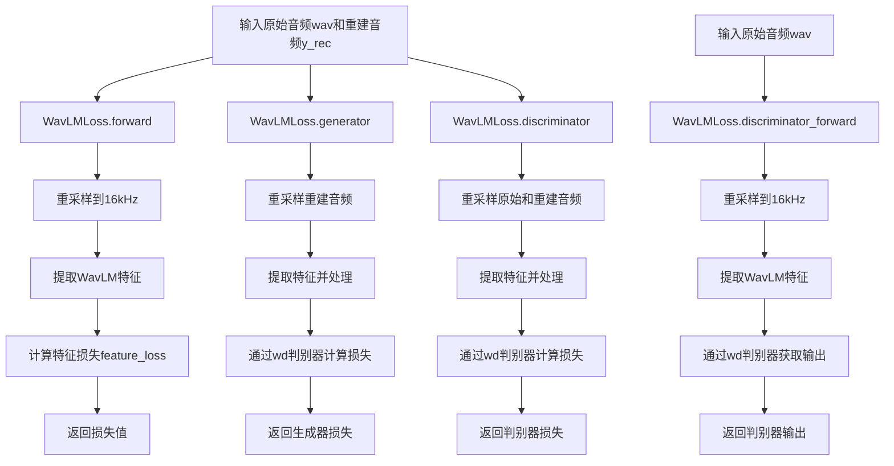
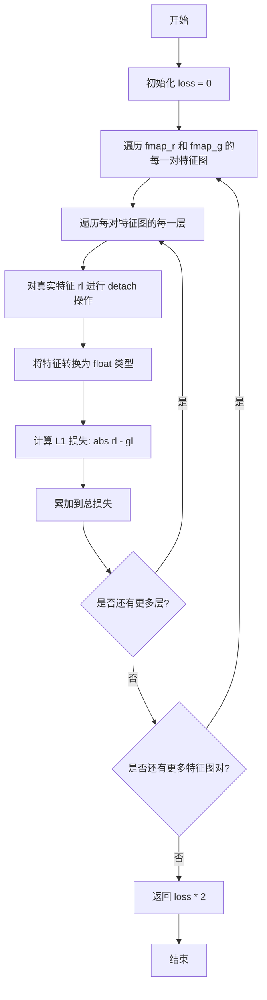
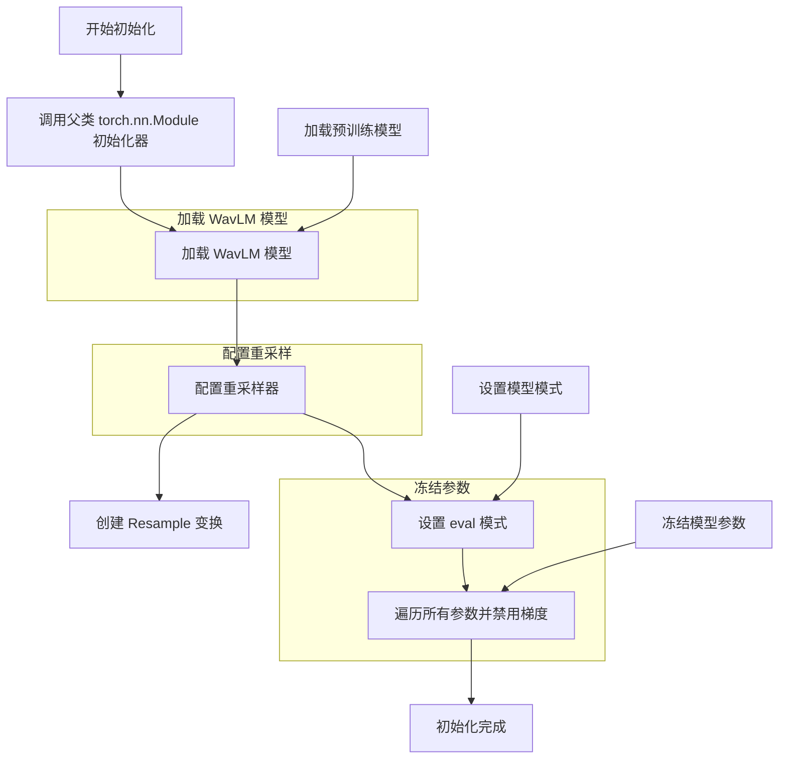
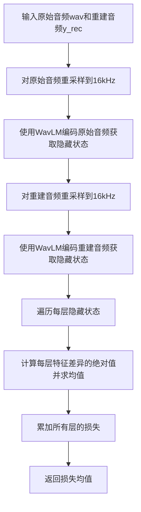
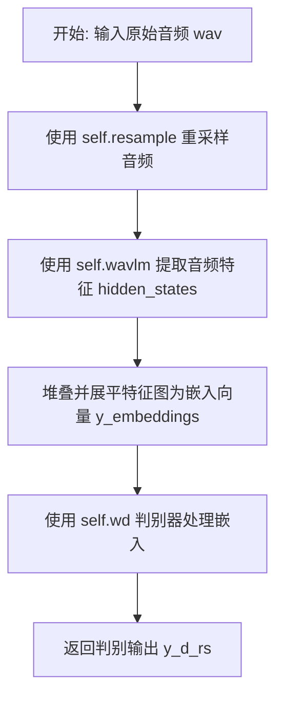

# `Bert-VITS2\losses.py` 详细设计文档

该代码实现了一个基于WavLM预训练模型的音频损失计算模块，用于训练音频生成或转换模型。它包含了特征损失、判别器损失、生成器损失和KL散度损失的计算，并通过WavLMLoss类封装了模型前向传播、生成器和判别器逻辑，以支持对抗训练。

## 整体流程



## 类结构

```
torch.nn.Module (基类)
└── WavLMLoss
```

## 全局变量及字段


### `WavLMLoss.self.wavlm`
    
预训练的WavLM模型，用于提取音频特征

类型：`AutoModel`
    


### `WavLMLoss.self.wd`
    
判别器模型，用于计算对抗损失

类型：`torch.nn.Module`
    


### `WavLMLoss.self.resample`
    
音频重采样变换，将音频采样率转换为16kHz

类型：`torchaudio.transforms.Resample`
    
    

## 全局函数及方法


### `feature_loss`

计算两组特征图（feature map）之间的L1损失，用于衡量生成特征与真实特征之间的差异，常用于GAN（生成对抗网络）中的特征匹配损失。

参数：

- `fmap_r`：`List[List[torch.Tensor]]`，真实特征图列表，通常来自判别器对真实数据的特征提取
- `fmap_g`：`List[List[torch.Tensor]]`，生成特征图列表，通常来自判别器对生成数据的特征提取

返回值：`torch.Tensor`，计算得到的L1损失值（乘以2后返回）

#### 流程图



#### 带注释源码

```python
def feature_loss(fmap_r, fmap_g):
    """
    计算两组特征图之间的L1损失
    
    参数:
        fmap_r: 真实特征图列表，结构为 [layer][batch, channel, ...]
        fmap_g: 生成特征图列表，结构与 fmap_r 相同
    返回:
        L1损失值，乘以2后返回
    """
    # 初始化损失累加器
    loss = 0
    
    # 遍历对应层次的特征图（通常来自不同层的特征提取）
    for dr, dg in zip(fmap_r, fmap_g):
        # 遍历每个特征图批次中的元素
        for rl, gl in zip(dr, dg):
            # 对真实特征进行 detach，阻断反向传播
            # 因为我们只优化生成器的特征匹配损失，不优化真实特征
            rl = rl.float().detach()
            # 生成特征保持可梯度，以便进行反向传播
            gl = gl.float()
            # 计算该层特征的L1损失并累加
            loss += torch.mean(torch.abs(rl - gl))

    # 乘以2作为缩放因子，可能用于平衡不同损失的权重
    return loss * 2
```


### `discriminator_loss`

该函数实现GAN（生成对抗网络）中判别器的损失计算，通过最小化真实样本被判定为"真"（1）和生成样本被判定为"假"（0）的损失来训练判别器，使其能够更好地区分真实样本和生成样本。

参数：

- `disc_real_outputs`：`List[torch.Tensor]`，判别器对真实样本的输出列表，每个元素是一个张量
- `disc_generated_outputs`：`List[torch.Tensor]`，判别器对生成（伪造）样本的输出列表，每个元素是一个张量

返回值：`Tuple[torch.Tensor, List[float], List[float]]`，返回一个元组，包含总损失（标量张量）、真实样本损失列表（浮点数列表）和生成样本损失列表（浮点数列表）

#### 流程图

```mermaid
flowchart TD
    A[开始] --> B[初始化总损失 loss=0]
    B --> C[初始化空列表 r_losses, g_losses]
    C --> D{遍历 disc_real_outputs 和 disc_generated_outputs}
    D -->|对每一对 dr, dg| E[将 dr, dg 转换为 float 类型]
    E --> F[计算真实样本损失: r_loss = mean((1 - dr)²)]
    F --> G[计算生成样本损失: g_loss = mean(dg²)]
    G --> H[累加总损失: loss += r_loss + g_loss]
    H --> I[记录 r_loss.item() 到 r_losses]
    I --> J[记录 g_loss.item() 到 g_losses]
    J --> D
    D -->|遍历结束| K[返回 loss, r_losses, g_losses]
    K --> L[结束]
```

#### 带注释源码

```python
def discriminator_loss(disc_real_outputs, disc_generated_outputs):
    """
    计算判别器的损失函数
    
    使用最小二乘损失（Least Squares GAN）方式：
    - 真实样本期望输出为1，损失为 (1 - dr)²
    - 生成样本期望输出为0，损失为 dg²
    
    参数:
        disc_real_outputs: 判别器对真实样本的输出列表
        disc_generated_outputs: 判别器对生成样本的输出列表
    
    返回:
        loss: 总的判别器损失（用于反向传播）
        r_losses: 每个真实样本输出的损失值列表（用于监控）
        g_losses: 每个生成样本输出的损失值列表（用于监控）
    """
    # 初始化总损失为0
    loss = 0
    # 用于记录每个真实样本输出的损失
    r_losses = []
    # 用于记录每个生成样本输出的损失
    g_losses = []
    
    # 遍历所有判别器输出（支持多尺度/多层判别器）
    for dr, dg in zip(disc_real_outputs, disc_generated_outputs):
        # 确保张量为float类型（用于计算）
        dr = dr.float()
        dg = dg.float()
        
        # 计算真实样本的损失：真实样本应该被判定为1
        # 使用最小二乘损失：(1 - dr)²
        r_loss = torch.mean((1 - dr) ** 2)
        
        # 计算生成样本的损失：生成样本应该被判定为0
        # 使用最小二乘损失：dg²
        g_loss = torch.mean(dg**2)
        
        # 累加总损失
        loss += r_loss + g_loss
        
        # 记录各个输出层的损失值（转换为Python float用于监控）
        r_losses.append(r_loss.item())
        g_losses.append(g_loss.item())
    
    # 返回总损失和分别的损失列表
    return loss, r_losses, g_losses
```


### `generator_loss`

计算生成器（Generator）在GAN（生成对抗网络）中的损失函数。该函数接收判别器对生成样本的输出列表，通过最小化生成样本被判别器识别为真实样本的误差，使生成器学习生成更逼真的样本。

参数：

- `disc_outputs`：`List[torch.Tensor]`，判别器对生成样本的输出列表，每个元素代表一个判别器层或判别器实例的输出

返回值：`Tuple[torch.Tensor, List[torch.Tensor]]`，返回元组包含总损失（标量张量）和每个判别器输出的损失列表

#### 流程图

```mermaid
graph TD
    A[开始] --> B[初始化 loss=0, gen_losses=[]]
    B --> C{遍历 disc_outputs 中的每个 dg}
    C --> D[将 dg 转换为 float 类型]
    D --> E[计算 l = mean((1 - dg)²)]
    E --> F[将 l 添加到 gen_losses 列表]
    F --> G[累加 loss += l]
    G --> H{是否还有下一个 dg}
    H -->|是| C
    H -->|否| I[返回 loss, gen_losses]
```

#### 带注释源码

```python
def generator_loss(disc_outputs):
    """
    计算生成器损失，使生成的样本被判别器认为是真实的
    
    参数:
        disc_outputs: 判别器对生成样本的输出列表
    
    返回:
        loss: 总的生成器损失
        gen_losses: 每个判别器输出的损失列表
    """
    loss = 0  # 初始化总损失为0
    gen_losses = []  # 初始化每个判别器输出的损失列表
    
    # 遍历每个判别器的输出
    for dg in disc_outputs:
        dg = dg.float()  # 将判别器输出转换为float类型，确保计算精度
        l = torch.mean((1 - dg) ** 2)  # 计算生成器损失: (1 - D(G(z)))² 的均值
        gen_losses.append(l)  # 保存每个判别器输出的损失
        loss += l  # 累加总损失
    
    return loss, gen_losses  # 返回总损失和每个输出的损失列表
```


### `kl_loss`

计算KL散度损失，用于衡量两个高斯分布（先验分布p和近似后验分布q）之间的差异，常用于变分自编码器（VAE）或基于流的生成模型中，确保潜在空间正则化。

参数：

- `z_p`：`torch.Tensor`，形状 [batch, hidden, time]，潜在变量的分布均值（近似后验q的均值）
- `logs_q`：`torch.Tensor`，形状 [batch, hidden, time]，潜在变量的对数标准差（近似后验q的对数标准差）
- `m_p`：`torch.Tensor`，形状 [batch, hidden, time]，先验分布p的均值
- `logs_p`：`torch.Tensor`，形状 [batch, hidden, time]，先验分布p的对数标准差
- `z_mask`：`torch.Tensor`，形状 [batch, hidden, time]，用于掩码的二进制张量，用于指定有效时间步

返回值：`torch.Tensor`，标量张量，表示KL散度的平均值（已按有效时间步归一化）

#### 流程图

```mermaid
flowchart TD
    A[开始] --> B[将所有输入转换为float类型]
    B --> C[计算基础KL项: logs_p - logs_q - 0.5]
    C --> D[计算高斯分布KL散度的核心项: 0.5 * ((z_p - m_p)² * exp(-2 * logs_p))]
    D --> E[将基础项与核心项相加]
    E --> F[应用掩码: kl * z_mask]
    F --> G[对掩码后的结果求和]
    G --> H[计算归一化因子: torch.sum(z_mask)]
    H --> I[返回 KL散度 / 归一化因子]
```

#### 带注释源码

```python
def kl_loss(z_p, logs_q, m_p, logs_p, z_mask):
    """
    计算KL散度损失，用于衡量概率分布差异
    
    参数:
        z_p: [b, h, t_t] 潜在变量的分布均值（近似后验q的均值）
        logs_q: [b, h, t_t] 潜在变量的对数标准差（近似后验q的对数标准差）
        m_p: [b, h, t_t] 先验分布p的均值
        logs_p: [b, h, t_t] 先验分布p的对数标准差
        z_mask: [b, h, t_t] 用于掩码的二进制张量，指定有效时间步
    """
    # 将所有输入转换为float类型，确保计算精度
    z_p = z_p.float()
    logs_q = logs_q.float()
    m_p = m_p.float()
    logs_p = logs_p.float()
    z_mask = z_mask.float()

    # 第一部分：计算KL散度的基础项
    # 来源于高斯分布KL散度公式中的 -log(sigma) 部分
    kl = logs_p - logs_q - 0.5
    
    # 第二部分：计算高斯分布KL散度的核心项
    # 源自公式: 0.5 * ((mu_q - mu_p)² / sigma_p²)
    # 其中 sigma_p = exp(logs_p)，所以 sigma_p² = exp(2 * logs_p)
    # 因此: ((z_p - m_p)²) / exp(2 * logs_p) = ((z_p - m_p)²) * exp(-2 * logs_p)
    kl += 0.5 * ((z_p - m_p) ** 2) * torch.exp(-2.0 * logs_p)
    
    # 应用掩码，只计算有效时间步的KL散度
    kl = torch.sum(kl * z_mask)
    
    # 归一化：除以有效时间步的总数，得到平均KL散度
    l = kl / torch.sum(z_mask)
    
    return l
```


### `WavLMLoss.__init__`

初始化 WavLMLoss 类，加载预训练 WavLM 模型和判别器，配置重采样器，并将模型设置为推理模式以准备进行特征提取和损失计算。

参数：

- `model`：`str`，预训练 WavLM 模型的名称或路径，用于从 Hugging Face Transformers 加载模型权重
- `wd`：`torch.nn.Module`，判别器（discriminator）模型实例，用于计算生成器损失和判别器损失
- `model_sr`：`int`，原始音频的采样率，用于配置重采样器的输入采样率
- `slm_sr`：`int`，目标采样率，默认为 16000，用于将高采样率音频重采样到 16kHz 以匹配 WavLM 模型输入要求

返回值：`None`，`__init__` 方法不返回任何值，仅初始化对象状态

#### 流程图



#### 带注释源码

```python
def __init__(self, model, wd, model_sr, slm_sr=16000):
    """
    初始化 WavLMLoss 类，加载预训练模型和判别器
    
    参数:
        model: str, 预训练 WavLM 模型的名称或路径
        wd: torch.nn.Module, 判别器模型实例
        model_sr: int, 原始音频采样率
        slm_sr: int, 目标采样率，默认为 16000
    """
    # 调用父类 torch.nn.Module 的初始化方法
    super(WavLMLoss, self).__init__()
    
    # 使用 Hugging Face Transformers 加载预训练的 WavLM 模型
    # AutoModel.from_pretrained 会自动下载并加载模型权重
    self.wavlm = AutoModel.from_pretrained(model)
    
    # 保存判别器实例到类属性，用于后续的生成器和判别器损失计算
    self.wd = wd
    
    # 创建重采样变换对象，将音频从 model_sr 重采样到 slm_sr
    # WavLM 模型通常接受 16kHz 的音频输入
    self.resample = torchaudio.transforms.Resample(model_sr, slm_sr)
    
    # 将 WavLM 模型设置为评估模式
    # 评估模式会禁用 dropout 等训练特有的层
    self.wavlm.eval()
    
    # 冻结 WavLM 模型的所有参数，不参与梯度计算
    # 因为 WavLM 只用于提取特征，不需要训练它
    for param in self.wavlm.parameters():
        param.requires_grad = False
```


### `WavLMLoss.forward`

计算原始音频和重建音频在WavLM模型隐藏状态层面的特征损失，用于衡量两者在语义特征表示上的差异。

参数：

- `self`：WavLMLoss类实例，隐含参数
- `wav`：`torch.Tensor`，原始音频张量，形状为 [batch, time] 或类似
- `y_rec`：`torch.Tensor`，重建音频张量，形状为 [batch, time] 或类似

返回值：`torch.Tensor`，标量张量，表示原始音频与重建音频之间的平均特征损失

#### 流程图



#### 带注释源码

```
def forward(self, wav, y_rec):
    # 使用torch.no_grad()上下文管理器，禁用梯度计算以提高推理效率
    with torch.no_grad():
        # 将原始音频重采样到16kHz（WavLM所需的采样率）
        wav_16 = self.resample(wav)
        # 使用WavLM模型提取原始音频的隐藏状态特征
        # output_hidden_states=True 返回所有层的隐藏状态
        wav_embeddings = self.wavlm(
            input_values=wav_16, output_hidden_states=True
        ).hidden_states
    
    # 对重建音频进行相同的重采样操作
    y_rec_16 = self.resample(y_rec)
    # 使用WavLM模型提取重建音频的隐藏状态特征
    # 注意：这里对y_rec_16进行了squeeze()操作，可能是因为维度处理
    y_rec_embeddings = self.wavlm(
        input_values=y_rec_16.squeeze(), output_hidden_states=True
    ).hidden_states

    # 初始化特征损失累加器
    floss = 0
    # 遍历原始音频和重建音频对应的每一层隐藏状态
    for er, eg in zip(wav_embeddings, y_rec_embeddings):
        # 计算该层特征差异的绝对值，然后求均值，累加到总损失
        floss += torch.mean(torch.abs(er - eg))

    # 返回所有层损失的平均值作为最终特征损失
    return floss.mean()
```


### `WavLMLoss.generator`

该方法用于计算生成器（Generator）的对抗损失（Adversarial Loss）。在基于WavLM的语音重建或转换任务中，它接收重建的音频波形，提取其特征表示，将其通过判别器（`self.wd`），并计算典型的最小二乘GAN（LS-GAN）损失。该损失驱动生成器产生被判别器误判为“真实”的音频。

参数：
- `y_rec`：`torch.Tensor`，重构的音频波形（通常来自生成器或解码器的输出）。

返回值：`torch.Tensor`，标量张量，表示生成器的最小二乘对抗损失。

#### 流程图

```mermaid
graph TD
    A[输入: y_rec] --> B[重采样: self.resample]
    B --> C[特征提取: self.wavlm]
    C --> D[嵌入处理: Stack & Flatten]
    D --> E[判别器前向: self.wd]
    E --> F[损失计算: mean((1 - pred)^2)]
    F --> G[输出: loss_gen]
```

#### 带注释源码

```python
def generator(self, y_rec):
    """
    计算生成器损失，用于更新生成器。

    Args:
        y_rec (torch.Tensor): 重建的音频波形。

    Returns:
        torch.Tensor: 标量损失值。
    """
    # 步骤1: 将重建的音频重采样到16kHz
    # WavLM模型通常在16kHz上训练或表现最佳
    y_rec_16 = self.resample(y_rec)
    
    # 步骤2: 使用冻结的WavLM模型提取特征嵌入
    # input_values: 输入音频
    # output_hidden_states: 返回所有transformer层的隐藏状态
    y_rec_embeddings = self.wavlm(
        input_values=y_rec_16, 
        output_hidden_states=True
    ).hidden_states
    
    # 步骤3: 预处理嵌入向量
    # 为了适配后续的判别器，需要对嵌入进行维度变换
    # 1. torch.stack: 将所有层的隐藏状态堆叠 [Batch, Layers, Time, Feature]
    # 2. transpose: 交换最后两个维度 [Batch, Layers, Feature, Time]
    # 3. flatten: 合并层和时间维度 [Batch, Layers*Time, Feature]
    y_rec_embeddings = (
        torch.stack(y_rec_embeddings, dim=1)
        .transpose(-1, -2)
        .flatten(start_dim=1, end_dim=2)
    )
    
    # 步骤4: 将处理好的嵌入传入判别器网络 (wd)
    # y_df_hat_g 是判别器对"生成音频"的预测结果
    y_df_hat_g = self.wd(y_rec_embeddings)
    
    # 步骤5: 计算最小二乘生成器损失
    # 目标：让判别器认为生成音频是"真"的 (标签为 1)
    # Loss = mean((1 - D(G(z)))^2)
    loss_gen = torch.mean((1 - y_df_hat_g) ** 2)

    return loss_gen
```


### `WavLMLoss.discriminator`

计算判别器损失（Discriminator Loss），用于更新判别器。该方法首先对原始音频和重建音频进行重采样，然后使用WavLM模型提取各自的隐藏状态嵌入，接着将嵌入展平后送入判别器网络，最后计算真实音频和生成音频的判别损失之和。

参数：

- `wav`：`torch.Tensor`，原始输入音频波形
- `y_rec`：`torch.Tensor`，重建的音频波形（来自生成器）

返回值：`torch.Tensor`，判别器损失的平均值（标量）

#### 流程图

```mermaid
flowchart TD
    A[输入 wav, y_rec] --> B[重采样到16kHz]
    B --> C[使用WavLM提取原始音频嵌入]
    B --> D[使用WavLM提取重建音频嵌入]
    C --> E[堆栈、转置、展平原始音频嵌入]
    D --> F[堆栈、转置、展平重建音频嵌入]
    E --> G[判别器处理原始音频嵌入 y_d_rs]
    F --> H[判别器处理重建音频嵌入 y_d_gs]
    G --> I[计算真实音频损失: mean((1 - y_df_hat_r)²)]
    H --> J[计算生成音频损失: mean(y_df_hat_g²)]
    I --> K[总损失 = r_loss + g_loss]
    J --> K
    K --> L[返回损失均值]
```

#### 带注释源码

```python
def discriminator(self, wav, y_rec):
    """
    计算判别器损失，用于更新判别器
    
    参数:
        wav: 原始输入音频 tensor
        y_rec: 重建音频 tensor（生成器输出）
    
    返回:
        判别器损失均值 tensor
    """
    # 使用torch.no_grad()上下文管理器，禁用梯度计算以提高效率
    with torch.no_grad():
        # 1. 对原始音频进行重采样到16kHz（WavLM所需采样率）
        wav_16 = self.resample(wav)
        
        # 2. 使用WavLM模型提取原始音频的隐藏状态嵌入
        wav_embeddings = self.wavlm(
            input_values=wav_16, output_hidden_states=True
        ).hidden_states
        
        # 3. 对重建音频进行重采样到16kHz
        y_rec_16 = self.resample(y_rec)
        
        # 4. 使用WavLM模型提取重建音频的隐藏状态嵌入
        y_rec_embeddings = self.wavlm(
            input_values=y_rec_16, output_hidden_states=True
        ).hidden_states

        # 5. 对原始音频嵌入进行形状变换：
        #    - torch.stack 将多个隐藏状态层堆叠成一个张量 [b, num_layers, hidden_dim, time]
        #    - transpose 将维度重新排列 [b, num_layers, time, hidden_dim]
        #    - flatten 将空间维度展平 [b, num_layers*time, hidden_dim]
        y_embeddings = (
            torch.stack(wav_embeddings, dim=1)
            .transpose(-1, -2)
            .flatten(start_dim=1, end_dim=2)
        )
        
        # 6. 对重建音频嵌入进行相同的形状变换
        y_rec_embeddings = (
            torch.stack(y_rec_embeddings, dim=1)
            .transpose(-1, -2)
            .flatten(start_dim=1, end_dim=2)
        )

    # 7. 将处理后的嵌入送入判别器网络
    y_d_rs = self.wd(y_embeddings)      # 原始音频的判别器输出
    y_d_gs = self.wd(y_rec_embeddings)  # 重建音频的判别器输出

    # 8. 解包判别器输出
    y_df_hat_r, y_df_hat_g = y_d_rs, y_d_gs

    # 9. 计算真实音频的判别损失：让判别器对真实音频输出接近1
    #    loss = mean((1 - D(real))²) 
    r_loss = torch.mean((1 - y_df_hat_r) ** 2)
    
    # 10. 计算生成音频的判别损失：让判别器对生成音频输出接近0
    #     loss = mean(D(fake)²)
    g_loss = torch.mean((y_df_hat_g) ** 2)

    # 11. 合并总损失
    loss_disc_f = r_loss + g_loss

    # 12. 返回损失均值（标量）
    return loss_disc_f.mean()
```


### `WavLMLoss.discriminator_forward`

该方法为 `WavLMLoss` 类中的判别器前向传播函数，用于接收原始音频并提取其判别特征表示。它首先对原始音频进行重采样以匹配 WavLM 模型的输入要求，随后提取深度特征，并将多层特征图展平后送入判别器网络，最终输出原始音频的判别得分。

参数：

- `wav`：`torch.Tensor`，原始输入音频张量，通常来自数据加载器，形状为 [batch, time] 或类似形式。

返回值：`torch.Tensor`，判别器对原始音频的输出得分，通常为 [batch, 1] 或 [batch] 维度的张量，用于后续计算对抗损失。

#### 流程图



#### 带注释源码

```python
def discriminator_forward(self, wav):
    """
    执行判别器的前向传播，获取原始音频的判别输出。

    参数:
        wav (torch.Tensor): 原始音频张量。

    返回值:
        torch.Tensor: 判别器对原始音频的输出。
    """
    # 1. 使用 torch.no_grad() 上下文管理器，禁用梯度计算，提升推理性能并节省显存
    with torch.no_grad():
        # 2. 音频重采样：将原始音频 wav 从模型采样率重采样到 16kHz (slm_sr)
        #    WavLM 模型通常在 16kHz 或 16.05kHz 上训练，此处统一为 16kHz
        wav_16 = self.resample(wav)
        
        # 3. 特征提取：调用 WavLM 模型提取音频的深度特征
        #    output_hidden_states=True 表示返回所有层的隐藏状态，而非仅最后一层
        wav_embeddings = self.wavlm(
            input_values=wav_16, output_hidden_states=True
        ).hidden_states
        #    wav_embeddings 是一个元组或列表，包含了 L 层隐藏状态，每层形状为 [batch, time, hidden_dim]

        # 4. 特征处理：
        #    - torch.stack(wav_embeddings, dim=1): 将各层隐藏状态在新增的维度(第1维)堆叠，形状变为 [batch, layers, time, hidden_dim]
        #    .transpose(-1, -2): 交换最后两个维度，将 time 和 hidden_dim 交换，变为 [batch, layers, hidden_dim, time]
        #    .flatten(start_dim=1, end_dim=2): 展平第1维(layers)和第2维(hidden_dim)，最终形状变为 [batch, layers*hidden_dim, time]
        #    这相当于将多层特征图在通道维度上拼接，以捕获更丰富的时序信息
        y_embeddings = (
            torch.stack(wav_embeddings, dim=1)
            .transpose(-1, -2)
            .flatten(start_dim=1, end_dim=2)
        )

    # 5. 判别前向传播：将处理好的音频嵌入特征传入判别器网络 (self.wd)
    #    wd 通常是一个卷积判别器 (Discriminator)，用于区分真实音频与生成音频的特征
    y_d_rs = self.wd(y_embeddings)

    # 6. 返回原始音频的判别输出 y_d_rs
    return y_d_rs
```


## 关键组件


### 特征损失函数 (feature_loss)

计算真实特征图与生成特征图之间的L1损失，用于衡量特征表示的差异

### 判别器损失函数 (discriminator_loss)

计算GAN判别器的损失，结合真实样本（期望输出接近1）和生成样本（期望输出接近0）的损失

### 生成器损失函数 (generator_loss)

计算GAN生成器的损失，使生成样本尽可能骗过判别器（期望判别器输出接近1）

### KL散度损失函数 (kl_loss)

计算潜在空间中先验分布与后验分布之间的KL散度损失，用于正则化潜在变量

### WavLMLoss 类

封装WavLM模型和损失计算的核心类，提供前向传播、生成器和判别器的前向传播功能

### WavLM 模型集成

使用HuggingFace的AutoModel加载预训练WavLM模型，用于提取音频特征表示

### 音频重采样模块

使用torchaudio的Resample将音频从模型采样率转换到SLM采样率（16kHz）

### 特征嵌入处理

将WavLM的多层隐藏状态堆叠、转置和展平，生成用于判别器的特征向量

### 梯度阻断机制

通过detach()和torch.no_grad()确保WavLM特征提取不参与梯度计算，仅训练生成器和判别器


## 问题及建议


### 已知问题

-   **重复代码片段**：在`forward`、`generator`和`discriminator`方法中存在大量重复的wavlm推理和embedding处理逻辑（如resample、stack、transpose、flatten操作），违反DRY原则
-   **推理效率低下**：`discriminator`方法对wav和y_rec分别进行独立的wavlm推理，而实际上可以在外部缓存wav的embedding后再传入
-   **不必要的张量操作**：`forward`方法中返回`floss.mean()`，但外层循环已经对每层embedding计算了mean，内层又做一次mean可能导致计算冗余
-   **变量命名不清晰**：如`y_rec`、`y_df_hat_g`、`wd`等缩写命名可读性差，增加了维护成本
-   **设备迁移缺失**：代码未处理模型和数据的设备（CPU/GPU）移动，可能导致设备不匹配错误
-   **错误处理不足**：`AutoModel.from_pretrained`调用缺乏异常处理，网络连接失败时程序会直接崩溃
-   **内存占用风险**：保存完整hidden_states（通过`output_hidden_states=True`）对长音频场景内存消耗较大
-   **返回值不一致**：全局函数`generator_loss`返回`(loss, gen_losses)`，而`discriminator_loss`返回`(loss, r_losses, g_losses)`，这种不一致增加了调用方适配的复杂度

### 优化建议

-   **提取公共方法**：创建私有方法如`_get_wavlm_embeddings(wav)`和`_process_embeddings(embeddings)`，将重复的推理和处理逻辑封装起来
-   **添加缓存机制**：在类中维护wav_embeddings的缓存或要求调用方预先计算，避免discriminator中的重复推理
-   **统一返回值格式**：将所有loss函数返回值格式统一为字典或命名元组，提高API一致性
-   **添加设备管理**：在`__init__`中添加`self.device = torch.device('cuda' if torch.cuda.is_available() else 'cpu')`，并将模型移至对应设备
-   **改进变量命名**：`y_rec`→`reconstructed_waveform`、`wd`→`waveform_discriminator`、`slm_sr`→`target_sample_rate`
-   **增加错误处理**：对模型加载添加try-except块，并提供fallback机制或清晰的错误信息
-   **优化内存使用**：考虑使用`hidden_states`的部分层或添加参数控制返回的层数
-   **使用torch.no_grad()**：在所有推理场景中明确使用`torch.no_grad()`上下文管理器，确保不计算梯度
-   **配置化设计**：将硬编码的采样率等参数提取为配置文件或构造函数参数


## 其它


### 设计目标与约束

本模块的设计目标是实现WavLM自监督学习模型在语音生成任务中的损失计算功能，支持特征损失、判别器损失和生成器损失的计算。设计约束包括：(1) WavLM模型在推理模式下运行，参数不参与梯度计算；(2) 支持不同采样率的音频输入，通过重采样统一到16kHz；(3) 判别器和生成器损失基于GAN对抗训练架构设计。

### 错误处理与异常设计

代码中的错误处理主要包括：(1) 使用torch.no_grad()确保推理过程不产生梯度；(2) 对音频输入进行squeeze操作处理可能的多余维度；(3) 通过float()转换确保张量类型一致性。潜在异常包括：输入采样率与模型采样率不匹配导致重采样失败、WavLM模型加载失败、音频长度不一致导致embedding对齐问题等。建议添加输入验证、模型加载重试机制和详细的错误日志。

### 数据流与状态机

数据流主要分为三条路径：(1) 特征损失计算路径：原始音频和重建音频分别经过WavLM提取embedding，计算逐层特征差异；(2) 判别器损失计算路径：原始音频和重建音频的embedding通过判别器网络，计算真实/生成音频的判别损失；(3) 生成器损失计算路径：重建音频embedding通过判别器，计算生成器对抗损失。状态机主要涉及WavLM模型的eval()训练状态切换，确保推理模式下的一致性。

### 外部依赖与接口契约

主要外部依赖包括：(1) torch >= 1.9.0 - 张量计算和神经网络基础；(2) torchaudio >= 0.9.0 - 音频重采样；(3) transformers >= 4.20.0 - WavLM预训练模型加载。接口契约方面：forward()方法接收wav和y_rec两个张量，返回特征损失标量；generator()方法接收重建音频，返回生成器损失；discriminator()方法接收原始音频和重建音频，返回判别器损失；discriminator_forward()方法接收原始音频，返回判别器输出。

### 性能考虑与优化空间

当前实现的主要性能瓶颈包括：(1) WavLM模型对每个音频样本进行两次推理（原始音频和重建音频），存在重复计算；(2) embedding堆叠和变换操作可以进一步优化；(3) 缺少批处理支持。优化建议：使用torch.jit.script加速、引入缓存机制存储WavLM输出、实现批处理推理、考虑使用ONNXRuntime加速推理。

### 资源管理

WavLM模型加载占用约1GB显存，需要在实例化时确保GPU内存充足。音频重采样操作内存占用较小。模型参数设置param.requires_grad = False以避免不必要的梯度存储。长期运行时应注意定期清理中间张量引用，避免内存泄漏。

### 版本兼容性

代码依赖的transformers库中WavLM的API可能随版本变化，output_hidden_states参数的返回格式可能在不同版本间有差异。建议锁定transformers版本或添加版本检测逻辑。torch和torchaudio版本兼容性也需要确保，torchaudio.transforms.Resample在0.10.0版本后API有变化。

### 测试策略

建议的测试内容包括：(1) 单元测试：验证各损失函数的数学正确性；(2) 集成测试：验证WavLM模型加载和推理流程；(3) 边界测试：处理空音频、单样本、极端采样率等情况；(4) 性能测试：评估推理速度和内存占用；(5) 梯度流测试：确保推理模式下不产生梯度。

### 监控和日志

建议添加以下监控点：(1) WavLM模型加载状态和耗时；(2) 各损失函数的数值范围监控，检测NaN/Inf；(3) 音频重采样前后的长度变化；(4) GPU内存使用情况。日志级别建议：INFO级别记录正常的推理流程，WARNING级别记录异常输入，ERROR级别记录模型加载失败等严重问题。

### 配置管理

当前配置通过构造函数参数传入，包括：model（WavLM模型名称或路径）、wd（判别器模型）、model_sr（输入模型采样率）、slm_sr（SLM目标采样率，默认16kHz）。建议将配置参数化，支持从配置文件或环境变量加载，便于在不同部署环境中切换。

    