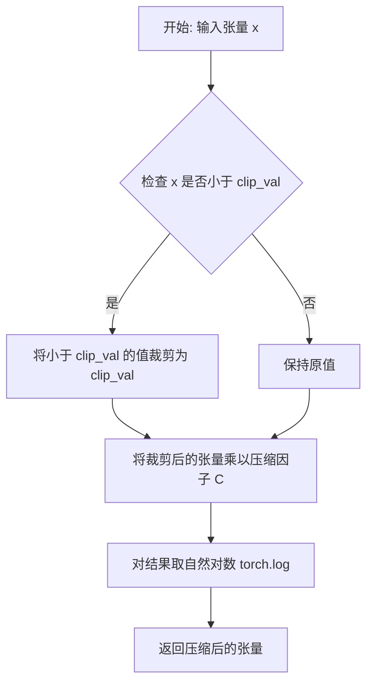
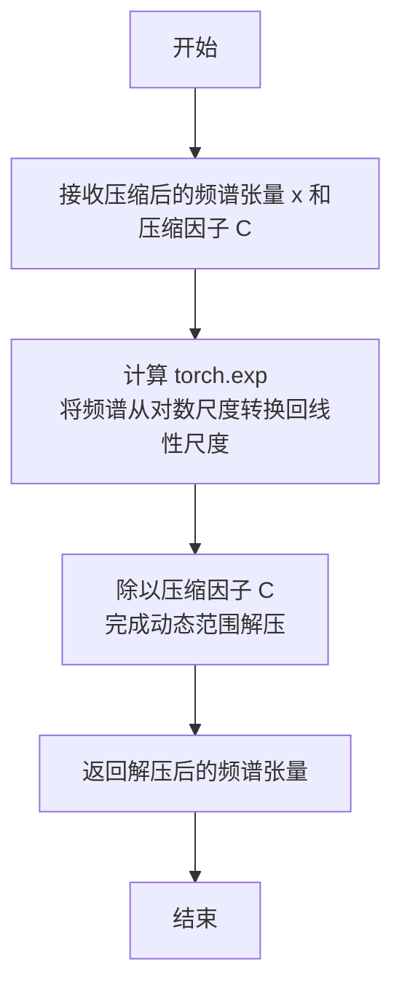
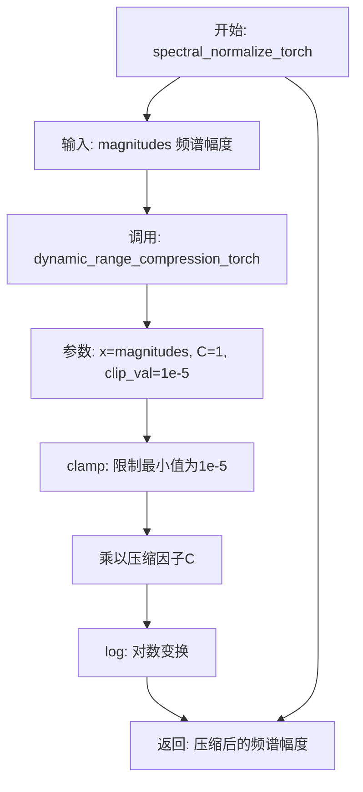
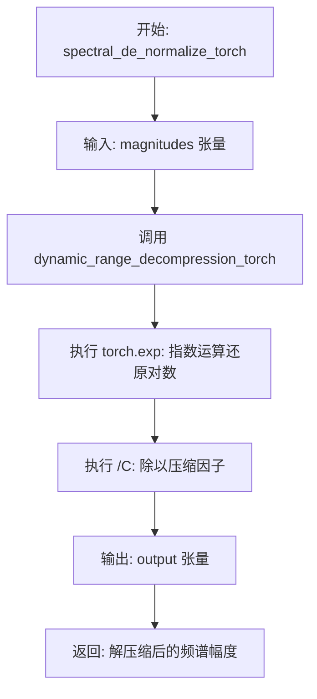
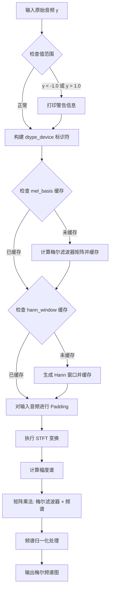
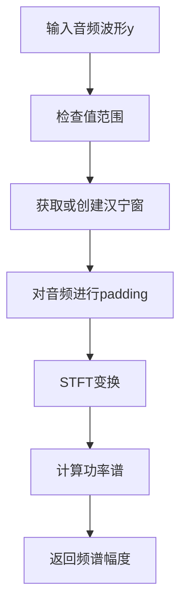

# `Bert-VITS2\mel_processing.py` 详细设计文档

这是一个音频频谱处理工具库，主要实现将原始音频波形（1D张量）通过短时傅里叶变换（STFT）转换为梅尔频谱图（Mel Spectrogram），支持动态范围压缩/解压缩、频谱归一化等操作，常用于语音合成（TTS）、语音识别（ASR）等模型的音频特征提取。

## 整体流程

```mermaid
graph TD
    A[输入原始音频波形 y] --> B{检查波形值范围}
    B -->|超出[-1,1]| C[打印警告信息]
    B -->|正常| D[获取或创建Hann Window]
    D --> E[对波形进行Padding]
    E --> F[执行STFT变换]
    F --> G[计算频谱幅度]
    G --> H[获取或创建Mel滤波器]
    H --> I[执行Matmul变换到Mel域]
    I --> J[动态范围归一化]
    J --> K[输出Mel Spectrogram]
```

## 类结构

```
全局变量 (Global Variables)
├── MAX_WAV_VALUE (浮点数常量)
├── mel_basis (字典 - Mel滤波器缓存)
└── hann_window (字典 - Hann窗口缓存)

辅助函数 (Helper Functions)
├── dynamic_range_compression_torch
├── dynamic_range_decompression_torch
├── spectral_normalize_torch
└── spectral_de_normalize_torch

核心处理函数 (Core Processing Functions)
├── spectrogram_torch
├── spec_to_mel_torch
└── mel_spectrogram_torch
```

## 全局变量及字段


### `MAX_WAV_VALUE`
    
音频归一化常数值，表示wav音频的最大幅度值（32768.0），用于将音频信号归一化到[-1, 1]范围

类型：`float`
    


### `mel_basis`
    
全局缓存字典，用于存储不同设备和数据类型对应的mel滤波器组矩阵，避免重复计算

类型：`dict`
    


### `hann_window`
    
全局缓存字典，用于存储不同窗口大小、设备和数据类型对应的汉宁窗函数，避免重复创建

类型：`dict`
    


    

## 全局函数及方法


### `dynamic_range_compression_torch`

该函数实现音频信号的动态范围压缩，通过对输入张量进行最小值裁剪、线性缩放后取对数变换，将广泛的动态范围压缩到较小的数值范围内，常用于音频频谱归一化处理。

参数：

- `x`：`torch.Tensor`，输入的需要进行动态范围压缩的张量（通常为音频频谱幅度值）
- `C`：`float`，压缩因子，用于对裁剪后的数据进行线性缩放，默认为 1.0
- `clip_val`：`float`，最小裁剪阈值，用于避免对数运算时出现零值或负值，默认为 1e-5

返回值：`torch.Tensor`，返回经过对数压缩后的张量，数值范围被压缩到 log(clip_val * C) 到正无穷区间

#### 流程图



#### 带注释源码

```python
def dynamic_range_compression_torch(x, C=1, clip_val=1e-5):
    """
    对输入张量进行动态范围压缩（对数变换）
    
    PARAMS
    ------
    x: 输入张量，通常为音频频谱的幅度值
    C: compression factor，压缩因子，用于控制缩放比例
    clip_val: 裁剪阈值，防止对数运算时出现无效值
    
    RETURN
    ------
    返回对数压缩后的张量
    """
    # 步骤1: 使用 clamp 函数对输入张量进行最小值裁剪
    # 确保所有值都不小于 clip_val，避免 log(0) 或 log(负数) 导致的数学错误
    clamped_x = torch.clamp(x, min=clip_val)
    
    # 步骤2: 将裁剪后的值乘以压缩因子 C，进行线性缩放
    scaled_x = clamped_x * C
    
    # 步骤3: 对缩放后的值取自然对数，完成动态范围压缩
    # 对数变换能够将宽广的动态范围压缩到较小的数值区间
    compressed = torch.log(scaled_x)
    
    return compressed
```


### `dynamic_range_decompression_torch`

该函数是音频频谱动态范围解压缩的PyTorch实现，用于将经过对数压缩的频谱数据恢复到线性尺度，是音频频谱归一化与反归一化处理中的关键环节。

参数：

- `x`：`torch.Tensor`，经过动态范围压缩（对数变换）后的频谱张量
- `C`：`float`，压缩因子（默认值1.0），用于压缩时的缩放系数

返回值：`torch.Tensor`，解压后的线性尺度频谱张量

#### 流程图



#### 带注释源码

```python
def dynamic_range_decompression_torch(x, C=1):
    """
    动态范围解压缩函数（PyTorch版本）
    
    该函数是 dynamic_range_compression_torch 的逆操作，将经过对数压缩的频谱
    数据从对数尺度恢复到线性尺度。在音频处理流水线中，通常与频谱归一化配合使用，
    用于将梅尔频谱从压缩状态恢复到原始线性幅度表示。
    
    PARAMS
    ------
    x : torch.Tensor
        经过 dynamic_range_compression_torch 压缩后的频谱张量
        通常是通过对数变换压缩后的梅尔频谱或幅度谱
    C : float, optional
        compression factor，压缩因子
        必须与压缩时使用的 C 值保持一致，否则无法正确还原
        默认值为 1.0，表示无缩放压缩
    
    RETURNS
    -------
    torch.Tensor
        解压后的线性尺度频谱张量，数值范围恢复到原始动态范围
    
    数学公式
    --------
    解压操作: y = exp(x) / C
    
    其中:
    - x 是压缩后的对数频谱 (log(C * x_original))
    - C 是压缩因子
    - y 是恢复后的线性频谱 (x_original)
    
    使用示例
    --------
    >>> import torch
    >>> # 原始频谱
    >>> original_spec = torch.tensor([0.5, 1.0, 2.0])
    >>> # 压缩
    >>> compressed = dynamic_range_compression_torch(original_spec, C=1)
    >>> # 解压
    >>> decompressed = dynamic_range_decompression_torch(compressed, C=1)
    >>> # 验证恢复效果
    >>> torch.allclose(original_spec, decompressed, atol=1e-6)
    True
    """
    return torch.exp(x) / C
```


### `spectral_normalize_torch`

该函数用于对音频频谱幅度进行动态范围压缩处理，是音频处理流程中的标准化步骤，通过对数变换将幅度值映射到更易于处理的范围，常用于梅尔频谱计算后的归一化操作。

参数：

- `magnitudes`：`torch.Tensor`，输入的频谱幅度张量，通常为非负值

返回值：`torch.Tensor`，经过动态范围压缩后的频谱幅度张量

#### 流程图



#### 带注释源码

```python
def spectral_normalize_torch(magnitudes):
    """
    对频谱幅度进行动态范围压缩（对数变换）
    
    参数:
        magnitudes: 输入的频谱幅度张量
        
    返回值:
        经过对数压缩处理的频谱幅度张量
    """
    # 调用动态范围压缩函数，默认为对数压缩
    output = dynamic_range_compression_torch(magnitudes)
    # 返回压缩后的结果
    return output
```


### `spectral_de_normalize_torch`

该函数是音频频谱处理流程中的反归一化操作，用于将经过对数压缩的频谱幅度值还原为原始的线性尺度。它是 `spectral_normalize_torch` 的逆操作，常用于从梅尔频谱恢复到原始频谱幅度的场景。

参数：

- `magnitudes`：`torch.Tensor`，经过对数压缩的频谱幅度张量，通常是经过 `spectral_normalize_torch` 处理后的结果

返回值：`torch.Tensor`，解压缩后的原始线性尺度频谱幅度张量

#### 流程图



#### 带注释源码

```python
def spectral_de_normalize_torch(magnitudes):
    """
    频谱反归一化函数，将对数压缩后的频谱幅度还原为线性尺度
    
    该函数是 spectral_normalize_torch 的逆操作
    通过动态范围解压缩将压缩后的值还原
    
    PARAMS
    ------
    magnitudes: torch.Tensor, 经过 spectral_normalize_torch 处理的张量
    
    RETURNS
    -------
    output: torch.Tensor, 解压缩后的原始幅度值
    """
    # 调用动态范围解压缩函数
    # 内部实现: torch.exp(magnitudes) / C
    # 其中 C 默认为 1，因此简化为 torch.exp(magnitudes)
    output = dynamic_range_decompression_torch(magnitudes)
    return output
```

---

#### 相关函数参考：`dynamic_range_decompression_torch`

```python
def dynamic_range_decompression_torch(x, C=1):
    """
    动态范围解压缩函数
    
    PARAMS
    ------
    x: torch.Tensor, 输入张量（对数域）
    C: int/float, 压缩因子，默认为1
    
    RETURNS
    -------
    torch.Tensor: 解压缩后的张量
    """
    return torch.exp(x) / C
```


### `spectrogram_torch`

将输入的音频波形数据通过短时傅里叶变换（STFT）转换为频谱图（spectrogram），计算功率谱并返回。该函数支持自定义FFT窗口大小、帧移和窗口长度，并使用汉宁窗进行时频变换。

参数：

- `y`：`torch.Tensor`，输入的一维音频波形数据，值域应在[-1.0, 1.0]范围内
- `n_fft`：`int`，FFT窗口大小，决定频率分辨率
- `sampling_rate`：`int`，音频采样率（当前实现中未直接使用，仅作为接口保留）
- `hop_size`：`int`，帧移（hop length），即相邻帧之间的采样点数
- `win_size`：`int`，窗口大小，用于STFT的窗口长度
- `center`：`bool`，是否使用中心对齐的STFT，默认为False

返回值：`torch.Tensor`，返回频谱图，形状为`(batch, freq, time)`，其中freq = n_fft // 2 + 1

#### 流程图

```mermaid
flowchart TD
    A[开始: 输入波形 y] --> B{检查输入值范围}
    B -->|y < -1.0| C[打印警告: min value]
    B -->|y > 1.0| D[打印警告: max value]
    C --> E[构建缓存键]
    D --> E
    B -->|值正常| E
    E --> F{缓存键是否存在?}
    F -->|否| G[创建汉宁窗并缓存]
    F -->|是| H[直接获取缓存的汉宁窗]
    G --> I[对输入进行padding]
    H --> I
    I --> J[执行STFT变换]
    J --> K[计算功率谱: sqrt(sum² + epsilon)]
    K --> L[返回频谱图]
```

#### 带注释源码

```python
def spectrogram_torch(y, n_fft, sampling_rate, hop_size, win_size, center=False):
    """
    将音频波形转换为频谱图（spectrogram）
    
    参数:
        y: 输入的音频波形 tensor
        n_fft: FFT窗口大小
        sampling_rate: 采样率（当前版本未直接使用）
        hop_size: 帧移大小
        win_size: 窗口大小
        center: 是否中心对齐
    
    返回:
        频谱图 tensor
    """
    # ========== 输入校验 ==========
    # 检查波形值是否在有效范围内，-1.0到1.0是归一化音频的典型范围
    if torch.min(y) < -1.0:
        print("min value is ", torch.min(y))
    if torch.max(y) > 1.0:
        print("max value is ", torch.max(y))

    # ========== 汉宁窗缓存管理 ==========
    # 使用全局字典缓存不同配置下的汉宁窗，避免重复创建
    global hann_window
    # 构建缓存键：包含窗口大小、数据类型和设备信息
    # 例如: "1024_float32_cuda:0"
    dtype_device = str(y.dtype) + "_" + str(y.device)
    wnsize_dtype_device = str(win_size) + "_" + dtype_device
    # 缓存命中检查：不同窗口大小或设备需要不同的窗函数
    if wnsize_dtype_device not in hann_window:
        # 创建汉宁窗并转换为与输入相同的dtype和device
        hann_window[wnsize_dtype_device] = torch.hann_window(win_size).to(
            dtype=y.dtype, device=y.device
        )

    # ========== 信号填充 ==========
    # 对输入进行对称填充，以实现center=False时的因果STFT
    # 填充长度 = (n_fft - hop_size) / 2，两侧各填充一半
    # unsqueeze(1) -> squeeze(1) 的目的是为了适应pad接口的维度要求
    y = torch.nn.functional.pad(
        y.unsqueeze(1),
        (int((n_fft - hop_size) / 2), int((n_fft - hop_size) / 2)),
        mode="reflect",
    )
    y = y.squeeze(1)

    # ========== STFT变换 ==========
    # 使用PyTorch的STFT函数进行短时傅里叶变换
    # 参数说明:
    # - hop_length: 帧移
    # - win_length: 窗口长度
    # - window: 汉宁窗
    # - center: 中心对齐（保持与填充兼容）
    # - pad_mode: 填充模式
    # - normalized: 是否归一化
    # - onesided: 只返回一半频率（由于实信号STFT的对称性）
    # - return_complex: 返回复数形式
    spec = torch.stft(
        y,
        n_fft,
        hop_length=hop_size,
        win_length=win_size,
        window=hann_window[wnsize_dtype_device],
        center=center,
        pad_mode="reflect",
        normalized=False,
        onesided=True,
        return_complex=False,
    )

    # ========== 功率谱计算 ==========
    # 将复数频谱转换为功率谱: |X|^2 = Re² + Im²
    # 然后开平方得到幅度谱
    # 添加1e-6防止数值稳定性问题（避免log(0)或梯度爆炸）
    spec = torch.sqrt(spec.pow(2).sum(-1) + 1e-6)
    return spec
```


### `spec_to_mel_torch`

该函数将线性声谱图（Linear Spectrogram）转换为Mel声谱图（Mel Spectrogram），利用librosa生成的Mel滤波器组进行矩阵乘法运算，并使用动态范围压缩进行频谱归一化处理。

参数：

-  `spec`：`torch.Tensor`，输入的线性声谱图 tensor，形状为 (batch, freq, time)
-  `n_fft`：`int`，FFT窗口大小，用于生成Mel滤波器的参数
-  `num_mels`：`int`，Mel声谱图的通道数（即Mel滤波器的数量）
-  `sampling_rate`：`int`，音频采样率，用于计算Mel滤波器
-  `fmin`：`float`，Mel滤波器的最小频率阈值
-  `fmax`：`float`，Mel滤波器的最大频率阈值

返回值：`torch.Tensor`，经过Mel滤波器组变换并归一化后的Mel声谱图

#### 流程图

```mermaid
flowchart TD
    A[开始: spec_to_mel_torch] --> B[获取全局 mel_basis 缓存]
    B --> C{检查 fmax_dtype_device 是否在缓存中?}
    C -->|否| D[使用 librosa_mel_fn 计算Mel滤波器矩阵]
    D --> E[将numpy数组转换为torch.Tensor]
    E --> F[根据spec的dtype和device调整Mel基]
    F --> G[将Mel基存入缓存 mel_basis[fmax_dtype_device]]
    C -->|是| H[直接获取缓存的Mel基]
    G --> I[使用 torch.matmul 执行矩阵乘法]
    H --> I
    I --> J[调用 spectral_normalize_torch 进行归一化]
    J --> K[返回Mel声谱图]
```

#### 带注释源码

```python
def spec_to_mel_torch(spec, n_fft, num_mels, sampling_rate, fmin, fmax):
    """
    将线性声谱图转换为Mel声谱图
    
    PARAMETERS:
    ----------
    spec: 输入的线性声谱图 tensor
    n_fft: FFT窗口大小
    num_mels: Mel滤波器的数量
    sampling_rate: 音频采样率
    fmin: 最小频率
    fmax: 最大频率
    
    RETURNS:
    -------
    归一化后的Mel声谱图 tensor
    """
    # 访问全局mel_basis缓存字典，用于存储不同配置的Mel滤波器矩阵
    global mel_basis
    
    # 构建缓存键：组合fmax、数据类型和设备信息
    # 例如: "8000.0_cuda:0_float32" 或 "8000.0_cpu_float32"
    dtype_device = str(spec.dtype) + "_" + str(spec.device)
    fmax_dtype_device = str(fmax) + "_" + dtype_device
    
    # 检查当前配置是否已有缓存的Mel滤波器基
    if fmax_dtype_device not in mel_basis:
        # 使用librosa计算Mel滤波器矩阵
        mel = librosa_mel_fn(sampling_rate, n_fft, num_mels, fmin, fmax)
        
        # 将numpy数组转换为torch.Tensor，并移动到与输入spec相同的设备和数据类型
        mel_basis[fmax_dtype_device] = torch.from_numpy(mel).to(
            dtype=spec.dtype, device=spec.device
        )
    
    # 使用Mel滤波器矩阵对声谱图进行线性变换
    # 将原始声谱图从线性频域映射到Mel频域
    spec = torch.matmul(mel_basis[fmax_dtype_device], spec)
    
    # 对Mel声谱图进行动态范围归一化（对数压缩）
    # 使其更符合人耳对响度的感知特性
    spec = spectral_normalize_torch(spec)
    
    return spec
```


### `mel_spectrogram_torch`

该函数是音频处理流水线中的核心模块，负责将原始音频时域信号转换为归一化的梅尔频谱图（Mel Spectrogram），通过短时傅里叶变换（STFT）提取频域特征，再经由梅尔滤波器组映射到符合人耳听觉特性的梅尔刻度空间，广泛应用于语音合成、语音识别和音频生成等深度学习任务。

参数：

- `y`：`torch.Tensor`，原始音频信号张量，值域通常在[-1.0, 1.0]范围内
- `n_fft`：`int`，快速傅里叶变换（FFT）的窗口大小，决定频率分辨率
- `num_mels`：`int`，输出梅尔频谱的维度数量，决定梅尔空间的分辨率
- `sampling_rate`：`int`，音频信号的采样率（Hz），用于计算梅尔滤波器组
- `hop_size`：`int`，STFT帧移长度，控制时间分辨率和计算效率
- `win_size`：`int`，STFT窗口长度，与n_fft配合使用
- `fmin`：`float`，梅尔滤波器的最低频率 cutoff（Hz）
- `fmax`：`float`，梅尔滤波器的最高频率 cutoff（Hz）
- `center`：`bool`，STFT是否使用中心对齐模式，默认为False

返回值：`torch.Tensor`，形状为(batch, num_mels, time_frames)的归一化梅尔频谱图张量

#### 流程图



#### 带注释源码

```python
def mel_spectrogram_torch(
    y, n_fft, num_mels, sampling_rate, hop_size, win_size, fmin, fmax, center=False
):
    """
    将原始音频转换为归一化的梅尔频谱图
    
    参数:
        y: 输入的原始音频张量
        n_fft: FFT窗口大小
        num_mels: 梅尔频谱维度
        sampling_rate: 采样率
        hop_size: 帧移长度
        win_size: 窗口大小
        fmin: 最低频率
        fmax: 最高频率
        center: 是否中心对齐
    
    返回:
        归一化后的梅尔频谱图
    """
    # === 输入验证: 检测数值范围异常 ===
    if torch.min(y) < -1.0:
        print("min value is ", torch.min(y))
    if torch.max(y) > 1.0:
        print("max value is ", torch.max(y))

    # === 全局缓存管理 ===
    global mel_basis, hann_window
    
    # 构建设备与数据类型标识符，用于缓存键
    dtype_device = str(y.dtype) + "_" + str(y.device)
    fmax_dtype_device = str(fmax) + "_" + dtype_device
    wnsize_dtype_device = str(win_size) + "_" + dtype_device
    
    # === 梅尔滤波器组缓存 ===
    if fmax_dtype_device not in mel_basis:
        # 使用librosa计算梅尔滤波器矩阵
        mel = librosa_mel_fn(sampling_rate, n_fft, num_mels, fmin, fmax)
        # 转换为PyTorch张量并移动到对应设备
        mel_basis[fmax_dtype_device] = torch.from_numpy(mel).to(
            dtype=y.dtype, device=y.device
        )
    
    # === Hann 窗口缓存 ===
    if wnsize_dtype_device not in hann_window:
        hann_window[wnsize_dtype_device] = torch.hann_window(win_size).to(
            dtype=y.dtype, device=y.device
        )

    # === 音频预处理: 镜像Padding ===
    # 在信号两侧各填充 (n_fft - hop_size) / 2 个样本，防止边缘效应
    y = torch.nn.functional.pad(
        y.unsqueeze(1),  # 增加通道维度 (batch, 1, time)
        (int((n_fft - hop_size) / 2), int((n_fft - hop_size) / 2)),
        mode="reflect",  # 镜像反射填充
    )
    y = y.squeeze(1)  # 移除通道维度恢复原始形状

    # === 短时傅里叶变换 (STFT) ===
    spec = torch.stft(
        y,
        n_fft,
        hop_length=hop_size,
        win_length=win_size,
        window=hann_window[wnsize_dtype_device],  # 使用缓存的窗口
        center=center,
        pad_mode="reflect",
        normalized=False,
        onesided=True,  # 只返回正频率部分
        return_complex=False,
    )

    # === 计算幅度谱 ===
    # 对复数频谱求模: sqrt(real^2 + imag^2) + epsilon防止梯度消失
    spec = torch.sqrt(spec.pow(2).sum(-1) + 1e-6)

    # === 线性谱 -> 梅尔谱转换 ===
    # 矩阵乘法: (num_mels, n_fft/2+1) × (n_fft/2+1, time_frames)
    spec = torch.matmul(mel_basis[fmax_dtype_device], spec)
    
    # === 频谱归一化 ===
    # 应用动态范围压缩: log(C * x)
    spec = spectral_normalize_torch(spec)

    return spec
```


## 关键组件


### 张量索引与惰性加载

使用全局字典mel_basis和hann_window实现缓存机制，根据设备类型和数据类型作为键进行索引，避免重复创建相同的张量核窗口，节省内存并提高性能。

### 反量化支持

通过spectral_normalize_torch和spectral_de_normalize_torch函数实现动态范围压缩与解压缩，将线性幅度谱转换为对数刻度的梅尔频谱，支持音频信号的动态范围处理。

### 量化策略

dynamic_range_compression_torch和dynamic_range_decompression_torch函数实现动态范围压缩，使用对数变换对音频频谱进行归一化处理，clip_val参数防止数值下溢。

### 频谱计算核心

spectrogram_torch函数实现短时傅里叶变换(STFT)，将时域音频信号转换为频域表示，使用Hann窗函数减少频谱泄漏，支持自定义FFT大小、hop size和window size。

### 梅尔变换核

spec_to_mel_torch函数将线性频谱映射到梅尔刻度，使用librosa生成的梅尔滤波器组进行矩阵乘法运算，支持自定义梅尔带数量和频率范围。

### 端到端梅尔频谱生成

mel_spectrogram_torch函数整合所有步骤，从原始音频波形直接生成归一化梅尔频谱图，包含填充、STFT、幅度计算、梅尔变换和频谱归一化全过程。


## 问题及建议


### 已知问题

1. **全局状态管理不当**：使用全局字典 `mel_basis` 和 `hann_window` 进行缓存，导致状态管理混乱，难以测试和调试，且存在内存泄漏风险
2. **代码重复**：STFT计算逻辑在 `spectrogram_torch` 和 `mel_spectrogram_torch` 中完全重复，未能复用代码
3. **未使用的常量**：`MAX_WAV_VALUE` 定义后未被任何代码使用
4. **警告被全局禁用**：`warnings.filterwarnings(action="ignore")` 会导致所有警告被静默，可能隐藏重要的运行时问题
5. **缓存键构建方式脆弱**：使用字符串拼接构建缓存键（如 `str(win_size) + "_" + dtype_device`），容易出错且效率低下
6. **缺乏错误处理**：虽然有数值范围检查（print语句），但没有抛出异常或进行适当的错误处理，调用者无法知道输入是否合法
7. **函数职责不清晰**：`spectrogram_torch` 返回幅度谱而非复数谱，限制了后续处理的可能性
8. **类型注解缺失**：所有函数都缺少类型注解，降低了代码的可读性和可维护性

### 优化建议

1. **重构为类或使用工厂模式**：将全局缓存封装到类中，使用设备感知的缓存策略（如 `torch.device` 作为键）
2. **提取公共逻辑**：将STFT计算提取为独立函数，让 `spectrogram_torch` 和 `mel_spectrogram_torch` 复用
3. **移除未使用的常量**：删除 `MAX_WAV_VALUE` 或在文档中说明其用途
4. **选择性过滤警告**：改为只过滤特定类型的警告，保留 `FutureWarning` 等重要提示
5. **改进缓存机制**：使用更安全高效的缓存方式，如基于设备对象和参数元组的缓存
6. **添加输入验证**：对关键参数（如 `n_fft`, `hop_size`, `win_size`）进行范围检查，不合法时抛出明确异常
7. **添加类型注解**：为所有函数添加完整的类型注解（参数类型和返回值类型）
8. **考虑返回复数谱**：让 `spectrogram_torch` 可选择返回复数频谱，增加灵活性
9. **统一日志方式**：用 `logging` 模块替代 `print` 语句，便于控制日志级别
10. **将 epsilon 参数化**：将硬编码的 `1e-6` 提取为可选参数，增加函数灵活性


## 其它


### 1. 一段话描述

该代码是一个音频频谱处理工具库，主要实现将原始音频波形通过短时傅里叶变换（STFT）转换为频谱图，并应用梅尔滤波器组和动态范围压缩/解压处理，最终生成符合深度学习模型输入要求的梅尔频谱图（Mel Spectrogram）。

### 2. 文件的整体运行流程

整体流程如下：

1. **输入阶段**：接收原始音频波形y作为输入
2. **预处理阶段**：检查音频值范围（-1.0到1.0），防止异常值
3. **STFT变换阶段**：使用torch.stft将时域信号转换为频域频谱
4. **功率谱计算**：计算频谱的功率平方和
5. **梅尔变换阶段**：应用梅尔滤波器组将线性频率转换为梅尔频率
6. **归一化阶段**：对梅尔频谱进行动态范围压缩（对数变换）
7. **输出阶段**：返回处理完成的梅尔频谱图

### 3. 全局变量

#### mel_basis

- **类型**: dict
- **描述**: 全局缓存字典，用于存储不同参数配置下的梅尔滤波器矩阵，避免重复计算

#### hann_window

- **类型**: dict
- **描述**: 全局缓存字典，用于存储不同设备和数据类型下的汉宁窗函数，避免重复生成

#### MAX_WAV_VALUE

- **类型**: float
- **描述**: 最大音频波形值常量（32768.0），用于音频归一化的参考上限

### 4. 全局函数

#### dynamic_range_compression_torch

- **参数**:
  - x (torch.Tensor): 输入张量
  - C (float): 压缩因子，默认值为1
  - clip_val (float): 裁剪阈值，默认值为1e-5
- **返回值类型**: torch.Tensor
- **返回值描述**: 经过动态范围压缩（对数变换）后的张量
- **功能描述**: 对输入张量进行动态范围压缩，使用对数函数并设置最小值防止log(0)

#### dynamic_range_decompression_torch

- **参数**:
  - x (torch.Tensor): 压缩后的张量
  - C (float): 压缩因子，默认值为1
- **返回值类型**: torch.Tensor
- **返回值描述**: 经过动态范围解压（指数变换）后的张量
- **功能描述**: 对压缩后的张量进行动态范围解压，使用指数函数还原

#### spectral_normalize_torch

- **参数**:
  - magnitudes (torch.Tensor): 频谱幅度值
- **返回值类型**: torch.Tensor
- **返回值描述**: 归一化后的频谱值
- **功能描述**: 对频谱幅度进行动态范围压缩归一化

#### spectral_de_normalize_torch

- **参数**:
  - magnitudes (torch.Tensor): 归一化后的频谱值
- **返回值类型**: torch.Tensor
- **返回值描述**: 还原后的频谱幅度值
- **功能描述**: 对归一化后的频谱进行反向处理，还原为原始幅度

#### spectrogram_torch

- **参数**:
  - y (torch.Tensor): 输入音频波形
  - n_fft (int): FFT窗口大小
  - sampling_rate (int): 采样率
  - hop_size (int): 帧移大小
  - win_size (int): 窗口大小
  - center (bool): 是否中心对齐，默认False
- **返回值类型**: torch.Tensor
- **返回值描述**: 音频的频谱幅度
- **功能描述**: 将音频波形通过STFT转换为频谱图



```python
def spectrogram_torch(y, n_fft, sampling_rate, hop_size, win_size, center=False):
    if torch.min(y) < -1.0:
        print("min value is ", torch.min(y))
    if torch.max(y) > 1.0:
        print("max value is ", torch.max(y))

    global hann_window
    # 根据设备和数据类型生成唯一键
    dtype_device = str(y.dtype) + "_" + str(y.device)
    wnsize_dtype_device = str(win_size) + "_" + dtype_device
    # 缓存汉宁窗以避免重复计算
    if wnsize_dtype_device not in hann_window:
        hann_window[wnsize_dtype_device] = torch.hann_window(win_size).to(
            dtype=y.dtype, device=y.device
        )

    # 对输入进行反射填充以保持信号连续性
    y = torch.nn.functional.pad(
        y.unsqueeze(1),
        (int((n_fft - hop_size) / 2), int((n_fft - hop_size) / 2)),
        mode="reflect",
    )
    y = y.squeeze(1)

    # 执行短时傅里叶变换
    spec = torch.stft(
        y,
        n_fft,
        hop_length=hop_size,
        win_length=win_size,
        window=hann_window[wnsize_dtype_device],
        center=center,
        pad_mode="reflect",
        normalized=False,
        onesided=True,
        return_complex=False,
    )

    # 计算幅度谱并添加小值防止数值不稳定
    spec = torch.sqrt(spec.pow(2).sum(-1) + 1e-6)
    return spec
```

#### spec_to_mel_torch

- **参数**:
  - spec (torch.Tensor): 频谱幅度
  - n_fft (int): FFT窗口大小
  - num_mels (int): 梅尔滤波器数量
  - sampling_rate (int): 采样率
  - fmin (float): 最低频率
  - fmax (float): 最高频率
- **返回值类型**: torch.Tensor
- **返回值描述**: 梅尔频谱图
- **功能描述**: 将线性频谱转换为梅尔刻度频谱并进行归一化

```python
def spec_to_mel_torch(spec, n_fft, num_mels, sampling_rate, fmin, fmax):
    global mel_basis
    # 生成缓存键值
    dtype_device = str(spec.dtype) + "_" + str(spec.device)
    fmax_dtype_device = str(fmax) + "_" + dtype_device
    # 缓存梅尔滤波器矩阵
    if fmax_dtype_device not in mel_basis:
        mel = librosa_mel_fn(sampling_rate, n_fft, num_mels, fmin, fmax)
        mel_basis[fmax_dtype_device] = torch.from_numpy(mel).to(
            dtype=spec.dtype, device=spec.device
        )
    # 应用梅尔滤波器并归一化
    spec = torch.matmul(mel_basis[fmax_dtype_device], spec)
    spec = spectral_normalize_torch(spec)
    return spec
```

#### mel_spectrogram_torch

- **参数**:
  - y (torch.Tensor): 输入音频波形
  - n_fft (int): FFT窗口大小
  - num_mels (int): 梅尔滤波器数量
  - sampling_rate (int): 采样率
  - hop_size (int): 帧移大小
  - win_size (int): 窗口大小
  - fmin (float): 最低频率
  - fmax (float): 最高频率
  - center (bool): 是否中心对齐，默认False
- **返回值类型**: torch.Tensor
- **返回值描述**: 梅尔频谱图
- **功能描述**: 端到端的梅尔频谱图生成函数，整合所有处理步骤

```python
def mel_spectrogram_torch(
    y, n_fft, num_mels, sampling_rate, hop_size, win_size, fmin, fmax, center=False
):
    # 输入验证：检查音频值是否在合理范围内
    if torch.min(y) < -1.0:
        print("min value is ", torch.min(y))
    if torch.max(y) > 1.0:
        print("max value is ", torch.max(y))

    global mel_basis, hann_window
    # 生成缓存键值
    dtype_device = str(y.dtype) + "_" + str(y.device)
    fmax_dtype_device = str(fmax) + "_" + dtype_device
    wnsize_dtype_device = str(win_size) + "_" + dtype_device
    # 缓存梅尔滤波器
    if fmax_dtype_device not in mel_basis:
        mel = librosa_mel_fn(sampling_rate, n_fft, num_mels, fmin, fmax)
        mel_basis[fmax_dtype_device] = torch.from_numpy(mel).to(
            dtype=y.dtype, device=y.device
        )
    # 缓存汉宁窗
    if wnsize_dtype_device not in hann_window:
        hann_window[wnsize_dtype_device] = torch.hann_window(win_size).to(
            dtype=y.dtype, device=y.device
        )

    # 对输入进行反射填充
    y = torch.nn.functional.pad(
        y.unsqueeze(1),
        (int((n_fft - hop_size) / 2), int((n_fft - hop_size) / 2)),
        mode="reflect",
    )
    y = y.squeeze(1)

    # 执行STFT变换
    spec = torch.stft(
        y,
        n_fft,
        hop_length=hop_size,
        win_length=win_size,
        window=hann_window[wnsize_dtype_device],
        center=center,
        pad_mode="reflect",
        normalized=False,
        onesided=True,
        return_complex=False,
    )

    # 计算幅度谱
    spec = torch.sqrt(spec.pow(2).sum(-1) + 1e-6)

    # 应用梅尔滤波器
    spec = torch.matmul(mel_basis[fmax_dtype_device], spec)
    # 归一化处理
    spec = spectral_normalize_torch(spec)

    return spec
```

### 5. 关键组件信息

| 组件名称 | 描述 |
|---------|------|
| STFT变换器 | 使用PyTorch的torch.stft实现短时傅里叶变换，将时域信号转换为频域表示 |
| 梅尔滤波器组 | 使用librosa的mel函数生成梅尔滤波器矩阵，用于频率到梅尔刻度的转换 |
| 汉宁窗生成器 | 动态生成并缓存不同配置的汉宁窗，用于STFT的窗口函数 |
| 动态范围压缩器 | 实现音频信号的动态范围压缩，使用对数变换使频谱更易于深度学习模型处理 |
| 全局缓存管理器 | 通过字典缓存机制存储梅尔滤波器和汉宁窗，避免重复计算提高效率 |

### 6. 潜在的技术债务或优化空间

1. **代码重复问题**：mel_spectrogram_torch函数与spectrogram_torch和spec_to_mel_torch之间存在大量重复代码，应该提取公共逻辑

2. **全局状态管理**：使用全局字典mel_basis和hann_window管理缓存，可能导致内存泄漏且难以测试，建议使用类封装或LRU缓存

3. **硬编码警告处理**：warnings.filterwarnings(action="ignore")会全局禁用警告，可能隐藏重要问题

4. **类型提示缺失**：所有函数都缺少类型提示，不利于代码维护和IDE支持

5. **魔法数字**：多处使用1e-6作为epsilon值，应该定义为常量并添加说明

6. **错误处理不足**：仅使用print输出警告，没有抛出异常或日志记录

7. **设备兼容性**：虽然代码支持CPU和CUDA，但缺乏显式的设备管理

### 7. 设计目标与约束

- **设计目标**：为深度学习音频模型提供高效的梅尔频谱图生成能力，支持实时处理需求
- **性能约束**：通过缓存机制减少重复计算，单次调用应在毫秒级完成
- **精度约束**：数值稳定性epsilon设为1e-6，平衡精度与计算效率
- **兼容性约束**：支持PyTorch 1.0+版本，需安装librosa依赖

### 8. 错误处理与异常设计

- **输入验证**：仅检查音频值范围（-1.0到1.0），超出范围时打印警告但不中断执行
- **数值稳定性**：在频谱计算中添加1e-6防止log(0)和除零错误
- **缺失处理**：librosa_mel_fn生成的梅尔矩阵通过torch.from_numpy转换为张量，自动处理NaN/Inf
- **警告机制**：使用Python的warnings模块过滤FutureWarning，但可能过度过滤

### 9. 数据流与状态机

```
输入音频波形(y)
    ↓
[值范围检查] → 警告输出(如超出范围)
    ↓
[汉宁窗获取/生成] → 缓存查询/创建
    ↓
[信号填充] → 两侧反射填充
    ↓
[STFT变换] → 时域→频域
    ↓
[幅度计算] → sqrt(spec² + ε)
    ↓
[梅尔滤波] → 矩阵乘法
    ↓
[动态归一化] → log压缩
    ↓
输出梅尔频谱图
```

### 10. 外部依赖与接口契约

- **PyTorch**: 核心张量计算库，必须安装
- **librosa**: 提供mel滤波器生成函数librosa_mel_fn，必须安装
- **NumPy**: librosa依赖，间接依赖

**接口契约**：
- 输入音频y应为torch.Tensor，值范围应在[-1.0, 1.0]
- 输出为torch.Tensor类型的梅尔频谱图，形状为(batch, num_mels, time_steps)
- 所有张量操作支持GPU加速


    