# `Bert-VITS2\models.py` 详细设计文档

VITS是一种端到端的文本到语音(TTS)合成模型,基于变分推理、对抗学习和流模型,包含文本编码器、后验编码器、流模块、持续时间预测器、生成器和多周期判别器等组件,实现高质量的语音合成。

## 整体流程

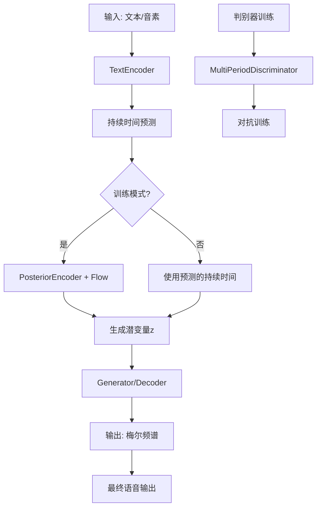

## 类结构

```
神经网络层/工具类
├── MLP (多层感知机)
├── Block (Transformer块)
├── Bottleneck (瓶颈层)
判别器类
├── DurationDiscriminator (持续时间判别器)
├── DiscriminatorP (周期性判别器)
├── DiscriminatorS (序列判别器)
├── MultiPeriodDiscriminator (多周期判别器)
└── WavLMDiscriminator (WavLM判别器)
编码器/解码器类
├── TextEncoder (文本编码器)
├── PosteriorEncoder (后验编码器)
├── ReferenceEncoder (参考编码器)
├── Generator (生成器/解码器)
流模型类
├── TransformerCouplingBlock (Transformer耦合块)
├── ResidualCouplingBlock (残差耦合块)
├── StochasticDurationPredictor (随机持续时间预测器)
└── DurationPredictor (持续时间预测器)
主模型类
└── SynthesizerTrn (主合成器)
```

## 全局变量及字段


### `symbols`
    
Text symbols/vocabulary from text module used for embedding

类型：`list or tensor`
    


### `num_tones`
    
Number of tonal features from text module used for tone embedding

类型：`int`
    


### `num_languages`
    
Number of languages from text module used for language embedding

类型：`int`
    


### `LRELU_SLOPE`
    
Leaky ReLU slope parameter from modules module used in activation functions

类型：`float`
    


### `DurationDiscriminator.in_channels`
    
Number of input feature channels

类型：`int`
    


### `DurationDiscriminator.filter_channels`
    
Number of filter channels for convolution layers

类型：`int`
    


### `DurationDiscriminator.kernel_size`
    
Kernel size for convolution operations

类型：`int`
    


### `DurationDiscriminator.p_dropout`
    
Dropout probability for regularization

类型：`float`
    


### `DurationDiscriminator.gin_channels`
    
Speaker embedding channels for conditioning

类型：`int`
    


### `DurationDiscriminator.drop`
    
Dropout layer for regularization

类型：`nn.Dropout`
    


### `DurationDiscriminator.conv_1`
    
First convolutional layer for feature extraction

类型：`nn.Conv1d`
    


### `DurationDiscriminator.norm_1`
    
Layer normalization after first convolution

类型：`modules.LayerNorm`
    


### `DurationDiscriminator.conv_2`
    
Second convolutional layer for feature extraction

类型：`nn.Conv1d`
    


### `DurationDiscriminator.norm_2`
    
Layer normalization after second convolution

类型：`modules.LayerNorm`
    


### `DurationDiscriminator.dur_proj`
    
Duration projection layer to align with hidden dimensions

类型：`nn.Conv1d`
    


### `DurationDiscriminator.LSTM`
    
Bidirectional LSTM for sequence modeling

类型：`nn.LSTM`
    


### `DurationDiscriminator.cond`
    
Conditioning convolution for speaker embedding

类型：`nn.Conv1d`
    


### `DurationDiscriminator.output_layer`
    
Output layer producing probability predictions

类型：`nn.Sequential`
    


### `TransformerCouplingBlock.channels`
    
Number of channels for input/output

类型：`int`
    


### `TransformerCouplingBlock.hidden_channels`
    
Hidden dimension for transformer layers

类型：`int`
    


### `TransformerCouplingBlock.kernel_size`
    
Kernel size for coupling layers

类型：`int`
    


### `TransformerCouplingBlock.n_layers`
    
Number of layers in transformer

类型：`int`
    


### `TransformerCouplingBlock.n_flows`
    
Number of flow layers in the block

类型：`int`
    


### `TransformerCouplingBlock.gin_channels`
    
Speaker embedding channels for conditioning

类型：`int`
    


### `TransformerCouplingBlock.flows`
    
List of flow and flip layers for transformation

类型：`nn.ModuleList`
    


### `TransformerCouplingBlock.wn`
    
Shared weight network for parameter sharing across flows

类型：`attentions.FFT or None`
    


### `StochasticDurationPredictor.in_channels`
    
Number of input feature channels

类型：`int`
    


### `StochasticDurationPredictor.filter_channels`
    
Number of filter channels for convolutions

类型：`int`
    


### `StochasticDurationPredictor.kernel_size`
    
Kernel size for convolution operations

类型：`int`
    


### `StochasticDurationPredictor.p_dropout`
    
Dropout probability for regularization

类型：`float`
    


### `StochasticDurationPredictor.n_flows`
    
Number of flow layers

类型：`int`
    


### `StochasticDurationPredictor.gin_channels`
    
Speaker embedding channels for conditioning

类型：`int`
    


### `StochasticDurationPredictor.log_flow`
    
Log transform for flow operations

类型：`modules.Log`
    


### `StochasticDurationPredictor.flows`
    
List of flow layers for forward transformation

类型：`nn.ModuleList`
    


### `StochasticDurationPredictor.post_pre`
    
Pre-projection for posterior duration

类型：`nn.Conv1d`
    


### `StochasticDurationPredictor.post_proj`
    
Projection for posterior duration

类型：`nn.Conv1d`
    


### `StochasticDurationPredictor.post_convs`
    
DDS convolutions for posterior processing

类型：`modules.DDSConv`
    


### `StochasticDurationPredictor.post_flows`
    
List of flow layers for posterior

类型：`nn.ModuleList`
    


### `StochasticDurationPredictor.pre`
    
Input projection layer

类型：`nn.Conv1d`
    


### `StochasticDurationPredictor.proj`
    
Main projection layer

类型：`nn.Conv1d`
    


### `StochasticDurationPredictor.convs`
    
DDS convolutions for input processing

类型：`modules.DDSConv`
    


### `StochasticDurationPredictor.cond`
    
Conditioning convolution for speaker embedding

类型：`nn.Conv1d or None`
    


### `DurationPredictor.in_channels`
    
Number of input feature channels

类型：`int`
    


### `DurationPredictor.filter_channels`
    
Number of filter channels for convolutions

类型：`int`
    


### `DurationPredictor.kernel_size`
    
Kernel size for convolution operations

类型：`int`
    


### `DurationPredictor.p_dropout`
    
Dropout probability for regularization

类型：`float`
    


### `DurationPredictor.gin_channels`
    
Speaker embedding channels for conditioning

类型：`int`
    


### `DurationPredictor.drop`
    
Dropout layer for regularization

类型：`nn.Dropout`
    


### `DurationPredictor.conv_1`
    
First convolutional layer

类型：`nn.Conv1d`
    


### `DurationPredictor.norm_1`
    
Layer normalization after first conv

类型：`modules.LayerNorm`
    


### `DurationPredictor.conv_2`
    
Second convolutional layer

类型：`nn.Conv1d`
    


### `DurationPredictor.norm_2`
    
Layer normalization after second conv

类型：`modules.LayerNorm`
    


### `DurationPredictor.proj`
    
Output projection to predict duration

类型：`nn.Conv1d`
    


### `DurationPredictor.cond`
    
Conditioning convolution for speaker embedding

类型：`nn.Conv1d or None`
    


### `Block.norm`
    
Layer normalization for input

类型：`nn.LayerNorm`
    


### `Block.mlp`
    
Multi-layer perceptron for feature transformation

类型：`MLP`
    


### `MLP.c_fc1`
    
First linear projection for Gated Linear Unit

类型：`nn.Linear`
    


### `MLP.c_fc2`
    
Second linear projection for Gated Linear Unit

类型：`nn.Linear`
    


### `MLP.c_proj`
    
Output projection layer

类型：`nn.Linear`
    


### `TextEncoder.n_vocab`
    
Vocabulary size for text embeddings

类型：`int`
    


### `TextEncoder.out_channels`
    
Number of output channels for encoded features

类型：`int`
    


### `TextEncoder.hidden_channels`
    
Hidden dimension for embeddings and encoder

类型：`int`
    


### `TextEncoder.filter_channels`
    
Filter channels for attention layers

类型：`int`
    


### `TextEncoder.n_heads`
    
Number of attention heads

类型：`int`
    


### `TextEncoder.n_layers`
    
Number of encoder layers

类型：`int`
    


### `TextEncoder.kernel_size`
    
Kernel size for convolution in encoder

类型：`int`
    


### `TextEncoder.p_dropout`
    
Dropout probability for regularization

类型：`float`
    


### `TextEncoder.gin_channels`
    
Speaker embedding channels for conditioning

类型：`int`
    


### `TextEncoder.emb`
    
Text symbol embedding layer

类型：`nn.Embedding`
    


### `TextEncoder.tone_emb`
    
Tone embedding layer for prosody

类型：`nn.Embedding`
    


### `TextEncoder.language_emb`
    
Language embedding layer

类型：`nn.Embedding`
    


### `TextEncoder.bert_proj`
    
BERT embedding projection layer

类型：`nn.Conv1d`
    


### `TextEncoder.ja_bert_proj`
    
Japanese BERT embedding projection

类型：`nn.Conv1d`
    


### `TextEncoder.en_bert_proj`
    
English BERT embedding projection

类型：`nn.Conv1d`
    


### `TextEncoder.encoder`
    
Transformer encoder for text features

类型：`attentions.Encoder`
    


### `TextEncoder.proj`
    
Output projection to produce mean and log variance

类型：`nn.Conv1d`
    


### `ResidualCouplingBlock.channels`
    
Number of channels for input/output

类型：`int`
    


### `ResidualCouplingBlock.hidden_channels`
    
Hidden dimension for coupling layers

类型：`int`
    


### `ResidualCouplingBlock.kernel_size`
    
Kernel size for convolution

类型：`int`
    


### `ResidualCouplingBlock.dilation_rate`
    
Dilation rate for dilated convolutions

类型：`int`
    


### `ResidualCouplingBlock.n_layers`
    
Number of layers in coupling layer

类型：`int`
    


### `ResidualCouplingBlock.n_flows`
    
Number of flow layers

类型：`int`
    


### `ResidualCouplingBlock.gin_channels`
    
Speaker embedding channels for conditioning

类型：`int`
    


### `ResidualCouplingBlock.flows`
    
List of residual coupling and flip layers

类型：`nn.ModuleList`
    


### `PosteriorEncoder.in_channels`
    
Number of input feature channels

类型：`int`
    


### `PosteriorEncoder.out_channels`
    
Number of output channels for latent distribution

类型：`int`
    


### `PosteriorEncoder.hidden_channels`
    
Hidden dimension for encoder

类型：`int`
    


### `PosteriorEncoder.kernel_size`
    
Kernel size for WN convolutions

类型：`int`
    


### `PosteriorEncoder.dilation_rate`
    
Dilation rate for WN convolutions

类型：`int`
    


### `PosteriorEncoder.n_layers`
    
Number of layers in WN

类型：`int`
    


### `PosteriorEncoder.gin_channels`
    
Speaker embedding channels for conditioning

类型：`int`
    


### `PosteriorEncoder.pre`
    
Input projection layer

类型：`nn.Conv1d`
    


### `PosteriorEncoder.enc`
    
WaveNet-style encoder for feature extraction

类型：`modules.WN`
    


### `PosteriorEncoder.proj`
    
Output projection for mean and log variance

类型：`nn.Conv1d`
    


### `Generator.num_kernels`
    
Number of residual blocks in upsampling

类型：`int`
    


### `Generator.num_upsamples`
    
Number of upsampling layers

类型：`int`
    


### `Generator.conv_pre`
    
Initial convolution before upsampling

类型：`Conv1d`
    


### `Generator.ups`
    
List of transposed convolutions for upsampling

类型：`nn.ModuleList`
    


### `Generator.resblocks`
    
List of residual blocks for refinement

类型：`nn.ModuleList`
    


### `Generator.conv_post`
    
Final convolution to produce waveform

类型：`Conv1d`
    


### `Generator.cond`
    
Conditioning convolution for speaker embedding

类型：`nn.Conv1d or None`
    


### `DiscriminatorP.period`
    
Period for period-based discrimination

类型：`int`
    


### `DiscriminatorP.use_spectral_norm`
    
Flag to use spectral normalization

类型：`bool`
    


### `DiscriminatorP.convs`
    
List of 2D convolutions for period-based features

类型：`nn.ModuleList`
    


### `DiscriminatorP.conv_post`
    
Final convolution layer for output

类型：`nn.Conv2d`
    


### `DiscriminatorS.convs`
    
List of 1D convolutions for scale-based features

类型：`nn.ModuleList`
    


### `DiscriminatorS.conv_post`
    
Final convolution layer for output

类型：`nn.Conv1d`
    


### `MultiPeriodDiscriminator.discriminators`
    
List of multiple period and scale discriminators

类型：`nn.ModuleList`
    


### `WavLMDiscriminator.pre`
    
Initial projection layer for WavLM features

类型：`nn.Conv1d`
    


### `WavLMDiscriminator.convs`
    
List of convolutions for feature extraction

类型：`nn.ModuleList`
    


### `WavLMDiscriminator.conv_post`
    
Final convolution for discrimination output

类型：`nn.Conv1d`
    


### `ReferenceEncoder.spec_channels`
    
Number of spectral channels for input mel spectrogram

类型：`int`
    


### `ReferenceEncoder.convs`
    
List of 2D convolutions for spectrogram processing

类型：`nn.ModuleList`
    


### `ReferenceEncoder.gru`
    
GRU for sequential feature aggregation

类型：`nn.GRU`
    


### `ReferenceEncoder.proj`
    
Linear projection to speaker embedding dimension

类型：`nn.Linear`
    


### `SynthesizerTrn.n_vocab`
    
Vocabulary size for text symbols

类型：`int`
    


### `SynthesizerTrn.spec_channels`
    
Number of spectral channels for input audio

类型：`int`
    


### `SynthesizerTrn.inter_channels`
    
Intermediate channels for latent representations

类型：`int`
    


### `SynthesizerTrn.hidden_channels`
    
Hidden dimension throughout the model

类型：`int`
    


### `SynthesizerTrn.filter_channels`
    
Filter channels for attention mechanisms

类型：`int`
    


### `SynthesizerTrn.n_heads`
    
Number of attention heads

类型：`int`
    


### `SynthesizerTrn.n_layers`
    
Number of layers in encoder/transformer

类型：`int`
    


### `SynthesizerTrn.kernel_size`
    
Kernel size for convolutions

类型：`int`
    


### `SynthesizerTrn.p_dropout`
    
Dropout probability

类型：`float`
    


### `SynthesizerTrn.resblock`
    
Residual block type identifier

类型：`str`
    


### `SynthesizerTrn.resblock_kernel_sizes`
    
Kernel sizes for residual blocks

类型：`list`
    


### `SynthesizerTrn.resblock_dilation_sizes`
    
Dilation sizes for residual blocks

类型：`list`
    


### `SynthesizerTrn.upsample_rates`
    
Upsampling rates for waveform generation

类型：`list`
    


### `SynthesizerTrn.upsample_initial_channel`
    
Initial channel count for upsampling

类型：`int`
    


### `SynthesizerTrn.upsample_kernel_sizes`
    
Kernel sizes for upsampling layers

类型：`list`
    


### `SynthesizerTrn.segment_size`
    
Segment size for training slicing

类型：`int`
    


### `SynthesizerTrn.n_speakers`
    
Number of speakers for multi-speaker training

类型：`int`
    


### `SynthesizerTrn.gin_channels`
    
Speaker embedding dimension

类型：`int`
    


### `SynthesizerTrn.n_layers_trans_flow`
    
Number of transformer flow layers

类型：`int`
    


### `SynthesizerTrn.use_spk_conditioned_encoder`
    
Whether to use speaker-conditioned encoder

类型：`bool`
    


### `SynthesizerTrn.use_sdp`
    
Whether to use stochastic duration predictor

类型：`bool`
    


### `SynthesizerTrn.use_noise_scaled_mas`
    
Whether to use noise-scaled monotonic alignment

类型：`bool`
    


### `SynthesizerTrn.mas_noise_scale_initial`
    
Initial noise scale for MAS

类型：`float`
    


### `SynthesizerTrn.noise_scale_delta`
    
Delta for noise scale annealing

类型：`float`
    


### `SynthesizerTrn.current_mas_noise_scale`
    
Current noise scale for MAS during training

类型：`float`
    


### `SynthesizerTrn.enc_gin_channels`
    
Encoder speaker embedding channels

类型：`int or None`
    


### `SynthesizerTrn.enc_p`
    
Text encoder for phonetic and semantic features

类型：`TextEncoder`
    


### `SynthesizerTrn.dec`
    
Waveform generator/decoder

类型：`Generator`
    


### `SynthesizerTrn.enc_q`
    
Posterior encoder for mel spectrogram

类型：`PosteriorEncoder`
    


### `SynthesizerTrn.flow`
    
Flow-based model for latent transformation

类型：`TransformerCouplingBlock or ResidualCouplingBlock`
    


### `SynthesizerTrn.sdp`
    
Stochastic duration predictor

类型：`StochasticDurationPredictor`
    


### `SynthesizerTrn.dp`
    
Deterministic duration predictor

类型：`DurationPredictor`
    


### `SynthesizerTrn.emb_g`
    
Speaker embedding layer

类型：`nn.Embedding or None`
    


### `SynthesizerTrn.ref_enc`
    
Reference encoder for speaker embedding

类型：`ReferenceEncoder or None`
    
    

## 全局函数及方法


### `init_weights`

该函数是PyTorch模块的权重初始化函数，用于对神经网络层的权重进行初始化操作。

参数：

- `m`：`torch.nn.Module`，需要初始化权重的神经网络模块

返回值：无返回值（`None`），该函数直接修改传入模块的权重参数

#### 流程图

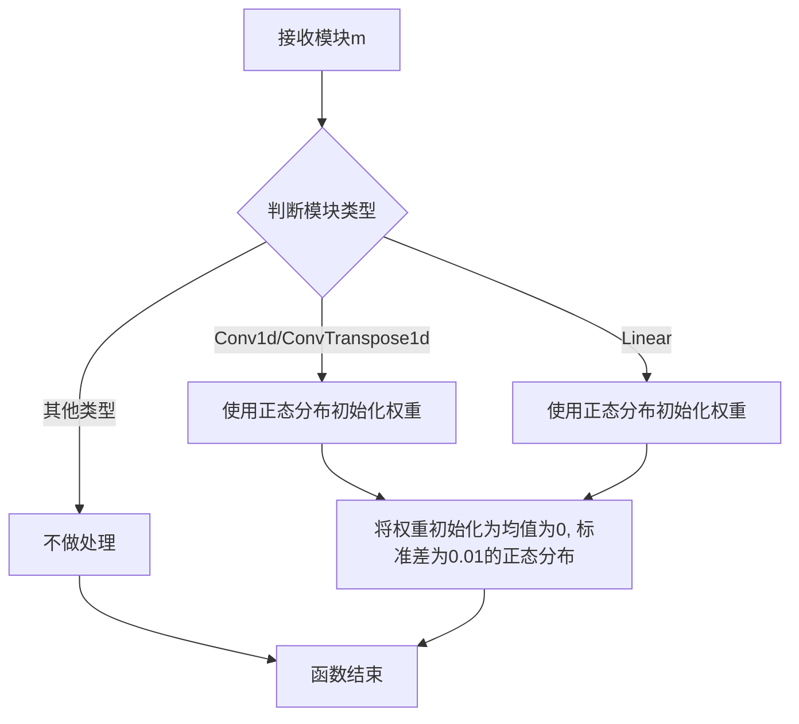

#### 带注释源码

```
# init_weights 函数定义在 commons 模块中
# 当前文件通过 from commons import init_weights 导入使用
# 其源码未在当前文件中给出

# 使用示例（在Generator类中）:
# self.ups.apply(init_weights)
# 这会对self.ups这个nn.ModuleList中的所有卷积转置层应用权重初始化

# 根据PyTorch常见实现，推断其源码可能如下：
def init_weights(m):
    """
    对神经网络模块进行权重初始化
    
    参数:
        m: torch.nn.Module - 需要初始化权重的模块
    """
    if isinstance(m, (nn.Conv1d, nn.ConvTranspose1d, nn.Linear)):
        # 使用正态分布初始化权重
        nn.init.normal_(m.weight.data, 0.0, 0.01)
        if m.bias is not None:
            nn.init.constant_(m.bias.data, 0.0)
```

**注意**：由于`init_weights`函数定义在`commons`模块中，而该模块的完整代码未在当前文件中提供，上述源码为基于使用方式的合理推断。实际实现可能包含更多初始化策略或特定的层类型处理。


根据提供的代码，`get_padding` 函数是从 `commons` 模块导入的，但其定义并未在当前代码文件中显示。让我搜索整个代码并基于使用方式来推断该函数的信息。

### `get_padding`

这是一个从 `commons` 模块导入的辅助函数，用于计算卷积操作的填充值（padding），以确保卷积后输出特征图的空间维度保持一致。

参数：

-  `kernel_size`：`int`，卷积核的大小
-  `dilation`：`int`，卷积膨胀率（默认为1）

返回值：`int`，填充值，通常为 `(kernel_size - 1) * dilation // 2`

#### 流程图

```mermaid
flowchart TD
    A[开始 get_padding] --> B{输入参数}
    B --> C[kernel_size: int]
    B --> D[dilation: int = 1]
    C --> E[计算填充值: (kernel_size - 1) * dilation // 2]
    D --> E
    E --> F[返回填充值]
    F --> G[结束]
```

#### 带注释源码

```python
# commons.py 中的 get_padding 函数实现
def get_padding(kernel_size, dilation=1):
    """
    计算卷积操作的填充值
    
    参数:
        kernel_size (int): 卷积核的大小
        dilation (int): 卷积膨胀率，默认为1
    
    返回值:
        int: 填充值，用于维持特征图维度
    """
    return int((kernel_size - 1) * dilation / 2)
```

#### 在代码中的使用示例

```python
# 在 DiscriminatorP 类中的使用
norm_f(
    Conv2d(
        1,
        32,
        (kernel_size, 1),
        (stride, 1),
        padding=(get_padding(kernel_size, 1), 0),  # 使用 get_padding 计算填充值
    )
),
```

---

**注意**：由于 `get_padding` 函数定义在 `commons` 模块中，而该模块的具体实现在当前提供的代码文件中未给出，以上信息是基于函数名、参数使用方式和常见的卷积填充计算逻辑进行的合理推断。如果需要查看 `commons` 模块中 `get_padding` 函数的确切实现，可能需要查看 `commons.py` 文件的完整代码。


### `commons.sequence_mask`

该函数用于生成序列掩码张量，常用于变长序列处理中，根据实际序列长度生成对应的mask，以屏蔽填充部分。

参数：

- `lengths`：`Tensor`或`int`，表示序列的实际长度
- `max_len`：`int`，表示序列的最大长度（可选参数，若为None则使用lengths中的最大值）

返回值：`Tensor`，返回形状为`(1, 1, max_len)`或`(max_len,)`的布尔型掩码张量，用于标识有效位置（True）与填充位置（False）

#### 流程图

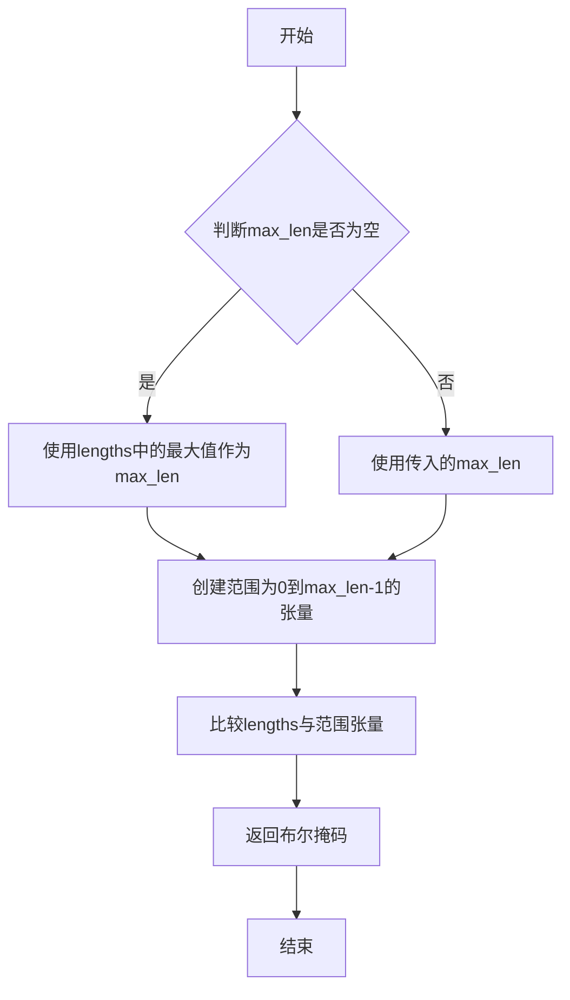

#### 带注释源码

```
# 由于该函数定义在commons模块中，当前代码段仅包含导入语句
# 以下为基于代码中调用方式的推断实现

def sequence_mask(lengths, max_len=None):
    """
    生成序列掩码
    
    参数:
        lengths: 序列的实际长度，可以是单个整数或一维张量
        max_len: 序列的最大长度，如果为None则取lengths中的最大值
    
    返回:
        布尔类型张量，长度为max_len，有效位置为True，填充位置为False
    """
    if max_len is None:
        max_len = lengths if isinstance(lengths, int) else lengths.max().item()
    
    # 创建从0到max_len-1的序列
    range_tensor = torch.arange(max_len)
    
    # 将lengths扩展为与range_tensor相同的维度以便比较
    if isinstance(lengths, torch.Tensor):
        lengths = lengths.to(range_tensor.device)
        mask = lengths.unsqueeze(1) > range_tensor.unsqueeze(0)
    else:
        mask = lengths > range_tensor
    
    return mask

# 在代码中的典型调用方式：
# x_mask = torch.unsqueeze(commons.sequence_mask(x_lengths, x.size(2)), 1).to(x.dtype)
# 这里x_lengths是实际序列长度，x.size(2)是最大长度
```

#### 备注

该函数在代码中的多个位置被调用，主要用于：

1. **TextEncoder** 中生成输入序列的mask：`x_mask = torch.unsqueeze(commons.sequence_mask(x_lengths, x.size(2)), 1).to(x.dtype)`
2. **PosteriorEncoder** 中生成输出序列的mask：`x_mask = torch.unsqueeze(commons.sequence_mask(x_lengths, x.size(2)), 1).to(x.dtype)`
3. **SynthesizerTrn.infer** 中生成目标序列mask：`y_mask = torch.unsqueeze(commons.sequence_mask(y_lengths, None), 1).to(x_mask.dtype)`

这个函数是VITS语音合成模型中处理变长序列的关键组件，确保模型只关注实际有数据的位置，忽略填充部分。


由于 `rand_slice_segments` 函数定义在外部的 `commons` 模块中（未在当前代码文件中提供定义），我只能基于调用方式和 VITS 模型的上下文来推断其功能。以下是基于代码分析的结果：

### `commons.rand_slice_segments`

从 `SynthesizerTrn.forward` 方法中的调用提取：

```python
z_slice, ids_slice = commons.rand_slice_segments(
    z, y_lengths, self.segment_size
)
```

该函数用于在 VITS 模型的训练过程中，从输入的潜在表示张量 `z` 中随机切片出固定长度的片段，用于后续的解码器生成。

参数：

- `z`：`torch.Tensor`，输入的潜在表示张量，形状通常为 [batch, channels, time]
- `y_lengths`：`torch.Tensor`，目标序列的实际长度，用于确定有效时间步
- `segment_size`：`int`，要切片的目标片段长度

返回值：`tuple[torch.Tensor, torch.Tensor]`，返回两个张量：

- 第一个元素 `z_slice`：`torch.Tensor`，切片后的潜在表示片段
- 第二个元素 `ids_slice`：`torch.Tensor`，用于记录切片位置的索引，以便后续需要还原或对齐时使用

#### 流程图

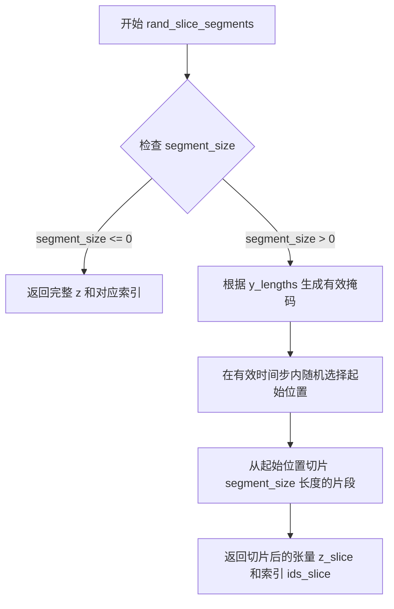

#### 带注释源码

（注：由于函数定义不在当前代码文件中，以下为基于 VITS 模型架构和调用上下文的合理推断）

```python
def rand_slice_segments(z: torch.Tensor, y_lengths: torch.Tensor, segment_size: int):
    """
    从潜在表示 z 中随机切片出固定长度的片段
    
    参数:
        z: 潜在表示张量 [batch, channels, time]
        y_lengths: 目标序列的实际长度 [batch]
        segment_size: 要切片的目标片段长度
    
    返回:
        z_slice: 切片后的潜在表示 [batch, channels, segment_size]
        ids_slice: 切片位置索引用于后续对齐
    """
    # 获取 batch 大小和时间步总数
    batch_size, channels, time_steps = z.shape
    
    # 如果 segment_size 小于等于 0，返回完整序列
    if segment_size <= 0:
        return z, torch.arange(time_steps, device=z.device)
    
    # 计算每个样本的有效最大起始位置
    # 确保切片不会超出实际序列长度
    max_start = y_lengths - segment_size
    max_start = torch.clamp_min(max_start, 0)  # 确保起始位置非负
    
    # 为每个 batch 随机生成起始位置
    # 使用均匀分布在 [0, max_start] 范围内选择
    start_indices = torch.randint(
        low=0,
        high=max_start + 1,  # +1 因为.randint 是左闭右开
        size=(batch_size,),
        device=z.device
    )
    
    # 生成时间索引用于切片
    ids_slice = start_indices.unsqueeze(1) + torch.arange(segment_size, device=z.device)
    
    # 使用gather方法从z中提取对应切片
    # z: [batch, channels, time] -> z_slice: [batch, channels, segment_size]
    z_slice = torch.gather(
        z, 
        dim=2, 
        indices=ids_slice.unsqueeze(1).expand(-1, channels, -1)
    )
    
    return z_slice, ids_slice
```


# generate_path 函数提取结果

### `commons.generate_path`

该函数用于在VITS语音合成模型的推理过程中，根据预测的持续时间（duration）生成注意力对齐路径（attention alignment path）。它将离散的持续时间转换为软对齐矩阵，用于将文本/音素级别的表示扩展到声学帧级别。

**注意**：该函数的定义位于 `commons` 模块中，但未在当前代码片段中提供。以下信息基于对该函数的调用分析得出。

## 参数

- `w_ceil`：`torch.Tensor`，通过 `torch.ceil(w)` 计算得到的上取整持续时间值，其中 `w = torch.exp(logw) * x_mask * length_scale`。表示每个文本 token 对应的帧数的上取整值。
- `attn_mask`：`torch.Tensor`，注意力掩码，形状为 `[batch, 1, text_len, audio_len]`，用于指示有效的时间步。

## 返回值

- `torch.Tensor`，对齐矩阵/注意力矩阵，形状为 `[batch, 1, text_len, audio_len]`，表示文本 token 和音频帧之间的软对齐关系。

## 流程图

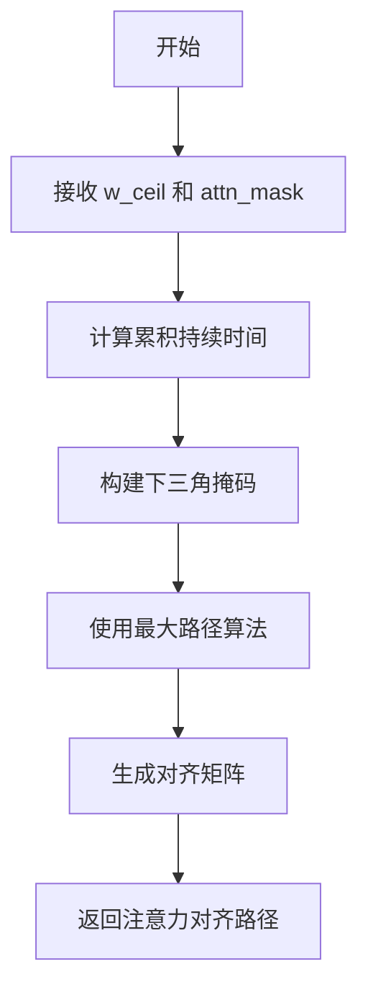

## 调用示例源码

以下是该函数在 `SynthesizerTrn.infer` 方法中的调用上下文：

```python
def infer(
    self,
    x,               # 文本/音素序列 [batch, text_len]
    x_lengths,       # 文本长度
    sid,             # 说话人ID
    tone,            # 音调
    language,        # 语言
    bert,            # BERT嵌入
    ja_bert,         # 日语BERT嵌入
    en_bert,         # 英语BERT嵌入
    noise_scale=0.667,
    length_scale=1,
    noise_scale_w=0.8,
    max_len=None,
    sdp_ratio=0,
    y=None,
):
    # ... 编码器前向传播 ...
    
    # 预测持续时间（对数域）
    logw = self.sdp(x, x_mask, g=g, reverse=True, noise_scale=noise_scale_w) * (
        sdp_ratio
    ) + self.dp(x, x_mask, g=g) * (1 - sdp_ratio)
    
    # 将对数域的持续时间转换为实际帧数
    w = torch.exp(logw) * x_mask * length_scale
    
    # 上取整处理，确保帧数为整数
    w_ceil = torch.ceil(w)
    
    # 计算每个样本的总帧数
    y_lengths = torch.clamp_min(torch.sum(w_ceil, [1, 2]), 1).long()
    
    # 创建音频级别的掩码
    y_mask = torch.unsqueeze(commons.sequence_mask(y_lengths, None), 1).to(
        x_mask.dtype
    )
    
    # 构建完整的注意力掩码（text_mask ⊗ audio_mask）
    attn_mask = torch.unsqueeze(x_mask, 2) * torch.unsqueeze(y_mask, -1)
    
    # ==== 调用 generate_path 函数 ====
    # 根据上取整的持续时间生成软对齐矩阵
    attn = commons.generate_path(w_ceil, attn_mask)
    # ================================
    
    # 使用对齐矩阵扩展均值和方差
    m_p = torch.matmul(attn.squeeze(1), m_p.transpose(1, 2)).transpose(1, 2)
    logs_p = torch.matmul(attn.squeeze(1), logs_p.transpose(1, 2)).transpose(1, 2)

    # ... 后续流模型和解码器处理 ...
    
    return o, attn, y_mask, (z, z_p, m_p, logs_p)
```

## 补充说明

由于 `generate_path` 函数的完整源码未在当前代码片段中提供，以下是基于其用途的推测：

1. **函数位置**：`commons` 模块（可能在 `commons.py` 文件中）
2. **核心逻辑**：
   - 将上取整的持续时间转换为累积位置索引
   - 构建下三角矩阵（确保每个音频帧只对应一个文本 token）
   - 应用最大路径算法（类似于 CTC 解码中的贪心算法）
   - 返回形状为 `[B, 1, T_text, T_audio]` 的对齐矩阵

3. **设计目的**：
   - 将变长的文本序列映射到变长的音频序列
   - 生成用于后续流模型（flow）和声码器（vocoder）的对齐信息
   - 支持单调对齐约束（每个音频帧只对应一个文本 token）


### `monotonic_align.maximum_path`

该函数是VITS（Variational Inference with adversarial learning for parallel waveform generation）模型中的核心对齐算法，用于在训练阶段通过动态规划计算文本与语音之间的单调对齐路径（Monotonic Alignment）。它在计算负交叉熵矩阵后，利用注意力掩码寻找最优的对齐方式，以实现文本到语音的精确映射。

参数：

-  `neg_cent`：`torch.Tensor`，形状为 `[batch, target_len, source_len]` 的3D张量，表示负中心值矩阵（negative centroid），通常由文本编码器和语音编码器的特征计算得到的交叉熵矩阵
-  `attn_mask`：`torch.Tensor`，形状为 `[batch, seq_len]` 的2D张量，表示注意力掩码，用于标记有效位置，通常在序列两端进行填充（padding）

返回值：`torch.Tensor`，返回对齐矩阵，形状为 `[batch, 1, target_len, source_len]` 的4D张量，表示从源序列到目标序列的单调对齐路径

#### 流程图

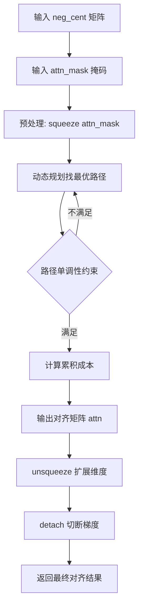

#### 带注释源码

```python
# 该函数定义在 monotonic_align 模块中（未在当前文件中实现）
# 以下为调用处的源码分析：

# 1. 负交叉熵矩阵计算（为maximum_path准备输入）
neg_cent1 = torch.sum(-0.5 * math.log(2 * math.pi) - logs_p, [1], keepdim=True)
neg_cent2 = torch.matmul(-0.5 * (z_p**2).transpose(1, 2), s_p_sq_r)
neg_cent3 = torch.matmul(z_p.transpose(1, 2), (m_p * s_p_sq_r))
neg_cent4 = torch.sum(-0.5 * (m_p**2) * s_p_sq_r, [1], keepdim=True)
neg_cent = neg_cent1 + neg_cent2 + neg_cent3 + neg_cent4

# 2. 如果使用噪声缩放的MAS（Monotonic Alignment Search）
if self.use_noise_scaled_mas:
    epsilon = torch.std(neg_cent) * torch.randn_like(neg_cent) * self.current_mas_noise_scale
    neg_cent = neg_cent + epsilon

# 3. 创建注意力掩码
attn_mask = torch.unsqueeze(x_mask, 2) * torch.unsqueeze(y_mask, -1)

# 4. 调用maximum_path函数计算对齐路径
attn = (
    monotonic_align.maximum_path(  # 调用外部monotonic_align模块的对齐函数
        neg_cent,                    # 输入：负中心值矩阵 [b, t_t, t_s]
        attn_mask.squeeze(1)         # 输入：掩码并压缩维度 [b, t_s]
    )
    .unsqueeze(1)                    # 输出扩展维度 [b, 1, t_t, t_s]
    .detach()                        # 切断梯度，防止梯度流向对齐计算
)

# 5. 计算持续时间（对齐路径的时间维度的和）
w = attn.sum(2)
```


### `DurationDiscriminator.__init__`

该方法是`DurationDiscriminator`类的初始化方法，用于构建一个用于VITS2模型中时长（duration）判别的神经网络模块。该模块通过卷积层、LayerNorm层、LSTM层和输出层来计算给定输入和时长信息的概率分布。

参数：

- `self`：类实例本身
- `in_channels`：`int`，输入特征的通道数
- `filter_channels`：`int`，卷积层和LSTM层的滤波器/隐藏通道数
- `kernel_size`：`int`，卷积核大小
- `p_dropout`：`float`，Dropout概率，用于防止过拟合
- `gin_channels`：`int`（默认值0），说话人嵌入的通道数，用于条件输入（可选）

返回值：`无`（`None`），`__init__`方法不返回任何值，仅初始化对象属性

#### 流程图

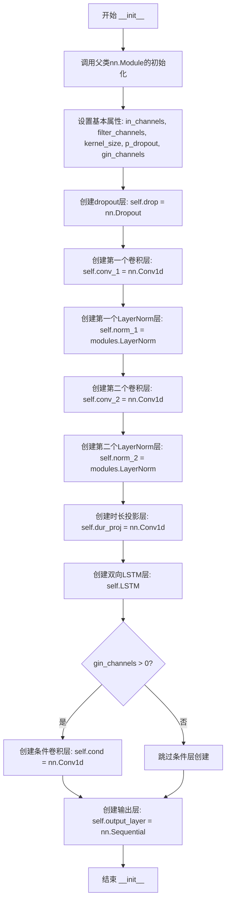

#### 带注释源码

```python
def __init__(
    self, in_channels, filter_channels, kernel_size, p_dropout, gin_channels=0
):
    """
    初始化DurationDiscriminator模型
    
    参数:
        in_channels: 输入特征通道数
        filter_channels: 隐藏层通道数
        kernel_size: 卷积核大小
        p_dropout: Dropout概率
        gin_channels: 说话人条件输入的通道数，默认为0表示无条件输入
    """
    # 调用父类nn.Module的初始化方法
    super().__init__()

    # ==================== 基本属性赋值 ====================
    # 保存模型配置参数
    self.in_channels = in_channels              # 输入特征维度
    self.filter_channels = filter_channels      # 隐藏层/滤波器维度
    self.kernel_size = kernel_size              # 卷积核大小
    self.p_dropout = p_dropout                  # Dropout概率
    self.gin_channels = gin_channels             # 说话人嵌入通道数

    # ==================== 网络层构建 ====================
    
    # Dropout层: 用于随机丢弃神经元以防止过拟合
    self.drop = nn.Dropout(p_dropout)
    
    # 第一个卷积层: 将输入特征映射到隐藏空间
    # 输入: [batch, in_channels, time]
    # 输出: [batch, filter_channels, time]
    self.conv_1 = nn.Conv1d(
        in_channels, filter_channels, kernel_size, padding=kernel_size // 2
    )
    
    # 第一个LayerNorm层: 对filter_channels维度进行归一化
    self.norm_1 = modules.LayerNorm(filter_channels)
    
    # 第二个卷积层: 进一步处理特征
    # 输入: [batch, filter_channels, time]
    # 输出: [batch, filter_channels, time]
    self.conv_2 = nn.Conv1d(
        filter_channels, filter_channels, kernel_size, padding=kernel_size // 2
    )
    
    # 第二个LayerNorm层
    self.norm_2 = modules.LayerNorm(filter_channels)
    
    # 时长投影层: 将1维的时长信息投影到filter_channels维空间
    # 输入: [batch, 1, time]
    # 输出: [batch, filter_channels, time]
    self.dur_proj = nn.Conv1d(1, filter_channels, 1)

    # 双向LSTM层: 捕捉时序依赖信息
    # 输入: [batch, time, 2*filter_channels] (由x和dur拼接)
    # 输出: [batch, time, 2*filter_channels]
    self.LSTM = nn.LSTM(
        2 * filter_channels, filter_channels, batch_first=True, bidirectional=True
    )

    # ==================== 条件输入处理 ====================
    # 如果提供了说话人嵌入通道，则创建条件卷积层
    # 用于将说话人嵌入融入到主特征中
    if gin_channels != 0:
        # 将说话人嵌入投影到与输入相同的维度
        # 输入: [batch, gin_channels, time]
        # 输出: [batch, in_channels, time]
        self.cond = nn.Conv1d(gin_channels, in_channels, 1)

    # ==================== 输出层 ====================
    # 输出层: 将LSTM输出转换为概率值
    # 包含一个线性层和一个Sigmoid激活函数
    # 输入: [batch, time, 2*filter_channels]
    # 输出: [batch, time, 1] - 表示每个时间步的判别概率
    self.output_layer = nn.Sequential(
        nn.Linear(2 * filter_channels, 1),  # 降维到1维
        nn.Sigmoid()                          # 转换为0-1之间的概率
    )
```


### `DurationDiscriminator.forward_probability`

该方法计算给定特征和持续时间对的概率输出，用于区分真实持续时间和预测持续时间，是 VITS2 模型中 DurationDiscriminator 的核心推理逻辑。

参数：

- `self`：`DurationDiscriminator` 实例，隐式参数，表示当前对象本身
- `x`：`torch.Tensor`，输入特征张量，通常来自编码器输出的隐藏状态，形状为 [batch, channels, time]
- `dur`：`torch.Tensor`，持续时间张量，形状为 [batch, 1, time]，表示每个时间步的持续时间

返回值：`torch.Tensor`，输出概率值，形状为 [batch, time, 1]，表示输入特征与持续时间匹配的真实概率

#### 流程图

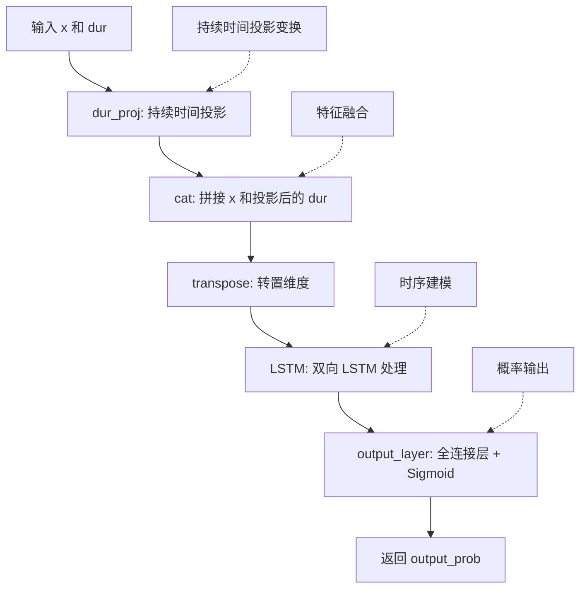

#### 带注释源码

```python
def forward_probability(self, x, dur):
    """
    计算输入特征与持续时间的匹配概率
    
    参数:
        x: 输入特征张量 [batch, in_channels, time]
        dur: 持续时间张量 [batch, 1, time]
    
    返回:
        output_prob: 概率输出 [batch, time, 1]
    """
    # Step 1: 将持续时间通过 1x1 卷积投影到 filter_channels 维度
    # dur_proj 是 nn.Conv1d(1, filter_channels, 1)
    dur = self.dur_proj(dur)
    # 形状变化: [batch, 1, time] -> [batch, filter_channels, time]
    
    # Step 2: 在通道维度上拼接输入特征和投影后的持续时间
    x = torch.cat([x, dur], dim=1)
    # 形状变化: [batch, in_channels, time] + [batch, filter_channels, time]
    #         -> [batch, in_channels + filter_channels, time]
    
    # Step 3: 转置维度，将时间维度移到序列维度
    # 从 [batch, channels, time] 转为 [batch, time, channels]
    # 符合 LSTM 的输入格式 (batch_first=True)
    x = x.transpose(1, 2)
    # 形状变化: [batch, in_channels + filter_channels, time] -> [batch, time, in_channels + filter_channels]
    
    # Step 4: 双向 LSTM 处理，捕获时序依赖关系
    # LSTM 输入: [batch, time, 2*filter_channels]
    # LSTM 输出: [batch, time, 2*filter_channels]
    x, _ = self.LSTM(x)
    
    # Step 5: 通过输出层得到概率值
    # output_layer 是 Sequential(Linear(2*filter_channels, 1), Sigmoid())
    # 将特征映射到 [0, 1] 区间，表示概率
    output_prob = self.output_layer(x)
    # 形状变化: [batch, time, 2*filter_channels] -> [batch, time, 1]
    
    return output_prob
```


### `DurationDiscriminator.forward`

该方法是 VITS2 模型中用于判别语音时长预测质量的判别器前向传播方法，通过对真实时长和预测时长分别进行特征提取和概率计算，以对抗训练的方式提升时长预测器的准确性。

参数：

- `x`：`torch.Tensor`，输入的隐藏状态特征，形状为 [batch, channels, time]
- `x_mask`：`torch.Tensor`，时间维度掩码，用于标识有效时间步，形状为 [batch, 1, time]
- `dur_r`：`torch.Tensor`，真实时长信息，形状为 [batch, 1, time]
- `dur_hat`：`torch.Tensor`，预测（生成）的时长信息，形状为 [batch, 1, time]
- `g`：`torch.Tensor`，可选的说话人/条件嵌入，形状为 [batch, gin_channels, 1]

返回值：`List[torch.Tensor]`，包含两个概率输出的列表，索引 0 为真实时长的概率，索引 1 为预测时长的概率，每个概率形状为 [batch, time, 1]

#### 流程图

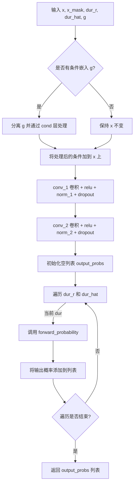

#### 带注释源码

```python
def forward(self, x, x_mask, dur_r, dur_hat, g=None):
    # 分离输入特征，阻断梯度回传，防止判别器训练影响主模型特征提取
    x = torch.detach(x)
    
    # 如果存在条件嵌入（说话人信息），同样分离其梯度
    if g is not None:
        g = torch.detach(g)
        # 将条件信息通过线性层映射后加到输入特征上，实现条件增强
        x = x + self.cond(g)
    
    # 第一次卷积块：提升特征维度并提取局部模式
    # 输入: [b, in_channels, t] -> 输出: [b, filter_channels, t]
    x = self.conv_1(x * x_mask)  # 使用 x_mask 对无效位置进行清零
    x = torch.relu(x)            # 激活函数，增加非线性
    x = self.norm_1(x)           # 层归一化，稳定训练
    x = self.drop(x)            # Dropout，防止过拟合
    
    # 第二次卷积块：进一步提取特征
    x = self.conv_2(x * x_mask)
    x = torch.relu(x)
    x = self.norm_2(x)
    x = self.drop(x)
    
    # 初始化输出概率列表，用于存储真实和预测时长的判别结果
    output_probs = []
    
    # 分别对真实时长 dur_r 和预测时长 dur_hat 进行概率计算
    for dur in [dur_r, dur_hat]:
        # 调用子方法计算单个时长的概率输出
        output_prob = self.forward_probability(x, dur)
        output_probs.append(output_prob)
    
    # 返回包含两个概率的列表：[真实时长概率, 预测时长概率]
    return output_probs
```


### `TransformerCouplingBlock.__init__`

该方法是`TransformerCouplingBlock`类的构造函数，用于初始化基于Transformer的归一化流耦合块。它设置了模型的基本超参数，初始化了条件特征处理模块，并根据配置创建了多个Transformer耦合层和翻转层，用于构建可逆的流网络。

参数：

- `channels`：`int`，输入/输出通道数
- `hidden_channels`：`int`，隐藏层通道数
- `filter_channels`：`int`，注意力机制中的滤波器通道数
- `n_heads`：`int`，多头注意力机制的头数
- `n_layers`：`int`，Transformer层的层数
- `kernel_size`：`int`，卷积核大小
- `p_dropout`：`float`，Dropout概率
- `n_flows`：`int`，流网络中的流数量，默认为4
- `gin_channels`：`int`，说话人/条件信息的通道数，默认为0
- `share_parameter`：`bool`，是否在流层之间共享参数，默认为False

返回值：无（`None`），构造函数不返回任何值，仅初始化对象状态

#### 流程图

```mermaid
graph TD
    A[开始 __init__] --> B[调用 super().__init__ 初始化nn.Module]
    B --> C[设置实例属性: channels, hidden_channels, kernel_size, n_layers, n_flows, gin_channels]
    C --> D{share_parameter 是否为 True?}
    D -->|是| E[创建 attentions.FFT 实例赋值给 self.wn]
    D -->|否| F[设置 self.wn = None]
    E --> G[循环 i 从 0 到 n_flows-1]
    F --> G
    G --> H[创建 TransformerCouplingLayer 并添加到 self.flows]
    H --> I[创建 modules.Flip 并添加到 self.flows]
    I --> J{是否还有更多流层?}
    J -->|是| G
    J -->|否| K[结束 __init__]
```

#### 带注释源码

```python
def __init__(
    self,
    channels,
    hidden_channels,
    filter_channels,
    n_heads,
    n_layers,
    kernel_size,
    p_dropout,
    n_flows=4,
    gin_channels=0,
    share_parameter=False,
):
    """
    初始化 TransformerCouplingBlock
    
    参数:
        channels: 输入输出通道数
        hidden_channels: 隐藏层通道数
        filter_channels: 滤波器通道数
        n_heads: 注意力头数
        n_layers: Transformer层数
        kernel_size: 卷积核大小
        p_dropout: Dropout概率
        n_flows: 流数量，默认为4
        gin_channels: 条件信息通道数，默认为0
        share_parameter: 是否共享参数，默认为False
    """
    # 调用父类nn.Module的初始化方法
    super().__init__()
    
    # 保存基本配置参数
    self.channels = channels
    self.hidden_channels = hidden_channels
    self.kernel_size = kernel_size
    self.n_layers = n_layers
    self.n_flows = n_flows
    self.gin_channels = gin_channels
    
    # 初始化流模块列表
    self.flows = nn.ModuleList()
    
    # 如果share_parameter为True，创建一个共享的FFT注意力模块
    # 否则设为None，在每个流层中独立创建
    self.wn = (
        attentions.FFT(
            hidden_channels,
            filter_channels,
            n_heads,
            n_layers,
            kernel_size,
            p_dropout,
            isflow=True,
            gin_channels=self.gin_channels,
        )
        if share_parameter
        else None
    )
    
    # 循环创建n_flows个流层
    # 每个流包含一个TransformerCouplingLayer和一个Flip模块
    for i in range(n_flows):
        # 添加Transformer耦合层
        self.flows.append(
            modules.TransformerCouplingLayer(
                channels,
                hidden_channels,
                kernel_size,
                n_layers,
                n_heads,
                p_dropout,
                filter_channels,
                mean_only=True,
                wn_sharing_parameter=self.wn,  # 传入共享的FFT模块
                gin_channels=self.gin_channels,
            )
        )
        # 添加翻转模块，用于流的仿射变换
        self.flows.append(modules.Flip())
```


### `TransformerCouplingBlock.forward`

该方法是VITS2模型中Transformer耦合块的前向传播函数，负责在流模型（flow-based model）中执行可逆的变换操作，支持正向和逆向两种模式，用于概率分布的建模和采样。

参数：

- `self`：`TransformerCouplingBlock`实例本身
- `x`：`torch.Tensor`，输入张量，形状为 [batch, channels, time]，代表待处理的隐藏状态
- `x_mask`：`torch.Tensor`，形状为 [batch, 1, time]，时间步掩码，用于标识有效时间步
- `g`：`torch.Tensor` 或 `None`，可选的说话人/语言条件嵌入，形状为 [batch, gin_channels, 1]，用于条件化流模型的变换
- `reverse`：`bool`，布尔标志，False表示正向流（训练时计算log-likelihood），True表示逆向流（推理时从噪声生成数据）

返回值：`torch.Tensor`，变换后的张量，形状与输入x相同 [batch, channels, time]

#### 流程图

```mermaid
flowchart TD
    A[开始 forward] --> B{reverse?}
    B -->|False| C[按顺序遍历 self.flows]
    B -->|True| D[按逆序遍历 self.flows]
    C --> E[对每个flow执行: x, _ = flow(x, x_mask, g=g, reverse=False)]
    D --> F[对每个flow执行: x = flow(x, x_mask, g=g, reverse=True)]
    E --> G[返回变换后的x]
    F --> G
```

#### 带注释源码

```python
def forward(self, x, x_mask, g=None, reverse=False):
    """
    Transformer耦合块的前向传播函数
    
    参数:
        x: 输入张量 [batch, channels, time]
        x_mask: 掩码张量 [batch, 1, time]
        g: 条件嵌入张量 [batch, gin_channels, 1] 或 None
        reverse: 是否反向执行流变换
    
    返回:
        x: 变换后的张量 [batch, channels, time]
    """
    if not reverse:
        # 正向模式：计算log-likelihood
        # 依次通过所有flow层（包括TransformerCouplingLayer和Flip层）
        for flow in self.flows:
            x, _ = flow(x, x_mask, g=g, reverse=reverse)
    else:
        # 逆向模式：从噪声生成数据
        # 逆序通过所有flow层（排除Flip层的逆向操作）
        for flow in reversed(self.flows):
            x = flow(x, x_mask, g=g, reverse=reverse)
    return x
```


### StochasticDurationPredictor.__init__

这是VITS2语音合成模型中的随机时长预测器初始化方法，用于构建基于归一化流（Normalizing Flow）的时长预测网络，支持前向推理和逆向采样。

参数：

- `self`：隐式参数，PyTorch模型实例本身
- `in_channels`：`int`，输入特征的通道数
- `filter_channels`：`int`，滤波器中间层的通道数
- `kernel_size`：`int`，卷积核大小
- `p_dropout`：`float`，Dropout概率
- `n_flows`：`int`，归一化流的数量（默认值为4）
- `gin_channels`：`int`，说话人嵌入的通道数，0表示不使用（默认值为0）

返回值：无（`__init__` 方法没有返回值）

#### 流程图

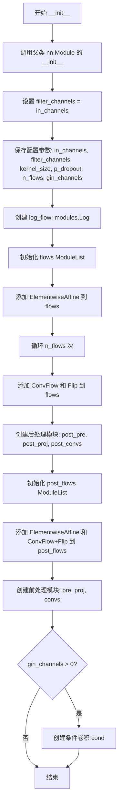

#### 带注释源码

```python
def __init__(
    self,
    in_channels,       # int: 输入特征的通道数
    filter_channels,   # int: 滤波器中间层的通道数
    kernel_size,       # int: 卷积核大小
    p_dropout,         # float: Dropout概率
    n_flows=4,         # int: 归一化流的数量，默认值为4
    gin_channels=0,   # int: 说话人嵌入的通道数，0表示不使用条件输入
):
    # 调用父类nn.Module的初始化方法
    super().__init__()
    
    # 注释: 这行代码在未来的版本中需要移除，filter_channels应该直接使用传入的参数
    # 这是一个技术债务，违反了函数参数的设计意图
    filter_channels = in_channels  
    
    # 保存各个配置参数到模型实例属性
    self.in_channels = in_channels
    self.filter_channels = filter_channels
    self.kernel_size = kernel_size
    self.p_dropout = p_dropout
    self.n_flows = n_flows
    self.gin_channels = gin_channels

    # 创建对数流模块，用于概率密度计算
    self.log_flow = modules.Log()
    
    # 创建主流程的归一化流模块列表
    self.flows = nn.ModuleList()
    
    # 添加初始的仿射变换层（shift和scale）
    self.flows.append(modules.ElementwiseAffine(2))
    
    # 循环创建多个ConvFlow和Flip模块，构成归一化流
    for i in range(n_flows):
        # ConvFlow: 使用可逆卷积进行特征变换
        self.flows.append(
            modules.ConvFlow(2, filter_channels, kernel_size, n_layers=3)
        )
        # Flip: 交换维度，保持流的雅可比行列式为1
        self.flows.append(modules.Flip())

    # ========== 后处理模块（用于处理目标时长w）==========
    # post_pre: 将1通道的时长输入映射到filter_channels维度
    self.post_pre = nn.Conv1d(1, filter_channels, 1)
    # post_proj: 投影层，用于特征维度调整
    self.post_proj = nn.Conv1d(filter_channels, filter_channels, 1)
    # post_convs: Dilated Dense卷积堆叠，增强上下文建模能力
    self.post_convs = modules.DDSConv(
        filter_channels, kernel_size, n_layers=3, p_dropout=p_dropout
    )
    
    # 后处理流程的归一化流
    self.post_flows = nn.ModuleList()
    self.post_flows.append(modules.ElementwiseAffine(2))
    for i in range(4):  # 固定使用4个后处理流
        self.post_flows.append(
            modules.ConvFlow(2, filter_channels, kernel_size, n_layers=3)
        )
        self.post_flows.append(modules.Flip())

    # ========== 前处理模块（用于处理输入特征x）==========
    # pre: 将输入特征映射到filter_channels维度
    self.pre = nn.Conv1d(in_channels, filter_channels, 1)
    # proj: 投影层，用于最终特征变换
    self.proj = nn.Conv1d(filter_channels, filter_channels, 1)
    # convs: Dilated Dense卷积堆叠
    self.convs = modules.DDSConv(
        filter_channels, kernel_size, n_layers=3, p_dropout=p_dropout
    )
    
    # 条件输入处理：如果提供了说话人嵌入，创建条件卷积层
    if gin_channels != 0:
        self.cond = nn.Conv1d(gin_channels, filter_channels, 1)
```


### `StochasticDurationPredictor.forward`

该方法是VITS2语音合成模型中的随机时长预测器实现，基于标准化流（Normalizing Flow）技术。在训练阶段（reverse=False），通过可逆流网络将输入特征映射到潜在空间，计算负对数似然损失用于训练；在推理阶段（reverse=False），从随机噪声采样并通过逆流网络生成时长对数概率。

参数：

- `x`：`torch.Tensor`，输入的隐藏状态序列，形状为 [batch, channels, time]
- `x_mask`：`torch.Tensor`，时间轴掩码，用于标识有效序列位置，形状为 [batch, 1, time]
- `w`：`torch.Tensor`（可选），真实时长标签，用于训练时计算loss，形状为 [batch, 1, time]
- `g`：`torch.Tensor`（可选），说话人/语言条件embedding，用于条件流模型，形状为 [batch, gin_channels, 1]
- `reverse`：`bool`，是否反向执行流模型（推理模式），默认为False（训练模式）
- `noise_scale`：`float`，推理时噪声缩放因子，控制采样随机性，默认为1.0

返回值：

- 当 `reverse=False`（训练模式）：`torch.Tensor`，形状为 [batch]，返回负对数似然损失（nll + logq）
- 当 `reverse=True`（推理模式）：`torch.Tensor`，形状为 [batch, 1, time]，返回预测的log时长（logw）

#### 流程图

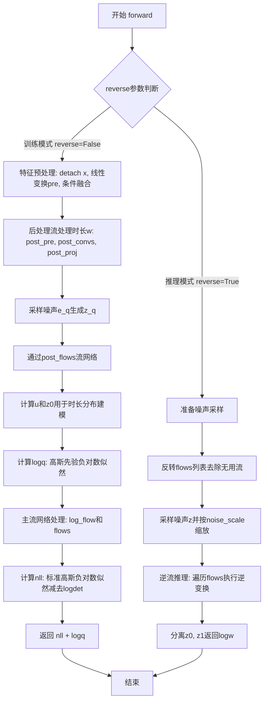

#### 带注释源码

```python
def forward(self, x, x_mask, w=None, g=None, reverse=False, noise_scale=1.0):
    """
    随机时长预测器的前向传播
    
    参数:
        x: 输入隐藏状态 [batch, channels, time]
        x_mask: 时间掩码 [batch, 1, time]
        w: 真实时长标签 [batch, 1, time]，仅训练时需要
        g: 条件embedding [batch, gin_channels, 1]
        reverse: 是否反向执行（推理模式）
        noise_scale: 推理时噪声缩放因子
    
    返回:
        训练模式: 负对数似然损失 [batch]
        推理模式: 预测的log时长 [batch, 1, time]
    """
    
    # 训练模式：计算负对数似然
    if not reverse:
        flows = self.flows  # 获取主流网络
        assert w is not None  # 训练时必须提供真实时长

        logdet_tot_q = 0  # 后处理流的logdet累加器
        
        # 对真实时长w进行后处理：投影和卷积
        h_w = self.post_pre(w)  # [b, filter_channels, t]
        h_w = self.post_convs(h_w, x_mask)  # 带条件卷积
        h_w = self.post_proj(h_w) * x_mask  # 投影并应用掩码
        
        # 采样噪声生成潜在变量z_q，用于建模时长分布
        e_q = (
            torch.randn(w.size(0), 2, w.size(2)).to(device=x.device, dtype=x.dtype)
            * x_mask  # 只在有效位置生成噪声
        )
        z_q = e_q
        
        # 通过后处理流网络（ElementwiseAffine + ConvFlow + Flip）
        for flow in self.post_flows:
            z_q, logdet_q = flow(z_q, x_mask, g=(x + h_w))
            logdet_tot_q += logdet_q
        
        # 分割为u（用于sigmoid变换）和z1
        z_u, z1 = torch.split(z_q, [1, 1], 1)
        u = torch.sigmoid(z_u) * x_mask  # 将u限制在(0,1)区间
        z0 = (w - u) * x_mask  # 变换后的时长
        
        # 计算sigmoid变换的logdet
        logdet_tot_q += torch.sum(
            (F.logsigmoid(z_u) + F.logsigmoid(-z_u)) * x_mask, [1, 2]
        )
        
        # 计算高斯先验的负对数似然 logq
        logq = (
            torch.sum(-0.5 * (math.log(2 * math.pi) + (e_q**2)) * x_mask, [1, 2])
            - logdet_tot_q
        )

        # 主流网络处理
        logdet_tot = 0
        z0, logdet = self.log_flow(z0, x_mask)  # 对z0应用对数流
        logdet_tot += logdet
        z = torch.cat([z0, z1], 1)  # 拼接两部分潜在变量
        
        # 遍历主流网络（n_flows个ConvFlow + Flip）
        for flow in flows:
            z, logdet = flow(z, x_mask, g=x, reverse=reverse)
            logdet_tot = logdet_tot + logdet
        
        # 计算标准高斯先验的nll
        nll = (
            torch.sum(0.5 * (math.log(2 * math.pi) + (z**2)) * x_mask, [1, 2])
            - logdet_tot
        )
        
        # 返回总损失：nll + logq（两者都是负对数似然）
        return nll + logq  # [b]
    
    # 推理模式：从噪声生成时长
    else:
        flows = list(reversed(self.flows))  # 反转流网络用于逆变换
        flows = flows[:-2] + [flows[-1]]  # 移除一个无用的vflow
        
        # 采样随机噪声
        z = (
            torch.randn(x.size(0), 2, x.size(2)).to(device=x.device, dtype=x.dtype)
            * noise_scale  # 应用噪声缩放
        )
        
        # 通过逆流网络生成时长
        for flow in flows:
            z = flow(z, x_mask, g=x, reverse=reverse)
        
        z0, z1 = torch.split(z, [1, 1], 1)
        logw = z0  # z0即为预测的log时长
        
        return logw
```


### `DurationPredictor.__init__`

该方法是 `DurationPredictor` 类的构造函数，用于初始化持续时间预测器网络结构。该模块是一个用于预测语音合成中音素持续时间的卷积神经网络，包含两层卷积层、层归一化、Dropout 以及可选的说话人条件嵌入层。

参数：

- `in_channels`：`int`，输入特征的通道数
- `filter_channels`：`int`，卷积层的过滤器通道数
- `kernel_size`：`int`，卷积核的大小
- `p_dropout`：`float`，Dropout 概率
- `gin_channels`：`int`（默认值 0），说话人嵌入的通道数，如果为 0 则不使用条件嵌入

返回值：无（`None`），构造函数仅初始化对象属性和网络层

#### 流程图

```mermaid
flowchart TD
    A[开始 __init__] --> B[调用 super().__init__]
    B --> C[设置实例属性: in_channels, filter_channels, kernel_size, p_dropout, gin_channels]
    C --> D[创建 Dropout 层: self.drop]
    D --> E[创建第一个卷积层: self.conv_1]
    E --> F[创建第一个层归一化: self.norm_1]
    F --> G[创建第二个卷积层: self.conv_2]
    G --> H[创建第二个层归一化: self.norm_2]
    H --> I[创建输出投影层: self.proj]
    I --> J{gin_channels > 0?}
    J -->|是| K[创建条件卷积层: self.cond]
    J -->|否| L[结束]
    K --> L
```

#### 带注释源码

```python
def __init__(
    self, in_channels, filter_channels, kernel_size, p_dropout, gin_channels=0
):
    """
    初始化 DurationPredictor 网络结构
    
    参数:
        in_channels: 输入特征的通道数
        filter_channels: 卷积过滤器通道数
        kernel_size: 卷积核大小
        p_dropout: Dropout 概率
        gin_channels: 说话人嵌入通道数，0 表示不使用条件嵌入
    """
    # 调用父类 nn.Module 的初始化方法
    super().__init__()

    # 保存网络配置参数
    self.in_channels = in_channels
    self.filter_channels = filter_channels
    self.kernel_size = kernel_size
    self.p_dropout = p_dropout
    self.gin_channels = gin_channels

    # Dropout 层，用于防止过拟合
    self.drop = nn.Dropout(p_dropout)
    
    # 第一个卷积层：输入通道 -> 过滤器通道
    # 使用 padding 保证序列长度不变 (kernel_size // 2)
    self.conv_1 = nn.Conv1d(
        in_channels, filter_channels, kernel_size, padding=kernel_size // 2
    )
    # 第一个层归一化，用于稳定训练
    self.norm_1 = modules.LayerNorm(filter_channels)
    
    # 第二个卷积层：过滤器通道 -> 过滤器通道
    self.conv_2 = nn.Conv1d(
        filter_channels, filter_channels, kernel_size, padding=kernel_size // 2
    )
    # 第二个层归一化
    self.norm_2 = modules.LayerNorm(filter_channels)
    
    # 输出投影层：将过滤器通道映射到 1（预测持续时间值）
    self.proj = nn.Conv1d(filter_channels, 1, 1)

    # 可选：说话人条件嵌入
    # 当提供说话人嵌入通道时，创建条件卷积层
    if gin_channels != 0:
        self.cond = nn.Conv1d(gin_channels, in_channels, 1)
```


### `DurationPredictor.forward`

该方法实现了一个用于预测音素时长的深度卷积神经网络（Duration Predictor），是 VITS/ VITS2 语音合成模型中的核心组件。接受输入特征序列、序列掩码以及说话人嵌入（如有），通过多层卷积、ReLU 激活、LayerNorm 归一化和 Dropout 处理，最终输出每个音素的预测时长。

参数：

- `x`：`torch.Tensor`，输入特征张量，形状为 [batch, in_channels, time_steps]，通常来自文本编码器的输出
- `x_mask`：`torch.Tensor`，时间步掩码，形状为 [batch, 1, time_steps]，用于标记有效时间步
- `g`：`torch.Tensor` 或 `None`，说话人嵌入向量，形状为 [batch, gin_channels, 1]，用于条件化预测（可选）

返回值：`torch.Tensor`，预测的时长对数，形状为 [batch, 1, time_steps]

#### 流程图

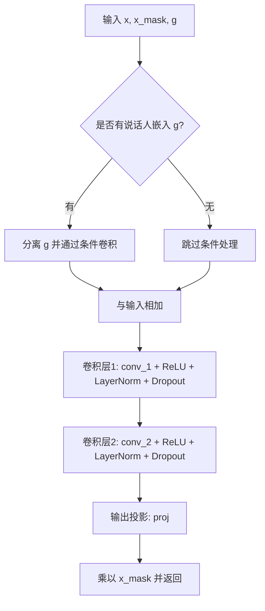

#### 带注释源码

```python
def forward(self, x, x_mask, g=None):
    """
    DurationPredictor 的前向传播方法
    
    参数:
        x: 输入特征张量 [batch, in_channels, time_steps]
        x_mask: 时间步掩码 [batch, 1, time_steps]
        g: 可选的说话人嵌入 [batch, gin_channels, 1]
    
    返回:
        预测的时长对数 [batch, 1, time_steps]
    """
    # 分离输入梯度，防止梯度回流到之前的编码器
    x = torch.detach(x)
    
    # 如果提供了说话人嵌入，进行条件处理
    if g is not None:
        # 分离说话人嵌入的梯度
        g = torch.detach(g)
        # 将说话人条件通过线性变换并加到输入上
        x = x + self.cond(g)
    
    # 第一次卷积块：卷积 -> ReLU -> LayerNorm -> Dropout
    x = self.conv_1(x * x_mask)  # [b, filter_channels, t]
    x = torch.relu(x)
    x = self.norm_1(x)
    x = self.drop(x)
    
    # 第二次卷积块：卷积 -> ReLU -> LayerNorm -> Dropout
    x = self.conv_2(x * x_mask)  # [b, filter_channels, t]
    x = torch.relu(x)
    x = self.norm_2(x)
    x = self.drop(x)
    
    # 输出投影：将特征维度映射到1（预测时长）
    x = self.proj(x * x_mask)  # [b, 1, t]
    
    # 乘以掩码，确保无效时间步的输出为0
    return x * x_mask
```


### `Bottleneck.__init__`

这是一个神经网络模块的初始化方法，用于创建一个包含两个线性层的瓶颈模块，继承自`nn.Sequential`。

参数：

- `in_dim`：`int`，输入维度，表示输入特征的维度
- `hidden_dim`：`int`，隐藏层维度，表示线性层的输出维度

返回值：`None`，返回类型为`None`，因为`__init__`方法不返回任何值

#### 流程图

```mermaid
graph TD
    A[开始] --> B[创建c_fc1: nn.Linear<br/>in_dim → hidden_dim<br/>bias=False]
    B --> C[创建c_fc2: nn.Linear<br/>in_dim → hidden_dim<br/>bias=False]
    C --> D[调用父类初始化<br/>super().__init__(\*[c_fc1, c_fc2])]
    D --> E[结束]
```

#### 带注释源码

```python
class Bottleneck(nn.Sequential):
    def __init__(self, in_dim, hidden_dim):
        # 第一个全连接层：将输入维度映射到隐藏维度，不使用偏置
        c_fc1 = nn.Linear(in_dim, hidden_dim, bias=False)
        
        # 第二个全连接层：将输入维度映射到隐藏维度，不使用偏置
        # 与c_fc1结构相同，用于类似Gated Linear Unit (GLU)的门控机制
        c_fc2 = nn.Linear(in_dim, hidden_dim, bias=False)
        
        # 调用父类nn.Sequential的初始化方法，将两个线性层组合成Sequential模块
        # 这使得Bottleneck可以像Sequential一样使用
        super().__init__(*[c_fc1, c_fc2])
```


### `Block.__init__`

该方法是 VITS 语音合成模型中 `Block` 类的初始化方法，用于构建一个包含层归一化和多层感知机的 Transformer 块单元。

参数：

- `in_dim`：`int`，输入特征的维度
- `hidden_dim`：`int`，MLP 隐藏层的维度

返回值：`None`，构造函数无返回值

#### 流程图

```mermaid
flowchart TD
    A[开始 Block.__init__] --> B[调用 super().__init__ 初始化 nn.Module]
    C[创建 LayerNorm 层: self.norm = nn.LayerNorm(in_dim)]
    D[创建 MLP 层: self.mlp = MLP(in_dim, hidden_dim)]
    B --> C
    C --> D
    D --> E[结束 __init__]
```

#### 带注释源码

```python
def __init__(self, in_dim, hidden_dim) -> None:
    """
    初始化 Block 模块
    
    参数:
        in_dim: 输入特征的维度
        hidden_dim: MLP 隐藏层的维度
    """
    # 调用父类 nn.Module 的初始化方法
    super().__init__()
    
    # 创建层归一化 (Layer Normalization) 层
    # 用于对输入进行归一化处理，帮助稳定训练
    self.norm = nn.LayerNorm(in_dim)
    
    # 创建多层感知机 (MLP)
    # 由 MLP 类实现，包含两个线性变换和 SiLU 激活
    # 输入维度为 in_dim，输出维度为 hidden_dim
    self.mlp = MLP(in_dim, hidden_dim)
```


### `Block.forward`

该方法实现了一个 Transformer 模块中的标准残差连接块，包含 LayerNorm 归一化操作和前馈 MLP 网络，用于对输入张量进行非线性变换并通过残差连接保留原始信息。

参数：

- `x`：`torch.Tensor`，输入的张量，形状为 `[batch_size, seq_len, hidden_dim]`

返回值：`torch.Tensor`，经过 LayerNorm 归一化、MLP 变换并加上原始输入后的输出张量，形状与输入相同

#### 流程图

```mermaid
flowchart TD
    A[输入 x] --> B[LayerNorm 归一化: norm(x)]
    B --> C[MLP 变换: mlp(norm(x))]
    C --> D[残差连接: x + mlp(norm(x))]
    D --> E[输出变换后的张量]
```

#### 带注释源码

```
class Block(nn.Module):
    def __init__(self, in_dim, hidden_dim) -> None:
        super().__init__()
        # LayerNorm 归一化层，对最后一个维度进行归一化
        self.norm = nn.LayerNorm(in_dim)
        # MLP 变换模块，包含两个线性变换和激活函数
        self.mlp = MLP(in_dim, hidden_dim)

    def forward(self, x: torch.Tensor) -> torch.Tensor:
        # 对输入 x 进行 LayerNorm 归一化
        # 输入形状: [batch_size, seq_len, in_dim]
        # 输出形状: [batch_size, seq_len, in_dim]
        normalized = self.norm(x)
        
        # 将归一化后的张量传入 MLP 进行非线性变换
        # 输入形状: [batch_size, seq_len, in_dim]
        # 输出形状: [batch_size, seq_len, in_dim]
        transformed = self.mlp(normalized)
        
        # 残差连接：将 MLP 变换后的结果与原始输入相加
        # 这是 Transformer 架构中的核心残差机制
        # x = x + mlp(norm(x))
        x = x + transformed
        
        # 返回变换后的张量
        return x
```


### `MLP.__init__`

该方法是一个多层感知机（MLP）模块的初始化方法，用于构建一个包含两个输入线性层和一个输出投影层的神经网络结构。该MLP模块后续将在`Block`类中作为残差连接的一部分使用，通过Swish激活函数实现特征的非线性变换。

参数：

- `in_dim`：`int`，输入张量的维度大小
- `hidden_dim`：`int`，隐藏层的维度大小

返回值：`None`，该方法仅进行对象属性的初始化，不返回任何值

#### 流程图

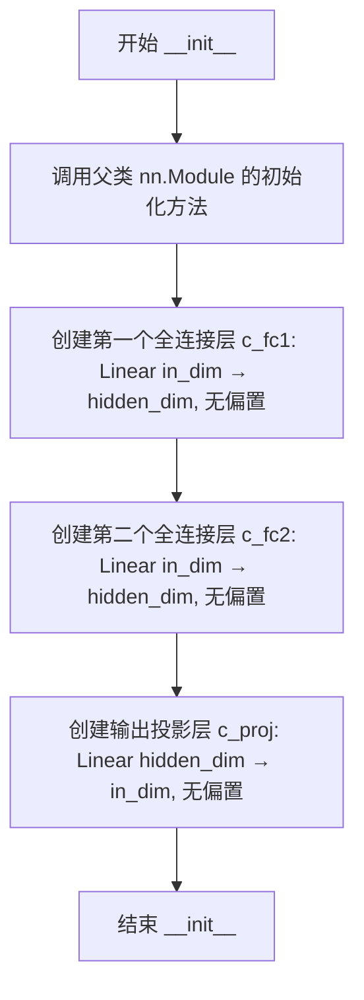

#### 带注释源码

```python
class MLP(nn.Module):
    """
    多层感知机模块，用于在Transformer块中实现前馈网络功能
    """
    
    def __init__(self, in_dim, hidden_dim):
        """
        初始化MLP模块
        
        参数:
            in_dim: 输入特征的维度
            hidden_dim: 隐藏层特征的维度（通常设置为 in_dim 的 4 倍）
        """
        # 调用父类 nn.Module 的初始化方法，注册所有层参数
        super().__init__()
        
        # 第一个全连接层：将输入映射到隐藏空间（无偏置项）
        self.c_fc1 = nn.Linear(in_dim, hidden_dim, bias=False)
        
        # 第二个全连接层：同样将输入映射到隐藏空间（无偏置项）
        # 这个设计遵循了GELU激活的MLP结构，其中输入被并行处理
        self.c_fc2 = nn.Linear(in_dim, hidden_dim, bias=False)
        
        # 输出投影层：将隐藏空间映射回输入空间（无偏置项）
        # 用于残差连接后的维度匹配
        self.c_proj = nn.Linear(hidden_dim, in_dim, bias=False)
```

---

**补充信息**

- **使用场景**：该`MLP`类在代码中的`Block`类里被使用，作为Transformer架构中前馈网络（FFN）的一部分
- **激活函数**：虽然`__init__`中没有直接定义激活函数，但在`MLP.forward()`方法中使用了`F.silu`（Swish激活函数）
- **设计模式**：采用了"并行线性层"的设计模式，两个输入层`c_fc1`和`c_fc2`并行处理输入，然后在激活后相乘，这种设计类似于GPT系列模型中的FFN结构


### `MLP.forward`

MLP（多层感知机）类的前向传播方法，实现了一个带有 GELU 激活函数的 FFN（Feed-Forward Network）块，用于 Transformer 模型中的前馈网络。

参数：

- `x`：`torch.Tensor`，输入张量，形状为 `[batch_size, seq_len, in_dim]`

返回值：`torch.Tensor`，经过两层线性变换和 SiLU 激活后的输出张量，形状为 `[batch_size, seq_len, in_dim]`

#### 流程图

```mermaid
graph LR
    A[输入 x] --> B[c_fc1 线性层]
    B --> C[F.silu 激活函数]
    D[输入 x] --> E[c_fc2 线性层]
    E --> F[逐元素相乘]
    C --> F
    F --> G[c_proj 线性层]
    G --> H[输出]
```

#### 带注释源码

```python
def forward(self, x: torch.Tensor):
    """
    MLP 的前向传播
    
    实现了 Transformer 中常用的 FFN 块：
    output = c_proj(silu(c_fc1(x)) * c_fc2(x))
    
    这种设计类似于 GELU 激活的 FFN，通过两个线性变换
    和 SiLU 激活函数实现非线性变换。
    
    参数:
        x: 输入张量，形状为 [batch_size, seq_len, in_dim]
    
    返回:
        输出张量，形状为 [batch_size, seq_len, in_dim]
    """
    # 第一个全连接层变换
    # c_fc1: Linear(in_dim, hidden_dim, bias=False)
    x = F.silu(self.c_fc1(x)) * self.c_fc2(x)
    
    # SiLU 激活函数（SiLU(x) = x * sigmoid(x)，也称为 Swish）
    # 与 GELU 类似，是一种自门控激活函数
    # 这里使用门控机制：silu(W1*x) * (W2*x)
    
    # 第二个全连接层投影回原始维度
    # c_proj: Linear(hidden_dim, in_dim, bias=False)
    x = self.c_proj(x)
    
    return x
```


### `TextEncoder.__init__`

初始化 TextEncoder 类，构建包含词符嵌入、音调嵌入、语言嵌入、BERT特征投影层以及基于注意力机制的 Transformer 编码器。

参数：

- `n_vocab`：`int`，词汇表大小。
- `out_channels`：`int`，输出通道数，用于控制编码后特征的维度。
- `hidden_channels`：`int`，隐藏层维度，嵌入层和模型内部的特征维度。
- `filter_channels`：`int`，滤波器通道数，用于编码器中的前馈网络。
- `n_heads`：`int`，多头注意力机制中的注意力头数。
- `n_layers`：`int`，编码器的层数。
- `kernel_size`：`int`，卷积核大小，用于编码器中的卷积操作。
- `p_dropout`：`float`，Dropout 概率，用于防止过拟合。
- `gin_channels`：`int`，说话人（Speaker）嵌入的通道数，默认为0。

返回值：`None`，构造函数不返回值。

#### 流程图

```mermaid
flowchart TD
    A([开始初始化]) --> B[调用 nn.Module 父类构造函数]
    B --> C[保存配置参数<br/>n_vocab, out_channels, hidden_channels 等]
    C --> D[创建词符嵌入层 self.emb]
    D --> E[创建音调嵌入层 self.tone_emb]
    E --> F[创建语言嵌入层 self.language_emb]
    F --> G[创建 BERT 投影层<br/>bert_proj, ja_bert_proj, en_bert_proj]
    G --> H[初始化注意力编码器 self.encoder]
    H --> I[创建输出投影层 self.proj]
    I --> J([结束初始化])
```

#### 带注释源码

```python
def __init__(
    self,
    n_vocab,
    out_channels,
    hidden_channels,
    filter_channels,
    n_heads,
    n_layers,
    kernel_size,
    p_dropout,
    gin_channels=0,
):
    super().__init__()

    # 1. 保存模型配置参数
    self.n_vocab = n_vocab
    self.out_channels = out_channels
    self.hidden_channels = hidden_channels
    self.filter_channels = filter_channels
    self.n_heads = n_heads
    self.n_layers = n_layers
    self.kernel_size = kernel_size
    self.p_dropout = p_dropout
    self.gin_channels = gin_channels

    # 2. 初始化词符嵌入层 (Token Embedding)
    # 将词汇表索引映射到隐藏维度空间
    self.emb = nn.Embedding(len(symbols), hidden_channels)
    # 使用正态分布初始化嵌入权重，标准差为 hidden_channels^-0.5
    nn.init.normal_(self.emb.weight, 0.0, hidden_channels**-0.5)

    # 3. 初始化音调嵌入层 (Tone Embedding)
    self.tone_emb = nn.Embedding(num_tones, hidden_channels)
    nn.init.normal_(self.tone_emb.weight, 0.0, hidden_channels**-0.5)

    # 4. 初始化语言嵌入层 (Language Embedding)
    self.language_emb = nn.Embedding(num_languages, hidden_channels)
    nn.init.normal_(self.language_emb.weight, 0.0, hidden_channels**-0.5)

    # 5. 初始化 BERT 特征投影层
    # 将预训练的 BERT 输出 (通常为 1024 维) 投影到隐藏维度
    self.bert_proj = nn.Conv1d(1024, hidden_channels, 1)
    self.ja_bert_proj = nn.Conv1d(1024, hidden_channels, 1)
    self.en_bert_proj = nn.Conv1d(1024, hidden_channels, 1)

    # 6. 初始化核心 Encoder (基于注意力机制)
    # 用于编码文本序列特征
    self.encoder = attentions.Encoder(
        hidden_channels,
        filter_channels,
        n_heads,
        n_layers,
        kernel_size,
        p_dropout,
        gin_channels=self.gin_channels,
    )

    # 7. 初始化输出投影层
    # 将编码后的特征映射到最终的输出通道，通常 *2 用于分别输出均值(m)和标准差(logs)
    self.proj = nn.Conv1d(hidden_channels, out_channels * 2, 1)
```


### `TextEncoder.forward`

该方法是 VITS 语音合成模型中 TextEncoder 类的核心前向传播函数，负责将文本序列（包括音素、语调、语言特征以及多语言 BERT 表示）编码为隐层表示，并输出用于后续流模型和持续时间预测的均值和 log 方差。

参数：

- `x`：`torch.Tensor`，形状为 `[batch_size, seq_len]`，输入的音素索引序列
- `x_lengths`：`torch.Tensor`，形状为 `[batch_size]`，输入序列的实际长度（用于掩码生成）
- `tone`：`torch.Tensor`，形状为 `[batch_size, seq_len]`，语调（tone）索引序列
- `language`：`torch.Tensor`，形状为 `[batch_size, seq_len]`，语言（language）索引序列
- `bert`：`torch.Tensor`，形状为 `[batch_size, seq_len, 1024]`，通用 BERT 输出特征
- `ja_bert`：`torch.Tensor`，形状为 `[batch_size, seq_len, 1024]`，日语 BERT 输出特征
- `en_bert`：`torch.Tensor`，形状为 `[batch_size, seq_len, 1024]`，英语 BERT 输出特征
- `g`：`torch.Tensor` 或 `None`，形状为 `[batch_size, gin_channels, 1]`，说话人条件向量（可选）

返回值：`Tuple[torch.Tensor, torch.Tensor, torch.Tensor, torch.Tensor]`，返回一个四元组：

- 第一个元素：`x`，编码器输出，形状为 `[batch_size, hidden_channels, seq_len]`
- 第二个元素：`m`，均值（mean），形状为 `[batch_size, out_channels, seq_len]`
- 第三个元素：`logs`，log 方差（log of scale），形状为 `[batch_size, out_channels, seq_len]`
- 第四个元素：`x_mask`，序列掩码，形状为 `[batch_size, 1, seq_len]`

#### 流程图

```mermaid
flowchart TD
    A[输入: x, x_lengths, tone, language, bert, ja_bert, en_bert, g] --> B[BERT 特征投影]
    B --> C[bert_emb: bert_proj + transpose]
    B --> D[ja_bert_emb: ja_bert_proj + transpose]
    B --> E[en_bert_emb: en_bert_proj + transpose]
    C --> F[嵌入融合: emb + tone_emb + language_emb + bert_embs]
    D --> F
    E --> F
    F --> G[缩放: * sqrt(hidden_channels)]
    G --> H[维度变换: transpose 1 和 -1]
    H --> I[生成序列掩码: sequence_mask]
    I --> J[编码器: encoder(x * x_mask, x_mask, g)]
    J --> K[投影: proj(x) * x_mask]
    K --> L[分割: split stats into m and logs]
    L --> M[输出: x, m, logs, x_mask]
```

#### 带注释源码

```python
def forward(self, x, x_lengths, tone, language, bert, ja_bert, en_bert, g=None):
    """
    TextEncoder 的前向传播方法
    
    参数:
        x: 音素索引序列 [batch_size, seq_len]
        x_lengths: 序列实际长度 [batch_size]
        tone: 语调索引序列 [batch_size, seq_len]
        language: 语言索引序列 [batch_size, seq_len]
        bert: 通用BERT特征 [batch_size, seq_len, 1024]
        ja_bert: 日语BERT特征 [batch_size, seq_len, 1024]
        en_bert: 英语BERT特征 [batch_size, seq_len, 1024]
        g: 说话人向量 [batch_size, gin_channels, 1], 可选
    
    返回:
        x: 编码器隐藏层输出 [batch_size, hidden_channels, seq_len]
        m: 均值 [batch_size, out_channels, seq_len]
        logs: log方差 [batch_size, out_channels, seq_len]
        x_mask: 序列掩码 [batch_size, 1, seq_len]
    """
    
    # 第一步: 将多语言 BERT 特征投影到隐藏维度并转置
    # 从 [batch, seq_len, 1024] 投影并转置为 [batch, hidden_channels, seq_len]
    bert_emb = self.bert_proj(bert).transpose(1, 2)
    ja_bert_emb = self.ja_bert_proj(ja_bert).transpose(1, 2)
    en_bert_emb = self.en_bert_proj(en_bert).transpose(1, 2)
    
    # 第二步: 嵌入融合
    # 将音素嵌入、语调嵌入、语言嵌入和多种 BERT 嵌入相加
    # emb(x): [batch, seq_len] -> [batch, seq_len, hidden_channels]
    # tone_emb: [batch, seq_len] -> [batch, seq_len, hidden_channels]
    # language_emb: [batch, seq_len] -> [batch, seq_len, hidden_channels]
    x = (
        self.emb(x)
        + self.tone_emb(tone)
        + self.language_emb(language)
        + bert_emb
        + ja_bert_emb
        + en_bert_emb
    ) * math.sqrt(
        self.hidden_channels
    )  # [b, t, h]
    
    # 第三步: 维度变换
    # 从 [batch, seq_len, hidden_channels] 转置为 [batch, hidden_channels, seq_len]
    x = torch.transpose(x, 1, -1)  # [b, h, t]
    
    # 第四步: 生成序列掩码
    # 根据实际序列长度生成二进制掩码，用于后续计算
    x_mask = torch.unsqueeze(commons.sequence_mask(x_lengths, x.size(2)), 1).to(
        x.dtype
    )
    
    # 第五步: 通过 Transformer 编码器
    # 使用说话人条件向量 g（如有）进行条件编码
    x = self.encoder(x * x_mask, x_mask, g=g)
    
    # 第六步: 投影到输出维度并应用掩码
    # 输出两倍的通道数，用于分别表示均值和方差
    stats = self.proj(x) * x_mask
    
    # 第七步: 分割统计量
    # 将输出分成均值 m 和 log 方差 logs
    m, logs = torch.split(stats, self.out_channels, dim=1)
    
    # 返回: 编码器输出、均值、log方差、掩码
    return x, m, logs, x_mask
```


### `ResidualCouplingBlock.__init__`

这是 VITS（Variational Inference with adversarial learning for end-to-end Text-to-Speech）模型中用于实现标准化流（Normalizing Flows）的残差耦合块的初始化方法，负责构建用于音频潜在表示变换的流网络结构。

参数：

- `channels`：`int`，输入输出音频潜在表示的通道数，决定了数据维度
- `hidden_channels`：`int`，隐藏层通道数，控制流网络中中间层的维度
- `kernel_size`：`int`，卷积核大小，用于确定时间卷积的感受野
- `dilation_rate`：`int`，膨胀率，控制卷积操作的膨胀系数，用于扩大感受野
- `n_layers`：`int`，残差耦合层的层数，决定网络深度
- `n_flows`：`int`（默认值为4），流的数量，控制标准化流的层数
- `gin_channels`：`int`（默认值为0），说话人条件信息的通道数，用于多说话人模型

返回值：`None`，该方法为初始化方法，不返回任何值，仅完成对象属性的初始化和子模块的构建

#### 流程图

```mermaid
flowchart TD
    A[开始 __init__] --> B[调用 super().__init__ 初始化nn.Module]
    --> C[保存配置参数: channels, hidden_channels, kernel_size, dilation_rate, n_layers, n_flows, gin_channels]
    --> D[初始化 self.flows = nn.ModuleList]
    --> E{遍历 i in range n_flows}
    --> F[创建 ResidualCouplingLayer 并添加到 flows]
    --> G[创建 Flip 模块并添加到 flows]
    --> E
    --> H[结束]
    
    style A fill:#f9f,color:#333
    style H fill:#9f9,color:#333
```

#### 带注释源码

```python
class ResidualCouplingBlock(nn.Module):
    def __init__(
        self,
        channels,              # int: 输入输出潜在表示的通道数
        hidden_channels,       # int: 隐藏层通道数
        kernel_size,           # int: 卷积核大小
        dilation_rate,         # int: 膨胀率
        n_layers,              # int: 残差耦合层层数
        n_flows=4,             # int: 流的数量，默认4
        gin_channels=0,        # int: 说话人条件通道数，默认0表示无条件
    ):
        # 调用父类nn.Module的初始化方法
        super().__init__()
        
        # 保存流配置参数到实例属性
        self.channels = channels              # 潜在表示维度
        self.hidden_channels = hidden_channels # 隐藏层维度
        self.kernel_size = kernel_size         # 卷积核大小
        self.dilation_rate = dilation_rate    # 膨胀率
        self.n_layers = n_layers               # 耦合层深度
        self.n_flows = n_flows                 # 流的数量
        self.gin_channels = gin_channels       # 条件信息维度
        
        # 初始化流模块列表，使用nn.ModuleList确保参数被正确注册
        self.flows = nn.ModuleList()
        
        # 循环创建n_flows个流，每个流包含一个耦合层和一个翻转层
        for i in range(n_flows):
            # 添加残差耦合变换层
            self.flows.append(
                modules.ResidualCouplingLayer(
                    channels,           # 输入输出通道数
                    hidden_channels,    # 隐藏层通道数
                    kernel_size,        # 卷积核大小
                    dilation_rate,      # 膨胀率
                    n_layers,           # 网络层数
                    gin_channels=gin_channels,  # 条件信息通道
                    mean_only=True,     # 仅输出均值（用于采样）
                )
            )
            # 添加翻转层，用于交替变换（affine coupling需要）
            self.flows.append(modules.Flip())
```

---

### 完整类文档：`ResidualCouplingBlock`

#### 一段话描述

`ResidualCouplingBlock` 是 VITS TTS 系统中实现双射变换（bijective transformation）的核心组件，通过堆叠多个残差耦合层（Residual Coupling Layer）和翻转层（Flip Layer）构成标准化流网络，用于在潜在空间中对音频表示进行可逆变换，从而提升模型对复杂数据分布的建模能力。

#### 文件整体运行流程

```
文本/音频输入
    ↓
TextEncoder → 文本编码 → [m, logs]
    ↓
PosteriorEncoder → 梅尔频谱编码 → [z, m_q, logs_q]
    ↓
ResidualCouplingBlock (前向) → z_p = flow(z) → 变换潜在表示
    ↓
DurationPredictor/StochasticDurationPredictor → 预测音素时长
    ↓
对齐器 (Monotonic Align) → 生成注意力矩阵
    ↓
Generator → 上采样生成音频波形
    ↓
Discriminator → 对抗训练判别器
```

#### 类字段信息

| 字段名称 | 类型 | 描述 |
|---------|------|------|
| `channels` | `int` | 输入输出潜在表示的通道维度 |
| `hidden_channels` | `int` | 隐藏层通道维度 |
| `kernel_size` | `int` | 卷积核大小 |
| `dilation_rate` | `int` | 膨胀率，用于扩大感受野 |
| `n_layers` | `int` | 残差耦合层的内部层数 |
| `n_flows` | `int` | 标准化流的数量 |
| `gin_channels` | `int` | 说话人嵌入条件的通道数 |
| `flows` | `nn.ModuleList` | 存储流模块的列表，包含耦合层和翻转层 |

#### 类方法信息

##### `forward`

| 属性 | 详情 |
|------|------|
| **方法名** | `forward` |
| **参数** | `x`: `torch.Tensor` - 输入潜在表示<br>`x_mask`: `torch.Tensor` - 时间步掩码<br>`g`: `torch.Tensor` (可选) - 说话人条件向量<br>`reverse`: `bool` (可选) - 是否反向执行流变换 |
| **返回值** | `torch.Tensor` - 变换后的潜在表示 |
| **功能** | 执行标准化流的前向或反向变换，用于分布变换和采样 |

```python
def forward(self, x, x_mask, g=None, reverse=False):
    if not reverse:
        # 前向传播：逐个应用流变换
        for flow in self.flows:
            x, _ = flow(x, x_mask, g=g, reverse=reverse)
    else:
        # 反向传播（采样时）：逆序应用流变换
        for flow in reversed(self.flows):
            x = flow(x, x_mask, g=g, reverse=reverse)
    return x
```

#### 关键组件信息

| 组件名称 | 一句话描述 |
|---------|-----------|
| `ResidualCouplingLayer` | 基于残差网络的仿射耦合层，实现可逆的非线性变换 |
| `Flip` | 通道维度翻转层，用于确保相邻耦合层操作不同的通道子集 |
| `modules` | 辅助模块集合，提供层归一化、WaveNet等组件 |

#### 潜在技术债务与优化空间

1. **硬编码的 `mean_only=True`**：当前实现仅输出均值，限制了模型的表达能力，可考虑支持完整的均值+方差输出
2. **固定流结构**：流的数量和结构在初始化时固定，缺乏动态调整能力
3. **缺乏缓存机制**：反向推理时重复计算相同输入的流变换，可考虑添加缓存优化
4. **文档缺失**：模块内部实现缺乏详细的数学公式和算法说明

#### 其他设计考量

**设计目标与约束**：
- 实现可逆变换以支持精确的 likelihood 计算
- 保持与 VITS 主框架的兼容性
- 支持说话人条件嵌入的多说话人场景

**错误处理**：
- 当前无显式错误处理，依赖 PyTorch 的自动梯度检查
- 建议在 `forward` 中添加输入维度验证

**数据流与状态机**：
- 前向模式：用于训练时的分布变换 `z → z_p`
- 反向模式：用于推理时的采样 `z_p → z`

**外部依赖**：
- `modules.ResidualCouplingLayer`：自定义耦合层实现
- `modules.Flip`：通道翻转操作
- `torch.nn.Module`：PyTorch 神经网络基类


### `ResidualCouplingBlock.forward`

该方法实现了残差耦合块的前向传播或逆向传播，通过遍历多个流模型（ResidualCouplingLayer 和 Flip）来对输入张量进行变换，支持正向流（用于训练）和逆向流（用于推理）的切换。

参数：

- `x`：`torch.Tensor`，输入张量，表示待处理的音频特征
- `x_mask`：`torch.Tensor`，输入张量的掩码，用于处理变长序列
- `g`：`Optional[torch.Tensor]` = None全局条件信息，用于条件化流模型的输出
- `reverse`：`bool` = False，控制数据流方向：False 表示前向传播（训练），True 表示逆向传播（推理）

返回值：`torch.Tensor`，变换后的输出张量

#### 流程图

```mermaid
flowchart TD
    A[输入 x, x_mask, g, reverse] --> B{reverse?}
    B -->|False| C[for flow in self.flows]
    B -->|True| D[for flow in reversed(self.flows)]
    C --> E[调用 flow.forward, 传入 x, x_mask, g=g, reverse=reverse]
    D --> E
    E --> F[更新 x = flow 输出]
    F --> G{是否还有更多 flow?}
    G -->|Yes| E
    G -->|No| H[返回变换后的 x]
```

#### 带注释源码

```python
def forward(self, x, x_mask, g=None, reverse=False):
    """
    残差耦合块的前向/逆向传播
    
    参数:
        x: 输入张量 [batch, channels, time]
        x_mask: 时间维度的掩码 [batch, 1, time]
        g: 全局条件向量 [batch, gin_channels, 1] 或 None
        reverse: 是否反向流动（推理模式）
    
    返回:
        变换后的张量
    """
    if not reverse:
        # 正向传播：按顺序遍历所有流层
        for flow in self.flows:
            # 每个flow接收当前x、掩码和条件，输出变换后的x和日志行列式（此处忽略日志行列式）
            x, _ = flow(x, x_mask, g=g, reverse=reverse)
    else:
        # 逆向传播（推理）：反向遍历流层以实现逆向变换
        for flow in reversed(self.flows):
            x = flow(x, x_mask, g=g, reverse=reverse)
    return x
```


### `PosteriorEncoder.__init__`

这是VITS（Variational Inference with adversarial learning for end-to-end Text-to-Speech）模型中的后验编码器初始化方法，负责构建将输入频谱映射到潜在空间的神经网络结构。

参数：

- `in_channels`：`int`，输入特征的通道数（即频谱维度）
- `out_channels`：`int`，输出潜在变量的通道数
- `hidden_channels`：`int`，隐藏层的通道数
- `kernel_size`：`int`，卷积核大小
- `dilation_rate`：`int`，膨胀率，用于控制卷积的感受野
- `n_layers`：`int`，WN网络的层数
- `gin_channels`：`int`（默认值=0），说话人嵌入的通道数（可选）

返回值：无（`__init__`方法不返回任何值）

#### 流程图

```mermaid
graph TD
    A[开始 __init__] --> B[调用父类 nn.Module 的初始化]
    B --> C[保存配置参数: in_channels, out_channels, hidden_channels, kernel_size, dilation_rate, n_layers, gin_channels]
    C --> D[创建 self.pre: 1x1 卷积层 in_channels → hidden_channels]
    D --> E[创建 self.enc: WN 模块<br/>hidden_channels + gin_channels → hidden_channels]
    E --> F[创建 self.proj: 1x1 卷积层 hidden_channels → out_channels * 2]
    F --> G[结束 __init__]
```

#### 带注释源码

```python
def __init__(
    self,
    in_channels,       # int: 输入频谱特征的通道数（如 mel 频谱的维度）
    out_channels,      # int: 输出潜在变量的通道数（即潜在空间维度）
    hidden_channels,   # int: 隐藏层通道数，用于卷积层的宽度
    kernel_size,       # int: 卷积核大小，控制时间轴上的感受野
    dilation_rate,    # int: 膨胀率，控制卷积的跳跃间隔
    n_layers,          # int: WN 网络的层数
    gin_channels=0,    # int: 说话人条件嵌入的通道数（可选，0 表示无条件）
):
    super().__init__()  # 调用 nn.Module 的初始化方法
    
    # 保存配置参数到实例属性
    self.in_channels = in_channels
    self.out_channels = out_channels
    self.hidden_channels = hidden_channels
    self.kernel_size = kernel_size
    self.dilation_rate = dilation_rate
    self.n_layers = n_layers
    self.gin_channels = gin_channels

    # 预处理卷积层：将输入特征映射到隐藏空间
    # 输入: [batch, in_channels, time]
    # 输出: [batch, hidden_channels, time]
    self.pre = nn.Conv1d(in_channels, hidden_channels, 1)
    
    # WN (WaveNet) 编码器块：堆叠膨胀卷积层，用于提取上下文特征
    # 包含 n_layers 层，每层 kernel_size 大小的卷积
    # gin_channels 用于说话人条件信息（可选）
    self.enc = modules.WN(
        hidden_channels,
        kernel_size,
        dilation_rate,
        n_layers,
        gin_channels=gin_channels,
    )
    
    # 投影层：将隐藏特征映射到输出分布的参数（均值和方差）
    # 输出通道数乘以 2，用于分别输出均值和 log 方差
    # [batch, hidden_channels, time] → [batch, out_channels*2, time]
    self.proj = nn.Conv1d(hidden_channels, out_channels * 2, 1)
```


### `PosteriorEncoder.forward`

该方法是VITS2语音合成模型中后验编码器的核心前向传播逻辑，负责将输入的声谱图编码为潜在表示，并输出均值、对数标准差和掩码，用于后续的流模型（Flow）和扩散过程。

参数：

- `x`：`torch.Tensor`，输入张量，形状为 [batch, in_channels, time]，即批量大小、输入通道数、时间步长
- `x_lengths`：`torch.Tensor`，形状为 [batch]，表示每个样本的有效长度，用于生成掩码
- `g`：`torch.Tensor` 或 `None`，形状为 [batch, gin_channels, 1]，可选的说话人条件嵌入向量，用于条件化编码过程

返回值：`Tuple[torch.Tensor, torch.Tensor, torch.Tensor, torch.Tensor]`，包含四个张量：

- `z`：`torch.Tensor`，形状为 [batch, out_channels, time]，重参数化采样后的潜在表示
- `m`：`torch.Tensor`，形状为 [batch, out_channels, time]，预测的均值
- `logs`：`torch.Tensor`，形状为 [batch, out_channels, time]，预测的对数标准差（用于重参数化技巧）
- `x_mask`：`torch.Tensor`，形状为 [batch, 1, time]，时间维度的二元掩码，用于标识有效时间步

#### 流程图

```mermaid
flowchart TD
    A[输入 x, x_lengths, g] --> B[生成序列掩码 x_mask]
    B --> C[self.pre卷积 + x_mask掩码]
    C --> D[self.enc编码器 WN + x_mask + 条件g]
    D --> E[self.proj投影 + x_mask]
    E --> F[torch.split分割为 m均值和 logs对数标准差]
    F --> G[重参数化采样: z = m + randn \* exp(logs)]
    G --> H[应用掩码: z = z \* x_mask]
    H --> I[输出 z, m, logs, x_mask]
```

#### 带注释源码

```python
def forward(self, x, x_lengths, g=None):
    # 使用sequence_mask生成二元掩码，形状为[batch, 1, time]
    # 将掩码转换为与输入x相同的数据类型
    x_mask = torch.unsqueeze(commons.sequence_mask(x_lengths, x.size(2)), 1).to(
        x.dtype
    )
    
    # 步骤1：输入预处理 - 1x1卷积将输入通道映射到隐藏通道，并应用掩码
    x = self.pre(x) * x_mask
    
    # 步骤2：使用WaveNet风格的WN编码器进行深层特征提取
    # 传入x_mask用于控制有效时间步，g为可选的条件嵌入
    x = self.enc(x, x_mask, g=g)
    
    # 步骤3：投影层 - 将隐藏维度映射到输出维度的两倍（均值+对数标准差）
    stats = self.proj(x) * x_mask
    
    # 步骤4：沿通道维度分割得到均值m和对数标准差logs
    # logs = log(std)，使用对数形式便于计算和训练
    m, logs = torch.split(stats, self.out_channels, dim=1)
    
    # 步骤5：重参数化技巧（Reparameterization Trick）
    # 从标准正态分布采样，乘以exp(logs)得到实际标准差，加上均值m
    # torch.randn_like(m)生成与m形状相同的随机噪声
    z = (m + torch.randn_like(m) * torch.exp(logs)) * x_mask
    
    # 返回：潜在表示z、均值m、对数标准差logs、掩码x_mask
    return z, m, logs, x_mask
```


### Generator.__init__

这是VITS声学模型中的生成器（Decoder）初始化方法，负责构建从中间表示到音频波形的上采样网络结构。

参数：

- `initial_channel`：`int`，输入特征通道数，指定初始卷积层的输入通道
- `resblock`：`str`，残差块类型标识符，"1"表示ResBlock1，其他值表示ResBlock2
- `resblock_kernel_sizes`：`List[int]`，残差块卷积核大小列表
- `resblock_dilation_sizes`：`List[List[int]]`，残差块膨胀系数列表
- `upsample_rates`：`List[int]`，上采样倍率列表，决定每层上采样的倍数
- `upsample_initial_channel`：`int`，上采样网络初始通道数
- `upsample_kernel_sizes`：`List[int]`，上采样卷积核大小列表
- `gin_channels`：`int`，说话人嵌入通道数，默认为0（无条件生成）

返回值：`None`，该方法为构造函数，不返回任何值

#### 流程图

```mermaid
flowchart TD
    A[开始 __init__] --> B[调用父类构造函数]
    B --> C[计算 num_kernels = len resblock_kernel_sizes]
    C --> D[计算 num_upsamples = len upsample_rates]
    D --> E[创建 conv_pre 初始卷积层]
    E --> F{resblock == '1'?}
    F -->|是| G[选择 ResBlock1]
    F -->|否| H[选择 ResBlock2]
    G --> I[遍历 upsample_rates 和 upsample_kernel_sizes]
    H --> I
    I --> J[创建上采样转置卷积模块]
    J --> K[创建残差块模块列表]
    K --> L[创建 conv_post 输出卷积层]
    L --> M[初始化权重]
    M --> N{gin_channels > 0?}
    N -->|是| O[创建条件嵌入卷积层 cond]
    N -->|否| P[结束]
    O --> P
```

#### 带注释源码

```python
def __init__(
    self,
    initial_channel,
    resblock,
    resblock_kernel_sizes,
    resblock_dilation_sizes,
    upsample_rates,
    upsample_initial_channel,
    upsample_kernel_sizes,
    gin_channels=0,
):
    """Generator的初始化方法，构建声学模型的上采样生成网络
    
    参数:
        initial_channel: 输入特征通道数
        resblock: 残差块类型标识符
        resblock_kernel_sizes: 残差块卷积核大小列表
        resblock_dilation_sizes: 残差块膨胀系数列表
        upsample_rates: 上采样倍率列表
        upsample_initial_channel: 上采样初始通道数
        upsample_kernel_sizes: 上采样卷积核大小列表
        gin_channels: 说话人条件嵌入通道数，0表示无条件生成
    """
    # 调用父类nn.Module的初始化方法
    super(Generator, self).__init__()
    
    # 计算残差块数量，用于后续卷积输出求和平均
    self.num_kernels = len(resblock_kernel_sizes)
    
    # 计算上采样层数量
    self.num_upsamples = len(upsample_rates)
    
    # 创建初始卷积层：将输入特征从initial_channel通道变换到upsample_initial_channel通道
    # 使用7x1卷积，padding=3保持长度不变
    self.conv_pre = Conv1d(
        initial_channel, upsample_initial_channel, 7, 1, padding=3
    )
    
    # 根据resblock参数选择残差块实现类
    resblock = modules.ResBlock1 if resblock == "1" else modules.ResBlock2

    # 创建上采样转置卷积模块列表
    # 每层将通道数减半，同时进行时间轴上采样
    self.ups = nn.ModuleList()
    for i, (u, k) in enumerate(zip(upsample_rates, upsample_kernel_sizes)):
        # 计算当前层的输入输出通道数
        in_ch = upsample_initial_channel // (2**i)
        out_ch = upsample_initial_channel // (2 ** (i + 1))
        # 创建转置卷积并进行权重归一化
        self.ups.append(
            weight_norm(
                ConvTranspose1d(
                    in_ch,
                    out_ch,
                    k,
                    u,
                    padding=(k - u) // 2,  # 计算padding以保持输出长度正确
                )
            )
        )

    # 创建残差块模块列表
    # 每个上采样层后跟num_kernels个残差块
    self.resblocks = nn.ModuleList()
    for i in range(len(self.ups)):
        # 计算当前上采样层的输出通道数
        ch = upsample_initial_channel // (2 ** (i + 1))
        # 为每个残差块核大小创建残差块
        for j, (k, d) in enumerate(
            zip(resblock_kernel_sizes, resblock_dilation_sizes)
        ):
            self.resblocks.append(resblock(ch, k, d))

    # 创建输出卷积层：将最终通道数变换为1（单声道音频）
    # 使用7x1卷积，bias=False以确保输出关于0对称
    self.conv_post = Conv1d(ch, 1, 7, 1, padding=3, bias=False)
    
    # 对所有上采样层应用权重初始化
    self.ups.apply(init_weights)

    # 如果使用说话人条件，则创建条件嵌入卷积层
    # 将说话人嵌入向量投影到与上采样网络相同的空间
    if gin_channels != 0:
        self.cond = nn.Conv1d(gin_channels, upsample_initial_channel, 1)
```


### `Generator.forward`

该方法是 VITS 模型中的生成器模块，负责将潜在的音频表示（mel-spectrogram 或类似中间表示）上采样重建为原始波形信号。过程包含多个上采样阶段，每个阶段使用转置卷积进行时间维度扩展，并通过多个残差块进行特征细化，最终输出归一化到 [-1, 1] 范围的原始音频波形。

参数：

- `x`：`torch.Tensor`，输入的潜在表示，形状为 [batch, channels, time]，通常是从 flow 模块输出的 z 向量经过处理后的结果
- `g`：`torch.Tensor` 或 `None`，可选的说话人条件嵌入，形状为 [batch, gin_channels, 1]，用于条件生成

返回值：`torch.Tensor`，生成的原始波形，形状为 [batch, 1, time]，值域在 [-1, 1] 之间

#### 流程图

```mermaid
flowchart TD
    A[输入 x: 潜在表示] --> B[conv_pre: 初始卷积]
    B --> C{条件嵌入 g 是否存在?}
    C -->|是| D[cond: 条件投影并相加]
    C -->|否| E[跳过条件处理]
    D --> E
    E --> F[i = 0 to num_upsamples - 1]
    
    F --> G[leaky_relu 激活]
    G --> H[ups[i]: 转置卷积上采样]
    
    H --> I[j = 0 to num_kernels - 1]
    I --> J[resblocks[i*num_kernels+j]: 残差块处理]
    J --> K{是否有下一个残差块?}
    K -->|是| L[累加残差块输出]
    L --> I
    K -->|否| M[求平均]
    
    M --> N{是否还有上采样层?}
    N -->|是| F
    N -->|否| O[leaky_relu 激活]
    
    O --> P[conv_post: 最终卷积]
    P --> Q[tanh: 激活函数]
    Q --> R[输出波形]
```

#### 带注释源码

```python
def forward(self, x, g=None):
    """
    Generator 的前向传播方法，将潜在表示上采样生成原始音频波形
    
    参数:
        x: 输入张量，形状为 [batch, initial_channel, time]，通常是从 flow 模块输出的 z 向量
        g: 可选的条件嵌入，形状为 [batch, gin_channels, 1]，用于说话人条件化
    
    返回:
        生成的波形，形状为 [batch, 1, time']
    """
    # 第一步：初始卷积，将输入通道映射到初始上采样通道数
    # 输入: [b, initial_channel, t] -> 输出: [b, upsample_initial_channel, t]
    x = self.conv_pre(x)
    
    # 第二步：如果提供了条件嵌入，将其添加到特征中
    # 这实现了说话人条件的注入，使生成器能够根据说话人特征生成不同的音频
    if g is not None:
        x = x + self.cond(g)
    
    # 第三步：遍历每个上采样阶段
    for i in range(self.num_upsamples):
        # 使用 LeakyReLU 激活函数（斜率默认为 0.2）
        # 相比 ReLU，LeakyReLU 允许负值有小的梯度，避免"dying ReLU"问题
        x = F.leaky_relu(x, modules.LRELU_SLOPE)
        
        # 转置卷积进行上采样，时间维度扩展 upsample_rates[i] 倍
        # 通道数减半：upsample_initial_channel // (2^(i+1))
        x = self.ups[i](x)
        
        # 第四步：应用多个残差块并进行输出平均
        # 每个残差块处理当前分辨率的特征，并将其累加
        xs = None
        for j in range(self.num_kernels):
            if xs is None:
                xs = self.resblocks[i * self.num_kernels + j](x)
            else:
                xs += self.resblocks[i * self.num_kernels + j](x)
        
        # 对所有残差块的输出求平均，实现特征融合
        # 这种设计有助于捕获不同类型的模式，提高生成质量
        x = xs / self.num_kernels
    
    # 第五步：最终处理
    # 在最终卷积前再次应用 LeakyReLU 激活
    x = F.leaky_relu(x)
    
    # 最终卷积，将通道数降至 1（波形通道）
    # 输出: [b, channels, time'] -> [b, 1, time']
    x = self.conv_post(x)
    
    # 使用 tanh 将输出限制在 [-1, 1] 范围内
    # 这是音频生成中常见的输出激活函数
    x = torch.tanh(x)
    
    return x
```


### `Generator.remove_weight_norm`

该方法用于移除Generator模型中所有权重归一化层（Weight Normalization），通常在推理阶段调用，以便将模型恢复到不带权重归一化的状态进行前向传播。

参数： 无（仅包含`self`参数）

返回值：`None`，该方法直接在对象上修改状态，不返回任何值。

#### 流程图

```mermaid
flowchart TD
    A[开始 remove_weight_norm] --> B[打印 'Removing weight norm...']
    B --> C[遍历 self.ups 列表中的每一层]
    C --> D{还有更多层?}
    D -->|是| E[对当前层调用 remove_weight_norm]
    E --> D
    D -->|否| F[遍历 self.resblocks 列表中的每一层]
    F --> G{还有更多块?}
    G -->|是| H[对当前块调用 remove_weight_norm]
    H --> G
    G -->|否| I[结束]
```

#### 带注释源码

```python
def remove_weight_norm(self):
    """
    移除Generator中所有权重归一化层的方法
    该方法通常在推理阶段调用，以移除训练时使用的权重归一化，
    使模型能够进行正常的上采样操作
    """
    # 打印移除权重归一化的提示信息
    print("Removing weight norm...")
    
    # 遍历所有的上采样层（upsample layers）
    # self.ups 是一个 nn.ModuleList，包含多个 ConvTranspose1d 层
    # 每层都通过 weight_norm 包装
    for layer in self.ups:
        # 对每个上采样层调用 PyTorch 的 remove_weight_norm 函数
        # 这将移除权重归一化，还原原始权重
        remove_weight_norm(layer)
    
    # 遍历所有的残差块（residual blocks）
    # self.resblocks 是一个 nn.ModuleList，包含多个 ResBlock1 或 ResBlock2 实例
    for layer in self.resblocks:
        # 对每个残差块调用其内部的 remove_weight_norm 方法
        # 每个残差块内部也包含需要移除归一化的卷积层
        layer.remove_weight_norm()
```


### DiscriminatorP.__init__

DiscriminatorP 类的初始化方法，构造一个基于Period的音频判别器，使用2D卷积结构对音频进行多尺度特征提取，支持权重归一化或谱归一化。

参数：

- `period`：`int`，时间维度的分片周期，用于将1D音频转换为2D表示
- `kernel_size`：`int`，卷积核大小，默认为5
- `stride`：`int`，卷积步长，默认为3
- `use_spectral_norm`：`bool`，是否使用谱归一化，默认为False

返回值：无（`None`）

#### 流程图

```mermaid
flowchart TD
    A[开始 __init__] --> B[调用父类 super().__init__]
    B --> C[保存 self.period = period]
    C --> D[保存 self.use_spectral_norm = use_spectral_norm]
    D --> E{use_spectral_norm?}
    E -->|True| F[norm_f = spectral_norm]
    E -->|False| G[norm_f = weight_norm]
    F --> H[构建 Conv2d 模块列表 self.convs]
    G --> H
    H --> I[构建输出卷积 self.conv_post]
    I --> J[结束 __init__]
    
    H --> H1[Conv2d: 1→32]
    H1 --> H2[Conv2d: 32→128]
    H2 --> H3[Conv2d: 128→512]
    H3 --> H4[Conv2d: 512→1024]
    H4 --> H5[Conv2d: 1024→1024]
```

#### 带注释源码

```python
def __init__(self, period, kernel_size=5, stride=3, use_spectral_norm=False):
    """
    初始化 DiscriminatorP 判别器
    
    参数:
        period: 时间维度的分片周期，将1D音频reshape为2D (batch, channels, time//period, period)
        kernel_size: 卷积核大小，默认为5
        stride: 卷积步长，默认为3
        use_spectral_norm: 是否使用谱归一化，默认为False（使用权重归一化）
    """
    # 调用父类 nn.Module 的初始化方法
    super(DiscriminatorP, self).__init__()
    
    # 保存周期参数，用于forward时将1D转2D
    self.period = period
    # 保存是否使用谱归一化的标志
    self.use_spectral_norm = use_spectral_norm
    
    # 根据use_spectral_norm选择归一化函数：
    # - False: 使用 weight_norm (权重归一化)
    # - True: 使用 spectral_norm (谱归一化)
    norm_f = weight_norm if use_spectral_norm is False else spectral_norm
    
    # 构建多层2D卷积模块列表，用于逐层提取特征
    self.convs = nn.ModuleList(
        [
            # 第一层: 1 -> 32 channels
            norm_f(
                Conv2d(
                    1,                              # 输入通道数（单通道音频）
                    32,                             # 输出通道数
                    (kernel_size, 1),               # 卷积核形状 (kernel_size, 1)
                    (stride, 1),                     # 步长 (stride, 1)
                    padding=(get_padding(kernel_size, 1), 0),  # 保持时间维度padding
                )
            ),
            # 第二层: 32 -> 128 channels
            norm_f(
                Conv2d(
                    32,
                    128,
                    (kernel_size, 1),
                    (stride, 1),
                    padding=(get_padding(kernel_size, 1), 0),
                )
            ),
            # 第三层: 128 -> 512 channels
            norm_f(
                Conv2d(
                    128,
                    512,
                    (kernel_size, 1),
                    (stride, 1),
                    padding=(get_padding(kernel_size, 1), 0),
                )
            ),
            # 第四层: 512 -> 1024 channels
            norm_f(
                Conv2d(
                    512,
                    1024,
                    (kernel_size, 1),
                    (stride, 1),
                    padding=(get_padding(kernel_size, 1), 0),
                )
            ),
            # 第五层: 1024 -> 1024 channels，步长为1（最后一级）
            norm_f(
                Conv2d(
                    1024,
                    1024,
                    (kernel_size, 1),
                    1,                              # 最后一级步长为1
                    padding=(get_padding(kernel_size, 1), 0),
                )
            ),
        ]
    )
    
    # 输出卷积层: 1024 -> 1，生成最终判别分数
    self.conv_post = norm_f(Conv2d(1024, 1, (3, 1), 1, padding=(1, 0)))
```


### `DiscriminatorP.forward`

该方法是 VITS2 语音合成模型中周期判别器（Period Discriminator）的前向传播函数，负责将一维音频信号转换为二维表示后通过卷积神经网络提取特征，输出判别分数和中间特征图，用于对抗训练中判别生成音频与真实音频。

参数：

- `x`：`torch.Tensor`，输入的一维音频张量，形状为 [batch, channels, time_steps]
- `self.period`：`int`（类属性），周期值，用于将一维音频划分为二维补丁（patches）
- `self.convs`：`nn.ModuleList`（类属性），包含 5 个二维卷积层，用于逐步提取特征
- `self.conv_post`：`nn.Conv2d`（类属性），最终的输出卷积层

返回值：

- `x`：`torch.Tensor`，展平后的判别分数，形状为 [batch, -1]
- `fmap`：`List[torch.Tensor]`，各层卷积输出的特征图列表，用于特征匹配损失

#### 流程图

```mermaid
graph TD
    A[输入 x: (batch, channels, time)] --> B{检查时间维度是否被周期整除}
    B -->|否| C[计算填充长度 n_pad = period - time % period]
    B -->|是| D[跳过填充]
    C --> E[F.pad 反射填充 x]
    D --> F[重塑 x 为 (batch, channels, time//period, period)]
    E --> F
    F --> G[遍历卷积层列表]
    G --> H[应用卷积: conv(x)]
    H --> I[LeakyReLU 激活]
    I --> J[保存特征图到 fmap]
    J --> K{卷积层遍历完成?}
    K -->|否| G
    K -->|是| L[应用最终卷积 conv_post]
    L --> M[保存最终特征图]
    M --> N[展平输出]
    N --> O[返回 (x, fmap)]
```

#### 带注释源码

```python
def forward(self, x):
    """
    周期判别器的前向传播
    
    参数:
        x: 输入音频张量，形状为 (batch, channels, time_steps)
        
    返回:
        x: 展平后的判别分数
        fmap: 特征图列表
    """
    fmap = []

    # 1d to 2d: 将一维音频信号转换为二维表示
    # 形状变换: (batch, channels, time) -> (batch, channels, time//period, period)
    b, c, t = x.shape
    
    # 检查时间维度是否能被周期整除，如不能则进行填充
    if t % self.period != 0:  # pad first
        n_pad = self.period - (t % self.period)
        x = F.pad(x, (0, n_pad), "reflect")  # 反射填充右侧
        t = t + n_pad
    
    # 重新整形为二维补丁格式，每个周期位置作为一个"图像"的高度
    x = x.view(b, c, t // self.period, self.period)

    # 依次通过 5 个卷积层，每层后接 LeakyReLU 激活
    for layer in self.convs:
        x = layer(x)
        x = F.leaky_relu(x, modules.LRELU_SLOPE)  # LeakyReLU 激活，斜率 0.2
        fmap.append(x)  # 保存中间特征图用于特征匹配
    
    # 最终卷积层输出判别分数
    x = self.conv_post(x)
    fmap.append(x)  # 保存最后一层特征图
    
    # 展平为 (batch, features) 用于计算损失
    x = torch.flatten(x, 1, -1)

    return x, fmap
```


### `DiscriminatorS.__init__`

初始化一个用于音频判别的Scale Discriminator（S型判别器），基于WaveNet的判别器架构，用于GAN音频生成中的对抗训练。

参数：

- `use_spectral_norm`：`bool`，是否使用谱归一化（Spectral Normalization）替代权重归一化，默认为 `False`

返回值：`None`，无返回值（构造函数）

#### 流程图

```mermaid
flowchart TD
    A[开始 __init__] --> B[调用父类 nn.Module 的初始化]
    B --> C{use_spectral_norm?}
    C -->|True| D[使用 spectral_norm]
    C -->|False| E[使用 weight_norm]
    D --> F[norm_f = spectral_norm]
    E --> F
    F --> G[构建 convs ModuleList]
    G --> H[添加6个卷积层]
    H --> I[构建 conv_post 输出层]
    I --> J[结束 __init__]
    
    G --> G1[Conv1d: 1→16, k=15, p=7]
    G1 --> G2[Conv1d: 16→64, k=41, s=4, g=4, p=20]
    G2 --> G3[Conv1d: 64→256, k=41, s=4, g=16, p=20]
    G3 --> G4[Conv1d: 256→1024, k=41, s=4, g=64, p=20]
    G4 --> G5[Conv1d: 1024→1024, k=41, s=4, g=256, p=20]
    G5 --> G6[Conv1d: 1024→1024, k=5, p=2]
```

#### 带注释源码

```python
def __init__(self, use_spectral_norm=False):
    """
    初始化 Scale Discriminator (S判别器)
    
    参数:
        use_spectral_norm: bool, 是否使用谱归一化, 默认为False使用权重归一化
    """
    # 调用父类 nn.Module 的初始化方法
    super(DiscriminatorS, self).__init__()
    
    # 根据 use_spectral_norm 选择归一化函数:
    # - False: 使用 weight_norm (权重归一化)
    # - True: 使用 spectral_norm (谱归一化，有助于训练稳定性)
    norm_f = weight_norm if use_spectral_norm is False else spectral_norm
    
    # 构建判别器的卷积层序列 (多尺度感受野)
    self.convs = nn.ModuleList(
        [
            # 第1层: 1->16通道, 核大小15, 步长1, 填充7 (保持长度)
            norm_f(Conv1d(1, 16, 15, 1, padding=7)),
            
            # 第2层: 16->64通道, 核41, 步长4, 分组4, 填充20 (降采样4倍)
            norm_f(Conv1d(16, 64, 41, 4, groups=4, padding=20)),
            
            # 第3层: 64->256通道, 核41, 步长4, 分组16, 填充20
            norm_f(Conv1d(64, 256, 41, 4, groups=16, padding=20)),
            
            # 第4层: 256->1024通道, 核41, 步长4, 分组64, 填充20
            norm_f(Conv1d(256, 1024, 41, 4, groups=64, padding=20)),
            
            # 第5层: 1024->1024通道, 核41, 步长4, 分组256, 填充20
            norm_f(Conv1d(1024, 1024, 41, 4, groups=256, padding=20)),
            
            # 第6层: 1024->1024通道, 核5, 步长1, 填充2 (保持长度)
            norm_f(Conv1d(1024, 1024, 5, 1, padding=2)),
        ]
    )
    
    # 最终输出层: 1024->1通道, 核3, 步长1, 填充1
    # 输出每个时间步的判别分数
    self.conv_post = norm_f(Conv1d(1024, 1, 3, 1, padding=1))
```

---

**类说明补充：**

`DiscriminatorS` 类是 VITS 音频生成模型中的 Scale Discriminator（尺度判别器），采用了 WaveNet 风格的扩张卷积架构：

- **设计目标**：通过多层分组卷积（group convolution）捕获不同尺度的音频特征
- **架构特点**：
  - 6层卷积层，逐层增加通道数并使用步长进行降采样
  - 分组卷积减少计算量，同时保持感受野
  - 使用 Leaky ReLU 激活函数（在 forward 方法中）
  - 支持谱归一化或权重归一化
- **输出**：返回展平的特征向量和特征图列表，用于多尺度对抗损失


### `DiscriminatorS.forward`

这是 VITS（Variational Inference with adversarial learning for end-to-end Text-to-Speech）模型中判别器的单周期路径（Scale Discriminator），用于对抗训练中判别真实音频与生成音频的真伪。

参数：

- `x`：`torch.Tensor`，输入的音频波形，形状为 `[batch, 1, time_steps]`

返回值：`(torch.Tensor, list)`，返回两个值：第一个是展平后的判别输出，第二个是各层特征图列表用于特征匹配损失计算

#### 流程图

```mermaid
flowchart TD
    A[输入 x: batch×1×T] --> B[遍历 convs 列表]
    B --> C[应用卷积层]
    C --> D[LeakyReLU 激活]
    D --> E[保存特征图到 fmap]
    E --> F{是否还有更多卷积层?}
    F -- 是 --> B
    F -- 否 --> G[应用 conv_post 卷积]
    G --> H[保存最后的特征图]
    H --> I[flatten 展平输出]
    I --> J[返回 x 和 fmap]
```

#### 带注释源码

```python
def forward(self, x):
    """
    DiscriminatorS 的前向传播
    
    参数:
        x: 输入音频张量，形状为 [batch, 1, time_steps]
    
    返回:
        x: 展平后的判别输出，形状为 [batch, -1]
        fmap: 各层特征图列表，用于特征匹配损失
    """
    fmap = []

    # 遍历所有卷积层进行特征提取
    for layer in self.convs:
        x = layer(x)           # 应用卷积
        x = F.leaky_relu(x, modules.LRELU_SLOPE)  # LeakyReLU 激活
        fmap.append(x)         # 保存中间特征图
    
    # 最终输出层
    x = self.conv_post(x)      # 输出层卷积
    fmap.append(x)             # 保存最后一层特征图
    
    # 展平用于损失计算
    x = torch.flatten(x, 1, -1)

    return x, fmap
```


### `MultiPeriodDiscriminator.__init__`

该方法是 `MultiPeriodDiscriminator` 类的构造函数，用于初始化多周期判别器。它接受一个布尔参数 `use_spectral_norm` 来决定是否在内部判别器中使用谱归一化，并构建由一个 `DiscriminatorS`（用于周期无关的判别）和多个 `DiscriminatorP`（用于不同周期的判别）组成的判别器列表。

参数：

- `use_spectral_norm`：`bool`，控制是否在判别器中使用谱归一化（Spectral Norm），默认为 `False`。谱归一化有助于稳定 GAN 训练。

返回值：`None`，构造函数不返回任何值。

#### 流程图

```mermaid
flowchart TD
    A[开始初始化 MultiPeriodDiscriminator] --> B{传入 use_spectral_norm 参数}
    B --> C[设置 periods = [2, 3, 5, 7, 11]]
    C --> D[创建 DiscriminatorS 实例, 使用 use_spectral_norm 参数]
    D --> E[使用列表推导式创建多个 DiscriminatorP 实例, 每个周期对应一个]
    E --> F[将所有判别器添加到列表中]
    G[将判别器列表转换为 nn.ModuleList]
    G --> H[赋值给 self.discriminators 属性]
    H --> I[结束初始化]
```

#### 带注释源码

```python
def __init__(self, use_spectral_norm=False):
    """
    初始化 MultiPeriodDiscriminator。
    
    参数:
        use_spectral_norm (bool): 是否在判别器中使用谱归一化。
                                 默认为 False。
    """
    # 调用父类 nn.Module 的初始化方法
    super(MultiPeriodDiscriminator, self).__init__()
    
    # 定义判别器使用的周期列表 [2, 3, 5, 7, 11]
    periods = [2, 3, 5, 7, 11]
    
    # 初始化判别器列表，首先添加一个周期无关的 DiscriminatorS
    # DiscriminatorS: 用于捕获序列的整体特征
    discs = [DiscriminatorS(use_spectral_norm=use_spectral_norm)]
    
    # 添加基于不同周期的 DiscriminatorP
    # DiscriminatorP: 每个周期对应一个判别器，用于捕获不同尺度的时序特征
    discs = discs + [
        DiscriminatorP(i, use_spectral_norm=use_spectral_norm) for i in periods
    ]
    
    # 将列表转换为 nn.ModuleList，以便 PyTorch 能够正确管理参数
    self.discriminators = nn.ModuleList(discs)
```


### `MultiPeriodDiscriminator.forward`

该方法是VITS（Variational Inference with adversarial learning for parallel neural text-to-speech）模型中的多周期判别器的前向传播函数，用于通过多个不同周期的判别器（1个序列判别器和5个周期判别器）对真实音频和生成音频进行判别，以计算对抗性损失。

参数：

- `y`：`torch.Tensor`，真实（ground truth）音频数据，形状为 `[batch, channels, time]`
- `y_hat`：`torch.Tensor`，生成（合成）音频数据，形状为 `[batch, channels, time]`

返回值：`Tuple[List[torch.Tensor], List[torch.Tensor], List[List[torch.Tensor]], List[List[torch.Tensor]]]`，包含：
- `y_d_rs`：每个判别器对真实音频的判别输出列表
- `y_d_gs`：每个判别器对生成音频的判别输出列表
- `fmap_rs`：每个判别器对真实音频的特征图（feature map）列表
- `fmap_gs`：每个判别器对生成音频的特征图列表

#### 流程图

```mermaid
graph TD
    A[输入: y真实音频, y_hat生成音频] --> B[遍历所有判别器]
    B --> C{判别器索引i}
    C -->|第i个判别器| D[调用d.forward y获取y_d_r和fmap_r]
    C -->|第i个判别器| E[调用d.forward y_hat获取y_d_g和fmap_g]
    D --> F[将y_d_r添加到y_d_rs列表]
    E --> G[将y_d_g添加到y_d_gs列表]
    F --> H[将fmap_r添加到fmap_rs列表]
    G --> I[将fmap_g添加到fmap_gs列表]
    H --> J{是否还有判别器}
    I --> J
    J -->|是| B
    J -->|否| K[返回y_d_rs, y_d_gs, fmap_rs, fmap_gs]
```

#### 带注释源码

```
def forward(self, y, y_hat):
    """
    多周期判别器的前向传播
    
    参数:
        y: 真实音频 tensor [batch, channels, time]
        y_hat: 生成音频 tensor [batch, channels, time]
    
    返回:
        y_d_rs: 每个判别器对真实音频的判别输出
        y_d_gs: 每个判别器对生成音频的判别输出
        fmap_rs: 每个判别器对真实音频的特征图
        fmap_gs: 每个判别器对生成音频的特征图
    """
    # 初始化存储真实音频判别结果的列表
    y_d_rs = []
    # 初始化存储生成音频判别结果的列表
    y_d_gs = []
    # 初始化存储真实音频特征图的列表
    fmap_rs = []
    # 初始化存储生成音频特征图的列表
    fmap_gs = []
    
    # 遍历所有的判别器（包括1个序列判别器和5个周期判别器）
    for i, d in enumerate(self.discriminators):
        # 对真实音频进行判别，获取判别输出和特征图
        y_d_r, fmap_r = d(y)
        # 对生成音频进行判别，获取判别输出和特征图
        y_d_g, fmap_g = d(y_hat)
        
        # 将真实音频的判别结果添加到列表
        y_d_rs.append(y_d_r)
        # 将生成音频的判别结果添加到列表
        y_d_gs.append(y_d_g)
        # 将真实音频的特征图添加到列表
        fmap_rs.append(fmap_r)
        # 将生成音频的特征图添加到列表
        fmap_gs.append(fmap_g)

    # 返回所有判别器的结果：判别输出和特征图
    return y_d_rs, y_d_gs, fmap_rs, fmap_gs
```


### `WavLMDiscriminator.__init__`

WavLMDiscriminator类的构造函数，用于初始化基于WavLM的判别器网络结构，包含输入投影层、多个卷积层堆叠和输出层，支持谱归一化选项。

参数：

- `slm_hidden`：`int`，WavLM隐藏层维度，默认为768
- `slm_layers`：`int`，WavLM层数，默认为13
- `initial_channel`：`int`，初始通道数，默认为64
- `use_spectral_norm`：`bool`，是否使用谱归一化，默认为False

返回值：`None`，该方法为构造函数，不返回任何值

#### 流程图

```mermaid
flowchart TD
    A[开始 __init__] --> B{use_spectral_norm?}
    B -->|True| C[使用 spectral_norm]
    B -->|False| D[使用 weight_norm]
    C --> E[创建 norm_f 函数]
    D --> E
    E --> F[创建输入投影层 self.pre]
    F --> G[创建卷积层堆叠 self.convs]
    G --> H[创建输出层 self.conv_post]
    H --> I[结束 __init__]
```

#### 带注释源码

```
def __init__(
    self, slm_hidden=768, slm_layers=13, initial_channel=64, use_spectral_norm=False
):
    # 调用父类 nn.Module 的初始化方法
    super(WavLMDiscriminator, self).__init__()
    
    # 根据 use_spectral_norm 参数选择归一化方法
    # False 时使用 weight_norm，True 时使用 spectral_norm
    norm_f = weight_norm if use_spectral_norm == False else spectral_norm
    
    # 创建输入投影层：将 WavLM 特征投影到初始通道数
    # 输入形状: [batch, slm_hidden * slm_layers, time]
    # 输出形状: [batch, initial_channel, time]
    self.pre = norm_f(
        Conv1d(slm_hidden * slm_layers, initial_channel, 1, 1, padding=0)
    )

    # 创建卷积层堆叠，包含3个卷积层
    self.convs = nn.ModuleList(
        [
            # 第1个卷积层：initial_channel -> initial_channel * 2
            norm_f(
                nn.Conv1d(
                    initial_channel, initial_channel * 2, kernel_size=5, padding=2
                )
            ),
            # 第2个卷积层：initial_channel * 2 -> initial_channel * 4
            norm_f(
                nn.Conv1d(
                    initial_channel * 2,
                    initial_channel * 4,
                    kernel_size=5,
                    padding=2,
                )
            ),
            # 第3个卷积层：initial_channel * 4 -> initial_channel * 4（保持通道数）
            norm_f(
                nn.Conv1d(initial_channel * 4, initial_channel * 4, 5, 1, padding=2)
            ),
        ]
    )

    # 创建输出卷积层：将特征映射到最终输出
    # 输入形状: [batch, initial_channel * 4, time]
    # 输出形状: [batch, 1, time]
    self.conv_post = norm_f(Conv1d(initial_channel * 4, 1, 3, 1, padding=1))
```


### `WavLMDiscriminator.forward`

该方法实现了 WavLM 判别器的前向传播，将输入的 WavLM 特征通过卷积神经网络映射为最终的判别得分，用于对抗训练中区分真实和生成的音频特征。

参数：

- `x`：`torch.Tensor`，输入的 WavLM 特征张量，形状为 `[batch, slm_hidden * slm_layers, time_steps]`

返回值：`torch.Tensor`，判别得分，形状为 `[batch, -1]`，经过展平处理后的最终预测值

#### 流程图

```mermaid
flowchart TD
    A[输入 x] --> B[pre 卷积层]
    B --> C{遍历 convs}
    C -->|每个卷积层 l| D[l 卷积]
    D --> E[Leaky ReLU 激活]
    E --> F[保存特征图到 fmap]
    F --> C
    C -->|遍历完成| G[conv_post 卷积层]
    G --> H[展平输出]
    H --> I[返回得分]
```

#### 带注释源码

```python
def forward(self, x):
    # 初始投影层，将高维 WavLM 特征压缩到初始通道数
    x = self.pre(x)

    # 用于存储中间特征图的列表（可选，用于特征匹配等技巧）
    fmap = []
    # 遍历三个卷积层逐步提取判别特征
    for l in self.convs:
        x = l(x)  # 卷积操作
        x = F.leaky_relu(x, modules.LRELU_SLOPE)  # Leaky ReLU 激活，斜率 0.2
        fmap.append(x)  # 保存中间特征图
    # 最终卷积层，将特征映射到标量得分
    x = self.conv_post(x)
    # 展平为 [batch, -1] 的一维向量
    x = torch.flatten(x, 1, -1)

    return x  # 返回判别得分
```


### `ReferenceEncoder.__init__`

该方法是 `ReferenceEncoder` 类的初始化函数，负责构建一个用于从梅尔频谱图中提取说话人参考特征的编码器。该编码器包含多层二维卷积用于特征提取，以及一个双向GRU层用于序列建模，最终通过线性投影层将特征映射到说话人嵌入空间。

参数：

- `spec_channels`：`int`，梅尔频谱图的通道数（即频域维数），用于计算卷积输出的空间维度
- `gin_channels`：`int`（默认值为 0），说话人嵌入的通道数，用于投影GRU输出的维度

返回值：无（`None`），该方法为构造函数，不返回任何值

#### 流程图

```mermaid
flowchart TD
    A[开始 __init__] --> B[调用父类 nn.Module 的初始化]
    C[设置 spec_channels 属性] --> D[定义 ref_enc_filters = [32, 32, 64, 64, 128, 128]]
    D --> E[计算卷积层数量 K = len(ref_enc_filters)]
    F[构建 filters = [1] + ref_enc_filters] --> G[创建 6 个二维卷积层]
    G --> H[使用 weight_norm 标准化卷积权重]
    I[将卷积层封装为 nn.ModuleList] --> J[调用 calculate_channels 计算输出通道]
    K[初始化双向 GRU] --> L[设置 input_size = ref_enc_filters[-1] * out_channels]
    L --> M[设置 hidden_size = 128]
    N[创建线性投影层 proj] --> O[将 128 维映射到 gin_channels]
    O --> P[结束 __init__]
```

#### 带注释源码

```python
def __init__(self, spec_channels, gin_channels=0):
    """
    初始化 ReferenceEncoder

    参数:
        spec_channels: 梅尔频谱图的通道数（频域维度）
        gin_channels: 说话人嵌入通道数，默认为0
    """
    # 调用父类 nn.Module 的构造函数
    super().__init__()

    # 保存梅尔频谱图通道数到实例属性
    self.spec_channels = spec_channels

    # 定义参考编码器的卷积滤波器数量序列
    # 共6层，通道数从32递增到128
    ref_enc_filters = [32, 32,64, 64, 128, 128]

    # 计算卷积层的数量
    K = len(ref_enc_filters)

    # 构建完整的滤波器通道数列表
    # 第一个元素1表示输入通道数（灰度图像）
    filters = [1] + ref_enc_filters

    # 创建6个二维卷积层组成的列表
    # 每个卷积层: kernel_size=3x3, stride=2x2, padding=1x1
    # 作用: 逐步降低时空分辨率，增加通道数
    convs = [
        weight_norm(  # 使用权重归一化加速训练稳定
            nn.Conv2d(
                in_channels=filters[i],      # 第i层的输入通道数
                out_channels=filters[i + 1],  # 第i层的输出通道数
                kernel_size=(3, 3),           # 3x3卷积核
                stride=(2, 2),                # 2x2步长，降低分辨率
                padding=(1, 1),              # 1x1填充，保持尺寸
            )
        )
        for i in range(K)  # 循环创建K=6个卷积层
    ]

    # 将卷积列表转换为 nn.ModuleList
    # 作用: 使所有卷积层被正确注册为模块的子模块
    self.convs = nn.ModuleList(convs)

    # 计算经过所有卷积层后的输出通道数
    # 参数: L=spec_channels, kernel_size=3, stride=2, pad=1, n_convs=K
    out_channels = self.calculate_channels(spec_channels, 3, 2, 1, K)

    # 初始化双向GRU层
    # input_size: 输入特征维度 = 最后一层卷积输出通道 * 空间维度
    # hidden_size: 128 (因为双向GRU输出256维，取一半)
    # batch_first: True 表示输入输出形状为 [batch, seq, features]
    self.gru = nn.GRU(
        input_size=ref_enc_filters[-1] * out_channels,  # 128 * out_channels
        hidden_size=256 // 2,  # 128
        batch_first=True,
    )

    # 创建线性投影层
    # 作用: 将GRU输出的128维向量映射到说话人嵌入空间
    # 参数: gin_channels 为目标说话人嵌入维度
    self.proj = nn.Linear(128, gin_channels)
```


### `ReferenceEncoder.forward`

该方法实现了一个基于卷积神经网络和GRU的参考编码器，用于从梅尔频谱图中提取说话人特征表示。它通过多层2D卷积对频谱图进行下采样和特征提取，然后利用双向GRU捕获时序信息，最终通过线性投影层输出固定维度的说话人嵌入向量。

参数：

- `inputs`：`torch.Tensor`，形状为`[N, Ty/r, n_mels*r]`的梅尔频谱图输入，其中N为批次大小，Ty/r为时间步数，n_mels*r为频率维度
- `mask`：`torch.Tensor`或`None`，可选的mask参数，用于处理变长序列（当前实现中未使用）

返回值：`torch.Tensor`，形状为`[N, gin_channels]`的说话人嵌入向量

#### 流程图

```mermaid
flowchart TD
    A[输入: inputs 梅尔频谱图] --> B[reshape: [N, 1, Ty, n_freqs]]
    B --> C[第1层Conv2d + ReLU]
    C --> D[第2层Conv2d + ReLU]
    D --> E[第3层Conv2d + ReLU]
    E --> F[第4层Conv2d + ReLU]
    F --> G[第5层Conv2d + ReLU]
    G --> H[第6层Conv2d + ReLU]
    H --> I[transpose: [N, Ty', 128, n_mels']]
    I --> J[reshape: [N, Ty', 128*n_mels']]
    J --> K[GRU forward]
    K --> L[GRU输出: [1, N, 128]]
    L --> M[squeeze + Linear投影]
    M --> N[输出: [N, gin_channels] 说话人嵌入]
```

#### 带注释源码

```python
def forward(self, inputs, mask=None):
    """
    Reference编码器前向传播
    
    参数:
        inputs: 梅尔频谱图张量 [N, Ty/r, n_mels*r]
        mask: 可选的mask参数（当前未使用）
    
    返回:
        说话人嵌入向量 [N, gin_channels]
    """
    N = inputs.size(0)  # 获取批次大小
    
    # 将输入reshape为[N, 1, Ty, n_freqs]的4D张量
    # 假设输入是2D [batch, time*freq]，这里将其视为[batch, 1, time, freq]
    out = inputs.view(N, 1, -1, self.spec_channels)  # [N, 1, Ty, n_freqs]
    
    # 依次通过6层2D卷积进行特征提取和下采样
    # 每层stride=2，使时间维度和频率维度各下采样2倍
    # ref_enc_filters = [32, 32, 64, 64, 128, 128]
    for conv in self.convs:
        out = conv(out)       # Conv2d + weight_norm
        # out = wn(out)        # 注释掉的weight_norm
        out = F.relu(out)     # 激活函数 [N, 128, Ty//2^K, n_mels//2^K]
    
    # 调整维度顺序: [N, C, T, F] -> [N, T, C, F]
    out = out.transpose(1, 2)  # [N, Ty//2^K, 128, n_mels//2^K]
    
    T = out.size(1)  # 获取时间维度
    N = out.size(0)  # 再次获取批次大小（确保正确）
    
    # 将特征维度与频率维度融合
    # 变为: [N, Ty//2^K, 128*n_mels//2^K]
    out = out.contiguous().view(N, T, -1)
    
    # 使用GRU处理时序特征
    # input_size = ref_enc_filters[-1] * out_channels = 128 * out_channels
    # hidden_size = 256 // 2 = 128 (bidirectional所以除2)
    self.gru.flatten_parameters()  # 优化GRU参数布局以提高效率
    memory, out = self.gru(out)    # out --- [1, N, 128]
    
    # 通过线性投影层输出指定维度的说话人嵌入
    # proj: Linear(128, gin_channels)
    return self.proj(out.squeeze(0))  # [N, gin_channels]
```


### `ReferenceEncoder.calculate_channels`

该函数用于计算卷积神经网络中经过多个卷积层后的输出通道数（特征图宽度），通过迭代应用卷积输出尺寸计算公式得到最终的特征图宽度。

参数：

- `L`：`int`，输入特征图的宽度（长度），表示卷积操作的输入尺寸
- `kernel_size`：`int`，卷积核大小，用于计算卷积操作的感受野
- `stride`：`int`，卷积步长，控制特征图尺寸缩放的步幅
- `pad`：`int`，卷积填充大小，用于维持或调整特征图尺寸
- `n_convs`：`int`，卷积层的数量，指定需要迭代计算的卷积层数

返回值：`int`，经过所有卷积层后的输出特征图宽度

#### 流程图

```mermaid
flowchart TD
    A[开始] --> B[初始化 L 为输入宽度]
    B --> C{遍历 i 从 0 到 n_convs-1}
    C -->|是| D[L = (L - kernel_size + 2 * pad) // stride + 1]
    D --> C
    C -->|否| E[返回 L]
    E --> F[结束]
```

#### 带注释源码

```python
def calculate_channels(self, L, kernel_size, stride, pad, n_convs):
    """
    计算经过多个卷积层后的输出通道数（特征图宽度）
    
    参数:
        L: int - 输入特征图的宽度（长度）
        kernel_size: int - 卷积核大小
        stride: int - 卷积步长
        pad: int - 填充大小
        n_convs: int - 卷积层数量
    
    返回:
        int - 经过所有卷积层后的输出特征图宽度
    """
    # 遍历每个卷积层，迭代计算输出尺寸
    for i in range(n_convs):
        # 卷积输出尺寸公式: (W - K + 2P) / S + 1
        # W: 输入宽度, K: 卷积核大小, P: 填充, S: 步长
        L = (L - kernel_size + 2 * pad) // stride + 1
    return L
```


### `SynthesizerTrn.__init__`

SynthesizerTrn 类是 VITS (Vast & Intelligent Text-to-Speech) 训练模型的核心封装类，其 `__init__` 方法负责初始化文本编码器、声音解码器、后验编码器、流模型、持续时间预测器以及说话人嵌入或参考编码器等所有组件，构建完整的 TTS 训练管道。

参数：

- `n_vocab`：`int`，词表大小，表示输入文本的词汇数量
- `spec_channels`：`int`，频谱通道数，表示梅尔频谱的维度
- `segment_size`：`int`，分段大小，用于训练时的分段采样
- `inter_channels`：`int`，中间通道数，用于各编码器/解码器之间的特征维度
- `hidden_channels`：`int`，隐藏层通道数，Transformer 和流模型的隐藏维度
- `filter_channels`：`int`，滤波器通道数，注意力机制中的前馈网络维度
- `n_heads`：`int`，注意力头数，多头注意力的头数
- `n_layers`：`int`，层数，编码器/解码器的 Transformer 层数
- `kernel_size`：`int`，卷积核大小，用于卷积层的核尺寸
- `p_dropout`：`float`，丢弃概率，用于防止过拟合的 Dropout 比例
- `resblock`：`str`，残差块类型，可选 "1" 或 "2"
- `resblock_kernel_sizes`：`list`，残差块核大小列表
- `resblock_dilation_sizes`：`list`，残差块膨胀率列表
- `upsample_rates`：`list`，上采样率列表，控制音频长度上采样倍数
- `upsample_initial_channel`：`int`，上采样初始通道数
- `upsample_kernel_sizes`：`list`，上采样核大小列表
- `n_speakers`：`int`，说话人数量，默认 256，用于说话人嵌入
- `gin_channels`：`int`，说话人嵌入通道数，默认 256
- `use_sdp`：`bool`，是否使用随机持续时间预测器，默认 True
- `n_flow_layer`：`int`，流层数量，默认 4
- `n_layers_trans_flow`：`int`，Transformer 流层数，默认 4
- `flow_share_parameter`：`bool`，是否共享流参数，默认 False
- `use_transformer_flow`：`bool`，是否使用 Transformer 流，默认 True
- `**kwargs`：`dict`，额外关键字参数，包含 `use_spk_conditioned_encoder`、`use_noise_scaled_mas` 等可选配置

返回值：`None`，该方法为构造函数，仅初始化对象属性不返回任何值

#### 流程图

```mermaid
flowchart TD
    A[开始 __init__] --> B[调用父类 nn.Module.__init__]
    B --> C[保存模型配置参数<br/>n_vocab, spec_channels, hidden_channels 等]
    C --> D{gin_channels > 0 且<br/>use_spk_conditioned_encoder?}
    D -->|是| E[设置 enc_gin_channels = gin_channels]
    D -->|否| F[不设置 enc_gin_channels]
    E --> G[初始化 TextEncoder enc_p]
    F --> G
    G --> H[初始化 Generator dec]
    H --> I[初始化 PosteriorEncoder enc_q]
    I --> J{use_transformer_flow?}
    J -->|是| K[初始化 TransformerCouplingBlock flow]
    J -->|否| L[初始化 ResidualCouplingBlock flow]
    K --> M[初始化 StochasticDurationPredictor sdp]
    L --> M
    M --> N[初始化 DurationPredictor dp]
    N --> O{n_speakers >= 1?}
    O -->|是| P[初始化说话人嵌入层 nn.Embedding]
    O -->|否| Q[初始化 ReferenceEncoder ref_enc]
    P --> R[结束 __init__]
    Q --> R
```

#### 带注释源码

```python
def __init__(
    self,
    n_vocab,
    spec_channels,
    segment_size,
    inter_channels,
    hidden_channels,
    filter_channels,
    n_heads,
    n_layers,
    kernel_size,
    p_dropout,
    resblock,
    resblock_kernel_sizes,
    resblock_dilation_sizes,
    upsample_rates,
    upsample_initial_channel,
    upsample_kernel_sizes,
    n_speakers=256,
    gin_channels=256,
    use_sdp=True,
    n_flow_layer=4,
    n_layers_trans_flow=4,
    flow_share_parameter=False,
    use_transformer_flow=True,
    **kwargs
):
    """
    初始化 VITS 训练合成器的所有组件
    
    参数:
        n_vocab: 词表大小
        spec_channels: 梅尔频谱通道数
        segment_size: 训练时分段大小
        inter_channels: 中间表示通道数
        hidden_channels: 隐藏层维度
        filter_channels: 注意力前馈网络维度
        n_heads: 多头注意力头数
        n_layers: Transformer 层数
        kernel_size: 卷积核大小
        p_dropout: Dropout 概率
        resblock: 残差块类型 ('1' 或 '2')
        resblock_kernel_sizes: 残差块核大小列表
        resblock_dilation_sizes: 残差块膨胀率列表
        upsample_rates: 上采样率列表
        upsample_initial_channel: 上采样初始通道数
        upsample_kernel_sizes: 上采样核大小列表
        n_speakers: 说话人数量
        gin_channels: 说话人嵌入维度
        use_sdp: 是否使用随机持续时间预测器
        n_flow_layer: 流模型层数
        n_layers_trans_flow: Transformer 流层数
        flow_share_parameter: 流模型是否共享参数
        use_transformer_flow: 是否使用 Transformer 流
        **kwargs: 额外配置 (use_spk_conditioned_encoder, use_noise_scaled_mas 等)
    """
    super().__init__()  # 调用 nn.Module 的初始化方法
    
    # ==================== 保存模型配置参数 ====================
    self.n_vocab = n_vocab
    self.spec_channels = spec_channels
    self.inter_channels = inter_channels
    self.hidden_channels = hidden_channels
    self.filter_channels = filter_channels
    self.n_heads = n_heads
    self.n_layers = n_layers
    self.kernel_size = kernel_size
    self.p_dropout = p_dropout
    self.resblock = resblock
    self.resblock_kernel_sizes = resblock_kernel_sizes
    self.resblock_dilation_sizes = resblock_dilation_sizes
    self.upsample_rates = upsample_rates
    self.upsample_initial_channel = upsample_initial_channel
    self.upsample_kernel_sizes = upsample_kernel_sizes
    self.segment_size = segment_size
    self.n_speakers = n_speakers
    self.gin_channels = gin_channels
    self.n_layers_trans_flow = n_layers_trans_flow
    
    # ==================== 处理说话人条件编码器配置 ====================
    # 如果使用说话人条件编码器且有说话人嵌入维度，则设置编码器输入通道
    self.use_spk_conditioned_encoder = kwargs.get("use_spk_conditioned_encoder", True)
    self.use_sdp = use_sdp
    
    # 噪声缩放 MAS 相关配置
    self.use_noise_scaled_mas = kwargs.get("use_noise_scaled_mas", False)
    self.mas_noise_scale_initial = kwargs.get("mas_noise_scale_initial", 0.01)
    self.noise_scale_delta = kwargs.get("noise_scale_delta", 2e-6)
    self.current_mas_noise_scale = self.mas_noise_scale_initial
    
    # 设置编码器的说话人嵌入通道
    if self.use_spk_conditioned_encoder and gin_channels > 0:
        self.enc_gin_channels = gin_channels
    # else: enc_gin_channels 未设置，TextEncoder 中 gin_channels 将为 0
    
    # ==================== 初始化文本编码器 (TextEncoder) ====================
    # 负责将输入文本序列编码为隐表示，包含词嵌入、音调嵌入、语言嵌入和 BERT 嵌入
    self.enc_p = TextEncoder(
        n_vocab,
        inter_channels,
        hidden_channels,
        filter_channels,
        n_heads,
        n_layers,
        kernel_size,
        p_dropout,
        gin_channels=self.enc_gin_channels,  # 可能为 0 或 gin_channels
    )
    
    # ==================== 初始化声码器解码器 (Generator) ====================
    # 使用转置卷积进行上采样，将隐表示转换为音频波形
    self.dec = Generator(
        inter_channels,
        resblock,
        resblock_kernel_sizes,
        resblock_dilation_sizes,
        upsample_rates,
        upsample_initial_channel,
        upsample_kernel_sizes,
        gin_channels=gin_channels,
    )
    
    # ==================== 初始化后验编码器 (PosteriorEncoder) ====================
    # 编码梅尔频谱为潜在变量 z，用于训练时
    self.enc_q = PosteriorEncoder(
        spec_channels,
        inter_channels,
        hidden_channels,
        5,  # kernel_size
        1,  # dilation_rate
        16, # n_layers
        gin_channels=gin_channels,
    )
    
    # ==================== 初始化流模型 (Flow) ====================
    # 选择 Transformer 流或残差流，用于先验分布建模
    if use_transformer_flow:
        self.flow = TransformerCouplingBlock(
            inter_channels,
            hidden_channels,
            filter_channels,
            n_heads,
            n_layers_trans_flow,
            5,      # kernel_size
            p_dropout,
            n_flow_layer,
            gin_channels=gin_channels,
            share_parameter=flow_share_parameter,
        )
    else:
        self.flow = ResidualCouplingBlock(
            inter_channels,
            hidden_channels,
            5,      # kernel_size
            1,      # dilation_rate
            n_flow_layer,
            gin_channels=gin_channels,
        )
    
    # ==================== 初始化持续时间预测器 ====================
    # 随机持续时间预测器 (基于流的模型)
    self.sdp = StochasticDurationPredictor(
        hidden_channels, 192, 3, 0.5, 4, gin_channels=gin_channels
    )
    # 标准持续时间预测器 (基于 CNN)
    self.dp = DurationPredictor(
        hidden_channels, 256, 3, 0.5, gin_channels=gin_channels
    )
    
    # ==================== 初始化说话人表示 ====================
    # 多说话人模式：使用可学习的嵌入向量
    if n_speakers >= 1:
        self.emb_g = nn.Embedding(n_speakers, gin_channels)
    # 单说话人模式：使用参考编码器从音频中提取说话人特征
    else:
        self.ref_enc = ReferenceEncoder(spec_channels, gin_channels)
```


### `SynthesizerTrn.forward`

该方法是VITS（Variational Inference with adversarial learning for end-to-end Text-to-Speech）声学模型的核心训练前向传播函数，负责将文本序列和频谱图转换为对齐的潜在表示，并生成音频片段，同时计算多个损失用于训练。

参数：

- `x`：`torch.Tensor`，输入的文本序列索引，形状为 [batch, seq_len]
- `x_lengths`：`torch.Tensor`，输入序列的实际长度，形状为 [batch]
- `y`：`torch.Tensor`，目标梅尔频谱图，形状为 [batch, channels, time]
- `y_lengths`：`torch.Tensor`，目标序列的实际长度，形状为 [batch]
- `sid`：`torch.Tensor`，说话人ID，形状为 [batch]
- `tone`：`torch.Tensor`，音调特征，形状为 [batch, seq_len]
- `language`：`torch.Tensor`，语言特征，形状为 [batch, seq_len]
- `bert`：`torch.Tensor`，BERT文本嵌入，形状为 [batch, seq_len, bert_dim]
- `ja_bert`：`torch.Tensor`，日语BERT嵌入，形状为 [batch, seq_len, bert_dim]
- `en_bert`：`torch.Tensor`，英语BERT嵌入，形状为 [batch, seq_len, bert_dim]

返回值：`tuple`，包含以下元素：
- `o`：`torch.Tensor`，生成的音频片段，形状为 [batch, 1, segment_size]
- `l_length`：`torch.Tensor`，长度预测损失（结合DP和SDP）
- `attn`：`torch.Tensor`，单调对齐注意力矩阵
- `ids_slice`：`torch.Tensor`，随机采样的片段索引
- `x_mask`：`torch.Tensor`，输入序列掩码
- `y_mask`：`torch.Tensor`，目标序列掩码
- `(z, z_p, m_p, logs_p, m_q, logs_q)`：元组，包含后验编码潜在变量、流变换变量和先验/后验统计量
- `(x, logw, logw_, logw_sdp)`：元组，包含中间宽度预测结果
- `g`：`torch.Tensor`，说话人条件向量

#### 流程图

```mermaid
flowchart TD
    A[输入: x, x_lengths, y, y_lengths, sid, tone, language, bert, ja_bert, en_bert] --> B{判断 n_speakers > 0}
    B -->|Yes| C[使用 emb_g 说话人嵌入]
    B -->|No| D[使用 ref_enc 参考编码]
    C --> E[g = emb_g(sid).unsqueeze(-1)]
    D --> E
    
    E --> F[enc_p 文本编码器]
    F --> G[x, m_p, logs_p, x_mask]
    
    E --> H[enc_q 后验编码器]
    H --> I[z, m_q, logs_q, y_mask]
    
    I --> J[flow 流模型]
    J --> K[z_p]
    
    G --> L[计算负中心度]
    K --> L
    
    L --> M[monotonic_align 最大路径对齐]
    M --> N[attn 对齐矩阵]
    
    N --> O[w = attn.sum(2)]
    
    O --> P[sdp 随机时长预测器]
    O --> Q[dp 时长预测器]
    
    P --> R[l_length_sdp 损失]
    Q --> S[logw]
    
    R --> T[l_length 总长度损失]
    S --> T
    
    T --> U[expand prior m_p logs_p]
    
    U --> V[rand_slice_segments 随机片段采样]
    V --> W[z_slice, ids_slice]
    
    W --> X[dec 解码器生成器]
    X --> Y[o 音频输出]
    
    Y --> Z[返回 o, l_length, attn, ids_slice, x_mask, y_mask, 潜在变量, 宽度信息, g]
```

#### 带注释源码

```python
def forward(
    self,
    x,
    x_lengths,
    y,
    y_lengths,
    sid,
    tone,
    language,
    bert,
    ja_bert,
    en_bert,
):
    # 步骤1: 获取说话人条件向量
    # 根据是否配置了多个说话人，选择使用嵌入层或参考编码器
    if self.n_speakers > 0:
        # 使用说话人嵌入层将ID转换为条件向量
        g = self.emb_g(sid).unsqueeze(-1)  # [b, h, 1]
    else:
        # 使用参考编码器从目标频谱图提取说话人特征
        g = self.ref_enc(y.transpose(1, 2)).unsqueeze(-1)
    
    # 步骤2: 文本编码器前向传播
    # 将文本符号、音调、语言和BERT嵌入编码为潜在表示
    x, m_p, logs_p, x_mask = self.enc_p(
        x, x_lengths, tone, language, bert, ja_bert, en_bert, g=g
    )
    
    # 步骤3: 后验编码器前向传播
    # 从目标梅尔频谱图提取后验潜在变量
    z, m_q, logs_q, y_mask = self.enc_q(y, y_lengths, g=g)
    
    # 步骤4: 流模型变换
    # 将后验潜在变量变换为先验潜在空间
    z_p = self.flow(z, y_mask, g=g)

    # 步骤5: 计算负中心度（用于对齐）
    # 使用torch.no_grad()确保梯度不传播到这一部分
    with torch.no_grad():
        # 计算先验精度的平方根: s_p_sq_r = exp(-2 * logs_p)
        s_p_sq_r = torch.exp(-2 * logs_p)  # [b, d, t]
        
        # 计算负中心度的四个组成部分
        # neg_cent1: -0.5 * log(2*pi) - logs_p 的总和
        neg_cent1 = torch.sum(
            -0.5 * math.log(2 * math.pi) - logs_p, [1], keepdim=True
        )  # [b, 1, t_s]
        
        # neg_cent2: -0.5 * (z_p^T)^2 @ s_p_sq_r
        neg_cent2 = torch.matmul(
            -0.5 * (z_p**2).transpose(1, 2), s_p_sq_r
        )  # [b, t_t, d] x [b, d, t_s] = [b, t_t, t_s]
        
        # neg_cent3: z_p^T @ (m_p * s_p_sq_r)
        neg_cent3 = torch.matmul(
            z_p.transpose(1, 2), (m_p * s_p_sq_r)
        )  # [b, t_t, d] x [b, d, t_s] = [b, t_t, t_s]
        
        # neg_cent4: -0.5 * m_p^2 * s_p_sq_r 的总和
        neg_cent4 = torch.sum(
            -0.5 * (m_p**2) * s_p_sq_r, [1], keepdim=True
        )  # [b, 1, t_s]
        
        # 合并所有负中心度分量
        neg_cent = neg_cent1 + neg_cent2 + neg_cent3 + neg_cent4
        
        # 步骤5.1: 可选 - 噪声缩放的MONO TTS对齐
        # 根据配置添加噪声以改进对齐
        if self.use_noise_scaled_mas:
            epsilon = (
                torch.std(neg_cent)
                * torch.randn_like(neg_cent)
                * self.current_mas_noise_scale
            )
            neg_cent = neg_cent + epsilon

        # 步骤5.2: 构建注意力掩码
        attn_mask = torch.unsqueeze(x_mask, 2) * torch.unsqueeze(y_mask, -1)
        
        # 步骤5.3: 使用单调对齐算法找到最佳对齐路径
        attn = (
            monotonic_align.maximum_path(neg_cent, attn_mask.squeeze(1))
            .unsqueeze(1)
            .detach()
        )

    # 步骤6: 从对齐矩阵计算目标宽度
    w = attn.sum(2)

    # 步骤7: 随机时长预测器（SDP）损失计算
    l_length_sdp = self.sdp(x, x_mask, w, g=g)
    l_length_sdp = l_length_sdp / torch.sum(x_mask)

    # 步骤8: 时长预测器（DP）损失计算
    logw_ = torch.log(w + 1e-6) * x_mask
    logw = self.dp(x, x_mask, g=g)
    
    # 步骤9: SDP反向推理用于辅助损失
    logw_sdp = self.sdp(x, x_mask, g=g, reverse=True, noise_scale=1.0)
    
    # 步骤10: 计算长度损失（DP部分）
    l_length_dp = torch.sum((logw - logw_) ** 2, [1, 2]) / torch.sum(
        x_mask
    )  # for averaging
    
    # 步骤11: 计算长度损失（SDP部分）
    l_length_sdp += torch.sum((logw_sdp - logw_) ** 2, [1, 2]) / torch.sum(x_mask)

    # 步骤12: 合并总长度损失
    l_length = l_length_dp + l_length_sdp

    # 步骤13: 扩展先验统计量
    # 使用对齐矩阵将帧级统计量扩展到样本级
    m_p = torch.matmul(attn.squeeze(1), m_p.transpose(1, 2)).transpose(1, 2)
    logs_p = torch.matmul(attn.squeeze(1), logs_p.transpose(1, 2)).transpose(1, 2)

    # 步骤14: 随机片段采样
    # 从潜在表示中随机采样固定长度的片段用于解码
    z_slice, ids_slice = commons.rand_slice_segments(
        z, y_lengths, self.segment_size
    )
    
    # 步骤15: 解码器生成音频
    o = self.dec(z_slice, g=g)
    
    # 步骤16: 返回所有输出
    return (
        o,                              # 生成的音频片段
        l_length,                       # 长度损失
        attn,                           # 对齐注意力矩阵
        ids_slice,                      # 片段索引
        x_mask,                         # 输入掩码
        y_mask,                         # 目标掩码
        (z, z_p, m_p, logs_p, m_q, logs_q),  # 潜在变量
        (x, logw, logw_, logw_sdp),     # 宽度相关信息
        g,                              # 说话人条件向量
    )
```


### `SynthesizerTrn.infer`

该方法是 VITS (Variational Inference with adversarial learning for end-to-end Text-to-Speech) 模型的推理核心方法，负责将文本序列转换为音频波形。它通过文本编码器提取文本特征，结合时长预测器（SDP和DP）计算字符对齐关系，在潜在空间中进行流模型变换，最终利用生成器解码出高质量的语音波形。

参数：

- `x`：`torch.Tensor`，输入的文本 token IDs，形状为 [batch, text_seq_len]
- `x_lengths`：`torch.Tensor`，输入文本的实际长度，形状为 [batch]
- `sid`：`torch.Tensor`，说话人 ID，用于获取说话人嵌入
- `tone`：`torch.Tensor`，音调特征，用于文本编码器
- `language`：`torch.Tensor`，语言特征，用于文本编码器
- `bert`：`torch.Tensor`，BERT 嵌入特征，用于增强文本表示
- `ja_bert`：`torch.Tensor`，日语 BERT 嵌入特征
- `en_bert`：`torch.Tensor`，英语 BERT 嵌入特征
- `noise_scale`：`float`，默认为 0.667，潜在变量的噪声缩放因子，控制生成音频的多样性
- `length_scale`：`float`，默认为 1.0，时长缩放因子，用于调整语速
- `noise_scale_w`：`float`，默认为 0.8，时长预测的噪声缩放因子
- `max_len`：`int` 或 `None`，生成音频的最大长度限制
- `sdp_ratio`：`float`，默认为 0.0，SDP (Stochastic Duration Predictor) 的混合比例，0 表示完全使用 DP
- `y`：`torch.Tensor` 或 `None`，参考音频（当 n_speakers <= 0 时使用 ReferenceEncoder）

返回值：`tuple`，包含以下元素：

- `o`：`torch.Tensor`，生成的音频波形，形状为 [batch, 1, time_steps]
- `attn`：`torch.Tensor`，文本-音频对齐矩阵，形状为 [batch, 1, text_seq_len, audio_seq_len]
- `y_mask`：`torch.Tensor`，音频掩码，形状为 [batch, 1, audio_seq_len]
- `(z, z_p, m_p, logs_p)`：`tuple`，潜在变量和中间变量，用于后续分析或可视化

#### 流程图

```mermaid
flowchart TD
    A[开始推理] --> B{检查说话人数量}
    B -->|n_speakers > 0| C[使用说话人嵌入 emb_g]
    B -->|n_speakers <= 0| D[使用参考编码器 ref_enc]
    C --> E[获取说话人向量 g]
    D --> E
    E --> F[文本编码器 enc_p]
    F --> G[生成 m_p, logs_p, x_mask]
    G --> H[时长预测: sdp + dp]
    H --> I[计算 logw 并应用 noise_scale_w 和 sdp_ratio]
    I --> J[计算 w = exp(logw) * length_scale]
    J --> K[向上取整 w_ceil]
    K --> L[计算音频长度 y_lengths]
    L --> M[生成音频掩码 y_mask]
    M --> N[生成对齐矩阵 attn]
    N --> O[扩展 m_p 和 logs_p]
    O --> P[采样潜在变量 z_p]
    P --> Q[流模型逆向变换: flow]
    Q --> R[生成器解码: dec]
    R --> S[返回音频和对齐信息]
    
    style A fill:#f9f,color:#333
    style S fill:#9f9,color:#333
```

#### 带注释源码

```python
def infer(
    self,
    x,                      # 输入文本 token IDs [batch, text_seq_len]
    x_lengths,              # 文本实际长度 [batch]
    sid,                    # 说话人 ID
    tone,                   # 音调特征
    language,               # 语言特征
    bert,                   # BERT 嵌入
    ja_bert,                # 日语 BERT 嵌入
    en_bert,                # 英语 BERT 嵌入
    noise_scale=0.667,      # 潜在变量噪声系数，控制音频多样性
    length_scale=1,         # 时长缩放，控制语速
    noise_scale_w=0.8,      # 时长预测噪声系数
    max_len=None,           # 最大生成长度限制
    sdp_ratio=0,            # SDP/DP 混合比例
    y=None,                 # 参考音频（用于参考编码器）
):
    # 获取说话人条件向量 g
    # 如果有多个说话人，使用说话人嵌入表获取嵌入向量
    # 否则使用参考编码器从参考音频中提取说话人特征
    if self.n_speakers > 0:
        g = self.emb_g(sid).unsqueeze(-1)  # [b, h, 1]
    else:
        g = self.ref_enc(y.transpose(1, 2)).unsqueeze(-1)
    
    # 文本编码：通过 TextEncoder 将文本转换为隐表示
    # 返回: x(特征), m_p(均值), logs_p(对数方差), x_mask(文本掩码)
    x, m_p, logs_p, x_mask = self.enc_p(
        x, x_lengths, tone, language, bert, ja_bert, en_bert, g=g
    )
    
    # 时长预测：结合随机时长预测器(SDP)和确定性时长预测器(DP)
    # SDP 提供随机性，DP 提供稳定性，通过 sdp_ratio 混合
    logw = self.sdp(x, x_mask, g=g, reverse=True, noise_scale=noise_scale_w) * (
        sdp_ratio
    ) + self.dp(x, x_mask, g=g) * (1 - sdp_ratio)
    
    # 应用时长缩放和掩码
    # exp(logw) 将对数时长转换为实际时长，乘以 length_scale 调整语速
    w = torch.exp(logw) * x_mask * length_scale
    
    # 向上取整获取离散时长
    w_ceil = torch.ceil(w)
    
    # 计算输出音频长度：确保至少为1
    y_lengths = torch.clamp_min(torch.sum(w_ceil, [1, 2]), 1).long()
    
    # 生成音频掩码，用于后续卷积操作
    y_mask = torch.unsqueeze(commons.sequence_mask(y_lengths, None), 1).to(
        x_mask.dtype
    )
    
    # 创建注意力掩码：文本掩码 x 音频掩码
    attn_mask = torch.unsqueeze(x_mask, 2) * torch.unsqueeze(y_mask, -1)
    
    # 生成对齐矩阵：计算文本字符与音频帧之间的对应关系
    attn = commons.generate_path(w_ceil, attn_mask)
    
    # 扩展先验分布的均值和方差：通过注意力矩阵将帧级别特征映射到音频级别
    m_p = torch.matmul(attn.squeeze(1), m_p.transpose(1, 2)).transpose(
        1, 2
    )  # [b, t', t], [b, t, d] -> [b, d, t']
    logs_p = torch.matmul(attn.squeeze(1), logs_p.transpose(1, 2)).transpose(
        1, 2
    )  # [b, t', t], [b, t, d] -> [b, d, t']
    
    # 采样潜在变量 z_p：从先验分布 N(m_p, exp(logs_p)) 中采样
    # noise_scale 控制采样噪声的强度
    z_p = m_p + torch.randn_like(m_p) * torch.exp(logs_p) * noise_scale
    
    # 流模型逆向变换：将先验潜在变量转换为实际潜在变量
    z = self.flow(z_p, y_mask, g=g, reverse=True)
    
    # 生成器解码：将潜在变量解码为音频波形
    # 截取 max_len 长度的音频（如果指定）
    o = self.dec((z * y_mask)[:, :, :max_len], g=g)
    
    # 返回生成音频、对齐矩阵、音频掩码和潜在变量
    return o, attn, y_mask, (z, z_p, m_p, logs_p)
```

## 关键组件


### 核心功能概述

这是一个VITS（Variational Inference with adversarial learning for end-to-end Text-to-Speech）文本转语音模型的实现，包含文本编码、时长预测、流模型变换、声码器生成和对抗训练等完整组件，支持多语言、多音调和说话人嵌入。

### 文件整体运行流程

代码定义了完整的VITS模型架构，流程如下：
1. **文本编码**：TextEncoder将输入的文本符号、音调、语言和BERT特征编码为隐表示
2. **时长预测**：DurationPredictor和StochasticDurationPredictor预测每个音素的时长
3. **流模型变换**：TransformerCouplingBlock或ResidualCouplingBlock对后验编码进行归一化流变换
4. **声码器生成**：Generator将隐表示上采样转换为音频波形
5. **对抗训练**：MultiPeriodDiscriminator和DurationDiscriminator进行对抗训练提升质量

### 关键组件信息

### DurationDiscriminator

时长判别器，用于VITS2中区分真实时长和预测时长，采用双向LSTM和卷积结构进行特征提取和概率输出。

### TransformerCouplingBlock

Transformer耦合块，使用自注意力机制和归一化流进行分布变换，支持参数共享和双向流变换。

### StochasticDurationPredictor

随机时长预测器，基于流的概率模型，通过多个ConvFlow和ElementwiseAffine层建模时长分布，支持前向和逆向推理。

### DurationPredictor

确定性时长预测器，使用卷积神经网络预测音素时长，包含条件输入支持说话人嵌入。

### TextEncoder

文本编码器，将文本符号、音调、语言和多种BERT特征嵌入后通过Transformer编码器编码，支持说话人条件输入。

### ResidualCouplingBlock

残差耦合块，使用WaveNet风格的卷积层进行流变换，包含多个残差耦合层和翻转层。

### PosteriorEncoder

后验编码器，将声谱图编码为隐变量，包含卷积预处理和WN卷积block，输出均值和日志方差用于采样。

### Generator

声码器生成器，使用转置卷积进行上采样，配合ResBlock实现高质量音频生成，支持权重归一化和说话人条件。

### DiscriminatorP

周期判别器，以指定周期将1D特征reshape为2D进行卷积判别，用于捕捉音频的周期结构。

### DiscriminatorS

结构判别器，使用多层次1D卷积进行特征提取，捕捉音频的细粒度结构信息。

### MultiPeriodDiscriminator

多周期判别器，组合多个DiscriminatorS和DiscriminatorP（周期为2,3,5,7,11）实现多尺度对抗训练。

### WavLMDiscriminator

WavLM判别器，处理WavLM特征的判别器，将多层特征压缩后通过卷积进行判别。

### ReferenceEncoder

参考编码器，从梅尔频谱图提取说话人风格特征，使用2D卷积和GRU生成固定维度的参考向量。

### SynthesizerTrn

主合成器模型，整合所有组件进行端到端训练和推理，支持随机时长预测和确定时长预测的混合推理。

### Bottleneck、Block、MLP

MLP相关模块，使用GeGLU激活函数和残差连接，用于Transformer模块中的FFN部分。

### 潜在技术债务与优化空间

1. **硬编码参数**：多处filter_channels=192/256等硬编码，应提取为配置参数
2. **重复代码**：DurationDiscriminator和DurationPredictor有相似结构，可抽象基类
3. **废弃注释**：代码中有"it needs to be removed from future version"注释，需清理
4. **类型注解缺失**：大量方法缺少类型注解，影响可维护性
5. **条件分支过多**：use_transformer_flow等布尔标志导致代码分支复杂，可考虑统一接口

### 其它项目

**设计目标与约束**：支持多说话人、多语言TTS，兼顾生成质量和训练稳定性

**错误处理与异常设计**：模型各组件forward方法假设输入维度匹配，缺少显式维度检查

**数据流与状态机**：训练时经由enc_p→enc_q→flow→dec流程，推理时经由enc_p→sdp/dp→flow→dec流程

**外部依赖与接口契约**：依赖commons、modules、attentions、monotonic_align等模块，需保证版本兼容性

## 问题及建议


### 已知问题

-   **魔法数字和硬编码值过多**：多处使用硬编码数值如`192`、`256`、`0.5`、`3`、`4`、`5`等，缺乏配置化或常量定义，降低了代码可维护性
-   **类型注解缺失**：大量方法缺少类型注解，特别是`forward`方法的参数和返回值类型，影响代码可读性和IDE支持
-   **文档字符串不完整**：部分类（如`WavLMDiscriminator`）缺少docstring，多个类缺少对重要方法和参数的说明
-   **未使用的导入**：`monotonic_align`在代码中使用但未在文件顶部导入（通过`attn = monotonic_align.maximum_path`调用），`Bottleneck`和`Block`类定义后未被使用
-   **初始化逻辑不一致**：`Generator`中使用`modules.LRELU_SLOPE`但未在该类中定义，`nn.Linear`在`Bottleneck`中的初始化顺序与`MLP`类不一致
-   **权重初始化不安全**：`MLP`类中`c_fc1`和`c_fc2`使用`bias=False`但未进行权重初始化，可能影响训练稳定性
-   **条件分支冗余**：`SynthesizerTrn`中`n_speakers >= 1`的判断逻辑与`n_speakers > 0`不统一，且`use_spk_conditioned_encoder`和`gin_channels`的条件判断可简化
-   **重复代码模式**：`DurationDiscriminator`和`DurationPredictor`有相似的卷积结构，可抽象为基类或复用代码

### 优化建议

-   将所有硬编码的超参数提取为配置文件或`__init__`方法的默认参数
-   为所有`forward`方法和公开方法添加完整的类型注解和docstring
-   清理未使用的导入，添加`monotonic_align`的正确导入
-   统一权重初始化策略，使用`nn.init`模块的标准方法
-   抽取共用的卷积+Norm+Activation模式为可复用的模块
-   简化条件逻辑，使用更清晰的early return模式
-   补充`WavLMDiscriminator`和`ReferenceEncoder`的文档字符串
-   考虑将`Bottleneck`、`Block`、`MLP`移除或正确集成到架构中

## 其它


### 设计目标与约束

本代码实现VITS（Variational Inference with adversarial learning for end-to-end Text-to-Speech）文本到语音合成系统，核心目标是实现高质量的端到端语音合成，支持多语言、多音调和说话人自适应。设计约束包括：1）必须使用PyTorch框架；2）模型需支持GAN训练范式；3）推理速度需满足实时性要求；4）内存占用需控制在合理范围内。

### 错误处理与异常设计

代码中主要通过以下方式进行错误处理：1）使用torch.no_grad()包裹推理阶段代码，避免计算梯度；2）在duration预测器中使用clamp_min确保输出长度至少为1；3）使用detach()分离需要梯度阻断的张量；4）潜在问题：缺少对输入形状不匹配、GPU内存不足、模型参数加载失败等情况的异常处理。

### 数据流与状态机

训练数据流：文本输入→TextEncoder提取文本特征→PosteriorEncoder编码音频→Flow模块变换潜在变量→DurationPredictor/StochasticDurationPredictor预测时长→Generator声码器生成波形→Discriminator进行对抗训练。推理数据流：文本输入→TextEncoder→Duration Predictor→时长对齐→Flow逆变换→Generator→波形输出。

### 外部依赖与接口契约

代码依赖以下外部模块：1）commons：提供序列掩码、权重初始化、填充等工具函数；2）modules：提供LayerNorm、DDSConv、ResBlock、WN等神经网络模块；3）attentions：提供FFT、Encoder等注意力机制实现；4）monotonic_align：提供最长路径对齐算法；5）text模块：提供symbols、num_tones、num_languages等文本处理常量。

### 训练策略与损失函数

模型采用多任务学习框架，包含以下损失：1）重构损失：音频波形重构；2）KL散度损失：潜在变量的变分推断；3）时长预测损失：DurationPredictor和StochasticDurationPredictor的L1/L2损失；4）对抗损失：MultiPeriodDiscriminator的GAN损失；5）特征匹配损失：判别器中间层特征距离。

### 模型配置与超参数

关键超参数包括：hidden_channels=192/256，filter_channels内层维度，n_heads=2多头注意力头数，n_layers=4/6 Transformer层数，kernel_size=3/5卷积核大小，p_dropout=0.1/0.5 dropout比例，upsample_rates=[8,8,2,2]上采样率，resblock_kernel_sizes=[3,7,11]残差块卷积核大小，segment_size=8192音频分段长度。

### 版本兼容性说明

代码中包含VITS2特性（如DurationDiscriminator、TransformerCouplingBlock），use_transformer_flow参数控制是否使用Transformer Flow。代码注释指出filter_channels = in_channels的赋值需要在未来版本中移除。需注意不同版本的模块依赖和API差异。

    