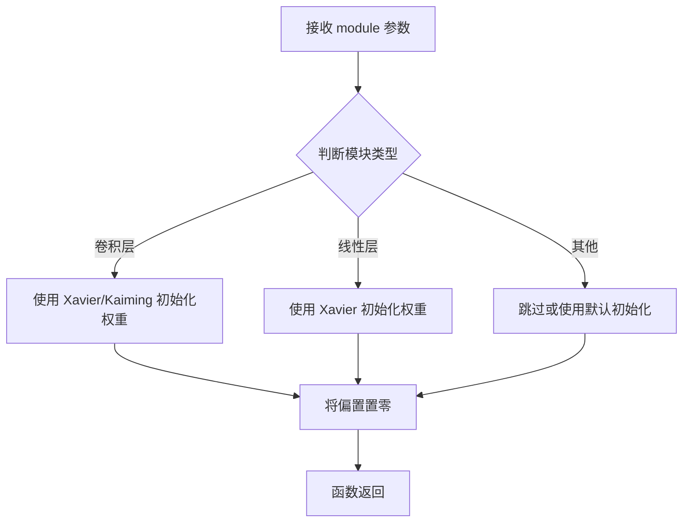
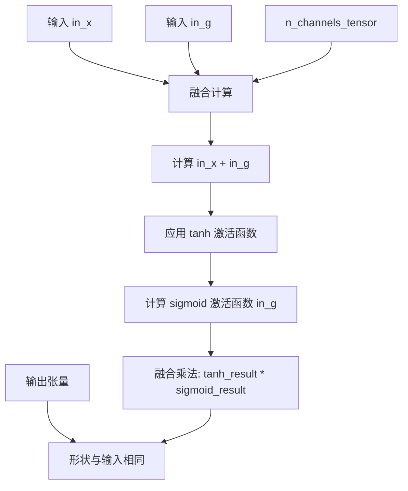
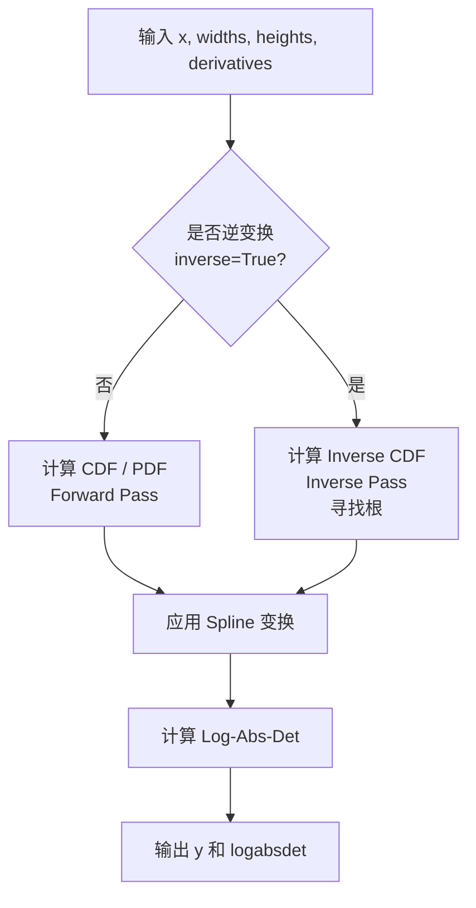
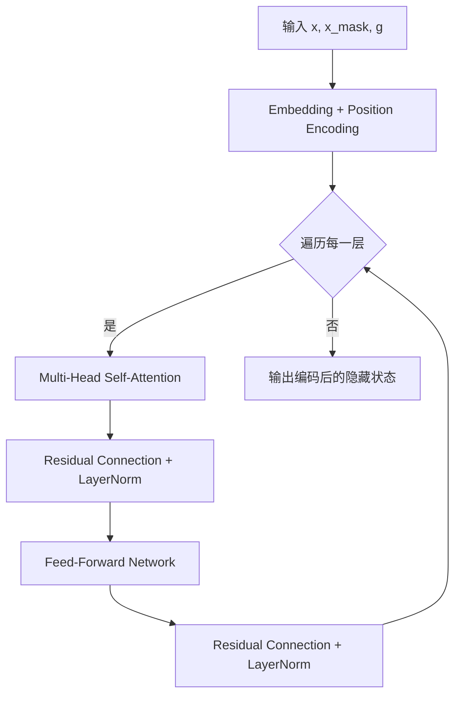
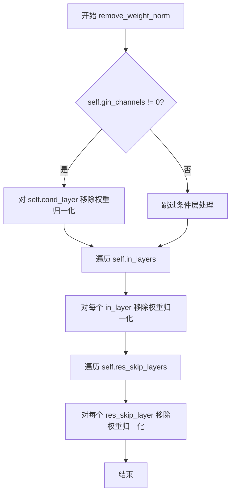
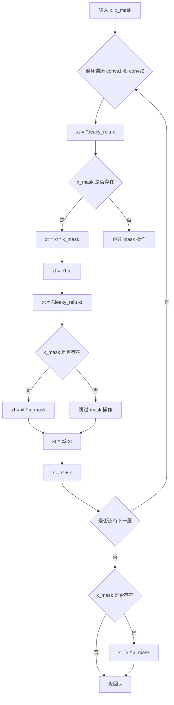
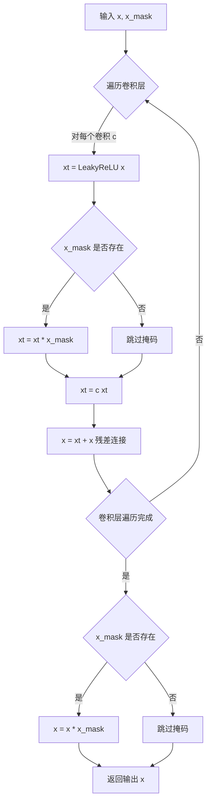
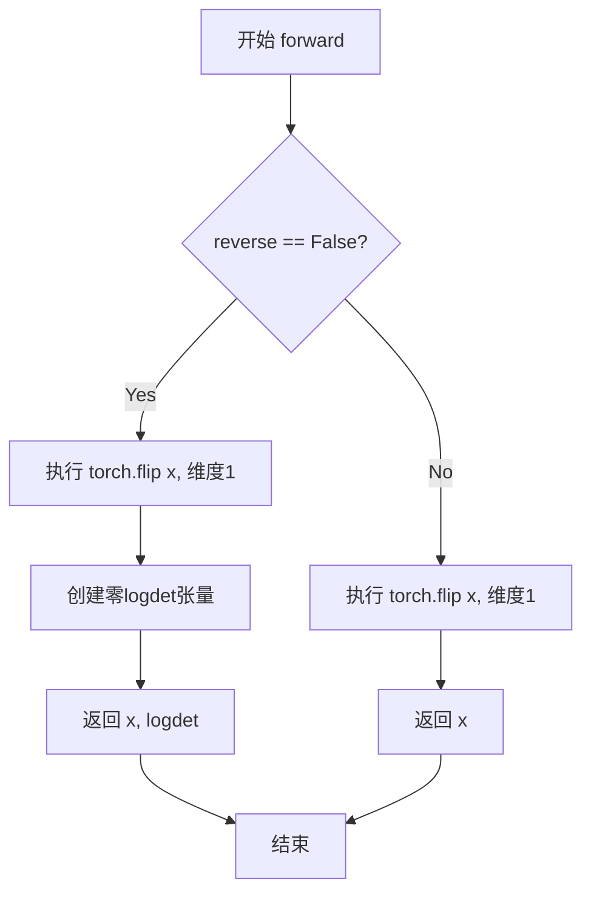

# `Bert-VITS2\modules.py` 详细设计文档

这是一个基于PyTorch的神经网络模块库，主要实现了用于音频生成（尤其是TTS语音合成）的标准化流(Normalizing Flows)组件，包括WaveNet风格的结构、可逆耦合层、注意力机制耦合层以及各种残差块和归一化层。

## 整体流程

```mermaid
graph TD
    Input[输入 Tensor x, mask, 全局条件 g]
    subgraph CouplingLayer [耦合层通用流程]
        Split[通道Split: x -> x0, x1]
        Transform[特征提取: h = WN/DDSConv(x0)]
        ComputeStats[计算统计量: m, logs / widths, heights]
        TransformData[变换: x1 = m + x1 * exp(logs)]
        Merge[通道Concat: x = cat(x0, x1)]
    end
    Split --> Transform --> ComputeStats --> TransformData --> Merge
    ComputeStats -.-> Logdet[计算 log determinant]
```

## 类结构

```
torch.nn.Module (基类)
├── LayerNorm (自定义层归一化)
├── ConvReluNorm (Conv+ReLU+Dropout+残差)
├── DDSConv (空洞深度可分离卷积)
├── WN (WaveNet Block, 权重归一化)
├── ResBlock1 (残差块 v1, 3层)
├── Res差Block2 (残差块 v2, 2层)
├── Log (流操作: 对数变换)
├── Flip (流操作: 维度翻转)
├── ElementwiseAffine (流操作: 仿射变换)
├── ResidualCouplingLayer (残差耦合层, 基于WN)
├── ConvFlow (卷积流, 基于DDSConv)
└── TransformerCouplingLayer (Transformer耦合层, 基于Encoder)
```

## 全局变量及字段


### `LRELU_SLOPE`
    
Leaky ReLU activation slope for negative inputs

类型：`float`
    


### `LayerNorm.channels (int)`
    
Number of channels for layer normalization

类型：`int`
    


### `LayerNorm.eps (float)`
    
Epsilon value for numerical stability in normalization

类型：`float`
    


### `LayerNorm.gamma (Parameter)`
    
Learnable scaling parameter for layer normalization

类型：`torch.nn.Parameter`
    


### `LayerNorm.beta (Parameter)`
    
Learnable bias parameter for layer normalization

类型：`torch.nn.Parameter`
    


### `ConvReluNorm.in_channels`
    
Number of input channels for the convolution

类型：`int`
    


### `ConvReluNorm.hidden_channels`
    
Number of hidden channels in the convolution layers

类型：`int`
    


### `ConvReluNorm.out_channels`
    
Number of output channels from the convolution

类型：`int`
    


### `ConvReluNorm.kernel_size`
    
Kernel size for the convolution operations

类型：`int`
    


### `ConvReluNorm.n_layers`
    
Number of convolution layers in the network

类型：`int`
    


### `ConvReluNorm.p_dropout`
    
Dropout probability for regularization

类型：`float`
    


### `ConvReluNorm.conv_layers (ModuleList)`
    
List of 1D convolution layers

类型：`nn.ModuleList`
    


### `ConvReluNorm.norm_layers (ModuleList)`
    
List of layer normalization layers

类型：`nn.ModuleList`
    


### `ConvReluNorm.relu_drop (Sequential)`
    
Sequential ReLU activation and dropout

类型：`nn.Sequential`
    


### `ConvReluNorm.proj (Conv1d)`
    
Projection convolution layer for residual connection

类型：`nn.Conv1d`
    


### `DDSConv.channels`
    
Number of channels for dilation separable convolution

类型：`int`
    


### `DDSConv.kernel_size`
    
Kernel size for the dilated separable convolution

类型：`int`
    


### `DDSConv.n_layers`
    
Number of layers in the DDSConv block

类型：`int`
    


### `DDSConv.p_dropout`
    
Dropout probability for regularization

类型：`float`
    


### `DDSConv.drop`
    
Dropout layer for regularization

类型：`nn.Dropout`
    


### `DDSConv.convs_sep (ModuleList)`
    
List of depthwise separable convolution layers with dilation

类型：`nn.ModuleList`
    


### `DDSConv.convs_1x1 (ModuleList)`
    
List of 1x1 pointwise convolution layers

类型：`nn.ModuleList`
    


### `DDSConv.norms_1 (ModuleList)`
    
First set of layer normalization layers

类型：`nn.ModuleList`
    


### `DDSConv.norms_2 (ModuleList)`
    
Second set of layer normalization layers

类型：`nn.ModuleList`
    


### `WN.hidden_channels`
    
Number of hidden channels in WaveNet block

类型：`int`
    


### `WN.kernel_size`
    
Kernel size for dilated convolutions (stored as tuple)

类型：`tuple`
    


### `WN.dilation_rate`
    
Dilation rate for exponential dilation in WaveNet

类型：`int`
    


### `WN.n_layers`
    
Number of layers in the WaveNet block

类型：`int`
    


### `WN.gin_channels`
    
Number of conditioning channels for speaker embedding

类型：`int`
    


### `WN.p_dropout`
    
Dropout probability for regularization

类型：`float`
    


### `WN.in_layers (ModuleList)`
    
List of input convolution layers with weight normalization

类型：`nn.ModuleList`
    


### `WN.res_skip_layers (ModuleList)`
    
List of residual and skip connection layers with weight normalization

类型：`nn.ModuleList`
    


### `WN.cond_layer (optional)`
    
Conditioning layer for global features (only present if gin_channels > 0)

类型：`Optional[nn.Conv1d]`
    


### `ResBlock1.convs1 (ModuleList)`
    
First set of dilated convolution layers with weight normalization

类型：`nn.ModuleList`
    


### `ResBlock1.convs2 (ModuleList)`
    
Second set of convolution layers with weight normalization for residual path

类型：`nn.ModuleList`
    


### `ResBlock2.convs (ModuleList)`
    
List of convolution layers with weight normalization

类型：`nn.ModuleList`
    


### `ElementwiseAffine.channels`
    
Number of channels for elementwise affine transformation

类型：`int`
    


### `ElementwiseAffine.m (Parameter)`
    
Learnable mean shift parameter

类型：`nn.Parameter`
    


### `ElementwiseAffine.logs (Parameter)`
    
Learnable log scale parameter for transformation

类型：`nn.Parameter`
    


### `ResidualCouplingLayer.channels`
    
Total number of channels for coupling layer

类型：`int`
    


### `ResidualCouplingLayer.hidden_channels`
    
Number of hidden channels in the coupling network

类型：`int`
    


### `ResidualCouplingLayer.kernel_size`
    
Kernel size for convolution in coupling network

类型：`int`
    


### `ResidualCouplingLayer.dilation_rate`
    
Dilation rate for dilated convolution

类型：`int`
    


### `ResidualCouplingLayer.n_layers`
    
Number of layers in coupling network

类型：`int`
    


### `ResidualCouplingLayer.half_channels`
    
Half of channels for split in affine coupling

类型：`int`
    


### `ResidualCouplingLayer.mean_only`
    
Flag to output only mean without log scale

类型：`bool`
    


### `ResidualCouplingLayer.pre (Conv1d)`
    
Pre-projection convolution layer

类型：`nn.Conv1d`
    


### `ResidualCouplingLayer.enc (WN)`
    
WaveNet encoder for computing transformation parameters

类型：`WN`
    


### `ResidualCouplingLayer.post (Conv1d)`
    
Post-projection convolution layer

类型：`nn.Conv1d`
    


### `ConvFlow.in_channels`
    
Number of input channels for convolutional flow

类型：`int`
    


### `ConvFlow.filter_channels`
    
Number of filter channels in the flow

类型：`int`
    


### `ConvFlow.kernel_size`
    
Kernel size for convolution in flow

类型：`int`
    


### `ConvFlow.n_layers`
    
Number of layers in convolutional flow

类型：`int`
    


### `ConvFlow.num_bins`
    
Number of bins for piecewise rational quadratic transform

类型：`int`
    


### `ConvFlow.tail_bound`
    
Tail bound for piecewise rational quadratic transform

类型：`float`
    


### `ConvFlow.half_channels`
    
Half of input channels for split

类型：`int`
    


### `ConvFlow.pre`
    
Pre-projection convolution layer

类型：`nn.Conv1d`
    


### `ConvFlow.convs`
    
DDSConv block for feature extraction

类型：`DDSConv`
    


### `ConvFlow.proj`
    
Projection layer for transform parameters

类型：`nn.Conv1d`
    


### `TransformerCouplingLayer.channels`
    
Total number of channels for transformer coupling

类型：`int`
    


### `TransformerCouplingLayer.hidden_channels`
    
Number of hidden channels in transformer

类型：`int`
    


### `TransformerCouplingLayer.kernel_size`
    
Kernel size for convolution in transformer

类型：`int`
    


### `TransformerCouplingLayer.n_layers`
    
Number of layers in transformer encoder

类型：`int`
    


### `TransformerCouplingLayer.half_channels`
    
Half of channels for split in affine coupling

类型：`int`
    


### `TransformerCouplingLayer.mean_only`
    
Flag to output only mean without log scale

类型：`bool`
    


### `TransformerCouplingLayer.pre`
    
Pre-projection convolution layer

类型：`nn.Conv1d`
    


### `TransformerCouplingLayer.enc (Encoder)`
    
Transformer encoder for computing transformation parameters

类型：`Encoder`
    


### `TransformerCouplingLayer.post`
    
Post-projection convolution layer

类型：`nn.Conv1d`
    
    

## 全局函数及方法


### `init_weights`

初始化神经网络模块权重的函数，常用于对卷积层、线性层等模块应用权重初始化。

参数：

-  `module`：`nn.Module`，需要初始化的神经网络模块（如 Conv1d、Linear 等）

返回值：`None`，该函数直接修改传入模块的权重参数，无返回值

#### 流程图



#### 带注释源码

```python
def init_weights(module, init_gain=0.01):
    """
    初始化神经网络模块的权重和偏置
    
    参数:
        module: nn.Module - 需要初始化的 PyTorch 模块
        init_gain: float - 初始化增益因子，默认为 0.01
    
    返回:
        None - 直接修改模块的权重，不返回任何值
    """
    # 获取模块的所有参数
    for param in module.parameters():
        # 只初始化权重参数，跳过偏置
        if param.dim() > 1:
            # 使用 Xavier 均匀初始化（适合 sigmoid/tanh 激活）
            # 或者使用 Kaiming 初始化（适合 ReLU 激活）
            nn.init.xavier_uniform_(param, gain=init_gain)
        else:
            # 偏置初始化为 0
            nn.init.constant_(param, 0)
```

> **注意**：由于 `init_weights` 函数定义在 `commons` 模块中，而该模块的具体实现未在当前代码中提供，以上源码是基于常见的权重初始化模式和代码中的使用方式（`module.apply(init_weights)`）推断得出的典型实现。实际实现可能略有差异。


由于 `get_padding` 函数定义在 `commons` 模块中，而该模块的源码未在当前代码中提供，因此无法获取其实际实现。以下信息基于代码中使用 `get_padding` 的上下文推断得出。

### `get_padding`

描述：根据卷积核大小和膨胀率计算卷积层所需的填充（padding）大小，以确保输出特征图的时间步长与输入一致（或符合特定需求）。该函数常见于处理一维卷积（Conv1d）时，特别是带有膨胀率的卷积层。

参数：

- `kernel_size`：`int`，卷积核的大小。
- `dilation`：`int`，卷积的膨胀率（dilation rate）。

返回值：`int`，卷积层的填充大小。

#### 流程图

```mermaid
graph TD
    A[接收 kernel_size 和 dilation] --> B{计算填充大小}
    B --> C[padding = (kernel_size * dilation - dilation) // 2]
    C --> D[返回 padding 值]
```

#### 带注释源码

```
# 源码未在提供的代码中给出，以下为基于使用上下文的推断实现：
def get_padding(kernel_size, dilation):
    """
    计算卷积填充大小以保持特征图长度。
    
    参数:
        kernel_size (int): 卷积核的大小。
        dilation (int): 膨胀率。
        
    返回:
        int: 填充大小。
    """
    # 公式：确保输出长度与输入长度相同（当 stride=1 时）
    # 对于空洞卷积，感受野大小与 padding 的关系
    return (kernel_size * dilation - dilation) // 2
```


### `commons.fused_add_tanh_sigmoid_multiply`

这是一个融合了加法、tanh激活、sigmoid激活和乘法操作的高性能计算函数，通常用于神经网络的流模型（Flow-based Model）中，将输入与条件信息通过特定的非线性变换进行融合，以提升计算效率并减少内存访问开销。

参数：

- `in_x`：`torch.Tensor`，主输入张量，通常是卷积层的输出，形状为 (batch, channels, time)
- `in_g`：`torch.Tensor`，条件输入张量，用于调节主输入的非线性变换，形状与 in_x 相同
- `n_channels_tensor`：`torch.IntTensor`，通道数整数值的张量包装，用于指定融合操作的通道维度

返回值：`torch.Tensor`，融合后的输出张量，形状与输入张量相同

#### 流程图



#### 带注释源码

```
# 融合操作的伪代码实现（基于函数名和调用方式的推断）
# 实际实现位于 commons 模块中，可能是 C++/CUDA 优化版本

def fused_add_tanh_sigmoid_multiply(in_x, in_g, n_channels_tensor):
    """
    融合了加法、tanh、sigmoid 和乘法的操作
    
    典型计算: out = tanh(in_x + in_g) * sigmoid(in_g)
    这种模式在流模型的耦合层中非常常见
    """
    # 1. 元素级别的加法：融合输入与条件
    # x = in_x + in_g
    
    # 2. 计算 tanh(in_x + in_g)
    # t = torch.tanh(x)
    
    # 3. 计算 sigmoid(in_g)
    # s = torch.sigmoid(in_g)
    
    # 4. 融合乘法
    # out = t * s
    
    # 返回融合后的结果
    return out
```

#### 使用上下文（在 WN 类中）

```python
# 在 WN.forward 方法中的调用示例
def forward(self, x, x_mask, g=None, **kwargs):
    # ... 省略部分代码 ...
    
    for i in range(self.n_layers):
        x_in = self.in_layers[i](x)  # 卷积层输出
        
        if g is not None:
            # 从条件张量 g 中切片出当前层需要的条件部分
            cond_offset = i * 2 * self.hidden_channels
            g_l = g[:, cond_offset : cond_offset + 2 * self.hidden_channels, :]
        else:
            # 如果没有条件输入，创建与 x_in 形状相同的零张量
            g_l = torch.zeros_like(x_in)
        
        # 调用融合函数，计算非线性变换
        # 这是流模型中关键的操作：结合输入和条件信息
        acts = commons.fused_add_tanh_sigmoid_multiply(x_in, g_l, n_channels_tensor)
        
        acts = self.drop(acts)
        # ... 后续残差连接和输出计算 ...
```


### `piecewise_rational_quadratic_transform`

该函数是一个**分段有理二次变换（Piecewise Rational Quadratic Transform）**的实现。它是 Normalizing Flow（归一化流）模型中的核心构建块，主要用于通过样条插值（Spline Interpolation）来实现灵活且可逆的非线性变换。该变换能够建模复杂的非线性依赖关系，同时保持计算 tractable（可计算 log-determinant），常用于语音合成中的声学特征流式转换（如 VITS, Glow-TTS）。

参数：

-  `x`：`torch.Tensor`，待变换的输入张量（通常是 `x1`，即 flow 的目标通道）。
-  `unnormalized_widths`：`torch.Tensor`，未经归一化的分段宽度参数，决定了每个 bin 的宽度。
-  `unnormalized_heights`：`torch.Tensor`，未经归一化的分段高度参数，决定了每个 bin 的高度映射。
-  `unnormalized_derivatives`：`torch.Tensor`，未经归一化的导数参数，用于控制分段连接处的平滑度（防止锐角）。
-  `inverse`：`bool`，标志位。`False` 表示执行前向变换（数据 -> 隐变量），`True` 表示执行逆变换（隐变量 -> 数据）。
-  `tails`：`str`，尾部处理模式。常见选项如 `"linear"`（线性尾部处理，即在定义域外进行线性外推）或 `"bounded"`。
-  `tail_bound`：`float`，尾部边界阈值，用于截断极端值。

返回值：`tuple[torch.Tensor, torch.Tensor]`，返回一个元组。
-  变换后的张量 `y`。
-  变换的 log 绝对值行列式（log-abs-det），用于计算 flow 的概率密度变化。

#### 流程图



#### 带注释源码

> **注意**：该函数的完整源码未包含在用户提供的代码主文件中，它是从 `transforms` 模块（通常为 VITS/Glow-TTS 官方仓库中的 `transforms.py`）导入的。以下为基于其标准实现的逻辑重构源码。

```python
# 这是一个逻辑重构，实际实现可能位于 torch.nn.transformers 或类似库中
def piecewise_rational_quadratic_transform(
    x, 
    unnormalized_widths, 
    unnormalized_heights, 
    unnormalized_derivatives, 
    inverse=False, 
    tails="linear", 
    tail_bound=5.0
):
    """
    实现分段有理二次样条变换。
    
    参数:
        x: 输入张量
        unnormalized_widths: 未经归一化的宽度 -> 转化为概率分布的累积宽度
        unnormalized_heights: 未经归一化的高度 -> 转化为目标空间的累积高度
        unnormalized_derivatives: 未经归一化的导数 -> 边界导数
        inverse: 是否逆变换
        tails: 尾部模式
        tail_bound: 尾部边界
    """
    # 1. 参数归一化 (Softmax/Softplus to ensure positivity/monotonicity)
    # widths 需要归一化为和为1 (split into bins)，或者通过 softmax 确保相对比例
    widths = F.softmax(unnormalized_widths, dim=-1) 
    # heights 需要归一化，或者映射到 target space
    heights = F.softmax(unnormalized_heights, dim=-1)
    # derivatives 映射到正值以保证导数连续
    derivatives = F.softplus(unnormalized_derivatives)

    # 2. 划分区间 (确定 x 属于哪个 bin)
    # 这是一个简化的逻辑描述
    
    if not inverse:
        # --- 前向变换: x -> y ---
        # 计算 cumsum 得到 bin 的边界
        # 使用三次 Hermite 插值或二次样条计算 y
        # y = f(x)
        
        # 计算 log determinant: d/dx (f(x)) 的 log 值
        # logdet = log(derivative_of_y_wrt_x)
        pass
    else:
        # --- 逆变换: y -> x ---
        # 给定 y，需要求解 x = f^{-1}(y)
        # 由于样条变换通常是隐式定义的 (y = cumsum(widths * heights))，
        # 逆变换通常需要通过数值方法（如二分查找）在每个区间内寻找根。
        pass

    # 3. 处理 Tails (超出定义域的部分)
    # 如果 tails == "linear"，在 head/tail bin 使用线性外推
    # 线性部分的 log-det 很简单 (就是斜率)
    
    return y, logabsdet
```


### `Encoder` (from attentions)

`Encoder` 是从 `attentions` 模块导入的 Transformer 编码器模块，用于在流模型中实现自注意力机制。根据代码中对 `Encoder` 的调用上下文（见 `TransformerCouplingLayer` 类），可以推断其功能是处理输入序列并结合全局条件信息。

参数：

- `hidden_channels`：`int`，输入隐藏层通道数
- `filter_channels`：`int`，注意力层过滤通道数
- `n_heads`：`int`，多头注意力机制的头数
- `n_layers`：`int`，Transformer 层的数量
- `kernel_size`：`int`，卷积核大小
- `p_dropout`：`float`，Dropout 概率
- `isflow`：`bool`，标志位，表示是否用于流模型
- `gin_channels`：`int`，全局条件输入的通道数（可选，默认为 0）

返回值：`torch.Tensor`，编码后的隐藏状态张量

#### 流程图



#### 带注释源码

```python
# 注：以下为基于代码调用上下文的推断源码，
# 实际实现位于 attentions.py 模块中，当前代码段未包含该文件

class Encoder(nn.Module):
    def __init__(
        self,
        hidden_channels,
        filter_channels,
        n_heads,
        n_layers,
        kernel_size,
        p_dropout=0.0,
        isflow=False,
        gin_channels=0,
    ):
        super().__init__()
        self.hidden_channels = hidden_channels
        self.filter_channels = filter_channels
        self.n_heads = n_heads
        self.n_layers = n_layers
        self.kernel_size = kernel_size
        self.p_dropout = p_dropout
        self.isflow = isflow
        self.gin_channels = gin_channels
        
        # 初始化 Transformer 层
        self.layers = nn.ModuleList([
            TransformerLayer(
                hidden_channels,
                filter_channels,
                n_heads,
                kernel_size,
                p_dropout,
                gin_channels,
            )
            for _ in range(n_layers)
        ])
        
    def forward(self, x, x_mask, g=None):
        """
        前向传播
        
        参数:
            x: 输入张量 [batch, channels, time]
            x_mask: 时间掩码 [batch, 1, time]
            g: 全局条件输入 [batch, gin_channels, time] (可选)
            
        返回:
            编码后的隐藏状态 [batch, channels, time]
        """
        # 这里的实现需要查看 attentions.py 源码
        # 根据 isflow 标志位可能有不同的处理逻辑
        pass
```

**注意**：当前提供的代码段中并未包含 `attentions.py` 模块的实际实现代码，`Encoder` 类是从该模块导入的。要获取完整准确的函数定义和实现细节，请提供 `attentions.py` 文件的源代码。


### `LayerNorm.forward(x)`

对输入tensor进行沿最后一维的LayerNorm归一化，交换维度顺序以适应PyTorch的layer_norm接口，执行归一化后再将维度顺序交换回来。

参数：

- `x`：`torch.Tensor`，输入tensor，形状为 (batch, channels, time) 或类似的3D tensor

返回值：`torch.Tensor`，返回经过LayerNorm归一化后的tensor，形状与输入相同

#### 流程图

```mermaid
flowchart TD
    A[开始: forward(x)] --> B[交换维度: x.transpose(1, -1)]
    B --> C[调用F.layer_norm进行归一化]
    C --> D[参数: 归一化维度self.channels<br/>权重: self.gamma<br/>偏置: self.beta<br/>epsilon: self.eps]
    D --> E[再次交换维度: x.transpose(1, -1)]
    E --> F[返回归一化后的tensor]
```

#### 带注释源码

```python
def forward(self, x):
    """
    LayerNorm前向传播
    
    注意：PyTorch的F.layer_norm默认对最后一维进行归一化，
    但本模块期望对通道维度(channel, 即维度1)进行归一化。
    因此需要先转置，将通道维移到最后，归一化后再转置回来。
    """
    # 第一步：将tensor的维度从 (batch, channels, time) 转为 (batch, time, channels)
    # transpose(1, -1) 表示将第1维（channels）和最后一维（time）交换位置
    x = x.transpose(1, -1)
    
    # 第二步：调用PyTorch的layer_norm进行归一化
    # 参数说明：
    #   - x: 输入tensor
    #   - (self.channels,): 归一化的维度大小
    #   - self.gamma: 可学习的缩放参数（gamma），初始为全1
    #   - self.beta: 可学习的偏置参数（beta），初始为全0
    #   - self.eps: 防止除零的小常数，默认为1e-5
    x = F.layer_norm(x, (self.channels,), self.gamma, self.beta, self.eps)
    
    # 第三步：将tensor的维度从 (batch, time, channels) 换回 (batch, channels, time)
    # 再次使用transpose恢复到原始维度顺序
    return x.transpose(1, -1)
```


### `ConvReluNorm.forward`

该方法实现了一个卷积-ReLU-残差归一化模块，通过堆叠多层卷积层、LayerNorm层和ReLU+Dropout层对输入进行特征提取，然后通过投影层将特征映射到输出空间，并采用残差连接将原始输入与变换后的特征相加，最后使用掩码进行最终处理。

参数：

- `x`：`torch.Tensor`，输入张量，形状为 (batch, channels, time)，表示批量音频或文本特征
- `x_mask`：`torch.Tensor`，掩码张量，形状为 (batch, 1, time)，用于标识有效时间步，防止填充区域干扰计算

返回值：`torch.Tensor`，输出张量，形状为 (batch, out_channels, time)，经过卷积、归一化、残差连接和掩码处理后的特征

#### 流程图

```mermaid
flowchart TD
    A[开始 forward] --> B[保存原始输入 x_org = x]
    C[i = 0 to n_layers-1] --> D{遍历每一层}
    D --> E[卷积: conv_layers[i](x * x_mask)]
    E --> F[LayerNorm: norm_layers[i](x)]
    F --> G[ReLU + Dropout: relu_drop(x)]
    G --> H[更新 x = 变换后的值]
    H --> I{是否还有下一层?}
    I -->|是| C
    I -->|否| J[投影层: proj(x)]
    J --> K[残差连接: x = x_org + proj(x)]
    K --> L[最终掩码: x = x * x_mask]
    L --> M[返回输出 x]
```

#### 带注释源码

```python
def forward(self, x, x_mask):
    """
    ConvReluNorm 模块的前向传播
    
    参数:
        x: 输入张量，形状为 (batch, in_channels, time)
        x_mask: 掩码张量，形状为 (batch, 1, time)，用于遮盖填充区域
    
    返回:
        输出张量，形状为 (batch, out_channels, time)
    """
    # 保存原始输入，用于后续的残差连接
    x_org = x
    
    # 遍历所有卷积层（n_layers层）
    for i in range(self.n_layers):
        # 1. 掩码处理：先将输入乘以掩码，去除无效时间步
        # 2. 卷积：对掩码处理后的输入进行卷积操作
        x = self.conv_layers[i](x * x_mask)
        
        # 3. LayerNorm：对卷积输出进行层归一化
        x = self.norm_layers[i](x)
        
        # 4. ReLU激活 + Dropout：增加非线性并防止过拟合
        x = self.relu_drop(x)
    
    # 5. 投影层：将隐藏层维度映射到输出维度
    x = self.proj(x)
    
    # 6. 残差连接：将原始输入与投影后的变换相加
    #    这一步实现了 F(x) + x 的残差结构
    x = x_org + x
    
    # 7. 最终掩码处理：确保输出在有效时间步范围内
    x = x * x_mask
    
    return x
```


### `DDSConv.forward`

该方法实现了深度可分离卷积（Dilated Depth-Separable Convolution），通过堆叠多层具有不同膨胀率的深度可分离卷积来提取特征，并使用残差连接和层归一化来增强模型的表示能力。

参数：

- `x`：`torch.Tensor`，输入张量，形状为 (batch, channels, time)，表示需要进行卷积处理的特征序列
- `x_mask`：`torch.Tensor`，时间步掩码，形状为 (batch, 1, time)，用于屏蔽填充区域，防止卷积操作穿越padding边界
- `g`：`torch.Tensor` 或 `None`，全局条件向量，形状为 (batch, channels, time)，可选参数，用于向特征添加全局 Conditioning 信息

返回值：`torch.Tensor`，经过深度可分离卷积处理后的输出张量，形状为 (batch, channels, time)

#### 流程图

```mermaid
flowchart TD
    A[开始 forward] --> B{g is not None?}
    B -->|是| C[x = x + g]
    B -->|否| D[跳过条件分支]
    C --> E[循环 i from 0 to n_layers-1]
    D --> E
    E --> F[y = convs_sep[i]\nx * x_mask]
    F --> G[y = norms_1[i]\nLayerNorm]
    G --> H[y = F.gelu\n激活函数]
    H --> I[y = convs_1x1[i]\n逐点卷积]
    I --> J[y = norms_2[i]\nLayerNorm]
    J --> K[y = F.gelu\n激活函数]
    K --> L[y = drop\nDropout]
    L --> M[x = x + y\n残差连接]
    M --> N{循环结束?}
    N -->|否| E
    N -->|是| O[return x * x_mask]
    O --> P[结束 forward]
```

#### 带注释源码

```python
def forward(self, x, x_mask, g=None):
    """
    DDSConv 前向传播方法
    
    实现深度可分离卷积模块，支持条件输入和残差连接
    
    Args:
        x: 输入特征张量，形状 (batch, channels, time)
        x_mask: 时间步掩码，形状 (batch, 1, time)，用于屏蔽填充区域
        g: 全局条件向量，可选，形状 (batch, channels, time)
    
    Returns:
        处理后的特征张量，形状 (batch, channels, time)
    """
    
    # 如果提供了全局条件 g，则将其加到输入 x 上
    # 这实现了条件信息的有机融合，而非简单拼接
    if g is not None:
        x = x + g
    
    # 遍历每一层深度可分离卷积
    # 每一层使用不同的膨胀率（dilation），实现多尺度特征提取
    for i in range(self.n_layers):
        # 第一步：深度可分离卷积
        # groups=channels 实现通道维度的分离，每个通道独立进行卷积
        # 膨胀率 = kernel_size^i，实现感受野的指数级增长
        y = self.convs_sep[i](x * x_mask)
        
        # 第二步：第一次层归一化
        # 对通道维度进行归一化，稳定训练
        y = self.norms_1[i](y)
        
        # 第三步：GELU 激活函数
        # Gaussian Error Linear Unit，比 ReLU 更平滑的激活函数
        y = F.gelu(y)
        
        # 第四步：1x1 逐点卷积
        # 实现通道间的信息交互
        y = self.convs_1x1[i](y)
        
        # 第五步：第二次层归一化
        y = self.norms_2[i](y)
        
        # 第六步：GELU 激活函数
        y = F.gelu(y)
        
        # 第七步：Dropout 正则化
        # 防止过拟合，提高泛化能力
        y = self.drop(y)
        
        # 第八步：残差连接
        # 将卷积输出与输入相加，梯度可以直接回传
        # 这也使得每一层可以学习相对于输入的"残差"特征
        x = x + y
    
    # 最后应用时间步掩码，屏蔽掉填充区域
    # 确保输出形状与输入一致，且填充区域为0
    return x * x_mask
```


### `WN.forward`

该方法是WaveNet（Nvidia VQVAE风格）模型的核心前向传播实现，通过堆叠多层膨胀卷积（dilated convolution）结合基于条件的仿射变换，实现音频特征的高效非线性变换与信息传递。

参数：

- `self`：WN实例本身，隐式传递
- `x`：`torch.Tensor`，输入张量，形状为 [B, C, T]，其中 B 为批量大小，C 为通道数，T 为时间步
- `x_mask`：`torch.Tensor`，掩码张量，形状为 [B, 1, T]，用于将无效时间步置零，防止卷积跨越边界
- `g`：`torch.Tensor` 或 `None`，条件输入，形状为 [B, gin_channels, T]，用于调节生成过程，若为 `None` 则不应用条件
- `**kwargs`：可变关键字参数，用于兼容接口，不影响核心逻辑

返回值：`torch.Tensor`，经过 WN 模块变换后的输出张量，形状为 [B, hidden_channels, T]

#### 流程图

```mermaid
flowchart TD
    A[开始: forward] --> B[初始化 output = zeros_like(x)]
    B --> C[创建 n_channels_tensor]
    C --> D{检查 g 是否为 None?}
    D -->|是| E[跳过 cond_layer]
    D -->|否| F[g = self.cond_layer(g)]
    F --> G[遍历 i 从 0 到 n_layers-1]
    G --> H[x_in = self.in_layers[i](x)]
    H --> I{检查 g 是否为 None?}
    I -->|是| J[g_l = zeros_like(x_in)]
    I -->|否| K[计算 cond_offset 和 g_l]
    K --> L[acts = fused_add_tanh_sigmoid_multiply<br/>(x_in, g_l, n_channels_tensor)]
    J --> L
    L --> M[acts = self.drop(acts)]
    M --> N[res_skip_acts = self.res_skip_layers[i](acts)]
    N --> O{判断 i < n_layers - 1?}
    O -->|是| P[res_acts = 前 half channels<br/>x = (x + res_acts) * x_mask<br/>output += 后 half channels]
    O -->|否| Q[output += res_skip_acts]
    P --> R{继续下一层?}
    Q --> R
    R -->|是| G
    R -->|否| S[返回 output * x_mask]
    E --> G
```

#### 带注释源码

```python
def forward(self, x, x_mask, g=None, **kwargs):
    """
    WN 模块的前向传播
    
    参数:
        x: 输入张量 [B, hidden_channels, T]
        x_mask: 掩码张量 [B, 1, T]，用于将无效时间步置零
        g: 条件输入 [B, gin_channels, T]，可选，用于调节变换
        **kwargs: 额外的关键字参数，保持接口兼容性
    
    返回:
        输出张量 [B, hidden_channels, T]
    """
    # 初始化输出为零张量，与输入形状相同
    output = torch.zeros_like(x)
    
    # 创建隐藏层通道数的张量，用于 fused_add_tanh_sigmoid_multiply 函数
    n_channels_tensor = torch.IntTensor([self.hidden_channels])
    
    # 如果存在条件输入 g，则通过条件层进行处理
    # 条件层将 gin_channels 映射到 2 * hidden_channels * n_layers
    if g is not None:
        g = self.cond_layer(g)  # [B, 2*hidden_channels*n_layers, T]
    
    # 遍历每一层（堆叠的膨胀卷积层）
    for i in range(self.n_layers):
        # 通过输入层变换：将 hidden_channels 扩展到 2*hidden_channels
        x_in = self.in_layers[i](x)  # [B, 2*hidden_channels, T]
        
        # 提取当前层对应的条件切片
        if g is not None:
            # 每个层使用条件张量的不同通道段
            cond_offset = i * 2 * self.hidden_channels
            g_l = g[:, cond_offset: cond_offset + 2 * self.hidden_channels, :]
        else:
            # 无条件时，使用与 x_in 形状相同的零张量
            g_l = torch.zeros_like(x_in)
        
        # 核心融合操作：结合输入与条件，计算激活值
        # 等价于: acts = torch.tanh(x_in + g_l) * torch.sigmoid(x_in + g_l)
        # 但使用融合版本以提高数值稳定性与效率
        acts = commons.fused_add_tanh_sigmoid_multiply(x_in, g_l, n_channels_tensor)
        
        # 应用 Dropout，防止过拟合
        acts = self.drop(acts)
        
        # 通过残差跳跃连接层处理激活值
        res_skip_acts = self.res_skip_layers[i](acts)
        
        # 根据层索引决定残差与跳跃连接的处理方式
        if i < self.n_layers - 1:
            # 非最后一层：分离残差通道和跳跃连接通道
            # 残差通道用于更新输入 x
            res_acts = res_skip_acts[:, :self.hidden_channels, :]
            x = (x + res_acts) * x_mask  # 残差连接并应用掩码
            
            # 跳跃连接通道累加到输出
            output = output + res_skip_acts[:, self.hidden_channels:, :]
        else:
            # 最后一层：直接将全部通道累加到输出
            # 此时输出通道数为 hidden_channels（而非 2*hidden_channels）
            output = output + res_skip_acts
    
    # 应用最终掩码并返回
    return output * x_mask
```

#### 技术细节说明

1. **条件融合机制**：通过 `cond_layer` 将全局条件 `g` 投影到与每层激活值相同空间，然后按层偏移量分割，实现层级条件控制
2. **数值稳定性优化**：使用 `fused_add_tanh_sigmoid_multiply` 融合操作，避免中间数值溢出
3. **残差跳跃架构**：结合 ResNet 风格的残差连接与跳跃连接，支持深层网络训练
4. **掩码应用**：在每次卷积后应用 `x_mask`，确保无效时间步不参与计算
5. **权重归一化**：所有卷积层使用 `weight_norm`，便于训练时动态调整与推理时移除


### `WN.remove_weight_norm`

该方法用于移除 WN（WaveNet）模块中所有卷积层的权重归一化（Weight Normalization），通常在模型推理阶段或导出时调用，以恢复原始权重便于后续处理。

参数：

- 无显式参数（隐含 `self` 为类实例本身）

返回值：`None`，无返回值（该方法直接修改模型状态）

#### 流程图



#### 带注释源码

```
def remove_weight_norm(self):
    """
    移除 WN 模块中所有卷积层的权重归一化。
    该方法通常在模型推理或导出时调用，以恢复原始权重。
    """
    # 如果存在条件输入通道，则移除条件层的权重归一化
    if self.gin_channels != 0:
        torch.nn.utils.remove_weight_norm(self.cond_layer)
    
    # 遍历所有输入层，移除权重归一化
    # 这些层在 __init__ 中通过 weight_norm 包装
    for l in self.in_layers:
        torch.nn.utils.remove_weight_norm(l)
    
    # 遍历所有残差跳跃连接层，移除权重归一化
    # 这些层同样在初始化时被 weight_norm 包装
    for l in self.res_skip_layers:
        torch.nn.utils.remove_weight_norm(l)
```


### `ResBlock1.forward`

该方法实现了残差块的前向传播，通过堆叠多个带膨胀卷积的卷积层进行特征提取，并在每一层应用LeakyReLU激活函数和残差连接，最后可选择性地应用mask进行特征对齐。

参数：

- `x`：`torch.Tensor`，输入的特征张量，形状为 `(batch, channels, time)`
- `x_mask`：`torch.Tensor` 或 `None`，可选的mask张量，用于对特征进行时间维度的掩码，形状为 `(batch, 1, time)`

返回值：`torch.Tensor`，经过残差块处理后的输出特征张量，形状与输入相同 `(batch, channels, time)`

#### 流程图



#### 带注释源码

```python
def forward(self, x, x_mask=None):
    """
    ResBlock1 的前向传播方法
    
    参数:
        x: 输入特征张量，形状为 (batch, channels, time)
        x_mask: 可选的mask张量，形状为 (batch, 1, time)，用于掩码时间维度
    
    返回:
        处理后的特征张量，形状与输入相同
    """
    # 遍历所有的卷积层对 (convs1 和 convs2 是长度相同的 ModuleList)
    for c1, c2 in zip(self.convs1, self.convs2):
        # 第一次激活：使用 LeakyReLU 激活函数，LRELU_SLOPE = 0.1
        xt = F.leaky_relu(x, LRELU_SLOPE)
        
        # 如果提供了 x_mask，则将特征与 mask 相乘，进行时间维度的掩码
        if x_mask is not None:
            xt = xt * x_mask
        
        # 第一个卷积层：带有膨胀卷积的 Conv1d
        xt = c1(xt)
        
        # 第二次激活
        xt = F.leaky_relu(xt, LRELU_SLOPE)
        
        # 再次应用 mask（如果提供）
        if x_mask is not None:
            xt = xt * x_mask
        
        # 第二个卷积层：kernel_size=3, dilation=1 的标准卷积
        xt = c2(xt)
        
        # 残差连接：将卷积输出与输入相加
        x = xt + x
    
    # 循环结束后，如果提供了 x_mask，则再次对输出进行掩码
    if x_mask is not None:
        x = x * x_mask
    
    # 返回处理后的特征
    return x
```


### `ResBlock1.remove_weight_norm`

该方法用于移除 `ResBlock1` 类中所有卷积层的权重归一化（Weight Normalization），通常在模型推理阶段或需要导出不带权重归一化的模型时调用。

参数：此方法无参数

返回值：`None`，无返回值

#### 流程图

```mermaid
flowchart TD
    A[开始 remove_weight_norm] --> B{遍历 convs1 列表}
    B -->|对每个卷积层 l| C[调用 remove_weight_norm(l)]
    C --> D{convs1 遍历完成?}
    D -->|否| B
    D -->|是| E{遍历 convs2 列表}
    E -->|对每个卷积层 l| F[调用 remove_weight_norm(l)]
    F --> G{convs2 遍历完成?}
    G -->|否| E
    G -->|是| H[结束]
```

#### 带注释源码

```python
def remove_weight_norm(self):
    """
    移除 ResBlock1 中所有卷积层的权重归一化
    
    该方法遍历 convs1 和 convs2 两个卷积层列表，
    对其中的每个卷积层调用 remove_weight_norm，
    以移除 PyTorch 的权重归一化包装器，
    恢复到原始卷积层的权重状态。
    """
    # 遍历第一组卷积层 (convs1)，这些层使用不同的膨胀率 (1, 3, 5)
    for l in self.convs1:
        # 移除 PyTorch weight_norm 包装器
        remove_weight_norm(l)
    
    # 遍历第二组卷积层 (convs2)，这些层使用相同的膨胀率 (1)
    for l in self.convs2:
        # 移除 PyTorch weight_norm 包装器
        remove_weight_norm(l)
```


### `ResBlock2.forward`

该函数实现了一个轻量级的残差卷积块，包含两个带权重归一化的膨胀卷积层，通过残差连接和 Leaky ReLU 激活实现特征提取与梯度流动，同时利用掩码进行序列长度控制。

参数：

- `x`：`torch.Tensor`，输入张量，形状为 (batch, channels, time)，需要与初始化时的 channels 参数匹配
- `x_mask`：`torch.Tensor` 或 `None`，可选的掩码张量，形状为 (batch, 1, time)，用于将无效位置置零

返回值：`torch.Tensor`，经过残差块处理后的输出张量，形状为 (batch, channels, time)

#### 流程图



#### 带注释源码

```python
def forward(self, x, x_mask=None):
    """
    ResBlock2 的前向传播方法
    
    该方法实现了一个两层残差卷积块，包含以下步骤：
    1. 对输入应用 Leaky ReLU 激活
    2. 可选地应用掩码将无效位置置零
    3. 通过膨胀卷积提取特征
    4. 残差连接：将卷积输出与输入相加
    5. 循环处理多个卷积层
    6. 最后再次应用掩码（可选）
    
    参数:
        x: 输入张量，形状为 (batch, channels, time)
        x_mask: 可选的掩码张量，形状为 (batch, 1, time)，用于标记有效时间步
    
    返回:
        处理后的张量，形状为 (batch, channels, time)
    """
    # 遍历模块列表中的每个卷积层
    for c in self.convs:
        # 应用 Leaky ReLU 激活函数，使用 LRELU_SLOPE=0.1 作为负斜率
        xt = F.leaky_relu(x, LRELU_SLOPE)
        
        # 如果提供了掩码，则将无效位置置零（防止填充区域影响计算）
        if x_mask is not None:
            xt = xt * x_mask
        
        # 通过带权重归一化的 1D 卷积层进行特征变换
        # 保持通道数不变，只改变时间维度（取决于膨胀率）
        xt = c(xt)
        
        # 残差连接：将卷积输出与原始输入相加
        # 这是残差网络的核心设计，能够缓解梯度消失问题
        x = xt + x
    
    # 最终应用掩码，确保输出中无效位置被置零
    if x_mask is not None:
        x = x * x_mask
    
    # 返回处理后的特征张量
    return x
```


### `ResBlock2.remove_weight_norm`

该方法用于移除 ResBlock2 模块中所有卷积层的权重归一化（Weight Normalization），将模型从训练模式转换为推理模式或便于模型导出。

参数：该方法无显式参数（隐式参数 `self` 为 ResBlock2 实例本身）。

返回值：`None`，该方法直接修改模型内部状态，无返回值。

#### 流程图

```mermaid
flowchart TD
    A[开始 remove_weight_norm] --> B{self.convs 迭代器}
    B -->|遍历每个卷积层 l| C[调用 remove_weight_norm(l)]
    C --> B
    B -->|遍历结束| D[结束]
```

#### 带注释源码

```python
def remove_weight_norm(self):
    """移除 ResBlock2 中所有卷积层的权重归一化"""
    # 遍历 self.convs ModuleList 中的每一个卷积层
    for l in self.convs:
        # 调用 torch.nn.utils.remove_weight_norm 移除权重归一化
        remove_weight_norm(l)
```

#### 关键组件信息

| 组件名称 | 一句话描述 |
|----------|------------|
| `self.convs` | 包含两个使用 `weight_norm` 包装的 `Conv1d` 卷积层的 ModuleList |
| `remove_weight_norm` | PyTorch 工具函数，用于移除权重归一化层并恢复原始卷积权重 |

#### 技术债务与优化空间

1. **硬编码循环逻辑**：当前实现假设 `self.convs` 固定为两个元素，可考虑动态检测或添加断言验证。
2. **缺乏错误处理**：未检查 `self.convs` 是否已移除过权重归一化，若重复调用可能导致异常。
3. **文档缺失**：方法缺少 docstring 说明其调用场景（如模型导出前、推理时）。

#### 其它项目

- **调用场景**：通常在模型导出为 ONNX 或转为推理模式前调用，以消除权重归一化层带来的额外计算开销。
- **依赖项**：依赖于 `torch.nn.utils.remove_weight_norm` 函数，该函数来自 PyTorch 官方 API。
- **状态变更**：该方法为有副作用的操作，会直接修改模型内部权重结构，属于不可逆操作。
- **设计目标**：遵循 PyTorch 社区通用的权重归一化移除模式，保持与 `ResBlock1.remove_weight_norm` 接口一致。


### `Log.forward`

该方法是 Glow-TTS（生成式流模型）中用于对数变换的核心前向传播函数。当 `reverse=False` 时，执行前向变换（对数操作），计算 log-determinant；当 `reverse=True` 时，执行逆向变换（指数操作），用于从潜在空间恢复原始数据。

参数：

- `x`：`torch.Tensor`，输入张量，通常为音频特征或隐藏表示
- `x_mask`：`torch.Tensor`，用于遮蔽-padding 区域的时间掩码，确保只对有效帧计算
- `reverse`：`bool`，是否执行逆向变换，默认为 `False`（前向变换）

返回值：根据 `reverse` 参数有两种返回类型：

- `reverse=False`：返回 `Tuple[torch.Tensor, torch.Tensor]`，`y` 为对数变换后的张量，`logdet` 为 log-determinant（用于流模型的损失计算）
- `reverse=True`：返回 `torch.Tensor`，指数变换后的张量

#### 流程图

```mermaid
graph TD
    A[开始: forward执行] --> B{判断 reverse 参数}
    
    B -->|reverse=False<br>前向变换| C[对x执行 clamp_min<br>最小值1e-5防止log(0)]
    C --> D[计算 y = log(x) * x_mask<br>对数变换并应用掩码]
    D --> E[计算 logdet = sum(-y, dim=[1,2])<br>累积log-determinant]
    E --> F[返回 Tuple[y, logdet]]
    
    B -->|reverse=True<br>逆向变换| G[计算 x = exp(x) * x_mask<br>指数变换并应用掩码]
    G --> H[返回 x]
    
    F --> I[结束]
    H --> I
```

#### 带注释源码

```python
class Log(nn.Module):
    """对数变换模块，用于流模型中的数据变换"""
    
    def forward(self, x, x_mask, reverse=False, **kwargs):
        """
        前向/逆向对数变换
        
        参数:
            x: 输入张量，形状为 [batch, channels, time]
            x_mask: 时间掩码，形状为 [batch, 1, time]，用于遮蔽padding区域
            reverse: 是否执行逆向变换（从log空间恢复到原始空间）
            **kwargs: 接受其他可选参数以保持接口兼容性
        
        返回:
            非逆向模式: (变换后的张量, log-determinant)
            逆向模式: 恢复后的张量
        """
        if not reverse:
            # ===== 前向变换 (Forward) =====
            # 1. 对输入x进行下限 clamping，防止 log(0) 或负值导致 NaN
            # 2. 取对数并乘以掩码，只对有效时间步计算
            y = torch.log(torch.clamp_min(x, 1e-5)) * x_mask
            
            # 3. 计算 log-determinant
            #    log|det(d(log(x))/dx)| = log(1/x) = -log(x)
            #    对所有有效位置求和，用于流模型的负对数似然损失
            logdet = torch.sum(-y, [1, 2])
            
            return y, logdet
        else:
            # ===== 逆向变换 (Inverse) =====
            # 从对数空间恢复到原始空间：exp(log(x)) = x
            x = torch.exp(x) * x_mask
            return x
```


### `Flip.forward`

该方法是 Flow-based 模型中的通道翻转操作，通过沿时间维度翻转输入张量实现可逆变换，在前向传播时返回翻转后的张量和零行列式，在逆向传播时返回翻转后的张量。

参数：

- `self`：`nn.Module`，Flip 类实例本身
- `x`：`torch.Tensor`，输入张量，形状为 (batch, channels, time)
- `*args`：`tuple`，可变位置参数，用于接受额外的位置参数（未使用）
- `reverse`：`bool`，默认为 False，指定变换方向；False 表示前向传播，True 表示逆向传播
- `**kwargs`：`dict`，可变关键字参数，用于接受额外的关键字参数（未使用）

返回值：

- 若 `reverse=False`：返回 `tuple`，包含翻转后的张量 `x`（类型：`torch.Tensor`）和零行列式 `logdet`（类型：`torch.Tensor`，形状为 (batch,)）
- 若 `reverse=True`：返回 `torch.Tensor`，即翻转后的张量

#### 流程图



#### 带注释源码

```python
class Flip(nn.Module):
    """通道翻转模块，用于Flow模型的可逆变换"""
    
    def forward(self, x, *args, reverse=False, **kwargs):
        """
        前向或逆向地翻转输入张量
        
        参数:
            x: 输入张量，形状为 (batch, channels, time)
            *args: 可变位置参数
            reverse: 是否逆向执行（默认False为前向）
            **kwargs: 可变关键字参数
        
        返回:
            reverse=False: (翻转后的张量, 零行列式)
            reverse=True: 翻转后的张量
        """
        # 沿时间维度（维度1）翻转张量
        x = torch.flip(x, [1])
        
        if not reverse:
            # 前向传播：创建与batch大小相同的零张量作为logdet
            # 行列式为零因为翻转操作不改变数据的缩放
            logdet = torch.zeros(x.size(0)).to(dtype=x.dtype, device=x.device)
            return x, logdet
        else:
            # 逆向传播：只返回翻转后的张量
            return x
```


### `ElementwiseAffine.forward`

该函数实现了一个元素级别的仿射变换层，用于标准化流（Normalizing Flow）模型中。在正向传播时，对输入进行缩放和平移变换并计算对数行列式；在逆向（反向）传播时，执行逆变换以恢复原始输入。

参数：

- `x`：`torch.Tensor`，输入的张量，形状为 (batch, channels, time)
- `x_mask`：`torch.Tensor`，时间维度上的掩码，用于将填充部分置零，形状为 (batch, 1, time)
- `reverse`：`bool`，默认为 False。当为 False 时执行正向仿射变换；为 True 时执行逆向变换

返回值：根据 `reverse` 参数不同而不同：

- 当 `reverse=False` 时：返回 `tuple[torch.Tensor, torch.Tensor]`，第一个是变换后的输出 `y`，第二个是log行列式 `logdet`
- 当 `reverse=True` 时：返回 `torch.Tensor`，逆变换后的结果

#### 流程图

```mermaid
graph TD
    A[输入 x, x_mask, reverse] --> B{reverse?}
    B -->|False| C[正向变换]
    B -->|True| D[逆向变换]
    
    C --> E[获取参数: m, logs]
    E --> F[计算: y = m + exp(logs) * x]
    F --> G[应用掩码: y = y * x_mask]
    G --> H[计算logdet: sum(logs * x_mask, dim=[1,2]]
    H --> I[返回 y, logdet]
    
    D --> J[获取参数: m, logs]
    J --> K[计算逆变换: x = (x - m) * exp(-logs) * x_mask]
    K --> L[返回 x]
```

#### 带注释源码

```python
class ElementwiseAffine(nn.Module):
    """元素级别仿射变换模块，用于标准化流模型"""
    
    def __init__(self, channels):
        super().__init__()
        self.channels = channels  # 输入通道数
        # 可学习的平移参数（均值），形状为 (channels, 1)
        self.m = nn.Parameter(torch.zeros(channels, 1))
        # 可学习的缩放参数（对数标准差），形状为 (channels, 1)
        self.logs = nn.Parameter(torch.zeros(channels, 1))

    def forward(self, x, x_mask, reverse=False, **kwargs):
        """
        前向/逆向传播函数
        
        参数:
            x: 输入张量，形状 (batch, channels, time)
            x_mask: 时间掩码，形状 (batch, 1, time)，用于遮盖填充区域
            reverse: 是否执行逆向变换，False为正向，True为逆向
            **kwargs: 兼容其他参数
            
        返回:
            正向: (变换后的张量, log行列式)
            逆向: 逆变换后的张量
        """
        if not reverse:
            # ===== 正向变换 =====
            # 计算仿射变换: y = m + exp(logs) * x
            # 其中 m 是平移（均值），exp(logs)是缩放（标准差）
            y = self.m + torch.exp(self.logs) * x
            
            # 应用时间掩码，将填充区域置零
            y = y * x_mask
            
            # 计算雅可比行列式的对数
            # 对于仿射变换，log|J| = sum(log(scale)) = sum(logs)
            # 使用 x_mask 确保只计算有效时间步
            logdet = torch.sum(self.logs * x_mask, [1, 2])
            
            return y, logdet
        else:
            # ===== 逆向变换 =====
            # 逆变换: x = (y - m) / scale = (y - m) * exp(-logs)
            x = (x - self.m) * torch.exp(-self.logs) * x_mask
            
            return x
```


### `ResidualCouplingLayer.forward`

该方法是残差耦合层的前向传播函数，作用于归一化流（Normalizing Flow）模型中，实现可逆的逐通道特征变换。在正向传播时，将输入特征分为两部分，一部分保持不变，另一部分通过神经网络预测仿射变换参数（均值和日志尺度），对另一部分进行变换；在反向传播时，根据预测的参数进行逆变换。

参数：

- `x`：`torch.Tensor`，输入张量，形状为 (batch, channels, time)，通道数必须为偶数
- `x_mask`：`torch.Tensor`，时间步掩码，用于遮蔽填充位置，形状为 (batch, 1, time)
- `g`：`torch.Tensor` 或 `None`，条件输入（全局条件），用于调节变换参数，通常为说话人嵌入或其他全局特征，形状为 (batch, gin_channels, time)
- `reverse`：`bool`，控制流动方向，False 表示正向流动（训练时），True 表示逆向流动（推理时）

返回值：`torch.Tensor` 或 `tuple`，当 reverse=False 时返回变换后的特征 x 和对数行列式 logdet 的元组；当 reverse=True 时仅返回逆变换后的特征 x

#### 流程图

```mermaid
flowchart TD
    A[输入 x, x_mask, g, reverse] --> B{reverse?}
    B -->|False| C[正向流动]
    B -->|True| D[逆向流动]
    
    C --> E[沿通道维度拆分 x -> x0, x1]
    E --> F[pre层: x0 -> h]
    F --> G[enc层: h + x_mask + g -> h]
    G --> H[post层: h -> stats]
    H --> I{mean_only?}
    I -->|False| J[拆分stats -> m, logs]
    I -->|True| K[m=stats, logs=0]
    J --> L[x1 = m + x1 * exp(logs) * x_mask]
    K --> L
    L --> M[拼接: cat[x0, x1] -> x]
    M --> N[计算 logdet = sum(logs, dim=[1,2])]
    N --> O[返回 x, logdet]
    
    D --> P[沿通道维度拆分 x -> x0, x1]
    P --> Q[pre层: x0 -> h]
    Q --> R[enc层: h + x_mask + g -> h]
    R --> S[post层: h -> stats]
    S --> T{mean_only?}
    T -->|False| U[拆分stats -> m, logs]
    T -->|True| V[m=stats, logs=0]
    U --> W[x1 = (x1 - m) * exp(-logs) * x_mask]
    V --> W
    W --> X[拼接: cat[x0, x1] -> x]
    X --> Y[返回 x]
```

#### 带注释源码

```python
def forward(self, x, x_mask, g=None, reverse=False):
    # 步骤1: 沿通道维度将输入均分为两部分
    # x0: 保持不变的部分 (用于计算变换参数)
    # x1: 将被变换的部分
    x0, x1 = torch.split(x, [self.half_channels] * 2, 1)
    
    # 步骤2: 预处理 - 将x0投影到隐藏维度
    # x_mask用于遮蔽填充位置，防止填充值影响计算
    h = self.pre(x0) * x_mask
    
    # 步骤3: 通过WN(WeightNormalization)网络进行特征编码
    # g为全局条件，可选传入
    h = self.enc(h, x_mask, g=g)
    
    # 步骤4: 后处理 - 将隐藏特征映射回通道维度
    # 输出维度为 half_channels * (2 - mean_only)
    # 若 mean_only=True，输出维度为 half_channels（仅预测均值）
    # 若 mean_only=False，输出维度为 half_channels * 2（预测均值和日志尺度）
    stats = self.post(h) * x_mask
    
    # 步骤5: 分离均值和日志尺度
    if not self.mean_only:
        # 当不只预测均值时，stats包含2*half_channels个通道
        # 前half_channels为均值m，后half_channels为日志尺度logs
        m, logs = torch.split(stats, [self.half_channels] * 2, 1)
    else:
        # 当只预测均值时，logs设为与m形状相同的零张量
        m = stats
        logs = torch.zeros_like(m)
    
    # 步骤6: 根据reverse标志执行正向或逆向变换
    if not reverse:
        # ========== 正向流动 (训练/推断) ==========
        # 使用仿射变换: x1 = m + x1 * exp(logs)
        # 这对应于归一化流中的可逆变换
        x1 = m + x1 * torch.exp(logs) * x_mask
        
        # 重新拼接两部分
        x = torch.cat([x0, x1], 1)
        
        # 计算对数行列式 (log determinant)
        # 用于计算流模型的对数似然
        # logdet = sum(logs) 表示雅可比行列式的对数
        logdet = torch.sum(logs, [1, 2])
        
        return x, logdet
    else:
        # ========== 逆向流动 (采样/生成) ==========
        # 逆变换: x1 = (x1 - m) * exp(-logs)
        x1 = (x1 - m) * torch.exp(-logs) * x_mask
        
        # 重新拼接两部分
        x = torch.cat([x0, x1], 1)
        
        return x
```


### `ConvFlow.forward`

该函数实现了基于分段有理二次变换的可逆归一化流，用于在语音合成等任务中对声学特征进行非线性变换，支持前向传播（计算变换后的特征和对数行列式）和逆向模式（从变换后的特征恢复原始特征）。

参数：

- `x`：`torch.Tensor`，输入张量，形状为 [batch, channels, time]，需要变换的声学特征
- `x_mask`：`torch.Tensor`，掩码张量，形状为 [batch, 1, time]，用于遮蔽填充帧
- `g`：`torch.Tensor` 或 `None`，条件输入，形状为 [batch, gin_channels, time]，可选的辅助条件信息
- `reverse`：`bool`，布尔标志，指定是否执行逆向变换（True 表示从变换后的特征恢复原始特征）

返回值：

- 若 `reverse=False`（前向模式）：`Tuple[torch.Tensor, torch.Tensor]`，返回变换后的张量 x 和对数行列式 logdet
- 若 `reverse=True`（逆向模式）：`torch.Tensor`，返回恢复后的原始特征张量

#### 流程图

```mermaid
flowchart TD
    A[输入 x, x_mask, g, reverse] --> B[torch.split: 将x按通道分为x0和x1两半]
    B --> C[self.pre: 1x1卷积投影到filter_channels维度]
    C --> D[self.convs: DDSConv处理, 融合条件g]
    D --> E[self.proj: 1x1卷积投影到half_channels * (num_bins * 3 - 1)]
    E --> F[× x_mask: 应用掩码]
    F --> G[reshape & permute: 重新排列维度]
    G --> H[提取unnormalized_widths/heights/derivatives并归一化]
    H --> I[piecewise_rational_quadratic_transform: 应用分段有理二次变换]
    I --> J[torch.cat: 合并x0和变换后的x1]
    J --> K[× x_mask: 再次应用掩码]
    K --> L{reverse?}
    L -->|False| M[计算logdet = sum(logabsdet * x_mask)]
    M --> N[返回 x, logdet]
    L -->|True| O[返回 x]
```

#### 带注释源码

```python
def forward(self, x, x_mask, g=None, reverse=False):
    """
    ConvFlow的前向/逆向传播方法
    
    参数:
        x: 输入张量 [batch, channels, time]
        x_mask: 时间维度掩码 [batch, 1, time]
        g: 可选的条件输入 [batch, gin_channels, time]
        reverse: 是否执行逆向变换
    
    返回:
        reverse=False: (变换后的x, logdet)
        reverse=True: 恢复后的x
    """
    
    # 步骤1: 将输入沿通道维度split成两半
    # x0保留不变, x1将进行非线性变换
    x0, x1 = torch.split(x, [self.half_channels] * 2, 1)
    
    # 步骤2: 预处理 - 将half_channels投影到filter_channels
    h = self.pre(x0)
    
    # 步骤3: 通过DDSConv(扩张可分离卷积)进行特征提取
    # DDSConv可融合条件信息g
    h = self.convs(h, x_mask, g=g)
    
    # 步骤4: 投影到变换参数空间
    # 输出维度: half_channels * (num_bins * 3 - 1)
    # 包含num_bins个widths, num_bins个heights, (num_bins-1)个derivatives
    h = self.proj(h) * x_mask
    
    # 步骤5: 重新reshape以提取变换参数
    # 从 [b, c, ?, t] -> [b, c, t, ?] 以便后续按时间步处理
    b, c, t = x0.shape
    h = h.reshape(b, c, -1, t).permute(0, 1, 3, 2)  # [b, cx?, t] -> [b, c, t, ?]
    
    # 步骤6: 提取并归一化变换参数
    # widths控制每个时间步的变换区间宽度
    unnormalized_widths = h[..., : self.num_bins] / math.sqrt(self.filter_channels)
    # heights控制变换的高度/缩放
    unnormalized_heights = h[..., self.num_bins : 2 * self.num_bins] / math.sqrt(
        self.filter_channels
    )
    # derivatives控制相邻区间之间的导数连续性
    unnormalized_derivatives = h[..., 2 * self.num_bins :]
    
    # 步骤7: 应用分段有理二次变换
    # 这是核心的可逆非线性变换
    x1, logabsdet = piecewise_rational_quadratic_transform(
        x1,
        unnormalized_widths,
        unnormalized_heights,
        unnormalized_derivatives,
        inverse=reverse,    # 根据reverse标志决定前向/逆向变换
        tails="linear",     # 边界外使用线性外推
        tail_bound=self.tail_bound,  # 边界阈值
    )
    
    # 步骤8: 合并变换后的两部分
    x = torch.cat([x0, x1], 1) * x_mask
    
    # 步骤9: 计算对数行列式(用于流模型的对数似然计算)
    logdet = torch.sum(logabsdet * x_mask, [1, 2])
    
    # 步骤10: 根据模式返回结果
    if not reverse:
        # 前向模式: 返回变换后的数据和对数行列式
        return x, logdet
    else:
        # 逆向模式: 返回恢复的原始数据
        return x
```


### `TransformerCouplingLayer.forward`

该函数实现了一个基于Transformer编码器的耦合层（Coupling Layer），用于规范化流（Normalizing Flow）模型中。在前向模式（reverse=False）时，将输入沿通道维度分成两部分，一部分保持不变，另一部分通过Transformer编码的仿射变换进行变换，并返回变换后的数据和对数行列式（logdet）；在逆向模式（reverse=True）时，执行相反的变换以进行数据生成。

#### 参数

- `x`：`torch.Tensor`，输入张量，形状为 [batch, channels, time]，channels 必须为偶数
- `x_mask`：`torch.Tensor`，时间维度掩码，形状为 [batch, 1, time]，用于掩盖填充区域
- `g`：`torch.Tensor` 或 `None`，条件输入（全局条件），形状为 [batch, gin_channels, time]，可选项
- `reverse`：`bool`，是否执行逆向变换，False 表示前向流（计算 logdet），True 表示逆向生成

#### 返回值

- **前向模式（reverse=False）**：
  - `x`：`torch.Tensor`，变换后的张量，形状为 [batch, channels, time]
  - `logdet`：`torch.Tensor`，对数行列式，形状为 [batch]
- **逆向模式（reverse=True）**：
  - `x`：`torch.Tensor`，恢复/生成的张量，形状为 [batch, channels, time]

#### 流程图

```mermaid
flowchart TD
    A[输入 x, x_mask, g, reverse] --> B{reverse?}
    B -->|False| C[前向模式]
    B -->|True| Z[逆向模式]
    
    C --> D[沿通道维分割 x → x0, x1]
    D --> E[h = pre(x0) * x_mask]
    E --> F[h = enc Transformer编码器]
    F --> G[stats = post(h) * x_mask]
    G --> H{mean_only?}
    H -->|False| I[分割 stats → m, logs]
    H -->|True| J[m = stats, logs = zeros]
    
    I --> K[x1 = m + x1 * exp(logs) * x_mask]
    J --> K
    K --> L[x = concat(x0, x1)]
    L --> M[logdet = sum(logs, dim=[1,2])]
    M --> N[返回 x, logdet]
    
    Z --> O[沿通道维分割 x → x0, x1]
    O --> P[h = pre(x0) * x_mask]
    P --> Q[h = enc Transformer编码器]
    Q --> R[stats = post(h) * x_mask]
    R --> S{mean_only?}
    S -->|False| T[分割 stats → m, logs]
    S -->|True| U[m = stats, logs = zeros]
    
    T --> V[x1 = (x1 - m) * exp(-logs) * x_mask]
    U --> V
    V --> W[x = concat(x0, x1)]
    W --> X[返回 x]
```

#### 带注释源码

```python
def forward(self, x, x_mask, g=None, reverse=False):
    """
    Transformer耦合层的前向/逆向传播
    
    参数:
        x: 输入张量 [B, C, T], C必须为偶数
        x_mask: 掩码 [B, 1, T], 防止填充区域参与计算
        g: 全局条件 [B, gin_channels, T] 或 None
        reverse: 是否逆向执行 (生成模式)
    
    返回:
        前向模式: (变换后的x, logdet)
        逆向模式: (恢复后的x,)
    """
    # 1. 沿通道维度将输入分成两半 (仿射耦合的基础操作)
    #    x0: 保持不变的部分 (直接传递)
    #    x1: 将被变换的部分
    x0, x1 = torch.split(x, [self.half_channels] * 2, 1)
    
    # 2. 预处理: 将x0投影到隐藏维度
    #    乘以x_mask以屏蔽填充区域
    h = self.pre(x0) * x_mask
    
    # 3. Transformer编码: 利用自注意力学习变换参数
    #    g是可选的全局条件(如说话人嵌入)
    h = self.enc(h, x_mask, g=g)
    
    # 4. 后处理: 将隐藏表示投影到统计量(m, logs)
    #    输出维度 = half_channels * (2 - mean_only)
    stats = self.post(h) * x_mask
    
    # 5. 分割统计量得到均值和对数尺度
    #    mean_only=True时只预测均值, logs置零(等价于缩放因子=1)
    if not self.mean_only:
        m, logs = torch.split(stats, [self.half_channels] * 2, 1)
    else:
        m = stats
        logs = torch.zeros_like(m)
    
    # 6. 根据模式执行前向或逆向变换
    if not reverse:
        # ===== 前向模式 (归一化流) =====
        # 变换: x1 = m + x1 * exp(logs)
        # 等价于: x1 = m + x1 * scale, scale = exp(logs)
        x1 = m + x1 * torch.exp(logs) * x_mask
        
        # 拼接两部分恢复完整通道
        x = torch.cat([x0, x1], 1)
        
        # 计算对数行列式 (flow的可逆性保证)
        # logdet = sum(logs) 用于概率密度变换
        logdet = torch.sum(logs, [1, 2])
        
        return x, logdet
    else:
        # ===== 逆向模式 (生成) =====
        # 逆变换: x1 = (x1 - m) / exp(logs)
        #       = (x1 - m) * exp(-logs)
        x1 = (x1 - m) * torch.exp(-logs) * x_mask
        
        # 拼接恢复完整通道
        x = torch.cat([x0, x1], 1)
        
        return x
```

## 关键组件


### LayerNorm

层归一化模块，对输入张量进行通道级别的归一化，使用可学习的gamma和beta参数。

### ConvReluNorm

卷积+ReLU+Dropout+归一化的组合模块，堆叠多层卷积层用于特征提取和变换。

### DDSConv

膨胀深度可分离卷积模块，通过膨胀卷积扩大感受野，同时使用深度可分离卷积减少参数量，支持可选的全局条件输入。

### WN (WaveNet)

WaveNet风格的神经网络模块，使用权重归一化的卷积层堆叠，支持条件输入g，用于基于流的生成模型。

### ResBlock1

残差块类型1，包含三层膨胀卷积和两层1x1卷积，使用权重归一化，支持掩码处理。

### ResBlock2

残差块类型2，包含两层膨胀卷积，使用权重归一化，比ResBlock1更轻量。

### Log

对数变换模块，用于流模型中的概率密度变换，支持正向和反向计算。

### Flip

维度翻转模块，用于流模型中的变量变换，支持可逆操作。

### ElementwiseAffine

元素级仿射变换模块，参数化为mean和log_scale，用于标准化流模型。

### ResidualCouplingLayer

残差耦合层，将输入通道分为两半，使用WaveNet模块预测仿射变换参数，实现可逆的通道间耦合。

### ConvFlow

卷积流模块，使用DDSConv和分段有理二次变换实现复杂的非线性可逆变换。

### TransformerCouplingLayer

Transformer耦合层，使用自注意力机制替代卷积来预测耦合参数，支持基于Transformer的可逆变换。

### 权重归一化 (weight_norm)

使用torch.nn.utils.weight_norm对卷积层进行权重归一化，提升训练稳定性，包含remove_weight_norm方法用于推理优化。

### 流模型可逆性

代码中的多个类(Log, Flip, ElementwiseAffine, ResidualCouplingLayer, ConvFlow, TransformerCouplingLayer)都实现了forward和reverse两个方向，支持流模型的前向传播和逆向生成。

### 条件输入机制

多个模块支持gin_channels条件输入，通过cond_layer或直接concat方式注入全局条件，实现条件生成。


## 问题及建议


### 已知问题

- **死代码（Dead Code）**：在 `TransformerCouplingLayer` 类的 `forward` 方法中，存在一段永远不会执行的代码。在 `if not reverse` 和 `else` 分支都有 `return` 语句的情况下，方法末尾的 `x1, logabsdet = piecewise_rational_quadratic_transform(...)` 以及相关代码永远不会被执行，这会导致代码逻辑混乱和维护困难。
- **代码重复**：`ResidualCouplingLayer` 和 `TransformerCouplingLayer` 存在大量重复的前向传播逻辑（通道分割、统计量计算、均值/对数尺度处理），可以提取为基类或共享函数。
- **零初始化风险**：`ConvReluNorm`、`ResidualCouplingLayer`、`ConvFlow`、`TransformerCouplingLayer` 等类中使用 `weight.data.zero_()` 和 `bias.data.zero_()` 对输出投影层进行零初始化，在某些场景下可能导致梯度消失或训练不稳定。
- **硬编码配置**：`Log` 类中 `torch.clamp_min(x, 1e_5)` 的最小值被硬编码，缺乏可配置性；`ConvFlow` 中 `tails="linear"` 也是硬编码。
- **全局变量滥用**：`LRELU_SLOPE = 0.1` 作为全局常量，在 `ResBlock1` 和 `ResBlock2` 中直接引用，限制了不同层使用不同斜率的可能性，降低了模块的灵活性。
- **类型提示缺失**：整个代码库没有任何类型注解（Type Hints），不利于静态分析和IDE支持。
- **文档缺失**：所有类和函数都没有文档字符串（Docstring），难以理解设计意图和使用方式。
- **冗余计算**：`WN` 类中每次前向传播都创建 `n_channels_tensor = torch.IntTensor([self.hidden_channels])`，而这个值在初始化时就已知，可以作为类属性缓存。
- **不一致的错误处理**：`DDSConv` 和 `WN` 的 `forward` 方法都接受 `g` 参数但处理方式不同（DDSConv中直接相加，WN中通过cond_layer），这种不一致可能造成混淆。

### 优化建议

- **清理死代码**：删除 `TransformerCouplingLayer.forward()` 方法末尾不可达的代码块。
- **提取共享逻辑**：创建 `CouplingLayer` 基类，将 `ResidualCouplingLayer` 和 `TransformerCouplingLayer` 的公共逻辑（通道分割、统计量计算、逆向/正向模式处理）统一实现。
- **改进初始化策略**：将零初始化改为小型随机初始化（如 `nn.init.normal_(..., std=0.01)`），或提供可配置的初始化策略参数。
- **增加配置选项**：为 `Log` 类的最小值、流的尾部边界、LeakyReLU斜率等添加构造函数参数。
- **消除全局变量**：将 `LRELU_SLOPE` 作为模块级参数或各残差块的构造函数参数。
- **添加类型注解**：为所有类方法、函数参数和返回值添加类型提示。
- **添加文档字符串**：为每个类和关键方法添加描述性文档，说明输入输出含义和设计考量。
- **缓存常量**：将 `WN` 类中的 `n_channels_tensor` 移至 `__init__` 方法中作为实例属性。
- **统一条件输入处理**：制定统一的 `gin_channels` 条件输入处理规范，并在文档中明确说明。

## 其它


### 设计目标与约束

本模块旨在实现可逆神经网络变换，支撑生成模型（如VITS）的概率分布映射，核心应用于语音合成中的音频生成。设计约束包括：必须支持可逆操作以计算对数行列式（logdet），内存占用需控制在可接受范围以适应实时推理场景，模型参数需兼容权重归一化（weight_norm）以加速训练与推理。

### 错误处理与异常设计

代码依赖PyTorch自动张量计算，异常处理相对隐式。建议在关键类初始化时增强参数校验：WN和ResBlock需确保kernel_size为奇数；ResidualCouplingLayer和TransformerCouplingLayer要求channels可被2整除；DDSConv和ConvFlow中n_layers需大于0。对于输入维度不匹配（如x与x_mask形状不一致）或无效的gin_channels，PyTorch会抛出运行时错误，但应在文档中明确说明合法输入范围。

### 数据流与状态机

数据流遵循前馈变换路径：输入x和x_mask经过预处理层（如pre）后，进入核心变换模块（如WN、Encoder），最后通过后处理层（如post）输出。条件信息g（如说话人嵌入）通过卷积层注入。变换过程分为正向（reverse=False）和逆向（reverse=True）两种模式，逆向用于采样生成。状态机不适用，因各层均为无状态函数，对数行列式logdet沿序列累积。

### 外部依赖与接口契约

外部依赖包括：torch、torch.nn、torch.nn.functional（PyTorch核心库）；commons模块（提供fused_add_tanh_sigmoid_multiply、init_weights、get_padding）；transforms模块（提供piecewise_rational_quadratic_transform）；attentions模块（提供Encoder）。接口契约统一为：所有变换类均实现forward方法，参数x为输入张量（形状[B, C, T]），x_mask为掩码（形状[B, 1, T]），g为可选条件张量（形状[B, gin_channels, T]），reverse为布尔标志。返回值在正向时为变换后张量和logdet，逆向时仅返回变换后张量。

### 性能考虑

模块包含多个计算密集型操作：WN中的膨胀卷积、DDSConv中的深度可分离卷积、TransformerCouplingLayer中的自注意力。建议在GPU上运行以加速。weight_norm和remove_weight_norm用于训练与推理模式切换，推理时移除归一化以提升效率。WN和ResBlock的权重复制策略可减少推理计算量。内存占用主要来自卷积核和中间激活值，可通过调整hidden_channels和kernel_size平衡性能与资源。

### 安全性与可维护性

部分层（如ConvReluNorm、ResidualCouplingLayer）的proj或post层权重初始化为零，需注意梯度消失风险，建议监控训练初期损失。代码中重复逻辑（如ResBlock1和ResBlock2）可抽象为通用模块以提高可维护性。文档应详细注释各超参数（如dilation_rate、num_bins）的意义，便于后续调优。

### 配置与超参数

关键超参数包括：hidden_channels（隐藏层维度）、kernel_size（卷积核大小）、dilation_rate（膨胀率）、n_layers（网络层数）、p_dropout（dropout概率）、gin_channels（条件输入维度）、num_bins（分箱数，用于ConvFlow）、tail_bound（尾部边界）。建议取值范围：hidden_channels常用256-512，kernel_size常用3-15奇数，n_layers常用4-12，p_dropout常用0.0-0.5。具体数值需根据目标硬件和实时性要求调整。

    