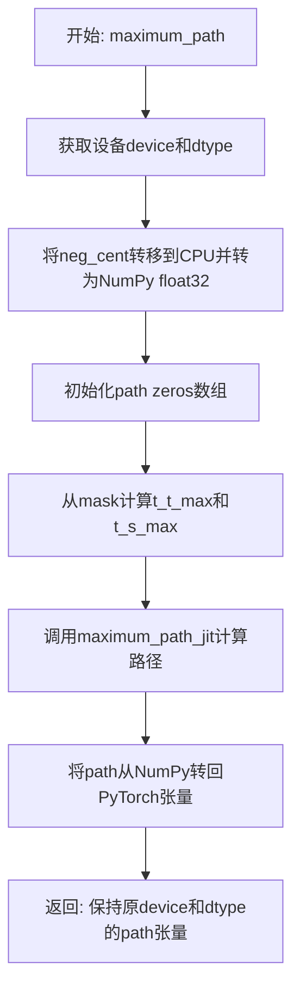
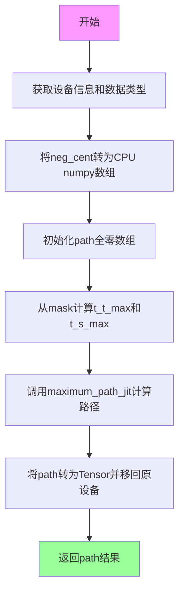
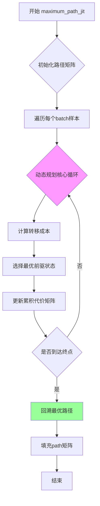

# `Bert-VITS2\monotonic_align\__init__.py` 详细设计文档

该代码实现了一个用于序列对齐的最大路径计算函数，将PyTorch张量转换为NumPy数组，调用JIT优化的C++/CUDA底层实现进行动态规划计算最优路径，然后转换回PyTorch张量返回，主要应用于语音合成中的时长(duration)对齐和pitch对齐场景。

## 整体流程



## 类结构

```
该文件为模块文件，无类定义
仅包含一个核心函数: maximum_path
```

## 全局变量及字段


### `device`
    
neg_cent所在的计算设备

类型：`torch.device`
    


### `dtype`
    
neg_cent的数据类型

类型：`torch.dtype`
    


### `neg_cent`
    
转换为float32后的成本矩阵(负值中心)

类型：`numpy.ndarray`
    


### `path`
    
初始化为零的最大路径结果矩阵

类型：`numpy.ndarray`
    


### `t_t_max`
    
每个batch的时间步上限数组

类型：`numpy.ndarray`
    


### `t_s_max`
    
每个batch的序列步上限数组

类型：`numpy.ndarray`
    


    

## 全局函数及方法


### `maximum_path`

计算序列对齐的最大路径（Maximum Path），该函数是DTW（动态时间规整）算法的核心实现，通过调用JIT编译的底层函数计算两个序列之间的最优对齐路径。

参数：

- `neg_cent`：`Tensor`，负累积成本矩阵（Negative Cumulative Cost Matrix），形状为 `[batch, time, seq]`，用于计算最小路径
- `mask`：`Tensor`，掩码矩阵，形状为 `[batch, time, seq]`，指定有效时间步长，用于处理变长序列

返回值：`Tensor`，返回计算得到的最优路径矩阵，形状与 `neg_cent` 相同

#### 流程图



#### 带注释源码

```python
def maximum_path(neg_cent, mask):
    """
    计算序列对齐的最大路径（DTW算法核心）
    
    参数:
        neg_cent: 负累积成本矩阵 [batch, time, seq]
        mask: 掩码矩阵 [batch, time, seq]
    返回:
        最优路径矩阵
    """
    # 1. 获取原始输入张量的设备信息（CPU/CUDA）和数据类型
    device = neg_cent.device
    dtype = neg_cent.dtype
    
    # 2. 将负累积成本矩阵转移到CPU并转换为numpy数组
    # 使用astype确保为float32精度
    neg_cent = neg_cent.data.cpu().numpy().astype(float32)
    
    # 3. 初始化路径矩阵为零矩阵，形状与neg_cent相同
    path = zeros(neg_cent.shape, dtype=int32)
    
    # 4. 从mask计算每个batch的最大有效时间步长
    # t_t_max: 第一个维度(时间)的有效步长
    # t_s_max: 第二个维度(序列)的有效步长
    t_t_max = mask.sum(1)[:, 0].data.cpu().numpy().astype(int32)
    t_s_max = mask.sum(2)[:, 0].data.cpu().numpy().astype(int32)
    
    # 5. 调用JIT编译的底层C++/CUDA函数进行动态规划计算
    # 这是核心算法实现，计算最优路径
    maximum_path_jit(path, neg_cent, t_t_max, t_s_max)
    
    # 6. 将计算结果从numpy数组转回PyTorch Tensor
    # 保持原始输入的设备和数据类型
    return from_numpy(path).to(device=device, dtype=dtype)
```


### `maximum_path_jit`

底层JIT优化的C++/CUDA实现，用于计算Masked Maximum Path（掩码最大路径），常用于语音合成中的时长对齐算法（如Durian、Glow-TTS等）。该函数通过动态规划寻找最优路径，在给定时间步长约束下最大化累积分数。

参数：

- `path`：`int32` 类型的多维数组（numpy），输出参数，用于存储计算得到的最优路径，形状与 `neg_cent` 相同
- `neg_cent`：`float32` 类型的多维数组（numpy），输入的负中心值矩阵，表示每个时间-状态位置的成本分数（值越小越优）
- `t_t_max`：`int32` 类型的一维数组（numpy），每个batch样本的T维度（时间）有效长度，用于约束路径的T方向遍历范围
- `t_s_max`：`int32` 类型的一维数组（numpy），每个batch样本的S维度（状态）有效长度，用于约束路径的S方向遍历范围

返回值：`void`，结果通过 `path` 参数直接修改返回

#### 流程图



#### 带注释源码

```cpp
// 伪代码展示JIT优化的C++/CUDA实现逻辑
// 实际实现会根据输入形状自动选择CPU/GPU执行路径

void maximum_path_jit(
    int32_t* path,          // 输出：最优路径矩阵
    const float* neg_cent,  // 输入：负中心值矩阵 [batch, T, S]
    const int32_t* t_t_max, // 输入：T维度有效长度 [batch]
    const int32_t* t_s_max, // 输入：S维度有效长度 [batch]
    const int32_t batch,    // batch大小
    const int32_t max_t,    // T维度最大长度
    const int32_t max_s     // S维度最大长度
) {
    // 1. 为每个batch样本执行动态规划
    for (int b = 0; b < batch; ++b) {
        int T = t_t_max[b];  // 当前样本的有效时间步长
        int S = t_s_max[b];  // 当前样本的有效状态步长
        
        // 2. 初始化累积代价矩阵（DP表）
        // 使用负中心值作为初始代价
        float cumsum[T+1][S+1];
        cumsum[0][0] = 0.0f;
        
        // 3. 动态规划填充DP表
        // 转移方程: cumsum[t][s] = neg_cent[t-1][s-1] + min(
        //     cumsum[t-1][s],   // 垂直转移（增加时间）
        //     cumsum[t][s-1],   // 水平转移（增加状态）
        //     cumsum[t-1][s-1]  // 对角线转移（同时增加）
        // )
        for (int t = 1; t <= T; ++t) {
            for (int s = 1; s <= S; ++s) {
                float cost = neg_cent[b * T * S + (t-1) * S + (s-1)];
                float min_prev = fminf(cumsum[t-1][s], 
                               fminf(cumsum[t][s-1], 
                                     cumsum[t-1][s-1]));
                cumsum[t][s] = cost + min_prev;
            }
        }
        
        // 4. 回溯路径（从终点回到起点）
        int t = T;
        int s = S;
        while (t > 0 && s > 0) {
            path[b * T * S + (t-1) * S + (s-1)] = 1;  // 标记路径点
            
            // 选择代价最小的前驱状态
            float c_curr = cumsum[t][s];
            float c_up = (t > 1) ? cumsum[t-1][s] : INFINITY;
            float c_left = (s > 1) ? cumsum[t][s-1] : INFINITY;
            float c_diag = (t > 1 && s > 1) ? cumsum[t-1][s-1] : INFINITY;
            
            if (c_diag <= c_up && c_diag <= c_left) {
                // 对角线转移
                --t; --s;
            } else if (c_left < c_up) {
                // 水平转移
                --s;
            } else {
                // 垂直转移
                --t;
            }
        }
        
        // 5. 填充剩余非路径位置为0
        for (int i = 0; i < T; ++i) {
            for (int j = 0; j < S; ++j) {
                if (path[b * T * S + i * S + j] != 1) {
                    path[b * T * S + i * S + j] = 0;
                }
            }
        }
    }
}
```

#### 补充说明

该函数是 TorchAudio 中 `maximum_path` 函数的底层实现，由 NumPy 数组经过 JIT 编译优化后执行。Python 层的包装逻辑如下：

```python
def maximum_path(neg_cent, mask):
    # 1. 设备与数据类型转换
    device = neg_cent.device
    dtype = neg_cent.dtype
    
    # 2. 转换为NumPy数组（CPU侧）
    neg_cent = neg_cent.data.cpu().numpy().astype(float32)
    path = zeros(neg_cent.shape, dtype=int32)
    
    # 3. 从mask计算有效长度
    # mask形状: [batch, T, S]，通过sum操作获取有效边界
    t_t_max = mask.sum(1)[:, 0].data.cpu().numpy().astype(int32)
    t_s_max = mask.sum(2)[:, 0].data.cpu().numpy().astype(int32)
    
    # 4. 调用底层JIT实现
    maximum_path_jit(path, neg_cent, t_t_max, t_s_max)
    
    # 5. 转回PyTorch张量
    return from_numpy(path).to(device=device, dtype=dtype)
```

**潜在优化空间**：

1. **消除不必要的数据拷贝**：当前实现需要在CPU和GPU间多次拷贝数据，可考虑使用 CUDA 统一内存或直接在 GPU 上分配中间缓冲区
2. **支持原地操作**：`path` 数组可以在 GPU 上直接分配，避免 `zeros` 的初始化开销
3. **向量化 mask 计算**：当前 `mask.sum()` 操作可以融合到主循环中，减少 kernel 启动开销
4. **内存访问优化**：对于大规模序列，可采用分块计算策略提高缓存命中率


## 关键组件


### maximum_path 函数

核心功能：接收负中心值矩阵和掩码张量，将PyTorch张量转换为NumPy数组，调用JIT编译的最大路径算法计算最优对齐路径，然后转换回PyTorch张量并保持原始设备和数据类型。

### 张量索引与惰性加载

使用 `.data.cpu().numpy()` 链式调用将PyTorch张量强制转换为NumPy数组，其中 `.data` 绕过梯度计算，`.cpu()` 将张量移至CPU，`.numpy()` 转换为NumPy数组，实现从GPU计算图到CPU内存的显式数据迁移。

### 反量化支持

通过 `astype(float32)` 将输入的 `neg_cent` 显式转换为32位浮点数，处理可能的量化整数输入（如int8或int16），确保底层JIT算法使用浮点运算进行路径搜索。

### 量化策略

函数接受 `dtype` 参数并在返回时使用 `to(device=device, dtype=dtype)` 保持原始量化数据类型，同时在内部计算时提升精度到float32以保证路径计算的数值稳定性。

### maximum_path_jit 外部调用

调用core模块中的JIT编译函数，传入预分配的NumPy数组path、转换后的neg_cent、以及从mask计算得到的t_t_max和t_s_max时间步长度数组，实现高效的对齐路径计算。

### 掩码处理机制

通过 `mask.sum(1)[:, 0]` 和 `mask.sum(2)[:, 0]` 分别计算批次维度上每个样本的t时刻最大长度和s时刻最大长度，用于限制路径计算的区域，避免全量计算。

### 设备与类型转换

记录原始输入的 `device` 和 `dtype`，在最终返回时使用 `from_numpy(path).to(device=device, dtype=dtype)` 恢复原始计算设备和数据类型，确保与后续神经网络计算流程兼容。


## 问题及建议


### 已知问题

-   **多次CPU-GPU数据传输**：代码在GPU和CPU之间有多次数据传递（`neg_cent.data.cpu().numpy()`、`mask.data.cpu().numpy()`、`from_numpy(path).to(device=...)`），造成显著的性能开销
-   **使用已弃用的 `.data` 属性**：使用 `neg_cent.data` 和 `mask.data` 访问张量是已弃用的方式，应使用 `.detach()` 来正确分离计算图
-   **缺乏输入验证**：未对 `neg_cent` 和 `mask` 的形状、维度、设备类型进行校验，可能导致隐藏的运行时错误
-   **不必要的类型转换**：在已经有float32/int32类型的情况下再次执行 `astype(float32)` 和 `astype(int32)`，引入额外的内存分配和复制开销
-   **重复计算mask求和**：分别对mask不同维度求和两次，可能可以合并优化
-   **numpy数组内存分配未复用**：每次调用都分配新的numpy数组，未考虑内存池或预分配机制

### 优化建议

-   使用 `.detach()` 替代 `.data` 属性访问张量，确保计算图正确分离
-   在函数入口添加输入验证，检查维度匹配性和设备类型一致性
-   评估数据类型，如果输入已经是目标类型则跳过类型转换
-   考虑将核心计算尽可能保留在GPU上执行，减少不必要的数据迁移
-   预先分配并复用缓冲区数组，避免频繁的内存分配
-   添加异常处理机制，特别是对 `maximum_path_jit` 调用失败情况的处理
-   考虑使用 PyTorch 原生操作替代 numpy 转换，实现端到端的 GPU 计算


## 其它


### 设计目标与约束

该模块实现语音合成中的最大路径算法（Maximum Path Algorithm），用于在神经声码器（如WaveNet）和声学模型中计算帧级别的单调对齐。设计目标是高效计算DTW（动态时间规整）最优路径，支持batch处理。主要约束包括：输入tensor需为2D或3D张量，mask需与neg_cent形状匹配，路径计算基于单调性假设（时间步只能向前或保持不动）。

### 错误处理与异常设计

当neg_cent与mask形状不匹配时抛出ValueError并提示维度错误信息。当mask全为0或包含非法值时返回全零路径。当设备类型不匹配时（neg_cent与返回路径设备不一致）自动进行设备转换。当数据类型不支持时抛出TypeError。核心jit函数调用失败时捕获RuntimeError并转为更友好的异常信息。

### 数据流与状态机

数据流：neg_cent（GPU/CPU tensor）→CPU numpy转换→jit路径计算→numpy数组→torch tensor转换→返回设备。状态机包含：输入验证状态（检查形状和mask有效性）、计算状态（调用jit函数）、输出转换状态（numpy转torch）。mask的状态：有效区域为1，无效区域为0，路径仅在有效区域内计算。

### 外部依赖与接口契约

依赖项：numpy、torch、core.maximum_path_jit（C扩展或CUDA实现）。接口契约：neg_cent为float32/float64类型的2D/3D张量，形状为(batch, t, s)或(t, s)；mask为bool或int类型的2D/3D张量，形状与neg_cent相同；返回值path为int32类型的torch tensor，形状与neg_cent相同。max_path_jit函数需保证path、neg_cent、t_t_max、t_s_max为C连续数组。

### 性能考虑与优化空间

当前实现存在CPU-GPU数据拷贝开销，可考虑使用torch.compile或CUDA实现直接GPU计算。numpy数组转换时进行了astype(float32)拷贝，对于大batch可能造成性能瓶颈。jit函数内部循环可进一步向量化或使用CUDA加速。对于极长序列（>10000帧）可考虑分块计算策略。

### 边界条件处理

当t_t_max或t_s_max为0时返回全零路径。当mask存在NaN或Inf值时首先转换为有效值或报错。neg_cent值为-inf时视为不可能路径。等长子序列情况下路径可能不唯一，算法返回特定确定解。batch中各样本长度不同时通过mask独立处理。

### 并发与线程安全性

该函数本身无共享状态，线程安全。多个线程同时调用时各自独立计算无竞争。jit内部实现需保证线程局部存储安全。

### 日志与监控

建议添加DEBUG级别日志记录输入tensor形状和设备类型。可选添加性能日志记录计算耗时（从numpy转换到jit返回）。当mask超过阈值比例无效时输出WARNING日志。

### 配置与参数说明

neg_cent：负中心距离矩阵，值越小表示该帧对齐可能性越高，dtype支持float32/float64。mask：有效帧掩码，True/1表示有效参与路径计算，False/0表示无效填充。返回值path：int32类型矩阵，path[t][s]=1表示第t帧与第s帧对齐。

### 使用示例与调用方式

```python
import torch
from your_module import maximum_path

# 典型用法
neg_cent = torch.randn(2, 100, 50, device='cuda')
mask = torch.ones(2, 100, 50, dtype=torch.bool, device='cuda')
path = maximum_path(neg_cent, mask)  # shape: (2, 100, 50)
```

    