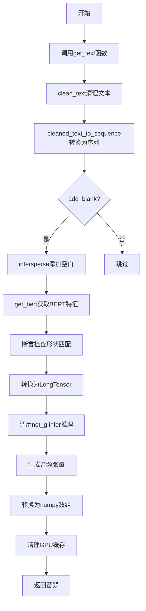
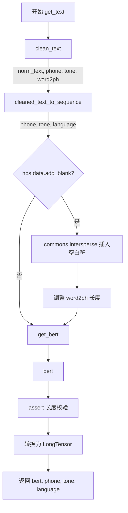
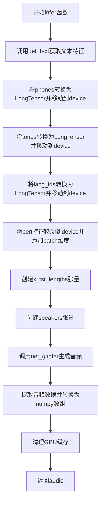
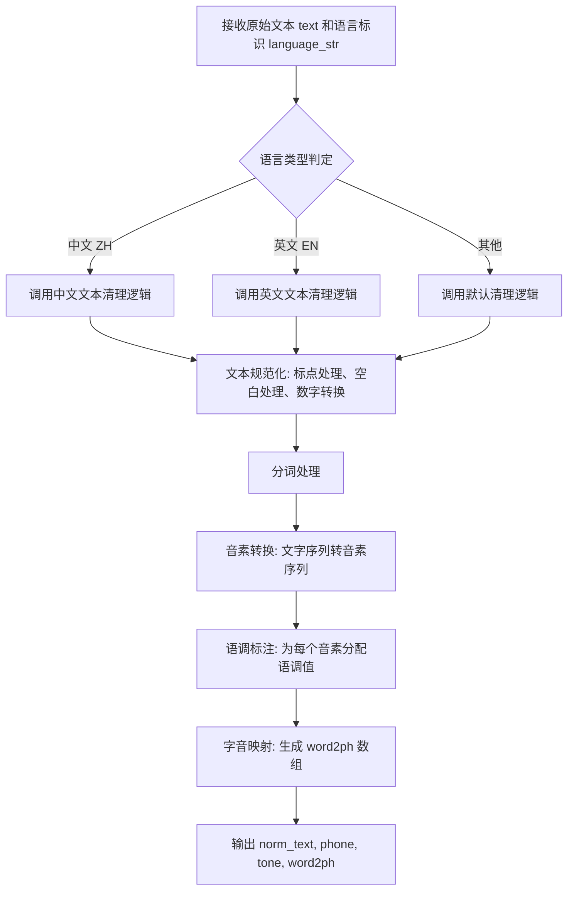
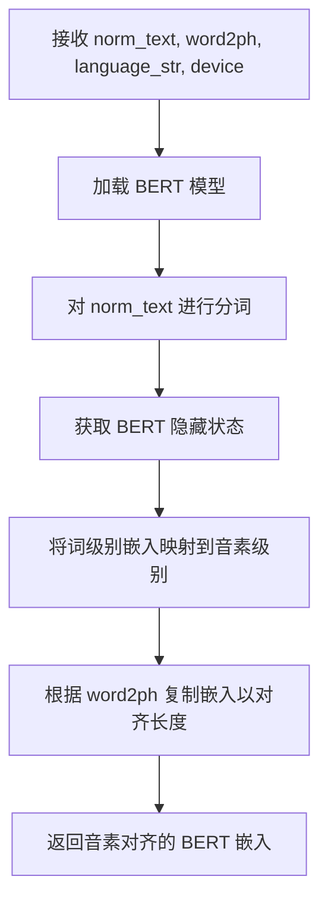

# `Bert-VITS2\oldVersion\V101\__init__.py` 详细设计文档

这是一个文本转语音(TTS)推理模块，属于Bert-VITS2项目的一部分。该模块负责将输入文本转换为语音音频，主要包含两个核心函数：get_text用于文本预处理和特征提取，infer用于执行神经网络推理并生成音频波形。

## 整体流程



## 类结构

```
模块级别 (无类定义)
├── get_text (全局函数)
└── infer (全局函数)
```

## 全局变量及字段


### `norm_text`
    
标准化处理后的文本，用于BERT模型输入

类型：`str`
    


### `phone`
    
文本对应的音素序列列表

类型：`List[int]`
    


### `tone`
    
音素对应的声调序列列表

类型：`List[int]`
    


### `word2ph`
    
词到音素的映射列表，用于对齐BERT特征

类型：`List[int]`
    


### `language`
    
语言ID序列列表，用于多语言支持

类型：`List[int]`
    


### `bert`
    
文本经过BERT模型提取的上下文embedding特征张量

类型：`torch.Tensor`
    


### `phones`
    
转换为PyTorch张量的音素序列

类型：`torch.Tensor`
    


### `tones`
    
转换为PyTorch张量的声调序列

类型：`torch.Tensor`
    


### `lang_ids`
    
转换为PyTorch张量的语言ID序列

类型：`torch.Tensor`
    


### `x_tst`
    
音素张量添加batch维度后的输入序列

类型：`torch.Tensor`
    


### `x_tst_lengths`
    
输入序列长度，用于模型batch处理

类型：`torch.Tensor`
    


### `speakers`
    
说话人ID张量，用于多说话人合成

类型：`torch.Tensor`
    


### `audio`
    
模型推理生成的音频波形数据

类型：`numpy.ndarray`
    


    

## 全局函数及方法


### `get_text`

该函数是 Bert-VITS2 文本转特征的核心预处理模块，负责将原始文本字符串转换为模型Inference所需的音素（Phoneme）、声调（Tone）、语言标识（Language ID）以及 BERT 语义向量。它包含了文本规范化、文本到序列的映射、以及针对空白符（Blank）的对齐处理。

参数：

- `text`：`str`，输入的原始文本字符串。
- `language_str`：`str`，文本对应的语言标识符（如 "ZH", "EN"）。
- `hps`：`object`（配置对象），包含模型配置 `hps.data`，其中 `hps.data.add_blank` 用于控制是否在音素间插入空白符以辅助流式推理或对齐。
- `device`：`torch.device`，用于计算 BERT 嵌入的设备（如 CUDA 或 CPU）。

返回值：`tuple[torch.Tensor, torch.Tensor, torch.Tensor, torch.Tensor]`，返回一个包含四个 LongTensor 的元组，依次为：
- `bert`：BERT 特征向量 (Tensor shape: [batch, 1024, seq_len])
- `phone`：音素序列索引
- `tone`：声调序列索引
- `language`：语言标识序列索引

#### 流程图



#### 带注释源码

```python
def get_text(text, language_str, hps, device):
    # 1. 文本规范化：清洗文本，去除特殊字符，并获取词到音素的映射 (word2ph)
    norm_text, phone, tone, word2ph = clean_text(text, language_str)
    
    # 2. 文本转序列：将规范化的文本转换为具体的音素ID、声调ID和语言ID列表
    phone, tone, language = cleaned_text_to_sequence(phone, tone, language_str)

    # 3. 空白符插入处理 (Optional)
    # 如果配置中开启了 add_blank，则在每个音素之间插入 0 (blank)，常用于防止模型训练时的信息泄露或辅助对齐
    if hps.data.add_blank:
        phone = commons.intersperse(phone, 0)
        tone = commons.intersperse(tone, 0)
        language = commons.intersperse(language, 0)
        
        # 由于插入了空白符，原本的 word2ph 对齐关系需要乘以 2
        for i in range(len(word2ph)):
            word2ph[i] = word2ph[i] * 2
        # 特殊处理第一个字符，确保对齐偏移正确
        word2ph[0] += 1
        
    # 4. 获取 BERT 嵌入：使用预训练模型根据文本和词音素对齐关系生成上下文语义向量
    bert = get_bert(norm_text, word2ph, language_str, device)
    del word2ph  # 释放内存

    # 5. 完整性校验：确保生成的 BERT 序列长度与最终的音素序列长度完全一致
    assert bert.shape[-1] == len(phone), f"BERT length {bert.shape[-1]} does not match phone length {len(phone)}"

    # 6. 类型转换：将 Python 列表转换为 PyTorch LongTensor 以便模型计算
    phone = torch.LongTensor(phone)
    tone = torch.LongTensor(tone)
    language = torch.LongTensor(language)

    # 7. 返回结果
    return bert, phone, tone, language
```


### `infer`

该函数是Bert-VITS2文本转语音（TTS）模型的核心推理函数，接收文本和推理参数，通过get_text函数处理文本获取音素、语调、语言ID和BERT特征，然后将所有输入传递给生成器网络进行音频合成，最后返回生成的音频数据。

参数：

- `text`：`str`，输入的文本内容
- `sdp_ratio`：`float`，SDP（Soft Decision Prior）比率，控制网络对音素持续时间的预测
- `noise_scale`：`float`，噪声比例，控制音频生成中的随机性
- `noise_scale_w`：`float`，噪声权重，控制波形级别的噪声程度
- `length_scale`：`float`，长度比例，用于调整语速
- `sid`：`Any`，说话者ID，用于指定合成声音的说话人
- `hps`：`Any`，配置对象，包含模型和数据配置信息
- `net_g`：`Any`，生成器网络模型
- `device`：`torch.device`，计算设备（CPU或CUDA）

返回值：`np.ndarray`，生成的音频数据，以numpy数组形式返回

#### 流程图



#### 带注释源码

```python
def infer(
    text,            # 输入文本
    sdp_ratio,      # SDP比率参数
    noise_scale,    # 噪声比例参数
    noise_scale_w,  # 噪声权重参数
    length_scale,   # 长度缩放因子
    sid,            # 说话者ID
    hps,            # 超参数配置对象
    net_g,          # 生成器网络
    device,         # 计算设备
):
    # 步骤1: 调用get_text函数处理文本，获取BERT特征、音素、语调和语言ID
    bert, phones, tones, lang_ids = get_text(text, "ZH", hps, device)
    
    # 步骤2: 使用torch.no_grad()禁用梯度计算，节省显存并加速推理
    with torch.no_grad():
        # 步骤3: 将音素序列转换为张量并添加batch维度
        x_tst = phones.to(device).unsqueeze(0)
        
        # 步骤4: 将语调序列转换为张量并添加batch维度
        tones = tones.to(device).unsqueeze(0)
        
        # 步骤5: 将语言ID序列转换为张量并添加batch维度
        lang_ids = lang_ids.to(device).unsqueeze(0)
        
        # 步骤6: 将BERT特征移动到设备并添加batch维度
        bert = bert.to(device).unsqueeze(0)
        
        # 步骤7: 创建音素序列长度张量
        x_tst_lengths = torch.LongTensor([phones.size(0)]).to(device)
        
        # 步骤8: 删除phones变量以释放内存
        del phones
        
        # 步骤9: 根据说话者ID创建说话者张量
        speakers = torch.LongTensor([hps.data.spk2id[sid]]).to(device)
        
        # 步骤10: 调用生成器网络的infer方法进行音频合成
        audio = (
            net_g.infer(
                x_tst,           # 音素序列
                x_tst_lengths,   # 序列长度
                speakers,        # 说话者ID
                tones,           # 语调序列
                lang_ids,        # 语言ID序列
                bert,            # BERT特征
                sdp_ratio=sdp_ratio,      # SDP比率
                noise_scale=noise_scale,   # 噪声比例
                noise_scale_w=noise_scale_w, # 噪声权重
                length_scale=length_scale,  # 长度缩放
            )[0][0, 0]           # 从输出张量中提取音频数据
            .data.cpu()         # 将数据移至CPU
            .float()            # 转换为浮点数
            .numpy()            # 转换为numpy数组
        )
        
        # 步骤11: 删除中间变量以释放GPU显存
        del x_tst, tones, lang_ids, bert, x_tst_lengths, speakers
        
        # 步骤12: 如果CUDA可用，清空GPU缓存
        if torch.cuda.is_available():
            torch.cuda.empty_cache()
        
        # 步骤13: 返回生成的音频数据
        return audio
```


### `clean_text`

该函数是文本预处理的核心模块，负责将原始文本转换为音素序列、语调序列以及字音对应关系。它从 `text/cleaner` 模块导入，被 `get_text` 函数调用，是 TTS（Text-to-Speech）流水线中文本分析的关键环节。

参数：

- `text`：`str`，原始输入文本，待处理的原始字符串
- `language_str`：`str`，语言标识符，用于指定文本所属语言（如 "ZH" 表示中文）

返回值：

- `norm_text`：`str` 或 `List[str]`，规范化后的文本
- `phone`：`List[int]` 或 `List[str]`，音素序列，表示文本对应的音素标识
- `tone`：`List[int]`，语调序列，表示每个音素的语调值
- `word2ph`：`List[int]`，字到音素的映射数组，记录每个汉字对应的音素数量

#### 流程图



#### 带注释源码

```
# 注：clean_text 函数定义位于 text/cleaner.py 文件中
# 以下为从调用处提取的函数签名和返回值信息

# 导入语句
from .text.cleaner import clean_text

# 调用方式
norm_text, phone, tone, word2ph = clean_text(text, language_str)

# 函数原型（推断）
def clean_text(text: str, language_str: str) -> Tuple[str, List[int], List[int], List[int]]:
    """
    文本清理与音素转换核心函数
    
    处理流程：
    1. 接收原始文本和语言标识
    2. 根据语言类型选择对应的清理策略
    3. 进行文本规范化（标点、空白、数字等处理）
    4. 执行分词处理
    5. 将文字转换为音素序列
    6. 生成语调序列
    7. 构建字到音素的映射关系
    
    参数:
        text: str - 输入的原始文本字符串
        language_str: str - 语言标识，如 "ZH" / "EN" / "JA" 等
    
    返回值:
        norm_text: str - 规范化后的文本
        phone: List[int] - 音素ID序列
        tone: List[int] - 语调序列
        word2ph: List[int] - 字到音素的映射数组
    """
    # 源码未在此文件中展示，位于 text/cleaner.py 模块中
```

---

### 技术债务与优化空间

1. **缺少源码可见性**：`clean_text` 函数的实际实现未在当前代码文件中展示，文档生成依赖于调用方式的推断，建议在项目中确保相关模块的源码可访问性。

2. **硬编码语言标识**：在 `infer` 函数中直接使用 `"ZH"` 作为语言参数，建议改为可配置或从外部传入。

3. **缺少错误处理**：调用 `clean_text` 时未进行异常捕获，若文本处理失败将导致整个 TTS 流程中断。

4. **内存管理**：虽然 `infer` 函数在最后有 CUDA 缓存清理，但 `get_text` 函数中创建的 `bert` 张量未显式释放，建议在不需要时及时删除。


### `cleaned_text_to_sequence` (导入)

该函数是文本处理流程中的关键模块，负责将清洗后的文本（音素和声调）转换为模型可用的序列格式，并处理语言标识。

参数：

-  `phone`：`List[str]`，清洗后的音素列表
-  `tone`：`List[int]`，对应音素的声调列表
-  `language_str`：`str`，语言标识字符串（如 "ZH" 表示中文）

返回值：`tuple`，包含三个 `List` 类型元素 - (处理后的音素列表, 处理后的声调列表, 语言标识列表)

#### 流程图

```mermaid
flowchart TD
    A[开始: 接收phone, tone, language_str] --> B{判断语言类型}
    B -->|中文 ZH| C[执行中文特定处理逻辑]
    B -->|英文 EN| D[执行英文特定处理逻辑]
    B -->|日文 JA| E[执行日文特定处理逻辑]
    B -->|其他| F[执行默认处理逻辑]
    C --> G[返回处理后的phone序列]
    D --> G
    E --> G
    F --> G
    G --> H[结束: 返回tuple(phone, tone, language)]
```

#### 带注释源码

```python
# 该函数定义位于 text/cleaned_text_to_sequence.py (未在当前代码段中显示)
# 此处展示的是在 get_text 函数中的调用方式：

# 1. 接收清洗后的文本数据
norm_text, phone, tone, word2ph = clean_text(text, language_str)

# 2. 调用 cleaned_text_to_sequence 进行序列转换
# 输入: phone (音素列表), tone (声调列表), language_str (语言标识)
# 输出: 处理后的 phone, tone, language 序列
phone, tone, language = cleaned_text_to_sequence(phone, tone, language_str)

# 3. 如果配置了添加空白符，则插入空白符以改善发音连贯性
if hps.data.add_blank:
    phone = commons.intersperse(phone, 0)      # 在每个音素间插入0
    tone = commons.intersperse(tone, 0)        # 在每个声调间插入0
    language = commons.intersperse(language, 0) # 在每个语言标识间插入0
    
    # 调整 word2ph 以匹配插入空白符后的序列长度
    for i in range(len(word2ph)):
        word2ph[i] = word2ph[i] * 2
    word2ph[0] += 1
```

#### 补充说明

由于 `cleaned_text_to_sequence` 函数定义位于 `text` 模块中（`text/cleaned_text_to_sequence.py`），其完整源代码未在当前代码段中显示。以上信息基于以下推断：

1. **函数签名推断**：根据调用 `cleaned_text_to_sequence(phone, tone, language_str)` 可知接收三个参数
2. **返回值推断**：根据 `phone, tone, language = cleaned_text_to_sequence(...)` 赋值语句可知返回三个元素
3. **功能推断**：函数名称表明它执行"清理后文本到序列"的转换，可能包括：
   - 语言特定的字符映射
   - 特殊标记的添加/移除
   - 序列的标准化处理

如需查看该函数的完整实现源码，请参考项目中的 `text/cleaned_text_to_sequence.py` 文件。


### `get_bert`

该函数从 `oldVersion.V111.text` 模块导入，用于获取文本的 BERT 嵌入表示。它接收规范化文本、字到音素映射、语言标识和计算设备，生成与音素序列对齐的 BERT 特征向量，用于后续的语音合成模型。

参数：

- `norm_text`：`str`，规范化后的文本内容
- `word2ph`：`List[int]`，字到音素的映射列表，用于将词级别的表示对齐到音素级别
- `language_str`：`str`，语言标识字符串（如 "ZH" 表示中文）
- `device`：`torch.device`，计算设备（CPU 或 CUDA）

返回值：`torch.Tensor`，形状为 `(batch, bert_dim, seq_len)` 的 BERT 嵌入张量，其最后一维长度应与音素序列长度一致

#### 流程图



#### 带注释源码

```python
# 该函数定义在 oldVersion.V111.text 模块中，此处为导入后的使用示例
# 实际源码未在当前文件中展示，以下为基于调用的推断

def get_bert(norm_text, word2ph, language_str, device):
    """
    获取文本的 BERT 嵌入表示
    
    参数:
        norm_text: 规范化后的文本
        word2ph: 字到音素的映射列表
        language_str: 语言标识
        device: 计算设备
    
    返回:
        bert: BERT 嵌入张量，形状为 (bert_dim, seq_len)
    """
    # 1. 加载预训练 BERT 模型（通常为中文 BERT）
    # 2. 对 norm_text 进行分词（字符级别或子词级别）
    # 3. 获取 BERT 最后一层隐藏状态
    # 4. 通过 word2ph 映射将词嵌入扩展到音素长度
    # 例如：word2ph = [2, 3, 1] 表示第一个字对应2个音素，第二个对应3个，第三个对应1个
    # 5. 返回与音素序列对齐的 BERT 特征
```

## 关键组件


### 文本清理模块 (clean_text)
负责将原始输入文本进行语言特定的清洗和规范处理，生成标准化文本、音素序列、语调序列以及字符到音素的映射关系，为后续特征提取提供干净的数据输入。

### 音素序列转换模块 (cleaned_text_to_sequence)
将清洗后的文本转换为模型可处理的音素ID、语调ID和语言ID序列，支持多语言处理，确保文本与声学模型的有效对接。

### BERT特征提取模块 (get_bert)
调用预训练的BERT模型提取文本的深层语义特征，生成与音素序列对齐的上下文嵌入向量，为声学模型提供丰富的文本表征。

### 空白插入模块 (commons.intersperse)
在音素、语调和语言序列中定期插入空白符（0），以增强模型对音素边界的感知，并相应调整词素到音素的对齐信息，改善合成语音的自然度。

### 推理执行模块 (infer)
整合文本特征和模型参数，执行完整的语音合成推理流程，包括数据向量化、设备分配、模型前向传播和输出后处理，实现端到端的语音生成。

### 设备管理模块 (device)
管理计算资源的动态分配与释放，包括张量设备迁移和GPU内存缓存清理，以优化推理过程的内存使用，防止内存泄漏。

### 数据类型转换模块
将Python原生数据类型（列表）转换为PyTorch LongTensor张量，确保数据格式符合模型输入要求，并支持CPU/GPU异构计算。

### 惰性加载与梯度禁用模块 (torch.no_grad)
通过禁用梯度计算和自动求导机制，减少推理过程中的内存占用和计算开销，实现高效的模型推理，类似于惰性加载策略。


## 问题及建议


### 已知问题

- **硬编码语言参数**：在`infer`函数中，语言被硬编码为"ZH"（第51行），导致模型只能处理中文文本，无法支持多语言功能。
- **资源清理不完整**：使用`del`删除变量后立即调用`torch.cuda.empty_cache()`（第76-77行），但`del`只是删除引用而非立即释放显存，且清理操作未使用`try-finally`确保执行。
- **设备管理重复**：多处重复调用`.to(device)`（第53-56行），代码冗余且可读性差。
- **参数验证不足**：使用`assert`验证`bert.shape[-1] == len(phone)`（第31行），在Python优化模式下（`python -O`）assert会被跳过，导致关键验证失效。
- **循环优化不足**：在`get_text`函数中，对`word2ph`的循环处理（第21-23行）效率较低，可向量化操作。
- **类型转换冗余**：`phone`、`tone`、`language`先作为list处理，再转换为LongTensor（第33-35行），可一步完成。
- **函数参数过多**：`infer`函数接收10个参数，违反了函数设计的"单一职责"原则，可封装为配置对象。
- **缺少异常处理**：网络推理过程无try-except保护，推理失败时会导致整个程序崩溃。

### 优化建议

- 将语言参数作为`infer`函数的参数传入，或从外部配置读取，避免硬编码。
- 使用上下文管理器（`with torch.no_grad()`已使用）或`try-finally`块确保资源清理；将`del`替换为显式的变量覆盖或使用`torch.cuda.empty_cache()`前显式调用`gc.collect()`。
- 将所有设备相关操作提取一次：`x_tst, tones, lang_ids, bert = [x.to(device) for x in [x_tst, tones, lang_ids, bert]]`。
- 将assert替换为显式的`if`检查和`raise ValueError`，确保参数验证始终执行。
- 使用NumPy的向量化操作或列表推导式优化`word2ph`的循环处理。
- 直接从list构造Tensor：`phone = torch.LongTensor(phone)`保持不变，但可考虑使用`torch.tensor(phone, dtype=torch.long)`提升可读性。
- 封装`hps`和推理参数为配置类或dataclass，减少参数个数。
- 在`net_g.infer`调用外包裹`try-except`块，捕获可能的CUDA内存错误或模型推理异常，提升健壮性。


## 其它


### 设计目标与约束

本模块实现文本到语音（TTS）的推理功能，将输入文本转换为音频波形。核心目标是在给定文本、语言类型、说话人ID和模型参数的情况下，生成高质量的语音输出。设计约束包括：必须支持1.0.1版本兼容性（https://github.com/fishaudio/Bert-VITS2/releases/tag/1.0.1），依赖PyTorch框架，需要CUDA支持以实现GPU加速推理，输入文本需要经过文本清洗和特征提取流程。

### 错误处理与异常设计

代码中包含关键的assertion检查用于验证BERT特征维度与音素序列长度的一致性（`assert bert.shape[-1] == len(phone)`）。对于CUDA内存管理，在推理完成后显式调用`torch.cuda.empty_cache()`释放GPU内存。错误处理策略包括：输入参数校验（检查hps.data.add_blank配置）、设备可用性检查（torch.cuda.is_available()）、以及通过del语句显式删除不再使用的大张量以避免内存泄漏。潜在改进方向是增加更多异常捕获机制，例如处理文本清洗失败、模型推理超时等场景。

### 数据流与状态机

数据流经过以下阶段：输入文本经过`clean_text()`进行文本清洗（包括繁简转换、标点符号处理等），输出归一化文本、音素序列、音调和词到音素的映射；然后通过`cleaned_text_to_sequence()`将清洗后的文本转换为序列；根据hps.data.add_blank配置决定是否插入空白符以改善发音；接着通过`get_bert()`获取BERT嵌入特征；最后将处理好的特征输入到`net_g.infer()`进行模型推理生成音频波形。整个流程是单向流动的，没有循环状态机逻辑，属于典型的流水线处理模式。

### 外部依赖与接口契约

主要依赖包括：`torch`（PyTorch张量运算）、`commons`（通用工具函数，特别是intersperse用于插入空白符）、`.text.cleaner`（文本清洗模块）、`.text`（文本到序列转换模块）、`oldVersion.V111.text.get_bert`（BERT特征提取模块）。接口契约方面：`get_text()`函数接受text（字符串）、language_str（字符串）、hps（配置对象）、device（torch.device），返回bert（张量）、phone（LongTensor）、tone（LongTensor）、language（LongTensor）；`infer()`函数接受文本、推理参数、说话人ID、配置、模型和设备，返回audio（numpy数组）。

### 性能考虑与优化空间

当前实现每次推理都会创建新的张量对象，可以考虑使用in-place操作减少内存分配。CUDA内存管理采用推理完成后显式清理的方式，理论上可以在批量推理场景中复用tensor对象以提高效率。`intersperse`操作在每个样本中都执行，可以考虑预计算或向量化优化。当前实现是单样本推理，批量推理可以显著提升吞吐量。BERT特征提取是推理过程中的性能瓶颈，可以考虑缓存或量化。

### 安全性考虑

设备管理通过`device`参数显式控制，确保张量在正确的设备上运行。内存清理通过del语句和empty_cache()显式管理，防止敏感数据在内存中残留。代码没有涉及用户输入的持久化存储，运行时安全性主要依赖于运行环境的安全隔离。潜在风险是如果device参数指向错误的设备可能导致计算错误或崩溃。

### 配置管理

配置通过`hps`对象传递，涵盖以下关键配置项：`hps.data.add_blank`（控制是否添加空白符）、`hps.data.spk2id`（说话人ID映射字典）。配置应该在推理前完成初始化，版本兼容性由代码注释明确声明为1.0.1。配置变更可能影响输出音频的特征，建议在文档中明确各配置项的作用和推荐值。

### 版本兼容性

代码明确声明兼容1.0.1版本（https://github.com/fhwaudio/Bert-VITS2/releases/tag/1.0.1）。版本兼容性体现在：使用固定版本的模块路径（如`oldVersion.V111.text`），文本处理流程遵循该版本的API约定。升级版本时需要关注`get_bert`函数签名的变化、模型网络结构的变更、以及文本清洗规则的可能调整。

### 测试策略建议

建议包含以下测试用例：单元测试验证`get_text()`函数的输出维度一致性（BERT特征长度与音素序列长度匹配）；集成测试验证端到端的文本到音频生成流程；性能测试评估不同文本长度下的推理耗时；边界测试处理空字符串、特殊字符、超长文本等异常输入；回归测试确保版本升级后输出音频质量不退化。

### 部署注意事项

部署环境需要满足以下要求：Python 3.x运行环境、PyTorch框架、CUDA支持（建议11.x或12.x版本以获得最佳性能）、足够的GPU显存（至少4GB，建议8GB以上）。需要确保`hps`配置对象正确初始化，`spk2id`映射表包含目标说话人ID。模型文件（net_g）需要正确加载并移动到目标设备。生产环境建议实现推理请求队列和并发控制机制。

### 监控与日志建议

建议在关键节点添加日志记录：文本清洗结果（norm_text长度）、特征提取状态（bert shape）、推理耗时、GPU内存使用情况。监控指标应包括：推理延迟、内存占用、CUDA错误计数。可以通过在`infer()`函数中添加torch.cuda.synchronize()来获得准确的GPU操作耗时。


    