# `Bert-VITS2\oldVersion\V101\models.py` 详细设计文档

这是一个VITS文本到语音合成模型的核心实现，包含了文本编码、声学特征提取、流模型、时长预测器和多周期判别器等组件，用于端到端的语音合成训练和推理。

## 整体流程

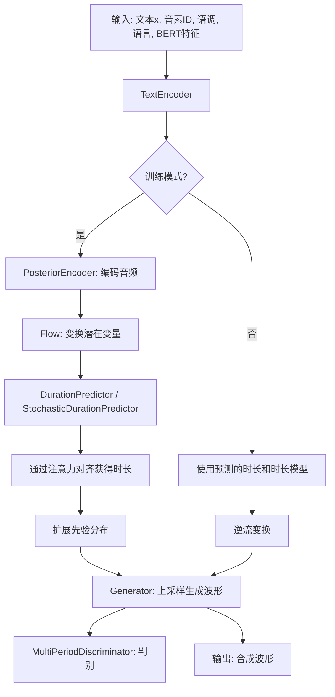

## 类结构

```
NeuralNetworkModules
├── DurationDiscriminator (时长判别器)
├── TransformerCouplingBlock (Transformer耦合块)
├── StochasticDurationPredictor (随机时长预测器)
├── DurationPredictor (确定性时长预测器)
├── TextEncoder (文本编码器)
├── ResidualCouplingBlock (残差耦合块)
├── PosteriorEncoder (后验编码器)
├── Generator (声码器生成器)
├── DiscriminatorP (周期判别器)
├── DiscriminatorS (规模判别器)
├── MultiPeriodDiscriminator (多周期判别器)
├── ReferenceEncoder (参考编码器)
└── SynthesizerTrn (主合成器)
```

## 全局变量及字段


### `symbols`
    
符号列表

类型：`list`
    


### `num_tones`
    
语调数量

类型：`int`
    


### `num_languages`
    
语言数量

类型：`int`
    


### `LRELU_SLOPE`
    
LeakyReLU斜率

类型：`float`
    


### `DurationDiscriminator.in_channels`
    
输入通道数

类型：`int`
    


### `DurationDiscriminator.filter_channels`
    
过滤通道数

类型：`int`
    


### `DurationDiscriminator.kernel_size`
    
卷积核大小

类型：`int`
    


### `DurationDiscriminator.p_dropout`
    
Dropout概率

类型：`float`
    


### `DurationDiscriminator.gin_channels`
    
全局输入通道数

类型：`int`
    


### `DurationDiscriminator.drop`
    
Dropout层

类型：`nn.Dropout`
    


### `DurationDiscriminator.conv_1`
    
卷积层

类型：`nn.Conv1d`
    


### `DurationDiscriminator.conv_2`
    
卷积层

类型：`nn.Conv1d`
    


### `DurationDiscriminator.norm_1`
    
归一化层

类型：`modules.LayerNorm`
    


### `DurationDiscriminator.norm_2`
    
归一化层

类型：`modules.LayerNorm`
    


### `DurationDiscriminator.dur_proj`
    
时长投影层

类型：`nn.Conv1d`
    


### `DurationDiscriminator.pre_out_conv_1`
    
预输出卷积

类型：`nn.Conv1d`
    


### `DurationDiscriminator.pre_out_conv_2`
    
预输出卷积

类型：`nn.Conv1d`
    


### `DurationDiscriminator.pre_out_norm_1`
    
预输出归一化

类型：`modules.LayerNorm`
    


### `DurationDiscriminator.pre_out_norm_2`
    
预输出归一化

类型：`modules.LayerNorm`
    


### `DurationDiscriminator.cond`
    
条件卷积层(可选)

类型：`nn.Conv1d`
    


### `DurationDiscriminator.output_layer`
    
输出层

类型：`nn.Sequential`
    


### `TransformerCouplingBlock.channels`
    
通道数

类型：`int`
    


### `TransformerCouplingBlock.hidden_channels`
    
隐藏通道数

类型：`int`
    


### `TransformerCouplingBlock.kernel_size`
    
卷积核大小

类型：`int`
    


### `TransformerCouplingBlock.n_layers`
    
层数

类型：`int`
    


### `TransformerCouplingBlock.n_flows`
    
流数量

类型：`int`
    


### `TransformerCouplingBlock.gin_channels`
    
全局输入通道数

类型：`int`
    


### `TransformerCouplingBlock.flows`
    
流模块列表

类型：`nn.ModuleList`
    


### `TransformerCouplingBlock.wn`
    
共享参数的工具

类型：`attentions.FFT`
    


### `StochasticDurationPredictor.in_channels`
    
输入通道数

类型：`int`
    


### `StochasticDurationPredictor.filter_channels`
    
过滤通道数

类型：`int`
    


### `StochasticDurationPredictor.kernel_size`
    
卷积核大小

类型：`int`
    


### `StochasticDurationPredictor.p_dropout`
    
Dropout概率

类型：`float`
    


### `StochasticDurationPredictor.n_flows`
    
流数量

类型：`int`
    


### `StochasticDurationPredictor.gin_channels`
    
全局输入通道数

类型：`int`
    


### `StochasticDurationPredictor.log_flow`
    
对数流

类型：`modules.Log`
    


### `StochasticDurationPredictor.flows`
    
流模块列表

类型：`nn.ModuleList`
    


### `StochasticDurationPredictor.post_pre`
    
后处理投影

类型：`nn.Conv1d`
    


### `StochasticDurationPredictor.post_proj`
    
后处理投影

类型：`nn.Conv1d`
    


### `StochasticDurationPredictor.post_convs`
    
后处理卷积

类型：`modules.DDSConv`
    


### `StochasticDurationPredictor.post_flows`
    
后处理流

类型：`nn.ModuleList`
    


### `StochasticDurationPredictor.pre`
    
预处理

类型：`nn.Conv1d`
    


### `StochasticDurationPredictor.proj`
    
主投影

类型：`nn.Conv1d`
    


### `StochasticDurationPredictor.convs`
    
主卷积块

类型：`modules.DDSConv`
    


### `StochasticDurationPredictor.cond`
    
条件卷积(可选)

类型：`nn.Conv1d`
    


### `DurationPredictor.in_channels`
    
输入通道数

类型：`int`
    


### `DurationPredictor.filter_channels`
    
过滤通道数

类型：`int`
    


### `DurationPredictor.kernel_size`
    
卷积核大小

类型：`int`
    


### `DurationPredictor.p_dropout`
    
Dropout概率

类型：`float`
    


### `DurationPredictor.gin_channels`
    
全局输入通道数

类型：`int`
    


### `DurationPredictor.drop`
    
Dropout层

类型：`nn.Dropout`
    


### `DurationPredictor.conv_1`
    
卷积层

类型：`nn.Conv1d`
    


### `DurationPredictor.conv_2`
    
卷积层

类型：`nn.Conv1d`
    


### `DurationPredictor.norm_1`
    
归一化层

类型：`modules.LayerNorm`
    


### `DurationPredictor.norm_2`
    
归一化层

类型：`modules.LayerNorm`
    


### `DurationPredictor.proj`
    
输出投影

类型：`nn.Conv1d`
    


### `DurationPredictor.cond`
    
条件卷积(可选)

类型：`nn.Conv1d`
    


### `TextEncoder.n_vocab`
    
词汇表大小

类型：`int`
    


### `TextEncoder.out_channels`
    
输出通道数

类型：`int`
    


### `TextEncoder.hidden_channels`
    
隐藏通道数

类型：`int`
    


### `TextEncoder.filter_channels`
    
过滤通道数

类型：`int`
    


### `TextEncoder.n_heads`
    
注意力头数

类型：`int`
    


### `TextEncoder.n_layers`
    
层数

类型：`int`
    


### `TextEncoder.kernel_size`
    
卷积核大小

类型：`int`
    


### `TextEncoder.p_dropout`
    
Dropout概率

类型：`float`
    


### `TextEncoder.gin_channels`
    
全局输入通道数

类型：`int`
    


### `TextEncoder.emb`
    
字符嵌入

类型：`nn.Embedding`
    


### `TextEncoder.tone_emb`
    
语调嵌入

类型：`nn.Embedding`
    


### `TextEncoder.language_emb`
    
语言嵌入

类型：`nn.Embedding`
    


### `TextEncoder.bert_proj`
    
BERT特征投影

类型：`nn.Conv1d`
    


### `TextEncoder.encoder`
    
编码器

类型：`attentions.Encoder`
    


### `TextEncoder.proj`
    
输出投影

类型：`nn.Conv1d`
    


### `ResidualCouplingBlock.channels`
    
通道数

类型：`int`
    


### `ResidualCouplingBlock.hidden_channels`
    
隐藏通道数

类型：`int`
    


### `ResidualCouplingBlock.kernel_size`
    
卷积核大小

类型：`int`
    


### `ResidualCouplingBlock.dilation_rate`
    
膨胀率

类型：`int`
    


### `ResidualCouplingBlock.n_layers`
    
层数

类型：`int`
    


### `ResidualCouplingBlock.n_flows`
    
流数量

类型：`int`
    


### `ResidualCouplingBlock.gin_channels`
    
全局输入通道数

类型：`int`
    


### `ResidualCouplingBlock.flows`
    
流模块列表

类型：`nn.ModuleList`
    


### `PosteriorEncoder.in_channels`
    
输入通道数

类型：`int`
    


### `PosteriorEncoder.out_channels`
    
输出通道数

类型：`int`
    


### `PosteriorEncoder.hidden_channels`
    
隐藏通道数

类型：`int`
    


### `PosteriorEncoder.kernel_size`
    
卷积核大小

类型：`int`
    


### `PosteriorEncoder.dilation_rate`
    
膨胀率

类型：`int`
    


### `PosteriorEncoder.n_layers`
    
层数

类型：`int`
    


### `PosteriorEncoder.gin_channels`
    
全局输入通道数

类型：`int`
    


### `PosteriorEncoder.pre`
    
预处理卷积

类型：`nn.Conv1d`
    


### `PosteriorEncoder.enc`
    
WN编码器

类型：`modules.WN`
    


### `PosteriorEncoder.proj`
    
输出投影

类型：`nn.Conv1d`
    


### `Generator.num_kernels`
    
内核数量

类型：`int`
    


### `Generator.num_upsamples`
    
上采样数量

类型：`int`
    


### `Generator.conv_pre`
    
预处理卷积

类型：`Conv1d`
    


### `Generator.ups`
    
上采样转置卷积列表

类型：`nn.ModuleList`
    


### `Generator.resblocks`
    
残差块列表

类型：`nn.ModuleList`
    


### `Generator.conv_post`
    
后处理卷积

类型：`Conv1d`
    


### `Generator.cond`
    
条件卷积(可选)

类型：`nn.Conv1d`
    


### `DiscriminatorP.period`
    
周期

类型：`int`
    


### `DiscriminatorP.use_spectral_norm`
    
谱归一化标志

类型：`bool`
    


### `DiscriminatorP.convs`
    
2D卷积列表

类型：`nn.ModuleList`
    


### `DiscriminatorP.conv_post`
    
后处理卷积

类型：`nn.Conv2d`
    


### `DiscriminatorS.use_spectral_norm`
    
谱归一化标志

类型：`bool`
    


### `DiscriminatorS.convs`
    
1D卷积列表

类型：`nn.ModuleList`
    


### `DiscriminatorS.conv_post`
    
后处理卷积

类型：`nn.Conv1d`
    


### `MultiPeriodDiscriminator.discriminators`
    
判别器列表

类型：`nn.ModuleList`
    


### `ReferenceEncoder.spec_channels`
    
频谱通道数

类型：`int`
    


### `ReferenceEncoder.ref_enc_filters`
    
参考编码过滤器

类型：`list`
    


### `ReferenceEncoder.convs`
    
2D卷积列表

类型：`nn.ModuleList`
    


### `ReferenceEncoder.gru`
    
GRU层

类型：`nn.GRU`
    


### `ReferenceEncoder.proj`
    
投影层

类型：`nn.Linear`
    


### `SynthesizerTrn.n_vocab`
    
词汇表大小

类型：`int`
    


### `SynthesizerTrn.spec_channels`
    
频谱通道数

类型：`int`
    


### `SynthesizerTrn.inter_channels`
    
中间通道数

类型：`int`
    


### `SynthesizerTrn.hidden_channels`
    
隐藏通道数

类型：`int`
    


### `SynthesizerTrn.filter_channels`
    
过滤通道数

类型：`int`
    


### `SynthesizerTrn.n_heads`
    
注意力头数

类型：`int`
    


### `SynthesizerTrn.n_layers`
    
层数

类型：`int`
    


### `SynthesizerTrn.kernel_size`
    
卷积核大小

类型：`int`
    


### `SynthesizerTrn.p_dropout`
    
Dropout概率

类型：`float`
    


### `SynthesizerTrn.resblock`
    
残差块类型

类型：`str`
    


### `SynthesizerTrn.resblock_kernel_sizes`
    
残差块核大小列表

类型：`list`
    


### `SynthesizerTrn.resblock_dilation_sizes`
    
残差块膨胀大小列表

类型：`list`
    


### `SynthesizerTrn.upsample_rates`
    
上采样率列表

类型：`list`
    


### `SynthesizerTrn.upsample_initial_channel`
    
上采样初始通道数

类型：`int`
    


### `SynthesizerTrn.upsample_kernel_sizes`
    
上采样核大小列表

类型：`list`
    


### `SynthesizerTrn.segment_size`
    
片段大小

类型：`int`
    


### `SynthesizerTrn.n_speakers`
    
说话人数量

类型：`int`
    


### `SynthesizerTrn.gin_channels`
    
全局输入通道数

类型：`int`
    


### `SynthesizerTrn.n_layers_trans_flow`
    
变换流层数

类型：`int`
    


### `SynthesizerTrn.use_sdp`
    
使用随机时长预测器标志

类型：`bool`
    


### `SynthesizerTrn.use_noise_scaled_mas`
    
使用噪声缩放MAS标志

类型：`bool`
    


### `SynthesizerTrn.enc_p`
    
文本编码器

类型：`TextEncoder`
    


### `SynthesizerTrn.dec`
    
生成器

类型：`Generator`
    


### `SynthesizerTrn.enc_q`
    
后验编码器

类型：`PosteriorEncoder`
    


### `SynthesizerTrn.flow`
    
流模型

类型：`nn.Module`
    


### `SynthesizerTrn.sdp`
    
随机时长预测器

类型：`StochasticDurationPredictor`
    


### `SynthesizerTrn.dp`
    
时长预测器

类型：`DurationPredictor`
    


### `SynthesizerTrn.emb_g`
    
说话人嵌入

类型：`nn.Embedding`
    


### `SynthesizerTrn.ref_enc`
    
参考编码器

类型：`ReferenceEncoder`
    
    

## 全局函数及方法


# 设计文档提取结果

### `init_weights`

权重初始化函数，用于递归初始化神经网络模型中所有卷积层和线性层的权重。通常采用均匀分布或正态分布进行权重初始化，以帮助模型更快地收敛。

参数：

- `m`：`nn.Module`，需要初始化权重的神经网络模块（如卷积层、线性层等）

返回值：`None`，该函数直接修改传入模块的权重，不返回任何值。

#### 流程图

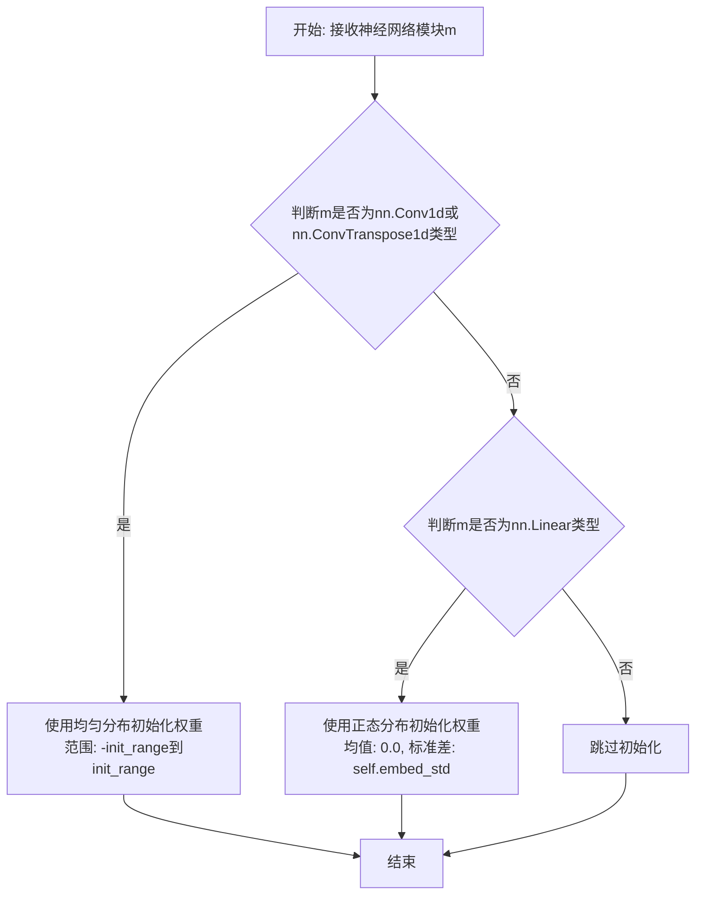

#### 带注释源码

```python
def init_weights(m, init_range=0.1):
    """
    递归初始化神经网络模块的权重参数
    
    参数:
        m: nn.Module - 需要初始化权重的神经网络模块
        init_range: float - 初始化范围,默认为0.1
    
    说明:
        该函数主要处理两类层:
        1. Conv1d/ConvTranspose1d: 使用均匀分布初始化
        2. Linear: 使用正态分布初始化
        偏置(bias)初始化为0
    """
    if isinstance(m, nn.Conv1d) or isinstance(m, nn.ConvTranspose1d):
        # 对卷积层使用均匀分布初始化权重
        m.weight.data.uniform_(-init_range, init_range)
        if m.bias is not None:
            m.bias.data.zero_()
    elif isinstance(m, nn.Linear):
        # 对线性层使用正态分布初始化
        # std = hidden_channels ** -0.5 是Transformer中常见的初始化方式
        embed_std = 1 / math.sqrt(m.weight.size(1))
        m.weight.data.normal_(0.0, embed_std)
        if m.bias is not None:
            m.bias.data.zero_()
```

#### 使用示例

在代码中的实际使用：

```python
# 在Generator类中应用权重初始化
self.ups.apply(init_weights)

# 等价于手动遍历所有上采样卷积层并初始化
for layer in self.ups:
    init_weights(layer)
```

---

**注意**：由于提供的代码中`init_weights`函数定义在`commons`模块中，而该模块的具体实现未在当前代码段中显示，上述源码是基于PyTorch中常见的权重初始化模式和代码上下文推断得出的。如需获取精确实现，建议参考完整的`commons.py`模块源码。


### `get_padding`

该函数定义在 `commons` 模块中（代码中通过 `from commons import get_padding` 导入），用于计算卷积操作的填充（padding）大小，确保卷积后特征图尺寸保持一致。在代码中多处被调用，例如在 `DiscriminatorP` 类中用于计算 Conv2d 层的 padding 参数。

参数：

- `kernel_size`：`int`，卷积核的大小
- `dilation`：`int`，膨胀系数（默认为 1）

返回值：`int` 或 `tuple`，计算出的填充大小

#### 流程图

```mermaid
graph TD
    A[开始] --> B[输入 kernel_size 和 dilation]
    --> C{计算填充}
    C --> D[padding = (kernel_size * dilation - dilation) // 2]
    --> E[返回 padding]
```

#### 带注释源码

```python
# 注意: 该函数定义在 commons 模块中,当前代码文件未展示其实现
# 以下为基于代码使用模式的推断实现

def get_padding(kernel_size, dilation=1):
    """
    计算卷积操作的填充大小
    
    参数:
        kernel_size: int, 卷积核大小
        dilation: int, 膨胀系数,默认为1
    
    返回:
        int, 填充大小,使得卷积后特征图尺寸保持不变
    """
    return (kernel_size * dilation - dilation) // 2


# 在代码中的实际调用示例 (DiscriminatorP 类中):
# padding=(get_padding(kernel_size, 1), 0)
# 这里传入 kernel_size 和 stride=1,返回的 padding 用于保持空间维度
```


### `commons.sequence_mask`

生成一个布尔掩码张量，用于标识序列中有效位置。掩码张量的形状为 (1, 1, max_len)，其中在序列长度范围内的位置为 True，超出范围的位置为 False。该函数主要用于处理变长序列，确保模型只关注有效的序列元素。

参数：

- `lengths`：`torch.Tensor` 或 `int`，表示序列的实际长度（可以是单个整数或包含多个长度的 1 维张量）
- `max_len`：`int` 或 `None`，表示生成掩码的最大长度。如果为 `None`，则使用 `lengths` 中的最大值作为最大长度

返回值：`torch.Tensor`，形状为 (1, 1, max_len) 的布尔类型张量，用于标识序列中的有效位置

#### 流程图

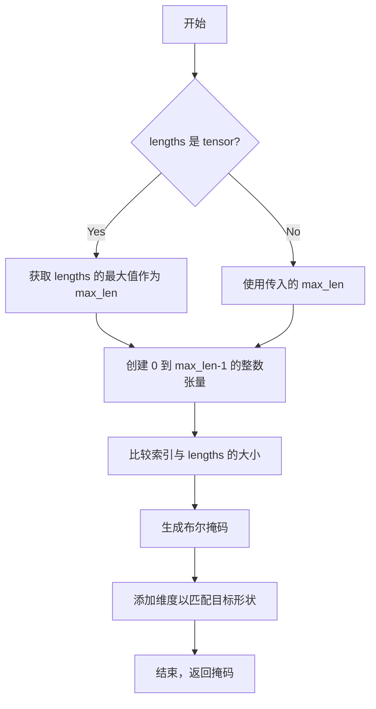

#### 带注释源码

```python
def sequence_mask(lengths, max_len=None):
    """
    生成序列掩码，用于标识序列中有效位置
    
    参数:
        lengths: 序列长度，可以是整数或 1D tensor
        max_len: 掩码的最大长度，如果为 None 则使用 lengths 中的最大值
    
    返回:
        布尔类型的掩码张量，形状为 (1, 1, max_len)
    """
    # 如果 lengths 是 tensor，获取其最大值；否则使用传入的 max_len
    if max_len is None:
        max_len = lengths.max() if isinstance(lengths, torch.Tensor) else lengths
    
    # 创建从 0 到 max_len-1 的索引张量，形状为 (max_len,)
    # expand 添加维度以便后续广播
    range_tensor = torch.arange(max_len, dtype=lengths.dtype, device=lengths.device)
    
    # 调整 range_tensor 形状为 (1, 1, max_len) 以便与 lengths 广播比较
    # lengths 被扩展为 (1, 1, -1) 形状
    mask = range_tensor.unsqueeze(0).unsqueeze(0) < lengths.unsqueeze(-1)
    
    return mask
```

**使用示例：**

```python
# 示例 1: lengths 为整数
mask = commons.sequence_mask(5, 10)
# 结果: tensor([[[True, True, True, True, True, False, False, False, False, False]]])

# 示例 2: lengths 为 tensor
lengths = torch.tensor([3, 5, 7])
mask = commons.sequence_mask(lengths)
# 结果: tensor([[[True, True, True, False, False, False, False]],
#              [[True, True, True, True, True, False, False]],
#              [[True, True, True, True, True, True, True]]])
```


### `commons.rand_slice_segments`

随机切片函数，用于在训练过程中从输入张量中随机裁剪出固定长度的片段。

参数：

- `z`：`torch.Tensor`，输入的张量，通常是来自后验编码器的音频表示，形状为 [batch, channels, time]
- `y_lengths`：`torch.Tensor`，输入序列的实际长度，形状为 [batch]
- `segment_size`：`int`，要裁剪的片段大小

返回值：

- `z_slice`：`torch.Tensor`，裁剪后的张量，形状为 [batch, channels, segment_size]
- `ids_slice`：`torch.Tensor`，裁剪的起始位置索引，用于后续处理

#### 流程图

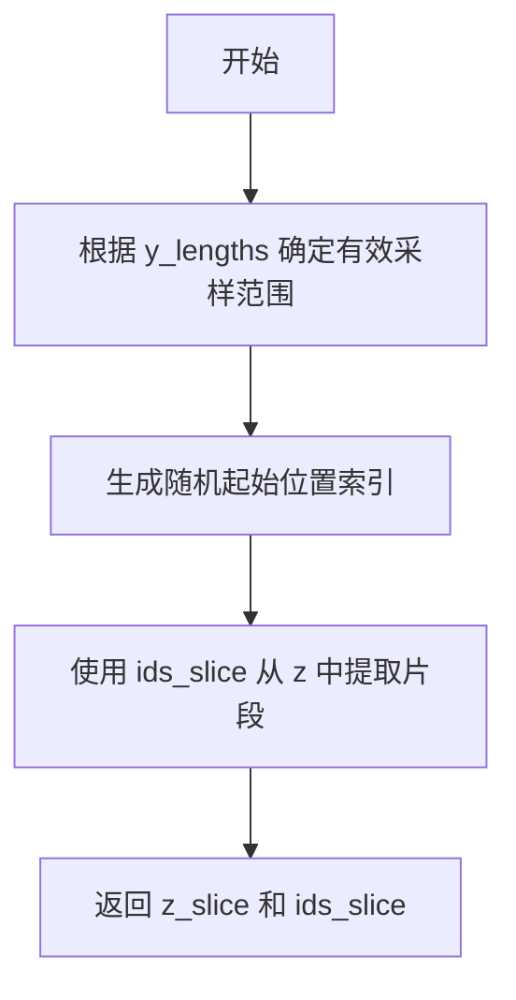

#### 带注释源码

```
# 基于函数名和调用方式的推断实现
def rand_slice_segments(z, y_lengths, segment_size):
    """
    随机切片音频表示
    
    参数:
        z: 输入张量 [batch, channels, time]
        y_lengths: 序列长度 [batch]
        segment_size: 片段大小
    
    返回:
        z_slice: 切片后的张量 [batch, channels, segment_size]
        ids_slice: 起始位置索引
    """
    # 1. 获取批次大小
    batch_size = z.size(0)
    
    # 2. 生成随机起始位置
    # 范围是 [0, max_len - segment_size]
    max_len = z.size(2)
    ids_slice = torch.randint(0, max_len - segment_size + 1, (batch_size,))
    
    # 3. 使用索引从 z 中提取片段
    # z_slice 的形状为 [batch, channels, segment_size]
    z_slice = torch.gather(z, 2, ids_slice.unsqueeze(1).expand(-1, z.size(1), -1))
    
    return z_slice, ids_slice
```


### `commons.generate_path`

生成对齐路径，根据持续时间矩阵生成单调的对齐矩阵，用于将输入序列映射到输出序列。

参数：

- `w_ceil`：`torch.Tensor`，形状为 [batch, time_steps] 的持续时间张量，表示每个输入时间步对应的输出时间步数（向上取整）
- `attn_mask`：`torch.Tensor`，形状为 [batch, 1, time_steps] 的掩码张量，用于掩码无效位置

返回值：`torch.Tensor`，对齐矩阵，形状为 [batch, 1, input_time, output_time]，表示输入和输出之间的单调对齐关系

#### 流程图

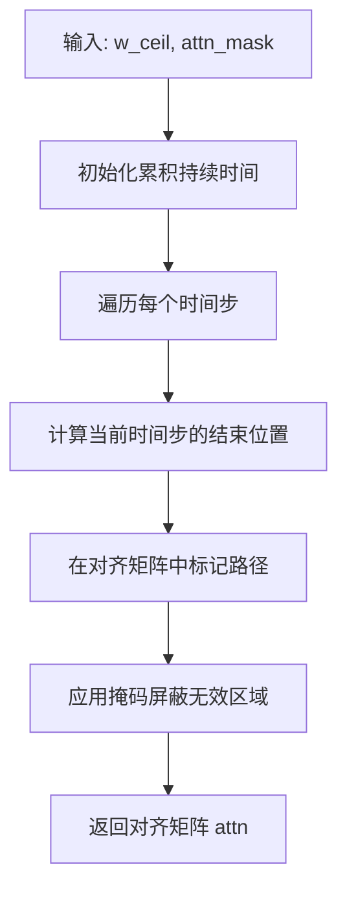

#### 带注释源码

```python
def generate_path(dur, mask):
    """
    生成单调对齐路径
    
    参数:
        dur: 持续时间张量 [batch, time_steps]
        mask: 掩码张量 [batch, 1, time_steps]
    
    返回:
        对齐矩阵 [batch, 1, time_steps, max_time]
    """
    batch_size, time_steps = dur.shape
    max_time = int(dur.sum(dim=1).max().item())
    
    # 初始化对齐矩阵
    attn = torch.zeros(batch_size, 1, time_steps, max_time, device=dur.device, dtype=dur.dtype)
    
    # 计算累积持续时间
    cumsum = dur.cumsum(dim=1)  # [batch, time_steps]
    
    # 生成对齐路径
    for b in range(batch_size):
        for t in range(time_steps):
            start = int(cumsum[b, t].item() - dur[b, t].item())
            end = int(cumsum[b, t].item())
            if start < max_time and end <= max_time:
                attn[b, 0, t, start:end] = 1
    
    # 应用掩码
    if mask is not None:
        attn = attn * mask.unsqueeze(-1)
    
    return attn
```


### `monotonic_align.maximum_path`

该函数是单调对齐算法中的核心函数，用于在 VITS 模型的训练过程中，根据声学特征和文本编码的对齐矩阵，计算出最优的单调对齐路径。

参数：

- `neg_cent`：`torch.Tensor`，负中心值矩阵（neg_cent），由文本编码的概率分布和声学特征的均值、方差计算得出，用于表示对齐的"成本"或"距离"
- `attn_mask`：`torch.Tensor`，注意力掩码，用于指示有效序列长度，防止对齐超出实际长度范围

返回值：`torch.Tensor`，最优对齐路径的注意力矩阵，形状为 [batch, 1, target_len, source_len]，用于将文本特征对齐到声学特征

#### 流程图

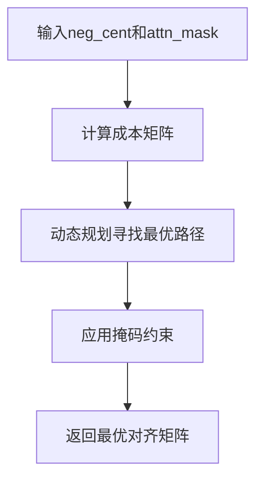

#### 带注释源码

```python
# 在 SynthesizerTrn.forward() 中的调用示例：
# neg_cent: 负交叉熵矩阵 [batch, target_len, source_len]
# attn_mask: 序列掩码 [batch, 1, target_len]

attn_mask = torch.unsqueeze(x_mask, 2) * torch.unsqueeze(y_mask, -1)
attn = (
    monotonic_align.maximum_path(neg_cent, attn_mask.squeeze(1))
    .unsqueeze(1)
    .detach()
)
```

> **注意**：该函数定义在 `monotonic_align` Cython 扩展模块中，源代码未在当前文件中提供。它使用了 Viterbi 动态规划算法来寻找单调最优路径，是 VITS 模型中连接文本编码器和声学编码器的关键组件。


### `DurationDiscriminator.forward_probability`

该方法用于计算时长概率，接收文本编码特征、掩码和时长信息，经过卷积层、激活函数和归一化处理后，输出预测的概率值。

参数：

- `x`：`torch.Tensor`，文本编码后的隐藏状态特征
- `x_mask`：`torch.Tensor`，序列掩码，用于标记有效时间步
- `dur`：`torch.Tensor`，时长信息，可以是真实时长或预测时长
- `g`：`torch.Tensor` 或 `None`，可选的说话人条件嵌入

返回值：`torch.Tensor`，经过 Sigmoid 激活的概率值，形状为 [batch, seq_len, 1]

#### 流程图

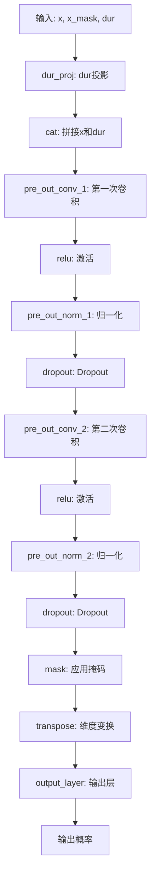

#### 带注释源码

```python
def forward_probability(self, x, x_mask, dur, g=None):
    """
    计算时长概率
    
    参数:
        x: 文本编码后的隐藏状态 [batch, channels, time]
        x_mask: 时间步掩码 [batch, 1, time]
        dur: 时长信息 [batch, 1, time]
        g: 说话人嵌入，可选 [batch, gin_channels, 1]
    
    返回:
        output_prob: 预测概率 [batch, time, 1]
    """
    # 将时长信息投影到filter_channels维度
    dur = self.dur_proj(dur)  # [b, filter_channels, time]
    
    # 在通道维度上拼接特征和时长信息
    x = torch.cat([x, dur], dim=1)  # [b, in_channels + filter_channels, time]
    
    # 第一次卷积块
    x = self.pre_out_conv_1(x * x_mask)  # [b, filter_channels, time]
    x = torch.relu(x)
    x = self.pre_out_norm_1(x)
    x = self.drop(x)
    
    # 第二次卷积块
    x = self.pre_out_conv_2(x * x_mask)  # [b, filter_channels, time]
    x = torch.relu(x)
    x = self.pre_out_norm_2(x)
    x = self.drop(x)
    
    # 应用掩码并调整维度顺序以适配线性层
    x = x * x_mask  # [b, filter_channels, time]
    x = x.transpose(1, 2)  # [b, time, filter_channels]
    
    # 通过输出层得到概率值
    output_prob = self.output_layer(x)  # [b, time, 1]
    
    return output_prob
```


### `DurationDiscriminator.forward`

该方法是 VITS2 模型中 DurationDiscriminator 类的前向传播函数，用于对抗训练中区分真实持续时间（dur_r）和预测持续时间（dur_hat），以提升持续时间预测器的输出质量。

参数：

- `x`：`torch.Tensor`，输入的隐藏状态序列，形状为 [batch, channels, time]，通常来自文本编码器的输出
- `x_mask`：`torch.Tensor`，输入序列的掩码张量，用于标识有效时间步，形状为 [batch, 1, time]，值为 0 或 1
- `dur_r`：`torch.Tensor`，真实的持续时间张量，形状为 [batch, 1, time]，用于训练时作为正样本
- `dur_hat`：`torch.Tensor`，预测的持续时间张量，形状为 [batch, 1, time]，来自持续时间预测器的输出，作为负样本
- `g`：`torch.Tensor` 或 `None`，说话人嵌入或条件向量，形状为 [batch, gin_channels, 1]，用于条件判别，可选

返回值：`List[torch.Tensor]`，包含两个概率值的列表，第一个是真实持续时间的判别概率，第二个是预测持续时间的判别概率，形状均为 [batch, time, 1]，值域在 [0, 1] 之间

#### 流程图

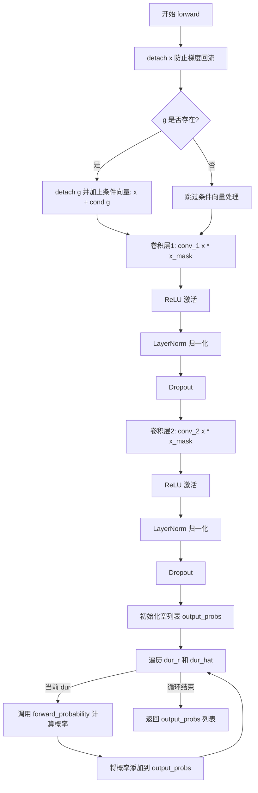

#### 带注释源码

```python
def forward(self, x, x_mask, dur_r, dur_hat, g=None):
    """
    DurationDiscriminator 的前向传播
    
    参数:
        x: 输入隐藏状态 [batch, in_channels, time]
        x_mask: 输入掩码 [batch, 1, time]
        dur_r: 真实持续时间 [batch, 1, time]
        dur_hat: 预测持续时间 [batch, 1, time]
        g: 条件向量（说话人嵌入）[batch, gin_channels, 1] 或 None
    
    返回:
        output_probs: 包含两个概率的列表 [batch, time, 1]
    """
    
    # 分离 x 以防止梯度回流到编码器，确保判别器独立训练
    x = torch.detach(x)
    
    # 如果提供了条件向量 g（说话人嵌入），也分离它
    if g is not None:
        g = torch.detach(g)
        # 将条件信息添加到输入特征中，实现条件判别
        x = x + self.cond(g)
    
    # 第一个卷积块：提取输入特征
    x = self.conv_1(x * x_mask)  # [batch, filter_channels, time]
    x = torch.relu(x)            # ReLU 激活，增加非线性
    x = self.norm_1(x)           # LayerNorm 归一化
    x = self.drop(x)             # Dropout 正则化，防止过拟合
    
    # 第二个卷积块：进一步提取特征
    x = self.conv_2(x * x_mask)  # [batch, filter_channels, time]
    x = torch.relu(x)            # ReLU 激活
    x = self.norm_2(x)           # LayerNorm 归一化
    x = self.drop(x)             # Dropout 正则化
    
    # 初始化输出列表，分别存储真实和预测持续时间的判别概率
    output_probs = []
    
    # 遍历真实持续时间 dur_r 和预测持续时间 dur_hat
    # dur_r 作为正样本，dur_hat 作为负样本
    for dur in [dur_r, dur_hat]:
        # 调用 forward_probability 计算每个持续时间的判别概率
        output_prob = self.forward_probability(x, x_mask, dur, g)
        output_probs.append(output_prob)
    
    # 返回包含两个概率的列表
    # output_probs[0]: 真实持续时间的判别概率
    # output_probs[1]: 预测持续时间的判别概率
    return output_probs
```


### `TransformerCouplingBlock.forward`

该方法实现了Transformer耦合块的前向传播或逆向传播，通过顺序或逆序遍历所有流模块来完成数据的变换。在前向模式（非反向）下，数据依次经过每个流模块；在逆向模式下，数据逆序通过每个流模块以实现数据恢复。

参数：

- `x`：`torch.Tensor`，输入的张量数据，形状为 [batch, channels, time]，表示需要进行变换的特征
- `x_mask`：`torch.Tensor`，输入的掩码张量，形状为 [batch, 1, time]，用于标识有效时间步
- `g`：`torch.Tensor`，可选的说话人嵌入向量，形状为 [batch, gin_channels, 1]，用于条件化生成
- `reverse`：`bool`，布尔标志，指定是否执行逆向传播，True 表示逆向（生成），False 表示前向（训练）

返回值：`torch.Tensor`，变换后的张量，形状与输入 x 相同

#### 流程图

```mermaid
flowchart TD
    A[开始 forward] --> B{reverse 参数?}
    B -->|False| C[按正序遍历 self.flows]
    B -->|True| D[按逆序遍历 self.flows]
    
    C --> E[调用 flow(x, x_mask, g=g, reverse=False)]
    E --> F{flows 遍历完成?}
    F -->|否| E
    F -->|是| G[返回变换后的 x]
    
    D --> H[调用 flow(x, x_mask, g=g, reverse=True)]
    H --> I{flows 遍历完成?}
    I -->|否| H
    I -->|是| G
    
    G --> J[结束 forward]
```

#### 带注释源码

```python
def forward(self, x, x_mask, g=None, reverse=False):
    """
    TransformerCouplingBlock 的前向/逆向传播方法
    
    参数:
        x: 输入张量 [batch, channels, time]
        x_mask: 输入掩码 [batch, 1, time]
        g: 说话人嵌入向量，可选 [batch, gin_channels, 1]
        reverse: 是否逆向传播，False 为前向（训练），True 为逆向（生成）
    
    返回:
        变换后的张量，与输入 x 形状相同
    """
    # 非逆向模式：训练阶段，数据按顺序通过每个流模块
    if not reverse:
        # 遍历所有流模块（TransformerCouplingLayer 和 Flip 交替）
        for flow in self.flows:
            # 每个流模块执行变换，返回新的 x 和日志行列式（此处忽略日志行列式）
            x, _ = flow(x, x_mask, g=g, reverse=reverse)
    else:
        # 逆向模式：推理阶段，数据逆序通过流模块以实现数据生成/恢复
        for flow in reversed(self.flows):
            # 逆序遍历时，流模块执行逆向变换
            x = flow(x, x_mask, g=g, reverse=reverse)
    
    # 返回变换后的张量
    return x
```


### `StochasticDurationPredictor.forward`

该方法是 VITS2 文本转语音模型中随机时长预测器的核心前向传播函数，兼具训练（反向）和推理（正向）两种模式。在训练模式下，通过标准化流（Normalizing Flow）计算输入文本嵌入的负对数似然（NLL），用于训练；在推理模式下，利用反向流从噪声中生成对数时长对数（logw），用于控制语音合成速度。

参数：

- `self`：`StochasticDurationPredictor`，类的实例本身
- `x`：`torch.Tensor`，输入文本嵌入张量，形状为 `[batch, channels, time]`，通常来自文本编码器的输出
- `x_mask`：`torch.Tensor`，时间步掩码，形状为 `[batch, 1, time]`，用于标识有效时间步
- `w`：`torch.Tensor`，可选，目标时长（对齐后的注意力矩阵求和），形状为 `[batch, 1, time]`，仅在训练模式（`reverse=False`）时需要
- `g`：`torch.Tensor`，可选，说话人条件嵌入，形状为 `[batch, gin_channels, 1]`，用于条件生成
- `reverse`：`bool`，是否为推理模式，`False` 表示训练模式，`True` 表示推理模式
- `noise_scale`：`float`，推理时的噪声缩放因子，默认为 `1.0`，控制生成时随机性的大小

返回值：`torch.Tensor`，训练模式下返回负对数似然（NLL）+ 对数概率，形状为 `[batch]`；推理模式下返回对数时长对数 `logw`，形状为 `[batch, 1, time]`

#### 流程图

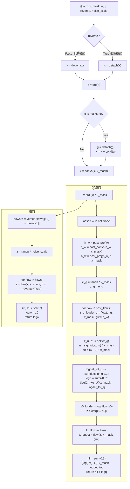

#### 带注释源码

```python
def forward(self, x, x_mask, w=None, g=None, reverse=False, noise_scale=1.0):
    """
    随机时长预测器的前向传播
    
    参数:
        x: 输入特征 [batch, channels, time]
        x_mask: 时间掩码 [batch, 1, time]
        w: 目标时长（训练模式使用）[batch, 1, time]
        g: 说话人条件（可选）[batch, gin_channels, 1]
        reverse: 是否为推理模式
        noise_scale: 推理时噪声缩放因子
    """
    # 分离输入梯度，防止反向传播影响上游
    x = torch.detach(x)
    
    # 初始投影：将输入通道映射到滤波通道
    x = self.pre(x)
    
    # 条件注入：如果提供了说话人嵌入，则将其添加到输入
    if g is not None:
        g = torch.detach(g)  # 分离条件梯度
        x = x + self.cond(g)  # 使用卷积添加条件信息
    
    # 通过DDSConv（Dilated Dilation-Skip Convolution）处理特征
    x = self.convs(x, x_mask)
    
    # 最终投影并应用掩码
    x = self.proj(x) * x_mask

    if not reverse:
        # ==================== 训练模式（计算负对数似然）====================
        flows = self.flows
        assert w is not None, "训练模式必须提供目标时长 w"

        logdet_tot_q = 0
        
        # 处理目标时长 w：投影 -> 卷积 -> 再投影
        h_w = self.post_pre(w)
        h_w = self.post_convs(h_w, x_mask)
        h_w = self.post_proj(h_w) * x_mask
        
        # 从标准正态分布采样噪声，用于后续流变换
        e_q = (
            torch.randn(w.size(0), 2, w.size(2)).to(device=x.device, dtype=x.dtype)
            * x_mask
        )
        z_q = e_q
        
        # 通过后处理流（post_flows）进行变换
        # 这里使用 x + h_w 作为条件，学习从噪声到时长的映射
        for flow in self.post_flows:
            z_q, logdet_q = flow(z_q, x_mask, g=(x + h_w))
            logdet_tot_q += logdet_q
        
        # 分割潜在变量：z_u 用于计算u（软对齐），z1 保留
        z_u, z1 = torch.split(z_q, [1, 1], 1)
        
        # 计算 u = sigmoid(z_u)，将 z_u 转换为 0-1 之间的值（软对齐）
        u = torch.sigmoid(z_u) * x_mask
        
        # z0 = w - u：计算残差（目标时长减去预测的软对齐）
        z0 = (w - u) * x_mask
        
        # 计算 sigmoid 的 logdet（用于 change of variables）
        logdet_tot_q += torch.sum(
            (F.logsigmoid(z_u) + F.logsigmoid(-z_u)) * x_mask, [1, 2]
        )
        
        # 计算 q(z_q | w) 的对数概率（标准正态分布）
        logq = (
            torch.sum(-0.5 * (math.log(2 * math.pi) + (e_q**2)) * x_mask, [1, 2])
            - logdet_tot_q
        )

        # 对 z0 应用对数流（log_flow）
        logdet_tot = 0
        z0, logdet = self.log_flow(z0, x_mask)
        logdet_tot += logdet
        
        # 拼接 z0 和 z1，形成完整的潜在变量
        z = torch.cat([z0, z1], 1)
        
        # 通过主流（flows）进行变换
        for flow in flows:
            z, logdet = flow(z, x_mask, g=x, reverse=reverse)
            logdet_tot = logdet_tot + logdet
        
        # 计算最终负对数似然：-log p(x) = -E[log p(z)] + log|det|
        # 即 nll = sum(0.5*(log(2π)+z²)) - logdet_tot
        nll = (
            torch.sum(0.5 * (math.log(2 * math.pi) + (z**2)) * x_mask, [1, 2])
            - logdet_tot
        )
        
        # 返回 NLL + logq（合并两个部分的损失）
        return nll + logq  # [b]
    else:
        # ==================== 推理模式（从噪声生成时长）====================
        # 反转流链，并移除无用的流（flows[:-2] + [flows[-1]]）
        flows = list(reversed(self.flows))
        flows = flows[:-2] + [flows[-1]]  # remove a useless vflow
        
        # 采样随机噪声
        z = (
            torch.randn(x.size(0), 2, x.size(2)).to(device=x.device, dtype=x.dtype)
            * noise_scale
        )
        
        # 通过反转的流进行逆向变换，生成对数时长
        for flow in flows:
            z = flow(z, x_mask, g=x, reverse=reverse)
        
        # 分割得到 z0（对应 logw）和 z1
        z0, z1 = torch.split(z, [1, 1], 1)
        logw = z0
        
        return logw
```


### `DurationPredictor.forward`

该方法实现了一个基于卷积神经网络的时长预测器前向传播，接收文本编码特征、掩码和可选的说话人嵌入，输出预测的时长对数。

参数：

- `x`：`torch.Tensor`，文本编码特征，形状为 `[batch, in_channels, time_steps]`
- `x_mask`：`torch.Tensor`，时间步掩码，形状为 `[batch, 1, time_steps]`，用于标识有效时间步
- `g`：`torch.Tensor` 或 `None`，说话人嵌入向量，形状为 `[batch, gin_channels, 1]`，用于条件生成

返回值：`torch.Tensor`，预测的时长对数，形状为 `[batch, 1, time_steps]`

#### 流程图

```mermaid
flowchart TD
    A[输入 x, x_mask, g] --> B{判断 g 是否存在}
    B -->|是| C[.detach 分离梯度]
    B -->|否| D[跳过条件处理]
    C --> E[使用 cond 卷积处理 g]
    E --> F[x = x + cond(g)]
    D --> G[继续后续处理]
    F --> H[x = conv_1(x * x_mask)]
    G --> H
    H --> I[ReLU 激活]
    I --> J[LayerNorm 归一化]
    J --> K[Dropout 随机丢弃]
    K --> L[conv_2 处理]
    L --> M[ReLU 激活]
    M --> N[LayerNorm 归一化]
    N --> O[Dropout 随机丢弃]
    O --> P[proj 投影到 1 维]
    P --> Q[输出 = x * x_mask]
    Q --> R[返回预测时长]
```

#### 带注释源码

```python
def forward(self, x, x_mask, g=None):
    # 分离输入张量的梯度，防止梯度回传到此模块之前
    x = torch.detach(x)
    
    # 如果提供了说话人嵌入，则进行条件处理
    if g is not None:
        # 分离说话人嵌入的梯度
        g = torch.detach(g)
        # 将说话人条件通过卷积层融合到输入特征中
        x = x + self.cond(g)
    
    # 第一次卷积：从 in_channels 映射到 filter_channels
    # 乘以 x_mask 确保只对有效时间步进行计算
    x = self.conv_1(x * x_mask)
    # ReLU 激活函数，增加非线性
    x = torch.relu(x)
    # 层归一化，稳定训练过程
    x = self.norm_1(x)
    # Dropout，防止过拟合
    x = self.drop(x)
    
    # 第二次卷积：保持 filter_channels 维度
    x = self.conv_2(x * x_mask)
    x = torch.relu(x)
    x = self.norm_2(x)
    x = self.drop(x)
    
    # 投影层：将特征映射到 1 维，输出时长预测
    x = self.proj(x * x_mask)
    
    # 再次乘以掩码，确保无效时间步的输出为 0
    return x * x_mask
```


### `TextEncoder.forward`

该方法是 TextEncoder 类的前向传播函数，用于将文本序列（包括字符嵌入、音调嵌入、语言嵌入和 BERT 特征）编码为隐藏表示，并输出用于后续音频生成的位置参数（均值和日志方差）。

参数：

- `x`：`torch.Tensor`，形状为 `[batch, seq_len]`，输入的文本序列索引（字符级别）
- `x_lengths`：`torch.Tensor`，形状为 `[batch]`，输入序列的有效长度（用于掩码）
- `tone`：`torch.Tensor`，形状为 `[batch, seq_len]`，音调序列索引
- `language`：`torch.Tensor`，形状为 `[batch, seq_len]`，语言序列索引
- `bert`：`torch.Tensor`，形状为 `[batch, seq_len, 1024]` 或 `[batch, 1024, seq_len]`，BERT 特征表示
- `g`：`torch.Tensor` 或 `None`，形状为 `[batch, gin_channels, 1]`（可选），说话人/风格条件嵌入

返回值：元组 `(x, m, logs, x_mask)`

- `x`：`torch.Tensor`，形状为 `[batch, hidden_channels, seq_len]`，编码后的隐藏表示
- `m`：`torch.Tensor`，形状为 `[batch, out_channels, seq_len]`，均值参数
- `logs`：`torch.Tensor`，形状为 `[batch, out_channels, seq_len]`，日志方差参数
- `x_mask`：`torch.Tensor`，形状为 `[batch, 1, seq_len]`，序列掩码（布尔类型）

#### 流程图

```mermaid
flowchart TD
    A[输入: x, x_lengths, tone, language, bert, g] --> B[计算嵌入表示]
    
    B --> C[字符嵌入: self.emb<br/>tone_emb<br/>language_emb<br/>bert_proj]
    
    C --> D[嵌入融合与缩放]
    D --> E[x = emb + tone_emb + language_emb + bert_proj<br/>x = x * sqrt(hidden_channels)]
    
    E --> F[维度变换]
    F --> G[transpose: [b, t, h] -> [b, h, t]]
    
    G --> H[生成序列掩码]
    H --> I[x_mask = sequence_mask<br/>unsqueeze + to dtype]
    
    I --> J[Transformer编码器]
    J --> K[self.encoder<br/>x * x_mask, x_mask, g]
    
    K --> L[投影与掩码]
    L --> M[stats = proj(x) * x_mask]
    
    M --> N[分离均值与方差]
    N --> O[split: stats -> m, logs]
    
    O --> P[输出: x, m, logs, x_mask]
```

#### 带注释源码

```python
def forward(self, x, x_lengths, tone, language, bert, g=None):
    """
    TextEncoder 前向传播
    
    参数:
        x: 输入文本序列索引 [batch, seq_len]
        x_lengths: 序列有效长度 [batch]
        tone: 音调序列 [batch, seq_len]
        language: 语言序列 [batch, seq_len]
        bert: BERT特征 [batch, seq_len, 1024] 或 [batch, 1024, seq_len]
        g: 说话人嵌入 [batch, gin_channels, 1] 或 None
    
    返回:
        x: 编码后的表示 [batch, hidden_channels, seq_len]
        m: 均值 [batch, out_channels, seq_len]
        logs: 对数方差 [batch, out_channels, seq_len]
        x_mask: 掩码 [batch, 1, seq_len]
    """
    # 1. 计算多模态嵌入表示
    # 将字符嵌入、音调嵌入、语言嵌入与BERT特征相加
    # self.emb(x): [b, t, h] - 字符嵌入
    # self.tone_emb(tone): [b, t, h] - 音调嵌入
    # self.language_emb(language): [b, t, h] - 语言嵌入
    # self.bert_proj(bert).transpose(1, 2): [b, t, h] - BERT特征投影
    x = (
        self.emb(x)
        + self.tone_emb(tone)
        + self.language_emb(language)
        + self.bert_proj(bert).transpose(1, 2)
    ) * math.sqrt(
        self.hidden_channels
    )  # [b, t, h]
    
    # 2. 维度变换: [batch, seq_len, hidden] -> [batch, hidden, seq_len]
    x = torch.transpose(x, 1, -1)  # [b, h, t]
    
    # 3. 生成序列掩码
    # 使用sequence_mask根据实际长度生成掩码，并扩展维度
    x_mask = torch.unsqueeze(commons.sequence_mask(x_lengths, x.size(2)), 1).to(
        x.dtype
    )
    
    # 4. 通过Transformer编码器
    # 传入编码器: 隐藏表示 x、掩码 x_mask、条件嵌入 g
    x = self.encoder(x * x_mask, x_mask, g=g)
    
    # 5. 投影到输出空间并应用掩码
    stats = self.proj(x) * x_mask
    
    # 6. 分离均值(m)和日志方差(logs)
    # stats 形状: [batch, out_channels*2, seq_len]
    # 分割为两个 [batch, out_channels, seq_len] 的张量
    m, logs = torch.split(stats, self.out_channels, dim=1)
    
    # 返回: 编码表示、均值、对数方差、掩码
    return x, m, logs, x_mask
```


### `ResidualCouplingBlock.forward`

该方法是 ResidualCouplingBlock 类的核心前向传播函数，实现基于残差耦合层的归一化流（Normalizing Flow）变换，支持前向传播（正向流）和逆向传播（反向流）两种模式，用于概率分布的转换和潜在表征的生成与重构。

参数：

- `x`：`torch.Tensor`，输入张量，形状为 [batch, channels, time]，表示需要进行流变换的潜在表征
- `x_mask`：`torch.Tensor`，形状为 [batch, 1, time]，二元掩码，用于标识有效时间步，掩盖填充区域
- `g`：`torch.Tensor` 或 `None`，形状为 [batch, gin_channels, 1]（可选），说话人或条件信息嵌入，用于条件化流变换
- `reverse`：`bool`，布尔标志，False 表示前向传播（训练时计算负对数似然），True 表示逆向传播（推理时从随机噪声生成样本）

返回值：`torch.Tensor`，变换后的潜在表征，形状与输入 x 相同 [batch, channels, time]

#### 流程图

```mermaid
flowchart TD
    A[输入 x, x_mask, g, reverse] --> B{reverse == False?}
    B -->|Yes| C[顺序遍历 self.flows]
    B -->|No| D[逆序遍历 self.flows]
    
    C --> E[取出当前 flow 模块]
    D --> E
    
    E --> F{flow 类型判断}
    F -->|ResidualCouplingLayer| G[调用 flow(x, x_mask, g=g, reverse=False)]
    F -->|Flip| H[直接传递 x, 内部交换维度]
    
    G --> I{x, _ = flow 输出}
    H --> I
    
    I --> J{是否还有更多 flow?}
    J -->|Yes| E
    J -->|No| K[返回最终变换后的 x]
    
    K --> L[输出 x_transformed]
```

#### 带注释源码

```python
def forward(self, x, x_mask, g=None, reverse=False):
    """
    ResidualCouplingBlock 的前向/逆向传播方法
    
    参数:
        x: 输入张量 [batch, channels, time]，潜在表征
        x_mask: 二元掩码 [batch, 1, time]，标识有效时间步
        g: 条件嵌入 [batch, gin_channels, 1] 或 None，用于条件化
        reverse: bool，False=前向流(训练), True=逆向流(推理)
    
    返回:
        变换后的张量 [batch, channels, time]
    """
    # 前向传播模式：计算负对数似然
    if not reverse:
        # 按照定义顺序遍历流模块
        for flow in self.flows:
            # 依次通过每个耦合层和翻转层
            # ResidualCouplingLayer: 执行仿射耦合变换
            # Flip: 交换通道维度顺序
            x, _ = flow(x, x_mask, g=g, reverse=reverse)
    else:
        # 逆向传播模式：从噪声生成样本
        # 逆序遍历以实现完全可逆的逆变换
        for flow in reversed(self.flows):
            # 逆向通过每个流模块
            x = flow(x, x_mask, g=g, reverse=reverse)
    
    # 返回变换后的潜在表征
    return x
```

#### 详细说明

该方法实现了 VITS（Variational Inference with adversarial Learning for end-to-end Text-to-Speech）模型中残差耦合块的核心功能。基于归一化流（Normalizing Flow）理论，通过堆叠多个 ResidualCouplingLayer 和 Flip 模块，构建了一个可逆的变换网络。

**前向传播（reverse=False）**：在训练阶段使用，计算输入数据在潜在空间的对数似然，通过最大化似然来优化模型。

**逆向传播（reverse=False）**：在推理阶段使用，从标准高斯噪声出发，通过逆向流变换生成符合目标分布的潜在表征。

**条件信息 g**：通过全局条件嵌入实现说话人适应等多模态控制，使流变换过程受说话人特征的调节。


### `PosteriorEncoder.forward`

该方法是 VITS2 语音合成模型中的后验编码器（PosteriorEncoder），负责将输入的频谱（spectrogram）编码为潜在变量 z，同时预测均值和log标准差，用于后续的流模型（Flow）处理。

参数：

- `x`：`torch.Tensor`，输入的频谱特征，形状为 [batch, in_channels, time_steps]
- `x_lengths`：`torch.Tensor`，输入序列的实际长度，用于生成掩码
- `g`：`torch.Tensor` 或 `None`，说话人条件向量（speaker embedding），用于条件化编码过程

返回值：

- `z`：`torch.Tensor`，从后验分布采样得到的潜在变量，形状为 [batch, out_channels, time_steps]
- `m`：`torch.Tensor`，预测的均值，形状为 [batch, out_channels, time_steps]
- `logs`：`torch.Tensor`，预测的 log 标准差，形状为 [batch, out_channels, time_steps]
- `x_mask`：`torch.Tensor`，时间步掩码，形状为 [batch, 1, time_steps]

#### 流程图

```mermaid
flowchart TD
    A[输入 x 和 x_lengths] --> B[生成序列掩码 x_mask]
    B --> C[self.pre 卷积投影]
    C --> D[乘以掩码 x_mask]
    D --> E[self.enc WN 编码器]
    E --> F[self.proj 投影到均值和方差]
    F --> G[乘以掩码 x_mask]
    G --> H[分割 stats 为 m 和 logs]
    H --> I[采样 z = m + randn * exp(logs)]
    I --> J[乘以掩码 x_mask]
    J --> K[返回 z, m, logs, x_mask]
```

#### 带注释源码

```python
def forward(self, x, x_lengths, g=None):
    # 使用序列长度生成布尔掩码，并扩展维度以适配卷积输出
    # x_mask shape: [batch, 1, time_steps]
    x_mask = torch.unsqueeze(commons.sequence_mask(x_lengths, x.size(2)), 1).to(
        x.dtype
    )
    
    # 1. 输入预处理卷积：将输入特征映射到隐藏维度
    # pre 是 Conv1d(in_channels, hidden_channels, 1)
    x = self.pre(x) * x_mask
    
    # 2. WN（WaveNet）编码器：执行主要的特征提取
    # enc 是 modules.WN，包含多层扩张卷积和残差连接
    # g 是说话人条件向量，用于调节编码过程
    x = self.enc(x, x_mask, g=g)
    
    # 3. 投影层：输出均值和log标准差（两倍输出通道）
    # proj 是 Conv1d(hidden_channels, out_channels * 2, 1)
    stats = self.proj(x) * x_mask
    
    # 4. 分割统计量：从通道维度分离出均值和log标准差
    # m: 均值, logs: log(标准差)
    m, logs = torch.split(stats, self.out_channels, dim=1)
    
    # 5. 重参数化采样：从 N(m, exp(logs)^2) 中采样
    # torch.randn_like(m) 生成与 m 形状相同的标准正态分布噪声
    # exp(logs) 将 log 标准差转换为标准差
    z = (m + torch.randn_like(m) * torch.exp(logs)) * x_mask
    
    # 6. 返回：潜在变量、均值、log标准差、掩码
    return z, m, logs, x_mask
```


### `Generator.forward(x, g)`

该方法执行音频波形的生成，通过一系列上采样转置卷积和残差块将低分辨率的音频特征图逐步上采样至原始采样率，并应用条件信息（如果有）生成最终的音频波形。

参数：

-  `x`：`torch.Tensor`，输入的音频特征张量，形状为 `[batch_size, channels, time_steps]`，通常来自声学模型或流模型的潜在表示
-  `g`：`torch.Tensor` 或 `None`，说话人/风格条件的嵌入向量，形状为 `[batch_size, gin_channels, 1]`，用于调节生成过程，可选

返回值：`torch.Tensor`，生成的音频波形，形状为 `[batch_size, 1, time_steps * total_upsample_rate]`，值域为 `[-1, 1]`

#### 流程图

```mermaid
flowchart TD
    A[输入特征 x] --> B[初始卷积 conv_pre]
    B --> C{条件信息 g 是否存在?}
    C -->|是| D[应用条件投影 cond 并加到特征]
    C -->|否| E[继续执行]
    D --> E
    E --> F[第 i 次上采样循环 i=0 to num_upsamples-1]
    F --> G[LeakyReLU 激活]
    G --> H[第 i 个上采样卷积 ups[i]]
    H --> I[残差块循环 j=0 to num_kernels-1]
    I --> J[累加所有残差块输出]
    J --> K[除以核数量取平均]
    K --> L{还有更多上采样层?}
    L -->|是| F
    L -->|否| M[LeakyReLU 激活]
    M --> N[最终卷积 conv_post]
    N --> O[Tanh 激活]
    O --> P[输出波形]
```

#### 带注释源码

```python
def forward(self, x, g=None):
    """
    前向传播：生成音频波形
    
    参数:
        x: 输入特征张量 [batch, channels, time]
        g: 条件嵌入 [batch, gin_channels, 1]，可选
    
    返回:
        生成的波形 [batch, 1, time']
    """
    # 步骤1: 初始卷积，将输入通道数映射到上采样初始通道数
    x = self.conv_pre(x)  # [b, upsample_initial_channel, t]
    
    # 步骤2: 如果存在条件信息，将其添加到特征中
    if g is not None:
        # 使用条件投影将说话人嵌入加到特征上
        x = x + self.cond(g)  # [b, upsample_initial_channel, t]
    
    # 步骤3: 遍历每个上采样阶段
    for i in range(self.num_upsamples):
        # LeakyReLU 激活，斜率 LRELU_SLOPE
        x = F.leaky_relu(x, modules.LRELU_SLOPE)
        
        # 第 i 个转置卷积上采样
        x = self.ups[i](x)  # 时间步长扩大 upsample_rates[i] 倍
        
        # 步骤4: 残差块处理，对多个核的输出取平均
        xs = None
        for j in range(self.num_kernels):
            if xs is None:
                # 第一个残差块
                xs = self.resblocks[i * self.num_kernels + j](x)
            else:
                # 累加后续残差块输出
                xs += self.resblocks[i * self.num_kernels + j](x)
        
        # 所有残差块输出取平均，保持输出幅度一致
        x = xs / self.num_kernels
    
    # 步骤5: 最终处理
    x = F.leaky_relu(x)  # 最终激活
    x = self.conv_post(x)  # 映射到单通道波形
    x = torch.tanh(x)  # 归一化到 [-1, 1]
    
    return x
```


### `Generator.remove_weight_norm`

该方法用于移除 Generator 模型中所有卷积层和残差块的权重归一化（Weight Normalization），通常在模型推理阶段或导出模型时调用，以简化模型结构并减少运行时开销。

参数：

- 无

返回值：`None`，无返回值（该方法直接修改模型内部状态）

#### 流程图

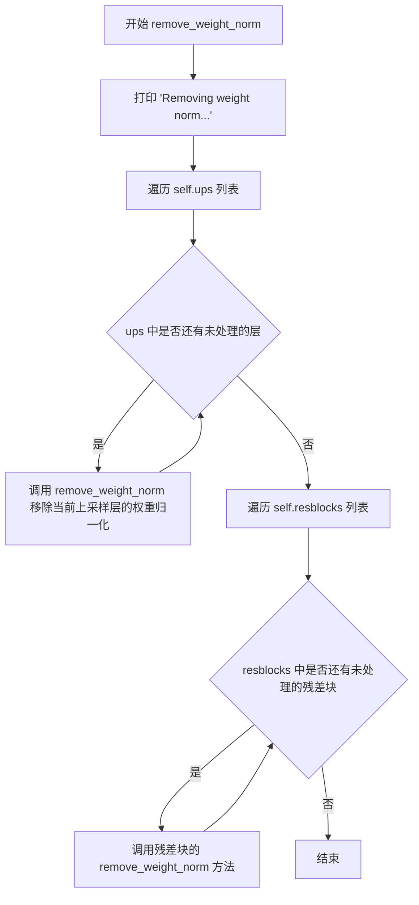

#### 带注释源码

```python
def remove_weight_norm(self):
    """
    移除 Generator 模型中所有权重归一化层
    
    该方法执行以下操作：
    1. 打印移除权重归一化的提示信息
    2. 遍历上采样层 (self.ups)，逐一移除 weight_norm
    3. 遍历残差块 (self.resblocks)，调用各自的 remove_weight_norm 方法
    """
    print("Removing weight norm...")
    
    # 遍历所有上采样转置卷积层，移除权重归一化
    # self.ups 是一个 nn.ModuleList，包含多个 weight_norm 包装的 ConvTranspose1d 层
    for l in self.ups:
        remove_weight_norm(l)
    
    # 遍历所有残差块，调用每个残差块内部定义的 remove_weight_norm 方法
    # 每个残差块可能包含多个卷积层，都需要移除权重归一化
    for l in self.resblocks:
        l.remove_weight_norm()
```


### `DiscriminatorP.forward(x)`

该方法是 VITS（Variational Inference with adversarial learning for high-quality Text-to-Speech）模型中多周期判别器（Multi-Period Discriminator）的核心组件，负责将一维音频特征转换为二维特征图并通过卷积神经网络提取多尺度特征，以区分真实音频与生成音频。

参数：

- `x`：`torch.Tensor`，形状为 `(batch, channels, time)`，输入的一维音频特征序列

返回值：

- `x`：`torch.Tensor`，形状为 `(batch, -1)`，展平后的判别特征向量，用于计算对抗损失
- `fmap`：`List[torch.Tensor]`，包含每层卷积输出的特征图列表，用于特征匹配损失计算

#### 流程图

```mermaid
flowchart TD
    A[输入 x: (batch, channels, time)] --> B{检查时间步长是否能被 period 整除}
    B -->|不能整除| C[使用反射填充补齐时间维度]
    B -->|能整除| D[直接进行维度变换]
    C --> D
    D --> E[将 1D 特征reshape为 2D: (batch, channels, time//period, period)]
    E --> F[遍历卷积层列表 self.convs]
    F -->|对于每层卷积 l| G[l(x) 进行卷积操作]
    G --> H[应用 LeakyReLU 激活]
    H --> I[保存特征图到 fmap 列表]
    I --> F
    F --> J[最后一层卷积 self.conv_post]
    J --> K[保存最终特征图]
    K --> L[将特征展平为一维向量]
    L --> M[返回 展平特征向量x 和 特征图列表 fmap]
```

#### 带注释源码

```python
def forward(self, x):
    """
    DiscriminatorP 的前向传播
    将一维音频特征转换为周期性的二维表示，通过卷积网络提取特征
    """
    fmap = []  # 用于存储每层卷积的特征图，用于特征匹配损失

    # ---------- 1D to 2D 变换 ----------
    # 获取输入维度: batch, channels, time
    b, c, t = x.shape
    
    # 如果时间步长不能被 period 整除，则在末尾进行反射填充
    if t % self.period != 0:  # pad first
        # 计算需要填充的长度
        n_pad = self.period - (t % self.period)
        # 使用反射填充模式在时间维度末尾填充
        x = F.pad(x, (0, n_pad), "reflect")
        t = t + n_pad  # 更新填充后的时间长度
    
    # 将 (batch, channels, time) 转换为 (batch, channels, time//period, period)
    # 将一维特征转换为二维特征，每个 period 作为一个时间步
    x = x.view(b, c, t // self.period, self.period)

    # ---------- 卷积特征提取 ----------
    # 依次通过 5 层卷积层，每层后接 LeakyReLU 激活
    for l in self.convs:
        x = l(x)  # 应用卷积: Conv2d
        x = F.leaky_relu(x, modules.LRELU_SLOPE)  # LeakyReLU 激活（负斜率 0.2）
        fmap.append(x)  # 保存中间特征图
    
    # ---------- 输出层 ----------
    # 最后一层卷积，将特征映射到标量输出
    x = self.conv_post(x)
    fmap.append(x)  # 保存最终特征图
    
    # 将多维特征展平为二维 (batch, -1)
    # 便于后续的全连接层处理
    x = torch.flatten(x, 1, -1)

    return x, fmap
```


### `DiscriminatorS.forward`

规模判别器的前向传播过程，对输入音频进行多尺度卷积处理，输出判别结果和中间特征图。

参数：
- `x`：`torch.Tensor`，输入的音频张量，形状为 [batch, channels, time]

返回值：`(torch.Tensor, list)`，第一个元素是展平后的判别输出，第二个元素是各层特征图列表

#### 流程图

```mermaid
flowchart TD
    A[输入 x: [batch, 1, time]] --> B[遍历卷积层列表 self.convs]
    B --> C{卷积层 l 是否遍历完成?}
    C -->|否| D[l(x) 执行卷积]
    D --> E[F.leaky_relu激活]
    E --> F[fmap.append添加特征图]
    F --> B
    C -->|是| G[执行最终卷积 self.conv_post]
    G --> H[fmap.append添加最后特征图]
    H --> I[torch.flatten展平输出]
    I --> J[返回 x 和 fmap]
```

#### 带注释源码

```python
def forward(self, x):
    """
    DiscriminatorS 的前向传播
    
    Args:
        x: 输入音频张量，形状为 [batch, channels, time]
           通常是 [batch, 1, time] 的单通道音频
    
    Returns:
        x: 展平后的判别输出，形状为 [batch, -1]
        fmap: 包含各层特征图的列表，用于特征匹配损失
    """
    fmap = []  # 存储中间特征图

    # 遍历6个卷积层组成的特征提取器
    for l in self.convs:
        x = l(x)  # 执行卷积: Conv1d
        x = F.leaky_relu(x, modules.LRELU_SLOPE)  # LeakyReLU激活，斜率0.2
        fmap.append(x)  # 保存中间特征图
    
    # 最终卷积层，输出判别分数
    x = self.conv_post(x)
    fmap.append(x)  # 保存最后一层特征图
    
    # 展平张量: [batch, channels, time] -> [batch, channels*time]
    x = torch.flatten(x, 1, -1)

    return x, fmap
```


### `MultiPeriodDiscriminator.forward`

多周期判别器的前向传播方法，通过多个并行的周期判别器（1个切片判别器+5个周期判别器）对真实音频和生成音频进行判别，返回各判别器的输出和特征图，用于计算GAN对抗损失。

参数：

- `y`：`torch.Tensor`，真实音频张量，形状为 [batch, channels, time]
- `y_hat`：`torch.Tensor`，生成（预测）音频张量，形状为 [batch, channels, time]

返回值：`Tuple[List[torch.Tensor], List[torch.Tensor], List[List[torch.Tensor]], List[List[torch.Tensor]]]`，包含四个列表：

- `y_d_rs`：真实音频在各判别器输出
- `y_d_gs`：生成音频在各判别器输出
- `fmap_rs`：真实音频在各判别器的特征图列表
- `fmap_gs`：生成音频在各判别器的特征图列表

#### 流程图

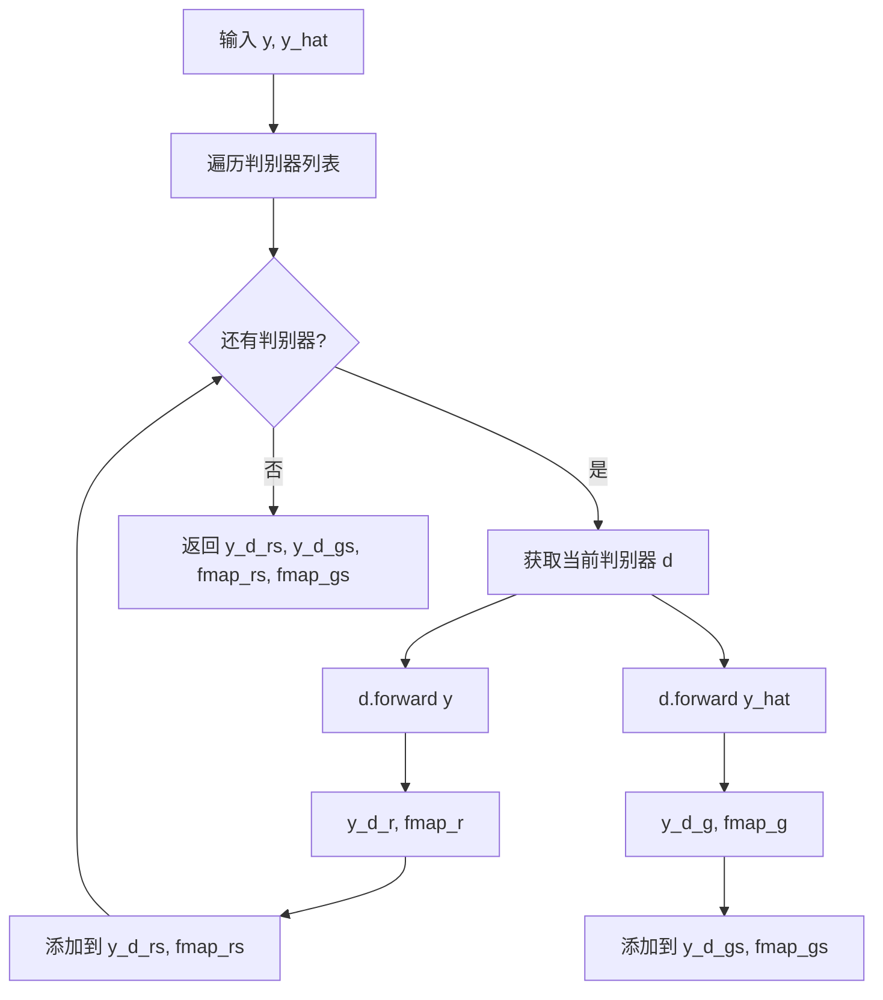

#### 带注释源码

```python
def forward(self, y, y_hat):
    """
    多周期判别器的前向传播
    
    参数:
        y: 真实音频张量 [batch, channels, time]
        y_hat: 生成音频张量 [batch, channels, time]
    
    返回:
        包含真实/生成音频在各判别器输出及特征图的元组
    """
    y_d_rs = []  # 存储真实音频在各判别器的输出
    y_d_gs = []  # 存储生成音频在各判别器的输出
    fmap_rs = []  # 存储真实音频在各判别器的特征图
    fmap_gs = []  # 存储生成音频在各判别器的特征图
    
    # 遍历所有判别器（包括1个切片判别器DiscriminatorS和5个周期判别器DiscriminatorP）
    for i, d in enumerate(self.discriminators):
        # 对真实音频进行前向传播
        y_d_r, fmap_r = d(y)
        # 对生成音频进行前向传播
        y_d_g, fmap_g = d(y_hat)
        
        # 收集真实音频的输出和特征图
        y_d_rs.append(y_d_r)
        fmap_rs.append(fmap_r)
        
        # 收集生成音频的输出和特征图
        y_d_gs.append(y_d_g)
        fmap_gs.append(fmap_g)

    # 返回: [真实输出列表, 生成输出列表, 真实特征图列表, 生成特征图列表]
    return y_d_rs, y_d_gs, fmap_rs, fmap_gs
```


### `ReferenceEncoder.forward`

该方法接收参考音频的频谱图（mel-spectrogram）作为输入，通过多层卷积神经网络提取局部特征，然后利用GRU网络捕捉时序依赖关系，最终输出一个固定维度的参考音频embedding向量，用于后续的语音合成任务。

参数：

- `inputs`：`torch.Tensor`，输入的mel频谱图，形状为 [N, Ty/r, n_mels*r]，其中N为批次大小，Ty为时间步数，n_mels为mel滤波器组数，r为下采样率
- `mask`：`torch.Tensor` 或 `None`，可选的mask，用于掩码padding部分，默认为None

返回值：`torch.Tensor`，形状为 [N, gin_channels] 的参考编码向量

#### 流程图

```mermaid
flowchart TD
    A[inputs: N, Ty/r, n_mels*r] --> B[view reshape: N, 1, Ty, n_mels]
    B --> C[Conv2d Stack: 6 layers with stride 2]
    C --> D[ReLU Activation]
    D --> E[Transpose: N, Ty//64, 128, n_mels//64]
    E --> F[Reshape: N, Ty//64, 128*n_mels//64]
    F --> G[GRU: input_size, hidden_size=128]
    G --> H[Project Linear: 128 -> gin_channels]
    H --> I[output: N, gin_channels]
```

#### 带注释源码

```python
def forward(self, inputs, mask=None):
    """
    inputs: [N, Ty/r, n_mels*r]  mels
    outputs: [N, ref_enc_gru_size]
    """
    N = inputs.size(0)  # 获取批次大小
    # 将输入reshape为4D张量 [N, 1, Ty, n_mels]
    out = inputs.view(N, 1, -1, self.spec_channels)
    
    # 通过卷积层堆栈进行特征提取
    for conv in self.convs:
        out = conv(out)  # Conv2d: stride=2 逐步下采样
        # out = wn(out)  # 可选的权重归一化（注释掉）
        out = F.relu(out)  # 激活函数
        # out: [N, 128, Ty//2^K, n_mels//2^K]
    
    # 调整维度顺序以便GRU处理
    out = out.transpose(1, 2)  # [N, Ty//2^K, 128, n_mels//2^K]
    T = out.size(1)  # 时间步数
    N = out.size(0)  # 批次大小
    # 展平空间维度，与GRU输入对接
    out = out.contiguous().view(N, T, -1)  # [N, Ty//2^K, 128*n_mels//2^K]
    
    # GRU前向传播
    self.gru.flatten_parameters()  # 优化GRU参数布局提升效率
    memory, out = self.gru(out)  # out: [1, N, 128]
    
    # 线性投影到目标说话人embedding维度
    return self.proj(out.squeeze(0))  # [N, gin_channels]
```


### `ReferenceEncoder.calculate_channels`

该方法用于计算卷积操作经过多次下采样后的输出通道数（或长度），通过迭代应用卷积公式来推导最终的尺寸。

参数：

- `L`：`int`，输入的通道数或长度维度
- `kernel_size`：`int`，卷积核大小
- `stride`：`int`，卷积步长
- `pad`：`int`，卷积填充大小
- `n_convs`：`int`，卷积层的数量

返回值：`int`，经过 n_convs 次卷积操作后的输出通道数/长度

#### 流程图

```mermaid
flowchart TD
    A[开始] --> B[i = 0]
    B --> C{i < n_convs?}
    C -->|是| D[L = (L - kernel_size + 2 * pad) // stride + 1]
    D --> E[i = i + 1]
    E --> C
    C -->|否| F[返回 L]
    F --> G[结束]
```

#### 带注释源码

```python
def calculate_channels(self, L, kernel_size, stride, pad, n_convs):
    """
    计算卷积操作经过多次下采样后的输出通道数
    
    参数:
        L: int - 输入的通道数或长度维度
        kernel_size: int - 卷积核大小
        stride: int - 卷积步长
        pad: int - 卷积填充大小
        n_convs: int - 卷积层的数量
    
    返回:
        int - 经过 n_convs 次卷积操作后的输出通道数/长度
    """
    # 遍历每一个卷积层，迭代计算输出尺寸
    for i in range(n_convs):
        # 应用卷积输出尺寸公式: (W - K + 2P) / S + 1
        L = (L - kernel_size + 2 * pad) // stride + 1
    return L
```


### `SynthesizerTrn.forward`

该方法是VITS（Variational Inference with adversarial Learning for end-to-end Text-to-Speech）合成器的训练前向传播核心实现，负责将文本序列和音频序列转换为对齐的语音表示，并通过解码器生成最终音频，同时计算时长预测损失和重构损失。

参数：

- `x`：`torch.Tensor`，文本输入，形状为 `[batch_size, seq_len]`，表示字符或音素序列
- `x_lengths`：`torch.Tensor`，文本序列长度，形状为 `[batch_size]`，用于创建掩码
- `y`：`torch.Tensor`，目标音频的Mel频谱图，形状为 `[batch_size, mel_channels, time_steps]`
- `y_lengths`：`torch.Tensor`，音频序列长度，形状为 `[batch_size]`，用于创建掩码
- `sid`：`torch.Tensor`，说话人ID，形状为 `[batch_size]`，用于说话人条件嵌入
- `tone`：`torch.Tensor`，音调特征，形状为 `[batch_size, seq_len]`，表示文本对应的音调序列
- `language`：`torch.Tensor`，语言特征，形状为 `[batch_size, seq_len]`，表示文本对应的语言序列
- `bert`：`torch.Tensor`，BERT文本编码特征，形状为 `[batch_size, seq_len, bert_dim]`，用于提供语义信息

返回值：`tuple`，包含以下元素：
- `o`：`torch.Tensor`，生成的音频波形，形状为 `[batch_size, 1, segment_size * upsample_rate]`
- `l_length`：`torch.Tensor`，时长预测损失（标量），由SDP和DP损失组成
- `attn`：`torch.Tensor`，文本与音频之间的对齐矩阵，形状为 `[batch_size, 1, seq_len, time_steps]`
- `ids_slice`：`torch.Tensor`，用于切片音频的起始位置索引
- `x_mask`：`torch.Tensor`，文本掩码，形状为 `[batch_size, 1, seq_len]`
- `y_mask`：`torch.Tensor`，音频掩码，形状为 `[batch_size, 1, time_steps]`
- `latents`：`tuple`，潜在变量元组，包含 `(z, z_p, m_p, logs_p, m_q, logs_q)`
- `logging_info`：`tuple`，日志信息元组，包含 `(x, logw, logw_)`

#### 流程图

```mermaid
flowchart TD
    A[输入: x, x_lengths, y, y_lengths, sid, tone, language, bert] --> B{检查说话人数量}
    B -->|n_speakers >= 0| C[获取说话人嵌入: emb_g]
    B -->|n_speakers < 0| D[使用Reference Encoder编码音频]
    C --> E[Text Encoder: enc_p]
    D --> E
    E --> F[输出: x, m_p, logs_p, x_mask]
    F --> G[Posterior Encoder: enc_q]
    G --> H[输出: z, m_q, logs_q, y_mask]
    H --> I[Flow变换: flow]
    I --> J[输出: z_p]
    J --> K[计算负中心概率 neg_cent]
    K --> L{是否使用噪声缩放MAS}
    L -->|是| M[添加噪声到neg_cent]
    L -->|否| N[直接使用neg_cent]
    M --> O
    N --> O[计算对齐矩阵 attn]
    O --> P[计算时长: w = attn.sum2]
    P --> Q[Stochastic Duration Predictor损失]
    P --> R[Duration Predictor损失]
    Q --> S[总时长损失 l_length]
    R --> S
    S --> T[扩展先验: m_p, logs_p]
    T --> U[随机切片: rand_slice_segments]
    U --> V[生成音频: Decoder dec]
    V --> W[返回: o, l_length, attn, ids_slice, x_mask, y_mask, latents, logging_info]
    
    style A fill:#f9f,color:#333
    style S fill:#9f9,color:#333
    style W fill:#9ff,color:#333
```

#### 带注释源码

```python
def forward(self, x, x_lengths, y, y_lengths, sid, tone, language, bert):
    """
    训练前向传播函数
    
    参数:
        x: 文本序列 [batch_size, text_len]
        x_lengths: 文本长度 [batch_size]
        y: 目标Mel频谱图 [batch_size, mel_channels, time_steps]
        y_lengths: 目标长度 [batch_size]
        sid: 说话人ID [batch_size]
        tone: 音调特征 [batch_size, text_len]
        language: 语言特征 [batch_size, text_len]
        bert: BERT编码 [batch_size, text_len, bert_dim]
    
    返回:
        生成的音频和相关损失
    """
    # 步骤1: 获取说话人条件嵌入
    if self.n_speakers >= 0:
        # 使用Embedding层获取说话人向量
        # 输出形状: [batch_size, gin_channels, 1]
        g = self.emb_g(sid).unsqueeze(-1)
    else:
        # 使用Reference Encoder从音频中提取说话人特征
        g = self.ref_enc(y.transpose(1, 2)).unsqueeze(-1)
    
    # 步骤2: 文本编码器 - 将文本转换为潜在表示
    # 输入: 文本+音调+语言+BERT特征 + 说话人条件
    # 输出: 
    #   x: 编码后的文本特征 [batch_size, hidden_channels, text_len]
    #   m_p: 均值 [batch_size, inter_channels, text_len]
    #   logs_p: log方差 [batch_size, inter_channels, text_len]
    #   x_mask: 文本掩码 [batch_size, 1, text_len]
    x, m_p, logs_p, x_mask = self.enc_p(x, x_lengths, tone, language, bert, g=g)
    
    # 步骤3: 后验编码器 - 将目标音频转换为潜在变量
    # 输入: Mel频谱图 + 说话人条件
    # 输出:
    #   z: 潜在变量 [batch_size, inter_channels, time_steps]
    #   m_q: 均值 [batch_size, inter_channels, time_steps]
    #   logs_q: log方差 [batch_size, inter_channels, time_steps]
    #   y_mask: 音频掩码 [batch_size, 1, time_steps]
    z, m_q, logs_q, y_mask = self.enc_q(y, y_lengths, g=g)
    
    # 步骤4: Flow变换 - 将后验分布映射到先验分布
    # 输入: 潜在变量z + 掩码 + 说话人条件
    # 输出: 变换后的潜在变量z_p
    z_p = self.flow(z, y_mask, g=g)
    
    # 步骤5: 计算对齐矩阵 (Monotonic Alignment Search)
    with torch.no_grad():  # 不计算梯度，提高效率
        # 计算负中心概率 (negative centroid)
        # 用于衡量文本和音频之间的对齐成本
        s_p_sq_r = torch.exp(-2 * logs_p)  # [batch_size, d, t_s]
        
        # 计算高斯分布的log概率的各个项
        neg_cent1 = torch.sum(
            -0.5 * math.log(2 * math.pi) - logs_p, [1], keepdim=True
        )  # 常数项
        
        neg_cent2 = torch.matmul(
            -0.5 * (z_p**2).transpose(1, 2), s_p_sq_r
        )  # 二次项 [b, t_t, t_s]
        
        neg_cent3 = torch.matmul(
            z_p.transpose(1, 2), (m_p * s_p_sq_r)
        )  # 线性项 [b, t_t, t_s]
        
        neg_cent4 = torch.sum(
            -0.5 * (m_p**2) * s_p_sq_r, [1], keepdim=True
        )  # 偏置项
        
        # 合成最终的负中心矩阵
        neg_cent = neg_cent1 + neg_cent2 + neg_cent3 + neg_cent4
        
        # 可选: 添加噪声的MAS (用于更鲁棒的对齐)
        if self.use_noise_scaled_mas:
            epsilon = (
                torch.std(neg_cent)
                * torch.randn_like(neg_cent)
                * self.current_mas_noise_scale
            )
            neg_cent = neg_cent + epsilon
        
        # 创建注意力掩码
        attn_mask = torch.unsqueeze(x_mask, 2) * torch.unsqueeze(y_mask, -1)
        
        # 使用Monotonic Alignment寻找最优对齐路径
        attn = (
            monotonic_align.maximum_path(neg_cent, attn_mask.squeeze(1))
            .unsqueeze(1)
            .detach()  # 分离计算图，不对对齐梯度
        )
    
    # 步骤6: 从对齐矩阵计算时长
    w = attn.sum(2)  # [batch_size, 1, text_len] - 每个字符的持续帧数
    
    # 步骤7: 计算时长预测损失
    # Stochastic Duration Predictor损失
    l_length_sdp = self.sdp(x, x_mask, w, g=g)
    l_length_sdp = l_length_sdp / torch.sum(x_mask)
    
    # Duration Predictor损失
    logw_ = torch.log(w + 1e-6) * x_mask  # 目标log时长
    logw = self.dp(x, x_mask, g=g)       # 预测log时长
    l_length_dp = torch.sum((logw - logw_) ** 2, [1, 2]) / torch.sum(x_mask)
    
    # 总时长损失
    l_length = l_length_dp + l_length_sdp
    
    # 步骤8: 使用对齐矩阵扩展先验分布
    # 将文本级别的均值/方差扩展到音频级别
    m_p = torch.matmul(attn.squeeze(1), m_p.transpose(1, 2)).transpose(1, 2)
    logs_p = torch.matmul(attn.squeeze(1), logs_p.transpose(1, 2)).transpose(1, 2)
    
    # 步骤9: 随机切片 - 从长音频中采样片段用于训练
    z_slice, ids_slice = commons.rand_slice_segments(
        z, y_lengths, self.segment_size
    )
    
    # 步骤10: 解码器生成音频波形
    o = self.dec(z_slice, g=g)
    
    # 返回所有输出用于损失计算和可视化
    return (
        o,                          # 生成的音频 [batch, 1, segment_size * upsample]
        l_length,                   # 时长损失
        attn,                       # 对齐矩阵
        ids_slice,                  # 切片索引
        x_mask,                     # 文本掩码
        y_mask,                     # 音频掩码
        (z, z_p, m_p, logs_p, m_q, logs_q),  # 潜在变量
        (x, logw, logw_)            # 日志信息
    )
```


### `SynthesizerTrn.infer`

该方法是VITS（Variational Inference with adversarial learning for end-to-end Text-to-Speech）模型的核心推理接口，负责将文本特征（音素、韵律、语义）转换为最终的语音波形输出。

参数：

- `x`：`torch.Tensor`，输入的文本token序列，形状为 [batch_size, seq_len]
- `x_lengths`：`torch.Tensor`，输入序列的实际长度，用于mask
- `sid`：`torch.Tensor`，说话人ID，用于说话人条件嵌入
- `tone`：`torch.Tensor`，音调特征序列
- `language`：`torch.Tensor`，语言特征序列
- `bert`：`torch.Tensor`，BERT语义特征
- `noise_scale`：`float`，默认为0.667，潜变量采样时的噪声缩放因子
- `length_scale`：`float`，默认为1.0，控制输出语音的长度缩放
- `noise_scale_w`：`float`，默认为0.8，持续时间预测的噪声缩放因子
- `max_len`：`int`，可选，生成语音的最大长度限制
- `sdp_ratio`：`float`，默认为0，控制sdp和dp的混合比例
- `y`：`torch.Tensor`，可选，参考音频的mel频谱（当n_speakers<=0时使用）

返回值：`tuple`，包含以下四个元素：
- `o`：`torch.Tensor`，生成的语音波形，形状为 [batch_size, 1, time_steps]
- `attn`：`torch.Tensor`，文本-语音对齐矩阵
- `y_mask`：`torch.Tensor`，输出序列的mask
- `(z, z_p, m_p, logs_p)`：`tuple`，潜在变量用于调试和可视化

#### 流程图

```mermaid
flowchart TD
    A[输入: x, x_lengths, sid, tone, language, bert] --> B{检查说话人数量}
    B -->|n_speakers > 0| C[使用说话人Embedding]
    B -->|n_speakers <= 0| D[使用Reference Encoder]
    C --> E[Text Encoder编码]
    D --> E
    E --> F[生成说话人条件向量 g]
    F --> G[Text Encoder: x, m_p, logs_p, x_mask]
    G --> H[Duration Prediction]
    H --> I[混合SDP和DP预测: logw]
    I --> J[计算对齐注意力矩阵 attn]
    J --> K[扩展先验分布: m_p, logs_p]
    K --> L[采样潜变量: z_p = m_p + noise * exp(logs_p)]
    L --> M[Flow逆向变换: z = flow⁻¹(z_p)]
    M --> N[WaveNet Decoder生成波形: o = dec(z * y_mask)]
    N --> O[输出: o, attn, y_mask, (z, z_p, m_p, logs_p)]
```

#### 带注释源码

```python
def infer(
    self,
    x,                      # 输入文本token [batch, seq_len]
    x_lengths,              # 输入序列长度 [batch]
    sid,                    # 说话人ID [batch]
    tone,                   # 音调特征 [batch, seq_len]
    language,               # 语言特征 [batch, seq_len]
    bert,                   # BERT特征 [batch, seq_len, 1024]
    noise_scale=0.667,       # 潜变量噪声缩放
    length_scale=1.0,       # 输出长度缩放
    noise_scale_w=0.8,      # 持续时间噪声缩放
    max_len=None,           # 最大生成长度
    sdp_ratio=0.0,          # SDP/DP混合比例
    y=None,                 # 参考音频mel谱（可选）
):
    """
    VITS模型推理主函数
    流程: 文本编码 -> 持续时间预测 -> 对齐 -> 潜变量采样 -> Flow逆变换 -> 波形生成
    """
    
    # 1. 说话人条件处理
    if self.n_speakers > 0:
        # 使用Embedding层获取说话人向量
        g = self.emb_g(sid).unsqueeze(-1)  # [b, h, 1]
    else:
        # 使用Reference Encoder从参考音频提取说话人特征
        g = self.ref_enc(y.transpose(1, 2)).unsqueeze(-1)
    
    # 2. 文本编码器前向传播
    # 返回: 编码特征x, 均值m_p, 标准差logs_p, 序列mask
    x, m_p, logs_p, x_mask = self.enc_p(x, x_lengths, tone, language, bert, g=g)
    
    # 3. 持续时间预测（混合SDP和DP）
    # SDP: Stochastic Duration Predictor - 随机持续时间预测
    # DP: Duration Predictor - 确定性持续时间预测
    logw = (
        self.sdp(x, x_mask, g=g, reverse=True, noise_scale=noise_scale_w) * sdp_ratio  # SDP逆向采样
        + self.dp(x, x_mask, g=g) * (1 - sdp_ratio)  # DP确定性预测
    )
    
    # 4. 持续时间转换为实际长度
    # exp(logw) 将对数持续时间转为正值，乘以length_scale控制语速
    w = torch.exp(logw) * x_mask * length_scale
    w_ceil = torch.ceil(w)  # 向上取整得到每帧的采样点数
    
    # 5. 计算输出序列长度和mask
    y_lengths = torch.clamp_min(torch.sum(w_ceil, [1, 2]), 1).long()
    y_mask = torch.unsqueeze(commons.sequence_mask(y_lengths, None), 1).to(x_mask.dtype)
    
    # 6. 生成文本-语音对齐矩阵（attention mask）
    attn_mask = torch.unsqueeze(x_mask, 2) * torch.unsqueeze(y_mask, -1)
    attn = commons.generate_path(w_ceil, attn_mask)  # 使用VITS路径生成算法
    
    # 7. 通过对齐矩阵扩展先验分布
    # 将文本级别的表示映射到音频帧级别
    m_p = torch.matmul(attn.squeeze(1), m_p.transpose(1, 2)).transpose(1, 2)
    logs_p = torch.matmul(attn.squeeze(1), logs_p.transpose(1, 2)).transpose(1, 2)
    
    # 8. 从先验分布采样潜变量
    # z_p ~ N(m_p, exp(2*logs_p))
    z_p = m_p + torch.randn_like(m_p) * torch.exp(logs_p) * noise_scale
    
    # 9. Flow逆向变换（规范化流）
    # 将从先验采样的小说变换为标准高斯分布
    z = self.flow(z_p, y_mask, g=g, reverse=True)
    
    # 10. 波形生成器解码
    # 截断到最大长度限制
    if max_len is not None:
        z = (z * y_mask)[:, :, :max_len]
    o = self.dec(z * y_mask, g=g)
    
    # 返回: 波形、对齐矩阵、输出mask、潜在变量
    return o, attn, y_mask, (z, z_p, m_p, logs_p)
```

## 关键组件


### DurationDiscriminator

持续时间判别器，用于区分真实的音素持续时间和预测的持续时间，是VITS2中的对抗训练组件。

### TransformerCouplingBlock

基于Transformer架构的耦合块，使用FFT注意力机制实现标准化流，用于音频潜在表示的转换和生成。

### StochasticDurationPredictor

随机持续时间预测器，基于流的模型实现，能够同时学习持续时间的分布，用于文本到语音的对齐。

### DurationPredictor

确定性持续时间预测器，使用卷积神经网络直接预测音素的持续时间。

### TextEncoder

文本编码器，将输入的文本符号、音调、语言特征和BERT嵌入编码为隐藏表示，同时输出均值和方差用于分布建模。

### ResidualCouplingBlock

残差耦合块，使用WaveNet风格的残差层实现标准化流，用于后验编码到先验的转换。

### PosteriorEncoder

后验编码器，将梅尔频谱编码为潜在表示，使用卷积和归一化流结构。

### Generator

声码器生成器，使用转置卷积进行上采样，结合残差块进行波形重建，将潜在表示转换为音频波形。

### DiscriminatorP

周期判别器，以指定的周期对波形进行重塑后使用2D卷积进行判别，用于捕获音频的周期性模式。

### DiscriminatorS

规模判别器，使用1D卷积对原始波形进行逐层判别，捕获音频的细粒度特征。

### MultiPeriodDiscriminator

多周期判别器组合，集成多个周期（2,3,5,7,11）的判别器和一个规模判别器，用于多尺度对抗训练。

### ReferenceEncoder

参考编码器，从梅尔频谱中提取说话人风格特征，用于无监督的说话人嵌入学习。

### SynthesizerTrn

主合成器模型，整合文本编码器、后验编码器、流模型、持续时间预测器和声码器，实现端到端的文本到语音合成。


## 问题及建议


### 已知问题

-   **逻辑错误**：`SynthesizerTrn.forward` 方法中使用 `self.n_speakers >= 0` 判断说话人条件，但实际逻辑应该是 `> 0` 时使用 embedding，`<=0` 时使用 reference encoder，当前代码在 n_speakers=0 时会尝试使用 embedding 导致错误。
-   **废弃代码**：`StochasticDurationPredictor.__init__` 中 `filter_channels = in_channels` 注释明确说明 "it needs to be removed from future version"，属于遗留技术债务。
- **硬编码值**：多个模块中存在硬编码的数值如 `filter_channels=192/256`、`n_flows=4`、`n_layers=3` 等，降低了配置的灵活性。
- **代码重复**：`DurationDiscriminator.forward` 方法中 `dur_r` 和 `dur_hat` 的处理逻辑几乎完全相同，可抽取为独立方法减少重复。
- **未使用的参数**：`ReferenceEncoder` 的 `mask` 参数在 forward 方法中定义但从未使用。

### 优化建议

-   **修复逻辑判断**：将 `SynthesizerTrn` 中所有 `self.n_speakers >= 0` 的判断改为 `self.n_speakers > 0`，确保 n_speakers=0 时正确使用 reference encoder。
-   **移除废弃代码**：删除 `StochasticDurationPredictor` 中冗余的 `filter_channels = in_channels` 赋值，统一使用传入的 filter_channels 参数。
-   **配置外部化**：将硬编码的数值提取为配置参数或构造函数默认参数，提升模块的可配置性。
-   **重构重复代码**：将 `DurationDiscriminator` 中重复的概率计算逻辑抽取为私有方法或使用循环遍历处理。
-   **清理未使用参数**：移除 `ReferenceEncoder.forward` 中未使用的 `mask` 参数，或实现其应有的功能。

## 其它


### 设计目标与约束

本模型为VITS（Variational Inference with adversarial learning for end-to-end Text-to-Speech）端到端语音合成系统，设计目标在于实现高质量、自然的语音生成，同时保持训练稳定性。约束条件包括：支持多语言（num_languages）和多音调（num_tones）处理，默认最大说话人数量为256位，需在GPU环境下运行以保证推理效率。

### 错误处理与异常设计

代码中主要通过torch.no_grad()包裹推理过程以节省显存，模型各组件均未实现显式的异常捕获机制。潜在错误场景包括：输入序列长度不匹配（x_lengths与x实际长度不符）、说话人ID越界（sid超出n_speakers范围）、以及声码器输入长度超过max_len时的截断处理。建议在实际部署时增加输入验证逻辑。

### 数据流与状态机

训练数据流：文本输入→TextEncoder编码→PosteriorEncoder编码音频→Flow模块变换→DurationPredictor/StochasticDurationPredictor预测时长→Generator声码生成→MultiPeriodDiscriminator判别。推理数据流：文本输入→TextEncoder→时长预测→注意力对齐→Flow逆变换→Generator声码→输出音频。

### 外部依赖与接口契约

核心依赖包括：torch、torch.nn、torch.nn.functional、math、commons、modules、attentions、monotonic_align。外部导入：Conv1d、ConvTranspose1d、Conv2d、weight_norm、remove_weight_norm、spectral_norm。模块级导入：symbols、num_tones、num_languages（来自.text模块）。接口契约要求：TextEncoder输入x为token索引、x_lengths为实际长度、tone/language为对应ID、bert为预训练特征；SynthesizerTrn.forward()返回元组包含(o, l_length, attn, ids_slice, x_mask, y_mask, (z,z_p,m_p,logs_p,m_q,logs_q), (x,logw,logw_))。

### 模型参数与超参数配置

关键超参数：hidden_channels=192、filter_channels=768、n_heads=2、n_layers=6、kernel_size=3、p_dropout=0.1、resblock_kernel_sizes=[3,7,11]、resblock_dilation_sizes=[[1,3,5],[1,3,5],[1,3,5]]、upsample_rates=[8,8,2,2]、segment_size=32、n_flow_layer=4、n_layers_trans_flow=3。

### 训练策略与技巧

采用对抗训练策略：Generator与Discriminator交替训练。使用StochasticDurationPredictor和DurationPredictor双时长预测器，sdp_ratio控制两者权重。Flow模块支持可逆变换，训练时forward，推理时reverse。monotonic_align.maximum_path用于最优路径对齐。推理阶段支持noise_scale（潜变量噪声）、length_scale（语速）、noise_scale_w（时长噪声）参数调节。

### 性能指标与评估

模型输出为原始波形（1D tensor），通过MultiPeriodDiscriminator多周期多尺度判别器进行对抗评估。持续时间预测损失包含l_length_sdp（随机持续时间预测器损失）和l_length_dp（确定性持续时间预测器损失）两部分。Flow模块的损失通过负对数似然（nll）计算。

### 版本历史与变更记录

代码标注"vits2"表明为VITS第二版本改进。主要改进点：新增TransformerCouplingBlock替代部分ResidualCouplingBlock、增加ReferenceEncoder支持无说话人embedding场景、DurationDiscriminator新增持续时间判别能力、StochasticDurationPredictor增强随机时长建模。
    