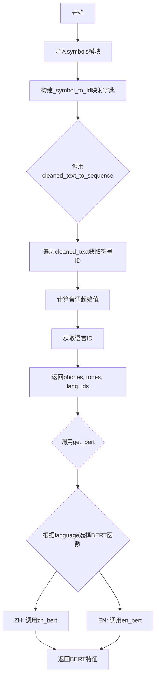
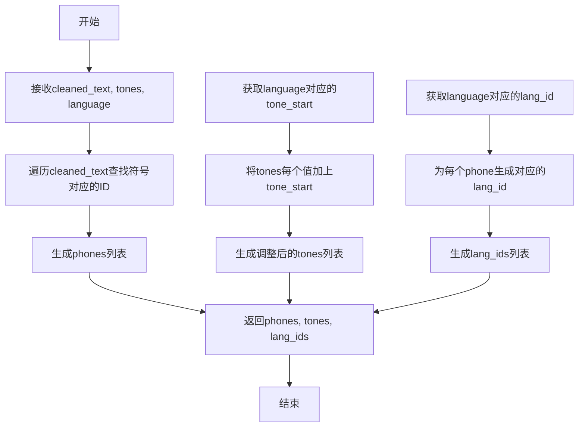
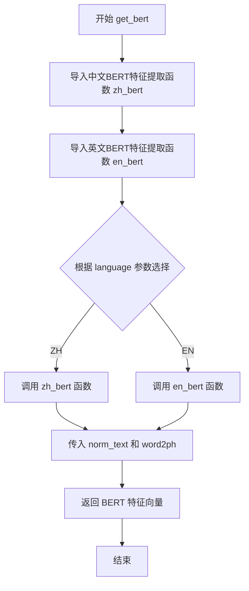

# `Bert-VITS2\oldVersion\V101\text\__init__.py` 详细设计文档

该代码是文本到语音(TTS)系统的核心处理模块，负责将清洗后的文本转换为符号ID序列，并支持多语言（中文、英文）的BERT特征提取，为后续的语音合成提供文本表征输入。

## 整体流程



## 类结构

```
无类定义（模块级函数集合）
├── 全局变量
│   └── _symbol_to_id（符号到ID的映射字典）
└── 全局函数
    ├── cleaned_text_to_sequence（文本转序列）
    └── get_bert（BERT特征提取）
```

## 全局变量及字段


### `_symbol_to_id`
    
将符号映射到对应ID的字典，用于文本到序列的转换

类型：`Dict[str, int]`
    


    

## 全局函数及方法


### `cleaned_text_to_sequence`

该函数接收清洗后的文本序列、音调信息和语言类型，将文本符号转换为对应的ID序列，并根据语言类型调整音调起始值和语言ID，最终返回phones、tones和lang_ids三个序列。

参数：

- `cleaned_text`：`list`，清洗后的文本符号列表，每个元素为文本中的单个符号（字符或音素）
- `tones`：`list`，原始音调值列表，与cleaned_text中的符号对应
- `language`：`str`，语言类型标识，如"ZH"（中文）或"EN"（英文）

返回值：`tuple`，包含三个整数列表——phones（符号对应的ID序列）、tones（调整后的音调序列）、lang_ids（语言ID序列）

#### 流程图



#### 带注释源码

```python
def cleaned_text_to_sequence(cleaned_text, tones, language):
    """Converts a string of text to a sequence of IDs corresponding to the symbols in the text.
    Args:
      text: string to convert to a sequence
    Returns:
      List of integers corresponding to the symbols in the text
    """
    # 将文本符号列表转换为对应的ID列表
    # 遍历cleaned_text中的每个符号，通过_symbol_to_id字典查找其对应的整数值ID
    phones = [_symbol_to_id[symbol] for symbol in cleaned_text]
    
    # 根据语言获取音调起始偏移量
    # 不同语言有不同的音调起始值，用于调整音调序列的基准
    tone_start = language_tone_start_map[language]
    
    # 将原始音调值加上语言特定的起始偏移量
    # 使音调值落在该语言对应的有效范围内
    tones = [i + tone_start for i in tones]
    
    # 获取当前语言对应的语言ID
    lang_id = language_id_map[language]
    
    # 为phones列表中的每个元素生成对应的语言ID
    # 确保输出的每个音素都关联到正确的语言
    lang_ids = [lang_id for i in phones]
    
    # 返回三个序列：音素ID序列、调整后的音调序列、语言ID序列
    return phones, tones, lang_ids
```


### `get_bert`

该函数是一个多语言BERT特征提取的统一入口，根据传入的语言参数动态选择对应的中文或英文BERT模型，将规范化文本和词素映射转换为相应的BERT特征向量。

参数：

- `norm_text`：`str`，规范化后的文本内容，待提取BERT特征的输入文本
- `word2ph`：`list[int]` 或 `dict`，词语到音素（phoneme）的映射关系，用于对齐BERT特征与音素序列
- `language`：`str`，语言标识符，目前支持 "ZH"（中文）和 "EN"（英文）

返回值：`ndarray` 或 `Tensor`，提取的BERT特征向量，通常为形状 `[seq_len, bert_dim]` 的嵌入矩阵

#### 流程图



#### 带注释源码

```python
def get_bert(norm_text, word2ph, language):
    """
    获取文本的BERT特征表示
    
    该函数根据语言类型选择对应的BERT模型进行特征提取，
    实现了多语言文本到BERT嵌入的统一接口。
    
    参数:
        norm_text: 规范化后的文本字符串
        word2ph: 词语到音素的映射，用于特征对齐
        language: 语言标识，'ZH' 或 'EN'
    
    返回:
        bert: BERT模型输出的特征向量
    """
    # 动态导入中文BERT特征提取函数
    # from .chinese_bert import get_bert_feature as zh_bert
    from .chinese_bert import get_bert_feature as zh_bert
    
    # 动态导入英文BERT特征提取函数（Mock版本）
    # from .english_bert_mock import get_bert_feature as en_bert
    from .english_bert_mock import get_bert_feature as en_bert

    # 建立语言代码到对应BERT函数的映射字典
    # 策略模式：运行时根据language参数选择具体实现
    lang_bert_func_map = {"ZH": zh_bert, "EN": en_bert}
    
    # 根据language从映射表中获取对应的BERT处理函数并调用
    # 将文本和词素映射传递给选定的BERT特征提取器
    bert = lang_bert_func_map[language](norm_text, word2ph)
    
    # 返回提取的BERT特征向量
    return bert
```

## 关键组件


### 符号到ID映射 (_symbol_to_id)

将符号列表转换为ID字典，支持符号的快速查找和转换

### 文本到序列转换 (cleaned_text_to_sequence)

将清洗后的文本转换为音素ID序列，同时处理音调偏移和语言ID分配

### BERT特征获取 (get_bert)

支持中英文的BERT特征提取，采用惰性加载策略根据语言动态选择BERT模型

### 多语言支持 (language_id_map, language_tone_start_map)

通过语言ID映射和音调起始位置映射实现多语言处理能力


## 问题及建议


### 已知问题

-   **文档与实现不一致**：`cleaned_text_to_sequence` 函数的文档字符串中参数名为 `text`，但实际函数签名中参数名为 `cleaned_text`，会导致文档误导。
-   **缺少错误处理**：遍历 `cleaned_text` 时，如果符号不在 `_symbol_to_id` 映射中，会抛出 `KeyError` 异常，缺乏对未知符号的容错处理。
-   **模块重复导入**：`get_bert` 函数内部每次调用时都会执行 `import` 语句，这会导致额外的性能开销，应该将导入语句移到模块顶部。
-   **重复创建字典**：`lang_bert_func_map` 字典在每次调用 `get_bert` 时都会重新创建，造成资源浪费，应作为模块级常量。
-   **硬编码语言支持**：语言到BERT函数的映射是硬编码的（仅支持 "ZH" 和 "EN"），扩展性差，新增语言需要修改函数源码。
-   **隐藏的全局依赖**：`language_tone_start_map` 和 `language_id_map` 未在本文件中定义，依赖于 `symbols` 模块的导入，隐式依赖可能导致运行时错误。

### 优化建议

-   **修正文档字符串**：将 `cleaned_text_to_sequence` 的文档字符串中的 `text` 参数名改为 `cleaned_text`，保持与函数签名一致。
-   **添加异常处理**：在 `cleaned_text_to_sequence` 中添加对未知符号的处理逻辑，例如跳过未知符号或返回错误信息。
-   **移动导入语句**：将 `get_bert` 函数内的导入语句移到模块顶部，并在模块级别创建 `lang_bert_func_map` 字典。
-   **配置化语言映射**：将语言到BERT函数的映射改为配置文件或从外部注入，提高可扩展性和可测试性。
-   **显式依赖声明**：在文件顶部添加类型注解或注释，明确说明对 `symbols` 模块中 `language_tone_start_map` 和 `language_id_map` 的依赖。

## 其它


### 设计目标与约束

本模块旨在将文本转换为语音合成所需的符号ID序列，并为多语言场景提供BERT特征提取能力。设计约束包括：1) 仅支持ZH和EN两种语言；2) 依赖外部symbols模块定义的符号集；3) 语言标识必须为大写形式（ZH/EN）。

### 错误处理与异常设计

代码中缺少显式的错误处理机制。潜在异常包括：1) KeyError - 当cleaned_text中包含_symbol_to_id字典不存在的符号时抛出；2) KeyError - 当language参数不在language_tone_start_map或language_id_map中时抛出；3) ImportError - 当chinese_bert或english_bert_mock模块不存在时抛出。建议添加异常捕获与友好的错误提示。

### 数据流与状态机

数据流如下：输入文本经过符号映射转换为phone ID序列，语言信息决定tone起始索引和语言ID，所有数组按phone序列长度对齐后返回三元组(phones, tones, lang_ids)。无复杂状态机设计，为纯函数式数据转换模块。

### 外部依赖与接口契约

外部依赖：1) symbols模块 - 提供symbols列表；2) language_tone_start_map - 语言到tone起始值的映射；3) language_id_map - 语言到语言ID的映射；4) chinese_bert模块的get_bert_feature函数；5) english_bert_mock模块的get_bert_feature函数。接口契约：cleaned_text应为符号列表而非原始文本，tones和language参数类型需与映射表匹配。

### 性能考虑

_symbol_to_id字典在模块加载时构建一次，后续查询为O(1)复杂度。列表推导式生成phones/tones/lang_ids具有较好性能。建议：1) 可考虑将映射表缓存；2) 大批量处理时注意内存使用。

### 安全性考虑

代码本身无直接安全风险，但get_bert函数使用动态导入(from .chinese_bert import...)存在潜在路径遍历风险。建议明确模块路径并验证导入来源。

### 可扩展性

当前仅支持ZH/EN两种语言，扩展步骤：1) 在symbols模块添加新语言符号；2) 在language_tone_start_map和language_id_map添加新语言映射；3) 在对应bert模块实现get_bert_feature函数；4) 在lang_bert_func_map注册新语言处理函数。

### 配置管理

language_tone_start_map和language_id_map应为可配置项，建议提取为独立配置文件或从外部注入，便于多语言扩展而无需修改核心逻辑。

### 测试策略建议

建议添加单元测试覆盖：1) 有效符号转换；2) 无效符号处理；3) 各种语言参数；4) BERT特征提取各语言分支；5) 边界条件如空列表输入。

    