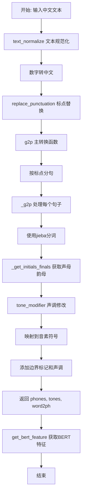
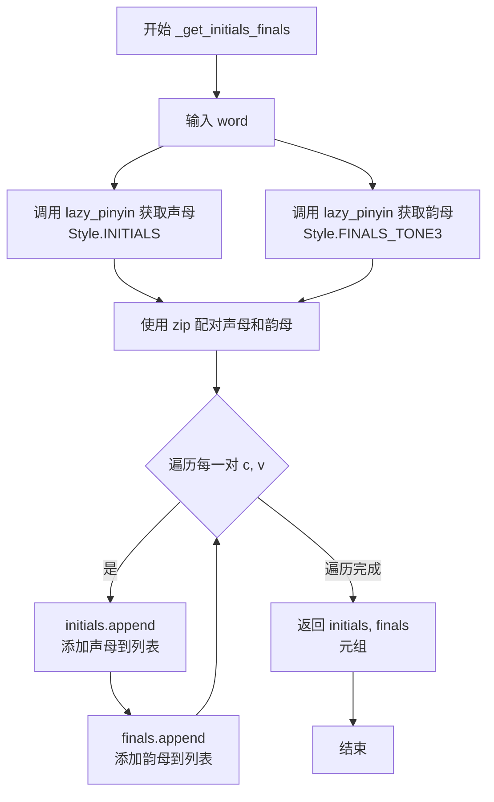
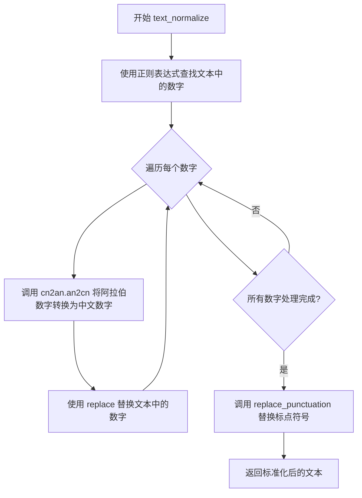
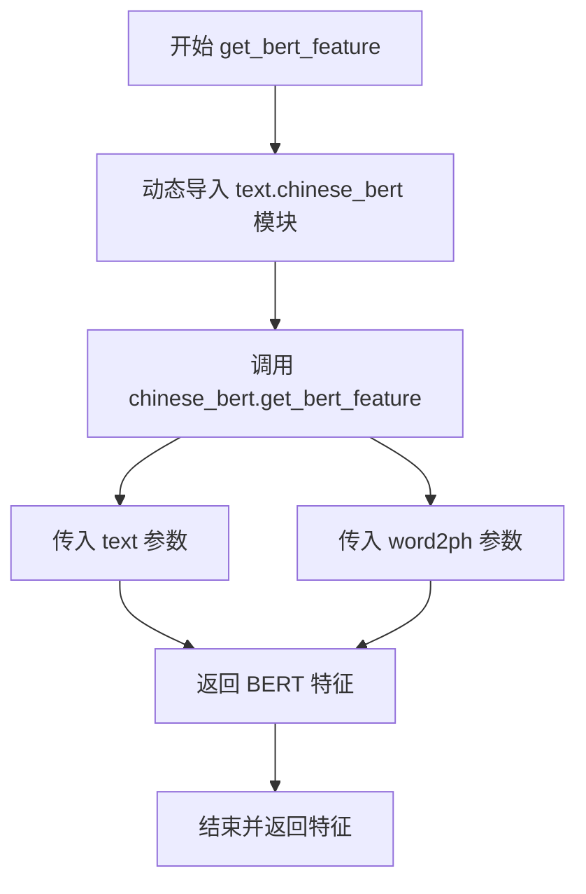

# `Bert-VITS2\oldVersion\V101\text\chinese.py` 详细设计文档

这是一个中文文本到拼音转换系统(Grapheme-to-Phoneme)，将中文文本转换为音素序列，包含声调信息和字音对齐，可用于语音合成等应用。

## 整体流程



## 类结构

```
模块: text/g2p.py
├── 全局变量和配置
│   ├── current_file_path
│   ├── pinyin_to_symbol_map
│   ├── rep_map
│   └── tone_modifier
├── 工具函数
│   ├── replace_punctuation
│   ├── text_normalize
│   └── get_bert_feature
└── 核心转换函数
    ├── g2p
    ├── _g2p
    └── _get_initials_finals
```

## 全局变量及字段


### `current_file_path`
    
当前Python文件的目录路径，用于构建资源文件的绝对路径

类型：`str`
    


### `pinyin_to_symbol_map`
    
拼音到音素符号的映射字典，从opencpop-strict.txt文件加载，用于将拼音转换为语音符号

类型：`dict[str, str]`
    


### `rep_map`
    
标点符号和其他字符的替换映射字典，用于文本规范化处理

类型：`dict[str, str]`
    


### `tone_modifier`
    
声调修饰处理对象，用于处理中文连续变调规则

类型：`ToneSandhi`
    


    

## 全局函数及方法


### `replace_punctuation`

该函数用于对文本进行标点符号替换和清洗，主要完成以下任务：将语气词"嗯"、"呣"替换为"恩"、"母"；将各种全角/半角标点符号统一转换为指定符号；移除所有非中文字符和非标点符号，保留纯中文文本和标点。

参数：

- `text`：`str`，需要处理的原始文本

返回值：`str`，处理后的文本

#### 流程图

```mermaid
flowchart TD
    A[开始] --> B[替换语气词<br/>text.replace("嗯", "恩").replace("呣", "母")]
    B --> C[编译正则表达式<br/>pattern = re.compile|".join...)]
    C --> D[标点符号替换<br/>pattern.sub lambda函数替换]
    D --> E[移除非中文非标点<br/>re.sub r"[^\u4e00-\u9fa5" + punctuation + "]+"]
    E --> F[返回处理后的文本]
    F --> G[结束]
```

#### 带注释源码

```python
def replace_punctuation(text):
    # 步骤1: 替换语气词
    # 将"嗯"替换为"恩"，"呣"替换为"母"
    text = text.replace("嗯", "恩").replace("呣", "母")
    
    # 步骤2: 编译标点符号替换的正则表达式模式
    # 使用 re.escape 转义特殊字符，使用 | 连接所有需要替换的标点
    pattern = re.compile("|".join(re.escape(p) for p in rep_map.keys()))

    # 步骤3: 使用编译好的模式进行批量替换标点符号
    # rep_map 定义了源标点到目标标的映射关系
    replaced_text = pattern.sub(lambda x: rep_map[x.group()], text)

    # 步骤4: 移除所有非中文字符和非标点符号
    # \u4e00-\u9fa5 是中文Unicode范围
    # punctuation 是允许保留的标点符号集合
    # 该正则匹配所有不在上述范围内的字符并替换为空
    replaced_text = re.sub(
        r"[^\u4e00-\u9fa5" + "".join(punctuation) + r"]+", "", replaced_text
    )

    # 返回处理后的文本
    return replaced_text
```


### `g2p`

该函数是文本转拼音（G2P）的核心入口，接收原始中文文本，经过标点符号处理后按标点分割成句子片段，再通过内部函数 `_g2p` 将汉字转换为对应的音素序列、音调序列以及字符到音素的映射关系，最后添加静音标记并返回标准化结果。

参数：

- `text`：`str`，待转换的中文文本输入

返回值：`tuple`，包含三个列表——`phones`（音素列表，如 \["\_", "a", "b", ...\]）、`tones`（音调列表，如 \[0, 2, ...\]）、`word2ph`（字符到音素的映射长度列表，如 \[1, 2, ...\]）

#### 流程图

```mermaid
flowchart TD
    A[开始 g2p] --> B[构建标点符号正则分割模式]
    B --> C[按标点分割文本为句子列表]
    C --> D[调用 _g2p 处理句子列表]
    D --> E[获取 phones, tones, word2ph]
    E --> F{断言 word2ph 总和 == phones 长度}
    F -->|通过| G{断言 word2ph 长度 == 文本长度}
    G -->|通过| H[为 phones 添加起止标记 '_']
    H --> I[为 tones 添加起止标记 0]
    I --> J[为 word2ph 添加起止标记 1]
    J --> K[返回 (phones, tones, word2ph)]
    F -->|失败| L[抛出 AssertionError]
    G -->|失败| L
```

#### 带注释源码

```python
def g2p(text):
    """
    文本转拼音的主入口函数。
    将输入的中文文本按标点符号分割为句子，
    然后转换为音素序列、音调序列以及字符到音素的映射。
    
    参数:
        text (str): 待转换的中文文本
        
    返回值:
        tuple: (phones, tones, word2ph)
            - phones: 音素列表，首尾添加静音标记 '_'
            - tones: 音调列表，首尾添加0
            - word2ph: 每个原始字符对应的音素数量列表，首尾添加1
    """
    # 构造正则表达式，按标点符号分割句子
    # 例如：文本 "你好！世界。" 会被分割为 ["你好", "世界"]
    pattern = r"(?<=[{0}])\s*".format("".join(punctuation))
    
    # 使用正则分割文本，去除空字符串
    # split会在标点符号后分割，lookbehind确保分割点位于标点之后
    sentences = [i for i in re.split(pattern, text) if i.strip() != ""]
    
    # 调用内部函数进行实际的G2P转换
    phones, tones, word2ph = _g2p(sentences)
    
    # 断言验证：所有字符对应的音素总数应等于音素列表长度
    # word2ph存储每个汉字对应的音素数量，故总和应等于phones长度
    assert sum(word2ph) == len(phones)
    
    # 断言验证：映射列表长度应等于原始文本长度
    # 注意：此处可能在文本包含特殊字符时失败，可添加try-catch处理
    assert len(word2ph) == len(text)
    
    # 为音素序列添加静音标记（句子开头和结尾）
    phones = ["_"] + phones + ["_"]
    
    # 为音调序列添加静音调标记（0表示轻声/静音）
    tones = [0] + tones + [0]
    
    # 为字符-音素映射添加起始和结束标记
    word2ph = [1] + word2ph + [1]
    
    # 返回转换结果
    return phones, tones, word2ph
```


### `_get_initials_finals`

该函数是文本转拼音（G2P）模块的核心辅助函数，用于将单个汉字或单词分解为声母（initials）和韵母（finals）。它利用 pypinyin 库分别获取汉字的声母风格和带声调韵母风格的拼音表示，然后通过 zip 配对将结果整理为两个独立的列表返回，供后续的音素转换和声调处理使用。

参数：

-  `word`：`str`，输入的汉字单词（通常为单个汉字或词语）

返回值：`tuple[list, list]`，返回一个元组，包含两个列表——声母列表（initials）和韵母列表（finals），两者长度一致，与输入汉字的字符数对应

#### 流程图



#### 带注释源码

```python
def _get_initials_finals(word):
    """
    将汉字单词分解为声母和韵母列表
    
    参数:
        word: 输入的汉字单词
        
    返回:
        (initials, finals): 声母列表和韵母列表的元组
    """
    # 初始化声母和韵母列表
    initials = []
    finals = []
    
    # 使用 pypinyin 获取声母风格拼音
    # neutral_tone_with_five=True 表示使用五声调体系（0-4）
    # Style.INITIALS 只返回声母部分
    orig_initials = lazy_pinyin(word, neutral_tone_with_five=True, style=Style.INITIALS)
    
    # 使用 pypinyin 获取带声调韵母风格拼音
    # Style.FINALS_TONE3 返回韵母带声调数字标记
    orig_finals = lazy_pinyin(
        word, neutral_tone_with_five=True, style=Style.FINALS_TONE3
    )
    
    # 遍历配对后的声母和韵母
    for c, v in zip(orig_initials, orig_finals):
        # c: 声母字符（如 'b', 'p', 'm' 等）
        # v: 带声调的韵母（如 'a1', 'o2', 'e3' 等）
        initials.append(c)
        finals.append(v)
    
    # 返回声母和韵母列表的元组
    return initials, finals
```


### `_g2p`

`_g2p` 函数是核心的图音转换（Grapheme-to-Phoneme）模块，负责将处理后的文本片段序列转换为音素序列、音调序列以及字符到音素的映射关系。该函数内部调用了拼音声母韵母分离、拼音声调修正以及音素符号映射等关键逻辑，是实现中文文本到语音音素转换的核心引擎。

参数：

-  `segments`：`List[str]`，需要转换的文本片段列表，每个片段通常是一个句子或子句

返回值：`Tuple[List[str], List[int], List[int]]`，返回一个包含三个列表的元组：
  - 第一个元素是音素列表（phones_list），包含转换后的所有音素
  - 第二个元素是音调列表（tones_list），对应每个音素的声调（0-5，其中0表示轻声）
  - 第三个元素是字音映射列表（word2ph），表示每个原始字符对应多少个音素

#### 流程图

```mermaid
flowchart TD
    A[开始: 接收segments列表] --> B[初始化空列表: phones_list, tones_list, word2ph]
    B --> C{遍历segments中的每个seg}
    C --> D[使用正则去除英文单词]
    D --> E[使用jieba分词: psg.lcut]
    E --> F[进行声调合并预处理: tone_modifier.pre_merge_for_modify]
    F --> G{遍历分词结果中的每个word和词性pos}
    G --> H{判断pos是否为eng}
    H -->|是| I[跳过当前词继续]
    H -->|否| J[调用_get_initials_finals获取声母韵母]
    J --> K[调用modified_tone修正韵母声调]
    K --> L[将声母韵母分别添加到initials和finals列表]
    L --> G
    G --> M{initials和finals处理完成}
    M --> N[将initials和finals展平]
    N --> O{遍历展平后的声母韵母对c, v}
    O --> P{c == v?}
    P -->|是| Q[确认为标点符号, phone=[c], tone=0]
    P -->|否| R[分离韵母和声调: v_without_tone, tone]
    R --> S{是否有声母c?}
    S -->|是| T[多音节处理: 替换uei/iou/uen]
    S -->|否| U[单音节处理: 替换ing/i/in/u等]
    T --> V[验证pinyin在映射表中]
    U --> V
    V --> W[从映射表获取phone: pinyin_to_symbol_map]
    W --> X[将phone添加到phones_list, tone添加到tones_list]
    X --> O
    O --> Y{处理完所有声母韵母对}
    Y --> C
    C --> Z{处理完所有segments}
    Z --> AA[返回: phones_list, tones_list, word2ph]
```

#### 带注释源码

```python
def _g2p(segments):
    """
    将文本片段列表转换为音素序列、音调序列和字音映射
    
    参数:
        segments: List[str], 文本片段列表
        
    返回:
        Tuple[List[str], List[int], List[int]]: (音素列表, 音调列表, 字音映射)
    """
    # 初始化输出列表
    phones_list = []      # 存储所有音素
    tones_list = []       # 存储所有音调
    word2ph = []          # 存储每个字符对应的音素数量
    
    # 遍历每个文本片段
    for seg in segments:
        # 步骤1: 去除英文单词，只保留中文和标点
        seg = re.sub("[a-zA-Z]+", "", seg)
        
        # 步骤2: 使用jieba进行词性标注分词
        seg_cut = psg.lcut(seg)
        
        # 初始化当前片段的声母和韵母列表
        initials = []
        finals = []
        
        # 步骤3: 预处理，合并需要合并的词（如儿化音等）
        seg_cut = tone_modifier.pre_merge_for_modify(seg_cut)
        
        # 步骤4: 遍历每个分词结果
        for word, pos in seg_cut:
            # 跳过英文词（已经处理过英文，但可能有残留）
            if pos == "eng":
                continue
            
            # 获取该字的声母和韵母（包含声调信息）
            sub_initials, sub_finals = _get_initials_finals(word)
            
            # 根据词性和词语进行声调修正（如"银行"的"行"读xíng不读háng）
            sub_finals = tone_modifier.modified_tone(word, pos, sub_finals)
            
            # 添加到声母韵母列表
            initials.append(sub_initials)
            finals.append(sub_finals)
        
        # 步骤5: 将嵌套列表展平（例如 [['a', 'b'], ['c']] -> ['a', 'b', 'c']）
        initials = sum(initials, [])
        finals = sum(finals, [])
        
        # 步骤6: 遍历每个声母韵母对，转换为音素
        for c, v in zip(initials, finals):
            # 原始拼音（声母+韵母）
            raw_pinyin = c + v
            
            # 如果声母等于韵母，说明是标点符号
            if c == v:
                # 验证确实是标点符号
                assert c in punctuation
                phone = [c]      # 标点符号作为单独音素
                tone = "0"       # 标点符号的声调设为0
                word2ph.append(1)  # 标点符号对应1个音素
            else:
                # 分离韵母和声调：韵母最后一位是声调
                v_without_tone = v[:-1]  # 去掉声调后的韵母
                tone = v[-1]              # 最后一位是声调（1-5）
                
                # 组合成不带声调的拼音
                pinyin = c + v_without_tone
                
                # 验证声调有效性
                assert tone in "12345"
                
                # 步骤7: 后处理pypinyin的输出
                if c:
                    # 多音节情况（有声母）
                    # 处理复合韵母的拼写变体
                    v_rep_map = {
                        "uei": "ui",    # 威 -> ui
                        "iou": "iu",    # 优 -> iu
                        "uen": "un",    # 温 -> un
                    }
                    if v_without_tone in v_rep_map.keys():
                        pinyin = c + v_rep_map[v_without_tone]
                else:
                    # 单音节情况（无声母）
                    # 处理单音节的拼写变体
                    pinyin_rep_map = {
                        "ing": "ying",  # ing -> ying
                        "i": "yi",      # i -> yi
                        "in": "yin",    # in -> yin
                        "u": "wu",      # u -> wu
                    }
                    if pinyin in pinyin_rep_map.keys():
                        pinyin = pinyin_rep_map[pinyin]
                    else:
                        # 处理首字母替换
                        single_rep_map = {
                            "v": "yu",  # ü -> yu
                            "e": "e",   # e保持不变
                            "i": "y",   # i -> y
                            "u": "w",   # u -> w
                        }
                        if pinyin[0] in single_rep_map.keys():
                            pinyin = single_rep_map[pinyin[0]] + pinyin[1:]
                
                # 步骤8: 从音素映射表获取对应的音素序列
                # 验证拼音在映射表中存在
                assert pinyin in pinyin_to_symbol_map.keys(), (pinyin, seg, raw_pinyin)
                
                # 音素映射表中的值可能是多个音素（用空格分隔）
                phone = pinyin_to_symbol_map[pinyin].split(" ")
                
                # 记录该字对应多少个音素
                word2ph.append(len(phone))
            
            # 将音素添加到结果列表
            phones_list += phone
            # 音调需要与音素数量对应（一个音调对应一个音素）
            tones_list += [int(tone)] * len(phone)
    
    # 返回三个列表
    return phones_list, tones_list, word2ph
```


### `text_normalize`

该函数是文本标准化处理的核心函数，主要功能是将文本中的数字转换为中文数字表示，并统一标点符号格式，为后续的语音合成或文本处理提供规范化的输入。

参数：

- `text`：`str`，需要标准化的原始文本

返回值：`str`，标准化处理后的文本

#### 流程图



#### 带注释源码

```python
def text_normalize(text):
    """
    文本标准化处理函数
    
    处理流程：
    1. 识别并提取文本中的数字（整数和小数）
    2. 将数字转换为中文数字表示
    3. 统一标点符号为标准格式
    
    参数:
        text: str, 需要处理的原始文本
        
    返回:
        str, 标准化处理后的文本
    """
    # 使用正则表达式查找文本中的数字，包括整数和小数
    # \d+ 匹配一个或多个数字
    # (?:\.?\d+)? 可选的小数部分（.后跟数字）
    numbers = re.findall(r"\d+(?:\.?\d+)?", text)
    
    # 遍历找到的每个数字，进行转换处理
    for number in numbers:
        # 将阿拉伯数字转换为中文数字
        # cn2an.an2cn 是数字转中文的核心函数
        # replace(number, cn2an.an2cn(number), 1) 表示只替换第一次出现的位置
        text = text.replace(number, cn2an.an2cn(number), 1)
    
    # 调用标点符号替换函数，统一标点符号格式
    # 该函数会处理各种中文标点符号并转换为统一的英文标点
    text = replace_punctuation(text)
    
    # 返回标准化处理后的文本
    return text
```


### `get_bert_feature`

该函数是一个文本到BERT特征转换的包装函数，通过调用`chinese_bert`模块的`get_bert_feature`方法，将输入文本和字音素映射转换为BERT嵌入特征，用于后续的语音合成模型输入。

参数：

- `text`：`str`，输入的文本字符串
- `word2ph`：`list`，字到音素的映射列表，表示每个字符对应的音素数量

返回值：返回值类型取决于`chinese_bert.get_bert_feature`的返回，通常为`torch.Tensor`，表示BERT模型输出的特征向量

#### 流程图



#### 带注释源码

```python
def get_bert_feature(text, word2ph):
    """
    获取文本的BERT特征表示
    
    该函数是一个包装器函数，内部调用chinese_bert模块的get_bert_feature方法。
    它将原始文本和字到音素的映射转换为BERT模型生成的语义特征，
    这些特征通常用于语音合成系统中，提供丰富的文本语义信息。
    
    参数:
        text (str): 输入的文本字符串，需要进行过文本规范化和分词处理
        word2ph (list): 字到音素的映射列表，长度等于文本字符数，
                        每个元素表示对应字符应扩展的音素数量
    
    返回:
        取决于chinese_bert.get_bert_feature的返回，通常为torch.Tensor类型的
        BERT隐藏状态向量，形状为 [seq_len, hidden_dim]
    """
    # 动态导入chinese_bert模块，避免循环导入问题
    # 这种延迟导入方式允许模块在需要时才加载
    from text import chinese_bert

    # 调用chinese_bert模块中的实际实现函数
    # 传入相同的text和word2ph参数，获取BERT特征
    return chinese_bert.get_bert_feature(text, word2ph)
```

---

### 潜在的技术债务或优化空间

1. **缺乏错误处理**：函数未对输入参数进行有效性验证，如`text`为空或`word2ph`与文本长度不匹配时可能抛出异常
2. **动态导入性能**：每次调用都执行`import`语句，虽然Python会缓存模块，但在高频调用场景下存在性能损耗
3. **隐藏的外部依赖**：函数依赖`text.chinese_bert`模块，但未在文档中明确说明其接口契约和返回值类型
4. **返回值类型不明确**：文档中使用了"通常为"的表述，反映出对下游模块行为的未知

### 关键组件信息

| 组件名称 | 一句话描述 |
|---------|-----------|
| `chinese_bert` | 提供中文BERT模型特征提取功能的模块 |
| `text_normalize` | 文本规范化函数，处理数字转换和标点替换 |
| `g2p` | 文本到音素的转换函数，生成发音序列 |

### 其它项目

**设计目标与约束**：该函数作为文本处理流水线的一环，目标是生成符合语音合成模型输入要求的BERT特征向量。约束条件为输入文本必须经过`text_normalize`预处理，`word2ph`必须与文本长度对齐。

**错误处理与异常设计**：当前实现缺乏显式的异常处理，建议在调用前确保`text`非空且`word2ph`长度与`len(text)`一致，否则应返回有意义的错误信息或降级处理。

**数据流与状态机**：数据流为：原始文本 → `text_normalize` → 规范化文本 → `g2p` → (phones, tones, word2ph) → `get_bert_feature` → BERT特征 → 语音合成模型。状态机属于单向流水线，无内部状态保持。

**外部依赖与接口契约**：主要依赖`text.chinese_bert`模块，该模块需实现`get_bert_feature(text, word2ph)`接口，返回BERT特征张量。

## 关键组件


### pinyin_to_symbol_map

拼音到音素符号的映射表，从opencpop-strict.txt文件中加载，将拼音转换为对应的音素序列

### rep_map

标点符号映射字典，将各种中文标点符号统一转换为英文标点符号或统一符号

### replace_punctuation

文本标点符号替换函数，将文本中的标点符号按照rep_map进行替换，同时过滤掉非中文和非标点的字符

### text_normalize

文本规范化函数，将阿拉伯数字转换为中文数字，并调用replace_punctuation处理标点符号

### g2p

主拼音转换函数，将文本转换为音素序列、声调和词到音素的映射，在序列首尾添加静音标记

### _g2p

核心拼音转换逻辑，遍历文本段落，处理英文单词，调用声调模块处理声调变化，生成最终的音素和声调序列

### _get_initials_finals

初始音和韵母分离函数，使用pypinyin库获取汉字的声母和韵母

### tone_modifier

ToneSandhi类的实例，用于处理中文声调变化，如轻声、连读等语言现象

### get_bert_feature

BERT特征提取函数，调用chinese_bert模块获取文本的BERT嵌入表示

### 拼音后处理映射

包含v_rep_map、pinyin_rep_map和single_rep_map三个映射字典，用于处理pypinyin输出的特殊拼音变体，如ui/iu/un的转换


## 问题及建议


### 已知问题

-   **文件句柄未关闭**：使用 `open()` 读取 `pinyin_to_symbol_map` 时未使用 `with` 语句或显式关闭文件句柄，可能导致资源泄漏
-   **模块级副作用**：在模块加载时执行文件读取操作，增加了启动开销且降低了可测试性
-   **正则表达式重复编译**：在 `replace_punctuation` 和 `_g2p` 函数内部每次调用时都重新编译正则表达式，未进行预编译优化
-   **错误处理缺失**：多处关键操作（如文件读取、拼音转换映射查找）缺少异常捕获机制
-   **使用 assert 进行业务逻辑验证**：在生产环境中 `assert` 语句可能被优化掉，应使用正式的异常处理
-   **魔法数字和字符串**：如 `"12345"`、声调值 `"0"` 等硬编码在多处，缺乏常量定义
-   **缺少类型注解**：所有函数和变量都没有类型提示，降低了代码可维护性和 IDE 支持
-   **导入语句位置不规范**：`jieba.posseg` 和 `cn2an` 在文件顶部导入，但 `chinese_bert` 在函数内部延迟导入，风格不一致
-   **未使用的注释代码**：文件中存在已注释的代码块（如示例用法部分），应清理
-   **耦合度过高**：`get_bert_feature` 函数直接导入 `text.chinese_bert` 模块，形成隐式依赖
-   **中文数字转换库依赖**：使用 `cn2an` 进行数字转换，但未对转换失败的情况做处理

### 优化建议

-   使用上下文管理器 (`with open(...) as f`) 或读取后显式关闭文件句柄
-   将 `pinyin_to_symbol_map` 的加载延迟到首次使用时，或使用懒加载模式
-   将正则表达式预编译为模块级常量，避免重复编译开销
-   添加 try-except 块处理文件不存在、映射键缺失等异常情况
-   将 `assert` 验证替换为正式的 `if-raise` 异常处理模式
-   创建常量类或枚举定义声调值、符号等魔法数字
-   为所有函数添加类型注解（PEP 484 风格）
-   统一导入语句风格，将所有导入放在文件顶部
-   删除未使用的注释代码块
-   考虑将 `get_bert_feature` 的依赖注入改为参数传入，降低耦合
-   对 `cn2an.an2cn` 调用添加回退逻辑，防止转换失败导致程序中断

## 其它


### 设计目标与约束

本模块的设计目标是实现高质量的中文文本到拼音（Grapheme-to-Phoneme, G2P）转换，主要服务于语音合成（Text-to-Speech, TTS）系统。核心约束包括：1）输入文本应为简体中文，暂不支持繁体中文和混合语言的高精度转换；2）依赖外部符号表文件`opencpop-strict.txt`，该文件必须在运行路径可访问；3）模块设计为无状态函数式转换，便于多线程并发调用；4）输出格式固定为phones（音素序列）、tones（声调序列）、word2ph（字到音素映射）三元组，便于下游TTS模型直接使用。

### 错误处理与异常设计

模块的错误处理设计如下：1）断言（assert）用于关键假设验证，包括`sum(word2ph) == len(phones)`（音素总数与映射总数一致）和`len(word2ph) == len(text)`（映射长度与输入文本长度一致），若不一致则抛出AssertionError；2）对pinyin符号映射表查找使用assert验证`pinyin in pinyin_to_symbol_map.keys()`，若查找不到则抛出异常并附带调试信息；3）正则替换和字符串操作均设计为异常安全的，内部异常由调用方捕获处理；4）建议在生产环境中将关键断言替换为条件判断并记录日志，避免程序直接崩溃。

### 数据流与状态机

数据流遵循以下流程：输入原始文本 → 文本归一化（text_normalize）→ 标点符号替换（replace_punctuation）→ 按标点分句 → 逐句分词（jieba posseg）→ 声调前置处理（ToneSandhi.pre_merge_for_modify）→ 获取声母韵母（_get_initials_finals）→ 声调修正（ToneSandhi.modified_tone）→ 拼音后处理（多音字、声调合并等）→ 符号表映射 → 拼接为最终序列 → 添加静音标记。状态机方面，模块内部维护一个简化的转换状态机：初始态（RAW_TEXT）→ 归一化态（NORMALIZED_TEXT）→ 分句态（SEGMENTED_SENTENCES）→ 分词态（SEGMENTED_WORDS）→ 音素态（PHONES_OUTPUT），每个状态转换均由对应的函数处理。

### 外部依赖与接口契约

核心外部依赖包括：1）`jieba.posseg`（psg）用于中文分词和词性标注，接口为`psg.lcut(seg)`返回词列表；2）`pypinyin`（lazy_pinyin, Style）用于获取汉字的声母和韵母，接口为`lazy_pinyin(word, neutral_tone_with_five=True, style=Style.XXX)`；3）`cn2an`（an2cn）用于阿拉伯数字转中文数字，接口为`cn2an.an2cn(number)`；4）`ToneSandhi`类来自本地模块`.tone_sandhi`，用于声调连读处理；5）符号表文件`opencpop-strict.txt`为关键依赖，格式为"拼音\t符号序列"，必须存在且格式正确；6）`chinese_bert`模块用于获取BERT特征（get_bert_feature），为可选依赖，仅在TTS流水线中需要。

### 性能考虑与优化空间

性能优化方向包括：1）符号表加载使用文件读取，可改为全局单例模式或LRU缓存，避免重复IO；2）正则表达式`re.compile`在循环外部预编译，减少重复编译开销；3）`_g2p`函数中多次使用`sum(initials, [])`和`sum(finals, [])`进行列表展平，可改用列表推导式或itertools.chain提升性能；4）拼音后处理映射字典（v_rep_map, pinyin_rep_map, single_rep_map）可合并为单一查找表以提高缓存命中率；5）当前实现为串行处理，对于大批量文本可考虑向量化或并行化处理；6）word2ph的assert验证在生产环境中应降级为警告日志。

### 安全性考虑

安全层面需注意：1）文件读取使用`open()`未指定编码，建议显式指定`encoding='utf-8'`以避免平台默认编码差异导致的读取错误；2）外部输入文本通过正则表达式处理，理论上无注入风险，但需注意超长文本可能导致正则回溯引发DoS，建议对输入文本长度做合理限制；3）模块依赖的外部符号表文件路径基于`__file__`动态计算，需确保文件存在且可读，否则会抛出FileNotFoundError。

### 配置文件与参数说明

关键配置参数包括：1）`pinyin_to_symbol_map`：从`opencpop-strict.txt`加载的拼音到音素符号的映射表，格式为字典；2）`rep_map`：标点符号替换映射表，将各类中文标点统一为英文符号；3）`tone_modifier`：ToneSandhi类实例，用于声调连读处理；4）`punctuation`：从`.symbols`模块导入的标点符号集合；5）jieba分词器参数使用默认配置，词性标注采用`psg.lcut`默认模式；6）pypinyin参数`neutral_tone_with_five=True`表示使用五声调标记法（0-4加轻声5）。

### 测试策略建议

测试应覆盖以下场景：1）基本功能测试：常用中文句子到拼音的转换，验证输出格式正确性；2）边界条件测试：空字符串、单字符、多字符、纯标点、纯数字、混合中英文等；3）多音字测试：如"行"（hang/xing）、"重"（zhong/chong）等；4）声调测试：验证各声调正确映射；5）特殊符号测试：各类中文标点、括号、引号等；6）异常输入测试：非法字符、损坏的符号表文件等；7）性能测试：大段文本的转换时间和内存占用。

### 部署注意事项

部署时需确保：1）Python环境包含所有依赖库（jieba, pypinyin, cn2an）；2）工作目录或包路径下存在`opencpop-strict.txt`文件且编码为UTF-8；3）`.tone_sandhi`和`.symbols`模块正确安装或存在于包路径中；4）如需BERT特征功能，需确保`text.chinese_bert`模块可用且模型文件已配置；5）建议使用虚拟环境隔离依赖版本；6）多进程部署时注意文件锁或采用只读加载模式避免资源冲突。

### 参考文档与资源

相关技术文档包括：1）jieba中文分词官方文档（https://github.com/fxsjy/jieba）；2）pypinyin拼音转换库文档（https://github.com/mozillazg/python-pinyin）；3）cn2an数字转换库（https://github.com/awesomeyuer/cn2an）；4）OpenCPOP中文语音合成数据集符号定义；5）TTS系统声学模型输入数据格式规范（通常为phoneme+tone+duration格式）。


    