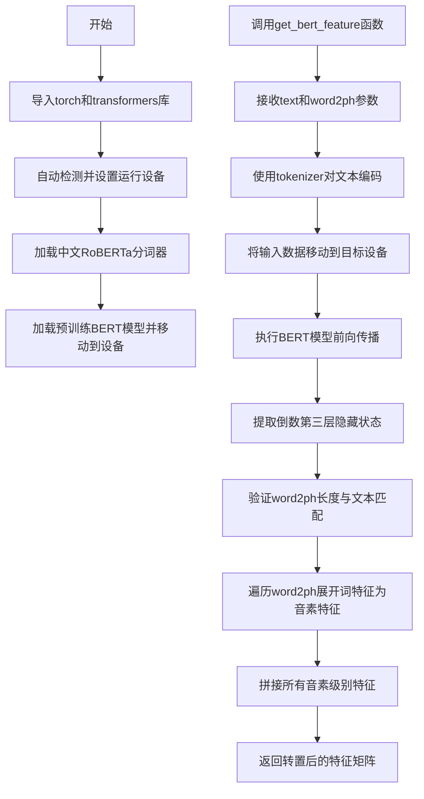

# `Bert-VITS2\oldVersion\V101\text\chinese_bert.py` 详细设计文档

该代码是一个基于预训练中文RoBERTa-wwm-ext-large模型的特征提取工具，主要功能是将输入文本通过BERT模型获取词级别的隐藏层表示，然后根据word2ph（词到音素个数映射）将词级别特征展开为音素级别的特征向量，用于语音合成等任务。

## 整体流程



## 类结构

```
无类定义（脚本式实现）
└── 全局模块级组件
    ├── device (设备对象)
    ├── tokenizer (分词器实例)
    ├── model (BERT模型实例)
    └── get_bert_feature (全局函数)
```

## 全局变量及字段


### `device`
    
运行设备对象，自动检测CUDA/MPS/CPU

类型：`torch.device`
    


### `tokenizer`
    
中文RoBERTa分词器实例，用于对文本进行分词和编码

类型：`AutoTokenizer`
    


### `model`
    
预训练BERT模型实例，用于提取文本特征

类型：`AutoModelForMaskedLM`
    


    

## 全局函数及方法


### `get_bert_feature`

该函数是核心特征提取函数，利用预训练的中文 RoBERTa-WWM-EXT-Large 模型将输入文本转换为词级别隐藏状态特征，并根据 word2ph 映射将词级别特征展开为音素级别特征，最终返回转置后的音素级别特征矩阵。

参数：

- `text`：`str`，待提取特征的文本输入
- `word2ph`：`List[int]`，词到音素的映射数组，表示每个词对应的音素数量（长度应等于文本长度加2，含起始和结束标记）

返回值：`torch.Tensor`，形状为 (特征维度, 音素数量) 的转置后音素级别特征矩阵

#### 流程图

```mermaid
flowchart TD
    A[开始: get_bert_feature] --> B[使用tokenizer对文本进行编码]
    B --> C[将输入tensor移动到计算设备]
    C --> D[调用BERT模型获取hidden_states]
    D --> E[取倒数第三层hidden_states]
    E --> F[遍历word2phone映射]
    F --> G{遍历是否结束?}
    G -->|否| H[将当前词特征重复word2phone[i]次]
    H --> I[添加到phone_level_feature列表]
    I --> G
    G -->|是| J[拼接所有特征]
    J --> K[转置特征矩阵]
    K --> L[返回phone_level_feature.T]
```

#### 带注释源码

```python
def get_bert_feature(text, word2ph):
    """
    从文本中提取音素级别的BERT特征
    
    参数:
        text: 输入文本字符串
        word2ph: 词到音素的映射数组
    
    返回:
        音素级别的特征矩阵 (特征维度, 音素数量)
    """
    # 禁用梯度计算以提高推理效率
    with torch.no_grad():
        # 使用BERT tokenizer对文本进行编码，返回PyTorch张量
        inputs = tokenizer(text, return_tensors="pt")
        
        # 将所有输入张量移动到计算设备（GPU/MPS/CPU）
        for i in inputs:
            inputs[i] = inputs[i].to(device)
        
        # 调用模型获取输出，设置output_hidden_states=True以获取所有层的hidden states
        res = model(**inputs, output_hidden_states=True)
        
        # 取出倒数第三层的hidden states，拼接最后一个维度
        # res["hidden_states"][-3:-2] 选取倒数第三层
        # [0] 取第一个样本，-1 将最后两维拼接
        res = torch.cat(res["hidden_states"][-3:-2], -1)[0].cpu()

    # 断言验证word2ph长度是否正确（文本长度+2个特殊token：起始和结束）
    assert len(word2ph) == len(text) + 2
    
    # 保存词到音素的映射
    word2phone = word2ph
    
    # 初始化音素级别特征列表
    phone_level_feature = []
    
    # 遍历每个词的音素映射
    for i in range(len(word2phone)):
        # 将第i个词的BERT特征重复word2phone[i]次（对应多个音素）
        repeat_feature = res[i].repeat(word2phone[i], 1)
        phone_level_feature.append(repeat_feature)

    # 在维度0上拼接所有重复后的特征，形成 (总音素数, 特征维度)
    phone_level_feature = torch.cat(phone_level_feature, dim=0)

    # 转置为 (特征维度, 音素数量) 并返回
    return phone_level_feature.T
```

## 关键组件


### 设备自动选择组件

根据系统环境自动选择最合适的计算设备，支持CUDA（GPU）、MPS（Apple Silicon）和CPU三种后端。

### 预训练模型加载组件

从本地路径加载中文RoBERTa-wwm-ext-large模型及对应tokenizer，用于生成文本的深度语言表示特征。

### BERT特征提取组件（get_bert_feature函数）

接收文本和词到音素映射数组，调用预训练BERT模型提取词级别隐藏状态，并将其展开为音素级别的特征序列。

### 张量索引与切片组件

通过`res["hidden_states"][-3:-2]`提取倒数第三层隐藏状态，用于获取高层语义特征。

### 词到音素展开组件

将词级别的特征按照word2phone映射关系进行重复（repeat）操作，生成phone级别的特征序列。

### 设备迁移组件

使用`.to(device)`将张量从CPU迁移到指定计算设备（GPU/MPS），并在推理时使用`torch.no_grad()`禁用梯度计算以提升性能。

### 特征张量拼接组件

使用`torch.cat`在维度0上拼接多个phone级别的特征向量，形成最终的特征矩阵输出。


## 问题及建议


### 已知问题

- **设备选择逻辑不严谨**：在非macOS系统上访问`torch.backends.mps`可能导致属性错误；全局`device`变量在`if __name__ == "__main__"`块中未被使用
- **模型加载缺乏错误处理**：模型和tokenizer在模块导入时同步加载，若路径不存在会直接崩溃，无降级策略
- **变量命名不一致**：函数参数`word2ph`与内部变量`word2phone`命名不统一，易造成理解混淆
- **资源浪费**：获取了完整的hidden states但仅使用倒数第三层（`-3:-2`），造成不必要的计算和内存开销
- **缺少输入验证**：未验证`word2ph`长度是否与实际文本字符数匹配（代码中假设`len(text)+2`但未强制校验）
- **代码复用性低**：`if __name__ == "__main__"`块中的phone-level特征重复逻辑与`get_bert_feature`函数内逻辑重复，且未被实际调用测试
- **硬编码问题**：模型路径`"./bert/chinese-roberta-wwm-ext-large"`直接写死，路径不存在时无提示
- **缺少类型注解**：函数参数和返回值均无类型标注，降低代码可维护性

### 优化建议

- **增加懒加载和错误处理**：将模型加载改为延迟加载，捕获`OSError`并给出明确提示；封装device选择逻辑到独立函数
- **统一变量命名**：统一使用`word2ph`或`word2phone`其中一种命名
- **优化BERT特征提取**：通过`return_dict=True`并指定`output_hidden_states`参数精确获取所需层，避免加载全部hidden states
- **添加输入验证**：在函数入口校验`len(word2ph) == len(text) + 2`，不匹配时抛出明确异常
- **抽取公共逻辑**：将phone-level特征重复逻辑封装为独立函数供复用
- **添加配置管理**：将模型路径等硬编码配置抽取为配置文件或环境变量
- **补充类型注解和文档**：为函数添加完整的类型标注和docstring说明参数含义、返回值格式
- **考虑批处理支持**：对于生产环境，可增加batch维度支持以提升推理效率

## 其它


### 设计目标与约束

本代码的核心设计目标是实现从文本到phone级别特征的提取，具体包括：(1) 使用预训练的中文Roberta-wwm-ext-large模型进行特征提取；(2) 支持word-level到phone-level的特征映射；(3) 支持多种运行设备（CUDA/MPS/CPU）的自动选择。约束条件包括：模型文件需预先下载至"./bert/chinese-roberta-wwm-ext-large"目录；输入text长度需与word2ph长度匹配（text长度+2）；word2ph数组总和决定了输出的phone特征帧数。

### 错误处理与异常设计

代码中的错误处理主要依赖assert语句进行参数校验。具体包括：(1) `assert len(word2ph) == len(text) + 2` 用于验证word2ph数组长度与文本长度的匹配性，不匹配时抛出AssertionError；(2) 设备选择时依赖torch.cuda.is_available()和torch.backends.mps.is_available()的返回值，若均返回False则自动降级到CPU；(3) tokenizer和model加载失败时会抛出IOError或transformers库相关异常。潜在改进：可增加更友好的错误提示信息、捕获并处理模型加载异常、添加输入文本合法性校验（如空字符串检测）。

### 数据流与状态机

数据流主要分为三个阶段：(1) 初始化阶段：加载tokenizer和model，将model移至目标设备；(2) 特征提取阶段：输入文本经过tokenizer分词，转换为tensor并移至设备，通过model前向传播获取hidden states；(3) 特征映射阶段：根据word2ph数组将word-level特征重复扩展为phone-level特征，最后拼接成最终的phone_level_feature。状态机相对简单，主要为：设备初始化状态 → 模型加载状态 → 推理就绪状态 → 特征提取完成状态。

### 外部依赖与接口契约

主要外部依赖包括：(1) torch (PyTorch框架)；(2) transformers (Hugging Face transformers库)；(3) sys (Python标准库)。接口契约方面：`get_bert_feature(text, word2ph)` 函数接收text字符串和word2ph整型列表，返回torch.Tensor类型的phone级别特征矩阵，形状为(特征维度, phone数量)的转置结果。调用方需确保：text为有效中文字符串、word2ph为正整数列表、word2ph长度等于len(text)+2。

### 性能考虑与优化空间

当前实现的主要性能特征：(1) 使用torch.no_grad()禁用梯度计算，减少内存占用；(2) 模型推理结果通过.cpu()移至CPU端进行处理。潜在优化方向：(1) 可添加batch处理支持以提升批量文本处理的吞吐量；(2) 模型可设置为eval()模式而非默认训练模式；(3) 对于重复调用场景，可考虑缓存tokenizer结果；(4) phone_level_feature的构建采用循环+append方式，可预先分配tensor空间或使用列表推导式优化；(5) 可添加混合精度推理支持以提升CUDA设备上的推理速度。

### 平台兼容性

代码支持的平台包括：(1) Linux/Windows系统（CUDA环境）；(2) macOS系统（支持Apple Silicon的MPS加速）；(3) 通用平台（CPU fallback）。设备优先级为：CUDA > MPS > CPU。macOS MPS支持需要torch版本 >= 1.12且系统为macOS 12.3+。代码仅使用了PyTorch和transformers的跨平台API，无平台特定代码。

### 配置与参数说明

关键配置参数包括：(1) 模型路径："./bert/chinese-roberta-wwm-ext-large"，需预先准备预训练模型；(2) 设备选择：由torch.device()自动判断，可通过修改代码手动指定；(3) 特征层选择：res["hidden_states"][-3:-2]表示取倒数第三层hidden states作为输出特征。word2ph参数说明：数组中每个元素表示对应word需要重复的phone数量，用于实现word-level到phone-level的特征扩展。

### 使用示例与注意事项

基本调用示例：feature = get_bert_feature("你好,我是说的道理。", [1,2,1,2,...])。注意事项：(1) 首次调用会加载模型到内存和GPU，约需数GB显存；(2) word2ph必须与实际文本的word数量匹配；(3) 模型输出为1024维特征（chinese-roberta-wwm-ext-large的hidden size）；(4) 输入文本中的标点符号也会被tokenizer处理，需在word2ph中相应考虑。测试代码展示了word-level特征（38个词，1024维）转换为36帧phone特征的完整流程。

    