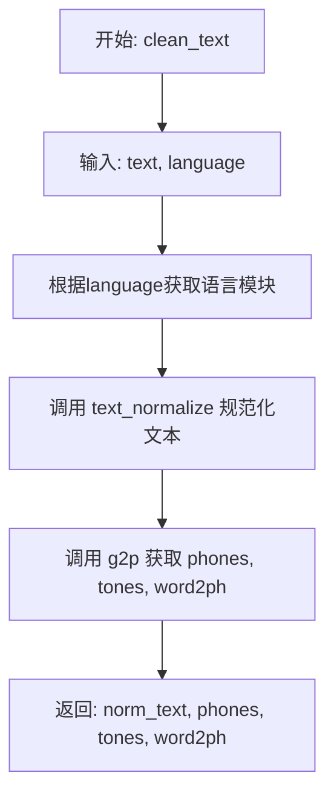
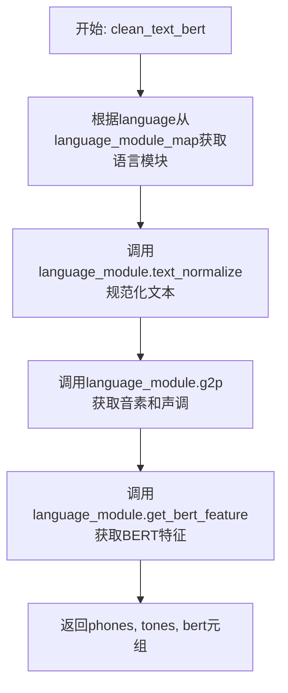
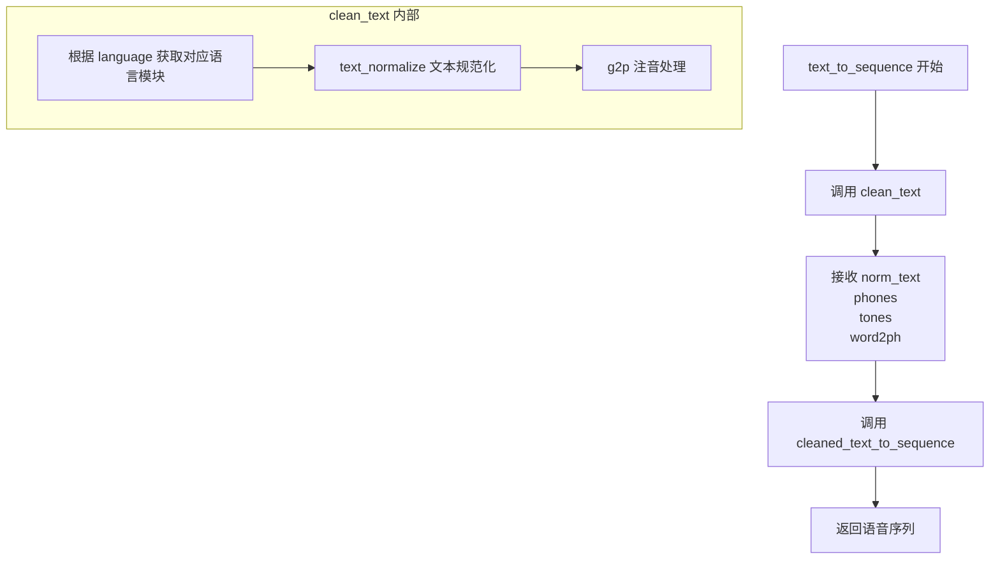

# `Bert-VITS2\oldVersion\V101\text\cleaner.py` 详细设计文档

这是一个文本前端处理模块，封装了文本规范化（text_normalize）、文本转音素（g2p）以及BERT特征提取（get_bert_feature）的逻辑，支持通过language_module_map扩展多语言，并最终将处理结果转换为供语音合成模型使用的数值序列（cleaned_text_to_sequence）。

## 整体流程

```mermaid
graph TD
    Start(输入: text, language) --> Lookup[查找语言模块: language_module_map[language]]
    Lookup --> Normalize[调用 module.text_normalize 规范化文本]
    Normalize --> G2P[调用 module.g2p 获取音素/声调/词素对齐]
    G2P --> Route{调用函数}
    Route -- clean_text --> Return1[返回: norm_text, phones, tones, word2ph]
    Route -- clean_text_bert --> BERT[调用 module.get_bert_feature]
    BERT --> Return2[返回: phones, tones, bert]
    Route -- text_to_sequence --> Seq[调用 cleaned_text_to_sequence]
    Seq --> Return3[返回: 数值序列]
```

## 类结构

```
No Class Structure (Functional Module)
└── External Module: chinese (Chinese text processing)
```

## 全局变量及字段


### `language_module_map`
    
将语言代码映射到对应语言处理模块的字典，目前支持中文（ZH）到 chinese 模块的映射

类型：`dict`
    


    

## 全局函数及方法


### `clean_text`

该函数是文本处理流程的核心入口，接收原始文本和语言代码，通过语言特定的模块进行文本规范化、文本转音素（g2p）处理，最终返回规范化文本、音素序列、音调序列以及词到音素的对齐信息。

参数：

- `text`：`str`，待处理的原始文本输入
- `language`：`str`，语言代码（如 "ZH"），用于选择对应的语言处理模块

返回值：`(str, list, list, list)`，返回一个包含四个元素的元组，依次为规范化后的文本、音素序列、音调序列、词到音素的对齐信息

#### 流程图



#### 带注释源码

```python
def clean_text(text, language):
    """
    清理并转换文本为音素序列
    
    参数:
        text: str - 输入的原始文本
        language: str - 语言代码，用于选择对应的语言处理模块
    
    返回:
        tuple: (norm_text, phones, tones, word2ph)
            - norm_text: 规范化后的文本
            - phones: 音素序列列表
            - tones: 音调序列列表
            - word2ph: 词到音素的对齐信息
    """
    # 根据语言代码从映射表中获取对应的语言处理模块
    language_module = language_module_map[language]
    
    # 调用语言模块的文本规范化方法，将文本标准化（如全角转半角、数字转汉字等）
    norm_text = language_module.text_normalize(text)
    
    # 调用语言模块的语音合成方法，将规范化文本转换为音素、音调和词音素对齐
    phones, tones, word2ph = language_module.g2p(norm_text)
    
    # 返回处理结果元组
    return norm_text, phones, tones, word2ph
```


### `clean_text_bert`

该函数用于将输入文本转换为音素序列、声调序列和BERT特征表示。首先根据语言代码加载对应的语言处理模块，然后对文本进行规范化，接着通过语言模块的g2p（grapheme-to-phoneme）方法获取音素和声调，最后利用BERT模型提取文本的语义特征。

参数：

- `text`：`str`，需要处理的原始文本输入
- `language`：`str`，语言代码，用于确定使用的语言处理模块（如"ZH"表示中文）

返回值：`tuple`，包含三个元素的元组

- `phones`：`list`，转换后的音素序列
- `tones`：`list`，对应的声调序列
- `bert`：`ndarray`，文本的BERT特征表示

#### 流程图



#### 带注释源码

```python
def clean_text_bert(text, language):
    """
    将文本转换为音素序列、声调序列和BERT特征
    
    参数:
        text: str - 输入的原始文本
        language: str - 语言代码，如"ZH"表示中文
    
    返回:
        tuple: (phones, tones, bert) 音素序列、声调序列和BERT特征
    """
    # 根据language从映射表中获取对应的语言处理模块
    language_module = language_module_map[language]
    
    # 使用语言模块的text_normalize方法对文本进行规范化处理
    # 如：中文繁简体转换、标点处理、数字转换等
    norm_text = language_module.text_normalize(text)
    
    # 使用语言模块的g2p (grapheme-to-phoneme) 方法
    # 将规范化后的文本转换为音素序列、声调序列
    # 同时返回word2ph用于词到音素的对齐信息
    phones, tones, word2ph = language_module.g2p(norm_text)
    
    # 使用语言模块的get_bert_feature方法
    # 输入规范化文本和词到音素的对齐信息
    # 返回文本的BERT嵌入特征
    bert = language_module.get_bert_feature(norm_text, word2ph)
    
    # 返回音素序列、声调序列和BERT特征
    return phones, tones, bert
```


### `text_to_sequence`

该函数是文本转语音序列的核心入口点，接收原始文本和语言代码，先进行文本清洗和语言特定的规范化处理（分词、注音、获取词到音素映射），然后将处理后的音素和声调转换为最终的语音序列。

参数：

- `text`：`str`，待转换的原始文本输入
- `language`：`str`，语言代码（如 "ZH" 表示中文）

返回值：`Any`，由 `cleaned_text_to_sequence` 返回的语音序列数据

#### 流程图



#### 带注释源码

```python
def text_to_sequence(text, language):
    """
    将原始文本转换为语音序列的核心函数
    
    参数:
        text: str - 输入的原始文本字符串
        language: str - 语言代码，如 "ZH" 表示中文
    
    返回:
        Any - 经过 cleaned_text_to_sequence 处理后的语音序列
    """
    # 第一步：调用 clean_text 进行文本规范化、注音和词音素映射
    # 返回值包含:
    #   - norm_text: 规范化后的文本
    #   - phones: 音素序列
    #   - tones: 声调序列
    #   - word2ph: 词到音素的映射关系
    norm_text, phones, tones, word2ph = clean_text(text, language)
    
    # 第二步：调用 cleaned_text_to_sequence 将音素和声调转换为最终序列
    # 该函数由外部模块导入，负责将语言学特征转换为模型可用的数值序列
    return cleaned_text_to_sequence(phones, tones, language)
```

## 关键组件


### 语言模块映射（language_module_map）

全局字典变量，用于将语言代码映射到对应的语言处理模块。当前支持中文（ZH）到chinese模块的映射。

### 文本清理函数（clean_text）

接收文本和语言代码，调用对应语言模块的文本规范化和G2P功能，返回规范化文本、音素序列、声调和词phoneme映射。

### 文本清理与BERT特征函数（clean_text_bert）

接收文本和语言代码，在文本规范化后获取BERT嵌入特征，返回音素序列、声调和BERT特征张量。

### 文本转序列函数（text_to_sequence）

接收文本和语言代码，调用clean_text获取文本处理结果，最终转换为模型可用的序列索引。


## 问题及建议


### 已知问题

-   **硬编码的语言支持**：language_module_map 仅支持 "ZH"（中文），缺少对其他语言（如 EN、JP 等）的支持，且添加新语言需要修改源码
-   **缺少错误处理**：当传入不支持的语言代码时，language_module_map[language] 会直接抛出 KeyError 异常，缺乏优雅的错误提示
-   **冗余计算**：clean_text_bert 函数中计算了 norm_text 但未使用该返回值，造成不必要的计算开销
-   **代码重复**：clean_text 和 clean_text_bert 中均包含相同的文本规范化和 G2P 转换逻辑，违反 DRY 原则
-   **缺乏类型注解**：函数参数和返回值均无类型标注，影响代码可读性和 IDE 支持
-   **缺少输入验证**：未对 text 和 language 参数进行空值或格式校验，可能导致运行时错误

### 优化建议

-   **支持多语言扩展**：将 language_module_map 改为可配置的外部注册机制，或从配置文件动态加载语言模块，降低耦合度
-   **添加异常处理**：对 language_module_map[language] 添加 try-except 捕获 KeyError，返回有意义的错误信息或默认值
-   **提取公共逻辑**：将 normalize 和 g2p 步骤封装为独立的内部函数，避免 clean_text 和 clean_text_bert 中的重复代码
-   **补充类型注解**：为所有函数添加 typing 模块的类型标注（str, Tuple, Optional 等），提升代码可维护性
-   **增加输入校验**：在函数入口处添加参数校验逻辑，确保 text 非空、language 在支持列表中
-   **添加日志记录**：引入 logging 模块记录处理过程和异常情况，便于问题排查和监控

## 其它


### 设计目标与约束

本模块的设计目标是提供一个统一的多语言文本处理接口，实现文本规范化、文本转音素（Grapheme-to-Phoneme）、声调预测以及BERT特征提取等功能。当前版本主要支持中文（ZH）语言处理，预留了扩展其他语言的结构。核心约束包括：输入文本必须为UTF-8编码的字符串；语言参数必须为language_module_map中已注册的语言代码；输出音素序列、声调序列和word2ph必须保持长度一致。

### 错误处理与异常设计

模块中的错误处理主要通过字典键查找实现。当传入未注册的语言代码时，Python会抛出KeyError异常。建议在调用前进行语言代码合法性校验，或在模块层面捕获KeyError并抛出更具语义的异常（如LanguageNotSupportedError）。此外，language_module中的text_normalize和g2p方法可能抛出ValueError（如输入为空字符串或包含非法字符），调用方应进行异常捕获处理。

### 数据流与状态机

数据流主要分为两条路径：1) clean_text流程：text → text_normalize → g2p → 返回norm_text、phones、tones、word2ph；2) clean_text_bert流程：在上述流程基础上增加get_bert_feature步骤，输出phones、tones、bert；3) text_to_sequence流程：调用clean_text后，将phones和tones转换为序列索引。无复杂状态机设计，模块为无状态函数集合。

### 外部依赖与接口契约

本模块依赖两个外部接口：1) language_module（语言模块），需实现text_normalize(text)、g2p(norm_text)、get_bert_feature(norm_text, word2ph)三个方法；2) cleaned_text_to_sequence函数，需从同包导入。language_module_map字典定义了语言代码到模块的映射关系，新增语言只需在字典中注册对应模块即可。输入text类型为str，language类型为str，返回值类型根据函数而异。

### 性能考虑

当前实现为同步阻塞调用，每次处理均需执行完整的文本规范化和G2P流程。get_bert_feature可能涉及深度学习模型推理，耗时较长。如需提升性能，可考虑：1) 缓存常见文本的规范化结果；2) 对BERT特征提取进行批处理；3) 异步调用BERT特征提取；4) 结果缓存机制。

### 安全性考虑

模块本身不直接处理用户输入，但需注意：1) 输入文本长度可能导致内存问题，应设置最大长度限制；2) language_module_map的键值对不应被外部恶意修改；3) 如果text_normalize涉及外部命令调用，需防范注入攻击。

### 配置管理

当前无独立配置文件，语言模块映射硬编码于language_module_map字典中。建议将可配置项（如支持的语言列表、默认语言、BERT模型路径等）提取至配置文件或环境变量，提高模块的灵活性和可维护性。

### 版本兼容性

本模块基于Python 3标准库编写，无特殊版本依赖。建议使用Python 3.7+以确保字典顺序行为确定性。需注意language_module的接口一致性，不同语言模块的text_normalize、g2p、get_bert_feature方法签名必须保持一致。

### 测试策略

建议包含以下测试用例：1) 正常中文文本处理流程验证；2) 空字符串输入处理；3) 非法语言代码的异常抛出；4) 输出长度一致性检验（phones、tones、word2ph）；5) cleaned_text_to_sequence的返回值类型验证；6) 各language_module接口的mock测试。

### 监控与日志

当前模块无日志记录功能。建议在关键函数入口添加日志记录，记录输入文本长度、语言类型、处理耗时等信息，便于生产环境问题排查。可使用Python标准logging模块实现。

    