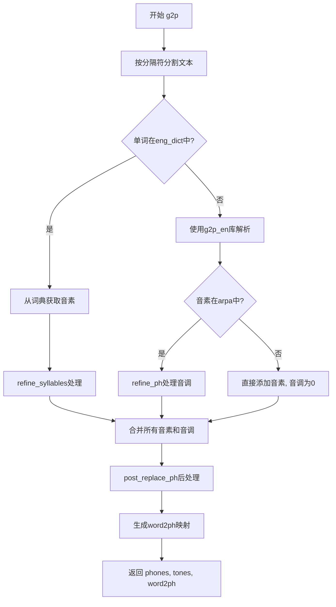
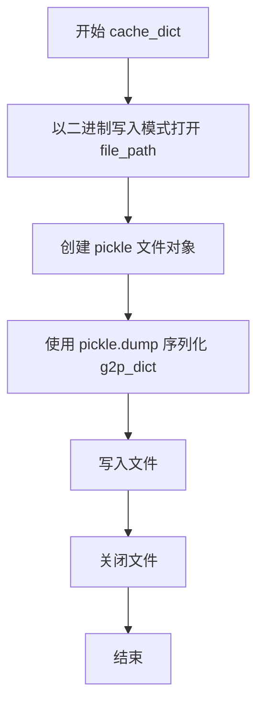
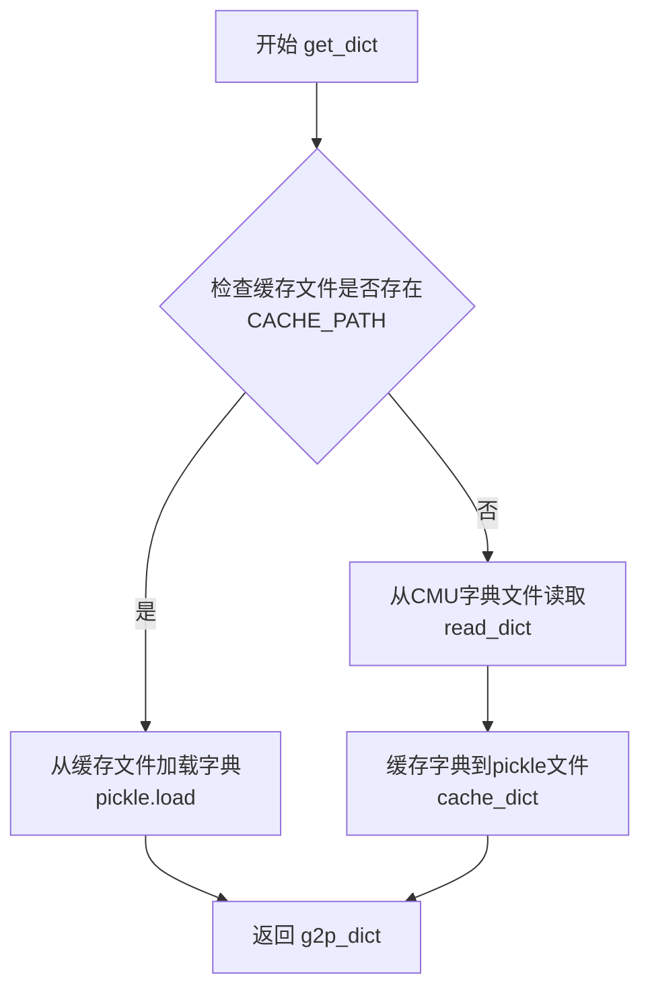
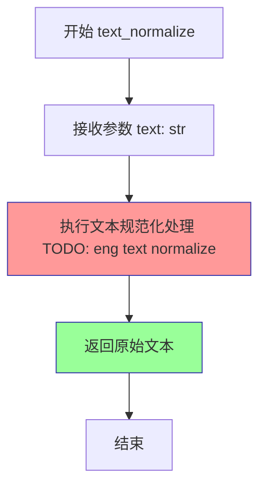
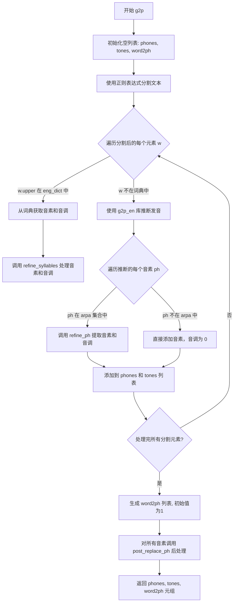

# `Bert-VITS2\oldVersion\V101\text\english.py` 详细设计文档

这是一个Grapheme-to-Phoneme (G2P) 文本转语音发音的模块，通过CMU发音词典和g2p_en库将英文文本转换为音素序列，同时处理音调计算和文本规范化。

## 整体流程



## 类结构

```
模块级别 (无类)
├── 全局变量区
│   ├── CMU_DICT_PATH
│   ├── CACHE_PATH
│   ├── _g2p (G2p实例)
│   ├── arpa (音素集合)
│   └── eng_dict (发音词典)
└── 函数区
    ├── post_replace_ph
    ├── read_dict
    ├── cache_dict
    ├── get_dict
    ├── refine_ph
    ├── refine_syllables
    ├── text_normalize
    └── g2p
```

## 全局变量及字段


### `current_file_path`
    
当前Python文件的目录路径

类型：`str`
    


### `CMU_DICT_PATH`
    
CMU发音词典文件的完整路径

类型：`str`
    


### `CACHE_PATH`
    
CMU词典缓存的pickle文件路径

类型：`str`
    


### `_g2p`
    
g2p_en库的G2p实例，用于将文本转换为音素

类型：`G2p`
    


### `arpa`
    
ARPA音素符号集合，用于验证音素是否有效

类型：`set`
    


### `eng_dict`
    
从CMU词典加载或缓存的英文单词到音素的映射字典

类型：`dict`
    


    

## 全局函数及方法


### `post_replace_ph`

该函数用于将输入的音素或符号进行标准化处理，包括标点符号映射和未知符号的替换，确保输出的音素符合预定义的符号集。

参数：

-  `ph`：`str`，输入的音素或符号，可以是中文标点、英文标点或音素

返回值：`str`，处理后的标准化音素或符号，如果不在符号表中则返回 "UNK"

#### 流程图

```mermaid
flowchart TD
    A[开始: 输入 ph] --> B{ph 是否在 rep_map 中?}
    B -->|是| C[执行替换: ph = rep_map[ph]]
    B -->|否| D{ph 是否在 symbols 中?}
    C --> D
    D -->|是| E[返回 ph]
    D -->|否| F[ph = 'UNK']
    F --> E
```

#### 带注释源码

```python
def post_replace_ph(ph):
    """
    对输入的音素或符号进行标准化处理
    
    处理逻辑：
    1. 首先将中文标点和一些特殊字符映射为英文标点
    2. 然后检查是否在预定义的符号表中
    3. 不在符号表中则返回 UNK（未知符号）
    
    参数:
        ph (str): 输入的音素或符号
        
    返回值:
        str: 处理后的标准化音素或符号
    """
    # 定义标点符号和特殊字符的替换映射表
    rep_map = {
        "：": ",",   # 中文冒号 -> 英文逗号
        "；": ",",   # 中文分号 -> 英文逗号
        "，": ",",   # 中文逗号 -> 英文逗号
        "。": ".",   # 中文句号 -> 英文句号
        "！": "!",   # 中文感叹号 -> 英文感叹号
        "？": "?",   # 中文问号 -> 英文问号
        "\n": ".",   # 换行符 -> 英文句号
        "·": ",",   # 中文句点 -> 英文逗号
        "、": ",",   # 中文顿号 -> 英文逗号
        "...": "…",  # 三个点 -> 省略号
        "v": "V",    # 小写 v -> 大写 V（音素标准化）
    }
    
    # 步骤1: 检查是否需要替换
    if ph in rep_map.keys():
        ph = rep_map[ph]
    
    # 步骤2: 检查是否在符号表中
    if ph in symbols:
        return ph
    
    # 步骤3: 不在符号表中则返回 UNK
    if ph not in symbols:
        ph = "UNK"
    
    return ph
```


### `read_dict`

该函数用于读取 CMU 发音字典文件 (cmudict.rep)，解析其中的单词和音素映射关系，并返回一个嵌套列表结构的字典。

参数： 无

返回值：`dict`，返回一个字典，将单词（字符串）映射到其音素列表的列表（`List[List[str]]`）。

#### 流程图

```mermaid
flowchart TD
    A([开始]) --> B[初始化空字典 g2p_dict]
    B --> C[设置起始行 start_line = 49]
    C --> D[打开 CMU_DICT_PATH 文件]
    D --> E[读取第一行, 初始化 line_index = 1]
    E --> F{line 是否存在?}
    F -->|是| G{line_index >= start_line?}
    F -->|否| L[返回 g2p_dict]
    G -->|是| H[去除行尾空白]
    G -->|否| K
    H --> I[用双空格分割行提取单词和音节字符串]
    I --> J[用 " - " 分割音节字符串]
    J --> M[初始化 g2p_dict[word] 为空列表]
    M --> N[遍历每个 syllable]
    N --> O[用空格分割音素]
    O --> P[将音素列表追加到 g2p_dict[word]]
    P --> K[line_index += 1]
    K --> Q[读取下一行]
    Q --> F
```

#### 带注释源码

```python
def read_dict():
    g2p_dict = {}  # 存储单词到音素映射的字典
    start_line = 49  # CMU 字典文件前49行为注释信息，从第50行开始是实际数据
    
    # 打开 CMU 字典文件
    with open(CMU_DICT_PATH) as f:
        line = f.readline()  # 读取第一行
        line_index = 1  # 初始化行索引
        
        # 遍历文件所有行
        while line:
            # 只处理第49行之后的数据行（跳过文件头部注释）
            if line_index >= start_line:
                line = line.strip()  # 去除首尾空白字符
                
                # 用双空格分割单词和音素串
                # 格式示例: "HELLO  HH AH L OW"
                word_split = line.split("  ")
                word = word_split[0]  # 提取单词
                
                # 用 " - " 分割多个音节
                # 格式示例: "HH AH - L OW"
                syllable_split = word_split[1].split(" - ")
                
                # 初始化该单词的音素列表
                g2p_dict[word] = []
                
                # 遍历每个音节
                for syllable in syllable_split:
                    # 用空格分割音素
                    # 格式示例: "HH AH"
                    phone_split = syllable.split(" ")
                    # 将音素列表添加到字典中
                    g2p_dict[word].append(phone_split)
            
            # 更新行索引并读取下一行
            line_index = line_index + 1
            line = f.readline()

    return g2p_dict  # 返回构建好的发音字典
```


### `cache_dict`

将给定的 g2p_dict（音素字典）序列化为 pickle 格式并写入指定路径的缓存文件中，用于后续快速加载。

参数：

- `g2p_dict`：`dict`，包含单词到音素映射的字典，通常为图音转换（grapheme-to-phoneme）字典
- `file_path`：`str`，目标缓存文件的路径，用于存储序列化的字典数据

返回值：`None`，该函数不返回任何值，仅执行文件写入操作

#### 流程图



#### 带注释源码

```python
def cache_dict(g2p_dict, file_path):
    """
    将 g2p 字典缓存到指定的 pickle 文件中
    
    参数:
        g2p_dict: dict 类型，包含图音转换映射的字典
        file_path: str 类型，缓存文件的保存路径
    
    返回:
        None，不返回任何值
    """
    # 以二进制写入模式打开目标文件
    with open(file_path, "wb") as pickle_file:
        # 使用 pickle 将字典对象序列化为二进制数据并写入文件
        pickle.dump(g2p_dict, pickle_file)
```

#### 说明

该函数是 `get_dict()` 函数的辅助函数，用于将首次加载的 CMU 发音字典缓存为 pickle 文件。缓存后的文件可以通过 `pickle.load()` 快速加载，避免重复解析原始 CMU 字典文件，从而提升程序运行效率。

- **调用场景**：当缓存文件不存在时，`get_dict()` 会调用 `read_dict()` 读取原始字典，然后调用 `cache_dict()` 生成缓存文件
- **依赖模块**：`pickle`（标准库）、`os`（标准库）
- **潜在优化空间**：可添加异常处理（如文件写入失败、磁盘空间不足等情况），并在写入前检查 `g2p_dict` 是否有效


### `get_dict`

该函数用于获取G2P（Grapheme-to-Phoneme）发音字典，采用缓存机制优先读取pickle缓存文件，若缓存不存在则从CMU发音字典文件读取并生成缓存，以提升后续调用效率。

参数： 无

返回值：`dict`，返回G2P发音字典，键为单词（大写），值为音素列表。

#### 流程图



#### 带注释源码

```python
def get_dict():
    """
    获取G2P发音字典
    
    优先从pickle缓存文件加载，若缓存不存在则从CMU发音字典
    文件读取并生成缓存，以提高后续调用效率。
    
    Returns:
        dict: G2P发音字典，键为单词（大写），值为音素列表
    """
    # 检查缓存文件是否存在
    if os.path.exists(CACHE_PATH):
        # 从pickle缓存文件加载字典
        with open(CACHE_PATH, "rb") as pickle_file:
            g2p_dict = pickle.load(pickle_file)
    else:
        # 缓存不存在，从CMU字典文件读取
        g2p_dict = read_dict()
        # 将读取的字典缓存到pickle文件
        cache_dict(g2p_dict, CACHE_PATH)

    # 返回G2P发音字典
    return g2p_dict
```

#### 关联变量与函数

| 名称 | 类型 | 描述 |
|------|------|------|
| `CACHE_PATH` | str | pickle缓存文件的路径 |
| `CMU_DICT_PATH` | str | CMU发音字典源文件路径 |
| `read_dict` | function | 从CMU字典文件读取并解析发音字典 |
| `cache_dict` | function | 将发音字典写入pickle缓存文件 |
| `g2p_dict` | dict | G2P发音字典，键为单词（大写），值为音素列表 |


### `refine_ph`

该函数是文本转语音（Text-to-Speech）流程中音素预处理环节的核心工具。它负责解析包含重音/声调标记的CMU词典音素格式，将表示音调的数字后缀分离出来，并将音素本身转换为小写，最终输出标准化的音素及其对应的声调信息。

参数：
-  `phn`：`str`，输入的原始音素字符串，可能包含如“0”，“1”，“2”等表示重音/声调的数字后缀（例如"AH0", "EY1"）。

返回值：`tuple`，返回一个包含两个元素的元组。
-  第一个元素：`str`，处理后的小写音素字符串（去掉数字后缀）。
-  第二个元素：`int`，计算出的声调值（如果原音素无数字后缀，则默认为0）。

#### 流程图

```mermaid
flowchart TD
    A([开始 refine_ph]) --> B[初始化 tone = 0]
    B --> C{正则匹配: phn 是否以数字结尾?}
    C -- 是 --> D[提取最后一位数字 d]
    D --> E[tone = int(d) + 1]
    E --> F[phn 去除最后一位字符]
    C -- 否 --> G[保持 phn 不变]
    F --> H[phn 转换为小写]
    G --> H
    H --> I([返回元组 (phn, tone)])
```

#### 带注释源码

```python
def refine_ph(phn):
    """
    处理单个音素，分离声调信息并标准化格式。

    参数:
        phn (str): 原始音素字符串，如 'AH0', 'EY1', 'B'。

    返回值:
        tuple: (处理后的音素字符串, 声调值)
    """
    tone = 0
    # 检查音素字符串是否以数字结尾（CMU字典中数字代表重音/声调）
    if re.search(r"\d$", phn):
        # 提取最后一位数字并转换为声调值（通常加1以避免0值，或根据需求定义）
        tone = int(phn[-1]) + 1
        # 移除数字后缀，获取纯音素
        phn = phn[:-1]
    
    # 转换为小写以保持一致性（例如 'AH' -> 'ah'）
    return phn.lower(), tone
```


### `refine_syllables`

该函数用于将音节列表中的每个音素提取出来，并根据正则表达式分离出音素和声调信息，最终返回处理后的音素列表和对应的声调列表。

参数：

- `syllables`：`list`，音节列表，每个元素是一个包含音素的列表（List[List[str]]）

返回值：`tuple`，返回由两个列表组成的元组 `(phonemes, tones)`，其中 phonemes 是处理后的音素列表（List[str]），tones 是对应的声调值列表（List[int]）

#### 流程图

```mermaid
flowchart TD
    A[开始 refine_syllables] --> B[初始化空列表: tones, phonemes]
    B --> C{遍历 syllables 中的每个 phn_list}
    C --> D{遍历 phn_list 中的每个 phn}
    D --> E[调用 refine_ph 处理单个音素]
    E --> F[提取 phoneme 和 tone]
    F --> G[将 phoneme 添加到 phonemes 列表]
    G --> H[将 tone 添加到 tones 列表]
    H --> I{phn_list 遍历完成?}
    I -->|否| D
    I -->|是| J{syllables 遍历完成?}
    J -->|否| C
    J -->|是| K[返回 tuple: (phonemes, tones)]
    K --> L[结束]
```

#### 带注释源码

```python
def refine_syllables(syllables):
    """
    处理音节列表，提取音素和声调信息
    
    参数:
        syllables: 音节列表，每个元素是一个音素列表（如 [['AH0', 'L'], ['OW1']])
    
    返回:
        tuple: (phonemes, tones) - 处理后的音素列表和对应的声调列表
    """
    # 初始化声调列表，用于存储每个音素对应的声调值
    tones = []
    # 初始化音素列表，用于存储处理后的音素
    phonemes = []
    
    # 遍历外层音节列表（每个词可能有一个或多个音节）
    for phn_list in syllables:
        # 遍历当前音节中的每个音素
        for i in range(len(phn_list)):
            # 获取当前音素
            phn = phn_list[i]
            # 调用 refine_ph 函数分离音素和声调
            # refine_ph 返回 (phoneme, tone) 元组
            phn, tone = refine_ph(phn)
            # 将处理后的音素添加到音素列表
            phonemes.append(phn)
            # 将声调值添加到声调列表
            tones.append(tone)
    
    # 返回音素列表和声调列表组成的元组
    return phonemes, tones
```


### `text_normalize`

该函数是文本规范化模块的占位符实现，目前仅简单返回输入文本，未执行任何实质性的文本规范化操作（如英文文本大小写规范化、特殊字符处理、空白字符标准化等），存在待完善的功能实现。

参数：

- `text`：`str`，待规范化的原始文本输入

返回值：`str`，规范化处理后的文本（当前实现为直接返回原文本）

#### 流程图



#### 带注释源码

```python
def text_normalize(text):
    """
    文本规范化函数
    
    注意：当前实现为占位符，未执行实际的文本规范化操作
    TODO: 需要实现英文文本的规范化逻辑
    
    Args:
        text: 待规范化的原始文本字符串
        
    Returns:
        规范化后的文本字符串（当前实现直接返回原文本）
    """
    # TODO: 实现英文文本规范化
    # 预期实现功能可能包括：
    # - 大小写规范化
    # - 特殊字符处理
    # - 空白字符标准化
    # - 数字转文本等
    return text
```


### `g2p`

该函数是文本转语音（Text-to-Speech，TTS）系统的核心组件，负责将输入的文本字符串转换为音素序列、音调序列以及词到音素的映射关系。函数首先通过正则表达式将文本分割为单词和分隔符，然后查询预定义的英语词典（CMU发音词典）获取音素；若词典中不存在该单词，则调用 g2p_en 库进行发音推断；最后对所有音素进行后处理替换以确保符合系统符号集，并生成默认的词到音素映射（每个词对应一个音素）。

参数：

- `text`：`str`，要转换为音素的文本输入

返回值：`tuple`，包含三个列表 —— (phones, tones, word2ph)，其中 phones 是音素序列列表，tones 是对应音素的音调值列表，word2ph 是词到音素的映射列表

#### 流程图



#### 带注释源码

```python
def g2p(text):
    """
    将输入文本转换为音素序列、音调序列和词到音素的映射
    
    参数:
        text: str - 输入的文本字符串
        
    返回:
        tuple: (phones, tones, word2ph) 三个列表的元组
    """
    phones = []      # 存储转换后的音素序列
    tones = []       # 存储对应的音调值
    # 使用正则表达式按单词和常见分隔符分割文本
    # 分隔符包括: 逗号、分号、句号、连字符、问号、感叹号、空格
    words = re.split(r"([,;.\-\?\!\s+])", text)
    
    # 遍历分割后的每个元素（可能是单词或分隔符）
    for w in words:
        # 检查是否为空字符串，跳过
        if w == "":
            continue
            
        # 如果是大写形式在英语词典中
        if w.upper() in eng_dict:
            # 从预加载的 CMU 词典中获取发音
            # eng_dict[w.upper()] 返回嵌套列表结构
            phns, tns = refine_syllables(eng_dict[w.upper()])
            phones += phns    # 展开追加音素列表
            tones += tns      # 展开追加音调列表
        else:
            # 词典中不存在，使用 g2p_en 库进行发音推断
            # filter 过滤掉空格字符
            phone_list = list(filter(lambda p: p != " ", _g2p(w)))
            
            for ph in phone_list:
                # 检查音素是否在 ARPA 音素集合中
                if ph in arpa:
                    # 是 ARPA 音素，提取基础音素和音调
                    ph, tn = refine_ph(ph)
                    phones.append(ph)
                    tones.append(tn)
                else:
                    # 非 ARPA 音素（如静音标记等），直接添加
                    phones.append(ph)
                    tones.append(0)  # 默认音调为 0
    
    # TODO: 实现更准确的 word2ph 映射
    # 当前生成默认映射：每个音素对应 1
    word2ph = [1 for i in phones]

    # 对所有音素进行后处理替换，确保符合系统符号集
    # 例如将中文标点转换为英文标点，将未知符号替换为 UNK
    phones = [post_replace_ph(i) for i in phones]
    
    return phones, tones, word2ph
```


## 关键组件


### 字典惰性加载与缓存机制

通过 `get_dict()` 函数实现字典的惰性加载：先检查缓存文件 `cmudict_cache.pickle` 是否存在，如存在则直接从 pickle 加载，否则调用 `read_dict()` 读取 CMU 字典并调用 `cache_dict()` 生成缓存文件，避免重复解析大型字典文件。

### CMU 字典解析器

`read_dict()` 函数负责从 `cmudict.rep` 文件中解析发音字典，使用固定起始行(49)跳过文件头部，按双空格分割单词与音素，按" - "分割音节，按空格分割单个音素，返回嵌套列表结构 `g2p_dict[word] = [[syllable1_phonemes], [syllable2_phonemes], ...]`。

### 音调提取与反量化

`refine_ph()` 函数通过正则表达式检测音素末尾的数字（重音标记），将数字转换为音调值(0-3)，并移除数字后返回小写音素。`refine_syllables()` 函数遍历音素列表批量提取音调，实现对 CMU 字典中音素变体的"反量化"处理。

### 字符标准化映射

`post_replace_ph()` 函数维护字符替换映射表，将中文标点、特殊符号统一转换为英文符号（如"："→","，"…"→"..."），并验证音素是否在 symbols 集合中，不存在则返回 "UNK"，实现文本标准化与音素合法性校验。

### G2P 转换主流程

`g2p()` 函数是核心转换引擎：使用正则按标点和空格分割文本，优先从预加载 `eng_dict` 查找单词发音，对未收录词调用 g2p_en 库生成发音，最后统一调用 `post_replace_ph()` 标准化音素，返回 (phones, tones, word2ph) 三元组。

### ARPA 音素集合

`arpa` 集合定义了 CMU 音素库的完整音素表（共87个），用于过滤 g2p_en 库生成的有效音素，仅对有效音素提取音调，无效音素则直接添加并设置音调为0。

### 全局初始化与依赖注入

模块级全局变量 `_g2p` 实例化 G2p 对象，`eng_dict` 在导入时立即调用 `get_dict()` 加载缓存字典，实现启动时预加载常用英文单词发音数据。


## 问题及建议


### 已知问题

- **硬编码配置缺乏灵活性**：`arpa`音素集合和`start_line = 49`均为硬编码，若CMU字典文件格式变化或需要支持其他音素集时，代码需要大幅修改
- **缺少异常处理**：文件读取（`open(CMU_DICT_PATH)`）、pickle加载、字典查询等操作均无异常捕获，可能导致程序在文件不存在或格式错误时直接崩溃
- **正则表达式重复编译**：`re.search(r"\d$", phn)`在循环中每次调用`refine_ph`时都重新编译正则表达式，影响性能
- **全局状态副作用**：模块级别直接执行`eng_dict = get_dict()`，在导入时即加载字典到内存，若文件较大或不存在会导致导入失败或启动缓慢
- **未完成功能**：函数`text_normalize`为空实现（仅返回原文本），`word2ph`始终返回全1列表，均有`# todo`注释标记但未实现
- **字典解析逻辑脆弱**：`read_dict`函数假设CMU字典文件使用双空格分隔且格式固定，若文件格式略有变化（如空行、注释行）可能导致`IndexError`或`KeyError`
- **缺乏类型注解**：所有函数均无类型提示，不利于代码维护和IDE支持
- **缓存机制不完善**：pickle缓存文件加载时未验证完整性或版本，损坏的缓存文件会导致静默错误

### 优化建议

- 将`arpa`集合和`start_line`等配置抽离为配置文件或类常量，并添加配置加载逻辑
- 为所有文件操作和字典查询添加`try-except`异常处理，返回有意义的错误信息或降级方案
- 将正则表达式预编译为模块级常量（如`TONE_PATTERN = re.compile(r"\d$")`）
- 采用惰性加载（lazy loading）模式，将`eng_dict`的初始化延迟到首次调用`g2p`函数时
- 完成`text_normalize`和`word2ph`的实现，或在未实现时抛出明确异常而非静默返回
- 改进字典解析逻辑，增加空行检查、格式验证和容错处理
- 为关键函数添加类型注解（参数和返回值类型），提升代码可读性和可维护性
- 在缓存加载时增加版本校验或MD5校验，确保缓存数据有效性
</think>

## 其它


### 设计目标与约束

本模块的设计目标是提供一个高效的英文文本到音素的转换系统，支持从简单的句子到包含数字、特殊字符的复杂文本的转换。核心约束包括：1）必须兼容CMU发音词典格式；2）需要支持缓存机制以提高性能；3）必须处理各种边缘情况如未知字符、数字转换等；4）保持与g2p_en外部库的接口兼容。

### 错误处理与异常设计

本模块的错误处理策略如下：1）文件读取错误：当CMU_DICT_PATH或CACHE_PATH不存在时，read_dict()会抛出FileNotFoundError，需要在调用前验证文件存在性；2）词典解析错误：read_dict()假设词典格式固定，当格式不匹配时会抛出IndexError，建议增加格式验证；3）g2p_en库调用错误：当g2p()处理未知词时可能返回空列表或异常，需要捕获并返回默认UNK标记；4）pickle加载错误：当缓存文件损坏时，get_dict()会抛出pickle.UnpicklingError，此时应删除缓存并重新生成。

### 数据流与状态机

数据流主要分为三个阶段：初始化阶段（加载词典或读取缓存）、处理阶段（文本规范化、词语分割、音素转换）、后处理阶段（音素替换、声调提取）。状态转换如下：init（从文件加载或从缓存加载）→ ready（词典就绪）→ processing（处理文本中）→ completed（返回结果）。状态机确保在init完成后才能进行processing，避免并发访问未初始化的词典。

### 外部依赖与接口契约

主要外部依赖包括：1）g2p_en库：提供Grapheme-to-Phoneme转换功能，接口为G2p()类，调用callable对象进行转换；2）pickle库：Python标准库，用于缓存序列化；3）os和re库：Python标准库，分别用于路径操作和正则匹配；4）text.symbols模块：本地模块，提供有效的音素符号集合。接口契约：g2p(text)函数接收字符串输入，返回(phones: List[str], tones: List[int], word2ph: List[int])三元组，其中phones为音素序列，tones为对应的声调值，word2ph表示每个音素对应的字符数。

### 性能考虑与优化空间

当前实现存在以下性能优化空间：1）词典缓存机制：已实现但可优化为LRU缓存或内存映射文件；2）正则表达式预编译：g2p()中的re.split()每次调用都重新编译正则，建议使用re.compile()预编译；3）字符串操作优化：refine_ph()和post_replace_ph()中存在大量字符串判断，可使用字典查找替代；4）并行处理：对于长文本，可考虑使用多进程并行处理不同词语；5）内存优化：eng_dict全局变量在模块加载时全部加载，对于大型词典可考虑延迟加载或分页加载。

### 安全考虑

本模块主要涉及文本处理，安全风险较低，但需注意：1）文件路径安全：CMU_DICT_PATH和CACHE_PATH使用__file__相对路径，需防止路径遍历攻击；2）pickle安全：加载缓存文件时，pickle反序列化可能存在代码执行风险，建议使用更安全的json格式或添加缓存校验；3）输入验证：g2p()函数应验证输入text参数类型，避免注入攻击；4）内存耗尽：对于超长文本可能导致内存问题，需设置输入长度限制。

### 测试策略

建议采用以下测试策略：1）单元测试：对refine_ph()、refine_syllables()、post_replace_ph()等核心函数进行独立测试，覆盖正常输入、边界条件和异常输入；2）集成测试：测试g2p()函数对完整句子的处理，验证输出格式和内容正确性；3）回归测试：建立标准测试集，包含各种场景（纯英文、含数字、含特殊字符、含未知词等），确保修改不影响现有功能；4）性能测试：测试大段文本的处理时间和内存占用；5）缓存测试：验证缓存创建、读取、更新机制的正确性。

### 配置管理

当前配置通过硬编码实现，建议重构为配置管理：1）词典路径配置：CMU_DICT_PATH和CACHE_PATH应可配置，支持自定义路径；2）缓存策略配置：可配置缓存有效期、缓存大小限制等；3）g2p回退配置：可配置对未知词的处理策略（使用g2p库、返回UNK、抛出异常等）；4）日志配置：增加日志开关和日志级别配置，便于问题诊断。

### 版本兼容性与迁移策略

兼容性考虑：1）Python版本：建议支持Python 3.7+，兼容 asyncio 和类型注解；2）g2p_en库版本：需明确依赖的g2p_en版本范围，避免接口变化导致的问题；3）CMU词典版本：词典格式可能随版本更新，建议在read_dict()中增加版本检测和兼容性处理。迁移策略：1）保持接口向后兼容；2）重大变化通过版本号管理；3）提供迁移脚本处理配置和缓存格式变更。

    