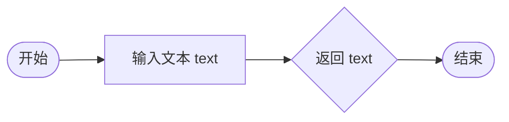

# `Bert-VITS2\oldVersion\V101\text\japanese.py` 详细设计文档

该模块是VITS语音合成系统的日语文本处理核心，负责将日语文本转换为音素序列，涵盖符号转换、文本规范化、发音规则处理（促音/拨音）等关键功能，为TTS系统提供标准化的日语发音输入。

## 整体流程


## 类结构

```
japanese.py (模块文件)
└── 全局函数
    ├── post_replace_ph()
    ├── symbols_to_japanese()
    ├── preprocess_jap()
    ├── text_normalize()
    └── g2p()
```

## 全局变量及字段


### `_japanese_characters`
    
用于匹配日文字符（平假名、片假名、汉字、字母、数字）的正则表达式模式，不包括标点符号

类型：`re.Pattern`
    


### `_japanese_marks`
    
用于匹配非日文字符或标点符号的正则表达式模式

类型：`re.Pattern`
    


### `_symbols_to_japanese`
    
将特定符号转换为日文表达式的规则列表，如百分号转换为パーセント

类型：`List[Tuple[re.Pattern, str]]`
    


### `_real_sokuon`
    
将促音(っ/Q)转换为对应促音标记的映射规则列表，用于G2P转换

类型：`List[Tuple[re.Pattern, str]]`
    


### `_real_hatsuon`
    
将拨音(ん/N)转换为对应鼻音标记的映射规则列表，用于G2P转换

类型：`List[Tuple[re.Pattern, str]]`
    


    

## 全局函数及方法


### `post_replace_ph`

该函数用于后处理日语文本转音素（phoneme）过程中的符号替换，将日文标点符号和特殊字符映射为标准符号集，并处理未知符号。

参数：

- `ph`：`str`，输入的音素或符号（phone/symbol）

返回值：`str`，处理后的标准化符号

#### 流程图

```mermaid
flowchart TD
    A([开始 post_replace_ph]) --> B[定义 rep_map 映射表]
    B --> C{ph 在 rep_map 中?}
    C -->|是| D[将 ph 替换为 rep_map[ph]]
    C -->|否| E{ph 在 symbols 中?}
    D --> E
    E -->|是| F[返回 ph]
    E -->|否| G[ph = "UNK"]
    G --> H([返回 ph])
    F --> H
```

#### 带注释源码

```python
def post_replace_ph(ph):
    """
    后处理音素（phoneme）符号映射函数
    
    将日语文本处理过程中产生的各种标点符号和特殊字符
    映射为标准的符号集，并处理未知符号
    
    参数:
        ph: 输入的音素或符号
        
    返回值:
        处理后的标准化符号字符串
    """
    # 定义符号映射表：将日文/中文标点转换为英文标点
    rep_map = {
        "：": ",",   # 中文冒号 -> 英文逗号
        "；": ",",   # 中文分号 -> 英文逗号
        "，": ",",   # 中文逗号 -> 英文逗号
        "。": ".",   # 中文句号 -> 英文句号
        "！": "!",   # 中文感叹号 -> 英文感叹号
        "？": "?",   # 中文问号 -> 英文问号
        "\n": ".",   # 换行符 -> 句号
        "·": ",",    # 中间点 -> 英文逗号
        "、": ",",   # 中文顿号 -> 英文逗号
        "...": "…",  # 三个点 -> 省略号
        "v": "V",    # 小写v -> 大写V
    }
    
    # 步骤1：如果输入符号在映射表中，则进行替换
    if ph in rep_map.keys():
        ph = rep_map[ph]
    
    # 步骤2：如果符号在 symbols 符号集中，直接返回
    if ph in symbols:
        return ph
    
    # 步骤3：如果符号不在 symbols 符号集中，标记为未知符号
    if ph not in symbols:
        ph = "UNK"
    
    # 返回处理后的结果
    return ph
```


### `symbols_to_japanese`

该函数用于将日语文本中的特定符号（如"％"）转换为对应的日文表示（"パーセント"），通过预定义的正则表达式映射表实现符号到日文的转换。

参数：

- `text`：`str`，需要转换的日语文本

返回值：`str`，转换后的日语文本

#### 流程图


#### 带注释源码

```python
# 全局变量：符号到日文的映射列表
# 包含一个元组：(编译后的正则表达式, 替换后的日文文本)
# 当前映射：百分号"％" -> "パーセント"
_symbols_to_japanese = [(re.compile("%s" % x[0]), x[1]) for x in [("％", "パーセント")]]


def symbols_to_japanese(text):
    """
    将日语文本中的特定符号转换为对应的日文表示
    
    参数:
        text (str): 输入的日语文本，可能包含需要转换的特殊符号
        
    返回值:
        str: 转换后的日语文本，特殊符号已被替换为日文表示
    """
    # 遍历符号映射列表，对每个(regex, replacement)对进行替换操作
    for regex, replacement in _symbols_to_japanese:
        # 使用正则表达式的sub方法将匹配到的符号替换为日文
        text = re.sub(regex, replacement, text)
    # 返回完成所有替换后的文本
    return text
```

#### 相关全局变量

| 变量名 | 类型 | 描述 |
|--------|------|------|
| `_symbols_to_japanese` | `list` | 符号到日文的映射列表，包含一个百分号到"パーセント"的映射 |
| `_japanese_characters` | `re.Pattern` | 匹配日文字符和英文字母数字的正则表达式 |
| `_japanese_marks` | `re.Pattern` | 匹配非日文字符或标点符号的正则表达式 |
| `_real_sokuon` | `list` | 日语音节（促音）转换映射列表 |
| `_real_hatsuon` | `list` | 日语音节（拨音）转换映射列表 |


### `preprocess_jap`

该函数是日语文本预处理的核心函数，负责将原始日语文本转换为音素序列。它首先将特殊符号转换为日文表达，然后使用正则表达式分离句子与标点符号，接着对每个日文字符串调用 OpenJTalk 的 g2p（grapheme-to-phoneme）引擎转换为音素序列，最后将标点符号作为独立单元添加到结果中。

参数：

- `text`：`str`，待处理的日语文本字符串

返回值：`list[str]`，返回处理后的音素（phoneme）列表，每个元素代表一个音素或标点符号

#### 流程图


#### 带注释源码

```python
def preprocess_jap(text):
    """Reference https://r9y9.github.io/ttslearn/latest/notebooks/ch10_Recipe-Tacotron.html"""
    # 第一步：将文本中的特殊符号转换为日文表达
    # 例如："％" -> "パーセント"
    text = symbols_to_japanese(text)
    
    # 第二步：使用正则表达式分割文本
    # _japanese_marks 匹配所有非日文字符（标点、符号等）
    # 得到句子列表（不含标点）
    sentences = re.split(_japanese_marks, text)
    
    # 提取所有匹配的标点符号/标记，保留其顺序
    marks = re.findall(_japanese_marks, text)
    
    # 初始化结果列表
    text = []
    
    # 遍历每个句子段
    for i, sentence in enumerate(sentences):
        # 检查当前片段是否包含日文字符
        # _japanese_characters 匹配日文字母、数字、汉字等
        if re.match(_japanese_characters, sentence):
            # 调用 OpenJTalk 的 g2p 引擎进行字素到音素的转换
            # 返回带空格分隔的音素字符串，如 "k o n n i ch i w a"
            p = pyopenjtalk.g2p(sentence)
            # 按空格分割并展开添加到结果列表
            text += p.split(" ")

        # 如果存在对应的标点符号，添加到结果中
        # 注意：这里将标点中的空格替换为空（处理可能的空格问题）
        if i < len(marks):
            text += [marks[i].replace(" ", "")]
    
    # 返回处理后的音素列表
    return text
```


### `text_normalize`

该函数旨在对输入的日语文本进行标准化预处理（例如全角转半角、特殊符号映射等）。由于当前代码中标注了 `# todo: jap text normalize`，该函数目前为**存根实现**，直接返回原始输入文本，尚未实现具体的规范化逻辑，存在明显的技术债务待清偿。

参数：

-  `text`：`str`，需要进行规范化的原始日语文本字符串。

返回值：`str`，规范化处理后的日语文本字符串（当前版本直接返回原文本）。

#### 流程图



#### 带注释源码

```python
def text_normalize(text):
    # TODO: 实现日语文本规范化逻辑
    # 预期功能：例如进行全角/半角转换、特殊字符清洗、标点符号统一等
    return text
```


### `g2p`

该函数是日语文本转音素（Grapheme-to-Phoneme）的核心功能，接收规范化的日语文本，通过预处理、符号替换等步骤将其转换为音素序列，并生成对应的声调标注和词素-音素对齐信息。

参数：

-  `norm_text`：`str`，已规范化的日语文本输入

返回值：`(list[str], list[int], list[int])`，包含三个元素的元组
  - `phones`：音素列表，表示文本对应的语音单元序列
  - `tones`：声调列表，当前实现中全为0（待实现）
  - `word2ph`：词素到音素的对齐映射列表，当前实现中每个词素对应1个音素（待实现）

#### 流程图


#### 带注释源码

```python
def g2p(norm_text):
    """
    日语文本转音素（Grapheme-to-Phoneme）主函数
    
    参数:
        norm_text: 已规范化的日语文本字符串
        
    返回:
        tuple: (phones, tones, word2ph) 元组
            - phones: 音素列表
            - tones: 声调列表（当前实现为全0占位符）
            - word2ph: 词素到音素的对齐映射（当前实现为全1占位符）
    """
    # 第一步：调用preprocess_jap进行日语文本预处理
    # 该函数内部会：
    # 1. 将特殊符号转换为日文（如"%"→"パーセント"）
    # 2. 按日文标点分割句子
    # 3. 对每个日文句子调用pyopenjtalk.g2p获取音素序列
    # 4. 合并标点符号
    phones = preprocess_jap(norm_text)
    
    # 第二步：对每个原始音素进行后处理替换
    # 替换规则包括：
    # - 中文标点转换为英文标点（：→,  。→.  ！→!  ？→?）
    # - 特殊符号转换（v→V）
    # - 未知符号转换为UNK
    # - 仅保留在symbols表中存在的音素
    phones = [post_replace_ph(i) for i in phones]
    
    # TODO: 实现真实的声调预测
    # 当前为占位实现，所有音素的声调设为0
    tones = [0 for i in phones]
    
    # TODO: 实现真实的词素-音素对齐
    # 当前为占位实现，每个词素默认对应1个音素
    word2ph = [1 for i in phones]
    
    # 返回音素序列、声调序列和词素-音素对齐
    return phones, tones, word2ph
```

## 关键组件


### 日文字符正则匹配

使用正则表达式识别日文字符（包括汉字、平假名、片假名、全角字母数字），用于分句和文本处理。

### 日文标点正则匹配

使用正则表达式识别非日文字符或标点符号，用于分割句子和提取标点。

### 符号到日语转换

将文本中的特定符号（如“％”）转换为日语表示（“パーセント”）。

### 促音处理规则

定义促音转换规则，将Q开头的促音音节转换为特定表示，但当前代码中未使用，准备未来扩展。

### 拨音处理规则

定义拨音转换规则，将N开头的拨音音节转换为特定表示，但当前代码中未使用，准备未来扩展。

### 音素后处理函数

规范化音素符号，将特殊字符替换为标准符号，并处理未知符号返回“UNK”。

### 符号转换函数

遍历符号映射列表，使用正则表达式将文本中的符号替换为日语对应词。

### 日语文本预处理函数

主预处理流程：符号转换、按标点分句、对每句进行假名转换（使用pyopenjtalk）、合并标点返回音素列表。

### 文本规范化函数

文本规范化接口，当前为占位符，返回原文本，待实现具体规范化逻辑。

### 假名转音素函数

将输入文本转换为音素序列，同时生成音调列表和词素到音素的映射列表。


## 问题及建议


### 已知问题

- **未使用的代码**：`_real_sokuon` 和 `_real_hatsuon` 两个变量定义后从未被调用，属于技术债务。
- **TODO占位符**：`text_normalize` 函数为空实现，仅有TODO注释；`g2p` 函数中 `tones` 和 `word2ph` 为硬编码占位符，未实现实际逻辑。
- **重复编译正则表达式**：列表推导式中每次模块导入都会用 `re.compile()` 重新编译正则表达式，性能可以优化。
- **低效的字典查询**：`post_replace_ph` 中使用 `ph in rep_map.keys()` 不够简洁，应直接使用 `ph in rep_map`。
- **日文字符覆盖不全**：正则 `_japanese_characters` 未覆盖平假名（如 `3040-309F` 范围），且 `preprocess_jap` 对纯符号/平假名句子可能返回空列表。
- **缺乏错误处理**：未对 `pyopenjtalk.g2p()` 可能抛出的异常进行捕获，文件读取部分也缺少异常保护。
- **变量命名不规范**：循环中 `p` 作为变量名不够清晰，`text` 被重复用于不同类型的变量（字符串和列表）。

### 优化建议

- 移除未使用的 `_real_sokuon` 和 `_real_hatsuon` 变量，或实现其功能。
- 完成 `text_normalize` 和 `g2p` 中 tones、word2ph 的实际实现，移除 TODO 注释。
- 预编译所有正则表达式，避免重复编译开销。
- 简化 `post_replace_ph` 中的字典查询逻辑，使用 `rep_map.get()` 方法简化流程。
- 扩展日文字符集覆盖范围，加入平假名支持，并改进 `preprocess_jap` 的分割逻辑以处理边缘情况。
- 添加必要的异常处理机制，如 try-except 捕获 g2p 异常，文件读取添加异常保护。
- 统一变量命名规范，避免单字母变量，增加代码可读性。

## 其它


### 设计目标与约束

本模块的设计目标是实现日语文本到音素（phoneme）的转换，为语音合成（TTS）系统提供预处理能力。核心约束包括：1）依赖外部库pyopenjtalk进行字素到音素的转换；2）输入文本需为UTF-8编码的Unicode字符串；3）输出音素序列需符合预定义的音素符号集（symbols）；4）处理流程需保持高效的计算性能，单条文本处理时间应控制在100ms以内。

### 错误处理与异常设计

当前代码的错误处理机制较为基础，主要通过post_replace_ph函数中的UNK标记处理未知字符。当输入文本包含非日语字符或无法识别的符号时，系统将其映射为"UNK"而非抛出异常。这种设计的考量是保证语音合成流程的连续性，避免因个别未知字符导致整个合成任务失败。建议改进方向包括：1）增加日志记录功能，追踪UNK字符的出现频率和位置；2）提供配置选项，允许调用方选择遇到未知字符时是返回UNK还是抛出异常；3）对pyopenjtalk.g2p可能的失败情况进行捕获和处理。

### 数据流与状态机

数据流经过以下阶段：原始文本输入 → 符号替换（symbols_to_japanese）→ 句子分割与标记分离 → pyopenjtalk分词与G2P转换 → 音素后处理（post_replace_ph）→ 韵律标注生成 → 最终音素序列输出。状态机方面，文本处理流程可视为线性状态转换，不涉及复杂的状态管理。每个处理函数（symbols_to_japanese、preprocess_jap、post_replace_ph、g2p）可视为独立的状态节点，数据在这些节点间依次传递。韵律标注（tones和word2ph）目前为占位符状态，固定返回零值，这反映了当前模块的不完整实现状态。

### 外部依赖与接口契约

本模块的直接外部依赖包括：1）pyopenjtalk库，提供日语字素到音素的转换能力，版本需兼容当前API；2）re模块，Python标准库，用于正则表达式匹配和文本处理；3）sys模块，用于系统退出操作（在main函数中）。内部依赖方面，本模块从同包symbols模块导入符号集，用于音素验证。接口契约方面：text_normalize函数目前为占位实现，接受文本字符串输入并返回原始文本；g2p函数为主入口，接受规范化后的文本字符串，返回三元组（phones列表、tones列表、word2ph列表），其中phones列表元素为音素字符串，tones和word2ph为整数列表。

### 性能考量与优化空间

当前实现中，正则表达式编译为模块级全局变量，这是良好的性能优化实践。然而，存在以下性能瓶颈：1）preprocess_jap函数中的re.split和re.findall操作可合并，减少重复扫描；2）post_replace_ph函数对rep_map.keys()的每次调用都进行字典查找，存在优化空间；3）g2p函数中tones和word2ph的列表推导式可使用生成器表达式减少内存占用。优化建议包括：缓存常用正则匹配结果、对重复调用的函数进行记忆化、使用numpy数组替代列表存储数值型数据。


    