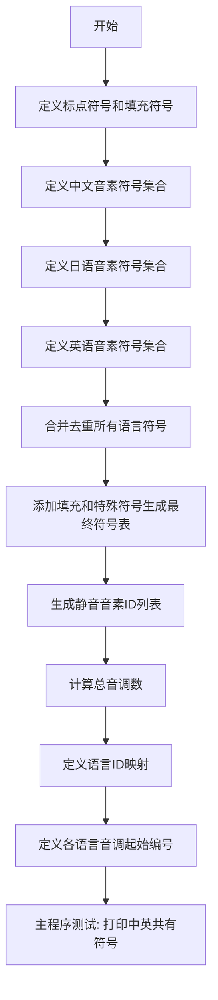

# `Bert-VITS2\oldVersion\V101\text\symbols.py` 详细设计文档

该代码定义了一个多语言音素符号表系统，整合了中文、日语和英语的音素符号，用于语音合成或语音识别系统中的符号映射和语言识别。

## 整体流程



## 类结构

```
无类层次结构 (脚本文件)
纯数据定义模块
包含全局变量和配置字典
```

## 全局变量及字段


### `punctuation`
    
基础标点符号列表，包含常见标点如感叹号、问号、省略号等

类型：`List[str]`
    


### `pu_symbols`
    
标点符号和特殊符号的完整列表，包含SP（空格）和UNK（未知）标记

类型：`List[str]`
    


### `pad`
    
用于序列填充的占位符符号，通常在批处理时保持序列长度一致

类型：`str`
    


### `zh_symbols`
    
中文语音合成音素符号列表，包含声母、韵母及声调标记

类型：`List[str]`
    


### `num_zh_tones`
    
中文声调总数，包含4个基础声调加1个轻声（共6个）

类型：`int`
    


### `ja_symbols`
    
日语语音合成音素符号列表，包含假名对应的音素表示

类型：`List[str]`
    


### `num_ja_tones`
    
日语声调数量，日语为声调语言，此处设置为1

类型：`int`
    


### `en_symbols`
    
英语ARPAbet音素符号列表，包含英语语音合成所需的所有音素

类型：`List[str]`
    


### `num_en_tones`
    
英语声调数量，用于英语语音合成的韵律调节

类型：`int`
    


### `normal_symbols`
    
去重排序后的所有语言音素符号集合（不含特殊符号）

类型：`List[str]`
    


### `symbols`
    
完整的符号表，包含填充符、正常符号和标点符号的索引序列

类型：`List[str]`
    


### `sil_phonemes_ids`
    
静音/标点符号在符号表中的索引位置列表，用于识别静音段

类型：`List[int]`
    


### `num_tones`
    
所有语言的总声调数量，由三种语言声调数相加得出

类型：`int`
    


### `language_id_map`
    
语言标识符到ID的映射，用于区分中英日三种语言

类型：`Dict[str, int]`
    


### `num_languages`
    
支持的语言种类总数，当前支持中文、日语、英语三种

类型：`int`
    


### `language_tone_start_map`
    
各语言声调索引的起始偏移量，用于多语言音高预测

类型：`Dict[str, int]`
    


    

## 全局函数及方法


## 关键组件


### 符号定义模块 (Punctuation & Symbol Definitions)

该代码定义了三套语言（中文、日语、英语）的音素符号表，并组合成统一的符号库，用于语音合成或识别系统的音素建模。

### 标点符号集合 (punctuation & pu_symbols)

定义英文标点符号列表，包括感叹号、问号、省略号、逗号、句号、单引号、连字符，以及特殊符号SP（空格）和UNK（未知）。

### 音素符号库 (zh_symbols, ja_symbols, en_symbols)

分别定义中文拼音音素（包含声母、韵母及声调变体）、日语假名音素（包含清音、浊音、拗音等）、英语ARPABET音素集合，涵盖各语言的发音基本单元。

### 统一符号表 (symbols)

将三套语言符号合并去重后，加上填充符（pad）形成完整符号列表，作为音素到索引的映射基础。

### 语言标识映射 (language_id_map)

建立语言代码到整数ID的映射：ZH→0, JA→1, EN→2，用于多语言模型的输入表示。

### 声调起始索引映射 (language_tone_start_map)

记录每种语言声调索引的起始位置，支持不同语言声调系统的连续编号。

### 静音音素索引 (sil_phonemes_ids)

预计算标点符号对应的索引位置，用于语音合成中的静音处理或停顿插入。

### 调试代码块 (if __name__ == "__main__")

演示代码功能：找出中英文音素集合的交集，可用于分析跨语言相似音素。


## 问题及建议


### 已知问题

-   **硬编码数据问题**：所有音素符号（zh_symbols、ja_symbols、en_symbols）都直接硬编码在代码中，缺乏灵活性，维护成本高，且数据与逻辑未分离
-   **魔法数字**：`num_zh_tones = 6`、`num_ja_tones = 1`、`num_en_tones = 4` 为硬编码的音调数量，应从符号列表中动态计算而非手动指定
-   **符号冲突风险**：代码使用 `sorted(set(...))` 合并符号集合，未对三个语言之间的符号重叠进行严格验证，底部测试代码 `a & b` 表明存在中英文符号交集
-   **调试代码残留**：`if __name__ == "__main__"` 块中包含测试交集的调试代码，不应出现在生产配置模块中
-   **命名不一致**：符号命名不规范，部分使用大写（如"E"、"En"、"AA"），部分使用小写，且中文拼音符号与英文音标符号混用
-   **缺乏类型注解**：代码无任何类型提示（Type Hints），降低了代码可读性和IDE支持
-   **全局变量污染**：所有符号和映射都以全局变量形式定义，缺乏封装，难以进行单元测试和模块化使用

### 优化建议

-   **数据外部化**：将符号数据提取到独立的配置文件（如JSON或YAML），通过加载机制读取，提高可维护性
-   **动态计算音调数量**：移除硬编码的 num_*_tones 变量，改为通过分析符号集合自动计算或从配置中读取
-   **添加验证函数**：实现符号一致性检查函数，验证语言间符号无冲突、符号索引映射正确等
-   **清理调试代码**：移除 `if __name__ == "__main__"` 中的调试代码，或将其移至单独的测试模块
-   **统一命名规范**：对所有符号采用一致的命名规范（如全部小写或遵循特定规则）
-   **引入类型注解**：为所有变量、函数添加明确的类型标注，提升代码质量和可读性
-   **模块化重构**：使用类或数据结构（如dataclass、Enum）封装相关数据和逻辑，减少全局变量暴露

## 其它


### 设计目标与约束

本模块作为多语言语音合成系统的基础符号定义层，核心目标是统一管理中文、日文、英文三种语言的音素符号体系，为上层的语音合成模型提供标准化的输入表示。设计约束包括：1）符号集合必须完整覆盖各语言的发音需求；2）符号ID映射必须保持稳定，确保模型训练与推理的一致性；3）符号命名遵循各语言的语言学规范；4）模块需保持轻量级，无外部运行时依赖。

### 错误处理与异常设计

本模块作为纯数据定义模块，不涉及运行时错误处理。主要风险点在于符号定义的完整性检查。建议在模块加载时进行自检：1）验证符号集合无重复；2）验证语言ID映射连续无跳跃；3）验证音调起始索引计算正确；4）验证填充符和静音符存在于符号表中。可通过`if __name__ == "__main__"`块中的测试代码进行验证。

### 数据流与状态机

数据流为单向静态定义流程：语言符号列表(zh_symbols/ja_symbols/en_symbols) → 去重合并为normal_symbols → 添加系统符(pad/pu_symbols)生成最终symbols表 → 生成语言ID映射和音调起始索引。状态机不适用本模块，因其为无状态的数据定义模块。

### 外部依赖与接口契约

本模块无外部依赖，仅使用Python标准库。接口契约：1）symbols列表按顺序索引生成符号ID；2）language_id_map提供语言字符串到整数ID的映射；3）language_tone_start_map提供语言音调ID起始偏移；4）sil_phonemes_ids返回静音/填充/未知符号的ID列表，供语音合成模型识别非语言音频帧。

### 性能考虑

模块性能开销极低，仅在导入时执行一次列表操作和集合运算。主要性能关注点：1）sorted()操作的时间复杂度为O(n log n)，但n较小（<200），可忽略；2）symbols.index()在sil_phonemes_ids生成时调用多次，建议优化为预计算或使用字典映射。

### 测试策略

测试应覆盖：1）符号完整性测试，验证各语言符号列表无遗漏；2）去重测试，验证normal_symbols无重复；3）索引一致性测试，验证pad符号索引为0；4）语言映射测试，验证ZH=0, JA=1, EN=2；5）音调索引测试，验证各语言音调范围正确；6）符号交集测试，验证跨语言公共符号的处理。

### 版本兼容性

本模块仅使用Python 3标准库特性，无版本特定代码。建议最低Python版本为3.6+，以确保集合操作和类型注解的兼容性。

### 安全性考虑

本模块为纯数据定义模块，不涉及用户输入处理、网络通信或文件操作，无安全风险。

### 配置管理

配置以代码常量形式硬编码，不支持外部配置文件。这种设计适合作为库模块，但若需灵活性，可考虑将符号列表抽取为JSON/YAML配置文件，支持多语言扩展而无需修改代码。

### 部署注意事项

本模块为轻量级模块，可作为语音合成项目的依赖库直接引用。部署时需确保Python环境存在，无其他运行时依赖。模块无状态，可在多进程/多实例环境下共享使用。

### 监控与日志

本模块不生成日志，因其为无状态的静态定义模块。如需监控符号定义的一致性，可在模块加载时添加断言检查，并将检查结果输出到日志系统。

### 国际化支持

模块本身已实现多语言支持（ZH/JA/EN），扩展其他语言需：1）添加新语言符号列表；2）更新language_id_map；3）更新language_tone_start_map计算新语言的音调起始索引；4）更新num_tones总量。

### 可维护性建议

1）符号列表按语言分组，注释清晰，适合语言学家审查；2）建议为每个符号添加发音说明文档；3）可提取为独立配置文件，支持非开发者扩展；4）建议使用类型注解增强代码可读性；5）当前测试代码位于main块，建议迁移至独立的test模块。

### 关键组件补充信息

| 组件名称 | 类型 | 说明 |
|---------|------|------|
| normal_symbols | list | 合并后的去重音素符号列表 |
| symbols | list | 完整符号表，包含填充符和标点符号 |
| sil_phonemes_ids | list | 非语言音素ID列表，用于识别静音/标点 |
| language_tone_start_map | dict | 语言音调ID偏移映射表 |

### 潜在优化空间

1）symbols.index()多次调用效率较低，可预生成symbols_to_id字典；2）符号列表可抽取为数据文件，支持热更新；3）可添加符号类别元数据（如元音/辅音/声调）；4）可考虑使用枚举类型替代字符串常量；5）可添加符号别名支持，兼容不同标注体系。


    