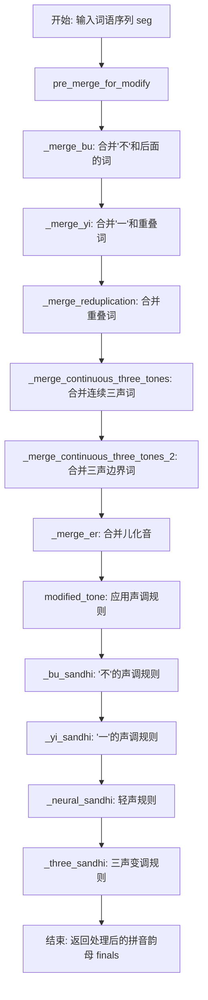
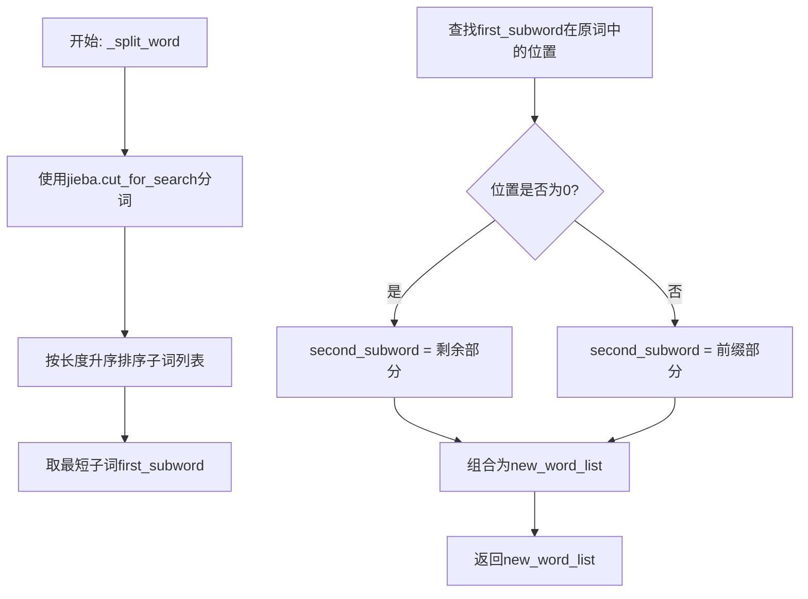
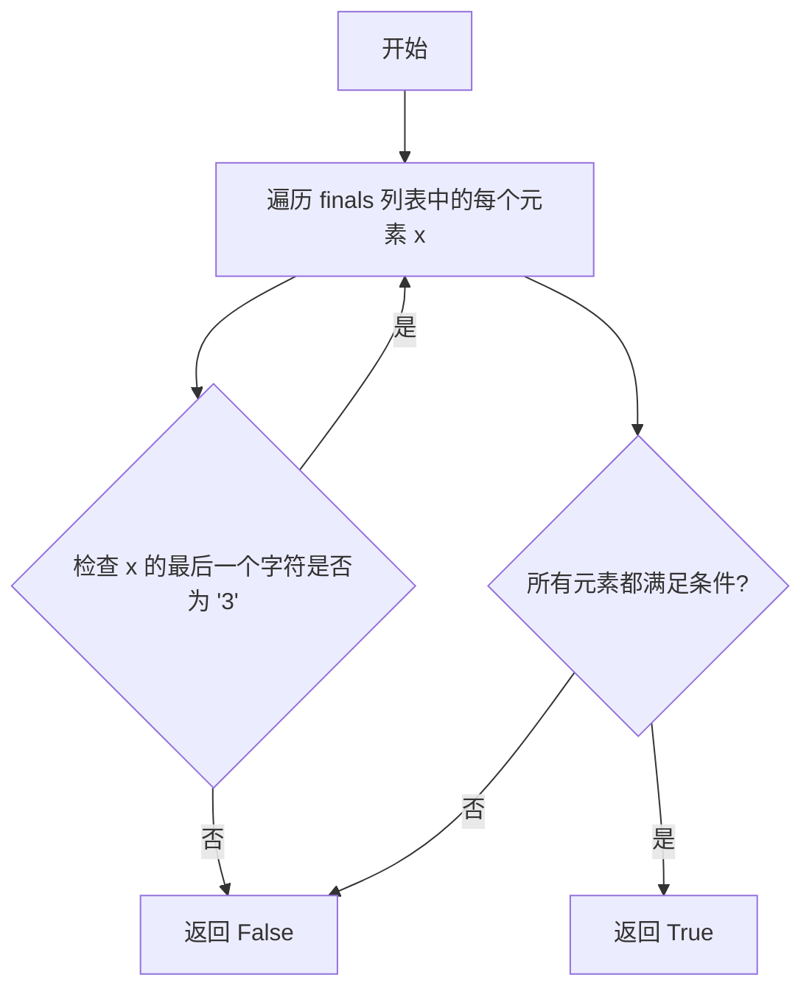
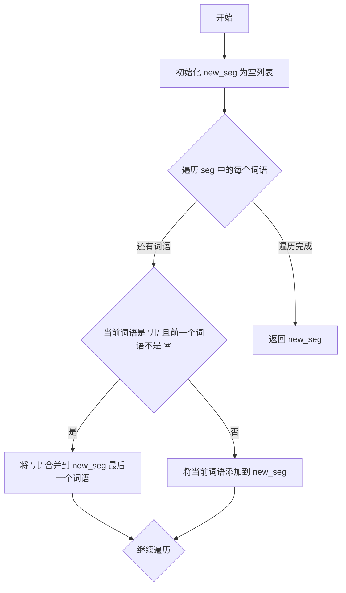
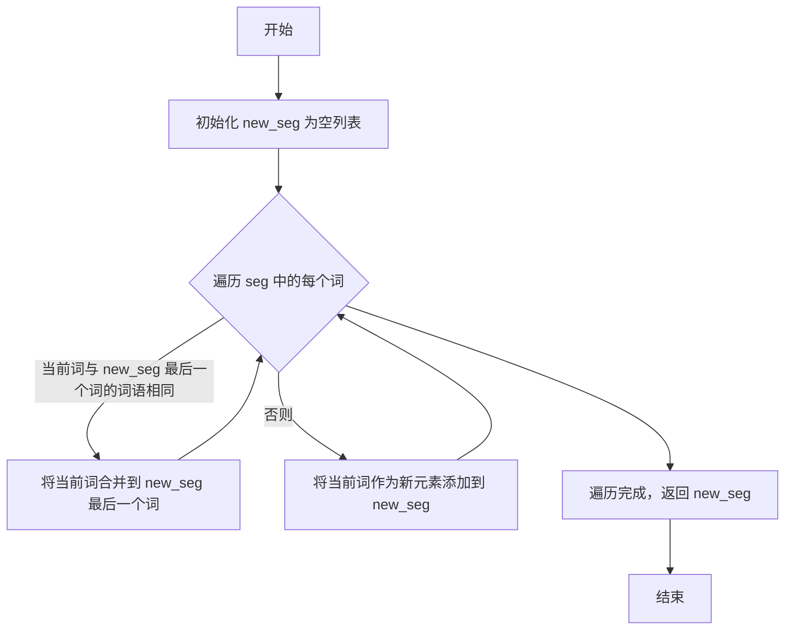
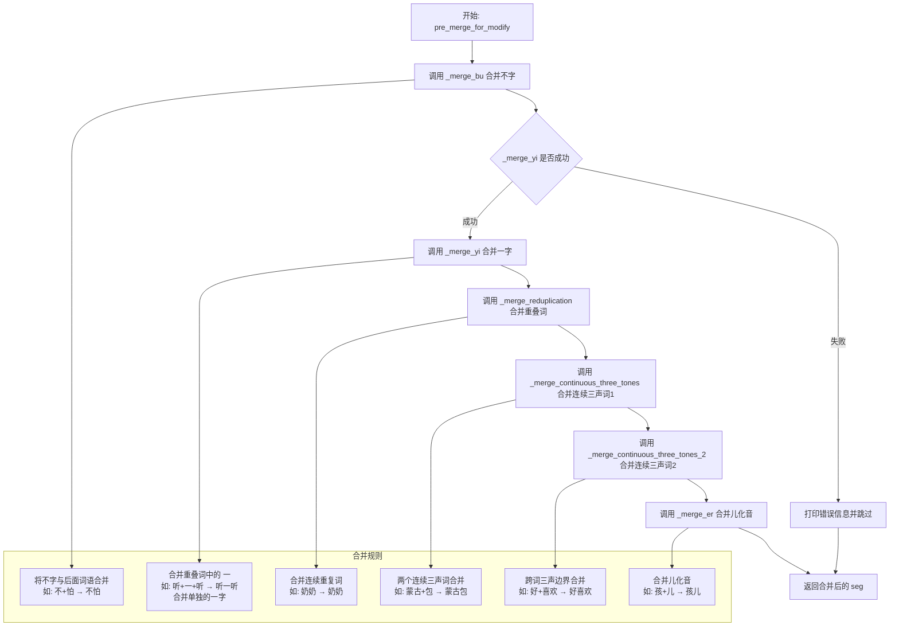
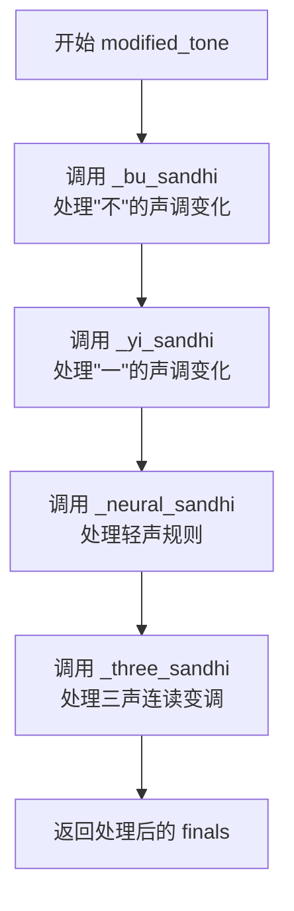
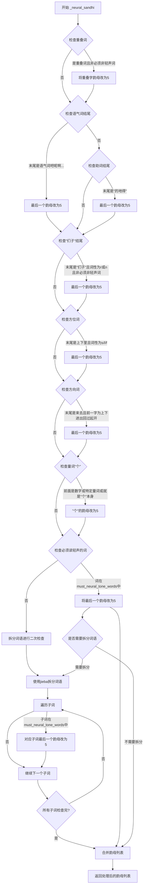

# `Bert-VITS2\oldVersion\V101\text\tone_sandhi.py` 详细设计文档

该代码实现了一个中文声调处理类（ToneSandhi），用于处理中文语音中的各种声调变化现象，包括轻声、儿化音、连续三声变调、不变调'一'和'不'的规则变调等，通过结合jieba分词和pypinyin拼音库来实现对中文文本的声调自动标注和修正。

## 整体流程



## 类结构

```
ToneSandhi (声调处理类)
├── 字段: must_neural_tone_words (必须读轻声的词语集合)
├── 字段: must_not_neural_tone_words (不应读轻声的词语集合)
├── 字段: punc (标点符号集合)
└── 方法: 多个声调处理和词语合并方法
```

## 全局变量及字段


### `ToneSandhi.must_neural_tone_words`
    
必须读轻声的词语集合，包含约400+个常用词，如'麻烦'、'麻利'、'鸳鸯'等

类型：`Dict[str, str]`
    


### `ToneSandhi.must_not_neural_tone_words`
    
不应读轻声的词语集合，如'男子'、'女子'、'分子'、'原子'等

类型：`Dict[str, str]`
    


### `ToneSandhi.punc`
    
中文标点符号集合，用于判断'一'后面是否为标点

类型：`str`
    
    

## 全局函数及方法


### `ToneSandhi._neural_sandhi`

处理轻声规则，根据词性、词语位置和词语属性（是否在轻声词库中）将某些字的声调调整为轻声（5），用于中文分词后的拼音声调调整。

参数：

- `word`：`str`，待处理的词语
- `pos`：`str`，jieba 提供的词性标注（如 "n" 名词，"v" 动词，"s" 方位词等）
- `finals`：`List[str]`，拼音韵母列表，每个元素如 "ia1"、"i3"，末尾数字表示声调

返回值：`List[str]`，处理后的拼音韵母列表，声调可能被调整为轻声（5）

#### 流程图

```mermaid
flowchart TD
    A[输入: word, pos, finals] --> B{检查重叠词<br>word[j] == word[j-1]<br>且词性为n/v/a<br>且不在must_not_neural_tone_words中}
    B -->|是| C[将第j个韵母<br>末尾改为5]
    B -->|否| D{检查语气词结尾<br>word[-1] in 吧呢啊呐...}
    D -->|是| E[将最后韵母<br>末尾改为5]
    D -->|否| F{检查地得结尾<br>word[-1] in 的地得}
    F -->|是| E
    F --> G{检查复数后缀<br>word[-1] in 们子<br>且pos为r/n<br>且不在must_not_neural_tone_words}
    G -->|是| E
    G --> H{检查方位词结尾<br>word[-1] in 上下里<br>且pos为s/l/f}
    H -->|是| E
    H --> I{检查趋向动词<br>word[-1] in 来去<br>且word[-2] in 上下进出回过起开}
    I -->|是| E
    I --> J{检查量词个<br>ge_idx >= 1 且前一字符<br>为数字/几有两半多各整每做是<br>或word等于个}
    J -->|是| K[将ge_idx位置韵母<br>末尾改为5]
    J -->|否| L{检查必读轻声词<br>word在must_neural_tone_words<br>或word[-2:]在其中}
    L -->|是| E
    L -->|否| M[使用jieba分词<br>调用_split_word]
    M --> N{遍历各子词<br>检查是否在<br>must_neural_tone_words}
    N -->|是| O[将对应子词最后<br>韵母改为5]
    N -->|否| P[拼接各子词韵母]
    O --> P
    P --> Q[返回处理后的finals]
```

#### 带注释源码

```python
def _neural_sandhi(self, word: str, pos: str, finals: List[str]) -> List[str]:
    """
    处理轻声规则，根据词性、位置和词语属性调整韵母声调
    
    参数:
        word: 待处理的词语
        pos: 词性标注
        finals: 拼音韵母列表（带声调）
    
    返回:
        处理后的拼音韵母列表
    """
    
    # 处理重叠词（名词、动词、形容词），如奶奶、试试、旺旺
    # 规则：重叠字的第二个字读轻声
    for j, item in enumerate(word):
        if (
            j - 1 >= 0  # 确保不是第一个字符
            and item == word[j - 1]  # 当前字符与前一个字符相同（重叠）
            and pos[0] in {"n", "v", "a"}  # 词性为名词、动词或形容词
            and word not in self.must_not_neural_tone_words  # 不在排除列表中
        ):
            # 将重叠字的声调改为轻声5
            finals[j] = finals[j][:-1] + "5"
    
    # 查找"个"字的位置，用于后续量词判断
    ge_idx = word.find("个")
    
    # 处理语气词结尾：将最后一个字改为轻声
    # 如：吧、呢、啊、呐、噻、嘛、吖、嗨、哦、哒、额、滴、哩、哟、啰、耶、喔、诶
    if len(word) >= 1 and word[-1] in "吧呢啊呐噻嘛吖嗨呐哦哒额滴哩哟喽啰耶喔诶":
        finals[-1] = finals[-1][:-1] + "5"
    # 处理助词"的地得"结尾：将最后一个字改为轻声
    elif len(word) >= 1 and word[-1] in "的地得":
        finals[-1] = finals[-1][:-1] + "5"
    # 处理复数后缀"们、子"：如"我们"、"孩子"
    # 注意：排除某些特定词（如男子、女子等）
    elif (
        len(word) > 1
        and word[-1] in "们子"
        and pos in {"r", "n"}  # 人称代词或名词
        and word not in self.must_not_neural_tone_words
    ):
        finals[-1] = finals[-1][:-1] + "5"
    # 处理方位词后缀：如"桌上"、"地下"、"家里"
    elif len(word) > 1 and word[-1] in "上下里" and pos in {"s", "l", "f"}:
        finals[-1] = finals[-1][:-1] + "5"
    # 处理趋向动词：如"上来"、"下去"、"进来"、"回去"
    elif len(word) > 1 and word[-1] in "来去" and word[-2] in "上下进出回过起开":
        finals[-1] = finals[-1][:-1] + "5"
    # 处理量词"个"：当"个"前面是数字或特定量词时读轻声
    elif (
        ge_idx >= 1
        and (
            word[ge_idx - 1].isnumeric()  # 数字：1个、2个
            or word[ge_idx - 1] in "几有两半多各整每做是"  # 特定量词
        )
    ) or word == "个":
        finals[ge_idx] = finals[ge_idx][:-1] + "5"
    else:
        # 处理必读轻声词库中的词：如"东西"、"意思"、"规矩"等
        if (
            word in self.must_neural_tone_words
            or word[-2:] in self.must_neural_tone_words
        ):
            finals[-1] = finals[-1][:-1] + "5"

    # 使用jieba对词语进行更细粒度的分词处理
    # 因为某些词需要按子词调整声调
    word_list = self._split_word(word)
    finals_list = [finals[: len(word_list[0])], finals[len(word_list[0]) :]]
    
    # 遍历各子词，检查是否在必读轻声词库中
    for i, word in enumerate(word_list):
        # 常规轻声词判断：整个词或最后两个字在词库中
        if (
            word in self.must_neural_tone_words
            or word[-2:] in self.must_neural_tone_words
        ):
            finals_list[i][-1] = finals_list[i][-1][:-1] + "5"
    
    # 合并各子词的韵母列表
    finals = sum(finals_list, [])
    return finals
```


### `ToneSandhi._bu_sandhi`

处理中文"不"字的声调变化规则，根据后续字的声调将"不"调整为二声（当后续字为四声时）或轻声（当"不"位于三字词中间时）。

参数：

- `word`：`str`，待处理的词语
- `finals`：`List[str]`，词语对应的拼音韵母列表

返回值：`List[str]`，经过声调变化处理后的拼音韵母列表

#### 流程图

```mermaid
flowchart TD
    A[开始 _bu_sandhi] --> B{word长度为3且第二个字符是'不'?}
    B -->|是| C[将 finals[1] 改为轻声 '5']
    B -->|否| D[遍历 word 中的每个字符]
    D --> E{当前字符是'不'且下一个字符存在?}
    E -->|否| H{还有下一个字符?}
    E -->|是| F{下一个字符韵母是四声 '4'?}
    F -->|否| H
    F -->|是| G[将当前'不'的韵母改为二声 '2']
    G --> H{还有下一个字符?}
    H -->|是| D
    H -->|否| I[返回处理后的 finals]
    C --> I
```

#### 带注释源码

```python
def _bu_sandhi(self, word: str, finals: List[str]) -> List[str]:
    """
    处理"不"字的声调变化规则
    
    规则1: 当"不"位于三字词中间时(如"看不懂")，"不"读轻声
    规则2: 当"不"后面接四声字时(如"不怕")，"不"读二声
    """
    # 处理三字词中间"不"变轻声的情况
    # e.g. 看不懂
    if len(word) == 3 and word[1] == "不":
        # 将"不"的韵母改为轻声(5)
        finals[1] = finals[1][:-1] + "5"
    else:
        # 遍历词语中的每个字符
        for i, char in enumerate(word):
            # "不" before tone4 should be bu2, e.g. 不怕
            # 判断规则：当前字符是"不"且后面有字符，且后面字符是四声
            if char == "不" and i + 1 < len(word) and finals[i + 1][-1] == "4":
                # 将"不"的声调改为二声
                finals[i] = finals[i][:-1] + "2"
    return finals
```


### `ToneSandhi._yi_sandhi`

该函数用于处理中文声调变化中"一"字的变调规则，根据"一"字在词语中的位置和后续音节的声调确定其实际读音（一声、二声、四声或轻声）。

参数：

- `word`：`str`，待处理的汉字词语
- `finals`：`List[str]`，对应汉字的拼音韵母列表（带声调标记，如"yi1"）

返回值：`List[str]`，处理变调后的拼音韵母列表

#### 流程图

```mermaid
flowchart TD
    A[开始 _yi_sandhi] --> B{word中是否包含"一"且其他字符全是数字}
    B -->|是| C[直接返回原finals]
    B -->|否| D{word长度为3且"一"在中间<br/>且首尾字符相同}
    D -->|是| E[将"一"变为轻声5声]
    D -->|否| F{word以"第一"开头}
    F -->|是| G[将"一"变为一声音1]
    F -->|否| H{遍历word中的每个"一"}
    H --> I{找到"一"字且i+1<len}
    I -->|否| J[返回finals]
    I -->|是| K{后续音节声调为4}
    K -->|是| L[将"一"变为二声2]
    K -->|否| M{后续字符是否为标点}
    M -->|是| L
    M -->|否| N[将"一"变为四声4]
    L --> H
    N --> H
    J --> O[结束]
```

#### 带注释源码

```python
def _yi_sandhi(self, word: str, finals: List[str]) -> List[str]:
    """
    处理"一"字的声调变化规则
    
    规则说明：
    1. "一"在数字序列中保持原声调（如：一零零、二一零）
    2. "一"在重叠词中间读轻声（如：看一看）
    3. "一"作为序数词时读一声（如：第一）
    4. "一"在四声前读二声（如：一段、不怕）
    5. "一"在其他声调前读四声（如：一天、一般）
    6. "一"后接标点符号时仍读一声
    """
    
    # 规则1："一"在数字序列中，直接返回原finals，不变调
    # 例如：一零零、二一零等
    if word.find("一") != -1 and all(
        [item.isnumeric() for item in word if item != "一"]
    ):
        return finals
    
    # 规则2："一"在重叠词中间，读轻声5
    # 例如：看一听 -> 看看一看（"一"变5声）
    elif len(word) == 3 and word[1] == "一" and word[0] == word[-1]:
        finals[1] = finals[1][:-1] + "5"
    
    # 规则3："一"作为序数词前缀，读一声
    # 例如：第一、第十
    elif word.startswith("第一"):
        finals[1] = finals[1][:-1] + "1"
    
    # 规则4和5：根据后续音节的声调进行变调
    else:
        for i, char in enumerate(word):
            if char == "一" and i + 1 < len(word):
                # "一"在四声（声调4）前读二声
                # 例如：一段、一怕、一去
                if finals[i + 1][-1] == "4":
                    finals[i] = finals[i][:-1] + "2"
                # "一"在非四声前读四声
                else:
                    # "一"后面如果是标点，还读一声
                    # 例如：一一二（逗号前的一）
                    if word[i + 1] not in self.punc:
                        finals[i] = finals[i][:-1] + "4"
    
    return finals
```


### `_split_word`

该方法使用jieba分词库的搜索模式将输入的词语分割为两个子词，通过按长度排序找到最短子词，然后根据该子词在原词中的位置将其分割为前后两部分返回。

参数：

- `word`：`str`，需要分割的中文词语

返回值：`List[str]`，包含两个子词的列表

#### 流程图



#### 带注释源码

```python
def _split_word(self, word: str) -> List[str]:
    """
    将词语分割为两个子词
    
    使用jieba的搜索模式进行分词，然后按长度排序，
    找到最短的子词后，根据其位置将原词分割为两部分。
    
    Args:
        word: 需要分割的中文词语
        
    Returns:
        包含两个子词的列表
    """
    # 使用jieba的搜索模式进行分词，返回所有可能的分词结果
    word_list = jieba.cut_for_search(word)
    
    # 按子词长度升序排序，确保最短的子词排在前面
    word_list = sorted(word_list, key=lambda i: len(i), reverse=False)
    
    # 获取最短的子词作为第一个分词结果
    first_subword = word_list[0]
    
    # 查找该子词在原词中的起始位置
    first_begin_idx = word.find(first_subword)
    
    # 根据子词位置判断分割方式
    if first_begin_idx == 0:
        # 子词在开头，剩余部分为第二个子词
        second_subword = word[len(first_subword):]
        new_word_list = [first_subword, second_subword]
    else:
        # 子词在中间或结尾，前缀部分为第一个子词
        second_subword = word[:-len(first_subword)]
        new_word_list = [second_subword, first_subword]
    
    return new_word_list
```


### `ToneSandhi._three_sandhi`

该方法处理汉语普通话语流中的三声连读变调规则。当两个或三个三声音节相连时，前一个或两个三声音节需要变为二声，这是中文语音合成中的重要变调规则。

参数：

- `word`：`str`，需要处理变调的词语
- `finals`：`List[str]`，词语对应的拼音韵母列表（带声调标记，如 "a3", "i3"）

返回值：`List[str]`，处理变调后的拼音韵母列表

#### 流程图

```mermaid
flowchart TD
    A[开始: _three_sandhi] --> B{word长度 == 2?}
    B -->|是| C{所有finals都是三声?}
    C -->|是| D[将finals[0]的声调改为二声]
    D --> Z[返回处理后的finals]
    C -->|否| Z
    B -->|否| E{word长度 == 3?}
    E -->|是| F[使用_split_word分割词语]
    F --> G{所有finals都是三声?}
    G -->|是| H{第一个子词长度 == 2?}
    H -->|是| I[将finals[0]和finals[1]都改为二声]
    I --> Z
    H -->|否| J[将finals[1]改为二声]
    J --> Z
    G -->|否| K[按子词分割finals_list]
    K --> L{子词长度为2且全是三声?}
    L -->|是| M[将该子词第一个韵母改为二声]
    M --> N[合并并返回finals]
    L -->|否| O{是第二个子词且不全是三声<br/>但首尾都是三声?}
    O -->|是| P[将第一子词最后一音改为二声]
    P --> N
    O -->|否| N
    E -->|否| Q{word长度 == 4?}
    Q -->|是| R[将finals分成两组: 前2和后2]
    R --> S{该组全是三声?}
    S -->|是| T[将该组第一个韵母改为二声]
    T --> U{还有下一组?}
    U -->|是| R
    U -->|否| Z
    S -->|否| V[直接添加该组到结果]
    V --> U
    Q -->|否| Z
```

#### 带注释源码

```python
def _three_sandhi(self, word: str, finals: List[str]) -> List[str]:
    """
    处理三声连读变调规则
    当两个或三个三声音节连读时，前一个变为二声
    
    例如：
    - "蒙古" (两个三声) -> "蒙古" (二声+三声)
    - "蒙古包" (三个三声) -> "蒙古包" (二声+二声+三声)
    """
    
    # 情况1: 词语长度为2，且两个音节都是三声
    # 例如: "苗条" -> "秒条"
    if len(word) == 2 and self._all_tone_three(finals):
        finals[0] = finals[0][:-1] + "2"
    
    # 情况2: 词语长度为3（三个三声音节连读）
    elif len(word) == 3:
        word_list = self._split_word(word)  # 使用jieba分词分割词语
        
        if self._all_tone_three(finals):
            # 情况2a: 所有音节都是三声
            # 双音节 + 单音节 结构，例如 "蒙古/包"
            if len(word_list[0]) == 2:
                finals[0] = finals[0][:-1] + "2"
                finals[1] = finals[1][:-1] + "2"
            # 单音节 + 双音节 结构，例如 "纸/老虎"
            elif len(word_list[0]) == 1:
                finals[1] = finals[1][:-1] + "2"
        else:
            # 情况2b: 部分三声情况
            # 按子词分别处理
            finals_list = [finals[: len(word_list[0])], finals[len(word_list[0]) :]]
            
            if len(finals_list) == 2:
                for i, sub in enumerate(finals_list):
                    # 子词内部两个都是三声，例如 "所有/人"
                    if self._all_tone_three(sub) and len(sub) == 2:
                        finals_list[i][0] = finals_list[i][0][:-1] + "2"
                    # 跨子词的三声连读，例如 "好/喜欢"
                    # 条件：第二子词不是全三声，但第一子词末音和第二子词首音都是三声
                    elif (
                        i == 1
                        and not self._all_tone_three(sub)
                        and finals_list[i][0][-1] == "3"
                        and finals_list[0][-1][-1] == "3"
                    ):
                        finals_list[0][-1] = finals_list[0][-1][:-1] + "2"
                    
                    # 合并子词结果
                    finals = sum(finals_list, [])
    
    # 情况3: 词语长度为4（成语或双音节词）
    # 将成语分成两个双音节词分别处理
    elif len(word) == 4:
        finals_list = [finals[:2], finals[2:]]  # 分成前后各两个韵母
        finals = []
        
        for sub in finals_list:
            # 如果该双音节词全是三声，将第一个音节变为二声
            if self._all_tone_three(sub):
                sub[0] = sub[0][:-1] + "2"
            finals += sub

    return finals


def _all_tone_three(self, finals: List[str]) -> bool:
    """
    检查韵母列表是否全部为三声
    通过检查每个韵母的最后一个字符是否为 "3" 来判断
    """
    return all(x[-1] == "3" for x in finals)
```


### `ToneSandhi._all_tone_three`

该函数用于判断给定的韵母列表（finals）中的所有韵母是否全部为三声。在汉语拼音中，声调通常用数字表示，其中"3"代表第三声（上声）。该函数是三声连读变调规则（three-sandhi）处理中的核心辅助函数，用于判断是否需要对汉字拼音进行变调处理。

参数：

- `finals`：`List[str]`，韵母列表，每个韵母字符串的最后一个字符表示声调（例如 "a3" 表示第三声）

返回值：`bool`，如果列表中所有韵母的最后一个字符都是 "3"（即全部为三声），则返回 `True`；否则返回 `False`

#### 流程图



#### 带注释源码

```python
def _all_tone_three(self, finals: List[str]) -> bool:
    """
    判断韵母列表是否全部为三声
    
    参数:
        finals: List[str] - 韵母列表，每个韵母字符串的最后一个字符表示声调
                例如: ['a3', 'i3'] 表示两个三声音节
    
    返回值:
        bool - 如果所有韵母都是三声返回 True，否则返回 False
    """
    # 使用 all() 函数检查列表中的每个元素
    # x[-1] 获取每个韵母字符串的最后一个字符（声调标记）
    # 如果所有最后一个字符都等于 "3"，则返回 True
    return all(x[-1] == "3" for x in finals)
```


### `_merge_bu`

该函数用于合并"不"与相邻词语，避免分词错误导致声调处理错误。由于jieba分词可能将"不"单独切分出来，这会导致后续声调处理（三声连读等）出现错误，因此需要将"不"与前后的词语合并后再进行声调处理。

参数：

- `seg`：`List[Tuple[str, str]]`，分词后的词语列表，每个元素为(词语, 词性)的元组

返回值：`List[Tuple[str, str]]`，合并"不"之后的词语列表

#### 流程图

```mermaid
flowchart TD
    A[开始] --> B[初始化 new_seg 为空列表<br/>last_word 为空字符串]
    B --> C{遍历 seg 中的 word, pos}
    C --> D{last_word == "不"?}
    D -->|是| E[word = last_word + word<br/>合并"不"与当前词]
    D -->|否| F{word != "不"?}
    E --> F
    F -->|是| G[将 (word, pos) 添加到 new_seg]
    F -->|否| H[不添加]
    G --> I[last_word = word]
    H --> I
    C --> J{遍历结束?}
    J -->|否| C
    J -->|是| K{last_word == "不"?}
    K -->|是| L[将 (last_word, 'd') 添加到 new_seg<br/>将"不"作为副词处理]
    K -->|否| M[返回 new_seg]
    L --> M
```

#### 带注释源码

```python
# merge "不" and the word behind it
# if don't merge, "不" sometimes appears alone according to jieba, which may occur sandhi error
def _merge_bu(self, seg: List[Tuple[str, str]]) -> List[Tuple[str, str]]:
    """
    合并"不"与相邻词语，避免分词错误导致声调处理错误
    
    由于jieba分词可能将"不"单独切分出来，这会导致后续声调处理
    （三声连读等）出现错误，因此需要将"不"与前后的词语合并后再
    进行声调处理
    
    参数:
        seg: 分词后的词语列表，每个元素为(词语, 词性)的元组
    
    返回值:
        合并"不"之后的词语列表
    """
    new_seg = []      # 存储合并后的词语列表
    last_word = ""   # 记录上一个处理的词语
    
    # 遍历分词结果
    for word, pos in seg:
        # 如果上一个词是"不"，则将"不"与当前词合并
        if last_word == "不":
            word = last_word + word
        
        # 如果当前词不是"不"，则添加到结果中
        # （过滤掉单独出现的"不"，因为已经合并到前面的词中）
        if word != "不":
            new_seg.append((word, pos))
        
        # 更新 last_word 为当前词，用于下一次迭代判断
        last_word = word[:]
    
    # 处理末尾剩余的"不"（如果最后一个词是"不"，需要特殊处理）
    if last_word == "不":
        # 将末尾的"不"作为副词"d"添加到最后
        new_seg.append((last_word, "d"))
        last_word = ""
    
    return new_seg
```


### `_merge_yi`

该函数用于合并中文文本分词结果中的"一"与重叠词或相邻词语，实现两个功能：1）将"一"插入到重叠动词之间形成"A一A"形式（如"听一听"）；2）将单独的"一"与前后的词语合并为连续词组。这是为后续中文声调自动转换（tone sandhi）做准备，防止"一"单独出现导致变调错误。

参数：

- `seg`：`List[Tuple[str, str]]`，输入的分词列表，每个元素为(词语, 词性)元组

返回值：`List[Tuple[str, str]]`，合并后的分词列表

#### 流程图

```mermaid
flowchart TD
    A[开始: 接收 seg] --> B[初始化 new_seg 空列表]
    B --> C{遍历 seg 中的每个词}
    
    C -->|是重叠词模式| D[i-1>=0 且 word='一' 且 i+1<len 且 seg[i-1]==seg[i+1] 且词性为v]
    D -->|满足| E[合并为 A一A 格式<br/>new_seg[i-1][0] = new_seg[i-1][0] + '一' + new_seg[i-1][0]]
    D -->|不满足| F{检查是否需跳过}
    
    F -->|是跳过模式| G[i-2>=0 且 seg[i-1]='一' 且 seg[i-2]=word 且 pos='v']
    G -->|满足| H[continue 跳过当前词]
    G -->|不满足| I[new_seg.append([word, pos])]
    
    E --> C
    I --> C
    
    C -->|遍历完成| J[seg = new_seg]
    J --> K[new_seg = []]
    K --> L{再次遍历 seg}
    
    L -->|前一词为'一'| M[new_seg[-1][0] += word]
    L -->|否则| N[new_seg.append([word, pos])]
    
    M --> L
    N --> L
    
    L -->|遍历完成| O[返回 new_seg]
```

#### 带注释源码

```python
def _merge_yi(self, seg: List[Tuple[str, str]]) -> List[Tuple[str, str]]:
    """
    合并"一"与重叠词或相邻词语
    
    功能1: 将"一"插入到重叠动词之间，形成"A一A"形式（如"听"+"一"+"听" -> "听一听"）
    功能2: 将单独的"一"与后面的词语合并（如"一"+"听" -> "一听"）
    
    这样做是为了避免"一"单独出现导致声调转换错误
    """
    new_seg = []
    
    # ========== 功能1: 处理重叠词模式 ==========
    # 遍历每个词语，检查是否满足"v 一 v"模式（v代表动词）
    # 例如: ('听', 'v'), ('一', 'm'), ('听', 'v') -> '听一听'
    for i, (word, pos) in enumerate(seg):
        # 判断条件：
        # 1. i-1 >= 0: 不是第一个词
        # 2. word == "一": 当前词是"一"
        # 3. i+1 < len(seg): 后面还有词
        # 4. seg[i-1][0] == seg[i+1][0]: 前后词相同（重叠词）
        # 5. seg[i-1][1] == "v": 前一个词是动词
        if (
            i - 1 >= 0
            and word == "一"
            and i + 1 < len(seg)
            and seg[i - 1][0] == seg[i + 1][0]
            and seg[i - 1][1] == "v"
        ):
            # 将重叠词合并为 "A一A" 格式
            # 例如: new_seg[i-1][0] = "听" -> "听一听"
            new_seg[i - 1][0] = new_seg[i - 1][0] + "一" + new_seg[i - 1][0]
        else:
            # 检查是否需要跳过当前词（已在前面合并过）
            # 这是处理 "听一" 的另一种情况
            if (
                i - 2 >= 0
                and seg[i - 1][0] == "一"
                and seg[i - 2][0] == word
                and pos == "v"
            ):
                # 跳过已处理的词
                continue
            else:
                # 正常添加词到结果列表
                new_seg.append([word, pos])
    
    # 更新 seg 为处理后的结果，准备进行功能2
    seg = new_seg
    new_seg = []
    
    # ========== 功能2: 合并单独的"一"与后续词语 ==========
    # 例如: ['听', '一', '看'] -> ['听一看']
    for i, (word, pos) in enumerate(seg):
        if new_seg and new_seg[-1][0] == "一":
            # 如果前一个词是"一"，则将当前词合并进去
            new_seg[-1][0] = new_seg[-1][0] + word
        else:
            # 否则正常添加
            new_seg.append([word, pos])
    
    return new_seg
```


### `_merge_continuous_three_tones`

该函数是 `ToneSandhi` 类中的一个方法，用于合并连续的三声音节。在中文语音合成中，连续的三声音节需要根据语流音变规则进行合并处理，以生成更自然的语音输出。该方法通过检测分词结果中相邻词的三声调模式，在满足特定条件时将两个词合并为一个词。

参数：

- `self`：`ToneSandhi` 类实例本身，包含必要的词库和辅助方法
- `seg`：`List[Tuple[str, str]]`，分词后的结果列表，每个元素为词和词性标注的元组

返回值：`List[Tuple[str, str]]`，合并连续三声音节后的新分词列表

#### 流程图

```mermaid
flowchart TD
    A[开始] --> B[初始化new_seg空列表]
    B --> C[使用lazy_pinyin获取每个词的finals]
    C --> D[初始化merge_last标记数组]
    D --> E{遍历seg中的每个词}
    E -->|i=0| F[直接添加到new_seg]
    F --> G{是否还有下一个词}
    G -->|是| E
    G -->|否| H[返回new_seg]
    
    E -->|i>0| I{判断条件}
    I --> J{前一个词是三声?}
    I --> K{当前词是三声?}
    I --> L{前一个词未被合并?}
    I --> M{前一个词不是重叠词?}
    I --> N{两词总长度≤3?}
    
    J -->|是| O[满足三声条件]
    K -->|是| O
    L -->|否| P[不满足合并条件]
    O --> M
    M -->|是| Q[合并两个词到new_seg末尾]
    M -->|否| P
    N -->|是| Q
    N -->|否| P
    P --> R[将当前词作为新元素添加到new_seg]
    Q --> S[标记merge_last[i]为True]
    S --> G
    
    H --> T[结束]
```

#### 带注释源码

```python
def _merge_continuous_three_tones(
    self, seg: List[Tuple[str, str]]
) -> List[Tuple[str, str]]:
    """
    合并连续的三声音节
    如果相邻的两个词都是三声调，且满足特定条件，则将它们合并为一个词
    这符合中文语流音变规则：两个第三声连读时，第一个变第二声
    
    参数:
        seg: 分词后的列表，每个元素是(word, pos)元组
             例如: [('你好', 'v'), ('北京', 'ns')]
    
    返回:
        合并后的新分词列表
    """
    new_seg = []
    
    # 为seg中的每个词获取其拼音韵母（带声调）
    # Style.FINALS_TONE3表示返回带三声的韵母格式
    # neutral_tone_with_five=True表示轻声用5表示
    sub_finals_list = [
        lazy_pinyin(word, neutral_tone_with_five=True, style=Style.FINALS_TONE3)
        for (word, pos) in seg
    ]
    
    # 断言验证：韵母列表长度应与分词列表长度一致
    assert len(sub_finals_list) == len(seg)
    
    # 记录每个位置的词是否已被合并（避免重复合并）
    merge_last = [False] * len(seg)
    
    # 遍历分词列表
    for i, (word, pos) in enumerate(seg):
        # 检查是否满足合并条件：
        # 1. 不是第一个词(i-1 >= 0)
        # 2. 前一个词全是三声
        # 3. 当前词全是三声
        # 4. 前一个词未被合并过
        if (
            i - 1 >= 0
            and self._all_tone_three(sub_finals_list[i - 1])
            and self._all_tone_three(sub_finals_list[i])
            and not merge_last[i - 1]
        ):
            # 如果最后一个词是重叠词（如"奶奶"），不合并
            # 因为重叠词需要进行_neural_sandhi处理
            if (
                not self._is_reduplication(seg[i - 1][0])
                and len(seg[i - 1][0]) + len(seg[i][0]) <= 3
            ):
                # 将当前词合并到前一个词的末尾
                new_seg[-1][0] = new_seg[-1][0] + seg[i][0]
                merge_last[i] = True
            else:
                # 不满足合并条件，作为新元素添加
                new_seg.append([word, pos])
        else:
            # 不满足合并条件，作为新元素添加
            new_seg.append([word, pos])

    return new_seg
```


### `ToneSandhi._merge_continuous_three_tones_2`

该函数用于合并三声边界情况的词语。具体来说，当上一个词的最后一个字和当前词的第一个字都是三声（第三声）时，将这两个词合并为一个词。这是汉语声调变调处理的一部分，用于处理"连上变"的规则。

参数：

- `seg`：`List[Tuple[str, str]]`，分词后的词语列表，每个元素为词语和词性组成的元组

返回值：`List[Tuple[str, str]]`，合并连续三声后的词语列表

#### 流程图

```mermaid
flowchart TD
    A[开始] --> B[初始化new_seg为空列表]
    B --> C[为seg中每个词语获取拼音韵母finals]
    C --> D[初始化merge_last标记数组, 长度为seg长度]
    D --> E[遍历seg中的每个词语, i从0到len-1]
    
    E --> F{检查条件: i > 0 且<br/>上一个词的最后一个韵母以'3'结尾 且<br/>当前词的第一个韵母以'3'结尾 且<br/>上一个词未被合并}
    F -->|是| G{检查条件: 上一个词不是叠词 且<br/>两个词长度之和 <= 3}
    F -->|否| I[将当前词添加到new_seg]
    G -->|是| H[将当前词合并到上一个词末尾<br/>标记merge_last[i] = True]
    G -->|否| I
    
    H --> J[继续遍历下一个词]
    I --> J
    
    J --> K{是否还有未遍历的词}
    K -->|是| E
    K -->|否| L[返回new_seg]
```

#### 带注释源码

```python
def _merge_continuous_three_tones_2(
    self, seg: List[Tuple[str, str]]
) -> List[Tuple[str, str]]:
    """
    合并三声边界情况的词语
    当上一个词的最后一个字和当前词的第一个字都是三声时，合并这两个词
    
    参数:
        seg: 分词后的词语列表, 每个元素为(词语, 词性)元组
    
    返回:
        合并后的词语列表
    """
    new_seg = []
    # 为每个词语获取拼音韵母, 使用FINALS_TONE3风格(保留声调)
    sub_finals_list = [
        lazy_pinyin(word, neutral_tone_with_five=True, style=Style.FINALS_TONE3)
        for (word, pos) in seg
    ]
    # 断言确保韵母数量与词语数量一致
    assert len(sub_finals_list) == len(seg)
    # 标记数组, 记录哪些词已被合并(避免重复合并)
    merge_last = [False] * len(seg)
    
    # 遍历每个词语
    for i, (word, pos) in enumerate(seg):
        if (
            i - 1 >= 0  # 不是第一个词
            and sub_finals_list[i - 1][-1][-1] == "3"  # 上一个词的最后一个韵母是三声
            and sub_finals_list[i][0][-1] == "3"  # 当前词的第一个韵母是三声
            and not merge_last[i - 1]  # 上一个词未被合并过
        ):
            # 检查是否可以合并:
            # 1. 上一个词不是叠词(如"奶奶"),因为叠词需要做_neural_sandhi处理
            # 2. 两个词的总长度不超过3个字符
            if (
                not self._is_reduplication(seg[i - 1][0])
                and len(seg[i - 1][0]) + len(seg[i][0]) <= 3
            ):
                # 合并:将当前词合并到上一个词末尾
                new_seg[-1][0] = new_seg[-1][0] + seg[i][0]
                merge_last[i] = True  # 标记当前词已被合并
            else:
                # 条件不满足,不能合并
                new_seg.append([word, pos])
        else:
            new_seg.append([word, pos])

    return new_seg
```


### `ToneSandhi._merge_er`

合并儿化音词语，将"儿"字与前一个词语连接起来形成儿化音词汇。该方法主要用于处理中文儿化音的合并，确保儿化音词语作为一个整体进行后续的声调处理。

参数：

- `seg`：`List[Tuple[str, str]]`，分词后的词语列表，每个元素为包含词语和词性的元组

返回值：`List[Tuple[str, str]]`，合并儿化音后的词语列表

#### 流程图



#### 带注释源码

```python
def _merge_er(self, seg: List[Tuple[str, str]]) -> List[Tuple[str, str]]:
    """
    合并儿化音词语
    
    该方法遍历分词结果，当发现"儿"字且前一个词语不是"#"
    （#通常表示空或边界）时，将"儿"合并到前一个词语后面，
    形成儿化音词汇。例如："小孩" + "儿" -> "小孩儿"
    
    参数:
        seg: 分词后的词语列表，每个元素为(词语, 词性)元组
    
    返回:
        合并儿化音后的词语列表
    """
    new_seg = []  # 初始化结果列表
    for i, (word, pos) in enumerate(seg):  # 遍历每个词语
        # 判断条件：
        # 1. i - 1 >= 0：不是第一个词语（有前一个词语）
        # 2. word == "儿"：当前词语是"儿"
        # 3. seg[i - 1][0] != "#"：前一个词语不是"#"（#通常表示边界或空）
        if i - 1 >= 0 and word == "儿" and seg[i - 1][0] != "#":
            # 将"儿"合并到前一个词语后面
            new_seg[-1][0] = new_seg[-1][0] + seg[i][0]
        else:
            # 否则保持原样，添加到结果列表
            new_seg.append([word, pos])
    return new_seg  # 返回合并后的结果
```


### `ToneSandhi._merge_reduplication`

合并分词结果中的连续重复词（叠词），将相邻的相同词语合并为一个词语。

参数：

- `self`：`ToneSandhi` 类实例，当前对象
- `seg`：`List[Tuple[str, str]]`，分词后的词列表，每个元素为(词语, 词性标注)元组

返回值：`List[Tuple[str, str]]`，合并重复词后的新词列表

#### 流程图



#### 带注释源码

```python
def _merge_reduplication(self, seg: List[Tuple[str, str]]) -> List[Tuple[str, str]]:
    """
    合并分词结果中的连续重复词（叠词）
    例如：['看', '看'] -> ['看看']
    
    参数:
        seg: 分词后的词列表，元素为(词语, 词性)元组
    
    返回:
        合并重复词后的新词列表
    """
    # 用于存储合并后的结果
    new_seg = []
    
    # 遍历输入的每个词
    for i, (word, pos) in enumerate(seg):
        # 如果 new_seg 不为空，且当前词与 new_seg 最后一个词的词语相同
        if new_seg and word == new_seg[-1][0]:
            # 将当前词合并到 new_seg 最后一个词（组成叠词）
            new_seg[-1][0] = new_seg[-1][0] + seg[i][0]
        else:
            # 否则，将当前词作为新元素添加到 new_seg
            new_seg.append([word, pos])
    
    # 返回合并后的结果
    return new_seg
```


### ToneSandhi.pre_merge_for_modify

该方法是 `ToneSandhi` 类的核心预处理方法，在语音合成前的分词处理阶段，依次执行各类词语合并操作（包括"不"字合并、"一"字合并、重叠词合并、连续三声合并、儿化音合并等），以减少后续声调处理时的错误。

参数：

- `seg`：`List[Tuple[str, str]]`，分词后的词列表，每个元素为(词语, 词性)的元组，如 [('听', 'v'), ('一', 'm'), ('听', 'v')]

返回值：`List[Tuple[str, str]]`，合并处理后的词列表

#### 流程图



#### 带注释源码

```python
def pre_merge_for_modify(self, seg: List[Tuple[str, str]]) -> List[Tuple[str, str]]:
    """
    预处理阶段：依次执行各类词语合并操作
    
    合并顺序：
    1. _merge_bu: 合并"不"和后面的词，避免"不"单独出现导致声调错误
    2. _merge_yi: 合并"一"和重叠词/后面的词
    3. _merge_reduplication: 合并连续重复的词（如奶奶）
    4. _merge_continuous_three_tones: 合并两个连续三声词
    5. _merge_continuous_three_tones_2: 合并跨词边界的三声组合
    6. _merge_er: 合并儿化音
    
    参数:
        seg: 分词后的词列表，每个元素为(词语, 词性)元组
             例如: [('听', 'v'), ('一', 'm'), ('听', 'v')]
    
    返回:
        合并处理后的词列表
    """
    # 步骤1: 合并"不"字
    # 例如：['不', '怕'] → ['不怕']
    # 原因："不"单独出现时可能产生声调错误
    seg = self._merge_bu(seg)
    
    # 步骤2: 合并"一"字（包含两种情况）
    # 情况1: 重叠词中的"一"，如"听一听"
    # 情况2: 单独"一"和后面词语合并，如"一个"
    # 使用try-except处理可能的异常
    try:
        seg = self._merge_yi(seg)
    except:
        print("_merge_yi failed")
    
    # 步骤3: 合并连续重复词
    # 例如：['奶', '奶'] → ['奶奶']
    # 用于处理分词后重叠词被拆分的情况
    seg = self._merge_reduplication(seg)
    
    # 步骤4: 合并连续三声词（整体判断）
    # 例如：两个连续三声词总长度≤3时合并
    # 如"蒙古"(mēng gǔ) + "包" → "蒙古包"
    seg = self._merge_continuous_three_tones(seg)
    
    # 步骤5: 合并连续三声词（跨词边界判断）
    # 检查前一个词的最后一个字和后一个词的第一个字
    # 例如："好"(hǎo) + "喜欢"(xǐ huan) → "好喜欢"
    seg = self._merge_continuous_three_tones_2(seg)
    
    # 步骤6: 合并儿化音
    # 例如：['孩', '儿'] → ['孩儿']
    seg = self._merge_er(seg)
    
    # 返回合并处理后的结果
    return seg
```


### `modified_tone`

该函数是声调处理的主入口函数，按固定顺序依次应用"不"声调规则、"一"声调规则、轻声规则和三声连读变调规则，对输入的词语韵母进行逐层处理和转换，最终输出符合汉语声调规律的拼音韵母列表。

参数：

- `word`：`str`，待处理的词语
- `pos`：`str`，词语的词性标注（来自 jieba 分词）
- `finals`：`List[str]`，词语的原始韵母列表（带声调数字，如 ['ia1', 'i3']）

返回值：`List[str]`：处理后的韵母列表（声调可能发生改变）

#### 流程图



#### 带注释源码

```python
def modified_tone(self, word: str, pos: str, finals: List[str]) -> List[str]:
    """
    主处理函数：按顺序应用各类声调规则
    
    处理顺序：
    1. 不的声调变化（如：不怕->bù pà，不变调为bù）
    2. 一的声调变化（如：一年->yì nián，一旦->yí dàn）
    3. 轻声规则（如：石头、窗户等读轻声）
    4. 三声连读变调（如：蒙古->méng gǔ）
    
    Args:
        word: 待处理的词语
        pos: 词语的词性标注（来自jieba）
        finals: 原始韵母列表，如 ['ia1', 'i3']
    
    Returns:
        处理后的韵母列表
    """
    # 第一步：处理"不"的声调变化
    # - 看不懂：不被动变为轻声
    # - 不怕：不+去声变成阳平
    finals = self._bu_sandhi(word, finals)
    
    # 第二步：处理"一"的声调变化
    # - 一段：一+去声变成阳平
    # - 一天：一+非去声变成去声
    # - 看一看：一在重叠词中变成轻声
    # - 第一：一作为序数词读阴平
    finals = self._yi_sandhi(word, finals)
    
    # 第三步：处理轻声规则
    # - 词典中的轻声词（如：石头、窗户）
    # - 叠词（如：奶奶、试试）
    # - 助词（如：了、着过、的）
    # - 方位词（如：上、下、里）
    finals = self._neural_sandhi(word, pos, finals)
    
    # 第四步：处理三声连读变调
    # - 两个三声音节相连，前一个变为阳平
    # - 三个三声音节相连，按规则变化
    finals = self._three_sandhi(word, finals)
    
    # 返回处理后的韵母列表
    return finals
```


### `ToneSandhi._neural_sandhi`

该方法实现了中文语音处理中的轻声（neutral tone）变调规则，针对重叠词、语气词、助词、方位词、量词等特定语境下的读音进行自动识别和韵母调整，使拼音符合标准普通话轻声发音规范。

#### 参数

- `word`：`str`，待处理的中文词语
- `pos`：`str`，jieba分词给出的词性标注（如"n"名词、"v"动词、"a"形容词等）
- `finals`：`List[str]`，原始拼音韵母列表，每个元素如"a1"、"i3"等格式

#### 返回值

`List[str]`，处理后的拼音韵母列表，将符合轻声规则的韵母末尾数字改为"5"

#### 流程图



#### 带注释源码

```python
def _neural_sandhi(self, word: str, pos: str, finals: List[str]) -> List[str]:
    # 处理重叠词（reduplication words），如"奶奶"、"试试"、"旺旺"
    # 仅对名词(n)、动词(v)、形容词(a)且不在必须非轻声列表中的词进行处理
    for j, item in enumerate(word):
        if (
            j - 1 >= 0  # 确保不是第一个字符
            and item == word[j - 1]  # 当前字符与前一个字符相同（重叠）
            and pos[0] in {"n", "v", "a"}  # 词性为名词、动词或形容词
            and word not in self.must_not_neural_tone_words  # 不在必须非轻声词列表中
        ):
            # 将重叠字的韵母改为轻声（将末尾数字改为5）
            finals[j] = finals[j][:-1] + "5"
    
    # 查找"个"字的位置（用于量词处理）
    ge_idx = word.find("个")
    
    # 检查是否以语气词结尾（如吧、呢、啊、呐、噻、嘛、吖、嗨、哦、哒、额、滴、哩、哟、啰、耶、喔、诶）
    if len(word) >= 1 and word[-1] in "吧呢啊呐噻嘛吖嗨呐哦哒额滴哩哟喽啰耶喔诶":
        finals[-1] = finals[-1][:-1] + "5"
    # 检查是否以助词"的"、"地"、"得"结尾
    elif len(word) >= 1 and word[-1] in "的地得":
        finals[-1] = finals[-1][:-1] + "5"
    # 检查是否以"们"或"子"结尾，且词性为代词(r)或名词(n)，不在必须非轻声词列表中
    # 例如："我们"、"孩子"
    elif (
        len(word) > 1
        and word[-1] in "们子"
        and pos in {"r", "n"}
        and word not in self.must_not_neural_tone_words
    ):
        finals[-1] = finals[-1][:-1] + "5"
    # 检查是否以方位词"上"、"下"、"里"结尾，且词性为方位词(s)、处所词(l)或方向词(f)
    # 例如："桌上"、"地下"、"家里"
    elif len(word) > 1 and word[-1] in "上下里" and pos in {"s", "l", "f"}:
        finals[-1] = finals[-1][:-1] + "5"
    # 检查是否以方向词"来"、"去"结尾，且前一字为方向动词
    # 例如："上来"、"下去"、"出去"、"回来"、"过去"、"起来"、"开来"
    elif len(word) > 1 and word[-1] in "来去" and word[-2] in "上下进出回过起开":
        finals[-1] = finals[-1][:-1] + "5"
    # 处理量词"个"的情况
    # 当前字是"个"，且前面是数字、"几"、"两"、"半"、"多"、"各"、"整"、"每"、"做"、"是"等，或词语本身就是"个"
    elif (
        ge_idx >= 1
        and (
            word[ge_idx - 1].isnumeric()
            or word[ge_idx - 1] in "几有两半多各整每做是"
        )
    ) or word == "个":
        finals[ge_idx] = finals[ge_idx][:-1] + "5"
    else:
        # 检查词语或词语的最后两个字是否在必须读轻声的词汇列表中
        if (
            word in self.must_neural_tone_words
            or word[-2:] in self.must_neural_tone_words
        ):
            finals[-1] = finals[-1][:-1] + "5"

    # 使用jieba对词语进行拆分，处理复合词的情况
    # 例如："东西"拆分为["东","西"]，"明白"拆分为["明","白"]
    word_list = self._split_word(word)
    # 根据拆分后的词语长度，分别处理对应的韵母
    finals_list = [finals[: len(word_list[0])], finals[len(word_list[0]) :]]
    # 遍历拆分后的子词，检查是否需要读轻声
    for i, word in enumerate(word_list):
        # conventional neural in Chinese: 常规轻声词
        if (
            word in self.must_neural_tone_words
            or word[-2:] in self.must_neural_tone_words
        ):
            finals_list[i][-1] = finals_list[i][-1][:-1] + "5"
    
    # 将处理后的两个子词的韵母列表合并为一个
    finals = sum(finals_list, [])
    return finals
```


### `ToneSandhi._bu_sandhi`

该方法实现了中文拼音中“不”字的声调变化规则（“不”变调）。根据普通话变调规则：当“不”夹在两个相同动词中间时读轻声（如“看看”→“看*不*看”）；当“不”出现在第四声（去声）字前时读第二声（如“不*怕*”）。该方法接收词语及其拼音韵母，遍历处理后返回符合变调规则的拼音韵母列表。

参数：

- `word`：`str`，待处理的词语
- `finals`：`List[str]`，词语的拼音韵母列表（包含声调信息，如 "a4"）

返回值：`List[str]`，经过“不”变声调处理后的拼音韵母列表

#### 流程图

```mermaid
flowchart TD
    A[开始 _bu_sandhi] --> B{word长度是否为3<br/>且word[1] == '不'}
    B -->|是| C[将 finals[1] 改为轻声<br/>finals[1][:-1] + '5']
    B -->|否| D[遍历 word 中的每个字符]
    D --> E{当前字符 == '不'<br/>且 i+1 < len<br/>且 finals[i+1][-1] == '4'}
    E -->|是| F[将 finals[i] 改为第二声<br/>finals[i][:-1] + '2']
    E -->|否| G[继续遍历下一个字符]
    F --> H{是否还有下一个字符}
    H -->|是| E
    H -->|否| I[返回处理后的 finals]
    C --> I
    G --> H
```

#### 带注释源码

```python
def _bu_sandhi(self, word: str, finals: List[str]) -> List[str]:
    """
    处理中文拼音中"不"字的声调变化规则
    
    变调规则：
    1. 当"不"夹在两个相同动词/形容词中间时，读轻声（5声），如：看看→看*不*看
    2. 当"不"出现在第四声（去声）字前时，读第二声，如：不*怕*、不*是*
    
    参数：
        word: str - 待处理的词语
        finals: List[str] - 词语的拼音韵母列表，每个元素包含声调信息
    
    返回：
        List[str] - 经过变调处理后的拼音韵母列表
    """
    # 情况1：三个字且中间是"不"，如"看不懂"
    # 这种情况下"不"读轻声
    if len(word) == 3 and word[1] == "不":
        finals[1] = finals[1][:-1] + "5"  # 将第二声改为轻声
    else:
        # 情况2：遍历每个字符，检查"不"是否在第四声字前
        for i, char in enumerate(word):
            # "不"在第四声前应读第二声
            # 例如：不怕(bù pà)、不是(bù shì)
            if char == "不" and i + 1 < len(word) and finals[i + 1][-1] == "4":
                finals[i] = finals[i][:-1] + "2"  # 将第四声改为第二声
    return finals
```


### `ToneSandhi._yi_sandhi`

处理中文"一"字的声调变化（变调规则），根据"一"在词语中的位置和后续音节的声调来调整其拼音韵母的声调。

参数：

- `word`：`str`，要处理的词语，包含需要变调的"一"字
- `finals`：`List[str]`，词语的拼音韵母列表，每个元素为带声调的拼音（如"yi1"）

返回值：`List[str]`，调整后的拼音韵母列表

#### 流程图

```mermaid
flowchart TD
    A[开始 _yi_sandhi] --> B{word中是否包含"一"}
    B -->|否| Z[直接返回 finals]
    B -->|是| C{word是否为纯数字序列}
    C -->|是| Z
    C -->|否| D{word长度为3<br>且第二个字为"一"<br>且首尾字相同}
    D -->|是| E[将 finals[1] 改为 yi5]
    D -->|否| F{word是否以"第一"开头}
    F -->|是| G[将 finals[1] 改为 yi1]
    F -->|否| H[遍历word中的"一"]
    H --> I{"一"后是否有其他字}
    I -->|否| K[将 finals[i] 改为 yi1]
    I -->|是| J{下一个字的声调}
    J -->|4| L[将 finals[i] 改为 yi2]
    J -->|非4| M{下一个字是否为标点}
    M -->|是| K
    M -->|否| N[将 finals[i] 改为 yi4]
    L --> Z
    N --> Z
    K --> Z
    E --> Z
    G --> Z
```

#### 带注释源码

```python
def _yi_sandhi(self, word: str, finals: List[str]) -> List[str]:
    # 情况1："一"在纯数字序列中，如"一零零"、"二一零"，不进行变调
    # 检查word中除了"一"以外的字符是否全是数字
    if word.find("一") != -1 and all(
        [item.isnumeric() for item in word if item != "一"]
    ):
        return finals
    
    # 情况2："一"在重叠词中间，如"看一看"、"试一试"，应读作轻声yi5
    # 条件：词长为3，"一"在中间位置，首尾字相同
    elif len(word) == 3 and word[1] == "一" and word[0] == word[-1]:
        finals[1] = finals[1][:-1] + "5"  # 将韵母的声调改为5（轻声）
    
    # 情况3："一"作为序数词前缀，如"第一"、"第十"，应读作一声yi1
    elif word.startswith("第一"):
        finals[1] = finals[1][:-1] + "1"  # 将韵母的声调改为1
    
    # 情况4：其他情况，根据后续字的声调进行变调
    else:
        # 遍历word中的每个字符
        for i, char in enumerate(word):
            if char == "一" and i + 1 < len(word):
                # "一"在第四声（去声）前读第二声，如"一段"、"一贯"
                if finals[i + 1][-1] == "4":
                    finals[i] = finals[i][:-1] + "2"
                # "一"在非第四声前读第四声，如"一天"、"一般"
                else:
                    # 注意：如果"一"后面是标点符号，仍读第一声
                    if word[i + 1] not in self.punc:
                        finals[i] = finals[i][:-1] + "4"
    
    return finals
```


### `ToneSandhi._split_word`

该函数用于将输入的词语通过结巴分词工具进行搜索式分词，并根据最短子词的位置将原词拆分成两个子词列表返回。

参数：

- `word`：`str`，需要进行分词处理的原始词语

返回值：`List[str]`，返回包含两个子词的列表

#### 流程图

```mermaid
flowchart TD
    A[开始: 输入word] --> B[调用jieba.cut_for_search进行分词]
    B --> C[按子词长度升序排序]
    C --> D[获取最短子词first_subword]
    D --> E{查找first_subword在word中的位置}
    E -->|位置为0| F[second_subword = word[len(first_subword):]]
    E -->|位置非0| G[second_subword = word[: -len(first_subword)]]
    F --> H[构建new_word_list = [first_subword, second_subword]]
    G --> I[构建new_word_list = [second_subword, first_subword]]
    H --> J[返回new_word_list]
    I --> J
```

#### 带注释源码

```python
def _split_word(self, word: str) -> List[str]:
    """
    将词语拆分成两个子词
    
    使用结巴的搜索式分词对词语进行分词，然后根据最短子词的位置
    将原词拆分成两个部分返回
    
    参数:
        word: str, 需要分词的原始词语
        
    返回:
        List[str]: 包含两个子词的列表
    """
    # 使用jieba的搜索式分词获取所有可能的分词结果
    word_list = jieba.cut_for_search(word)
    # 将生成器转换为列表并按长度升序排序,最短的排在前面
    word_list = sorted(word_list, key=lambda i: len(i), reverse=False)
    # 获取最短的子词,这通常是基础词素
    first_subword = word_list[0]
    # 查找该子词在原词中的起始位置
    first_begin_idx = word.find(first_subword)
    # 如果子词从位置0开始,说明是前缀
    if first_begin_idx == 0:
        # 剩余部分作为第二个子词
        second_subword = word[len(first_subword) :]
        new_word_list = [first_subword, second_subword]
    else:
        # 否则子词是后缀,前面部分作为第一个子词
        second_subword = word[: -len(first_subword)]
        new_word_list = [second_subword, first_subword]
    return new_word_list
```


### `ToneSandhi._three_sandhi`

该函数实现了汉语三声连读变调（Three-tone Sandhi）的处理逻辑。当连续两个或多个汉字都是三声时，按照汉语普通话规则，前一个三声字需要变调为二声。函数根据词语长度（二字词、三字词、四字成语）采取不同的变调策略，并利用分词结果辅助判断变调范围。

参数：

- `word`：`str`，待处理的汉字词语
- `finals`：`List[str]`，对应汉字的拼音韵母列表（带声调），如 `['i3', 'a3']`

返回值：`List[str]`，处理后的拼音韵母列表，变调后的韵母将声调数字从"3"变为"2"

#### 流程图

```mermaid
flowchart TD
    A[开始 _three_sandhi] --> B{word长度 == 2?}
    B -->|Yes| C{_all_tone_three(finals)?}
    C -->|Yes| D[将 finals[0] 声调 3 改为 2]
    D --> M[返回 finals]
    C -->|No| M
    B -->|No| E{word长度 == 3?}
    E -->|Yes| F[调用 _split_word 拆分词语]
    F --> G{_all_tone_three(finals)?}
    G -->|Yes| H{word_list[0] 长度 == 2?}
    H -->|Yes| I[将 finals[0] 和 finals[1] 声调 3 改为 2]
    I --> M
    H -->|No| J[将 finals[1] 声调 3 改为 2]
    J --> M
    G -->|No| K[按分词位置拆分 finals_list]
    K --> L{遍历两个子片段}
    L -->|子片段全是三声且长度==2| N[将该子片段首字改为二声]
    L -->|第二个子片段首字三声<br/>且第一子片段末字三声| O[将第一子片段末字改为二声]
    L -->|其他| P[不变]
    N --> M
    O --> M
    P --> M
    E -->|No| Q{word长度 == 4?}
    Q -->|Yes| R[将 finals 按位置分为两段]
    R --> S{遍历每段}
    S -->|该段全为三声| T[将该段首字改为二声]
    S -->|其他| U[不变]
    T --> V[合并返回]
    V --> M
    Q -->|No| M
```

#### 带注释源码

```python
def _three_sandhi(self, word: str, finals: List[str]) -> List[str]:
    """
    处理三声连读变调（Three-tone Sandhi）
    
    汉语中两个连续的三声字在一起时，前一个三声字变调为二声。
    此函数根据词语长度采取不同策略：
    - 二字词：整体都是三声则变调前字
    - 三字词：根据分词结果判断是前两字还是后两字变调
    - 四字词（成语）：分为两段分别处理
    """
    
    # 情况一：二字词
    if len(word) == 2 and self._all_tone_three(finals):
        # 只有当两个字都是三声时，前字变二声
        finals[0] = finals[0][:-1] + "2"
    
    # 情况二：三字词
    elif len(word) == 3:
        # 先拆分词语，确定边界
        word_list = self._split_word(word)
        
        # 情况2a：三个字全是三声
        if self._all_tone_three(finals):
            #  双音节 + 单音节（如：蒙古/包）
            if len(word_list[0]) == 2:
                finals[0] = finals[0][:-1] + "2"
                finals[1] = finals[1][:-1] + "2"
            #  单音节 + 双音节（如：纸/老虎）
            elif len(word_list[0]) == 1:
                finals[1] = finals[1][:-1] + "2"
        
        # 情况2b：部分三声，需要按分词结果处理
        else:
            # 按分词位置拆分 finals
            finals_list = [finals[: len(word_list[0])], finals[len(word_list[0]) :]]
            if len(finals_list) == 2:
                for i, sub in enumerate(finals_list):
                    # 例如：所有/人（两字都是三声）
                    if self._all_tone_three(sub) and len(sub) == 2:
                        finals_list[i][0] = finals_list[i][0][:-1] + "2"
                    # 例如：好/喜欢（第二字首字三声 且 第一字末字三声）
                    elif (
                        i == 1
                        and not self._all_tone_three(sub)
                        and finals_list[i][0][-1] == "3"
                        and finals_list[0][-1][-1] == "3"
                    ):
                        finals_list[0][-1] = finals_list[0][-1][:-1] + "2"
                finals = sum(finals_list, [])
    
    # 情况三：四字词（成语），拆分为两个二字词分别处理
    elif len(word) == 4:
        # 按位置将 finals 分为两段
        finals_list = [finals[:2], finals[2:]]
        finals = []
        for sub in finals_list:
            # 如果该二字组合全是三声，则首字变二声
            if self._all_tone_three(sub):
                sub[0] = sub[0][:-1] + "2"
            finals += sub

    return finals
```


### `ToneSandhi._all_tone_three`

该方法用于检查给定的拼音韵母列表是否全部为第三声（声调为"3"），是三声连读变调规则判断的核心辅助函数。

参数：
- `finals`：`List[str]`，待检查的拼音韵母列表，每个元素为拼音的韵母部分（如"a3"、"ang3"等）

返回值：`bool`，如果列表中所有韵母的最后一个字符都是"3"（即第三声），则返回`True`，否则返回`False`

#### 流程图

```mermaid
flowchart TD
    A[开始] --> B[遍历 finals 列表中的每个元素 x]
    B --> C{检查 x 的最后一个字符 == '3'}
    C -->|全部满足| D[返回 True]
    C -->|任一不满足| E[返回 False]
    D --> F[结束]
    E --> F
```

#### 带注释源码

```python
def _all_tone_three(self, finals: List[str]) -> bool:
    """
    检查给定的拼音韵母列表是否全部为第三声
    
    参数:
        finals: 拼音韵母列表，每个元素为带声调的韵母字符串，
                如 ['a3', 'i3', 'ang3']
    
    返回值:
        bool: 如果所有韵母都以声调 '3' 结尾则返回 True，否则返回 False
    
    示例:
        >>> _all_tone_three(['a3', 'i3'])
        True
        >>> _all_tone_three(['a3', 'i4'])
        False
    """
    # 使用 all() 内置函数检查所有元素是否都满足条件
    # x[-1] 取每个韵母字符串的最后一个字符（声调数字）
    # 与 '3' 比较判断是否为第三声
    return all(x[-1] == "3" for x in finals)
```


### `ToneSandhi._merge_bu`

该函数用于合并分词结果中连续出现的"不"与后续词语，防止jieba分词后将"不"单独切分导致声调处理错误。

参数：

-  `self`：`ToneSandhi`，ToneSandhi类的实例
-  `seg`：`List[Tuple[str, str]]`，分词后的词性标注列表，每个元素为(词语, 词性)的元组

返回值：`List[Tuple[str, str]]`，合并"不"之后的分词列表

#### 流程图

```mermaid
flowchart TD
    A[开始: 输入seg] --> B[初始化new_seg为空列表<br/>last_word = '']
    C[遍历seg中的word, pos] --> D{last_word == '不'}
    D -->|是| E[word = '不' + word<br/>合并词语]
    D -->|否| F[保持word不变]
    E --> G{word != '不'}
    F --> G
    G -->|是| H[append word和pos到new_seg]
    G -->|否| I[不添加]
    H --> J[last_word = word]
    I --> J
    J --> K{seg遍历完成?}
    K -->|否| C
    K -->|是| L{last_word == '不'}
    L -->|是| M[append ('不', 'd')到new_seg<br/>清空last_word]
    L -->|否| N[返回new_seg]
    M --> N
```

#### 带注释源码

```python
def _merge_bu(self, seg: List[Tuple[str, str]]) -> List[Tuple[str, str]]:
    """
    合并"不"和其后面的词语
    
    如果不合并，jieba分词后"不"有时会单独出现，可能导致声调错误
    例如：['不', '好'] -> ['不好']
    
    Args:
        seg: 分词后的词性标注列表，元素为(词语, 词性)元组
    
    Returns:
        合并"不"之后的分词列表
    """
    new_seg = []      # 存储合并后的分词结果
    last_word = ""   # 记录上一个处理的词语
    
    # 遍历分词结果
    for word, pos in seg:
        # 如果上一个词是"不"，则与当前词合并
        if last_word == "不":
            word = last_word + word
        
        # 如果合并后不是单独的"不"，则添加到结果中
        if word != "不":
            new_seg.append((word, pos))
        
        # 更新last_word为当前词（复制一份）
        last_word = word[:]
    
    # 处理最后一个词是"不"的情况（如句末的"不"）
    if last_word == "不":
        new_seg.append((last_word, "d"))  # 词性标注为"d"（副词）
        last_word = ""
    
    return new_seg
```


### ToneSandhi._merge_yi

该函数用于合并分词结果中与"一"相关的词语，包括：1）合并重叠词中间的"一"，如"听"、"一"、"听"合并为"听一听"；2）合并单独的"一"与其后面的词，以避免分词导致"一"单独出现而引发声调错误。

参数：
- `seg`：`List[Tuple[str, str]]`，分词后的词语与词性列表，每个元素为(词语, 词性)的元组

返回值：`List[Tuple[str, str]]`，合并"一"后的词语与词性列表

#### 流程图

```mermaid
flowchart TD
    A[开始: 输入 seg] --> B[初始化 new_seg = []]
    B --> C{遍历 seg 中的每个词语}
    C -->|是重叠词中间的'一'| D[合并为重叠词形式<br/>如: 听一听]
    C -->|否则| E{检查是否需要跳过}
    E -->|是动词且前一词是'一'| F[跳过当前词<br/>不加入 new_seg]
    E -->|否则| G[将当前词加入 new_seg]
    D --> H[更新 seg = new_seg]
    F --> H
    G --> H
    H --> I[重置 new_seg = []]
    I --> J{遍历 seg 中的每个词语}
    J -->|new_seg最后一个词是'一'| K[合并'一'与当前词]
    J -->|否则| L[将当前词加入 new_seg]
    K --> M[返回 new_seg]
    L --> M
```

#### 带注释源码

```python
# 合并"一"和相关词语的函数
# 功能1: 合并重叠词中间的"一"，如"听","一","听" -> "听一听"
# 功能2: 合并单独的"一"和其后面的词，避免分词导致"一"单独出现引发声调错误
def _merge_yi(self, seg: List[Tuple[str, str]]) -> List[Tuple[str, str]]:
    new_seg = []
    
    # ===== 功能1: 合并重叠词中间的"一" =====
    # 遍历分词结果中的每个词语
    for i, (word, pos) in enumerate(seg):
        # 检查条件：
        # 1. 当前词是"一"
        # 2. 前后词语相同（构成重叠词如"听听"）
        # 3. 前一个词是动词(v)
        if (
            i - 1 >= 0
            and word == "一"
            and i + 1 < len(seg)
            and seg[i - 1][0] == seg[i + 1][0]
            and seg[i - 1][1] == "v"
        ):
            # 将"一"合并到重叠词中，形成"听一听"格式
            new_seg[i - 1][0] = new_seg[i - 1][0] + "一" + new_seg[i - 1][0]
        else:
            # 检查是否需要跳过当前词（避免重复添加）
            # 条件：前两个词是"一"和当前词，且当前词是动词
            if (
                i - 2 >= 0
                and seg[i - 1][0] == "一"
                and seg[i - 2][0] == word
                and pos == "v"
            ):
                # 跳过当前词，因为已在上面合并
                continue
            else:
                # 将当前词添加到结果中
                new_seg.append([word, pos])
    
    # 更新seg为第一阶段处理结果
    seg = new_seg
    new_seg = []
    
    # ===== 功能2: 合并单独的"一"和其后面的词 =====
    # 遍历处理后的分词结果
    for i, (word, pos) in enumerate(seg):
        # 如果new_seg不为空且最后一个词的第一个元素是"一"
        if new_seg and new_seg[-1][0] == "一":
            # 将当前词合并到"一"后面
            new_seg[-1][0] = new_seg[-1][0] + word
        else:
            # 否则，将当前词作为新元素添加
            new_seg.append([word, pos])
    
    # 返回合并后的分词结果
    return new_seg
```


### `ToneSandhi._merge_continuous_three_tones`

该函数实现普通话三声连读变调（三声三声相连）的合并逻辑。当连续两个词的所有音节都是第三声时，将它们合并为一个词，以便后续进行三声变调处理（第二声）。

参数：

- `self`：ToneSandhi 类实例
- `seg`：`List[Tuple[str, str]]`，分词后的词列表，每个元素为 (词语, 词性) 元组

返回值：`List[Tuple[str, str]]`，合并三声连读后的词列表

#### 流程图

```mermaid
flowchart TD
    A[开始: _merge_continuous_three_tones] --> B[初始化 new_seg 和 merge_last]
    B --> C[使用 lazy_pinyin 获取每个词的音调-finals列表]
    C --> D[遍历 seg 中的每个词 i]
    D --> E{前一个词存在?<br/>i - 1 >= 0}
    E -->|否| M[new_seg.append当前词]
    E -->|是| F{前一个词所有音节都是第三声?<br/>_all_tone_three(sub_finals_list[i-1])}
    F -->|否| M
    F -->|是| G{当前词所有音节都是第三声?<br/>_all_tone_three(sub_finals_list[i])}
    G -->|否| M
    G -->|是| H{前一个词未被合并?<br/>not merge_last[i-1]}
    H -->|否| M
    H -->|是| I{前一个词不是叠词?<br/>not _is_reduplication}
    I -->|否| M
    I -->|是| J{两词长度之和 <= 3?<br/>len <= 3}
    J -->|否| M
    J -->|是| K[将当前词合并到前一个词<br/>new_seg[-1][0] += seg[i][0]]
    K --> L[标记当前词已合并<br/>merge_last[i] = True]
    L --> N[返回 new_seg]
    M --> N
    N --> O[结束]
```

#### 带注释源码

```python
# 合并三声连读的词
# 当连续两个词的所有音节都是第三声时，合并为一个词以便后续进行三声变调
def _merge_continuous_three_tones(
    self, seg: List[Tuple[str, str]]
) -> List[Tuple[str, str]]:
    new_seg = []  # 存储合并后的分词结果
    # 获取每个词的音调信息（finals带声调）
    # Style.FINALS_TONE3 表示获取带声调的韵母，声调用数字表示
    # neutral_tone_with_five=True 表示轻声用5表示
    sub_finals_list = [
        lazy_pinyin(word, neutral_tone_with_five=True, style=Style.FINALS_TONE3)
        for (word, pos) in seg
    ]
    # 断言确保音调列表与分词结果长度一致
    assert len(sub_finals_list) == len(seg)
    # 记录每个词是否已被合并（避免重复合并）
    merge_last = [False] * len(seg)
    # 遍历每个分词
    for i, (word, pos) in enumerate(seg):
        # 检查是否满足三声连读合并的条件：
        # 1. 不是第一个词 (i - 1 >= 0)
        # 2. 前一个词所有音节都是第三声
        # 3. 当前词所有音节都是第三声
        # 4. 前一个词未被合并过
        if (
            i - 1 >= 0
            and self._all_tone_three(sub_finals_list[i - 1])
            and self._all_tone_three(sub_finals_list[i])
            and not merge_last[i - 1]
        ):
            # 如果前一个词是叠词（如"奶奶"），不合并，因为叠词需要单独处理
            # 如果两词总长度超过3，也不合并
            if (
                not self._is_reduplication(seg[i - 1][0])
                and len(seg[i - 1][0]) + len(seg[i][0]) <= 3
            ):
                # 合并：将当前词接到前一个词后面
                new_seg[-1][0] = new_seg[-1][0] + seg[i][0]
                merge_last[i] = True  # 标记当前词已被合并
            else:
                new_seg.append([word, pos])
        else:
            new_seg.append([word, pos])

    return new_seg
```


### `ToneSandhi._merge_continuous_three_tones_2`

该方法用于合并连续的三声词语，当上一个词语的最后一个音节和当前词语的第一个音节都是三声时，将这两个词语合并为一个词语，以便进行后续的声调处理。

参数：

- `seg`：`List[Tuple[str, str]]`，分词后的词语列表，每个元素为词语和词性的元组

返回值：`List[Tuple[str, str]]`，合并连续三声后的新词语列表

#### 流程图

```mermaid
flowchart TD
    A[开始] --> B[初始化new_seg和merge_last列表]
    B --> C[为seg中每个词语获取拼音finals]
    C --> D[遍历seg中的每个词语 i从0到len-1]
    D --> E{i-1 >= 0 且 前词末音是三声 且 当前词首音是三声 且 前词未合并?}
    E -->|是| F{前词非重叠词 且 总长度<=3?}
    E -->|否| I[将当前词添加到new_seg]
    F -->|是| G[合并前词和当前词, 标记merge_last[i]=True]
    F -->|否| I
    G --> H[继续下一个词]
    I --> H
    H --> J{还有更多词?}
    J -->|是| D
    J -->|否| K[返回new_seg]
```

#### 带注释源码

```python
# 合并连续三声的词语（针对三声连读变二声的情况）
# 当上一个词的最后一个音节和当前词的第一个音节都是三声时，
# 将这两个词合并，以便后续进行三声连读变调处理
def _merge_continuous_three_tones_2(
    self, seg: List[Tuple[str, str]]
) -> List[Tuple[str, str]]:
    # 初始化结果列表
    new_seg = []
    # 为seg中的每个词语获取拼音finals（带声调标记）
    # Style.FINALS_TONE3表示获取带声调标记的韵母
    sub_finals_list = [
        lazy_pinyin(word, neutral_tone_with_five=True, style=Style.FINALS_TONE3)
        for (word, pos) in seg
    ]
    # 断言确保获取的拼音数量与词语数量一致
    assert len(sub_finals_list) == len(seg)
    # 记录每个位置是否已被合并（避免重复合并）
    merge_last = [False] * len(seg)
    # 遍历每个词语
    for i, (word, pos) in enumerate(seg):
        # 检查是否满足合并条件：
        # 1. 不是第一个词（i-1 >= 0）
        # 2. 前一个词的最后一个音节是三声（sub_finals_list[i-1][-1][-1] == "3"）
        # 3. 当前词的第一个音节是三声（sub_finals_list[i][0][-1] == "3"）
        # 4. 前一个词没有被合并过（not merge_last[i-1]）
        if (
            i - 1 >= 0
            and sub_finals_list[i - 1][-1][-1] == "3"
            and sub_finals_list[i][0][-1] == "3"
            and not merge_last[i - 1]
        ):
            # 额外检查：
            # 1. 前一个词不是重叠词（如"奶奶"、"试试"），因为重叠词需要做轻声处理
            # 2. 两个词的总长度不超过3个字符
            if (
                not self._is_reduplication(seg[i - 1][0])
                and len(seg[i - 1][0]) + len(seg[i][0]) <= 3
            ):
                # 合并：将当前词合并到前一个词后面
                new_seg[-1][0] = new_seg[-1][0] + seg[i][0]
                # 标记当前词已被合并
                merge_last[i] = True
            else:
                # 不满足合并条件，正常添加当前词
                new_seg.append([word, pos])
        else:
            # 不满足三声连读条件，正常添加当前词
            new_seg.append([word, pos])
    # 返回合并后的词语列表
    return new_seg
```


### ToneSandhi._merge_er

该函数用于合并中文分词结果中的"儿"化音，将"儿"字与前一个词语合并形成儿化词，例如将"小孩"和"儿"合并为"小孩儿"。

参数：

- `seg`：`List[Tuple[str, str]]`，分词后的词序列，每个元素为(词语, 词性)的元组

返回值：`List[Tuple[str, str]]`，合并"儿"化音后的新词序列

#### 流程图

```mermaid
graph TD
    A[开始 _merge_er] --> B[初始化 new_seg 空列表]
    B --> C{遍历 seg 中的每个词}
    C -->|当前索引 i| D{i - 1 >= 0 且 word == '儿' 且 seg[i-1][0] != '#'}
    D -->|是| E[将 '儿' 合并到 new_seg 最后一个词的末尾]
    D -->|否| F[将当前词添加到 new_seg]
    E --> G{遍历是否结束}
    F --> G
    G -->|未结束| C
    G -->|已结束| H[返回 new_seg]
```

#### 带注释源码

```python
def _merge_er(self, seg: List[Tuple[str, str]]) -> List[Tuple[str, str]]:
    """
    合并"儿"化音
    将"儿"字与前一个词语合并，例如 "小孩" + "儿" -> "小孩儿"
    
    参数:
        seg: 分词列表，每个元素为(词语, 词性)的元组，如 [('小孩', 'n'), ('儿', 'n')]
    
    返回:
        合并后的分词列表，如 [('小孩儿', 'n')]
    """
    new_seg = []  # 存储合并后的结果
    for i, (word, pos) in enumerate(seg):  # 遍历每个分词
        # 判断条件：
        # 1. i - 1 >= 0: 不是第一个词
        # 2. word == "儿": 当前词是"儿"
        # 3. seg[i - 1][0] != "#": 前一个词不是特殊标记"#"
        if i - 1 >= 0 and word == "儿" and seg[i - 1][0] != "#":
            # 将"儿"合并到前一个词的末尾
            new_seg[-1][0] = new_seg[-1][0] + seg[i][0]
        else:
            # 否则保持原样添加到结果中
            new_seg.append([word, pos])
    return new_seg
```


### `ToneSandhi._merge_reduplication`

该函数用于合并分词结果中连续出现的重复词语（即重叠词），例如将 ["奶奶", "n"] 从中分离出的两个连续相同词合并为完整的重叠词形式，以避免后续声调处理出现错误。

参数：

- `self`：ToneSandhi 类实例本身
- `seg`：`List[Tuple[str, str]]`，输入的分词列表，每个元素为 (词语, 词性) 的元组，如 [('奶奶', 'n'), ('是', 'v')]

返回值：`List[Tuple[str, str]]`，合并重复词后的分词列表，每个元素为 [词语, 词性] 的列表

#### 流程图

```mermaid
flowchart TD
    A[开始: 接收 seg 列表] --> B[初始化空列表 new_seg]
    B --> C{遍历 seg 中的每个词和词性}
    C --> D{new_seg 是否非空<br/>且当前词等于 new_seg 最后一个词的词语}
    D -->|是| E[将当前词追加到 new_seg 最后一个词的末尾]
    D -->|否| F[将当前词和词性作为新元素添加到 new_seg]
    E --> G{是否还有下一个元素}
    F --> G
    G -->|是| C
    G -->|否| H[返回 new_seg]
```

#### 带注释源码

```python
def _merge_reduplication(self, seg: List[Tuple[str, str]]) -> List[Tuple[str, str]]:
    """
    合并连续重复的词语（重叠词）
    
    例如：输入 [('奶奶', 'n'), ('奶奶', 'n')] 
         输出 [['奶奶奶奶', 'n']]
    这样可以避免 jieba 将重叠词错误地切分为两个独立词导致声调处理出错
    
    参数:
        seg: 分词后的词语列表，每个元素为 (词语, 词性) 元组
    返回:
        合并重复词后的词语列表，每个元素为 [词语, 词性] 列表
    """
    new_seg = []  # 存储合并后的结果
    # 遍历输入的分词列表
    for i, (word, pos) in enumerate(seg):
        # 如果 new_seg 非空，且当前词语与 new_seg 最后一个词的词语相同
        if new_seg and word == new_seg[-1][0]:
            # 将当前词合并到 new_seg 最后一个词中（形成重叠词）
            new_seg[-1][0] = new_seg[-1][0] + seg[i][0]
        else:
            # 否则作为新元素添加到结果列表
            new_seg.append([word, pos])
    return new_seg
```


### `ToneSandhi.pre_merge_for_modify`

该方法是中文声调处理模块的核心预处理函数，负责将分词后的文本段进行一系列合并操作，以解决中文分词后可能出现的音变错误问题。它依次调用多个合并方法来处理"不"字连读、"一"字连读、重叠词、连续三声以及儿化音等情况，最终返回合并优化后的分词段。

**参数：**

- `seg`：`List[Tuple[str, str]]`，分词后的文本段列表，每个元素为包含词语和词性的元组

**返回值：** `List[Tuple[str, str]]`，经过合并处理后的分词段列表

#### 流程图

```mermaid
flowchart TD
    A[开始: pre_merge_for_modify] --> B[调用 _merge_bu 合并'不'字]
    B --> C[调用 _merge_yi 合并'一'字]
    C --> D[调用 _merge_reduplication 合并重叠词]
    D --> E[调用 _merge_continuous_three_tones 合并连续三声词1]
    E --> F[调用 _merge_continuous_three_tones_2 合并连续三声词2]
    F --> G[调用 _merge_er 合并儿化音]
    G --> H[返回合并后的分词段]
    
    C -.->|异常捕获| I[打印错误信息]
    I --> D
```

#### 带注释源码

```python
def pre_merge_for_modify(self, seg: List[Tuple[str, str]]) -> List[Tuple[str, str]]:
    """
    预处理合并函数，对分词后的文本段进行一系列合并操作
    
    处理流程：
    1. 合并"不"和后面的词 - 防止"不"单独出现导致音变错误
    2. 合并"一"和重叠词/后面的词 - 防止"一"单独出现导致音变错误
    3. 合并重叠词 - 如"奶奶"、"试试"等
    4. 合并连续三声词 - 应用三声连读变调规则
    5. 合并儿化音 - 处理儿化词
    
    参数:
        seg: 分词后的文本段，元素为(word, pos)元组
             例如: [('我', 'r'), ('不', 'd'), ('知道', 'v')]
    
    返回:
        合并后的分词段列表
    """
    # 步骤1: 合并"不"和其后面的词
    # 例如: "不" + "知道" -> "不知道"
    # 原因: 如果不合并，"不"可能单独出现导致音变错误
    seg = self._merge_bu(seg)
    
    # 步骤2: 合并"一"和重叠词/后面的词
    # 例如: "听" + "一" + "听" -> "听一听"
    # 例如: "一" + "下" -> "一下"
    # 原因: 如果不合并，"一"可能单独出现导致音变错误
    try:
        seg = self._merge_yi(seg)
    except:
        # 捕获异常避免程序中断，打印错误信息
        print("_merge_yi failed")
    
    # 步骤3: 合并重叠词
    # 例如: "奶奶" (n) -> "奶奶"
    # 处理重叠的名词、动词、形容词
    seg = self._merge_reduplication(seg)
    
    # 步骤4: 合并连续三声词 (第一种情况)
    # 两个连续的三声音节合并为一个变调
    # 例如: "蒙古" + "包" -> "蒙古包" (三声变二声)
    seg = self._merge_continuous_three_tones(seg)
    
    # 步骤5: 合并连续三声词 (第二种情况)
    # 第一个词的最后一个音节和第二个词的第一个音节都是三声
    # 例如: "好" + "喜欢" -> "好喜欢"
    seg = self._merge_continuous_three_tones_2(seg)
    
    # 步骤6: 合并儿化音
    # 例如: "花" + "儿" -> "花儿"
    seg = self._merge_er(seg)
    
    # 返回合并处理后的分词段
    return seg
```


### `ToneSandhi.modified_tone`

该方法是 `ToneSandhi` 类的核心方法，负责对中文词语进行完整的声调处理。它按顺序调用四个变调处理函数：首先处理"不"的变调，然后处理"一"的变调，接着处理中性变调（三声变调），最后处理三声连读变调，最终返回处理后的拼音韵母列表。

#### 参数

- `word`：`str`，待处理的中文词语
- `pos`：`str`，词语的词性标注（来自 jieba 分词）
- `finals`：`List[str]`，词语的拼音韵母列表（如 `['ia1', 'i3']`）

#### 返回值

`List[str]`，处理后的拼音韵母列表

#### 流程图

```mermaid
flowchart TD
    A[开始: modified_tone] --> B[调用 _bu_sandhi<br/>处理"不"的变调]
    B --> C[调用 _yi_sandhi<br/>处理"一"的变调]
    C --> D[调用 _neural_sandhi<br/>处理中性变调]
    D --> E[调用 _three_sandhi<br/>处理三声变调]
    E --> F[返回处理后的 finals]
```

#### 带注释源码

```python
def modified_tone(self, word: str, pos: str, finals: List[str]) -> List[str]:
    """
    对中文词语进行完整的声调处理
    
    处理顺序：
    1. "不"的变调（bu2, bu4）
    2. "一"的变调（yi1, yi2, yi4, yi5）
    3. 中性变调（儿化音、叠词、轻声等）
    4. 三声连读变调（两个三声在一起，前一个变二声）
    
    参数:
        word: 待处理的中文词语
        pos: 词性标注（来自jieba）
        finals: 原始拼音韵母列表
    
    返回:
        处理后的拼音韵母列表
    """
    # 步骤1：处理"不"的变调
    # 例如：不怕(bu4->bu2)、不看(bu4)、不懂(bu4->bu2)
    finals = self._bu_sandhi(word, finals)
    
    # 步骤2：处理"一"的变调
    # 例如：一看(yi1->yi4)、第一(yi1)、听一听(yi1->yi5)
    finals = self._yi_sandhi(word, finals)
    
    # 步骤3：处理中性变调（轻声）
    # 包括叠词、语气词、方位词、量词"个"等
    finals = self._neural_sandhi(word, pos, finals)
    
    # 步骤4：处理三声连读变调
    # 两个三声在一起，前一个变二声
    finals = self._three_sandhi(word, finals)
    
    return finals
```

## 关键组件


### ToneSandhi 类

中文声调处理核心类，负责实现汉语普通话中的各种声调连读规则（轻声、儿化音、"不"和"一"的变调、三声连读等）。

### must_neural_tone_words 全局变量

类型：Set[str]，存储必须读轻声的汉语词语集合，包含约350个常用词汇如"麻烦"、"骆驼"、"葡萄"等，用于判断词语是否应读作轻声。

### must_not_neural_tone_words 全局变量

类型：Set[str]，存储不应读轻声的词语集合，包含"男子"、"女子"、"分子"等词，用于排除不应变读的词语。

### punc 全局变量

类型：str，包含中文标点符号集合（：，；。？！""''':,;.?!"），用于判断"一"后是否为标点符号。

### _neural_sandhi 方法

处理轻声规则的函数，根据词性、词尾、位置等条件将某些音节调整为轻声（第五声）。包含重叠词、语气词、结构助词、方位词、趋向动词、量词"个"等轻声规则。

### _bu_sandhi 方法

处理"不"字变调的函数，当"不"在四声字前时读作第二声，其余情况保持原声调。

### _yi_sandhi 方法

处理"一"字变调的函数，根据"一"的位置和后续字声调进行变调：序数词读第一声，夹在重叠动词中间读轻声，四声前读第二声，非四声前读第四声。

### _three_sandhi 方法

处理三声连读变调的函数，当两个或三个三声字连读时，前一个或两个音节变为第二声。包括双音节+单音节、单音节+双音节、四字成语等情况的处理。

### _split_word 方法

使用jieba分词将词语拆分为子词的函数，返回拆分后的两部分，用于更精细的声调处理。

### _merge_bu 方法

预处理函数，将分词后的"不"与后面词语合并，避免"不"单独出现导致声调错误。

### _merge_yi 方法

预处理函数，处理两类情况：1)合并重叠词中间的"一"（如"听一听"）；2)合并单独的"一"与后续词语。

### _merge_continuous_three_tones 方法

预处理函数，合并连续两个都是三声的词语，用于三声连读规则的正确应用。

### _merge_continuous_three_tones_2 方法

预处理函数，合并前一词结尾和后一词开头都是三声的词语，是三声连读规则的另一个处理角度。

### _merge_er 方法

预处理函数，将"儿"与前一个词语合并形成儿化音。

### _merge_reduplication 方法

预处理函数，合并连续出现的重叠词。

### pre_merge_for_modify 方法

预处理主函数，依次调用各合并方法对待处理文本进行预处理，为声调修改做准备。

### modified_tone 方法

声调修改主函数，按顺序调用_bu_sandhi、_yi_sandhi、_neural_sandhi、_three_sandhi四个方法完成最终的声调调整。


## 问题及建议


### 已知问题

- **硬编码的大型词典**：类中硬编码了 `must_neural_tone_words`（约700+词）和 `must_not_neural_tone_words`（约10+词）两个大字典，占用大量代码空间且不易维护，应考虑从外部配置文件或数据库加载。
- **重复代码**：`_merge_continuous_three_tones` 和 `_merge_continuous_three_tones_2` 方法存在大量重复逻辑，可提取公共逻辑进行重构。
- **弱错误处理**：`pre_merge_for_modify` 方法中使用空的 `except` 块捕获异常，仅打印信息，可能隐藏潜在问题；多处假设数据存在但未做充分校验。
- **过度使用断言**：代码中多处使用 `assert` 进行调试检查，生产环境中应移除或替换为适当的异常处理。
- **拼音转换潜在风险**：在多个方法中直接修改 `finals[i]` 的最后一个字符（如 `finals[i][:-1] + "5"`），未对索引越界或格式异常做防护。
- **分词方法边界情况**：`_split_word` 方法依赖 jieba 分词，未处理 jieba 返回空列表或单词长度小于子词等边界情况，可能导致索引错误。
- **可变类属性**：将大字典存储为实例属性 `self.must_neural_tone_words`，每次实例化都会重新创建，应改为类属性或模块级常量。
- **变量作用域不当**：在 `_merge_yi` 等方法中，循环变量 `i` 在外部作用域被使用，可能导致意外行为。

### 优化建议

- 将词典数据抽取为独立的 JSON/YAML 配置文件或数据库表，按需加载。
- 提取 `_merge_continuous_three_tones` 和 `_merge_continuous_three_tones_2` 的公共逻辑，使用策略模式或函数参数区分具体行为。
- 完善异常处理机制，为关键方法添加输入校验，返回有意义的错误信息而非静默失败。
- 将断言替换为显式的参数校验或日志记录，生产环境可通过配置控制行为。
- 在所有数组访问处添加边界检查，防止索引越界异常。
- 为 `_split_word` 方法添加空列表检查和默认值处理逻辑。
- 将 `must_neural_tone_words` 和 `must_not_neural_tone_words` 改为类属性（用 `__slots__` 或类变量），或在模块加载时一次性初始化。
- 统一变量命名规范，明确各方法中 `word`、`seg`、`finals` 等变量的角色和生命周期。

## 其它


### 设计目标与约束

本模块旨在实现中文语音合成中的声调变化（tone sandhi）处理，主要目标包括：1）正确处理中文普通话中的连读变调规则；2）支持"不"、"一"、轻声、三声连读等常见声调变化场景；3）与jieba分词库和pypinyin拼音库无缝集成。设计约束包括：依赖jieba和pypinyin两个外部库，仅支持中文普通话语境，处理对象为已分词的文本序列。

### 错误处理与异常设计

模块在`pre_merge_for_modify`方法中对`_merge_yi`调用进行了try-except包装，捕获异常后打印错误信息但不中断执行。关键断言包括：`sub_finals_list`长度与`seg`长度一致性检查。整体错误处理策略较为简单，缺少对无效输入（如空字符串、None值）的防御性检查。

### 数据流与状态机

数据流主要经历以下阶段：输入为分词后的词性标注列表`List[Tuple[str, str]]`，首先通过`pre_merge_for_modify`进行预处理合并（包含不、一、儿化音、重叠词、连续三声），然后对每个词语调用`modified_tone`应用四条核心规则：`_bu_sandhi`处理"不"变调、`_yi_sandhi`处理"一"变调、`_neural_sandhi`处理轻声、`_three_sandhi`处理三声连读。输出为修改后的拼音韵母 finals 列表。

### 外部依赖与接口契约

主要依赖包括：1）jieba库（`jieba.cut_for_search`）用于中文分词和词语拆分；2）pypinyin库（`lazy_pinyin`、`Style`）用于获取拼音和韵母。接口约定：输入词性标注格式为`List[Tuple[str, str]]`，其中元组第一元素为词语，第二元素为jieba词性标注；`modified_tone`方法接收词语、词性、韵母列表，返回修改后的韵母列表。

### 性能考虑

模块中存在多次循环遍历和列表操作，如`_split_word`中对jieba结果排序、`_merge_continuous_three_tones`中每次调用`lazy_pinyin`、多次列表推导式生成`sub_finals_list`。可优化方向：1）缓存分词和拼音结果避免重复计算；2）合并多次遍历为单次遍历；3）考虑使用集合替代列表进行must_neural_tone_words查询。

### 边界情况处理

代码对以下边界情况进行了处理：1）空字符串和单字符词语；2）重叠词（如"奶奶"、"试试"）；3）轻声词缀（吧、呢、啊、的、地、得、们、子等）；4）方位词（上下里）和趋向词（来去）；5）数词+量词"个"的组合；6）儿化音合并；7）连续三声词的合并。尚未充分处理的边界：数字序列中的"一"、特殊标点符号组合、混合中英文场景。

### 使用示例

典型调用流程：首先对输入文本进行jieba分词并获取词性标注，然后构建`ToneSandhi`实例，调用`pre_merge_for_modify`进行预处理，最后对每个词语使用`modified_tone`应用声调规则。示例输入格式：`[('我', 'r'), ('不', 'd'), ('知道', 'v')]`，经过处理后"不"的声调会根据后续字声调变化。

### 配置与参数

核心配置参数包括：`must_neural_tone_words`词典（约600+个必须读轻声的词语）、`must_not_neural_tone_words`词典（重叠但不读轻声的词语）、`punc`标点符号集合。韵母格式采用pypinyin的`Style.FINALS_TONE3`格式，声调标记为末尾数字（1-4加上轻声5）。


    