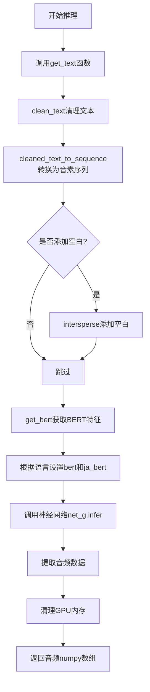

# `Bert-VITS2\oldVersion\V110\__init__.py` 详细设计文档

这是一个基于Bert-VITS2的文本到语音(TTS)推理模块，负责将输入文本转换为语音信号。核心流程包括文本清洗、音素序列转换、BERT特征提取和神经网络声学模型推理。

## 整体流程



## 类结构

```
模块级别函数 (无类结构)
├── get_text (文本预处理函数)
└── infer (推理主函数)
```

## 全局变量及字段


### `text`
    
要合成的文本输入

类型：`str`
    


### `language_str`
    
文本语言标识，如"ZH"表示中文，"JP"表示日语

类型：`str`
    


### `hps`
    
配置对象，存储训练参数和数据配置

类型：`object`
    


### `device`
    
计算设备，用于指定模型运行在CPU或GPU上

类型：`torch.device`
    


### `sdp_ratio`
    
随机解码概率比例，控制合成多样性

类型：`float`
    


### `noise_scale`
    
噪声尺度参数，控制生成音频的噪声水平

类型：`float`
    


### `noise_scale_w`
    
噪声宽度参数，控制声学模型的噪声

类型：`float`
    


### `length_scale`
    
长度缩放因子，控制语速

类型：`float`
    


### `sid`
    
说话人ID，用于指定特定说话人的声音特征

类型：`str or int`
    


### `language`
    
语言标识，与language_str类似但用于推理函数

类型：`str`
    


### `net_g`
    
生成网络模型实例，用于音频合成

类型：`torch.nn.Module`
    


    

## 全局函数及方法


### `get_text`

该函数是Bert-VITS2文本转语音系统的核心预处理函数，负责将原始文本转换为模型可用的音素序列、BERT嵌入向量及相关特征张量，同时处理多语言支持的逻辑分支。

参数：

- `text`：`str`，原始输入文本
- `language_str`：`str`，语言标识字符串（如"ZH"、"JP"、"EN"等）
- `hps`：配置对象，包含超参数配置（如是否添加空白符等）
- `device`：`torch.device`，计算设备（CPU或CUDA）

返回值：`(bert, ja_bert, phone, tone, language)`，其中：
- `bert`：`torch.Tensor`，主语言BERT嵌入向量，形状为 `(768, seq_len)` 或 `(1024, seq_len)`
- `ja_bert`：`torch.Tensor`，日语BERT嵌入向量，形状为 `(768, seq_len)` 或 `(1024, seq_len)`
- `phone`：`torch.LongTensor`，音素序列张量
- `tone`：`torch.LongTensor`，音调序列张量
- `language`：`torch.LongTensor`，语言标识序列张量

#### 流程图

```mermaid
flowchart TD
    A[开始: get_text] --> B[clean_text<br/>获取norm_text, phone, tone, word2ph]
    B --> C[cleaned_text_to_sequence<br/>转换为音素序列]
    C --> D{hps.data.add_blank<br/>是否添加空白符?}
    D -->|Yes| E[intersperse插入0到phone/tone/language<br/>word2ph翻倍, 首元素+1]
    D -->|No| F[跳过空白符处理]
    E --> G[get_bert获取BERT嵌入]
    F --> G
    G --> H[断言bert.seq_len == len(phone)]
    H --> I{language_str语言判断}
    I -->|ZH| J[bert保持原样<br/>ja_bert全零]
    I -->|JP| K[ja_bert = bert<br/>bert全零]
    I -->|Other| L[bert和ja_bert均全零]
    J --> M[转换为LongTensor]
    K --> M
    L --> M
    M --> N[返回bert, ja_bert, phone, tone, language]
```

#### 带注释源码

```python
def get_text(text, language_str, hps, device):
    """
    将文本转换为模型可用的特征张量
    
    参数:
        text: 原始输入文本
        language_str: 语言标识 ("ZH", "JP", "EN"等)
        hps: 包含配置的超参数对象
        device: torch计算设备
    """
    # 第一步：文本清洗
    # 调用cleaner模块清理文本，返回:
    # - norm_text: 归一化后的文本
    # - phone: 音素列表
    # - tone: 音调列表  
    # - word2ph: 字符到音素的映射列表
    norm_text, phone, tone, word2ph = clean_text(text, language_str)
    
    # 第二步：将清理后的文本转换为序列
    # 返回处理后的音素序列、音调序列、语言标识
    phone, tone, language = cleaned_text_to_sequence(phone, tone, language_str)
    
    # 第三步：可选的空白符插入
    # 当add_blank为True时，在每个音素之间插入0
    # 这是一种常见的TTS技巧，用于改善音素边界的建模
    if hps.data.add_blank:
        # 使用intersperse在序列中插入0作为空白符
        phone = commons.intersperse(phone, 0)
        tone = commons.intersperse(tone, 0)
        language = commons.intersperse(language, 0)
        
        # word2ph也需要相应翻倍，因为插入了空白符
        for i in range(len(word2ph)):
            word2ph[i] = word2ph[i] * 2
        # 第一个字符位置+1，补偿起始空白符
        word2ph[0] += 1
    
    # 第四步：获取BERT嵌入
    # 使用预训练BERT模型提取文本的语义特征
    # 对于多语言TTS至关重要，提供丰富的上下文表示
    bert = get_bert(norm_text, word2ph, language_str, device)
    
    # 释放word2ph内存，不再需要
    del word2ph
    
    # 第五步：长度一致性检查
    # 确保BERT序列长度与音素序列长度匹配
    assert bert.shape[-1] == len(phone), phone
    
    # 第六步：语言特定的BERT分配
    # 根据不同语言设置bert和ja_bert:
    # - 中文(ZH): 使用bert作为中文特征，ja_bert置零
    # - 日语(JP): 使用bert作为日语特征(1024维)，ja_bert为768维
    # - 其他: 两者均置零
    if language_str == "ZH":
        bert = bert
        ja_bert = torch.zeros(768, len(phone))
    elif language_str == "JP":
        ja_bert = bert
        bert = torch.zeros(1024, len(phone))
    else:
        bert = torch.zeros(1024, len(phone))
        ja_bert = torch.zeros(768, len(phone))
    
    # 第七步：最终长度验证
    # 再次确认BERT序列长度与音素序列一致
    assert bert.shape[-1] == len(
        phone
    ), f"Bert seq len {bert.shape[-1]} != {len(phone)}"
    
    # 第八步：转换为LongTensor
    # 转为PyTorch LongTensor以适配模型输入
    phone = torch.LongTensor(phone)
    tone = torch.LongTensor(tone)
    language = torch.LongTensor(language)
    
    # 返回5个张量供后续推理使用
    return bert, ja_bert, phone, tone, language
```


### `infer`

该函数是 Bert-VITS2 文本转语音系统的核心推理函数，负责将输入文本转换为语音音频。函数首先通过 `get_text` 处理文本获得语言特征（音素、语调、 BERT embedding），然后将所有特征数据传输到指定设备，最后调用生成器网络进行推理并返回生成的音频数据。

#### 参数

- `text`：`str`，待合成语音的输入文本
- `sdp_ratio`：`float`，使用 SDP（Soft Decision Prior）的比例，控制时长预测的随机性
- `noise_scale`：`float`，噪声规模参数，控制音频生成的多样性
- `noise_scale_w`：`float`，噪声宽度参数，控制音素时长变化的随机程度
- `length_scale`：`float`，时长缩放因子，用于调整生成语音的速度
- `sid`：`str`，说话者 ID，用于指定生成特定说话人的声音
- `language`：`str`，文本语言类型（如 "ZH"、"JP"、"EN"）
- `hps`：`object`，包含模型配置和数据的超参数对象（如说话者映射、是否添加空白符等）
- `net_g`：`object`，生成器神经网络模型，负责将文本特征转换为音频
- `device`：`torch.device`，计算设备（CPU 或 CUDA GPU）

#### 返回值

- `audio`：`numpy.ndarray`，生成的音频波形数据（一维浮点数组）

#### 流程图

```mermaid
flowchart TD
    A[开始 infer 推理] --> B[调用 get_text 获取文本特征]
    B --> C[提取 bert, ja_bert, phones, tones, lang_ids]
    C --> D{将张量移到指定 device}
    D --> E[phones.unsqueeze(0) 批次维度]
    E --> F[tones.unsqueeze(0)]
    F --> G[lang_ids.unsqueeze(0)]
    G --> H[bert.unsqueeze(0)]
    H --> I[ja_bert.unsqueeze(0)]
    I --> J[构建 x_tst_lengths]
    J --> K[构建 speakers 张量]
    K --> L[调用 net_g.infer 生成音频]
    L --> M[提取音频数据并转为 numpy]
    M --> N[清理中间张量]
    N --> O{Check GPU 可用}
    O -->|Yes| P[torch.cuda.empty_cache]
    O -->|No| Q[跳过清理]
    P --> R[返回 audio]
    Q --> R
```

#### 带注释源码

```python
def infer(
    text,                      # str: 输入待合成文本
    sdp_ratio,                 # float: SDP 概率因子 (0-1)
    noise_scale,               # float: 噪声规模 (影响音频多样性)
    noise_scale_w,             # float: 噪声宽度 (影响时长变化)
    length_scale,              # float: 长度缩放 (影响语速)
    sid,                       # str: 说话者标识符
    language,                  # str: 语言代码 'ZH'/'JP'/'EN'
    hps,                       # object: 超参数配置对象
    net_g,                     # object: 生成器网络实例
    device,                    # torch.device: 运行设备
):
    # Step 1: 文本预处理 - 获取语言特征
    # 内部调用 clean_text 清理文本，转换为音素序列，并生成 BERT embedding
    bert, ja_bert, phones, tones, lang_ids = get_text(text, language, hps, device)
    
    # Step 2: 推理阶段 - 关闭梯度计算以节省显存
    with torch.no_grad():
        # 将 Python 列表转换为张量并添加批次维度 (batch=1)
        x_tst = phones.to(device).unsqueeze(0)       # [1, seq_len]
        tones = tones.to(device).unsqueeze(0)         # [1, seq_len]
        lang_ids = lang_ids.to(device).unsqueeze(0)   # [1, seq_len]
        bert = bert.to(device).unsqueeze(0)           # [1, 768/1024, seq_len]
        ja_bert = ja_bert.to(device).unsqueeze(0)     # [1, 768/1024, seq_len]
        
        # 构建序列长度张量 (用于 mask)
        x_tst_lengths = torch.LongTensor([phones.size(0)]).to(device)
        
        # 释放原始 CPU 数据以节省内存
        del phones
        
        # 根据说话者 ID 获取说话者嵌入索引
        speakers = torch.LongTensor([hps.data.spk2id[sid]]).to(device)
        
        # Step 3: 调用生成器网络进行推理
        # net_g.infer 返回元组 (audio, ...)，取第一个元素的 [0,0,:] 去除 batch 和 channel 维度
        audio = (
            net_g.infer(
                x_tst,              # 音素序列
                x_tst_lengths,      # 序列长度
                speakers,           # 说话者 ID
                tones,              # 语调序列
                lang_ids,           # 语言 ID 序列
                bert,               # 中文 BERT embedding
                ja_bert,            # 日文 BERT embedding
                sdp_ratio=sdp_ratio,    # 时长预测随机性
                noise_scale=noise_scale,    # 噪声规模
                noise_scale_w=noise_scale_w, # 噪声宽度
                length_scale=length_scale,   # 语速调整
            )[0][0, 0]              # [1,1,T] -> [T]
            .data.cpu()             # 移至 CPU
            .float()                # 转 Float32
            .numpy()                # 转为 NumPy 数组
        )
        
        # Step 4: 显式删除中间张量，帮助垃圾回收
        del x_tst, x_tst_lengths, speakers, tones, lang_ids, bert, ja_bert
        
        # Step 5: 若使用 CUDA，手动清理缓存以释放显存
        if torch.cuda.is_available():
            torch.cuda.empty_cache()
        
        # Step 6: 返回生成的音频波形
        return audio
```

## 关键组件


### 文本预处理模块

负责将原始文本进行清洗、分词、转换为音素序列，并生成词到音素的映射关系。

### 音素填充与对齐

在音素序列中插入空白符（0），同时扩展词到音素的映射长度，确保文本与bert特征对齐。

### BERT特征提取

调用get_bert获取文本的BERT embeddings，并按词到音素映射进行特征扩展。

### 多语言支持

针对中文、日文和其他语言分别处理BERT和日文BERT特征维度（ZH: 768维，JP: 1024维，其他: 1024/768维）。

### 批量推理入口

接收文本、说话人ID、语言等参数，协调文本处理和模型推理流程。

### GPU资源管理

在推理完成后显式释放张量内存，并调用CUDA缓存清理以优化显存使用。


## 问题及建议


### 已知问题

-   **冗余代码**：`bert = bert` 这行代码没有任何实际作用，是冗余操作
-   **硬编码的张量维度**：日文BERT维度为1024、中文为768、其他语言也是硬编码的固定值，缺乏灵活性
-   **设备管理不一致**：有些张量使用`.to(device)`，有些使用`.to(device).unsqueeze(0)`，风格不统一
-   **不必要的中间变量**：创建了`phones`张量后立即删除它，再创建`x_tst`，导致额外的内存分配和复制
-   **版本路径硬编码**：使用`oldVersion.V111`路径命名，暗示版本兼容性问题，未来版本升级困难
-   **缺乏类型提示**：函数参数和返回值都没有类型注解，降低了代码可读性和IDE支持
-   **断言用于业务逻辑**：使用`assert`进行参数验证不是最佳实践，生产环境中可能被禁用
-   **缺少错误处理**：未对`hps.data.spk2id[sid]`、语言字符串有效性等关键操作进行异常捕获
-   **全局导入风险**：`import torch`和`import commons`作为全局导入，可能增加循环依赖风险

### 优化建议

-   删除冗余的`bert = bert`代码行
-   添加函数参数和返回值的类型提示（Type Hints）
-   统一设备管理方式，使用`torch.device`统一处理
-   移除不必要的中间变量，直接从输入创建所需张量
-   将硬编码的BERT维度提取为配置常量或从配置对象读取
-   将断言替换为显式的参数验证和异常抛出
-   为关键操作添加try-except错误处理
-   使用相对导入或配置化的版本管理替代硬编码的版本路径
-   考虑使用`@torch.no_grad()`装饰器替代`with torch.no_grad():`块，简化代码结构
-   添加docstring文档说明函数用途、参数和返回值


## 其它


### 设计目标与约束
- **目标**：为 Bert‑VITS2 提供多语言（中文、日文、英文等）文本到语音的推理接口，利用 BERT embeddings 提升韵律表现，并通过 intersperse blank 机制改善音素连贯性。  
- **约束**  
  - 仅支持 `hps.data.add_blank` 为 true/false 两种模式；开启时必须在 phone、tone、language 序列中插入 0。  
  - 输入的 `language` 必须为 “ZH”、 “JP” 或其它值；非 ZH/JP 时会使用全零 BERT/日文 BERT。  
  - 必须提供已加载的 `net_g`（生成网络）和对应的 `hps`（包含 `spk2id`、 `add_blank` 等配置）。  
  - 推理需在 GPU（CUDA）上进行以保证速度，CPU 模式下仅作调试。  
  - 单次推理仅处理一条文本，文本长度受模型最大序列长度限制。

### 错误处理与异常设计
- **形状校验**：使用 `assert` 检查 `bert.shape[-1]` 与 `len(phone)` 是否相等，若不相等抛出 `AssertionError` 并附带详细信息。  
- **语言分支**：若 `language_str` 非 “ZH”/“JP”，代码会生成全零张量而非异常；建议在实际项目中加入日志警告，以提示未完全支持的语言。  
- **资源释放**：在 `infer` 结束后显式 `del` 中间张量并调用 `torch.cuda.empty_cache()`，防止显存泄漏。  
- **设备兼容性**：所有张量均通过 `.to(device)` 推送至指定设备，若设备不存在会抛出 `RuntimeError`。  
- **说话人 ID**：若 `sid` 不在 `hps.data.spk2id` 字典中，访问时会触发 `KeyError`，需要在调用前确保 ID 合法。

### 数据流与状态机
1. **输入**：原始文本 (`str`)、语言标识 (`str`)、推理超参数、说话人标识、模型实例、设备。  
2. **文本预处理** (`get_text`)  
   - `clean_text`：进行语言特定的文本清洗、分词、韵律标注，返回归一化文本、字符音素、调和词级音素映射 (`word2ph`)。  
   - `cleaned_text_to_sequence`：将音素序列转为整数 ID。  
   - **Blank 插值**：若 `hps.data.add_blank` 为真，使用 `commons.intersperse` 在每个音素后插入 0，并相应放大 `word2ph`。  
   - **BERT 嵌入**：调用 `get_bert` 生成与 `word2ph` 对齐的 BERT 向量，随后根据语言填充 `bert` 与 `ja_bert`。  
3. **张量准备**：将 `phone、tone、language` 转换为 `LongTensor`，并统一 `unsqueeze(0)` 形成 batch 维。  
4. **模型推理** (`net_g.infer`)：传入上述向量以及噪声比例、长度比例等参数，返回生成音频向量。  
5. **后处理**：取第零帧、转移到 CPU、转为 `float`、再转为 `numpy` 数组，释放 GPU 资源。  
6. **状态**：无持久状态，每次调用独立；内部 `net_g` 可能保有隐藏状态，但对该模块透明。

### 外部依赖与接口契约
- **核心库**：`torch`（张量计算、CUDA 支持）  
- **内部模块**  
  - `commons.intersperse`：在序列中等间隔插入元素。  
  - `.text.cleaner.clean_text`：文本清洗与分词。  
  - `.text.cleaned_text_to_sequence`：音素 ID 序列生成。  
  - `oldVersion.V111.text.get_bert`：获取 BERT embeddings（返回 `torch.FloatTensor`）。  
- **模型接口**  
  - `net_g`（`nn.Module`）必须实现 `infer(x, x_lengths, speakers, tones, lang_ids, bert, ja_bert, sdp_ratio, noise_scale, noise_scale_w, length_scale)` 方法，返回 `(audio, …)`，其中 `audio` 为 `(1, num_frames)` 的张量。  
- **配置对象** (`hps`)  
  - `hps.data.add_blank`（`bool`）  
  - `hps.data.spk2id`（`dict[str, int]`）  
- **返回值**：`infer` 返回 `numpy.ndarray`，形状为 `(samples,)`， dtype 为 `float32`，代表原始音频波形。  

### 性能与资源管理
- 使用 `torch.no_grad()` 关闭梯度计算，显著降低显存占用。  
- 中间张量（`phones、x_tst、bert` 等）在使用完毕后立即 `del`，并配合 `torch.cuda.empty_cache()` 释放显存。  
- BERT 嵌入生成在 CPU 上完成，可能成为瓶颈；建议在离线阶段预计算或使用 GPU 加速的 BERT 模型。  
- 单次推理采用 batch_size=1，适合实时交互场景；若需要批量合成，可在 `infer` 外层做循环或改造 `net_g` 的批处理逻辑。  

### 配置与参数说明
| 参数 | 类型 | 说明 |
|------|------|------|
| `text` | `str` | 待合成的文本。 |
| `language_str` | `str` | 语言标识（“ZH”、 “JP” 等）。 |
| `sdp_ratio` | `float` | 软/硬时长预测比例，取值范围 [0,1]。 |
| `noise_scale` | `float` | 噪声幅度，控制音高随机性。 |
| `noise_scale_w` | `float` | 权重噪声幅度，控制音频质量随机性。 |
| `length_scale` | `float` | 语速倒数，>1 减速，<1 加速。 |
| `sid` | `str` | 说话人标识，必须在 `hps.data.spk2id` 中。 |
| `hps` | `object` | 超参数集合，必须包含 `add_blank` 与 `spk2id`。 |
| `net_g` | `nn.Module` | 已加载的生成网络实例。 |
| `device` | `torch.device` | 推理设备（cuda 或 cpu）。 |

### 版本兼容性与升级策略
- 代码头部标注 “1.1 版本兼容”，表明此实现对应 Bert‑VITS2 1.1 发行版。  
- `get_bert` 仍从 `oldVersion.V111` 导入，显示当前为过渡阶段；后续版本可能统一为 `text` 包下的实现。  
- 若升级到新版本，需要：  
  - 替换 `get_bert` 为新模块；  
  - 检查 `clean_text` 与 `cleaned_text_to_sequence` 的返回结构是否变化；  
  - 同步更新 `hps` 配置结构（如新增字段 `bert_path`）。  
- 为保持向后兼容，建议在接口层面对 `language` 参数做白名单校验，未知语言仍返回全零 embedding 并记录日志。  

### 安全性与隐私
- 推理过程仅在内存中处理文本与音频，不持久化任何用户数据。  
- 模型文件（`net_g`）与 BERT 模型需从可信来源加载，防止植入恶意权重。  
- 不涉及网络请求，避免因外部调用导致信息泄漏。  

### 测试与质量保障
- **单元测试**：针对 `get_text` 验证不同语言下 `bert.shape[-1]` 与 `len(phone)` 是否一致；检查 `add_blank` 为 true/false 时的输出长度。  
- **集成测试**：使用 Mock 的 `net_g`（返回随机音频）调用 `infer`，确认返回 `numpy.ndarray` 形状符合预期，且显存被正确释放。  
- **内存泄漏检测**：在连续多次调用 `infer` 后检查 `torch.cuda.memory_allocated()` 是否保持稳定。  
- **边界测试**：传入空字符串、极长文本、未知的 `language` 与不存在的 `sid`，验证错误处理逻辑（断言、异常或警告）。  

### 可维护性与扩展性
- **模块化**：文本处理 (`get_text`) 与推理 (`infer`) 分离，便于单独优化或替换。  
- **语言扩展**：新增语言只需在 `language_str` 分支中添加对应的 BERT/日文 BERT 零张量填充逻辑；若需完整支持，则实现对应的 `get_bert` 与 `clean_text`。  
- **说话人嵌入**：如需引入说话人向量，可在 `infer` 中新增 `speaker_emb` 参数并在 `net_g.infer` 调用时传入。  
- **配置驱动**：通过 `hps` 对象传递全局开关（如 `add_blank`），避免硬编码，便于在不同部署环境下快速切换。  
- **调试友好**：所有张量均打印形状信息 (`assert` 消息) 与设备位置，便于定位异常。  

    