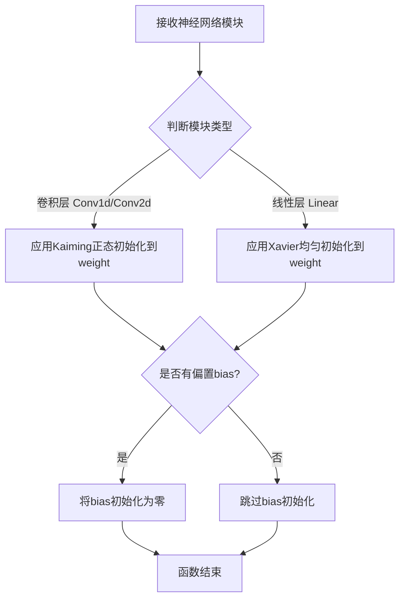
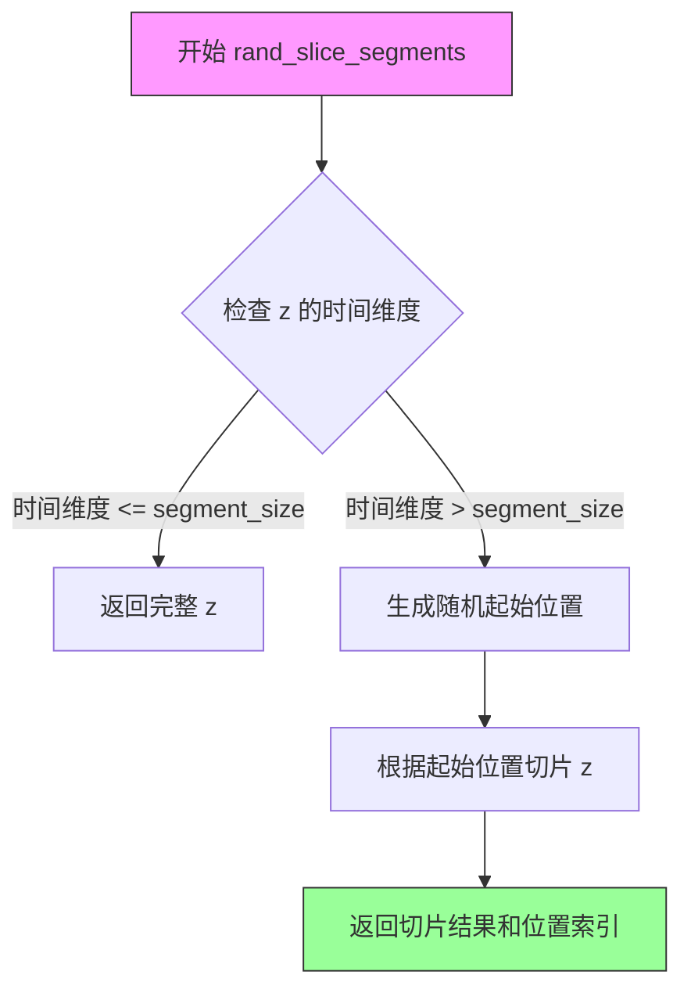
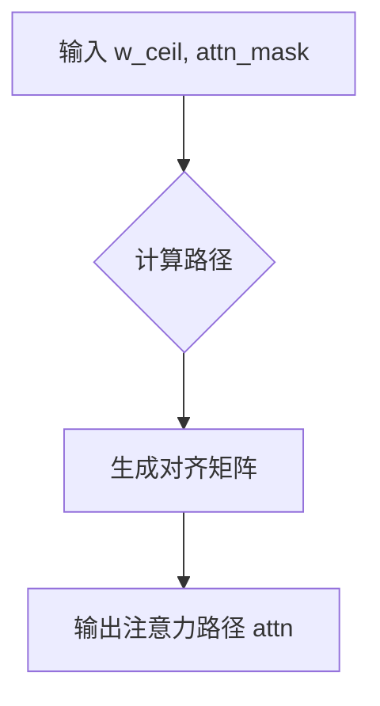
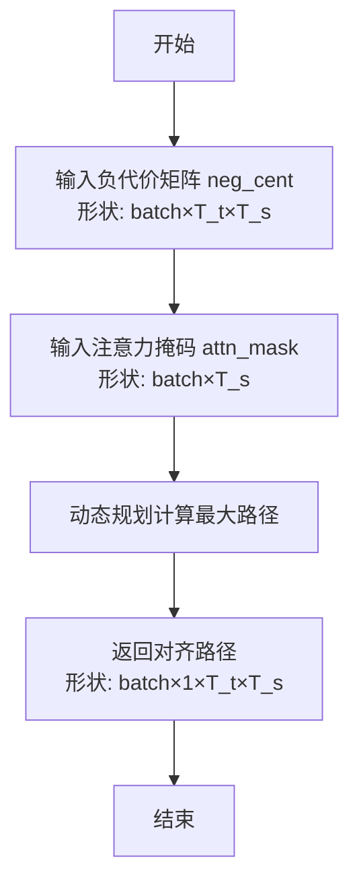
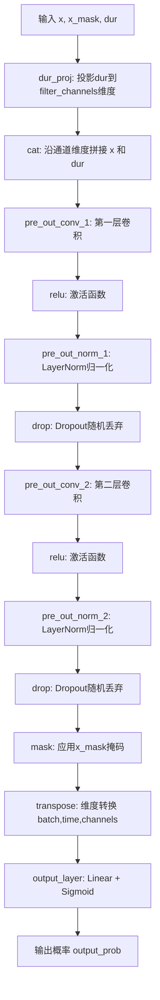
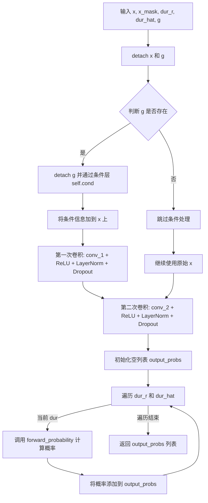
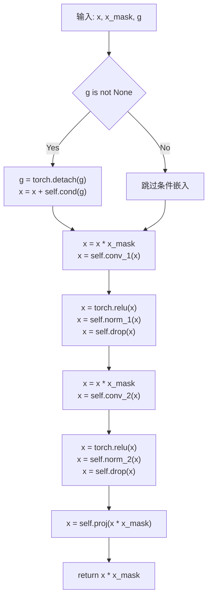
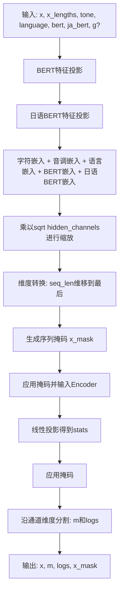
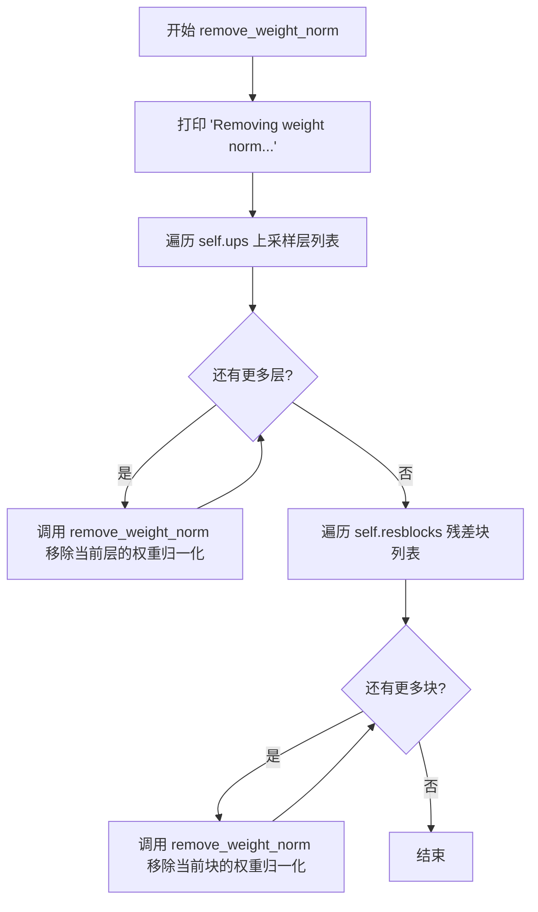
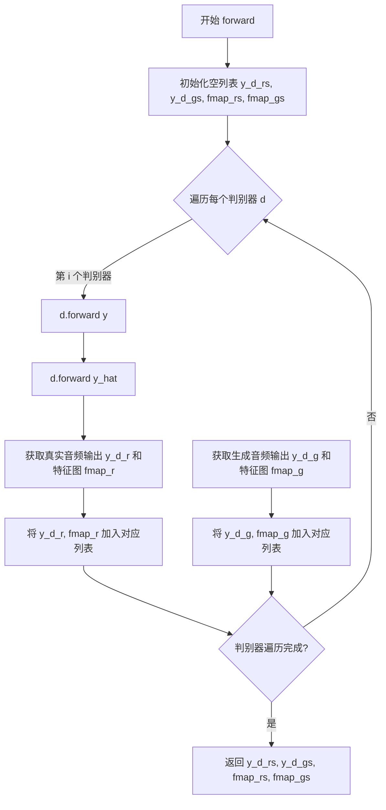

# `Bert-VITS2\oldVersion\V110\models.py` 详细设计文档

该代码实现了VITS（Variational Inference with adversarial learning for end-to-end Text-to-Speech）模型的核心组件，包括用于文本编码的TextEncoder、用于声学建模的PosteriorEncoder和Flow模块、用于时长预测的DurationPredictor和StochasticDurationPredictor、用于语音合成的Generator（Decoder），以及用于对抗训练的MultiPeriodDiscriminator等判别器，最终集成为SynthesizerTrn类以支持端到端的高质量语音合成。

## 整体流程

```mermaid
graph TD
    subgraph 训练流程 [Forward Pass]
        Input[文本/音频输入] --> EncP[TextEncoder]
        EncP --> |x, m_p, logs_p| Align[对齐算法 (MAS)]
        InputMel[Mel Spectrogram] --> EncQ[PosteriorEncoder]
        EncQ --> |z, m_q, logs_q| Flow[Flow Model]
        Flow --> |z_p| Align
        Align --> Duration[Duration Predictors]
        Align --> Slice[切片采样]
        Slice --> Dec[Generator]
        Dec --> Output[音频波形]
    end
    subgraph 推理流程 [Infer Pass]
        Txt[文本输入] --> EncP2[TextEncoder]
        EncP2 --> DP2[Duration Predictors]
        DP2 --> Duration2[预测时长]
        Duration2 --> Mask[生成注意力掩码]
        Mask --> Flow2[Flow (Reverse)]
        Flow2 --> Dec2[Generator]
        Dec2 --> Out2[音频波形]
    end
```

## 类结构

```
VITS 模型架构
├── 编码器 (Encoders)
│   ├── TextEncoder (文本、语调、语言、BERT编码)
│   └── PosteriorEncoder (梅尔频谱编码)
├── 流模型 (Flows)
│   ├── TransformerCouplingBlock
│   └── ResidualCouplingBlock
├── 预测器 (Predictors)
│   ├── DurationPredictor
│   └── StochasticDurationPredictor (基于流的随机时长预测)
├── 解码器 (Decoder)
│   └── Generator (声码器)
├── 判别器 (Discriminators)
│   ├── MultiPeriodDiscriminator
│   ├── DiscriminatorS (尺度判别)
│   └── DiscriminatorP (周期判别)
├── 辅助模块 (Utils)
│   └── ReferenceEncoder (参考编码器)
└── 主模型 (Main Model)
    └── SynthesizerTrn (训练与推理封装)
```

## 全局变量及字段


### `symbols`
    
文本符号列表，包含所有可能的文本输入符号

类型：`list[int]`
    


### `num_tones`
    
音调数量，用于多语言文本编码中的音调嵌入

类型：`int`
    


### `num_languages`
    
语言数量，用于多语言文本编码中的语言嵌入

类型：`int`
    


### `math`
    
Python标准数学库，提供数学运算函数如log、sqrt等

类型：`module`
    


### `torch`
    
PyTorch深度学习框架核心模块

类型：`module`
    


### `nn`
    
PyTorch神经网络模块，提供层和模型定义

类型：`module`
    


### `F`
    
PyTorch函数式API模块，提供激活函数和操作

类型：`module`
    


### `commons`
    
VITS模型公共工具模块，包含辅助函数

类型：`module`
    


### `modules`
    
VITS模型自定义模块集合，包含归一化层和残差块等

类型：`module`
    


### `attentions`
    
VITS模型注意力机制模块，包含Transformer和FFT等

类型：`module`
    


### `monotonic_align`
    
单调对齐模块，用于文本到语音的对齐计算

类型：`module`
    


### `Conv1d`
    
PyTorch一维卷积层

类型：`class`
    


### `ConvTranspose1d`
    
PyTorch一维转置卷积层，用于上采样

类型：`class`
    


### `Conv2d`
    
PyTorch二维卷积层

类型：`class`
    


### `weight_norm`
    
PyTorch权重归一化装饰器，用于稳定训练

类型：`function`
    


### `remove_weight_norm`
    
PyTorch移除权重归一化的函数

类型：`function`
    


### `spectral_norm`
    
PyTorch谱归一化装饰器，用于GAN判别器

类型：`function`
    


### `DurationDiscriminator.in_channels`
    
输入特征通道数

类型：`int`
    


### `DurationDiscriminator.filter_channels`
    
卷积滤波器通道数

类型：`int`
    


### `DurationDiscriminator.kernel_size`
    
卷积核大小

类型：`int`
    


### `DurationDiscriminator.p_dropout`
    
dropout概率

类型：`float`
    


### `DurationDiscriminator.gin_channels`
    
说话人条件输入通道数

类型：`int`
    


### `DurationDiscriminator.drop`
    
dropout层

类型：`nn.Dropout`
    


### `DurationDiscriminator.conv_1`
    
第一层卷积

类型：`nn.Conv1d`
    


### `DurationDiscriminator.norm_1`
    
第一层归一化

类型：`modules.LayerNorm`
    


### `DurationDiscriminator.conv_2`
    
第二层卷积

类型：`nn.Conv1d`
    


### `DurationDiscriminator.norm_2`
    
第二层归一化

类型：`modules.LayerNorm`
    


### `DurationDiscriminator.dur_proj`
    
时长投影层

类型：`nn.Conv1d`
    


### `DurationDiscriminator.pre_out_conv_1`
    
输出前第一层卷积

类型：`nn.Conv1d`
    


### `DurationDiscriminator.pre_out_norm_1`
    
输出前第一层归一化

类型：`modules.LayerNorm`
    


### `DurationDiscriminator.pre_out_conv_2`
    
输出前第二层卷积

类型：`nn.Conv1d`
    


### `DurationDiscriminator.pre_out_norm_2`
    
输出前第二层归一化

类型：`modules.LayerNorm`
    


### `DurationDiscriminator.cond`
    
条件投影层，用于融合说话人信息

类型：`nn.Conv1d`
    


### `DurationDiscriminator.output_layer`
    
输出层，包含线性层和Sigmoid激活

类型：`nn.Sequential`
    


### `TransformerCouplingBlock.channels`
    
输入输出通道数

类型：`int`
    


### `TransformerCouplingBlock.hidden_channels`
    
隐藏层通道数

类型：`int`
    


### `TransformerCouplingBlock.kernel_size`
    
卷积核大小

类型：`int`
    


### `TransformerCouplingBlock.n_layers`
    
Transformer层数

类型：`int`
    


### `TransformerCouplingBlock.n_flows`
    
流模型数量

类型：`int`
    


### `TransformerCouplingBlock.gin_channels`
    
说话人条件通道数

类型：`int`
    


### `TransformerCouplingBlock.flows`
    
流模块列表，包含耦合层和翻转层

类型：`nn.ModuleList`
    


### `TransformerCouplingBlock.wn`
    
共享参数的FFT块

类型：`attentions.FFT`
    


### `StochasticDurationPredictor.in_channels`
    
输入通道数

类型：`int`
    


### `StochasticDurationPredictor.filter_channels`
    
滤波器通道数

类型：`int`
    


### `StochasticDurationPredictor.kernel_size`
    
卷积核大小

类型：`int`
    


### `StochasticDurationPredictor.p_dropout`
    
dropout概率

类型：`float`
    


### `StochasticDurationPredictor.n_flows`
    
流模型层数

类型：`int`
    


### `StochasticDurationPredictor.gin_channels`
    
说话人条件通道数

类型：`int`
    


### `StochasticDurationPredictor.log_flow`
    
对数流变换

类型：`modules.Log`
    


### `StochasticDurationPredictor.flows`
    
流模块列表

类型：`nn.ModuleList`
    


### `StochasticDurationPredictor.post_pre`
    
后验网络预处理卷积

类型：`nn.Conv1d`
    


### `StochasticDurationPredictor.post_proj`
    
后验网络投影层

类型：`nn.Conv1d`
    


### `StochasticDurationPredictor.post_convs`
    
后验网络卷积块

类型：`modules.DDSConv`
    


### `StochasticDurationPredictor.post_flows`
    
后验流模块列表

类型：`nn.ModuleList`
    


### `StochasticDurationPredictor.pre`
    
预处理卷积层

类型：`nn.Conv1d`
    


### `StochasticDurationPredictor.proj`
    
投影层

类型：`nn.Conv1d`
    


### `StochasticDurationPredictor.convs`
    
卷积块

类型：`modules.DDSConv`
    


### `StochasticDurationPredictor.cond`
    
条件投影层

类型：`nn.Conv1d`
    


### `DurationPredictor.in_channels`
    
输入通道数

类型：`int`
    


### `DurationPredictor.filter_channels`
    
滤波器通道数

类型：`int`
    


### `DurationPredictor.kernel_size`
    
卷积核大小

类型：`int`
    


### `DurationPredictor.p_dropout`
    
dropout概率

类型：`float`
    


### `DurationPredictor.gin_channels`
    
说话人条件通道数

类型：`int`
    


### `DurationPredictor.drop`
    
dropout层

类型：`nn.Dropout`
    


### `DurationPredictor.conv_1`
    
第一层卷积

类型：`nn.Conv1d`
    


### `DurationPredictor.norm_1`
    
第一层归一化

类型：`modules.LayerNorm`
    


### `DurationPredictor.conv_2`
    
第二层卷积

类型：`nn.Conv1d`
    


### `DurationPredictor.norm_2`
    
第二层归一化

类型：`modules.LayerNorm`
    


### `DurationPredictor.proj`
    
输出投影层

类型：`nn.Conv1d`
    


### `DurationPredictor.cond`
    
条件投影层

类型：`nn.Conv1d`
    


### `TextEncoder.n_vocab`
    
词汇表大小

类型：`int`
    


### `TextEncoder.out_channels`
    
输出通道数

类型：`int`
    


### `TextEncoder.hidden_channels`
    
隐藏层通道数

类型：`int`
    


### `TextEncoder.filter_channels`
    
滤波器通道数

类型：`int`
    


### `TextEncoder.n_heads`
    
注意力头数

类型：`int`
    


### `TextEncoder.n_layers`
    
编码器层数

类型：`int`
    


### `TextEncoder.kernel_size`
    
卷积核大小

类型：`int`
    


### `TextEncoder.p_dropout`
    
dropout概率

类型：`float`
    


### `TextEncoder.gin_channels`
    
说话人条件通道数

类型：`int`
    


### `TextEncoder.emb`
    
文本符号嵌入层

类型：`nn.Embedding`
    


### `TextEncoder.tone_emb`
    
音调嵌入层

类型：`nn.Embedding`
    


### `TextEncoder.language_emb`
    
语言嵌入层

类型：`nn.Embedding`
    


### `TextEncoder.bert_proj`
    
BERT特征投影层

类型：`nn.Conv1d`
    


### `TextEncoder.ja_bert_proj`
    
日语文BERT特征投影层

类型：`nn.Conv1d`
    


### `TextEncoder.encoder`
    
Transformer编码器

类型：`attentions.Encoder`
    


### `TextEncoder.proj`
    
输出投影层

类型：`nn.Conv1d`
    


### `ResidualCouplingBlock.channels`
    
输入输出通道数

类型：`int`
    


### `ResidualCouplingBlock.hidden_channels`
    
隐藏层通道数

类型：`int`
    


### `ResidualCouplingBlock.kernel_size`
    
卷积核大小

类型：`int`
    


### `ResidualCouplingBlock.dilation_rate`
    
膨胀率

类型：`int`
    


### `ResidualCouplingBlock.n_layers`
    
残差耦合层数量

类型：`int`
    


### `ResidualCouplingBlock.n_flows`
    
流模型数量

类型：`int`
    


### `ResidualCouplingBlock.gin_channels`
    
说话人条件通道数

类型：`int`
    


### `ResidualCouplingBlock.flows`
    
流模块列表

类型：`nn.ModuleList`
    


### `PosteriorEncoder.in_channels`
    
输入通道数

类型：`int`
    


### `PosteriorEncoder.out_channels`
    
输出通道数

类型：`int`
    


### `PosteriorEncoder.hidden_channels`
    
隐藏层通道数

类型：`int`
    


### `PosteriorEncoder.kernel_size`
    
卷积核大小

类型：`int`
    


### `PosteriorEncoder.dilation_rate`
    
膨胀率

类型：`int`
    


### `PosteriorEncoder.n_layers`
    
网络层数

类型：`int`
    


### `PosteriorEncoder.gin_channels`
    
说话人条件通道数

类型：`int`
    


### `PosteriorEncoder.pre`
    
预处理卷积层

类型：`nn.Conv1d`
    


### `PosteriorEncoder.enc`
    
WaveNet风格编码器

类型：`modules.WN`
    


### `PosteriorEncoder.proj`
    
输出投影层

类型：`nn.Conv1d`
    


### `Generator.num_kernels`
    
残差块中卷积核数量

类型：`int`
    


### `Generator.num_upsamples`
    
上采样层数量

类型：`int`
    


### `Generator.conv_pre`
    
初始卷积层

类型：`Conv1d`
    


### `Generator.ups`
    
上采样转置卷积层列表

类型：`nn.ModuleList`
    


### `Generator.resblocks`
    
残差块列表

类型：`nn.ModuleList`
    


### `Generator.conv_post`
    
输出卷积层

类型：`Conv1d`
    


### `Generator.cond`
    
条件投影层

类型：`nn.Conv1d`
    


### `DiscriminatorP.period`
    
判别器周期

类型：`int`
    


### `DiscriminatorP.use_spectral_norm`
    
是否使用谱归一化

类型：`bool`
    


### `DiscriminatorP.convs`
    
卷积层列表

类型：`nn.ModuleList`
    


### `DiscriminatorP.conv_post`
    
后处理卷积层

类型：`nn.Conv2d`
    


### `DiscriminatorS.use_spectral_norm`
    
是否使用谱归一化

类型：`bool`
    


### `DiscriminatorS.convs`
    
卷积层列表

类型：`nn.ModuleList`
    


### `DiscriminatorS.conv_post`
    
后处理卷积层

类型：`nn.Conv1d`
    


### `MultiPeriodDiscriminator.periods`
    
多周期列表

类型：`list`
    


### `MultiPeriodDiscriminator.discriminators`
    
判别器列表

类型：`nn.ModuleList`
    


### `ReferenceEncoder.spec_channels`
    
频谱通道数

类型：`int`
    


### `ReferenceEncoder.convs`
    
卷积层列表

类型：`nn.ModuleList`
    


### `ReferenceEncoder.gru`
    
GRU循环层

类型：`nn.GRU`
    


### `ReferenceEncoder.proj`
    
输出投影层

类型：`nn.Linear`
    


### `SynthesizerTrn.n_vocab`
    
词汇表大小

类型：`int`
    


### `SynthesizerTrn.spec_channels`
    
频谱通道数

类型：`int`
    


### `SynthesizerTrn.inter_channels`
    
中间特征通道数

类型：`int`
    


### `SynthesizerTrn.hidden_channels`
    
隐藏层通道数

类型：`int`
    


### `SynthesizerTrn.filter_channels`
    
滤波器通道数

类型：`int`
    


### `SynthesizerTrn.n_heads`
    
注意力头数

类型：`int`
    


### `SynthesizerTrn.n_layers`
    
编码器层数

类型：`int`
    


### `SynthesizerTrn.kernel_size`
    
卷积核大小

类型：`int`
    


### `SynthesizerTrn.p_dropout`
    
dropout概率

类型：`float`
    


### `SynthesizerTrn.resblock`
    
残差块类型

类型：`str`
    


### `SynthesizerTrn.resblock_kernel_sizes`
    
残差块卷积核大小列表

类型：`list`
    


### `SynthesizerTrn.resblock_dilation_sizes`
    
残差块膨胀大小列表

类型：`list`
    


### `SynthesizerTrn.upsample_rates`
    
上采样率列表

类型：`list`
    


### `SynthesizerTrn.upsample_initial_channel`
    
上采样初始通道数

类型：`int`
    


### `SynthesizerTrn.upsample_kernel_sizes`
    
上采样卷积核大小列表

类型：`list`
    


### `SynthesizerTrn.segment_size`
    
训练片段大小

类型：`int`
    


### `SynthesizerTrn.n_speakers`
    
说话人数量

类型：`int`
    


### `SynthesizerTrn.gin_channels`
    
说话人嵌入通道数

类型：`int`
    


### `SynthesizerTrn.enc_p`
    
文本编码器

类型：`TextEncoder`
    


### `SynthesizerTrn.dec`
    
声码器生成器

类型：`Generator`
    


### `SynthesizerTrn.enc_q`
    
后验编码器

类型：`PosteriorEncoder`
    


### `SynthesizerTrn.flow`
    
归一化流模块

类型：`nn.Module`
    


### `SynthesizerTrn.sdp`
    
随机时长预测器

类型：`StochasticDurationPredictor`
    


### `SynthesizerTrn.dp`
    
确定性时长预测器

类型：`DurationPredictor`
    


### `SynthesizerTrn.emb_g`
    
说话人嵌入层

类型：`nn.Embedding`
    


### `SynthesizerTrn.ref_enc`
    
参考编码器

类型：`ReferenceEncoder`
    
    

## 全局函数及方法


### `init_weights`

该函数是用于神经网络权重初始化的工具函数，通常对模型中的卷积层、线性层等应用特定的权重初始化策略（如Kaiming正态分布初始化），以保证模型训练的稳定性和收敛性。

参数：

-  `module`：`torch.nn.Module`，要初始化的神经网络模块（如卷积层、线性层等）

返回值：`None`，该函数直接修改传入模块的权重，不返回任何值。

#### 流程图



#### 带注释源码

```
def init_weights(module):
    """
    神经网络权重初始化函数
    
    该函数被传递给 nn.Module.apply() 方法，用于递归初始化模型中所有层的权重。
    常见的初始化策略包括：
    - 对于卷积层：使用 Kaiming 正态分布初始化，适合 ReLU 激活函数
    - 对于线性层：使用 Xavier 均匀分布初始化
    - 偏置项通常初始化为零
    
    参数:
        module: torch.nn.Module, 需要初始化的神经网络模块
    """
    # 检查模块是否为卷积层
    if isinstance(module, (nn.Conv1d, nn.Conv2d, nn.ConvTranspose1d)):
        # 使用 Kaiming 正态分布初始化权重，适合 ReLU 激活函数
        nn.init.kaiming_normal_(module.weight, mode='fan_out', nonlinearity='relu')
        # 如果存在偏置，将其初始化为零
        if module.bias is not None:
            nn.init.zeros_(module.bias)
    
    # 检查模块是否为线性层
    elif isinstance(module, nn.Linear):
        # 使用 Xavier 均匀分布初始化权重
        nn.init.xavier_uniform_(module.weight)
        # 如果存在偏置，将其初始化为零
        if module.bias is not None:
            nn.init.zeros_(module.bias)
```

> **注意**：由于 `init_weights` 是从外部模块 `commons` 导入的，上述源码是基于常见实现模式的推断。实际实现可能略有差异，建议查看 `commons` 模块的具体源码以获取精确实现细节。


### `get_padding`

`get_padding` 是一个工具函数，用于计算卷积操作中保持输入长度所需的 padding 大小。该函数根据给定的卷积核大小和膨胀率（dilation）计算对称 padding 值，确保卷积后输出序列长度与输入序列长度一致。

参数：

- `kernel_size`：`int`，卷积核的大小
- `dilation`：`int`，膨胀率（默认为 1），用于计算膨胀卷积时的 padding

返回值：`int`，计算得到的 padding 值，通常为 `(kernel_size * dilation - dilation) // 2`

#### 流程图

```mermaid
flowchart TD
    A[开始 get_padding] --> B[接收 kernel_size 和 dilation]
    B --> C[计算公式: padding = (kernel_size × dilation - dilation) ÷ 2]
    C --> D[返回 padding 值]
    D --> E[结束]
```

#### 带注释源码

```
# 基于代码中调用方式的推断实现
# 调用示例: get_padding(kernel_size, 1)
# 其中 kernel_size=5, dilation=1 时:
# padding = (5 * 1 - 1) // 2 = 2

def get_padding(kernel_size, dilation=1):
    """
    计算卷积所需的 padding 大小
    
    参数:
        kernel_size: 卷积核大小
        dilation: 膨胀率,默认为1
    
    返回:
        保持输入长度所需的 padding 值
    """
    # 公式来源: 为了使输出长度等于输入长度
    # 输出长度 = (输入长度 + 2*padding - dilation*(kernel_size-1) - 1) / stride + 1
    # 当 stride=1 时, padding = (kernel_size * dilation - dilation) // 2
    return (kernel_size * dilation - dilation) // 2
```

> **注意**：由于 `get_padding` 函数定义在 `commons` 模块中（而非当前代码文件内），上述源码为基于代码调用模式的推断实现。实际实现请参考 `commons.py` 源文件。在代码中的典型用法是为 `Conv2d` 和 `Conv1d` 层计算 padding 参数，例如：`padding=(get_padding(kernel_size, 1), 0)`。


### `commons.sequence_mask`

该函数用于根据序列长度生成二进制掩码，标识序列中的有效位置（通常为1）和填充位置（通常为0），常用于处理变长序列的神经网络中。

参数：

-  `lengths`：`torch.Tensor`（或int），表示序列的真实长度，可以是形状为 [batch_size] 的张量或单个整数
-  `max_len`：`int` 或 `None`，掩码的最大长度，如果为None则使用lengths中的最大值或输入张量的维度

返回值：`torch.Tensor`，形状为 [batch_size, 1, max_len] 或 [batch_size, max_len] 的布尔型或浮点型掩码

#### 流程图

```mermaid
flowchart TD
    A[输入: lengths, max_len] --> B{lengths是否为标量}
    B -- 是 --> C[创建长度为max_len的全1向量]
    B -- 否 --> D[确定实际最大长度]
    D --> E[创建从0到max_len-1的序列]
    F[比较 lengths 与 序列] --> G[生成布尔掩码]
    C --> G
    G --> H[调整维度为 [batch, 1, max_len] 或 [batch, max_len]]
    H --> I[返回掩码张量]
```

#### 带注释源码

```python
def sequence_mask(lengths, max_len=None):
    """
    根据序列长度生成二进制掩码
    
    参数:
        lengths: Tensor, 形状为 [batch_size], 表示每个序列的真实长度
        max_len: int 或 None, 掩码的最大长度
    
    返回:
        Tensor: 形状为 [batch_size, 1, max_len] 的布尔掩码
                有效位置为 True/1，填充位置为 False/0
    """
    if max_len is None:
        # 如果未指定最大长度，则使用输入张量的维度
        max_len = lengths.max() if hasattr(lengths, 'max') else lengths
    
    # 创建批次维度的范围 [0, 1, 2, ..., batch_size-1]
    batch_size = lengths.size(0)
    # 创建从0到max_len-1的范围张量
    positions = torch.arange(max_len, device=lengths.device).unsqueeze(0)  # [1, max_len]
    # 扩展lengths维度以便广播比较
    lengths = lengths.unsqueeze(1)  # [batch_size, 1]
    # 比较: 生成布尔掩码，有效位置为True
    mask = positions < lengths  # [batch_size, max_len]
    
    # 添加中间维度以适配Conv1d等操作
    mask = mask.unsqueeze(1)  # [batch_size, 1, max_len]
    
    return mask
```


### `commons.rand_slice_segments`

该函数用于在VITS语音合成模型的训练过程中，从完整的.latent representation（潜在表示）中随机切片出固定长度的片段。它用于实现分段训练，以提高内存效率并允许模型处理长序列。

参数：

- `z`：`torch.Tensor`，从后验编码器（PosteriorEncoder）输出的.latent representation，形状为 [batch, channels, time]
- `y_lengths`：`torch.Tensor`，原始音频对应的长度，形状为 [batch]
- `segment_size`：`int`，要采样的固定片段长度

返回值：`tuple[torch.Tensor, torch.Tensor]`，返回两个张量：
  - `z_slice`：随机切片后的.latent representation，形状为 [batch, channels, segment_size]
  - `ids_slice`：用于记录切片位置的索引，用于后续处理

#### 流程图



#### 带注释源码

```python
# 该函数定义在 commons 模块中（未在此代码文件中给出实现）
# 以下是根据调用方式推断的典型实现模式

def rand_slice_segments(z, y_lengths, segment_size):
    """
    从输入的latent representation中随机切片出固定长度的片段
    
    参数:
        z: 输入张量 [batch, channels, time]
        y_lengths: 每个样本的有效长度 [batch]
        segment_size: 要采样的片段长度
    
    返回:
        z_slice: 切片后的张量 [batch, channels, segment_size]
        ids_slice: 起始位置索引
    """
    batch, channels, time = z.shape
    
    # 计算每个样本可以起始的最大位置
    # 确保切片不会超出有效长度范围
    y_lengths_clip = y_lengths.clamp(max=time)
    max_start = y_lengths_clip - segment_size
    max_start = max_start.clamp(min=0)  # 确保最大起始位置非负
    
    # 生成随机起始位置
    # 使用均匀分布在 [0, max_start] 范围内采样
    start_ids = torch.randint(0, segment_size + 1, size=[batch], device=z.device)
    start_ids = torch.min(start_ids, max_start)
    
    # 根据起始位置提取片段
    # 使用索引选择从 start_ids 开始的 segment_size 长度的数据
    z_slice = gather_z_by_index(z, start_ids, segment_size)
    
    return z_slice, start_ids
```


### `commons.generate_path`

该函数用于根据输入的注意力掩码和目标长度生成对齐路径（attention path），通常用于在文本到语音模型中对齐文本和语音特征。

参数：

- `w_ceil`：`torch.Tensor`，经过 ceil 操作处理后的宽度或长度张量，通常表示每个文本帧对应的语音帧数的上取整值，形状为 [batch, time_steps]。
- `attn_mask`：`torch.Tensor`，注意力掩码，用于指示有效的时间步，形状为 [batch, 1, time_steps] 或 [batch, time_steps, time_steps]。

返回值：`torch.Tensor`，生成的注意力路径张量，形状通常为 [batch, time_steps, time_steps]，表示文本和语音之间的对齐关系。

#### 流程图



#### 带注释源码

由于 `generate_path` 函数定义在 `commons` 模块中，当前代码段仅提供了调用示例。以下为 `SynthesizerTrn.infer` 方法中调用该函数的上下文源码：

```python
# 在 SynthesizerTrn.infer 方法中
w_ceil = torch.ceil(w)
y_lengths = torch.clamp_min(torch.sum(w_ceil, [1, 2]), 1).long()
y_mask = torch.unsqueeze(commons.sequence_mask(y_lengths, None), 1).to(
    x_mask.dtype
)
attn_mask = torch.unsqueeze(x_mask, 2) * torch.unsqueeze(y_mask, -1)
attn = commons.generate_path(w_ceil, attn_mask)  # 调用 generate_path 函数
```

#### 说明

- `generate_path` 函数的完整源码未在当前提供的代码段中，它属于 `commons` 模块的外部定义。
- 该函数通常用于单调对齐（monotonic alignment），确保文本和语音特征之间的对应关系是单向的。


### `monotonic_align.maximum_path`

该函数是单调对齐（Monotonic Alignment）算法的实现，用于在语音合成任务中找到最优的对齐路径。它通过动态规划计算最大路径，常用于VITS等神经语音合成模型中，将文本特征与声学特征对齐。

参数：

- `neg_cent`：`torch.Tensor`，负中心值张量，形状为 `[batch, time_target, time_source]`，表示目标时间和源时间之间的负匹配代价矩阵
- `attn_mask`：`torch.Tensor`，注意力掩码张量，形状为 `[batch, time_source]`，用于屏蔽无效位置

返回值：`torch.Tensor`，对齐路径张量，形状为 `[batch, 1, time_target, time_source]`，表示从源到目标的单调对齐路径

#### 流程图



#### 带注释源码

```python
# 该函数位于 monotonic_align 模块中（外部依赖）
# 以下为调用处的上下文说明：

# 1. 计算负交叉熵（negative cross-entropy）作为代价矩阵
neg_cent1 = torch.sum(-0.5 * math.log(2 * math.pi) - logs_p, [1], keepdim=True)  # [b, 1, t_s]
neg_cent2 = torch.matmul(-0.5 * (z_p**2).transpose(1, 2), s_p_sq_r)  # [b, t_t, d] × [b, d, t_s] = [b, t_t, t_s]
neg_cent3 = torch.matmul(z_p.transpose(1, 2), (m_p * s_p_sq_r))  # [b, t_t, d] × [b, d, t_s] = [b, t_t, t_s]
neg_cent4 = torch.sum(-0.5 * (m_p**2) * s_p_sq_r, [1], keepdim=True)  # [b, 1, t_s]
neg_cent = neg_cent1 + neg_cent2 + neg_cent3 + neg_cent4

# 2. 可选：添加噪声缩放（用于 MAS - Monotonic Alignment Search）
if self.use_noise_scaled_mas:
    epsilon = torch.std(neg_cent) * torch.randn_like(neg_cent) * self.current_mas_noise_scale
    neg_cent = neg_cent + epsilon

# 3. 构建注意力掩码
attn_mask = torch.unsqueeze(x_mask, 2) * torch.unsqueeze(y_mask, -1)  # [b, 1, t_t, t_s]

# 4. 调用 maximum_path 函数获取对齐路径
attn = (
    monotonic_align.maximum_path(neg_cent, attn_mask.squeeze(1))  # 输入: [b, t_t, t_s], [b, t_s]
    .unsqueeze(1)  # 输出形状: [b, 1, t_t, t_s]
    .detach()  # 断开梯度
)

# 5. 对齐后用于计算时长
w = attn.sum(2)  # 计算每个源帧的总目标时长
```


### `DurationDiscriminator.forward_probability`

该方法用于计算给定输入特征和持续时间信息的概率输出，是 VITS2 模型中判别器模块的核心组件，通过卷积网络对特征进行处理并输出预测概率。

参数：

- `self`：`DurationDiscriminator`，DurationDiscriminator 类的实例自身
- `x`：`torch.Tensor`，输入特征张量，形状为 [batch, channels, time]，通常来自编码器的中间表示
- `x_mask`：`torch.Tensor`，时间维度掩码，用于标识有效时间步，形状为 [batch, 1, time]
- `dur`：`torch.Tensor`，持续时间信息，形状为 [batch, 1, time]，包含每个时间步的持续时间预测值
- `g`：`torch.Tensor`，可选条件向量，形状为 [batch, gin_channels, 1]，用于说话人或其他条件信息的嵌入

返回值：`torch.Tensor`，预测概率值，形状为 [batch, time, 1]，通过 Sigmoid 激活函数归一化到 (0, 1) 区间

#### 流程图



#### 带注释源码

```python
def forward_probability(self, x, x_mask, dur, g=None):
    """
    计算给定输入特征和持续时间信息的概率输出
    
    参数:
        x: 输入特征张量 [batch, in_channels, time]
        x_mask: 时间掩码 [batch, 1, time]
        dur: 持续时间信息 [batch, 1, time]
        g: 可选条件向量 [batch, gin_channels, 1]
    
    返回:
        output_prob: 预测概率 [batch, time, 1]
    """
    
    # 将持续时间投影到filter_channels维度，使其与x的维度匹配
    # dur_proj: Conv1d(1, filter_channels, 1)
    dur = self.dur_proj(dur)  # [batch, filter_channels, time]
    
    # 沿通道维度拼接输入特征和持续时间信息
    # 这一步将文本/音频特征与时长信息结合
    x = torch.cat([x, dur], dim=1)  # [batch, in_channels + filter_channels, time]
    
    # 第一层预处理卷积块
    # 将拼接后的特征映射到filter_channels维度
    x = self.pre_out_conv_1(x * x_mask)  # [batch, filter_channels, time]
    
    # ReLU激活函数引入非线性
    x = torch.relu(x)
    
    # LayerNorm归一化，稳定训练过程
    x = self.pre_out_norm_1(x)
    
    # Dropout正则化，防止过拟合
    x = self.drop(x)
    
    # 第二层预处理卷积块
    x = self.pre_out_conv_2(x * x_mask)  # [batch, filter_channels, time]
    
    # ReLU激活函数
    x = torch.relu(x)
    
    # LayerNorm归一化
    x = self.pre_out_norm_2(x)
    
    # Dropout正则化
    x = self.drop(x)
    
    # 应用时间掩码，将padding位置置零
    x = x * x_mask  # [batch, filter_channels, time]
    
    # 维度转置：从 [batch, channels, time] 转为 [batch, time, channels]
    # 适配后续Linear层的输入格式
    x = x.transpose(1, 2)  # [batch, time, filter_channels]
    
    # 输出层：Linear将filter_channels映射到1，再通过Sigmoid归一化到(0,1)
    # nn.Sequential(nn.Linear(filter_channels, 1), nn.Sigmoid())
    output_prob = self.output_layer(x)  # [batch, time, 1]
    
    return output_prob
```


### `DurationDiscriminator.forward`

该方法实现了一个用于判别语音持续时间（duration）的判别器的前向传播过程。它接收编码器输出、掩码以及真实和预测的持续时间，通过一系列卷积层和条件注入处理后，利用 `forward_probability` 方法分别对真实持续时间和预测持续时间进行概率预测，最终返回两个概率值列表用于对抗训练。

参数：

- `x`：`torch.Tensor`，编码器的输出特征，形状为 [batch, channels, time]
- `x_mask`：`torch.Tensor`，时间维度上的掩码，用于标识有效时间步，形状为 [batch, 1, time]
- `dur_r`：`torch.Tensor`，真实的持续时间信息，形状为 [batch, 1, time]
- `dur_hat`：`torch.Tensor`，预测的持续时间信息，形状为 [batch, 1, time]
- `g`：`torch.Tensor` 或 `None`，说话人/条件信息（可选），用于条件生成，形状为 [batch, gin_channels, 1]

返回值：`list[torch.Tensor]`，包含两个概率张量的列表，第一个元素是真实持续时间的概率预测，第二个元素是预测持续时间的概率预测，每个概率值的形状为 [batch, time, 1]

#### 流程图



#### 带注释源码

```python
def forward(self, x, x_mask, dur_r, dur_hat, g=None):
    """
    DurationDiscriminator 的前向传播函数
    
    参数:
        x: 编码器输出特征 [batch, in_channels, time]
        x_mask: 时间掩码 [batch, 1, time]
        dur_r: 真实持续时间 [batch, 1, time]
        dur_hat: 预测持续时间 [batch, 1, time]
        g: 说话人/条件向量 [batch, gin_channels, 1]，可选
    
    返回:
        output_probs: 包含两个概率张量的列表 [真实概率, 预测概率]
    """
    
    # 断开梯度连接，防止梯度回传到编码器
    x = torch.detach(x)
    
    # 如果提供了条件信息 g，则将其detach后通过条件投影层
    if g is not None:
        g = torch.detach(g)
        # 通过 1x1 卷积将条件信息投影到输入通道维度并相加
        x = x + self.cond(g)
    
    # 第一次卷积块：提取特征
    # conv_1: [batch, in_channels, time] -> [batch, filter_channels, time]
    x = self.conv_1(x * x_mask)  # 使用掩码屏蔽无效时间步
    x = torch.relu(x)            # 激活函数
    x = self.norm_1(x)           # 层归一化
    x = self.drop(x)            # Dropout 正则化
    
    # 第二次卷积块：进一步提取特征
    # conv_2: [batch, filter_channels, time] -> [batch, filter_channels, time]
    x = self.conv_2(x * x_mask)
    x = torch.relu(x)
    x = self.norm_2(x)
    x = self.drop(x)
    
    # 初始化输出概率列表
    output_probs = []
    
    # 分别对真实持续时间 dur_r 和预测持续时间 dur_hat 进行概率计算
    for dur in [dur_r, dur_hat]:
        # 调用内部方法计算每个持续时间的概率
        # forward_probability 会处理持续时间投影、特征拼接、输出卷积等
        output_prob = self.forward_probability(x, x_mask, dur, g)
        output_probs.append(output_prob)
    
    # 返回包含两个概率的列表
    # output_probs[0]: 真实持续时间的概率
    # output_probs[1]: 预测持续时间的概率
    return output_probs
```


### `TransformerCouplingBlock.forward`

该方法实现了基于Transformer的耦合块（Coupling Block）的正向或逆向传播，通过交替应用`TransformerCouplingLayer`和`Flip`层来实现可逆流（Flow）的变换，支持正向传播计算对数行列式，以及逆向传播用于采样生成。

参数：

- `x`：`torch.Tensor`，输入特征张量，形状为 `[batch, channels, time]`，是需要进行流变换的特征
- `x_mask`：`torch.Tensor`，时间维度掩码，形状为 `[batch, 1, time]`，用于掩盖填充区域
- `g`：`torch.Tensor` 或 `None`，全局条件特征（speaker embedding 等），形状为 `[batch, gin_channels, 1]`，用于条件化流变换，可选
- `reverse`：`bool`，控制流动方向，默认为 `False`。`False` 表示正向传播（训练时计算 logdet），`True` 表示逆向传播（推理时采样生成）

返回值：`torch.Tensor`，经过流变换后的特征张量，形状与输入 `x` 相同 `[batch, channels, time]`

#### 流程图

```mermaid
flowchart TD
    A[输入 x, x_mask, g, reverse] --> B{reverse?}
    B -->|False| C[正向传播模式]
    B -->|True| D[逆向传播模式]
    
    C --> E[遍历 self.flows]
    D --> F[reversed 遍历 self.flows]
    
    E --> G[调用 flow(x, x_mask, g=g, reverse=False)]
    F --> H[调用 flow(x, x_mask, g=g, reverse=True)]
    
    G --> I[更新 x]
    H --> I
    
    I --> J{flows遍历完成?}
    J -->|No| K[继续下一层flow]
    K --> G
    J -->|Yes| L[返回变换后的 x]
    
    style A fill:#f9f,color:#333
    style L fill:#9f9,color:#333
```

#### 带注释源码

```python
def forward(self, x, x_mask, g=None, reverse=False):
    """
    Transformer Coupling Block 的前向/逆向传播
    
    参数:
        x: 输入特征 [batch, channels, time]
        x_mask: 时间掩码 [batch, 1, time]
        g: 全局条件特征 [batch, gin_channels, 1]，可选
        reverse: 是否逆向执行（推理时为 True，训练时为 False）
    
    返回:
        变换后的特征张量
    """
    if not reverse:
        # ===== 正向传播模式 (训练/计算 logdet) =====
        # 依次通过每个 flow 层（TransformerCouplingLayer + Flip）
        # 用于计算 log-likelihood 和对数行列式
        for flow in self.flows:
            # 调用每个流层，reverse=False 表示正向变换
            # 返回变换后的 x 和 logdet（此处用 _ 忽略）
            x, _ = flow(x, x_mask, g=g, reverse=reverse)
    else:
        # ===== 逆向传播模式 (推理/生成) =====
        # 逆序通过每个 flow 层，用于从随机噪声生成样本
        for flow in reversed(self.flows):
            # 调用每个流层，reverse=True 表示逆向变换
            x = flow(x, x_mask, g=g, reverse=reverse)
    
    return x  # 返回流变换后的特征
```


### StochasticDurationPredictor.forward

该方法是VITS2模型中随机持续时间预测器的核心前向传播函数，同时支持两种模式：正向模式（训练时计算负对数似然）和反向模式（推理时从噪声生成音素持续时间）。

参数：

- `x`：`torch.Tensor`，输入特征张量，形状为 [batch, channels, time]，通常为文本编码器输出
- `x_mask`：`torch.Tensor`，时间步掩码，形状为 [batch, 1, time]，用于标识有效时间步
- `w`：`torch.Tensor` 或 `None`，目标宽度/持续时间，形状为 [batch, 1, time]，仅在正向模式（训练）时使用
- `g`：`torch.Tensor` 或 `None`，条件信息，通常为说话人嵌入，形状为 [batch, gin_channels, 1]
- `reverse`：`bool`，是否为反向模式（推理），False表示正向模式（训练），True表示反向模式（推理）
- `noise_scale`：`float`，反向模式下的噪声缩放因子，控制采样噪声的标准差，默认为1.0

返回值：`torch.Tensor`，正向模式返回负对数似然（nll + logq），反向模式返回预测的对数宽度（logw）

#### 流程图

```mermaid
flowchart TD
    A[开始 forward] --> B{reverse?}
    B -->|False 正向模式| C[预处理输入 x]
    B -->|True 反向模式| D[预处理输入 x]
    
    C --> E[detach x 和条件信息 g]
    E --> F[应用条件卷积: x + cond(g)]
    F --> G[卷积层处理: convs]
    G --> H[投影: proj * x_mask]
    
    H --> I[后处理 w: post_pre + post_convs + post_proj]
    I --> J[生成噪声 e_q 和 z_q]
    J --> K[通过 post_flows 计算 z_q 和 logdet_tot_q]
    K --> L[计算 u 和 z0]
    L --> M[计算 logq: -0.5 * (log(2π) + e_q²) * x_mask - logdet_tot_q]
    
    M --> N[通过 log_flow 处理 z0]
    N --> O[拼接 z0 和 z1]
    O --> P[通过主 flows 处理 z]
    P --> Q[计算 nll: 0.5 * (log(2π) + z²) * x_mask - logdet_tot]
    
    Q --> R[返回 nll + logq]
    
    D --> S[反转 flows 列表]
    S --> T[移除无用的 vflow]
    T --> U[生成随机噪声 z]
    U --> V[通过反向 flows 处理 z]
    V --> W[分离 z0 和 z1]
    W --> X[返回 logw = z0]
    
    R --> Y[结束]
    X --> Y
```

#### 带注释源码

```python
def forward(self, x, x_mask, w=None, g=None, reverse=False, noise_scale=1.0):
    # Step 1: 分离计算图，停止梯度流动
    x = torch.detach(x)
    
    # Step 2: 预处理 - 线性投影到 filter_channels 维度
    x = self.pre(x)
    
    # Step 3: 如果存在条件信息（说话人嵌入），则 detach 并添加条件
    if g is not None:
        g = torch.detach(g)
        x = x + self.cond(g)
    
    # Step 4: 使用 DDSConv（ Dilated Dilation Convolution）进行特征提取
    x = self.convs(x, x_mask)
    
    # Step 5: 投影并应用掩码
    x = self.proj(x) * x_mask
    
    # ========== 正向模式：训练时计算负对数似然 ==========
    if not reverse:
        flows = self.flows  # 使用主 flows
        assert w is not None  # 确保提供了目标宽度
        
        # 初始化对数行列式累加器
        logdet_tot_q = 0
        
        # 后处理目标宽度 w
        h_w = self.post_pre(w)           # 投影到 filter_channels
        h_w = self.post_convs(h_w, x_mask) # DDSConv 处理
        h_w = self.post_proj(h_w) * x_mask  # 再次投影
        
        # 生成随机噪声用于后续流操作
        e_q = (
            torch.randn(w.size(0), 2, w.size(2))  # [batch, 2, time]
            .to(device=x.device, dtype=x.dtype)
            * x_mask
        )
        z_q = e_q
        
        # 通过 post_flows 进行流变换
        for flow in self.post_flows:
            z_q, logdet_q = flow(z_q, x_mask, g=(x + h_w))
            logdet_tot_q += logdet_q
        
        # 分割 z_q 得到 u 和 z1
        z_u, z1 = torch.split(z_q, [1, 1], 1)
        
        # 计算 u = sigmoid(z_u) * x_mask，用于归一化宽度
        u = torch.sigmoid(z_u) * x_mask
        
        # 计算 z0 = (w - u) * x_mask
        z0 = (w - u) * x_mask
        
        # 计算 sigmoid 部分的 logdet 贡献
        logdet_tot_q += torch.sum(
            (F.logsigmoid(z_u) + F.logsigmoid(-z_u)) * x_mask, [1, 2]
        )
        
        # 计算先验 log q(e_q)
        logq = (
            torch.sum(-0.5 * (math.log(2 * math.pi) + (e_q**2)) * x_mask, [1, 2])
            - logdet_tot_q
        )
        
        # 主 flows 处理
        logdet_tot = 0
        
        # 通过对数流变换 z0
        z0, logdet = self.log_flow(z0, x_mask)
        logdet_tot += logdet
        
        # 拼接 z0 和 z1 形成完整潜在变量
        z = torch.cat([z0, z1], 1)
        
        # 依次通过每个流变换
        for flow in flows:
            z, logdet = flow(z, x_mask, g=x, reverse=reverse)
            logdet_tot = logdet_tot + logdet
        
        # 计算负对数似然
        nll = (
            torch.sum(0.5 * (math.log(2 * math.pi) + (z**2)) * x_mask, [1, 2])
            - logdet_tot
        )
        
        # 返回 nll + logq 作为最终损失
        return nll + logq  # [b]
    
    # ========== 反向模式：推理时生成持续时间 ==========
    else:
        flows = list(reversed(self.flows))  # 反转 flows 顺序
        # 移除一个无用的流（vflow）
        flows = flows[:-2] + [flows[-1]]
        
        # 生成随机噪声用于采样
        z = (
            torch.randn(x.size(0), 2, x.size(2))
            .to(device=x.device, dtype=x.dtype)
            * noise_scale  # 应用噪声缩放
        )
        
        # 逆向通过 flows 生成潜在变量
        for flow in flows:
            z = flow(z, x_mask, g=x, reverse=reverse)
        
        # 分离得到 z0（对数宽度）
        z0, z1 = torch.split(z, [1, 1], 1)
        logw = z0
        
        # 返回预测的对数宽度
        return logw
```


### `DurationPredictor.forward`

该方法是 VITS（Variational Inference with adversarial learning for end-to-end Text-to-Speech）语音合成模型中DurationPredictor模块的前向传播函数，用于从文本编码特征预测每个音素的持续时间（duration），是文本到语音对齐的关键组件。

参数：

- `x`：`torch.Tensor`，输入的文本编码特征，形状为 [batch, in_channels, time]
- `x_mask`：`torch.Tensor`，时间维度掩码，用于标识有效时间步，形状为 [batch, 1, time]
- `g`：`torch.Tensor` 或 `None`，说话人嵌入（speaker embedding）条件输入，用于条件化不同说话人的音色特征，形状为 [batch, gin_channels, 1]，默认为 None

返回值：`torch.Tensor`，预测的持续时间对数（log-duration），形状为 [batch, 1, time]，经过掩码处理

#### 流程图



#### 带注释源码

```python
def forward(self, x, x_mask, g=None):
    """
    DurationPredictor 的前向传播函数
    
    参数:
        x: 输入的文本编码特征 [batch, in_channels, time]
        x_mask: 时间维度掩码 [batch, 1, time]
        g: 说话人嵌入条件输入 [batch, gin_channels, 1], 可选
    
    返回:
        预测的持续时间对数 [batch, 1, time]
    """
    # 分离输入张量，防止梯度回传到此模块之前的学习
    x = torch.detach(x)
    
    # 如果提供了说话人嵌入条件
    if g is not None:
        # 分离条件嵌入的梯度
        g = torch.detach(g)
        # 将条件嵌入添加到输入特征（通过 1x1 卷积调整维度后）
        x = x + self.cond(g)
    
    # 第一层卷积块
    # 输入乘以掩码，确保无效时间步为零
    x = self.conv_1(x * x_mask)
    # ReLU 激活函数
    x = torch.relu(x)
    # 层归一化
    x = self.norm_1(x)
    # Dropout 正则化
    x = self.drop(x)
    
    # 第二层卷积块
    x = self.conv_2(x * x_mask)
    x = torch.relu(x)
    x = self.norm_2(x)
    x = self.drop(x)
    
    # 输出投影层：将特征维度投影到 1（预测持续时间）
    x = self.proj(x * x_mask)
    
    # 返回时再次乘以掩码，确保输出与输入时间步对齐
    return x * x_mask
```


### TextEncoder.forward

该方法实现文本编码器的正向传播，将输入的文本序列（包含字符嵌入、音调嵌入、语言嵌入和BERT特征）转换为隐层表示，并通过线性投影输出均值和日志标准差，用于后续的概率流（Flow）建模。

参数：

- `x`：`torch.Tensor`，输入的文本字符索引，形状为 [batch, seq_len]
- `x_lengths`：`torch.Tensor`，输入序列的实际长度，用于生成mask，形状为 [batch]
- `tone`：`torch.Tensor`，音调索引，形状为 [batch, seq_len]
- `language`：`torch.Tensor`，语言索引，形状为 [batch, seq_len]
- `bert`：`torch.Tensor`，BERT特征，形状为 [batch, seq_len, 1024]
- `ja_bert`：`torch.Tensor`，日语BERT特征，形状为 [batch, seq_len, 768]
- `g`：`torch.Tensor`（可选），说话人嵌入或全局条件，形状为 [batch, gin_channels, 1]

返回值：`Tuple[torch.Tensor, torch.Tensor, torch.Tensor, torch.Tensor]`，返回元组包含：

- `x`：编码器输出，形状为 [batch, hidden_channels, seq_len]
- `m`：均值（mean），形状为 [batch, out_channels, seq_len]
- `logs`：日志标准差（log std），形状为 [batch, out_channels, seq_len]
- `x_mask`：序列掩码，形状为 [batch, 1, seq_len]

#### 流程图



#### 带注释源码

```python
def forward(self, x, x_lengths, tone, language, bert, ja_bert, g=None):
    # 将BERT特征从 [batch, seq_len, 1024] 投影到 [batch, seq_len, hidden_channels]
    # 然后转置为 [batch, hidden_channels, seq_len]
    bert_emb = self.bert_proj(bert).transpose(1, 2)
    
    # 将日语BERT特征从 [batch, seq_len, 768] 投影到 [batch, seq_len, hidden_channels]
    # 然后转置为 [batch, hidden_channels, seq_len]
    ja_bert_emb = self.ja_bert_proj(ja_bert).transpose(1, 2)
    
    # 组合多种嵌入：字符嵌入 + 音调嵌入 + 语言嵌入 + BERT嵌入 + 日语BERT嵌入
    # 乘以 sqrt(hidden_channels) 进行缩放，保持方差稳定
    x = (
        self.emb(x)
        + self.tone_emb(tone)
        + self.language_emb(language)
        + bert_emb
        + ja_bert_emb
    ) * math.sqrt(self.hidden_channels)  # [b, t, h]
    
    # 转置张量：从 [batch, seq_len, hidden_channels] 转为 [batch, hidden_channels, seq_len]
    # 以适配 Conv1d 和 Encoder 的输入格式
    x = torch.transpose(x, 1, -1)  # [b, h, t]
    
    # 生成序列掩码，基于实际序列长度 x_length
    # commons.sequence_mask 生成全1掩码，unsqueeze添加批次维度
    x_mask = torch.unsqueeze(commons.sequence_mask(x_lengths, x.size(2)), 1).to(x.dtype)
    
    # 将输入与掩码相乘以屏蔽padding位置，然后传入Encoder
    # g 是可选的说话人条件嵌入，用于条件生成
    x = self.encoder(x * x_mask, x_mask, g=g)
    
    # 线性投影到输出通道数的2倍（用于同时输出均值和日志标准差）
    stats = self.proj(x) * x_mask
    
    # 沿通道维度分割stats为均值m和日志标准差logs
    # 各占 out_channels 个通道
    m, logs = torch.split(stats, self.out_channels, dim=1)
    
    # 返回：编码器输出、均值、_logs标准差、掩码
    return x, m, logs, x_mask
```


### `ResidualCouplingBlock.forward`

该函数实现了残差耦合块的转发逻辑，用于在变分自编码器（VAE）框架下进行流（flow）操作，支持正向和逆向两种模式，通过堆叠的 ResidualCouplingLayer 和 Flip 模块对输入进行变换。

参数：

- `x`：`torch.Tensor`，输入张量，形状为 [batch, channels, time]，表示需要被流变换的潜在表示
- `x_mask`：`torch.Tensor`，时间维度上的掩码，用于标识有效时间步，形状为 [batch, 1, time]
- `g`：`torch.Tensor` 或 `None`，可选的说话人/条件嵌入，形状为 [batch, gin_channels, 1]，用于条件化流变换
- `reverse`：`bool`，布尔标志，指定流变换的方向；`False` 表示正向流（训练时），`True` 表示逆向流（推理/生成时）

返回值：`torch.Tensor`，变换后的张量，形状与输入 `x` 相同

#### 流程图

```mermaid
flowchart TD
    A[输入 x, x_mask, g, reverse] --> B{reverse?}
    B -->|False| C[for flow in self.flows]
    B -->|True| D[for flow in reversed(self.flows)]
    C --> E[调用 flow.forward<br/>x, _ = flow(x, x_mask, g=g, reverse=False)]
    D --> F[调用 flow.forward<br/>x = flow(x, x_mask, g=g, reverse=True)]
    E --> G[返回变换后的 x]
    F --> G
```

#### 带注释源码

```python
def forward(self, x, x_mask, g=None, reverse=False):
    """
    前向传播函数，执行流变换
    
    参数:
        x: 输入张量 [batch, channels, time]
        x_mask: 时间掩码 [batch, 1, time]
        g: 可选的条件嵌入 [batch, gin_channels, 1]
        reverse: 是否逆向执行流变换
    
    返回:
        变换后的张量
    """
    # 如果不是逆向模式（训练阶段）
    if not reverse:
        # 按顺序遍历所有流模块（ResidualCouplingLayer -> Flip -> ...）
        for flow in self.flows:
            # 执行流变换，_ 表示日志行列式（训练时需要，推理时不需要）
            x, _ = flow(x, x_mask, g=g, reverse=reverse)
    else:
        # 逆向模式（推理/生成阶段），反向遍历流模块
        for flow in reversed(self.flows):
            # 执行逆向流变换
            x = flow(x, x_mask, g=g, reverse=reverse)
    
    # 返回变换后的潜在表示
    return x
```


### `PosteriorEncoder.forward`

该方法是VITS语音合成模型中后验编码器的前向传播函数，负责将音频频谱特征编码为潜在表示，同时结合说话人条件信息，生成均值、对数方差和潜在变量。

参数：

- `x`：`torch.Tensor`，输入的音频频谱特征，形状为 [batch, in_channels, time_steps]
- `x_lengths`：`torch.Tensor`，输入序列的实际长度，用于创建掩码
- `g`：`torch.Tensor` 或 `None`，说话人条件嵌入（speaker embedding），用于条件化编码过程

返回值：`tuple`，包含以下四个元素：
- `z`：`torch.Tensor`，采样后的潜在变量，形状为 [batch, out_channels, time_steps]
- `m`：`torch.Tensor`，预测的均值，形状为 [batch, out_channels, time_steps]
- `logs`：`torch.Tensor`，预测的对数方差，形状为 [batch, out_channels, time_steps]
- `x_mask`：`torch.Tensor`，时间步掩码，形状为 [batch, 1, time_steps]

#### 流程图

```mermaid
flowchart TD
    A[输入 x, x_lengths, g] --> B[创建序列掩码 x_mask]
    B --> C[卷积投影: x = pre conv + 掩码]
    C --> D[WN残差网络编码: x = enc + 掩码 + 条件]
    D --> E[统计量投影: stats = proj + 掩码]
    E --> F[分割统计量: m, logs = split stats]
    F --> G[采样潜在变量: z = m + randn \* exp(logs)]
    G --> H[输出: z, m, logs, x_mask]
```

#### 带注释源码

```python
def forward(self, x, x_lengths, g=None):
    # 根据输入长度创建二进制掩码，用于标识有效的时间步
    # commons.sequence_mask 生成 (time_steps,) 长度的掩码
    # unsqueeze(1) 扩展为 [batch, 1, time_steps] 形状
    x_mask = torch.unsqueeze(commons.sequence_mask(x_lengths, x.size(2)), 1).to(
        x.dtype
    )
    
    # 步骤1: 初始卷积投影 - 将输入通道映射到隐藏通道
    # 应用掩码以屏蔽填充区域
    x = self.pre(x) * x_mask
    
    # 步骤2: WN（WaveNet风格）残差网络编码
    # 包含多层膨胀卷积和残差连接，支持说话人条件嵌入 g
    x = self.enc(x, x_mask, g=g)
    
    # 步骤3: 投影到输出统计量
    # 输出通道数为 out_channels * 2，用于同时预测均值和方差
    stats = self.proj(x) * x_mask
    
    # 步骤4: 沿通道维度分割得到均值和对数方差
    # m: 均值 (mean)
    # logs: 对数方差 (log variance)，使用对数形式便于训练稳定性
    m, logs = torch.split(stats, self.out_channels, dim=1)
    
    # 步骤5: 重参数化采样
    # 从高斯分布 N(m, exp(logs)^2) 中采样:
    # z = m + σ * ε, 其中 ε ~ N(0, 1)
    # 使用 torch.randn_like 生成与 m 形状相同的随机噪声
    z = (m + torch.randn_like(m) * torch.exp(logs)) * x_mask
    
    # 返回: 潜在变量 z、均值 m、对数方差 logs、掩码 x_mask
    return z, m, logs, x_mask
```


### `Generator.forward`

该方法实现VITS声码器的波形生成功能，通过一系列上采样卷积和残差块将输入的latent representation逐步上采样为最终音频波形。

参数：

- `x`：`torch.Tensor`，输入的latent representation，形状为 `[batch, channels, time]`
- `g`：`torch.Tensor`，可选的说话人嵌入条件，形状为 `[batch, gin_channels, 1]`

返回值：`torch.Tensor`，生成的波形，形状为 `[batch, 1, time]`

#### 流程图

```mermaid
flowchart TD
    A[开始: 输入 x 和可选条件 g] --> B[conv_pre: 初始卷积]
    B --> C{条件 g 是否存在?}
    C -->|是| D[cond: 条件投影并加到 x]
    C -->|否| E[跳过条件添加]
    D --> E
    E --> F[循环: num_upsamples 次上采样]
    F --> F1[leaky_relu 激活]
    F1 --> F2[ups[i]: 转置卷积上采样]
    F2 --> F3[内循环: num_kernels 次残差块]
    F3 --> F3a[resblocks[i*num_kernels+j]: 残差块处理]
    F3a --> F3b{第一个残差块?}
    F3b -->|是| F3c[xs = 残差块输出]
    F3b -->|否| F3d[xs += 残差块输出]
    F3c --> F3d
    F3d --> F3[内循环结束]
    F3 --> F4[x = xs / num_kernels]
    F4 --> F[主循环结束]
    F --> G[leaky_relu 激活]
    G --> H[conv_post: 最终卷积]
    H --> I[tanh 激活]
    I --> J[返回生成的波形]
```

#### 带注释源码

```python
def forward(self, x, g=None):
    """
    生成音频波形
    
    参数:
        x: 输入的latent representation [batch, channels, time]
        g: 可选的说话人嵌入条件 [batch, gin_channels, 1]
    
    返回:
        生成的波形 [batch, 1, time]
    """
    # 初始卷积：将输入通道转换为基础通道数
    x = self.conv_pre(x)
    
    # 如果提供了说话人条件，则将其添加到输入
    if g is not None:
        x = x + self.cond(g)

    # 遍历每个上采样阶段
    for i in range(self.num_upsamples):
        # 使用 Leaky ReLU 激活（使用 VITS 定义的斜率）
        x = F.leaky_relu(x, modules.LRELU_SLOPE)
        
        # 转置卷积进行上采样
        x = self.ups[i](x)
        
        # 初始化残差块输出累加器
        xs = None
        
        # 遍历当前上采样阶段的所有残差块
        for j in range(self.num_kernels):
            if xs is None:
                # 第一个残差块的结果直接赋值
                xs = self.resblocks[i * self.num_kernels + j](x)
            else:
                # 后续残差块结果累加（多路径残差连接）
                xs += self.resblocks[i * self.num_kernels + j](x)
        
        # 对所有残差块输出取平均（多路径融合）
        x = xs / self.num_kernels
    
    # 最终激活函数
    x = F.leaky_relu(x)
    
    # 最终卷积：将通道数降至1（单声道输出）
    x = self.conv_post(x)
    
    # 使用 tanh 将输出限制在 [-1, 1] 范围
    x = torch.tanh(x)

    return x
```


### `Generator.remove_weight_norm`

该方法用于移除 Generator 模型中所有上采样卷积层和残差块（ResBlock）的权重归一化（Weight Normalization），通常在模型推理前调用，以恢复原始权重以获得更准确的输出。

参数：无需参数

返回值：`None`，无返回值

#### 流程图



#### 带注释源码

```python
def remove_weight_norm(self):
    """移除模型中所有层的权重归一化（Weight Normalization）
    
    该方法通常在推理阶段调用，因为权重归一化在训练时有助于稳定训练，
    但在推理时移除可以提高输出质量。
    """
    # 打印日志信息，标识开始移除权重归一化操作
    print("Removing weight norm...")
    
    # 遍历所有上采样（upsample）卷积层
    # self.ups 是一个 nn.ModuleList，包含多个上采样转置卷积层
    # 每层在构造时使用了 weight_norm 包装
    for layer in self.ups:
        # 调用 PyTorch 的 remove_weight_norm 函数
        # 该函数会移除权重归一化，恢复原始权重
        remove_weight_norm(layer)
    
    # 遍历所有残差块（resblocks）
    # self.resblocks 是一个 nn.ModuleList，包含多个残差块
    # 每个残差块内部也使用了 weight_norm
    for layer in self.resblocks:
        # 调用残差块自身的 remove_weight_norm 方法
        # 移除该残差块内部所有层的权重归一化
        layer.remove_weight_norm()
```


### `DiscriminatorP.forward`

该方法实现了一个周期判别器（Period Discriminator），用于 VITS 模型中对音频进行真伪判别。它将 1D 音频特征转换为 2D 表示（将时间轴按周期分割），然后通过一系列卷积层提取特征，最后输出判别结果和中间层特征图。

参数：

- `x`：`torch.Tensor`，形状为 (batch, channels, time)，输入的 1D 音频特征

返回值：

- `x`：`torch.Tensor`，形状为 (batch, -1)，展平后的判别输出
- `fmap`：`List[torch.Tensor]`，每层卷积（包括输出层）的特征图列表

#### 流程图

```mermaid
flowchart TD
    A[输入 x: (b, c, t)] --> B{检查时间步是否能被周期整除}
    B -->|不能| C[使用 reflect padding 填充]
    B -->|能| D[不填充]
    C --> E[reshape 为 2D: (b, c, t//period, period)]
    D --> E
    E --> F[遍历 convs 卷积层]
    F --> G[Leaky ReLU 激活]
    G --> H[保存特征图到 fmap]
    H --> F
    F --> I[过 conv_post 卷积]
    I --> J[保存最终特征图]
    J --> K[flatten 展平]
    K --> L[返回 x 和 fmap]
```

#### 带注释源码

```python
def forward(self, x):
    """
    前向传播
    
    参数:
        x: 输入张量，形状为 (batch, channels, time)
        
    返回:
        x: 展平后的判别输出
        fmap: 特征图列表
    """
    fmap = []

    # 1d to 2d: 将1D音频特征转换为2D表示
    b, c, t = x.shape  # 获取批次大小、通道数、时间步
    if t % self.period != 0:  # 如果时间步不能被周期整除
        n_pad = self.period - (t % self.period)  # 计算需要填充的大小
        # 使用反射填充，填充在时间维度的末尾
        x = F.pad(x, (0, n_pad), "reflect")
        t = t + n_pad  # 更新实际时间步
    
    # 重塑张量: (b, c, t) -> (b, c, t//period, period)
    # 将时间轴按 period 分成多个子窗口，每个子窗口作为2D表示的高度维度
    x = x.view(b, c, t // self.period, self.period)

    # 遍历所有判别器卷积层
    for layer in self.convs:
        x = layer(x)  # 卷积操作
        x = F.leaky_relu(x, modules.LRELU_SLOPE)  # Leaky ReLU 激活
        fmap.append(x)  # 保存中间特征图
    
    # 最终输出卷积层
    x = self.conv_post(x)
    fmap.append(x)  # 保存最终特征图
    
    # 展平: 保留 batch 维度，其余维度展平
    x = torch.flatten(x, 1, -1)

    return x, fmap
```


### `DiscriminatorS.forward`

该方法是VITS（Variational Inference with adversarial learning for end-to-end Text-to-Speech）模型中单周期判别器的核心前向传播函数，负责对音频波形进行多层次卷积特征提取并输出判别分数及中间特征图，用于对抗训练中区分真实与生成音频。

参数：

- `x`：`torch.Tensor`，输入的音频波形张量，形状为 `[batch, channels, time]`，通常为 `[B, 1, T]`，其中 T 为采样点数量。

返回值：`(torch.Tensor, list[torch.Tensor])`，返回元组包含两个元素：

- 第一个元素为展平后的判别分数向量，形状为 `[batch, -1]`，用于计算对抗损失；
- 第二个元素为中间各层的特征图列表 `fmap`，长度为卷积层数量 + 1，用于特征匹配损失计算。

#### 流程图

```mermaid
flowchart TD
    A[输入: x shape=[B, 1, T]] --> B[初始化空列表 fmap = []]
    B --> C{遍历 self.convs}
    C -->|第i层| D[x = self.convs[i](x)]
    D --> E[x = F.leaky_relu<br/>x = F.leaky_relu(x, modules.LRELU_SLOPE)]
    E --> F[fmap.append(x)]
    F --> C
    C -->|遍历完成| G[x = self.conv_post(x)]
    G --> H[fmap.append(x)]
    H --> I[x = torch.flatten<br/>x = torch.flatten(x, 1, -1)]
    I --> J[返回: (x, fmap)]
```

#### 带注释源码

```python
def forward(self, x):
    """
    DiscriminatorS 前向传播
    对输入音频波形进行多层次卷积特征提取
    
    参数:
        x: 输入张量, 形状 [batch, channels, time], 通常为 [B, 1, T]
           channels=1 表示单通道音频
    
    返回:
        tuple: (output, fmap)
            - output: 展平后的判别分数, 形状 [batch, -1]
            - fmap: 特征图列表, 用于特征匹配损失
    """
    # 初始化特征图列表, 用于存储每层卷积的输出
    fmap = []

    # 遍历6个卷积层进行特征提取
    # 每层结构: Conv1d -> LeakyReLU -> 保存特征图
    for layer in self.convs:
        # 卷积变换: 逐步提升通道数 1->16->64->256->1024->1024->1024
        x = layer(x)
        # LeakyReLU 激活: 允许负值存在, 缓解梯度消失
        x = F.leaky_relu(x, modules.LRELU_SLOPE)
        # 保存中间特征图用于后续特征匹配
        fmap.append(x)
    
    # 最后的输出卷积层: 将1024通道映射到1通道
    x = self.conv_post(x)
    # 保存最终特征图
    fmap.append(x)
    
    # 展平: 将多维张量展平为二维 [batch, features]
    # 用于与判别器输出层 (Linear) 进行矩阵运算
    x = torch.flatten(x, 1, -1)

    return x, fmap
```


### `MultiPeriodDiscriminator.forward`

该方法是VITS（Variational Inference with adversarial learning for end-to-end Text-to-Speech）模型中多周期判别器的核心前向传播函数。它通过组合一个时间域判别器（DiscriminatorS）和多个周期域判别器（DiscriminatorP），分别对真实音频和生成音频进行判别，并返回各判别器的输出和特征图，用于计算GAN对抗损失。

参数：

- `y`：`torch.Tensor`，真实音频波形，形状为 [batch, 1, time_steps]
- `y_hat`：`torch.Tensor`，生成（合成）音频波形，形状为 [batch, 1, time_steps]

返回值：`Tuple[List[torch.Tensor], List[torch.Tensor], List[List[torch.Tensor]], List[List[torch.Tensor]]]`，包含四个列表：
- `y_d_rs`：真实音频在各判别器下的输出
- `y_d_gs`：生成音频在各判别器下的输出
- `fmap_rs`：真实音频在各判别器下的特征图列表
- `fmap_gs`：生成音频在各判别器下的特征图列表

#### 流程图



#### 带注释源码

```python
def forward(self, y, y_hat):
    """
    多周期判别器的前向传播
    
    参数:
        y: 真实音频波形 [batch, 1, time_steps]
        y_hat: 生成音频波形 [batch, 1, time_steps]
    
    返回:
        (y_d_rs, y_d_gs, fmap_rs, fmap_gs): 
            真实/生成音频在各判别器的输出和特征图
    """
    # 初始化存储真实音频判别结果的列表
    y_d_rs = []
    # 初始化存储生成音频判别结果的列表
    y_d_gs = []
    # 初始化存储真实音频特征图的列表
    fmap_rs = []
    # 初始化存储生成音频特征图的列表
    fmap_gs = []
    
    # 遍历所有判别器（包括1个DiscriminatorS和5个DiscriminatorP）
    for i, d in enumerate(self.discriminators):
        # 将真实音频传入当前判别器，获取输出和特征图
        y_d_r, fmap_r = d(y)
        # 将生成音频传入当前判别器，获取输出和特征图
        y_d_g, fmap_g = d(y_hat)
        
        # 收集真实音频的判别输出
        y_d_rs.append(y_d_r)
        # 收集生成音频的判别输出
        y_d_gs.append(y_d_g)
        # 收集真实音频的特征图
        fmap_rs.append(fmap_r)
        # 收集生成音频的特征图
        fmap_gs.append(fmap_g)
    
    # 返回所有判别结果和特征图，用于计算对抗损失
    return y_d_rs, y_d_gs, fmap_rs, fmap_gs
```


### `ReferenceEncoder.forward`

该方法实现了一个参考编码器，用于从梅尔频谱图中提取说话人特征表示。通过卷积神经网络进行特征提取，然后使用GRU循环神经网络进一步编码，最后投影到指定的gin_channels维度。

参数：
- `inputs`：`torch.Tensor`，输入的梅尔频谱图，形状为[N, Ty/r, n_mels*r]，其中N是批次大小，Ty/r是时间步数，n_mels*r是梅尔通道数
- `mask`：`torch.Tensor` 或 `None`，可选的掩码张量，用于标识有效的时间步（当前实现中未使用）

返回值：`torch.Tensor`，形状为[N, gin_channels]的参考编码向量，用于后续的说话人条件化

#### 流程图

```mermaid
flowchart TD
    A[输入: inputs N×Ty/r×n_mels×r] --> B[reshape.view N×1×Ty×n_mels]
    B --> C[卷积层堆栈]
    C --> D[ReLU激活]
    D --> E{遍历所有卷积层}
    E -->|未完成| C
    E -->|完成| F[transpose: N×Ty//2^K×128×n_mels//2^K]
    F --> G[contiguous view: N×Ty//2^K×128×n_mels//2^K]
    G --> H[GRU forward]
    H --> I[squeeze: N×128]
    I --> J[Linear投影]
    J --> K[输出: N×gin_channels]
    
    style A fill:#f9f,color:#000
    style K fill:#9f9,color:#000
```

#### 带注释源码

```python
def forward(self, inputs, mask=None):
    """
    Reference编码器的前向传播
    
    参数:
        inputs: 输入的梅尔频谱图 [N, Ty/r, n_mels*r]
        mask: 可选的mask (当前未使用)
    
    返回:
        投影后的参考编码 [N, gin_channels]
    """
    # 获取批次大小
    N = inputs.size(0)
    
    # 将输入reshape为 [N, 1, Ty, n_mels]
    # view操作不分配新内存，只是改变张量的形状视图
    out = inputs.view(N, 1, -1, self.spec_channels)  # [N, 1, Ty, n_freqs]
    
    # 遍历所有卷积层进行特征提取
    for conv in self.convs:
        out = conv(out)           # 应用2D卷积
        # out = wn(out)           # 可选的权重归一化(已注释)
        out = F.relu(out)         # ReLU激活函数
    
    # 此时 out 形状: [N, 128, Ty//2^K, n_mels//2^K]
    # 对张量进行转置，将通道维度和时间维度交换
    out = out.transpose(1, 2)     # [N, Ty//2^K, 128, n_mels//2^K]
    
    # 获取转置后的时间步数和批次大小
    T = out.size(1)
    N = out.size(0)
    
    # 将4D张量展平为3D [N, T, 128*n_mels//2^K]
    # contiguous()确保内存连续，以便使用view操作
    out = out.contiguous().view(N, T, -1)  # [N, Ty//2^K, 128*n_mels//2^K]
    
    # 优化GRU参数以便更高效地GPU计算
    self.gru.flatten_parameters()
    
    # GRU前向传播
    # 输入: [N, T, input_size], 其中input_size = 128 * n_mels//2^K
    # 输出: memory (隐藏状态), out (所有时间步的输出)
    # out形状: [1, N, 128] (因为bidirectional GRU hidden_size=256//2=128)
    memory, out = self.gru(out)  # out --- [1, N, 128]
    
    # 移除GRU输出的第一维 (squeeze操作)
    # 结果形状: [N, 128]
    # 然后通过线性层投影到gin_channels维度
    return self.proj(out.squeeze(0))
```


### `ReferenceEncoder.calculate_channels`

该方法是一个静态工具方法，用于计算卷积神经网络中经过多个卷积层后特征图的宽度（或长度）。它在 `ReferenceEncoder` 初始化过程中被调用，用于确定 GRU 层的输入维度。

参数：

- `L`：`int`，输入特征图的宽度（或长度），通常对应梅尔频谱的通道数（n_mels）
- `kernel_size`：`int`，卷积核大小，默认为 3
- `stride`：`int`，卷积步长，默认为 2（2x 下采样）
- `pad`：`int`，卷积填充，默认为 1
- `n_convs`：`int`，卷积层的数量，取决于 ref_enc_filters 的长度

返回值：`int`，经过所有卷积层处理后的输出宽度（或长度）

#### 流程图

```mermaid
flowchart TD
    A[开始 calculate_channels] --> B[初始化 L 作为当前宽度]
    B --> C{循环 i 从 0 到 n_convs-1}
    C -->|第 i 次迭代| D[L = (L - kernel_size + 2 × pad) / stride + 1]
    D --> C
    C -->|循环结束| E[返回最终 L 值]
```

#### 带注释源码

```
def calculate_channels(self, L, kernel_size, stride, pad, n_convs):
    """
    计算经过多个卷积层后的输出通道数/宽度
    
    参数:
        L: int, 输入特征图的宽度（通常是梅尔频谱的通道数）
        kernel_size: int, 卷积核大小
        stride: int, 卷积步长
        pad: int, 卷积填充
        n_convs: int, 卷积层数量
    
    返回:
        int, 经过所有卷积层后的输出宽度
    """
    # 遍历每一个卷积层
    for i in range(n_convs):
        # 应用卷积输出尺寸公式: (W - K + 2P) / S + 1
        L = (L - kernel_size + 2 * pad) // stride + 1
    return L
```

#### 说明

该方法实现了卷积神经网络中特征图尺寸计算的经典公式。在 `ReferenceEncoder` 中，它被用于计算经过 6 层二维卷积（2D Conv）后的输出尺寸，从而确定 GRU 层的输入维度。具体计算过程如下：

- 输入：梅尔频谱图 `[N, 1, Ty, n_mels]`
- 经过 6 层卷积（K=6），每层stride=2，实现 2^6 = 64 倍的下采样
- 最终输出的时间维度 = `Ty // 64`，频率维度 = `n_mels // 64`
- 该方法计算的是频率维度（n_mels）的最终大小，用于确定 GRU 输入向量的大小


### `SynthesizerTrn.forward`

这是VITS（Variational Inference with Text-to-Speech）模型的核心前向传播方法，负责将文本序列转换为音频波形。该方法整合了文本编码、后验编码、流模型变换、时长预测和音频生成等多个模块，并计算训练所需的多种损失。

参数：
- `x`：`torch.Tensor`，文本符号ID序列，形状为 [batch, text_len]
- `x_lengths`：`torch.Tensor`，文本序列长度，形状为 [batch]
- `y`：`torch.Tensor`，目标声谱图，形状为 [batch, spec_channels, time_steps]
- `y_lengths`：`torch.Tensor`，声谱图长度，形状为 [batch]
- `sid`：`torch.Tensor`，说话人ID，形状为 [batch]
- `tone`：`torch.Tensor`，音调特征，形状为 [batch, text_len]
- `language`：`torch.Tensor`，语言特征，形状为 [batch, text_len]
- `bert`：`torch.Tensor`，BERT embeddings，形状为 [batch, text_len, 1024]
- `ja_bert`：`torch.Tensor`，日语BERT embeddings，形状为 [batch, text_len, 768]

返回值：`tuple`，包含以下元素：
- `o`：`torch.Tensor`，生成的音频波形，形状为 [batch, 1, segment_size * upsample_rate]
- `l_length`：`torch.Tensor`，时长预测损失（标量）
- `attn`：`torch.Tensor`，文本-声谱对齐矩阵，形状为 [batch, 1, text_len, spec_len]
- `ids_slice`：`torch.Tensor`，用于片段采样的索引
- `x_mask`：`torch.Tensor`，文本序列mask
- `y_mask`：`torch.Tensor`，声谱序列mask
- `z_tuple`：`tuple`，潜在变量集合 (z, z_p, m_p, logs_p, m_q, logs_q)
- `log_tuple`：`tuple`，日志信息 (x, logw, logw_)

#### 流程图

```mermaid
flowchart TD
    subgraph Input["输入"]
        A1[x: 文本ID]
        A2[x_lengths: 文本长度]
        A3[y: 声谱图]
        A4[y_lengths: 声谱长度]
        A5[sid: 说话人ID]
        A6[tone: 音调]
        A7[language: 语言]
        A8[bert: BERT嵌入]
        A9[ja_bert: 日语BERT]
    end

    subgraph SpeakerEmb["说话人嵌入"]
        B1{判断n_speakers > 0}
        B1 -->|Yes| B2[emb_g: 嵌入查找]
        B1 -->|No| B3[ref_enc: 参考编码器]
        B2 --> B4[g: 说话人向量]
        B3 --> B4
    end

    subgraph TextEnc["文本编码器 enc_p"]
        C1[Embedding层]
        C2[BERT投影]
        C3[FFT Encoder]
        C4[线性投影]
        C4 --> C5[m_p, logs_p: 先验分布参数]
    end

    subgraph PostEnc["后验编码器 enc_q"]
        D1[卷积 + WN]
        D2[线性投影]
        D3[z: 潜在变量]
        D3 --> D4[m_q, logs_q]
    end

    subgraph FlowModel["流模型 flow"]
        E1[TransformerCouplingBlock<br>或<br>ResidualCouplingBlock]
        E1 --> E2[z_p: 变换后的潜在变量]
    end

    subgraph DurationPred["时长预测"]
        F1[计算neg_cent]
        F2[加入噪声MAS]
        F3[maximun_path对齐]
        F4[attn: 对齐矩阵]
        F4 --> F5[w: 时长]
        F5 --> F6[sdp: 随机时长损失]
        F5 --> F7[dp: 确定性时长损失]
    end

    subgraph Expansion["先验扩展"]
        G1[矩阵乘法扩展]
        G2[m_p扩展]
        G3[logs_p扩展]
    end

    subgraph Generator["生成器 dec"]
        H1[rand_slice_segments]
        H2[上采样 + Resblocks]
        H3[卷积后处理]
    end

    A1 --> C1
    A6 --> C1
    A7 --> C1
    A8 --> C2
    A9 --> C2
    A2 --> C3
    B4 --> C3
    C1 --> C5
    A3 --> D1
    A4 --> D1
    B4 --> D1
    D1 --> D3
    D3 --> E1
    E1 --> E2
    E2 --> F1
    C5 --> F1
    F1 --> F3
    F3 --> F4
    F4 --> F5
    F5 --> F6
    F5 --> F7
    F6 --> L1[l_length: 总时长损失]
    F7 --> L1
    F4 --> G1
    C5 --> G2
    C5 --> G3
    G2 --> H1
    E2 --> H1
    H1 --> H2
    H2 --> H3
    H3 --> Output[o: 音频输出]
```

#### 带注释源码

```python
def forward(self, x, x_lengths, y, y_lengths, sid, tone, language, bert, ja_bert):
    """
    VITS模型前向传播（训练模式）
    
    参数:
        x: 文本符号ID [batch, text_len]
        x_lengths: 文本序列长度 [batch]
        y: 目标声谱图 [batch, spec_channels, time_steps]
        y_lengths: 声谱图长度 [batch]
        sid: 说话人ID [batch]
        tone: 音调特征 [batch, text_len]
        language: 语言特征 [batch, text_len]
        bert: 英语BERT嵌入 [batch, text_len, 1024]
        ja_bert: 日语BERT嵌入 [batch, text_len, 768]
    
    返回:
        o: 生成的音频片段
        l_length: 时长预测损失
        attn: 文本-声谱对齐矩阵
        ids_slice: 片段采样索引
        x_mask: 文本mask
        y_mask: 声谱mask
        (z, z_p, m_p, logs_p, m_q, logs_q): 潜在变量
        (x, logw, logw_): 训练日志
    """
    
    # ==================== 1. 说话人嵌入获取 ====================
    # 根据是否使用多说话人模式选择嵌入方式
    if self.n_speakers > 0:
        # 查找说话人嵌入向量
        g = self.emb_g(sid).unsqueeze(-1)  # [b, h, 1]
    else:
        # 使用参考编码器从声谱图中提取说话人特征
        g = self.ref_enc(y.transpose(1, 2)).unsqueeze(-1)
    
    # ==================== 2. 文本编码 (先验分布) ====================
    # 编码文本序列得到隐表示和先验分布参数
    x, m_p, logs_p, x_mask = self.enc_p(
        x, x_lengths, tone, language, bert, ja_bert, g=g
    )
    # x: [batch, hidden, text_len]
    # m_p, logs_p: 先验均值和方差 [batch, inter_channels, text_len]
    # x_mask: 文本mask
    
    # ==================== 3. 后验编码 (后验分布) ====================
    # 从真实声谱图编码得到后验分布参数
    z, m_q, logs_q, y_mask = self.enc_q(y, y_lengths, g=g)
    # z: 采样潜在变量 [batch, inter_channels, time]
    # m_q, logs_q: 后验均值和方差
    
    # ==================== 4. 流模型变换 ====================
    # 将后验潜在变量变换到先验空间
    z_p = self.flow(z, y_mask, g=g)
    # z_p: 变换后的潜在变量
    
    # ==================== 5. Monotonic Alignment Search (MAS) ====================
    with torch.no_grad():  # 断开梯度，仅用于获取对齐
        # 计算负中心度（用于对齐）
        s_p_sq_r = torch.exp(-2 * logs_p)  # 精度 [b, d, t]
        
        # 高斯混合负中心度计算
        neg_cent1 = torch.sum(
            -0.5 * math.log(2 * math.pi) - logs_p, [1], keepdim=True
        )  # [b, 1, t_s]
        
        neg_cent2 = torch.matmul(
            -0.5 * (z_p**2).transpose(1, 2), s_p_sq_r
        )  # [b, t_t, d] x [b, d, t_s] = [b, t_t, t_s]
        
        neg_cent3 = torch.matmul(
            z_p.transpose(1, 2), (m_p * s_p_sq_r)
        )  # [b, t_t, d] x [b, d, t_s] = [b, t_t, t_s]
        
        neg_cent4 = torch.sum(
            -0.5 * (m_p**2) * s_p_sq_r, [1], keepdim=True
        )  # [b, 1, t_s]
        
        neg_cent = neg_cent1 + neg_cent2 + neg_cent3 + neg_cent4
        
        # 可选：噪声缩放的MAS（用于更好的采样）
        if self.use_noise_scaled_mas:
            epsilon = (
                torch.std(neg_cent)
                * torch.randn_like(neg_cent)
                * self.current_mas_noise_scale
            )
            neg_cent = neg_cent + epsilon
        
        # 构建对齐mask
        attn_mask = torch.unsqueeze(x_mask, 2) * torch.unsqueeze(y_mask, -1)
        
        # 使用动态规划找最优对齐路径
        attn = (
            monotonic_align.maximum_path(neg_cent, attn_mask.squeeze(1))
            .unsqueeze(1)
            .detach()
        )
        # attn: 对齐矩阵 [batch, 1, text_len, spec_len]
    
    # ==================== 6. 时长计算与损失 ====================
    # 从对齐矩阵计算每个字符的时长
    w = attn.sum(2)  # [batch, text_len]
    
    # 随机时长预测器损失 (基于流的时长模型)
    l_length_sdp = self.sdp(x, x_mask, w, g=g)
    l_length_sdp = l_length_sdp / torch.sum(x_mask)
    
    # 确定性时长预测器损失 (卷积神经网络)
    logw_ = torch.log(w + 1e-6) * x_mask  # 目标log时长
    logw = self.dp(x, x_mask, g=g)  # 预测log时长
    l_length_dp = torch.sum((logw - logw_) ** 2, [1, 2]) / torch.sum(x_mask)
    
    # 总时长损失
    l_length = l_length_dp + l_length_sdp
    
    # ==================== 7. 先验分布扩展 ====================
    # 将先验分布参数扩展到声谱长度
    # 使用对齐矩阵进行插值
    m_p = torch.matmul(attn.squeeze(1), m_p.transpose(1, 2)).transpose(1, 2)
    logs_p = torch.matmul(attn.squeeze(1), logs_p.transpose(1, 2)).transpose(1, 2)
    # m_p, logs_p: [batch, inter_channels, spec_len]
    
    # ==================== 8. 音频生成 ====================
    # 随机切片声谱潜在变量
    z_slice, ids_slice = commons.rand_slice_segments(
        z, y_lengths, self.segment_size
    )
    # z_slice: [batch, inter_channels, segment_size]
    
    # 通过生成器(声码器)生成波形
    o = self.dec(z_slice, g=g)
    # o: [batch, 1, segment_size * prod(upsample_rates)]
    
    # ==================== 9. 返回结果 ====================
    return (
        o,              # 生成的音频
        l_length,       # 时长损失
        attn,           # 对齐矩阵
        ids_slice,      # 片段索引（用于梯度反传）
        x_mask,         # 文本mask
        y_mask,         # 声谱mask
        (z, z_p, m_p, logs_p, m_q, logs_q),  # 潜在变量（用于loss计算）
        (x, logw, logw_)  # 中间变量（用于日志）
    )
```


### `SynthesizerTrn.infer`

该方法是 VITS (Variational Inference with adversarial Learning for end-to-end Text-to-Speech) 语音合成模型的核心推理方法，负责将文本序列转换为最终的语音波形输出。

参数：

- `x`：`torch.Tensor`，输入的文本音素序列，形状为 [batch, seq_len]
- `x_lengths`：`torch.Tensor`，输入序列的实际长度，形状为 [batch]
- `sid`：`torch.Tensor`，说话人 ID，用于说话人嵌入查找（当 n_speakers > 0 时使用）
- `tone`：`torch.Tensor`，音调信息，用于文本编码器
- `language`：`torch.Tensor`，语言信息，用于文本编码器
- `bert`：`torch.Tensor`，BERT 嵌入向量，提供语义信息
- `ja_bert`：`torch.Tensor`，日语 BERT 嵌入向量
- `noise_scale`：`float`，默认为 0.667，用于潜变量采样时的噪声缩放因子
- `length_scale`：`float`，默认为 1，用于控制输出语音长度的缩放因子
- `noise_scale_w`：`float`，默认为 0.8，用于持续时间预测器采样时的噪声缩放因子
- `max_len`：`int` 或 `None`，生成音频的最大长度限制（注意：当前实现中该参数未被有效使用）
- `sdp_ratio`：`float`，默认为 0，控制 SDP（随机持续时间预测器）和 DP（确定性持续时间预测器）之间的混合比例
- `y`：`torch.Tensor` 或 `None`，参考音频，用于说话人嵌入提取（当 n_speakers <= 0 时使用）

返回值：`tuple`，包含以下四个元素：

- `o`：`torch.Tensor`，生成的语音波形，形状为 [batch, 1, time_steps]
- `attn`：`torch.Tensor`，文本与语音之间的注意力对齐矩阵
- `y_mask`：`torch.Tensor`，输出序列的掩码
- `(z, z_p, m_p, logs_p)`：`tuple`，中间表示的元组，包含潜变量和统计量

#### 流程图

```mermaid
flowchart TD
    A[开始推理] --> B{检查说话人数量}
    B -->|n_speakers > 0| C[使用说话人嵌入 emb_g]
    B -->|n_speakers <= 0| D[使用参考编码器 ref_enc]
    C --> E[获取说话人向量 g]
    D --> E
    E --> F[文本编码器 enc_p]
    F --> G[输出: x, m_p, logs_p, x_mask]
    G --> H[持续时间预测]
    H --> I[混合 SDP 和 DP 结果]
    I --> J[计算持续时间 w]
    J --> K[计算输出长度 y_lengths]
    K --> L[生成注意力掩码 attn_mask]
    L --> M[生成对齐路径 attn]
    M --> N[扩展先验分布 m_p 和 logs_p]
    N --> O[采样潜变量 z_p]
    O --> P[归一化流 flow 逆变换]
    P --> Q[生成最终潜变量 z]
    Q --> R[声码器 decoder 生成波形]
    R --> S[返回: o, attn, y_mask, z相关变量]
```

#### 带注释源码

```python
def infer(
    self,
    x,
    x_lengths,
    sid,
    tone,
    language,
    bert,
    ja_bert,
    noise_scale=0.667,
    length_scale=1,
    noise_scale_w=0.8,
    max_len=None,
    sdp_ratio=0,
    y=None,
):
    # 判断是否使用说话人嵌入或参考编码器
    # 如果预定义了说话人数量，则通过说话人ID查找嵌入向量
    # 否则使用参考音频通过参考编码器提取说话人特征
    if self.n_speakers > 0:
        # 获取说话人嵌入向量并扩展维度
        # 输出形状: [batch, hidden_channels, 1]
        g = self.emb_g(sid).unsqueeze(-1)
    else:
        # 使用参考音频提取说话人特征
        # 需要将音频从 [batch, channels, time] 转置为 [batch, time, channels]
        g = self.ref_enc(y.transpose(1, 2)).unsqueeze(-1)
    
    # 文本编码器处理输入
    # 输入: 音素序列、音素长度、音调、语言、BERT特征、说话人向量
    # 输出: 编码后的表示 x, 均值 m_p, 对数标准差 logs_p, 序列掩码 x_mask
    x, m_p, logs_p, x_mask = self.enc_p(
        x, x_lengths, tone, language, bert, ja_bert, g=g
    )
    
    # 持续时间预测：混合随机持续时间预测器(SDP)和确定性持续时间预测器(DP)
    # SDP 用于增加多样性，DP 用于增加稳定性
    # reverse=True 表示进行采样而非计算损失
    logw = self.sdp(x, x_mask, g=g, reverse=True, noise_scale=noise_scale_w) * (
        sdp_ratio
    ) + self.dp(x, x_mask, g=g) * (1 - sdp_ratio)
    
    # 将对数持续时间转换为实际持续时间
    # 先进行指数运算，再乘以掩码和长度缩放因子
    w = torch.exp(logw) * x_mask * length_scale
    
    # 计算输出序列长度：对每个样本的持续时间求和
    # 使用 ceil 向上取整确保整数长度
    w_ceil = torch.ceil(w)
    y_lengths = torch.clamp_min(torch.sum(w_ceil, [1, 2]), 1).long()
    
    # 生成输出序列的掩码
    y_mask = torch.unsqueeze(commons.sequence_mask(y_lengths, None), 1).to(
        x_mask.dtype
    )
    
    # 生成注意力对齐矩阵的掩码
    # 用于后续的最大路径算法
    attn_mask = torch.unsqueeze(x_mask, 2) * torch.unsqueeze(y_mask, -1)
    
    # 使用单调对齐算法生成注意力路径
    # 确保对齐是单调的（语音合成中的合理假设）
    attn = commons.generate_path(w_ceil, attn_mask)
    
    # 扩展先验分布的参数到目标长度
    # 通过矩阵乘法将帧级别的统计量映射到样本级别
    # [b, t', t], [b, t, d] -> [b, d, t']
    m_p = torch.matmul(attn.squeeze(1), m_p.transpose(1, 2)).transpose(1, 2)
    logs_p = torch.matmul(attn.squeeze(1), logs_p.transpose(1, 2)).transpose(1, 2)
    
    # 从先验分布中采样潜变量
    # 使用均值 m_p 加上噪声（标准差为 exp(logs_p)）乘以噪声缩放因子
    z_p = m_p + torch.randn_like(m_p) * torch.exp(logs_p) * noise_scale
    
    # 使用归一化流的逆变换将先验潜变量转换为数据潜变量
    # flow 学习了数据分布，可以进行精确的采样
    z = self.flow(z_p, y_mask, g=g, reverse=True)
    
    # 使用声码器（解码器）从潜变量生成最终波形
    # 截取指定最大长度，并对齐说话人条件向量
    o = self.dec((z * y_mask)[:, :, :max_len], g=g)
    
    # 返回生成的波形、对齐矩阵、输出掩码和中间变量
    return o, attn, y_mask, (z, z_p, m_p, logs_p)
```

## 关键组件


### DurationDiscriminator

用于判别音频持续时间的判别器，采用双通道输入（真实持续时间和预测持续时间），通过卷积层和条件注入来区分真实与合成的时长分布，是VITS2模型中对抗训练的关键组件。

### TransformerCouplingBlock

基于Transformer架构的耦合块，使用注意力机制和前馈网络实现流式变换，支持参数共享以减少模型参数量，支持正向和逆向流变换，适用于复杂分布的建模。

### StochasticDurationPredictor

随机持续时间预测器，基于标准化流（Normalizing Flow）实现，能够建模持续时间的不确定性，包含多个流动层和后处理流动，支持正向推理和逆向采样，是语音合成中时长建模的核心组件。

### DurationPredictor

确定性持续时间预测器，使用卷积神经网络预测文本到语音的持续时间，支持条件注入以利用说话人信息，是VITS模型中持续时间预测的辅助模块。

### TextEncoder

文本编码器，将输入的文本符号、音调、语言特征以及BERT嵌入进行融合编码，输出隐层表示和统计量（均值和对数方差），支持多语言和多音调建模，是文本到隐表示的关键编码器。

### ResidualCouplingBlock

残残差耦合块，使用WaveNet风格的残差层实现流式变换，支持多层次膨胀卷积，能够建模复杂的语音分布，支持正向和逆向变换，是语音生成流模型的核心组件。

### PosteriorEncoder

后验编码器，将频谱特征编码为隐表示，使用卷积和残差网络结构，输出采样所需的均值和对数方差，支持条件注入以利用说话人信息，是连接频谱和隐空间的桥梁。

### Generator

生成器（声码器），使用转置卷积进行上采样，结合残差块进行波形重建，支持多说话人条件注入，使用权重归一化，是将隐表示转换为原始波形的关键模块。

### DiscriminatorP

周期判别器，将1D波形转换为2D表示（周期×时间），使用二维卷积进行多尺度判别，能够捕捉音频的周期性和谐波结构，是多周期判别器的组成部分。

### DiscriminatorS

规模判别器，使用一维卷积进行多尺度特征提取，采用分组卷积提高效率，能够捕捉音频的局部和全局特征，是基础规模判别器。

### MultiPeriodDiscriminator

多周期判别器，整合多个周期判别器（2,3,5,7,11周期）和一个规模判别器，通过多尺度多周期的方式全面评估生成音频的质量，是对抗训练中的判别器集合。

### ReferenceEncoder

参考编码器，将梅尔频谱图编码为说话人参考向量，使用二维卷积进行特征提取GRU进行序列建模，输出固定维度的说话人嵌入，用于无需显式说话人标签的条件生成。

### SynthesizerTrn

主合成器模块，集成文本编码器、流模型、持续时间预测器、后验编码器和生成器，支持训练和推理模式，处理文本到语音的完整流程，是整个VITS模型的核心封装类。

## 问题及建议


### 已知问题

- **代码重复**：DurationDiscriminator和DurationPredictor具有高度相似的卷积层结构；TransformerCouplingBlock和ResidualCouplingBlock的forward方法几乎完全相同，存在代码冗余。
- **硬编码的临时方案**：StochasticDurationPredictor中`filter_channels = in_channels`带有注释"it needs to be removed from future version"，这是一个已知的技术债务。
- **魔法数字和硬编码值**：多处使用硬编码的超参数值，如DiscriminatorP/S中的通道数[32, 128, 512, 1024, 1024]、ReferenceEncoder中的ref_enc_filters=[32, 32, 64, 64, 128, 128]等，缺乏可配置性。
- **不一致的参数设置**：StochasticDurationPredictor使用(192, 3, 0.5, 4)，而DurationPredictor使用(256, 3, 0.5)，两者的filter_channels设置不一致。
- **冗余计算**：在多个地方重复创建sequence_mask，如TextEncoder.forward和PosteriorEncoder.forward中都独立创建了x_mask，可以提取为共享函数。
- **未使用的注释代码**：ReferenceEncoder中有被注释掉的`# self.wns = nn.ModuleList([weight_norm(num_features=ref_enc_filters[i]) for i in range(K)])`，应该清理。
- **变量命名不清晰**：部分变量名如z_q、z0、z1、e_q等缺乏描述性，难以理解其具体含义。
- **条件分支的重复逻辑**：在SynthesizerTrn的forward和infer方法中，speaker embedding或reference encoder的处理逻辑重复。

### 优化建议

- **提取公共基类或函数**：将DurationDiscriminator和DurationPredictor的公共卷积结构提取为基类或使用工厂函数生成。
- **配置化超参数**：将所有魔法数字迁移到配置文件中，或在类初始化时作为可选参数传入，提供默认值。
- **清理临时方案**：移除`filter_channels = in_channels`这一行，并确保StochasticDurationPredictor和DurationPredictor使用一致的filter_channels参数。
- **添加类型注解和文档**：为所有类和关键方法添加docstring，说明参数类型、返回值和功能；为复杂变量添加注释说明其物理意义。
- **优化mask生成**：创建一个共享的mask生成工具函数，避免在多个模块中重复实现相同逻辑。
- **使用更清晰的变量命名**：将z_q、z0、z1等改为更具有描述性的名称，如latent_q、latent_u、noise_sample等。
- **添加torch.jit优化**：对于推理性能关键的模块，考虑使用torch.jit.script或torch.jit.compile进行优化。
- **清理废弃代码**：移除ReferenceEncoder中的注释代码，保持代码库整洁。

## 其它


### 设计目标与约束

本模块是VITS（Variational Inference with adversarial learning for end-to-end Text-to-Speech）模型的核心组件，实现从文本到语音的端到端生成。设计目标包括：（1）支持多语言和多音调的文本编码；（2）使用归一化流（Flow-based）模型增强生成多样性；（3）通过对抗训练提升音频质量；（4）实现并行生成以加速推理。约束条件包括：输入文本需预先进行音调和语言标注；音频采样率由外部配置决定；说话人ID或参考音频用于条件控制。

### 错误处理与异常设计

模块主要通过以下方式处理异常情况：（1）使用`torch.no_grad()`在推理阶段禁用梯度计算以节省显存；（2）通过`torch.detach()`分离计算图以阻断梯度传播；（3）序列长度不足时使用`F.pad`进行填充；（4）除法操作中添加`1e-6`防止数值不稳定。潜在错误包括：说话人ID超出范围（当n_speakers=0时使用参考编码器）、BERT嵌入维度不匹配、内存溢出（长音频生成时建议使用segment_size切片）。

### 数据流与状态机

数据流主要分为训练流程和推理流程两个主要状态。训练状态：TextEncoder编码文本→PosteriorEncoder编码mel频谱→Flow模块变换潜在变量→DurationPredictor/StochasticDurationPredictor预测时长→Generator生成音频→MultiPeriodDiscriminator判别。推理状态：TextEncoder编码文本→DurationPredictor预测时长→生成对齐矩阵→Flow逆向变换→Generator生成音频。关键状态转换点包括：正向流（forward）与逆向流（reverse）的切换、训练模式与推理模式的区分（通过sdp_ratio控制确定性）。

### 外部依赖与接口契约

主要依赖包括：（1）torch和torch.nn提供基础张量操作和神经网络模块；（2）commons模块提供序列掩码、权重初始化、切片等工具函数；（3）modules模块提供LayerNorm、WN、ResBlock、Flip、ElementwiseAffine、ConvFlow、TransformerCouplingLayer等自定义层；（4）attentions模块提供FFT和Encoder；（5）monotonic_align提供最大路径对齐算法。外部调用接口：SynthesizerTrn.forward()用于训练，SynthesizerTrn.infer()用于推理，需传入文本ID、文本长度、mel频谱、频谱长度、说话人ID、音调、语言、BERT嵌入等参数。

### 关键配置参数说明

关键超参数包括：inter_channels（潜在表示维度，默认192）、hidden_channels（隐藏层维度）、filter_channels（注意力机制滤波器维度）、n_layers（Transformer层数）、kernel_size（卷积核大小）、p_dropout（Dropout概率）、upsample_rates（上采样倍率列表）、resblock（残差块类型"1"或"2"）、n_flows（流模型层数）、use_sdp（是否使用随机时长预测器）、use_transformer_flow（是否使用Transformer耦合块）。这些参数影响模型容量、生成质量和推理速度。

### 性能优化建议

当前实现存在以下优化空间：（1）StochasticDurationPredictor中z_q采样可预先分配内存避免每次分配；（2）Generator.remove_weight_norm()在推理前调用可加速推理但需保存原始权重；（3）MultiPeriodDiscriminator的period参数可配置以平衡计算开销和判别能力；（4）参考编码器（ReferenceEncoder）的GRU层可替换为轻量级模块以减少参数量；（5）Flow模块的share_parameter选项可减少内存占用但可能影响表达能力。训练时可使用梯度累积应对小显存场景。


    