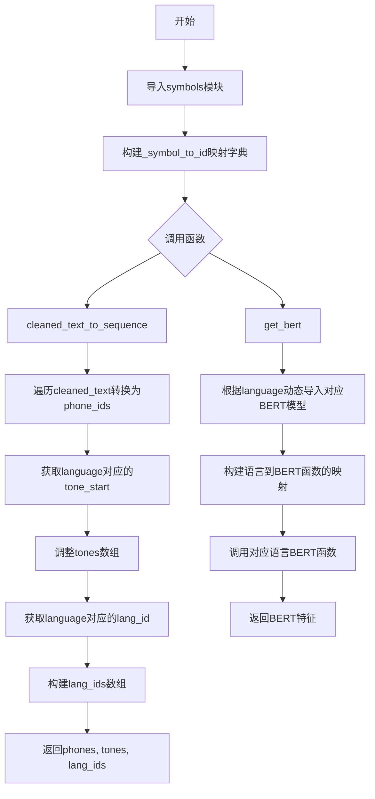
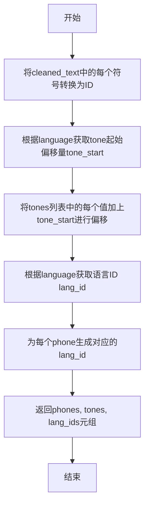
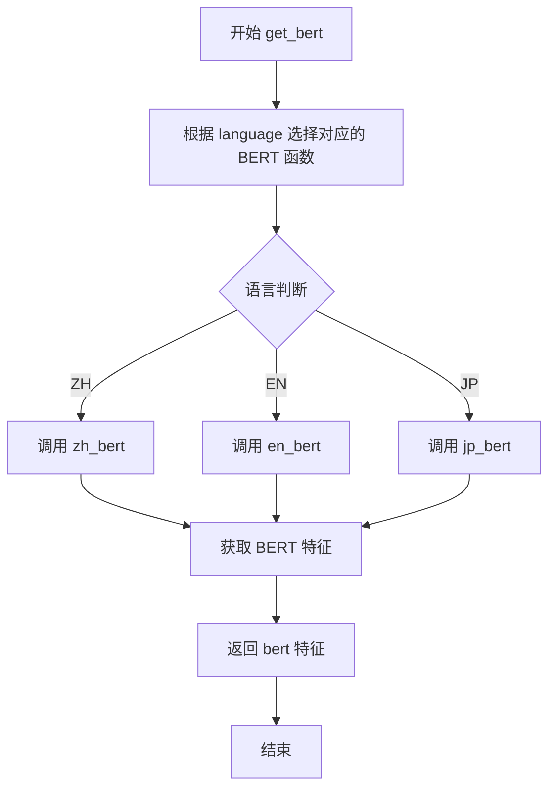

# `Bert-VITS2\oldVersion\V110\text\__init__.py` 详细设计文档

该模块是文本到语音合成的核心转换模块，负责将清洗后的文本转换为符号ID序列，并针对不同语言（中文、英文、日文）获取相应的BERT特征嵌入，用于支持多语言语音合成系统。

## 整体流程



## 类结构

```
text_to_sequence (模块)
├── 全局变量
│   └── _symbol_to_id (符号到ID的映射字典)
├── 全局函数
│   ├── cleaned_text_to_sequence (文本转序列)
│   └── get_bert (获取BERT特征)
```

## 全局变量及字段


### `_symbol_to_id`
    
将符号映射到对应ID的字典，用于文本到ID的转换

类型：`dict`
    


### `symbols`
    
来自symbols模块的符号列表，包含所有可能的音素或文本符号

类型：`list`
    


### `language_tone_start_map`
    
来自symbols模块的语言到音调起始ID的映射字典，用于确定不同语言的音调起始值

类型：`dict`
    


### `language_id_map`
    
来自symbols模块的语言到语言ID的映射字典，用于标识不同语言

类型：`dict`
    


    

## 全局函数及方法


### `cleaned_text_to_sequence`

该函数将清洗后的文本符号序列转换为对应的ID序列，同时处理音调和语言信息，返回音素ID列表、调整后的音调列表和语言ID列表。

参数：

- `cleaned_text`：`list`，待转换的符号列表，每个元素为文本符号
- `tones`：`list`，与符号对应的音调值列表
- `language`：`str`，语言标识符（如"ZH"、"EN"、"JP"）

返回值：`tuple`，包含三个列表——`phones`（符号对应的ID序列）、`tones`（调整后的音调序列）、`lang_ids`（语言ID序列）

#### 流程图



#### 带注释源码

```python
# 从symbols模块导入 symbols, language_tone_start_map, language_id_map
from .symbols import *

# 全局变量：符号到ID的映射字典
# 将每个符号映射到其对应的整数ID
_symbol_to_id = {s: i for i, s in enumerate(symbols)}


def cleaned_text_to_sequence(cleaned_text, tones, language):
    """Converts a string of text to a sequence of IDs corresponding to the symbols in the text.
    Args:
      text: string to convert to a sequence
    Returns:
      List of integers corresponding to the symbols in the text
    """
    # 步骤1：将文本符号列表转换为对应的ID列表
    phones = [_symbol_to_id[symbol] for symbol in cleaned_text]
    
    # 步骤2：获取当前语言的声音起始偏移量
    tone_start = language_tone_start_map[language]
    # 步骤3：将原始音调值加上起始偏移量，得到实际音调
    tones = [i + tone_start for i in tones]
    
    # 步骤4：获取当前语言的语言ID
    lang_id = language_id_map[language]
    # 步骤5：为每个音素生成对应的语言ID
    lang_ids = [lang_id for i in phones]
    
    # 返回：音素ID列表、调整后的音调列表、语言ID列表
    return phones, tones, lang_ids
```

#### 全局变量信息

| 变量名 | 类型 | 描述 |
|--------|------|------|
| `_symbol_to_id` | `dict` | 符号到整数的映射字典，用于将文本符号转换为ID |
| `symbols` | `list` | 从symbols模块导入的符号列表 |
| `language_tone_start_map` | `dict` | 从symbols模块导入的语言音调起始映射 |
| `language_id_map` | `dict` | 从symbols模块导入的语言ID映射 |

#### 潜在技术债务与优化空间

1. **函数文档与实现不匹配**：docstring中参数名为`text`，但实际参数为`cleaned_text`，且docstring描述过于简略
2. **硬编码假设**：假设`tones`与`phones`长度一致，没有进行长度校验
3. **错误处理缺失**：若`cleaned_text`中包含不在`_symbol_to_id`中的符号，会抛出`KeyError`异常
4. **魔法数字/映射依赖**：依赖外部模块的全局映射，缺乏对映射表存在性的检查


### `get_bert`

该函数是一个多语言BERT特征提取的路由函数，根据输入的语言参数（ZH/EN/JP）动态选择对应的BERT模型进行文本特征提取，并返回BERT embedding特征。

参数：

- `norm_text`：`str`，规范化后的文本内容
- `word2ph`：`list` 或 `dict`，词到音素的映射关系，用于对齐BERT特征
- `language`：`str`，语言标识符，可选值为 "ZH"、"EN"、"JP"
- `device`：`str` 或 `torch.device`，计算设备（CPU/GPU）

返回值：`torch.Tensor`，提取的BERT特征向量

#### 流程图



#### 带注释源码

```python
def get_bert(norm_text, word2ph, language, device):
    """
    根据语言类型获取对应的BERT特征提取函数并执行
    
    参数:
        norm_text: 规范化后的文本
        word2ph: 词到音素的映射
        language: 语言标识 (ZH/EN/JP)
        device: 计算设备
    
    返回:
        BERT特征向量
    """
    # 动态导入各语言对应的BERT特征提取模块
    from .chinese_bert import get_bert_feature as zh_bert      # 中文BERT
    from .english_bert_mock import get_bert_feature as en_bert # 英文BERT
    from .japanese_bert import get_bert_feature as jp_bert     # 日文BERT

    # 建立语言到BERT函数的映射字典
    lang_bert_func_map = {"ZH": zh_bert, "EN": en_bert, "JP": jp_bert}
    
    # 根据语言类型选择对应的BERT函数并调用
    bert = lang_bert_func_map[language](norm_text, word2ph, device)
    
    # 返回提取的BERT特征
    return bert
```

#### 关键组件信息

| 组件名称 | 描述 |
|---------|------|
| `zh_bert` | 中文BERT特征提取函数 |
| `en_bert` | 英文BERT特征提取函数 |
| `jp_bert` | 日文BERT特征提取函数 |
| `lang_bert_func_map` | 语言到BERT函数的映射字典 |

#### 潜在技术债务与优化空间

1. **硬编码映射**：语言与BERT函数的映射是硬编码的，若添加新语言需要修改函数源码，建议使用注册机制或配置文件管理
2. **动态导入开销**：每次调用都会执行导入语句，建议在模块级别预先导入或使用延迟加载
3. **缺少错误处理**：未对不支持的语言进行异常处理，传入无效language会抛出KeyError
4. **Mock实现**：英文BERT使用了mock实现（`english_bert_mock`），生产环境需要替换为真实实现

#### 其它项目

**设计目标与约束**：
- 支持多语言（中文、英文、日文）的BERT特征提取
- 统一接口设计，通过语言参数动态路由

**错误处理与异常设计**：
- 当传入不支持的语言标识时，会抛出 `KeyError` 异常
- 建议添加语言合法性校验并返回有意义的错误提示

**数据流与状态机**：
- 输入：文本、词音素映射、语言标识、设备信息
- 处理：根据语言路由到对应BERT模块
- 输出：BERT特征向量（通常为 [seq_len, hidden_size]）

**外部依赖与接口契约**：
- 依赖各语言BERT模块的 `get_bert_feature(text, word2ph, device)` 接口
- 要求各语言模块返回相同维度的特征张量以保证后续处理的一致性

## 关键组件


### 符号映射系统 (_symbol_to_id)

将符号列表转换为ID映射字典，用于后续文本到序列的转换

### 文本转序列引擎 (cleaned_text_to_sequence)

将清洗后的文本转换为符号ID序列，同时处理音调偏移和语言ID映射

### 多语言BERT特征提取器 (get_bert)

根据语言类型动态加载对应的BERT模型（中文/英文/日文），获取文本的语义特征

### 音调起始映射 (language_tone_start_map)

定义不同语言的音调起始索引，用于音调值的相对偏移计算

### 语言ID映射 (language_id_map)

定义不同语言对应的语言ID，用于后续模型处理的语言标识


## 问题及建议


### 已知问题

-   **全局变量依赖**：代码依赖全局变量`symbols`、`language_tone_start_map`和`language_id_map`，但这些变量在当前文件中未定义，导致代码可移植性和可测试性差
-   **缺乏输入验证**：`cleaned_text_to_sequence`函数未验证`cleaned_text`中的符号是否存在于`_symbol_to_id`映射中，也未验证`language`是否有效，可能导致KeyError
-   **错误处理缺失**：`get_bert`函数未处理不支持的语言情况，会直接抛出KeyError
-   **动态导入开销**：`get_bert`函数在每次调用时都执行动态导入操作，虽然Python有模块缓存，但这种写法不够优雅且增加运行时开销
-   **文档字符串错误**：`cleaned_text_to_sequence`的docstring中参数名为`text`，但实际参数名为`cleaned_text`，会造成误导
-   **类型提示缺失**：所有函数都缺少类型注解，不利于代码维护和IDE支持
-   **硬编码映射**：`lang_bert_func_map`字典硬编码了语言到BERT函数的映射，扩展时需要修改源码
-   **返回值假设未验证**：函数假设`phones`、`tones`、`lang_ids`三个列表长度一致，但未进行验证，可能导致调用方处理异常

### 优化建议

-   **消除全局依赖**：将`symbols`、`language_tone_start_map`和`language_id_map`作为参数传入，或创建配置类管理，优先推荐使用依赖注入提高可测试性
-   **添加输入验证**：在`cleaned_text_to_sequence`中添加逻辑检查符号有效性，在`get_bert`中添加语言支持检查，并提供友好的错误信息
-   **优化模块导入**：将BERT函数的导入移到模块顶部，或使用延迟加载机制，确保只导入需要的语言对应模块
-   **修正文档字符串**：将docstring中的`text`参数名更正为`cleaned_text`，保持文档与代码一致
-   **添加类型提示**：使用`typing`模块为所有函数添加参数和返回值的类型注解，如`def cleaned_text_to_sequence(cleaned_text: List[str], tones: List[int], language: str) -> Tuple[List[int], List[int], List[int]]:`
-   **解耦语言映射**：可考虑使用注册模式或配置文件管理语言与BERT函数的映射关系，便于扩展新语言支持
-   **验证数据一致性**：在返回前验证`phones`、`tones`、`lang_ids`长度一致，或使用断言确保数据正确性

## 其它


### 设计目标与约束

本模块作为VITS文本到语音系统的预处理核心组件，主要目标是将自然语言文本转换为模型可处理的符号ID序列及BERT特征表示。设计约束包括：支持中英日三种语言的文本处理、符号表大小固定为symbols列表长度、输入文本必须经过清洗和归一化处理、输出格式需严格匹配VITS模型的输入要求。

### 错误处理与异常设计

模块主要处理以下异常情况：1) KeyError当输入符号不在符号表中时抛出，建议在预处理阶段增加符号验证；2) KeyError当language参数不在language_id_map或language_tone_start_map中时抛出，需在调用前确保语言代码合法；3) ImportError当BERT模块导入失败时向上传播，调用方需确保chinese_bert、english_bert_mock、japanese_bert模块存在；4) 假设tones和cleaned_text长度一致，未做长度校验。

### 数据流与状态机

数据流分为两个主要分支：文本到符号ID分支（cleaned_text→phones→phones, tones, lang_ids）和BERT特征提取分支（norm_text→BERT模型→bert特征）。整体状态机包含：初始化状态（加载symbols和映射表）→文本验证状态→符号转换状态→特征提取状态→输出状态。状态转换依赖输入数据的完整性和合法性。

### 外部依赖与接口契约

本模块依赖以下外部接口：1) symbols模块中的symbols列表和language_id_map、language_tone_start_map字典；2) chinese_bert、english_bert_mock、japanese_bert三个BERT特征提取模块的get_bert_feature函数；3) 调用方需传入归一化后的文本norm_text、词素到音素映射word2ph、目标语言代码language和计算设备device。接口契约规定：language必须为"ZH"/"EN"/"JP"之一，cleaned_text中的所有符号必须在symbols列表中，tones列表长度必须与cleaned_text长度一致。

### 性能考虑

主要性能瓶颈在于BERT特征提取过程，计算复杂度与文本长度线性相关。优化建议：1) 可考虑增加符号表缓存避免每次重新构建_symbol_to_id映射；2) BERT特征提取可添加批处理支持以提高GPU利用率；3) 对于相同文本的重复请求可增加结果缓存机制；4) 当前实现为同步调用，可考虑异步化处理以提高整体吞吐量。

### 安全性考虑

代码本身不直接处理用户输入但会被下游模块调用，安全风险较低。需注意：1) 传入的device参数需验证合法性以防止注入攻击；2) BERT模型加载需确保模型文件来源可信；3) 文本处理过程需防止特殊字符导致的符号表越界访问。

### 配置管理

模块配置通过symbols模块集中管理，主要配置项包括：symbols符号表定义、language_id_map语言ID映射、language_tone_start_map音调起始ID映射。配置变更需同步更新三个BERT模块的实现。建议将语言代码常量提取为枚举类以避免硬编码字符串。

### 版本兼容性

当前版本兼容性考虑：1) symbols列表顺序直接影响符号ID映射，符号表变更需版本化管理和迁移脚本；2) BERT模块接口需保持get_bert_feature(norm_text, word2ph, device)的函数签名；3) 建议使用语义化版本号并记录breaking changes；4) 可考虑添加接口版本协商机制以支持多版本共存。

### 测试策略

建议测试覆盖以下场景：1) 单元测试验证各语言符号转换的正确性；2) 集成测试验证与VITS模型输入格式的兼容性；3) 边界测试处理空字符串、单字符、符号表中不存在的字符等异常输入；4) 性能测试评估不同文本长度下的处理时间；5) 回归测试确保修改不影响现有功能的正确性。

### 部署注意事项

部署时需确保：1) symbols模块与本模块版本匹配；2) 三个BERT模块同时部署且模型文件完整；3) Python环境满足依赖版本要求；4) 设备参数device需根据部署环境（CPU/GPU）正确配置；5) 建议将BERT模型预加载以减少首次调用延迟；6) 容器化部署时需注意模型文件的体积和加载策略。


    