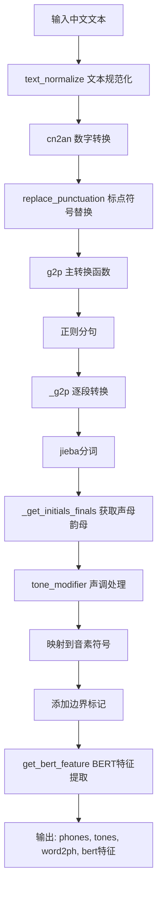
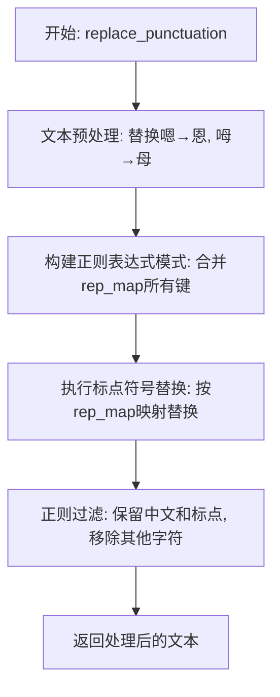
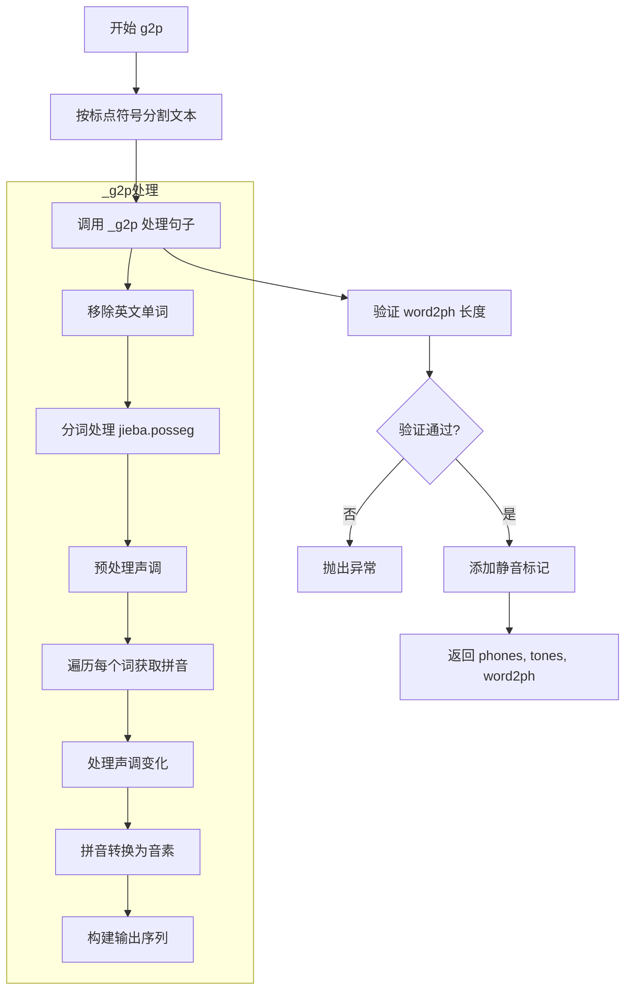
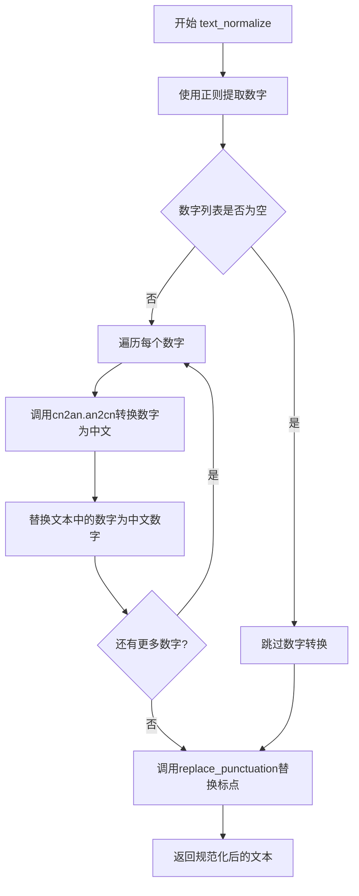
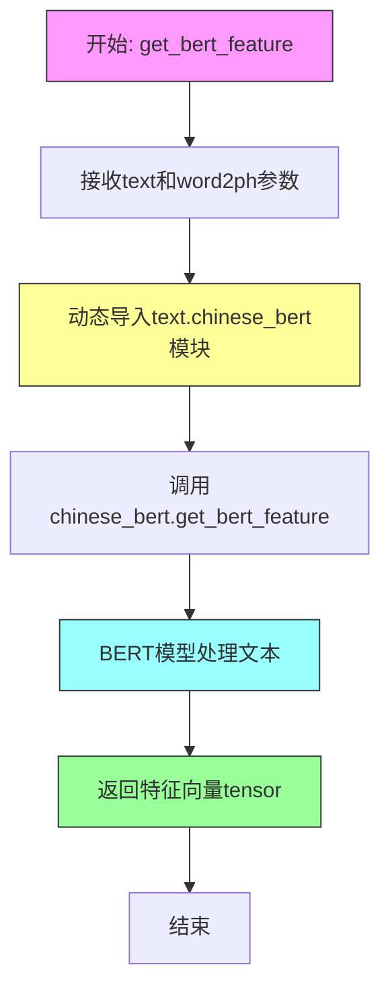

# `Bert-VITS2\oldVersion\V110\text\chinese.py` 详细设计文档

这是一个中文文本转拼音（Grapheme-to-Phoneme, G2P）转换模块，提供了文本规范化、标点符号处理、中文分词、声母韵母提取、声调处理以及BERT特征提取等功能，主要用于文本转语音（TTS）系统的预处理流程。

## 整体流程



## 类结构

```
该文件为模块文件，无类定义
所有功能通过全局函数实现
主要依赖: ToneSandhi (tone_sandhi模块)
外部依赖: cn2an, pypinyin, jieba, text.chinese_bert
```

## 全局变量及字段


### `current_file_path`
    
当前文件路径，用于定位资源文件

类型：`str`
    


### `pinyin_to_symbol_map`
    
拼音到音素符号的映射字典

类型：`dict`
    


### `rep_map`
    
标点符号替换映射表

类型：`dict`
    


### `tone_modifier`
    
声调变化处理对象

类型：`ToneSandhi`
    


    

## 全局函数及方法


### `replace_punctuation`

该函数用于将文本中的多种标点符号统一替换为标准符号，并过滤掉非中文、非标点的字符，仅保留中文和标点符号。

参数：
- `text`：`str`，需要替换标点符号的原始文本

返回值：`str`，替换标点符号并过滤非中文非标点字符后的文本

#### 流程图



#### 带注释源码

```python
def replace_punctuation(text):
    """
    替换文本中的标点符号为统一符号，并过滤非中文非标点字符
    
    处理流程：
    1. 将语气词"嗯""呣"替换为"恩""母"
    2. 将各类中文标点统一映射为英文/标准标点
    3. 删除所有非中文且非标点的字符
    
    Args:
        text: 输入的原始文本字符串
        
    Returns:
        处理后的文本，仅包含中文和标点符号
    """
    # 步骤1: 语气词替换，将"嗯"替换为"恩"，"呣"替换为"母"
    text = text.replace("嗯", "恩").replace("呣", "母")
    
    # 步骤2: 构建正则表达式，匹配rep_map中所有的标点符号
    # 使用re.escape转义特殊字符，用|连接作为或运算
    pattern = re.compile("|".join(re.escape(p) for p in rep_map.keys()))

    # 执行替换：将匹配到的标点符号替换为rep_map中对应的统一符号
    replaced_text = pattern.sub(lambda x: rep_map[x.group()], text)

    # 步骤3: 正则过滤，删除非中文且非标点的字符
    # \u4e00-\u9fa5 是中文unicode范围
    # "".join(punctuation) 是所有标点符号
    replaced_text = re.sub(
        r"[^\u4e00-\u9fa5" + "".join(punctuation) + r"]+", "", replaced_text
    )

    # 返回处理后的文本
    return replaced_text
```


### `g2p`

主转换函数，将中文文本转换为音素序列、声调序列和词到音素的映射。该函数首先对输入文本按标点符号进行句子分割，然后调用内部函数 `_g2p` 进行核心转换处理，最后在结果序列前后添加静音标记。

#### 参数

- `text`：`str`，待转换的中文文本字符串

#### 返回值

`tuple`，包含三个元素的元组：
- `phones`：`list[str]`，转换后的音素序列列表
- `tones`：`list[int]`，对应的声调序列列表
- `word2ph`：`list[int]`，词到音素的映射关系列表

#### 流程图



#### 带注释源码

```python
def g2p(text):
    """
    主转换函数，将中文文本转换为音素序列、声调序列和词到音素的映射
    
    参数:
        text: str - 待转换的中文文本字符串
        
    返回值:
        tuple: (phones, tones, word2ph)
            - phones: 音素序列列表
            - tones: 声调序列列表  
            - word2ph: 词到音素的映射关系列表
    """
    # 构建正则表达式，按标点符号分割句子
    # (?<=...) 是正向后查找断言，匹配标点符号后的位置
    pattern = r"(?<=[{0}])\s*".format("".join(punctuation))
    
    # 使用正则分割文本，去除空字符串
    sentences = [i for i in re.split(pattern, text) if i.strip() != ""]
    
    # 调用内部函数 _g2p 进行核心转换处理
    phones, tones, word2ph = _g2p(sentences)
    
    # 验证 word2ph 总和是否等于 phones 长度
    assert sum(word2ph) == len(phones)
    
    # 验证 word2ph 长度是否等于原始文本长度
    assert len(word2ph) == len(text)  # 有时会崩溃，可添加 try-catch
    
    # 在音素序列前后添加静音标记 "_"
    phones = ["_"] + phones + ["_"]
    
    # 在声调序列前后添加静音标记 0
    tones = [0] + tones + [0]
    
    # 在词到音素映射前后添加默认值 1
    word2ph = [1] + word2ph + [1]
    
    # 返回转换结果
    return phones, tones, word2ph
```


### `_get_initials_finals`

该函数用于将单个汉字或词语转换为对应的拼音声母和韵母列表。它使用 pypinyin 库获取汉字的声母（INITIALS）和带声调的韵母（FINALS_TONE3），并将结果分别存入两个列表中返回。

参数：

- `word`：`str`，需要转换的汉字或词语

返回值：`tuple`，包含两个列表元组 - (initials, finals)，其中 initials 是声母列表，finals 是带声调的韵母列表

#### 流程图

```mermaid
flowchart TD
    A[开始 _get_initials_finals] --> B[创建空列表 initials 和 finals]
    B --> C[调用 lazy_pinyin 获取声母列表<br/>style=Style.INITIALS]
    C --> D[调用 lazy_pinyin 获取韵母列表<br/>style=Style.FINALS_TONE3]
    D --> E[遍历声母和韵母配对<br/>for c, v in zip]
    E --> F[将声母 c 添加到 initials 列表]
    F --> G[将韵母 v 添加到 finals 列表]
    G --> H{是否还有未处理的配对?}
    H -->|是| E
    H -->|否| I[返回 (initials, finals) 元组]
    I --> J[结束]
```

#### 带注释源码

```python
def _get_initials_finals(word):
    """
    获取汉字的声母列表和韵母列表
    
    参数:
        word: str, 需要转换的汉字或词语
    
    返回:
        tuple: (initials, finals) 两个列表的元组
               - initials: 声母列表
               - finals: 带声调的韵母列表
    """
    # 初始化空列表用于存储声母和韵母
    initials = []
    finals = []
    
    # 使用 pypinyin 的 lazy_pinyin 获取声母 (INITIALS)
    # neutral_tone_with_five=True 表示轻声用5表示
    # Style.INITIALS 只返回声母部分
    orig_initials = lazy_pinyin(word, neutral_tone_with_five=True, style=Style.INITIALS)
    
    # 使用 pypinyin 的 lazy_pinyin 获取带声调的韵母 (FINALS_TONE3)
    # Style.FINALS_TONE3 返回带声调数字的韵母
    orig_finals = lazy_pinyin(
        word, neutral_tone_with_five=True, style=Style.FINALS_TONE3
    )
    
    # 遍历声母和韵母的配对
    for c, v in zip(orig_initials, orig_finals):
        # c 是声母, v 是带声调的韵母
        initials.append(c)
        finals.append(v)
    
    # 返回声母列表和韵母列表的元组
    return initials, finals
```


### `_g2p`

`_g2p` 是内部转换函数，处理分词后的段落并转换为拼音序列。该函数遍历每个分词片段，使用 `jieba` 进行词性标注，结合 `pypinyin` 获取拼音的声母和韵母，经过声调修正和拼音规范化处理，最终输出音素列表、声调列表和字符到音素的映射关系。

参数：

-  `segments`：`list`，分词后的文本段落列表，每个元素是一个字符串片段

返回值：`tuple`，包含三个列表 —— phones_list（音素列表）、tones_list（声调列表）、word2ph（字符到音素的映射）

#### 流程图

```mermaid
flowchart TD
    A[开始 _g2p] --> B[初始化 phones_list, tones_list, word2ph]
    B --> C{遍历 segments}
    C -->|每个seg| D[移除英文字符]
    D --> E[使用 jieba 分词 + 词性标注]
    E --> F[tone_modifier.pre_merge_for_modify 预处理]
    F --> G{遍历 seg_cut 中的每个词}
    G -->|word, pos| H{pos == 'eng'}
    H -->|是| I[跳过当前词]
    H -->|否| J[_get_initials_finals 获取声母韵母]
    J --> K[tone_modifier.modified_tone 修正声调]
    K --> L[添加声母韵母到列表]
    L --> G
    G -->|遍历完成| M[展平 initials 和 finals 列表]
    M --> N{遍历 initials 和 finals 配对}
    N -->|c, v| O{c == v?}
    O -->|是| P[断言 c 是标点符号<br/>phone = [c], tone = 0]
    O -->|否| Q[提取韵母声调<br/>v_without_tone = v[:-1]<br/>tone = v[-1]]
    Q --> R{有声母 c?}
    R -->|是| S[多音节处理<br/>替换 ui, iu, un]
    R -->|否| T[单音节处理<br/>替换 ing→ying, i→yi 等]
    S --> U{验证 pinyin 在映射中}
    T --> U
    U --> V[pinyin_to_symbol_map 查表转换]
    V --> W[word2ph 记录音素个数]
    W --> N
    N -->|遍历完成| X[返回 phones_list, tones_list, word2ph]
```

#### 带注释源码

```python
def _g2p(segments):
    """
    将分词后的文本段落转换为拼音序列
    
    Args:
        segments: 分词后的文本段落列表
        
    Returns:
        tuple: (phones_list, tones_list, word2ph) 音素列表、声调列表、字符到音素映射
    """
    phones_list = []  # 存放最终的音素列表
    tones_list = []   # 存放最终的声调列表
    word2ph = []      # 存放每个汉字对应的音素个数
    
    # 遍历每一个分词后的片段
    for seg in segments:
        # 移除段落中所有的英文字符（包括英文单词和标点）
        seg = re.sub("[a-zA-Z]+", "", seg)
        
        # 使用 jieba 进行分词，同时获取词性标注
        # 返回格式: [(word, pos), ...]
        seg_cut = psg.lcut(seg)
        
        initials = []  # 存放该片段所有词的声母列表
        finals = []    # 存放该片段所有词的韵母列表
        
        # 预处理：合并某些词（如"不得"→"甭"）以优化声调处理
        seg_cut = tone_modifier.pre_merge_for_modify(seg_cut)
        
        # 遍历分词结果中的每个词及词性
        for word, pos in seg_cut:
            # 跳过英文词性（已经通过正则移除英文，这里是双保险）
            if pos == "eng":
                continue
            
            # 获取该字的声母（initial）和韵母（final）列表
            # 例如 "中" -> initials=['zh'], finals=['ong']
            sub_initials, sub_finals = _get_initials_finals(word)
            
            # 根据词性和词语对韵母进行声调修正
            # 例如 "长城" -> 长(cháng)城(cheng) 而非 长(cháng)城(chéng)
            sub_finals = tone_modifier.modified_tone(word, pos, sub_finals)
            
            # 将该字的声母和韵母添加到列表中
            initials.append(sub_initials)
            finals.append(sub_finals)
        
        # 展平嵌套列表：将 [[a,b], [c,d]] 转换为 [a,b,c,d]
        initials = sum(initials, [])
        finals = sum(finals, [])
        
        # 遍历每个字的声母和韵母配对
        for c, v in zip(initials, finals):
            # 组合原始拼音（如 "zh" + "ong" = "zhong"）
            raw_pinyin = c + v
            
            # 判断是否为标点符号（声母等于韵母时为标点）
            if c == v:
                # 断言确认 c 是标点符号
                assert c in punctuation
                # 标点符号的音素就是它本身，声调设为 0
                phone = [c]
                tone = "0"
                word2ph.append(1)
            else:
                # 分离韵母和声调
                # 例如 "ong3" -> v_without_tone="ong", tone="3"
                v_without_tone = v[:-1]  # 去掉最后一个字符（声调）
                tone = v[-1]              # 最后一个字符是声调
                
                # 组合去除声调后的拼音
                pinyin = c + v_without_tone
                
                # 断言声调在有效范围内（1-5，5为轻声）
                assert tone in "12345"
                
                # 声母存在时：处理多音节韵母的特殊映射
                if c:
                    # 韦→ui, 牛→iu, 论→un 等
                    v_rep_map = {
                        "uei": "ui",
                        "iou": "iu",
                        "uen": "un",
                    }
                    if v_without_tone in v_rep_map.keys():
                        pinyin = c + v_rep_map[v_without_tone]
                else:
                    # 零声母时：处理单音节的特殊映射
                    # ing→ying, i→yi, in→yin, u→wu 等
                    pinyin_rep_map = {
                        "ing": "ying",
                        "i": "yi",
                        "in": "yin",
                        "u": "wu",
                    }
                    if pinyin in pinyin_rep_map.keys():
                        pinyin = pinyin_rep_map[pinyin]
                    else:
                        # 处理第一个韵母字母的映射
                        # v→yu, e→e, i→y, u→w
                        single_rep_map = {
                            "v": "yu",
                            "e": "e",
                            "i": "y",
                            "u": "w",
                        }
                        if pinyin[0] in single_rep_map.keys():
                            pinyin = single_rep_map[pinyin[0]] + pinyin[1:]
                
                # 断言转换后的拼音在符号映射表中存在
                # pinyin_to_symbol_map 从 opencpop-strict.txt 加载
                assert pinyin in pinyin_to_symbol_map.keys(), (pinyin, seg, raw_pinyin)
                
                # 查表获取音素序列（可能一个拼音对应多个音素）
                # 例如 "ai" -> ["a", "i"]
                phone = pinyin_to_symbol_map[pinyin].split(" ")
                # 记录该字对应的音素个数
                word2ph.append(len(phone))
            
            # 将音素添加到结果列表
            phones_list += phone
            # 将声调添加到结果列表（每个音素对应一个声调）
            tones_list += [int(tone)] * len(phone)
    
    return phones_list, tones_list, word2ph
```


### `text_normalize`

文本规范化函数，将文本中的阿拉伯数字转换为中文数字，并对标点符号进行统一替换处理。

参数：

- `text`：`str`，待规范化的原始文本

返回值：`str`，规范化处理后的文本

#### 流程图



#### 带注释源码

```python
def text_normalize(text):
    """
    文本规范化函数，将阿拉伯数字转换为中文数字并替换标点符号
    
    参数:
        text: str - 待处理的原始文本
        
    返回:
        str - 规范化处理后的文本
    """
    # 使用正则表达式查找文本中的数字，支持整数和小数
    # \d+ 匹配一个或多个数字
    # (?:\.?\d+)? 可选的小数部分（点号加数字）
    numbers = re.findall(r"\d+(?:\.?\d+)?", text)
    
    # 遍历找到的每个数字，将其转换为中文数字
    for number in numbers:
        # cn2an.an2cn() 将阿拉伯数字转换为中文数字
        # replace(..., 1) 只替换第一次出现的数字，避免重复替换问题
        text = text.replace(number, cn2an.an2cn(number), 1)
    
    # 调用replace_punctuation函数进行标点符号替换
    # 该函数会将各种中文标点转换为英文/统一标点
    text = replace_punctuation(text)
    
    # 返回规范化后的文本
    return text
```


### `get_bert_feature`

该函数是一个封装函数，通过调用`chinese_bert`模块中的BERT模型获取文本的特征表示，将输入的中文文本转换为高维向量表示，用于后续的语音合成或其他NLP任务。

参数：

- `text`：`str`，待处理的中文文本字符串
- `word2ph`：`list`，字符到音素（phoneme）的映射列表，表示每个字符对应的音素数量，用于BERT特征与音素的对齐

返回值：`tensor`，BERT模型提取的文本特征向量，通常为形状`[batch_size, seq_len, hidden_size]`的张量

#### 流程图



#### 带注释源码

```python
def get_bert_feature(text, word2ph):
    """
    获取文本的BERT特征表示
    
    这是一个封装函数，将文本处理请求委托给chinese_bert模块。
    采用了延迟导入的方式，避免循环依赖问题。
    
    Args:
        text (str): 输入的中文文本字符串
        word2ph (list): 字符到音素的映射列表，用于特征对齐
    
    Returns:
        tensor: BERT模型输出的文本特征向量
    """
    # 使用延迟导入避免模块初始化时的循环依赖
    # text包在运行时动态加载chinese_bert子模块
    from text import chinese_bert

    # 委托给chinese_bert模块的实际实现
    # 该模块通常使用HuggingFace Transformers库的BERT模型
    # 例如: bert-base-chinese 或其他中文预训练模型
    return chinese_bert.get_bert_feature(text, word2ph)
```

---

**注意**：由于原始代码中未包含`chinese_bert`模块的实际实现，以上分析基于函数签名和调用模式的合理推断。实际的BERT特征提取逻辑位于`text/chinese_bert.py`模块中，通常涉及以下步骤：

1. 分词（使用BERT tokenizer）
2. 将`word2ph`用于特征对齐（扩展或缩减BERT输出以匹配音素序列）
3. BERT前向传播
4. 返回隐藏状态或池化后的向量

## 关键组件


### 1. 文本规范化模块 (Text Normalization)

该模块负责将原始中文文本转换为标准格式，包括数字转中文数字（使用cn2an库）和标点符号统一替换两个核心步骤，为后续拼音转换提供干净的输入。

### 2. 标点符号映射表 (rep_map)

定义了中英文标点符号的映射关系，将多种形式的标点（如中文顿号"、"、书名号"《》"等）统一转换为拼音系统兼容的符号，是反量化支持的重要组成部分。

### 3. 拼音到符号映射 (pinyin_to_symbol_map)

从"opencpop-strict.txt"文件加载的映射表，实现了拼音到音素（phone）符号的转换，是整个G2P系统的核心查询表，支持音素级别的输出。

### 4. 声调沙洗模块 (ToneSandhi)

通过ToneSandhi类处理中文声调变化规则，包括变调、轻声处理等，使用"0-5"的数字编码方案（0为轻声，1-4为四声，5为轻声）是量化策略的具体体现。

### 5. BERT特征惰性加载 (get_bert_feature)

采用延迟导入策略，从text模块动态加载chinese_bert获取BERT嵌入向量，实现计算资源的按需加载。

### 6. 字符-音素对齐映射 (word2ph)

记录每个汉字对应音素数量的列表，用于确保输出音素序列长度与输入文本对齐，是语音合成中关键的对齐信息。

### 7. 拼音转换核心逻辑 (_g2p)

处理多音节和单音节的拼音映射规则，包括韵母替换（如"uei"→"ui"、"iou"→"iu"）和声母处理，体现了完整的反量化支持机制。

### 8. 初始化与韵母分离 (_get_initials_finals)

使用pypinyin库将汉字分离为声母和韵母两部分，为后续音素生成提供基础数据，支持neutral_tone_with_five=True的五声调模式。


## 问题及建议


### 已知问题

-   **文件句柄泄漏**：`pinyin_to_symbol_map` 使用 `open()` 直接读取文件，未使用上下文管理器（with语句），在异常情况下可能导致文件句柄未关闭
-   **重复编译正则表达式**：`replace_punctuation` 函数每次调用都重新编译正则表达式，`g2p` 函数中的 `pattern` 也存在同样问题，应在模块级别缓存编译后的正则表达式对象
-   **缺乏类型注解**：所有函数均未添加类型提示（Type Hints），降低了代码可读性和IDE支持
-   **断言用于业务逻辑**：多处使用 `assert` 进行业务验证（如 `assert sum(word2ph) == len(phones)`），在 Python 优化模式下（python -O）会被跳过，应改为显式异常抛出
-   **魔法数字和硬编码**：拼音映射替换规则（`v_rep_map`、`pinyin_rep_map`、`single_rep_map`）作为嵌套字典硬编码在函数内部，难以维护和扩展
-   **模块级副作用**：在导入时立即读取文件并创建 `pinyin_to_symbol_map` 全局字典，增加了启动时间且不利于单元测试
-   **内部函数暴露**：`text_normalize` 调用 `replace_punctuation`，但 `replace_punctuation` 被设计为内部函数却未使用单下划线前缀约定
-   **不一致的错误处理**：部分断言失败时提供上下文信息，但未使用自定义异常类，错误信息格式不统一

### 优化建议

-   使用 `with open(...) as f:` 模式读取文件，或将文件路径配置外部化，通过依赖注入方式提供
-   在模块顶部预编译所有正则表达式：`RE_PUNCTUATION = re.compile("|".join(re.escape(p) for p in rep_map.keys()))`
-   为所有公共函数添加类型注解，例如 `def g2p(text: str) -> tuple[list[str], list[int], list[int]]:`
-   将 `assert` 语句替换为 `if ... raise ValueError(...)` 形式，提供更友好的错误消息
-   将拼音映射规则抽取为独立的配置文件或数据类，提高可维护性
-   使用懒加载模式（lazy loading）处理 `pinyin_to_symbol_map`，或改为单例模式管理
-   统一命名约定，使用单下划线前缀标记内部函数 `_replace_punctuation`
-   创建自定义异常类（如 `TextProcessingError`）统一错误处理方式

## 其它


### 设计目标与约束

本模块旨在将中文文本转换为拼音音素序列，为语音合成系统提供必要的输入数据。设计目标包括：支持中文文本的标准化处理，包括数字转中文、标点符号规范化；实现准确的中文到拼音的转换，考虑多音字和声调变化；生成与文本对齐的音素序列（word2ph）；输出符合语音合成框架要求的音素、声调和对齐信息。约束条件包括：依赖pypinyin库进行拼音转换；依赖jieba进行中文分词；依赖cn2an进行数字到中文的转换；需要外部的BERT模型进行特征提取。

### 错误处理与异常设计

在代码中使用了assert语句进行关键变量的验证，例如验证word2ph总和与phones长度一致、验证拼音在符号映射表中存在、验证声调在有效范围内等。对于可能出现的异常情况，如拼音映射不存在、文本处理异常等，代码通过assert抛出错误并附带相关上下文信息（pinyin, seg, raw_pinyin）。在word2ph与text长度不匹配时，代码提示可以使用try-catch进行处理。潜在改进：可添加更友好的错误提示信息，将assert替换为自定义异常类，提供错误恢复机制。

### 数据流与状态机

数据流处理流程如下：1）输入原始中文文本；2）text_normalize进行文本规范化，包括数字转中文、标点符号替换；3）g2p函数将规范化文本分割为句子段；4）对每个句子段进行分词处理（psg.lcut）；5）对每个词语提取声母和韵母；6）应用声调修正（ToneSandhi）；7）处理多音字和特殊拼音映射；8）通过pinyin_to_symbol_map将拼音转换为音素序列；9）组装phones、tones、word2ph并添加边界标记；10）调用BERT模型获取文本特征。状态机主要体现在分词和拼音转换过程中的状态变化：初始状态→分词状态→声母韵母提取状态→声调处理状态→音素映射状态→最终输出状态。

### 外部依赖与接口契约

主要外部依赖包括：cn2an用于阿拉伯数字转中文数字；pypinyin（lazy_pinyin, Style）用于获取汉字的拼音（声母和韵母）；jieba.posseg（psg）用于中文分词并标注词性；ToneSandhi类来自tone_sandhi模块用于声调处理；pinyin_to_symbol_map从opencpop-strict.txt文件加载拼音到音素的映射关系；punctuation来自symbols模块定义标点符号集；chinese_bert模块用于获取BERT特征。接口契约：g2p(text)输入为字符串，返回(phones列表, tones列表, word2ph列表)；text_normalize(text)输入为字符串，返回规范化后的字符串；replace_punctuation(text)输入为字符串，返回处理后的字符串；get_bert_feature(text, word2ph)返回BERT特征矩阵。

### 性能考虑

当前实现存在以下性能瓶颈：1）每次导入模块时都会读取并解析opencpop-strict.txt文件，建议缓存pinyin_to_symbol_map；2）正则表达式在replace_punctuation中每次调用都重新编译，建议预编译；3）文件读取未使用with语句，可能导致资源泄漏；4）re.sub在循环中频繁调用，建议优化；5）sum(initials, [])和sum(finals, [])效率较低，建议使用列表推导式或itertools.chain。优化建议：将文件读取改为一次性加载或延迟加载；预编译所有正则表达式；使用列表推导式替代sum合并；考虑使用生成器处理大数据量。

### 安全性考虑

代码中使用了open()而未指定编码，可能导致跨平台兼容性问题，建议显式指定encoding='utf-8'。文件路径处理使用了os.path.join但未进行路径验证，存在潜在的路径遍历风险。代码依赖外部文件opencpop-strict.txt，需要确保该文件存在且格式正确。外部模块导入（chinese_bert）未做异常处理，可能导致导入失败。建议添加：文件编码显式指定；路径安全验证；依赖可用性检查；异常处理机制。

### 配置与参数说明

关键配置参数包括：rep_map标点符号映射表定义了中文标点符号到英文或统一符号的转换规则；tone_modifier是ToneSandhi类实例用于声调处理；pinyin_to_symbol_map是从文件加载的拼音到音素的映射字典。这些配置目前是硬编码的，建议抽取为配置文件以提高灵活性。

### 使用示例与局限性

使用示例：
```python
text = "啊！但是《原神》是由,米哈游自主,[研发]的一款全新开放世界冒险游戏"
normalized_text = text_normalize(text)  # 规范化文本
phones, tones, word2ph = g2p(normalized_text)  # 获取音素序列
bert = get_bert_feature(normalized_text, word2ph)  # 获取BERT特征
```

局限性说明：1）仅支持中文文本处理，对其他语言支持有限；2）依赖于特定的拼音到音素映射文件格式；3）数字转换依赖cn2an库，对某些特殊数字格式可能处理不当；4）英文单词会被直接移除（re.sub("[a-zA-Z]+", "", seg)）；5）多音字处理基于词性判断，可能不够准确；6）声调处理依赖ToneSandhi模块，对某些方言或特殊用法可能不适用；7）未处理的生僻字可能导致错误。

    