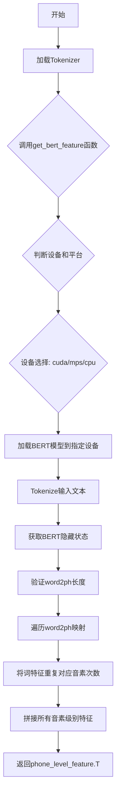

# `Bert-VITS2\oldVersion\V110\text\chinese_bert.py` 详细设计文档

该代码使用预训练的中文RoBERTa-wwm-ext-large模型（BERT的掩码语言模型变体）提取文本特征，并将词级别的特征根据词到音素的映射关系扩展为音素级别的特征序列，用于语音合成等任务。

## 整体流程



## 类结构

```
无类定义（脚本文件）
全局变量: tokenizer
全局函数: get_bert_feature
```

## 全局变量及字段


### `tokenizer`
    
全局分词器对象，用于将文本转换为token序列

类型：`AutoTokenizer`
    


    

## 全局函数及方法


### `get_bert_feature`

该函数是BERT特征提取的核心入口，用于将输入文本通过预训练的中文RoBERTa-wwm-ext-large模型提取词级别隐藏状态特征，并根据word2ph映射将词级别特征膨胀为音素（phone）级别的特征，最终返回转置后的音素级别特征矩阵。

参数：

- `text`：`str`，待处理的输入文本字符串
- `word2ph`：`List[int]`，词到音素的映射数组，指定每个词对应多少个音素帧
- `device`：`Optional[str]`，计算设备类型，可选值为"cuda"、"mps"或"cpu"，默认为None

返回值：`torch.Tensor`，音素级别的特征矩阵，形状为(特征维度, 音素数量)，即(1024, total_phones)

#### 流程图

```mermaid
flowchart TD
    A[开始 get_bert_feature] --> B{platform == darwin<br/>AND mps可用<br/>AND device == cpu?}
    B -->|Yes| C[device = "mps"]
    B -->|No| D{device is None?}
    D -->|Yes| E[device = "cuda"]
    D -->|No| F[保持原device]
    C --> G[加载BERT模型<br/>chinese-roberta-wwm-ext-large]
    E --> G
    F --> G
    G --> H[model.to device]
    H --> I[tokenizer分词<br/>return_tensors="pt"]
    I --> J[inputs张量<br/>移到device]
    J --> K[model前向传播<br/>output_hidden_states=True]
    K --> L[取hidden_states[-3:-2]<br/>即倒数第三层]
    L --> M[res[0].cpu]<br/>去除batch维
    M --> N[assert len(word2ph)<br/>== len(text) + 2]
    N --> O[初始化phone_level_feature]
    O --> P{i in range<br/>len(word2phone)}
    P -->|Yes| Q[res[i].repeat<br/>word2phone[i], 1]
    Q --> R[append到列表]
    R --> P
    P -->|No| S[torch.cat<br/>dim=0]
    S --> T[返回 .T转置]
    T --> U[结束]
```

#### 带注释源码

```python
import torch
import sys
from transformers import AutoTokenizer, AutoModelForMaskedLM

# 全局变量：预训练BERT分词器，加载一次即可避免重复加载
tokenizer = AutoTokenizer.from_pretrained("./bert/chinese-roberta-wwm-ext-large")


def get_bert_feature(text, word2ph, device=None):
    """
    从BERT模型提取文本特征并转换为音素级别特征
    
    Args:
        text: 输入文本字符串
        word2ph: 词到音素的映射列表，每个元素表示对应词需要重复的帧数
        device: 计算设备，None时默认为cuda
    
    Returns:
        torch.Tensor: 音素级别特征，形状为(特征维度, 音素总数)
    """
    # 设备选择逻辑：优先使用MPS（苹果芯片加速），其次cuda，默认为cuda
    if (
        sys.platform == "darwin"
        and torch.backends.mps.is_available()
        and device == "cpu"
    ):
        device = "mps"
    if not device:
        device = "cuda"
    
    # 加载预训练BERT模型并移动到指定设备
    # 使用AutoModelForMaskedLM获取MLM模型的隐藏状态
    model = AutoModelForMaskedLM.from_pretrained(
        "./bert/chinese-roberta-wwm-ext-large"
    ).to(device)
    
    # 禁用梯度计算以节省显存和计算资源
    with torch.no_grad():
        # 使用tokenizer将文本转换为模型输入
        inputs = tokenizer(text, return_tensors="pt")
        # 将所有输入张量移动到目标设备
        for i in inputs:
            inputs[i] = inputs[i].to(device)
        
        # 前向传播，获取所有隐藏状态
        # output_hidden_states=True确保返回所有层的隐藏状态
        res = model(**inputs, output_hidden_states=True)
        
        # 提取倒数第三层的隐藏状态（-3:-2取倒数第三层，单层）
        # 并去除batch维度，移到CPU
        res = torch.cat(res["hidden_states"][-3:-2], -1)[0].cpu()

    # 验证word2ph长度：应等于文本长度加2（考虑[CLS]和[SEP]token）
    assert len(word2ph) == len(text) + 2
    word2phone = word2ph
    phone_level_feature = []
    
    # 遍历每个词，根据word2phone映射重复特征
    # 将词级别特征膨胀为音素级别特征
    for i in range(len(word2phone)):
        # 对第i个词的隐藏状态按音素数重复
        # repeat(次数, 1) - 在维度0上重复，维度1保持不变
        repeat_feature = res[i].repeat(word2phone[i], 1)
        phone_level_feature.append(repeat_feature)

    # 沿维度0拼接所有音素级别的特征
    phone_level_feature = torch.cat(phone_level_feature, dim=0)

    # 转置返回：形状从(音素数, 特征维度)变为(特征维度, 音素数)
    return phone_level_feature.T
```

## 关键组件


### 预训练模型加载模块

负责加载中文RoBERTa-wwm-ext-large预训练模型，支持CPU、CUDA和MPS设备自动选择与模型迁移。

### 分词器组件

使用transformers库的AutoTokenizer从本地路径加载BERT分词器，用于将输入文本转换为模型可处理的token序列。

### 设备管理模块

根据系统平台和可用后端自动选择计算设备：优先使用MPS(macOS)、其次CUDA、最后CPU，并处理设备不匹配时的设备迁移逻辑。

### BERT特征提取器

从预训练模型中提取指定层的hidden states（取倒数第3层），将序列级别的特征进行维度拼接后输出词级别特征向量。

### 词到音素映射模块

根据word2ph映射数组将词级别特征扩展为音素级别特征，对每个词的特征向量按映射次数进行重复，生成可变长度的音素级特征序列。

### 张量索引与拼接组件

从模型输出的hidden states元组中通过切片操作`[-3:-2]`提取特定层，并通过`torch.cat`在最后一个维度进行拼接，将token级别特征转换为词级别特征。

### 特征重复扩展模块

对每个词的特征向量按对应音素数量进行重复操作，使用PyTorch的repeat方法生成phone_level_feature列表。

### 全局变量

- tokenizer: AutoTokenizer类型，预加载的中文分词器实例
- get_bert_feature: 函数，输入文本和词phoneme映射返回音素级别特征


## 问题及建议


### 已知问题

- **模型重复加载**：每次调用 `get_bert_feature()` 都会重新加载 BERT 模型，导致严重的性能开销
- **设备选择逻辑缺陷**：`device == "cpu"` 时才检查 mps，逻辑不合理，应在 `device is None` 时自动选择可用设备
- **硬编码路径重复**：模型路径在 `tokenizer` 加载和 `model` 加载处重复出现，缺乏统一管理
- **变量命名不一致**：`word2ph` 和 `word2phone` 混用，容易造成混淆
- **assert 位置不当**：长度校验在模型推理之后，失败时浪费计算资源
- **缺乏类型注解**：函数参数和返回值均无类型注解，降低代码可读性和可维护性
- **无错误处理**：模型路径不存在、模型加载失败等场景无异常捕获
- **资源未显式释放**：模型加载到 GPU 后无显式内存管理

### 优化建议

- 将模型加载提取到函数外部（模块级或调用方），实现模型复用
- 统一模型路径为常量或配置项，避免重复定义
- 修正设备选择逻辑：优先检测 CUDA > MPS > CPU
- 添加函数文档字符串，说明参数、返回值和用途
- 补充类型注解：`text: str`, `word2ph: List[int]`, `device: Optional[str] -> torch.Tensor`
- 在函数入口处提前进行长度校验，避免无效计算
- 添加 try-except 捕获模型加载和推理异常，提供明确错误信息
- 使用 `transformers` 的 `pipeline` 或 `AutoModel` 的 `from_pretrained` 时配合 `device_map` 自动分配设备

## 其它


### 设计目标与约束

本代码旨在将中文文本通过BERT模型编码后，转换为phone级别的特征向量，用于语音合成或语音处理任务。核心约束包括：模型路径固定为"./bert/chinese-roberta-wwm-ext-large"，仅支持PyTorch框架，设备优先使用GPU（cuda），Mac平台支持MPS加速，文本长度受BERT最大长度限制（512 tokens）。

### 错误处理与异常设计

代码主要依赖assert语句进行参数校验（word2ph长度必须等于text长度+2），未实现完善的异常捕获机制。潜在异常包括：模型加载失败（路径不存在）、CUDA不可用、GPU内存不足、tokenizer失败（空文本或特殊字符）、MPS不可用等。建议增加try-except包装、详细的错误日志记录、以及资源释放机制。

### 数据流与状态机

数据流向：输入文本(text) → Tokenizer分词 → BERT模型推理 → 提取中间层隐状态 → 按word2ph映射展开 → 拼接为phone级别特征 → 输出。状态转换简单，为线性流程：无状态 → 模型加载 → 推理中 → 特征展开 → 返回结果。

### 外部依赖与接口契约

核心依赖包括：torch>=1.0、transformers>=4.0、sys模块（平台检测）。外部接口get_bert_feature(text, word2ph, device=None)接受text字符串、word2ph整型列表、device字符串（可选），返回torch.Tensor (特征维度, phone数量)。调用方需确保word2ph长度匹配、文本非空、device可用。

### 性能考虑

当前实现每次调用都重新加载模型，导致严重的性能开销。优化方向：模型应改为单例模式或全局缓存，避免重复加载；Mac MPS设备检测逻辑存在缺陷（当device=="cpu"时会被改为mps）；特征拼接采用循环而非向量化操作，可使用torch.repeat_interleave优化。

### 资源管理与内存优化

模型加载后常驻GPU内存，未提供显式释放接口。phone_level_feature通过list累积后拼接，可能产生内存碎片。建议增加model参数以支持外部传入模型、实现__del__方法或提供cleanup接口、考虑使用torch.cat的预分配策略。

### 安全性考虑

代码直接加载指定路径的预训练模型，存在路径遍历风险；无输入验证机制，可能接受恶意构造的text或word2ph；模型文件未做完整性校验。建议增加路径白名单检查、输入长度限制、模型文件hash校验。

### 测试策略建议

应覆盖以下测试场景：正常文本输入、边界条件（空文本、单字符）、word2ph长度不匹配、CUDA不可用时的CPU回退、MPS设备检测、模型加载失败、内存溢出场景。

### 部署与配置管理

模型路径硬编码不利于部署，建议抽取为配置项或环境变量。device参数应支持配置化，支持多语言模型的热插拔。需记录transformers库版本兼容性。

### 潜在改进空间

1. 实现模型缓存单例模式 2. 使用torch.repeat_interleave替代循环 3. 增加完整的异常处理和日志 4. 支持批量处理多个文本 5. 添加特征归一化选项 6. 支持自定义BERT层选择 7. 增加模型推理结果缓存机制


    