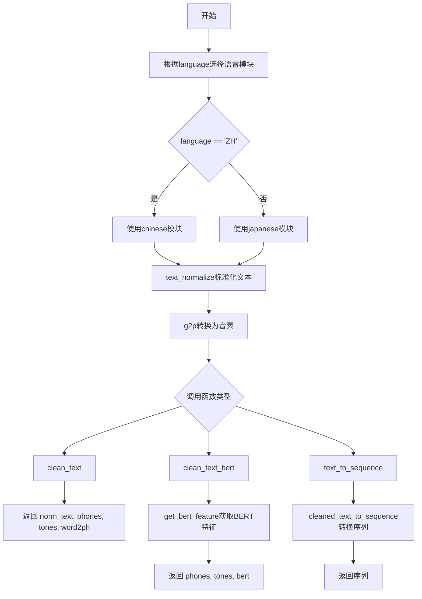
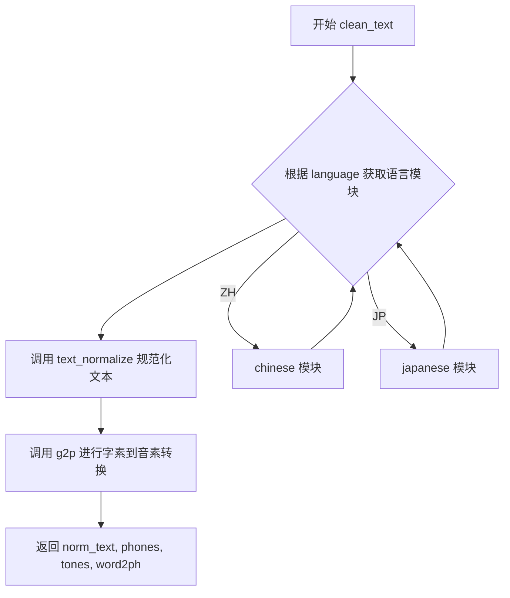
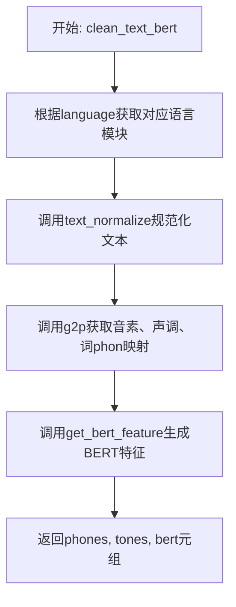
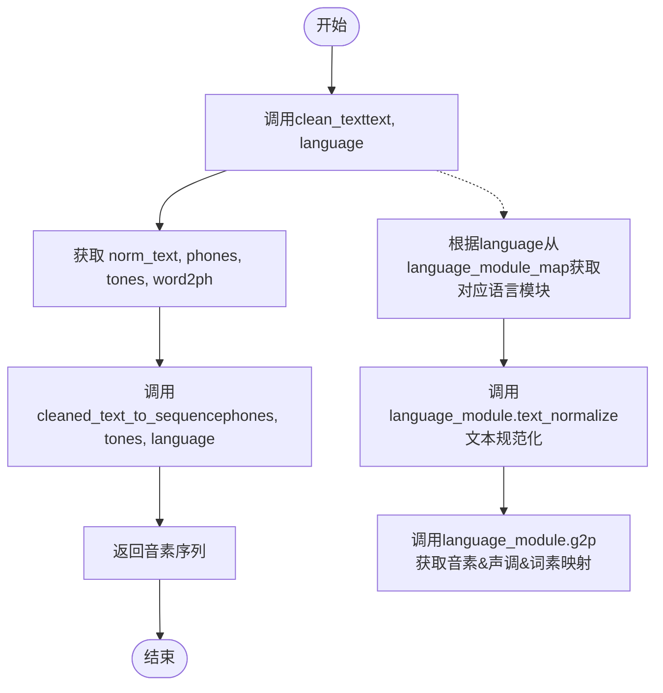

# `Bert-VITS2\oldVersion\V110\text\cleaner.py` 详细设计文档

这是一个用于文本转语音（TTS）的文本预处理模块，支持中文（ZH）和日语（JP）的文本标准化、字素到音素（G2P）转换、以及BERT特征提取。

## 整体流程



## 类结构

```
text/__init__.py (模块入口)
├── chinese (语言模块)
├── japanese (语言模块)
└── cleaned_text_to_sequence (序列转换模块)
```

## 全局变量及字段


### `language_module_map`
    
语言代码到语言模块的映射字典，用于根据语言代码动态加载对应的语言处理模块（如ZH对应chinese模块，JP对应japanese模块）

类型：`dict`
    


    

## 全局函数及方法


### `clean_text`

该函数是文本清理与G2P（字素到音素）转换的核心入口，根据指定语言选择对应的语言处理模块，完成文本规范化、发音转换及词音映射生成，最终返回规范化文本、音素序列、音调序列和词音映射元组。

参数：

- `text`：`str`，需要进行清理和G2P转换的原始文本
- `language`：`str`，语言代码，用于从语言模块映射表中获取对应的语言处理模块（如 "ZH" 表示中文，"JP" 表示日文）

返回值：`tuple[str, list, list, list]`，返回一个包含四个元素的元组

- `norm_text`：`str`，规范化处理后的文本
- `phones`：`list`，转换后的音素序列列表
- `tones`：`list`，对应每个音素的音调序列列表
- `word2ph`：`list`，词到音素的映射关系列表，用于对齐

#### 流程图



#### 带注释源码

```python
def clean_text(text, language):
    """
    清理文本并进行G2P转换
    
    参数:
        text: str, 需要进行清理和G2P转换的原始文本
        language: str, 语言代码（如 "ZH" 或 "JP"）
    
    返回:
        tuple: (norm_text, phones, tones, word2ph)
            - norm_text: 规范化后的文本
            - phones: 音素序列列表
            - tones: 音调序列列表
            - word2ph: 词到音素的映射列表
    """
    # 根据语言代码从映射表中获取对应的语言处理模块
    # ZH -> chinese 模块, JP -> japanese 模块
    language_module = language_module_map[language]
    
    # 调用语言模块的文本规范化方法，将文本标准化
    # 例如：数字转中文、标点处理、全角转半角等
    norm_text = language_module.text_normalize(text)
    
    # 调用语言模块的G2P方法，将规范化后的文本转换为音素序列
    # 同时获取音调信息和词到音素的映射关系
    phones, tones, word2ph = language_module.g2p(norm_text)
    
    # 返回规范化文本、音素序列、音调序列和词音映射
    return norm_text, phones, tones, word2ph
```


### `clean_text_bert`

该函数是文本处理管道中的核心组件，负责将原始文本进行规范化、转换为音素序列，同时生成对应的BERT嵌入特征，供后续语音合成模型使用。

参数：

- `text`：`str`，需要处理的原始文本输入
- `language`：`str`，语言代码（如"ZH"代表中文、"JP"代表日文），用于确定使用的语言处理模块

返回值：`Tuple[List[str], List[int], np.ndarray]`，返回包含音素序列(phones)、声调序列(tones)和BERT特征(bert)的三元组

#### 流程图



#### 带注释源码

```python
def clean_text_bert(text, language):
    """
    清理文本并获取BERT特征
    
    参数:
        text: 输入的原始文本
        language: 语言代码，用于选择对应的语言处理模块
    
    返回:
        包含音素序列、声调序列和BERT特征的元组
    """
    # 根据语言代码从映射表中获取对应的语言处理模块
    # 支持ZH(中文)和JP(日文)等语言
    language_module = language_module_map[language]
    
    # 步骤1: 文本规范化
    # 调用语言模块的文本规范化方法，将原始文本转换为标准格式
    # 如: 阿拉伯数字转中文数字、全角转半角等
    norm_text = language_module.text_normalize(text)
    
    # 步骤2: 文本转音素(G2P)
    # 调用语言模块的图音转换(G2P)方法
    # 返回: phones(音素序列), tones(声调序列), word2ph(词到音素的映射关系)
    phones, tones, word2ph = language_module.g2p(norm_text)
    
    # 步骤3: 获取BERT嵌入特征
    # 使用预训练BERT模型提取文本的语义特征
    # 输入: 规范化后的文本、词到音素的映射(用于对齐特征)
    # 输出: BERT特征向量，用于后续TTS模型的文本表示
    bert = language_module.get_bert_feature(norm_text, word2ph)
    
    # 返回处理结果: 音素序列、声调序列、BERT特征
    return phones, tones, bert
```


### `text_to_sequence`

将输入的原始文本经过语言特定的文本规范化和G2P（Grapheme-to-Phoneme）处理后，最终转换为音素序列的核心函数。

参数：

- `text`：`str`，要转换的原始文本输入
- `language`：`str`，语言代码，用于确定使用哪个语言处理模块（如"ZH"代表中文，"JP"代表日文）

返回值：`list`，处理后的音素序列列表

#### 流程图



#### 带注释源码

```python
def text_to_sequence(text, language):
    """
    将文本转换为音素序列
    
    参数:
        text: str - 输入的原始文本
        language: str - 语言代码，如"ZH"或"JP"
    
    返回:
        list - 转换后的音素序列
    """
    # 第一步：调用clean_text进行文本规范化和G2P处理
    # 该函数会返回：规范化文本、音素序列、声调序列、词素到音素的映射
    norm_text, phones, tones, word2ph = clean_text(text, language)
    
    # 第二步：调用cleaned_text_to_sequence对音素序列进行最终清洗和转换
    # 根据语言类型处理音素序列并返回最终的音素列表
    return cleaned_text_to_sequence(phones, tones, language)
```


## 关键组件


### language_module_map

全局变量，类型为字典 dict[str, module]，用于映射语言代码到对应的语言处理模块，支持中文(ZH)和日文(JP)两种语言的文本处理模块

### clean_text

全局函数，参数 text(str, 待处理的原始文本)、language(str, 语言代码 ZH/JP)，返回值 tuple[str, list, list, list]，返回规范化文本、音素序列、声调序列和词到音素的映射关系，核心流程为加载语言模块、调用文本规范化和g2p发音转换

### clean_text_bert

全局函数，参数 text(str, 待处理的原始文本)、language(str, 语言代码 ZH/JP)，返回值 tuple[list, list, ndarray]，返回音素序列、声调序列和BERT特征向量，内部调用get_bert_feature获取上下文语义特征

### text_to_sequence

全局函数，参数 text(str, 待处理的原始文本)、language(str, 语言代码 ZH/JP)，返回值 list，返回最终的电话序列，内部调用clean_text和cleaned_text_to_sequence完成文本到序列的完整转换

### 语言模块接口契约

外部依赖模块（chinese/japanese）需实现text_normalize、g2p和get_bert_feature三个方法，其中text_normalize返回规范化文本，g2p返回(phones, tones, word2ph)三元组，get_bert_feature返回BERT特征向量

### cleaned_text_to_sequence

外部依赖全局函数，负责将phones和tones序列转换为模型可用的整数索引序列


## 问题及建议


### 已知问题

-   **缺乏错误处理**：language_module_map[language]未做KeyError防护，传入不支持的语言会导致程序直接崩溃
-   **代码重复**：clean_text和clean_text_bert中获取norm_text、phones、tones、word2ph的逻辑完全重复
-   **返回值不一致**：clean_text返回4个值(norm_text, phones, tones, word2ph)，clean_text_bert只返回3个值(phones, tones, bert)，且norm_text丢失
-   **无类型注解**：所有函数均无类型提示，影响可读性和IDE支持
-   **硬编码映射**：language_module_map硬编码在模块级别，扩展新语言需修改源码
-   **模块接口假设**：假设chinese和japanese模块必然包含text_normalize、g2p、get_bert_feature方法，无运行时验证
-   **空入口点**：__main__块为空，无测试或示例代码

### 优化建议

-   增加语言支持校验，抛出有意义的CustomException或返回默认值
-   提取公共逻辑到私有函数如_get_language_module_and_process()，消除重复代码
-   为所有函数添加Type Hints，使用typing模块标注参数和返回值类型
-   考虑使用插件注册机制或配置文件动态加载语言模块
-   统一函数返回值结构，或通过数据类/DTO封装返回结果
-   为各函数添加Docstring说明参数约束和异常情况
-   在__main__块添加基本的单元测试或使用示例
-   使用hasattr或try-except包装模块方法调用，提供fallback逻辑

## 其它


### 设计目标与约束

本模块旨在为多语言文本处理提供统一的接口，支持中文(ZH)和日文(JP)两种语言的文本清洗、规范化和音素转换。设计约束包括：1) 语言模块必须实现text_normalize、g2p、get_bert_feature三个标准接口；2) 支持的语言类型固定为ZH和JP，扩展性受限；3) 输入文本假设为UTF-8编码的unicode字符串；4) 返回的音素序列需与word2ph对齐以支持韵律预测。

### 错误处理与异常设计

主要异常场景包括：1) 不支持的语言代码传入时，会抛出KeyError，建议在调用前进行语言代码验证或捕获KeyError并提供友好提示；2) language_module中的text_normalize或g2p方法内部异常会直接向上传播，调用方需自行处理；3) cleaned_text_to_sequence失败会导致text_to_sequence失败。当前设计缺乏显式的错误处理机制，建议增加语言支持校验和异常转换层。

### 数据流与状态机

数据流从原始文本输入开始，经历三个主要阶段：文本规范化(normalize) → 音素转换(g2p) → 特征提取(可选)。clean_text流程：text → text_normalize → norm_text → g2p → (phones, tones, word2ph) → 返回元组。clean_text_bert流程在前者基础上增加bert特征提取步骤。text_to_sequence流程则在clean_text基础上增加序列转换步骤。无复杂状态机，仅为线性数据转换流水线。

### 外部依赖与接口契约

外部依赖包括：1) chinese和japanese两个语言处理模块，需实现text_normalize(text)、g2p(text)、get_bert_feature(text, word2ph)三个方法；2) cleaned_text_to_sequence(phones, tones, language)函数，需从模块根目录导入。接口契约：clean_text和clean_text_bert接受text(str)和language(str)参数，返回规范化文本和音素相关数据；text_to_sequence返回整数序列。

### 性能考虑与优化空间

当前实现每次调用都会从language_module_map字典中查找语言模块，可考虑缓存language_module引用减少字典查询开销。g2p和bert特征计算可能涉及复杂NLP模型调用，建议对相同输入进行结果缓存(memoization)。当前串行执行各步骤，未来可考虑并行化bert特征提取与音素转换。word2ph用于音素与汉字对齐，若不需要可跳过计算以提升性能。

### 测试策略建议

建议补充单元测试覆盖：1) 支持的语言代码ZH和JP的正常调用流程；2) 不支持语言代码的异常场景；3) 各语言模块接口返回值的格式校验；4) 空字符串和特殊字符输入的处理；5) cleaned_text_to_sequence失败时的异常传播测试。

### 版本兼容性说明

当前版本为初始实现，API接口相对稳定但缺乏版本化管理。语言模块接口依赖隐式约定，若语言模块实现变更可能导致难以追踪的错误，建议引入接口抽象基类或协议(Protocol)进行显式约束。Python版本兼容性方面，代码仅使用基础语法，无特定版本要求。

    