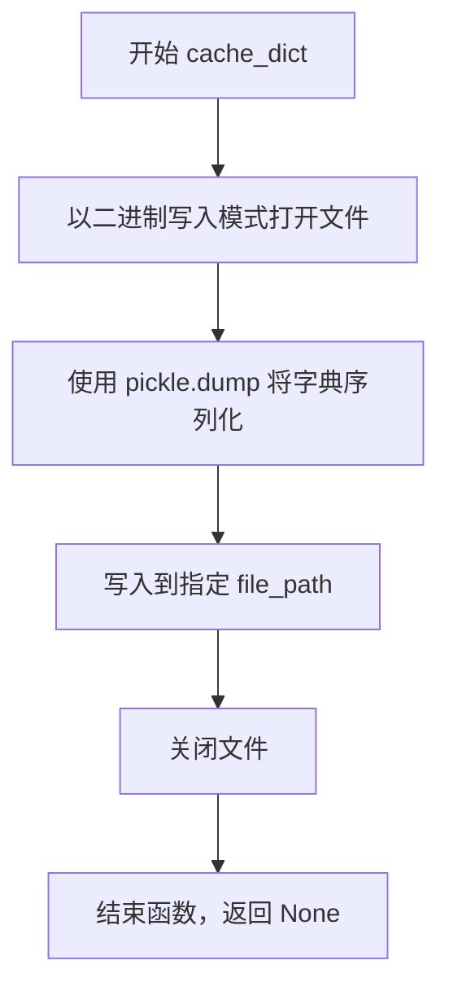
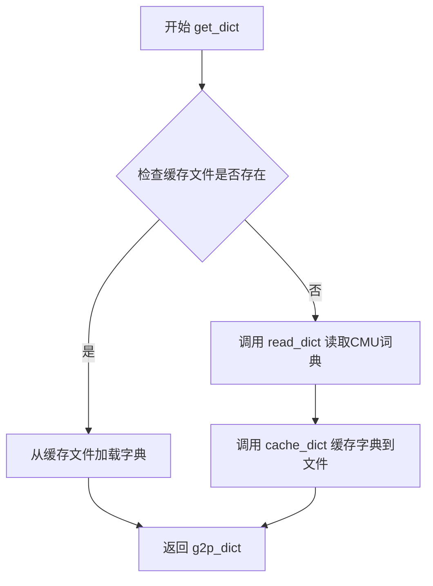
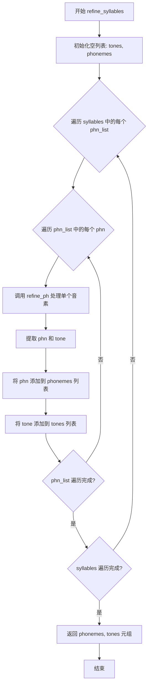
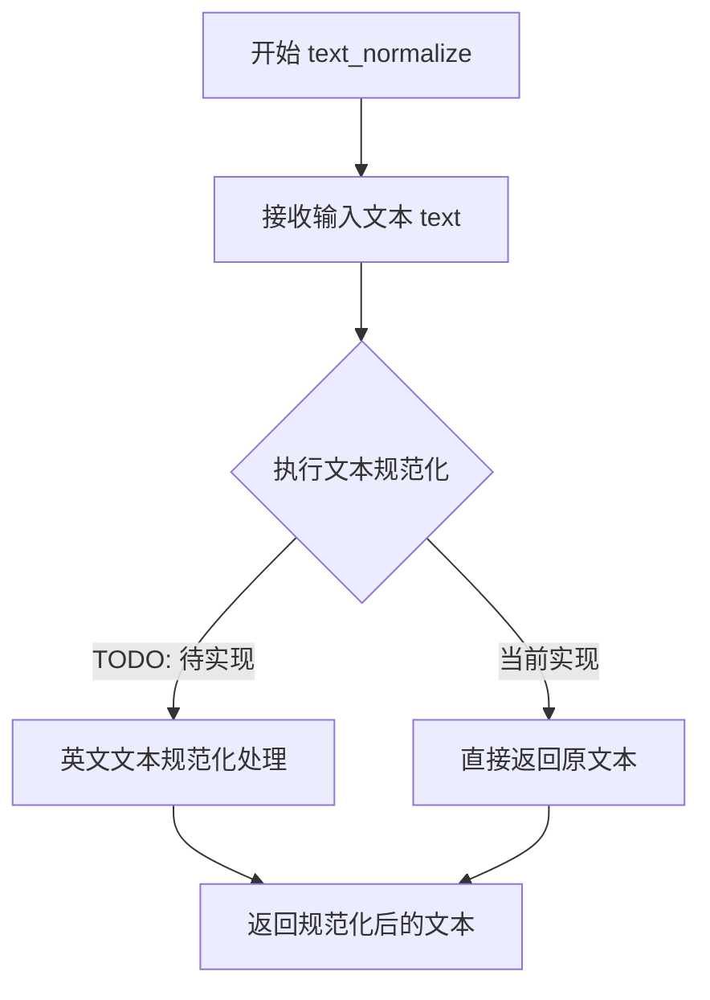

# `Bert-VITS2\oldVersion\V110\text\english.py` 详细设计文档

这是一个英文文本转音素（Grapheme-to-Phoneme, G2P）的转换模块，主要用于Text-to-Speech（TTS）系统。它首先尝试从本地CMU发音词典缓存中查找单词发音，若找不到则回退使用g2p_en库进行推断，期间负责音素标准化、重音/声调提取以及符号替换。

## 整体流程

```mermaid
graph TD
    A[开始: g2p(text)] --> B[正则分词: split text]
    B --> C{遍历每个token}
    C --> D{是否在 eng_dict 中?}
    D -- 是 --> E[查找词典: refine_syllables]
    D -- 否 --> F[调用外部库: _g2p(w)]
    E --> G[音素细化: refine_ph]
    F --> G
    G --> H{处理每个音素}
    H --> I[后处理替换: post_replace_ph]
    I --> C
    C --> J[生成 word2ph]
    J --> K[返回: (phones, tones, word2ph)]
```

## 类结构

```
Global Scope (模块级)
├── External Dependency: g2p_en.G2p
├── Data: arpa (Set), eng_dict (Dict)
└── Functions (No Classes defined)
    ├── get_dict (字典加载与缓存)
    ├── read_dict (文件读取)
    ├── cache_dict (序列化)
    ├── g2p (主入口)
    ├── refine_syllables (音节处理)
    ├── refine_ph (音素与声调分离)
    └── post_replace_ph (符号替换)
```

## 全局变量及字段


### `current_file_path`
    
当前文件目录路径

类型：`str`
    


### `CMU_DICT_PATH`
    
CMU词典文件路径

类型：`str`
    


### `CACHE_PATH`
    
缓存pickle文件路径

类型：`str`
    


### `_g2p`
    
外部G2P处理实例

类型：`g2p_en.G2p`
    


### `arpa`
    
有效的ARPAbet音素集合

类型：`Set[str]`
    


### `eng_dict`
    
加载的CMU发音词典

类型：`Dict`
    


    

## 全局函数及方法


### `post_replace_ph`

该函数是文本转音素（Text-to-Phoneme）流程中的后处理模块，负责对单个字符或音素进行标准化处理。它首先将输入的标点符号（尤其是中文标点）映射为英文标点，然后验证该符号是否存在于预定义的音素符号表中。若符号合法则直接返回，否则返回表示未知符号的 "UNK"。

参数：
-  `ph`：`str`，输入的字符、音素或标点符号。

返回值：`str`，处理并验证后的字符或音素。如果不在符号表中，则返回 "UNK"。

#### 流程图

```mermaid
flowchart TD
    A([输入 ph]) --> B{ph 在 rep_map 中?}
    B -- 是 --> C[执行替换: ph = rep_map[ph]]
    B -- 否 --> D{ph 在 symbols 中?}
    C --> D
    D -- 是 --> E([返回 ph])
    D -- 否 --> F[ph = 'UNK']
    F --> E
```

#### 带注释源码

```python
def post_replace_ph(ph):
    """
    对输入的音素或标点符号进行标准化处理。
    
    处理流程：
    1. 标点符号映射：将特殊标点（如中文逗号）转换为英文标点。
    2. 合法性检查：检查是否在预定义的符号集中。
    3. 未知符号处理：若不在符号集中，标记为 UNK。
    
    参数:
        ph (str): 输入的字符或音素
        
    返回:
        str: 处理后的字符或音素
    """
    # 定义标点符号和特殊字符的映射表
    rep_map = {
        "：": ",",
        "；": ",",
        "，": ",",
        "。": ".",
        "！": "!",
        "？": "?",
        "\n": ".",
        "·": ",",
        "、": ",",
        "...": "…",
        "v": "V",
    }
    
    # 步骤1：如果输入在映射表中，则进行替换
    if ph in rep_map.keys():
        ph = rep_map[ph]
        
    # 步骤2：检查替换后的符号是否属于合法的音素符号集
    if ph in symbols:
        # 如果是合法符号，直接返回
        return ph
        
    # 步骤3：如果不属于合法符号集，标记为未知符号
    if ph not in symbols:
        ph = "UNK"
        
    # 返回处理结果
    return ph
```


### `read_dict`

该函数用于从CMU发音字典文件（cmudict.rep）中读取单词及其对应的音素序列，并将解析结果存储在字典中返回。函数跳过文件的前48行，从第49行开始解析，每行包含一个单词及其发音信息，发音被拆分为音节和音素。

参数： 无

返回值：`dict`，返回一个字典，键为单词（字符串），值为一个二维列表，每个内部列表包含一组音素（字符串）。该字典将用于文本到语音的发音查询。

#### 流程图

```mermaid
flowchart TD
    A[开始 read_dict] --> B[初始化空字典 g2p_dict 和起始行号 start_line=49]
    B --> C[打开 CMU_DICT_PATH 文件]
    C --> D[读取第一行，line_index = 1]
    D --> E{line_index >= start_line?}
    E -->|否| F[line_index += 1, 读取下一行]
    F --> E
    E -->|是| G[去除行首尾空白]
    G --> H[按两个空格分割获取单词和音素部分]
    H --> I[获取单词 word]
    I --> J[按 ' - ' 分割获取音节列表]
    J --> K[初始化 g2p_dict[word] 为空列表]
    K --> L{遍历每个音节}
    L -->|音节 in 音节列表| M[按空格分割音素]
    M --> N[将音素列表添加到 g2p_dict[word]]
    N --> L
    L -->|遍历完成| O[line_index += 1, 读取下一行]
    O --> P{文件是否结束?}
    P -->|否| E
    P -->|是| Q[返回 g2p_dict]
    Q --> R[结束]
```

#### 带注释源码

```python
def read_dict():
    """
    从CMU发音字典文件中读取单词和对应的音素序列
    
    返回:
        dict: 键为单词字符串，值为包含音素列表的二维列表
    """
    # 初始化用于存储发音字典的空字典
    g2p_dict = {}
    
    # 设置起始行号，CMU字典文件前48行为注释和头信息
    start_line = 49
    
    # 打开CMU发音字典文件
    with open(CMU_DICT_PATH) as f:
        # 读取第一行
        line = f.readline()
        # 初始化行索引计数器
        line_index = 1
        
        # 遍历文件的每一行
        while line:
            # 检查是否到达需要解析的数据行
            if line_index >= start_line:
                # 去除行首尾的空白字符
                line = line.strip()
                
                # 按两个空格分割，获取单词和发音部分
                word_split = line.split("  ")
                # 提取单词（第一部分）
                word = word_split[0]
                
                # 按 " - " 分割，获取音节列表
                syllable_split = word_split[1].split(" - ")
                
                # 初始化该单词的发音列表
                g2p_dict[word] = []
                
                # 遍历每个音节
                for syllable in syllable_split:
                    # 按空格分割，获取音素列表
                    phone_split = syllable.split(" ")
                    # 将音素列表添加到单词的发音列表中
                    g2p_dict[word].append(phone_split)
            
            # 行索引加1
            line_index = line_index + 1
            # 读取下一行
            line = f.readline()
    
    # 返回构建好的发音字典
    return g2p_dict
```


### `cache_dict`

该函数用于将拼音字典（g2p_dict）序列化并缓存到指定的文件路径中，以便后续快速加载，避免重复解析 CMU 词典文件。

参数：

- `g2p_dict`：`dict`，需要缓存的拼音字典，通常为从 `read_dict()` 函数读取并构建的 CMU 词典字典对象
- `file_path`：`str`，缓存文件的存储路径，通常为 `.pickle` 格式的文件路径

返回值：`None`，该函数无返回值，仅执行文件写入操作

#### 流程图



#### 带注释源码

```python
def cache_dict(g2p_dict, file_path):
    """
    将 g2p_dict 字典对象序列化并缓存到指定文件路径
    
    参数:
        g2p_dict (dict): 包含单词到音素映射的字典，通常为从 CMU 词典读取的数据
        file_path (str): 缓存文件的保存路径，文件扩展名通常为 .pickle
    
    返回:
        None: 该函数不返回任何值，仅执行写入操作
    """
    # 以二进制写入模式打开文件
    with open(file_path, "wb") as pickle_file:
        # 使用 pickle 模块将字典对象序列化并写入文件
        pickle.dump(g2p_dict, pickle_file)
```

#### 上下文关联

该函数在 `get_dict()` 函数中被调用，当缓存文件不存在时，会先调用 `read_dict()` 读取原始 CMU 词典文件，然后调用 `cache_dict()` 将读取结果缓存到 `CACHE_PATH`，以便下次直接加载缓存文件，提升性能。


### `get_dict`

该函数是图语音转换模块的核心字典加载函数，负责从CMU发音词典加载英文单词到音素的映射关系，并通过pickle缓存机制优化重复加载性能。

参数：

- 该函数无参数

返回值：`dict`，返回英文单词到音素列表的映射字典，其中键为英文单词（大写），值为二维列表，每个子列表代表一个音节，子列表中的元素为该音节的音素列表。

#### 流程图



#### 带注释源码

```python
def get_dict():
    """
    获取英文单词到音素的映射字典。
    
    优先从pickle缓存文件加载，如果缓存不存在则从CMU词典文件读取并创建缓存。
    """
    # 检查缓存文件是否存在
    if os.path.exists(CACHE_PATH):
        # 从pickle缓存文件加载已序列化的字典
        with open(CACHE_PATH, "rb") as pickle_file:
            g2p_dict = pickle.load(pickle_file)
    else:
        # 缓存不存在，从CMU词典文件读取原始数据
        g2p_dict = read_dict()
        # 将读取的字典序列化保存到缓存文件，供后续使用
        cache_dict(g2p_dict, CACHE_PATH)

    # 返回英文单词到音素列表的映射字典
    return g2p_dict
```

#### 相关全局变量和函数

- `CMU_DICT_PATH`：str，CMU发音词典文件路径
- `CACHE_PATH`：str，pickle格式的词典缓存文件路径
- `read_dict()`：无参数，返回dict，读取CMU词典文件并解析为字典格式
- `cache_dict(g2p_dict, file_path)`：参数g2p_dict为dict类型（要缓存的字典），file_path为str类型（缓存文件路径），无返回值，将字典写入pickle文件


### `refine_ph`

该函数用于处理单个音素（phoneme），提取音素中的声调信息，并将音素转换为小写格式。如果音素末尾包含数字（表示CMU音素字典中的声调标记），则将其转换为声调值（数字+1），并移除数字部分。

参数：

- `phn`：`str`，输入的音素字符串，可能包含末尾的数字声调标记（如"AH0"、"EY2"等）

返回值：`tuple`，返回包含两个元素的元组 - (处理后的音素字符串（小写）, 声调整数)

#### 流程图

```mermaid
flowchart TD
    A[开始: 输入音素 phn] --> B[初始化 tone = 0]
    B --> C{检查 phn 是否以数字结尾}
    C -->|是| D[提取末尾数字并加1得到声调]
    D --> E[移除 phn 末尾的数字]
    C -->|否| F[保持 phn 不变]
    E --> G[将 phn 转换为小写]
    F --> G
    G --> H[返回 (phn.lower, tone)]
```

#### 带注释源码

```python
def refine_ph(phn):
    """
    处理单个音素，提取声调并将音素转换为小写
    
    参数:
        phn: 输入的音素字符串，可能包含末尾的数字声调标记
             例如: "AH0", "EY2", "IH1" 等
    
    返回值:
        tuple: (处理后的音素小写字符串, 声调整数)
               例如: ("ah0", 1), ("ey", 3), ("ih", 2) 等
    """
    # 初始化声调为0（表示无声调）
    tone = 0
    
    # 使用正则表达式检查音素是否以数字结尾
    # CMU字典中音素末尾的数字表示声调
    if re.search(r"\d$", phn):
        # 提取末尾的数字字符并转换为声调值
        # CMU音素使用0/1/2表示声调，转换为1/2/3
        tone = int(phn[-1]) + 1
        
        # 移除音素末尾的数字部分
        phn = phn[:-1]
    
    # 将音素转换为小写格式并返回
    return phn.lower(), tone
```


### `refine_syllables`

该函数用于将音节（syllables）列表中的每个音素进行细化和处理，提取出音素本身及其对应的声调信息。它遍历所有音素列表，对每个音素调用 `refine_ph` 函数进行音素和声调的分离，最终返回两个列表：处理后的音素列表和对应的声调列表。

参数：

- `syllables`：`List[List[str]]`，表示从 CMU 词典中获取的音节列表，每个元素是一个音素列表（如 `[['AH0', 'B'], ['L', 'OW1']]`）

返回值：`Tuple[List[str], List[int]]`，返回两个列表 —— 第一个是处理后的音素列表（将数字后缀移除并转为小写），第二个是对应的声调列表（0 表示无声调，1-3 表示带声调）

#### 流程图



#### 带注释源码

```
def refine_syllables(syllables):
    """
    细化和提取音节中的音素和声调信息
    
    参数:
        syllables: 音节列表，每个元素是一个音素列表，
                   例如 [['AH0', 'B'], ['L', 'OW1']] 代表一个词的不同发音变体
    
    返回:
        tuple: (phonemes, tones) - 处理后的音素列表和对应的声调列表
    """
    # 初始化声调列表，用于存储所有音素对应的声调
    tones = []
    # 初始化音素列表，用于存储处理后的音素（去除声调数字后缀并转为小写）
    phonemes = []
    
    # 外层循环：遍历所有音节（每个音节可能是一个发音变体）
    for phn_list in syllables:
        # 内层循环：遍历当前音节中的每个音素
        for i in range(len(phn_list)):
            # 获取当前音素字符串
            phn = phn_list[i]
            
            # 调用 refine_ph 函数处理单个音素：
            # - 提取音素本体（去除末尾的数字声调标记）
            # - 提取声调值（数字+1，0表示无声调）
            phn, tone = refine_ph(phn)
            
            # 将处理后的音素添加到音素列表
            phonemes.append(phn)
            # 将对应的声调值添加到声调列表
            tones.append(tone)
    
    # 返回音素列表和声调列表的元组
    return phonemes, tones
```


### `text_normalize`

该函数是一个文本规范化函数，用于对输入的英文文本进行规范化处理（如大小写标准化、特殊字符处理等）。目前该函数为一个占位实现，仅返回原文本，未实现完整的文本规范化逻辑。

参数：

-  `text`：`str`，需要规范化的原始输入文本

返回值：`str`，规范化后的文本（当前实现仅为原样返回）

#### 流程图



#### 带注释源码

```python
def text_normalize(text):
    """
    文本规范化函数
    
    该函数用于对输入的英文文本进行规范化处理，包括：
    - 大小写标准化
    - 特殊字符处理
    - 数字转换
    - 标点符号标准化等
    
    当前状态：占位实现，仅返回原文本
    
    参数:
        text (str): 需要规范化的原始输入文本
        
    返回:
        str: 规范化后的文本（当前为原样返回）
    """
    # TODO: 实现英文文本规范化
    # 计划实现的功能包括：
    # 1. 将所有字母转换为小写或大写
    # 2. 处理数字（转为英文单词或保留数字）
    # 3. 处理特殊标点符号
    # 4. 处理连字符和缩写
    # 5. 处理空白字符
    
    # 当前仅为占位符实现，直接返回原文本
    return text
```

---

### 补充信息

| 项目 | 说明 |
|------|------|
| **设计目标** | 提供文本规范化接口，支持英文文本的标准化处理 |
| **当前约束** | 函数为占位实现，未完成实际规范化逻辑 |
| **技术债务** | 1. `text_normalize` 函数未实现具体逻辑<br>2. 缺少英文文本规范化处理（大小写、数字、标点等）<br>3. `g2p` 函数中调用了 `text_normalize`，但实际未起作用 |
| **优化建议** | 1. 实现完整的英文文本规范化逻辑<br>2. 考虑支持数字到英文单词的转换<br>3. 处理常见的英文缩写形式<br>4. 统一标点符号处理 |
| **调用关系** | 被 `g2p` 函数调用（在 `g2p` 函数中虽然定义了对 `text` 的处理，但实际未调用 `text_normalize`） |


### `g2p`

该函数是图音转换（Grapheme-to-Phoneme）的核心入口，接收文本输入并输出音素序列、声调序列以及每个音素对应的字符数。主要流程为：先通过正则表达式分割文本中的单词与分隔符，对单词优先查询 CMU 发音字典，若查不到则调用 g2p_en 库进行发音推断，最后对音素进行后处理并提取声调信息。

参数：

- `text`：`str`，要转换为音素的文本内容

返回值：`tuple[list, list, list]`，包含三个列表：
- `phones`：音素符号列表（如 ["IH", "N", "DH", "IH", "S", ...]）
- `tones`：对应每个音素的声调值列表（0 表示轻声，1-5 表示声调）
- `word2ph`：每个音素对应的原始文本字符数列表（用于语音合成时的对齐）

#### 流程图

```mermaid
flowchart TD
    A[开始: 输入文本 text] --> B[使用正则分割文本<br/>re.split r&quot;([,;.\-\?\!\s+])&quot;]
    B --> C{遍历每个分词单元 w}
    C --> D{w.upper 在 eng_dict 中?}
    D -->|是| E[从字典获取发音 syllables]
    E --> F[调用 refine_syllables<br/>提取 phonemes 和 tones]
    F --> G[追加到结果列表]
    D -->|否| H[调用 _g2p(w) 转换为音素]
    H --> I{遍历每个音素 ph}
    I --> J{ph 在 arpa 集合中?}
    J -->|是| K[调用 refine_ph 提取声调]
    K --> L[追加 phoneme 和 tone]
    J -->|否| M[追加 phoneme, tone=0]
    M --> L
    I -->|遍历完成| G
    C -->|遍历完成| N[生成 word2ph 列表<br/>每个音素对应1]
    N --> O[对所有 phones 调用 post_replace_ph<br/>进行后处理替换]
    O --> P[返回 phones, tones, word2ph]
```

#### 带注释源码

```python
def g2p(text):
    """
    将输入文本转换为音素序列、声调序列和字符对齐信息
    
    参数:
        text: 输入的英文文本字符串
        
    返回:
        tuple: (phones, tones, word2ph)
            - phones: 音素符号列表
            - tones: 声调值列表
            - word2ph: 每个音素对应的字符数列表
    """
    # 初始化结果列表
    phones = []      # 存储转换后的音素序列
    tones = []       # 存储对应的声调值
    
    # 使用正则表达式按标点和空白符分割文本，保留分隔符
    # 例如 "hello, world" -> ["hello", ",", " ", "world"]
    words = re.split(r"([,;.\-\?\!\s+])", text)
    
    # 遍历分割后的每个单元（可能是单词或分隔符）
    for w in words:
        # 将单词转换为大写进行字典查询
        if w.upper() in eng_dict:
            # 如果单词存在于 CMU 字典中
            # 从字典获取发音数据（可能是多个发音变体）
            phns, tns = refine_syllables(eng_dict[w.upper()])
            # 将音素和声调追加到结果中
            phones += phns
            tones += tns
        else:
            # 单词不在字典中，调用 g2p_en 库进行推断
            # filter 过滤掉空格字符
            phone_list = list(filter(lambda p: p != " ", _g2p(w)))
            
            # 遍历推断出的每个音素
            for ph in phone_list:
                if ph in arpa:
                    # 如果音素在 ARPA 音素集合中，提取声调
                    # ARPA 音素如 AH0, AH1, AH2 包含数字表示声调
                    ph, tn = refine_ph(ph)
                    phones.append(ph)
                    tones.append(tn)
                else:
                    # 非 ARPA 音素（如静音标记 SIL）直接添加
                    phones.append(ph)
                    tones.append(0)  # 默认声调为 0
    
    # TODO: 实现真实的 word2ph 对齐计算
    # 当前只是简单地为每个音素分配 1 个字符
    word2ph = [1 for i in phones]

    # 对所有音素进行后处理替换
    # 将中文标点转换为英文，特殊字符映射等
    phones = [post_replace_ph(i) for i in phones]
    
    return phones, tones, word2ph
```

## 关键组件


### CMU词典加载与缓存机制

负责加载CMU发音词典，并在首次加载后生成pickle缓存文件以加速后续访问，实现惰性加载模式。

### 音素量化与反量化处理

将带数字后缀的ARPA音素（如"AH0"、"EH2"）转换为基本音素和独立声调值，实现从量化表示到原始形式的反量化。

### ARPA音素集合验证

定义了CMU发音词典的全部70个ARPA音素符号集合，用于过滤和验证g2p_en库生成的音素是否合法。

### 文本规范化模块

文本标准化预处理函数，目前为占位符实现（todo: eng text normalize）。

### 标点符号音素映射

将各类中文标点符号（"，"。"、"、"、"、"、"…"等）映射为统一的音素表示，并处理未知符号回退。

### 音节与声调提取

将CMU词典中的多层嵌套音节结构拆解为扁平化的音素序列和对应声调数组。

### G2P主转换引擎

整合CMU词典查表和g2p_en库后备的混合策略，将输入文本转换为音素序列、声调序列和词素对齐数组。


## 问题及建议


### 已知问题

-   **全局状态提前初始化**：`eng_dict`在模块导入时就调用`get_dict()`加载词典，如果程序不需要使用G2P功能也会加载，造成不必要的内存占用和启动延迟
-   **硬编码值缺乏解释**：`start_line = 49`、`arpa`集合、路径等硬编码值没有注释说明来源和用途
-   **文件读取缺少异常处理**：`read_dict()`和`get_dict()`中没有捕获文件不存在、格式错误等异常，可能导致程序崩溃
-   **索引访问越界风险**：`read_dict()`中使用`word_split[1]`假设每行都有两个部分，如果CMU词典格式变化会触发`IndexError`
-   **重复计算和冗余逻辑**：`post_replace_ph()`函数中先检查`ph in rep_map.keys()`又检查`ph in symbols`，逻辑可以简化
-   **未完成的功能标记为TODO**：`text_normalize()`和`word2ph`是空实现或占位符，但被实际调用
-   **类型注解完全缺失**：所有函数和变量都没有类型提示，影响代码可维护性和IDE支持
-   **命名不一致**：混合使用下划线命名(`eng_dict`)和驼峰命名(`g2p_dict`)
-   **G2P结果未验证**：使用`_g2p()`备用转换时，没有验证返回结果的合法性
-   **缓存机制不完善**：缓存文件损坏时没有回退机制，会导致程序异常

### 优化建议

-   **延迟加载词典**：将`eng_dict`改为懒加载模式，仅在首次调用`g2p()`时才加载词典
-   **添加配置类和常量定义**：创建配置类集中管理路径、阈值等配置值，并添加文档注释
-   **完善异常处理**：为文件读写操作添加`try-except`块，处理FileNotFoundError、PermissionError、pickle异常等情况
-   **添加输入验证**：在`read_dict()`中添加行格式验证，忽略格式不正确的行而非直接崩溃
-   **重构条件判断**：简化`post_replace_ph()`中的条件逻辑，使用`dict.get()`或直接遍历
-   **实现TODO功能**：完成`text_normalize()`的英文规范化逻辑和正确的`word2ph`计算
-   **添加类型注解**：为所有函数参数、返回值和全局变量添加Python类型提示
-   **统一命名规范**：遵循PEP8，使用下划线命名法统一所有标识符
-   **添加结果验证**：对`_g2p()`的输出进行验证，确保音素在有效集合内
-   **改进缓存机制**：添加缓存校验和版本号，缓存损坏时自动重新生成
-   **考虑使用数据类**：将`g2p()`的返回值封装为命名元组或数据类，提高代码可读性
-   **添加日志记录**：使用`logging`模块替代print，便于生产环境调试


## 其它


### 设计目标与约束

设计目标：将输入的英文文本转换为音素序列（phones）、声调（tones）和词素到音素的映射（word2ph），为TTS系统提供发音信息。约束：依赖CMU发音词典和g2p_en库，词典通过pickle缓存提升加载速度，仅支持英文文本。

### 错误处理与异常设计

1. 文件缺失处理：CMU_DICT_PATH或CACHE_PATH不存在时，get_dict()会重新生成缓存，若文件损坏可能导致pickle.load失败
2. 未登录词（OOV）处理：g2p()中使用_g2p(w)对词典未收录的词进行推断
3. 音素合法性检查：post_replace_ph()将非法音素替换为"UNK"
4. 编码问题：read_dict()假设词典文件为UTF-8编码

### 数据流与状态机

数据流：text → 分词(words) → 词典查询/g2p推断 → refine_syllables处理 → post_replace_ph替换 → phones/tones输出
状态机：文本输入 → 分词模式匹配 → 循环处理每个词 → 词典命中/未命中分支 → 音素后处理 → 结果返回

### 外部依赖与接口契约

外部依赖：
- g2p_en.G2p：用于未登录词的音素推断
- symbols：本地模块，提供合法音素符号集
- cmudict.rep：CMU发音词典文件
接口契约：
- g2p(text) → 返回(phones: list, tones: list, word2ph: list)
- get_dict() → 返回g2p_dict: dict（缓存优先）
- post_replace_ph(ph) → 返回处理后的音素字符串

### 关键组件信息

1. CMU_DICT_PATH：CMU发音词典路径
2. CACHE_PATH：pickle缓存文件路径
3. _g2p：G2p类实例，用于未登录词推断
4. eng_dict：全局发音词典变量
5. arpa：ARPA音素符号集合，用于验证音素合法性

### 潜在的技术债务与优化空间

1. text_normalize函数为空（todo），英文文本规范化未实现
2. word2ph功能未实现（todo），目前返回全1列表
3. 缺少日志记录，调试困难
4. read_dict()硬编码start_line=49，缺乏灵活性
5. 词典加载内存占用高，可考虑lazy load
6. 未提供单元测试
7. 正则表达式re.split每次调用重复编译，应预编译

    