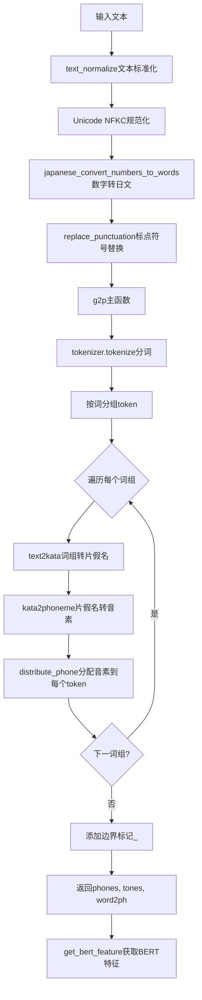
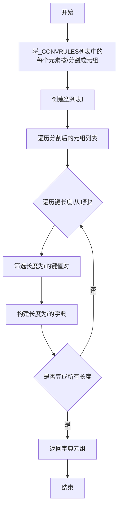
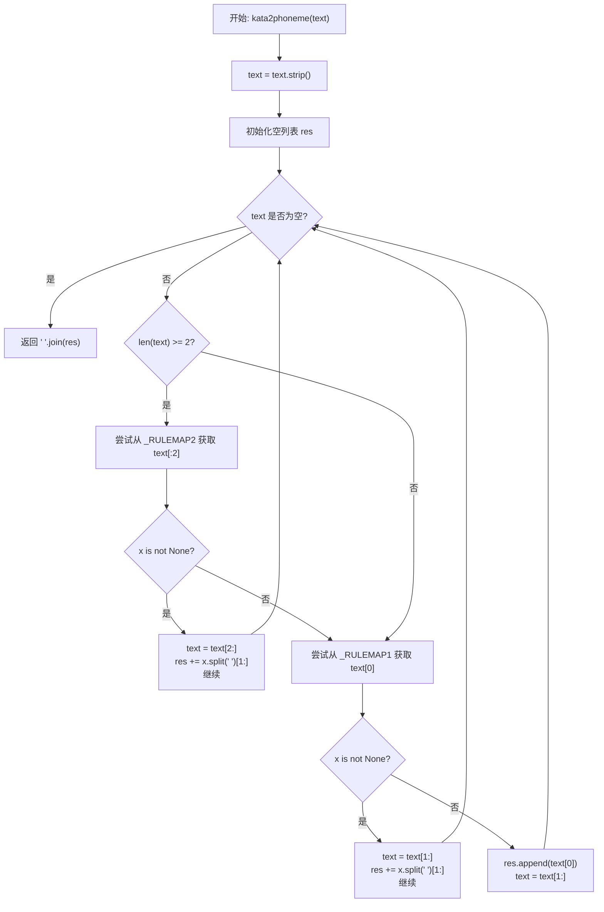
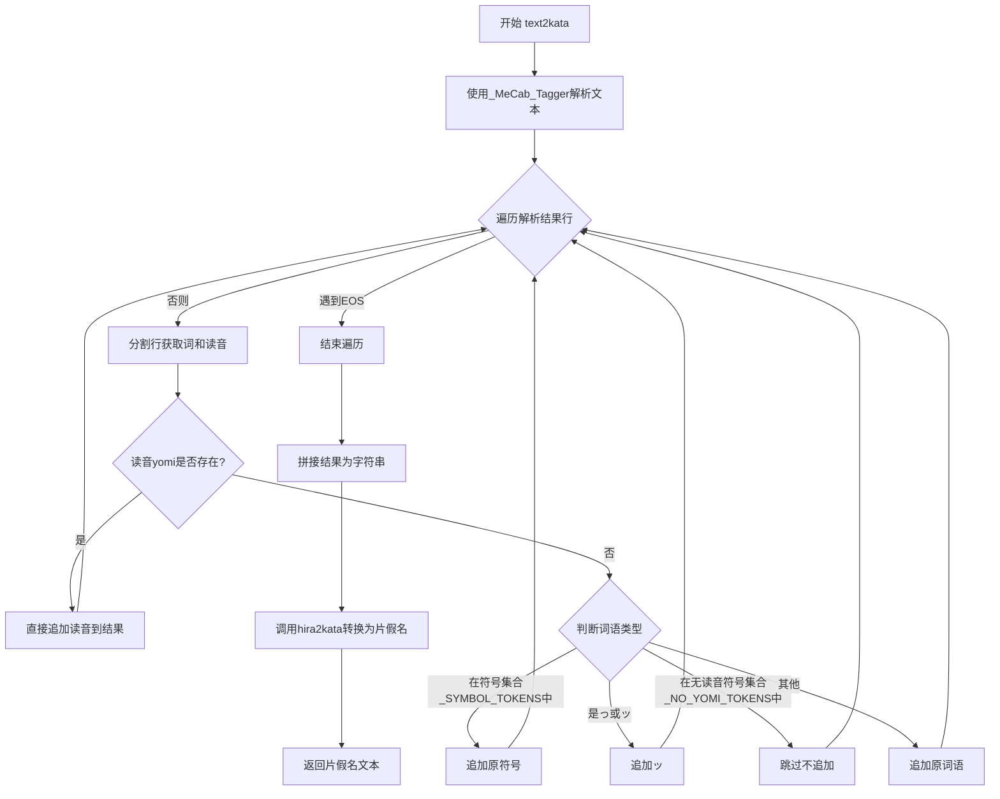
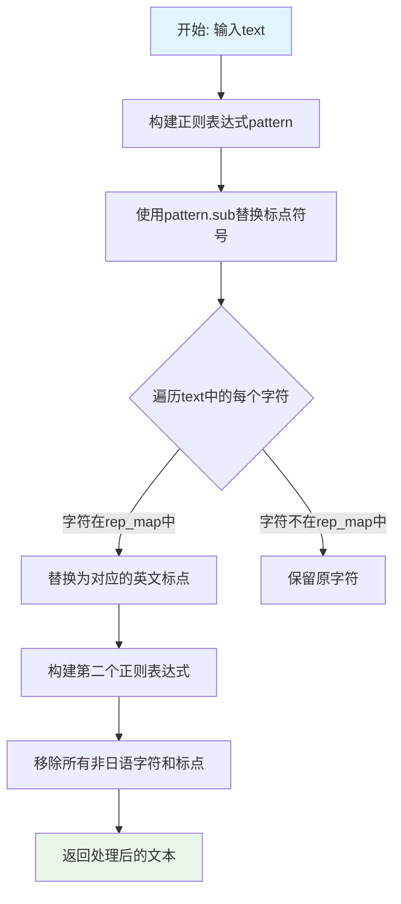
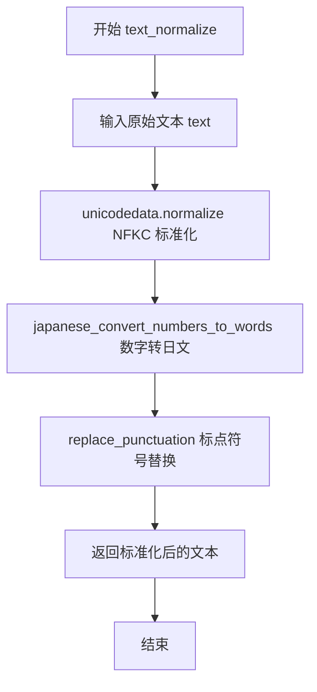

```mermaid
graph TD
    A[开始: 输入文本 text] --> B[text.translate&#40;_HIRA2KATATRANS&#41;]
    B --> C[将平假名映射为片假名]
    C --> D[text.replace&#40;'う゛', 'ヴ'&#41;]
    D --> E[处理特殊字符组合]
    E --> F[返回转换后的片假名字符串]
```

# `Bert-VITS2\oldVersion\V110\text\japanese.py` 详细设计文档

该文件实现日语文本到音素(phonemes)的转换功能，兼容Julius语音识别工具包。主要流程包括：文本标准化（Unicode规范化、数字转文字、标点符号替换）、使用MeCab进行分词并转换为片假名、查表法将假名转换为音素序列，最终输出音素、音调和词-音素对齐信息。

## 整体流程



## 类结构

```
无类层次结构 (函数式编程)
模块级别: japanese.py
├── 全局常量和映射表
├── 转换规则构建 (_makerulemap)
├── 假名/文本处理函数群
├── 数字/符号转换函数群
├── 文本标准化函数群
└── 核心g2p函数
```

## 全局变量及字段


### `_CONVRULES`
    
Conversion rules mapping katakana/hiragana characters to phonemes for Japanese text-to-speech processing

类型：`List[str]`
    


### `_RULEMAP1`
    
Preprocessed single-character conversion rules for katakana to phoneme mapping

类型：`Tuple[Dict[str, str]]`
    


### `_RULEMAP2`
    
Preprocessed two-character conversion rules for katakana to phoneme mapping

类型：`Tuple[Dict[str, str]]`
    


### `_KATAKANA`
    
String containing all katakana characters from ァ to ン

类型：`str`
    


### `_HIRAGANA`
    
String containing all hiragana characters from ぁ to ん

类型：`str`
    


### `_HIRA2KATATRANS`
    
Translation table mapping hiragana characters to their katakana equivalents

类型：`dict`
    


### `_SYMBOL_TOKENS`
    
Set of Japanese punctuation symbols that should be preserved during conversion

类型：`set`
    


### `_NO_YOMI_TOKENS`
    
Set of Japanese punctuation brackets that have no yomi (reading) and should be skipped

类型：`set`
    


### `_TAGGER`
    
MeCab morphological analyzer instance for parsing Japanese text into words and readings

类型：`MeCab.Tagger`
    


### `_ALPHASYMBOL_YOMI`
    
Dictionary mapping alphanumeric and Greek symbols to their Japanese pronunciation readings

类型：`dict`
    


### `_NUMBER_WITH_SEPARATOR_RX`
    
Regular expression pattern for matching numbers with thousand separators (e.g., 1,000)

类型：`re.Pattern`
    


### `_CURRENCY_MAP`
    
Dictionary mapping currency symbols ($, ¥, £, €) to their Japanese word representations

类型：`dict`
    


### `_CURRENCY_RX`
    
Regular expression pattern for matching currency amounts with symbols

类型：`re.Pattern`
    


### `_NUMBER_RX`
    
Regular expression pattern for matching integer and decimal numbers

类型：`re.Pattern`
    


### `_COLON_RX`
    
Regular expression pattern for matching consecutive colon characters

类型：`re.Pattern`
    


### `_REJECT_RX`
    
Regular expression pattern for rejecting characters that are not valid phoneme symbols

类型：`re.Pattern`
    


### `rep_map`
    
Dictionary mapping Japanese punctuation marks to their ASCII equivalents for normalization

类型：`dict`
    


### `tokenizer`
    
Pretrained Japanese BERT tokenizer for tokenizing input text

类型：`transformers.AutoTokenizer`
    


    

## 全局函数及方法


### `_makerulemap`

该函数用于将日语字符转换规则列表转换为两个字典元组，分别存储单字符和双字符的转换映射规则，供后续片假名转音素使用。

参数：
- 无参数

返回值：`tuple[dict, dict]`，返回一个包含两个字典的元组，第一个字典存储单字符转换规则，第二个字典存储双字符转换规则。

#### 流程图



#### 带注释源码

```python
def _makerulemap():
    """
    将转换规则列表转换为两个字典元组。
    
    _CONVRULES 是一个包含转换规则的列表，每个元素形如 "ア/ a a"，
    表示将 "ア" 转换为 "a a"。
    该函数将这些规则按目标字符长度（1或2）分组存储在字典中，
    以便后续 kata2phoneme 函数高效地进行最长匹配转换。
    
    Returns:
        tuple: 包含两个字典的元组
               - 第一个字典: 单字符转换规则 (key长度=1)
               - 第二个字典: 双字符转换规则 (key长度=2)
    """
    # 将转换规则列表中的每个元素按 "/" 分割成元组
    # 例如: "ア/ a a" -> ("ア", " a a")
    l = [tuple(x.split("/")) for x in _CONVRULES]
    
    # 返回一个元组，包含两个字典：
    # - 第一个字典存储键长度为1的转换规则 (_RULEMAP1)
    # - 第二个字典存储键长度为2的转换规则 (_RULEMAP2)
    # 这样设计是为了在 kata2phoneme 中优先匹配双字符，提高转换效率
    return tuple({k: v for k, v in l if len(k) == i} for i in (1, 2))
```


### `kata2phoneme`

将片假名文本转换为音素序列（用于语音合成系统，如Julius）

参数：
-  `text`：`str`，输入的片假名文本字符串

返回值：`str`，转换后的音素字符串，多个音素以空格分隔

#### 流程图



#### 带注释源码

```python
def kata2phoneme(text: str) -> str:
    """Convert katakana text to phonemes.
    
    该函数将输入的片假名文本转换为音素序列。
    转换规则存储在全局变量 _RULEMAP1 和 _RULEMAP2 中:
    - _RULEMAP1: 单字符片假名到音素的映射
    - _RULEMAP2: 双字符片假名到音素的映射（如 "アァ" -> "a a"）
    
    映射表格式为 "片假名/音素" 的字符串，通过 _makerulemap() 函数构建。
    """
    # 去除输入文本首尾的空白字符
    text = text.strip()
    
    # 初始化结果列表，用于存储转换后的音素
    res = []
    
    # 循环处理文本中的每个字符
    while text:
        # 优先尝试匹配双字符（长度为2及以上时）
        if len(text) >= 2:
            # 从双字符映射表中查找前两个字符
            x = _RULEMAP2.get(text[:2])
            if x is not None:
                # 找到匹配，从文本中移除前两个字符
                text = text[2:]
                # 将音素字符串按空格分割，取第二部分及之后的音素
                # 格式如 "アァ/ a a"，split后为 ['アァ', 'a', 'a']
                res += x.split(" ")[1:]
                continue
        
        # 双字符未匹配或文本长度不足，尝试单字符匹配
        x = _RULEMAP1.get(text[0])
        if x is not None:
            # 找到匹配，从文本中移除第一个字符
            text = text[1:]
            # 添加音素到结果列表
            res += x.split(" ")[1:]
            continue
        
        # 既没有双字符匹配也没有单字符匹配，原样保留该字符
        # 这处理了特殊符号、罗马字等未在映射表中的字符
        res.append(text[0])
        text = text[1:]
    
    # 注意：原代码中有注释掉的行用于处理冒号
    # res = _COLON_RX.sub(":", res)
    
    # 将音素列表转换为空格分隔的字符串并返回
    return " ".join(res)
```


### `hira2kata`

该函数用于将日语文本中的平假名字符转换为对应的片假名字符，是日语文本处理流水线中的基础转换步骤。

参数：

- `text`：`str`，需要转换的日语文本（包含平假名）

返回值：`str`，转换后的片假名字符串

#### 流程图



#### 带注释源码

```python
def hira2kata(text: str) -> str:
    """
    将平假名转换为片假名
    
    参数:
        text: 输入的日语文本（包含平假名）
    
    返回:
        转换后的片假名字符串
    """
    # 使用预建的翻译表将平假名字符转换为片假名字符
    # _HIRA2KATATRANS 是通过 str.maketrans() 创建的翻译表
    # 将 _HIRAGANA 字符串中的每个字符映射到 _KATAKANA 中对应位置的字符
    text = text.translate(_HIRA2KATATRANS)
    
    # 处理特殊的浊音组合 "う゛" -> "ヴ"
    # 这是为了正确转换日语中的 "v" 音（片假名 ヴ）
    return text.replace("う゛", "ヴ")
```

---

### 关键组件信息

| 组件名称 | 一句话描述 |
|---------|-----------|
| `_HIRA2KATATRANS` | 平假名到片假名的字符翻译映射表 |
| `_KATAKANA` | 所有片假名字符的连续字符串（ァ到ン） |
| `_HIRAGANA` | 所有平假名字符的连续字符串（ぁ到ん） |

### 潜在技术债务或优化空间

1. **硬编码字符范围**：平假名和片假名的范围是硬编码的，如果需要支持更完整的Unicode字符（如扩展片假名），需要手动添加范围
2. **特殊字符处理不完整**：目前只处理了"う゛"这一个特殊组合，其他可能的变体组合未被处理
3. **缺乏错误处理**：函数没有对输入进行有效性验证，如输入为`None`时会抛出`TypeError`
4. **性能优化**：对于大量文本处理，可以考虑使用`str.maketrans`的缓存机制或批量处理

### 其它项目

**设计目标与约束**：
- 目标：将日语文本从平假名转换为片假名，为后续的语音合成或音素转换做准备
- 约束：依赖于Python的`str.translate()`方法，字符映射一一对应

**错误处理与异常设计**：
- 输入为`None`时，会抛出`TypeError`
- 输入为非字符串类型时，会抛出`AttributeError`（因为`translate`方法只存在于str类型）
- 建议添加类型检查和输入验证

**数据流与状态机**：
- 该函数是日语文本处理流程中的一个环节
- 输入：原始日语文本（平假名混合）
- 输出：片假名字符串
- 状态：纯函数，无内部状态，保持幂等性

**外部依赖与接口契约**：
- 无外部依赖，仅使用Python内置的`str`方法
- 输入：任意字符串（期望包含日语文本）
- 输出：转换后的字符串（平假名被替换为片假名）


### `text2kata`

将输入的日语文本通过 MeCab 分词器分词，提取每个词的读音（平假名），然后将平假名转换为片假名，最终返回转换后的片假名文本。该函数是日语文本转音素流程中的关键环节，负责将原始文本转换为可用于语音合成的片假名表示。

参数：

- `text`：`str`，需要转换为片假名的日语文本字符串

返回值：`str`，转换后的片假名文本字符串

#### 流程图



#### 带注释源码

```python
def text2kata(text: str) -> str:
    """
    将日语文本转换为片假名表示。
    
    处理流程：
    1. 使用MeCab分词器解析输入文本
    2. 提取每个词的读音(yomi)
    3. 处理无读音的符号和特殊字符
    4. 将平假名转换为片假名
    
    参数:
        text: 需要转换的日语文本字符串
        
    返回:
        转换后的片假名文本字符串
    """
    # 使用MeCab分词器解析文本，返回形态素分析结果
    parsed = _TAGGER.parse(text)
    
    # 存储转换后的结果
    res = []
    
    # 遍历解析结果的每一行
    for line in parsed.split("\n"):
        # 遇到EOS（End Of Sentence）表示解析结束
        if line == "EOS":
            break
            
        # 按制表符分割，获取词语和读音信息
        parts = line.split("\t")
        
        # parts[0]为原词语，parts[1]为读音（平假名）
        word, yomi = parts[0], parts[1]
        
        # 如果有读音，直接使用读音
        if yomi:
            res.append(yomi)
        else:
            # 无读音时的处理逻辑
            if word in _SYMBOL_TOKENS:
                # 标点符号直接保留
                res.append(word)
            elif word in ("っ", "ッ"):
                # 小写促音转换为ッ
                res.append("ッ")
            elif word in _NO_YOMI_TOKENS:
                # 无读音标记的符号（如引号、括号）跳过
                pass
            else:
                # 其他词语（如汉字）直接使用原词语
                res.append(word)
    
    # 将结果列表拼接为字符串，然后转换为片假名
    return hira2kata("".join(res))
```


### `japanese_convert_numbers_to_words`

将日语文本中的数字（含千位分隔符和货币符号）转换为对应的日语单词表示。

参数：

- `text`：`str`，需要转换的日语文本，包含数字、货币符号等

返回值：`str`，转换后的日语文本，数字已被替换为日语单词

#### 流程图

```mermaid
flowchart TD
    A[开始: 输入文本] --> B[移除数字中的千位分隔符]
    B --> C[处理货币符号和金额]
    C --> D[将剩余数字转换为日语单词]
    D --> E[返回转换后的文本]
    
    B --> B1[正则: _NUMBER_WITH_SEPARATOR_RX]
    B1 --> B2[替换: 移除","]
    
    C --> C1[正则: _CURRENCY_RX]
    C1 --> C2[替换: 数字 + 货币单位]
    
    D --> D1[正则: _NUMBER_RX]
    D1 --> D2[调用: num2words lang=ja]
```

#### 带注释源码

```python
def japanese_convert_numbers_to_words(text: str) -> str:
    """
    将日语文本中的数字转换为日语单词
    
    处理流程:
    1. 移除千位分隔符 (如 1,234 -> 1234)
    2. 处理货币符号 (如 $100 -> 100ドル)
    3. 将数字转换为日语单词 (如 123 -> 百二十三)
    
    参数:
        text: 输入的日语文本字符串
        
    返回:
        转换后的日语文本字符串
    """
    # 第一步: 移除数字中的千位分隔符
    # 使用正则表达式匹配 1-3 位数字后跟逗号和 3 位数字的模式
    # 例如: "1,234" -> "1234"
    res = _NUMBER_WITH_SEPARATOR_RX.sub(lambda m: m[0].replace(",", ""), text)
    
    # 第二步: 处理货币符号和金额
    # 匹配货币符号($¥£€)后跟数字的模式
    # 将其替换为 "数字+货币单位" 的形式
    # 例如: "$100" -> "100ドル", "¥500" -> "500円"
    res = _CURRENCY_RX.sub(lambda m: m[2] + _CURRENCY_MAP.get(m[1], m[1]), res)
    
    # 第三步: 将剩余的数字转换为日语单词
    # 使用 num2words 库将数字转为日语读法
    # 例如: "123" -> "百二十三", "3.14" -> "三点一四"
    res = _NUMBER_RX.sub(lambda m: num2words(m[0], lang="ja"), res)
    
    return res
```

#### 关联全局变量

| 变量名 | 类型 | 描述 |
|--------|------|------|
| `_NUMBER_WITH_SEPARATOR_RX` | `re.Pattern` | 正则表达式，匹配带千位分隔符的数字（如1,234） |
| `_CURRENCY_MAP` | `dict` | 货币符号到日语单位的映射（$→ドル、¥→円、£→ポンド、€→ユーロ） |
| `_CURRENCY_RX` | `re.Pattern` | 正则表达式，匹配货币符号后跟数字的模式 |
| `_NUMBER_RX` | `re.Pattern` | 正则表达式，匹配整数或小数 |


### `japanese_convert_alpha_symbols_to_words`

该函数用于将日语文本中的拉丁字母（a-z）、希腊字母（α-β-γ-δ-ε-ζ-η-θ-ι-κ-λ-μ-ν-ξ-ο-π-ρ-σ-τ-υ-φ-χ-ψ-ω）以及常见符号（#%、&+-:;<>@）转换为其对应的日语读音形式（如"エー"、"ビー"、"アルファ"等），常用于日语文本转语音（Text-to-Speech）前的文本规范化处理。

参数：

-  `text`：`str`，输入的日语文本字符串，包含需要转换的字母或符号

返回值：`str`，返回转换后的字符串，其中字母和符号被替换为对应的日语读音，未在映射表中找到的字符保持原样

#### 流程图

```mermaid
flowchart TD
    A[开始: 输入text] --> B[将text转换为小写: text.lower()]
    B --> C[初始化空结果列表]
    C --> D{遍历text中的每个字符ch}
    D --> E{在_ALPHASYMBOL_YOMI字典中查找ch}
    E -->|找到| F[获取对应的日语读音]
    E -->|未找到| G[保留原字符ch]
    F --> H[添加到结果列表]
    G --> H
    H --> I{是否还有未遍历的字符?}
    I -->|是| D
    I -->|否| J[将结果列表连接成字符串]
    J --> K[返回转换后的字符串]
```

#### 带注释源码

```python
def japanese_convert_alpha_symbols_to_words(text: str) -> str:
    """
    将文本中的字母和符号转换为对应的日语读音
    
    参数:
        text (str): 输入的文本字符串
        
    返回:
        str: 转换后的字符串
    """
    # 使用列表推导式遍历text中的每个字符
    # 对每个字符调用_ALPHASYMBOL_YOMI.get(ch, ch)
    # - 如果ch在字典中存在，返回对应的日语读音（如 'a' -> 'エー'）
    # - 如果ch不存在，返回原字符ch本身（作为默认值）
    # 最后使用"".join()将所有转换后的字符连接成字符串返回
    return "".join([_ALPHASYMBOL_YOMI.get(ch, ch) for ch in text.lower()])
```


### `japanese_text_to_phonemes`

该函数是日语语音合成预处理流程的核心环节，接收原始日语文本字符串，经过Unicode规范化、数字词汇转换、平假名转片假名、片假名转音素等多级转换，最终输出与Julius语音识别引擎兼容的音素序列。

参数：
- `text`：`str`，待转换的日语文本字符串

返回值：`str`，转换后的音素字符串

#### 流程图

```mermaid
flowchart TD
    A[开始: 输入日语文本] --> B[NFKC规范化 unicodedata.normalize]
    B --> C[数字转日语词汇 japanese_convert_numbers_to_words]
    C --> D[文本转片假名 text2kata]
    D --> E[片假名转音素 kata2phoneme]
    E --> F[结束: 输出音素字符串]
    
    C --> C1[_NUMBER_WITH_SEPARATOR_RX 移除千分位]
    C --> C2[_CURRENCY_RX 货币单位转换]
    C --> C3[_NUMBER_RX num2words转日语]
    
    D --> D1[MeCab分词 _TAGGER.parse]
    D1 --> D2[提取词&读音 parts[0] parts[1]]
    D2 --> D3[平假名转片假名 hira2kata]
    
    E --> E1[优先双字符匹配 _RULEMAP2]
    E1 --> E2{是否匹配成功?}
    E2 -->|是| E3[跳过双字符继续]
    E2 -->|否| E4[单字符匹配 _RULEMAP1]
    E4 --> E5{是否匹配成功?}
    E5 -->|是| E3
    E5 -->|否| E6[保留原字符]
    E3 --> E7[还有剩余文本?]
    E6 --> E7
    E7 -->|是| E1
    E7 -->|否| F
```

#### 带注释源码

```python
def japanese_text_to_phonemes(text: str) -> str:
    """Convert Japanese text to phonemes.
    
    该函数是日语转音素的核心入口函数，完成了从原始文本到音素序列的完整转换流程。
    转换流程：原始文本 -> NFKC规范化 -> 数字转换 -> 片假名转换 -> 音素转换
    
    Args:
        text: 输入的日语文本字符串
        
    Returns:
        转换后的音素字符串，格式为与Julius语音识别引擎兼容的音素序列
    """
    # Step 1: Unicode NFKC规范化
    # 将文本转换为标准化的Unicode形式，处理全角半角字符统一等问题
    res = unicodedata.normalize("NFKC", text)
    
    # Step 2: 数字转日语词汇
    # 将阿拉伯数字转换为日语读音（如"123" -> "百二十三"）
    # 处理千分位分隔符、货币符号（$、¥、£、€）等
    res = japanese_convert_numbers_to_words(res)
    
    # Step 3: 文本转片假名（已注释的备选功能）
    # 可选功能：将英文字母和符号转换为日语读音
    # res = japanese_convert_alpha_symbols_to_words(res)
    
    # Step 4: 文本转片假名
    # 使用MeCab分词器进行形态素分析，提取每个词的读音
    # 然后将平假名转换为片假名
    res = text2kata(res)
    
    # Step 5: 片假名转音素
    # 根据预定义的转换规则表（_CONVRULES），将片假名转换为音素序列
    # 优先匹配双字符规则，其次匹配单字符规则
    res = kata2phoneme(res)
    
    # 返回最终音素序列
    return res
```

#### 依赖的内部函数详解

**`japanese_convert_numbers_to_words`**

参数：
- `text`：`str`，待处理的文本

返回值：`str`，数字已转换为日语词汇的文本

该函数内部使用三个正则表达式：
- `_NUMBER_WITH_SEPARATOR_RX`：移除千分位逗号（如`1,234` -> `1234`）
- `_CURRENCY_RX`：将货币符号与数字组合转换（如`$100` -> `100ドル`）
- `_NUMBER_RX`：调用`num2words`库将数字转换为日语词汇

**`text2kata`**

参数：
- `text`：`str`，日语文本

返回值：`str`，片假名字符串

使用MeCab分词器解析文本，对每个词提取读音（yomi），然后通过`hira2kata`函数将平假名转换为片假名。

**`kata2phoneme`**

参数：
- `text`：`str`，片假名文本

返回值：`str`，音素列表

使用预构建的`_RULEMAP2`（双字符映射）和`_RULEMAP1`（单字符映射）进行最长匹配转换，将片假名转换为音素符号。

#### 关键组件信息

- **`_TAGGER`**：MeCab.Tagger实例，用于日语文本的形态素分析
- **`_CONVRULES`**：片假名到音素的转换规则列表，包含200+条规则
- **`_RULEMAP1`, `_RULEMAP2`**：预编译的转换规则映射表，用于高效查找
- **`_HIRA2KATATRANS`**：平假名转片假名的字符映射表

#### 潜在技术债务与优化空间

1. **硬编码转换规则**：200+条转换规则作为列表硬编码，可考虑外部配置文件
2. **MeCab依赖**：缺少`mecab-python3`和`unidic-lite`时直接抛出异常，可提供优雅降级
3. **注释掉的代码**：`japanese_convert_alpha_symbols_to_words`调用被注释，需确认是否为废弃功能
4. **正则表达式编译**：多个正则表达式在函数内重复使用`re.compile`，可提升为模块级常量预编译
5. **错误处理缺失**：未对空字符串、特殊字符等边界情况进行测试验证

#### 外部依赖与接口契约

- **输入契约**：接收UTF-8编码的日语文本字符串
- **输出契约**：返回由空格分隔的音素字符串（如`k a: n j i: s e k a i`）
- **外部依赖**：
  - `MeCab`：日语分词器（必需）
  - `num2words`：数字转词汇库（必需）
  - `transformers.AutoTokenizer`：BERT日语文分词器（模块级，非该函数直接依赖）


### `is_japanese_character`

该函数用于检测给定的单个字符是否属于日语文字系统（平假名、片假名或汉字），通过检查字符的Unicode编码是否落在预定义的日语Unicode范围内。

参数：

- `char`：`str`，需要检测的单个字符

返回值：`bool`，如果字符属于日语文字系统返回True，否则返回False

#### 流程图

```mermaid
flowchart TD
    A[开始: 接收字符char] --> B[获取字符的Unicode码点: char_code = ord(char)]
    B --> C{遍历japanese_ranges中的每个范围}
    C --> D{char_code是否在当前范围内}
    D -->|是| E[返回True]
    D -->|否| F[继续检查下一个范围]
    C -->|遍历完毕| G[返回False]
```

#### 带注释源码

```python
def is_japanese_character(char):
    """检测字符是否为日语字符（平假名、片假名、汉字）
    
    参数:
        char: 单个字符字符串
        
    返回:
        bool: 是日语字符返回True, 否则返回False
    """
    # 定义日语文字系统的 Unicode 范围
    japanese_ranges = [
        (0x3040, 0x309F),  # 平假名: Hiragana
        (0x30A0, 0x30FF),  # 片假名: Katakana
        (0x4E00, 0x9FFF),  # 汉字 (CJK Unified Ideographs)
        (0x3400, 0x4DBF),  # 汉字扩展 A: CJK Unified Ideographs Extension A
        (0x20000, 0x2A6DF),  # 汉字扩展 B: CJK Unified Ideographs Extension B
        # 可以根据需要添加其他汉字扩展范围
    ]

    # 将字符的 Unicode 编码转换为整数
    char_code = ord(char)

    # 检查字符是否在任何一个日语范围内
    for start, end in japanese_ranges:
        if start <= char_code <= end:
            return True

    return False
```


### `replace_punctuation`

该函数用于将日文/中文文本中的标点符号替换为英文标点符号，并移除所有非日语字符（平假名、片假名、汉字）和标点符号集合以外的字符，仅保留日语字符和指定的标点符号。

参数：

- `text`：`str`，需要处理的原始文本

返回值：`str`，处理后的文本，仅保留日语字符和标点符号

#### 流程图



#### 带注释源码

```python
# 定义标点符号映射表：将中文/日文标点映射为英文标点
rep_map = {
    "：": ",",   # 全角冒号 -> 英文逗号
    "；": ",",   # 全角分号 -> 英文逗号
    "，": ",",   # 全角逗号 -> 英文逗号
    "。": ".",   # 全角句号 -> 英文句号
    "！": "!",   # 全角感叹号 -> 英文感叹号
    "？": "?",   # 全角问号 -> 英文问号
    "\n": ".",  # 换行符 -> 英文句号
    "·": ",",   # 中点 -> 英文逗号
    "、": ",",   # 顿号 -> 英文逗号
    "...": "…", # 三个点 -> 省略号
}


def replace_punctuation(text):
    """
    将日文/中文文本中的标点符号替换为英文标点，
    并移除所有非日语字符（平假名、片假名、汉字）和
    标点符号集合以外的字符。
    
    参数:
        text: str, 需要处理的原始文本
    
    返回:
        str, 处理后的文本，仅保留日语字符和标点符号
    """
    # 步骤1: 构建正则表达式，匹配rep_map中的所有标点符号
    # 使用re.escape转义特殊字符，"|".join生成匹配任意一个标点的正则
    pattern = re.compile("|".join(re.escape(p) for p in rep_map.keys()))

    # 步骤2: 使用lambda函数将匹配到的标点替换为对应的英文标点
    replaced_text = pattern.sub(lambda x: rep_map[x.group()], text)

    # 步骤3: 构建正则表达式，匹配所有非日语字符和非标点符号的字符
    # \u3040-\u309F: 平假名 (Hiragana)
    # \u30A0-\u30FF: 片假名 (Katakana)
    # \u4E00-\u9FFF: 汉字 (CJK Unified Ideographs)
    # \u3400-\u4DBF: 汉字扩展A (CJK Unified Ideographs Extension A)
    # "".join(punctuation): 额外的标点符号集合
    replaced_text = re.sub(
        r"[^\u3040-\u309F\u30A0-\u30FF\u4E00-\u9FFF\u3400-\u4DBF"
        + "".join(punctuation)
        + r"]+",
        "",
        replaced_text,
    )

    # 步骤4: 返回处理后的文本
    return replaced_text
```


### `text_normalize`

该函数是日语文本标准化处理的核心函数，主要完成Unicode标准化、数字转日文单词、标点符号替换等预处理工作，为后续的文本转音素（g2p）流程提供符合规范的输入文本。

参数：

- `text`：`str`，需要标准化的原始日语文本

返回值：`str`，标准化处理后的日语文本

#### 流程图



#### 带注释源码

```python
def text_normalize(text):
    """
    日语文本标准化处理函数
    
    处理流程：
    1. Unicode NFKC 标准化 - 统一字符表示形式
    2. 数字转日文单词 - 将阿拉伯数字转换为日文读音
    3. 标点符号替换 - 将日文标点转换为英文标点并移除非日文字符
    
    Args:
        text: 需要标准化的原始日语文本
        
    Returns:
        str: 标准化处理后的日语文本
    """
    # Step 1: Unicode NFKC 标准化
    # 将文本进行Unicode规范化，统一相似字符的表示形式
    # 例如全角字符转换为半角、合成字符分解等
    res = unicodedata.normalize("NFKC", text)
    
    # Step 2: 将数字转换为日文单词
    # 例如 "123" 转换为 "百二十三"
    # 处理货币符号（$, ¥, £, €）和数字分隔符
    res = japanese_convert_numbers_to_words(res)
    
    # Step 3: 替换和清理标点符号
    # - 将日文标点（。，、？！）转换为英文标点
    # - 移除非日文字符（保留平假名、片假名、汉字）
    # 注意：此步骤会移除英文字母和数字
    res = replace_punctuation(res)
    
    # 返回标准化后的文本
    return res
```


### `distribute_phone`

该函数用于将音素（phone）均匀分配到每个单词中，返回每个单词对应的音素数量列表。

参数：

- `n_phone`：`int`，需要分配的音素总数
- `n_word`：`int`，目标单词数量

返回值：`list[int]`，返回一个整数列表，表示每个单词分配到的音素数量

#### 流程图

```mermaid
flowchart TD
    A[开始 distribute_phone] --> B[创建 phones_per_word 列表<br/>长度为 n_word, 初始值为 0]
    B --> C{循环次数 < n_phone?}
    C -->|是| D[找到 phones_per_word 中的最小值 min_tasks]
    D --> E[找到最小值首次出现的索引 min_index]
    E --> F[phones_per_word[min_index] += 1]
    F --> C
    C -->|否| G[返回 phones_per_word 列表]
    G --> H[结束]
```

#### 带注释源码

```python
def distribute_phone(n_phone, n_word):
    """
    将 n_phone 个音素均匀分配到 n_word 个单词中。
    
    使用贪心策略：每次将下一个音素分配给当前音素数量最少的单词。
    当多个单词音素数量相同时，选择列表中第一个（索引最小）的单词。
    
    参数:
        n_phone: int, 需要分配的音素总数
        n_word: int, 目标单词数量
    
    返回:
        list[int], 每个索引对应单词分配到的音素数量
    """
    # 初始化一个长度为 n_word 的列表，所有元素为 0
    # 用于记录每个单词当前分配的音素数量
    phones_per_word = [0] * n_word
    
    # 遍历每个需要分配的音素
    for task in range(n_phone):
        # 找到当前音素数量最少的单词（多个最少时取第一个）
        min_tasks = min(phones_per_word)
        min_index = phones_per_word.index(min_tasks)
        
        # 将该音素分配给选中的单词，计数 +1
        phones_per_word[min_index] += 1
    
    # 返回最终的分配结果
    return phones_per_word
```


### `g2p`

该函数是日语文本到音素转换的核心函数，将经过文本规范化处理后的日语文本转换为音素序列、语调标记和词素到音素的映射关系。它使用预训练的Japanese BERT分词器进行分词，处理子词（subword）标记，然后通过假名转换将每个词转换为对应的音素，最后通过phone分布算法将音素映射回原始词序列。

参数：

-  `norm_text`：`str`，已规范化的日语文本（已进行数字转换、标点符号替换等预处理）

返回值：`tuple`，包含三个元素：
- `phones`：`list[str]`，音素列表，首尾添加了静音标记"_"
- `tones`：`list[int]`，语调标记列表，与phones等长，全为0
- `word2ph`：`list[int]`，词到音素的映射，表示每个词对应的音素数量

#### 流程图

```mermaid
flowchart TD
    A[开始: 输入规范化文本norm_text] --> B[使用BERT分词器tokenize文本]
    B --> C{遍历token}
    C -->|token不以#开头| D[创建新词组]
    C -->|token以#开头| E[追加到当前词组末尾]
    D --> F{继续遍历}
    E --> F
    F -->|还有token| C
    F -->|遍历完成| G[初始化word2ph和phs空列表]
    G --> H{遍历每个词组group}
    H --> I[将词组文本转为假名text2kata]
    I --> J[将假名转为音素kata2phoneme]
    J --> K[验证每个音素在symbols中]
    K --> L[计算phone_len和word_len]
    L --> M[调用distribute_phone分配音素到词]
    M --> N[将分配结果追加到word2ph]
    N --> O[将音素追加到phs列表]
    O --> P{继续下一个词组}
    P -->|还有词组| H
    P -->|完成| Q[phones = ['_'] + phs + ['_']]
    Q --> R[tones = 全0列表,长度等于phones]
    R --> S[word2ph = [1] + word2ph + [1]]
    S --> T[返回phones, tones, word2ph]
```

#### 带注释源码

```python
def g2p(norm_text):
    """
    将规范化的日语文本转换为音素序列、语调标记和词音素映射
    
    参数:
        norm_text: str, 经过text_normalize处理后的日语文本
        
    返回:
        tuple: (phones, tones, word2ph)
            - phones: 音素列表,首尾添加静音标记'_'
            - tones: 语调标记,全为0
            - word2ph: 词到音素的映射列表
    """
    # Step 1: 使用Japanese BERT分词器对文本进行分词
    # 分词结果包含子词标记,以#开头
    tokenized = tokenizer.tokenize(norm_text)
    
    # Step 2: 将分词结果按词分组,处理子词标记
    # BERT分词器会将不在词表中的词拆分成子词,以#开头表示属于前一个词
    phs = []  # 存储所有音素
    ph_groups = []  # 存储按词分组的token
    for t in tokenized:
        if not t.startswith("#"):
            # 新词的开始,创建新组
            ph_groups.append([t])
        else:
            # 子词,追加到当前词组
            ph_groups[-1].append(t.replace("#", ""))
    
    # Step 3: 对每个词组进行假名和音素转换
    word2ph = []  # 词到音素的映射
    for group in ph_groups:
        # 将词组文本合并后转换为假名,再转换为音素
        # text2kata: 使用MeCab将文本转为假名(平假名转片假名)
        # kata2phoneme: 将片假名转换为音素序列
        phonemes = kata2phoneme(text2kata("".join(group)))
        
        # 验证音素有效性,确保每个音素都在symbols定义中
        for i in phonemes:
            assert i in symbols, (group, norm_text, tokenized)
        
        # 计算音素数量和词长度
        phone_len = len(phonemes)
        word_len = len(group)
        
        # 将phone_len个音素分配到word_len个词中
        # 采用轮转分配方式,使分布尽可能均匀
        aaa = distribute_phone(phone_len, word_len)
        word2ph += aaa
        
        # 累加音素到结果列表
        phs += phonemes
    
    # Step 4: 构建最终输出格式
    # 添加静音标记'_'作为句子开始和结束标记
    phones = ["_"] + phs + ["_"]
    
    # 语调标记,全为0(无语调信息)
    tones = [0 for i in phones]
    
    # 词到音素映射,首尾添加1(对应静音标记)
    word2ph = [1] + word2ph + [1]
    
    return phones, tones, word2ph
```

## 关键组件


### 日语文本转音素核心引擎 (japanese_text_to_phoneme)

将日语文本（平假名、片假名、汉字、阿拉伯数字、标点符号）转换为音素序列，兼容Julius语音识别工具，支持数字、标点符号、特殊符号的转换处理。

### MeCab分词与假名转换 (text2kata + hira2kata)

使用MeCab进行日语分词，将分词结果中的汉字和平假名转换为片假名读音，处理无读音词汇和特殊符号（引号、括号、破折号等）的fallback逻辑。

### 片假名到音素映射 (kata2phoneme)

基于双字母和单字母规则的Katakana到音素转换系统，支持长音、促音、拨音等特殊音素的生成，使用RULEMAP1和RULEMAP2两层映射表进行最长匹配。

### 数字与货币转换 (japanese_convert_numbers_to_words)

使用正则表达式识别数字、货币符号和千分位分隔符，调用num2words库将阿拉伯数字转换为日文单词表示，支持美元、日元、英镑、欧元等货币。

### BERT Tokenizer集成与G2P管道 (g2p)

使用BERT日文分词器进行文本tokenization，将BERT tokens映射到音素序列，通过distribute_phone函数实现音素到词的多对一分配，生成phones、tones、word2ph对齐数组。

### 文本正规化与标点处理 (text_normalize + replace_punctuation)

使用Unicode NFKC规范化统一文本编码，替换日文标点符号为英文符号，移除非日语字符（保留假名和汉字范围），处理省略号等特殊符号。

### 日语字符识别 (is_japanese_character)

基于Unicode码点范围识别日语字符系统，支持平假名、片假名、汉字（CJK统一表意文字）及汉字扩展A/B区。


## 问题及建议


### 已知问题

-   **全局 tokenizer 初始化**：模块顶层直接调用 `AutoTokenizer.from_pretrained("./bert/bert-base-japanese-v3")`，在导入时即加载模型，增加启动时间和内存占用
-   **katakana 转换规则重复**：`_CONVRULES` 中存在重复条目（如"フャ/ hy a"出现两次），增加规则映射构建时间和内存开销
-   **已定义未使用的函数和变量**：`japanese_convert_alpha_symbols_to_words` 函数定义后在 `japanese_text_to_phonemes` 中被注释调用，`_COLON_RX` 正则定义后被注释，`_REJECT_RX` 定义后完全未使用
-   **katakana 到 phoneme 转换返回值类型不一致**：`kata2phoneme` 函数返回列表，但调用方可能期望字符串，需要手动 join 处理
-   **缺乏类型注解**：模块中大多数函数缺少参数和返回值的类型注解，影响代码可维护性和 IDE 支持
-   **MeCab tagger 全局单例**：`_TAGGER` 作为模块级全局变量，难以进行单元测试，且线程不安全
-   **硬编码文件路径**：模型路径 "./bert/bert-base-japanese-v3" 硬编码，缺乏配置管理机制
-   **断言用于生产代码**：`g2p` 函数中使用 `assert i in symbols` 进行校验，生产环境中断言可能被优化掉
-   **数字转换函数命名冗长**：`japanese_convert_numbers_to_words` 和 `japanese_convert_alpha_symbols_to_words` 命名过长，可读性不佳

### 优化建议

-   将 tokenizer 初始化延迟到首次使用时（惰性加载），或通过依赖注入方式提供
-   对 `_CONVRULES` 进行去重处理，或使用集合数据结构自动去重
-   清理已注释掉的代码，或通过 feature flag 控制未启用的功能
-   为 `kata2phoneme` 添加返回字符串的选项，或在文档中明确说明返回类型为列表
-   添加类型注解，使用 `typing` 模块声明参数和返回值类型
-   将 MeCab tagger 封装为可注入的依赖，或使用函数参数传递
-   将模型路径等配置提取为配置文件或环境变量
-   将断言替换为显式的条件检查和异常抛出
-   考虑使用更简洁的函数命名，或使用别名/包装函数
-   添加日志记录替代部分 print 语句，提高生产环境可观测性

## 其它


### 设计目标与约束

**设计目标**：
- 将日语文本（平假名、片假名、汉字、数字、符号）转换为音素序列，供Julius语音识别引擎使用
- 实现文本规范化、读音转换、音素映射的完整pipeline

**约束条件**：
- 依赖MeCab进行分词和读音获取，需要unidic-lite词典
- 依赖transformers库加载BERT分词器
- 依赖num2words库进行数字到日文词语的转换
- 目标平台需要支持UTF-8编码

### 错误处理与异常设计

**ImportError处理**：
- MeCab导入失败时抛出ImportError，提示需要安装mecab-python3和unidic-lite

**断言检查**：
- g2p函数中验证每个音素是否在symbols定义范围内，若不在则抛出AssertionError

**正则匹配容错**：
- 正则表达式未匹配时返回原字符，避免空结果

**缺失读音处理**：
- MeCab返回空读音时，保留原字符或根据规则处理（如"っ"转换为"ッ"）

### 数据流与状态机

**主数据流**：
```
输入文本 
  → unicodedata.normalize("NFKC") 文本规范化
  → japanese_convert_numbers_to_words() 数字转词语
  → text2kata() 分词并获取读音 → 平假名转片假名
  → kata2phoneme() 片假名转音素序列
  → g2p() 结合BERT分词结果进行音素对齐
  → 输出 (phones, tones, word2ph)
```

**text2kata内部状态机**：
```
输入文本 → MeCab分词 → 遍历每个token
  ├── 有读音 → 直接使用读音
  ├── 无读音 
  │    ├── 符号 → 保留原符号
  │    ├── 促音(っ/ッ) → 转换为"ッ"
  │    ├── 无读音标记符号 → 跳过
  │    └── 其他 → 保留原字符
  → 合并结果 → hira2kata转换
```

**kata2phoneme内部状态机**：
```
输入片假名 → while循环遍历
  ├── 优先尝试2字符匹配_RULEMAP2
  ├── 失败则尝试1字符匹配_RULEMAP1
  └── 均失败则保留原字符
  → 返回音素列表
```

### 外部依赖与接口契约

**外部依赖**：
| 依赖库 | 版本要求 | 用途 |
|--------|----------|------|
| MeCab (mecab-python3) | 最新版 | 日语文本分词与读音获取 |
| unidic-lite | 最新版 | MeCab词典 |
| num2words | 最新版 | 数字转日文词语 |
| transformers | 最新版 | BERT分词器加载 |
| re | 内置 | 正则表达式处理 |
| unicodedata | 内置 | Unicode规范化 |

**公共接口**：
| 函数 | 输入 | 输出 | 说明 |
|------|------|------|------|
| japanese_text_to_phonemes(text: str) | 日语文本字符串 | 音素字符串 | 主转换接口 |
| text_normalize(text: str) | 原始文本 | 规范化后文本 | 文本预处理 |
| g2p(norm_text) | 规范化文本 | (phones, tones, word2ph) | BERT感知的主转换 |
| kata2phoneme(text: str) | 片假名字符串 | 音素列表 | 片假名转音素 |
| text2kata(text: str) | 日语文本 | 片假名字符串 | 分词转读音 |
| hira2kata(text: str) | 平假名 | 片假名 | 平假名转片假名 |

### 性能考虑

**当前实现**：
- 正则表达式预编译提升匹配效率
- _RULEMAP使用字典实现O(1)查找

**潜在优化**：
- MeCab Tagger可考虑单例模式或缓存
- BERT分词器加载耗时，可考虑lazy load
- 大量文本处理时可考虑批处理
- kata2phoneme的字符串操作可优化

### 安全性考虑

**输入验证**：
- 当前未对输入进行严格验证，可能接受恶意输入
- 建议添加输入长度限制和字符白名单

**路径安全**：
- BERT模型路径"./bert/bert-base-japanese-v3"硬编码，建议配置化

### 配置管理

**硬编码配置**：
- BERT模型路径："./bert/bert-base-japanese-v3"
- 转换规则：_CONVRULES列表
- 符号映射：rep_map字典

**建议配置化**：
- 模型路径应通过参数或配置文件传入
- 转换规则可考虑外部化

### 测试策略

**单元测试**：
- kata2phoneme: 测试各类片假名到音素的转换
- text2kata: 测试分词和读音获取
- japanese_convert_numbers_to_words: 测试数字、货币转换
- replace_punctuation: 测试标点符号替换

**集成测试**：
- 端到端测试japanese_text_to_phonemes
- 测试g2p函数的BERT对齐功能

### 部署考虑

**环境依赖**：
- 系统需安装MeCab及其词典
- Python环境需安装所有依赖库
- BERT模型文件需预先下载

**兼容性**：
- Python 3.8+
- Windows/Linux/macOS跨平台

### 版本兼容性

**库兼容性**：
- transformers库版本变化可能导致AutoTokenizer API调整
- MeCab版本变化可能影响分词结果

**Unicode兼容性**：
- 当前依赖Unicode范围判断日文字符，需注意增补字符

### 代码规范与风格

**当前风格**：
- 混合使用下划线命名和驼峰命名
- 文档字符串不完整，部分函数缺少描述

**改进建议**：
- 统一命名规范（建议PEP8下划线命名）
- 完善所有函数文档字符串
- 添加类型注解（已有部分）
- 提取常量到配置类

### 监控与日志

**当前状态**：
- 无日志记录
- 无监控指标

**建议添加**：
- 关键函数入口日志
- 性能指标记录
- 错误堆栈记录


    