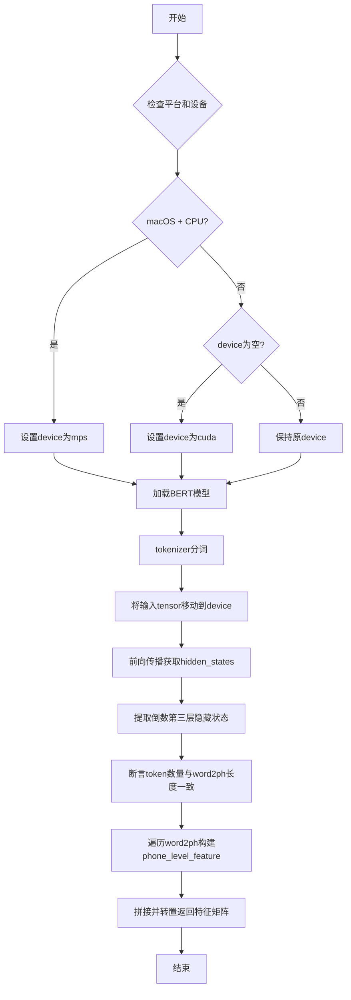
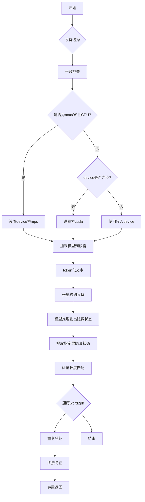

# `Bert-VITS2\oldVersion\V110\text\japanese_bert.py` 详细设计文档

该代码是一个BERT特征提取工具，通过加载预训练的日语BERT模型（bert-base-japanese-v3），将输入文本转换为词级别/音素级别的特征向量，用于语音合成等任务。

## 整体流程



## 类结构

```
无类定义 (基于函数的脚本)
└── 全局函数: get_bert_feature
```

## 全局变量及字段


### `tokenizer`
    
全局分词器，用于对日文文本进行分词，加载自预训练的bert-base-japanese-v3模型

类型：`AutoTokenizer`
    


    

## 全局函数及方法


### `get_bert_feature`

该函数用于从预训练的 BERT 模型中提取文本的音素级别特征表示，通过词到音素的映射将词级特征扩展为音素级特征，并返回音素序列的特征矩阵。

参数：

- `text`：`str`，需要提取 BERT 特征的输入文本
- `word2ph`：`List[int]` 或 `Dict`，词到音素数量的映射列表，表示每个词对应多少个音素
- `device`：`str` 或 `None`，指定计算设备（cuda/cpu/mps），默认为 None

返回值：`torch.Tensor`，形状为 (特征维度, 音素总数) 的音素级别特征矩阵

#### 流程图

```mermaid
flowchart TD
    A[开始 get_bert_feature] --> B{检查设备和平台}
    B --> C{是否 macOS + MPS 可用 + 要求 CPU?}
    C -->|是| D[设置 device = 'mps']
    C -->|否| E{device 是否为空?}
    D --> F[加载 BERT 模型到指定设备]
    E -->|是| G[设置 device = 'cuda']
    E -->|否| F
    F --> H[使用 tokenizer 将文本转为输入张量]
    I[将输入张量移到指定设备] --> J[调用模型获取隐藏状态]
    J --> K[拼接最后三层隐藏状态的倒数第三层]
    K --> L[移至 CPU 并提取第一层]
    M[断言输入长度与 word2ph 长度匹配] --> N[遍历 word2ph]
    N --> O{遍历每个词}
    O -->|当前词| P[重复当前词特征 word2ph[i] 次]
    P --> Q[收集所有重复后的特征]
    O -->|遍历完成| R[在维度 0 上拼接所有特征]
    R --> S[转置特征矩阵]
    S --> T[返回音素级别特征]
```

#### 带注释源码

```python
import torch
from transformers import AutoTokenizer, AutoModelForMaskedLM
import sys

# 全局变量：预加载 BERT 分词器（避免重复加载）
tokenizer = AutoTokenizer.from_pretrained("./bert/bert-base-japanese-v3")


def get_bert_feature(text, word2ph, device=None):
    """
    从预训练 BERT 模型提取文本的音素级别特征
    
    参数:
        text: str - 输入文本
        word2ph: List[int] - 每个词对应的音素数量列表
        device: str|None - 计算设备
    
    返回:
        torch.Tensor - 音素级别的特征矩阵 (特征维, 音素数)
    """
    
    # ---------------------------------------------------------
    # 设备选择逻辑：优先使用 GPU，macOS 下可用 MPS 加速
    # ---------------------------------------------------------
    if (
        sys.platform == "darwin"  # macOS 系统
        and torch.backends.mps.is_available()  # MPS 加速可用
        and device == "cpu"  # 用户明确指定 CPU
    ):
        device = "mps"  # 自动切换到 MPS 设备
    
    # 默认使用 CUDA（GPU）
    if not device:
        device = "cuda"
    
    # ---------------------------------------------------------
    # 加载模型并移动到指定设备
    # 注意：每次调用都会重新加载模型（性能瓶颈）
    # ---------------------------------------------------------
    model = AutoModelForMaskedLM.from_pretrained("./bert/bert-base-japanese-v3").to(
        device
    )
    
    # ---------------------------------------------------------
    # BERT 特征提取：使用掩码语言模型的隐藏状态
    # ---------------------------------------------------------
    with torch.no_grad():  # 关闭梯度计算以节省显存
        # 分词：将文本转为模型输入
        inputs = tokenizer(text, return_tensors="pt")
        
        # 将所有输入张量移到指定设备
        for i in inputs:
            inputs[i] = inputs[i].to(device)
        
        # 获取模型输出，包含所有隐藏状态
        # output_hidden_states=True 开启返回完整隐藏状态
        res = model(**inputs, output_hidden_states=True)
        
        # 提取倒数第三层隐藏状态（通常包含最丰富的语义特征）
        # torch.cat 在最后一个维度拼接，形状: (batch, seq_len, hidden_dim)
        # [0] 取第一个样本，.cpu() 移回 CPU
        res = torch.cat(res["hidden_states"][-3:-2], -1)[0].cpu()
    
    # ---------------------------------------------------------
    # 断言验证：确保词数量与特征序列长度匹配
    # ---------------------------------------------------------
    assert inputs["input_ids"].shape[-1] == len(word2ph), \
        f"输入序列长度 {inputs['input_ids'].shape[-1]} 与 word2ph 长度 {len(word2ph)} 不匹配"
    
    # ---------------------------------------------------------
    # 词级到音素级的特征扩展
    # ---------------------------------------------------------
    word2phone = word2ph  # 词到音素数量的映射
    phone_level_feature = []  # 存储音素级别特征
    
    # 遍历每个词，将词特征重复对应的音素次数
    for i in range(len(word2phone)):
        # res[i] 是第 i 个词的隐藏状态，形状: (hidden_dim,)
        # repeat(word2phone[i], 1) 在第一个维度重复 word2phone[i] 次
        repeat_feature = res[i].repeat(word2phone[i], 1)
        phone_level_feature.append(repeat_feature)
    
    # ---------------------------------------------------------
    # 拼接并转置：生成最终特征矩阵
    # ---------------------------------------------------------
    # 在维度 0（音素序列）上拼接所有特征
    # 形状: (总音素数, hidden_dim)
    phone_level_feature = torch.cat(phone_level_feature, dim=0)
    
    # 转置为 (hidden_dim, 总音素数) 格式
    return phone_level_feature.T
```

## 关键组件


### 一段话描述
该代码定义了一个函数get_bert_feature，利用预训练的日文BERT模型（bert-base-japanese-v3）从输入文本中提取隐藏状态特征，并根据提供的词到音素映射（word2ph）将词级别的特征扩展到音素级别，最终返回音素级别的特征张量，用于后续的语音合成或其他任务。

### 文件的整体运行流程
1. 初始化阶段：加载预训练的tokenizer（如果尚未加载）。
2. 函数调用阶段：
   - 检查并选择设备（优先MPS，其次CUDA，默认为CPU）。
   - 加载BERT模型到指定设备。
   - 对输入文本进行token化，并移动张量到设备。
   - 在惰性加载模式下运行模型，提取隐藏状态。
   - 选取倒数第三层的隐藏状态，并拼接最后维度。
   - 验证输入长度与word2ph长度匹配。
   - 根据word2ph映射将词级别特征重复扩展到音素级别。
   - 拼接所有音素级别特征并转置返回。

### 全局变量和全局函数详细信息

#### 全局变量

##### tokenizer
- 类型：AutoTokenizer
- 描述：从预训练模型"./bert/bert-base-japanese-v3"加载的tokenizer，用于将文本转换为模型输入。

##### model
- 类型：AutoModelForMaskedLM
- 描述：在函数内部动态加载的BERT masked语言模型，用于提取文本特征。

#### 全局函数

##### get_bert_feature(text, word2ph, device=None)
- 参数：
  - text：str，输入的日文文本。
  - word2ph：list或tuple，每个词对应的音素数量列表，用于特征扩展。
  - device：str，可选，指定运行设备（"cuda", "mps", "cpu"），默认为None。
- 返回值：
  - 类型：torch.Tensor
  - 描述：形状为(特征维度, 音素总数)的特征张量，表示音素级别的BERT特征。
- Mermaid流程图：

- 带注释源码：
```python
def get_bert_feature(text, word2ph, device=None):
    # 设备选择逻辑：优先使用MPS（Apple Silicon GPU），其次CUDA，默认为CPU
    if (
        sys.platform == "darwin"
        and torch.backends.mps.is_available()
        and device == "cpu"
    ):
        device = "mps"
    if not device:
        device = "cuda"
    # 加载模型并移动到指定设备
    model = AutoModelForMaskedLM.from_pretrained("./bert/bert-base-japanese-v3").to(
        device
    )
    # 惰性加载：不计算梯度，减少内存消耗
    with torch.no_grad():
        inputs = tokenizer(text, return_tensors="pt")
        # 将所有输入张量移到指定设备
        for i in inputs:
            inputs[i] = inputs[i].to(device)
        # 获取模型输出，包含所有隐藏状态
        res = model(**inputs, output_hidden_states=True)
        # 提取倒数第三层隐藏状态，并拼接最后维度（特征维度）
        # res["hidden_states"]是一个元组，索引-2表示倒数第三层
        res = torch.cat(res["hidden_states"][-3:-2], -1)[0].cpu()
    # 断言：输入token数量必须与word2ph长度一致
    assert inputs["input_ids"].shape[-1] == len(word2ph)
    word2phone = word2ph
    phone_level_feature = []
    # 遍历每个词，将词特征重复对应的音素数量次数
    for i in range(len(word2phone)):
        repeat_feature = res[i].repeat(word2phone[i], 1)
        phone_level_feature.append(repeat_feature)

    # 沿音素维度拼接所有特征
    phone_level_feature = torch.cat(phone_level_feature, dim=0)

    # 转置返回：形状变为(特征维度, 音素总数)
    return phone_level_feature.T
```

### 关键组件信息

#### 张量索引与惰性加载
- 名称：张量索引与惰性加载
- 描述：代码中使用`torch.no_grad()`创建惰性加载上下文，避免计算梯度以提高效率；同时使用张量索引（如`res["hidden_states"][-3:-2]`）提取特定层的隐藏状态。

#### 设备自动选择
- 名称：设备自动选择
- 描述：函数自动检测运行平台（macOS）和硬件（CUDA、MPS），优先选择GPU进行加速，默认为CPU。

#### 特征扩展映射
- 名称：特征扩展映射
- 描述：根据word2ph映射，将词级别的BERT特征重复扩展到音素级别，实现从词到音素的特征对齐。

### 潜在的技术债务或优化空间

1. **模型重复加载**：每次调用函数都会重新加载BERT模型，导致额外的I/O开销和内存占用。建议将模型和tokenizer作为全局变量或使用单例模式进行缓存。
2. **设备选择逻辑**：当前逻辑在device为"cpu"时仍可能切换到"mps"，可能与用户意图冲突，建议明确设备优先级。
3. **错误处理不足**：缺乏对模型加载失败、文本过长或word2ph不匹配等异常情况的处理，可能导致运行时错误。
4. **硬编码路径**：模型路径"./bert/bert-base-japanese-v3"硬编码在代码中，不利于配置管理。

### 其它项目

#### 设计目标与约束
- 设计目标：从日文文本中提取音素级别的深度学习特征，用于语音合成或相关任务。
- 约束：依赖预训练BERT模型，输入文本需与tokenizer兼容，word2ph长度需与tokenized输入长度一致。

#### 错误处理与异常设计
- 使用assert断言检查输入长度与word2ph的一致性，若不匹配则抛出AssertionError。
- 缺乏对模型加载失败、设备不支持等情况的异常捕获。

#### 数据流与状态机
- 数据流：文本 -> token化 -> 模型推理 -> 隐藏状态提取 -> 特征扩展 -> 特征拼接 -> 返回。
- 状态机：无明显状态机，主要为顺序执行流程。

#### 外部依赖与接口契约
- 外部依赖：torch, transformers库，需提前安装。
- 接口契约：输入text（字符串）和word2ph（列表），输出特征张量，设备参数可选。


## 问题及建议


### 已知问题

-   **模型重复加载**：每次调用`get_bert_feature`函数都会重新从磁盘加载BERT模型和tokenizer，导致严重的性能开销，应该在模块级别或初始化时加载一次并复用
-   **硬编码路径重复**：模型路径`"./bert/bert-base-japanese-v3"`在代码中出现两次，增加了维护成本，应提取为常量
-   **设备检测逻辑缺陷**：当`device`参数明确传入`"cpu"`时，代码逻辑仍会尝试将其改为`"mps"`，这可能导致非预期的行为，应该使用独立的MPS优先级检测逻辑
-   **缺少模型推理模式**：未调用`model.eval()`切换到推理模式，虽然使用了`torch.no_grad()`，但显式设置推理模式是最佳实践
-   **缺乏错误处理**：没有对模型加载失败、tokenizer处理异常、输入验证失败等情况进行处理，assert语句也不够优雅
-   **循环效率问题**：使用`for`循环+`append`然后再`torch.cat`，可以考虑预分配或使用列表推导式优化
-   **类型注解缺失**：函数参数和返回值没有类型注解，影响代码可读性和IDE支持
-   **全局函数设计**：作为工具函数缺乏文档字符串，不方便其他开发者理解和使用
- **tokenizer重复加载**：tokenizer同样在每次调用时重新加载，与模型加载问题相同

### 优化建议

-   将模型和tokenizer的加载移至模块初始化阶段或使用单例模式/缓存机制
-   提取模型路径为模块级常量，避免重复定义
-   修正设备检测逻辑，改为：先检测MPS可用性，再根据用户传入的device参数综合判断
-   在推理代码前添加`model.eval()`调用
-   添加输入验证逻辑，检查`word2ph`长度与`input_ids`长度是否匹配，并使用自定义异常替代assert
-   为函数添加类型注解和docstring，提升代码可维护性
-   考虑使用`functools.lru_cache`或类似的缓存机制来缓存模型实例

## 其它


### 设计目标与约束

本代码的设计目标是利用预训练的日文BERT模型（bert-base-japanese-v3）将输入文本转换为phone级别的特征向量，用于语音合成等下游任务。核心约束包括：1）模型文件必须位于"./bert/bert-base-japanese-v3"路径下；2）输入的word2ph列表长度必须与输入文本的token数量一致；3）设备支持限于CPU、CUDA和MPS（macOS）；4）输出特征维度固定为BERT隐藏层维度（768维）。

### 错误处理与异常设计

代码包含以下错误处理机制：1）使用assert验证输入长度一致性，当word2ph长度与input_ids长度不匹配时抛出AssertionError；2）设备自动检测逻辑，当MPS可用且指定CPU时自动切换到MPS；3）模型加载使用AutoTokenizer和AutoModelForMaskedLM的默认异常传播。潜在改进：增加更友好的错误提示、添加try-except包装处理模型加载失败、验证模型路径存在性。

### 数据流与状态机

数据流如下：输入文本(text) → Tokenizer分词 → 转换为张量并移动到目标设备 → BERT模型前向传播 → 提取中间层隐藏状态 → 根据word2ph进行特征复制扩展 → 拼接为phone级别特征 → 返回转置后的特征矩阵。状态机转换：初始化状态（加载tokenizer）→ 模型加载状态 → 推理状态 → 特征处理状态 → 返回结果状态。

### 外部依赖与接口契约

主要依赖包括：1）torch >= 1.0；2）transformers >= 4.0；3）系统平台需支持cuda或mps。接口契约：get_bert_feature(text: str, word2ph: List[int], device: Optional[str] = None) → torch.Tensor，返回形状为(768, total_phones)的特征矩阵，其中total_phones为word2ph所有元素之和。

### 性能考虑

当前实现每次调用都会重新加载模型，造成显著性能开销。优化方向：1）将模型加载移到模块级别或使用单例模式；2）使用torch.inference_mode()替代torch.no_grad()提升推理性能；3）考虑批量处理多个文本；4）MPS设备需注意内存管理，建议在处理完成后及时释放模型。

### 安全性考虑

代码从本地路径加载模型，需确保模型文件来源可信。输入text参数未做长度限制，可能导致内存问题。建议添加：1）输入验证和长度限制；2）模型文件完整性校验；3）设备内存检测防止OOM。

### 资源管理

模型在每次调用时加载到指定设备后未显式释放，建议使用with语句或手动管理GPU/MPS内存。对于长时间运行的服务，应考虑模型缓存和生命周期管理。

### 版本兼容性

代码使用transformers库的AutoAPI，具有较好的兼容性但需注意：1）不同版本transformers的output_hidden_states行为可能变化；2）MPS支持需要torch >= 2.0；3）建议锁定依赖版本。

### 测试策略

建议添加单元测试覆盖：1）输入长度不匹配时的assert触发；2）不同设备（cpu/cuda/mps）的推理结果一致性；3）输出tensor形状正确性验证；4）空输入或特殊字符处理。

### 配置管理

当前硬编码了模型路径"./bert/bert-base-japanese-v3"，建议提取为配置参数，支持通过环境变量或配置文件指定模型路径，提高代码灵活性。


    