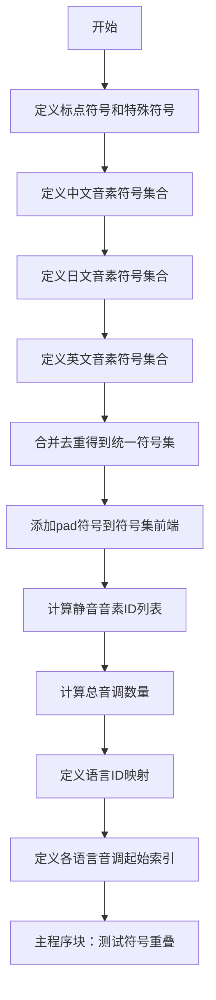
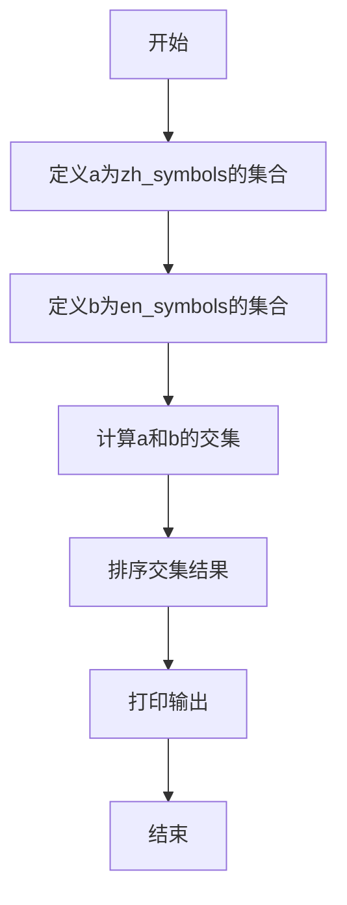

# `Bert-VITS2\oldVersion\V110\text\symbols.py` 详细设计文档

该代码定义了中文、日文和英文的音素符号表（phoneme symbols），通过整合三种语言的音素符号、标点符号和特殊符号，构建了一个统一的符号集合，并定义了语言标识符、音调数量以及各语言音调起始位置的映射关系，主要用于多语言语音合成或语音识别系统中的音素序列处理。

## 整体流程



## 类结构

```
模块: phoneme_symbols (无类定义，纯配置模块)
├── 全局变量区
│   ├── 标点符号定义 (punctuation, pu_symbols)
│   ├── 中文音素符号 (zh_symbols, num_zh_tones)
│   ├── 日文音素符号 (ja_symbols, num_ja_tones)
│   ├── 英文音素符号 (en_symbols, num_en_tones)
│   ├── 统一符号表 (normal_symbols, symbols)
│   ├── 静音音素 (sil_phonemes_ids)
│   ├── 音调配置 (num_tones, language_tone_start_map)
│   └── 语言配置 (language_id_map, num_languages)
└── 主程序块 (if __name__ == '__main__')
```

## 全局变量及字段


### `punctuation`
    
标点符号列表，包含常见的中文和英文标点符号

类型：`List[str]`
    


### `pu_symbols`
    
标点符号和特殊符号列表，包含punctuation加上SP(空格)和UNK(未知)标记

类型：`List[str]`
    


### `pad`
    
填充符号，用于序列补齐操作的占位符

类型：`str`
    


### `zh_symbols`
    
中文音素符号列表，包含汉语拼音的声母、韵母和声调符号

类型：`List[str]`
    


### `num_zh_tones`
    
中文音调数量，值为6（包括5个声调和1个轻声）

类型：`int`
    


### `ja_symbols`
    
日语音素符号列表，包含假名的罗马字表示

类型：`List[str]`
    


### `num_ja_tones`
    
日语音调数量，值为1（日语无明显音调区分）

类型：`int`
    


### `en_symbols`
    
英文音素符号列表，包含CMU音素库的音素表示

类型：`List[str]`
    


### `num_en_tones`
    
英文音调数量，值为4（重音等级）

类型：`int`
    


### `normal_symbols`
    
去重并排序后的所有语言音素符号集合（不含pad和特殊符号）

类型：`List[str]`
    


### `symbols`
    
完整符号表，包含pad、normal_symbols和pu_symbols，用于音素到索引的映射

类型：`List[str]`
    


### `sil_phonemes_ids`
    
静音和特殊音素在symbols中的索引位置列表

类型：`List[int]`
    


### `num_tones`
    
所有语言的总音调数量，由三种语言的音调相加得出

类型：`int`
    


### `language_id_map`
    
语言代码到语言ID的映射，ZH=0, JP=1, EN=2

类型：`Dict[str, int]`
    


### `num_languages`
    
支持的语言数量，共3种语言

类型：`int`
    


### `language_tone_start_map`
    
每种语言的起始音调索引映射，用于多语言音调编码

类型：`Dict[str, int]`
    


    

## 全局函数及方法


## 关键组件


### 多语言符号集合定义

定义了中文、日文、英文的音素符号集合，以及标点符号和特殊符号（如pad、SP、UNK），用于语音处理模型。

### 符号索引映射构建

将所有语言的符号合并、去重并排序，生成统一的符号列表symbols，并构建符号到索引的映射，用于模型输入编码。

### 语言与音调映射管理

通过language_id_map和language_tone_start_map管理语言ID和音调起始索引，支持多语言语音合成或识别。

### 音调数量统计

计算并汇总中文、日文、英文的音调数量，得到总音调数num_tones，用于模型输出层设计。

### 静音符号索引提取

计算pu_symbols（标点符号）在symbols列表中的索引，存储在sil_phonemes_ids中，用于处理静音或未知音素。

### 主程序符号交集测试

在主程序块中测试中文和英文符号集合的交集，验证符号定义的一致性和覆盖范围。


## 问题及建议


### 已知问题

- 硬编码的符号列表缺乏灵活性，所有音素符号直接写在代码中，难以维护和扩展
- 中文、日文、英文符号列表中存在大量重复元素（如 'a', 'i', 'n', 'b', 'd' 等），虽然使用 set 去重，但数据结构冗余
- 语言音调数量定义不准确，`num_en_tones = 4` 实际与英语实际音调数量不符，`num_ja_tones = 1` 也过于简化
- `language_tone_start_map` 依赖手动计算的硬编码偏移量，与语言符号列表顺序紧密耦合，新增语言时容易出错
- `__main__` 块中的代码逻辑无实际意义（计算并集后未使用），且缺少异常处理机制
- 缺乏模块化设计，所有变量和映射都是全局状态，不利于测试和复用

### 优化建议

- 将符号列表迁移至独立的配置文件（如 JSON/YAML）或数据库，提高可维护性
- 使用类或命名空间封装语言相关的符号和配置，避免全局变量污染
- 增加输入验证逻辑，检查符号列表是否有交集、tone_start 偏移是否正确等
- 为每种语言定义独立的配置类或数据结构，统一管理符号、音调数量和起始索引
- 移除 `__main__` 块中的无效代码，或替换为有意义的单元测试逻辑
- 考虑增加类型注解（type hints）以提高代码可读性和 IDE 支持

## 其它


### 设计目标与约束

该模块作为文本转语音(TTS)系统的音素符号定义核心，旨在为中文(ZH)、日文(JP)和英文(EN)三种语言提供统一、标准化的音素符号集合，并支持多语言混合场景。设计约束包括：1) 符号集必须覆盖所有语言的基本音素；2) 符号索引从0开始，索引0保留给填充符号(pad)；3) 静音音素用于句子边界和停顿处理；4) 音调数量需与各语言的实际音调系统匹配。

### 错误处理与异常设计

当前模块为纯数据定义模块，未包含复杂的错误处理机制。潜在错误场景包括：1) 符号列表重复：使用sorted(set())确保去重；2) 语言ID不存在：language_id_map采用固定键值，若输入非法语言ID应返回KeyError；3) 索引越界：symbols.index()调用在符号不存在时会抛出ValueError。建议在调用方进行参数校验。

### 数据流与状态机

模块的数据流如下：1) 初始化阶段：加载各语言符号列表(punctuation、zh_symbols、ja_symbols、en_symbols)；2) 合并阶段：通过set合并去重，生成normal_symbols，再拼接pad和pu_symbols生成完整symbols列表；3) 索引映射阶段：计算sil_phonemes_ids、language_id_map、language_tone_start_map；4) 运行阶段：__main__中执行测试逻辑，展示中英文符号交集。无状态机设计，纯函数式数据处理。

### 外部依赖与接口契约

本模块无外部依赖，仅使用Python标准库(set、sorted)。接口契约：1) symbols列表为有序序列，索引固定，任何修改需同步更新sil_phonemes_ids；2) language_id_map的键为字符串"ZH"/"JP"/"EN"，值从0开始连续；3) language_tone_start_map定义各语言音调索引的起始偏移量；4) num_tones为所有语言音调总数，应等于各语言音调数之和。使用方需通过symbols列表索引访问音素，不应直接依赖硬编码数值。

### 关键组件信息

- **symbols列表**: 完整的音素符号集合，包含填充符、中文日文英文音素、标点符号和特殊符号
- **language_id_map**: 语言标识符到整数ID的映射，用于区分语言类型
- **language_tone_start_map**: 各语言音调索引的起始位置，用于多语言音调处理
- **sil_phonemes_ids**: 静音/标点音素的索引列表，用于文本转语音的静音处理
- **normal_symbols**: 合并后的基础音素符号（不含pad和特殊符号），用于基础音素集

### 潜在的技术债务与优化空间

1. **硬编码问题**: 符号列表为硬编码数据，建议迁移至配置文件或数据库，支持动态扩展；2. **符号重叠处理**: 中英文存在重复符号(如"a","i","n"等)，当前通过set去重但可能导致某些语言特有音素丢失，应考虑添加语言前缀区分；3. **可维护性**: 符号列表冗长，建议按语言分类组织或拆分为多文件；4. **测试覆盖**: 仅在__main__中打印交集，缺乏单元测试，建议添加pytest测试用例验证符号完整性；5. **国际化扩展**: 当前仅支持三种语言，新增语言需手动修改多处代码，应设计插件化架构。

### 整体运行流程

1. 模块加载时定义七种语言的符号列表(punctuation、zh_symbols、ja_symbols、en_symbols)和特殊符号(pu_symbols)；
2. 通过set合并去重生成normal_symbols，再拼接pad和pu_symbols生成完整symbols列表；
3. 计算静音音素的索引列表sil_phonemes_ids；
4. 统计总音调数量num_tones和各语言音调起始位置language_tone_start_map；
5. 若作为主程序运行，则执行测试逻辑，输出中英文符号的交集集合。

### 核心功能描述

该代码是一个多语言音素符号定义模块，用于文本转语音(TTS)系统，定义了中文、日文、英文三种语言的音素符号集合以及标点符号和特殊符号，并提供语言ID映射、音调起始位置等辅助信息，支持多语言混合的语音合成场景。

### 全局变量详细信息

- **punctuation**: list[str]，标点符号列表，包含"!", "?", "…", ",", ".", "'", "-"
- **pu_symbols**: list[str]，标点和特殊符号列表，在punctuation基础上添加"SP"(空格)和"UNK"(未知)
- **pad**: str，填充符号，值为"_"，用于序列填充
- **zh_symbols**: list[str]，中文音素符号列表，包含声母、韵母及特殊标记如"E","En","AA"等，共87个符号
- **num_zh_tones**: int，中文音调数量，值为6(对应四声+轻声+轻声变调)
- **ja_symbols**: list[str]，日文音素符号列表，包含假名对应的音素，共44个符号
- **num_ja_tones**: int，日文音调数量，值为1(日语无明显音调系统)
- **en_symbols**: list[str]，英文音素符号列表，采用ARPAbet音标体系，共39个符号
- **num_en_tones**: int，英文音调数量，值为4(对应重音等级)
- **normal_symbols**: list[str]，合并后的基础音素符号列表(去重排序)，不含pad和特殊符号
- **symbols**: list[str]，完整符号列表，包含pad、normal_symbols和pu_symbols，共133个符号
- **sil_phonemes_ids**: list[int]，静音音素和标点符号在symbols中的索引列表
- **num_tones**: int，总音调数量，值为11(6+1+4)
- **language_id_map**: dict[str, int]，语言标识符到ID的映射，{"ZH": 0, "JP": 1, "EN": 2}
- **num_languages**: int，支持的语言数量，值为3
- **language_tone_start_map**: dict[str, int]，各语言音调索引起始位置映射，ZH:0, JP:6, EN:7

### 全局函数详细信息

#### 函数: 无

当前模块无自定义函数，仅包含数据定义和测试代码。

#### 测试代码(__main__)

- **函数名**: 无(主程序入口)
- **参数**: 无
- **返回值**: 无(仅打印输出)
- **功能描述**: 测试函数，展示中英文符号集合的交集，用于验证符号定义的一致性和差异性
- **mermaid流程图**: 

- **源码**:
```python
if __name__ == "__main__":
    a = set(zh_symbols)
    b = set(en_symbols)
    print(sorted(a & b))
```

    