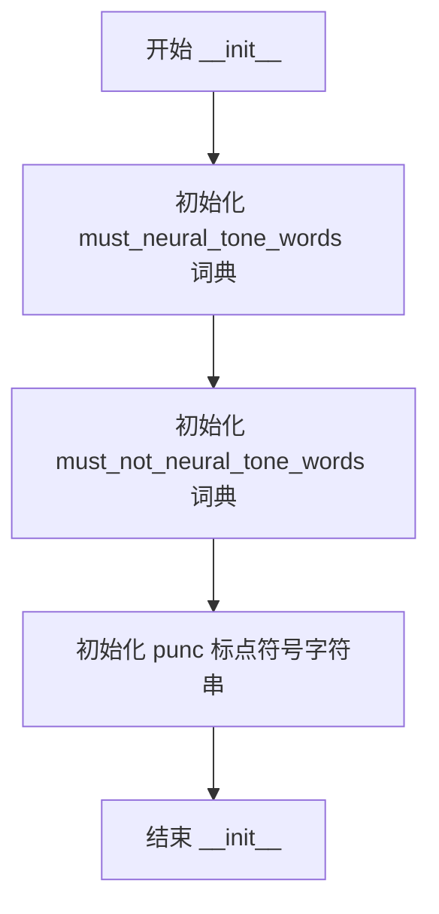
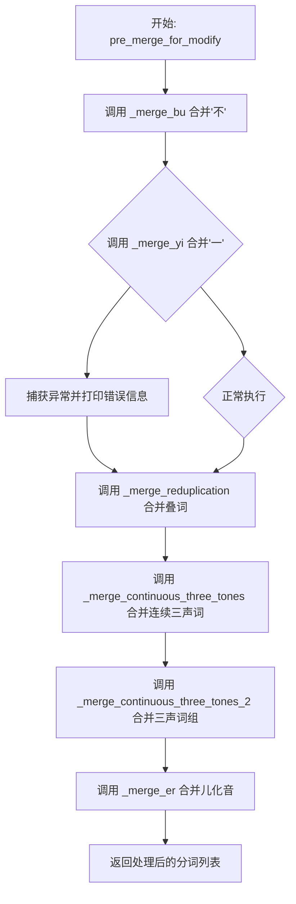
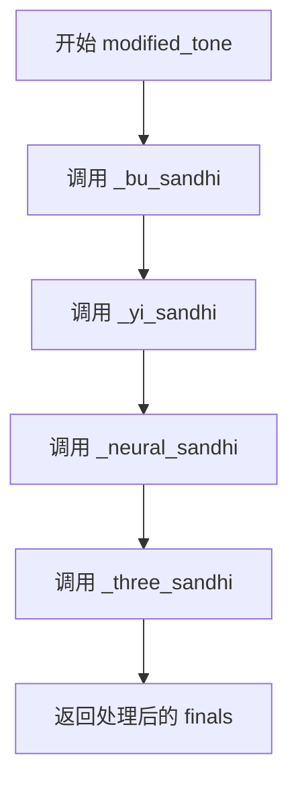
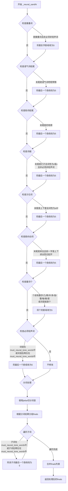
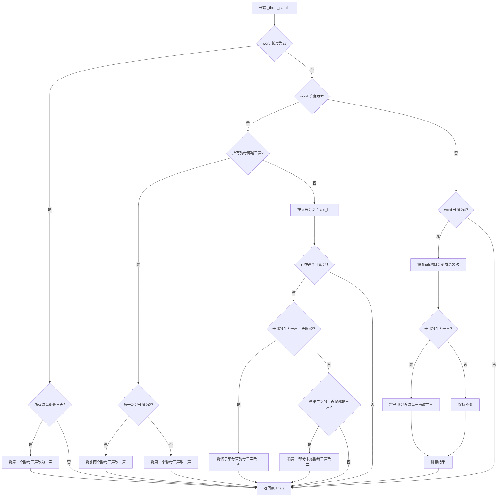
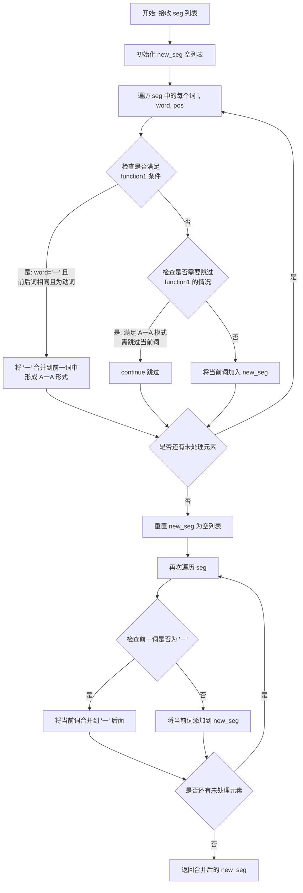
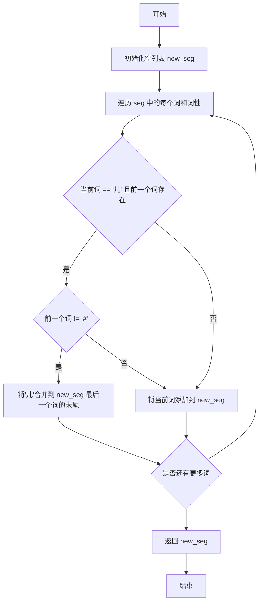
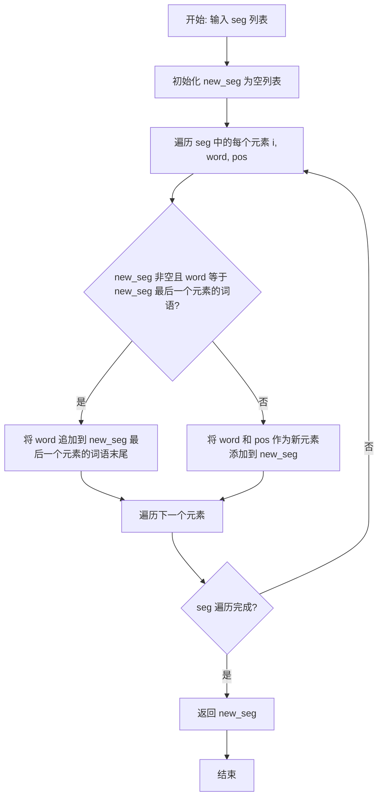

# `Bert-VITS2\oldVersion\V110\text\tone_sandhi.py` 详细设计文档

该代码实现了一个中文声调处理类（ToneSandhi），主要功能是根据中文语音学规则（声调变化规则），对分词后的词语进行拼音音调（finals）修改，包括处理轻声、不（bu）、一（yi）以及三声连读变调等规则。

## 整体流程

```mermaid
graph TD
    Start[输入: 分词列表 Seg] --> PreMerge[调用 pre_merge_for_modify]
    PreMerge --> Merge1[_merge_bu 合并不]
    Merge1 --> Merge2[_merge_yi 合并一]
    Merge2 --> Merge3[_merge_reduplication 合并叠词]
    Merge3 --> Merge4[_merge_continuous_three_tones 合并连续三声]
    Merge4 --> Merge5[_merge_continuous_three_tones_2 合并三声变调2]
    Merge5 --> Merge6[_merge_er 合并儿化音]
    Merge6 --> IterLoop[遍历处理每个词]
    IterLoop --> Modified[调用 modified_tone]
    Modified --> BuSandhi[应用 _bu_sandhi (不规则)]
    BuSandhi --> YiSandhi[应用 _yi_sandhi (一规则)]
    YiSandhi --> NeuralSandhi[应用 _neural_sandhi (轻声规则)]
    NeuralSandhi --> ThreeSandhi[应用 _three_sandhi (三声变调)]
    ThreeSandhi --> Output[输出修改后的 Finals]
    Output --> End[结束]
```

## 类结构

```
ToneSandhi (声调处理类)
```

## 全局变量及字段


### `ToneSandhi.must_neural_tone_words`
    
必须读轻声的词语集合，包含大量常用词如'麻烦'、'麻利'、'鸳鸯'等

类型：`Dict[str, str]`
    


### `ToneSandhi.must_not_neural_tone_words`
    
禁止读轻声的词语集合，包含'男子'、'女子'、'分子'、'原子'等词

类型：`Dict[str, str]`
    


### `ToneSandhi.punc`
    
标点符号集合，用于判断'一'前的音调，包含：，；。？！""''':,;.?!

类型：`str`
    
    

## 全局函数及方法


### `ToneSandhi.__init__`

该方法是 `ToneSandhi` 类的构造函数，负责在对象初始化时加载汉语声调合并所需的词典数据，包括必须使用轻声的词语列表、不能使用轻声的词语列表以及标点符号集合。

参数：

- 该方法无额外参数，仅接收隐式参数 `self`

返回值：`None`，无返回值，仅进行实例变量初始化

#### 流程图



#### 带注释源码

```python
def __init__(self):
    # 加载必须读作轻声的词语词典
    # 这些词语在汉语中习惯读作轻声，如"麻烦"、"麻利"、"鸳鸯"等
    self.must_neural_tone_words = {
        "麻烦",
        "麻利",
        "鸳鸯",
        "高粱",
        # ... (约300+个词语)
    }
    
    # 加载不应读作轻声的词语词典
    # 这些词语中的重叠形式不读轻声，如"男子"、"女子"、"分子"等
    self.must_not_neural_tone_words = {
        "男子",
        "女子",
        "分子",
        "原子",
        "量子",
        "莲子",
        "石子",
        "瓜子",
        "电子",
        "人人",
        "虎虎",
    }
    
    # 加载中文标点符号集合，用于声调合并判断
    # 包括：冒号、逗号、分号、句号、问号、感叹号、引号等
    self.punc = "：，；。？！""'''':,;.?!"
```


### `ToneSandhi.pre_merge_for_modify`

该函数是预处理阶段的核心方法，负责对分词列表进行一系列合并操作，以解决中文分词后可能出现的声调错误问题。主要合并"不"、"一"、儿化音、叠词以及连续三声等需要合并的词组。

参数：

-  `seg`：`List[Tuple[str, str]]`，输入的分词列表，每个元素为（词语，词性）元组

返回值：`List[Tuple[str, str]]`，合并处理后的分词列表

#### 流程图



#### 带注释源码

```python
def pre_merge_for_modify(self, seg: List[Tuple[str, str]]) -> List[Tuple[str, str]]:
    """
    预处理：对分词列表进行合并操作
    
    该方法依次调用多个合并函数，解决分词后因词语分割导致的声调错误问题：
    1. 合并'不'与后继词语 - 避免'不'单独出现导致声调错误
    2. 合并'一'与叠词或后继词语 - 避免'一'单独出现导致声调错误
    3. 合并叠词 - 如'奶奶'、'试试'等
    4. 合并连续三声音节 - 三声连读变调处理
    5. 合并三声词组 - 首尾三声连续
    6. 合并儿化音 - 如'花儿'、'鸟儿'等
    
    参数:
        seg: 分词列表，每个元素为(词语, 词性)的元组
    
    返回:
        合并处理后的分词列表
    """
    # 步骤1：合并"不"和其后面的词，如"不"+"怕" -> "不怕"
    seg = self._merge_bu(seg)
    
    # 步骤2：合并"一"和词语（包含两种情况：
    #        1. 合并叠词周围的"一"，如"听"+"一"+"听" -> "听一听"
    #        2. 合并单独的"一"和后面的词）
    #        使用try-except捕获可能的异常
    try:
        seg = self._merge_yi(seg)
    except:
        print("_merge_yi failed")
    
    # 步骤3：合并连续重复的词（叠词），如"奶奶"、"试试"等
    seg = self._merge_reduplication(seg)
    
    # 步骤4：合并连续两个都是三声的词组
    #        如"蒙古/包" -> "蒙古包"（两者都是三声）
    seg = self._merge_continuous_three_tones(seg)
    
    # 步骤5：合并前一词的最后一个字和后一词的第一个字都是三声的情况
    #        如"好/喜欢" -> "好喜欢"
    seg = self._merge_continuous_three_tones_2(seg)
    
    # 步骤6：合并儿化音，如"花"+"儿" -> "花儿"
    seg = self._merge_er(seg)
    
    # 返回合并处理后的分词结果
    return seg
```


### `ToneSandhi.modified_tone`

该方法是 `ToneSandhi` 类的核心方法，负责按照中文声调规则（不规则、一规则、轻声规则和三声连读变调规则）的顺序，依次对输入词语的音节韵母进行声调修改处理。

参数：

- `word`：`str`，输入的中文词语
- `pos`：`str`，词语的词性标注（来自 jieba 分词）
- `finals`：`List[str]`，词语的音节韵母列表，每个元素格式为"韵母+声调数字"

返回值：`List[str]`，返回修改后的音节韵母列表

#### 流程图



#### 带注释源码

```python
def modified_tone(self, word: str, pos: str, finals: List[str]) -> List[str]:
    """
    应用具体的声调修改规则
    
    该方法是整个声调处理的核心入口，按照特定顺序依次应用：
    1. 不(bu)字的声调规则
    2. 一(yi)字的声调规则
    3. 轻声(neutral)规则
    4. 三声连读变调规则
    
    参数:
        word: str - 输入的中文词语
        pos: str - 词语的词性标注（来自jieba）
        finals: List[str] - 音节韵母列表，如['ia1', 'i3']
    
    返回:
        List[str] - 修改后的音节韵母列表
    """
    # 步骤1: 应用"不"字的声调规则
    # 例如：不怕(bu4 -> bu2)、看不懂(bu4 -> bu5)
    finals = self._bu_sandhi(word, finals)
    
    # 步骤2: 应用"一"字的声调规则
    # 例如：一看一看(yi1 -> yi5)、一段(yi1 -> yi2)、一天(yi1 -> yi4)
    finals = self._yi_sandhi(word, finals)
    
    # 步骤3: 应用轻声（neutral tone）规则
    # 处理重叠词、语气词、方位词、量词等需要读轻声的情况
    finals = self._neural_sandhi(word, pos, finals)
    
    # 步骤4: 应用三声连读变调规则
    # 两个或三个三声字连读时，前一个或多个变为二声
    finals = self._three_sandhi(word, finals)
    
    # 返回处理完成的音节韵母列表
    return finals
```


### `ToneSandhi._bu_sandhi`

该方法用于处理中文中"不"字的变调规则，根据"不"字在词语中的位置及其后面音节的声调，将其调整为正确的声调（轻声或第二声）。

参数：

- `word`：`str`，待处理的词语
- `finals`：`List[str]`，词语对应的拼音韵母列表（带声调标记）

返回值：`List[str]`，处理后的拼音韵母列表

#### 流程图

```mermaid
flowchart TD
    A[开始 _bu_sandhi] --> B{word长度为3且<br>word[1] == '不'?}
    B -->|是| C[将 finals[1] 变为轻声<br>例如: 看不懂 → 5声]
    B -->|否| D[遍历 word 中的每个字符]
    D --> E{当前字符 == '不'<br>且下一个字符存在<br>且下一个字符声调为4?}
    E -->|是| F[将当前 '不' 的声调变为2<br>例如: 不怕 → bu2]
    E -->|否| G{是否还有下一个字符?}
    G -->|是| D
    G -->|否| H[返回处理后的 finals]
    C --> H
    F --> G
```

#### 带注释源码

```python
def _bu_sandhi(self, word: str, finals: List[str]) -> List[str]:
    """
    处理"不"字的变调规则
    
    变调规则:
    1. "不"在三字词中间位置时，读轻声(5声)，如"看不懂"
    2. "不"后面是第四声(去声)时，"不"读第二声(阳平)，如"不怕"
    """
    # 情况1：三字词且"不"在中间位置，将"不"变为轻声
    # 例如：看不懂 → 看[1]不懂[5]
    if len(word) == 3 and word[1] == "不":
        finals[1] = finals[1][:-1] + "5"
    else:
        # 情况2：遍历查找"不"字，根据后续音节声调变调
        for i, char in enumerate(word):
            # "不" before tone4 should be bu2, e.g. 不怕
            if char == "不" and i + 1 < len(word) and finals[i + 1][-1] == "4":
                finals[i] = finals[i][:-1] + "2"
    return finals
```


### ToneSandhi._yi_sandhi

该方法处理中文"一"字的变调规则，根据"一"在词语中的位置和后续音节的声调，将其调整为正确的读音（一声、二声、四声或轻声）。

参数：
- `word`：`str`，待处理的词语
- `finals`：`List[str]`，词语的韵母列表，每个元素为带声调的拼音（如"yi1"）

返回值：`List[str]`，处理后的韵母列表

#### 流程图

```mermaid
flowchart TD
    A[开始 _yi_sandhi] --> B{word中是否包含"一"}
    B -->|否| C[返回原始finals]
    B -->|是| D{word为纯数字序列<br/>（包含"一"但其他都是数字）}
    D -->|是| C
    D -->|否| E{word长度为3<br/>且word[1]=='一'<br/>且word[0]==word[-1]<br/>重叠词}
    E -->|是| F[finals[1]改为轻声5<br/>如'yi1'->'yi5']
    E -->|否| G{word以'第一'开头}
    G -->|是| H[finals[1]改为一声音1<br/>如'yi1'->'yi1']
    G -->|否| I[遍历word中的每个"一"]
    I --> J{找到"一"且i+1<len}
    J -->|否| K[返回处理后的finals]
    J -->|是| L{final[i+1]末位=='4'<br/>后接四声}
    L -->|是| M[finals[i]改为二声2<br/>如'yi1'->'yi2']
    L -->|否| N{word[i+1]不是标点}
    N -->|否| O[保持一声]
    N -->|是| P[finals[i]改为四声4<br/>如'yi1'->'yi4']
    M --> I
    O --> I
    P --> I
    F --> K
    H --> K
```

#### 带注释源码

```python
def _yi_sandhi(self, word: str, finals: List[str]) -> List[str]:
    # 情况1："一"在纯数字序列中，如"一零零"、"二一零"，保持原调不变
    if word.find("一") != -1 and all(
        [item.isnumeric() for item in word if item != "一"]
    ):
        return finals
    
    # 情况2："一"在重叠词之间，如"看一看"、"想一想"，应读轻声yi5
    # 条件：词语长度为3，"一"在中间位置，首尾字符相同（如"看一看"）
    elif len(word) == 3 and word[1] == "一" and word[0] == word[-1]:
        finals[1] = finals[1][:-1] + "5"
    
    # 情况3："一"作为序数词，如"第一"、"第十"，应读一声yi1
    elif word.startswith("第一"):
        finals[1] = finals[1][:-1] + "1"
    
    # 情况4：一般变调规则处理
    else:
        # 遍历词语中的每个字符，查找"一"的位置
        for i, char in enumerate(word):
            if char == "一" and i + 1 < len(word):
                # "一"在四声（去声）前读二声，如"一段"、"一致"、"一律"
                if finals[i + 1][-1] == "4":
                    finals[i] = finals[i][:-1] + "2"
                # "一"在非四声前读四声，如"一天"、"一年"、"一毛"
                else:
                    # 特殊情况：如果"一"后面是标点符号，仍读一声
                    if word[i + 1] not in self.punc:
                        finals[i] = finals[i][:-1] + "4"
    
    return finals
```


### ToneSandhi._neural_sandhi

该方法处理中文词语的轻声规则，根据词语的结构（重叠词、语气词、助词、词缀、方位词、量词等）以及预定义的必须读轻声的词语列表，将相应位置的拼音韵母标记为轻声（声调5）。

参数：

- `word`：`str`，待处理的中文词语
- `pos`：`str`，jieba分词后的词性标注（如"n"名词、"v"动词、"a"形容词等）
- `finals`：`List[str]`，词语的拼音韵母列表，每个元素如"ia1"、"i3"等，末尾数字表示声调

返回值：`List[str]`，处理后的拼音韵母列表，已将需要读轻声的韵母末尾数字改为"5"

#### 流程图



#### 带注释源码

```python
def _neural_sandhi(self, word: str, pos: str, finals: List[str]) -> List[str]:
    """
    处理中文轻声规则
    
    参数:
        word: 待处理的中文词语
        pos: 词性标注 (n=名词, v=动词, a=形容词, r=代词, s=处所词, l=方位词, f=方位词)
        finals: 拼音韵母列表，格式如['ia1', 'i3']，末尾数字为声调
    
    返回:
        处理后的拼音韵母列表，需要读轻声的位置会将声调改为5
    """
    
    # 处理重叠词（Reduplication）：如奶奶(n.), 试试(v.), 旺旺(a.)
    # 规则：名词/动词/形容词中的重叠字需要读轻声
    for j, item in enumerate(word):
        if (
            j - 1 >= 0  # 确保不是第一个字符
            and item == word[j - 1]  # 当前字符与前一个字符相同（重叠）
            and pos[0] in {"n", "v", "a"}  # 词性为名词/动词/形容词
            and word not in self.must_not_neural_tone_words  # 不在必须不读轻声的列表中
        ):
            # 将重叠字的韵母声调改为5（轻声）
            finals[j] = finals[j][:-1] + "5"
    
    # 查找"个"字的位置（用于量词规则）
    ge_idx = word.find("个")
    
    # 规则1：语气词结尾（如吧、呢、啊、呐、噻、嘛、吖、嗨、哦、哒、额、滴、哩、哟、啰、耶、喔、诶）
    if len(word) >= 1 and word[-1] in "吧呢啊呐噻嘛吖嗨呐哦哒额滴哩哟喽啰耶喔诶":
        finals[-1] = finals[-1][:-1] + "5"
    
    # 规则2：助词结尾（的、地、得）
    elif len(word) >= 1 and word[-1] in "的地得":
        finals[-1] = finals[-1][:-1] + "5"
    
    # 规则3：词缀"们"或"子"结尾，且词性为代词(r)或名词(n)，非必须非轻声词
    # 如：孩子们、房子
    elif (
        len(word) > 1
        and word[-1] in "们子"
        and pos in {"r", "n"}
        and word not in self.must_not_neural_tone_words
    ):
        finals[-1] = finals[-1][:-1] + "5"
    
    # 规则4：方位词结尾（上下里），词性为s/l/f
    # 如：桌上、地下、家里
    elif len(word) > 1 and word[-1] in "上下里" and pos in {"s", "l", "f"}:
        finals[-1] = finals[-1][:-1] + "5"
    
    # 规则5：趋向动词（来/去），且前一个字是 上下进出回过起开 之一
    # 如：上来、下去、进来、出去、回来、过去、起来、开来
    elif len(word) > 1 and word[-1] in "来去" and word[-2] in "上下进出回过起开":
        finals[-1] = finals[-1][:-1] + "5"
    
    # 规则6：量词"个"的特殊处理
    # 当前一个字是数字、几、有、两、半、多、各、整、每、做、是，或者词语就是"个"
    elif (
        ge_idx >= 1
        and (
            word[ge_idx - 1].isnumeric()
            or word[ge_idx - 1] in "几有两半多各整每做是"
        )
    ) or word == "个":
        finals[ge_idx] = finals[ge_idx][:-1] + "5"
    
    # 规则7：必须读轻声的词语列表
    else:
        if (
            word in self.must_neural_tone_words
            or word[-2:] in self.must_neural_tone_words
        ):
            finals[-1] = finals[-1][:-1] + "5"
    
    # 进一步处理：对于复合词，需要分别处理各组成部分
    # 使用jieba进行分词，将词语分成子词
    word_list = self._split_word(word)
    
    # 根据分词结果将finals分成对应的子列表
    finals_list = [finals[: len(word_list[0])], finals[len(word_list[0]) :]]
    
    # 遍历每个子词，检查是否在必须读轻声的词语列表中
    for i, word in enumerate(word_list):
        # 常规轻声词处理：整个词或词的后两位在列表中
        if (
            word in self.must_neural_tone_words
            or word[-2:] in self.must_neural_tone_words
        ):
            finals_list[i][-1] = finals_list[i][-1][:-1] + "5"
    
    # 将处理后的子列表合并成一个列表
    finals = sum(finals_list, [])
    
    return finals
```


### `ToneSandhi._three_sandhi`

该函数处理中文三声连读变调（Three-tone sandhi）规则，当两个或多个三声音节连续出现时，根据一定的规则将其中一个或两个三声改为二声。这是汉语普通话语音变调的核心规则之一。

参数：

- `word`：`str`，待处理的汉字词语
- `finals`：`List[str]`，包含汉字拼音韵母及声调的列表（如 ["ia1", "i3"]）

返回值：`List[str]`，处理后的拼音韵母列表

#### 流程图



#### 带注释源码

```python
def _three_sandhi(self, word: str, finals: List[str]) -> List[str]:
    """
    处理三声连读变调规则（Three-tone sandhi）
    规则：当两个或三个三声音节连续出现时，前一个或前两个三声变为二声
    """
    # 情况1：双字词且两个音节都是三声
    # 例如："蒙古" -> 二声+三声
    if len(word) == 2 and self._all_tone_three(finals):
        finals[0] = finals[0][:-1] + "2"
    # 情况2：三字词
    elif len(word) == 3:
        word_list = self._split_word(word)  # 使用jieba分词
        # 情况2.1：三个音节都是三声
        if self._all_tone_three(finals):
            # 双音节+单音节结构，例如："蒙古/包"
            if len(word_list[0]) == 2:
                finals[0] = finals[0][:-1] + "2"
                finals[1] = finals[1][:-1] + "2"
            # 单音节+双音节结构，例如："纸/老虎"
            elif len(word_list[0]) == 1:
                finals[1] = finals[1][:-1] + "2"
        else:
            # 情况2.2：部分三声的情况
            finals_list = [finals[: len(word_list[0])], finals[len(word_list[0]) :]]
            if len(finals_list) == 2:
                for i, sub in enumerate(finals_list):
                    # 例如："所有/人"（两字都是三声）
                    if self._all_tone_three(sub) and len(sub) == 2:
                        finals_list[i][0] = finals_list[i][0][:-1] + "2"
                    # 例如："好/喜欢"（首字三声，次字首音三声）
                    elif (
                        i == 1
                        and not self._all_tone_three(sub)
                        and finals_list[i][0][-1] == "3"
                        and finals_list[0][-1][-1] == "3"
                    ):
                        finals_list[0][-1] = finals_list[0][-1][:-1] + "2"
                finals = sum(finals_list, [])
    # 情况3：四字成语（拆分为两个双字词处理）
    elif len(word) == 4:
        finals_list = [finals[:2], finals[2:]]
        finals = []
        for sub in finals_list:
            if self._all_tone_three(sub):
                sub[0] = sub[0][:-1] + "2"
            finals += sub
    return finals
```


### `ToneSandhi._split_word`

该方法使用jieba库的`cut_for_search`对输入词语进行搜索引擎模式的切分，然后根据子词在原词中的位置关系，将原词拆分为两个子词并返回列表。

参数：

- `word`：`str`，需要切分的词语

返回值：`List[str]`，返回包含两个子词的列表，列表第一个元素为第一个子词，第二个元素为第二个子词

#### 流程图

```mermaid
flowchart TD
    A[开始] --> B[调用 jieba.cut_for_search 对 word 进行切分]
    B --> C[将切分结果按长度升序排序]
    C --> D[取最短的子词作为 first_subword]
    D --> E{first_subword 在 word 中的起始位置是否为 0}
    E -->|是| F[second_subword = word[第一个子词长度:]]
    E -->|否| G[second_subword = word[: -第一个子词长度]]
    F --> H[new_word_list = [first_subword, second_subword]]
    G --> H
    H --> I[返回 new_word_list]
```

#### 带注释源码

```python
def _split_word(self, word: str) -> List[str]:
    """
    使用 jieba 搜索引擎模式切分词语
    
    该方法首先使用 jieba.cut_for_search 获取词语的所有可能子词，
    然后找出最短的子词作为第一个切分点，根据该子词的位置将原词
    拆分成两个部分返回。
    
    Args:
        word: 需要切分的词语
    
    Returns:
        包含两个子词的列表
    """
    # 使用 jieba 的搜索引擎模式进行切分，返回所有可能的子词
    word_list = jieba.cut_for_search(word)
    # 将生成器转换为列表
    word_list = list(word_list)
    # 按子词长度升序排序，确保最短的子词排在前面
    word_list = sorted(word_list, key=lambda i: len(i), reverse=False)
    
    # 获取最短的子词作为第一个切分部分
    first_subword = word_list[0]
    # 查找该子词在原词中的起始位置
    first_begin_idx = word.find(first_subword)
    
    # 判断子词是否从原词开头开始
    if first_begin_idx == 0:
        # 如果从开头开始，第二个子词为剩余部分
        second_subword = word[len(first_subword):]
        new_word_list = [first_subword, second_subword]
    else:
        # 如果不是从开头开始，第二个子词为开头到子词之前的部分
        second_subword = word[:-len(first_subword)]
        new_word_list = [second_subword, first_subword]
    
    return new_word_list
```


### ToneSandhi._merge_bu

该函数用于合并分词结果中的"不"字与其后面的词语，防止"不"字单独出现导致声调处理错误。

参数：

-  `seg`：`List[Tuple[str, str]]`，分词后的词语列表，每个元素为(词语, 词性)的元组

返回值：`List[Tuple[str, str]]`，合并"不"字后的新词语列表

#### 流程图

```mermaid
flowchart TD
    A[开始 _merge_bu] --> B[初始化 new_seg 为空列表, last_word 为空字符串]
    B --> C{遍历 seg 中的每个 word, pos}
    C --> D{last_word == '不'}
    D -->|是| E[word = last_word + word]
    D -->|否| F{word != '不'}
    E --> F
    F -->|是| G[new_seg.append((word, pos))]
    F -->|否| H[跳过当前词]
    G --> I[last_word = word[:]]
    H --> I
    I --> C
    C -->|遍历完成| J{last_word == '不'}
    J -->|是| K[new_seg.append(('不', 'd'))]
    J -->|否| L[返回 new_seg]
    K --> M[last_word = '']
    M --> L
```

#### 带注释源码

```
# merge "不" and the word behind it
# if don't merge, "不" sometimes appears alone according to jieba, which may occur sandhi error
def _merge_bu(self, seg: List[Tuple[str, str]]) -> List[Tuple[str, str]]:
    """
    合并"不"字和其后面的词语
    
    参数:
        seg: 分词后的词语列表，每个元素为(词语, 词性)的元组
    返回:
        合并"不"字后的新词语列表
    """
    new_seg = []  # 用于存储合并后的新分词结果
    last_word = ""  # 记录上一个处理的词语
    
    # 遍历分词结果中的每个词语和词性
    for word, pos in seg:
        # 如果上一个词是"不"，则将当前词与"不"合并
        if last_word == "不":
            word = last_word + word
        
        # 如果当前词不是单独的"不"，则添加到新列表中
        # （"不"与后面词语合并后不应再单独出现）
        if word != "不":
            new_seg.append((word, pos))
        
        # 更新 last_word 为当前处理的词
        last_word = word[:]
    
    # 处理末尾单独的"不"字情况
    if last_word == "不":
        new_seg.append((last_word, "d"))  # 将"不"的词性标记为"d"（副词）
        last_word = ""
    
    return new_seg
```


### `ToneSandhi._merge_yi`

该方法用于处理中文分词结果中"一"字的合并操作，包括两种场景：将重叠词中间的"一"（如"听一听"）进行还原合并，以及将单独的"一"与相邻词语合并，以避免分词错误导致的声调计算错误。

**参数：**

- `seg`：`List[Tuple[str, str]]`，分词后的词语和词性列表，每个元素为(词语, 词性)的元组

**返回值：** `List[Tuple[str, str]]`，合并处理后的词语和词性列表

#### 流程图



#### 带注释源码

```python
def _merge_yi(self, seg: List[Tuple[str, str]]) -> List[Tuple[str, str]]:
    """
    合并"一"和重叠词/后续词
    
    function 1: 合并重叠词中间的"一"，例如 "听","一","听" -> "听一听"
    function 2: 合并单独的"一"和后续词，例如 "一","看" -> "一看"
    
    参数:
        seg: 分词后的列表，每个元素为 (词语, 词性) 的元组
    返回:
        合并处理后的新列表
    """
    new_seg = []
    
    # ====== function 1: 处理重叠词中的"一" ======
    # 例如输入 [('听', 'v'), ('一', 'm'), ('听', 'v')]
    # 输出应合并为 [('听一听', 'v')]
    for i, (word, pos) in enumerate(seg):
        # 检查条件: 当前词是"一"，前后词相同，且前一个词是动词
        if (
            i - 1 >= 0                      # 前面有词
            and word == "一"                 # 当前词是"一"
            and i + 1 < len(seg)             # 后面有词
            and seg[i - 1][0] == seg[i + 1][0]  # 前后词相同
            and seg[i - 1][1] == "v"         # 前词是动词
        ):
            # 将"一"插入到重复词中间，形成 A一A 形式
            new_seg[i - 1][0] = new_seg[i - 1][0] + "一" + new_seg[i - 1][0]
        else:
            # 检查是否是需要跳过的 A一A 模式的最后一个"一"
            if (
                i - 2 >= 0
                and seg[i - 1][0] == "一"
                and seg[i - 2][0] == word
                and pos == "v"
            ):
                # 已经合并过了，跳过当前词
                continue
            else:
                # 正常添加当前词到结果列表
                new_seg.append([word, pos])
    
    # 更新 seg 为处理后的结果
    seg = new_seg
    new_seg = []
    
    # ====== function 2: 合并单独的"一"和后续词 ======
    # 处理"一"单独出现后接其他词的情况
    # 例如: [('一', 'm'), ('看', 'v')] -> [('一看', 'm')]
    for i, (word, pos) in enumerate(seg):
        if new_seg and new_seg[-1][0] == "一":
            # 如果前一个词是"一"，则将当前词合并到"一"后面
            new_seg[-1][0] = new_seg[-1][0] + word
        else:
            # 否则正常添加当前词
            new_seg.append([word, pos])
    
    return new_seg
```


### `ToneSandhi._merge_er`

该函数用于中文分词后处理阶段，将"儿"字与前一个词进行合并，以处理儿化音的情况。当分词结果中出现独立的"儿"字时，如果前一个词不是占位符"#"，则将"儿"字合并到前一个词的末尾，形成儿化音的完整表示。

参数：

- `seg`：`List[Tuple[str, str]]`，分词后的词列表，每个元素为(词, 词性标签)的元组

返回值：`List[Tuple[str, str]]`，合并儿化音后的词列表，每个元素为(词, 词性标签)的元组

#### 流程图



#### 带注释源码

```python
def _merge_er(self, seg: List[Tuple[str, str]]) -> List[Tuple[str, str]]:
    """
    合并儿化音处理
    将分词结果中独立的"儿"字与前一个词合并，形成儿化音
    例如：["孩子", "儿"] -> ["孩子儿"]
    
    参数:
        seg: 分词后的词列表，每个元素为(词, 词性标签)的元组
    
    返回:
        合并儿化音后的词列表
    """
    # 初始化结果列表
    new_seg = []
    
    # 遍历分词结果中的每个词和对应词性
    for i, (word, pos) in enumerate(seg):
        # 判断条件：
        # 1. i - 1 >= 0: 不是列表的第一个元素（前面有词）
        # 2. word == "儿": 当前词是"儿"字
        # 3. seg[i - 1][0] != "#": 前一个词不是占位符"#"
        if i - 1 >= 0 and word == "儿" and seg[i - 1][0] != "#":
            # 将"儿"合并到前一个词的末尾
            # new_seg[-1] 是列表，需要修改其第一个元素（词）
            new_seg[-1][0] = new_seg[-1][0] + seg[i][0]
        else:
            # 不满足合并条件，将当前词作为新元素添加到结果列表
            # 注意：这里使用append添加列表副本，而非元组
            new_seg.append([word, pos])
    
    # 返回处理后的分词结果
    return new_seg
```


### `ToneSandhi._merge_reduplication`

该函数用于合并分词结果中的叠词（重复词语），将连续出现的相同词语合并为一个叠词，例如将 `[("看", "v"), ("看", "v")]` 合并为 `[("看看", "v")]`，主要服务于后续的声调处理流程。

参数：

- `seg`：`List[Tuple[str, str]]`，输入的分词列表，每个元素为包含词语和词性标注的元组，例如 `[("看", "v"), ("看", "v")]`

返回值：`List[Tuple[str, str]]`，合并叠词后的分词列表，例如 `[("看看", "v")]`

#### 流程图



#### 带注释源码

```python
def _merge_reduplication(self, seg: List[Tuple[str, str]]) -> List[Tuple[str, str]]:
    """
    合并分词结果中的叠词（重复词语）
    
    该方法遍历分词列表，将连续出现的相同词语合并为一个叠词。
    例如：["看", "看"] -> ["看看"]
    
    参数:
        seg: 分词列表，每个元素为 (词语, 词性) 元组
        
    返回:
        合并叠词后的分词列表
    """
    # 初始化结果列表
    new_seg = []
    
    # 遍历分词列表中的每个词语和词性
    for i, (word, pos) in enumerate(seg):
        # 判断条件：结果列表非空 且 当前词语与前一个词语相同
        if new_seg and word == new_seg[-1][0]:
            # 叠词合并：将当前词语追加到前一个词语末尾
            # 例如：["看"] + "看" -> "看看"
            new_seg[-1][0] = new_seg[-1][0] + seg[i][0]
        else:
            # 非叠词情况：将当前词语和词性作为新元素添加
            new_seg.append([word, pos])
    
    # 返回合并叠词后的分词列表
    return new_seg
```


### `ToneSandhi._merge_continuous_three_tones`

该方法用于合并连续的三声音节。在中文声调处理中，当两个连续的词都是三声（第三声）时，需要将它们合并为一个词，以符合汉语的声调变化规则。

参数：

- `seg`：`List[Tuple[str, str]]`，分词后的句子列表，每个元素为(词语, 词性)元组

返回值：`List[Tuple[str, str]]`，合并连续三声后的新分词列表

#### 流程图

```mermaid
flowchart TD
    A[开始] --> B[初始化 new_seg 空列表]
    B --> C[使用 lazy_pinyin 获取每个词的声调列表 sub_finals_list]
    C --> D[创建 merge_last 列表, 长度与 seg 相同, 初始值为 False]
    D --> E{遍历 seg 中的每个词 i}
    E -->|是| F{i - 1 >= 0?}
    F -->|否| G[将当前词添加到 new_seg]
    G --> H[检查条件: 前一个词和当前词都是三声<br/>且前一个词未被合并}
    H -->|不满足| E
    H -->|满足| I{前一个词不是叠词<br/>且两词总长度 <= 3?}
    I -->|是| J[合并: new_seg[-1][0] = new_seg[-1][0] + seg[i][0]<br/>merge_last[i] = True]
    I -->|否| K[将当前词添加到 new_seg]
    J --> E
    K --> E
    E -->|遍历完成| L[返回 new_seg]
```

#### 带注释源码

```python
def _merge_continuous_three_tones(
    self, seg: List[Tuple[str, str]]
) -> List[Tuple[str, str]]:
    """
    合并连续的三声音节
    在中文中，当两个连续的词都是第三声时，需要合并为一个词
    例如: "蒙古/包" -> "蒙古包" (都是三声)
    """
    new_seg = []
    # 使用 lazy_pinyin 获取每个词的声调, neutral_tone_with_five=True 表示用5表示轻声
    # Style.FINALS_TONE3 表示返回带声调的韵母
    sub_finals_list = [
        lazy_pinyin(word, neutral_tone_with_five=True, style=Style.FINALS_TONE3)
        for (word, pos) in seg
    ]
    # 断言确保声调列表长度与分词列表长度一致
    assert len(sub_finals_list) == len(seg)
    # merge_last 用于标记哪些词已经被合并过,避免重复处理
    merge_last = [False] * len(seg)
    
    # 遍历分词结果
    for i, (word, pos) in enumerate(seg):
        # 检查是否满足合并条件:
        # 1. 不是第一个词 (i - 1 >= 0)
        # 2. 前一个词全是三声
        # 3. 当前词全是三声
        # 4. 前一个词未被合并
        if (
            i - 1 >= 0
            and self._all_tone_three(sub_finals_list[i - 1])
            and self._all_tone_three(sub_finals_list[i])
            and not merge_last[i - 1]
        ):
            # 检查额外条件:
            # 1. 前一个词不是叠词 (如 "奶奶", "试试")
            # 2. 合并后总长度不超过3个字符
            if (
                not self._is_reduplication(seg[i - 1][0])
                and len(seg[i - 1][0]) + len(seg[i][0]) <= 3
            ):
                # 执行合并: 将当前词合并到前一个词
                new_seg[-1][0] = new_seg[-1][0] + seg[i][0]
                merge_last[i] = True  # 标记当前词已被合并
            else:
                # 不满足合并条件,直接添加当前词
                new_seg.append([word, pos])
        else:
            # 不满足三声连续条件,直接添加当前词
            new_seg.append([word, pos])

    return new_seg
```


### `ToneSandhi._merge_continuous_three_tones_2`

该函数是「三声连读变调」的第二阶段处理，用于合并连续的三声音节。当前一词的最后一个字符和当前词的第一个字符都是第三声（tone_3）时，将这两个词合并为一个词，前提是前一词不是叠词且合并后总长度不超过3个字符。

参数：

- `self`：ToneSandhi 类实例，指向当前 ToneSandhi 对象
- `seg`：`List[Tuple[str, str]]`，分词后的词语列表，每个元素为 (词语, 词性) 的元组

返回值：`List[Tuple[str, str]]`，合并三声连读变调后的词语列表

#### 流程图

```mermaid
flowchart TD
    A[开始: 传入 seg 词语列表] --> B[使用 lazy_pinyin 获取每个词的音调finals]
    B --> C[初始化 merge_last 标记数组]
    C --> D{遍历 seg 中的每个词语 i}
    D --> E{判断合并条件}
    E -->|条件1| F[i - 1 >= 0]
    E -->|条件2| G[前一词末字符是第三声]
    E -->|条件3| H[当前词首字符是第三声]
    E -->|条件4| I[前一词未被合并过]
    F --> J{所有条件满足?}
    J -->|是| K{前一词非叠词 且 总长度≤3?}
    J -->|否| L[不合并，加入新列表]
    K -->|是| M[合并前一词和当前词, 标记 merge_last[i] = True]
    K -->|否| L
    L --> N{遍历结束?}
    M --> N
    D --> N
    N -->|否| D
    N -->|是| O[返回 new_seg]
```

#### 带注释源码

```python
# 合并三声变调的第二阶段处理
# 规则：当前一词的最后一个字和当前词的第一个字都是第三声时，合并这两个词
def _merge_continuous_three_tones_2(
    self, seg: List[Tuple[str, str]]
) -> List[Tuple[str, str]]:
    """
    合并三声变调 - 变体2
    
    用于处理跨词边界的三声连读变调：
    当前一词的最后一个字和当前词的第一个字都是第三声时，
    将这两个词合并为一个词进行变调处理
    """
    new_seg = []
    # 使用 lazy_pinyin 获取每个词的音调 final 列表
    # Style.FINALS_TONE3 表示获取带声调的韵母
    # neutral_tone_with_five=True 表示轻声用5表示
    sub_finals_list = [
        lazy_pinyin(word, neutral_tone_with_five=True, style=Style.FINALS_TONE3)
        for (word, pos) in seg
    ]
    # 断言确保韵母列表长度与词语列表长度一致
    assert len(sub_finals_list) == len(seg)
    # merge_last 数组标记哪些词已经被合并过
    merge_last = [False] * len(seg)
    
    # 遍历每个词语
    for i, (word, pos) in enumerate(seg):
        # 检查是否可以合并的条件：
        # 1. 不是第一个词 (i - 1 >= 0)
        # 2. 前一词的最后一个韵母是第三声 (sub_finals_list[i - 1][-1][-1] == "3")
        # 3. 当前词的第一个韵母是第三声 (sub_finals_list[i][0][-1] == "3")
        # 4. 前一词没有被合并过 (not merge_last[i - 1])
        if (
            i - 1 >= 0
            and sub_finals_list[i - 1][-1][-1] == "3"
            and sub_finals_list[i][0][-1] == "3"
            and not merge_last[i - 1]
        ):
            # 如果前一词是叠词则不合并，因为叠词需要做 _neural_sandhi 处理
            # 且合并后总长度不能超过3个字符
            if (
                not self._is_reduplication(seg[i - 1][0])
                and len(seg[i - 1][0]) + len(seg[i][0]) <= 3
            ):
                # 执行合并：将当前词合并到前一词
                new_seg[-1][0] = new_seg[-1][0] + seg[i][0]
                # 标记当前词已被合并
                merge_last[i] = True
            else:
                # 不满足合并条件，直接添加
                new_seg.append([word, pos])
        else:
            # 不满足三声连读条件，直接添加
            new_seg.append([word, pos])
    
    return new_seg
```


### `ToneSandhi._all_tone_three`

该方法是 `ToneSandhi` 类的私有辅助方法，用于判断输入的韵母列表（finals）中所有韵母是否都是第三声（声调为"3"）。这是三声连读变调规则的核心判断逻辑，当连续两个或多个字都是第三声时，需要将除了最后一个字以外的其它第三声字变为第二声。

参数：

-  `finals`：`List[str]`，韵母列表，每个元素是带声调的韵母字符串（如 "a1"、"i3"、"u5" 等），需要判断这些韵母是否全部以"3"结尾（第三声）

返回值：`bool`，如果列表中所有韵母的最后一个字符都是"3"（即都是第三声），返回 `True`；否则返回 `False`

#### 流程图

```mermaid
flowchart TD
    A[开始] --> B[遍历 finals 列表中的每个元素 x]
    B --> C{所有 x[-1] == '3'?}
    C -->|是| D[返回 True]
    C -->|否| E[返回 False]
    
    style A fill:#f9f,color:#333
    style D fill:#9f9,color:#333
    style E fill:#f99,color:#333
```

#### 带注释源码

```python
def _all_tone_three(self, finals: List[str]) -> bool:
    """
    判断韵母列表是否全部为第三声
    
    参数:
        finals: List[str] - 韵母列表，如 ['ia1', 'i3'] 或 ['a3', 'o3']
    
    返回:
        bool - 如果所有韵母都以声调'3'结尾，返回True；否则返回False
    
    示例:
        >>> obj._all_tone_three(['a3', 'i3'])
        True
        >>> obj._all_tone_three(['a1', 'i3'])
        False
        >>> obj._all_tone_three(['a5', 'i5'])
        False
    """
    # 遍历所有韵母，检查每个韵母的最后一个字符（声调）是否都是'3'
    # x[-1] 获取韵母字符串的最后一个字符，即声调标记
    # '3' 表示第三声，是汉语拼音中的上声
    return all(x[-1] == "3" for x in finals)
```


### `ToneSandhi._is_reduplication`

该方法用于判断给定的词语是否为叠词（即两个相同字符组成的词，如"奶奶"、"试试"）。

参数：

-  `word`：`str`，需要判断的词语

返回值：`bool`，如果是叠词返回 True，否则返回 False

#### 流程图

```mermaid
flowchart TD
    A[开始] --> B{检查 word 长度是否为 2}
    B -->|否| C[返回 False]
    B -->|是| D{检查 word[0] 是否等于 word[1]}
    D -->|否| C
    D -->|是| E[返回 True]
    C --> F[结束]
    E --> F
```

#### 带注释源码

```python
def _is_reduplication(self, word: str) -> bool:
    """
    判断一个词语是否为叠词
    
    叠词是指两个相同字符组成的词语，如"奶奶"、"试试"、"旺旺"等。
    该方法apos;_merge_continuous_three_tonesapos;方法中用于判断是否需要跳过叠词的合并处理，
    因为叠词需要保留以便后续进行 _neural_sandhi 处理。
    
    参数:
        word: str，要检查的词语
        
    返回:
        bool，如果是叠词返回 True，否则返回 False
    """
    # 检查词语长度是否为2（叠词必须是两个字符）
    # 且首字符与末字符相同（如"奶奶"、"哥哥"）
    return len(word) == 2 and word[0] == word[1]
```

## 关键组件


### ToneSandhi 类

中文声调变调处理核心类，负责实现中文语音合成中的声调连读规则，包括轻声、"不"、"一"和三声连读变调的处理逻辑。

### must_neural_tone_words 字典

包含必须读作轻声的词语集合，涵盖日常生活中常见的200+个双音节词，如"东西"、"事情"、"丈夫"、"妻子"等，用于判断词语是否需要转换为轻声调。

### must_not_neural_tone_words 字典

包含不应读作轻声的词语集合，用于排除某些特殊词汇的轻声变调，如"男子"、"女子"、"电子"、"原子"等具有明确语义的名词。

### _neural_sandhi 方法

实现轻声变调规则，根据词性、位置和词语组合关系，将符合轻声条件的词语最后一音节转换为轻声（"5"调），包括重叠词、方位词、量词"个"等场景。

### _bu_sandhi 方法

实现"不"字的变调规则，处理"不"在去声（四声）前读作二声，以及"不"与其他字组合时的变调逻辑。

### _yi_sandhi 方法

实现"一"字的变调规则，处理"一"在序数词中读一声，在去声前读二声，在其他声调前读四声，以及重叠词中的变调。

### _three_sandhi 方法

实现三声连读变调规则，当两个或三个三声字连续时，第一个或第二个三声字变为二声，包括双音节+单音节和单音节+双音节的组合情况。

### _split_word 方法

使用jieba分词库将词语进一步细分为子词，用于更精确地处理多音节词的声调变调，结合最长匹配和位置信息进行切分。

### _merge_bu 方法

预处理阶段合并"不"与后续词语，防止jieba分词后将"不"单独分出导致变调错误，确保"不"与其修饰的动词或形容词作为一个整体处理。

### _merge_yi 方法

预处理阶段合并"一"与重叠词或后续词语，实现"听一听"类型的合并，以及单个"一"与后面词语的合并，避免分词错误影响变调处理。

### _merge_continuous_three_tones 方法

预处理阶段合并连续三声音节，将符合条件的三声词组合合并为一个单元，以便后续应用三声连读变调规则，同时避免对叠词进行错误合并。

### _merge_er 方法

预处理阶段合并儿化音词汇，将"儿"字与前一个词语合并，形成儿化音单元，确保儿化音的声调变调正确处理。

### _merge_reduplication 方法

预处理阶段合并叠词，将连续重复的词语合并为叠词形式，用于后续的叠词变调处理。

### pre_merge_for_modify 方法

声调修改的预处理入口，按顺序调用各合并方法：先合并"不"、再合并"一"、然后合并叠词、连续三声、儿化音，形成规范化的分词序列。

### modified_tone 方法

声调修改的主方法，按顺序调用四个变调处理：先处理"不"变调、再处理"一"变调、然后处理轻声变调、最后处理三声连读变调，返回修改后的音调序列。

### punc 变量

定义中文标点符号集合，用于"一"变调规则中判断"一"后是否为标点符号的场景（若为标点则仍读一声）。

## 问题及建议


### 已知问题

-   **硬编码词典问题**：`must_neural_tone_words` 和 `must_not_neural_tone_words` 词典直接写在代码中（约600+词条），不易维护和扩展，应考虑外部配置或数据库加载
- **数据错误**：`must_neural_tone_words` 中存在不完整词条，如"胡萝"应为"胡萝卜"，可能导致处理错误
- **空异常捕获**：在 `pre_merge_for_modify` 方法中使用空 `except:` 捕获所有异常并仅打印信息，会隐藏真实错误且无错误恢复机制
- **索引越界风险**：`_split_word` 方法直接访问 `word_list[0]` 而未检查列表是否为空，可能导致 IndexError
- **重复代码**：`_merge_continuous_three_tones` 和 `_merge_continuous_three_tones_2` 方法有大量重复逻辑，可抽象复用
- **类型提示不完整**：`modified_tone` 方法声明返回 `List[str]` 但实际返回经过多次修改的 `finals`，且部分内部方法缺少返回类型注解
- **使用低效列表合并**：使用 `sum(finals_list, [])` 合并列表效率较低，应使用列表推导式或 `itertools.chain`
- **魔法字符串**：多处硬编码字符串如语气词"吧呢啊呐噻..."、量词"几有两半多..."等分散在代码中，可提取为常量类
- **文档缺失**：类和方法缺少 docstring 文档注释，影响代码可维护性和团队协作

### 优化建议

-   将词组词典迁移至 JSON/YAML 配置文件或数据库，支持热更新
-   修正 `must_neural_tone_words` 中的数据错误（如"胡萝"→"胡萝卜"）
-   替换空异常捕获为具体异常类型，或在捕获后进行日志记录和错误恢复
-   在 `_split_word` 开头添加空列表检查：`if not word_list: return [word]`
-   抽取 `_merge_continuous_three_tones` 和 `_merge_continuous_three_tones_2` 的公共逻辑为私有辅助方法
-   完善所有方法的类型注解和 docstring 文档
-   使用 `list(itertools.chain.from_iterable(finals_list))` 替代 `sum(finals_list, [])`
-   创建常量类 `ToneConstants` 集中管理所有硬编码的字符串集合
-   添加单元测试覆盖边界条件（空字符串、单字符、特殊字符等）

## 其它


### 设计目标与约束

本模块旨在实现中文语音合成中的声调变调规则处理，支持中性变调、"不"变调、"一"变调和三声连读变调。设计约束包括：依赖jieba分词和pypinyin拼音库；必须处理多音字和轻声词汇；变调规则遵循现代汉语普通话发音规范。

### 错误处理与异常设计

_merge_yi方法使用try-except捕获异常并仅打印错误信息，可能导致静默失败。建议改进为：记录详细错误日志；区分不同异常类型进行针对性处理；返回原始seg而非让异常传播影响主流程。

### 数据流与状态机

数据处理流程为：输入原始分词序列(seg) → pre_merge_for_modify预处理合并 → modified_tone应用变调规则 → 输出修改后的拼音finals。其中_merge_bu、_merge_yi、_merge_reduplication等方法作为状态转换器，逐步合并词语单元；modified_tone按固定顺序调用四个变调处理函数，形成流水线式的数据流。

### 外部依赖与接口契约

依赖外部库包括：jieba.cut_for_search用于中文分词；pypinyin.lazy_pinyin和Style.FINALS_TONE3用于获取拼音韵母及声调。接口契约要求：modified_tone接收word(str)、pos(str)、finals(List[str])三个参数，返回修改后的finals列表；pre_merge_for_modify接收分词列表List[Tuple[str, str]]，返回合并后的分词列表。所有方法均为类内部方法，不对外公开。

### 潜在技术债务与优化空间

1.硬编码词汇表：must_neural_tone_words包含约700个词汇，应考虑迁移至外部配置文件或数据库
2.异常处理过于宽泛：_merge_yi中except:print()应改为具体异常类型并记录日志
3.缺乏单元测试：未发现测试文件，变调规则难以全面验证
4.性能隐患：_split_word中sorted和多次字符串操作可能影响大量文本处理时的性能
5.拼音库兼容：依赖pypinyin库的特定API，需确保版本兼容性
6.重复计算：_merge_continuous_three_tones和_merge_continuous_three_tones_2逻辑相似，可抽象公共方法

### 关键组件信息

ToneSandhi类：中文声调变调处理核心类，包含轻声、"不"、"一"和三声变调的处理逻辑
must_neural_tone_words：必须读轻声的汉语词汇集合，约700个条目
must_not_neural_tone_words：禁止读轻声的词汇集合，用于排除规则
punc：标点符号集合，用于判断"一"后是否为标点

    