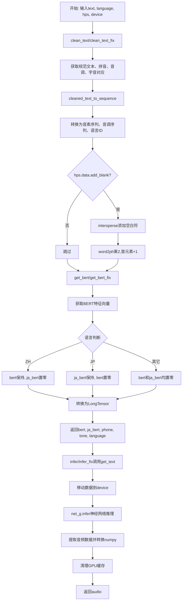
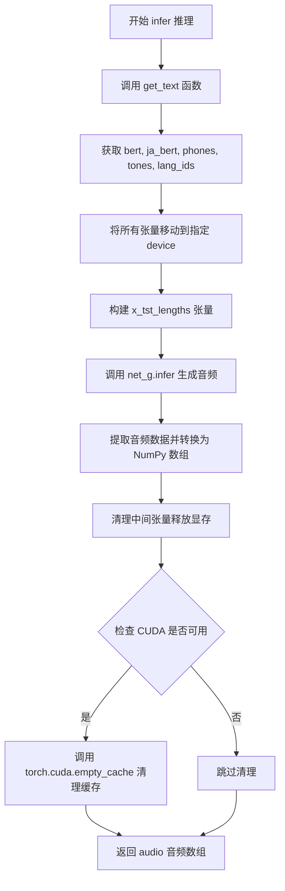
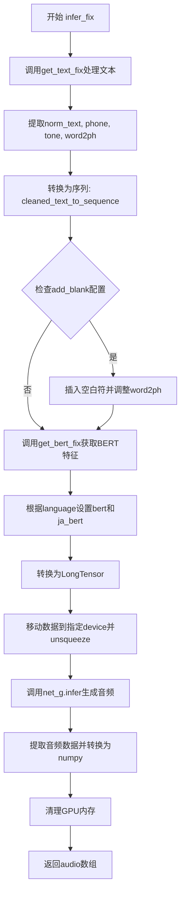

# `Bert-VITS2\oldVersion\V111\__init__.py` 详细设计文档

这是Bert-VITS2文本转语音(TTS)系统的核心推理模块，负责将输入文本转换为语音特征和最终音频输出。主要通过文本预处理、BERT特征提取、语言特定处理和神经网络推理等步骤完成TTS任务。

## 整体流程



## 类结构

```
模块文件 (无类定义)
├── 全局函数
│   ├── get_text
│   ├── get_text_fix
│   ├── infer
│   └── infer_fix
└── 导入依赖
    ├── torch
    ├── commons
    └── text包 (cleaner, cleaned_text_to_sequence, get_bert, get_bert_fix)
```

## 全局变量及字段


    

## 全局函数及方法


### `get_text`

该函数是文本到语音合成的核心预处理函数，负责将输入文本转换为模型所需的多维tensor表示，包括BERT嵌入、音素序列、音调序列和语言标识。

参数：

- `text`：`str`，待合成的原始文本输入
- `language_str`：`str`，语言标识字符串，支持"ZH"（中文）、"JP"（日文）等语言
- `hps`：`object`，超参数配置对象，包含数据处理相关配置（如add_blank等）
- `device`：`torch.device`，计算设备（CPU或CUDA设备）

返回值：`tuple`，包含以下五个tensor元素的元组：
- `bert`：`torch.Tensor`，主语言BERT嵌入，形状为(768或1024, seq_len)
- `ja_bert`：`torch.Tensor`，日文BERT嵌入，形状为(768, seq_len)，若非日文则为全零张量
- `phone`：`torch.LongTensor`，音素序列张量
- `tone`：`torch.LongTensor`，音调序列张量
- `language`：`torch.LongTensor`，语言标识序列张量

#### 流程图

```mermaid
flowchart TD
    A[开始: get_text] --> B[调用clean_text获取norm_text, phone, tone, word2ph]
    B --> C[调用cleaned_text_to_sequence转换phone/tone/language]
    C --> D{hps.data.add_blank?}
    D -->|是| E[使用intersperse在phone/tone/language中插入空白符0]
    E --> F[word2ph每个元素乘2, 首元素加1]
    F --> G[调用get_bert获取BERT嵌入]
    D -->|否| G
    G --> H[删除word2ph释放内存]
    H --> I[断言: bert.shape[-1] == len(phone)]
    I --> J{language_str == 'ZH'?}
    J -->|是| K[bert保持不变, ja_bert=零张量768]
    J -->|否| L{language_str == 'JP'?}
    L -->|是| M[ja_bert=bert, bert=零张量1024]
    L -->|否| N[bert=零张量1024, ja_bert=零张量768]
    K --> O[断言: bert.seq_len == phone.len]
    M --> O
    N --> O
    O --> P[将phone/tone/language转换为LongTensor]
    P --> Q[返回bert, ja_bert, phone, tone, language]
```

#### 带注释源码

```python
def get_text(text, language_str, hps, device):
    """
    将输入文本转换为模型所需的tensor表示
    
    参数:
        text: 输入文本字符串
        language_str: 语言标识 ("ZH", "JP", 等)
        hps: 包含数据配置的hyperparameters对象
        device: torch设备对象
    
    返回:
        (bert, ja_bert, phone, tone, language) 元组
    """
    # 第一步：文本清洗 - 将原始文本转换为规范化的文本、音素、音调和词素到音素的映射
    norm_text, phone, tone, word2ph = clean_text(text, language_str)
    
    # 第二步：将清洗后的文本转换为序列表示
    # phone: 音素序列, tone: 音调序列, language: 语言ID序列
    phone, tone, language = cleaned_text_to_sequence(phone, tone, language_str)

    # 第三步：可选地添加空白符（用于注意力机制）
    if hps.data.add_blank:
        # 在每个音素之间插入0（空白符），扩展序列长度
        phone = commons.intersperse(phone, 0)
        tone = commons.intersperse(tone, 0)
        language = commons.intersperse(language, 0)
        # word2ph也需要相应扩展，因为每个词对应更多音素
        for i in range(len(word2ph)):
            word2ph[i] = word2ph[i] * 2
        word2ph[0] += 1  # 补偿第一个位置的空白符

    # 第四步：获取BERT嵌入表示
    # 根据规范化文本和词素-音素映射生成上下文相关的BERT特征
    bert = get_bert(norm_text, word2ph, language_str, device)
    
    # 释放word2ph内存，不再需要
    del word2ph

    # 第五步：验证BERT序列长度与音素序列长度一致
    assert bert.shape[-1] == len(phone), phone

    # 第六步：根据语言类型分配BERT和日文BERT张量
    # 中文(ZH): 使用中文BERT, 日文BERT置零
    if language_str == "ZH":
        bert = bert
        ja_bert = torch.zeros(768, len(phone))  # 中文BERT维度为768
    # 日文(JP): 使用日文BERT, 主BERT置零（维度1024为多语言BERT）
    elif language_str == "JP":
        ja_bert = bert
        bert = torch.zeros(1024, len(phone))
    # 其他语言: 两者均置零
    else:
        bert = torch.zeros(1024, len(phone))
        ja_bert = torch.zeros(768, len(phone))

    # 第七步：再次验证长度一致性
    assert bert.shape[-1] == len(
        phone
    ), f"Bert seq len {bert.shape[-1]} != {len(phone)}"

    # 第八步：转换为PyTorch LongTensor（用于模型输入）
    phone = torch.LongTensor(phone)
    tone = torch.LongTensor(tone)
    language = torch.LongTensor(language)
    
    # 返回五个tensor元组供后续推理使用
    return bert, ja_bert, phone, tone, language
```


### `get_text_fix`

该函数是文本转语音（TTS）系统的核心文本预处理函数，用于将输入文本转换为模型可用的多模态特征表示（BERT特征、日语BERT特征、音素序列、音调序列和语言标识序列），支持添加空白符和不同语言（中文、日语、其他）的特殊处理。

参数：

- `text`：`str`，待处理的原始输入文本
- `language_str`：`str`，语言标识字符串（"ZH"表示中文，"JP"表示日语，其他为其他语言）
- `hps`：`Any`（配置对象），包含数据配置，如`hps.data.add_blank`表示是否添加空白符，`hps.data.spk2id`用于说话人ID映射
- `device`：`torch.device`，计算设备（CPU或CUDA设备）

返回值：`tuple[torch.Tensor, torch.Tensor, torch.Tensor, torch.Tensor, torch.Tensor]`，包含以下五个张量：

- `bert`：`torch.Tensor`，主语言BERT特征，形状为(768或1024, 序列长度)
- `ja_bert`：`torch.Tensor`，日语BERT特征，形状为(768或1024, 序列长度)
- `phone`：`torch.LongTensor`，音素序列
- `tone`：`torch.LongTensor`，音调序列
- `language`：`torch.LongTensor`，语言标识序列

#### 流程图

```mermaid
flowchart TD
    A[开始: get_text_fix] --> B[调用clean_text_fix清理文本]
    B --> C[调用cleaned_text_to_sequence转换音素]
    C --> D{hps.data.add_blank?}
    D -->|Yes| E[使用intersperse在phone/tone/language中插入0]
    E --> F[word2ph每个元素乘2, word2ph[0]加1]
    F --> G[调用get_bert_fix获取BERT特征]
    D -->|No| G
    G --> H[删除word2ph变量]
    H --> I{assert: bert.shape[-1] == len(phone)}
    I --> J{language_str == 'ZH'?}
    J -->|Yes| K[bert保持不变, ja_bert=零张量768]
    J -->|No| L{language_str == 'JP'?}
    L -->|Yes| M[ja_bert=bert, bert=零张量1024]
    L -->|No| N[bert=零张量1024, ja_bert=零张量768]
    K --> O[assert: bert序列长度验证]
    M --> O
    N --> O
    O --> P[phone/tone/language转换为LongTensor]
    P --> Q[返回bert, ja_bert, phone, tone, language]
```

#### 带注释源码

```python
def get_text_fix(text, language_str, hps, device):
    """
    文本转语音的文本预处理函数（修复版）
    
    参数:
        text: str - 输入文本
        language_str: str - 语言标识（ZH/JP/其他）
        hps: 配置对象 - 包含数据配置
        device: torch.device - 计算设备
    
    返回:
        tuple: (bert, ja_bert, phone, tone, language) 五个张量
    """
    # 第一步：清理文本，获取规范化文本、音素、音调、词到音素的映射
    norm_text, phone, tone, word2ph = clean_text_fix(text, language_str)
    
    # 第二步：将清理后的文本转换为音素序列
    phone, tone, language = cleaned_text_to_sequence(phone, tone, language_str)
    
    # 第三步：如果配置要求添加空白符（用于提升发音清晰度）
    if hps.data.add_blank:
        # 在每个音素之间插入0（空白符）
        phone = commons.intersperse(phone, 0)
        tone = commons.intersperse(tone, 0)
        language = commons.intersperse(language, 0)
        
        # 同步扩展word2ph映射（每个原音素现在对应2个位置）
        for i in range(len(word2ph)):
            word2ph[i] = word2ph[i] * 2
        # 第一个位置额外加1（补偿开头插入的空白符）
        word2ph[0] += 1
    
    # 第四步：获取BERT嵌入特征（修复版函数）
    bert = get_bert_fix(norm_text, word2ph, language_str, device)
    
    # 释放word2ph内存
    del word2ph
    
    # 验证BERT特征维度与音素序列长度一致
    assert bert.shape[-1] == len(phone), phone
    
    # 第五步：根据语言类型分配BERT特征
    if language_str == "ZH":
        # 中文：bert保持不变，日语bert用零张量填充（768维）
        bert = bert
        ja_bert = torch.zeros(768, len(phone))
    elif language_str == "JP":
        # 日语：日语bert使用主bert，中文bert用零张量填充（1024维）
        ja_bert = bert
        bert = torch.zeros(1024, len(phone))
    else:
        # 其他语言：两者都用零张量填充
        bert = torch.zeros(1024, len(phone))
        ja_bert = torch.zeros(768, len(phone))
    
    # 验证最终BERT序列长度
    assert bert.shape[-1] == len(
        phone
    ), f"Bert seq len {bert.shape[-1]} != {len(phone)}"
    
    # 第六步：转换为PyTorch长整型张量
    phone = torch.LongTensor(phone)
    tone = torch.LongTensor(tone)
    language = torch.LongTensor(language)
    
    # 返回五个张量供后续推理使用
    return bert, ja_bert, phone, tone, language
```


### `infer`

该函数是 Bert-VITS2 文本转语音（TTS）模型的核心推理函数，负责将输入文本转换为语音音频。它首先通过 `get_text` 将文本转换为音素、语调、语言标识和 BERT 嵌入，然后将这些处理后的特征传递给生成器网络（`net_g`）进行音频生成，最后将生成的音频张量转换为 NumPy 数组返回。

参数：

- `text`：`str`，待转换为语音的输入文本
- `sdp_ratio`：`float`，SD（Stochastic Duration Predictor）比率参数，控制音素时长预测的随机性
- `noise_scale`：`float`，噪声缩放因子，控制音频生成过程中的噪声水平
- `noise_scale_w`：`float`，噪声缩放因子（权重），用于控制 duration predictor 的噪声
- `length_scale`：`float`，长度缩放因子，用于调整生成语音的速度/长度
- `sid`：`str` 或 `int`，说话者 ID，用于选择特定的说话者声音
- `language`：`str`，语言标识（如 "ZH"、"JP"、"EN" 等），指定输入文本的语言
- `hps`：`object`，超参数配置对象，包含数据配置（如 spk2id 映射、add_blank 等）
- `net_g`：`torch.nn.Module`，生成器神经网络模型，用于从文本特征生成语音波形
- `device`：`torch.device`，计算设备（CPU 或 CUDA GPU），用于执行推理

返回值：`numpy.ndarray`，生成的语音音频数据，为一维浮点数组，值域通常在 [-1, 1] 或 [−32768, 32767] 范围内

#### 流程图



#### 带注释源码

```python
def infer(
    text,              # str: 输入文本，待转换为语音
    sdp_ratio,         # float: SD 比率，控制音素时长随机性
    noise_scale,       # float: 噪声缩放因子，控制生成噪声水平
    noise_scale_w,     # float: 权重噪声缩放，控制时长预测噪声
    length_scale,      # float: 长度缩放，控制语音速度
    sid,               # str/int: 说话者 ID，选择声音
    language,          # str: 语言标识，如 'ZH', 'JP', 'EN'
    hps,               # object: 超参数配置对象
    net_g,             # torch.nn.Module: 生成器网络模型
    device,            # torch.device: 计算设备
):
    # 步骤1: 调用 get_text 将文本转换为模型所需的特征表示
    # 返回: bert (中文 BERT), ja_bert (日文 BERT), phones (音素), tones (语调), lang_ids (语言ID)
    bert, ja_bert, phones, tones, lang_ids = get_text(text, language, hps, device)
    
    # 步骤2: 使用 torch.no_grad() 禁用梯度计算，节省显存和计算资源
    with torch.no_grad():
        # 步骤3: 将音素序列移动到设备并添加批次维度 (batch=1)
        x_tst = phones.to(device).unsqueeze(0)
        tones = tones.to(device).unsqueeze(0)
        lang_ids = lang_ids.to(device).unsqueeze(0)
        
        # 步骤4: 将 BERT 嵌入移动到设备并添加批次维度
        bert = bert.to(device).unsqueeze(0)
        ja_bert = ja_bert.to(device).unsqueeze(0)
        
        # 步骤5: 创建序列长度张量，用于模型知晓输入长度
        x_tst_lengths = torch.LongTensor([phones.size(0)]).to(device)
        
        # 步骤6: 释放原始 phones 张量以节省显存
        del phones
        
        # 步骤7: 根据说话者 ID 获取说话者向量
        speakers = torch.LongTensor([hps.data.spk2id[sid]]).to(device)
        
        # 步骤8: 调用生成器网络的 infer 方法进行音频生成
        # 传入所有文本特征、说话者信息以及控制参数
        audio = (
            net_g.infer(
                x_tst,              # 音素序列 [1, seq_len]
                x_tst_lengths,      # 序列长度 [1]
                speakers,           # 说话者 ID [1]
                tones,              # 语调序列 [1, seq_len]
                lang_ids,           # 语言 ID 序列 [1, seq_len]
                bert,               # 中文 BERT [1, 768, seq_len]
                ja_bert,            # 日文 BERT [1, 768, seq_len]
                sdp_ratio=sdp_ratio,     # SD 比率
                noise_scale=noise_scale, # 噪声缩放
                noise_scale_w=noise_scale_w, # 权重噪声缩放
                length_scale=length_scale,   # 长度缩放
            )[0][0, 0]              # 从 [1, 1, samples] 取首帧得到 [samples]
            .data.cpu()             # 移至 CPU
            .float()                # 转换为 float32
            .numpy()                # 转换为 NumPy 数组
        )
        
        # 步骤9: 清理所有中间张量，释放显存
        del x_tst, x_tst_lengths, speakers, tones, lang_ids, bert, ja_bert
        
        # 步骤10: 如果使用 CUDA，清理 GPU 缓存
        if torch.cuda.is_available():
            torch.cuda.empty_cache()
        
        # 步骤11: 返回生成的音频数组
        return audio
```


### `infer_fix`

该函数是Bert-VITS2文本转语音（TTS）推理流程的修复版本，通过调用`get_text_fix`对输入文本进行预处理（清洗、分词、字符对齐等），结合说话人ID、语言模型特征以及多种噪声和长度控制参数，利用神经网络生成器`net_g`合成音频，并返回numpy数组格式的音频数据。

参数：

- `text`：`str`，待转换的文本输入
- `sdp_ratio`：`float`，SDP（Stochastic Duration Prediction）比率，控制音素时长的随机性
- `noise_scale`：`float`，噪声缩放因子，控制音频生成的噪声水平
- `noise_scale_w`：`float`，噪声宽度缩放因子，控制噪声的持续时间
- `length_scale`：`float`，长度缩放因子，控制生成音频的整体语速
- `sid`：`str`，说话人ID，用于选择特定的说话人声音
- `language`：`str`，文本语言标识（如"ZH"、"JP"、"EN"等）
- `hps`：`object`，包含数据配置的超参数对象（如spk2id映射、add_blank设置等）
- `net_g`：`object`，预训练的生成器神经网络模型
- `device`：`torch.device`，计算设备（CPU或CUDA GPU）

返回值：`numpy.ndarray`，合成音频的波形数据，类型为float32

#### 流程图



#### 带注释源码

```python
def infer_fix(
    text,               # 输入文本字符串
    sdp_ratio,          # SDP随机时长预测比率
    noise_scale,        # 噪声缩放因子
    noise_scale_w,      # 噪声宽度缩放因子
    length_scale,      # 音频长度缩放因子（控制语速）
    sid,               # 说话人ID
    language,          # 语言标识字符串
    hps,               # 超参数配置对象
    net_g,             # 神经网络生成器
    device,            # 计算设备
):
    # 步骤1: 调用get_text_fix进行文本预处理
    # 返回: bert特征, ja_bert特征, phone序列, tone序列, language序列
    bert, ja_bert, phones, tones, lang_ids = get_text_fix(text, language, hps, device)
    
    # 步骤2: 使用torch.no_grad()禁用梯度计算，节省显存
    with torch.no_grad():
        # 步骤3: 将tensor移动到计算设备并添加batch维度
        x_tst = phones.to(device).unsqueeze(0)       # 音素序列 [1, seq_len]
        tones = tones.to(device).unsqueeze(0)        # 音调序列 [1, seq_len]
        lang_ids = lang_ids.to(device).unsqueeze(0) # 语言ID序列 [1, seq_len]
        bert = bert.to(device).unsqueeze(0)          # BERT特征 [1, 768/1024, seq_len]
        ja_bert = ja_bert.to(device).unsqueeze(0)   # 日语BERT特征 [1, 768/1024, seq_len]
        
        # 步骤4: 计算输入序列长度
        x_tst_lengths = torch.LongTensor([phones.size(0)]).to(device)
        
        # 步骤5: 释放phones变量以节省内存
        del phones
        
        # 步骤6: 构建说话人ID张量
        speakers = torch.LongTensor([hps.data.spk2id[sid]]).to(device)
        
        # 步骤7: 调用神经网络生成器进行推理
        # 传入所有控制参数: sdp_ratio, noise_scale, noise_scale_w, length_scale
        audio = (
            net_g.infer(
                x_tst,           # 音素序列
                x_tst_lengths,  # 序列长度
                speakers,       # 说话人ID
                tones,          # 音调
                lang_ids,       # 语言ID
                bert,           # BERT特征
                ja_bert,        # 日语BERT特征
                sdp_ratio=sdp_ratio,
                noise_scale=noise_scale,
                noise_scale_w=noise_scale_w,
                length_scale=length_scale,
            )[0][0, 0]          # 提取输出音频张量 [T]
            .data.cpu()        # 移至CPU
            .float()           # 转换为float32
            .numpy()           # 转换为numpy数组
        )
        
        # 步骤8: 清理中间变量，释放GPU显存
        del x_tst, x_tst_lengths, speakers, tones, lang_ids, bert, ja_bert
        
        # 步骤9: 如果使用CUDA，清空缓存
        if torch.cuda.is_available():
            torch.cuda.empty_cache()
        
        # 步骤10: 返回合成音频
        return audio
```


## 关键组件


### 张量索引与惰性加载

代码中通过`.to(device)`将张量转移到指定设备，并通过`torch.no_grad()`上下文管理器禁用梯度计算，实现惰性加载以减少显存占用。同时使用`torch.cuda.empty_cache()`手动清理CUDA缓存。

### 反量化支持

在`infer`和`infer_fix`函数中，通过`.data.cpu().float().numpy()`将GPU张量反量化回CPU的NumPy数组格式，便于后续音频处理和输出。

### 量化策略

代码针对不同语言（ZH/JP/其他）采用不同的BERT维度策略：中文使用768维日文BERT，日文使用1024维中文BERT，其他语言则使用零填充的占位张量，实现多语言支持的量化适配。

### 文本规范化与音素转换

`get_text`和`get_text_fix`函数调用`clean_text`/`clean_text_fix`进行文本规范化，并通过`cleaned_text_to_sequence`将文本转换为音素序列，同时支持添加空白符进行音素间隔。

### 说话人嵌入处理

通过`hps.data.spk2id[sid]`映射说话人ID为索引，并使用`torch.LongTensor`创建说话人张量传递给神经网络进行推理。


## 问题及建议


### 已知问题

-   **大量重复代码**：`get_text` 与 `get_text_fix`、`infer` 与 `infer_fix` 函数体几乎完全相同，仅调用的底层函数不同，违反 DRY 原则，维护成本高
-   **冗余代码**：`if language_str == "ZH": bert = bert` 赋值语句没有任何实际作用，属于无效代码
-   **魔法数字和硬编码**：BERT 维度 768、1024 硬编码，语言判断使用字符串字面量 "ZH"/"JP"，blank 插入值 0 硬编码，缺乏常量定义
-   **不安全的错误处理**：使用 `assert` 进行关键检查，生产环境可能被 Python 优化 flag (-O) 跳过，导致隐藏错误
-   **资源清理不完善**：虽然调用 `torch.cuda.empty_cache()`，但未使用 `try-finally` 或上下文管理器，异常发生时可能无法正确清理资源
-   **API 设计问题**：`infer/infer_fix` 函数参数过多（11个参数），应考虑封装为配置对象或数据类
-   **缺乏类型提示**：所有函数均无类型注解，降低代码可读性和 IDE 支持
-   **设备管理不灵活**：通过参数传递 device，但 `torch.cuda.is_available()` 检查和 `empty_cache` 调用分散在代码中

### 优化建议

-   抽取公共逻辑到私有函数，如语言分支处理、bert/ja_bert 初始化逻辑，消除重复代码
-   删除无效的 `bert = bert` 赋值语句
-   使用常量类或枚举定义语言类型、BERT 维度等魔法数字，如 `class Languages: ZH = "ZH"; JP = "JP"`
-   将 assert 替换为显式的条件检查和异常抛出，或使用自定义验证函数
-   使用 `@torch.no_grad()` 装饰器替代 `with torch.no_grad():` 块，并考虑使用上下文管理器确保资源清理
-   创建 `InferenceConfig` 数据类封装推理参数，减少函数签名长度
-   为所有函数添加类型提示（参数类型和返回值类型）
-   封装设备管理逻辑，提供统一的 device 获取和缓存清理接口
-   添加 docstring 描述函数功能、参数和返回值


## 其它


### 设计目标与约束

本模块作为Bert-VITS2文本转语音系统的推理核心，负责将输入文本转换为最终的语音音频输出。设计目标包括：支持多语言文本（中文、日文、英文）的语音合成；兼容1.1.1版本特性；利用GPU加速推理过程；支持多说话人功能。性能约束要求单次推理延迟控制在合理范围内，内存占用需在GPU显存允许范围内。

### 错误处理与异常设计

代码中采用assert语句进行关键条件验证，包括BERT特征序列长度与音素序列长度的一致性检查。当assert条件不满足时抛出AssertionError并显示详细的错误信息。设备管理方面通过torch.cuda.is_available()检查CUDA可用性，推理完成后显式调用torch.cuda.empty_cache()释放GPU缓存资源。模型输入参数需提前进行类型验证，确保phone、tone、language等张量维度正确。

### 数据流与状态机

数据处理流程为：原始文本→文本清洗→音素序列转换→blank插入处理→BERT特征提取→多语言特征处理→模型推理→音频输出。状态转换路径为：get_text/get_text_fix（文本预处理状态）→模型推理状态（infer/infer_fix）→最终音频输出状态。流程中根据language_str参数判断当前处理的是中文、日文还是其他语言，从而选择不同的BERT特征处理策略。

### 外部依赖与接口契约

本模块依赖以下外部组件：commons模块提供intersperse工具函数用于blank插入；text.cleaner模块提供clean_text和clean_text_fix文本清洗函数；text模块提供cleaned_text_to_sequence、get_bert、get_bert_fix等功能。调用方需传入hps配置对象（包含data.add_blank、data.spk2id等配置）、net_g预训练模型实例、device计算设备。输入文本需符合语言规范，language参数必须为"ZH"、"JP"、"EN"等有效值。

### 配置参数说明

infer和infer_fix函数接收以下关键参数：text为输入文本字符串；sdp_ratio控制随机预测时长比例；noise_scale和noise_scale_w控制噪声规模；length_scale控制语速缩放；sid为说话人ID；language为目标语言；hps为超参数配置对象；net_g为生成器网络模型；device为目标计算设备。所有数值参数需在合理范围内，sid必须在hps.data.spk2id中存在。

### 边界条件处理

代码处理的边界情况包括：word2ph数组的空值检查（通过循环前检查长度）；空文本输入可能导致bert特征维度为0；长文本输入可能超出GPU显存容量需进行分片处理；language参数为非标准值时使用默认零填充策略。word2ph[0] += 1用于处理blank插入后的索引偏移。

### 版本兼容性说明

代码开头注释表明本实现兼容1.1.1版本，该版本特性包括：改进的文本清洗策略（区分get_text和get_text_fix两个接口）；支持BERT特征的多语言处理；改进的音素序列生成逻辑。版本升级时需关注text模块的接口变化和模型网络结构的兼容性。

### 资源管理与内存优化

函数内部通过del关键字显式删除中间张量以释放内存；使用torch.no_grad()上下文管理器禁用梯度计算减少显存占用；推理完成后立即调用torch.cuda.empty_cache()清空CUDA缓存。bert和ja_bert特征张量根据语言类型使用torch.zeros预分配固定维度（中文768维，日文768维，其他1024维），避免动态内存分配开销。

### 关键算法说明

文本到音频的转换采用以下核心算法：1)clean_text执行文本清洗和分词；2)cleaned_text_to_sequence将分词结果转换为音素序列；3)get_bert调用预训练BERT模型提取语义特征；4)intersperse在音素序列中插入blank（0值）以改善音素边界；5)net_g.infer执行基于扩散模型的音频生成。各步骤输出维度需严格对齐以保证后续处理正确性。


    