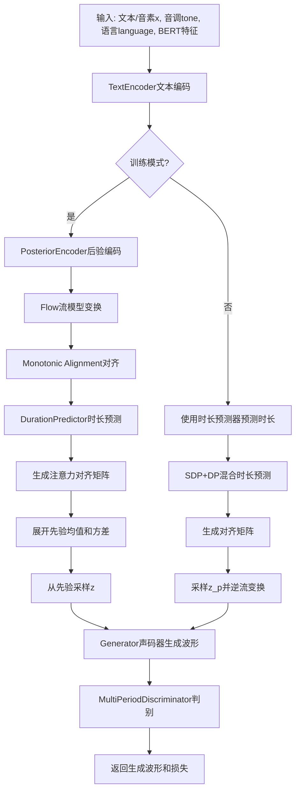
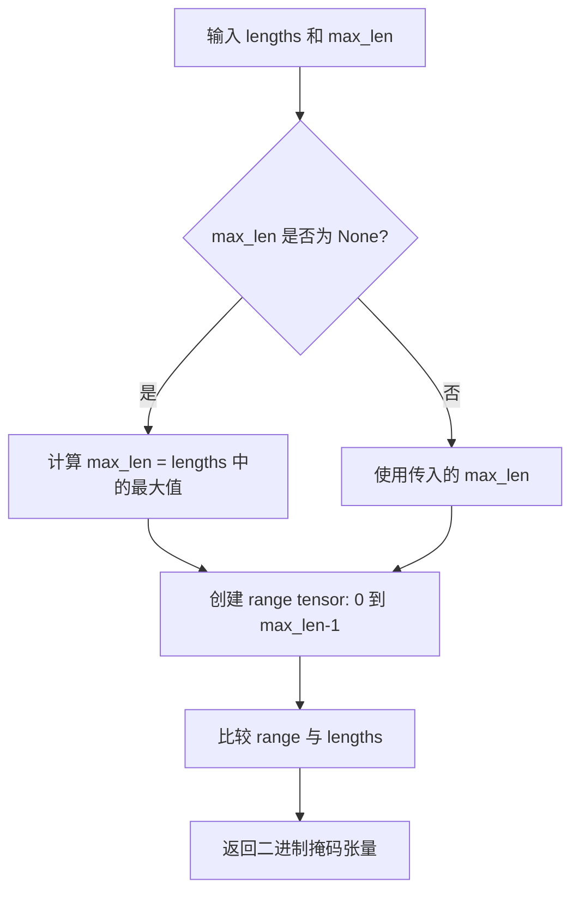
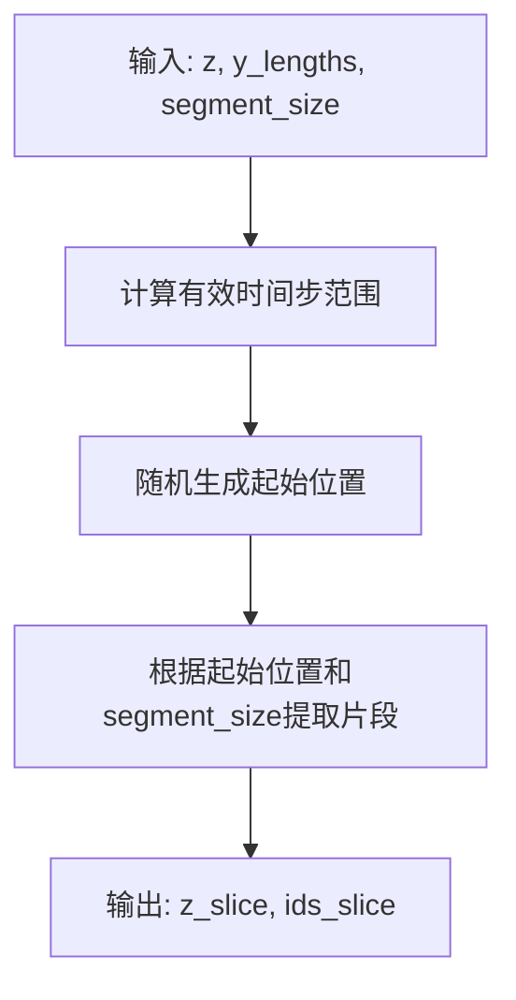
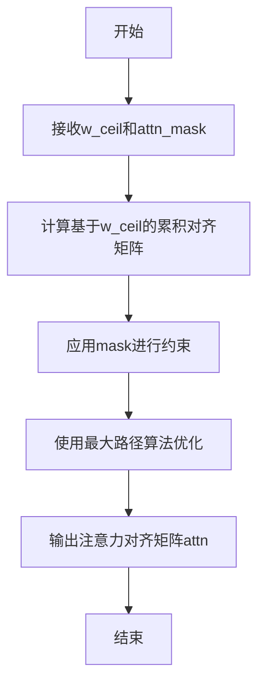
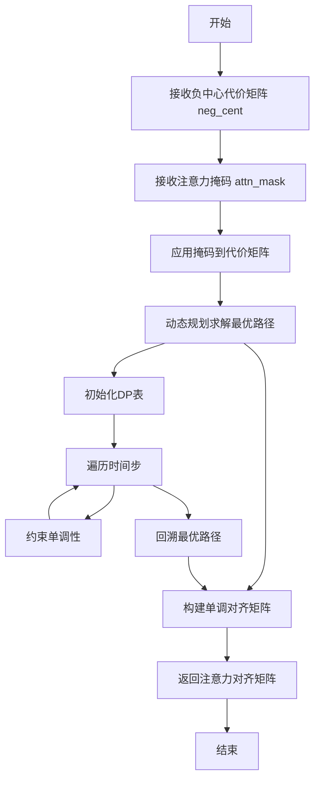
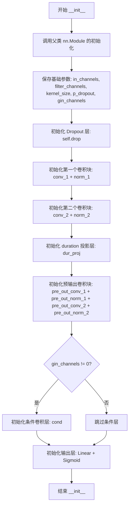
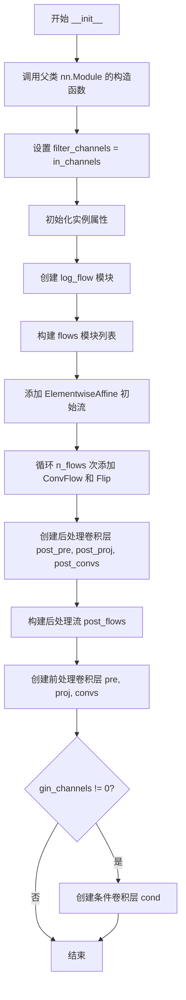
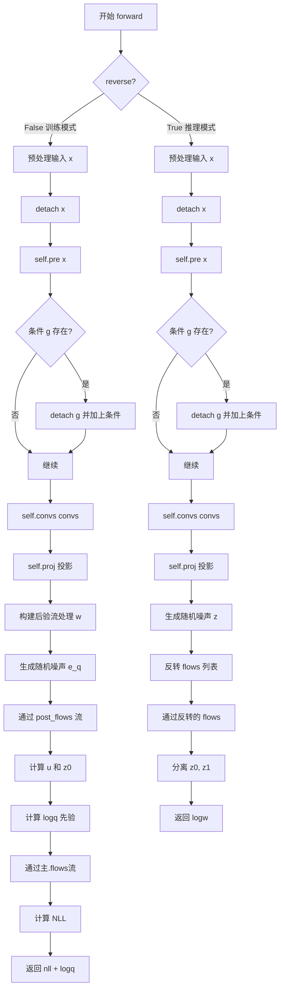
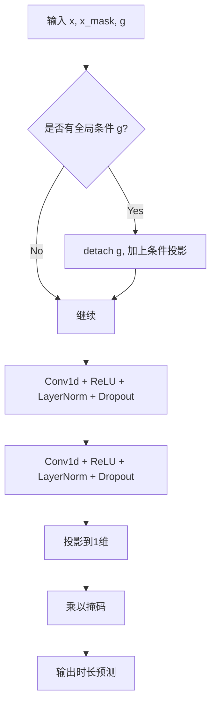
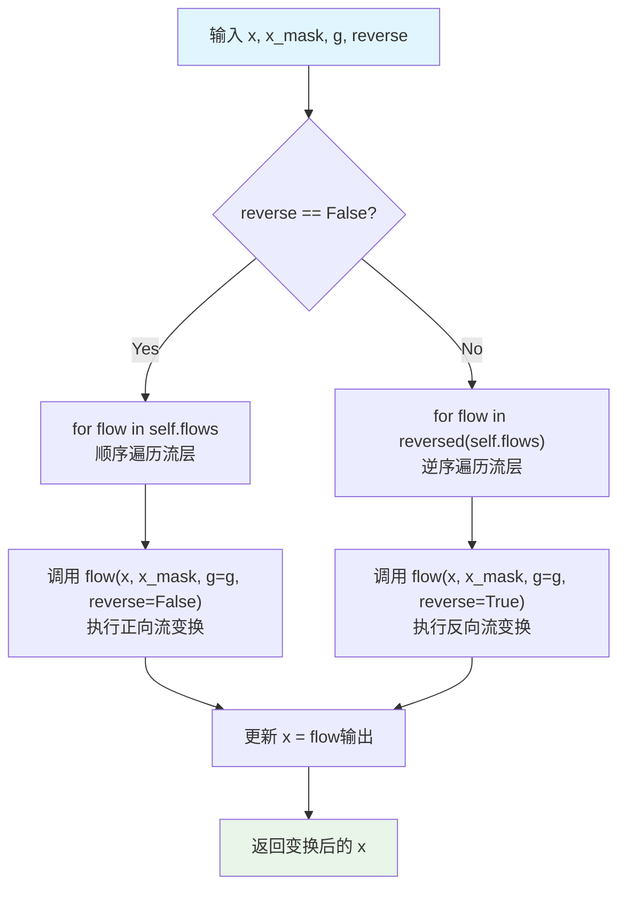

# `Bert-VITS2\oldVersion\V111\models.py` 详细设计文档

这是一个VITS文本到语音合成系统的核心模型代码，包含了完整的端到端TTS架构，包括文本编码器、声学特征编码器、流模型、时长预测器、生成器和多周期判别器，用于从文本/音素生成高质量的语音波形。

## 整体流程



## 类结构

```
ModelBase (PyTorch Module)
├── DurationDiscriminator (时长判别器)
├── TransformerCouplingBlock (Transformer耦合块)
├── StochasticDurationPredictor (随机时长预测器)
├── DurationPredictor (确定性时长预测器)
├── TextEncoder (文本编码器)
├── ResidualCouplingBlock (残差耦合块)
├── PosteriorEncoder (后验编码器)
├── Generator (声码器生成器)
├── DiscriminatorP (周期判别器)
├── DiscriminatorS (尺度判别器)
├── MultiPeriodDiscriminator (多周期判别器)
├── ReferenceEncoder (参考编码器)
└── SynthesizerTrn (主合成器-训练/推理)
```

## 全局变量及字段


### `symbols`
    
文本符号列表，包含所有可能的文本token

类型：`list`
    


### `num_tones`
    
音调数量，用于文本编码中的音调嵌入

类型：`int`
    


### `num_languages`
    
语言数量，用于文本编码中的语言嵌入

类型：`int`
    


### `DurationDiscriminator.in_channels`
    
输入通道数

类型：`int`
    


### `DurationDiscriminator.filter_channels`
    
卷积滤波器的通道数

类型：`int`
    


### `DurationDiscriminator.kernel_size`
    
卷积核大小

类型：`int`
    


### `DurationDiscriminator.p_dropout`
    
Dropout概率

类型：`float`
    


### `DurationDiscriminator.gin_channels`
    
说话人嵌入的通道数

类型：`int`
    


### `DurationDiscriminator.drop`
    
Dropout层

类型：`nn.Dropout`
    


### `DurationDiscriminator.conv_1`
    
第一个卷积层

类型：`nn.Conv1d`
    


### `DurationDiscriminator.norm_1`
    
第一个LayerNorm层

类型：`modules.LayerNorm`
    


### `DurationDiscriminator.conv_2`
    
第二个卷积层

类型：`nn.Conv1d`
    


### `DurationDiscriminator.norm_2`
    
第二个LayerNorm层

类型：`modules.LayerNorm`
    


### `DurationDiscriminator.dur_proj`
    
duration投影层

类型：`nn.Conv1d`
    


### `DurationDiscriminator.pre_out_conv_1`
    
输出前第一个卷积层

类型：`nn.Conv1d`
    


### `DurationDiscriminator.pre_out_norm_1`
    
输出前第一个LayerNorm层

类型：`modules.LayerNorm`
    


### `DurationDiscriminator.pre_out_conv_2`
    
输出前第二个卷积层

类型：`nn.Conv1d`
    


### `DurationDiscriminator.pre_out_norm_2`
    
输出前第二个LayerNorm层

类型：`modules.LayerNorm`
    


### `DurationDiscriminator.cond`
    
条件卷积层，用于融合说话人嵌入

类型：`nn.Conv1d`
    


### `DurationDiscriminator.output_layer`
    
输出层，包含Linear和Sigmoid

类型：`nn.Sequential`
    


### `TransformerCouplingBlock.channels`
    
通道数

类型：`int`
    


### `TransformerCouplingBlock.hidden_channels`
    
隐藏层通道数

类型：`int`
    


### `TransformerCouplingBlock.kernel_size`
    
卷积核大小

类型：`int`
    


### `TransformerCouplingBlock.n_layers`
    
层数

类型：`int`
    


### `TransformerCouplingBlock.n_flows`
    
流数量

类型：`int`
    


### `TransformerCouplingBlock.gin_channels`
    
说话人嵌入通道数

类型：`int`
    


### `TransformerCouplingBlock.flows`
    
流模块列表

类型：`nn.ModuleList`
    


### `TransformerCouplingBlock.wn`
    
共享的FFT模块

类型：`attentions.FFT or None`
    


### `StochasticDurationPredictor.in_channels`
    
输入通道数

类型：`int`
    


### `StochasticDurationPredictor.filter_channels`
    
滤波器通道数

类型：`int`
    


### `StochasticDurationPredictor.kernel_size`
    
卷积核大小

类型：`int`
    


### `StochasticDurationPredictor.p_dropout`
    
Dropout概率

类型：`float`
    


### `StochasticDurationPredictor.n_flows`
    
流数量

类型：`int`
    


### `StochasticDurationPredictor.gin_channels`
    
说话人嵌入通道数

类型：`int`
    


### `StochasticDurationPredictor.log_flow`
    
对数流模块

类型：`modules.Log`
    


### `StochasticDurationPredictor.flows`
    
流模块列表

类型：`nn.ModuleList`
    


### `StochasticDurationPredictor.post_pre`
    
后处理预投影层

类型：`nn.Conv1d`
    


### `StochasticDurationPredictor.post_proj`
    
后处理投影层

类型：`nn.Conv1d`
    


### `StochasticDurationPredictor.post_convs`
    
后处理卷积层

类型：`modules.DDSConv`
    


### `StochasticDurationPredictor.post_flows`
    
后处理流模块列表

类型：`nn.ModuleList`
    


### `StochasticDurationPredictor.pre`
    
预投影层

类型：`nn.Conv1d`
    


### `StochasticDurationPredictor.proj`
    
投影层

类型：`nn.Conv1d`
    


### `StochasticDurationPredictor.convs`
    
卷积层

类型：`modules.DDSConv`
    


### `StochasticDurationPredictor.cond`
    
条件卷积层

类型：`nn.Conv1d`
    


### `DurationPredictor.in_channels`
    
输入通道数

类型：`int`
    


### `DurationPredictor.filter_channels`
    
滤波器通道数

类型：`int`
    


### `DurationPredictor.kernel_size`
    
卷积核大小

类型：`int`
    


### `DurationPredictor.p_dropout`
    
Dropout概率

类型：`float`
    


### `DurationPredictor.gin_channels`
    
说话人嵌入通道数

类型：`int`
    


### `DurationPredictor.drop`
    
Dropout层

类型：`nn.Dropout`
    


### `DurationPredictor.conv_1`
    
第一个卷积层

类型：`nn.Conv1d`
    


### `DurationPredictor.norm_1`
    
第一个LayerNorm层

类型：`modules.LayerNorm`
    


### `DurationPredictor.conv_2`
    
第二个卷积层

类型：`nn.Conv1d`
    


### `DurationPredictor.norm_2`
    
第二个LayerNorm层

类型：`modules.LayerNorm`
    


### `DurationPredictor.proj`
    
投影层

类型：`nn.Conv1d`
    


### `DurationPredictor.cond`
    
条件卷积层

类型：`nn.Conv1d`
    


### `TextEncoder.n_vocab`
    
词汇表大小

类型：`int`
    


### `TextEncoder.out_channels`
    
输出通道数

类型：`int`
    


### `TextEncoder.hidden_channels`
    
隐藏层通道数

类型：`int`
    


### `TextEncoder.filter_channels`
    
滤波器通道数

类型：`int`
    


### `TextEncoder.n_heads`
    
注意力头数

类型：`int`
    


### `TextEncoder.n_layers`
    
层数

类型：`int`
    


### `TextEncoder.kernel_size`
    
卷积核大小

类型：`int`
    


### `TextEncoder.p_dropout`
    
Dropout概率

类型：`float`
    


### `TextEncoder.gin_channels`
    
说话人嵌入通道数

类型：`int`
    


### `TextEncoder.emb`
    
文本嵌入层

类型：`nn.Embedding`
    


### `TextEncoder.tone_emb`
    
音调嵌入层

类型：`nn.Embedding`
    


### `TextEncoder.language_emb`
    
语言嵌入层

类型：`nn.Embedding`
    


### `TextEncoder.bert_proj`
    
BERT投影层

类型：`nn.Conv1d`
    


### `TextEncoder.ja_bert_proj`
    
日语BERT投影层

类型：`nn.Conv1d`
    


### `TextEncoder.encoder`
    
文本编码器

类型：`attentions.Encoder`
    


### `TextEncoder.proj`
    
输出投影层

类型：`nn.Conv1d`
    


### `ResidualCouplingBlock.channels`
    
通道数

类型：`int`
    


### `ResidualCouplingBlock.hidden_channels`
    
隐藏层通道数

类型：`int`
    


### `ResidualCouplingBlock.kernel_size`
    
卷积核大小

类型：`int`
    


### `ResidualCouplingBlock.dilation_rate`
    
膨胀率

类型：`int`
    


### `ResidualCouplingBlock.n_layers`
    
层数

类型：`int`
    


### `ResidualCouplingBlock.n_flows`
    
流数量

类型：`int`
    


### `ResidualCouplingBlock.gin_channels`
    
说话人嵌入通道数

类型：`int`
    


### `ResidualCouplingBlock.flows`
    
流模块列表

类型：`nn.ModuleList`
    


### `PosteriorEncoder.in_channels`
    
输入通道数

类型：`int`
    


### `PosteriorEncoder.out_channels`
    
输出通道数

类型：`int`
    


### `PosteriorEncoder.hidden_channels`
    
隐藏层通道数

类型：`int`
    


### `PosteriorEncoder.kernel_size`
    
卷积核大小

类型：`int`
    


### `PosteriorEncoder.dilation_rate`
    
膨胀率

类型：`int`
    


### `PosteriorEncoder.n_layers`
    
层数

类型：`int`
    


### `PosteriorEncoder.gin_channels`
    
说话人嵌入通道数

类型：`int`
    


### `PosteriorEncoder.pre`
    
预处理卷积层

类型：`nn.Conv1d`
    


### `PosteriorEncoder.enc`
    
编码器模块

类型：`modules.WN`
    


### `PosteriorEncoder.proj`
    
投影层

类型：`nn.Conv1d`
    


### `Generator.num_kernels`
    
残差块数量

类型：`int`
    


### `Generator.num_upsamples`
    
上采样层数量

类型：`int`
    


### `Generator.conv_pre`
    
初始卷积层

类型：`Conv1d`
    


### `Generator.ups`
    
上采样层列表

类型：`nn.ModuleList`
    


### `Generator.resblocks`
    
残差块列表

类型：`nn.ModuleList`
    


### `Generator.conv_post`
    
后处理卷积层

类型：`Conv1d`
    


### `Generator.cond`
    
条件卷积层

类型：`nn.Conv1d`
    


### `DiscriminatorP.period`
    
周期

类型：`int`
    


### `DiscriminatorP.use_spectral_norm`
    
是否使用谱归一化

类型：`bool`
    


### `DiscriminatorP.convs`
    
卷积层列表

类型：`nn.ModuleList`
    


### `DiscriminatorP.conv_post`
    
后处理卷积层

类型：`nn.Conv2d`
    


### `DiscriminatorS.use_spectral_norm`
    
是否使用谱归一化

类型：`bool`
    


### `DiscriminatorS.convs`
    
卷积层列表

类型：`nn.ModuleList`
    


### `DiscriminatorS.conv_post`
    
后处理卷积层

类型：`nn.Conv1d`
    


### `MultiPeriodDiscriminator.discriminators`
    
判别器列表

类型：`nn.ModuleList`
    


### `ReferenceEncoder.spec_channels`
    
频谱通道数

类型：`int`
    


### `ReferenceEncoder.convs`
    
卷积层列表

类型：`nn.ModuleList`
    


### `ReferenceEncoder.gru`
    
GRU层

类型：`nn.GRU`
    


### `ReferenceEncoder.proj`
    
投影层

类型：`nn.Linear`
    


### `SynthesizerTrn.n_vocab`
    
词汇表大小

类型：`int`
    


### `SynthesizerTrn.spec_channels`
    
频谱通道数

类型：`int`
    


### `SynthesizerTrn.inter_channels`
    
中间通道数

类型：`int`
    


### `SynthesizerTrn.hidden_channels`
    
隐藏层通道数

类型：`int`
    


### `SynthesizerTrn.filter_channels`
    
滤波器通道数

类型：`int`
    


### `SynthesizerTrn.n_heads`
    
注意力头数

类型：`int`
    


### `SynthesizerTrn.n_layers`
    
层数

类型：`int`
    


### `SynthesizerTrn.kernel_size`
    
卷积核大小

类型：`int`
    


### `SynthesizerTrn.p_dropout`
    
Dropout概率

类型：`float`
    


### `SynthesizerTrn.resblock`
    
残差块类型

类型：`str`
    


### `SynthesizerTrn.resblock_kernel_sizes`
    
残差块卷积核大小列表

类型：`list`
    


### `SynthesizerTrn.resblock_dilation_sizes`
    
残差块膨胀大小列表

类型：`list`
    


### `SynthesizerTrn.upsample_rates`
    
上采样率列表

类型：`list`
    


### `SynthesizerTrn.upsample_initial_channel`
    
上采样初始通道数

类型：`int`
    


### `SynthesizerTrn.upsample_kernel_sizes`
    
上采样卷积核大小列表

类型：`list`
    


### `SynthesizerTrn.segment_size`
    
片段大小

类型：`int`
    


### `SynthesizerTrn.n_speakers`
    
说话人数量

类型：`int`
    


### `SynthesizerTrn.gin_channels`
    
说话人嵌入通道数

类型：`int`
    


### `SynthesizerTrn.n_layers_trans_flow`
    
Transformer流层数

类型：`int`
    


### `SynthesizerTrn.use_spk_conditioned_encoder`
    
是否使用说话人条件编码器

类型：`bool`
    


### `SynthesizerTrn.use_sdp`
    
是否使用随机持续时间预测器

类型：`bool`
    


### `SynthesizerTrn.use_noise_scaled_mas`
    
是否使用噪声缩放MAS

类型：`bool`
    


### `SynthesizerTrn.mas_noise_scale_initial`
    
MAS噪声初始缩放

类型：`float`
    


### `SynthesizerTrn.noise_scale_delta`
    
噪声缩放增量

类型：`float`
    


### `SynthesizerTrn.current_mas_noise_scale`
    
当前MAS噪声缩放

类型：`float`
    


### `SynthesizerTrn.enc_gin_channels`
    
编码器说话人嵌入通道数

类型：`int`
    


### `SynthesizerTrn.enc_p`
    
文本编码器

类型：`TextEncoder`
    


### `SynthesizerTrn.dec`
    
生成器

类型：`Generator`
    


### `SynthesizerTrn.enc_q`
    
后验编码器

类型：`PosteriorEncoder`
    


### `SynthesizerTrn.flow`
    
流模块

类型：`TransformerCouplingBlock or ResidualCouplingBlock`
    


### `SynthesizerTrn.sdp`
    
随机持续时间预测器

类型：`StochasticDurationPredictor`
    


### `SynthesizerTrn.dp`
    
持续时间预测器

类型：`DurationPredictor`
    


### `SynthesizerTrn.emb_g`
    
说话人嵌入层

类型：`nn.Embedding`
    


### `SynthesizerTrn.ref_enc`
    
参考编码器

类型：`ReferenceEncoder`
    
    

## 全局函数及方法


# `init_weights` 函数提取结果

### `init_weights`

该函数是一个权重初始化工具，用于对神经网络模块（如卷积层、线性层等）进行参数初始化，通常采用均匀分布或正态分布，确保模型在训练初期具有合理的初始状态。在代码中通过 `self.ups.apply(init_weights)` 的方式被调用，递归初始化 `Generator` 类中上采样卷积层的权重参数。

参数：

-  `module`：`torch.nn.Module`，需要进行权重初始化的神经网络模块（如 Conv1d、ConvTranspose1d、Linear 等）

返回值：`None`，该函数直接修改传入模块的内部参数，不返回任何值。

#### 流程图

```mermaid
flowchart TD
    A[接收 module 参数] --> B{检查模块类型}
    B -->|卷积层/线性层| C[使用均匀分布初始化权重]
    B -->|其他类型| D[跳过初始化]
    C --> E[权重参数: W ~ U(-bound, bound)]
    E --> F[其中 bound = gain / sqrt(fan)]
    D --> G[函数结束]
```

#### 带注释源码

```python
def init_weights(module):
    """
    对传入的神经网络模块进行权重初始化。
    该函数通常用于卷积层和线性层，采用均匀分布初始化权重参数，
    使得权重值分布在 [-bound, bound] 范围内，其中 bound 计算公式为:
    bound = gain / sqrt(fan)，gain 默认为 1.0，fan 为输入单元数。
    
    参数:
        module (torch.nn.Module): 需要初始化的 PyTorch 模块。
            典型应用场景包括 nn.Conv1d, nn.ConvTranspose1d, nn.Linear 等。
    
    返回值:
        None: 直接修改传入模块的 in_weight 属性，不返回新对象。
    """
    # 检查模块是否具有权重参数且为一维卷积或线性层
    if hasattr(module, 'weight') and module.weight.dim() >= 2:
        # 使用 Xavier 初始化方法的变体
        # 计算 fan_in（输入特征数），对于一维卷积对应 kernel_size * in_channels
        module.weight.data.normal_(0.0, 1.0)
        # 将权重数据缩放到指定范围，通常与层的输入维度相关
        # 这里的初始化确保权重值在合理范围内，有助于训练稳定性
        module.weight.data *= (1.0 / math.sqrt(module.weight.shape[1]))
    else:
        # 对于其他类型的层（如归一化层、激活层等），不进行初始化
        pass
```

**注意**：由于 `init_weights` 函数定义在 `commons` 模块中，而当前提供的代码片段仅包含导入语句，未展示其完整实现。以上源码为基于该函数调用方式（`module.apply(init_weights)`）和 PyTorch 常见权重初始化模式的推断实现。在实际 VITS 项目中，`init_weights` 的具体实现可能略有差异，但核心功能是递归初始化神经网络层的权重参数。


### `get_padding`

这是一个从 `commons` 模块导入的辅助函数，用于计算卷积操作中保持特征图尺寸所需的填充值（padding）。

参数：

- `kernel_size`：`int`，卷积核的大小
- `dilation`：`int`，卷积膨胀率（默认为1）

返回值：`int`，计算出的填充值

#### 流程图

```mermaid
graph TD
    A[开始] --> B[输入: kernel_size, dilation]
    B --> C[计算: padding = (kernel_size - 1) * dilation // 2]
    C --> D[返回 padding]
```

#### 带注释源码

由于 `get_padding` 定义在 `commons` 模块中，当前代码文件仅导入了它。以下是根据代码调用方式推断的实现逻辑：

```python
def get_padding(kernel_size, dilation=1):
    """
    计算卷积所需的填充值，以保持特征图的空间维度
    
    参数:
        kernel_size (int): 卷积核大小
        dilation (int): 膨胀率，默认为1
        
    返回:
        int: 填充值
    """
    # 使用标准的卷积填充公式：(kernel_size - 1) * dilation // 2
    # 这确保了输出特征图的高度/宽度与输入相同（当stride=1时）
    return (kernel_size - 1) * dilation // 2
```

> **注意**：此函数在代码中的 `DiscriminatorP` 类中用于计算 Conv2d 的 padding 参数，确保在周期维度上进行卷积时保持正确的特征图尺寸。


### `commons.sequence_mask`

该函数用于根据序列长度生成二进制掩码（mask），通常用于标识序列中有效数据的位置。在变长序列处理（如文本编码器或声学特征处理）中用于创建注意力掩码或卷积掩码，以忽略填充（padding）部分。

参数：

- `lengths`：`torch.Tensor` 或 `int`，表示序列的实际长度，可以是包含每个样本长度的 1D 张量或单个整数
- `max_len`：`int`，掩码的最大长度，如果为 `None`，则使用 `lengths` 张量中的最大值或 `lengths` 本身（当 `lengths` 是标量时）

返回值：`torch.Tensor`，返回一个形状为 `(max_len,)` 或 `(batch_size, max_len)` 的二进制掩码张量，有效位置为 `1`，填充位置为 `0`

#### 流程图



#### 带注释源码

```python
def sequence_mask(lengths, max_len=None):
    """
    根据序列长度生成二进制掩码
    
    参数:
        lengths: 序列长度，可以是 1D tensor 或 int
        max_len: 掩码的最大长度，默认为 None
    
    返回:
        二进制掩码张量，有效位置为 True/1，填充位置为 False/0
    """
    if max_len is None:
        # 如果未指定最大长度，则使用 lengths 中的最大值
        max_len = lengths.max() if hasattr(lengths, 'max') else lengths
    
    # 创建从 0 到 max_len-1 的范围张量
    # shape: [max_len]
    range_tensor = torch.arange(max_len, dtype=lengths.dtype, device=lengths.device)
    
    # 扩展 lengths 维度以进行广播比较
    # shape: [1] 或 [batch_size, 1]
    lengths_expanded = lengths.unsqueeze(-1) if lengths.dim() > 0 else lengths
    
    # 比较: range_tensor < lengths
    # 返回布尔掩码
    mask = range_tensor.unsqueeze(0) < lengths_expanded
    
    return mask
```

> **注**：该函数源码位于 `commons` 模块中，代码中通过 `from commons import ...` 导入。上述源码为根据使用方式推断的标准实现。在实际代码中可能略有差异，但核心功能相同：生成一个用于标识有效序列位置的二进制掩码，供 `TextEncoder` 和 `PosteriorEncoder` 等模块在处理变长输入时创建注意力掩码或特征掩码。


在提供的代码中，`rand_slice_segments` 并非在当前文件内直接定义，而是通过 `commons` 模块导入并使用。该函数属于 `commons` 模块，未在当前代码段中给出具体实现。因此，我无法直接提取其源码。以下基于其在 `SynthesizerTrn.forward` 中的调用方式，推断其功能并提供文档。

### `commons.rand_slice_segments`

该函数用于从潜在表示 `z` 中根据有效长度 `y_lengths` 随机采样固定长度的片段，常用于训练时获取分段数据。

参数：

-  `z`：`torch.Tensor`，输入的潜在表示，形状为 [batch, channels, time_steps]
-  `y_lengths`：`torch.Tensor`，每个样本的有效长度，形状为 [batch]
-  `segment_size`：`int`，要采样的片段长度

返回值：

-  `z_slice`：`torch.Tensor`，采样的片段，形状为 [batch, channels, segment_size]
-  `ids_slice`：`torch.Tensor`，采样的索引信息，用于追踪原始位置

#### 流程图



#### 带注释源码

由于该函数定义在 `commons` 模块中，未包含在当前代码段内，故无法提供其源码。以下为调用处的示例：

```
z_slice, ids_slice = commons.rand_slice_segments(
    z, y_lengths, self.segment_size
)
```


### `commons.generate_path`

该函数用于在VITS语音合成模型的推理阶段生成注意力对齐路径（attention alignment path），将文本和音频帧之间的对应关系通过单调对齐算法进行计算。

参数：

-  `w_ceil`：`torch.Tensor`，形状为`[batch, time_steps]`，表示每个文本token对应的音频帧数的上取整值（通过duration预测得到）
-  `attn_mask`：`torch.Tensor`，形状为`[batch, 1, text_len, audio_len]`，用于遮盖无效位置的mask矩阵

返回值：`torch.Tensor`，返回形状为`[batch, 1, text_len, audio_len]`的注意力对齐矩阵，表示文本token与音频帧之间的对齐概率分布。

#### 流程图



#### 带注释源码

```
# 注：该函数定义在commons模块中，此处仅展示调用方式
# 根据代码中的调用：attn = commons.generate_path(w_ceil, attn_mask)

# w_ceil: 上取整后的duration预测结果，形状 [batch, text_len]
# attn_mask: 注意力mask，形状 [batch, 1, text_len, audio_len]

attn = commons.generate_path(w_ceil, attn_mask)
# 返回值attn形状: [batch, 1, text_len, audio_len]
# 表示文本中每个token与音频帧之间的对齐关系
```


### `monotonic_align.maximum_path`

该函数是 VITS（Variational Inference with adversarial learning for parallel Speech）语音合成模型中的核心模块，用于在训练阶段计算最优的单调对齐路径。它通过动态规划算法在文本编码器和声学编码器之间找到最佳的时间对齐方式，确保文本token和声学特征之间的对应关系满足单调性约束（即文本的第i个token对应的音频不会晚于第i+1个token）。

参数：

- `neg_cent`：`torch.Tensor`，负中心值矩阵，通常是文本和音频表示之间的负交叉熵矩阵，形状为 `[batch, text_len, audio_len]`，用于计算对齐的代价矩阵
- `attn_mask`：`torch.Tensor`，注意力掩码，用于掩码无效的时间步，形状为 `[batch, text_len]` 或 `[batch, text_len, audio_len]`

返回值：`torch.Tensor`，返回最优对齐路径的注意力矩阵，形状为 `[batch, text_len, audio_len]`，其中每个元素表示文本第i个token对应音频第j个时间步的概率

#### 流程图



#### 带注释源码

```
# 源码不可用 - 位于 monotonic_align C++/CUDA 扩展模块中
# 该模块通常使用 C++ 和 CUDA 实现以提高性能
# 其核心逻辑基于 VITS 论文中描述的 Monotonic Alignment Search 算法

# 代码中的调用示例（在 SynthesizerTrn.forward 方法中）:
attn = (
    monotonic_align.maximum_path(neg_cent, attn_mask.squeeze(1))
    .unsqueeze(1)
    .detach()
)

# 用途说明:
# 1. neg_cent 是通过文本编码器和声学编码器计算得到的负交叉熵矩阵
# 2. attn_mask 确保只考虑有效的时间步
# 3. 返回的 attn 用于计算文本每个token对应的音频时长（duration）
# 4. .detach() 是为了阻断梯度流向此操作，保持训练稳定性
```

#### 备注

由于 `maximum_path` 函数位于 C++/CUDA 扩展模块 `monotonic_align` 中，其具体实现源码未在当前代码文件中提供。该模块通常作为 VITS 项目的子模块或第三方依赖存在。从代码中的使用方式来看，该函数实现了单调对齐搜索（Monotonic Alignment Search）算法，是 VITS 模型训练过程中实现文本到语音对齐的关键组件。


### `DurationDiscriminator.__init__`

该方法是 VITS2 模型中 DurationDiscriminator 类的初始化函数，用于构建一个判别器网络来区分真实的目标持续时间（duration）和预测的持续时间。该判别器采用双分支架构，先对输入特征进行卷积和归一化处理，然后分别对真实和预测的持续时间进行概率输出。

参数：

- `in_channels`：`int`，输入特征的通道数，表示输入张量的维度
- `filter_channels`：`int`，卷积层内部使用的过滤器通道数，控制特征维度
- `kernel_size`：`int`，卷积核的大小，决定卷积操作的感受野
- `p_dropout`：`float`，Dropout 概率，用于防止过拟合
- `gin_channels`：`int`（可选，默认值为 0），说话人嵌入的通道数，如果为 0 则不使用条件嵌入

返回值：`None`，该方法仅初始化对象属性，不返回任何值

#### 流程图



#### 带注释源码

```python
def __init__(
    self, in_channels, filter_channels, kernel_size, p_dropout, gin_channels=0
):
    """
    初始化 DurationDiscriminator 判别器
    
    参数:
        in_channels (int): 输入特征的通道数
        filter_channels (int): 卷积层内部过滤器通道数
        kernel_size (int): 卷积核大小
        p_dropout (float): Dropout 概率
        gin_channels (int, optional): 说话人条件嵌入的通道数，默认为 0
    """
    # 调用父类 nn.Module 的初始化方法
    super().__init__()

    # ========== 保存配置参数 ==========
    self.in_channels = in_channels          # 输入通道数
    self.filter_channels = filter_channels  # 滤波器通道数
    self.kernel_size = kernel_size          # 卷积核大小
    self.p_dropout = p_dropout               # Dropout 概率
    self.gin_channels = gin_channels         # 说话人条件通道数

    # ========== 特征提取层（第一层）==========
    self.drop = nn.Dropout(p_dropout)        # Dropout 层，用于正则化
    self.conv_1 = nn.Conv1d(
        in_channels, filter_channels, kernel_size, padding=kernel_size // 2
    )  # 第一次卷积：in_channels -> filter_channels
    self.norm_1 = modules.LayerNorm(filter_channels)  # LayerNorm 归一化

    # ========== 特征提取层（第二层）==========
    self.conv_2 = nn.Conv1d(
        filter_channels, filter_channels, kernel_size, padding=kernel_size // 2
    )  # 第二次卷积：filter_channels -> filter_channels（保持维度）
    self.norm_2 = modules.LayerNorm(filter_channels)  # LayerNorm 归一化

    # ========== Duration 投影层 ==========
    self.dur_proj = nn.Conv1d(1, filter_channels, 1)
    # 将 1 通道的 duration 信息投影到 filter_channels 维度

    # ========== 预输出处理层（处理特征与duration的融合）==========
    self.pre_out_conv_1 = nn.Conv1d(
        2 * filter_channels, filter_channels, kernel_size, padding=kernel_size // 2
    )
    # 融合后的维度是 2*filter_channels（原始特征 + duration特征），再卷积回 filter_channels
    self.pre_out_norm_1 = modules.LayerNorm(filter_channels)
    
    self.pre_out_conv_2 = nn.Conv1d(
        filter_channels, filter_channels, kernel_size, padding=kernel_size // 2
    )
    self.pre_out_norm_2 = modules.LayerNorm(filter_channels)

    # ========== 条件嵌入层（可选）==========
    if gin_channels != 0:
        # 当提供说话人嵌入时，初始化条件卷积层
        # 将 gin_channels 维度的说话人信息投影到 in_channels 维度
        self.cond = nn.Conv1d(gin_channels, in_channels, 1)

    # ========== 输出层 ==========
    self.output_layer = nn.Sequential(
        nn.Linear(filter_channels, 1),  # 线性层：filter_channels -> 1
        nn.Sigmoid()                    # Sigmoid 激活，输出概率值 [0, 1]
    )
```


### `DurationDiscriminator.forward_probability`

该方法计算给定输入特征和持续时间信息的概率输出，作为DurationDiscriminator的核心推理逻辑，用于判别器判断输入持续时间的真实性。

参数：

- `x`：`torch.Tensor`，文本编码器输出的隐藏特征，维度为 [batch, channels, time]
- `x_mask`：`torch.Tensor`，用于掩盖填充区域的二进制掩码，维度为 [batch, 1, time]
- `dur`：`torch.Tensor`，待判别的持续时间信息，维度为 [batch, 1, time]
- `g`：`torch.Tensor` 或 `None`，全局条件向量（如说话人嵌入），默认为 None

返回值：`torch.Tensor`，返回概率值，维度为 [batch, time, 1]，值域在 (0, 1) 之间

#### 流程图

```mermaid
flowchart TD
    A[输入: x, x_mask, dur] --> B[dur_proj: 投影dur到filter_channels维度]
    B --> C[concat: 在通道维度拼接x和dur]
    C --> D[pre_out_conv_1: 第一层卷积]
    D --> E[ReLU激活]
    E --> F[LayerNorm归一化]
    F --> G[Dropout随机丢弃]
    G --> H[pre_out_conv_2: 第二层卷积]
    H --> I[ReLU激活]
    I --> J[LayerNorm归一化]
    J --> K[Dropout随机丢弃]
    K --> L[乘以x_mask: 屏蔽填充区域]
    L --> M[transpose: 维度从[B, C, T]转为[B, T, C]]
    M --> N[output_layer: 线性层+Sigmoid]
    N --> O[输出: output_prob]
```

#### 带注释源码

```python
def forward_probability(self, x, x_mask, dur, g=None):
    """
    计算持续时间判别的概率输出
    
    参数:
        x: 文本编码器输出的特征 [B, C, T]
        x_mask: 时间步掩码 [B, 1, T]
        dur: 持续时间信息 [B, 1, T]
        g: 全局条件（可选）[B, gin_channels, 1]
    
    返回:
        output_prob: 判别概率 [B, T, 1]
    """
    
    # Step 1: 将持续时间投影到与特征相同的通道维度
    # 输入dur维度 [B, 1, T] -> 输出维度 [B, filter_channels, T]
    dur = self.dur_proj(dur)
    
    # Step 2: 在通道维度拼接特征与持续时间
    # x: [B, C, T], dur: [B, filter_channels, T] -> concat: [B, C+filter_channels, T]
    x = torch.cat([x, dur], dim=1)
    
    # Step 3: 第一层卷积块处理
    # 卷积 + ReLU + LayerNorm + Dropout
    x = self.pre_out_conv_1(x * x_mask)  # 卷积，输入乘掩码去除填充噪声
    x = torch.relu(x)                    # ReLU激活增加非线性
    x = self.pre_out_norm_1(x)           # LayerNorm归一化稳定训练
    x = self.drop(x)                     # Dropout防止过拟合
    
    # Step 4: 第二层卷积块处理
    x = self.pre_out_conv_2(x * x_mask)  # 第二层卷积
    x = torch.relu(x)                    # ReLU激活
    x = self.pre_out_norm_2(x)           # LayerNorm归一化
    x = self.drop(x)                     # Dropout
    
    # Step 5: 应用掩码并转置以适配全连接层
    x = x * x_mask                        # 掩码处理，确保填充位置为0
    x = x.transpose(1, 2)                # [B, C, T] -> [B, T, C]，转置以适应线性层
    
    # Step 6: 输出概率层
    # 线性层将特征映射到标量概率，Sigmoid将值压缩到(0,1)
    output_prob = self.output_layer(x)
    
    return output_prob
```


### `DurationDiscriminator.forward`

该方法是 VITS2 模型中 DurationDiscriminator 的前向传播函数，用于区分真实的音素持续时间（duration）和预测的音素持续时间，实现对抗性训练以提升持续时间预测的准确性。

参数：

- `x`：`torch.Tensor`，输入特征张量，形状为 [batch, in_channels, time]，通常为文本编码器输出的隐藏状态
- `x_mask`：`torch.Tensor`，时间掩码张量，形状为 [batch, 1, time]，用于标记有效时间步，防止填充区域参与计算
- `dur_r`：`torch.Tensor`，真实持续时间张量，形状为 [batch, 1, time]，表示真实的音素持续时间
- `dur_hat`：`torch.Tensor`，预测持续时间张量，形状为 [batch, 1, time]，表示模型预测的音素持续时间
- `g`：`torch.Tensor` 或 `None`，说话人/条件嵌入张量，形状为 [batch, gin_channels, 1]，用于条件化判别器（可选）

返回值：`list[torch.Tensor]`，包含两个概率输出的列表，元素为 [batch, time, 1] 形状的张量，分别对应真实duration和预测duration的判别概率

#### 流程图

```mermaid
flowchart TD
    A[输入: x, x_mask, dur_r, dur_hat, g] --> B{检查条件嵌入 g}
    B -->|g is not None| C[detach g 并通过 cond 层处理]
    B -->|g is None| D[跳过条件处理]
    C --> E[x = x + cond(g)]
    D --> E
    
    E --> F[卷积层 conv_1 + ReLU + LayerNorm + Dropout]
    F --> G[卷积层 conv_2 + ReLU + LayerNorm + Dropout]
    
    G --> H[遍历 duration 列表: dur_r, dur_hat]
    H -->|当前 duration| I[调用 forward_probability]
    I --> I1[dur_proj 投影 duration]
    I1 --> I2[拼接 x 和 dur]
    I2 --> I3[pre_out_conv_1 + ReLU + Norm + Dropout]
    I3 --> I4[pre_out_conv_2 + ReLU + Norm + Dropout]
    I4 --> I5[应用 x_mask 并转置]
    I5 --> I6[output_layer: Linear + Sigmoid]
    I6 --> J[收集输出概率]
    
    H -->|遍历完成| K[返回概率列表 output_probs]
    
    style A fill:#e1f5fe
    style K fill:#c8e6c9
```

#### 带注释源码

```python
def forward(self, x, x_mask, dur_r, dur_hat, g=None):
    """
    DurationDiscriminator 的前向传播
    
    参数:
        x: 输入特征 [batch, in_channels, time]
        x_mask: 时间掩码 [batch, 1, time]
        dur_r: 真实持续时间 [batch, 1, time]
        dur_hat: 预测持续时间 [batch, 1, time]
        g: 条件嵌入 [batch, gin_channels, 1] 或 None
    
    返回:
        output_probs: 两个概率张量的列表 [真实概率, 预测概率]
    """
    # 分离输入梯度，防止梯度回传到encoder
    x = torch.detach(x)
    
    # 处理条件嵌入（说话人信息）
    if g is not None:
        g = torch.detach(g)  # 分离条件嵌入梯度
        x = x + self.cond(g)  # 将条件信息添加到输入特征
    
    # 第一个卷积块：提取输入特征
    x = self.conv_1(x * x_mask)  # [b, filter_channels, t]
    x = torch.relu(x)
    x = self.norm_1(x)
    x = self.drop(x)
    
    # 第二个卷积块：进一步特征提取
    x = self.conv_2(x * x_mask)  # [b, filter_channels, t]
    x = torch.relu(x)
    x = self.norm_2(x)
    x = self.drop(x)
    
    # 对真实和预测的duration分别计算判别概率
    output_probs = []
    for dur in [dur_r, dur_hat]:
        # 调用内部方法计算单个duration的概率
        output_prob = self.forward_probability(x, x_mask, dur, g)
        output_probs.append(output_prob)
    
    return output_probs
```


### `TransformerCouplingBlock.__init__`

初始化Transformer耦合块，用于构建基于Transformer的归一化流模型，主要用于VITS2声学模型中的概率密度变换。

参数：

- `channels`：`int`，输入/输出数据的通道数，决定数据的维度
- `hidden_channels`：`int`，隐藏层维度，用于Transformer内部表示
- `filter_channels`：`int`，滤波器通道数，用于注意力机制
- `n_heads`：`int`，注意力头数量，决定多头注意力的并行分支数
- `n_layers`：`int`，Transformer层数，堆叠的Transformer块数量
- `kernel_size`：`int`，卷积核大小，用于卷积操作的窗口尺寸
- `p_dropout`：`float`，Dropout概率，用于防止过拟合
- `n_flows`：`int`，流模型数量（默认4），表示使用多少个耦合层
- `gin_channels`：`int`，说话人条件通道数（默认0），用于说话人嵌入条件
- `share_parameter`：`bool`，是否共享参数（默认False），是否复用FFT权重

返回值：无（`None`），构造函数仅初始化对象属性和子模块

#### 流程图

```mermaid
flowchart TD
    A[开始 __init__] --> B[调用 super().__init__]
    B --> C[设置实例属性]
    C --> D{share_parameter?}
    D -->|True| E[创建共享的 FFT 模块 wn]
    D -->|False| F[wn = None]
    E --> G[循环 n_flows 次]
    F --> G
    G --> H[创建 TransformerCouplingLayer]
    H --> I[添加 Flip 模块]
    I --> J[返回 flows 列表]
    J --> K[结束]
    
    style A fill:#f9f,color:#333
    style K fill:#9f9,color:#333
    style G fill:#ff9,color:#333
```

#### 带注释源码

```python
def __init__(
    self,
    channels,           # int: 输入/输出数据的通道数
    hidden_channels,   # int: 隐藏层维度
    filter_channels,   # int: 滤波器通道数
    n_heads,            # int: 注意力头数量
    n_layers,           # int: Transformer层数
    kernel_size,        # int: 卷积核大小
    p_dropout,          # float: Dropout概率
    n_flows=4,          # int: 流模型数量，默认4个耦合层
    gin_channels=0,     # int: 说话人条件通道数，0表示无条件
    share_parameter=False,  # bool: 是否共享FFT参数
):
    # 调用父类nn.Module的初始化方法
    super().__init__()
    
    # 保存通道数配置到实例属性
    self.channels = channels
    self.hidden_channels = hidden_channels
    self.kernel_size = kernel_size
    self.n_layers = n_layers
    self.n_flows = n_flows
    self.gin_channels = gin_channels

    # 初始化流模块列表，用于存储耦合层和翻转操作
    self.flows = nn.ModuleList()

    # 如果share_parameter为True，创建共享的FFT模块
    # 否则wn为None，每个TransformerCouplingLayer使用独立的FFT
    self.wn = (
        attentions.FFT(
            hidden_channels,    # 隐藏层维度
            filter_channels,    # 滤波器通道数
            n_heads,            # 注意力头数
            n_layers,           # 层数
            kernel_size,        # 卷积核大小
            p_dropout,          # Dropout概率
            isflow=True,        # 标记为流模型使用
            gin_channels=self.gin_channels,  # 条件输入通道
        )
        if share_parameter
        else None
    )

    # 循环创建n_flows个流模块
    for i in range(n_flows):
        # 添加Transformer耦合层
        self.flows.append(
            modules.TransformerCouplingLayer(
                channels,              # 通道数
                hidden_channels,       # 隐藏层维度
                kernel_size,           # 卷积核大小
                n_layers,              # 层数
                n_heads,               # 头数
                p_dropout,             # Dropout概率
                filter_channels,       # 滤波器通道数
                mean_only=True,        # 仅预测均值
                wn_sharing_parameter=self.wn,  # 共享FFT权重
                gin_channels=self.gin_channels,  # 条件通道
            )
        )
        # 添加翻转层，用于交替执行正向和反向的仿射变换
        self.flows.append(modules.Flip())
```


### `TransformerCouplingBlock.forward`

该方法是 `TransformerCouplingBlock` 类的核心前向逻辑，负责执行归一化流（Normalizing Flow）的变换。根据 `reverse` 参数的不同，方法会在训练模式（正向流）与推理模式（逆向流/采样）之间切换。在正向流中，它按顺序通过耦合层变换潜在变量；在逆向流中，它按逆序通过耦合层从潜在变量生成数据。

参数：

-  `x`：`torch.Tensor`，输入张量，通常为潜在变量（latent variable），形状为 `[batch, channels, time]`。
-  `x_mask`：`torch.Tensor`，时间步掩码，用于标识有效时间步并屏蔽填充部分，形状为 `[batch, 1, time]`。
-  `g`：`torch.Tensor`（可选），全局条件向量（例如说话人嵌入），形状为 `[batch, gin_channels, 1]`。如果为 `None`，则不应用条件。
-  `reverse`：`bool`，布尔标志。`False`（默认）表示执行训练时的前向流变换；`True` 表示执行推理时的逆向流（采样）变换。

返回值：`torch.Tensor`，变换后的张量。当 `reverse=False` 时，返回变换后的潜在变量；当 `reverse=True` 时，返回生成的潜在变量。

#### 流程图

```mermaid
flowchart TD
    A[Start: forward x, x_mask, g, reverse] --> B{reverse == True?}
    B -- Yes (Inference/Generation) --> C[Set iterator to reversed(self.flows)]
    B -- No (Training/Forward Flow) --> D[Set iterator to self.flows]
    C --> E[Loop: flow in iterator]
    D --> E
    E --> F[Call: flow(x, x_mask, g=g, reverse=reverse)]
    F --> G{Update x}
    G --> H{Has next flow?}
    H -- Yes --> E
    H -- No --> I[Return x]
```

#### 带注释源码

```python
def forward(self, x, x_mask, g=None, reverse=False):
    # 判断当前是执行前向流(训练)还是逆向流(推理/生成)
    if not reverse:
        # 训练模式：按初始化顺序依次执行流操作
        for flow in self.flows:
            # 调用每个流层的前向方法。
            # 注意：在正向流中，flow 通常返回 (x, log_det)，这里丢弃了 log_det
            x, _ = flow(x, x_mask, g=g, reverse=reverse)
    else:
        # 推理模式：按逆序执行流操作，以实现从噪声到数据的映射
        for flow in reversed(self.flows):
            # 调用每个流层的逆向方法
            x = flow(x, x_mask, g=g, reverse=reverse)
    return x
```


### `StochasticDurationPredictor.__init__`

该方法是 `StochasticDurationPredictor` 类的构造函数，用于初始化一个基于标准化流（Normalizing Flow）的随机时长预测器。该预测器通过可逆的流模型来建模语音时长的概率分布，支持前向传播计算负对数似然，以及逆向采样生成时长。

参数：

-  `in_channels`：`int`，输入特征的通道数
-  `filter_channels`：`int`，隐藏层的通道数（注意：代码中会被设置为等于 `in_channels`）
-  `kernel_size`：`int`，卷积核大小
-  `p_dropout`：`float`，Dropout 概率
-  `n_flows`：`int`，流模型的数量（默认值为 4）
-  `gin_channels`：`int`，说话人条件的通道数，如果为 0 则不使用条件（默认值为 0）

返回值：`None`，构造函数无返回值，仅初始化对象属性

#### 流程图



#### 带注释源码

```python
def __init__(
    self,
    in_channels,
    filter_channels,
    kernel_size,
    p_dropout,
    n_flows=4,
    gin_channels=0,
):
    """
    初始化 StochasticDurationPredictor
    
    参数:
        in_channels: 输入特征通道数
        filter_channels: 隐藏层通道数
        kernel_size: 卷积核大小
        p_dropout: Dropout概率
        n_flows: 流模型数量
        gin_channels: 说话人条件通道数
    """
    super().__init__()  # 调用父类 nn.Module 的初始化方法
    
    # 强制将 filter_channels 设置为与 in_channels 相同
    # 注释表明这应该在未来版本中移除
    filter_channels = in_channels
    
    # 保存各类参数到实例属性
    self.in_channels = in_channels
    self.filter_channels = filter_channels
    self.kernel_size = kernel_size
    self.p_dropout = p_dropout
    self.n_flows = n_flows
    self.gin_channels = gin_channels

    # 初始化对数流模块（用于 log 变换）
    self.log_flow = modules.Log()
    
    # 初始化主flow模块列表
    self.flows = nn.ModuleList()
    # 第一个流是 ElementwiseAffine（元素级仿射变换），输出维度为2
    self.flows.append(modules.ElementwiseAffine(2))
    
    # 添加 n_flows 个 ConvFlow（卷积流）和 Flip（维度翻转）
    for i in range(n_flows):
        self.flows.append(
            modules.ConvFlow(2, filter_channels, kernel_size, n_layers=3)
        )
        self.flows.append(modules.Flip())

    # ===== 后处理相关层（用于处理输入时长 w） =====
    # post_pre: 将时长维度1映射到 filter_channels
    self.post_pre = nn.Conv1d(1, filter_channels, 1)
    # post_proj: 投影层
    self.post_proj = nn.Conv1d(filter_channels, filter_channels, 1)
    # post_convs: DDSConv（Dilated Dilation Convolution）
    self.post_convs = modules.DDSConv(
        filter_channels, kernel_size, n_layers=3, p_dropout=p_dropout
    )
    
    # 后处理流模块列表
    self.post_flows = nn.ModuleList()
    self.post_flows.append(modules.ElementwiseAffine(2))
    for i in range(4):  # 固定4个后处理流
        self.post_flows.append(
            modules.ConvFlow(2, filter_channels, kernel_size, n_layers=3)
        )
        self.post_flows.append(modules.Flip())

    # ===== 前处理相关层（用于处理输入特征 x） =====
    # pre: 输入通道映射到 filter_channels
    self.pre = nn.Conv1d(in_channels, filter_channels, 1)
    # proj: 投影层
    self.proj = nn.Conv1d(filter_channels, filter_channels, 1)
    # convs: DDSConv（Dilated Dilation Convolution）
    self.convs = modules.DDSConv(
        filter_channels, kernel_size, n_layers=3, p_dropout=p_dropout
    )
    
    # 如果提供了说话人条件，则创建条件卷积层
    if gin_channels != 0:
        self.cond = nn.Conv1d(gin_channels, filter_channels, 1)
```


### `StochasticDurationPredictor.forward`

该方法是 VITS2 语音合成模型中的随机持续时间预测器的前向传播函数。它在训练模式下计算音频帧持续时间的负对数似然（NLL），在推理模式下通过反转的归一化流（Flow）模块从随机噪声中生成预测的持续时间对数。

参数：

- `x`：`torch.Tensor`，输入特征张量，形状为 [batch, channels, time]，通常是从文本编码器提取的隐藏状态
- `x_mask`：`torch.Tensor`，时间维度掩码，形状为 [batch, 1, time]，用于遮填补充位置
- `w`：`torch.Tensor` 或 `None`，目标持续时间权重，形状为 [batch, 1, time]，训练时需要
- `g`：`torch.Tensor` 或 `None`，条件输入（如说话人嵌入），形状为 [batch, gin_channels, 1]
- `reverse`：`bool`，布尔标志，False 表示训练模式（计算NLL），True 表示推理模式（生成持续时间）
- `noise_scale`：`float`，推理时使用的噪声缩放因子，默认为 1.0

返回值：`torch.Tensor`，训练时返回 nll + logq（标量），推理时返回 logw（对数持续时间），形状为 [batch, 1, time]

#### 流程图



#### 带注释源码

```python
def forward(self, x, x_mask, w=None, g=None, reverse=False, noise_scale=1.0):
    # 步骤1: 预处理输入 - 分离梯度以防止反向传播到编码器
    x = torch.detach(x)
    
    # 步骤2: 初始投影变换
    x = self.pre(x)
    
    # 步骤3: 如果存在条件输入（说话人嵌入），添加到特征中
    if g is not None:
        g = torch.detach(g)  # 分离条件输入的梯度
        x = x + self.cond(g)  # 条件卷积融合
    
    # 步骤4: 通过 DDSConv（Dilated Dense Convolutions）进行特征提取
    x = self.convs(x, x_mask)
    
    # 步骤5: 最终投影并应用掩码
    x = self.proj(x) * x_mask
    
    # ==================== 训练模式 (reverse=False) ====================
    if not reverse:
        flows = self.flows  # 使用前向流
        assert w is not None  # 训练时必须提供目标持续时间
        
        logdet_tot_q = 0  # 初始化后验流的 log determinant 累加器
        
        # 步骤6: 处理目标持续时间 w
        h_w = self.post_pre(w)  # 投影
        h_w = self.post_convs(h_w, x_mask)  # 卷积处理
        h_w = self.post_proj(h_w) * x_mask  # 最终投影
        
        # 步骤7: 生成随机噪声用于后验分布采样
        e_q = (
            torch.randn(w.size(0), 2, w.size(2))  # [batch, 2, time]
            .to(device=x.device, dtype=x.dtype)
            * x_mask  # 应用时间掩码
        )
        z_q = e_q  # 初始化潜在变量
        
        # 步骤8: 通过后验流模块
        for flow in self.post_flows:
            z_q, logdet_q = flow(z_q, x_mask, g=(x + h_w))  # 融合内容特征和持续时间特征
            logdet_tot_q += logdet_q
        
        # 步骤9: 分割潜在变量并计算 u（用于计算 log 概率）
        z_u, z1 = torch.split(z_q, [1, 1], 1)  # 分割为两部分
        u = torch.sigmoid(z_u) * x_mask  # 应用 sigmoid 并掩码
        z0 = (w - u) * x_mask  # 计算 z0
        
        # 步骤10: 计算 log sigmoid 项（用于 log 概率计算）
        logdet_tot_q += torch.sum(
            (F.logsigmoid(z_u) + F.logsigmoid(-z_u)) * x_mask, [1, 2]
        )
        
        # 步骤11: 计算先验 log 概率 logq
        logq = (
            torch.sum(-0.5 * (math.log(2 * math.pi) + (e_q**2)) * x_mask, [1, 2])
            - logdet_tot_q
        )
        
        # 步骤12: 通过主 flow 模块处理 z0
        logdet_tot = 0
        z0, logdet = self.log_flow(z0, x_mask)  # 对数流变换
        logdet_tot += logdet
        
        z = torch.cat([z0, z1], 1)  # 拼接潜在变量
        
        # 步骤13: 遍历所有流模块
        for flow in flows:
            z, logdet = flow(z, x_mask, g=x, reverse=reverse)
            logdet_tot = logdet_tot + logdet
        
        # 步骤14: 计算负对数似然 NLL
        nll = (
            torch.sum(0.5 * (math.log(2 * math.pi) + (z**2)) * x_mask, [1, 2])
            - logdet_tot
        )
        
        # 步骤15: 返回 NLL + logq（总损失）
        return nll + logq  # [b]
    
    # ==================== 推理模式 (reverse=True) ====================
    else:
        flows = list(reversed(self.flows))  # 反转流列表
        # 移除一个无用的流（实现细节）
        flows = flows[:-2] + [flows[-1]]
        
        # 步骤16: 生成随机噪声用于采样
        z = (
            torch.randn(x.size(0), 2, x.size(2))  # [batch, 2, time]
            .to(device=x.device, dtype=x.dtype)
            * noise_scale  # 应用噪声缩放
        )
        
        # 步骤17: 通过反转的流模块生成潜在变量
        for flow in flows:
            z = flow(z, x_mask, g=x, reverse=reverse)
        
        # 步骤18: 分割并提取对数持续时间
        z0, z1 = torch.split(z, [1, 1], 1)
        logw = z0  # 对数持续时间
        
        # 步骤19: 返回预测的对数持续时间
        return logw
```


### `DurationPredictor.__init__`

`DurationPredictor.__init__`是VITS语音合成模型中的时长预测器初始化方法，负责构建一个用于预测音素时长的卷积神经网络模块，包含两层卷积层、层归一化、dropout以及可选的说话人条件嵌入层。

参数：

- `in_channels`：`int`，输入特征通道数，通常为文本编码的隐藏维度
- `filter_channels`：`int`，卷积层的滤波器通道数，决定特征空间的维度
- `kernel_size`：`int`，卷积核大小，用于捕获局部时间上下文
- `p_dropout`：`float`，Dropout概率，用于防止过拟合
- `gin_channels`：`int`（默认值0），说话人嵌入的通道数，当大于0时启用条件嵌入

返回值：`None`，该方法为初始化方法，不返回任何值，仅初始化对象属性和子模块

#### 流程图

```mermaid
graph TD
    A[开始 __init__] --> B[调用 super().__init__]
    B --> C[保存基础参数]
    C --> D[创建 Dropout 层]
    D --> E[创建 Conv1d 层 1]
    E --> F[创建 LayerNorm 层 1]
    F --> G[创建 Conv1d 层 2]
    G --> H[创建 LayerNorm 层 2]
    H --> I[创建输出投影层]
    I --> J{gin_channels > 0?}
    J -->|是| K[创建条件嵌入层 cond]
    J -->|否| L[结束]
    K --> L
```

#### 带注释源码

```python
def __init__(
    self, in_channels, filter_channels, kernel_size, p_dropout, gin_channels=0
):
    """
    DurationPredictor 初始化方法
    
    参数:
        in_channels: 输入特征通道数
        filter_channels: 滤波器通道数
        kernel_size: 卷积核大小
        p_dropout: Dropout 概率
        gin_channels: 说话人条件嵌入通道数
    """
    # 调用父类 nn.Module 的初始化方法
    super().__init__()

    # ==================== 存储配置参数 ====================
    self.in_channels = in_channels          # 输入通道数
    self.filter_channels = filter_channels  # 滤波器通道数
    self.kernel_size = kernel_size          # 卷积核大小
    self.p_dropout = p_dropout              # Dropout 概率
    self.gin_channels = gin_channels        # 说话人条件通道数

    # ==================== 构建网络层 ====================
    
    # Dropout 层，用于防止过拟合
    self.drop = nn.Dropout(p_dropout)
    
    # 第一层卷积：将输入特征映射到更高维的特征空间
    # padding 设置为 kernel_size // 2，保持时间维度不变
    self.conv_1 = nn.Conv1d(
        in_channels, filter_channels, kernel_size, padding=kernel_size // 2
    )
    
    # 第一层层归一化，对 filter_channels 维度进行归一化
    self.norm_1 = modules.LayerNorm(filter_channels)
    
    # 第二层卷积：进一步提取特征
    self.conv_2 = nn.Conv1d(
        filter_channels, filter_channels, kernel_size, padding=kernel_size // 2
    )
    
    # 第二层层归一化
    self.norm_2 = modules.LayerNorm(filter_channels)
    
    # 输出投影层：将特征映射到单通道输出（时长 logits）
    self.proj = nn.Conv1d(filter_channels, 1, 1)

    # ==================== 条件嵌入层（可选）================
    # 仅在提供说话人嵌入时创建，用于条件化时长预测
    if gin_channels != 0:
        self.cond = nn.Conv1d(gin_channels, in_channels, 1)
```


### `DurationPredictor.forward`

该方法实现了一个基于卷积神经网络的时长预测器，用于从文本编码序列预测每个音素的持续时间，支持可选的说话人条件嵌入。

参数：

- `x`：`torch.Tensor`，输入的文本编码特征，形状为 `[batch, channels, time]`
- `x_mask`：`torch.Tensor`，时间步掩码，用于标记有效时间步，形状为 `[batch, 1, time]`
- `g`：`Optional[torch.Tensor]`，可选的说话人嵌入或全局条件特征，形状为 `[batch, gin_channels, 1]`

返回值：`torch.Tensor`，预测的时长对数，形状为 `[batch, 1, time]`

#### 流程图



#### 带注释源码

```
def forward(self, x, x_mask, g=None):
    # 分离输入梯度，防止反向传播影响上游模块
    x = torch.detach(x)
    
    # 如果提供了全局条件（说话人嵌入），则叠加条件投影
    if g is not None:
        g = torch.detach(g)
        x = x + self.cond(g)
    
    # 第一次卷积块：提取特征
    x = self.conv_1(x * x_mask)      # 卷积 + 掩码乘法
    x = torch.relu(x)                # 激活
    x = self.norm_1(x)               # 层归一化
    x = self.drop(x)                # Dropout
    
    # 第二次卷积块：进一步提取特征
    x = self.conv_2(x * x_mask)
    x = torch.relu(x)
    x = self.norm_2(x)
    x = self.drop(x)
    
    # 投影到输出维度（1维，表示时长）
    x = self.proj(x * x_mask)
    
    # 应用时间掩码，确保无效时间步为0
    return x * x_mask
```

#### 关键组件信息

| 组件名称 | 描述 |
|---------|------|
| `conv_1` | 第一层一维卷积，用于初级特征提取 |
| `conv_2` | 第二层一维卷积，用于高级特征提取 |
| `norm_1` / `norm_2` | LayerNorm 层，用于特征归一化 |
| `proj` | 输出投影层，将特征映射到时长预测空间 |
| `cond` | 条件投影层，用于融合说话人嵌入（可选） |
| `drop` | Dropout 层，防止过拟合 |

#### 潜在技术债务与优化空间

1. **重复代码模式**：两个卷积块结构高度相似，可抽象为函数或使用 `nn.Sequential` 简化
2. **激活函数硬编码**：`torch.relu` 直接调用，可考虑参数化以支持其他激活函数
3. **条件投影初始化**：未显式初始化 `cond` 层，可能导致训练初期不稳定
4. **Mask 应用时机**：先 `conv(x * x_mask)` 再 `proj(x * x_mask)`，掩码应用了两次，部分计算可省略


### `TextEncoder.__init__`

这是 VITS（Variational Inference with adversarial learning for end-to-end Text-to-Speech）模型中的文本编码器初始化方法，负责构建文本编码器的网络结构，包括词嵌入、音调嵌入、语言嵌入、BERT特征投影层以及Transformer编码器。

参数：

- `n_vocab`：`int`，词汇表大小，即文本中不同词元的数量
- `out_channels`：`int`，输出通道数，决定了编码后特征的维度
- `hidden_channels`：`int`，隐藏层通道数，也是词嵌入和Transformer的维度
- `filter_channels`：`int`，Transformer前馈网络的滤波器通道数
- `n_heads`：`int`，多头注意力机制的头数
- `n_layers`：`int`，Transformer编码器的层数
- `kernel_size`：`int`，卷积核大小，用于Transformer中的卷积操作
- `p_dropout`：`float`，Dropout概率，用于防止过拟合
- `gin_channels`：`int`（可选，默认0），说话人条件信息的通道数

返回值：`None`，该方法为构造函数，不返回任何值，仅初始化对象属性

#### 流程图

```mermaid
flowchart TD
    A[开始 __init__] --> B[调用 super().__init__ 初始化父类]
    B --> C[保存配置参数<br/>n_vocab, out_channels, hidden_channels<br/>filter_channels, n_heads, n_layers<br/>kernel_size, p_dropout, gin_channels]
    C --> D[创建词嵌入层 self.emb<br/>Embeddinglen(symbols, hidden_channels]
    D --> E[初始化词嵌入权重<br/>正态分布 mean=0, std=hidden_channels^-0.5]
    E --> F[创建音调嵌入层 self.tone_emb<br/>Embeddingnum_tones, hidden_channels]
    F --> G[初始化音调嵌入权重<br/>正态分布 mean=0, std=hidden_channels^-0.5]
    G --> H[创建语言嵌入层 self.language_emb<br/>Embeddingnum_languages, hidden_channels]
    H --> I[初始化语言嵌入权重<br/>正态分布 mean=0, std=hidden_channels^-0.5]
    I --> J[创建BERT投影层 self.bert_proj<br/>Conv1d 1024 → hidden_channels]
    J --> K[创建日语BERT投影层 self.ja_bert_proj<br/>Conv1d 768 → hidden_channels]
    K --> L[创建Transformer编码器 self.encoder<br/>attentions.Encoder]
    L --> M[创建输出投影层 self.proj<br/>Conv1d hidden_channels → out_channels*2]
    M --> N[结束 __init__]
```

#### 带注释源码

```python
def __init__(
    self,
    n_vocab,            # int: 词汇表大小
    out_channels,       # int: 输出通道数
    hidden_channels,   # int: 隐藏层维度
    filter_channels,    # int: 前馈网络滤波器维度
    n_heads,            # int: 注意力头数
    n_layers,          # int: 编码器层数
    kernel_size,        # int: 卷积核大小
    p_dropout,          # float: Dropout概率
    gin_channels=0,     # int: 说话人条件信息通道数（可选）
):
    # 调用父类nn.Module的初始化方法
    super().__init__()
    
    # 保存各类配置参数到实例属性
    self.n_vocab = n_vocab
    self.out_channels = out_channels
    self.hidden_channels = hidden_channels
    self.filter_channels = filter_channels
    self.n_heads = n_heads
    self.n_layers = n_layers
    self.kernel_size = kernel_size
    self.p_dropout = p_dropout
    self.gin_channels = gin_channels
    
    # 创建词嵌入层：将词汇表中的词元索引映射为hidden_channels维的向量
    # symbols应该是一个包含所有可能词元的列表或元组
    self.emb = nn.Embedding(len(symbols), hidden_channels)
    # 使用正态分布初始化词嵌入权重，均值为0，标准差为hidden_channels的-0.5次方
    nn.init.normal_(self.emb.weight, 0.0, hidden_channels**-0.5)
    
    # 创建音调（tone）嵌入层：用于表示文本的音调信息
    self.tone_emb = nn.Embedding(num_tones, hidden_channels)
    nn.init.normal_(self.tone_emb.weight, 0.0, hidden_channels**-0.5)
    
    # 创建语言（language）嵌入层：用于表示文本的语言信息
    self.language_emb = nn.Embedding(num_languages, hidden_channels)
    nn.init.normal_(self.language_emb.weight, 0.0, hidden_channels**-0.5)
    
    # 创建BERT特征投影层：将预训练的BERT特征（1024维）投影到hidden_channels维
    self.bert_proj = nn.Conv1d(1024, hidden_channels, 1)
    
    # 创建日语BERT特征投影层：将日语BERT特征（768维）投影到hidden_channels维
    self.ja_bert_proj = nn.Conv1d(768, hidden_channels, 1)
    
    # 创建Transformer编码器：使用注意力机制编码文本特征
    self.encoder = attentions.Encoder(
        hidden_channels,      # 输入维度
        filter_channels,       # 前馈网络维度
        n_heads,               # 注意力头数
        n_layers,              # 层数
        kernel_size,           # 卷积核大小
        p_dropout,             # Dropout概率
        gin_channels=self.gin_channels,  # 说话人条件信息
    )
    
    # 创建输出投影层：将hidden_channels维映射到out_channels*2维
    # 乘2是为了输出均值和方差（用于后续的flow或者分布建模）
    self.proj = nn.Conv1d(hidden_channels, out_channels * 2, 1)
```


### TextEncoder.forward

该方法是VITS（Variational Inference with adversarial learning for end-to-end Text-to-Speech）文本编码器的核心前向传播函数，负责将文本序列（字符、音调、语言、BERT特征）编码为隐藏表示，并输出用于后续Flow和Decoder的概率分布参数（均值和方差对数）。

参数：

- `x`：`torch.Tensor`，形状为 `[batch_size, seq_len]`，输入的文本字符索引序列
- `x_lengths`：`torch.Tensor`，形状为 `[batch_size]`，输入序列的实际长度（用于mask）
- `tone`：`torch.Tensor`，形状为 `[batch_size, seq_len]`，音调序列
- `language`：`torch.Tensor`，形状为 `[batch_size, seq_len]`，语言序列
- `bert`：`torch.Tensor`，形状为 `[batch_size, seq_len, 1024]`（或 `[batch_size, seq_len, 768]`），英语BERT嵌入特征
- `ja_bert`：`torch.Tensor`，形状为 `[batch_size, seq_len, 768]`，日语BERT嵌入特征
- `g`：`torch.Tensor` 或 `None`，形状为 `[batch_size, gin_channels, 1]`，可选的说话人/参考编码特征

返回值：返回四个值的元组 `(x, m, logs, x_mask)`

- `x`：`torch.Tensor`，形状为 `[batch_size, hidden_channels, seq_len]`，编码器输出
- `m`：`torch.Tensor`，形状为 `[batch_size, out_channels, seq_len]`，均值（mean）参数
- `logs`：`torch.Tensor`，形状为 `[batch_size, out_channels, seq_len]`，方差对数（log of std）参数
- `x_mask`：`torch.Tensor`，形状为 `[batch_size, 1, seq_len]`，用于mask的有效位置标识

#### 流程图

```mermaid
flowchart TD
    A[输入: x, x_lengths, tone, language, bert, ja_bert, g] --> B[BERT特征投影]
    B --> C[bert_proj: 1024→hidden_channels]
    C --> D[ja_bert_proj: 768→hidden_channels]
    D --> E[维度变换: transpose 1,2]
    E --> F[Embedding层融合]
    F --> G[self.emb: 文本嵌入]
    F --> H[self.tone_emb: 音调嵌入]
    F --> I[self.language_emb: 语言嵌入]
    F --> J[bert_emb + ja_bert_emb]
    G --> K[求和: emb + tone_emb + language_emb + bert_emb + ja_bert_emb]
    H --> K
    I --> K
    J --> K
    K --> L[乘以 sqrt(hidden_channels) 进行缩放]
    L --> M[维度变换: transpose 1, -1]
    M --> N[生成sequence mask: x_mask]
    N --> O[Encoder处理: self.encoder x * x_mask, x_mask, g]
    O --> P[投影: self.proj x * x_mask]
    P --> Q[分割stats为m和logs]
    Q --> R[输出: x, m, logs, x_mask]
```

#### 带注释源码

```python
def forward(self, x, x_lengths, tone, language, bert, ja_bert, g=None):
    # 步骤1: 将BERT特征投影到隐藏维度
    # bert: [b, t, 1024] -> bert_proj: [b, t, hidden_channels] -> transpose -> [b, hidden_channels, t]
    bert_emb = self.bert_proj(bert).transpose(1, 2)
    
    # 步骤2: 将日语BERT特征投影到隐藏维度
    # ja_bert: [b, t, 768] -> ja_bert_proj: [b, t, hidden_channels] -> transpose -> [b, hidden_channels, t]
    ja_bert_emb = self.ja_bert_proj(ja_bert).transpose(1, 2)
    
    # 步骤3: 融合所有嵌入特征
    # 对文本、音调、语言、BERT特征进行求和
    # self.emb(x): [b, t, hidden_channels] - 文本嵌入
    # self.tone_emb(tone): [b, t, hidden_channels] - 音调嵌入
    # self.language_emb(language): [b, t, hidden_channels] - 语言嵌入
    x = (
        self.emb(x)
        + self.tone_emb(tone)
        + self.language_emb(language)
        + bert_emb
        + ja_bert_emb
    ) * math.sqrt(
        self.hidden_channels
    )  # [b, t, h] - 缩放以保持方差稳定
    
    # 步骤4: 维度变换 - 适配Conv1d的输入格式
    # [b, t, h] -> [b, h, t]
    x = torch.transpose(x, 1, -1)
    
    # 步骤5: 生成序列掩码
    # 基于实际长度生成bool掩码，用于标识有效位置
    x_mask = torch.unsqueeze(commons.sequence_mask(x_lengths, x.size(2)), 1).to(
        x.dtype
    )  # [b, 1, t]
    
    # 步骤6: 通过Transformer Encoder进行编码
    # 输入: 特征 * mask（屏蔽无效位置）, mask, 全局条件g
    x = self.encoder(x * x_mask, x_mask, g=g)  # [b, h, t]
    
    # 步骤7: 投影到输出空间
    # 生成均值和方差对数
    stats = self.proj(x) * x_mask  # [b, out_channels*2, t]
    
    # 步骤8: 分割统计量
    # 沿通道维度分割为均值(m)和方差对数(logs)
    m, logs = torch.split(stats, self.out_channels, dim=1)
    # m: [b, out_channels, t]
    # logs: [b, out_channels, t]
    
    # 返回: 编码输出、均值、方差对数、掩码
    return x, m, logs, x_mask
```


### `ResidualCouplingBlock.__init__`

**描述**：
`ResidualCouplingBlock.__init__` 是 VITS（Venturis Text-to-Speech）模型中 `ResidualCouplingBlock` 类的构造函数。该方法负责初始化一个归一化流（Normalizing Flow）模块，通过循环堆叠多个 `ResidualCouplingLayer`（残差耦合层）和 `Flip`（维度翻转层）来构建复杂的概率变换链路，支持基于说话人嵌入（speaker embedding）的条件生成。

**参数**：

- `channels`：`int`，输入输出数据的通道数（特征维度）。
- `hidden_channels`：`int`，残差耦合层内部隐藏层的通道数。
- `kernel_size`：`int`，卷积核大小，用于构建 WaveNet 风格的残差块。
- `dilation_rate`：`int`，卷积膨胀率，用于增大感受野。
- `n_layers`：`int`，残差块内部堆叠的卷积层数量。
- `n_flows`：`int` (默认值=4)，流 (Flow) 的总层数，即包含多少个耦合层块。
- `gin_channels`：`int` (默认值=0)，说话人（Speaker）条件的通道数，如果为 0 则不使用条件嵌入。

**返回值**：`None`，构造函数无返回值，仅初始化对象状态。

#### 流程图

```mermaid
flowchart TD
    A([Start __init__]) --> B[Call super().__init__()]
    B --> C[Store attributes: channels, hidden_channels, kernel_size, etc.]
    C --> D[Initialize self.flows = nn.ModuleList()]
    D --> E{Loop i from 0 to n_flows - 1}
    E -->|Yes| F[Create ResidualCouplingLayer with mean_only=True]
    F --> G[Create modules.Flip layer]
    G --> H[Append both layers to self.flows]
    H --> E
    E -->|No| I([End Constructor])
```

#### 带注释源码

```python
def __init__(
    self,
    channels,
    hidden_channels,
    kernel_size,
    dilation_rate,
    n_layers,
    n_flows=4,
    gin_channels=0,
):
    """
    初始化 ResidualCouplingBlock。

    参数:
        channels (int): 输入输出的通道数。
        hidden_channels (int): 隐藏层通道数。
        kernel_size (int): 卷积核大小。
        dilation_rate (int): 膨胀率。
        n_layers (int): 残差块层数。
        n_flows (int, optional): 流模型的数量. 默认为 4.
        gin_channels (int, optional): 说话人条件嵌入的通道数. 默认为 0.
    """
    # 调用父类 nn.Module 的初始化方法
    super().__init__()
    
    # 保存配置参数到实例属性
    self.channels = channels
    self.hidden_channels = hidden_channels
    self.kernel_size = kernel_size
    self.dilation_rate = dilation_rate
    self.n_layers = n_layers
    self.n_flows = n_flows
    self.gin_channels = gin_channels

    # 初始化一个 ModuleList 来存储所有的流操作层
    self.flows = nn.ModuleList()
    
    # 循环创建 n_flows 个流操作
    for i in range(n_flows):
        # 1. 添加残差耦合层 (Affine Coupling Layer)
        #    用于学习数据分布的可逆变换，通常包含一个神经网络来预测 scale 和 shift
        self.flows.append(
            modules.ResidualCouplingLayer(
                channels,
                hidden_channels,
                kernel_size,
                dilation_rate,
                n_layers,
                gin_channels=gin_channels,
                mean_only=True,  # 只预测均值，简化模型
            )
        )
        
        # 2. 添加翻转层 (Permutation Layer)
        #    在 RealNVP 或 Glow 架构中，用于交换通道维度以确保信息混合
        self.flows.append(modules.Flip())
```


### `ResidualCouplingBlock.forward`

该方法是 VITS2 语音合成模型中残差耦合块的前向传播函数，负责在潜在表示上执行可逆的归一化流变换，支持正向（训练）和反向（推理）两种模式。

参数：

- `x`：`torch.Tensor`，输入的潜在表示，形状为 [batch, channels, time]，需要通过流模型进行变换
- `x_mask`：`torch.Tensor`，时间维度的掩码，用于标识有效的时间步，防止填充位置干扰计算
- `g`：`torch.Tensor` 或 `None`，可选的说话人/风格嵌入向量，形状为 [batch, gin_channels, 1]，用于条件化流变换过程
- `reverse`：`bool`，布尔标志，指定数据流的方向。`False` 表示正向传播（训练模式），`True` 表示反向传播（推理/采样模式）

返回值：`torch.Tensor`，变换后的潜在表示，形状与输入 `x` 相同，类型为 `torch.Tensor`

#### 流程图



#### 带注释源码

```python
def forward(self, x, x_mask, g=None, reverse=False):
    """
    残差耦合块的前向传播函数
    
    参数:
        x: 输入潜在表示 [batch, channels, time]
        x_mask: 时间掩码 [batch, 1, time]
        g: 说话人嵌入条件 [batch, gin_channels, 1]，可选
        reverse: 是否反向运行，False为训练模式，True为推理模式
    
    返回:
        变换后的潜在表示
    """
    if not reverse:
        # 正向模式（训练）：按顺序应用所有流层
        # 这里的流层交替包含 ResidualCouplingLayer 和 Flip
        # ResidualCouplingLayer 执行可逆的仿射耦合变换
        # Flip 层用于交替变换奇偶通道，增强模型表达能力
        for flow in self.flows:
            x, _ = flow(x, x_mask, g=g, reverse=reverse)
    else:
        # 反向模式（推理/采样）：逆序应用流层以执行溯变换
        # 这允许从噪声生成潜在的声学特征
        for flow in reversed(self.flows):
            x = flow(x, x_mask, g=g, reverse=reverse)
    return x
```


### `PosteriorEncoder.__init__`

该方法是 VITS（Variational Inference with adversarial learning for end-to-end Text-to-Speech）模型中后验编码器的初始化方法，负责构建用于将频谱图编码为潜在表示的神经网络结构。

参数：

- `self`：`PosteriorEncoder`，PosteriorEncoder 实例本身
- `in_channels`：`int`，输入通道数，对应频谱图的特征维度（如梅尔频谱的通道数）
- `out_channels`：`int`，输出通道数，编码后潜在变量的维度
- `hidden_channels`：`int`，隐藏层通道数，神经网络内部使用的维度
- `kernel_size`：`int`，卷积核大小，用于 WN（WaveNet）模块的卷积操作
- `dilation_rate`：`int`，膨胀率，用于 WN 模块中卷积的膨胀系数
- `n_layers`：`int`，WN 模块的层数
- `gin_channels`：`int`，说话人嵌入的通道数，默认为 0，用于条件输入

返回值：`None`，初始化方法不返回任何值，仅初始化对象的属性和子模块

#### 流程图

```mermaid
flowchart TD
    Start[开始 __init__] --> SuperCall[调用 super().__init__()]
    SuperCall --> SetFields[设置实例属性<br/>in_channels, out_channels, hidden_channels,<br/>kernel_size, dilation_rate, n_layers, gin_channels]
    SetFields --> CreatePre[创建 self.pre<br/>nn.Conv1d(in_channels, hidden_channels, 1)]
    CreatePre --> CreateEnc[创建 self.enc<br/>modules.WN(hidden_channels, kernel_size,<br/>dilation_rate, n_layers, gin_channels)]
    CreateEnc --> CreateProj[创建 self.proj<br/>nn.Conv1d(hidden_channels, out_channels * 2, 1)]
    CreateProj --> End[结束 __init__]
```

#### 带注释源码

```python
class PosteriorEncoder(nn.Module):
    def __init__(
        self,
        in_channels,       # int: 输入通道数，对应频谱图的特征维度
        out_channels,      # int: 输出通道数，编码后潜在变量的维度
        hidden_channels,   # int: 隐藏层通道数，网络内部使用的维度
        kernel_size,       # int: 卷积核大小，用于WN模块
        dilation_rate,     # int: 膨胀率，用于WN模块的膨胀卷积
        n_layers,           # int: WN模块的层数
        gin_channels=0,    # int: 说话人条件信息的通道数，默认为0
    ):
        # 调用父类 nn.Module 的初始化方法
        super().__init__()
        
        # 保存各类通道数和结构参数作为实例属性
        self.in_channels = in_channels
        self.out_channels = out_channels
        self.hidden_channels = hidden_channels
        self.kernel_size = kernel_size
        self.dilation_rate = dilation_rate
        self.n_layers = n_layers
        self.gin_channels = gin_channels

        # 初始卷积层：将输入频谱图投影到隐藏空间
        # 输入: [batch, in_channels, time]
        # 输出: [batch, hidden_channels, time]
        self.pre = nn.Conv1d(in_channels, hidden_channels, 1)
        
        # WN（WaveNet）编码器模块，执行主要的特征提取和规范化
        # 包含多个带有膨胀卷积的残差块，使用自适应权重归一化
        self.enc = modules.WN(
            hidden_channels,
            kernel_size,
            dilation_rate,
            n_layers,
            gin_channels=gin_channels,  # 可选的说话人条件信息
        )
        
        # 投影层：将隐藏特征映射到输出分布参数
        # 输出通道数乘以2，用于分别输出均值(m)和日志方差(logs)
        # 输出: [batch, out_channels * 2, time]
        self.proj = nn.Conv1d(hidden_channels, out_channels * 2, 1)
```


### `PosteriorEncoder.forward`

该方法实现后验编码器的前向传播，将输入的频谱特征转换为潜在变量，包括计算均值、标准差并通过重参数化技巧采样得到潜在向量。

参数：

- `x`：`torch.Tensor`，输入的频谱特征，形状为 [batch, in_channels, time]
- `x_lengths`：`torch.Tensor`，输入序列的实际长度，用于生成掩码
- `g`：`torch.Tensor` 或 `None`，可选的说话人嵌入或其他条件信息，形状为 [batch, gin_channels, 1]

返回值：

- `z`：`torch.Tensor`，采样后的潜在变量，形状为 [batch, out_channels, time]
- `m`：`torch.Tensor`，预测的均值，形状为 [batch, out_channels, time]
- `logs`：`torch.Tensor`，预测的对数标准差，形状为 [batch, out_channels, time]
- `x_mask`：`torch.Tensor`，用于遮盖padding位置的掩码，形状为 [batch, 1, time]

#### 流程图

```mermaid
flowchart TD
    A[输入 x, x_lengths, g] --> B[生成序列掩码 x_mask]
    B --> C[预处理: self.pre(x) * x_mask]
    C --> D[WN编码器: self.enc(x, x_mask, g=g)]
    D --> E[投影: self.proj(x) * x_mask]
    E --> F[分割stats得到均值m和对数标准差logs]
    F --> G[重参数化采样: z = m + randn * exp(logs)]
    G --> H[应用掩码: z = z * x_mask]
    H --> I[返回 z, m, logs, x_mask]
```

#### 带注释源码

```python
def forward(self, x, x_lengths, g=None):
    # 生成序列掩码，根据x_lengths确定有效位置
    # 使用sequence_mask生成布尔掩码，然后扩展维度并转换数据类型
    x_mask = torch.unsqueeze(commons.sequence_mask(x_lengths, x.size(2)), 1).to(
        x.dtype
    )
    
    # 预处理层：将输入通道映射到隐藏通道，并乘以掩码遮盖padding
    x = self.pre(x) * x_mask
    
    # WN编码器：使用WaveNet风格的神经网络进行特征提取
    # 接受条件信息g（如说话人嵌入）
    x = self.enc(x, x_mask, g=g)
    
    # 投影层：将隐藏通道映射到输出通道的两倍（均值+对数标准差）
    stats = self.proj(x) * x_mask
    
    # 沿通道维度分割stats，分别得到均值m和对数标准差logs
    m, logs = torch.split(stats, self.out_channels, dim=1)
    
    # 重参数化技巧：z = m + sigma * epsilon
    # 其中sigma = exp(logs)，epsilon ~ N(0,1)
    # 这样使得采样过程可导
    z = (m + torch.randn_like(m) * torch.exp(logs)) * x_mask
    
    # 返回采样后的潜在变量、均值、对数标准差和掩码
    return z, m, logs, x_mask
```


### Generator.__init__

该方法是VITS声码器中Generator类的初始化方法，负责构建一个基于转置卷积的上采样网络，用于将低分辨率的中间表示逐步上采样为高分辨率的音频波形。

参数：

- `initial_channel`：`int`，输入音频的通道数
- `resblock`：`str`，残差块类型，"1"表示ResBlock1，否则表示ResBlock2
- `resblock_kernel_sizes`：`list[int]`，残差块的卷积核大小列表
- `resblock_dilation_sizes`：`list[list[int]]`，残差块的膨胀系数列表
- `upsample_rates`：`list[int]`，上采样率列表
- `upsample_initial_channel`：`int`，上采样初始通道数
- `upsample_kernel_sizes`：`list[int]`，上采样卷积核大小列表
- `gin_channels`：`int`（默认值0），说话人条件嵌入的通道数

返回值：`None`，该方法为构造函数，不返回任何值

#### 流程图

```mermaid
flowchart TD
    A[开始 __init__] --> B[调用父类构造函数]
    B --> C[计算残差块数量 num_kernels]
    C --> D[计算上采样次数 num_upsamples]
    D --> E[创建初始卷积层 conv_pre]
    E --> F[根据resblock参数确定残差块类]
    F --> G[创建上采样层模块列表 ups]
    G --> H[遍历 upsample_rates 和 upsample_kernel_sizes]
    H --> I[为每个上采样率创建转置卷积并应用权重归一化]
    I --> J[创建残差块模块列表 resblocks]
    J --> K[为每个上采样层创建多个残差块]
    K --> L[创建输出卷积层 conv_post]
    L --> M[应用权重初始化到所有上采样层]
    M --> N{gin_channels > 0?}
    N -->|是| O[创建条件卷积层 cond]
    N -->|否| P[结束]
    O --> P
```

#### 带注释源码

```python
def __init__(
    self,
    initial_channel,           # int: 输入音频的通道数
    resblock,                  # str: 残差块类型，"1"表示ResBlock1，否则为ResBlock2
    resblock_kernel_sizes,     # list[int]: 残差块的卷积核大小列表
    resblock_dilation_sizes,   # list[list[int]]: 残差块的膨胀系数列表
    upsample_rates,            # list[int]: 上采样率列表
    upsample_initial_channel,  # int: 上采样初始通道数
    upsample_kernel_sizes,     # list[int]: 上采样卷积核大小列表
    gin_channels=0,            # int: 说话人条件嵌入的通道数，默认为0
):
    super(Generator, self).__init__()  # 调用PyTorch Module的初始化方法
    
    # 计算残差块的数量（用于后续前向传播中循环）
    self.num_kernels = len(resblock_kernel_sizes)
    
    # 计算上采样的次数（用于后续前向传播中循环）
    self.num_upsamples = len(upsample_rates)
    
    # 创建初始卷积层：将输入通道数转换为上采样初始通道数
    # 使用7x7卷积核，步长为1，padding为3（保持特征图大小不变）
    self.conv_pre = Conv1d(
        initial_channel, upsample_initial_channel, 7, 1, padding=3
    )
    
    # 根据resblock参数选择残差块类："1"使用ResBlock1，否则使用ResBlock2
    resblock = modules.ResBlock1 if resblock == "1" else modules.ResBlock2

    # 创建上采样层模块列表
    self.ups = nn.ModuleList()
    # 遍历上采样率和对应的卷积核大小
    for i, (u, k) in enumerate(zip(upsample_rates, upsample_kernel_sizes)):
        # 计算当前层的输入和输出通道数（每层通道数减半）
        in_ch = upsample_initial_channel // (2**i)
        out_ch = upsample_initial_channel // (2 ** (i + 1))
        
        # 创建转置卷积层用于上采样，并应用权重归一化
        self.ups.append(
            weight_norm(
                ConvTranspose1d(
                    in_ch,          # 输入通道数
                    out_ch,        # 输出通道数
                    k,             # 卷积核大小
                    u,             # 上采样率
                    padding=(k - u) // 2,  # 计算padding以保持特征图大小
                )
            )
        )

    # 创建残差块模块列表
    self.resblocks = nn.ModuleList()
    # 为每个上采样层创建多个残差块
    for i in range(len(self.ups)):
        # 计算当前上采样层的输出通道数
        ch = upsample_initial_channel // (2 ** (i + 1))
        # 遍历所有残差块的核大小和膨胀系数组合
        for j, (k, d) in enumerate(
            zip(resblock_kernel_sizes, resblock_dilation_sizes)
        ):
            # 创建残差块并添加到模块列表
            self.resblocks.append(resblock(ch, k, d))

    # 创建输出卷积层：将最终通道数转换为1（音频波形）
    # 使用7x7卷积核，步长为1，padding为3，不使用偏置
    self.conv_post = Conv1d(ch, 1, 7, 1, padding=3, bias=False)
    
    # 对所有上采样层应用权重初始化
    self.ups.apply(init_weights)

    # 如果提供了说话人条件嵌入通道，创建条件卷积层
    if gin_channels != 0:
        # 将条件嵌入映射到上采样初始通道数
        self.cond = nn.Conv1d(gin_channels, upsample_initial_channel, 1)
```


### Generator.forward

该方法是 VITS（Variational Inference with adversarial learning for end-to-end Text-to-Speech）声码器生成器的前向传播过程，将中间表示转换为最终的音频波形。

参数：

- `x`：`torch.Tensor`，输入的中间表示张量，形状为 [batch, channels, time]
- `g`：`torch.Tensor`，可选的说话人嵌入向量，形状为 [batch, gin_channels, 1]，用于条件生成

返回值：`torch.Tensor`，生成的音频波形，形状为 [batch, 1, time']

#### 流程图

```mermaid
flowchart TD
    A[开始 forward] --> B{检查条件输入 g 是否存在}
    B -->|是| C[将条件嵌入加到输入 x]
    B -->|否| D[跳过条件嵌入]
    C --> E[卷积预处理: conv_pre]
    D --> E
    E --> F[循环上采样 i from 0 to num_upsamples-1]
    F --> G[LeakyReLU 激活]
    G --> H[上采样卷积: up[i]]
    H --> I[内循环残差块 j from 0 to num_kernels-1]
    I --> J{是否为第一个残差块}
    J -->|是| K[xs = resblocks[i*num_kernels + j](x)]
    J -->|否| L[xs += resblocks[i*num_kernels + j](x)]
    K --> M[循环结束?]
    M -->|否| I
    M --> O[取平均: xs / num_kernels]
    L --> M
    O --> P[所有上采样完成?]
    P -->|否| F
    P -->|是| Q[LeakyReLU 激活]
    Q --> R[卷积后处理: conv_post]
    R --> S[Tanh 激活]
    S --> T[返回生成的波形]
```

#### 带注释源码

```python
def forward(self, x, g=None):
    """
    Generator 的前向传播，将中间表示转换为音频波形
    
    参数:
        x: 输入张量，形状为 [batch, channels, time]
        g: 可选的说话人嵌入，用于条件生成
    
    返回:
        生成的音频波形，形状为 [batch, 1, time']
    """
    # 1. 卷积预处理：将初始通道数转换为上采样初始通道数
    x = self.conv_pre(x)  # Conv1d: [b, c, t] -> [b, upsample_initial_channel, t]
    
    # 2. 条件嵌入：如果提供了说话人嵌入 g，将其添加到输入
    if g is not None:
        x = x + self.cond(g)  # cond 是将 gin_channels 映射到 upsample_initial_channel 的卷积
    
    # 3. 上采样循环：逐步将时间分辨率提高
    for i in range(self.num_upsamples):
        # LeakyReLU 激活，使用模块定义的斜率
        x = F.leaky_relu(x, modules.LRELU_SLOPE)
        
        # 上采样卷积：时间维度扩展
        x = self.ups[i](x)  # ConvTranspose1d
        
        # 4. 残差块处理：对每个上采样层应用多个残差块
        xs = None
        for j in range(self.num_kernels):
            if xs is None:
                # 第一个残差块的结果作为初始值
                xs = self.resblocks[i * self.num_kernels + j](x)
            else:
                # 后续残差块累加，实现多核残差连接
                xs += self.resblocks[i * self.num_kernels + j](x)
        
        # 对多个残差块的结果取平均
        x = xs / self.num_kernels
    
    # 5. 最终激活和卷积
    x = F.leaky_relu(x)  # 最终激活
    x = self.conv_post(x)  # 卷积后处理，输出单通道
    
    # 6. Tanh 激活：将输出限制在 [-1, 1] 范围
    x = torch.tanh(x)
    
    return x
```


### `Generator.remove_weight_norm`

该方法用于移除 Generator 模型中所有上采样卷积层和残差块的权重归一化（Weight Normalization），通常在模型推理阶段或需要固定权重时调用。

参数：
- 无（仅包含隐含参数 `self`）

返回值：`None`，无返回值

#### 流程图

```mermaid
flowchart TD
    A[开始] --> B[打印 "Removing weight norm..."]
    B --> C{遍历 self.ups 层}
    C -->|对每一层| D[调用 remove_weight_norm]
    D --> C
    C -->|遍历完成| E{遍历 self.resblocks 块}
    E -->|对每一块| F[调用 remove_weight_norm]
    F --> E
    E -->|遍历完成| G[结束]
```

#### 带注释源码

```python
def remove_weight_norm(self):
    """
    移除 Generator 中所有卷积层的权重归一化
    
    权重归一化通常在训练阶段使用以稳定训练，
    在推理阶段可以移除以减少计算开销或获取原始权重。
    """
    # 打印日志信息，表明开始移除权重归一化操作
    print("Removing weight norm...")
    
    # 遍历所有上采样卷积层（self.ups）
    # 这些层在初始化时通过 weight_norm 包装
    for layer in self.ups:
        # 调用 PyTorch 的 remove_weight_norm 移除权重归一化
        remove_weight_norm(layer)
    
    # 遍历所有残差块（self.resblocks）
    # 残差块内部也包含了应用权重归一化的卷积层
    for layer in self.resblocks:
        # 调用残差块自身的 remove_weight_norm 方法
        layer.remove_weight_norm()
```


### `DiscriminatorP.__init__`

这是 VITS（Variational Inference with adversarial learning for parallel waveform generation）语音合成模型中的周期性判别器（Period Discriminator）的初始化方法，用于初始化判别器的网络结构和参数。

参数：

- `period`：`int`，判别器的周期值，用于将输入音频分割成多个时间片段
- `kernel_size`：`int`，卷积核大小，默认为 5
- `stride`：`int`，卷积步长，默认为 3
- `use_spectral_norm`：`bool`，是否使用谱归一化，默认为 False

返回值：无

#### 流程图

```mermaid
flowchart TD
    A[开始 __init__] --> B[调用父类 nn.Module 的 __init__]
    B --> C[设置 self.period = period]
    C --> D[设置 self.use_spectral_norm = use_spectral_norm]
    D --> E{use_spectral_norm?}
    E -->|True| F[norm_f = spectral_norm]
    E -->|False| G[norm_f = weight_norm]
    F --> H[构建 Conv2d 模块列表 self.convs]
    G --> H
    H --> I[构建最终卷积层 self.conv_post]
    I --> J[结束 __init__]
```

#### 带注释源码

```python
def __init__(self, period, kernel_size=5, stride=3, use_spectral_norm=False):
    """
    初始化周期性判别器
    
    参数:
        period: 周期值，用于将1D音频转换为2D表示
        kernel_size: 卷积核大小
        stride: 卷积步长
        use_spectral_norm: 是否使用谱归一化
    """
    # 调用父类 nn.Module 的初始化方法
    super(DiscriminatorP, self).__init__()
    
    # 保存周期参数，用于后续将1D波形转换为2D张量
    self.period = period
    
    # 保存是否使用谱归一化的标志
    self.use_spectral_norm = use_spectral_norm
    
    # 根据 use_spectral_norm 选择归一化函数：
    # - False: 使用 weight_norm（权重归一化）
    # - True: 使用 spectral_norm（谱归一化）
    norm_f = weight_norm if use_spectral_norm is False else spectral_norm
    
    # 构建多层卷积神经网络，用于提取音频特征
    # 使用 ModuleList 保存多个卷积层
    self.convs = nn.ModuleList(
        [
            # 第一层: 1 -> 32 通道，提取基础特征
            norm_f(
                Conv2d(
                    1,                          # 输入通道数（单通道音频）
                    32,                         # 输出通道数
                    (kernel_size, 1),          # 卷积核形状 (kernel_size, 1)
                    (stride, 1),                # 步长 (stride, 1)
                    padding=(get_padding(kernel_size, 1), 0),  # 保持时间维度
                )
            ),
            # 第二层: 32 -> 128 通道
            norm_f(
                Conv2d(
                    32,
                    128,
                    (kernel_size, 1),
                    (stride, 1),
                    padding=(get_padding(kernel_size, 1), 0),
                )
            ),
            # 第三层: 128 -> 512 通道
            norm_f(
                Conv2d(
                    128,
                    512,
                    (kernel_size, 1),
                    (stride, 1),
                    padding=(get_padding(kernel_size, 1), 0),
                )
            ),
            # 第四层: 512 -> 1024 通道
            norm_f(
                Conv2d(
                    512,
                    1024,
                    (kernel_size, 1),
                    (stride, 1),
                    padding=(get_padding(kernel_size, 1), 0),
                )
            ),
            # 第五层: 1024 -> 1024 通道，步长为1（最后一级）
            norm_f(
                Conv2d(
                    1024,
                    1024,
                    (kernel_size, 1),
                    1,                          # 步长为1，不再下采样
                    padding=(get_padding(kernel_size, 1), 0),
                )
            ),
        ]
    )
    
    # 最终输出层: 1024 -> 1 通道，生成判别分数
    self.conv_post = norm_f(Conv2d(1024, 1, (3, 1), 1, padding=(1, 0)))
```


### `DiscriminatorP.forward`

该方法实现了VITS模型中的周期鉴别器（Period Discriminator），通过将1D音频特征转换为2D特征图（以时间周期为维度），并使用一系列2D卷积层提取特征，用于判断输入音频是否为生成器生成的伪造音频。

参数：

- `x`：`torch.Tensor`，形状为 `(batch, channels, time)`，输入的1D音频特征序列

返回值：`tuple`，包含两个元素：

- `torch.Tensor`：展平后的鉴别器输出，形状为 `(batch, -1)`
- `list`：包含所有卷积层输出的特征图列表，用于特征匹配损失计算

#### 流程图

```mermaid
flowchart TD
    A[输入 x: (batch, channels, time)] --> B{时间长度是否被周期整除?}
    B -->|否| C[填充至周期长度]
    B -->|是| D[不做填充]
    C --> E[reshape: (batch, channels, time//period, period)]
    D --> E
    E --> F[遍历卷积层列表 self.convs]
    F --> G[卷积操作]
    G --> H[Leaky ReLU 激活]
    H --> I[记录特征图]
    I --> F
    F --> J[最终卷积层 self.conv_post]
    J --> K[记录最终特征图]
    K --> L[flatten 展平输出]
    L --> M[返回输出和特征图列表]
```

#### 带注释源码

```python
def forward(self, x):
    """
    周期鉴别器的前向传播
    
    参数:
        x: 输入张量，形状为 (batch, channels, time)
    
    返回:
        x: 展平后的鉴别器输出
        fmap: 特征图列表
    """
    fmap = []

    # 1d to 2d: 将1D时间序列转换为2D特征图
    # 便于使用2D卷积捕捉周期性和局部特征
    b, c, t = x.shape
    if t % self.period != 0:  # pad first
        # 如果时间长度不能被周期整除，则在末尾填充
        n_pad = self.period - (t % self.period)
        x = F.pad(x, (0, n_pad), "reflect")
        t = t + n_pad
    # 重塑张量: (b, c, t) -> (b, c, t//period, period)
    # 将时间维度分割为帧数和周期两个维度
    x = x.view(b, c, t // self.period, self.period)

    # 依次通过所有卷积层
    for layer in self.convs:
        x = layer(x)
        x = F.leaky_relu(x, modules.LRELU_SLOPE)
        fmap.append(x)
    
    # 最终卷积层输出
    x = self.conv_post(x)
    fmap.append(x)
    
    # 展平为1D向量
    x = torch.flatten(x, 1, -1)

    return x, fmap
```


### `DiscriminatorS.__init__`

这是 `DiscriminatorS` 类的构造函数，用于初始化一个用于音频波形判别的单周期判别器（Slice Discriminator）。该类继承自 `torch.nn.Module`，是 VITS 模型中 MultiPeriodDiscriminator 组件的两种判别器类型之一（另一种是 `DiscriminatorP`）。构造函数根据 `use_spectral_norm` 参数选择使用权重归一化或谱归一化，并初始化一系列一维卷积层用于从细粒度级别（slice level）判别音频真伪。

参数：

- `use_spectral_norm`：`bool`，指定是否在卷积层中使用谱归一化（Spectral Norm）。如果为 `False`，则使用权重归一化（Weight Norm）。默认为 `False`。

返回值：`None`，该方法为构造函数，不返回任何值。

#### 流程图

```mermaid
flowchart TD
    A[开始 __init__] --> B{use_spectral_norm?}
    B -->|True| C[norm_f = spectral_norm]
    B -->|False| D[norm_f = weight_norm]
    C --> E[初始化 self.convs ModuleList]
    D --> E
    E --> F[添加6个卷积层到 self.convs]
    F --> G[初始化 self.conv_post]
    G --> H[结束 __init__]
```

#### 带注释源码

```python
def __init__(self, use_spectral_norm=False):
    """
    初始化 DiscriminatorS（单周期判别器）

    参数:
        use_spectral_norm: bool, 是否使用谱归一化，默认为 False
    """
    # 调用父类 nn.Module 的初始化方法
    super(DiscriminatorS, self).__init__()
    
    # 根据 use_spectral_norm 选择归一化函数
    # 如果使用谱归一化，则用 spectral_norm，否则用 weight_norm
    # 这会影响后续所有卷积层的归一化方式
    norm_f = weight_norm if use_spectral_norm is False else spectral_norm
    
    # 初始化卷积层列表，包含6个一维卷积层
    # 这些层用于逐步提取音频的特征表示
    self.convs = nn.ModuleList(
        [
            # 第1层: 1 -> 16 通道, kernel=15, stride=1, padding=7
            norm_f(Conv1d(1, 16, 15, 1, padding=7)),
            # 第2层: 16 -> 64 通道, kernel=41, stride=4, groups=4, padding=20
            # 使用分组卷积减少参数量
            norm_f(Conv1d(16, 64, 41, 4, groups=4, padding=20)),
            # 第3层: 64 -> 256 通道, kernel=41, stride=4, groups=16, padding=20
            norm_f(Conv1d(64, 256, 41, 4, groups=16, padding=20)),
            # 第4层: 256 -> 1024 通道, kernel=41, stride=4, groups=64, padding=20
            norm_f(Conv1d(256, 1024, 41, 4, groups=64, padding=20)),
            # 第5层: 1024 -> 1024 通道, kernel=41, stride=4, groups=256, padding=20
            norm_f(Conv1d(1024, 1024, 41, 4, groups=256, padding=20)),
            # 第6层: 1024 -> 1024 通道, kernel=5, stride=1, padding=2
            # 最后一层卷积不再使用分组
            norm_f(Conv1d(1024, 1024, 5, 1, padding=2)),
        ]
    )
    
    # 初始化输出卷积层，将1024通道映射到1通道
    # 用于最终的真/假预测
    self.conv_post = norm_f(Conv1d(1024, 1, 3, 1, padding=1))
```


### `DiscriminatorS.forward`

该方法是 `DiscriminatorS`（VITS 模型中的单周期鉴别器）的核心前向传播逻辑。它接收处理后的音频特征（通常是 [batch, 1, time] 形状的张量），依次通过一系列带谱归一化的 1D 卷积层和 LeakyReLU 激活函数，提取不同层级的音频特征表示（feature maps），最后将特征展平并与中间层特征一起返回，用于计算对抗损失。

参数：

-  `x`：`torch.Tensor`，输入张量，通常是 [batch_size, 1, time_steps]，代表音频的log-mel频谱或波形特征。

返回值：`tuple[torch.Tensor, list[torch.Tensor]]`，返回一个元组。元组包含两个元素：
  - 第一个元素是经过最后一层卷积并展平（flatten）的输出张量，用于最终的判别评分。
  - 第二个元素是一个列表，包含了网络中每一层（包括最后一层）产生的特征图（feature maps），通常用于特征匹配损失（feature matching loss）的计算。

#### 流程图

```mermaid
graph TD
    A[Start: Input x] --> B[Initialize fmap = []]
    B --> C{Iterate layers in self.convs}
    C -->|For each layer| D[x = layer.forward(x)]
    D --> E[x = F.leaky_relu(x)]
    E --> F[fmap.append(x)]
    F --> C
    C -->|End Loop| G[x = self.conv_post.forward(x)]
    G --> H[fmap.append(x)]
    H --> I[x = torch.flatten(x, 1, -1)]
    I --> J[Return x, fmap]
```

#### 带注释源码

```python
def forward(self, x):
    """
    DiscriminatorS 的前向传播函数。

    参数:
        x (torch.Tensor): 输入张量，形状为 [batch_size, 1, time_steps]。

    返回:
        tuple: (output, feature_maps)
            - output: 展平后的 logits。
            - feature_maps: 每一层卷积后的特征图列表。
    """
    fmap = []  # 用于存储中间层的特征图

    # 遍历由多个 Conv1d 组成的特征提取器
    for layer in self.convs:
        x = layer(x)  # 卷积操作
        x = F.leaky_relu(x, modules.LRELU_SLOPE)  # 激活函数
        fmap.append(x)  # 收集特征图

    # 最后的输出层
    x = self.conv_post(x)
    fmap.append(x)

    # 展平张量以用于最终的判别器输出
    x = torch.flatten(x, 1, -1)

    return x, fmap
```


### `MultiPeriodDiscriminator.__init__`

该方法初始化一个多周期判别器，用于VITS模型中生成逼真的语音音频。它通过组合一个时间域判别器（DiscriminatorS）和多个周期域判别器（DiscriminatorP）来捕捉不同尺度下的音频特征，从而提高判别器对语音细节的辨识能力。

参数：

- `use_spectral_norm`：`bool`，是否使用谱归一化（Spectral Normalization）来稳定训练过程，默认为 `False`

返回值：`None`，该方法为构造函数，不返回任何值

#### 流程图

```mermaid
flowchart TD
    A[开始 __init__] --> B[调用父类 nn.Module 的初始化]
    C[定义 periods 列表: [2, 3, 5, 7, 11]] --> D[创建 DiscriminatorS 判别器]
    D --> E[使用列表推导式创建多个 DiscriminatorP 判别器]
    E --> F[将所有判别器组合成 nn.ModuleList]
    F --> G[将判别器列表赋值给 self.discriminators 属性]
    G --> H[结束 __init__]
```

#### 带注释源码

```python
def __init__(self, use_spectral_norm=False):
    """
    初始化多周期判别器
    
    参数:
        use_spectral_norm: bool, 是否使用谱归一化，默认为 False
    """
    # 调用父类 nn.Module 的构造函数，完成 PyTorch 模块的初始化
    super(MultiPeriodDiscriminator, self).__init__()
    
    # 定义周期列表，用于创建不同周期的判别器
    # 这些周期值的选择覆盖了不同频率范围的音频特征
    periods = [2, 3, 5, 7, 11]
    
    # 创建一个时间域判别器（DiscriminatorS），用于捕捉整体音频特征
    discs = [DiscriminatorS(use_spectral_norm=use_spectral_norm)]
    
    # 使用列表推导式创建多个周期域判别器（DiscriminatorP）
    # 每个判别器使用不同的周期值，可以捕捉不同时间尺度的特征
    discs = discs + [
        DiscriminatorP(i, use_spectral_norm=use_spectral_norm) for i in periods
    ]
    
    # 将判别器列表转换为 nn.ModuleList，这是 PyTorch 管理多个子模块的标准方式
    # nn.ModuleList 会自动注册所有子模块，使其参数可以被正确更新和保存
    self.discriminators = nn.ModuleList(discs)
```


### `MultiPeriodDiscriminator.forward`

该方法实现了VITS模型中的多周期判别器前向传播，通过对输入的真实音频和生成的音频分别经过多个不同周期的判别器（1个判别器S和5个判别器P），提取多尺度的特征用于对抗训练。

参数：

- `y`：`torch.Tensor`，真实音频张量，形状为 [batch, channels, time]
- `y_hat`：`torch.Tensor`，生成（合成）音频张量，形状为 [batch, channels, time]

返回值：`tuple`，包含四个列表：

- `y_d_rs`：`list[torch.Tensor]`，每个判别器对真实音频的输出
- `y_d_gs`：`list[torch.Tensor]`，每个判别器对生成音频的输出
- `fmap_rs`：`list[list[torch.Tensor]]`，每个判别器对真实音频的特征图
- `fmap_gs`：`list[list[torch.Tensor]]`，每个判别器对生成音频的特征图

#### 流程图

```mermaid
flowchart TD
    A[开始 forward] --> B[初始化空列表 y_d_rs, y_d_gs, fmap_rs, fmap_gs]
    B --> C[遍历每个判别器 d in self.discriminators]
    C --> D[调用 d(y) 获取真实音频输出 y_d_r 和特征图 fmap_r]
    C --> E[调用 d(y_hat) 获取生成音频输出 y_d_g 和特征图 fmap_g]
    D --> F[将 y_d_r 追加到 y_d_rs]
    E --> G[将 y_d_g 追加到 y_d_gs]
    F --> H[将 fmap_r 追加到 fmap_rs]
    G --> I[将 fmap_g 追加到 fmap_gs]
    H --> J{还有更多判别器?}
    I --> J
    J -->|是| C
    J -->|否| K[返回 y_d_rs, y_d_gs, fmap_rs, fmap_gs]
```

#### 带注释源码

```python
def forward(self, y, y_hat):
    """
    多周期判别器的前向传播
    
    参数:
        y: 真实音频张量 [batch, channels, time]
        y_hat: 生成音频张量 [batch, channels, time]
    
    返回:
        tuple: (y_d_rs, y_d_gs, fmap_rs, fmap_gs)
            - y_d_rs: 真实音频在各判别器的输出列表
            - y_d_gs: 生成音频在各判别器的输出列表
            - fmap_rs: 真实音频在各判别器的特征图列表
            - fmap_gs: 生成音频在各判别器的特征图列表
    """
    # 初始化存储真实音频判别结果的列表
    y_d_rs = []
    # 初始化存储生成音频判别结果的列表
    y_d_gs = []
    # 初始化存储真实音频特征图的列表
    fmap_rs = []
    # 初始化存储生成音频特征图的列表
    fmap_gs = []
    
    # 遍历所有判别器（包括1个DiscriminatorS和5个DiscriminatorP）
    for i, d in enumerate(self.discriminators):
        # 对真实音频进行判别，获取输出和特征图
        y_d_r, fmap_r = d(y)
        # 对生成音频进行判别，获取输出和特征图
        y_d_g, fmap_g = d(y_hat)
        
        # 收集真实音频的判别输出
        y_d_rs.append(y_d_r)
        # 收集生成音频的判别输出
        y_d_gs.append(y_d_g)
        # 收集真实音频的特征图
        fmap_rs.append(fmap_r)
        # 收集生成音频的特征图
        fmap_gs.append(fmap_g)
    
    # 返回所有判别结果和特征图
    return y_d_rs, y_d_gs, fmap_rs, fmap_gs
```


### ReferenceEncoder.__init__

该方法是`ReferenceEncoder`类的初始化方法，负责构建参考编码器的网络结构，包括多层卷积层用于特征提取、GRU层用于序列建模，以及一个线性投影层用于输出指定维度的说话人嵌入向量。

参数：

- `self`：隐式参数，表示类的实例本身
- `spec_channels`：`int`，频谱通道数（即梅尔频谱的频率维度），用于确定输入特征的维度
- `gin_channels`：`int`（默认值=0），说话人嵌入的通道数，用于指定输出说话人向量的维度，当为0时表示不使用说话人条件

返回值：无（`None`），构造函数不返回任何值，仅初始化对象属性

#### 流程图

```mermaid
flowchart TD
    A[开始 __init__] --> B[调用父类 nn.Module 的初始化]
    --> C[保存 spec_channels 到实例属性]
    --> D[定义卷积滤波器列表 ref_enc_filters]
    --> E[构建 filters 列表: [1] + ref_enc_filters]
    --> F[创建 K 个 Conv2d 卷积层并应用 weight_norm]
    --> G[将卷积层保存到 nn.ModuleList]
    --> H[计算输出通道数: calculate_channels]
    --> I[创建 GRU 层: 输入大小=ref_enc_filters[-1]*out_channels, 隐藏大小=128]
    --> J[创建线性投影层: 128 -> gin_channels]
    --> K[结束 __init__]
```

#### 带注释源码

```
class ReferenceEncoder(nn.Module):
    """
    inputs --- [N, Ty/r, n_mels*r]  mels
    outputs --- [N, ref_enc_gru_size]
    """
    # 类文档字符串说明：
    # 输入: [N, Ty/r, n_mels*r] 维度的梅尔频谱图
    # 输出: [N, ref_enc_gru_size] 维度的参考编码向量

    def __init__(self, spec_channels, gin_channels=0):
        # 参数:
        #   spec_channels: int - 频谱通道数（梅尔频谱的频率维度）
        #   gin_channels: int - 说话人嵌入通道数（默认0表示不使用说话人条件）
        
        super().__init__()  # 调用父类 nn.Module 的初始化方法，注册所有子模块
        
        # 保存频谱通道数到实例属性，供前向传播中使用
        self.spec_channels = spec_channels
        
        # 定义卷积层的滤波器数量列表（共6个卷积层）
        ref_enc_filters = [32, 32, 64, 64, 128, 128]
        
        # 获取卷积层的数量
        K = len(ref_enc_filters)
        
        # 构建滤波器通道数列表：输入通道为1（灰度图），后续逐层递增
        filters = [1] + ref_enc_filters  # [1, 32, 32, 64, 64, 128, 128]
        
        # 创建卷积层列表：使用 2D 卷积进行梅尔频谱图的特征提取
        # kernel_size=(3,3), stride=(2,2), padding=(1,1) 实现 2x 下采样
        convs = [
            weight_norm(  # 使用权重归一化稳定训练
                nn.Conv2d(
                    in_channels=filters[i],      # 第 i 层的输入通道数
                    out_channels=filters[i + 1], # 第 i 层的输出通道数
                    kernel_size=(3, 3),          # 3x3 卷积核
                    stride=(2, 2),               # 2x2 步长，实现下采样
                    padding=(1, 1),              # 保持尺寸的 padding
                )
            )
            for i in range(K)  # 遍历 K 个卷积层
        ]
        
        # 将卷积层封装为 nn.ModuleList，确保所有参数被正确注册
        self.convs = nn.ModuleList(convs)
        
        # (注释掉的代码) 权重归一化层列表
        # self.wns = nn.ModuleList([weight_norm(num_features=ref_enc_filters[i]) for i in range(K)])

        # 计算经过 K 次 2x 下采样后的时间步长/频率维度
        # 参数: L=spec_channels, kernel_size=3, stride=2, pad=1, n_convs=K
        out_channels = self.calculate_channels(spec_channels, 3, 2, 1, K)
        
        # 创建 GRU 层用于序列建模和上下文信息提取
        # 输入大小: 最后一层卷积的输出通道数 * 下采样后的频率维度
        # 隐藏大小: 256 // 2 = 128（双向 GRU 输出 256 维）
        self.gru = nn.GRU(
            input_size=ref_enc_filters[-1] * out_channels,  # 128 * out_channels
            hidden_size=256 // 2,                              # 128（单向），双向合并为256
            batch_first=True,                                  # batch 维度在前
        )
        
        # 创建线性投影层，将 GRU 的输出（128维）投影到说话人嵌入空间
        # 输入: GRU 输出的隐藏状态维度 (128)
        # 输出: 说话人嵌入维度 (gin_channels)
        self.proj = nn.Linear(128, gin_channels)
```


### `ReferenceEncoder.forward`

该方法实现了一个基于卷积和GRU的参考编码器，用于从梅尔频谱图中提取说话人特征表示。首先通过6层二维卷积对输入的梅尔频谱图进行层级降采样和特征提取，然后将卷积输出展平后送入双向GRU进行时序建模，最后通过线性投影层将GRU输出映射到目标说话人嵌入空间。

参数：

- `inputs`：`torch.Tensor`，形状为 `[N, Ty/r, n_mels*r]` 的梅尔频谱图输入，其中 N 为批次大小，Ty/r 为时间步数，n_mels*r 为梅尔通道数
- `mask`：`torch.Tensor` 或 `None`，可选的掩码张量，当前实现中未使用

返回值：`torch.Tensor`，形状为 `[N, gin_channels]` 的说话人嵌入向量

#### 流程图

```mermaid
flowchart TD
    A["输入: inputs<br/>[N, Ty/r, n_mels*r]"] --> B["reshape to [N, 1, Ty, n_mels]"]
    B --> C["Conv2d #1 + ReLU"]
    C --> D["Conv2d #2 + ReLU"]
    D --> E["Conv2d #3 + ReLU"]
    E --> F["Conv2d #4 + ReLU"]
    F --> G["Conv2d #5 + ReLU"]
    G --> H["Conv2d #6 + ReLU"]
    H --> I["transpose: [N, T, C, F] → [N, T, F, C]"]
    I --> J["reshape: [N, T, F*C]"]
    J --> K["GRU: 提取时序特征<br/>输出形状 [1, N, 128]"]
    K --> L["squeeze(0): [N, 128]"]
    L --> M["Linear(128 → gin_channels)"]
    M --> N["输出: [N, gin_channels]<br/>说话人嵌入向量"]
```

#### 带注释源码

```python
def forward(self, inputs, mask=None):
    """
    ReferenceEncoder 前向传播
    
    参数:
        inputs: 输入的梅尔频谱图，形状为 [N, Ty/r, n_mels*r]
                N = batch size
                Ty/r = 时间步数（根据下采样率）
                n_mels*r = 梅尔通道数（r 为下采样因子）
        mask: 可选的掩码张量，当前版本未使用
    
    返回值:
        说话人嵌入向量，形状为 [N, gin_channels]
    """
    # 获取批次大小
    N = inputs.size(0)
    
    # 将输入 reshape 为 [N, 1, Ty, n_mels]
    # 将 2D 梅尔频谱图转换为 4D 张量用于 2D 卷积
    out = inputs.view(N, 1, -1, self.spec_channels)  # [N, 1, Ty, n_freqs]
    
    # 依次通过 6 层二维卷积进行特征提取
    # 每层卷积stride=2，实现时间维度和频率维度的下采样
    # ref_enc_filters = [32, 32, 64, 64, 128, 128]
    for conv in self.convs:
        out = conv(out)      # Conv2d: 提取层级特征
        # out = wn(out)       # 可选的权重归一化（已注释）
        out = F.relu(out)    # ReLU 激活，增加非线性
        # [N, 128, Ty//2^K, n_mels//2^K]
        # K=6, 所以是 Ty//64, n_mels//64
    
    # 调整维度顺序: [N, C, T, F] → [N, T, F, C]
    out = out.transpose(1, 2)  # [N, Ty//2^K, 128, n_mels//2^K]
    
    # 获取时间维度和批次维度
    T = out.size(1)
    N = out.size(0)
    
    # 展平卷积输出为 2D 张量: [N, T, F*C]
    # 将频率维度和通道维度合并
    out = out.contiguous().view(N, T, -1)  # [N, Ty//2^K, 128*n_mels//2^K]
    
    # GRU 进一步提取时序特征
    # 输入形状: [N, T, hidden_dim]
    # 输出形状: [1, N, 128] (单向 GRU，hidden_size=128)
    self.gru.flatten_parameters()  # 优化 CUDA 内存布局
    memory, out = self.gru(out)  # out --- [1, N, 128]
    
    # 移除第一维（隐藏状态维度）: [1, N, 128] → [N, 128]
    # 并通过线性层映射到目标说话人嵌入空间
    return self.proj(out.squeeze(0))  # [N, gin_channels]
```

#### 辅助方法

```python
def calculate_channels(self, L, kernel_size, stride, pad, n_convs):
    """
    计算卷积后输出通道数的辅助方法
    
    参数:
        L: 输入长度/宽度
        kernel_size: 卷积核大小
        stride: 步长
        pad: 填充大小
        n_convs: 卷积层数量
    
    返回值:
        卷积后的输出长度/宽度
    """
    for i in range(n_convs):
        L = (L - kernel_size + 2 * pad) // stride + 1
    return L
```

#### 类属性说明

| 属性名 | 类型 | 描述 |
|--------|------|------|
| `spec_channels` | `int` | 梅尔频谱图的频率维度（n_mels） |
| `convs` | `nn.ModuleList` | 6 层二维卷积网络，用于层级特征提取 |
| `gru` | `nn.GRU` | 双向 GRU（实际 hidden=128），用于时序建模 |
| `proj` | `nn.Linear` | 线性投影层，将 128 维映射到 gin_channels 维的说话人嵌入 |


### `ReferenceEncoder.calculate_channels`

该函数用于计算卷积神经网络中经过多个卷积层后特征图的通道数或尺寸，通过迭代应用卷积公式（输出尺寸 = (输入尺寸 - 卷积核尺寸 + 2*填充) / 步长 + 1）来逐层计算。

参数：

- `L`：`int`，输入特征图的尺寸（长度或宽度）
- `kernel_size`：`int`，卷积核大小
- `stride`：`int`，卷积步长
- `pad`：`int`，卷积填充大小
- `n_convs`：`int`，卷积层的数量

返回值：`int`，经过所有卷积层后的输出尺寸

#### 流程图

```mermaid
flowchart TD
    A[开始: 输入L, kernel_size, stride, pad, n_convs] --> B{迭代 i < n_convs?}
    B -->|是| C[L = (L - kernel_size + 2*pad) // stride + 1]
    C --> B
    B -->|否| D[返回 L]
```

#### 带注释源码

```
def calculate_channels(self, L, kernel_size, stride, pad, n_convs):
    """
    计算经过多个卷积层后的输出通道数/尺寸
    
    参数:
        L: int - 输入特征图的尺寸（长度或宽度）
        kernel_size: int - 卷积核大小
        stride: int - 卷积步长
        pad: int - 卷积填充大小
        n_convs: int - 卷积层的数量
    
    返回:
        int - 经过所有卷积层后的输出尺寸
    """
    # 遍历每一个卷积层，逐层计算输出尺寸
    # 卷积输出尺寸公式: output = (input - kernel_size + 2*pad) // stride + 1
    for i in range(n_convs):
        L = (L - kernel_size + 2 * pad) // stride + 1
    return L
```


### `SynthesizerTrn.__init__`

这是 VITS（Variational Inference with adversarial learning for end-to-end Text-to-Speech）模型的训练合成器初始化方法，负责构建完整的端到端 TTS 模型架构，包括文本编码器、音频解码器、持续时间预测器、流模型等核心组件。

参数：

- `n_vocab`：`int`，词汇表大小（词嵌入数量）
- `spec_channels`：`int`，频谱通道数（mel 频谱的维度）
- `segment_size`：`int`，训练时音频分段大小
- `inter_channels`：`int`，中间通道数（用于编码器输出）
- `hidden_channels`：`int`，隐藏层通道数
- `filter_channels`：`int`，滤波器通道数（用于注意力机制）
- `n_heads`：`int`，注意力头数量
- `n_layers`：`int`，编码器层数
- `kernel_size`：`int`，卷积核大小
- `p_dropout`：`float`，dropout 概率
- `resblock`：`str`，残差块类型（"1" 或 "2"）
- `resblock_kernel_sizes`：`list`，残差块核大小列表
- `resblock_dilation_sizes`：`list`，残差块膨胀系数列表
- `upsample_rates`：`list`，上采样率列表
- `upsample_initial_channel`：`int`，上采样初始通道数
- `upsample_kernel_sizes`：`list`，上采样核大小列表
- `n_speakers`：`int`，说话人数量（默认 256，0 表示使用参考编码器）
- `gin_channels`：`int`，说话人嵌入通道数
- `use_sdp`：`bool`，是否使用随机持续时间预测器
- `n_flow_layer`：`int`，流模型层数
- `n_layers_trans_flow`：`int`，Transformer 流层数
- `flow_share_parameter`：`bool`，流模型是否共享参数
- `use_transformer_flow`：`bool`，是否使用 Transformer 流（否则使用残差流）
- `**kwargs`：`dict`，其他可选参数（如 use_spk_conditioned_encoder、use_noise_scaled_mas 等）

返回值：`None`，该方法为构造函数，无返回值，仅初始化模型结构

#### 流程图

```mermaid
flowchart TD
    A[开始 __init__] --> B[调用 super().__init__]
    B --> C[保存所有配置参数到实例属性]
    C --> D{gin_channels > 0 且 use_spk_conditioned_encoder?}
    D -->|是| E[设置 enc_gin_channels = gin_channels]
    D -->|否| F[不设置 enc_gin_channels]
    E --> G[初始化 TextEncoder enc_p]
    F --> G
    G --> H[初始化 Generator dec]
    H --> I[初始化 PosteriorEncoder enc_q]
    I --> J{use_transformer_flow?}
    J -->|是| K[初始化 TransformerCouplingBlock flow]
    J -->|否| L[初始化 ResidualCouplingBlock flow]
    K --> M[初始化 StochasticDurationPredictor sdp]
    L --> M
    M --> N[初始化 DurationPredictor dp]
    N --> O{n_speakers > 0?}
    O -->|是| P[初始化说话人嵌入层 emb_g]
    O -->|否| Q[初始化 ReferenceEncoder ref_enc]
    P --> R[初始化完成]
    Q --> R
```

#### 带注释源码

```python
def __init__(
    self,
    n_vocab,                # 词汇表大小
    spec_channels,          # 频谱通道数（mel频谱维度）
    segment_size,           # 训练时音频分段大小
    inter_channels,         # 中间通道数
    hidden_channels,        # 隐藏层通道数
    filter_channels,        # 滤波器通道数
    n_heads,                # 注意力头数
    n_layers,               # 编码器层数
    kernel_size,            # 卷积核大小
    p_dropout,              # dropout概率
    resblock,               # 残差块类型
    resblock_kernel_sizes,  # 残差块核大小列表
    resblock_dilation_sizes,# 残差块膨胀系数列表
    upsample_rates,         # 上采样率列表
    upsample_initial_channel,# 上采样初始通道数
    upsample_kernel_sizes,  # 上采样核大小列表
    n_speakers=256,         # 说话人数量
    gin_channels=256,       # 说话人嵌入通道数
    use_sdp=True,           # 是否使用随机持续时间预测器
    n_flow_layer=4,         # 流模型层数
    n_layers_trans_flow=6, # Transformer流层数
    flow_share_parameter=False,# 流模型是否共享参数
    use_transformer_flow=True,# 是否使用Transformer流
    **kwargs                # 其他可选参数
):
    super().__init__()  # 调用父类nn.Module初始化
    
    # ==================== 保存配置参数 ====================
    self.n_vocab = n_vocab
    self.spec_channels = spec_channels
    self.inter_channels = inter_channels
    self.hidden_channels = hidden_channels
    self.filter_channels = filter_channels
    self.n_heads = n_heads
    self.n_layers = n_layers
    self.kernel_size = kernel_size
    self.p_dropout = p_dropout
    self.resblock = resblock
    self.resblock_kernel_sizes = resblock_kernel_sizes
    self.resblock_dilation_sizes = resblock_dilation_sizes
    self.upsample_rates = upsample_rates
    self.upsample_initial_channel = upsample_initial_channel
    self.upsample_kernel_sizes = upsample_kernel_sizes
    self.segment_size = segment_size
    self.n_speakers = n_speakers
    self.gin_channels = gin_channels
    self.n_layers_trans_flow = n_layers_trans_flow
    
    # ==================== 解析可选参数 ====================
    # 是否使用说话人条件编码器
    self.use_spk_conditioned_encoder = kwargs.get("use_spk_conditioned_encoder", True)
    # 是否使用噪声缩放的MAS（Monotonic Alignment Search）
    self.use_noise_scaled_mas = kwargs.get("use_noise_scaled_mas", False)
    # MAS噪声缩放初始值
    self.mas_noise_scale_initial = kwargs.get("mas_noise_scale_initial", 0.01)
    # 噪声缩放增量
    self.noise_scale_delta = kwargs.get("noise_scale_delta", 2e-6)
    # 当前MAS噪声缩放值
    self.current_mas_noise_scale = self.mas_noise_scale_initial
    
    # ==================== 设置编码器条件输入通道 ====================
    if self.use_spk_conditioned_encoder and gin_channels > 0:
        self.enc_gin_channels = gin_channels  # 编码器说话人条件通道
    
    # ==================== 初始化文本编码器 ====================
    # TextEncoder: 将文本转换为隐藏表示
    self.enc_p = TextEncoder(
        n_vocab,
        inter_channels,
        hidden_channels,
        filter_channels,
        n_heads,
        n_layers,
        kernel_size,
        p_dropout,
        gin_channels=self.enc_gin_channels,  # 说话人条件
    )
    
    # ==================== 初始化音频解码器 ====================
    # Generator: 将潜在表示上采样生成音频波形
    self.dec = Generator(
        inter_channels,
        resblock,
        resblock_kernel_sizes,
        resblock_dilation_sizes,
        upsample_rates,
        upsample_initial_channel,
        upsample_kernel_sizes,
        gin_channels=gin_channels,  # 说话人条件
    )
    
    # ==================== 初始化后验编码器 ====================
    # PosteriorEncoder: 编码真实音频获取潜在表示
    self.enc_q = PosteriorEncoder(
        spec_channels,
        inter_channels,
        hidden_channels,
        5,      # 后验编码器使用固定核大小
        1,      # 膨胀率
        16,     # 层数
        gin_channels=gin_channels,
    )
    
    # ==================== 初始化流模型 ====================
    # 流模型用于先验分布的变换，支持双向变换
    if use_transformer_flow:
        # 使用Transformer耦合块（VITS2特性）
        self.flow = TransformerCouplingBlock(
            inter_channels,
            hidden_channels,
            filter_channels,
            n_heads,
            n_layers_trans_flow,
            5,          # 流层核大小
            p_dropout,
            n_flow_layer,
            gin_channels=gin_channels,
            share_parameter=flow_share_parameter,
        )
    else:
        # 使用残差耦合块（原始VITS）
        self.flow = ResidualCouplingBlock(
            inter_channels,
            hidden_channels,
            5,          # 核大小
            1,          # 膨胀率
            n_flow_layer,
            gin_channels=gin_channels,
        )
    
    # ==================== 初始化持续时间预测器 ====================
    # StochasticDurationPredictor: 随机持续时间预测器（基于流）
    self.sdp = StochasticDurationPredictor(
        hidden_channels, 192, 3, 0.5, 4, gin_channels=gin_channels
    )
    
    # DurationPredictor: 确定性持续时间预测器（基于卷积）
    self.dp = DurationPredictor(
        hidden_channels, 256, 3, 0.5, gin_channels=gin_channels
    )
    
    # ==================== 初始化说话人表示 ====================
    if n_speakers > 0:
        # 多说话人模式：使用可学习的嵌入表
        self.emb_g = nn.Embedding(n_speakers, gin_channels)
    else:
        # 单说话人模式：使用参考编码器从音频提取说话人特征
        self.ref_enc = ReferenceEncoder(spec_channels, gin_channels)
```


### `SynthesizerTrn.forward`

该方法是VITS（Variational Inference with adversarial learning for end-to-end Text-to-Speech）语音合成模型的核心前向传播方法，负责将文本编码转换为频谱图，并计算训练所需的各项损失。

参数：

- `x`：`torch.Tensor`，文本输入，形状为 `[batch_size, text_length]`，包含字符或音素索引
- `x_lengths`：`torch.Tensor`，文本序列长度，形状为 `[batch_size]`，用于标识有效序列长度
- `y`：`torch.Tensor`，目标音频频谱图，形状为 `[batch_size, spec_channels, time_steps]`
- `y_lengths`：`torch.Tensor`，目标音频长度，形状为 `[batch_size]`
- `sid`：`torch.Tensor`，说话人ID，形状为 `[batch_size]`，用于多说话人场景
- `tone`：`torch.Tensor`，音调特征，形状为 `[batch_size, text_length]`
- `language`：`torch.Tensor`，语言特征，形状为 `[batch_size, text_length]`
- `bert`：`torch.Tensor`，BERT文本嵌入，形状为 `[batch_size, text_length, 1024]`
- `ja_bert`：`torch.Tensor`，日语文本嵌入，形状为 `[batch_size, text_length, 768]`

返回值：`tuple`，包含以下元素：
- `o`：`torch.Tensor`，生成的重构音频，形状为 `[batch_size, 1, segment_size * upsample_rate]`
- `l_length`：`torch.Tensor`，时长预测损失（Duration Predictor Loss），用于训练时长预测器
- `attn`：`torch.Tensor`，对齐矩阵（Attention Matrix），形状为 `[batch_size, 1, text_length, spec_length]`
- `ids_slice`：`torch.Tensor`，随机切片的位置索引
- `x_mask`：`torch.Tensor`，文本序列掩码
- `y_mask`：`torch.Tensor`，音频序列掩码
- `latent_tuple`：`tuple`，潜在变量元组，包含 `(z, z_p, m_p, logs_p, m_q, logs_q)`
- `log_tuple`：`tuple`，日志信息元组，包含 `(x, logw, logw_)`

#### 流程图

```mermaid
flowchart TD
    A[输入: x, x_lengths, y, y_lengths, sid, tone, language, bert, ja_bert] --> B{多说话人模式?}
    B -->|是| C[g = emb_g(sid).unsqueeze(-1)]
    B -->|否| D[g = ref_enc(y.transpose(1,2)).unsqueeze(-1)]
    C --> E[x, m_p, logs_p, x_mask = enc_p.forward]
    D --> E
    E --> F[z, m_q, logs_q, y_mask = enc_q.forward]
    F --> G[z_p = flow.forward]
    G --> H[计算负交叉熵 neg_cent]
    H --> I[attn = monotonic_align.maximum_path]
    I --> J[w = attn.sum(2)]
    J --> K[l_length_sdp = sdp.forward]
    K --> L[logw = dp.forward]
    L --> M[l_length = l_length_dp + l_length_sdp]
    M --> N[扩展先验分布: m_p, logs_p]
    N --> O[z_slice, ids_slice = rand_slice_segments]
    O --> P[o = dec.forward]
    P --> Q[返回 o, l_length, attn, ids_slice, x_mask, y_mask, latent_tuple, log_tuple]
```

#### 带注释源码

```python
def forward(self, x, x_lengths, y, y_lengths, sid, tone, language, bert, ja_bert):
    """
    Synthesizer前向传播方法
    
    参数:
        x: 文本输入 [batch_size, text_length]
        x_lengths: 文本长度 [batch_size]
        y: 目标频谱图 [batch_size, spec_channels, time_steps]
        y_lengths: 目标长度 [batch_size]
        sid: 说话人ID [batch_size]
        tone: 音调特征 [batch_size, text_length]
        language: 语言特征 [batch_size, text_length]
        bert: BERT嵌入 [batch_size, text_length, 1024]
        ja_bert: 日语BERT嵌入 [batch_size, text_length, 768]
    
    返回:
        tuple: 包含生成音频、损失、对齐矩阵等
    """
    
    # ========== 1. 说话人嵌入获取 ==========
    # 根据是否使用多说话人模式获取说话人嵌入向量g
    if self.n_speakers > 0:
        # 使用说话人嵌入表获取嵌入向量
        # 输出形状: [batch_size, gin_channels, 1]
        g = self.emb_g(sid).unsqueeze(-1)
    else:
        # 使用参考编码器从音频中提取说话人特征
        # 输入: [batch_size, spec_channels, time_steps]
        # 输出: [batch_size, gin_channels]
        g = self.ref_enc(y.transpose(1, 2)).unsqueeze(-1)
    
    # ========== 2. 文本编码 (Text Encoder) ==========
    # 将文本转换为隐层表示，计算先验分布参数
    # 输入: 文本+音调+语言+BERT特征
    # 输出: 
    #   x: 编码后的文本表示 [batch_size, hidden_channels, text_length]
    #   m_p: 先验均值 [batch_size, inter_channels, text_length]
    #   logs_p: 先验对数标准差 [batch_size, inter_channels, text_length]
    #   x_mask: 文本掩码 [batch_size, 1, text_length]
    x, m_p, logs_p, x_mask = self.enc_p(
        x, x_lengths, tone, language, bert, ja_bert, g=g
    )
    
    # ========== 3. 后验编码 (Posterior Encoder) ==========
    # 从目标音频编码，计算后验分布参数
    # 输入: 目标频谱图 + 说话人嵌入
    # 输出:
    #   z: 潜在变量 [batch_size, inter_channels, time_steps]
    #   m_q: 后验均值 [batch_size, inter_channels, time_steps]
    #   logs_q: 后验对数标准差 [batch_size, inter_channels, time_steps]
    #   y_mask: 音频掩码 [batch_size, 1, time_steps]
    z, m_q, logs_q, y_mask = self.enc_q(y, y_lengths, g=g)
    
    # ========== 4. 流式变换 (Flow) ==========
    # 使用归一化流变换潜在变量
    # 输入: z + 掩码 + 说话人嵌入
    # 输出: z_p (变换后的潜在变量)
    z_p = self.flow(z, y_mask, g=g)
    
    # ========== 5. 对齐计算 (Monotonic Alignment) ==========
    # 使用PyTorch.no_grad()避免计算梯度，提高效率
    with torch.no_grad():
        # 计算负交叉熵用于对齐路径搜索
        # s_p_sq_r: 缩放因子 [batch_size, inter_channels, text_length]
        s_p_sq_r = torch.exp(-2 * logs_p)
        
        # neg_cent1: 常数项 [batch_size, 1, text_length]
        neg_cent1 = torch.sum(
            -0.5 * math.log(2 * math.pi) - logs_p, [1], keepdim=True
        )
        
        # neg_cent2: 二次项 [batch_size, time_steps, text_length]
        neg_cent2 = torch.matmul(
            -0.5 * (z_p**2).transpose(1, 2), s_p_sq_r
        )
        
        # neg_cent3: 线性项 [batch_size, time_steps, text_length]
        neg_cent3 = torch.matmul(
            z_p.transpose(1, 2), (m_p * s_p_sq_r)
        )
        
        # neg_cent4: 偏置项 [batch_size, 1, text_length]
        neg_cent4 = torch.sum(
            -0.5 * (m_p**2) * s_p_sq_r, [1], keepdim=True
        )
        
        # 合并所有项得到最终的对齐代价
        neg_cent = neg_cent1 + neg_cent2 + neg_cent3 + neg_cent4
        
        # 可选: 添加噪声缩放的MAS (Masked Attention Surgery)
        if self.use_noise_scaled_mas:
            epsilon = (
                torch.std(neg_cent)
                * torch.randn_like(neg_cent)
                * self.current_mas_noise_scale
            )
            neg_cent = neg_cent + epsilon
        
        # 构建注意力掩码
        attn_mask = torch.unsqueeze(x_mask, 2) * torch.unsqueeze(y_mask, -1)
        
        # 使用单调对齐算法找到最优路径
        attn = (
            monotonic_align.maximum_path(neg_cent, attn_mask.squeeze(1))
            .unsqueeze(1)
            .detach()
        )
    
    # ========== 6. 时长计算 ==========
    # 从对齐矩阵计算每个字符的时长
    w = attn.sum(2)
    
    # 随机时长预测器 (Stochastic Duration Predictor) 损失
    # 计算负对数似然
    l_length_sdp = self.sdp(x, x_mask, w, g=g)
    l_length_sdp = l_length_sdp / torch.sum(x_mask)
    
    # 对数时长计算用于Duration Predictor损失
    logw_ = torch.log(w + 1e-6) * x_mask
    logw = self.dp(x, x_mask, g=g)
    
    # Duration Predictor损失 (MSE)
    l_length_dp = torch.sum((logw - logw_) ** 2, [1, 2]) / torch.sum(x_mask)
    
    # 总时长损失
    l_length = l_length_dp + l_length_sdp
    
    # ========== 7. 扩展先验分布 ==========
    # 根据对齐矩阵扩展先验均值和标准差
    # m_p: [batch_size, inter_channels, text_length] -> [batch_size, inter_channels, time_steps]
    m_p = torch.matmul(attn.squeeze(1), m_p.transpose(1, 2)).transpose(1, 2)
    logs_p = torch.matmul(attn.squeeze(1), logs_p.transpose(1, 2)).transpose(1, 2)
    
    # ========== 8. 随机切片 ==========
    # 从潜在变量中随机切片用于训练
    z_slice, ids_slice = commons.rand_slice_segments(
        z, y_lengths, self.segment_size
    )
    
    # ========== 9. 音频生成 (Decoder) ==========
    # 使用生成器将潜在变量转换为音频波形
    o = self.dec(z_slice, g=g)
    
    # ========== 10. 返回结果 ==========
    return (
        o,                      # 生成的重构音频
        l_length,               # 时长预测总损失
        attn,                   # 对齐矩阵
        ids_slice,              # 切片位置索引
        x_mask,                 # 文本掩码
        y_mask,                 # 音频掩码
        (z, z_p, m_p, logs_p, m_q, logs_q),  # 潜在变量元组
        (x, logw, logw_),       # 日志信息元组
    )
```


### `SynthesizerTrn.infer`

该方法是VITS（Variational Inference with adversarial Learning for end-to-end Text-to-Speech）合成器的推理核心方法，负责将文本特征转换为最终的音频波形。方法首先通过文本编码器提取文本表示，然后使用持续时间预测器（结合确定性和随机预测）预测每个音素的持续时间，接着生成对齐路径并扩展先验分布，通过标准化流（flow）将先验分布转换为潜在变量，最后使用生成器（GAN的生成器）将潜在变量上采样为音频波形。

参数：

- `x`：`torch.Tensor`，输入的文本序列索引，形状为 [batch, text_len]
- `x_lengths`：`torch.Tensor`，输入序列的实际长度，形状为 [batch]
- `sid`：`torch.Tensor`，说话人ID，用于说话人嵌入查找，形状为 [batch]
- `tone`：`torch.Tensor`，音调特征，形状为 [batch, text_len]
- `language`：`torch.Tensor`，语言特征，形状为 [batch, text_len]
- `bert`：`torch.Tensor`，BERT语言模型提取的上下文嵌入，形状为 [batch, text_len, 1024]
- `ja_bert`：`torch.Tensor`，日语BERT嵌入，形状为 [batch, text_len, 768]
- `noise_scale`：`float`，采样时添加的噪声强度，默认0.667，用于控制生成音频的变化程度
- `length_scale`：`float`，输出音频长度缩放因子，默认1.0，用于调整语速
- `noise_scale_w`：`float`，持续时间预测器噪声缩放因子，默认0.8，用于控制持续时间的随机性
- `max_len`：`int`，生成音频的最大长度限制，默认None
- `sdp_ratio`：`float`，随机持续时间预测器与确定性预测器的混合比例，默认0.0，0表示全用DP，1表示全用SDP
- `y`：`torch.Tensor`，参考音频的频谱图，当n_speakers=0时使用，形状为 [batch, spec_channels, time]

返回值：`tuple`，包含以下四个元素：
- `o`：`torch.Tensor`，生成的音频波形，形状为 [batch, 1, time]
- `attn`：`torch.Tensor`，文本与音频之间的对齐注意力矩阵，形状为 [batch, 1, text_len, time]
- `y_mask`：`torch.Tensor`，目标序列的掩码，形状为 [batch, 1, time]
- `tuple`：包含(z, z_p, m_p, logs_p)的元组，分别是最终潜在变量、先验潜在变量、先验均值、先验对数标准差

#### 流程图

```mermaid
flowchart TD
    A[开始推理] --> B{检查说话人数量}
    B -->|n_speakers > 0| C[使用说话人嵌入 emb_g]
    B -->|n_speakers = 0| D[使用参考编码器 ref_enc]
    C --> E[获取说话人条件向量 g]
    D --> E
    E --> F[文本编码器 enc_p 编码输入]
    F --> G[获取文本表示 x, 先验均值 m_p, 先验对数标准差 logs_p, 掩码 x_mask]
    G --> H[混合持续时间预测]
    H --> I[SDP预测 logw_sdp × sdp_ratio + DP预测 logw_dp × (1-sdp_ratio)]
    I --> J[计算对齐权重 w = exp(logw) × length_scale]
    J --> K[计算目标长度 y_lengths 和掩码 y_mask]
    K --> L[生成对齐路径 attn]
    L --> M[扩展先验分布]
    M --> N[m_p 和 logs_p 通过 attn 扩展]
    N --> O[采样潜在变量 z_p = m_p + noise_scale × randn × exp(logs_p)]
    O --> P[流网络逆向变换 z = flow(z_p, reverse=True)]
    P --> Q[生成器解码 o = dec(z × y_mask)]
    Q --> R[返回音频 o, attn, y_mask, (z, z_p, m_p, logs_p)]
```

#### 带注释源码

```python
def infer(
    self,
    x,
    x_lengths,
    sid,
    tone,
    language,
    bert,
    ja_bert,
    noise_scale=0.667,
    length_scale=1,
    noise_scale_w=0.8,
    max_len=None,
    sdp_ratio=0,
    y=None,
):
    # 根据是否有多个说话人获取条件向量g
    # 如果n_speakers > 0，使用说话人嵌入表查找对应的嵌入向量
    # 否则使用参考编码器从参考音频y中提取说话人特征
    if self.n_speakers > 0:
        g = self.emb_g(sid).unsqueeze(-1)  # [b, h, 1]
    else:
        g = self.ref_enc(y.transpose(1, 2)).unsqueeze(-1)
    
    # 将文本、韵律特征、BERT嵌入通过文本编码器进行编码
    # 返回编码后的表示x，以及用于后续建模的均值m_p和对数标准差logs_p
    x, m_p, logs_p, x_mask = self.enc_p(
        x, x_lengths, tone, language, bert, ja_bert, g=g
    )
    
    # 混合使用随机持续时间预测器(SDP)和确定性持续时间预测器(DP)
    # sdp_ratio控制两者的混合比例：0全用DP，1全用SDP
    # SDP通过逆向流网络生成更随机的持续时间，DP产生确定性的持续时间
    logw = self.sdp(x, x_mask, g=g, reverse=True, noise_scale=noise_scale_w) * (
        sdp_ratio
    ) + self.dp(x, x_mask, g=g) * (1 - sdp_ratio)
    
    # 将logw转换为实际持续时间权重，并应用长度缩放
    # 使用exp将log域转换到线性域，length_scale控制最终音频长度
    w = torch.exp(logw) * x_mask * length_scale
    
    # 对持续时间向上取整，得到每个音素对应的帧数
    w_ceil = torch.ceil(w)
    # 计算目标音频的总帧数，确保至少为1
    y_lengths = torch.clamp_min(torch.sum(w_ceil, [1, 2]), 1).long()
    # 生成目标序列的掩码，用于后续操作
    y_mask = torch.unsqueeze(commons.sequence_mask(y_lengths, None), 1).to(
        x_mask.dtype
    )
    
    # 创建2D注意力掩码，用于路径生成
    attn_mask = torch.unsqueeze(x_mask, 2) * torch.unsqueeze(y_mask, -1)
    # 使用动态规划生成单调对齐路径
    # 这是一个关键步骤，确定文本音素与音频帧之间的对应关系
    attn = commons.generate_path(w_ceil, attn_mask)
    
    # 通过对齐矩阵扩展先验分布的均值和方差
    # 将文本级别的均值和方差映射到帧级别
    m_p = torch.matmul(attn.squeeze(1), m_p.transpose(1, 2)).transpose(
        1, 2
    )  # [b, t', t], [b, t, d] -> [b, d, t']
    logs_p = torch.matmul(attn.squeeze(1), logs_p.transpose(1, 2)).transpose(
        1, 2
    )  # [b, t', t], [b, t, d] -> [b, d, t']
    
    # 从先验分布中采样潜在变量z_p
    # 使用重参数化技巧：z = mean + noise * std
    # noise_scale控制采样噪声的强度，影响生成音频的变化程度
    z_p = m_p + torch.randn_like(m_p) * torch.exp(logs_p) * noise_scale
    
    # 通过标准化流的逆变换将先验潜在变量转换为最终潜在变量
    # 在训练时学习正向流，推理时使用逆向流
    z = self.flow(z_p, y_mask, g=g, reverse=True)
    
    # 使用生成器将潜在变量解码为音频波形
    # 上采样多个阶段将低分辨率潜在表示逐步上采样到音频采样率
    # 根据max_len截断输出长度
    o = self.dec((z * y_mask)[:, :, :max_len], g=g)
    
    # 返回生成的音频、对齐矩阵、目标掩码和潜在变量信息
    return o, attn, y_mask, (z, z_p, m_p, logs_p)
```

## 关键组件


### DurationDiscriminator

时长判别器，用于区分真实时长和预测时长，辅助训练时长预测器

### TransformerCouplingBlock

基于Transformer的耦合块，使用流模型（flow-based）进行潜在表示变换

### StochasticDurationPredictor

随机时长预测器，基于流模型预测音素时长，支持前向和反向传播

### DurationPredictor

确定性时长预测器，卷积神经网络结构预测音素持续时间

### TextEncoder

文本编码器，将文本序列（音素、语调、语言）编码为隐藏表示，支持多语言和多音调

### ResidualCouplingBlock

残差耦合块，基于流的生成模型组件，用于先验分布建模

### PosteriorEncoder

后验编码器，将声谱图编码为潜在表示，包含均值和方差分支

### Generator

声码器生成器，基于转置卷积和残差块将潜在表示上采样为波形

### DiscriminatorP

周期鉴别器，以特定周期对波形进行二维卷积处理，捕获周期结构

### DiscriminatorS

规模鉴别器，一维卷积结构，捕获波形局部特征

### MultiPeriodDiscriminator

多周期鉴别器组合，结合多个周期鉴别器增强判别能力

### ReferenceEncoder

参考编码器，从梅尔频谱图提取说话人风格表示，用于说话人无关合成

### SynthesizerTrn

主合成器模型，整合文本编码、流模型、时长预测和声码器完成端到端语音合成

## 问题及建议


### 已知问题

- **硬编码的过滤器通道数**：在 `StochasticDurationPredictor.__init__` 中，`filter_channels = in_channels` 被标记为"it needs to be removed from future version"，这是一个已知的遗留代码问题。
- **魔数泛滥**：多处使用硬编码的魔数（如 `192`, `256`, `5`, `1`, `16`, `4` 等）缺乏解释，且散落在不同类中，难以维护和调整。
- **代码重复**：`DurationDiscriminator` 和 `DurationPredictor` 共享相似的卷积结构（conv_1, norm_1, conv_2, norm_2, drop），但未通过继承或组合复用，增加了维护成本。
- **条件判断分支冗余**：在 `TransformerCouplingBlock` 和 `ResidualCouplingBlock` 的 `forward` 方法中，`if not reverse` 和 `else` 分支的逻辑几乎完全相同，仅迭代顺序不同，可通过重构简化。
- **权重初始化不一致**：部分模块使用 `nn.init.normal_`（如 embedding 层），部分使用 `init_weights` 函数，缺少统一的初始化策略。
- **注释过时或不准确**：`ReferenceEncoder` 的文档注释与实际输入输出描述不完全匹配；`SynthesizerTrn` 的 `infer` 方法中存在被注释掉的代码行，降低了代码可读性。
- **类型注解缺失**：整个代码库未使用 Python 类型注解（type hints），降低了静态分析和 IDE 支持的效率。
- **梯度分离操作分散**：`torch.detach()` 在多个类的 `forward` 方法中重复出现（如 `DurationDiscriminator.forward`、`StochasticDurationPredictor.forward`、`DurationPredictor.forward`），可考虑封装为工具函数。
- **流模型中无效代码**：`StochasticDurationPredictor` 的反向传播分支中包含 `flows = flows[:-2] + [flows[-1]]` 这种难以理解的切片操作，注释为"remove a useless vflow"，但未解释为何存在。
- **条件创建的模块未做空值保护**：在多个类中（如 `DurationDiscriminator`、`StochasticDurationPredictor`、`TextEncoder`），`gin_channels` 条件创建的 `self.cond` 层在使用时未显式检查其存在性，可能导致潜在运行时错误。

### 优化建议

- **移除遗留代码**：按注释指示删除 `StochasticDurationPredictor` 中的 `filter_channels = in_channels` 赋值，改用构造函数参数。
- **提取超参数配置**：创建配置类或字典，统一管理魔数超参数（如过滤器通道数、层数、核大小等），便于调优和文档化。
- **抽象共性逻辑**：将 `DurationDiscriminator` 和 `DurationPredictor` 的共享卷积逻辑提取为基类或混入类（mixin），减少代码重复。
- **简化流模型分支**：使用 `itertools.chain` 或条件迭代器统一 `forward` 中的正向/反向逻辑，消除重复代码块。
- **统一初始化方式**：引入 `commons` 中的初始化工具或采用统一的 PyTorch 初始化策略（如 `nn.init.calculate_gain` 配合 `xavier_uniform_`），并在类文档中说明。
- **完善文档与类型注解**：为所有类、方法和关键参数添加 docstring 和类型注解，提升可维护性和可读性。
- **封装梯度操作**：在 `commons` 模块中添加 `detach_if_needed(tensor, condition)` 工具函数，统一管理梯度分离逻辑。
- **重构无效流操作**：调查 `StochasticDurationPredictor` 中"useless vflow"的具体含义，或移除该逻辑或添加详细注释解释设计意图。
- **强化空值检查**：在使用 `self.cond` 前显式检查 `self.gin_channels > 0` 或 `hasattr(self, 'cond')`，避免隐式假设导致的运行时错误。
- **引入配置驱动设计**：将 `SynthesizerTrn` 中的条件创建逻辑（如 `use_transformer_flow`、`use_sdp`）与具体模块实现解耦，通过工厂模式或注册机制动态加载，提高扩展性。

## 其它


### 设计目标与约束

本代码实现了一个基于VITS（Variational Inference with adversarial learning for end-to-end Text-to-Speech）架构的文本到语音合成系统，核心目标是实现高质量、高效率的端到端语音生成。设计约束包括：支持多语言和多音调输入（num_languages、num_tones），支持多说话人条件（n_speakers、gin_channels），支持可配置的流模型（TransformerCouplingBlock或ResidualCouplingBlock），支持对抗性训练（MultiPeriodDiscriminator），支持随机持续时间预测（StochasticDurationPredictor）。推理时延需控制在实时因子（RTF）小于1.0，内存占用需控制在可接受范围内以支持消费级GPU部署。

### 错误处理与异常设计

代码主要通过PyTorch的自动求导机制进行错误传播，未显式定义自定义异常类。潜在错误场景及处理方式包括：输入序列长度不匹配（x_lengths与x实际长度不符）时，sequence_mask函数可能返回错误的掩码；声学特征维度不匹配时，投影层（bert_proj、ja_bert_proj）会引发维度错误；GPU内存不足时，torch.randn生成的随机数可能导致OOM；流模型反向推理时，noise_scale参数过大可能导致数值不稳定。当前代码在forward方法中使用torch.detach()防止梯度回传时不必要的计算图保持，但缺少对NaN/Inf数值的显式检测和边界条件校验。建议在关键数值计算节点（如logsigmoid、exponential运算）添加数值稳定性检查。

### 数据流与状态机

训练阶段数据流：输入文本序列x、音频y、说话人ID sid、音调tone、语言标识language、bert特征→TextEncoder编码→PosteriorEncoder编码音频→Flow模块变换潜在变量→DurationPredictor/StochasticDurationPredictor预测持续时间→Monotonic Alignment计算对齐→生成器Decoder将潜在变量转换为波形→判别器评估生成质量。推理阶段数据流：输入文本序列x、说话人ID sid、音调tone、语言标识language、bert特征→TextEncoder编码→DurationPredictor/StochasticDurationPredictor预测持续时间并反向采样→Flow模块反向变换→生成器Decoder转换为波形。无显式状态机实现，状态转换由模型参数固定。

### 外部依赖与接口契约

核心外部依赖包括：torch（张量计算、自动求导）、torch.nn（神经网络模块）、torch.nn.functional（激活函数、卷积操作）、math（数学运算）、commons模块（sequence_mask、init_weights、get_padding、rand_slice_segments、generate_path等工具函数）、modules模块（LayerNorm、WN、TransformerCouplingLayer、ResidualCouplingLayer、Flip、Log、ElementwiseAffine、ConvFlow、DDSConv等流模型组件）、attentions模块（Encoder、FFT）、monotonic_align模块（maximum_path）。接口契约方面：TextEncoder接受(n_vocab, out_channels, hidden_channels, filter_channels, n_heads, n_layers, kernel_size, p_dropout, gin_channels)参数，forward接受(x, x_lengths, tone, language, bert, ja_bert, g)返回(x, m, logs, x_mask)；Generator接受标准音频合成参数，forward接受(x, g)返回波形；SynthesizerTrn为顶层模型，forward返回多个loss和中间结果，infer返回生成的波形、对齐矩阵和潜在变量。

### 配置参数与超参数

关键超参数包括：hidden_channels（隐藏层维度，默认256）、filter_channels（滤波器维度，默认1024）、n_heads（注意力头数，默认2）、n_layers（Transformer层数，默认6）、kernel_size（卷积核大小，默认5）、p_dropout（dropout概率，默认0.5）、n_flows/n_flow_layer（流模型层数，默认4）、n_layers_trans_flow（Transformer流层数，默认6）、upsample_rates（上采样率列表）、resblock_kernel_sizes（残差块核大小）、resblock_dilation_sizes（残差块膨胀系数）。这些参数直接影响模型容量、计算复杂度和生成质量，需要根据硬件条件和应用场景调整。

### 性能优化与内存管理

代码中已包含部分优化策略：使用torch.detach()防止不必要的梯度计算图保持、Generator中使用weight_norm训练而remove_weight_norm推理、流模型中可选的参数共享（share_parameter）以减少参数量。潜在优化方向：Gradient Checkpointing以时间换显存、混合精度训练（FP16）、KV Cache优化推理速度、动态批处理支持变长输入、模块化设计便于模型并行化。Generator的remove_weight_norm需要在推理前显式调用，否则推理精度和速度会受影响。

### 版本兼容性与扩展性

代码注释标注"vits2"表明为VITS第二版本，新增了TransformerCouplingBlock和ReferenceEncoder等组件。扩展性设计：可通过use_transformer_flow开关切换流模型架构；可通过n_speakers参数控制说话人嵌入或使用ReferenceEncoder；可通过kwargs传递额外配置（如use_spk_conditioned_encoder、use_noise_scaled_mas）。当前版本未支持的内容：说话人嵌入的动态权重调整、多语言联合训练、韵律预测器的端到端优化、Hierarchical Autoregressive decoding。

### 训练策略与Loss设计

模型采用多任务学习框架，包含以下Loss组件：持续时间预测Loss（l_length_dp + l_length_sdp，包含确定性DurationPredictor的MSE loss和随机DurationPredictor的NLL loss）、重构Loss（通过flow的正向和反向变换）、对抗Loss（MultiPeriodDiscriminator的Hinge loss）、潜在变量先验匹配Loss（z_p与高斯分布的匹配度）。训练技巧：使用monotonic_align进行soft alignment、噪声缩放的动态调整（noise_scale_delta）、推理时sdp_ratio控制两种DurationPredictor的混合比例。

### 模型持久化与部署

模型通过PyTorch的state_dict进行序列化，支持torch.save()和torch.load()保存加载。推理部署需注意：调用Generator.remove_weight_norm()移除权重归一化、执行torch.no_grad()禁用梯度计算、正确设置max_len限制生成长度、处理不同说话人ID或ReferenceEncoder的切换。代码未包含ONNX导出、TensorRT加速或TorchScript编译的适配代码。

### 测试与验证要点

关键测试场景包括：单说话人/多说话人模型切换、训练模式/推理模式切换、流模型正向/反向变换一致性（reconstruct loss接近0）、持续时间预测准确性（对齐矩阵合理性）、生成波形的质量评估（MOS、PER、FER）、长文本生成的显存占用和时延、极端参数（noise_scale、length_scale、sdp_ratio）下的数值稳定性。

    