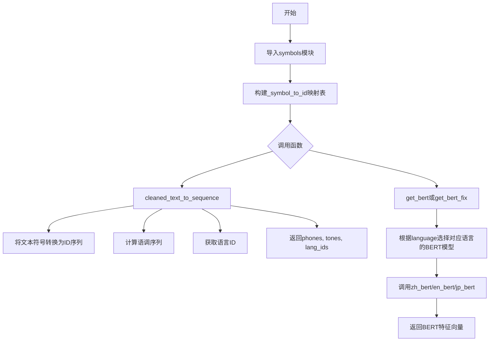
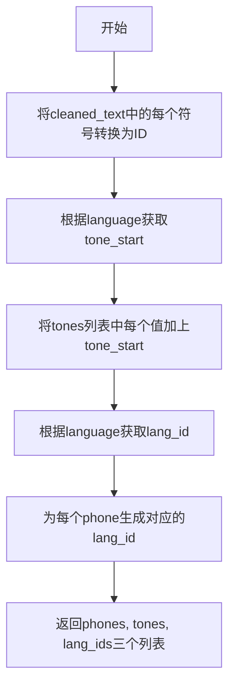
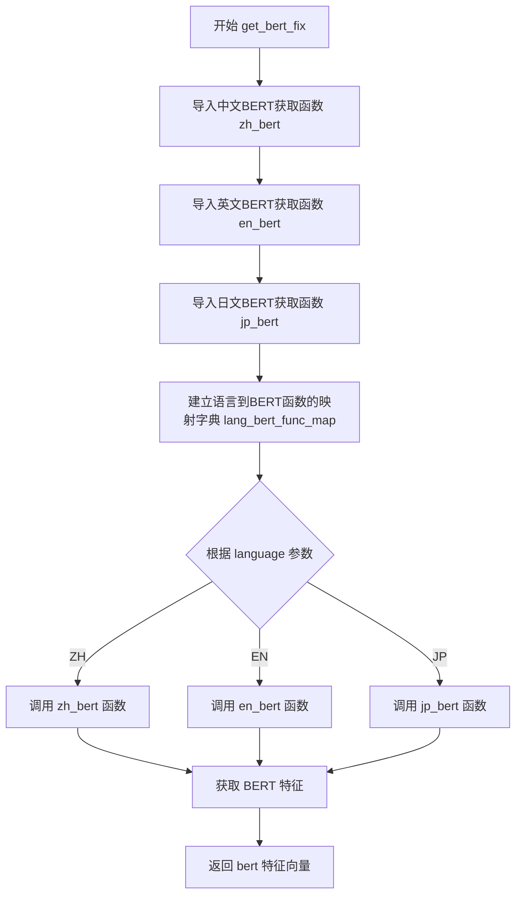

# `Bert-VITS2\oldVersion\V111\text\__init__.py` 详细设计文档

该代码是一个文本到序列的转换模块，主要功能是将输入的文本转换为对应的音素符号ID序列，并支持多语言（中文、英文、日文）的BERT特征提取，用于语音合成或语音处理任务。

## 整体流程



## 类结构

```
无类定义（纯函数模块）
```

## 全局变量及字段


### `_symbol_to_id`
    
符号到ID的映射字典，将文本符号转换为对应的数字ID

类型：`Dict[str, int]`
    


### `symbols`
    
符号列表，包含所有可能的文本到语音的符号

类型：`List[str]`
    


### `language_tone_start_map`
    
语言代码到语调起始值的映射，用于处理不同语言的语调

类型：`Dict[str, int]`
    


### `language_id_map`
    
语言代码到语言ID的映射，用于标识输入文本的语言类型

类型：`Dict[str, int]`
    


    

## 全局函数及方法


### `cleaned_text_to_sequence`

该函数将清洗后的文本转换为对应的符号ID序列，同时处理音调和语言信息，返回三个列表：音素序列（phones）、调整后的音调序列（tones）和语言ID序列（lang_ids）。

参数：

- `cleaned_text`：list[str]，待转换的已清洗文本符号列表
- `tones`：list[int]，音调信息列表
- `language`：str，语言标识符（如"ZH"、"EN"、"JP"）

返回值：tuple[list[int], list[int], list[int]]，包含三个列表——符号ID列表、音调列表（已加入语言音调起始值）、语言ID列表

#### 流程图



#### 带注释源码

```python
# 全局变量：从符号映射到ID的字典
# 由symbols模块中的symbols列表生成，键为符号，值为索引
_symbol_to_id = {s: i for i, s in enumerate(symbols)}


def cleaned_text_to_sequence(cleaned_text, tones, language):
    """将文本字符串转换为对应符号的ID序列
    
    Args:
      cleaned_text: 要转换为序列的文本字符串
      tones: 音调信息列表
      
    Returns:
      符号对应的整数ID列表
    """
    # 步骤1：将cleaned_text中的每个符号映射到对应的ID
    # cleaned_text是符号列表，通过_symbol_to_id字典查找对应的整数值
    phones = [_symbol_to_id[symbol] for symbol in cleaned_text]
    
    # 步骤2：根据language获取该语言的音调起始值
    # language_tone_start_map是语言到音调起始值的映射字典
    tone_start = language_tone_start_map[language]
    
    # 步骤3：将原始音调值加上音调起始值进行偏移
    # 确保不同语言的音调值不会冲突
    tones = [i + tone_start for i in tones]
    
    # 步骤4：根据language获取语言ID
    # language_id_map是语言到语言ID的映射字典
    lang_id = language_id_map[language]
    
    # 步骤5：为每个音素生成对应的语言ID
    # 确保音素序列与语言ID序列长度一致
    lang_ids = [lang_id for i in phones]
    
    # 返回三个列表：音素ID序列、调整后的音调序列、语言ID序列
    return phones, tones, lang_ids
```


### `get_bert`

该函数是一个多语言BERT特征提取的路由函数，根据输入的语言类型（中文、英文、日文）动态选择并调用相应的BERT模型来获取文本的语义特征。

参数：

- `norm_text`：`str`，规范化后的文本内容
- `word2ph`：`list[int]` 或类似结构，字到音素的映射数组，用于确定每个字对应多少个音素
- `language`：`str`，语言标识，值为 "ZH"（中文）、"EN"（英文）或 "JP"（日文）之一
- `device`：`str` 或 `torch.device`，指定计算设备（如 "cpu" 或 "cuda"）

返回值：`any`，返回对应语言BERT模型提取的特征向量，具体类型取决于各语言BERT实现返回的结果

#### 流程图

```mermaid
flowchart TD
    A[开始 get_bert] --> B[动态导入 chinese_bert.get_bert_feature as zh_bert]
    B --> C[动态导入 english_bert_mock.get_bert_feature as en_bert]
    C --> D[动态导入 japanese_bert.get_bert_feature as jp_bert]
    D --> E[构建 lang_bert_func_map 字典]
    E --> F{根据 language 参数}
    F -->|ZH| G[获取 zh_bert 函数]
    F -->|EN| H[获取 en_bert 函数]
    F -->|JP| I[获取 jp_bert 函数]
    G --> J[调用 lang_bert_func_map[language] 即 zh_bert]
    H --> J
    I --> J
    J --> K[传入参数: norm_text, word2ph, device]
    K --> L[返回 bert 特征]
```

#### 带注释源码

```python
def get_bert(norm_text, word2ph, language, device):
    """
    根据语言类型调用对应的BERT模型获取文本特征。
    
    Args:
      norm_text: string, 规范化后的文本
      word2ph: list, 字到音素的映射关系
      language: string, 语言标识 ("ZH", "EN", "JP")
      device: string or torch.device, 计算设备
    
    Returns:
      bert: 不同语言BERT模型返回的特征向量
    """
    # 动态导入各语言的BERT特征提取函数
    from .chinese_bert import get_bert_feature as zh_bert
    from .english_bert_mock import get_bert_feature as en_bert
    from .japanese_bert import get_bert_feature as jp_bert

    # 建立语言标识到BERT函数的映射关系
    lang_bert_func_map = {"ZH": zh_bert, "EN": en_bert, "JP": jp_bert}
    
    # 根据language参数选择对应的BERT函数并调用
    bert = lang_bert_func_map[language](norm_text, word2ph, device)
    
    # 返回提取的BERT特征
    return bert
```


### `get_bert_fix`

根据输入的语言参数，动态选择对应语言的 BERT 特征提取函数，获取文本的 BERT 嵌入特征。

参数：

- `norm_text`：`str`，规范化后的文本，用于提取 BERT 特征
- `word2ph`：`dict` 或列表，词到音素的映射关系，用于对齐 BERT 特征
- `language`：`str`，语言标识，可选值为 "ZH"（中文）、"EN"（英文）、"JP"（日文）
- `device`：`torch.device`，计算设备，用于指定 BERT 模型运行在 CPU 还是 GPU 上

返回值：`torch.Tensor`，文本的 BERT 特征向量，通常为三维张量 [batch, seq_len, hidden_dim]

#### 流程图



#### 带注释源码

```python
def get_bert_fix(norm_text, word2ph, language, device):
    """
    根据语言获取对应的 BERT 特征提取函数并执行
    
    该函数是一个多语言 BERT 特征提取的路由函数，根据传入的 language 参数
    动态选择对应的 BERT 模型获取文本特征。
    
    Args:
        norm_text: str - 规范化后的文本输入
        word2ph: dict/list - 词到音素的映射，用于特征对齐
        language: str - 语言标识，"ZH"/"EN"/"JP"
        device: torch.device - 计算设备
    
    Returns:
        torch.Tensor - BERT 特征向量
    """
    # 导入各语言的 BERT 特征提取函数
    # 中文使用 chinese_bert 模块
    from .chinese_bert import get_bert_feature as zh_bert
    # 英文使用 english_bert_mock 模块（模拟实现）
    from .english_bert_mock import get_bert_feature as en_bert
    # 日文使用 fix 目录下的 japanese_bert 模块（修复版本）
    from .fix.japanese_bert import get_bert_feature as jp_bert

    # 建立语言标识到 BERT 函数的映射字典
    # key: 语言标识, value: 对应的 BERT 特征提取函数
    lang_bert_func_map = {"ZH": zh_bert, "EN": en_bert, "JP": jp_bert}
    
    # 根据传入的语言参数，从映射字典中获取对应的 BERT 函数并调用
    # 将文本、词音素映射和设备传入对应的 BERT 特征提取函数
    bert = lang_bert_func_map[language](norm_text, word2ph, device)
    
    # 返回提取得到的 BERT 特征向量
    return bert
```

## 关键组件


### 符号映射系统 (_symbol_to_id)

将符号列表转换为ID映射字典，用于后续文本到序列的转换

### 文本序列转换器 (cleaned_text_to_sequence)

将清理后的文本、语调和语言信息转换为对应的音素ID、语调ID和语言ID序列

### 多语言BERT特征提取器 (get_bert)

根据语言选择对应的BERT模型（中文/英文/日文），提取文本的BERT特征表示

### 修复版多语言BERT特征提取器 (get_bert_fix)

功能与get_bert类似，但日文BERT使用不同的路径（fix.japanese_bert），用于处理特定场景

### 语言映射配置

包含language_tone_start_map和language_id_map，用于确定不同语言的语调起始位置和语言ID

### BERT函数映射表 (lang_bert_func_map)

根据语言代码动态选择对应的BERT特征提取函数，支持ZH/EN/JP三种语言


## 问题及建议


### 已知问题

-   **代码重复**：get_bert 和 get_bert_fix 两个函数结构完全相同，仅japanese_bert的导入路径不同（.japanese_bert vs .fix.japanese_bert），违反DRY原则。
-   **Magic Strings**：语言标识 "ZH", "EN", "JP" 硬编码在多个位置，扩展新语言需要修改多处代码。
-   **函数内重复导入**：BERT相关模块在每次调用函数时都会重新导入，增加运行时开销。
-   **错误处理缺失**：cleaned_text_to_sequence 中如果符号不在 _symbol_to_id 映射中会抛出 KeyError，无友好错误提示。
-   **文档与实现不一致**：cleaned_text_to_sequence 的docstring参数名为"text"，但实际参数名为"cleaned_text"。
-   **类型提示缺失**：所有函数均无类型注解，不利于静态分析和IDE支持。
-   **未使用的参数**：get_bert 和 get_bert_fix 接收 word2ph 参数但未在函数体内使用（可能传递给下游BERT函数，但当前函数签名未体现）。
-   **运行时字典创建**：lang_bert_func_map 字典在每次函数调用时重新创建，可提升为模块级常量。

### 优化建议

-   将 get_bert 和 get_bert_fix 合并为一个函数，通过参数控制japanese_bert的导入路径，或抽取公共逻辑到私有辅助函数。
-   将语言标识统一为枚举类或配置常量，定义 LANGUAGE_CODES = ["ZH", "EN", "JP"]。
-   将 BERT 函数映射表和导入语句提升到模块级别（可使用延迟加载或单例模式），避免重复导入和字典重建。
-   为 cleaned_text_to_sequence 添加 try-except 捕获 KeyError，并返回有意义的错误信息。
-   修正 docstring 参数名与实际参数名的一致性。
-   为所有函数添加类型提示（typing 模块），如 def get_bert(norm_text: str, word2ph: Any, language: str, device: str) -> Any。
-   确认 word2ph 参数用途，若下游BERT函数需要则保留，否则考虑移除或明确标注为可选参数。

## 其它


### 设计目标与约束

本模块的设计目标是实现多语言文本到音素的转换，并支持通过BERT模型获取文本特征。核心约束包括：1) 仅支持中文(ZH)、英文(EN)、日文(JP)三种语言；2) 依赖外部symbols模块定义的符号表；3) 语言代码必须匹配language_id_map和language_tone_start_map中的键。

### 错误处理与异常设计

代码中缺少显式的错误处理机制。潜在异常包括：1) KeyError当输入的language参数不在lang_bert_func_map中时会抛出；2) KeyError当cleaned_text中的符号不在_symbol_to_id映射中时；3) ImportError当BERT模块不存在时。建议增加参数校验和异常捕获机制。

### 外部依赖与接口契约

本模块依赖以下外部组件：1) symbols模块 - 提供符号列表；2) chinese_bert/english_bert_mock/japanese_bert模块 - 提供各语言的BERT特征提取函数；3) language_id_map和language_tone_start_map全局映射。函数接口约定：get_bert系列函数接收(norm_text, word2ph, device)参数，返回BERT特征张量。

### 数据流与状态机

数据流如下：输入文本经过符号化后转换为ID序列，同时生成对应的音调序列和语言ID。BERT特征提取路径根据语言选择对应的BERT处理器。_symbol_to_id字典在模块加载时初始化，为静态查找表，无状态变化。

### 配置与参数说明

关键配置包括：symbols列表定义所有可能的音素符号；language_id_map定义语言到ID的映射；language_tone_start_map定义各语言的音调起始偏移值。这些配置通常由外部模块导入。

### 性能考虑

_symbol_to_id字典推导式在模块加载时执行一次，后续查找为O(1)操作。get_bert和get_bert_fix函数每次调用都会重新导入BERT模块，建议缓存导入的模块以提升性能。

### 使用示例

```python
# 文本转序列示例
phones, tones, lang_ids = cleaned_text_to_sequence(["你", "好"], [1, 1], "ZH")

# BERT特征提取示例
bert_features = get_bert("你好", [2, 2], "ZH", "cuda")
```

### 模块版本与兼容性

当前代码未包含版本标识。建议在模块开头添加__version__变量，并记录对symbols、chinese_bert等模块的版本依赖要求。


    