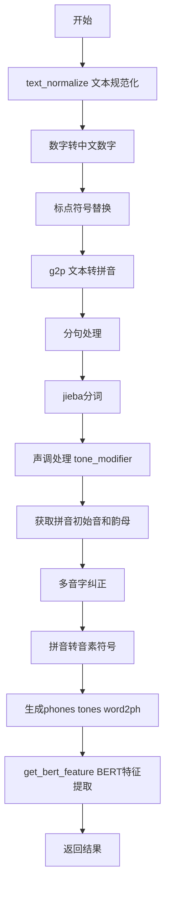
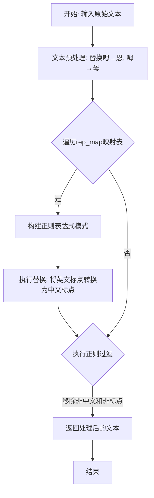
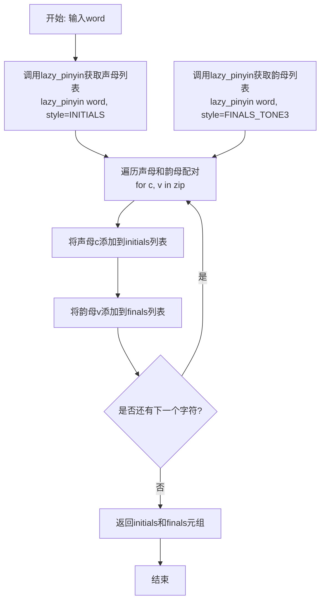
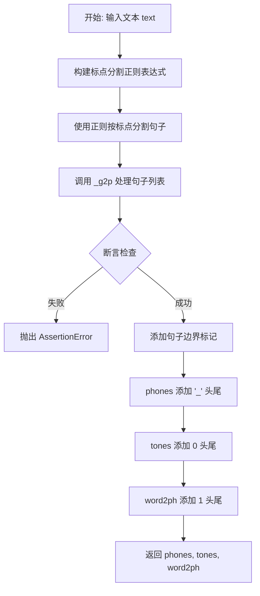
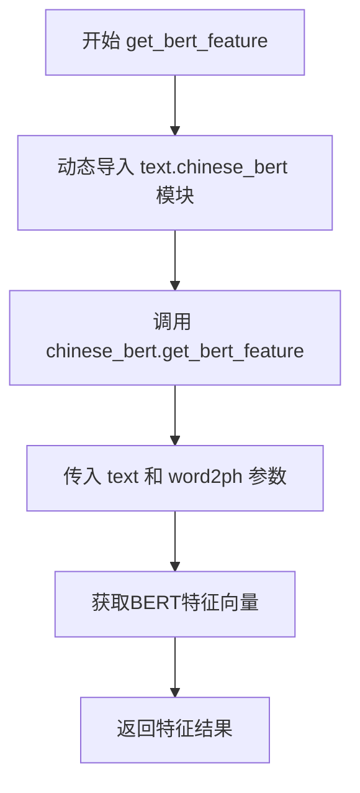
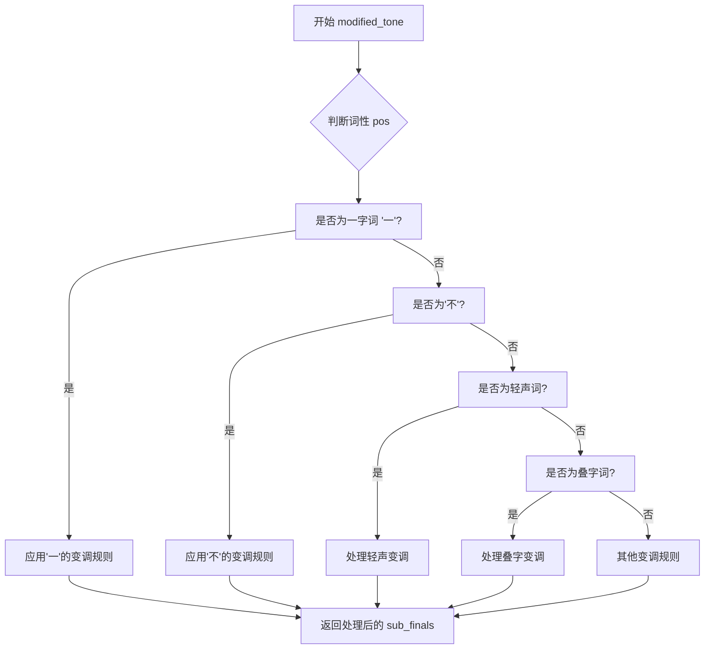

# `Bert-VITS2\oldVersion\V111\text\chinese.py` 详细设计文档

这是一个中文文本转语音（TTS）预处理模块，主要功能是将中文文本转换为拼音序列、声调和BERT嵌入特征，支持文本规范化、标点符号处理、多音字处理等。

## 整体流程



## 类结构

```
ToneSandhi (声调处理类)
└── tone_modifier (实例) - 用于多音字和声调修改
```

## 全局变量及字段


### `current_file_path`
    
获取当前Python文件所在目录的路径，用于构建资源文件的绝对路径

类型：`str`
    


### `pinyin_to_symbol_map`
    
将拼音转换为音素符号的映射字典，从opencpop-strict.txt文件加载，用于G2P（文字转语音）处理

类型：`dict[str, str]`
    


### `rep_map`
    
标点符号和特殊字符的替换映射表，用于文本标准化和规范化处理

类型：`dict[str, str]`
    


### `tone_modifier`
    
声调Sandhi处理器的实例，用于处理中文声调变化和音节修改

类型：`ToneSandhi`
    


    

## 全局函数及方法


### `replace_punctuation`

该函数是文本预处理模块的核心功能之一，主要用于将文本中的特殊标点符号进行规范化统一，并移除所有非中文字符（保留中文标点），为后续的拼音转换（g2p）流程提供干净、规范的输入文本。

参数：

- `text`：`str`，待处理的原始文本字符串

返回值：`str`，处理后仅保留中文字符和中文标点符号的文本字符串

#### 流程图



#### 带注释源码

```python
def replace_punctuation(text):
    """
    标点符号规范化函数
    
    处理流程：
    1. 将语气词嗯、呣替换为恩、母
    2. 将各类英文标点、中文标点统一替换为指定符号
    3. 移除所有非中文字符（保留中文标点符号）
    
    Args:
        text (str): 待处理的原始文本
        
    Returns:
        str: 处理后的文本，仅包含中文字符和中文标点
    """
    # 第一步：语气词替换
    # 将"嗯"替换为"恩"，"呣"替换为"母"
    # 目的：统一同义异形词，避免后续分词产生歧义
    text = text.replace("嗯", "恩").replace("呣", "母")
    
    # 第二步：构建标点符号替换正则表达式
    # 使用re.escape转义rep_map中的特殊字符（如.、*等）
    # 用|连接所有要替换的标点符号，构建模式串
    pattern = re.compile("|".join(re.escape(p) for p in rep_map.keys()))
    
    # 执行批量替换：将各类标点符号映射为统一符号
    # 例如：："：" → ","，"。" → "."，"..." → "…"
    replaced_text = pattern.sub(lambda x: rep_map[x.group()], text)
    
    # 第三步：移除非中文字符
    # 保留中文字符（\u4e00-\u9fa5）和punctuation中的标点符号
    # 移除：英文、数字、特殊符号、空格等
    # r"[^\u4e00-\u9fa5" + "".join(punctuation) + r"]+" 表示匹配非中文和非标点的字符
    replaced_text = re.sub(
        r"[^\u4e00-\u9fa5" + "".join(punctuation) + r"]+", "", replaced_text
    )
    
    # 返回处理后的干净文本
    return replaced_text
```


### `g2p`

该函数是文本转语音（Text-to-Speech, TTS）前处理流程中的核心环节，负责将输入的汉字文本分割成句子片段，转换为对应的汉语拼音音素（phones）、声调（tones）以及字符与音素的对齐关系（word2ph），并在序列前后添加静音标记以适配声学模型输入。

参数：
- `text`：`str`，待转换的原始中文文本字符串。

返回值：`tuple`，返回一个包含三个列表的元组 `(phones, tones, word2ph)`。
- `phones`：`list[str]`，音素序列，如 `["_", "a", "b", "i", "_"]`。
- `tones`：`list[int]`，对应音素的声调序列（如 0 表示静音，1-5 表示声调）。
- `word2ph`：`list[int]`，表示原始文本中每个汉字对应多少个音素，用于对齐。

#### 流程图

```mermaid
flowchart TD
    A([Start g2p]) --> B[构建标点符号正则表达式]
    B --> C[根据标点分割文本为句子列表]
    C --> D[调用 _g2p 处理句子]
    D --> E[获取 phones, tones, word2ph]
    E --> F{断言: sum(word2ph) == len(phones)}
    F -- 失败 --> G[抛出 AssertionError]
    F -- 通过 --> H{断言: len(word2ph) == len(text)}
    H -- 失败 --> I[抛出 AssertionError]
    H -- 通过 --> J[为 phones 添加静音标记 "_"]
    J --> K[为 tones 添加静音标记 "0"]
    K --> L[为 word2ph 添加对齐标记 "1"]
    L --> M([Return tuple])
```

#### 带注释源码

```python
def g2p(text):
    """
    将中文文本转换为音素序列、声调序列以及字音对齐关系
    
    参数:
        text (str): 输入的中文文本
        
    返回:
        tuple: (phones, tones, word2ph) 元组
    """
    # 1. 标点符号处理：构建正则表达式，用于根据标点分割句子
    # 匹配标点符号前后的空格（Lookbehind）
    pattern = r"(?<=[{0}])\s*".format("".join(punctuation))
    
    # 2. 文本分割：使用正则分割文本，去除空字符串
    # 例如："你好，世界！" -> ["你好，世界", "！"] (实际处理时会过滤)
    sentences = [i for i in re.split(pattern, text) if i.strip() != ""]
    
    # 3. 核心转换：调用内部函数 _g2p 进行分词、拼音转换和声调处理
    phones, tones, word2ph = _g2p(sentences)
    
    # 4. 完整性校验：确保生成的音素数量与对齐信息一致
    # 校验所有汉字的音素总数是否等于生成的音素序列长度
    assert sum(word2ph) == len(phones)
    # 校验对齐列表长度是否等于原始文本长度（此处存在潜在崩溃风险，代码建议添加 try-catch）
    assert len(word2ph) == len(text)
    
    # 5. 填充处理：在序列前后添加静音标记（Padding）
    # 添加静音音素 "_" 和无声调标记 "0"，方便后续模型处理句首句尾
    phones = ["_"] + phones + ["_"]
    tones = [0] + tones + [0]
    word2ph = [1] + word2ph + [1]
    
    return phones, tones, word2ph
```


### `_get_initials_finals`

该函数接收一个汉字词语作为输入，使用 pypinyin 库分别提取词语中每个汉字的声母（initials）和韵母（finals），最终返回两个列表组成的元组。

参数：

- `word`：`str`，输入的汉字词语，用于提取声母和韵母

返回值：`tuple`，返回包含声母列表和韵母列表的元组，格式为 `(initials, finals)`

#### 流程图



#### 带注释源码

```python
def _get_initials_finals(word):
    """
    提取汉字词语的声母和韵母
    
    参数:
        word: str, 输入的汉字词语
    
    返回:
        tuple: (initials列表, finals列表)
    """
    # 初始化声母和韵母列表
    initials = []
    finals = []
    
    # 使用pypinyin的lazy_pinyin获取声母列表
    # neutral_tone_with_five=True 表示使用五声调格式
    # style=Style.INITIALS 表示只获取声母部分
    orig_initials = lazy_pinyin(word, neutral_tone_with_five=True, style=Style.INITIALS)
    
    # 使用pypinyin的lazy_pinyin获取韵母列表（带声调）
    # style=Style.FINALS_TONE3 表示获取韵母并带声调（以数字形式表示）
    orig_finals = lazy_pinyin(
        word, neutral_tone_with_five=True, style=Style.FINALS_TONE3
    )
    
    # 遍历声母和韵母的配对，逐个添加到结果列表中
    for c, v in zip(orig_initials, orig_finals):
        initials.append(c)  # 添加声母
        finals.append(v)    # 添加韵母
    
    # 返回声母列表和韵母列表组成的元组
    return initials, finals
```


### `g2p`

该函数是文本转拼音（G2P）的核心入口，接收中文文本输入，通过标点符号分割句子，调用内部函数 `_g2p` 将文本转换为拼音序列、音调序列和字到音素的映射，并添加句子边界标记（"_"）后返回结果。

参数：

- `text`：`str`，待转换的中文文本

返回值：`tuple`，包含三个列表 —— `phones`（拼音符号列表）、`tones`（音调列表）、`word2ph`（字符到音素的映射列表）

#### 流程图



#### 带注释源码

```python
def g2p(text):
    """
    将中文文本转换为拼音序列的主函数
    
    参数:
        text: str, 输入的中文文本
        
    返回:
        tuple: (phones, tones, word2ph)
            - phones: 拼音符号列表
            - tones: 对应的音调列表
            - word2ph: 每个原始字符对应的音素数量
    """
    # 构建正则表达式，用于按标点符号分割句子
    # (?<=...) 是正向后查找断言，匹配标点后但不包括标点的位置
    pattern = r"(?<=[{0}])\s*".format("".join(punctuation))
    
    # 使用正则分割文本，去除空句子
    sentences = [i for i in re.split(pattern, text) if i.strip() != ""]
    
    # 调用内部函数进行实际的拼音转换
    phones, tones, word2ph = _g2p(sentences)
    
    # 断言验证：确保音素总数与word2ph之和匹配
    assert sum(word2ph) == len(phones)
    
    # 断言验证：确保word2ph长度与输入文本长度一致
    # 注意：有时可能会崩溃，可以添加try-catch处理
    assert len(word2ph) == len(text)
    
    # 添加句子边界标记（静音符）
    phones = ["_"] + phones + ["_"]
    tones = [0] + tones + [0]
    word2ph = [1] + word2ph + [1]
    
    return phones, tones, word2ph
```


### `text_normalize`

该函数是文本预处理流程中的关键一环，主要承担文本标准化的职责。它通过正则表达式识别输入文本中的阿拉伯数字（包括整数和小数），利用 `cn2an` 库将其转换为直观的中文数字表示（如“一二三”），并调用 `replace_punctuation` 函数统一标点符号格式，从而消除口语化或多样化的输入对后续语音合成模型造成的不确定性。

参数：
- `text`：`str`，需要进行标准化处理的原始文本输入。

返回值：`str`，返回完成数字转换和标点规范化后的文本字符串。

#### 流程图

```mermaid
graph TD
    A([开始 text_normalize]) --> B[使用正则 r\"\d+(?:\.?\d+)?\" 提取数字]
    B --> C{数字列表是否为空?}
    C -->|是| D[遍历数字列表]
    D --> E[调用 cn2an.an2cn 转换数字为中文]
    E --> F[执行 text.replace(..., 1) 替换原文本中的该数字]
    F --> D
    D --> G[调用 replace_punctuation 替换标点符号]
    C -->|否| G
    G --> H([返回处理后的文本])
```

#### 带注释源码

```python
def text_normalize(text):
    """
    对文本进行标准化：数字转中文 + 标点符号统一。

    参数:
        text (str): 输入的原始文本。

    返回:
        str: 标准化后的文本。
    """
    # 步骤 1: 提取文本中所有的阿拉伯数字（整数或小数）
    # 正则解释：匹配一个或多个数字，可选地后跟一个可选的小数点和更多数字
    # 例如：匹配 "2023", "3.14", 但不匹配 "abc"
    numbers = re.findall(r"\d+(?:\.?\d+)?", text)

    # 步骤 2: 遍历提取到的数字，将其转换为中文形式
    # 注意：这里使用了 replace(old, new, 1)，表示只替换字符串中第一个出现的匹配项。
    # 这是因为在循环中每次替换后，剩余的未处理数字位置可能会发生变化，
    # 这样可以确保按顺序正确替换连续或重复的数字。
    for number in numbers:
        # 使用 cn2an 库将 "123" 转换为 "一百二十三"
        chinese_number = cn2an.an2cn(number)
        # 将文本中的第一个 number 替换为 chinese_number
        text = text.replace(number, chinese_number, 1)

    # 步骤 3: 替换标点符号
    # 将中文标点（如 "，", "。", "！"）统一替换为半角或特定的符号，
    # 以符合 TTS 模型的输入规范。
    text = replace_punctuation(text)

    # 步骤 4: 返回最终处理后的文本
    return text
```


### `get_bert_feature`

该函数是一个文本特征提取的桥接函数，负责将输入文本和字符-音素映射传递给中文BERT特征提取模块，以获取文本的BERT嵌入表示。

参数：

- `text`：`str`，待处理的输入文本字符串
- `word2ph`：`list[int]` 或 `List[int]`，字符到音素（phone）的映射数组，用于将每个字符映射到对应的音素数量，以便BERT特征与音素对齐

返回值：返回值类型取决于 `chinese_bert.get_bert_feature` 的实现，通常为 `torch.Tensor` 或 `numpy.ndarray`，即文本的BERT特征向量表示，形状通常为 `[seq_len, hidden_dim]` 或 `[batch, seq_len, hidden_dim]`

#### 流程图



#### 带注释源码

```python
def get_bert_feature(text, word2ph):
    """
    获取输入文本的BERT特征表示
    
    这是一个桥接函数，将文本处理流程与BERT特征提取模块连接起来。
    实际实现位于 text.chinese_bert 模块中。
    
    参数:
        text: str, 输入的文本字符串
        word2ph: list, 字符到音素的映射数组，用于特征对齐
    
    返回:
        来自 chinese_bert.get_bert_feature 的特征张量
    """
    # 动态导入中文BERT特征提取模块
    # 采用延迟导入以避免循环依赖或模块加载顺序问题
    from text import chinese_bert

    # 委托给 chinese_bert 模块的实际实现
    # 传递文本和字符-音素映射参数
    return chinese_bert.get_bert_feature(text, word2ph)
```

---

**补充说明：**

- 该函数采用**委托模式**，自身不包含核心逻辑，而是将请求转发给 `text.chinese_bert` 模块的实现
- `word2ph` 参数用于实现**字符级特征对齐**，确保BERT的token级别特征可以与音素级别进行对齐，这在语音合成任务中尤为重要
- 动态导入（`from text import chinese_bert`）是该文件的惯用做法，在文件末尾的 `__main__` 块中也有类似用法
- 实际的BERT特征提取逻辑需要参考 `text/chinese_bert.py` 模块的实现


我需要先查看 `ToneSandhi` 类的定义，因为 `pre_merge_for_modify` 方法的源码不在当前提供的代码文件中。让我搜索相关文件。
[TOOL_CALL]
{tool => "filesystem_search_files", args => {
  --path "."
  --pattern "**/tone_sandhi.py"
}}
[/TOOL_CALL]
[TOOL_CALL]
{tool => "filesystem_search_files", args => {
  --path "."
  --pattern "**/tone_sandhi*.py"
}}
[/TOOL_CALL]


### `ToneSandhi.modified_tone`

该方法是 `ToneSandhi` 类中的核心方法，用于处理中文语音合成中的**变调（tone sandhi）**逻辑。它根据词语的词性对拼音韵母进行变调处理，常见于处理"一"、"不"、轻声、叠字等需要变调的情况。

参数：

- `word`：`str`，当前处理的汉字词语
- `pos`：`str`，该词语的词性标签（来自 jieba 分词）
- `sub_finals`：`list[str]`，该词语的拼音韵母列表（包含声调）

返回值：`list[str]`，处理后的拼音韵母列表（应用变调规则后）

#### 流程图



#### 带注释源码

从 provided code 中只能看到该方法的**调用方式**，实际实现位于 `tone_sandhi.py` 模块中。以下是调用点的上下文：

```python
# 在 _g2p 函数中调用 modified_tone 方法
def _g2p(segments):
    phones_list = []
    tones_list = []
    word2ph = []
    for seg in segments:
        # 替换句子中所有英文单词
        seg = re.sub("[a-zA-Z]+", "", seg)
        seg_cut = psg.lcut(seg)
        initials = []
        finals = []
        # 预处理：合并某些需要一起处理的词
        seg_cut = tone_modifier.pre_merge_for_modify(seg_cut)
        for word, pos in seg_cut:
            if pos == "eng":
                continue
            # 获取词语的声母和韵母
            sub_initials, sub_finals = _get_initials_finals(word)
            # 【关键调用点】调用 modified_tone 进行变调处理
            # 参数：word-当前词, pos-词性, sub_finals-原始韵母列表
            # 返回：处理后的韵母列表（应用变调规则）
            sub_finals = tone_modifier.modified_tone(word, pos, sub_finals)
            initials.append(sub_initials)
            finals.append(sub_finals)
            
        initials = sum(initials, [])
        finals = sum(finals, [])
        # ...后续处理...
```

以下是基于调用约定的**推测实现逻辑**（实际实现需参考 `tone_sandhi.py`）：

```python
# 推测的 ToneSandhi.modified_tone 方法实现逻辑
def modified_tone(self, word, pos, finals):
    """
    根据词性和词语内容应用变调规则
    
    变调规则说明：
    1. '一'字变调：一声前变四声，四声前变二声，其他变四声
    2. '不'字变调：四声前变二声，其他变四声
    3. 轻声处理：根据前字或词性确定轻声
    4. 叠字处理：叠词第二个字变为轻声
    """
    if len(word) == 1:
        # 单字词处理
        if word == '一':
            # '一'的变调规则
            return self._handle_yi(finals)
        elif word == '不':
            # '不'的变调规则  
            return self._handle_bu(finals)
    
    # 多字词处理
    if pos == '轻声':
        # 轻声词处理
        return self._handle_qingsheng(finals)
    
    # 其他变调规则
    return finals
```

#### 注意事项

由于 `ToneSandhi` 类的完整定义（`tone_sandhi.py`）未在当前代码文件中提供，上述流程图和源码是基于调用上下文和变调规则的典型实现逻辑进行的推测性描述。如需获取精确的实现细节，请参考 `tone_sandhi.py` 源文件。


## 关键组件


### 拼音符号映射 (pinyin_to_symbol_map)

从opencpop-strict.txt文件加载拼音到音素符号的映射字典，实现拼音到音素序列的转换

### 标点符号替换映射 (rep_map)

定义中文标点符号到英文标点符号的映射关系，用于文本规范化处理

### 声调沙洗模块 (tone_modifier)

ToneSandhi类的实例，负责处理中文声调变化规则，实现语流中的声调连读修正

### 文本标点替换函数 (replace_punctuation)

将文本中的标点符号按照rep_map进行替换，并过滤掉非中文和非标点字符

### 主导出函数 (g2p)

文本到音素转换的主入口函数，对输入文本进行分句处理，调用内部_g2p函数，返回带有静音标记的音素序列、声调序列和词到音素的映射

### 内部转换函数 (_g2p)

实现核心的汉字到拼音转换逻辑，使用jieba进行分词，遍历每个词获取声母韵母并应用声调修改规则，处理多音字和特殊拼音变体

### 声母韵母提取函数 (_get_initials_finals)

使用pypinyin库分别获取汉字的声母(INITIALS风格)和韵母(FINALS_TONE3风格)，返回两个列表

### 文本规范化函数 (text_normalize)

使用cn2an将阿拉伯数字转换为中文数字，然后调用replace_punctuation进行标点符号规范化

### BERT特征提取函数 (get_bert_feature)

调用chinese_bert模块获取文本的BERT嵌入特征，接受文本和word2ph映射作为输入

### 标点符号符号集

从symbols模块导入的标点符号列表，用于文本处理过程中的分句和过滤判断


## 问题及建议


### 已知问题

-   **文件资源未正确关闭**：使用`open()`读取`opencpop-strict.txt`文件后未显式关闭文件句柄，应使用`with`语句或显式调用`close()`
-   **正则表达式重复编译**：在`replace_punctuation`函数中每次调用都重新编译正则表达式，应在模块级别预编译
-   **缺少类型注解**：所有函数都缺乏类型提示（Type Hints），影响代码可读性和IDE支持
-   **断言用于生产逻辑**：代码中多处使用`assert`进行数据验证，生产环境中可能被`-O`参数跳过
-   **魔法数字与字符串硬编码**："12345"、声调标记、各类映射表中的硬编码值缺乏常量定义
-   **导入语句位置不当**：`jieba.posseg as psg`在函数内部导入，`get_bert_feature`的导入在两处重复出现
-   **映射表重复定义**：`rep_map`中部分映射存在重复逻辑（如多个标点符号都映射为","）
-   **循环依赖风险**：`get_bert_feature`函数内部动态导入`text.chinese_bert`，与文件末尾的导入方式不一致
-   **word2ph长度断言可能过于严格**：断言`len(word2ph) == len(text)`在某些合法输入下可能失败
-   **错误处理缺失**：文件读取、正则匹配等操作缺少异常捕获机制

### 优化建议

-   使用`with open()`语句管理文件资源，或使用`Path.read_text()`方法
-   将正则表达式预编译为模块级常量：`RE_PUNCTUATION = re.compile("|".join(re.escape(p) for p in rep_map.keys()))`
-   为所有函数添加类型注解，包括泛型支持（如`List[str]`, `Tuple[List[str], ...]`）
-   将断言替换为显式的条件检查和异常抛出，使用自定义异常类
-   定义常量类或枚举：`class Tone(enum.Enum): ONE = "1", TWO = "2", ...`
-   将所有导入移至文件顶部，使用`__future__`导入支持类型注解
-   重构映射表，使用更清晰的数据结构（如将标点映射分类）
-   统一动态导入方式，使用函数参数或配置注入替代动态导入
-   使用更健壮的断言消息，提供调试信息：`assert condition, f"expected {expected}, got {actual}"`
-   添加`try-except`块处理文件不存在、编码错误等异常情况

## 其它


### 设计目标与约束

本模块的设计目标是实现中文文本到拼音、音调和音素的转换，为后续的语音合成提供基础输入。核心约束包括：1）仅支持中文文本处理，输入文本需经过text_normalize预处理；2）依赖外部词典文件opencpop-strict.txt进行拼音到音素的映射；3）拼音转换结果需与原始文本字符一一对应（通过word2ph数组关联）；4）模块需在Python 3.7+环境中运行。

### 错误处理与异常设计

代码中包含多处assert语句用于验证转换结果的正确性，包括：验证word2ph总和等于phones长度、验证转换后拼音存在于符号映射表中、验证音调值在1-5范围内。当输入文本包含无法处理的字符（如英文字符被正则清除）时，程序会抛出AssertionError。潜在的异常场景包括：词典文件不存在或格式错误、jieba分词失败、pypinyin库处理特殊字符异常。建议增加更友好的错误提示和降级处理机制。

### 数据流与状态机

数据流经过以下阶段：原始文本 → 文本归一化(text_normalize) → 标点符号替换(replace_punctuation) → 按标点分句 → jieba分词 → 拼音转换(_g2p) → 音调处理 → 音素映射 → 最终输出。状态机方面，_g2p函数内部对每个分词后的字进行状态转换：初始态 → 获取拼音初始音和韵母 → 应用声调修改器 → 后处理映射 → 查表转换为音素。特殊状态包括处理多音字、轻声、儿化音等。

### 外部依赖与接口契约

核心外部依赖包括：1）cn2an库用于阿拉伯数字转中文数字；2）pypinyin库提供汉字到拼音的转换；3）jieba.posseg用于中文分词并标注词性；4）ToneSandhi类处理声调连读规则；5）chinese_bert模块提供文本的BERT特征提取。接口契约方面，g2p函数接收text字符串返回(phones, tones, word2ph)三元组，其中phones为音素列表、tones为对应音调值、word2ph为每个字符对应的音素数量。text_normalize接收原始文本返回归一化后的文本。get_bert_feature接收文本和word2ph返回BERT特征张量。

### 性能考虑

当前实现中，每次调用g2p都会重新读取opencpop-strict.txt文件，建议将pinyin_to_symbol_map改为模块级缓存。jieba分词和pypinyin转换在大量文本处理时可能成为性能瓶颈，可考虑批量处理和并行化。正则表达式在replace_punctuation中每次调用都重新编译pattern，建议预编译。此外，word2ph的计算涉及多次assert验证，生产环境可考虑关闭。

### 安全性考虑

代码主要处理文本输入，安全性风险较低。但需注意：1）外部词典文件的路径安全性，防止路径遍历攻击；2）用户输入文本长度无限制，可能导致内存问题，建议添加输入长度限制；3）replace_punctuation中使用lambda函数，需确保rep_map中的替换值不存在恶意代码。

### 配置与参数说明

关键配置参数包括：rep_map字典定义了标点符号映射规则；pinyin_to_symbol_map从opencpop-strict.txt加载拼音到音素的映射；tone_modifier是ToneSandhi类实例用于声调处理。jieba分词使用默认词典，pypinyin使用neutral_tone_with_five=True参数表示轻声用5表示。g2p函数返回的phones列表以"_"作为句子边界标记。

### 使用示例与测试计划

示例用法见代码底部：输入"啊！但是《原神》是由,米哈\游自主，  [研发]的一款全.新开放世界.冒险游戏"，经text_normalize后输出归一化文本，经g2p转换为音素序列和音调。测试计划应包括：1）基本中文文本转换验证；2）数字转中文测试；3）各种标点符号处理测试；4）多音字处理验证；5）特殊字符（英文字母、符号）清除测试；6）边界条件（空字符串、单字符）测试；7）性能基准测试。

### 术语表与缩略语

TTS：Text-to-Speech，文本转语音；G2P：Grapheme-to-Phoneme，字素转音素；Pinyin：汉语拼音；IPA：International Phonetic Alphabet，国际音标；BERT：Bidirectional Encoder Representations from Transformers，双向编码器表示；声调标记：1-5分别表示一声到四声，0表示轻声，5表示轻声（中性调）。

### 参考资料与引用

本模块参考了OpenCPop数据集的音素定义标准，opencpop-strict.txt文件包含了普通话音素的完整映射。声调连读规则(Tone Sandhi)参考了汉语语音学中的变调规则。中文数字转换使用cn2an库实现。分词模块jieba和拼音转换模块pypinyin是Python中文处理的主流工具库。

    