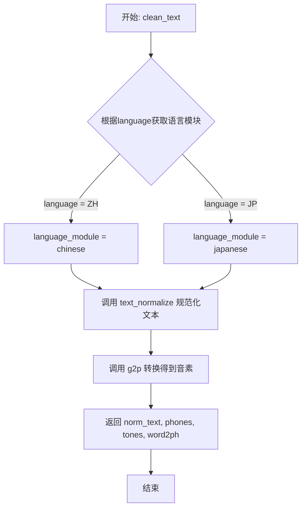
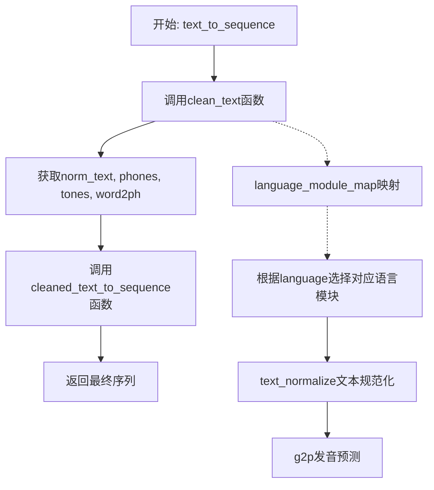

# `Bert-VITS2\oldVersion\V111\text\cleaner.py` 详细设计文档

该模块是一个多语言文本处理工具，提供了针对中文（ZH）和日文（JP）的文本清洗、规范化、拼音/音素转换及BERT特征提取功能，支持标准流程和修复流程两种处理模式。

## 整体流程

```mermaid
graph TD
    A[开始] --> B{选择处理模式}
    B -- 标准模式 --> C[使用 language_module_map]
    B -- 修复模式 --> D[使用 language_module_map_fix]
    C --> E[获取对应语言的模块]
    D --> E
    E --> F[text_normalize: 文本规范化]
    F --> G[g2p: 获取phones/tones/word2ph]
    G --> H{是否需要BERT特征?}
    H -- 是 --> I[get_bert_feature: 获取BERT特征]
    H -- 否 --> J[返回 (norm_text, phones, tones, word2ph)]
    I --> K[返回 (phones, tones, bert)]
    J --> L[text_to_sequence: 转换为序列]
    L --> M[结束]
```

## 类结构

```
无类定义（纯模块文件）
├── 模块级变量
│   ├── language_module_map
│   └── language_module_map_fix
└── 模块级函数
    ├── clean_text
    ├── clean_text_fix
    ├── clean_text_bert
    └── text_to_sequence
```

## 全局变量及字段


### `language_module_map`
    
语言模块映射字典（标准模式，包含ZH->chinese, JP->japanese）

类型：`dict`
    


### `language_module_map_fix`
    
语言模块映射字典（修复模式，使用fix分支的japanese）

类型：`dict`
    


    

## 全局函数及方法


### `clean_text`

标准文本清洗函数，根据语言代码选择对应的语言处理模块，完成文本规范化、音素转换、声调提取和词素映射，返回规范化文本、音素序列、声调序列和词素到音素的映射关系。

参数：

- `text`：`str`，待清洗的原始文本
- `language`：`str`，语言代码（"ZH"代表中文，"JP"代表日文）

返回值：

- `norm_text`：`str`，规范化处理后的文本
- `phones`：`list`，从文本转换得到的音素序列
- `tones`：`list`，与音素对应的声调序列
- `word2ph`：`list`，词素到音素的映射关系，用于对齐

#### 流程图



#### 带注释源码

```python
def clean_text(text, language):
    """
    标准文本清洗函数
    
    参数:
        text: str - 待清洗的原始文本
        language: str - 语言代码，支持 "ZH"（中文）和 "JP"（日文）
    
    返回:
        norm_text: str - 规范化后的文本
        phones: list - 音素序列
        tones: list - 声调序列
        word2ph: list - 词素到音素的映射关系
    """
    # 根据语言代码从映射表中获取对应的语言处理模块
    # ZH -> chinese 模块, JP -> japanese 模块
    language_module = language_module_map[language]
    
    # 步骤1: 文本规范化
    # 调用语言模块的 text_normalize 方法对原始文本进行预处理
    # 包括繁简转换、特殊字符处理、标点符号规范化等
    norm_text = language_module.text_normalize(text)
    
    # 步骤2: 文本转音素
    # 调用语言模块的 g2p (grapheme-to-phoneme) 方法
    # 将规范化后的文本转换为音素序列，同时提取声调和词素映射信息
    # phones: 音素序列（如["a", "i", "u", ...]）
    # tones: 声调序列（用于语音合成时的音高控制）
    # word2ph: 词素到音素的映射（用于字符与音素的对齐）
    phones, tones, word2ph = language_module.g2p(norm_text)
    
    # 返回四个结果：规范化文本、音素序列、声调序列、词素映射
    return norm_text, phones, tones, word2ph
```


### `clean_text_fix`

使用修复分支（dev分支）的文本清洗函数，对输入文本进行语言特定的规范化处理，并将其转换为音素序列、声调序列和词素映射关系。该函数通过映射表动态选择对应的语言处理模块（中文或日文），调用其文本规范化和图音转换功能，最终返回规范化文本、音素列表、声调列表和词素到音素的映射关系。

#### 参数

- `text`：`str`，需要处理的原始输入文本
- `language`：`str`，语言代码，用于确定使用哪种语言的处理模块（如 "ZH" 表示中文，"JP" 表示日文）

#### 返回值

- `norm_text`：`str`，规范化处理后的文本
- `phones`：`list`，从文本转换而来的音素序列列表
- `tones`：`list`，与音素对应的声调序列列表
- `word2ph`：`list`，词素到音素的映射关系列表，用于对齐

#### 流程图

```mermaid
flowchart TD
    A[开始: clean_text_fix] --> B{检查language参数}
    B -->|ZH| C[获取chinese模块<br/>language_module_map_fix['ZH']]
    B -->|JP| D[获取japanese_fix模块<br/>language_module_map_fix['JP']]
    C --> E[调用text_normalize<br/>规范化输入文本]
    D --> E
    E --> F[调用g2p<br/>图音转换]
    F --> G[提取norm_text<br/>phones<br/>tones<br/>word2ph]
    G --> H[返回结果元组]
    H --> I[结束]
```

#### 带注释源码

```python
def clean_text_fix(text, language):
    """使用dev分支修复"""
    # 根据language参数从修复模块映射表中获取对应的语言处理模块
    # 支持 ZH（中文）和 JP（日文）两种语言
    language_module = language_module_map_fix[language]
    
    # 调用语言模块的文本规范化方法，对输入文本进行标准化处理
    # 包括但不限于：数字转汉字、标点符号处理、空白字符处理等
    norm_text = language_module.text_normalize(text)
    
    # 调用语言模块的图音转换（Grapheme-to-Phoneme）方法
    # 将规范化后的文本转换为音素序列，同时生成声调序列和词素映射
    # phones: 音素序列（如['a', 'i', 'u', 'e', 'o']）
    # tones: 声调信息（如[0, 1, 2, 3, 4]表示音调高低）
    # word2ph: 词素到音素的对齐映射（如[1,1,2,2,3,3]表示每个字对应几个音素）
    phones, tones, word2ph = language_module.g2p(norm_text)
    
    # 返回规范化文本、音素序列、声调序列和词素映射
    return norm_text, phones, tones, word2ph
```


### `clean_text_bert`

带BERT特征提取的文本清洗函数，接收原始文本和语言标识（支持中文和日文），通过语言特定的文本规范化、图音转换（g2p）以及BERT特征提取流程，返回音素序列、声调序列和BERT特征向量，用于后续的语音合成任务。

参数：

- `text`：`str`，待清洗的原始输入文本
- `language`：`str`，语言标识符，支持"ZH"（中文）或"JP"（日文）

返回值：`tuple`，包含三个元素的元组

- `phones`：`list`，转换后的音素序列
- `tones`：`list`，对应的声调序列
- `bert`：`ndarray`，文本的BERT特征表示

#### 流程图

```mermaid
flowchart TD
    A[输入: text, language] --> B[根据language获取language_module]
    B --> C[调用 text_normalize 文本规范化]
    C --> D[调用 g2p 图音转换]
    D --> E[输出: phones, tones, word2ph]
    E --> F[调用 get_bert_feature 获取BERT特征]
    F --> G[返回: phones, tones, bert]
    
    B -->|language="ZH"| H[chinese模块]
    B -->|language="JP"| I[japanese模块]
```

#### 带注释源码

```python
def clean_text_bert(text, language):
    """
    带BERT特征提取的文本清洗函数
    
    该函数是文本处理流水线的核心组件，负责：
    1. 根据语言类型选择对应的处理模块
    2. 对输入文本进行规范化处理
    3. 将规范化的文本转换为音素和声调序列
    4. 提取文本的BERT语义特征
    
    Args:
        text: str，输入的原始文本
        language: str，语言标识，"ZH"表示中文，"JP"表示日文
    
    Returns:
        tuple: (phones, tones, bert)
            - phones: 音素序列列表
            - tones: 声调序列列表
            - bert: BERT特征向量数组
    """
    # 根据语言代码从预定义的映射表中获取对应的语言处理模块
    # ZH -> chinese模块, JP -> japanese模块
    language_module = language_module_map[language]
    
    # 步骤1：文本规范化
    # 调用语言模块的text_normalize方法，对原始文本进行预处理
    # 包括但不限于：全角转半角、标点符号处理、空白字符标准化等
    norm_text = language_module.text_normalize(text)
    
    # 步骤2：图音转换（Grapheme-to-Phoneme）
    # 将规范化的文本转换为音素序列，同时生成对应的声调信息
    # word2ph用于建立字符与音素之间的对齐关系
    phones, tones, word2ph = language_module.g2p(norm_text)
    
    # 步骤3：BERT特征提取
    # 使用预训练BERT模型提取文本的上下文语义特征
    # word2ph参数用于将字符级别的特征对齐到音素级别
    bert = language_module.get_bert_feature(norm_text, word2ph)
    
    # 返回处理结果：音素序列、声调序列、BERT特征
    return phones, tones, bert
```


### `text_to_sequence`

该函数是文本转序列的核心入口函数，接收原始文本和语言代码，首先调用 `clean_text` 进行文本规范化、发音预测和语调处理，随后将生成的音素、语调信息传递给 `cleaned_text_to_sequence` 生成最终可用的序列数据。

参数：

- `text`：`str`，待转换的原始文本输入
- `language`：`str`，语言代码（如"ZH"表示中文，"JP"表示日文）

返回值：`Any`，返回经 `cleaned_text_to_sequence` 处理后的最终序列数据，具体类型取决于该函数的实现

#### 流程图



#### 带注释源码

```python
def text_to_sequence(text, language):
    """
    将文本转换为序列的核心函数
    
    参数:
        text: str - 输入的原始文本
        language: str - 语言代码，如"ZH"或"JP"
    
    返回:
        Any - 经过cleaned_text_to_sequence处理后的序列数据
    """
    # 步骤1: 调用clean_text进行文本预处理
    # 该函数内部会根据language选择对应的语言模块(chinese或japanese)
    # 返回: norm_text(规范化文本), phones(音素), tones(语调), word2ph(词素对应)
    norm_text, phones, tones, word2ph = clean_text(text, language)
    
    # 步骤2: 调用cleaned_text_to_sequence将音素和语调转换为最终序列
    # 这是序列生成的最后一步，根据language选择对应的序列处理方式
    return cleaned_text_to_sequence(phones, tones, language)
```

---

## 补充信息

### 关键组件信息

| 组件名称 | 一句话描述 |
|---------|-----------|
| `clean_text` | 文本清洗核心函数，负责文本规范化、发音预测和语调处理 |
| `cleaned_text_to_sequence` | 将处理后的音素和语调转换为最终序列的函数 |
| `language_module_map` | 语言代码到语言处理模块的映射字典 |
| `chinese` / `japanese` | 特定语言的处理模块，提供文本规范化和发音预测功能 |

### 潜在的技术债务或优化空间

1. **缺少输入验证**：函数未对 `text` 和 `language` 参数进行有效性校验，可能导致运行时错误
2. **错误处理缺失**：未对 `clean_text` 可能抛出的异常进行捕获和处理
3. **固定语言映射**：使用硬编码的 `language_module_map`，扩展性较差
4. **重复调用问题**：如需多次调用，存在重复导入语言模块的性能开销

### 其它项目

**设计目标与约束**：
- 支持多语言文本转序列（当前支持中文ZH和日文JP）
- 遵循模块化设计，通过映射表动态加载语言处理模块

**错误处理与异常设计**：
- 当前未实现异常处理机制
- 建议增加对未知语言代码的 `KeyError` 捕获
- 建议增加对空文本或无效文本的预处理

**数据流与状态机**：
```
原始文本 → [文本规范化] → 规范化文本
              ↓
         [发音预测] → 音素(phones) + 语调(tones) + 词素对应(word2ph)
              ↓
         [序列清理] → 最终序列
```

**外部依赖与接口契约**：
- 依赖 `chinese`、`japanese` 语言模块，需实现 `text_normalize`、`g2p` 方法
- 依赖 `cleaned_text_to_sequence` 函数，签名需保持一致：`cleaned_text_to_sequence(phones, tones, language)`


## 关键组件


### 语言模块映射（language_module_map）

标准语言代码到语言处理模块的映射字典，支持ZH（中文）和JP（日文）两种语言的核心模块路由。

### 修复模块映射（language_module_map_fix）

用于开发分支修复的语言模块映射，通过fix模块中的japanese_fix替换标准日文处理模块。

### clean_text 函数

标准文本清理入口函数，通过语言对应的模块进行文本规范化、注音生成和词素phoneme对齐。

### clean_text_fix 函数

使用修复分支的文本清理函数，引用fix模块中的japanese_fix处理日文文本，用于测试或对比修复效果。

### clean_text_bert 函数

带BERT特征提取的文本清理函数，在标准清理流程后额外调用get_bert_feature获取文本的BERT嵌入表示。

### text_to_sequence 函数

文本到序列的最终转换函数，整合clean_text结果并调用cleaned_text_to_sequence生成最终的音素序列。


## 问题及建议


### 已知问题

-   **缺乏错误处理**：当传入不支持的语言（如"EN"）时，language_module_map[language]会直接抛出KeyError异常，没有友好的错误提示或默认值处理
-   **魔法字符串硬编码**：语言代码"ZH"和"JP"以字符串形式硬编码在多处，违反DRY原则，且新增语言时需要修改多处代码
-   **代码重复**：clean_text、clean_text_fix和clean_text_bert三个函数中获取language_module、调用text_normalize和g2p的逻辑完全重复
-   **text_to_sequence资源浪费**：调用clean_text获取了norm_text、phones、tones、word2ph四个返回值，但实际只使用phones和tones，norm_text和word2ph被丢弃
-   **函数职责不清晰**：clean_text_fix命名暗示是临时修复方案，但实际作为正式函数存在，缺乏版本管理和演进说明
-   **缺少类型注解**：所有函数参数和返回值都缺乏类型标注，降低了代码可读性和IDE支持
-   **导入结构脆弱**：使用相对导入且fix模块直接导入为japanese_fix，如果模块重构可能导致导入失败

### 优化建议

-   **添加语言支持检查**：在函数入口处验证语言是否支持，不支持时抛出自定义异常或返回默认值
-   **提取公共逻辑**：将获取language_module和调用normalize/g2p的公共逻辑抽取为私有函数，减少代码重复
-   **使用常量或枚举**：定义语言代码常量类或枚举，避免魔法字符串散落各处
-   **优化text_to_sequence**：该函数只需要phones和tones，可直接调用底层函数或重构clean_text避免获取不需要的数据
-   **添加类型注解**：为所有函数添加类型提示，提高代码可维护性
-   **统一API设计**：考虑将clean_text和clean_text_fix合并为带参数的统一函数，或使用策略模式处理不同处理逻辑
-   **完善文档字符串**：为模块和函数添加docstring，说明参数、返回值和异常情况


## 其它


### 设计目标与约束

本模块的设计目标是提供一个统一的文本清洗和转换接口，支持多语言（当前为中文和日文）的文本处理，将自然语言文本转换为语音合成所需的音素序列、音调信息以及词到音素的映射关系。设计约束包括：仅支持ZH（中文）和JP（日文）两种语言；所有语言处理功能通过统一的函数签名实现；保持语言处理模块的可插拔性。

### 错误处理与异常设计

本模块的错误处理机制主要包括：1) 语言代码验证，当传入不支持的语言代码时，会抛出KeyError异常；2) 语言模块内部错误传播，text_normalize、g2p等方法抛出的异常会直接向上层调用者传递；3) 输入参数校验，text和language参数为必填，不允许为None或空值。建议在调用层增加try-except块捕获KeyError并提供友好的错误提示，同时建议增加语言代码白名单校验机制。

### 外部依赖与接口契约

本模块的外部依赖包括：1) chinese模块，需提供text_normalize(text)、g2p(text)、get_bert_feature(text, word2ph)方法；2) japanese模块，接口与chinese模块一致；3) japanese_fix模块，为japanese的修复版本，接口一致；4) cleaned_text_to_sequence模块，需提供phones、tones、language三个参数的调用接口。接口契约明确规定：text_normalize返回规范化后的字符串；g2p返回(phones, tones, word2ph)三元组，其中phones为音素列表，tones为音调列表，word2ph为词到音素的映射；get_bert_feature返回BERT特征向量。

### 性能考虑

性能优化方向包括：1) language_module_map字典查询操作频率较高，可考虑使用if-elif替代字典查找以提升小规模场景性能；2) clean_text与clean_text_fix代码高度重复，可通过参数控制是否使用fix版本；3) 文本处理流程中涉及多次字符串操作和列表拷贝，应避免不必要的中间变量；4) 对于大批量文本处理，建议在调用层实现批处理机制以减少函数调用开销。

### 安全性考虑

本模块主要处理文本数据，安全性风险较低，但需注意：1) 用户输入的text参数应进行长度限制，防止超长文本导致内存问题；2) 建议对text参数进行类型校验，确保传入字符串类型；3) 如果文本来源于用户输入，应考虑进行基本的输入清洗以防止注入攻击。

### 可扩展性设计

模块的可扩展性设计体现在：1) 语言模块化架构，通过language_module_map字典可轻松添加新语言支持，只需在字典中添加新的映射关系并实现对应的语言处理模块；2) clean_text和clean_text_fix的并存设计支持A/B测试和渐进式升级；3) 预留了BERT特征提取接口(clean_text_bert)，便于后续扩展到神经网络声学模型。建议未来将language_module_map改为配置文件或插件机制，以实现运行时动态加载语言模块。

### 版本兼容性

当前模块版本对外部依赖的版本要求由各语言模块自身决定。建议在模块初始化时增加版本检查机制，确保语言模块接口兼容性。同时建议在模块文档中明确标注各语言模块所需的接口方法签名，以便第三方开发者了解集成要求。

### 配置管理

当前模块未引入显式的配置管理机制，language_module_map为硬编码的全局变量。改进建议：1) 将语言模块映射关系抽取到配置文件(如YAML或JSON)；2) 支持通过环境变量或配置文件指定语言模块路径；3) 增加默认语言配置项，在语言代码未找到时使用默认语言处理。

    