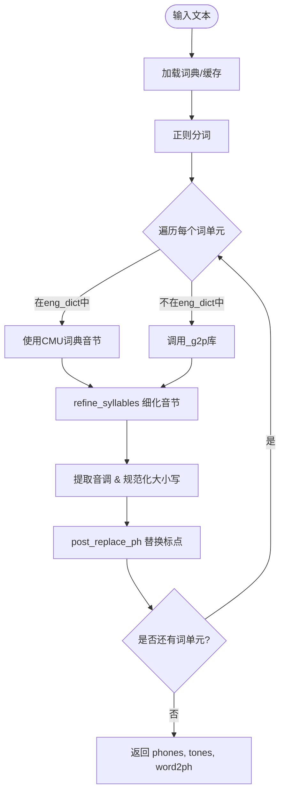
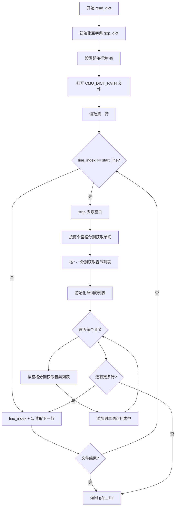
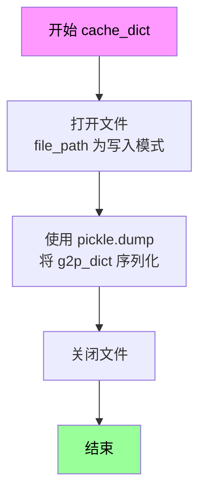
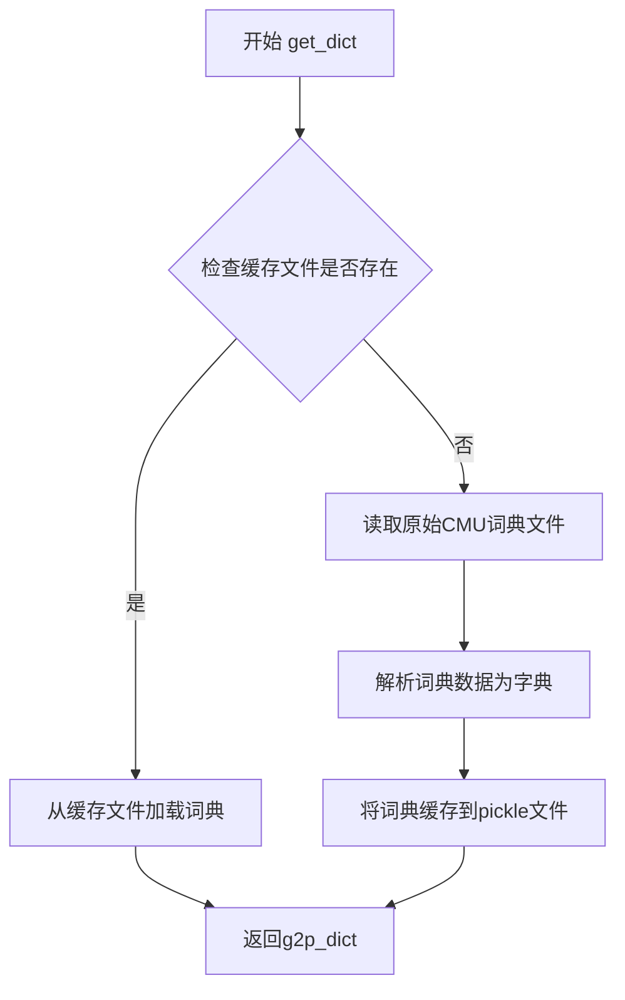
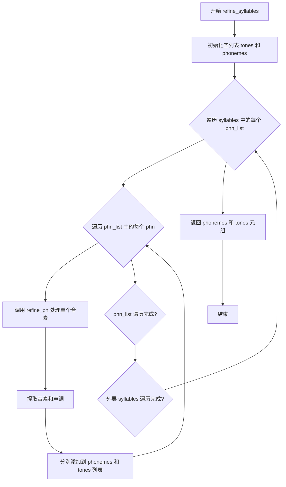
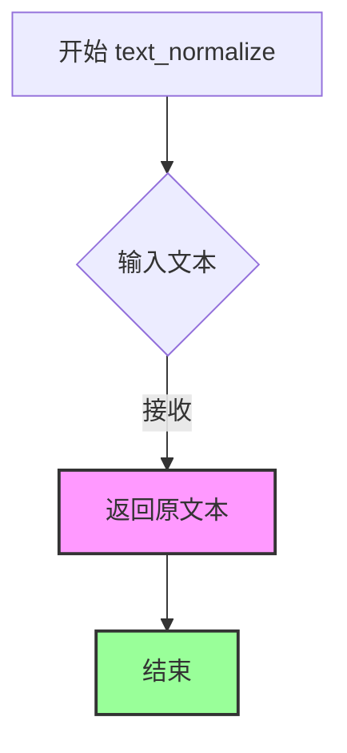
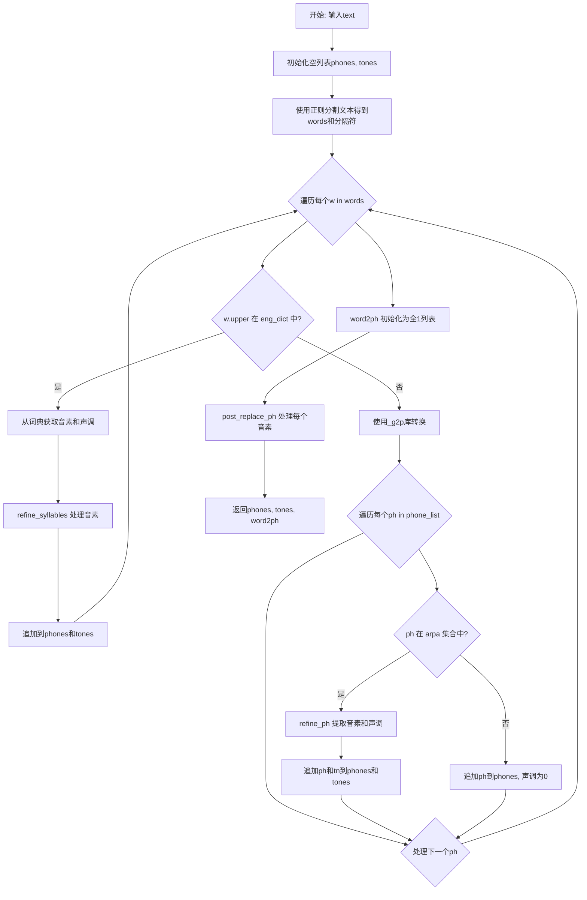

# `Bert-VITS2\oldVersion\V111\text\english.py` 详细设计文档

这是一个英文文本转音素（Grapheme-to-Phoneme, G2P）的转换模块，主要通过加载本地CMU发音词典进行高质量转换，并使用g2p_en库作为备选方案处理未登录词，同时包含音调提取、音素规范化和后处理功能。

## 整体流程



## 类结构

```
g2p_module (模块根目录)
├── 全局变量 (Global Variables)
│   ├── eng_dict (CMU发音词典缓存)
│   ├── _g2p (g2p_en 对象实例)
│   ├── arpa (ARPAbet音素集合)
│   └── paths (CMU_DICT_PATH, CACHE_PATH)
└── 函数 (Functions)
    ├── g2p (主入口函数)
    ├── get_dict (词典加载与缓存管理)
    ├── refine_syllables (音节细化处理)
    ├── refine_ph (单音素细化)
    ├── post_replace_ph (音素后处理替换)
    └── text_normalize (文本归一化占位)
```

## 全局变量及字段


### `current_file_path`
    
The absolute path to the directory containing the current Python file

类型：`str`
    


### `CMU_DICT_PATH`
    
The file path to the CMU pronunciation dictionary (cmudict.rep)

类型：`str`
    


### `CACHE_PATH`
    
The file path to the cached CMU dictionary pickle file for faster loading

类型：`str`
    


### `_g2p`
    
The G2p instance from g2p_en library for converting graphemes to phonemes

类型：`G2p`
    


### `arpa`
    
A set containing ARPA phone symbols used for phoneme validation and conversion

类型：`set`
    


### `eng_dict`
    
The English pronunciation dictionary loaded from CMU dict, mapping words to phonemes

类型：`dict`
    


    

## 全局函数及方法


### `post_replace_ph`

该函数用于对音素(phoneme)进行后处理替换，将中文标点符号转换为英文标点符号，并将小写字母转换为大写，同时验证音素是否在预定义的符号集中，若不在则返回未知标记"UNK"。

参数：

- `ph`：`str`，待处理的音素字符串

返回值：`str`，处理后的音素字符串

#### 流程图

```mermaid
flowchart TD
    A[开始: 输入音素 ph] --> B{ph 是否在 rep_map 中?}
    B -->|是| C[将 ph 替换为 rep_map[ph]]
    B -->|否| D{ph 是否在 symbols 中?}
    C --> D
    D -->|是| E[返回 ph]
    D -->|否| F[将 ph 设置为 'UNK']
    F --> E
    E --> G[结束: 返回处理后的音素]
```

#### 带注释源码

```python
def post_replace_ph(ph):
    """
    对音素进行后处理替换和验证
    
    参数:
        ph (str): 输入的音素字符串
        
    返回值:
        str: 处理后的音素字符串
    """
    # 定义标点符号映射表：将中文标点转换为英文标点，
    # 以及将小写字母 v 转换为大写 V
    rep_map = {
        "：": ",",    # 中文冒号 -> 英文逗号
        "；": ",",    # 中文分号 -> 英文逗号
        "，": ",",    # 中文逗号 -> 英文逗号
        "。": ".",    # 中文句号 -> 英文句号
        "！": "!",    # 中文感叹号 -> 英文感叹号
        "？": "?",    # 中文问号 -> 英文问号
        "\n": ".",    # 换行符 -> 英文句号
        "·": ",",     # 中间点 -> 英文逗号
        "、": ",",    # 顿号 -> 英文逗号
        "...": "…",   # 三个点 -> 省略号
        "v": "V",     # 小写v -> 大写V
    }
    
    # 步骤1: 检查输入音素是否在映射表中，如果是则替换
    if ph in rep_map.keys():
        ph = rep_map[ph]
    
    # 步骤2: 检查替换后的音素是否在预定义符号集中
    if ph in symbols:
        return ph
    
    # 步骤3: 如果音素不在符号集中，返回未知标记
    if ph not in symbols:
        ph = "UNK"
    
    return ph
```


### `read_dict`

该函数用于读取 CMU 发音词典文件（cmudict.rep），从第49行开始解析单词及其对应的音素表示，将结果存储在嵌套列表字典中并返回。

参数： 无

返回值： `Dict[str, List[List[str]]]` - 返回一个字典，键为单词（字符串），值为包含音素列表的嵌套列表，每个内层列表代表一个音节中的音素

#### 流程图



#### 带注释源码

```python
def read_dict():
    """
    读取 CMU 发音词典文件并解析单词到音素的映射
    
    Returns:
        dict: 单词到音素序列的映射字典
              格式: {word: [[phoneme1, phoneme2], [phoneme3, ...]]}
    """
    # 初始化结果字典
    g2p_dict = {}
    
    # CMU 词典文件前49行为头信息，需要跳过
    start_line = 49
    
    # 打开 CMU 词典文件
    with open(CMU_DICT_PATH) as f:
        # 读取第一行
        line = f.readline()
        # 当前行号从1开始计数
        line_index = 1
        
        # 遍历文件所有行
        while line:
            # 只处理从 start_line 开始的行（跳过头信息）
            if line_index >= start_line:
                # 去除首尾空白字符
                line = line.strip()
                
                # 按两个空格分割获取单词和音素串
                # 格式示例: "HELLO  HH AH L OW"
                word_split = line.split("  ")
                # 第一个元素为单词
                word = word_split[0]
                
                # 按 " - " 分割获取多个音节
                # 格式示例: "HH AH L - OW" 表示两个音节
                syllable_split = word_split[1].split(" - ")
                
                # 初始化该单词的音素列表
                g2p_dict[word] = []
                
                # 遍历每个音节
                for syllable in syllable_split:
                    # 按空格分割获取音素列表
                    phone_split = syllable.split(" ")
                    # 将音素列表添加到单词的音素字典中
                    g2p_dict[word].append(phone_split)
            
            # 行号递增
            line_index = line_index + 1
            # 读取下一行
            line = f.readline()
    
    # 返回解析后的发音词典
    return g2p_dict
```


### `cache_dict`

将字典对象序列化为 pickle 格式并保存到指定文件路径的全局函数，用于缓存 g2p 字典数据以加速后续加载。

参数：

- `g2p_dict`：`dict`，需要被序列化缓存的字典对象，包含单词到音素的映射关系
- `file_path`：`str`，目标缓存文件的路径，用于指定 pickle 文件的保存位置

返回值：`None`，该函数无返回值，仅执行文件写入操作

#### 流程图



#### 带注释源码

```python
def cache_dict(g2p_dict, file_path):
    """
    将字典对象序列化为 pickle 格式并保存到指定文件
    
    Args:
        g2p_dict: 需要缓存的字典对象，通常是 g2p 词典数据
        file_path: 缓存文件的保存路径
    
    Returns:
        None
    """
    # 以二进制写入模式打开文件
    with open(file_path, "wb") as pickle_file:
        # 使用 pickle 将字典对象序列化并写入文件
        pickle.dump(g2p_dict, pickle_file)
```


### `get_dict`

该函数用于获取CMU发音词典数据。首先检查是否存在缓存文件（pickle格式），若存在则直接从缓存加载；若不存在则读取原始CMU词典文件，将其解析为字典并缓存到pickle文件中，最后返回发音词典字典。

参数：该函数无参数

返回值：`dict`，返回CMU发音词典，键为单词（大写形式），值为发音音素列表（嵌套列表结构）

#### 流程图



#### 带注释源码

```python
def get_dict():
    """
    获取CMU发音词典
    
    优先从缓存文件加载，若缓存不存在则读取原始词典文件并生成缓存
    """
    # 检查缓存文件是否存在
    if os.path.exists(CACHE_PATH):
        # 缓存存在，直接从pickle文件加载词典
        with open(CACHE_PATH, "rb") as pickle_file:
            g2p_dict = pickle.load(pickle_file)
    else:
        # 缓存不存在，调用read_dict读取原始CMU词典文件
        g2p_dict = read_dict()
        # 将词典缓存到pickle文件供后续使用
        cache_dict(g2p_dict, CACHE_PATH)

    # 返回发音词典字典
    return g2p_dict
```


### `refine_ph`

该函数用于处理单个音素（phoneme），提取音调（tone）信息并将音素转换为小写格式。

参数：

- `phn`：`str`，输入的音素字符串，可能包含末尾的数字表示音调（如 "AH0"、"EY2" 等）

返回值：`tuple[str, int]`，返回处理后的音素（小写字符串）和对应的音调值（整数，0表示无声调）

#### 流程图

```mermaid
flowchart TD
    A[开始: refine_ph] --> B{检查 phn 是否以数字结尾}
    B -->|是| C[提取末尾数字作为原始音调]
    C --> D[将数字加1得到最终音调]
    D --> E[移除 phn 末尾的数字]
    B -->|否| F[设置音调为0]
    E --> G[将 phn 转换为小写]
    F --> G
    G --> H[返回 (phn, tone)]
    H --> I[结束]
```

#### 带注释源码

```python
def refine_ph(phn):
    """
    处理单个音素，提取音调信息并将音素转换为小写。
    
    参数:
        phn: 输入的音素字符串，可能包含末尾的数字表示音调（如 "AH0", "EY2"）
    
    返回值:
        元组 (处理后的音素字符串, 音调值)
        - 音素被转换为小写
        - 音调值：如果是声调音素（末尾有数字），返回数字+1；否则返回0
    """
    # 初始化音调为0（表示无声调）
    tone = 0
    
    # 使用正则表达式检查音素是否以数字结尾
    # \d$ 表示匹配字符串末尾的数字
    if re.search(r"\d$", phn):
        # 提取末尾数字并加1作为音调值
        # 例如: "AH0" -> tone = 0 + 1 = 1
        # 例如: "EY2" -> tone = 2 + 1 = 3
        tone = int(phn[-1]) + 1
        # 移除末尾的数字部分
        phn = phn[:-1]
    
    # 将音素转换为小写并返回
    # 例如: "AH" -> "ah", "EY" -> "ey"
    return phn.lower(), tone
```


### `refine_syllables`

该函数是G2P（Grapheme-to-Phoneme）流程中的关键处理模块，负责将音节（syllables）转换为音素（phonemes）和声调（tones）序列，通过遍历每个音节中的音素并调用`refine_ph`进行标准化处理。

参数：

- `syllables`：嵌套列表（List[List[str]]），包含从CMU发音词典获取的音节数据，每个元素是一个音素列表

返回值：`Tuple[List[str], List[int]]`，返回两个列表——第一个是处理后的音素列表（phonemes），第二个是对应的声调列表（tones）

#### 流程图



#### 带注释源码

```python
def refine_syllables(syllables):
    """
    将音节数据转换为音素和声调序列
    
    参数:
        syllables: 嵌套列表，每个内层列表包含一个音节的音素字符串
                   例如: [['HH', 'AH0', 'L'], ['OW1', 'L']]
    
    返回:
        (phonemes, tones): 元组，包含处理后的音素列表和对应声调列表
    """
    # 初始化声调列表，用于存储每个音素的声调值
    tones = []
    # 初始化音素列表，用于存储处理后的音素
    phonemes = []
    
    # 外层循环：遍历每个音节（syllable）
    for phn_list in syllables:
        # 内层循环：遍历音节中的每个音素（phoneme）
        for i in range(len(phn_list)):
            # 获取当前音素
            phn = phn_list[i]
            # 调用 refine_ph 函数处理音素，提取标准化音素和声调
            # refine_ph 会移除数字后缀并将音素转为小写
            phn, tone = refine_ph(phn)
            # 将处理后的音素添加到音素列表
            phonemes.append(phn)
            # 将对应的声调添加到声调列表
            tones.append(tone)
    
    # 返回音素列表和声调列表的元组
    return phonemes, tones
```

---

#### 关键组件信息

| 组件名称 | 描述 |
|---------|------|
| `refine_ph` | 辅助函数，从音素字符串中提取声调数字并标准化音素为小写 |
| `eng_dict` | 全局变量，CMU发音词典的缓存数据，用于英文单词到音素的映射 |
| `arpa` | 全局变量，ARPA音素符号集合，用于验证音素有效性 |
| `g2p` | 全局函数，来自g2p_en库，用于处理未收录单词的发音预测 |

#### 潜在技术债务与优化空间

1. **算法复杂度**：当前使用双层嵌套循环和`range(len())`模式，可考虑使用列表推导式提升可读性和性能
2. **错误处理缺失**：未对空输入或异常格式进行校验，可能导致运行时错误
3. **硬编码声调默认值**：未在词典中找到对应发音时统一返回0声调，缺乏上下文适应性处理
4. **单元测试缺失**：该核心函数缺少独立的单元测试用例

#### 其它项目

**设计目标**：实现英文文本到音素序列的转换，为语音合成系统提供标准化的发音输入

**数据流**：
```
输入文本 → text_normalize → g2p → refine_syllables → refine_ph → post_replace_ph → 输出phones/tones
```

**外部依赖**：
- `g2p_en`库：用于处理未收录在CMU词典中的单词
- `cmudict.rep`：CMU发音词典文件（需要预先存在）


### `text_normalize`

该函数用于对输入文本进行规范化处理，当前版本直接返回原文本，预留了英文文本规范化的扩展接口。

参数：

- `text`：`str`，待规范化的输入文本

返回值：`str`，规范化后的文本（当前版本直接返回原文本）

#### 流程图



#### 带注释源码

```python
def text_normalize(text):
    """
    对文本进行规范化处理
    
    参数:
        text (str): 待规范化的输入文本
        
    返回:
        str: 规范化后的文本
    """
    # TODO: eng text normalize
    # 预留：实现英文文本规范化逻辑
    # 可能包括：大小写转换、特殊字符处理、拼写纠正等
    return text
```


### `g2p`

该函数是Grapheme-to-Phoneme（字素到音素）的转换核心函数，负责将输入的文本字符串转换为音素序列、语调序列以及字到音素的映射关系。它首先尝试从预加载的CMU词典中查找单词的音标，如果词典中不存在该单词，则使用g2p_en库进行动态转换，最后对音素进行后处理替换。

参数：

-  `text`：`str`，需要转换为音素的输入文本

返回值：`tuple[list, list, list]`，包含三个列表——
  - `phones`：音素列表
  - `tones`：对应每个音素的声调列表
  - `word2ph`：字到音素的映射列表

#### 流程图



#### 带注释源码

```python
def g2p(text):
    """
    将输入文本转换为音素序列、声调序列和字到音素的映射
    
    参数:
        text (str): 输入的文本字符串
        
    返回:
        tuple: (phones, tones, word2ph) 三个列表的元组
    """
    phones = []  # 存储转换后的音素序列
    tones = []   # 存储对应的声调序列
    
    # 使用正则表达式按标点符号和空白字符分割文本，保留分隔符
    # 分割结果包含单词和分隔符交替
    words = re.split(r"([,;.\-\?\!\s+])", text)
    
    # 遍历分割后的每个元素（单词或分隔符）
    for w in words:
        # 检查单词是否在预加载的CMU英语词典中
        if w.upper() in eng_dict:
            # 从词典获取该词的音素和声调
            phns, tns = refine_syllables(eng_dict[w.upper()])
            # 将音素和声调追加到结果列表
            phones += phns
            tones += tns
        else:
            # 词典中不存在，使用g2p_en库进行动态转换
            # filter去掉空格
            phone_list = list(filter(lambda p: p != " ", _g2p(w)))
            
            # 遍历转换后的每个音素
            for ph in phone_list:
                # 检查音素是否为ARPA音素集合中的有效音素
                if ph in arpa:
                    # 使用refine_ph提取处理后的音素和声调
                    ph, tn = refine_ph(ph)
                    phones.append(ph)
                    tones.append(tn)
                else:
                    # 非ARPA音素，直接添加，默认声调为0
                    phones.append(ph)
                    tones.append(0)
    
    # TODO: 实现真正的word2ph映射，当前默认为每个音素对应1个字符
    word2ph = [1 for i in phones]
    
    # 对所有音素进行后处理替换（如将中文标点转换为英文）
    phones = [post_replace_ph(i) for i in phones]
    
    return phones, tones, word2ph
```

## 关键组件


### 音素字典加载与缓存机制

负责加载CMU发音词典，并实现pickle格式的缓存机制以提升加载速度

### post_replace_ph 符号后处理

将文本符号（如标点、中文标点）映射为标准音素符号，并处理UNK未知符号

### refine_ph 音素细化

提取音素中的声调信息，将数字后缀转换为声调值，并转换为小写

### refine_syllables 音节处理

遍历音节列表中的所有音素，调用refine_ph进行细化，返回分离的音素列表和声调列表

### get_dict 词典获取

单例模式获取发音词典，优先从pickle缓存读取，缓存不存在时调用read_dict读取并生成缓存

### g2p 图到音转换核心

将输入文本转换为音素序列、声调和词到音素的映射，支持词典查找和g2p_en库fallback两种模式


## 问题及建议


### 已知问题

- **硬编码路径问题**: `CMU_DICT_PATH` 和 `CACHE_PATH` 使用 `__file__` 相对路径，缺乏路径存在性验证，在不同运行环境下可能导致文件找不到异常
- **缓存机制不完善**: 缓存文件无版本控制机制，当 CMU 字典文件更新时缓存不会自动刷新，缺少缓存过期策略
- **字典读取效率低**: `read_dict()` 使用手动行计数而非 `enumerate`，且未处理文件读取异常；`start_line = 49` 硬编码，假设文件格式固定，缺乏容错性
- **g2p 函数异常处理缺失**: 调用外部 `_g2p(w)` 时无 try-except 保护，词典查询和正则分割均可能抛出异常；未对空字符串或 None 输入进行防御性检查
- **text_normalize 和 word2ph 未实现**: `text_normalize` 函数体为空（仅含 TODO 注释），`word2ph` 简单返回全 1 列表，未实现真正的词到音素对齐
- **正则分割产生空元素**: `re.split(r"([,;.\-\?\!\s+])", text)` 会产生空字符串结果，未过滤会导致无意义处理
- **post_replace_ph 逻辑冗余**: 使用 `if ph in rep_map.keys()` 后再 `if ph in symbols` 判断，第二次判断时 ph 可能已被替换，逻辑可简化
- **arpa 集合维护困难**: `arpa` 音素集合硬编码在全局，与 symbols 模块的关系不明确，难以维护和扩展
- **模块级副作用**: `eng_dict = get_dict()` 在模块导入时立即执行，若文件不存在会导致导入失败，影响整体程序启动

### 优化建议

- 添加路径有效性检查和友好的错误提示，考虑使用配置或环境变量管理路径
- 实现缓存版本管理或基于源文件修改时间的失效机制
- 使用 `enumerate()` 替代手动计数，添加文件读取异常处理，解析逻辑增加容错
- 在 `g2p()` 函数入口添加输入验证，包装外部调用增加异常捕获，对分割结果进行过滤
- 补充 `text_normalize` 实现 English 文本规范化，完成 `word2ph` 真实对齐逻辑
- 在正则分割后添加 `filter(None, ...)` 过滤空字符串
- 重构 `post_replace_ph` 逻辑，使用单次查找并返回默认值
- 考虑从外部配置或 symbols 模块动态加载 arpa 音素集合
- 考虑延迟加载 `eng_dict`，或在模块初始化时提供降级方案

## 其它


### 设计目标与约束

本模块的核心设计目标是将英文文本（grapheme）转换为音素序列（phoneme），为语音合成系统提供发音信息。约束条件包括：1）依赖CMU发音词典作为主要数据源；2）使用g2p_en库作为备用转换工具；3）需要处理数字、标点符号等特殊字符；4）输出需符合symbols定义的音素集合。

### 错误处理与异常设计

本代码错误处理机制较为薄弱，主要体现在：1）文件读取异常：read_dict()和get_dict()中文件不存在时可能导致程序崩溃；2）词典查询异常：g2p()中当文本不在词典且g2p_en转换失败时，音素可能被设置为UNK；3）正则表达式异常：refine_ph()中tone提取可能产生异常。改进建议：添加try-except捕获文件IO异常，实现词典未命中时的回退机制，对非法输入进行校验。

### 数据流与状态机

数据流如下：输入文本 → 分词处理 → 词典匹配/在线转换 → 音素精炼（去除声调）→ 后处理替换 → 输出音素序列、语调序列、词素对齐。状态机转换：初始状态 → 文本规范化 → 分词状态 → 音素查询状态 → 音素精炼状态 → 后处理状态 → 完成状态。

### 外部依赖与接口契约

外部依赖包括：1）g2p_en库：用于在线英文转音素；2）pickle模块：用于词典缓存序列化；3）re模块：用于正则表达式匹配；4）symbols模块：定义有效音素集合；5）CMU发音词典文件（cmudict.rep）。接口契约：g2p(text)函数接收字符串输入，返回三个列表——phones（音素序列）、tones（对应声调）、word2ph（词素对齐）。

### 性能考虑与优化空间

当前性能瓶颈：1）首次加载词典需解析大量CMU字典数据；2）g2p_en库每次调用可能较慢。已实现优化：使用pickle缓存词典到cmudict_cache.pickle。进一步优化建议：1）考虑使用更高效的数据结构（如Trie树）加速词典查询；2）对常用词进行预加载；3）实现批量处理接口减少函数调用开销；4）考虑使用mmap内存映射加速大文件读取。

### 安全性考虑

当前代码安全性风险较低，但存在以下问题：1）文件路径操作使用__file__相对路径，可能受到路径注入攻击；2）缓存文件无完整性校验，可能被篡改；3）pickle反序列化可能存在安全风险（建议使用更安全的json格式）。建议：添加文件哈希校验，限制缓存文件大小，考虑使用json替代pickle。

### 配置与参数说明

主要配置项：CMU_DICT_PATH指向CMU发音词典文件路径；CACHE_PATH指定缓存文件路径；arpa集合定义有效ARPA音素；post_replace_ph中的rep_map定义标点符号替换规则。

### 测试策略建议

建议添加以下测试用例：1）单元测试：测试refine_ph音调提取、post_replace_ph符号替换、g2p单音素转换；2）集成测试：测试完整流程的输出正确性；3）边界测试：测试空字符串、纯数字、特殊字符等输入；4）性能测试：测量大文本处理时间；5）缓存测试：验证缓存命中/未命中场景。

### 使用示例与调用约定

```python
# 基本调用
phones, tones, word2ph = g2p("Hello world")

# 返回值说明
# phones: 音素列表，如 ['hh', 'ah', 'l', 'ow', 'w', 'er', 'l', 'd']
# tones: 对应声调列表，如 [0, 0, 0, 1, 0, 0, 0, 0]
# word2ph: 词素对齐，如 [1, 1, 1, 1, 1, 1, 1, 1]
```

### 参考文献与数据来源

1. CMU Pronouncing Dictionary (cmudict) - 卡内基梅隆大学发音词典；2. g2p_en - Python英文转音素库；3. 音素符号定义参考symbols模块。


    