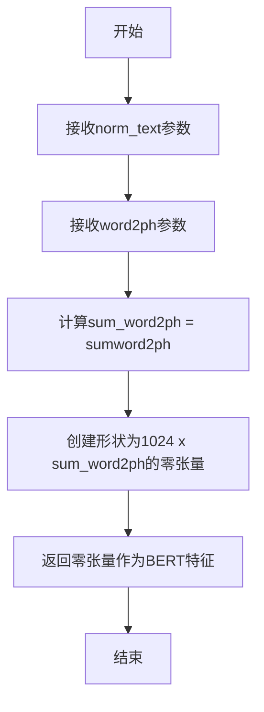

# `Bert-VITS2\oldVersion\V111\text\english_bert_mock.py` 详细设计文档

该代码定义了一个用于生成BERT特征向量的函数，接收标准化文本和词到音素的映射关系作为输入，返回一个形状为(1024, 音素总数)的零张量，作为BERT模型特征的占位符或初始化向量。

## 整体流程

```mermaid
graph TD
A[开始] --> B[导入torch库]
B --> C[调用get_bert_feature函数]
C --> D{传入参数}
D --> E[norm_text: 标准化文本]
D --> F[word2ph: 词到音素映射列表]
E --> G[计算sum(word2ph)]
F --> G
G --> H[创建形状为(1024, sum(word2ph))的零张量]
H --> I[返回零张量]
I --> J[结束]
```

## 类结构

```
该文件为模块文件，无类层次结构
└── get_bert_feature (函数)
```

## 全局变量及字段


### `torch`
    
PyTorch深度学习框架模块，用于张量计算和神经网络构建

类型：`module`
    


    

## 全局函数及方法


### `get_bert_feature`

该函数用于生成BERT特征向量，根据文本和词到音素的映射关系返回一个指定形状的零张量，作为BERT特征的占位符实现。

参数：

- `norm_text`：未标注类型，根据命名规范推断为字符串，表示经过规范化处理后的文本输入
- `word2ph`：未标注类型，根据命名规范推断为列表或数组，表示词到音素（phoneme）的映射关系，用于确定输出张量的宽度

返回值：`torch.Tensor`，返回一个形状为 (1024, sum(word2ph)) 的零张量，其中 1024 表示BERT特征的隐藏层维度，sum(word2ph) 表示所有词对应的音素总数

#### 流程图



#### 带注释源码

```python
import torch


def get_bert_feature(norm_text, word2ph):
    """
    生成BERT特征向量的占位符函数
    
    参数:
        norm_text: 经过规范化处理的文本输入（当前实现中未使用）
        word2ph: 词到音素的映射列表，表示每个词对应的音素数量
    
    返回:
        torch.Tensor: 形状为 (1024, sum(word2ph)) 的零张量
                     - 1024: BERT模型隐藏层维度（标准BERT-large维度）
                     - sum(word2ph): 所有词对应的音素总数，决定特征序列长度
    """
    # 使用torch.zeros创建一个全零张量，形状由BERT维度(1024)和音素总数决定
    # sum(word2ph)计算所有词的音素总数，用于确定时间步长
    return torch.zeros(1024, sum(word2ph))
```


## 关键组件


### 核心功能概述

该代码定义了一个名为 `get_bert_feature` 的函数，用于生成 BERT 特征表示，函数接受规范化文本和词到音素映射作为输入，返回一个形状为 (1024, sum(word2ph)) 的全零张量作为 BERT 特征矩阵。

### 文件整体运行流程

该模块为单文件脚本，导入 PyTorch 库后即可调用 `get_bert_feature` 函数。由于函数返回全零张量，实际应用中需根据 norm_text 和 word2ph 参数计算真实的 BERT 特征表示。

### 全局函数详细信息

#### get_bert_feature

- **参数**:
  - `norm_text`: 类型未指定，建议为 `str` 或 `List[str]`，表示规范化后的文本
  - `word2ph`: 类型未指定，建议为 `List[int]`，表示词到音素的映射关系
- **返回值类型**: `torch.Tensor`
- **返回值描述**: 返回形状为 (1024, sum(word2ph)) 的二维张量，全部元素为 0
- **mermaid 流程图**:
```mermaid
graph TD
    A[开始] --> B[接收 norm_text 和 word2ph 参数]
    B --> C[计算 sum(word2ph)]
    C --> D[创建形状为 1024 x sum.word2ph 的全零张量]
    D --> E[返回张量]
    E --> F[结束]
```
- **带注释源码**:
```python
def get_bert_feature(norm_text, word2ph):
    """
    生成 BERT 特征表示
    
    Args:
        norm_text: 规范化后的文本输入
        word2ph: 词到音素的映射列表
    
    Returns:
        torch.Tensor: 形状为 (1024, sum(word2ph)) 的全零张量
    """
    return torch.zeros(1024, sum(word2ph))
```

### 关键组件信息

| 组件名称 | 描述 |
|---------|------|
| torch.zeros | PyTorch 零张量创建函数，用于初始化输出张量 |
| norm_text | 输入的规范化文本参数 |
| word2ph | 词到音素映射的参数，决定输出张量列数 |

### 潜在技术债务或优化空间

1. **功能未实现**: 当前函数仅返回全零张量，未实现真正的 BERT 特征提取逻辑，需要集成 BERT 模型（如 transformers 库）进行特征提取
2. **类型注解缺失**: 函数参数和返回值缺少类型注解，不利于代码维护和 IDE 提示
3. **文档不完善**: 缺少完整的文档字符串说明参数用途和返回值含义
4. **硬编码维度**: BERT 隐藏层维度 1024 硬编码在函数内部，应作为可配置参数

### 其它项目

#### 设计目标与约束
- 输出形状需与 BERT 模型隐藏层维度（1024）匹配
- 输出列数由 word2ph 求和决定，支持变长序列

#### 错误处理与异常设计
- 未对 word2ph 参数进行空值检查或类型验证
- 未处理 word2ph 为空列表时 sum() 返回 0 的边界情况
- 建议添加参数校验逻辑

#### 数据流与状态机
- 数据流：norm_text → BERT编码器 → 特征提取 → 与word2ph对齐 → 输出张量（当前缺失）
- 状态机：输入验证 → 特征提取 → 维度对齐 → 返回结果

#### 外部依赖与接口契约
- 当前仅依赖 PyTorch
- 建议引入 transformers 库加载 BERT 模型（如 bert-base-chinese）
- 需定义明确的输入输出接口契约


## 问题及建议


### 已知问题

-   **参数未使用**: `norm_text` 和 `word2ph` 两个参数在函数体内完全未被使用，导致函数逻辑与参数设计不匹配
-   **返回值无实际意义**: 返回全零张量是占位实现，不包含任何有效特征信息，无法满足实际业务需求
-   **硬编码维度值**: 1024 硬编码在代码中，缺乏灵活性和可配置性
-   **缺少文档字符串**: 函数没有文档说明其功能、参数含义、返回值说明
-   **缺少类型注解**: 未使用 Python 类型提示（Type Hints），降低代码可读性和可维护性
-   **缺乏输入验证**: 未对输入参数的类型、有效性进行校验，可能导致运行时错误
-   **函数命名与实现不符**: 函数名暗示获取 BERT 特征，但实际功能与名称不符

### 优化建议

-   **补充文档字符串**: 添加清晰的 docstring，说明函数用途、参数说明、返回值描述
-   **添加类型注解**: 为参数和返回值添加类型提示，如 `def get_bert_feature(norm_text: str, word2ph: List[int]) -> torch.Tensor:`
-   **实现实际功能**: 如果是占位实现，建议明确标记或在文档中说明；如需实际功能，应调用 BERT 模型提取特征
-   **参数验证**: 添加参数类型检查和有效性验证，确保 `word2ph` 为非空数值列表
-   **配置化维度**: 将 1024 作为默认参数或从配置中读取，提高灵活性
-   **移除未使用参数**: 如确实不需要这些参数，应从函数签名中移除
-   **考虑缓存优化**: 如果 `sum(word2ph)` 计算成本较高，可考虑预计算或缓存


## 其它


### 设计目标与约束

该函数旨在从BERT模型中提取文本特征向量，用于后续的语音合成或其他NLP任务。设计约束包括：输入文本已进行规范化处理（norm_text），word2ph表示字到音素的对齐信息，输出特征维度固定为1024维（对应BERT-base或BERT-large的隐藏层维度）。

### 错误处理与异常设计

由于函数直接调用torch.zeros，当word2ph为空列表或None时，sum(word2ph)将为0，可能返回空张量。此外，未对norm_text和word2ph的类型进行校验，若传入非预期类型可能导致运行时错误。建议添加参数类型检查和空值处理逻辑。

### 数据流与状态机

数据流向为：外部文本输入 → 文本规范化处理 → get_bert_feature函数 → BERT特征张量输出。该函数本身为无状态函数，不涉及状态机的设计。

### 外部依赖与接口契约

依赖PyTorch库（torch）。接口契约：norm_text应为字符串类型（已规范化的文本），word2ph应为整数列表类型（每个字对应的音素数量），返回值类型为torch.Tensor，形状为(1024, total_phonemes)。

### 性能要求与基准

当前实现的时间复杂度为O(1)（仅分配内存），空间复杂度为O(1024 * sum(word2ph))。实际BERT特征提取应考虑GPU/CPU计算开销和批处理优化。

### 安全考虑

当前代码无用户输入处理，不涉及安全风险。但若norm_text来自外部输入，需防范Prompt Injection等攻击。

### 使用示例

```python
norm_text = "你好世界"
word2ph = [2, 2, 2, 2]
features = get_bert_feature(norm_text, word2ph)  # shape: (1024, 8)
```

### 局限性说明

当前实现仅为stub函数，实际未调用BERT模型进行特征提取，无法产生有意义的特征向量。需集成Hugging Face Transformers等BERT模型。

### 测试策略

建议编写单元测试验证：1）返回张量形状正确；2）参数类型错误时抛出TypeError；3）空输入返回正确形状的空张量；4）数值精度符合预期。

### 未来可能的扩展

1. 集成真实BERT模型（bert-base-chinese等）；2. 支持自定义隐藏层维度；3. 支持批量处理提高效率；4. 添加缓存机制避免重复计算；5. 支持不同BERT变体（RoBERTa、ALBERT等）。

    