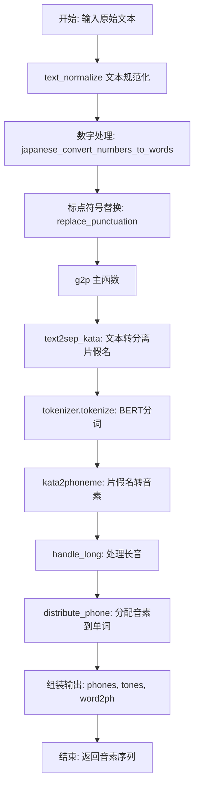
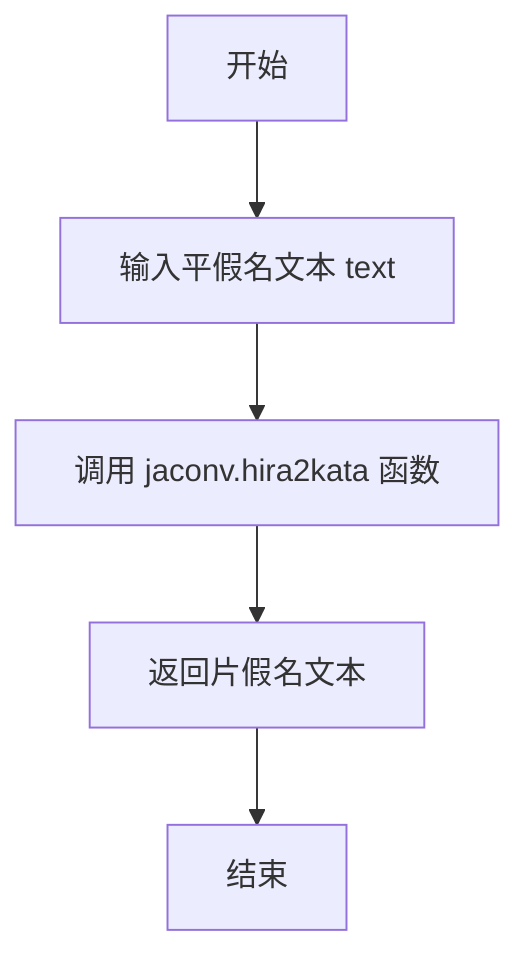
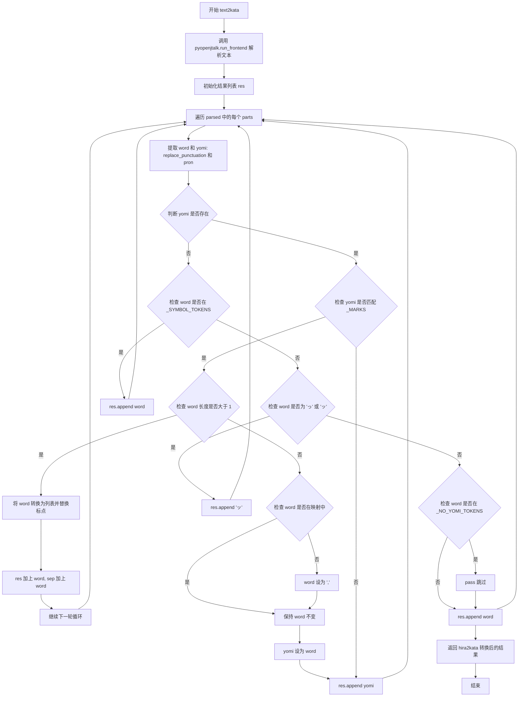
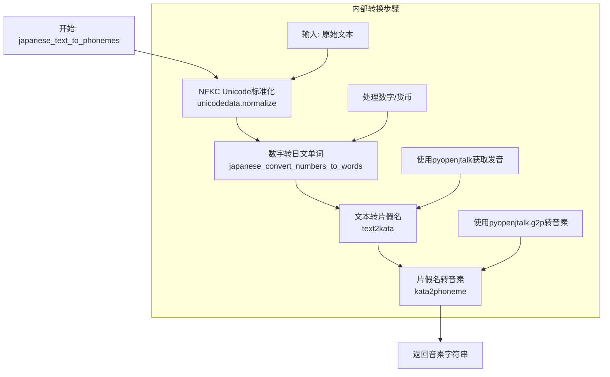
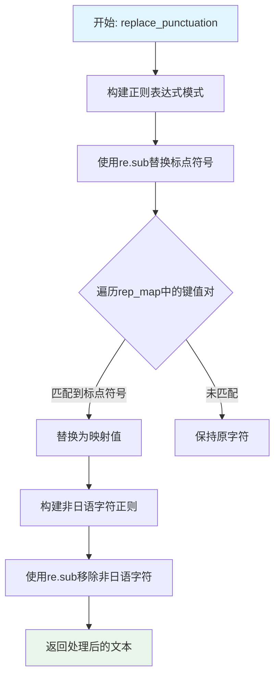
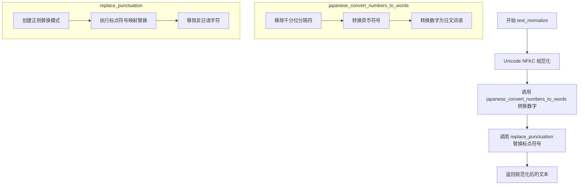
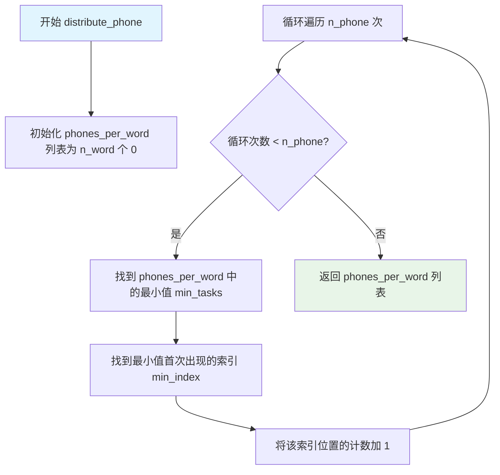
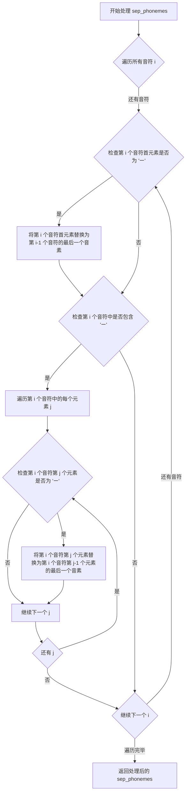
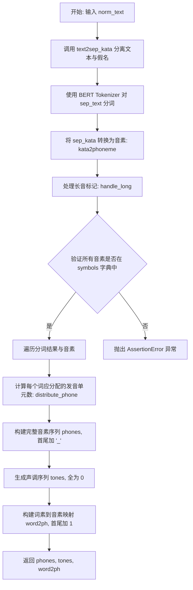

# `Bert-VITS2\oldVersion\V111\text\fix\japanese.py` 详细设计文档

该代码是一个日语文本转音素（Text-to-Phoneme）转换工具，通过整合pyopenjtalk、jaconv等日语处理库，将日语文本规范化后转换为音素序列，支持数字、标点符号处理，最终输出与Julius语音识别工具兼容的音素数据，用于语音合成任务。

## 整体流程



## 类结构

```
该文件无类定义，采用函数式编程范式
所有功能通过模块级函数实现
无继承或派生类结构
```

## 全局变量及字段


### `_SYMBOL_TOKENS`
    
日文标点符号集合，包含・、。？！等用于标识符号词的标记

类型：`set[str]`
    


### `_NO_YOMI_TOKENS`
    
无读音日文符号集合，包含「」『』―（）［］[]等引号和括号符号

类型：`set[str]`
    


### `_MARKS`
    
正则表达式模式，用于匹配日文字符、平假名、片假名、汉字及字母数字

类型：`re.Pattern`
    


### `_ALPHASYMBOL_YOMI`
    
字母符号到日文读音的映射字典，用于将英文字母和希腊字母转换为日文发音

类型：`dict[str, str]`
    


### `_NUMBER_WITH_SEPARATOR_RX`
    
正则表达式模式，用于匹配带逗号的数字如1,000

类型：`re.Pattern`
    


### `_CURRENCY_MAP`
    
货币符号到日文单位的映射字典，包含美元、日元、英镑、欧元

类型：`dict[str, str]`
    


### `_CURRENCY_RX`
    
正则表达式模式，用于匹配货币符号紧跟数字的格式如$100

类型：`re.Pattern`
    


### `_NUMBER_RX`
    
正则表达式模式，用于匹配整数或小数格式的数字

类型：`re.Pattern`
    


### `rep_map`
    
标点符号替换映射字典，将各种日文和中文字符转换为英文标点

类型：`dict[str, str]`
    


### `tokenizer`
    
预训练的日语BERT分词器实例，用于文本分词处理

类型：`transformers.AutoTokenizer`
    


    

## 全局函数及方法


### `kata2phoneme`

将片假名文本转换为音素序列。该函数处理片假名中的特殊字符（如长音符号"ー"）和标点符号，并使用 pyopenjtalk 库进行音素转换。

参数：

- `text`：`str`，输入的片假名文本字符串

返回值：`list`，音素字符串列表

#### 流程图

```mermaid
flowchart TD
    A[开始: kata2phoneme] --> B[text = text.strip]
    B --> C{text == "ー"?}
    C -->|是| D[返回 ["ー"]]
    C -->|否| E{text.startswith("ー")?}
    E -->|是| F[返回 ["ー"] + kata2phoneme(text[1:])]
    E -->|否| G[初始化 res = [], prev = None]
    G --> H{while text 非空}
    H --> I{re.match(_MARKS, text)?}
    I -->|是| J[res.append(text[0])<br/>text = text[1:]<br/>continue]
    I -->|否| K{text.startswith("ー")?}
    K -->|是| L{prev is not None?}
    L -->|是| M[res.append(prev[-1])<br/>text = text[1:]]
    L -->|否| M
    K -->|否| N[res += pyopenjtalk.g2p<br/>.lower().replace<br/>.split<br/>break]
    M --> H
    N --> O[返回 res]
    J --> H
```

#### 带注释源码

```python
def kata2phoneme(text: str) -> str:
    """将片假名文本转换为音素。
    
    处理流程:
    1. 去除首尾空白
    2. 处理特殊字符"ー"(长音符号)
    3. 处理标点符号和特殊符号
    4. 使用 pyopenjtalk.g2p 进行音素转换
    
    Args:
        text: 片假名文本字符串
        
    Returns:
        音素字符串列表
    """
    # 去除首尾空白
    text = text.strip()
    
    # 特殊处理：仅包含长音符号"ー"的情况
    if text == "ー":
        return ["ー"]
    # 递归处理以"ー"开头的情况
    elif text.startswith("ー"):
        return ["ー"] + kata2phoneme(text[1:])
    
    # 初始化结果列表和前一个音素记录
    res = []
    prev = None
    
    # 遍历处理每个字符
    while text:
        # 检查是否为标点符号或特殊符号（通过正则匹配）
        if re.match(_MARKS, text):
            res.append(text)  # 直接保留符号
            text = text[1:]   # 移至下一个字符
            continue
        
        # 处理长音符号"ー"（重复前一个音素）
        if text.startswith("ー"):
            if prev:
                # 重复前一个音素的最后一个音素
                res.append(prev[-1])
            text = text[1:]   # 继续处理后续字符
            continue
        
        # 使用 pyopenjtalk 进行音素转换
        # .lower() 转换为小写
        # .replace("cl", "q") 将 cl 替换为 q（闭塞音）
        # .split(" ") 按空格分割为音素列表
        res += pyopenjtalk.g2p(text).lower().replace("cl", "q").split(" ")
        break  # 转换完成后退出循环
    
    # 返回音素列表
    return res
```


### `hira2kata`

该函数用于将日文平假名文本转换为片假名文本，是日文文本处理流程中的基础转换工具。

参数：

- `text`：`str`，输入的平假名文本字符串

返回值：`str`，转换后的片假名文本字符串

#### 流程图



#### 带注释源码

```python
def hira2kata(text: str) -> str:
    """
    将平假名转换为片假名
    
    参数:
        text: 输入的平假名字符串
        
    返回:
        转换后的片假名字符串
    """
    # 调用 jaconv 库的 hira2kata 方法进行转换
    # jaconv 是一个高效的日文转换库，支持平假名、片假名、罗马字等多种格式的相互转换
    return jaconv.hira2kata(text)
```


### `text2kata`

该函数是日语文本处理的核心模块，负责将输入的日语文本转换为片假名表示。它使用 pyopenjtalk 进行文本分词和发音解析，然后通过标点符号映射、假名转换等步骤，最终输出符合 Julius 语音识别工具要求的片假名文本格式。

参数：

- `text`：`str`，输入的日语文本字符串

返回值：`str`，转换后的片假名文本字符串

#### 流程图



#### 带注释源码

```python
def text2kata(text: str) -> str:
    """将日语文本转换为片假名表示
    
    该函数使用 pyopenjtalk 进行文本解析，然后通过标点符号替换、
    假名转换等步骤，输出符合 Julius 语音识别工具要求的片假名文本。
    
    Args:
        text: 输入的日语文本字符串
        
    Returns:
        转换后的片假名文本字符串
    """
    # 使用 pyopenjtalk 的 run_frontend 进行文本分词和发音解析
    # 返回结构化数据，包含每个词的原形(orig)和发音(pron)
    parsed = pyopenjtalk.run_frontend(text)

    # 存储转换后的结果
    res = []
    # 注意：此处代码存在 bug - sep 变量未定义但在循环中被使用
    # sep += word  # 这行代码会导致 NameError: name 'sep' is not defined
    
    # 遍历解析结果中的每个词
    for parts in parsed:
        # 提取原始词并进行标点符号替换
        # parts["orig"] 是原始文本，parts["pron"] 是发音表示
        word, yomi = replace_punctuation(parts["orig"]), parts["pron"].replace("'", "")
        
        # 如果存在发音（yomi）
        if yomi:
            # 检查发音是否符合日语字符规则（排除特殊符号）
            if re.match(_MARKS, yomi):
                # 如果原始词是多字符的
                if len(word) > 1:
                    # 将每个字符分别进行标点符号替换
                    word = [replace_punctuation(i) for i in list(word)]
                    # 发音使用处理后的词
                    yomi = word
                    # 累加到结果列表（这里存在 bug：sep 未定义）
                    res += yomi
                    sep += word  # Bug: sep 变量未定义！
                    continue
                # 如果词不在映射表中且不在映射值中，则替换为逗号
                elif word not in rep_map.keys() and word not in rep_map.values():
                    word = ","
                # 使用处理后的词作为发音
                yomi = word
            # 将处理后的发音添加到结果
            res.append(yomi)
        else:
            # 没有发音（yomi）时的处理
            
            # 符号直接添加
            if word in _SYMBOL_TOKENS:
                res.append(word)
            # 促音 'っ' 或 'ッ' 处理
            elif word in ("っ", "ッ"):
                res.append("ッ")
            # 无发音标记的符号跳过
            elif word in _NO_YOMI_TOKENS:
                pass
            # 其他情况直接添加原词
            else:
                res.append(word)
    
    # 将平假名转换为片假名，并连接成字符串返回
    return hira2kata("".join(res))
```


### `text2sep_kata`

该函数是日语文本处理流程中的核心组件，负责将输入的日语文本进行分词和发音转换。它使用 pyopenjtalk 进行文本解析，提取每个词汇的原始形式和假名发音，然后通过替换标点符号、处理特殊标记等操作，最终返回两个列表：原始分离词汇列表和转换后的片假名发音列表。

参数：

-  `text`：`str`，输入的日语文本字符串

返回值：`tuple[list, list]`，返回一个元组，包含两个列表——第一个是分离后的原始词汇列表（sep），第二个是转换后的片假名发音列表（hira2kata转换后的res）

#### 流程图

```mermaid
flowchart TD
    A[开始: text2sep_kata] --> B[调用 pyopenjtalk.run_frontend 解析文本]
    B --> C[初始化空列表 res 和 sep]
    C --> D{遍历 parsed 中的每个 parts}
    
    D --> E[提取 word 和 yomi]
    E --> F{判断 yomi 是否存在}
    
    F -->|是| G{检查 yomi 是否匹配 _MARKS}
    G -->|是| H{判断 word 长度是否 > 1}
    H -->|是| I[将 word 转换为列表并替换标点]
    I --> J[res 和 sep 都添加转换后的 word]
    J --> D
    H -->|否| K{判断 word 是否在 rep_map 中}
    K -->|否| L[将 word 替换为 ',']
    K -->|是| M[yomi = word]
    L --> N[res.append yomi]
    M --> N
    N --> D
    
    G -->|否| O[res.append yomi]
    O --> D
    
    F -->|否| P{判断 word 是否在 _SYMBOL_TOKENS}
    P -->|是| Q[res.append word]
    Q --> D
    P -->|否| R{判断 word 是否为 'っ' 或 'ッ'}
    R -->|是| S[res.append 'ッ']
    S --> D
    R -->|否| T{判断 word 是否在 _NO_YOMI_TOKENS}
    T -->|是| U[pass 不做任何处理]
    U --> D
    T -->|否| V[res.append word]
    V --> W[sep.append word]
    W --> D
    
    D -->|遍历完成| X[返回 (sep, hira2kata转换后的 res)]
    X --> Y[结束]
```

#### 带注释源码

```python
def text2sep_kata(text: str) -> (list, list):
    """
    将日语文本转换为分离的词汇和片假名发音列表。
    
    处理流程：
    1. 使用 pyopenjtalk 进行文本解析，提取每个词汇的原始形式和假名发音
    2. 遍历每个词汇，根据发音情况分类处理
    3. 对有发音的词汇进行标点替换和特殊字符处理
    4. 对无发音的词汇根据符号类型进行处理
    5. 返回原始词汇列表和片假名发音列表
    
    参数:
        text: 输入的日语文本字符串
    
    返回:
        元组 (sep, kata_list): 
            - sep: 分离后的原始词汇列表
            - kata_list: 转换后的片假名发音列表
    """
    # 使用 pyopenjtalk 解析文本，返回包含词汇信息的列表
    # 每个元素包含 'orig'（原始词）和 'pron'（假名发音）
    parsed = pyopenjtalk.run_frontend(text)

    # res: 存储处理后的假名发音（最终转换为片假名）
    # sep: 存储分离后的原始词汇
    res = []
    sep = []
    
    # 遍历解析后的每个词汇单元
    for parts in parsed:
        # 提取原始词汇，并替换标点符号
        # 提取假名发音，去除单引号
        word, yomi = replace_punctuation(parts["orig"]), parts["pron"].replace("'", "")
        
        # 如果存在假名发音
        if yomi:
            # 检查发音是否匹配特殊标记（非假名/汉字/数字等字符）
            if re.match(_MARKS, yomi):
                # 如果原始词汇长度大于1
                if len(word) > 1:
                    # 将词汇拆分为单个字符，并替换每个字符的标点
                    word = [replace_punctuation(i) for i in list(word)]
                    # 假名使用拆分后的词汇
                    yomi = word
                    # 添加到结果列表
                    res += yomi
                    sep += word
                    continue  # 跳过本次循环，继续处理下一个词汇
                # 如果词汇不在替换映射表中
                elif word not in rep_map.keys() and word not in rep_map.values():
                    # 替换为逗号
                    word = ","
                # 假名使用原始词汇
                yomi = word
            # 添加处理后的假名到结果列表
            res.append(yomi)
        else:
            # 没有假名发音时的处理
            
            # 检查是否为符号标记（如 、。？！）
            if word in _SYMBOL_TOKENS:
                res.append(word)
            # 检查是否为促音（っ、ッ）
            elif word in ("っ", "ッ"):
                res.append("ッ")
            # 检查是否为无发音标记（如「」『』等）
            elif word in _NO_YOMI_TOKENS:
                pass  # 跳过，不添加任何内容
            else:
                # 其他情况，添加原始词汇
                res.append(word)
        
        # 将原始词汇添加到分离词汇列表
        sep.append(word)
    
    # 返回分离词汇列表和转换后的片假名发音列表
    # 使用 hira2kata 将平假名转换为片假名
    return sep, [hira2kata(i) for i in res]
```


### `japanese_convert_numbers_to_words`

该函数主要用于将日语文本中的数字（包括带分隔符的数字和货币符号）转换为对应的日文单词形式，通过正则表达式匹配不同格式的数字并调用`num2words`库进行转换。

参数：

- `text`：`str`，需要进行数字转换的日语文本

返回值：`str`，转换后的文本，其中数字已被替换为日文单词形式

#### 流程图

```mermaid
flowchart TD
    A[开始: 接收输入文本] --> B[匹配带分隔符的数字<br/>正则: _NUMBER_WITH_SEPARATOR_RX]
    B --> C{找到匹配?}
    C -->|是| D[移除千位分隔符<br/>lambda m: m[0].replace(',', '')]
    C -->|否| E[保持原样]
    D --> F[匹配货币符号+数字<br/>正则: _CURRENCY_RX]
    E --> F
    F --> G{找到货币匹配?}
    G -->|是| H[替换为日文货币单位<br/>m[2] + _CURRENCY_MAP.get(m[1], m[1])]
    G -->|否| I[匹配普通数字<br/>正则: _NUMBER_RX]
    H --> I
    I --> J{找到数字匹配?}
    J -->|是| K[调用num2words转换为日文<br/>num2words(m[0], lang='ja')]
    J -->|否| L[返回结果文本]
    K --> L
    L --> M[结束: 返回转换后的文本]
```

#### 带注释源码

```python
def japanese_convert_numbers_to_words(text: str) -> str:
    """
    将日语文本中的数字转换为日文单词形式
    
    处理流程：
    1. 首先移除数字中的千位分隔符（如1,000 -> 1000）
    2. 然后处理货币符号（如$100 -> 100ドル）
    3. 最后将剩余数字转换为日文单词
    
    参数:
        text: str - 输入的日语文本，可能包含数字、货币符号等
        
    返回:
        str - 转换后的文本，数字已被替换为日文表示
    """
    
    # 步骤1: 处理带分隔符的数字（如1,000, 100,000等）
    # 使用正则表达式匹配连续3位数字+逗号的模式
    # lambda函数将匹配到的千位分隔符逗号移除
    res = _NUMBER_WITH_SEPARATOR_RX.sub(lambda m: m[0].replace(",", ""), text)
    
    # 步骤2: 处理货币符号（$、¥、£、€等）
    # 匹配模式: 货币符号 + 数字(含小数点)
    # 将货币符号替换为日文单位（美元→ドル，日元→円，英镑→ポンド，欧元→ユーロ）
    res = _CURRENCY_RX.sub(lambda m: m[2] + _CURRENCY_MAP.get(m[1], m[1]), res)
    
    # 步骤3: 处理剩余的普通数字
    # 匹配整数或小数形式的数字
    # 使用num2words库的日语模式进行转换
    # 例如: 123 → 百二十三
    res = _NUMBER_RX.sub(lambda m: num2words(m[0], lang="ja"), res)
    
    # 返回最终转换后的文本
    return res
```


### `japanese_convert_alpha_symbols_to_words`

将包含字母、符号和希腊字母的文本转换为对应的日语音读（汉字假名表示）。该函数通过查表方式将英文字母、数字及希腊字母转换为相应的日语发音，用于文本到语音合成前的预处理。

参数：

- `text`：`str`，需要转换的输入文本，包含英文字母、数字、符号或希腊字母等字符

返回值：`str`，转换后的字符串，其中所有可识别的字符都被替换为其日语音读形式，不可识别的字符保持原样

#### 流程图

```mermaid
flowchart TD
    A[开始: 输入 text 字符串] --> B[将 text 转换为小写]
    B --> C[遍历 text 中的每个字符 ch]
    C --> D{字典 _ALPHASYMBOL_YOMI 中是否存在 ch}
    D -->|是| E[获取 _ALPHASYMBOL_YOMI[ch] 的值]
    D -->|否| F[使用原字符 ch]
    E --> G[将结果字符添加到结果列表]
    F --> G
    G --> H{是否还有未处理的字符}
    H -->|是| C
    H -->|否| I[将结果列表连接成字符串]
    I --> J[返回转换后的字符串]
```

#### 带注释源码

```python
def japanese_convert_alpha_symbols_to_words(text: str) -> str:
    """
    将文本中的字母、符号和希腊字母转换为对应的日语音读。
    
    参数:
        text (str): 需要转换的输入文本，包含英文字母、数字、符号或希腊字母等字符
        
    返回:
        str: 转换后的字符串，其中所有可识别的字符都被替换为其日语音读形式，
             不可识别的字符保持原样返回
    """
    # 步骤1: 将输入文本转换为小写，确保匹配字典中的小写字母键
    # 步骤2: 遍历文本中的每个字符，使用字典查找转换
    #       - 如果字符在字典中，返回对应的日语音读（如 'a' -> 'エー'）
    #       - 如果字符不在字典中，保留原字符不变
    # 步骤3: 将转换后的所有字符连接成字符串并返回
    return "".join([_ALPHASYMBOL_YOMI.get(ch, ch) for ch in text.lower()])
```


### `japanese_text_to_phonemes`

该函数是日语语音合成管道中的核心转换函数，负责将原始日语文本转换为音素序列。它首先对文本进行Unicode标准化，然后依次进行数字转换、片假名转换，最终输出与Julius语音识别工具兼容的音素表示。

参数：

-  `text`：`str`，输入的原始日语文本

返回值：`str`，转换后的日语音素序列

#### 流程图



#### 带注释源码

```python
def japanese_text_to_phonemes(text: str) -> str:
    """Convert Japanese text to phonemes.
    
    此函数是日语文本转音素流程的入口点，执行以下转换步骤:
    1. Unicode NFKC标准化 - 统一字符表示形式
    2. 数字转日文单词 - 将阿拉伯数字转换为日语文本
    3. 文本转片假名 - 使用pyopenjtalk获取假名表示
    4. 片假名转音素 - 转换为音素序列
    
    Args:
        text: 输入的日语原始文本字符串
        
    Returns:
        转换后的日语音素字符串，兼容Julius语音识别工具
    """
    # 步骤1: Unicode NFKC标准化
    # 统一不同形式的字符表示(如全角/半角转换、组合字符分解等)
    res = unicodedata.normalize("NFKC", text)
    
    # 步骤2: 将阿拉伯数字和货币符号转换为日文单词
    # 例如: "100" -> "百", "$50" -> "50ドル"
    res = japanese_convert_numbers_to_words(res)
    
    # 注意: 字母符号转日文功能已被注释掉
    # res = japanese_convert_alpha_symbols_to_words(res)
    
    # 步骤3: 将标准化后的文本转换为片假名
    # 使用pyopenjtalk的run_frontend获取词性分析和假名读音
    res = text2kata(res)
    
    # 步骤4: 将片假名转换为音素序列
    # 使用pyopenjtalk的g2p进行图素到音素的转换
    # 结果进行小写化并将"cl"替换为"q"
    res = kata2phoneme(res)
    
    # 返回最终的音素字符串结果
    return res
```

#### 依赖函数信息

| 函数名 | 描述 |
|--------|------|
| `japanese_convert_numbers_to_words` | 将文本中的数字和货币符号转换为日文单词 |
| `text2kata` | 使用pyopenjtalk将文本转换为片假名表示 |
| `kata2phoneme` | 将片假名文本转换为音素列表 |

#### 关键实现细节

1. **Unicode标准化**: 使用NFKC形式确保字符一致性，这对多音字处理很重要
2. **数字处理**: 内部使用`num2words`库进行数字到日文的转换，支持千分位分隔符和多种货币符号
3. **音素转换**: 最终通过`pyopenjtalk.g2p`生成音素，并做小写化和"cl"→"q"的映射处理


### `is_japanese_character`

该函数用于检测给定字符是否为日语字符（日语平假名、片假名或汉字），通过检查字符的Unicode编码是否落在预定义的日语文字Unicode范围内来判断。

参数：

- `char`：`str`，要检测的字符（单字符字符串）

返回值：`bool`，如果字符属于日语文字系统（平假名、片假名、汉字等）则返回`True`，否则返回`False`

#### 流程图

```mermaid
flowchart TD
    A[开始: 输入字符 char] --> B[获取字符的Unicode码点: char_code = ord(char)]
    B --> C{遍历 japanese_ranges 列表}
    C -->|当前范围| D{char_code 在 [start, end] 范围内?}
    D -->|是| E[返回 True]
    D -->|否| C
    C -->|遍历完毕| F[返回 False]
    E --> G[结束]
    F --> G
```

#### 带注释源码

```python
def is_japanese_character(char):
    """检测输入字符是否为日语字符（平假名、片假名、汉字等）
    
    参数:
        char: 单个字符字符串
        
    返回:
        bool: 如果是日语字符返回True，否则返回False
    """
    # 定义日语文字系统的 Unicode 范围
    japanese_ranges = [
        (0x3040, 0x309F),  # 平假名 (Hiragana)
        (0x30A0, 0x30FF),  # 片假名 (Katakana)
        (0x4E00, 0x9FFF),  # 汉字 (CJK Unified Ideographs)
        (0x3400, 0x4DBF),  # 汉字扩展 A (CJK Unified Ideographs Extension A)
        (0x20000, 0x2A6DF),  # 汉字扩展 B (CJK Unified Ideographs Extension B)
        # 可以根据需要添加其他汉字扩展范围
    ]

    # 将字符的 Unicode 编码转换为整数
    char_code = ord(char)

    # 检查字符是否在任何一个日语范围内
    for start, end in japanese_ranges:
        if start <= char_code <= end:
            return True

    return False
```


### `replace_punctuation`

该函数用于将日语文本中的标点符号替换为对应的映射符号，并移除所有非日语字符（保留平假名、片假名、汉字等）。

参数：

- `text`：`str`，需要进行标点符号替换的日语文本

返回值：`str`，替换标点符号并清理非日语字符后的文本

#### 流程图



#### 带注释源码

```
def replace_punctuation(text):
    # 第一步：构建正则表达式模式
    # 将rep_map字典中的所有键（标点符号）用|连接起来，生成一个匹配任意标点符号的正则表达式
    # re.escape用于转义特殊字符，确保特殊字符被正确匹配
    pattern = re.compile("|".join(re.escape(p) for p in rep_map.keys()))

    # 第二步：替换标点符号
    # 使用pattern.sub()方法替换文本中所有匹配的标点符号
    # 替换函数lambda x: rep_map[x.group()]根据匹配的字符查找对应的替换值
    replaced_text = pattern.sub(lambda x: rep_map[x.group()], text)

    # 第三步：移除非日语字符
    # 构建一个正则表达式，用于匹配所有非日语字符的字符
    # \u3040-\u309F: 平假名范围
    # \u30A0-\u30FF: 片假名范围
    # \u4E00-\u9FFF: 汉字（CJK统一表意字符）范围
    # \u3400-\u4DBF: 汉字扩展A范围
    # punctuation: 从punctuation模块导入的额外需要保留的字符
    # ^表示取反，即匹配所有不在上述范围内的字符
    replaced_text = re.sub(
        r"[^\u3040-\u309F\u30A0-\u30FF\u4E00-\u9FFF\u3400-\u4DBF"
        + "".join(punctuation)
        + r"]+",
        "",
        replaced_text,
    )

    # 返回处理后的文本
    return replaced_text
```


### `text_normalize`

该函数是日语文本规范化的核心入口函数，负责将输入的日语文本进行 Unicode 规范化、数字转日文词语、标点符号替换等处理，使其适合后续的语音合成处理。

参数：

- `text`：`str`，待规范化的原始日语文本输入

返回值：`str`，规范化处理后的日语文本字符串

#### 流程图



#### 带注释源码

```python
def text_normalize(text: str) -> str:
    """对日语文本进行规范化处理，包括 Unicode 归一化、数字转词和标点符号替换。
    
    处理流程：
    1. 使用 NFKC 规范化统一字符表示
    2. 将阿拉伯数字转换为日文词语
    3. 将各种标点符号统一映射为标准符号
    
    Args:
        text: 输入的原始日语文本字符串
        
    Returns:
        规范化处理后的文本字符串
    """
    # Step 1: Unicode NFKC 规范化
    # 将文本统一为 NFKC 标准化形式，处理全角半角字符、统一 IDEOGRAPHIC 变体等
    res = unicodedata.normalize("NFKC", text)
    
    # Step 2: 数字转日文词语转换
    # 将阿拉伯数字（如 123）、带千分位的数字（如 1,234）、
    # 货币符号（如 $100, ¥1000）转换为对应的日文读法
    res = japanese_convert_numbers_to_words(res)
    
    # 备选方案：可以启用日语字符过滤，移除非日语字符（当前已注释）
    # res = "".join([i for i in res if is_japanese_character(i)])
    
    # Step 3: 标点符号替换
    # 将各类全角/半角标点符号、中文标点符号统一映射为英文标点符号
    # 例如：'。' -> '.', '，' -> ',', '！' -> '!'
    res = replace_punctuation(res)
    
    # 返回最终规范化后的文本
    return res
```


### `distribute_phone`

该函数实现了一种负载均衡算法，用于将指定数量的音素（phones）均匀分配到指定数量的单词（words）中，确保每个单词获得的音素数量尽可能相等。

参数：

- `n_phone`：`int`，要分配的音素总数
- `n_word`：`int`，目标单词数量，即需要将音素分配到的单词个数

返回值：`list[int]`，返回一个整数列表，长度为 n_word，列表中每个元素表示对应单词分配的音素数量

#### 流程图



#### 带注释源码

```python
def distribute_phone(n_phone, n_word):
    """
    将 n_phone 个音素均匀分配到 n_word 个单词中。
    
    使用负载均衡算法：每次将下一个音素分配给当前拥有最少音素的单词，
    从而实现音素在单词间的均匀分布。
    
    参数:
        n_phone (int): 要分配的音素总数
        n_word (int): 目标单词数量
    
    返回:
        list[int]: 每个单词分配的音素数量列表，长度为 n_word
    """
    # 初始化一个长度为 n_word 的列表，所有元素为 0
    # 用于记录每个单词当前已分配的音素数量
    phones_per_word = [0] * n_word
    
    # 遍历每个需要分配的音素
    for task in range(n_phone):
        # 找到当前所有单词中最小的音素分配数
        min_tasks = min(phones_per_word)
        
        # 找到该最小值首次出现的位置（索引）
        # 这样可以保证分配的公平性和稳定性
        min_index = phones_per_word.index(min_tasks)
        
        # 将该单词的音素计数加 1
        phones_per_word[min_index] += 1
    
    # 返回最终每个单词的音素分配结果
    return phones_per_word
```


### `handle_long`

该函数用于处理日语中的长音符号"ー"（choonpu），将其替换为实际的前一个音符的最后一个音素，以实现正确的长音发音效果。

参数：

- `sep_phonemes`：`list[list[str]]`，二维列表，每个内部列表代表一个音符（word）的音素列表，包含需要处理的"ー"长音符号

返回值：`list[list[str]]`，处理后的二维列表，其中所有的"ー"已被替换为实际的前一个音素

#### 流程图



#### 带注释源码

```python
def handle_long(sep_phonemes):
    """
    处理日语中的长音符号 'ー'，将其替换为实际的前一个音符的最后一个音素。
    
    参数:
        sep_phonemes (list[list[str]]): 二维列表，每个内部列表代表一个音符（word）
                                        的音素列表，可能包含需要处理的 'ー' 长音符号
    
    返回值:
        list[list[str]]: 处理后的二维列表，其中所有的 'ー' 已被替换为实际的前一个音素
    """
    # 遍历每一个音符（每个单词的音素列表）
    for i in range(len(sep_phonemes)):
        # 处理情况1：如果当前音符的第一个音素是 'ー'
        # 将其替换为前一个音符的最后一个音素（实现长音效果）
        if sep_phonemes[i][0] == "ー":
            sep_phonemes[i][0] = sep_phonemes[i - 1][-1]
        
        # 处理情况2：如果当前音符中任意位置包含 'ー'
        # 遍历该音符中的每个音素，将 'ー' 替换为前一个音素的最后一个音素
        if "ー" in sep_phonemes[i]:
            for j in range(len(sep_phonemes[i])):
                if sep_phonemes[i][j] == "ー":
                    # 将 'ー' 替换为前一个音素的最后一个字符
                    sep_phonemes[i][j] = sep_phonemes[i][j - 1][-1]
    
    return sep_phonemes
```


### `g2p`

该函数是文本转语音（Text-to-Speech）流程中的核心图音转换（Grapheme-to-Phoneme）模块，接收已标准化的日语文本，经过分词、假名转换、长音处理、发音单元分配等步骤，输出用于语音合成的音素序列（phones）、声调信息（tones）以及词素到音素的映射（word2ph）。

参数：

- `norm_text`：`str`，已标准化的日语文本输入，通常经过 `text_normalize` 处理

返回值：`(phones, tones, word2ph)`，`tuple` 类型，包含三个列表：
- `phones`：音素列表，首尾以 `"_"` 作为静音标记
- `tones`：声调列表，所有元素初始化为 `0`
- `word2ph`：词素到音素的映射列表，首尾元素为 `1`，用于 BERT 特征对齐

#### 流程图



#### 带注释源码

```python
def g2p(norm_text):
    """
    将标准化的日语文本转换为音素序列及相关信息
    
    参数:
        norm_text: 已标准化的日语文本字符串
        
    返回:
        tuple: (phones, tones, word2ph)
            - phones: 音素列表，首尾以 '_' 表示静音
            - tones: 声调列表，当前全为 0
            - word2ph: 词素到音素的映射，用于 BERT 特征对齐
    """
    # Step 1: 将文本分离为原文片段和对应的假名表示
    # text2sep_kata 返回两个列表：原文分词结果 和 对应的假名发音
    sep_text, sep_kata = text2sep_kata(norm_text)
    
    # Step 2: 使用日语 BERT Tokenizer 对原文片段进行子词分词
    # 结果是二维列表，每个原文片段对应若干子词 token
    sep_tokenized = [tokenizer.tokenize(i) for i in sep_text]
    
    # Step 3: 将每个假名片段转换为音素序列
    # kata2phoneme 调用 pyopenjtalk 的 g2p 功能
    sep_phonemes = handle_long([kata2phoneme(i) for i in sep_kata])
    
    # Step 4: 异常处理 - 验证音素是否在符号表中
    # 如果遇到 MeCab 不认识的生僻词，可能导致音素不在 symbols 中
    # 这是一个防御性检查，确保后续处理不会因未知音素崩溃
    for i in sep_phonemes:
        for j in i:
            assert j in symbols, (sep_text, sep_kata, sep_phonemes)
    
    # Step 5: 计算词素到音素的映射关系
    # 对于每个原文分词结果（可能包含多个子词），将音素均匀分配到各个子词
    word2ph = []
    for token, phoneme in zip(sep_tokenized, sep_phonemes):
        phone_len = len(phoneme)  # 该词对应的音素数量
        word_len = len(token)      # 该词包含的子词数量
        
        # 使用均衡分配算法，将 phone_len 个音素分配到 word_len 个子词
        # 使得每个子词分配到的音素数量尽量均匀
        aaa = distribute_phone(phone_len, word_len)
        word2ph += aaa
    
    # Step 6: 构建最终的音素序列
    # 添加静音标记 '_' 作为句首和句尾
    phones = ["_"] + [j for i in sep_phonemes for j in i] + ["_"]
    
    # Step 7: 生成声调序列（目前全部设为 0，表示平调）
    tones = [0 for i in phones]
    
    # Step 8: 构建词素到音素映射（添加首尾边界标记）
    word2ph = [1] + word2ph + [1]
    
    return phones, tones, word2ph
```

## 关键组件


### kata2phoneme

将片假名文本转换为音素序列，处理长音符号和特殊标记

### hira2kata

使用jaconv库将平假名转换为片假名

### text2kata

使用pyopenjtalk将日语文本转换为片假名，处理标点符号和读音

### text2sep_kata

将日语文本转换为分离的片假名列表，同时返回单词分割和假名发音

### japanese_convert_numbers_to_words

将文本中的数字转换为日文单词，支持千分位分隔符和货币符号

### japanese_convert_alpha_symbols_to_words

将英文字母和希腊字母转换为对应的日文读音

### japanese_text_to_phonemes

日语文本转音素的主函数，依次进行NFKC标准化、数字转换、片假名转换和音素转换

### is_japanese_character

根据Unicode范围判断字符是否为日语字符（平假名、片假名、汉字）

### replace_punctuation

标点符号标准化，将各种日文、中文、英文标点统一映射为英文标点

### text_normalize

文本标准化入口函数，进行NFKC规范化、数字转文字、标点替换处理

### distribute_phone

将音素均匀分配到每个单词，计算最少音素的单词索引进行分配

### handle_long

处理片假名中的长音符号"ー"，将其替换为前一个假名的最后一个音素

### g2p

整体Grapheme-to-Phoneme转换函数，整合分词、假名转换、音素分配，返回音素序列、声调和词phoneme对齐

### tokenizer

使用AutoTokenizer加载的BERT-base-japanese-v3分词器实例

### _ALPHASYMBOL_YOMI

英文字母和希腊字母到日文读音的映射字典

### _SYMBOL_TOKENS

需要保留的符号集合（・、。？！）

### _NO_YOMI_TOKENS

无读音的符号集合（「」『』―（）［］[]）

### _MARKS

正则表达式模式，用于匹配非日语字符（片假名、汉字、数字、英文）

### rep_map

标点符号替换映射表，支持日文、中文、英文标点向英文标点的转换


## 问题及建议


### 已知问题

-   **变量未定义错误**：`text2kata` 函数中引用了 `sep += word`，但 `sep` 变量在该函数中未定义（仅在 `text2sep_kata` 中定义），会导致 `NameError`。
-   **变量引用顺序错误**：`rep_map` 在 `text2kata` 和 `text2sep_kata` 函数中被使用，但在代码中定义于 `replace_punctuation` 函数之后，会导致 `NameError`。
-   **脆弱的错误处理**：`g2p` 函数中使用 `assert` 来验证音素是否在符号表中，当遇到不认识的词时会直接崩溃，应该使用异常处理机制。
-   **重复代码**：`text2kata` 和 `text2sep_kata` 函数包含大量重复的业务逻辑，应该抽取为共享的内部函数。
-   **性能问题**：`replace_punctuation` 函数每次调用都重新构建正则表达式模式，应在模块级别预编译。
-   **命名不当**：变量名 `aaa`（在 `g2p` 函数中）缺乏语义化表达，难以理解其用途。
-   **未使用的代码**：`japanese_convert_alpha_symbols_to_words` 和 `is_japanese_character` 函数定义后未被调用，属于死代码。
-   **副作用**：`handle_long` 函数直接修改传入的列表参数，可能导致意外的副作用。
-   **递归效率**：`kata2phoneme` 函数使用递归处理延长音符号，在长文本时可能导致栈溢出。
-   **魔法数字**：存在硬编码的 Unicode 范围和数值（如 `0x3040`、`_` 等），应抽取为常量提高可维护性。

### 优化建议

-   修复变量定义顺序，将 `rep_map` 移至 `text2kata` 和 `text2sep_kata` 函数之前定义。
-   重构 `text2kata` 和 `text2sep_kata`，抽取共享的解析逻辑为内部辅助函数，消除代码重复。
-   将 `replace_punctuation` 中的正则表达式预编译为模块级变量，避免重复编译开销。
-   将 `g2p` 中的 `assert` 替换为自定义异常，提供更有意义的错误信息。
-   删除未使用的函数 `japanese_convert_alpha_symbols_to_words` 和 `is_japanese_character`，或在使用处调用它们。
-   重命名 `aaa` 为语义化的变量名，如 `phone_distribution`。
-   修改 `handle_long` 函数，避免直接修改输入参数，而是返回新列表。
-   将 `kata2phoneme` 的递归实现改为迭代实现，避免栈溢出风险。
-   将 Unicode 范围和符号常量抽取为模块级常量，提高可读性和可维护性。
-   补充缺失的文档字符串，特别是输入输出格式说明。

## 其它


### 设计目标与约束

本模块的设计目标是将日语文本转换为语音学音素序列，以支持语音合成系统。具体目标包括：1) 实现文本到片假名的转换；2) 实现片假名到音素的转换；3) 处理数字、符号和特殊字符的转换；4) 生成与Julius语音识别工具兼容的音素序列。约束条件包括：依赖pyopenjtalk进行文本解析，依赖jaconv进行平假名到片假名转换，依赖transformers的BERT分词器进行文本分词，最终输出需符合symbols定义的音素集。

### 错误处理与异常设计

代码中的异常处理主要体现在g2p函数中：当MeCab（pyopenjtalk底层）无法识别生僻词时，会导致音素不在预定义的symbols集合中，此时会触发assertionError并附带调试信息(sep_text, sep_kata, sep_phonemes)。此外，正则表达式匹配和字符串操作中未做额外异常捕获，可能导致空输入或格式错误输入时产生异常。建议增加：1) 输入验证函数检查文本合法性；2) 为关键函数添加try-except包装；3) 定义自定义异常类用于不同错误类型；4) 提供错误恢复机制或降级策略。

### 数据流与状态机

整体数据流为：原始文本 → Unicode正规化(NFKC) → 数字转汉字 → 标点符号替换 → 文本分词与音素转换 → BERT特征提取。具体状态转换包括：text_normalize进行文本规范化；japanese_convert_numbers_to_words将数字转为日文汉字；replace_punctuation进行标点映射；text2sep_kata输出分离的文本和片假名；kata2phoneme执行片假名到音素转换；handle_long处理长音符号"ー"的上下文相关转换；distribute_phone将音素分配到各词素；g2p汇总为最终输出(phones, tones, word2ph)。

### 外部依赖与接口契约

主要外部依赖包括：pyopenjtalk提供文本解析和G2P功能；jaconv提供平假名转片假名；transformers的AutoTokenizer用于BERT分词；num2words用于数字转日文词汇；re和unicodedata用于文本处理。接口契约方面：g2p函数接收规范化文本返回(phones, tones, word2ph)三元组；japanese_text_to_phonemes直接转换文本为音素列表；text_normalize返回规范化后文本；is_japanese_character用于判断字符是否为日语。所有函数主要接受str类型输入，返回str或list/tuple类型输出。

### 性能考虑与优化空间

当前实现存在以下性能瓶颈：1) text2sep_kata和text2kata存在大量重复代码逻辑；2) 正则表达式在每次调用时重新编译(_MARKS等)；3) handle_long函数使用双重循环效率较低；4) tokenizer在g2p函数中重复加载（虽然模块级加载了一次）；5) replace_punctuation每次调用都重新构建pattern。建议优化：1) 将正则表达式预编译为模块级常量；2) 合并text2sep_kata和text2kata的公共逻辑；3) 使用列表推导式优化handle_long；4) 考虑缓存pyopenjtalk.run_frontend结果；5) 添加类型注解和文档字符串以提升可维护性。

### 配置与参数说明

关键配置包括：_SYMBOL_TOKENS定义符号标记集；_NO_YOMI_TOKENS定义无发音标记集；_MARKS正则定义非日语字符范围；_ALPHASYMBOL_YOMI字典定义字母符号的日语发音；_CURRENCY_MAP定义货币符号映射；rep_map定义标点符号替换规则。这些配置均以模块级常量形式定义，修改这些字典或正则表达式可改变转换行为。

### 测试策略建议

建议增加以下测试用例：1) 单元测试覆盖各独立函数(kata2phoneme, hira2kata, text2kata等)；2) 边界测试处理空字符串、纯符号输入、单字符输入；3) 集成测试验证完整g2p流程；4) 性能测试评估大段文本处理时间；5) 回归测试确保修改不影响已有功能；6) 异常测试验证错误输入的处理能力。

### 版本历史与变更记录

当前代码无版本控制信息。建议添加：1) 模块级__version__变量；2) 每个重要函数的变更日志；3) 使用Git进行版本管理；4) 在文件头部添加作者、创建日期、修改记录等元数据。

    