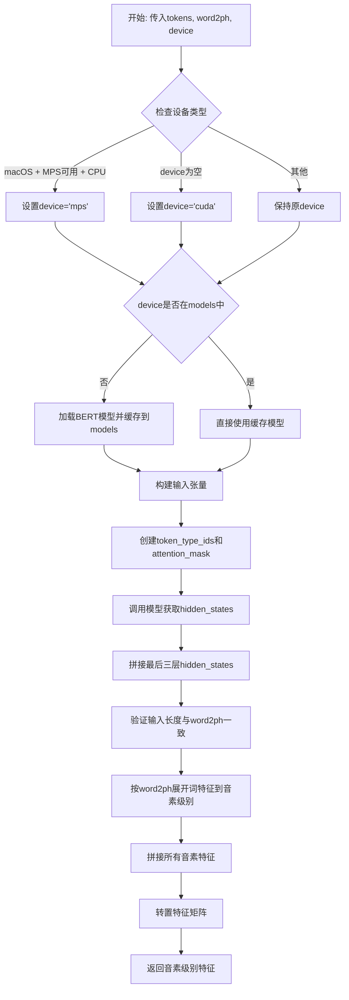
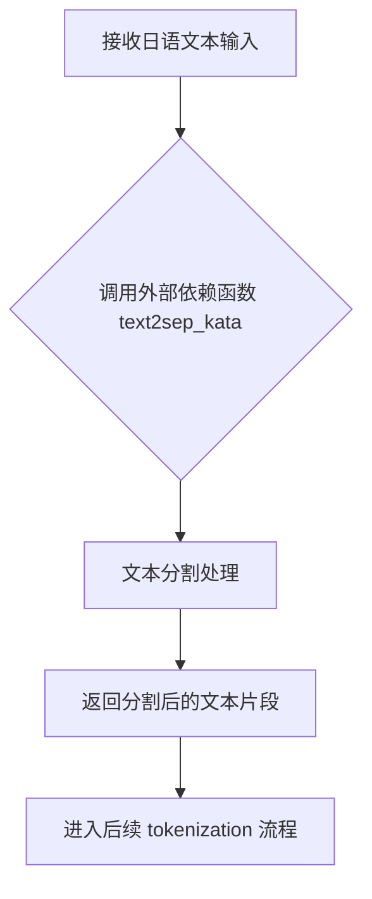

# `Bert-VITS2\oldVersion\V111\text\fix\japanese_bert.py` 详细设计文档

该代码是一个日语BERT特征提取模块，通过预训练的bert-base-japanese-v3模型将文本转换为高维特征向量，支持动态模型加载和多设备（CPU/MPS/CUDA）适配，主要用于语音合成中的文本到语音特征转换。

## 整体流程

```mermaid
graph TD
    A[开始] --> B[text2sep_kata分词]
    B --> C[Tokenizer分词]
    C --> D[转换为token_ids]
    D --> E[添加特殊符号[SEP]]
    E --> F{device选择}
    F -->|darwin+mps+cpu| G[MPS设备]
    F -->|cuda| H[CUDA设备]
    F -->|其他| I[CPU设备]
    G --> J{模型是否已加载}
    H --> J
    I --> J
    J -->|否| K[加载模型并缓存]
    J -->|是| L[使用缓存模型]
    K --> M[BERT前向传播]
    L --> M
    M --> N[提取hidden_states]
    N --> O[拼接最后3层中的1层]
    O --> P[遍历word2ph扩展特征]
    P --> Q[phone_level特征拼接]
    Q --> R[返回转置特征矩阵]
```

## 类结构

```
模块级
├── tokenizer (全局分词器)
├── models (模型缓存字典)
├── get_bert_feature (全局函数)
└── get_bert_feature_with_token (全局函数)
```

## 全局变量及字段


### `tokenizer`
    
BERT日文分词器实例，用于将日文文本转换为token

类型：`AutoTokenizer`
    


### `models`
    
缓存不同设备的BERT模型，以避免重复加载

类型：`Dict`
    


    

## 全局函数及方法


### `get_bert_feature`

该函数是文本转BERT特征的主入口函数，负责将输入的日语文本进行分词处理，添加特殊标记（[CLS]和[SEP]），然后调用`get_bert_feature_with_token`函数生成音素级别的BERT特征向量。

参数：

- `text`：`str`，输入的日语文本字符串
- `word2ph`：`list[int]` 或类似结构，词到音素（phoneme）的映射列表，用于控制每个词对应多少个音素，决定输出特征的时间步长
- `device`：`str`，计算设备，默认为`config.bert_gen_config.device`（可选参数）

返回值：`torch.Tensor`，返回形状为`(特征维度, 音素数量)`的转置特征矩阵，包含音素级别的BERT隐藏状态特征

#### 流程图

```mermaid
flowchart TD
    A[开始: get_bert_feature] --> B[调用text2sep_kata处理文本]
    B --> C[对分离的文本进行tokenize]
    C --> D[将tokens转换为ids]
    D --> E[添加[CLS]=2和[SEP]=3特殊标记]
    E --> F[调用get_bert_feature_with_token]
    F --> G[返回音素级别特征矩阵]
    
    subgraph get_bert_feature_with_token [get_bert_feature_with_token内部逻辑]
        H[检查设备平台]
        H --> I{是否为macOS且MPS可用}
        I -->|是| J[设置device为mps]
        I -->|否| K{device是否为空}
        K -->|是| L[设置为cuda]
        K -->|否| M[使用传入的device]
        J --> N
        L --> N
        M --> N
        N{模型是否已加载}
        N -->|否| O[加载BERT模型到对应设备]
        N -->|是| P[直接使用已加载模型]
        O --> Q
        P --> Q
        Q[构建输入张量: input_ids, token_type_ids, attention_mask]
        Q --> R[前向传播获取hidden_states]
        R --> S[拼接最后3层隐藏状态]
        S --> T[根据word2ph重复特征]
        T --> U[拼接为音素级别特征]
    end
    
    F -.-> H
```

#### 带注释源码

```python
def get_bert_feature(text, word2ph, device=config.bert_gen_config.device):
    """
    将输入文本转换为BERT特征向量的主函数
    
    参数:
        text: 输入的日语文本字符串
        word2ph: 词到音素的映射列表，用于控制输出特征的时间步长
        device: 计算设备，默认为配置中的BERT生成设备
    
    返回:
        音素级别的BERT特征矩阵（转置后）
    """
    # Step 1: 调用 japanese 模块的 text2sep_kata 函数
    # 将文本分离并转换为片假名形式
    sep_text, _ = text2sep_kata(text)
    
    # Step 2: 对分离后的每个文本片段进行tokenize
    # 返回列表形式的tokens
    sep_tokens = [tokenizer.tokenize(t) for t in sep_text]
    
    # Step 3: 将tokens转换为对应的token ids
    sep_ids = [tokenizer.convert_tokens_to_ids(t) for t in sep_tokens]
    
    # Step 4: 添加特殊标记
    # [CLS]=2, [SEP]=3 是BERT的特殊token id
    # 使用列表推导式将嵌套列表展平
    sep_ids = [2] + [item for sublist in sep_ids for item in sublist] + [3]
    
    # Step 5: 调用内部函数获取BERT特征
    # 传递处理好的token ids、word2ph映射和设备参数
    return get_bert_feature_with_token(sep_ids, word2ph, device)
```


### `get_bert_feature_with_token`

该函数是TokenID转BERT特征的核心函数，负责将分词后的Token ID序列通过BERT模型提取语义特征，并将词级别特征按照音素对齐信息展开为音素级别特征，用于后续的语音合成任务。

参数：

- `tokens`：`List[int]`，分词后的Token ID列表
- `word2ph`：`List[int]` 或 `Dict`，词到音素的映射关系，用于将词级别特征展开为音素级别特征
- `device`：`str`，计算设备，默认为`config.bert_gen_config.device`（支持cuda、mps、cpu）

返回值：`torch.Tensor`，返回形状为`(特征维度, 音素数量)`的音素级别特征矩阵

#### 流程图



#### 带注释源码

```python
def get_bert_feature_with_token(tokens, word2ph, device=config.bert_gen_config.device):
    # 如果在macOS平台且MPS可用且指定了cpu设备，则使用mps加速
    if (
        sys.platform == "darwin"
        and torch.backends.mps.is_available()
        and device == "cpu"
    ):
        device = "mps"
    
    # 如果未指定设备，默认使用cuda
    if not device:
        device = "cuda"
    
    # 根据设备获取或加载BERT模型（模型缓存机制）
    if device not in models.keys():
        models[device] = AutoModelForMaskedLM.from_pretrained(
            "./bert/bert-base-japanese-v3"
        ).to(device)
    
    # 使用torch.no_grad()禁用梯度计算以节省显存
    with torch.no_grad():
        # 将token ids转换为PyTorch张量并添加batch维度
        inputs = torch.tensor(tokens).to(device).unsqueeze(0)
        
        # 创建token_type_ids（全0表示只有一个句子）
        token_type_ids = torch.zeros_like(inputs).to(device)
        
        # 创建attention_mask（全1表示所有token都被关注）
        attention_mask = torch.ones_like(inputs).to(device)
        
        # 封装为模型输入字典
        inputs = {
            "input_ids": inputs,
            "token_type_ids": token_type_ids,
            "attention_mask": attention_mask,
        }

        # 调用BERT模型，设置output_hidden_states=True获取所有隐藏层
        res = models[device](**inputs, output_hidden_states=True)
        
        # 提取最后三层hidden_states中的倒数第三层（-3:-2即倒数第三层）
        # 并在最后一个维度拼接，形状变为[seq_len, 768*2]
        res = torch.cat(res["hidden_states"][-3:-2], -1)[0].cpu()
    
    # 断言验证：输入token数量必须与word2ph长度一致
    assert inputs["input_ids"].shape[-1] == len(word2ph)
    
    word2phone = word2ph
    phone_level_feature = []
    
    # 遍历每个词，将其特征重复word2ph[i]次（展开为音素级别）
    for i in range(len(word2phone)):
        repeat_feature = res[i].repeat(word2phone[i], 1)
        phone_level_feature.append(repeat_feature)

    # 沿音素维度拼接所有特征
    phone_level_feature = torch.cat(phone_level_feature, dim=0)

    # 转置特征矩阵，返回形状为(特征维度, 音素数量)
    return phone_level_feature.T
```


### `text2sep_kata`

这是一个外部依赖的文本分割函数，用于将日语文本分割成适合 BERT 处理的片段（以片假名形式）。

参数：

- `text`：`str`，待处理的日语文本输入

返回值：`tuple`，返回分割后的文本片段列表和对应的分割信息（具体类型取决于实现，通常为 `List[str]` 和辅助信息）

#### 流程图



#### 带注释源码

```python
# 该函数为外部导入函数，具体实现位于 .japanese 模块中
# 此处仅为调用点示例
from .japanese import text2sep_kata  # 从同包下的 japanese 模块导入

def get_bert_feature(text, word2ph, device=config.bert_gen_config.device):
    # 调用 text2sep_kata 进行文本分割
    # 输入: text - 日语文本字符串
    # 输出: sep_text - 分割后的文本片段列表, _ - 辅助信息（未使用）
    sep_text, _ = text2sep_kata(text)
    
    # 后续处理：对分割后的文本进行 tokenize
    sep_tokens = [tokenizer.tokenize(t) for t in sep_text]
    sep_ids = [tokenizer.convert_tokens_to_ids(t) for t in sep_tokens]
    # 添加 BERT 特殊标记 [CLS]=2, [SEP]=3
    sep_ids = [2] + [item for sublist in sep_ids for item in sublist] + [3]
    return get_bert_feature_with_token(sep_ids, word2ph, device)
```

---

### 补充说明

#### 关键组件信息

| 组件名称 | 一句话描述 |
|---------|-----------|
| `text2sep_kata` | 外部文本分割函数，将日语文本按片假名单位分割 |
| `get_bert_feature` | 主入口函数，调度文本分割与 BERT 特征提取 |
| `get_bert_feature_with_token` | 核心 BERT 推理函数，提取 phone 级别的特征向量 |

#### 潜在技术债务与优化空间

1. **外部依赖隐藏实现细节**：`text2sep_kata` 的实现未在当前代码中体现，文档缺失会导致维护困难
2. **模型重复加载**：每个设备首次调用时都会加载模型，缺乏缓存预加载机制
3. **硬编码路径**：模型路径 `./bert/bert-base-japanese-v3` 硬编码，应提取至配置
4. **设备判断逻辑复杂**：`darwin + mps + cpu` 的判断可封装为独立函数

#### 外部依赖与接口契约

- **依赖模块**：`.japanese`（本地包），`transformers`（HuggingFace），`torch`，`config`
- **接口契约**：`text2sep_kata(text: str) -> Tuple[List[str], Any]`
- **模型依赖**：BERT-base Japanese v3（`bert-base-japanese-v3`）

## 关键组件


### 张量索引与特征扩展

使用word2ph将BERT输出的词级别特征按音素数量进行重复扩展，实现词级特征到音素级特征的映射。通过循环遍历word2phone列表，对每个词的特征按其对应的音素数量进行repeat操作，最后通过torch.cat拼接成完整的音素级特征张量。

### 设备管理与自动选择

支持CPU、MPS（Apple Silicon）和CUDA三种设备。代码首先检测系统平台和MPS可用性，在满足条件时自动选择MPS设备；若未指定设备则默认使用CUDA；通过models字典缓存不同设备上的模型实例，避免重复加载。

### 模型缓存机制

使用全局字典models按设备类型缓存已加载的BERT模型。首次使用某设备时加载模型并缓存，后续直接复用，有效减少显存占用和加载时间。

### 隐藏状态提取策略

从BERT的hidden_states中提取倒数第三层的输出（res["hidden_states"][-3:-2]），使用torch.cat在最后一个维度拼接，然后取第一个样本（[0]）并移到CPU。该策略选择了BERT中层特征进行语音合成任务。

### 文本预处理流程

通过text2sep_kata将输入文本分离并转换为片假名，然后使用BERT分词器进行tokenize和ID转换，最后添加特殊标记[CLS]=2和[SEP]=3。

### 量化策略与惰性加载

模型使用transformers的AutoModelForMaskedLM.from_pretrained默认加载，支持fp32精度。设备转移在推理时通过.to(device)完成，实现惰性加载。


## 问题及建议


### 已知问题

-   **硬编码路径**：模型路径 "./bert/bert-base-japanese-v3" 在多处硬编码，重复使用，违反DRY原则，难以维护
-   **设备检测逻辑冗余**：MPS设备检测条件 `sys.platform == "darwin" and torch.backends.mps.is_available() and device == "cpu"` 逻辑不合理，当device已经是"cpu"时才切换到"mps"，可能导致非预期行为
-   **缺乏类型提示**：所有函数参数和返回值都缺少类型注解，降低代码可读性和IDE支持
-   **模型缓存无清理机制**：`models` 字典持续增长，没有缓存淘汰或显式释放内存的方法
-   **错误处理缺失**：模型加载、tokenizer初始化、推理过程均无异常捕获，失败时会导致程序崩溃
-   **参数验证不足**：`word2ph` 和 `tokens` 长度一致性仅通过 `assert` 断言检查，发布版本中会被跳过，且错误信息不明确
-   **模块导入问题**：相对导入 `from .japanese import text2sep_kata` 在直接运行脚本时会失败
-   **资源重复计算**：`token_type_ids` 和 `attention_mask` 每次调用都重新创建为零张量，未缓存

### 优化建议

-   **提取配置**：将模型路径、设备默认值等配置统一到 `config` 模块或单独的配置文件
-   **改进设备选择逻辑**：重构MPS设备检测，改为显式的设备参数或环境变量控制
-   **添加类型提示**：为函数参数和返回值添加明确的类型注解
-   **实现缓存管理**：为 `models` 字典添加LRU缓存策略或显式的 `clear_cache()` 方法
-   **增加异常处理**：用 try-except 包裹模型加载和推理代码，提供友好的错误信息
-   **主动参数验证**：在函数入口使用明确的条件检查替代 assert，并提供有意义的错误消息
-   **修复导入方式**：使用 try-except 处理导入，或提供独立运行脚本的入口点
-   **优化张量创建**：将 `token_type_ids` 和 `attention_mask` 的创建移至函数外或使用 `torch.zeros` 的 `dtype` 参数直接指定设备

## 其它


### 设计目标与约束

本模块的核心设计目标是将日语文本转换为BERT模型生成的特征向量，用于后续的语音合成或其他NLP任务。主要约束包括：1) 模型文件路径硬编码为"./bert/bert-base-japanese-v3"，部署时需要确保路径正确；2) 设备选择优先顺序为cuda > mps > cpu；3) 输入文本需要经过日文分词处理；4) word2ph参数长度必须与token序列长度匹配。

### 错误处理与异常设计

代码中的错误处理主要包括：1) 使用assert验证输入长度一致性，当word2ph长度与token序列长度不匹配时抛出AssertionError；2) 设备自动检测逻辑中，当platform为darwin且MPS可用时会自动切换设备；3) 模型加载使用AutoModelForMaskedLM的from_pretrained方法，可能抛出IOError或OSError当模型文件不存在时。建议增加更详细的异常捕获和自定义异常类。

### 数据流与状态机

数据流处理流程：输入原始日语文本和word2ph参数 → 调用text2sep_kata进行文本分离和片假名转换 → tokenizer进行分词 → 转换为token ids → 添加特殊标记[CLS]和[SEP] → 调用BERT模型获取hidden states → 提取最后三层中的倒数第二层 → 根据word2ph进行特征复制以匹配音素级别 → 拼接所有特征并转置输出。状态机包含三个状态：初始化状态（加载tokenizer）、模型就绪状态（模型已加载到指定设备）、推理状态（执行前向传播）。

### 外部依赖与接口契约

外部依赖包括：1) torch库 - 深度学习框架；2) transformers库 - BERT模型加载；3) sys模块 - 平台检测；4) config配置模块 - 设备配置；5) japanese模块 - text2sep_kata函数。接口契约：get_bert_feature(text, word2ph, device)输入为字符串文本、词到音素列表映射、目标设备字符串；输出为torch.Tensor类型的音素级别特征矩阵。get_bert_feature_with_token(tokens, word2ph, device)输入为token id列表、词到音素映射、设备字符串；输出相同类型的特征矩阵。

### 性能考虑与优化空间

当前实现存在以下性能问题：1) 模型在每次调用get_bert_feature_with_token时都重新构建inputs字典，存在不必要的对象创建开销；2) device检测逻辑在每次调用时都执行，可以缓存设备检测结果；3) 没有实现模型缓存的清理机制，长期运行可能导致内存占用增加；4) 使用torch.cat拼接特征时，可以预先分配张量内存；5) CPU和GPU之间的数据传输（.cpu()）可能成为瓶颈。建议优化方向：实现设备检测结果的缓存、添加模型缓存大小限制、考虑使用torch.inference_mode()替代no_grad、批量处理多个句子以提高吞吐量。

### 资源管理与生命周期

模型资源管理采用字典缓存机制，key为设备类型，value为加载的模型实例。models字典作为全局变量在模块级别声明，当前实现没有提供显式的资源释放接口。建议添加model_manager类或函数来管理模型生命周期，包括模型预加载、模型卸载、显存清理等功能。对于长时间运行的应用，需要考虑定期清理不再使用的模型实例。

### 并发与线程安全性

当前实现存在以下并发问题：1) 全局models字典的读写操作没有加锁保护，多线程并发调用可能导致模型重复加载或状态不一致；2) tokenizer和models是共享资源，需要考虑线程安全问题；3) device检测逻辑在多线程环境下可能产生竞争条件。建议在高并发场景下添加线程锁（threading.Lock）或使用单例模式管理模型资源。

### 配置管理

当前配置管理通过config模块的config.bert_gen_config.device获取默认设备，配置相对简单。建议增强配置管理：1) 支持从环境变量读取设备配置；2) 添加模型路径配置化；3) 支持动态调整批处理大小；4) 添加日志级别配置以便调试。

### 测试策略建议

建议补充以下测试用例：1) 单元测试 - 测试text2sep_kata函数的各种输入边界情况；2) 集成测试 - 测试完整流程的输入输出正确性；3) 性能测试 - 测量不同设备上的推理延迟和内存占用；4) 并发测试 - 验证多线程场景下的正确性和稳定性；5) 异常测试 - 测试模型文件不存在、输入格式错误等异常情况。

### 代码规范与可维护性

代码中存在一些可改进的编码实践：1) 注释掉的代码应清理或移至单独的调试文件；2) 魔法数字2和3应定义为常量（如CLS_ID=2, SEP_ID=3）；3) 建议添加类型注解提高代码可读性；4) 建议添加docstring文档字符串；5) res变量命名不够清晰，建议使用更描述性的名称如hidden_states或bert_features。

### 部署与运维注意事项

部署时需要：1) 确保./bert/bert-base-japanese-v3目录包含完整的模型文件；2) 首次调用会有模型加载延迟，建议实现预热机制；3) 监控GPU/MPS内存使用情况，避免OOM；4) 生产环境建议添加日志记录以便问题排查；5) 考虑实现模型版本管理和回滚机制。


    