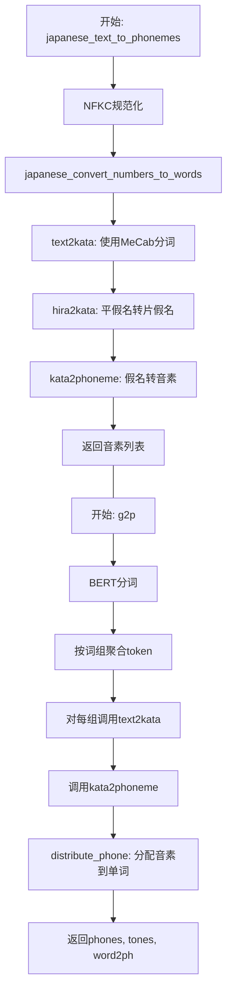
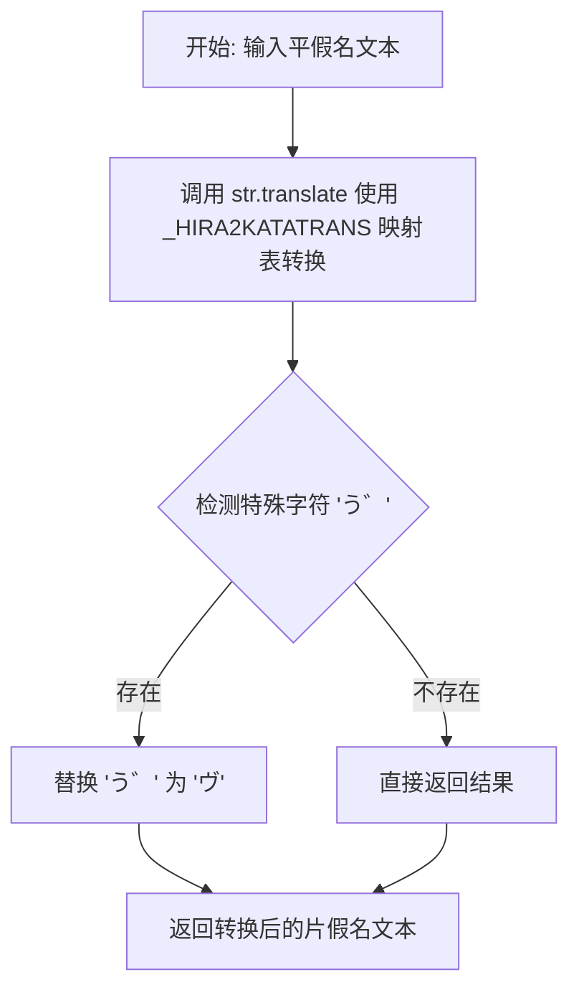
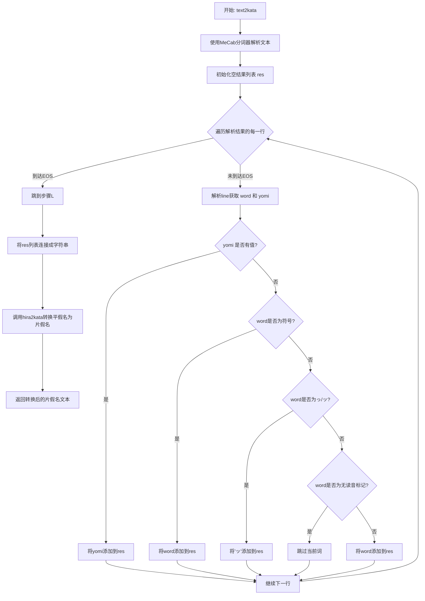
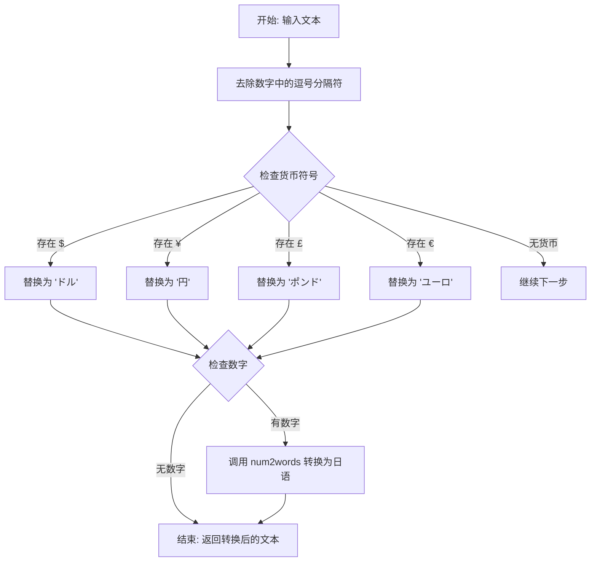
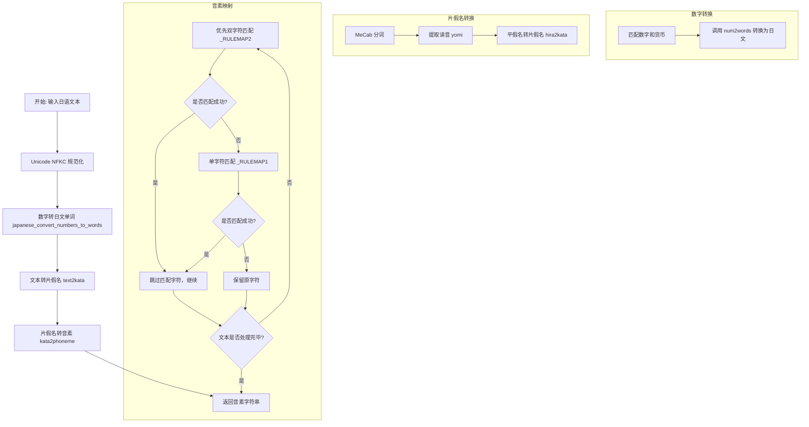
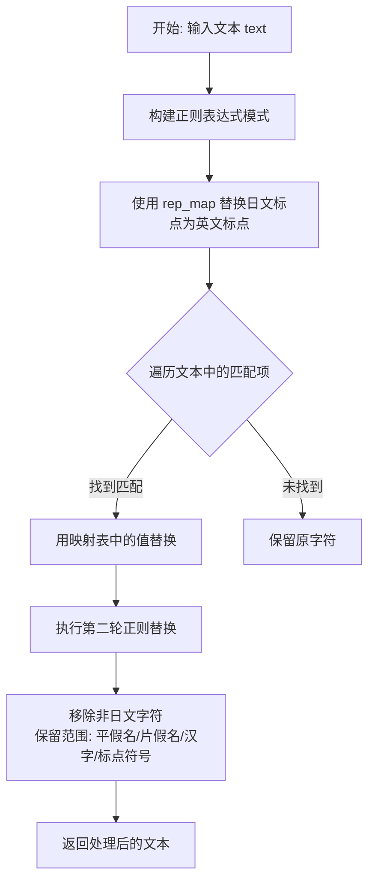
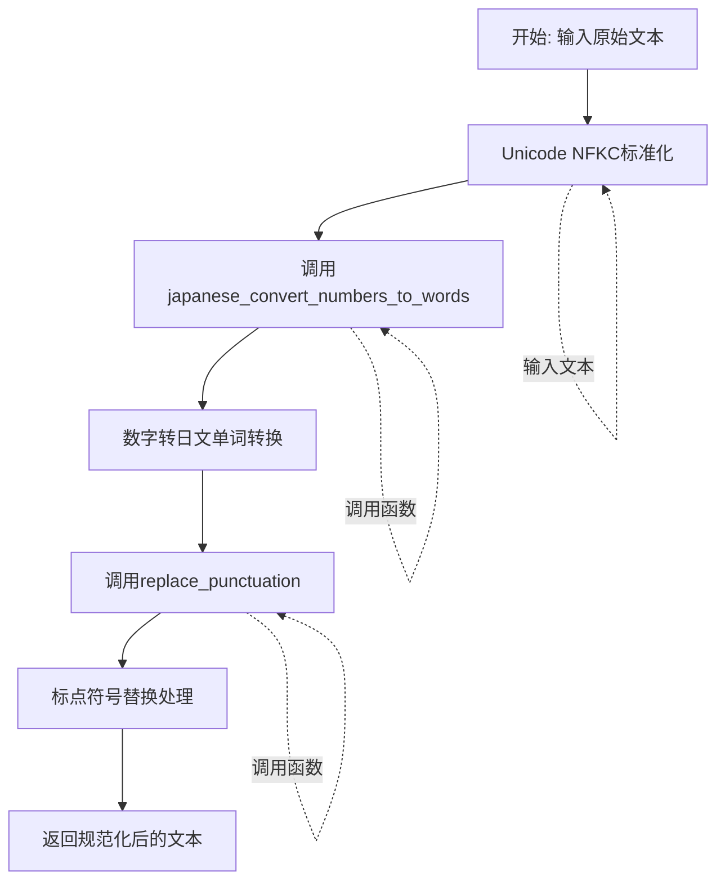
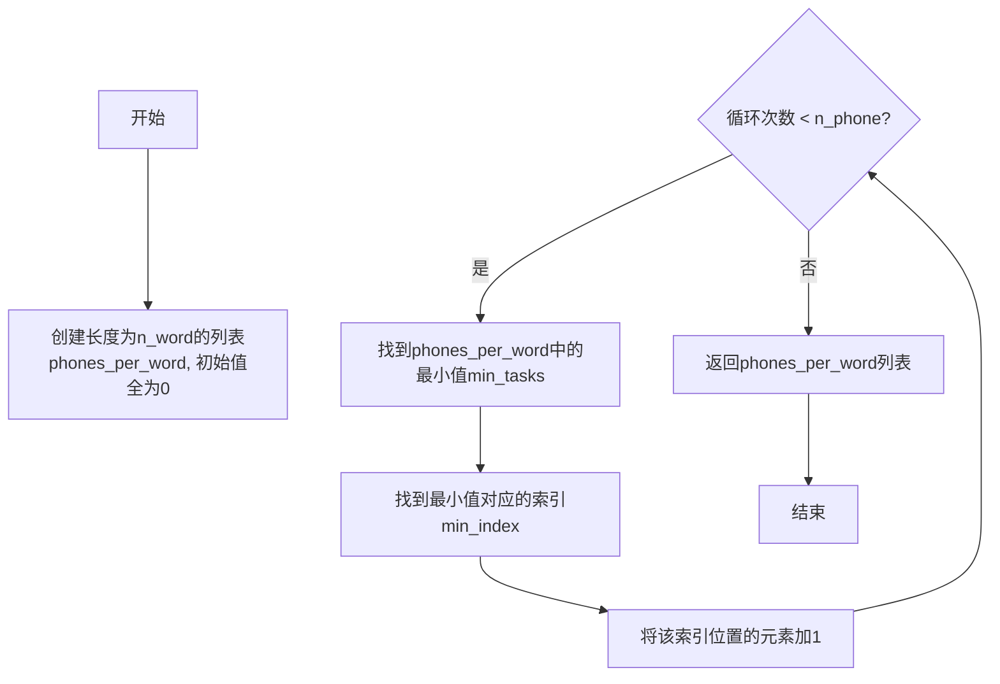
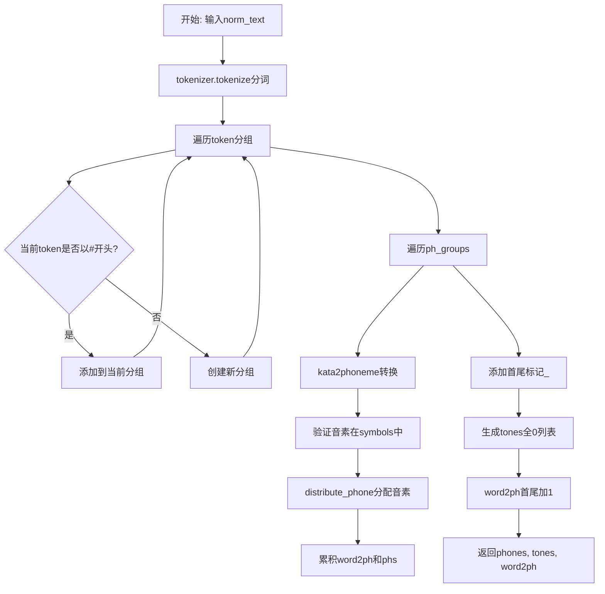

# `Bert-VITS2\oldVersion\V111\text\japanese.py` 详细设计文档

该模块将日语文本转换为音素（phonemes），兼容Julius语音识别工具包。主要功能包括数字转日文、假名转音素、文本规范化、以及基于BERT分词器的grapheme-to-phoneme转换，用于文本转语音（TTS）系统。

## 整体流程



## 类结构

```
japanese.py (模块文件，无类定义)
├── 全局变量和常量
│   ├── _CONVRULES (转换规则列表)
│   ├── _RULEMAP1, _RULEMAP2 (假名到音素映射)
│   ├── _KATAKANA, _HIRAGANA (字符集)
│   ├── _HIRA2KATATRANS (平假名转片假名映射)
SYMBOL_TOKENS
NO_YOMI_TOKENS (符号集合)
TAGGER (MeCab分词器)
ALPHASYMBOL_YOMI (字母符号日文映射)
rep_map (标点符号映射)
└── 全局函数
    ├── kata2phoneme()
    ├── hira2kata()
    ├── text2kata()
    ├── japanese_convert_numbers_to_words()
    ├── japanese_convert_alpha_symbols_to_words()
    ├── japanese_text_to_phonemes()
    ├── is_japanese_character()
    ├── replace_punctuation()
    ├── text_normalize()
    ├── distribute_phone()
    └── g2p()
```

## 全局变量及字段


### `_CONVRULES`
    
片假名到音素的转换规则列表，包含双字符和单字符的映射关系

类型：`list[str]`
    


### `_COLON_RX`
    
用于匹配冒号的正则表达式对象，用于处理连续冒号的替换

类型：`re.Pattern`
    


### `_REJECT_RX`
    
用于拒绝非字母和指定符号的正则表达式，过滤无效字符

类型：`re.Pattern`
    


### `_RULEMAP1`
    
单字符片假名到音素的映射字典元组，由转换规则生成

类型：`tuple[dict]`
    


### `_RULEMAP2`
    
双字符片假名到音素的映射字典元组，用于优先匹配双字符规则

类型：`tuple[dict]`
    


### `_KATAKANA`
    
所有片假名字符的字符串，包含从ァ到ン的所有片假名

类型：`str`
    


### `_HIRAGANA`
    
所有平假名字符的字符串，包含从ぁ到ん的所有平假名

类型：`str`
    


### `_HIRA2KATATRANS`
    
平假名到片假名的翻译映射表，用于str.translate方法

类型：`dict`
    


### `_SYMBOL_TOKENS`
    
标点符号集合，用于判断是否为需要保留的符号

类型：`set[str]`
    


### `_NO_YOMI_TOKENS`
    
无读音符号集合，如引号、括号等不需要发音的标点

类型：`set[str]`
    


### `_TAGGER`
    
MeCab分词器实例，用于日语分词和获取读音

类型：`MeCab.Tagger`
    


### `_ALPHASYMBOL_YOMI`
    
字母和符号到日语读音的映射字典，用于字符朗读

类型：`dict[str, str]`
    


### `_NUMBER_WITH_SEPARATOR_RX`
    
匹配带分隔符数字的正则表达式，如1,234

类型：`re.Pattern`
    


### `_CURRENCY_MAP`
    
货币符号到日语读音的映射，如美元、欧元等

类型：`dict[str, str]`
    


### `_CURRENCY_RX`
    
匹配货币符号和数字组合的正则表达式

类型：`re.Pattern`
    


### `_NUMBER_RX`
    
匹配纯数字的正则表达式，支持整数和小数

类型：`re.Pattern`
    


### `rep_map`
    
标点符号替换映射表，将日文标点转换为英文标点

类型：`dict[str, str]`
    


### `tokenizer`
    
BERT日语分词器实例，用于文本分词

类型：`transformers.AutoTokenizer`
    


    

## 全局函数及方法


### `_makerulemap`

该函数用于从预定义的转换规则列表 `_CONVRULES` 中生成用于日文字符到音素转换的查找映射表。它将规则按字符长度（1个字符和2个字符）分组到两个字典中，供 `kata2phoneme` 函数在转换片假名文本时进行高效查表。

参数： 无

返回值： `tuple[dict, dict]`，返回一个包含两个字典的元组。第一个字典映射单字符日文字符到其对应的音素表示，第二个字典映射双字符日文字符到其对应的音素表示。

#### 流程图

```mermaid
flowchart TD
    A[开始 _makerulemap] --> B[遍历 _CONVRULES 列表]
    B --> C[对每个规则字符串按 '/' 分割]
    C --> D[生成 (key, value) 元组列表 l]
    E[创建空字典] --> F[过滤 len(key) == 1 的规则]
    F --> G[构建单字符映射字典 _RULEMAP1]
    E --> H[过滤 len(key) == 2 的规则]
    H --> I[构建双字符映射字典 _RULEMAP2]
    G --> J[返回元组 (_RULEMAP1, _RULEMAP2)]
    I --> J
```

#### 带注释源码

```python
def _makerulemap():
    """
    从转换规则列表创建用于假名到音素转换的查找映射表。
    
    _CONVRULES 是一个包含转换规则的列表，每个规则格式为 "日文字符/音素"
    例如: "ア/ a" 表示将字符"ア"转换为音素"a"
    
    Returns:
        tuple: 包含两个字典的元组
            - 第一个字典: 单字符规则映射 (len(key) == 1)
            - 第二个字典: 双字符规则映射 (len(key) == 2)
    """
    # 将每个规则字符串按 "/" 分割成元组
    # 例如: "アァ/ a a" -> ("アァ", " a a")
    l = [tuple(x.split("/")) for x in _CONVRULES]
    
    # 使用字典推导式按字符长度过滤规则
    # i=1 时: 过滤出单字符的假名规则 (如 "ア/ a")
    # i=2 时: 过滤出双字符的假名规则 (如 "アァ/ a a")
    # 最终返回一个元组，包含两个字典
    return tuple({k: v for k, v in l if len(k) == i} for i in (1, 2))


# 在模块加载时调用该函数，创建全局映射表供 kata2phoneme 使用
_RULEMAP1, _RULEMAP2 = _makerulemap()
```


### `kata2phoneme`

将片假名文本转换为音素序列的函数。该函数通过查表方式将日文字符（片假名）逐个映射为对应的音素符号，支持双字符和单字符匹配规则，生成与 Julius 语音识别工具兼容的音素输出。

参数：

- `text`：`str`，输入的片假名文本字符串

返回值：`str`，转换后的音素序列字符串

#### 流程图

```mermaid
flowchart TD
    A[开始: kata2phoneme] --> B[text = text.strip<br/>res = []]
    B --> C{text 是否为空?}
    C -->|是| D[返回 res]
    C -->|否| E{len(text) >= 2?}
    E -->|是| F[尝试从 _RULEMAP2 获取 text[:2]]
    F --> G{是否找到映射?}
    G -->|是| H[text = text[2:]<br/>res += x.split(' ')[1:]<br/>继续]
    G -->|否| I[尝试从 _RULEMAP1 获取 text[0]]
    I --> J{是否找到映射?}
    J -->|是| K[text = text[1:]<br/>res += x.split(' ')[1:]<br/>继续]
    J -->|否| L[res.append(text[0])<br/>text = text[1:]]
    H --> C
    K --> C
    L --> C
```

#### 带注释源码

```python
def kata2phoneme(text: str) -> str:
    """Convert katakana text to phonemes.
    
    此函数将输入的片假名文本转换为音素序列。
    转换规则存储在 _RULEMAP1 和 _RULEMAP2 中，
    分别对应单字符和双字符的映射规则。
    
    参数:
        text: str - 输入的片假名文本字符串
        
    返回:
        str - 转换后的音素序列字符串
    """
    # 去除首尾空白字符
    text = text.strip()
    
    # 初始化结果列表
    res = []
    
    # 循环处理文本中的每个字符
    while text:
        # 优先尝试匹配双字符规则（长度为2的片假名）
        if len(text) >= 2:
            # 从双字符映射表中查找前两个字符
            x = _RULEMAP2.get(text[:2])
            if x is not None:
                # 匹配成功，移除已处理的两个字符
                text = text[2:]
                # 将映射值按空格分割，取后半部分（音素部分）添加到结果
                # 格式如 "ア/ a" -> split(" ") -> ["ア", "a"] -> 取 [1:] -> ["a"]
                res += x.split(" ")[1:]
                continue  # 继续处理下一个字符
        
        # 双字符规则未匹配，尝试单字符规则
        x = _RULEMAP1.get(text[0])
        if x is not None:
            # 匹配成功，移除已处理的一个字符
            text = text[1:]
            # 添加音素到结果列表
            res += x.split(" ")[1:]
            continue
        
        # 既没有双字符规则也没有单字符规则匹配
        # 将原字符直接添加到结果（可能是符号或未知字符）
        res.append(text[0])
        text = text[1:]
    
    # 返回组合后的音素序列字符串
    # 注意: 注释行 res = _COLON_RX.sub(":", res) 被注释掉
    return res
```


### `hira2kata`

该函数将日文平假名文本转换为片假名文本，利用 Python 的 `str.translate` 方法结合预定义的映射表实现高效转换，并处理特殊的浊音字符。

参数：

- `text`：`str`，需要转换的平假名文本

返回值：`str`，转换后的片假名文本

#### 流程图



#### 带注释源码

```python
def hira2kata(text: str) -> str:
    """将平假名转换为片假名
    
    参数:
        text: 输入的平假名字符串
    
    返回:
        转换后的片假名字符串
    """
    # 第一步：使用预创建的翻译映射表将平假名字符批量转换为片假名
    # _HIRA2KATATRANS 是通过 str.maketrans() 创建的翻译表
    text = text.translate(_HIRA2KATATRANS)
    
    # 第二步：处理特殊的复合字符 'う゛'（平假名う + 浊点）
    # 在某些文本中，这个组合可能没有被正确转换为片假名的 'ヴ'
    # 因此这里显式地进行替换处理
    return text.replace("う゛", "ヴ")
```

---

**补充说明**

- **全局变量依赖**：该函数依赖两个全局变量 `_HIRAGANA`（所有平假名字符串）和 `_KATAKANA`（所有片假名字符串），这两个变量在模块加载时通过字符编码范围自动生成。
- **翻译映射表**：`_HIRA2KATATRANS` 是使用 `str.maketrans()` 创建的平假名到片假名的一对一映射表，转换效率高。
- **特殊处理**：仅处理了 "う゛" 这一个特殊组合，其他字符通过翻译表统一转换。


### `text2kata`

该函数是日语文本处理模块的核心函数之一，负责将输入的日语文本（可能是平假名、片假名、汉字混合）通过MeCab形态素分析器进行分词，提取每个词的读音（yomi），然后将平假名读音转换为片假名，最终返回片假名形式的文本。此函数为后续的音素转换（kata2phoneme）提供输入，是日语语音合成_pipeline中的关键环节。

参数：

-  `text`：`str`，需要转换的日语文本字符串，可以包含汉字、平假名、片假名及标点符号

返回值：`str`，转换后的片假名文本字符串

#### 流程图



#### 带注释源码

```python
def text2kata(text: str) -> str:
    """
    将日语文本转换为片假名。
    
    处理流程：
    1. 使用MeCab分词器对文本进行形态素分析
    2. 提取每个词的读音(yomi)
    3. 处理无读音的词（符号、特殊假名等）
    4. 将结果中的平假名转换为片假名
    
    参数:
        text: 输入的日语文本字符串
        
    返回:
        转换后的片假名字符串
    """
    # 使用MeCab分词器解析文本，返回Mecab格式的分析结果
    parsed = _TAGGER.parse(text)
    
    # 初始化结果列表，用于存储每个词的读音
    res = []
    
    # 遍历解析结果的每一行
    for line in parsed.split("\n"):
        # 遇到EOS（End Of Sentence）标记时，停止处理
        if line == "EOS":
            break
            
        # 使用制表符分割解析行，获取词语和读音
        # 格式: "词语\t读音,词性,..."
        parts = line.split("\t")
        
        # 提取词语和其读音（yomi）
        word, yomi = parts[0], parts[1]
        
        # 如果该词有读音信息，直接使用读音
        if yomi:
            res.append(yomi)
        else:
            # 没有读音时，根据词语类型分别处理
            
            # 处理标点符号（・、。？！）- 直接保留原符号
            if word in _SYMBOL_TOKENS:
                res.append(word)
            # 处理小写つ/ッ（促音）- 转换为标准促音符号ッ
            elif word in ("っ", "ッ"):
                res.append("ッ")
            # 处理无读音标记符号（如引号、括号等）- 忽略跳过
            elif word in _NO_YOMI_TOKENS:
                pass
            # 其他无法获取读音的词，使用原词（可能是外来语等）
            else:
                res.append(word)
                
    # 将所有读音连接成字符串，然后调用hira2kata将平假名转换为片假名
    return hira2kata("".join(res))
```


### `japanese_convert_numbers_to_words`

该函数用于将日语文本中的数字（包括带分隔符的数字、货币符号以及普通数字）转换为对应的日语词汇形式，以便后续的语音合成处理。

参数：

- `text`：`str`，输入的日语文本字符串，包含需要转换的数字和货币符号

返回值：`str`，返回转换后的日语文本，其中数字和货币符号已被替换为日语读法

#### 流程图



#### 带注释源码

```python
def japanese_convert_numbers_to_words(text: str) -> str:
    """
    将日语文本中的数字转换为日语词汇
    
    处理流程：
    1. 移除数字中的千位分隔符（逗号）
    2. 将货币符号转换为日语读法
    3. 将阿拉伯数字转换为日语词汇
    
    参数:
        text: 输入的日语文本字符串
        
    返回:
        转换后的日语文本字符串
    """
    
    # 第一步：去除数字中的逗号分隔符
    # 使用正则表达式匹配带逗号的数字（如 1,234,567）
    # 并将其替换为无逗号的格式（1234567）
    res = _NUMBER_WITH_SEPARATOR_RX.sub(lambda m: m[0].replace(",", ""), text)
    
    # 第二步：处理货币符号
    # 匹配货币符号后跟数字的模式（如 $100, ¥500）
    # 将货币符号转换为日语词汇，数字保留
    # 例如: $100 -> 100ドル, ¥500 -> 500円
    res = _CURRENCY_RX.sub(lambda m: m[2] + _CURRENCY_MAP.get(m[1], m[1]), res)
    
    # 第三步：将剩余的数字转换为日语词汇
    # 匹配任意数字（包括小数）
    # 使用 num2words 库将其转换为日语读法
    # 例如: 123 -> 百二十三, 3.14 -> 三・一四
    res = _NUMBER_RX.sub(lambda m: num2words(m[0], lang="ja"), res)
    
    # 返回最终转换后的文本
    return res
```


### `japanese_convert_alpha_symbols_to_words`

将输入文本中的字母和符号转换为其对应的日文读音（Yomi）。该函数通过查表方式将英文字母、希腊字母等符号替换为对应的日文发音字符串，例如将"a"转换为"エー"，将"+"转换为"プラス"等。

参数：

- `text`：`str`，待转换的包含字母和符号的文本

返回值：`str`，转换后的文本，字母和符号已被替换为日文读音

#### 流程图

```mermaid
graph TD
    A[开始] --> B[输入文本 text]
    B --> C[text.lower 将文本转为小写]
    C --> D[遍历每个字符 ch]
    D --> E{检查 _ALPHASYMBOL_YOMI 中是否存在 ch}
    E -->|是| F[获取映射值 _ALPHASYMBOL_YOMI[ch]]
    E -->|否| G[使用原字符 ch]
    F --> H[添加到结果列表]
    G --> H
    H --> I{是否还有剩余字符}
    I -->|是| D
    I -->|否| J[''.join 合并所有结果]
    J --> K[返回转换后的字符串]
```

#### 带注释源码

```python
def japanese_convert_alpha_symbols_to_words(text: str) -> str:
    """
    将文本中的字母和符号转换为日文读音
    
    Args:
        text: 输入字符串，包含需要转换的字母、符号或数字
        
    Returns:
        转换后的字符串，字母和符号已被替换为对应的日文读音
    """
    # 步骤1: 将输入文本转换为小写，确保匹配 _ALPHASYMBOL_YOMI 字典中的键
    # 例如: "Hello" -> "hello", "A" -> "a"
    lowered_text = text.lower()
    
    # 步骤2: 使用列表推导式遍历每个字符
    # - 对每个字符 ch，在 _ALPHASYMBOL_YOMI 字典中查找映射
    # - 如果找到对应的日文读音（如 'a' -> 'エー'），则使用读音
    # - 如果未找到（如空格），则保留原字符
    # 步骤3: 使用 ''.join() 将列表中的所有元素合并为一个字符串
    # _ALPHASYMBOL_YOMI 字典包含了:
    #   - 英文字母 a-z 的日文读音（如 'a' -> 'エー', 'b' -> 'ビー'）
    #   - 希腊字母 α, β, γ 等的日文读音（如 'α' -> 'アルファ'）
    #   - 特殊符号的日文读音（如 '+' -> '.plus', '%' -> 'percent'）
    return "".join([_ALPHASYMBOL_YOMI.get(ch, ch) for ch in lowered_text])
```


### `japanese_text_to_phonemes`

将输入的日语文本转换为音素序列，支持数字转换、片假名转换和音素映射，最终输出与 Julius 语音识别工具兼容的音素表示。

参数：

- `text`：`str`，待转换的日语文本字符串

返回值：`str`，转换后的音素字符串

#### 流程图



#### 带注释源码

```python
def japanese_text_to_phonemes(text: str) -> str:
    """Convert Japanese text to phonemes."""
    # 步骤1: Unicode NFKC 规范化，统一字符表示
    # 去除全角半角差异，合并兼容字符
    res = unicodedata.normalize("NFKC", text)
    
    # 步骤2: 将阿拉伯数字和货币符号转换为日文单词
    # 例如 "100" -> "百", "$50" -> "50ドル"
    res = japanese_convert_numbers_to_words(res)
    
    # 注释: 可选的字母符号转换，当前被注释禁用
    # res = japanese_convert_alpha_symbols_to_words(res)
    
    # 步骤3: 使用 MeCab 分词器将文本转换为片假名
    # 通过词性分析和词典查询获取每个词的读音
    res = text2kata(res)
    
    # 步骤4: 将片假名映射为音素符号
    # 使用双字符和单字符规则表进行最长匹配转换
    res = kata2phoneme(res)
    
    # 返回最终音素序列
    return res
```


### `is_japanese_character`

该函数用于检测输入的单个字符是否属于日语字符体系（平假名、片假名、汉字等），通过检查字符的 Unicode 码点是否落在预定义的日语 Unicode 区间内来进行判断。

参数：

-  `char`：`str`，待检测的字符。

返回值：`bool`，如果字符属于日语字符范围则返回 `True`，否则返回 `False`。

#### 流程图

```mermaid
flowchart TD
    A([Start: 输入 char]) --> B[获取字符 Unicode 码点: char_code = ord(char)]
    B --> C{遍历 japanese_ranges 列表}
    C --> D{检查 char_code 是否在当前区间 [start, end] 内}
    D -- Yes --> E[Return True]
    D -- No --> C
    C --> F([End: 遍历完毕未匹配])
    F --> G[Return False]
```

#### 带注释源码

```python
def is_japanese_character(char):
    # 定义日语文字系统的 Unicode 范围
    japanese_ranges = [
        (0x3040, 0x309F),  # 平假名
        (0x30A0, 0x30FF),  # 片假名
        (0x4E00, 0x9FFF),  # 汉字 (CJK Unified Ideographs)
        (0x3400, 0x4DBF),  # 汉字扩展 A
        (0x20000, 0x2A6DF),  # 汉字扩展 B
        # 可以根据需要添加其他汉字扩展范围
    ]

    # 将字符的 Unicode 编码转换为整数
    char_code = ord(char)

    # 检查字符是否在任何一个日语范围内
    for start, end in japanese_ranges:
        if start <= char_code <= end:
            return True

    return False
```


### `replace_punctuation`

该函数用于将日文文本中的标点符号替换为对应的英文标点符号，并移除所有非日文字符（除了指定的标点符号）。它首先通过正则表达式映射表将各类日文标点符号转换为英文形式，然后进一步清理文本，保留日文字符和预定义的标点符号集。

参数：

- `text`：`str`，需要处理的原始日文文本

返回值：`str`，处理后的文本，其中日文标点符号已被替换为英文标点符号，且移除了非日文字符

#### 流程图



#### 带注释源码

```python
# 定义日文标点符号到英文标点符号的映射字典
rep_map = {
    "：": ",",    # 日文冒号 -> 英文逗号
    "；": ",",    # 日文分号 -> 英文逗号
    "，": ",",    # 日文逗号 -> 英文逗号
    "。": ".",    # 日文句号 -> 英文句号
    "！": "!",    # 日文感叹号 -> 英文感叹号
    "？": "?",    # 日文问号 -> 英文问号
    "\n": ".",   # 换行符 -> 英文句号
    "·": ",",    # 日文中点 -> 英文逗号
    "、": ",",    # 日文顿号 -> 英文逗号
    "...": "…",  # 三个英文句号 -> 省略号
}


def replace_punctuation(text):
    """
    将日文标点符号替换为英文标点符号，并移除非日文字符
    
    参数:
        text: str, 输入的日文文本
    
    返回:
        str, 处理后的文本
    """
    # 使用 re.escape 转义映射字典中的所有键（特殊字符），构建正则表达式模式
    # 例如："|".join 会生成 "：|；|，|。|！|？|\n|·|..."
    pattern = re.compile("|".join(re.escape(p) for p in rep_map.keys()))

    # 第一步：替换日文标点符号为英文标点符号
    # 使用 lambda 函数根据映射字典替换匹配的标点符号
    replaced_text = pattern.sub(lambda x: rep_map[x.group()], text)

    # 第二步：移除非日文字符
    # 构建正则表达式，匹配所有不在以下范围内的字符：
    # - \u3040-\u309F: 平假名 (Hiragana)
    # - \u30A0-\u30FF: 片假名 (Katakana)
    # - \u4E00-\u9FFF: CJK统一汉字 (CJK Unified Ideographs)
    # - \u3400-\u4DBF: 汉字扩展A (CJK Unified Ideographs Extension A)
    # - punctuation: 从外部导入的标点符号集合
    replaced_text = re.sub(
        r"[^\u3040-\u309F\u30A0-\u30FF\u4E00-\u9FFF\u3400-\u4DBF"
        + "".join(punctuation)
        + r"]+",
        "",
        replaced_text,
    )

    return replaced_text
```


### `text_normalize`

该函数是日语文本规范化的核心处理函数，负责将输入的原始日语文本进行Unicode标准化、数字转文字、标点符号替换等处理，最终输出符合语音合成要求的规范文本。

参数：

- `text`：`str`，待规范化的原始日语文本输入

返回值：`str`，经过规范化处理后的日语文本

#### 流程图



#### 带注释源码

```python
def text_normalize(text):
    """
    日语文本规范化主函数
    
    处理流程：
    1. Unicode NFKC标准化 - 统一字符编码形式
    2. 数字转日文单词 - 将阿拉伯数字转换为日文读法
    3. 标点符号替换 - 将日文标点转换为英文标点并过滤非法字符
    """
    # 第一步：使用Unicode NFKC形式进行文本标准化
    # 作用：将全角字符转换为半角、合成字符分解为基本字符等
    res = unicodedata.normalize("NFKC", text)
    
    # 第二步：将文本中的数字转换为日文单词读法
    # 例如："123" -> "百二十三"、"$100" -> "百ドル"
    res = japanese_convert_numbers_to_words(res)
    
    # 第三步：替换和过滤标点符号
    # 将日文标点（。，、！？）转换为英文标点
    # 同时过滤掉非日语字符（汉字、平假名、片假名除外）
    res = replace_punctuation(res)
    
    # 返回规范化处理后的文本
    return res
```


### `distribute_phone`

该函数实现了将 n_phone 个音素均匀分配到 n_word 个单词中的逻辑，采用贪心策略确保每个单词获得的音素数量尽可能均衡。

参数：

- `n_phone`：`int`，需要分配的音素总数
- `n_word`：`int`，目标单词数量

返回值：`list[int]`，返回每个单词分配到的音素数量列表

#### 流程图



#### 带注释源码

```python
def distribute_phone(n_phone, n_word):
    """
    将n_phone个音素均匀分配到n_word个单词中
    
    参数:
        n_phone: int, 需要分配的音素总数
        n_word: int, 目标单词数量
    
    返回:
        list[int], 每个单词分到的音素数量
    """
    # 创建一个长度为n_word的列表，初始值全为0
    # 这个列表用于记录每个单词当前分到的音素数量
    phones_per_word = [0] * n_word
    
    # 遍历每个需要分配的音素
    for task in range(n_phone):
        # 找到当前分配数量最少的单词
        min_tasks = min(phones_per_word)
        
        # 找到该最小值对应的索引（如果有多个，取第一个）
        min_index = phones_per_word.index(min_tasks)
        
        # 为该单词增加一个音素
        phones_per_word[min_index] += 1
    
    # 返回最终的分配结果
    return phones_per_word
```


### `g2p`

该函数接收规范化的日语文本，通过BERT分词器分词后将每个分词转换为片假名，再将片假名转换为音素序列，最后将音素均匀分配到各个分词，生成用于语音合成的音素列表、语调标记和词素到音素的对齐信息。

参数：

- `norm_text`：`str`，已经过规范化和标点符号替换处理的日语文本

返回值：`tuple`，包含三个元素：

- `phones`：`list[str]`，音素序列，首尾以"_"标记
- `tones`：`list[int]`，语调标记列表，与phones长度相同（全为0）
- `word2ph`：`list[int]`，词素到音素的对齐映射，表示每个词对应的音素数量

#### 流程图



#### 带注释源码

```python
def g2p(norm_text):
    """将规范化日语文本转换为音素序列及相关信息
    
    参数:
        norm_text: 已经过text_normalize处理的日语文本
        
    返回:
        phones: 音素列表,首尾添加静音标记"_"
        tones: 语调标记,全为0
        word2ph: 词素到音素的对齐映射
    """
    # 使用BERT分词器对文本进行分词
    tokenized = tokenizer.tokenize(norm_text)
    
    phs = []           # 存储所有音素
    ph_groups = []    # 存储分词分组
    
    # 将tokenized结果按子词分组
    # 不以#开头的是新词的开始,以#开头的是前一词的子词
    for t in tokenized:
        if not t.startswith("#"):
            ph_groups.append([t])  # 新词
        else:
            ph_groups[-1].append(t.replace("#", ""))  # 连接到前一词
    
    word2ph = []  # 词到音素的对齐
    
    # 遍历每个分词组,转换为音素
    for group in ph_groups:
        # 将词组转换为片假名,再转换为音素
        phonemes = kata2phoneme(text2kata("".join(group)))
        
        # 验证每个音素都在symbols字典中
        for i in phonemes:
            assert i in symbols, (group, norm_text, tokenized)
        
        phone_len = len(phonemes)  # 音素数量
        word_len = len(group)       # 词数量
        
        # 将phone_len个音素分配到word_len个词中
        # 尽可能均匀分配
        aaa = distribute_phone(phone_len, word_len)
        word2ph += aaa  # 累积对齐信息
        
        phs += phonemes  # 累积音素
    
    # 添加句子边界标记
    phones = ["_"] + phs + ["_"]
    # 语调全部设为0(待实现)
    tones = [0 for i in phones]
    # 词对齐首尾添加边界标记
    word2ph = [1] + word2ph + [1]
    
    return phones, tones, word2ph
```

## 关键组件


### 假名到音素转换规则 (_CONVRULES, _RULEMAP1, _RULEMAP2)

包含日语假名（片假名）到音素的多层次转换规则映射，支持2字符和1字符的假名组合转换，是实现假名到音素转换的核心数据结构和预处理结果。

### 片假名转音素器 (kata2phoneme)

将片假名文本转换为音素序列，使用二元和一元规则映射表进行最长匹配转换，支持长音符号处理和特殊字符映射。

### 平假名转片假名转换器 (hira2kata, _HIRA2KATATRANS)

使用Unicode翻译表将平假名转换为片假名，并处理合字"う゛"到"ヴ"的特殊转换。

### 文本到片假名解析器 (text2kata, _TAGGER)

调用MeCab分词器对日语文本进行形态素分析，提取每个词的读音（yomi），处理无读音符号和特殊标点的逻辑。

### 数字转日语词汇转换器 (japanese_convert_numbers_to_words)

使用正则表达式识别数字、货币符号和带分隔符的数字，通过num2words库将数字转换为日语词汇形式。

### 日语字符识别器 (is_japanese_character)

定义日语字符系统的Unicode范围（平假名、片假名、汉字及扩展区），判断单个字符是否属于日语文字系统。

### 标点符号替换器 (replace_punctuation, rep_map)

将日文标点符号统一映射为英文标点，并过滤移除非日语字符和标点范围外的字符。

### 文本归一化器 (text_normalize)

对日语文本进行NFKC标准化、数字转词汇、标点替换的流水线处理。

### 音素分配器 (distribute_phone)

将指定数量的音素均匀分配到目标词数，返回每个词应分配的音素数量列表，采用最小负载均衡算法。

### G2P图音转换主函数 (g2p)

整合BERT分词器、文本转假名、假名转音素的完整流程，构建词到音素的对应关系（word2ph），返回音素序列、语调标记和词音素对齐。

### BERT分词器集成 (tokenizer)

加载预训练的日语BERT分词器(bert-base-japanese-v3)，用于对输入文本进行子词分词。

### 字母符号转日语读音映射 (_ALPHASYMBOL_YOMI)

将英文字母、希腊字母和特殊符号映射为其日语读音，如"a"→"エー"、"α"→"アルファ"。


## 问题及建议


### 已知问题

-   **硬编码路径**: `tokenizer = AutoTokenizer.from_pretrained("./bert/bert-base-japanese-v3")` 硬编码了模型路径，缺乏灵活性，应使用配置文件或环境变量。
-   **未使用或被注释的代码**: `japanese_convert_alpha_symbols_to_words` 函数被注释未使用，`kata2phoneme` 中的 `_COLON_RX.sub(":", res)` 也被注释，降低了代码可维护性。
-   **重复规则**: `_CONVRULES` 列表中存在重复条目，如 `"フャ/ hy a"` 出现多次，既浪费内存也容易造成维护混乱。
-   **魔法数字和硬编码范围**: `is_japanese_character` 函数中日语 Unicode 范围硬编码在函数内部，且未覆盖所有汉字扩展区间（如扩展C-F）。
-   **错误处理不足**: `text2kata` 函数假设 MeCab 解析结果每行必有2个tab分隔部分（`parts[0], parts[1]`），未做边界检查，可能在解析异常时抛出索引越界异常。
-   **全局状态初始化**: `_TAGGER`、`_RULEMAP1`、`_RULEMAP2` 等全局变量在模块导入时立即初始化，增加了启动开销且不利于单元测试。
-   **字符串拼接效率**: `kata2phoneme` 中使用 `res += x.split(" ")[1:]` 进行列表拼接，在循环中会产生多次内存分配，应使用 `extend` 方法。
-   **正则表达式编译**: `replace_punctuation` 函数每次调用都重新编译正则表达式，应在模块级别预编译。

### 优化建议

-   将模型路径提取为配置参数或环境变量，使用 `os.getenv` 或配置文件管理。
-   清理未使用的代码，移除被注释的函数或恢复其功能。
-   对 `_CONVRULES` 进行去重处理，使用集合或字典确保唯一性。
-   将 Unicode 范围定义提取为模块级常量，并考虑添加更完整的汉字扩展范围。
-   增加对 MeCab 解析结果的校验，确保 `parts` 长度符合预期后再访问。
-   使用懒加载或单例模式管理全局资源，或将这些变量封装到一个初始化类中。
-   将 `res += x.split(" ")[1:]` 改为 `res.extend(x.split(" ")[1:])` 以提升性能。
-   将正则表达式在模块顶部预编译，避免重复创建开销。

## 其它


### 设计目标与约束

本模块的设计目标是实现日语文本到语音音素的转换，支持与Julius语音识别工具包的兼容性。主要约束包括：1) 依赖MeCab进行日文分词和读音获取；2) 使用BERT模型进行文本特征提取；3) 仅支持日文相关的Unicode范围处理；4) 转换结果需符合特定音素符号集(symbols)的验证要求。

### 错误处理与异常设计

代码采用分层异常处理策略：顶层通过try-except捕获MeCab导入错误，明确提示需要安装mecab-python3和unidic-lite；在转换函数中，使用assert验证音素是否在允许的符号集中，若不符合则抛出AssertionError并附带调试信息；正则表达式替换操作使用lambda函数处理可能的匹配失败；文件读取和模型加载未做显式异常处理，依赖调用方保证路径有效性。

### 数据流与状态机

数据流主要经过以下阶段：原始文本输入 → NFKC规范化 → 数字/货币转换 → 标点替换 → 片假名转换 → 音素转换 → BERT特征提取 → 最终音素序列输出。状态机方面，kata2phoneme函数内部采用贪婪匹配状态机，优先尝试2字符规则匹配，若失败则回退到1字符规则；text2kata函数使用MeCab解析器逐行处理，状态在单词/读音/符号之间切换；g2p函数维护ph_groups分组状态，区分词根与词缀。

### 外部依赖与接口契约

核心外部依赖包括：1) MeCab (mecab-python3) - 日文分词与读音获取，接口为Tagger().parse(text)；2) num2words - 数字转日文词语，接口为num2words(num, lang="ja")；3) transformers.AutoTokenizer - BERT日文分词器，接口为tokenizer.tokenize(text)和tokenizer.from_pretrained(path)；4) unidic-lite - MeCab词典资源。模块导出接口包括：japanese_text_to_phonemes(text: str) -> str、text_normalize(text: str) -> str、g2p(norm_text) -> (phones, tones, word2ph)、get_bert_feature(text, word2ph)外部调用。

### 性能考虑与优化空间

当前实现存在以下性能瓶颈：1) kata2phoneme使用while循环和字符串拼接，效率较低；2) _makerulemap每次导入时重新解析整个规则列表；3) g2p函数中多次调用assert验证音素合法性，增加运行时开销；4) BERT模型加载在模块顶层，若未使用会导致内存占用。优化方向包括：预编译RULEMAP为Trie树结构以加速多字符匹配、将assert改为可选验证模式、采用lru_cache缓存BERT分词结果、支持模型按需加载。

### 安全性考虑

代码安全性风险较低，主要关注点包括：1) tokenizer.from_pretrained使用相对路径"./bert/bert-base-japanese-v3"，存在路径遍历风险，建议使用绝对路径或安全路径验证；2) 正则表达式来自固定配置，无用户输入直接构造；3) 未处理异常输入导致的潜在拒绝服务（如超长文本），建议添加输入长度限制；4) 模块未做加密或签名验证。

### 测试策略建议

建议补充以下测试用例：1) 单元测试覆盖各转换函数的标准输入；2) 边界测试包括空字符串、单字符、混合语言、超长文本；3) 异常测试覆盖无效路径下的模型加载、损坏的BERT模型；4) 性能测试评估大规模文本批处理的吞吐量；5) 集成测试验证最终音素输出与Julius工具的兼容性。

### 配置管理

当前配置采用硬编码方式，主要配置项包括：_CONVRULES转换规则集、_KATAKANA/_HIRAGANA字符范围、_ALPHASYMBOL_YOMI符号映射、_CURRENCY_MAP货币映射、rep_map标点替换映射。建议将这些配置抽离为独立配置文件(YAML/JSON)，支持运行时自定义；BERT模型路径"./bert/bert-base-japanese-v3"应通过环境变量或配置文件指定；可添加日志级别配置用于调试。

### 版本历史与兼容性说明

当前代码版本未显式标注。基于兼容性考虑：1) MeCab接口依赖特定版本，建议在requirements.txt中锁定版本；2) BERT模型依赖transformers库，需注意版本兼容性；3) num2words的lang="ja"参数在较早版本可能不支持；4) Unicode范围定义需与目标运行环境一致。建议在项目根目录添加VERSION文件，并维护CHANGELOG记录变更历史。

    