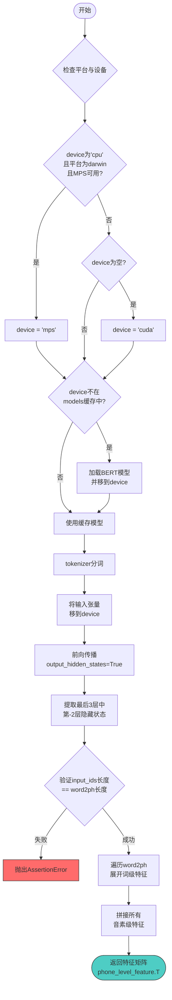

# `Bert-VITS2\oldVersion\V111\text\japanese_bert.py` 详细设计文档

该代码使用预训练的日语BERT模型(bert-base-japanese-v3)提取文本的词级特征,并通过word2ph映射将词级特征转换为音素级特征,支持CPU/MPS/CUDA多设备运行。

## 整体流程

```mermaid
graph TD
A[开始 get_bert_feature] --> B{device参数检查}
B --> C{是macOS且device=='cpu'?}
C -- 是 --> D[设置device='mps']
C -- 否 --> E{device为空?}
E -- 是 --> F[设置device='cuda']
E -- 否 --> G[device保持原值]
D --> H{device在models中?}
F --> H
G --> H
H -- 否 --> I[加载BERT模型并添加到models]
H -- 是 --> J[使用tokenizer分词]
I --> J
J --> K[将输入tensor移动到device]
K --> L[调用模型获取hidden_states]
L --> M[提取最后3层中的倒数第2层]
M --> N{验证input_ids长度==word2ph长度}
N -- 不匹配 --> O[抛出AssertionError]
N -- 匹配 --> P[遍历word2ph映射]
P --> Q[对每个词重复特征word2ph[i]次]
Q --> R[拼接所有音素级特征]
R --> S[返回特征矩阵转置结果]
```

## 类结构

```
该代码为脚本形式,无类定义,仅包含全局变量和函数
```

## 全局变量及字段


### `tokenizer`
    
BERT分词器,用于对输入文本进行分词

类型：`AutoTokenizer`
    


### `models`
    
缓存不同设备上的BERT模型,键为设备名,值为模型实例

类型：`dict`
    


    

## 全局函数及方法


### `get_bert_feature`

获取文本的BERT音素级特征。该函数利用预训练的日语BERT模型（bert-base-japanese-v3）提取文本的深层语义表示，并通过word2ph映射将词级别特征转换为音素级别特征，输出适合语音合成任务的高维特征向量。

参数：

- `text`：`str`，待处理的输入文本字符串
- `word2ph`：`list`，词到音素数量的映射列表，用于将词级别特征展开为音素级别特征
- `device`：`str` 或 `None`，计算设备标识，支持"cuda"、"mps"（Apple Silicon）或"cpu"，默认为None（自动选择cuda）

返回值：`torch.Tensor`，形状为`(特征维度, 音素总数)`的张量，表示音素级别的BERT特征矩阵

#### 流程图



#### 带注释源码

```python
import torch
from transformers import AutoTokenizer, AutoModelForMaskedLM
import sys

# 全局分词器，加载一次可重复使用
tokenizer = AutoTokenizer.from_pretrained("./bert/bert-base-japanese-v3")

# 模型缓存字典，按设备缓存已加载的BERT模型
# 避免同一设备重复加载模型，节省显存和时间
models = dict()


def get_bert_feature(text, word2ph, device=None):
    """
    获取文本的BERT音素级特征
    
    Args:
        text: 输入文本字符串
        word2ph: 词到音素数量的映射列表，指定每个词对应多少个音素
        device: 计算设备，可选'cuda'/'mps'/'cpu'，None则默认cuda
    
    Returns:
        torch.Tensor: 音素级别的BERT特征，形状为(特征维度, 音素总数)
    """
    
    # ------------------------------------------------------------
    # 设备适配逻辑：处理Apple Silicon (MPS) 特殊情况
    # ------------------------------------------------------------
    # 当在macOS系统上运行、且MPS可用、但用户指定了cpu时，
    # 自动切换到MPS以获得更好的性能表现
    if (
        sys.platform == "darwin"
        and torch.backends.mps.is_available()
        and device == "cpu"
    ):
        device = "mps"
    
    # 默认使用CUDA设备（GPU加速）
    if not device:
        device = "cuda"
    
    # ------------------------------------------------------------
    # 模型加载/缓存逻辑
    # ------------------------------------------------------------
    # 按设备缓存模型，避免重复加载
    if device not in models.keys():
        # 首次使用该设备时加载模型并移至对应设备
        models[device] = AutoModelForMaskedLM.from_pretrained(
            "./bert/bert-base-japanese-v3"
        ).to(device)
    
    # ------------------------------------------------------------
    # BERT特征提取
    # ------------------------------------------------------------
    with torch.no_grad():  # 推理模式，禁用梯度计算以节省显存
        # 对输入文本进行tokenize，返回pytorch张量
        inputs = tokenizer(text, return_tensors="pt")
        
        # 将所有输入张量移至指定计算设备
        for i in inputs:
            inputs[i] = inputs[i].to(device)
        
        # 前向传播，获取包含隐藏状态的完整输出
        # output_hidden_states=True 指示模型返回所有层的隐藏状态
        res = models[device](**inputs, output_hidden_states=True)
        
        # 提取指定层的隐藏状态并拼接
        # [-3:-2] 取最后3层中的倒数第2层（即第11层，0-indexed）
        # 使用torch.cat在最后一维拼接，保留特征维度
        # [0] 取batch维度上的第一个样本
        # .cpu() 将结果移回CPU（返回CPU张量）
        res = torch.cat(res["hidden_states"][-3:-2], -1)[0].cpu()
    
    # ------------------------------------------------------------
    # 输入验证：确保token数量与word2ph长度匹配
    # ------------------------------------------------------------
    # word2ph的每个元素代表对应词展开为音素的数量
    # 因此总token数应等于word2ph列表长度
    assert inputs["input_ids"].shape[-1] == len(word2ph)
    
    # ------------------------------------------------------------
    # 词级到音素级的特征展开
    # ------------------------------------------------------------
    word2phone = word2ph
    phone_level_feature = []
    
    # 遍历每个词，将其对应的token特征重复展开为多个音素特征
    for i in range(len(word2phone)):
        # res[i] 是第i个token的BERT特征向量
        # repeat(word2phone[i], 1) 将该特征在第0维重复word2phone[i]次
        # 即一个词的特征复制多份，每份对应一个音素
        repeat_feature = res[i].repeat(word2phone[i], 1)
        phone_level_feature.append(repeat_feature)
    
    # 沿第0维（音素维度）拼接所有音素级特征
    phone_level_feature = torch.cat(phone_level_feature, dim=0)
    
    # 转置返回：形状从(音素数, 特征维度)变为(特征维度, 音素数)
    # 便于后续与时长预测等模块对接
    return phone_level_feature.T
```

---

#### 关键组件信息

| 组件名称 | 一句话描述 |
|---------|-----------|
| `tokenizer` | 全局分词器对象，加载后缓存以重复使用，避免重复初始化开销 |
| `models` | 模型缓存字典，按设备键存储已加载的BERT模型实例，实现设备级模型复用 |

#### 潜在的技术债务或优化空间

1. **全局状态管理风险**：`models`字典作为全局可变状态，在多线程或分布式环境下可能导致竞态条件；建议使用线程安全的缓存机制或单例模式
2. **模型加载路径硬编码**：BERT模型路径`./bert/bert-base-japanese-v3`硬编码在两处，违反DRY原则，应提取为配置常量或函数参数
3. **设备检测逻辑冗余**：MPS设备的特殊处理逻辑与主流程耦合，可抽取为独立的设备选择函数
4. **缺少错误处理**：模型加载失败、文本为空、word2ph维度不匹配等情况仅依赖assertion，缺少友好的错误提示和异常处理
5. **特征层选择hardcode**：使用`[-3:-2]`选取特定层的行为缺乏解释性，应定义为可配置参数
6. **CPU/GPU数据传输**：中间过程存在多次设备间数据迁移（`.cpu()`），可考虑统一设备管理策略

#### 其它项目

**设计目标与约束**
- 目标：为语音合成任务提供音素级别的高维语义特征
- 约束：依赖HuggingFace Transformers库和预训练日语BERT模型

**错误处理与异常设计**
- 输入验证：使用assertion校验token数与word2ph长度一致性
- 缺失处理：模型加载失败时直接抛出异常，无重试机制
- 边界情况：空文本或空word2ph未做特殊处理

**数据流与状态机**
```
输入文本 → Tokenize → BERT前向 → 隐藏状态提取 → 词级→音素级映射 → 特征矩阵输出
```
状态流转：设备初始化 → 模型加载 → 推理模式 → 特征展开 → 结果返回

**外部依赖与接口契约**
- 依赖库：`torch`, `transformers`, `sys`
- 预训练模型：`./bert/bert-base-japanese-v3`（需提前下载）
- 输入契约：`text`非空字符串，`word2ph`为正整数列表且长度等于token数
- 输出契约：返回CPU上的2D张量，形状`(768, 音素总数)`（BERT-base隐藏层维度为768）

## 关键组件


### 张量索引与特征提取

使用`torch.cat(res["hidden_states"][-3:-2], -1)`从BERT的hidden states中提取倒数第三层的特征，通过负索引和切片操作获取特定层的张量。

### 惰性加载与模型缓存

`models`字典作为缓存容器，实现模型的延迟加载。只有当特定device的模型首次被调用时才会加载到对应设备，避免重复加载节省内存。

### 设备自动检测与适配

自动检测MPS (Apple Silicon GPU)、CUDA和CPU设备，根据platform和可用后端动态选择最优计算设备，包含MPS可用但请求CPU时的降级处理逻辑。

### 词到音素映射与特征扩展

通过`word2ph`参数接收词到音素数量的映射，使用`repeat`方法将word-level特征按音素数量扩展为phone-level特征，实现细粒度的特征对齐。

### 分词与输入处理

使用HuggingFace Transformers的AutoTokenizer对日文文本进行分词，转换为PyTorch张量并移至目标计算设备。

### 隐藏状态特征拼接

将选定的hidden state在最后一维进行拼接，将多个隐藏层的表示融合为更丰富的特征向量。

### 音素级特征聚合

通过循环遍历`word2phone`，对每个词的特征进行重复扩展，最后沿dim=0拼接所有phone-level特征，形成完整的序列特征。


## 问题及建议


### 已知问题

-   设备选择逻辑存在错误：当 `device == "cpu"` 时反而设置为 `"mps"`，这与常规逻辑相悖
-   缺少设备可用性检查：未验证 CUDA 或 MPS 是否真正可用，直接使用可能导致运行时错误
-   模型缓存机制存在线程安全隐患：全局字典 `models` 在多线程环境下可能导致竞态条件
-   运行时断言用于业务逻辑检查：使用 `assert` 验证输入长度不适合生产环境，应抛出明确异常
-   缺少输入参数验证：未对 `text`、`word2ph` 的类型和 `word2ph` 长度与文本长度的匹配性进行校验
-   硬编码模型路径：模型路径 `./bert/bert-base-japanese-v3` 硬编码在两处，违反 DRY 原则
-   变量命名不一致：`word2phone` 实际存储的是 `word2ph`，命名具有误导性
-   缺乏资源管理机制：没有提供模型卸载或显式释放显存的接口

### 优化建议

-   修正设备选择逻辑：移除 `device == "cpu"` 时的特殊处理，改为检查 `torch.cuda.is_available()` 和 `torch.backends.mps.is_available()`
-   添加模型缓存类：使用单例模式或依赖注入管理模型生命周期，确保线程安全
-   用自定义异常替代断言：创建专门的异常类处理输入验证失败场景
-   提取配置常量：将模型路径提取为配置项或函数参数
-   统一变量命名：保持 `word2ph` 命名一致，避免混淆
-   添加类型注解和文档字符串：提高代码可读性和可维护性
-   实现上下文管理器或清理方法：支持显式资源释放

## 其它


### 设计目标与约束

本代码的设计目标是利用预训练的日文BERT模型（bert-base-japanese-v3）提取文本的词级别特征，并将这些特征映射到音素级别，以支持后续的语音合成任务。设计约束包括：1）模型文件必须存在于"./bert/bert-base-japanese-v3"目录下；2）仅支持CPU、MPS（Apple Silicon）和CUDA设备；3）输入文本的token数量必须与word2ph参数长度完全匹配；4）输出特征维度由BERT模型隐藏层大小决定（768维）。

### 错误处理与异常设计

代码中的错误处理主要包括：1）使用assert语句验证输入token数量与word2ph长度的一致性，若不匹配则抛出AssertionError；2）模型加载失败时transformers库会抛出异常；3）tokenizer分词失败时抛出异常。当前错误处理较为基础，缺少对模型文件缺失、设备不支持、内存不足等情况的明确处理。建议增加更友好的错误提示和异常捕获机制。

### 数据流与状态机

数据流如下：1）输入原始文本text和词到音素的映射数组word2ph；2）tokenizer对文本进行分词并转换为tensor；3）将tensor移动到指定设备（CPU/MPS/CUDA）；4）BERT模型前向传播获取最后一层隐藏状态；5）提取倒数第三层隐藏状态（-3:-2）；6）根据word2ph将词级别特征重复扩展为音素级别特征；7）拼接所有音素级别特征并转置输出。状态机较简单，主要状态包括：模型加载状态（lazy load）、设备适配状态、推理状态。

### 外部依赖与接口契约

外部依赖包括：1）torch>=1.0；2）transformers>=4.0；3）预训练模型文件（./bert/bert-base-japanese-v3）。接口契约：get_bert_feature(text: str, word2ph: List[int], device: Optional[str] = None) -> torch.Tensor，输入text为待处理文本，word2ph为每个词对应的音素数量列表，device指定计算设备（可选），返回形状为(768, n_phones)的张量，其中n_phones为所有word2ph元素之和。

### 性能考虑

性能优化点：1）使用torch.no_grad()禁用梯度计算，减少内存占用；2）models字典缓存已加载的模型，避免重复加载；3）使用MPS加速Apple Silicon设备的推理。潜在性能问题：1）每次调用都会tokenize输入文本，可考虑缓存；2）循环构建phone_level_feature列表效率较低，可使用torch.repeat_interleave优化；3）未使用批处理推理，单次调用效率有限。

### 安全性考虑

当前代码安全性考量较少，主要风险包括：1）模型文件路径"./bert/bert-base-japanese-v3"为相对路径，可能存在路径遍历风险；2）未对输入text进行长度限制，可能导致内存溢出；3）device参数未做严格校验。建议增加：输入长度限制、路径安全校验、设备参数白名单验证。

### 配置管理

配置项包括：1）模型路径："./bert/bert-base-japanese-v3"（硬编码）；2）默认设备：优先使用cuda，否则回退到cpu/mps；3）特征提取层：固定为倒数第三层（hidden_states[-3:-2]）。建议将模型路径和特征层作为可配置参数，通过配置文件或环境变量管理，提高代码灵活性。

### 测试策略

建议测试用例：1）正常输入测试：给定文本和正确的word2ph，验证输出形状；2）设备兼容性测试：分别使用cpu、cuda、mps设备测试；3）边界条件测试：单字符输入、空文本、word2ph全为1或包含较大值；4）错误输入测试：word2ph长度与token数不匹配、非法device值；5）性能测试：多次调用的平均耗时、内存占用监控。


    