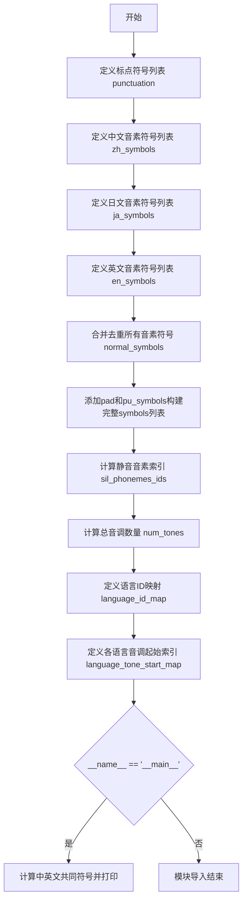

# `Bert-VITS2\oldVersion\V111\text\symbols.py` 详细设计文档

该代码定义了多语言文本转语音（TTS）系统的音素符号表，包括中文、日文和英文的音素集合、标点符号映射、音调数量以及语言标识符映射，用于构建多语言语音合成模型的词汇表。

## 整体流程



## 类结构

```
模块: symbols.py (全局变量和配置模块)
└── 无类定义 (纯数据定义模块)
```

## 全局变量及字段


### `punctuation`
    
标点符号列表，包含常见的句子结束符和分隔符

类型：`list[str]`
    


### `pu_symbols`
    
标点符号集合，包含punctuation以及特殊符号SP(空格)和UNK(未知)

类型：`list[str]`
    


### `pad`
    
填充符号，用于序列padding操作

类型：`str`
    


### `zh_symbols`
    
中文音素符号列表，包含汉语拼音音节和元音辅音

类型：`list[str]`
    


### `num_zh_tones`
    
中文音调数量，包含5个声调加1个轻声

类型：`int`
    


### `ja_symbols`
    
日语音素符号列表，包含假名对应的音素表示

类型：`list[str]`
    


### `num_ja_tones`
    
日语音调数量，日语为声调语言使用单一值

类型：`int`
    


### `en_symbols`
    
英文音素符号列表，采用ARPAbet音标系统

类型：`list[str]`
    


### `num_en_tones`
    
英文音调数量，包含4种语调变化

类型：`int`
    


### `normal_symbols`
    
归一化后的符号集合，三种语言符号去重并排序

类型：`list[str]`
    


### `symbols`
    
完整符号表，包含padding符、归一化符号和标点符号

类型：`list[str]`
    


### `sil_phonemes_ids`
    
静音音素在符号表中的索引位置列表

类型：`list[int]`
    


### `num_tones`
    
总音调数量，三种语言音调数之和

类型：`int`
    


### `language_id_map`
    
语言标识到ID的映射，ZH=0, JP=1, EN=2

类型：`dict[str, int]`
    


### `num_languages`
    
支持的语言数量，共3种语言

类型：`int`
    


### `language_tone_start_map`
    
各语言音调起始索引的映射，用于多语言音调编码

类型：`dict[str, int]`
    


    

## 全局函数及方法


## 关键组件


### 1. 统一符号表构建组件

该代码模块的核心功能是构建一个统一的多语言音素符号表（phoneme vocabulary），整合中文、日文和英文的音素符号，并提供语言ID映射和音调（tone）索引管理，为多语言语音合成或识别系统提供基础的符号支持。

### 2. 语言符号定义组件

包含三个语言的音素符号列表定义：中文音素符号列表（zh_symbols）包含107个符号，涵盖声母、韵母及带声调标识的单元音；日文音素符号列表（ja_symbols）包含46个符号，涵盖假名对应的音素；英文音素符号列表（en_symbols）包含39个符号，采用CMU音素标注集。该组件还定义了各语言的声调数量（num_zh_tones=6, num_ja_tones=1, num_en_tones=4）。

### 3. 标点与静音符号组件

定义了标点符号列表（punctuation），包含常见标点如"!"、"?"、"…"、","、"."、"'"、"-"；并在此基础上扩展为完整的标点与特殊符号列表（pu_symbols），增加了静音符号"SP"和未知符号"UNK"，用于语音处理中的边界标记和未识别字符处理。

### 4. 语言映射管理组件

提供了语言到ID的映射字典（language_id_map），将"ZH"映射为0、"JP"映射为1、"EN"映射为2；计算语言总数（num_languages=3）；并构建了语言声调起始索引映射表（language_tone_start_map），用于在统一的音素序列中定位各语言声调的起始位置，中文从0开始，日文从6开始，英文从7开始。

### 5. 符号表整合与索引组件

通过集合运算合并三个语言的符号并排序（normal_symbols），再与填充符（pad）和标点符号（pu_symbols）整合形成最终符号表（symbols）；同时生成静音/标点音素的索引列表（sil_phonemes_ids），用于快速查找特殊音素的位置。该组件还计算总声调数量（num_tones=11）。

### 6. 测试与验证组件

包含一个简单的测试入口（if __name__ == "__main__"），用于查找中文和英文音素符号的交集，验证两个语言符号集之间是否存在重叠，可用于分析多语言处理时的符号冲突问题。


## 问题及建议


### 已知问题

- **全局状态管理混乱**：所有变量均为全局常量，缺乏封装和模块化设计，数据分散且难以追踪依赖关系
- **索引计算效率低下**：`sil_phonemes_ids = [symbols.index(i) for i in pu_symbols]` 使用线性查找的 `index()` 方法，时间复杂度为 O(n²)，当符号数量增加时性能显著下降
- **硬编码维护困难**：语言映射（`language_id_map`）和音调起始位置（`language_tone_start_map`）需要手动保持同步，新增语言时容易遗漏更新
- **代码组织不当**：测试代码（`if __name__ == "__main__"` 块）直接混合在配置数据定义中，不符合良好的代码组织规范
- **缺乏类型注解**：所有变量和方法均无类型提示，降低了代码的可读性和 IDE 辅助支持
- **重复符号处理**：虽然使用 `set` 去重，但未提供工具函数来查询或处理语言间重复的符号
- **魔数缺乏解释**：`num_ja_tones = 1`、`num_en_tones = 4` 等数值无注释说明其含义和来源

### 优化建议

- **引入字典映射替代线性查找**：使用 `{symbol: index for index, symbol in enumerate(symbols)}` 创建符号到索引的映射，将 `sil_phonemes_ids` 的计算复杂度从 O(n²) 降至 O(n)
- **封装为配置类或模块**：将全局变量封装为配置类或专用模块，提供统一的访问接口和初始化方法
- **使用数据驱动设计**：将语言符号、音调数量等配置数据提取为 YAML/JSON 配置文件，通过加载逻辑自动生成映射表，减少硬编码
- **添加类型注解**：为所有变量和计算结果添加明确的类型注解，提升代码可维护性
- **分离测试代码**：将 `if __name__ == "__main__"` 中的测试逻辑移至独立的测试文件或 pytest 测试函数中
- **添加文档注释**：为各语言符号列表、音调数量配置等添加 docstring 说明其用途和数据来源

## 其它


### 设计目标与约束

该代码的核心设计目标是构建一个统一的、多语言音素符号表系统，用于支持中文、日文、英文三种语言的语音合成任务。主要约束包括：1）符号集必须包含每种语言的完整音素集合；2）需要保留标点符号和特殊符号（如空格UNK）；3）符号索引需要从0开始，且保留索引0作为padding符号；4）语言ID和音调ID的映射需要保持连续性以便后续模型处理。

### 错误处理与异常设计

当前代码为纯数据定义文件，未包含运行时错误处理逻辑。主要潜在问题包括：1）语言标识符必须为"ZH"、"JP"、"EN"之一，大小写敏感；2）符号列表中不应包含重复元素（已通过set去重）；3）language_tone_start_map的值必须与实际的音调数量保持一致。后续使用时应在数据校验模块中添加对这些约束的验证逻辑。

### 数据流与状态机

该模块为配置型数据流，主要流程为：1）分别定义三种语言的原始音素符号列表；2）分别定义每种语言的音调数量；3）合并所有语言的符号并去重；4）在符号集头部添加padding符号，尾部添加标点符号；5）计算各语言在音调空间中的起始偏移量；6）生成语言ID映射表和静音音素ID列表。整个过程为单向数据流动，无状态机设计。

### 外部依赖与接口契约

本模块无外部依赖，可直接被其他模块导入使用。主要接口契约包括：symbols列表包含所有可用符号，索引从0开始；language_id_map提供字符串语言标识到整数ID的映射；language_tone_start_map提供各语言音调空间的起始偏移；sil_phonemes_ids列表包含所有静音/标点符号的索引。当被下游模块使用时，下游模块应确保使用正确的语言标识符并尊重音调空间的划分。

### 符号表设计考量

符号表设计遵循以下原则：1）唯一性：使用set确保符号不重复；2）有序性：最终symbols列表经过sorted排序，保证跨环境一致性；3）完整性：覆盖三种语言的核心音素以及常用标点；4）可扩展性：预留了UNK符号处理未知字符；5）兼容性：sil_phonemes_ids的提取支持下游模块快速识别非语言音频标记。

### 初始化与配置流程

模块初始化流程如下：首先定义各语言基础音素集合（zh_symbols、ja_symbols、en_symbols），然后定义对应音调数量，接着合并去重生成normal_symbols，再拼接padding和标点符号生成最终symbols，最后计算各语言的辅助映射数据。整个初始化在模块导入时执行，无需显式调用初始化函数。

### 一致性维护要点

为保证数据一致性，需注意：1）num_zh_tones、num_ja_tones、num_en_tones必须与对应语言符号集的实际音调数量匹配；2）language_tone_start_map中JP的起始值必须等于num_zh_tones，EN的起始值必须等于num_zh_tones+num_ja_tones；3）num_languages必须等于language_id_map中的语言数量。任何修改都应同步更新相关联的所有变量。

### 性能优化空间

当前实现主要性能考量：1）使用set去重的时间复杂度为O(n)，对于数百个符号性能可忽略；2）symbols.index()操作在sil_phonemes_ids计算中会被调用多次（次数等于pu_symbols长度），可考虑预先计算索引字典以空间换时间；3）sorted操作对最终列表排序，确保一致性但 slight overhead。总体而言该模块为轻量级配置模块，优化优先级较低。

### 跨平台与兼容性说明

该代码使用纯Python标准库，无平台相关性，可在不同操作系统和Python版本（3.6+）间无缝移植。符号定义为字符串列表，兼容Unicode编码。由于不涉及文件IO或网络操作，无跨平台路径或编码问题。设计时已考虑字节序无关性。

### 使用示例与调用模式

下游模块的典型调用方式为：from symbols import symbols, language_id_map, language_tone_start_map, sil_phonemes_ids。主要使用场景包括：1）文本预处理时将字符映射为符号索引；2）根据language_id_map确定语言ID；3）使用language_tone_start_map进行音调偏移计算；4）使用sil_phonemes_ids识别非语言时段。模块级if __name__ == "__main__"块展示了符号集合的调试用途。

    