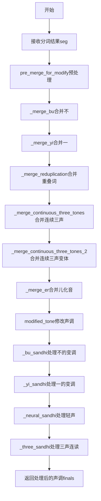
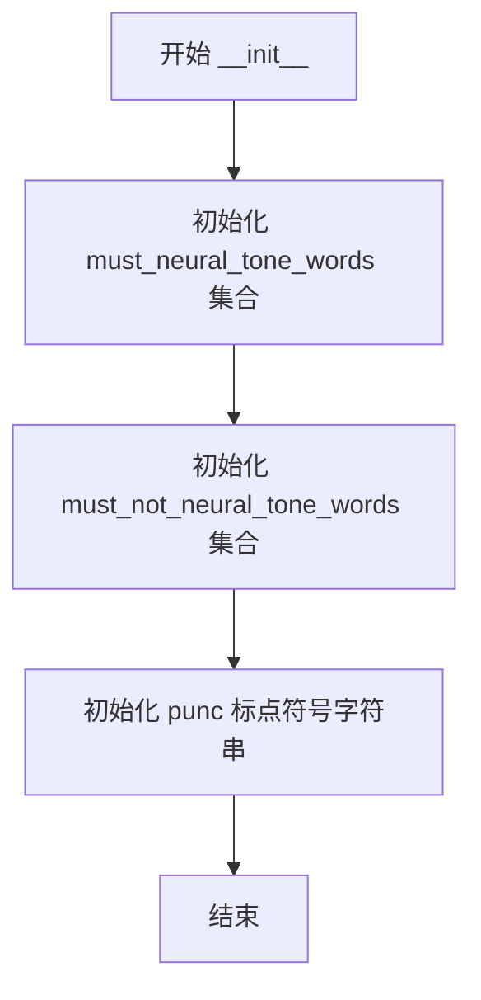
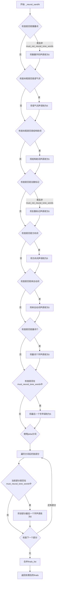
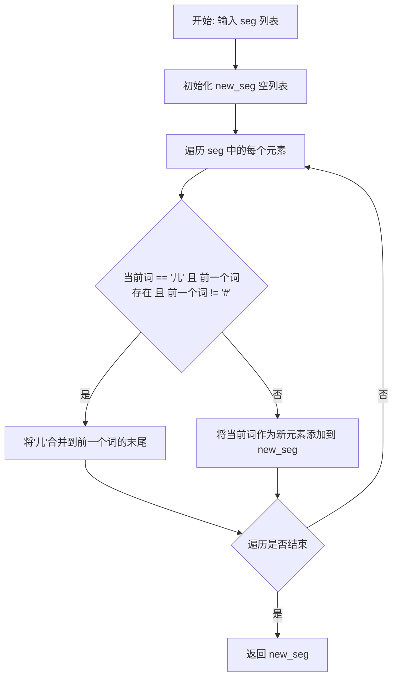
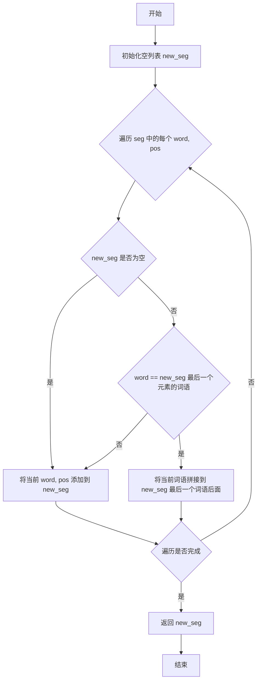
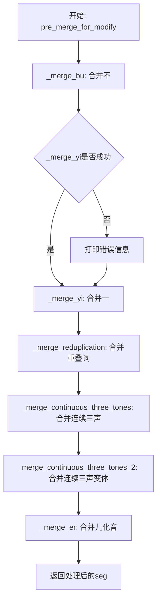
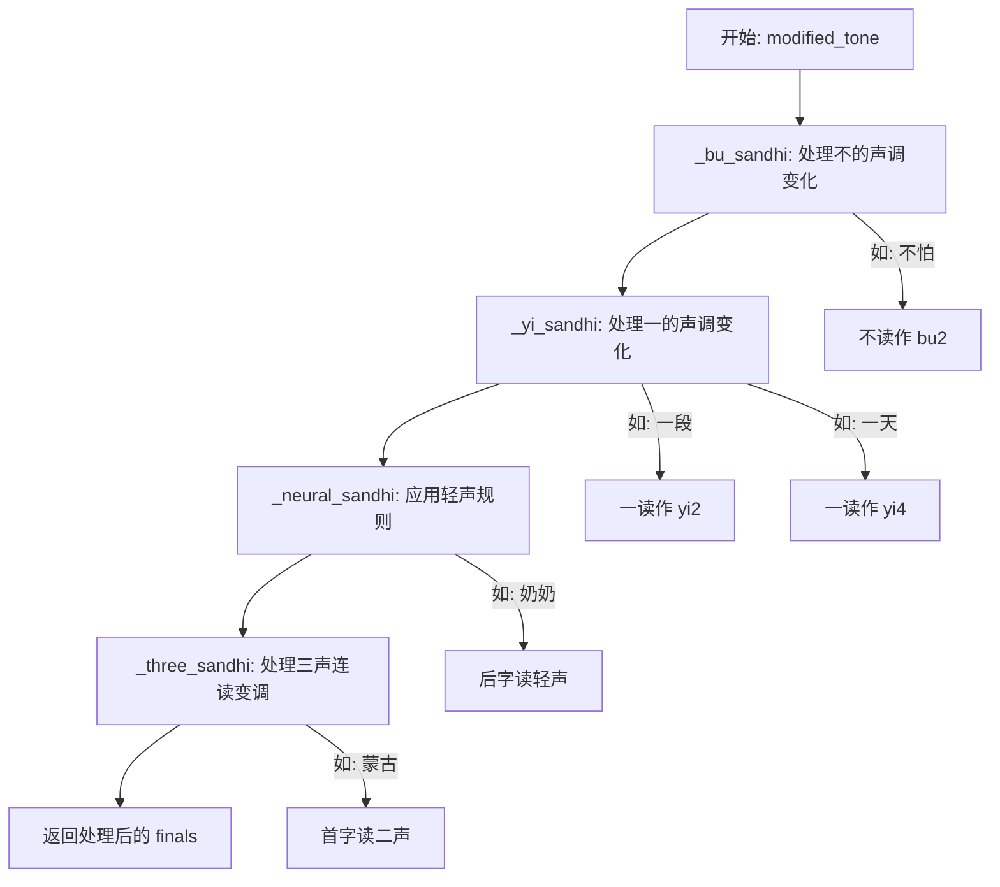

# `Bert-VITS2\oldVersion\V111\text\tone_sandhi.py` 详细设计文档

这是一个中文语音合成中的声调处理模块（tone sandhi），主要处理中文连续语音中的变调规则，包括轻声、"不"、"一"、三声连读、儿化音等变调情况的识别与处理，确保合成语音符合自然语言的发音规律。

## 整体流程



## 类结构

```
ToneSandhi (声调变调处理类)
├── must_neural_tone_words (必读轻声词集合)
├── must_not_neural_tone_words (不读轻声词集合)
├── punc (标点符号集合)
└── methods (15个方法)
```

## 全局变量及字段


### `ToneSandhi.must_neural_tone_words`
    
A set of Chinese words that must be pronounced with a neutral tone (tone 5).

类型：`set`
    


### `ToneSandhi.must_not_neural_tone_words`
    
A set of Chinese words that must not be pronounced with a neutral tone (tone 5).

类型：`set`
    


### `ToneSandhi.punc`
    
A string containing Chinese punctuation marks used during tone sandhi processing.

类型：`str`
    
    

## 全局函数及方法


### `ToneSandhi.__init__`

该方法是 `ToneSandhi` 类的构造函数，负责初始化类实例的核心属性，包括必须读轻声的词语集合、不应读轻声的词语集合以及标点符号集合，为后续的中文声调转换处理提供数据支持。

参数：

- `self`：ToneSandhi 类实例本身，无需显式传递

返回值：`None`，该方法为构造函数，不返回任何值

#### 流程图



#### 带注释源码

```python
def __init__(self):
    # 初始化必须读轻声的词语集合
    # 这些词语在中文中约定俗成读轻声，如"麻烦"、"麻利"、"鸳鸯"等
    self.must_neural_tone_words = {
        "麻烦",
        "麻利",
        "鸳鸯",
        "高粱",
        "骨头",
        # ... (共计约500+个词语)
        # 用于在声调转换时判断词语是否需要读轻声
    }
    
    # 初始化不应读轻声的词语集合
    # 这些词语虽然可能是重叠词，但有特定含义不应读轻声
    # 如"男子"（男人）、"女子"（女人）、"分子"等
    self.must_not_neural_tone_words = {
        "男子",
        "女子",
        "分子",
        "原子",
        "量子",
        "莲子",
        "石子",
        "瓜子",
        "电子",
        "人人",
        "虎虎",
    }
    
    # 初始化标点符号集合，用于后续声调处理时判断"一"后是否接标点
    # 如果"一"后面是标点符号，则仍读一声
    self.punc = "：，；。？！""'''':,;.?!"
```


### ToneSandhi._neural_sandhi

该方法是ToneSandhi类中的核心方法之一，用于处理中文轻声（neutral tone）变调规则。它根据词语的词性、位置和结构，将符合轻声规则的汉字拼音韵母末尾的数字改为"5"（表示轻声）。

参数：

- `word`：`str`，需要处理变调的汉字词语
- `pos`：`str`，来自jieba分词的词性标注（如"n"名词、"v"动词、"a"形容词等）
- `finals`：`List[str]`，汉字对应的拼音韵母列表，每个元素如"ia1"、"i3"等，末尾数字表示声调

返回值：`List[str]`，处理后的拼音韵母列表，轻声音节的韵母末尾被修改为"5"

#### 流程图



#### 带注释源码

```python
def _neural_sandhi(self, word: str, pos: str, finals: List[str]) -> List[str]:
    """
    处理中文轻声变调规则
    
    轻声规则包括：
    1. 重叠词：如奶奶、试试
    2. 语气词：如吧、呢、啊
    3. 结构助词：如的、地、得
    4. 复数标记：如们、子
    5. 方向词：如上下、往来
    6. 量词：个
    7. 特定词语列表中的词
    """
    
    # 处理重叠词（Reduplication words）
    # 例如：奶奶(nǎinai)、试试(shìshi)、旺旺(wàngwang)
    # 仅对名词(n)、动词(v)、形容词(a)且不在must_not_neural_tone_words中的词处理
    for j, item in enumerate(word):
        if (
            j - 1 >= 0
            and item == word[j - 1]  # 当前字与前一个字相同
            and pos[0] in {"n", "v", "a"}  # 词性为名词、动词或形容词
            and word not in self.must_not_neural_tone_words  # 不在排除列表中
        ):
            # 将该字韵母的声调改为5（轻声）
            finals[j] = finals[j][:-1] + "5"
    
    # 查找"个"字的位置，用于后续量词判断
    ge_idx = word.find("个")
    
    # 语气词（Sentence-final particles）处理
    # 例如：走吧、怎么办呢、啊、我走呐、您好噻
    if len(word) >= 1 and word[-1] in "吧呢啊呐噻嘛吖嗨呐哦哒额滴哩哟喽啰耶喔诶":
        finals[-1] = finals[-1][:-1] + "5"
    # 结构助词（Structural particles）处理
    # 例如：我的、飞快地、记得
    elif len(word) >= 1 and word[-1] in "的地得":
        finals[-1] = finals[-1][:-1] + "5"
    # 复数标记和名词后缀处理
    # 例如：孩子们、桌子（"子"作为名词后缀）
    # 注意：男子、女子等词不在此列（must_not_neural_tone_words）
    elif (
        len(word) > 1
        and word[-1] in "们子"
        and pos in {"r", "n"}  # 人称代词(r)或名词(n)
        and word not in self.must_not_neural_tone_words
    ):
        finals[-1] = finals[-1][:-1] + "5"
    # 方向词/方位词处理（Direction/Location words）
    # 例如：桌上、地下、家里
    elif len(word) > 1 and word[-1] in "上下里" and pos in {"s", "l", "f"}:
        finals[-1] = finals[-1][:-1] + "5"
    # 趋向动词处理（Directional verbs）
    # 例如：上来、下去、进来、回去、过来、起来、过去、开来
    elif len(word) > 1 and word[-1] in "来去" and word[-2] in "上下进出回过起开":
        finals[-1] = finals[-1][:-1] + "5"
    # 量词"个"的特殊处理
    # 当"个"前面是数字或特定量词时，"个"读轻声
    # 例如：一个、两个、半个、几个、多个、整个、每个
    elif (
        ge_idx >= 1
        and (
            word[ge_idx - 1].isnumeric()  # 数字
            or word[ge_idx - 1] in "几有两半多各整每做是"  # 特定量词或数词
        )
    ) or word == "个":
        finals[ge_idx] = finals[ge_idx][:-1] + "5"
    else:
        # 最后检查是否在必须读轻声的词语列表中
        # 支持完整词匹配和词语末尾匹配
        if (
            word in self.must_neural_tone_words
            or word[-2:] in self.must_neural_tone_words
        ):
            finals[-1] = finals[-1][:-1] + "5"

    # 使用jieba对词语进行分词处理
    # 对于合成词，需要分别处理各部分
    word_list = self._split_word(word)
    
    # 根据分词结果将finals分成对应的部分
    finals_list = [finals[: len(word_list[0])], finals[len(word_list[0]) :]]
    
    # 遍历分词后的各部分，应用轻声规则
    for i, word in enumerate(word_list):
        # 常规轻声词（Conventional neutral tone words）
        # 检查完整词或词的后两位是否在must_neural_tone_words中
        if (
            word in self.must_neural_tone_words
            or word[-2:] in self.must_neural_tone_words
        ):
            # 将该部分最后一个字的声调改为5
            finals_list[i][-1] = finals_list[i][-1][:-1] + "5"
    
    # 合并处理后的各部分finals
    finals = sum(finals_list, [])
    return finals
```


### ToneSandhi._bu_sandhi

处理中文"不"字的变调规则，根据后续字的声调将"不"从原本的声调转换为相应的变调（"不"在去声前读作第二声，其余情况读作轻声）。

参数：

- `word`：`str`，待处理的汉字词语
- `finals`：`List[str]`，词语对应的拼音韵母列表（包含声调标记）

返回值：`List[str]`，经过变调处理后的拼音韵母列表

#### 流程图

```mermaid
flowchart TD
    A[开始 _bu_sandhi] --> B{word长度为3且<br>word[1] == '不'}
    B -->|是| C[将finals[1]的声调改为5<br>例如: 看不懂 → 看不tong5]
    B -->|否| D[遍历word中的每个字符]
    D --> E{当前字符 == '不'<br>且下一个字符存在<br>且下一个字符声调为4}
    E -->|是| F[将当前'不'的声调改为2<br>例如: 不怕 → bu2怕]
    E -->|否| G[继续遍历下一个字符]
    C --> H[返回处理后的finals]
    F --> H
    G --> D
```

#### 带注释源码

```python
def _bu_sandhi(self, word: str, finals: List[str]) -> List[str]:
    """
    处理"不"的变调规则
    
    变调规则:
    1. "不"在去声(声调4)前读作第二声(bu2)
    2. "不"在某些特定词语中读作轻声(bu5), 如"来不及"、"看不懂"
    
    参数:
        word: str, 待处理的汉字词语
        finals: List[str], 词语对应的拼音韵母列表
    
    返回:
        List[str], 经过变调处理后的拼音韵母列表
    """
    
    # 特殊情况: 三字词语且"不"在中间位置, 如"看不懂"
    # 此时"不"读作轻声(声调5)
    if len(word) == 3 and word[1] == "不":
        # 将"不"的韵母声调从原声调改为5(轻声)
        finals[1] = finals[1][:-1] + "5"
    else:
        # 遍历词语中的每个字符
        for i, char in enumerate(word):
            # "不"在去声(声调4)前应读作第二声(bu2)
            # 例如: 不怕(bu4 + pa4) → bu2 + pa4
            if char == "不" and i + 1 < len(word) and finals[i + 1][-1] == "4":
                # 将"不"的韵母声调从4改为2
                finals[i] = finals[i][:-1] + "2"
    
    return finals
```


### `ToneSandhi._yi_sandhi`

该方法用于处理中文汉字"一"的声调变化（变调）逻辑，根据"一"在词语中的位置和上下文（后续汉字的声调），自动调整"一"的拼音声调。这是中文声调处理模块的重要组成部分。

参数：

-   `word`：`str`，待处理的词语
-   `finals`：`List[str]`，词语的拼音韵母列表（带声调）

返回值：`List[str]`，处理后的拼音韵母列表

#### 流程图

```mermaid
flowchart TD
    A[开始 _yi_sandhi] --> B{word中是否包含"一"}
    B -->|否| C[返回原finals]
    B -->|是| D{是否为数字序列<br/>如: 一零零, 二一零}
    D -->|是| C
    D -->|否| E{word长度是否为3<br/>且第二个字是"一"<br/>且首尾相同<br/>如: 看一看}
    E -->|是| F[将"一"设为轻声5<br/>返回finals]
    E -->|否| G{word是否以"第一"开头}
    G -->|是| H[将"一"设为第1声<br/>返回finals]
    G -->|否| I[遍历word中的每个字符]
    I --> J{找到"一"且<br/>后面有其他字}
    J -->|否| K[返回处理后的finals]
    J -->|是| L{下一字的声调是否为第4声}
    L -->|是| M[将"一"设为第2声<br/>yi2]
    L -->|否| N{下一字是否为标点}
    N -->|是| K
    N -->|否| O[将"一"设为第4声<br/>yi4]
    M --> K
    O --> K
```

#### 带注释源码

```python
def _yi_sandhi(self, word: str, finals: List[str]) -> List[str]:
    # 场景1: "一"在数字序列中，直接返回原韵母
    # 例如: 一零零, 二一零 (纯数字序列，"一"读原声调)
    if word.find("一") != -1 and all(
        [item.isnumeric() for item in word if item != "一"]
    ):
        return finals
    
    # 场景2: "一"在重叠词中间，读轻声5
    # 例如: 看一看 (看一看)
    # 条件: 词语长度为3，中间是"一"，首尾相同
    elif len(word) == 3 and word[1] == "一" and word[0] == word[-1]:
        finals[1] = finals[1][:-1] + "5"
    
    # 场景3: "一"作为序数词，读第1声
    # 例如: 第一 (di1 yi1)
    elif word.startswith("第一"):
        finals[1] = finals[1][:-1] + "1"
    
    # 场景4: 根据后续字的声调决定"一"的声调
    else:
        # 遍历词语中的每个字符
        for i, char in enumerate(word):
            if char == "一" and i + 1 < len(word):
                # "一"在第4声前，读第2声
                # 例如: 一段 (yi2 duan4)
                if finals[i + 1][-1] == "4":
                    finals[i] = finals[i][:-1] + "2"
                # "一"在非第4声前，读第4声
                # 例如: 一天 (yi1 tian1 -> yi4 tian1)
                else:
                    # 特殊情况: 如果"一"后面是标点，仍然读第1声
                    if word[i + 1] not in self.punc:
                        finals[i] = finals[i][:-1] + "4"
    return finals
```


### `ToneSandhi._split_word`

该方法利用 jieba 的分词搜索功能将输入的词语分割成两个子词，并返回包含这两个子词的列表。主要用于后续的三声连读变调处理，将复合词拆分为更小的语言单元以便分别处理声调。

参数：

- `word`：`str`，需要分割的中文词语

返回值：`List[str]`，返回分割后的两个子词组成的列表

#### 流程图

```mermaid
flowchart TD
    A[开始 _split_word] --> B[jieba.cut_for_search 对词语分词]
    B --> C[按子词长度升序排序]
    C --> D[获取最短子词 first_subword]
    D --> E{判断子词在原词中的位置}
    E -->|first_begin_idx == 0| F[second_subword = word[len(first_subword):]]
    E -->|first_begin_idx != 0| G[second_subword = word[:-len(first_subword)]]
    F --> H[new_word_list = [first_subword, second_subword]]
    G --> H
    H --> I[返回 new_word_list]
```

#### 带注释源码

```python
def _split_word(self, word: str) -> List[str]:
    """
    将输入的词语分割成两个子词，用于三声连读变调处理
    
    该方法使用 jieba 的搜索引擎模式进行分词，然后按照子词长度排序，
    找出最短的子词作为第一个词，根据其位置将原词分割成两部分。
    
    Args:
        word: 需要分割的中文词语
        
    Returns:
        包含两个子词的列表 [第一个子词, 第二个子词]
    """
    # 使用 jieba 的搜索引擎模式进行分词，返回所有可能的分词结果
    word_list = jieba.cut_for_search(word)
    # 将迭代器转换为列表
    word_list = list(word_list)
    # 按子词长度升序排序，确保最短的子词排在前面
    # 这样可以优先获取最基础的分词单元
    word_list = sorted(word_list, key=lambda i: len(i), reverse=False)
    # 获取最短的子词作为第一个分词结果
    first_subword = word_list[0]
    # 查找第一个子词在原词语中的起始位置
    first_begin_idx = word.find(first_subword)
    # 判断第一个子词是否位于词语的开头位置
    if first_begin_idx == 0:
        # 如果子词在开头，第二个子词为从子词长度开始的剩余部分
        second_subword = word[len(first_subword):]
        # 组合新的词语列表：[前缀子词, 剩余子词]
        new_word_list = [first_subword, second_subword]
    else:
        # 如果子词不在开头，第二个子词为原词开头到子词位置的部分
        second_subword = word[:-len(first_subword)]
        # 组合新的词语列表：[剩余子词, 后缀子词]
        new_word_list = [second_subword, first_subword]
    # 返回分割后的两个子词
    return new_word_list
```


### `ToneSandhi._three_sandhi`

该方法实现汉语三声连读变调（Third Tone Sandhi）规则处理。当两个或三个三声音节连续出现时，根据普通话语音规则将第一个三声音节转换为二声音节。

参数：
- `word`：`str`，需要处理的汉字词
- `finals`：`List[str]`，词的音节韵母列表（带声调）

返回值：`List[str]`，处理后的音节韵母列表

#### 流程图

```mermaid
flowchart TD
    A[开始: _three_sandhi] --> B{len(word) == 2 且<br/>全是三声?}
    B -->|是| C[将finals[0]改为二声]
    C --> M[返回finals]
    B -->|否| D{len(word) == 3?}
    D -->|是| E{全是三声?}
    D -->|否| F{len(word) == 4?}
    E -->|是| G{第一个子词长度==2?}
    E -->|否| H[按子词分割finals]
    G -->|是| I[将finals[0]和finals[1]<br/>都改为二声]
    G -->|否| J[将finals[1]改为二声]
    H --> K{子部分全是三声<br/>且长度==2?}
    K -->|是| L[将该子部分的<br/>第一个音节改为二声]
    K -->|否| N{第二个子部分首音节是三声<br/>且第一个子部分末音节是三声?}
    N -->|是| O[将第一个子部分的<br/>最后一个音节改为二声]
    N -->|否| P[不修改]
    F -->|是| Q[将finals分成[0:2]和[2:]]
    Q --> R{每个子部分<br/>全是三声?}
    R -->|是| S[将每个子部分的<br/>第一个音节改为二声]
    R -->|否| P
    P --> M
    I --> M
    J --> M
    L --> M
    O --> M
    S --> M
```

#### 带注释源码

```python
def _three_sandhi(self, word: str, finals: List[str]) -> List[str]:
    """
    处理三声连读变调（Third Tone Sandhi）
    
    汉语中两个或三个三声音节连读时，第一个三声变为二声。
    例如："蒙古" -> "ménggǔ"（两个三声连读，第一个变二声）
          "蒙古包" -> "ménggǔbāo"（三个三声连读，前两个变二声）
    
    参数:
        word: str, 要处理的汉字词
        finals: List[str], 汉字对应的韵母列表（带声调标记）
    
    返回:
        List[str]: 处理后的韵母列表
    """
    
    # 情况1：双字词，两个音节都是三声
    # 规则：第一个三声变为二声
    # 例如："美好" -> "měihǎo" -> "méihǎo"
    if len(word) == 2 and self._all_tone_three(finals):
        finals[0] = finals[0][:-1] + "2"
    
    # 情况2：三字词
    elif len(word) == 3:
        # 使用jieba分词，将词分成两个子词
        word_list = self._split_word(word)
        
        # 情况2.1：三个音节都是三声（三字全三声）
        if self._all_tone_three(finals):
            # 情况2.1.1：双音节 + 单音节（如"蒙古/包"）
            # 规则：前两个三声都变为二声
            if len(word_list[0]) == 2:
                finals[0] = finals[0][:-1] + "2"
                finals[1] = finals[1][:-1] + "2"
            # 情况2.1.2：单音节 + 双音节（如"纸/老虎"）
            # 规则：后两个三声变为二声（实际上只变第二个）
            elif len(word_list[0]) == 1:
                finals[1] = finals[1][:-1] + "2"
        
        # 情况2.2：不是全部三声，需要更细致的处理
        else:
            # 将finals按子词长度分割成两部分
            finals_list = [finals[: len(word_list[0])], finals[len(word_list[0]) :]]
            
            # 检查分割后的两部分
            if len(finals_list) == 2:
                for i, sub in enumerate(finals_list):
                    # 情况2.2.1：子部分是两个三声（如"所有/人"中的"所有"）
                    # 规则：该部分的第一个三声变为二声
                    if self._all_tone_three(sub) and len(sub) == 2:
                        finals_list[i][0] = finals_list[i][0][:-1] + "2"
                    
                    # 情况2.2.2：第一个子部分末尾是三声，第二个子部分开头是三声
                    # 但第二个子部分不是全部三声（如"好/喜欢"）
                    # 规则：将第一个子部分的最后一个音节变为二声
                    # 这是一个特殊的语音协同发音现象
                    elif (
                        i == 1
                        and not self._all_tone_three(sub)
                        and finals_list[i][0][-1] == "3"
                        and finals_list[0][-1][-1] == "3"
                    ):
                        finals_list[0][-1] = finals_list[0][-1][:-1] + "2"
                    
                    # 合并处理后的子部分
                    finals = sum(finals_list, [])
    
    # 情况3：四字词（成语），将其分成两个双音节词处理
    # 例如："风调雨顺" -> "fēngtiáo yǔshùn"
    # 规则：如果某个双音节部分全是三声，则该部分第一个音节变二声
    elif len(word) == 4:
        # 将四个音节分成两个双音节部分
        finals_list = [finals[:2], finals[2:]]
        finals = []
        
        # 分别处理每个双音节部分
        for sub in finals_list:
            if self._all_tone_three(sub):
                # 如果该部分全是三声，将第一个音节变为二声
                sub[0] = sub[0][:-1] + "2"
            finals += sub
    
    return finals
```


### `ToneSandhi._all_tone_three`

该函数用于检查给定的韵母列表（finals）中的所有韵母是否都是第三声（tone three）。在汉语语音学中，第三声是一个特定的声调，该函数通过检查每个韵母字符串的最后一个字符是否为"3"来判断。

参数：

- `finals`：`List[str]`，汉字的韵母列表，每个元素为带声调标记的韵母字符串（如"ia1"、"i3"等）

返回值：`bool`，如果列表中所有韵母的最后一个字符都是"3"（即都是第三声），则返回 `True`，否则返回 `False`

#### 流程图

```mermaid
flowchart TD
    A[开始] --> B{遍历 finals 中的每个元素 x}
    B --> C{检查 x[-1] == '3'}
    C -->|全部满足| D[返回 True]
    C -->|存在不满足| E[返回 False]
    D --> F[结束]
    E --> F
```

#### 带注释源码

```python
def _all_tone_three(self, finals: List[str]) -> bool:
    """
    检查韵母列表是否全部为第三声
    
    参数:
        finals: List[str] - 包含多个韵母的列表，每个韵母字符串的最后一个字符表示声调
               例如：'ia1'表示一声，'i3'表示三声
    
    返回值:
        bool - 如果所有韵母都是第三声则返回True，否则返回False
    
    示例:
        >>> self._all_tone_three(['ia3', 'i3'])
        True
        >>> self._all_tone_three(['ia1', 'i3'])
        False
    """
    # 使用all()函数检查列表中的每个元素
    # x[-1]获取韵母字符串的最后一个字符（声调标记）
    # 如果所有韵母的最后一个字符都是'3'，则返回True
    return all(x[-1] == "3" for x in finals)
```


### `ToneSandhi._merge_bu`

该函数用于合并"不"字与相邻词语，防止分词后"不"字单独出现导致声调处理错误。

参数：

-  `seg`：`List[Tuple[str, str]]`，分词后的词性标注序列，每个元素为（词语，词性）的元组

返回值：`List[Tuple[str, str]]`，合并"不"后的新词性标注序列

#### 流程图

```mermaid
flowchart TD
    A[开始] --> B[初始化 new_seg = [], last_word = '']
    B --> C{遍历 seg 中的每个 word, pos}
    C -->|是| D{last_word == '不'}
    D -->|是| E[word = last_word + word]
    D -->|否| F[不合并]
    E --> G{word != '不'}
    G -->|是| H[new_seg.append((word, pos))]
    G -->|否| I[不添加]
    H --> J[last_word = word[:]]
    I --> J
    F --> J
    C -->|否| K{遍历结束}
    K --> L{last_word == '不'}
    L -->|是| M[new_seg.append(('不', 'd'))]
    L -->|否| N[不添加]
    M --> O[返回 new_seg]
    N --> O
```

#### 带注释源码

```python
# 合并"不"和其后面的词语
# 如果不合并，"不"有时会单独出现，可能导致声调错误
def _merge_bu(self, seg: List[Tuple[str, str]]) -> List[Tuple[str, str]]:
    new_seg = []          # 存储合并后的词性序列
    last_word = ""        # 记录上一个处理的词语
    
    # 遍历词性序列中的每个词语和词性
    for word, pos in seg:
        # 如果上一个词是"不"，则将当前词与"不"合并
        if last_word == "不":
            word = last_word + word
        
        # 如果合并后的词不是"不"，则添加到新序列中
        if word != "不":
            new_seg.append((word, pos))
        
        # 更新 last_word 为当前词语
        last_word = word[:]
    
    # 处理序列末尾的"不"字
    if last_word == "不":
        # 为末尾的"不"添加默认词性'd'（副词）
        new_seg.append((last_word, "d"))
        last_word = ""
    
    # 返回合并后的词性序列
    return new_seg
```


### ToneSandhi._merge_yi

该函数用于合并中文分词结果中的"一"字与其前后词语，主要实现两个功能：1）将"一"与前后相同的动词合并为重叠词（如"听一听"）；2）将单独的"一"与后续词语合并，以避免jieba分词后"一"单独出现导致声调处理错误。

参数：

- `seg`：`List[Tuple[str, str]]`，输入的分词列表，每个元素为(词语, 词性标签)的元组

返回值：`List[Tuple[str, str]]`，合并后的分词列表

#### 流程图

```mermaid
graph TD
    A[开始 _merge_yi] --> B[初始化空列表 new_seg]
    B --> C{遍历 seg 中的每个词}
    C -->|是| D{检查条件: i-1>=0 且 word='一' 且 i+1<len 且 前词等于后词 且 前词词性为v}
    D -->|是| E[将前一词合并为: 前词 + '一' + 前词]
    D -->|否| F{检查条件: i-2>=0 且 前一词='一' 且 前二词等于当前词 且 当前词词性为v}
    F -->|是| G[跳过当前词, 不添加到new_seg]
    F -->|否| H[将当前词添加到new_seg]
    E --> I[继续遍历]
    G --> I
    H --> I
    C -->|否| J[更新 seg = new_seg]
    J --> K[重新初始化 new_seg = []]
    K --> L{再次遍历 seg}
    L -->|是| M{new_seg非空 且 最后一个词的第一个元素为'一'}
    M -->|是| N[将当前词合并到new_seg最后一个词]
    M -->|否| O[将当前词作为新元素添加到new_seg]
    N --> P[继续遍历]
    O --> P
    L -->|否| Q[返回 new_seg]
```

#### 带注释源码

```python
def _merge_yi(self, seg: List[Tuple[str, str]]) -> List[Tuple[str, str]]:
    """
    合并"一"和其左右两边的重叠词，以及合并单独的"一"和后面的词
    
    function 1: 合并"一"和重叠词，如 "听","一","听" -> "听一听"
    function 2: 合并单独的"一"和它后面的词，如 "一","听" -> "一听"
    
    参数:
        seg: 分词列表，每个元素为(词语, 词性标签)的元组
    返回值:
        合并后的分词列表
    """
    new_seg = []
    
    # ========== function 1: 合并重叠词中的"一" ==========
    # 例如: [('听', 'v'), ('一', 'm'), ('听', 'v')] -> [('听一听', 'v')]
    for i, (word, pos) in enumerate(seg):
        # 检查是否满足重叠词合并条件:
        # 1. 当前词是"一"
        # 2. 前面有词(i-1>=0)
        # 3. 后面有词(i+1<len(seg))
        # 4. 前面的词和后面的词相同
        # 5. 前面的词是动词(v)
        if (
            i - 1 >= 0
            and word == "一"
            and i + 1 < len(seg)
            and seg[i - 1][0] == seg[i + 1][0]
            and seg[i - 1][1] == "v"
        ):
            # 将"一"合并到前一个词中，形成"A一A"形式
            # 例如: "听" + "一" + "听" -> "听一听"
            new_seg[i - 1][0] = new_seg[i - 1][0] + "一" + new_seg[i - 1][0]
        else:
            # 检查是否是反向的情况(当前词是被重复的动词，"一"在中间)
            # 例如: [('听', 'v'), ('一', 'm'), ('听', 'v')] 中，最后一个'听'应该被跳过
            if (
                i - 2 >= 0
                and seg[i - 1][0] == "一"
                and seg[i - 2][0] == word
                and pos == "v"
            ):
                # 跳过当前词，因为已经和前面的"一"合并过了
                continue
            else:
                # 正常添加当前词到new_seg
                new_seg.append([word, pos])
    
    # 更新seg为第一阶段的结果
    seg = new_seg
    new_seg = []
    
    # ========== function 2: 合并单独的"一"和后面的词 ==========
    # 处理"一"单独出现后与后面词语合并的情况
    for i, (word, pos) in enumerate(seg):
        # 如果new_seg非空，且最后一个词的第一个元素是"一"
        # 则将当前词合并到"一"后面
        if new_seg and new_seg[-1][0] == "一":
            # 例如: new_seg[-1]="一", word="听" -> "一听"
            new_seg[-1][0] = new_seg[-1][0] + word
        else:
            # 否则，将当前词作为新元素添加到new_seg
            new_seg.append([word, pos])
    
    return new_seg
```


### `ToneSandhi._merge_continuous_three_tones`

该方法用于合并连续的三声音节词组。在中文普通话中，当两个或三个三声音节连续出现时，会发生变调（通常第一个三声变为二声）。该方法通过合并符合条件的连续三声音节词，为后续的声调处理做准备。

参数：

- `seg`：`List[Tuple[str, str]]`，分词后的列表，每个元素为(词, 词性)的元组

返回值：`List[Tuple[str, str]]`，合并后的分词列表

#### 流程图

```mermaid
flowchart TD
    A[开始] --> B[初始化new_seg空列表]
    B --> C[对seg中每个词获取带声调韵母拼音]
    C --> D[创建merge_last标记数组]
    D --> E{遍历seg中的词<br/>从索引1开始}
    E --> F{检查条件:<br/>1. 前词全三声?<br/>2. 当前词全三声?<br/>3. 前词未合并?<br/>4. 前词非重叠词?<br/>5. 两词总长≤3?}
    F -->|是| G[合并词到前一词<br/>标记merge_last[i]=True]
    F -->|否| H[将当前词添加到new_seg]
    G --> I{继续遍历?}
    H --> I
    I -->|是| E
    I -->|否| J[返回new_seg]
    J --> K[结束]
```

#### 带注释源码

```python
# 合并连续的三声音节词组
# 当两个连续词都是三声音节时，合并它们以便正确处理三声连读变调
def _merge_continuous_three_tones(
    self, seg: List[Tuple[str, str]]
) -> List[Tuple[str, str]]:
    # 初始化结果列表
    new_seg = []
    
    # 获取每个词的带声调韵母拼音（FINALS_TONE3格式）
    # 例如：'你好' -> [['i3'], ['ao3']]
    sub_finals_list = [
        lazy_pinyin(word, neutral_tone_with_five=True, style=Style.FINALS_TONE3)
        for (word, pos) in seg
    ]
    
    # 断言：韵母列表长度与分词列表长度必须一致
    assert len(sub_finals_list) == len(seg)
    
    # 标记数组：记录哪些位置的词已被合并
    merge_last = [False] * len(seg)
    
    # 遍历分词列表（从第二个词开始）
    for i, (word, pos) in enumerate(seg):
        # 检查是否满足合并条件：
        # 1. 不是第一个词（i - 1 >= 0）
        # 2. 前一个词的所有韵母都是三声
        # 3. 当前词的所有韵母都是三声
        # 4. 前一个词尚未被合并
        if (
            i - 1 >= 0
            and self._all_tone_three(sub_finals_list[i - 1])
            and self._all_tone_three(sub_finals_list[i])
            and not merge_last[i - 1]
        ):
            # 额外检查：
            # 1. 前一个词不是重叠词（如'奶奶'、'试试'），因为重叠词需要单独处理为轻声
            # 2. 两个词的总长度不超过3个字符
            if (
                not self._is_reduplication(seg[i - 1][0])
                and len(seg[i - 1][0]) + len(seg[i][0]) <= 3
            ):
                # 合并：将当前词合并到前一个词中
                new_seg[-1][0] = new_seg[-1][0] + seg[i][0]
                # 标记当前词已被合并
                merge_last[i] = True
            else:
                # 不满足合并条件，正常添加当前词
                new_seg.append([word, pos])
        else:
            # 不满足合并条件，正常添加当前词
            new_seg.append([word, pos])

    # 返回合并后的分词列表
    return new_seg
```


### `ToneSandhi._merge_continuous_three_tones_2`

该方法用于合并汉字分词结果中相邻的两个词，当第一个词的最后一个汉字和第二个词的第一个汉字都是三声调时，将它们合并为一个词。这是汉语三声调连续变调规则的一部分，用于处理如"蒙古/包"等需要合并的词语。

参数：

- `self`：ToneSandhi 类实例
- `seg`：`List[Tuple[str, str]]`，分词后的词列表，每个元素为(词, 词性)元组

返回值：`List[Tuple[str, str]]`，合并后的分词列表

#### 流程图

```mermaid
flowchart TD
    A[开始 _merge_continuous_three_tones_2] --> B[初始化 new_seg 为空列表]
    B --> C[使用 lazy_pinyin 获取每个词的声调]
    C --> D[创建 merge_last 标记数组, 初始值为 False]
    D --> E[遍历 seg 中的每个词和词性]
    E --> F{判断条件}
    F -->|满足| G{检查前一词是否是重叠词且总长度≤3}
    G -->|是| H[合并前一词和当前词到 new_seg]
    G -->|否| I[将当前词添加到 new_seg]
    F -->|不满足| I
    H --> J[标记 merge_last[i] = True]
    J --> K{遍历是否结束}
    I --> K
    K -->|否| E
    K -->|是| L[返回 new_seg]
    
    F条件详情:
    F1[i - 1 >= 0]
    F2[前一词的最后一个汉字是三声调]
    F3[当前词的第一个汉字是三声调]
    F4[前一词未被合并过]
```

#### 带注释源码

```python
def _merge_continuous_three_tones_2(
    self, seg: List[Tuple[str, str]]
) -> List[Tuple[str, str]]:
    """
    合并连续三声调的词语。
    当第一个词的最后一个字和第二个词的第一个字都是三声调时，
    将它们合并为一个词。
    
    例如: "蒙古/包" -> "蒙古包" (蒙g3 + 古g3 + 包b1 -> 合并)
    """
    # 初始化新的分词结果列表
    new_seg = []
    
    # 为每个词计算带声调的拼音韵母
    # 使用 lazy_pinyin 将汉字转换为带声调数字的拼音
    # neutral_tone_with_five=True 表示轻声用5表示
    # Style.FINALS_TONE3 表示输出韵母带三声标记
    sub_finals_list = [
        lazy_pinyin(word, neutral_tone_with_five=True, style=Style.FINALS_TONE3)
        for (word, pos) in seg
    ]
    
    # 断言确保声调列表长度与分词结果一致
    assert len(sub_finals_list) == len(seg)
    
    # 标记数组，记录每个词是否被合并到前一个词中
    merge_last = [False] * len(seg)
    
    # 遍历每个词及其词性
    for i, (word, pos) in enumerate(seg):
        # 检查是否满足合并条件:
        # 1. 不是第一个词 (i - 1 >= 0)
        # 2. 前一个词的最后一个字是三声调 (sub_finals_list[i - 1][-1][-1] == "3")
        # 3. 当前词的第一个字是三声调 (sub_finals_list[i][0][-1] == "3")
        # 4. 前一个词没有被合并过 (not merge_last[i - 1])
        if (
            i - 1 >= 0
            and sub_finals_list[i - 1][-1][-1] == "3"
            and sub_finals_list[i][0][-1] == "3"
            and not merge_last[i - 1]
        ):
            # 如果前一个词是重叠词(如"奶奶"), 不合并
            # 因为重叠词需要单独进行 _neural_sandhi 处理
            # 且合并后总长度不超过3个字符
            if (
                not self._is_reduplication(seg[i - 1][0])
                and len(seg[i - 1][0]) + len(seg[i][0]) <= 3
            ):
                # 将当前词合并到前一个词中
                new_seg[-1][0] = new_seg[-1][0] + seg[i][0]
                # 标记当前词已被合并
                merge_last[i] = True
            else:
                # 不满足合并条件，单独添加当前词
                new_seg.append([word, pos])
        else:
            # 不满足合并条件，单独添加当前词
            new_seg.append([word, pos])
    
    # 返回合并后的分词结果
    return new_seg
```


### `ToneSandhi._merge_er`

该函数用于处理中文儿化音现象，将分词列表中的"儿"字与前面的词语合并为一个词条。这是汉语语音语料处理流程中的一个预处理步骤，确保"儿"作为后缀而不是独立存在。

参数：

- `self`：ToneSandhi 类实例本身
- `seg`：`List[Tuple[str, str]]`，分词列表，每个元素为(word, pos)元组，其中word是词语，pos是词性标注

返回值：`List[Tuple[str, str]]`，处理后的分词列表，"儿"字已与前一个词合并

#### 流程图



#### 带注释源码

```python
def _merge_er(self, seg: List[Tuple[str, str]]) -> List[Tuple[str, str]]:
    """
    处理儿化音，将"儿"与前面的词语合并
    
    参数:
        seg: 分词列表，每个元素为(word, pos)元组
            word: 词语字符串
            pos: 词性标注
    
    返回值:
        处理后的分词列表，"儿"已合并到前一个词
    """
    new_seg = []  # 初始化结果列表
    # 遍历分词列表中的每个词及其词性
    for i, (word, pos) in enumerate(seg):
        # 判断条件：
        # 1. i - 1 >= 0: 前面存在词语
        # 2. word == "儿": 当前词是"儿"
        # 3. seg[i - 1][0] != "#": 前一个词不是占位符"#"
        if i - 1 >= 0 and word == "儿" and seg[i - 1][0] != "#":
            # 将"儿"合并到前一个词的末尾
            new_seg[-1][0] = new_seg[-1][0] + seg[i][0]
        else:
            # 不满足合并条件，保持原样添加
            new_seg.append([word, pos])
    return new_seg
```


### `ToneSandhi._merge_reduplication`

该函数用于合并分词结果中的连续重复词（叠词），将相邻的相同词语合并为一个词语，例如将 `[('看看', 'v'), ('看', 'v')]` 合并为 `[('看看看', 'v')]`。主要用于处理中文文本中由于分词导致的叠词分割问题，确保后续的声调处理能够正确识别叠词模式。

参数：

- `seg`：`List[Tuple[str, str]]`，分词后的词语列表，每个元素为包含词语和对应词性的元组

返回值：`List[Tuple[str, str]]`，合并重复词后的新列表，每个元素为包含合并后词语和词性的元组

#### 流程图



#### 带注释源码

```python
def _merge_reduplication(self, seg: List[Tuple[str, str]]) -> List[Tuple[str, str]]:
    """
    合并分词结果中的连续重复词（叠词）
    
    处理逻辑：
    - 遍历分词结果中的每个词语和词性
    - 如果当前词语与前一个词语相同，则合并为一个更长的词语
    - 例如：['看看', '看'] -> '看看看'
    
    参数:
        seg: 分词后的词语列表，每个元素为(词语, 词性)元组
    
    返回:
        合并重复词后的新列表
    """
    # 初始化结果列表
    new_seg = []
    
    # 遍历输入的分词结果
    for i, (word, pos) in enumerate(seg):
        # 检查结果列表是否为空，以及当前词语是否与前一个词语相同
        if new_seg and word == new_seg[-1][0]:
            # 合并：将当前词语拼接到已有词语后面
            # 例如：new_seg[-1][0] = '看看'，word = '看'，合并后为 '看看看'
            new_seg[-1][0] = new_seg[-1][0] + seg[i][0]
        else:
            # 不重复，添加新的词语和词性到结果列表
            # 注意：此处使用列表 [word, pos] 而非元组，以便后续修改
            new_seg.append([word, pos])
    
    # 返回合并后的结果
    return new_seg
```


### `ToneSandhi.pre_merge_for_modify`

该方法是`ToneSandhi`类中的一个核心预处理方法，主要用于在音调修改之前对分词结果进行一系列合并操作，包括合并"不"、"一"、重叠词、连续三声以及儿化音等，以减少分词导致的声调错误。

参数：

- `seg`：`List[Tuple[str, str]]`，输入的分词列表，每个元素为词与词性标注的元组

返回值：`List[Tuple[str, str]]`，经过合并处理后的分词列表

#### 流程图



#### 带注释源码

```python
def pre_merge_for_modify(self, seg: List[Tuple[str, str]]) -> List[Tuple[str, str]]:
    """
    预处理合并操作的主函数，在进行声调修改之前对分词结果进行规范化处理。
    
    该方法依次执行以下合并操作：
    1. 合并"不"与后面的词（如"不"+"好"->"不好"）
    2. 合并"一"与相关词（如"听"+"一"+"听"->"听一听"，或"一"+"个"->"一个"）
    3. 合并重叠词（如"朋友"+"朋友"->"朋友们"）
    4. 合并连续三声音节（第一种规则）
    5. 合并连续三声音节（第二种规则，基于首尾字符）
    6. 合并儿化音（如"孩"+"儿"->"孩儿"）
    
    参数:
        seg: 分词列表，每个元素为(word, pos)元组，其中word是词，pos是词性标注
    
    返回:
        处理后的分词列表
    """
    # 步骤1: 合并"不"和其后面的词
    # 原因：如果不合并，"不"可能单独出现，导致声调变调错误
    seg = self._merge_bu(seg)
    
    # 步骤2: 合并"一"相关词
    # 功能1: 合并重叠词中间的"一"，如"听""一""听" -> "听一听"
    # 功能2: 合并单独的"一"和后面的词，如"一""个" -> "一个"
    try:
        seg = self._merge_yi(seg)
    except:
        print("_merge_yi failed")
    
    # 步骤3: 合并重叠词
    # 如两个相邻的相同词合并为一个词
    seg = self._merge_reduplication(seg)
    
    # 步骤4: 合并连续三声（基于整词都是三声的情况）
    # 规则：两个连续的三声音节，第一个变为二声
    seg = self._merge_continuous_three_tones(seg)
    
    # 步骤5: 合并连续三声（基于首尾字符都是三声的情况）
    # 规则：前一个词的尾音和后一个词的首音都是三声时合并
    seg = self._merge_continuous_three_tones_2(seg)
    
    # 步骤6: 合并儿化音
    # 将"儿"与前面的词合并
    seg = self._merge_er(seg)
    
    return seg
```


### ToneSandhi.modified_tone

该方法是 `ToneSandhi` 类的核心方法，用于对中文词语的拼音韵母进行声调变调处理。它依次调用四个声调规则处理函数：先处理"不"的变调、接着处理"一"的变调、然后应用轻声规则、最后处理三声连读变调，最终返回处理后的拼音韵母列表。

参数：

- `word`：`str`，待处理的中文词语
- `pos`：`str`，词语的词性标注（来自 jieba 分词）
- `finals`：`List[str]`，词语的拼音韵母列表，每个元素包含声调信息（如 "ia1"、"i3"）

返回值：`List[str]`，处理后的拼音韵母列表

#### 流程图



#### 带注释源码

```python
def modified_tone(self, word: str, pos: str, finals: List[str]) -> List[str]:
    """
    对中文词语的拼音韵母进行声调变调处理
    
    处理顺序：
    1. 不的变调（如：不怕 → bu2）
    2. 一的变调（如：一段 → yi2，一天 → yi4）
    3. 轻声规则（如：奶奶 → nai5）
    4. 三声连读变调（如：蒙古 → meng2gu3）
    
    参数:
        word: 中文词语，如 "不怕"
        pos: 词性标注，如 "v"
        finals: 拼音韵母列表，如 ["bu4", "a4"]
    
    返回:
        处理后的拼音韵母列表，如 ["bu2", "a4"]
    """
    # 步骤1：处理"不"的声调变化
    # 规则：不+四声 → 二声，如"不怕"
    # 规则：三个字中间的不 → 轻声，如"看不懂"
    finals = self._bu_sandhi(word, finals)
    
    # 步骤2：处理"一"的声调变化
    # 规则：一+四声 → 二声，如"一段"
    # 规则：一+非四声 → 四声，如"一天"
    # 规则：重叠词中的一 → 轻声，如"看一看"
    # 规则：序数词中的一 → 一声，如"第一"
    finals = self._yi_sandhi(word, finals)
    
    # 步骤3：应用轻声规则
    # 处理重叠词、语气词、结构助词、方位词、趋向动词、量词"个"等
    # 处理必须读轻声的词语，如"奶奶"、"石头"等
    finals = self._neural_sandhi(word, pos, finals)
    
    # 步骤4：处理三声连读变调
    # 规则：两个三声连读 → 第一个变二声，如"蒙古"
    # 规则：三个字中两个三声连读 → 按结构变调
    finals = self._three_sandhi(word, finals)
    
    return finals
```

## 关键组件


### ToneSandhi 类

中文声调处理核心类，负责处理中文普通话中的各种声调变化现象，包括轻声、变调等语言学规则。

### must_neural_tone_words 全局变量

存储必须读作轻声的词语集合，包含大量中文词汇如"麻烦"、"高粱"、"骆驼"等约300个词语。

### must_not_neural_tone_words 全局变量

存储不应读作轻声的词语集合，包含"男子"、"女子"、"分子"、"量子"等特殊词汇。

### punc 全局变量

中文标点符号集合，包含"：，；。？！"等标点，用于判断"一"后面的字符是否为标点。

### _neural_sandhi 方法

处理轻声变化的规则，根据词性、词语位置、叠词、量词"个"等条件，将某些字转换为轻声（5声）。

### _bu_sandhi 方法

处理"不"字的声调变化规则，当"不"在第四声字前时变为第二声，以及"看不读"这类合成词的处理。

### _yi_sandhi 方法

处理"一"字的声调变化规则，包括序数词"第一"、叠词"看一看"、数量序列中、以及在四声前三声前的不同读法。

### _three_sandhi 方法

处理三声连读变调规则，当两个或三个三声音节连续时，前一个或两个变为第二声。

### _split_word 方法

使用jieba分词库将词语分割成子词，用于后续的声调处理逻辑判断。

### _merge_bu 方法

合并"不"与后面词语的预处理，解决jieba分词可能将"不"单独分出导致变调错误的问题。

### _merge_yi 方法

合并"一"与周围叠词或后续词语的预处理，支持"听一听"类型词汇的合并处理。

### _merge_continuous_three_tones 方法

处理连续三声调的词语合并，将符合条件的三声词合并为一个单元进行变调处理。

### _merge_continuous_three_tones_2 方法

处理首词尾字符和次词首字符都是三声的合并逻辑。

### _merge_er 方法

处理儿化音的合并，将"儿"字与前一个词语合并。

### _merge_reduplication 方法

处理叠词的合并，将连续相同的词合并处理。

### pre_merge_for_modify 方法

综合预处理方法，依次调用各种合并规则，为声调修改做准备。

### modified_tone 方法

主处理方法，按顺序调用"不"、"一"、轻声、三声连读的处理方法，返回处理后的声调列表。


## 问题及建议


### 已知问题

-   **硬编码的词典数据**：超过300个词条硬编码在 `__init__` 方法的 `must_neural_tone_words` 和 `must_not_neural_tone_words` 字典中，导致类初始化时内存占用高，且不易维护和扩展
-   **魔法字符串和数字**：多处使用硬编码的字符串如 `"5"`、`"2"`、`"3"`、`"4"` 表示音调，缺乏常量定义，可读性差
-   **错误处理不足**：`pre_merge_for_modify` 方法中使用裸 `except` 捕获所有异常，仅打印错误信息后继续执行，可能掩盖潜在问题
-   **代码重复**：`_merge_continuous_three_tones` 和 `_merge_continuous_three_tones_2` 方法有约80%代码重复，应提取公共逻辑
-   **性能隐患**：每次调用 `_split_word` 都执行 `jieba.cut_for_search`，未使用缓存；对于同一批次的分割结果可能重复调用 `lazy_pinyin`
-   **缺少类型注解**：部分方法如 `_neural_sandhi` 的 `finals` 参数使用了 `List[str]`，但内部操作假设了特定的数据格式
-   **命名不一致**：类中既有私有方法（下划线开头），也有公有方法如 `modified_tone`，缺少统一的命名规范约束
-   **文档缺失**：类和方法均无文档字符串（docstring），增加了维护成本

### 优化建议

-   将硬编码的词表迁移至外部配置文件（如JSON/YAML），或实现懒加载机制，减少初始化时的内存占用
-   定义音调常量类，例如 `TONE_NEUTRAL = "5"`, `TONE_SECOND = "2"` 等，提高代码可读性
-   改进错误处理，使用具体异常类型（如 `Exception`）并添加重试或降级逻辑
-   重构 `_merge_continuous_three_tones` 和 `_merge_continuous_three_tones_2`，提取公共的合并逻辑为独立方法
-   添加缓存机制（如 `@lru_cache`）或批量处理接口，避免重复调用 jieba 和 pinyin
-   补充完整的类型注解和文档字符串，便于后续维护和IDE支持
-   建立统一的访问修饰符规范，明确哪些方法对外暴露


## 其它


### 设计目标与约束

本模块旨在实现中文语音合成中的声调调音（tone sandhi）功能，处理中文普通话中的三类连读变调现象：轻声（neutral tone）、"不"变调、"一"变调以及三声连读变调。设计目标包括：准确识别并处理各类变调场景，保证语音合成的自然度；通过规则引擎实现可维护的变调逻辑；支持jieba分词和pypinyin拼音库的无缝集成。约束条件包括：依赖jieba和pypinyin两个外部库；仅支持中文普通话声调处理；变调规则基于现代汉语普通话标准。

### 错误处理与异常设计

代码中主要采用try-except捕获异常，在`_merge_yi`方法的调用处使用try-except捕获可能出现的异常并打印错误信息。整体错误处理机制较为简单，存在以下问题：
- `_merge_yi`方法失败时仅打印消息，未进行回滚或降级处理
- `pre_merge_for_modify`方法中异常被捕获后继续执行，可能导致后续处理结果不符合预期
- 缺乏输入参数校验，如空字符串、None值等边界情况未做处理
建议增强异常处理：添加参数校验、记录详细日志、实现降级策略。

### 数据流与状态机

数据流处理流程如下：
1. 输入：原始文本句子（字符串）
2. 分词：使用jieba对句子进行分词，获取词列表及词性标注
3. 预处理合并：对分词结果进行预处理合并，包括合并"不"字、合并"一"字、合并重叠词、合并连续三声、合并儿化音等
4. 声调处理：遍历每个词语，依次调用`_bu_sandhi`（不变调）、`_yi_sandhi`（一不变调）、`_neural_sandhi`（轻声处理）、`_three_sandhi`（三声连读）进行处理
5. 输出：处理后的拼音韵母（带声调标记）

状态机主要体现在三声连读变调处理（`_three_sandhi`），根据词语长度和韵母特征在"三声"和"二声"之间转换。

### 外部依赖与接口契约

本模块依赖以下外部库：
- **jieba**：用于中文分词和词性标注，接口为`jieba.cut_for_search(word)`，返回词语生成器
- **pypinyin**：用于获取汉字拼音，接口包括`lazy_pinyin(word, neutral_tone_with_five=True, style=Style.FINALS_TONE3)`获取带声调韵母

版本要求：jieba>=0.42，pypinyin>=0.21.0

公开接口：
- `ToneSandhi.pre_merge_for_modify(seg: List[Tuple[str, str]]) -> List[Tuple[str, str]]`：预处理合并接口
- `ToneSandhi.modified_tone(word: str, pos: str, finals: List[str]) -> List[str]`：声调修改接口

### 性能考虑与优化空间

时间复杂度：主要性能瓶颈在`_split_word`方法中的jieba分词调用以及`_merge_continuous_three_tones`系列方法中的拼音转换调用，均为O(n)复杂度，其中n为词句长度。优化建议：
- 考虑添加缓存机制，缓存常用词的分词和拼音结果
- `_split_word`方法每次调用都会进行分词，可考虑批量处理
- 使用字典存储`must_neural_tone_words`和`must_not_neural_tone_words`的查询结果

### 测试策略建议

建议增加以下测试用例：
- 边界测试：空字符串、None值、单字符输入
- 轻声词测试：验证"石头"、"窗户"等轻声处理
- "不"变调测试：验证"不怕"、"看懂"等
- "一"变调测试：验证"一看"、"第一"等
- 三声连读测试：验证"蒙古"、"老虎"等
- 特殊字符测试：包含标点、数字的混合输入

### 版本历史与维护记录

当前版本：1.0.0
初始版本基于PaddlePaddle开源项目，包含完整的四类声调处理逻辑。
维护建议：建立配置化管理，将`must_neural_tone_words`和`must_not_neural_tone_words`词表迁移至配置文件，便于非技术人员维护更新。

    