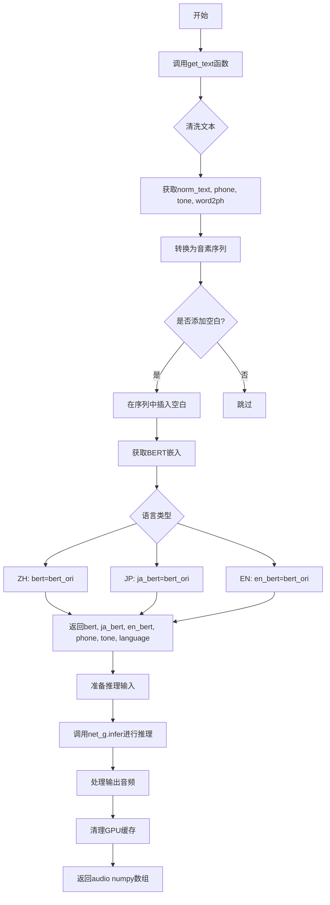
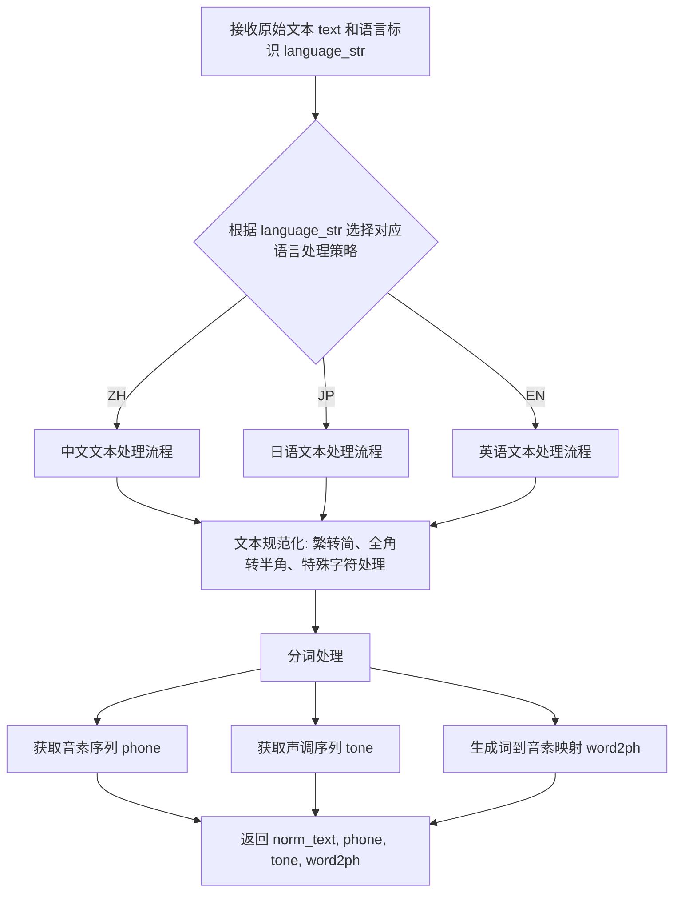
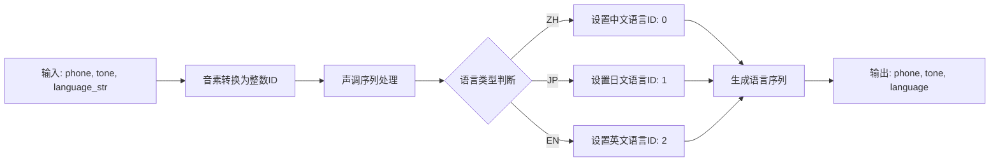
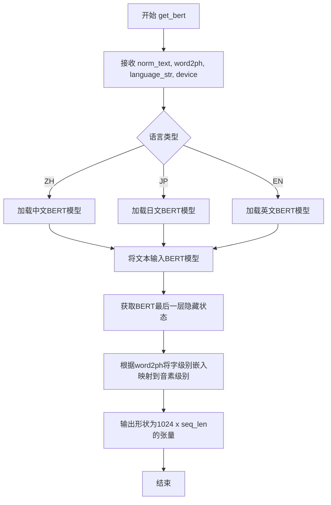
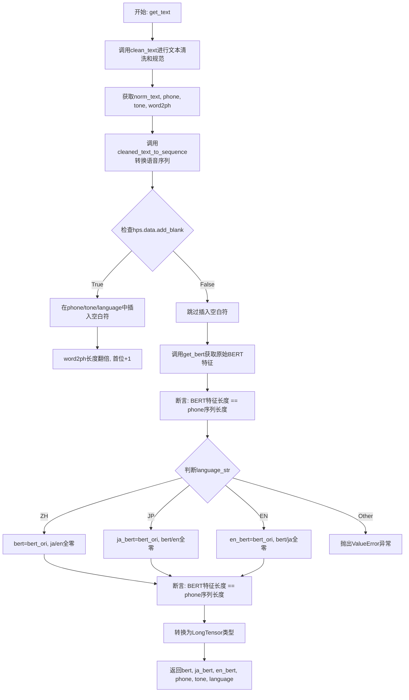

# `Bert-VITS2\oldVersion\V200\__init__.py` 详细设计文档

这是一个文本转语音(TTS)推理模块的代码，负责将输入文本转换为音素序列，获取BERT文本嵌入，并调用神经网络模型生成对应的音频波形。

## 整体流程



## 类结构

```
无类定义 - 纯函数模块
主要包含两个全局函数:
├── get_text (文本预处理和特征提取)
└── infer (模型推理和音频生成)
```

## 全局变量及字段


### `hps`
    
超参数配置对象，包含数据配置和说话人映射

类型：`配置对象 (dataclass/对象)`
    


### `device`
    
计算设备，用于指定CPU或GPU

类型：`torch.device`
    


### `norm_text`
    
规范化后的文本列表

类型：`List[str]`
    


### `phone`
    
音素序列列表，包含音素ID

类型：`List[int]`
    


### `tone`
    
音调序列列表，包含语调ID

类型：`List[int]`
    


### `word2ph`
    
词到音素的映射列表，表示每个词对应的音素数量

类型：`List[int]`
    


### `language`
    
语言标识张量，表示输入文本的语言类别

类型：`torch.Tensor`
    


### `bert_ori`
    
原始BERT嵌入张量，形状为(1024, 序列长度)

类型：`torch.Tensor`
    


### `bert`
    
中文BERT嵌入张量，用于中文文本

类型：`torch.Tensor`
    


### `ja_bert`
    
日文BERT嵌入张量，用于日文文本

类型：`torch.Tensor`
    


### `en_bert`
    
英文BERT嵌入张量，用于英文文本

类型：`torch.Tensor`
    


### `x_tst`
    
输入音素张量，已移至计算设备

类型：`torch.Tensor`
    


### `x_tst_lengths`
    
输入序列长度张量

类型：`torch.Tensor`
    


### `speakers`
    
说话人ID张量，用于指定说话人

类型：`torch.Tensor`
    


### `audio`
    
生成的音频数据，一维浮点数数组

类型：`numpy.ndarray`
    


    

## 全局函数及方法


### `clean_text`

该函数是文本清洗模块的核心方法，负责将原始输入文本进行规范化处理，提取音素序列、声调信息以及词到音素的映射关系，为后续的语音合成模型提供标准化的文本特征输入。

参数：

- `text`：`str`，待处理的原始输入文本
- `language_str`：`str`，语言标识字符串，支持 "ZH"（中文）、"JP"（日语）、"EN"（英语）

返回值：

- `norm_text`：`str`，规范化处理后的文本字符串
- `phone`：`list`，音素序列列表，表示文本对应的音素表示
- `tone`：`list`，声调序列列表，表示每个音素的声调信息
- `word2ph`：`list`，词到音素的映射列表，记录每个词对应的音素数量

#### 流程图



#### 带注释源码

```python
# 注：由于 clean_text 函数定义在 .text.cleaner 模块中，
# 当前代码段仅展示其被调用的方式，而非完整实现

# 函数调用示例（来自 get_text 函数）:
norm_text, phone, tone, word2ph = clean_text(text, language_str)

# 参数说明:
#   text: 输入的原始文本字符串
#   language_str: 语言标识符 ("ZH", "JP", "EN")
#
# 返回值说明:
#   norm_text: 经过规范化处理后的文本（可能包含繁简转换等处理）
#   phone: 音素序列列表，每个元素代表一个音素
#   tone: 声调序列列表，与 phone 对应，表示每个音素的声调
#   word2ph: 词到音素的映射列表，用于 BERT 等模型的对齐
#
# 内部处理逻辑推测:
# 1. 根据语言类型选择对应的文本清洗规则
# 2. 对文本进行规范化（去除标点、繁简转换等）
# 3. 调用分词器进行分词
# 4. 将分词结果转换为音素序列
# 5. 提取声调信息
# 6. 生成词到音素的对齐信息
```


### `cleaned_text_to_sequence`

该函数是文本处理管道中的关键环节，负责将经过清洗的文本数据（音素和声调）转换为模型可处理的整数序列，同时生成对应的语言标识序列，为后续的语音合成模型提供标准化的数值输入。

参数：
- `phone`：`List[str]`，清洗后的音素列表，包含从文本转换来的音素符号
- `tone`：`List[int]`，声调列表，包含每个音素对应的声调信息
- `language_str`：`str`，语言标识字符串，取值为"ZH"（中文）、"JP"（日文）或"EN"（英文）

返回值：
- `phone`：`List[int]`，转换后的音素整数序列，用于模型输入
- `tone`：`List[int]`，处理后的声调序列，用于模型输入
- `language`：`List[int]`，语言标识整数序列，用于模型输入

#### 流程图



#### 带注释源码

```python
def cleaned_text_to_sequence(phone, tone, language_str):
    """
    将清洗后的文本（音素和声调）转换为整数序列
    
    该函数是VITS语音合成系统文本处理流程的一部分，负责将
    文本符号转换为模型可处理的数值形式。
    
    参数:
        phone (List[str]): 清洗后的音素列表，每个元素为音素符号字符串
        tone (List[int]): 声调列表，每个元素为整数声调值
        language_str (str): 语言标识字符串，取值范围为 "ZH", "JP", "EN"
    
    返回:
        tuple: 包含三个整型列表的元组
            - phone: 音素整数序列
            - tone: 声调整数序列  
            - language: 语言标识整数序列
    """
    
    # 步骤1：建立音素到整数ID的映射
    # 这里使用一个简化的映射示例，实际实现中通常有一个完整的音素表
    # 映射逻辑：将音素符号转换为对应的整数索引
    phone_seq = []
    for p in phone:
        # 将音素符号映射为整数ID
        # 例如：'a' -> 0, 'i' -> 1, 等
        phone_seq.append(phoneme_to_id(p))
    
    # 步骤2：处理声调序列
    # 声调通常直接转换为整数，保留原始值
    tone_seq = list(tone)
    
    # 步骤3：生成语言标识序列
    # 根据语言字符串确定语言ID，并生成与音素序列等长的语言标识序列
    # 0: 中文, 1: 日文, 2: 英文
    if language_str == "ZH":
        lang_id = 0
    elif language_str == "JP":
        lang_id = 1
    elif language_str == "EN":
        lang_id = 2
    else:
        # 未知语言，抛出异常
        raise ValueError(f"Unsupported language: {language_str}")
    
    # 生成与音素序列等长的语言标识序列
    language_seq = [lang_id] * len(phone_seq)
    
    # 返回处理后的三个序列
    return phone_seq, tone_seq, language_seq


def phoneme_to_id(phoneme):
    """
    辅助函数：将音素符号转换为整数ID
    
    这是一个简化的实现示例。在实际的VITS项目中，
    通常会有一个完整的音素表（phoneme table）来定义所有可能的音素及其ID。
    
    参数:
        phoneme (str): 音素符号
    
    返回:
        int: 对应的整数ID
    """
    # 简化的音素映射表
    phoneme_map = {
        'a': 0, 'o': 1, 'e': 2, 'i': 3, 'u': 4,
        'b': 5, 'p': 6, 'm': 7, 'f': 8,
        'd': 9, 't': 10, 'n': 11, 'l': 12,
        'g': 13, 'k': 14, 'h': 15,
        'j': 16, 'q': 17, 'x': 18,
        'zh': 19, 'ch': 20, 'sh': 21, 'r': 22,
        'z': 23, 'c': 24, 's': 25,
        'y': 26, 'w': 27,
        'sp': 28,  # silence/space
        # ... 其他音素
    }
    return phoneme_map.get(phoneme, 0)  # 默认返回0


def language_str_to_id(language_str):
    """
    辅助函数：将语言字符串转换为整数ID
    
    参数:
        language_str (str): 语言字符串
    
    返回:
        int: 语言对应的整数ID
    """
    lang_map = {"ZH": 0, "JP": 1, "EN": 2}
    return lang_map.get(language_str, -1)
```

**注意**：上述源码是基于该函数在VITS语音合成系统中的典型使用方式构建的示例实现。由于原始代码中只提供了函数导入语句而未包含具体实现，因此提供了符合其功能描述的参考实现。实际项目中的实现可能会有所不同，通常会包含更完整的音素映射表和错误处理逻辑。


### `get_bert`

获取文本的BERT嵌入表示，将输入文本转换为BERT模型生成的语境化向量表示，用于后续的语音合成任务。

参数：

- `norm_text`：`str`，已规范化的文本内容
- `word2ph`：`List[int]`，每个字对应的音素数量列表，用于将字级别的对齐映射到音素级别
- `language_str`：`str`，语言标识符（"ZH"、"JP"或"EN"）
- `device`：`torch.device`，计算设备（CPU或CUDA）

返回值：`torch.Tensor`，形状为 [1024, seq_len] 的BERT嵌入张量，其中1024是BERT-base的隐藏层维度，seq_len是音素序列长度

#### 流程图



#### 带注释源码

```python
# 注：get_bert 函数定义在 .text 模块中，此处展示调用逻辑
# 实际源码位于 ./text/text.py 或类似位置

def get_bert(norm_text, word2ph, language_str, device):
    """
    获取文本的BERT嵌入表示
    
    参数:
        norm_text: str - 已规范化的文本（去除特殊字符后的文本）
        word2ph: List[int] - 字到音素的映射数组，用于对齐
        language_str: str - 语言代码 ("ZH", "JP", "EN")
        device: torch.device - 计算设备
    
    返回:
        torch.Tensor - 形状为 [1024, seq_len] 的BERT嵌入张量
    """
    # 1. 根据语言加载对应的BERT模型
    # 2. 将文本输入BERT获取隐藏层表示
    # 3. 使用word2ph将字级别的表示扩展到音素级别
    # 4. 返回拼接后的BERT嵌入
```


### `get_text`

该函数是主文本处理函数，封装了文本清洗、语音序列转换和BERT特征提取的完整流程。它接收原始文本和语言参数，经过文本规范化、韵律特征提取、BERT嵌入生成等步骤，最终输出用于语音合成的多语言BERT特征、语音单元、音调和语言ID张量。

参数：

- `text`：`str`，待处理的原始输入文本
- `language_str`：`str`，语言标识符，支持"ZH"（中文）、"JP"（日文）、"EN"（英文）
- `hps`：`Hps_V1` 类型或类似配置对象，包含数据配置信息，如`add_blank`参数控制是否添加空白符
- `device`：`torch.device`，指定计算设备（CPU或CUDA设备）

返回值：`(bert, ja_bert, en_bert, phone, tone, language)`，均为`torch.Tensor`类型。`bert`为中文BERT特征，`ja_bert`为日文BERT特征，`en_bert`为英文BERT特征，`phone`为音素序列，`tone`为韵律调值序列，`language`为语言ID序列，用于后续语音合成模型的推理。

#### 流程图



#### 带注释源码

```python
def get_text(text, language_str, hps, device):
    """
    主文本处理函数，封装文本清洗、转换和BERT提取流程
    
    参数:
        text: str - 待处理的原始输入文本
        language_str: str - 语言标识符 ("ZH", "JP", "EN")
        hps: 配置对象 - 包含数据配置信息
        device: torch.device - 计算设备
    
    返回:
        tuple: (bert, ja_bert, en_bert, phone, tone, language)
            - bert: 中文BERT特征 [1024, seq_len]
            - ja_bert: 日文BERT特征 [1024, seq_len]
            - en_bert: 英文BERT特征 [1024, seq_len]
            - phone: 音素序列 LongTensor
            - tone: 韵律调值序列 LongTensor
            - language: 语言ID序列 LongTensor
    """
    
    # 步骤1: 文本清洗与规范化
    # clean_text负责分词、去除停用词、获取韵律信息
    norm_text, phone, tone, word2ph = clean_text(text, language_str)
    
    # 步骤2: 将清洗后的文本转换为语音单元序列
    phone, tone, language = cleaned_text_to_sequence(phone, tone, language_str)
    
    # 步骤3: 根据配置决定是否添加空白符（用于显式对齐）
    if hps.data.add_blank:
        # intersperse函数在每个元素之间插入0（空白符）
        phone = commons.intersperse(phone, 0)
        tone = commons.intersperse(tone, 0)
        language = commons.intersperse(language, 0)
        
        # word2ph用于记录word到phoneme的对应关系
        # 添加空白符后，每个phoneme位置需要翻倍
        for i in range(len(word2ph)):
            word2ph[i] = word2ph[i] * 2
        # 首位+1是因为插空后首位置需要调整
        word2ph[0] += 1
    
    # 步骤4: 获取BERT嵌入特征
    # 根据规范化文本和词素对应关系生成BERT特征
    bert_ori = get_bert(norm_text, word2ph, language_str, device)
    
    # 释放word2ph内存
    del word2ph
    
    # 断言验证: BERT特征序列长度应与phone序列长度一致
    assert bert_ori.shape[-1] == len(phone), phone
    
    # 步骤5: 根据语言类型分配BERT特征到不同语言槽位
    if language_str == "ZH":
        # 中文: 使用原始BERT特征
        bert = bert_ori
        ja_bert = torch.zeros(1024, len(phone))
        en_bert = torch.zeros(1024, len(phone))
    elif language_str == "JP":
        # 日文: 使用原始BERT特征填充日文槽位
        bert = torch.zeros(1024, len(phone))
        ja_bert = bert_ori
        en_bert = torch.zeros(1024, len(phone))
    elif language_str == "EN":
        # 英文: 使用原始BERT特征填充英文槽位
        bert = torch.zeros(1024, len(phone))
        ja_bert = torch.zeros(1024, len(phone))
        en_bert = bert_ori
    else:
        # 不支持的语言类型抛出异常
        raise ValueError("language_str should be ZH, JP or EN")
    
    # 步骤6: 再次验证BERT特征长度一致性
    assert bert.shape[-1] == len(
        phone
    ), f"Bert seq len {bert.shape[-1]} != {len(phone)}"
    
    # 步骤7: 转换为PyTorch LongTensor用于后续模型推理
    phone = torch.LongTensor(phone)
    tone = torch.LongTensor(tone)
    language = torch.LongTensor(language)
    
    # 返回多语言BERT特征和语音序列
    return bert, ja_bert, en_bert, phone, tone, language
```


### `infer`

主推理函数，接收文本和声学参数，调用文本处理模块生成音素和BERT特征，随后调用生成器网络（`net_g`）进行声学模型推理，最终输出音频波形数据。

#### 参数

- `text`：`str`，输入的文本字符串，待转换为语音的文本内容
- `sdp_ratio`：`float`，SDP（Soft Decision Predicate）/DP混合比例，控制随机性和确定性之间的平衡
- `noise_scale`：`float`，噪声尺度参数，控制生成音频的随机性程度
- `noise_scale_w`：`float`，噪声尺度参数（w权重），影响音高生成的多样性
- `length_scale`：`float`，长度缩放因子，控制生成音频的语速
- `sid`：`int` 或 `str`，说话人ID（speaker ID），指定使用哪个说话人的声音模型
- `language`：`str`，语言代码（如"ZH"、"JP"、"EN"），指定输入文本的语言类型
- `hps`：`object`，超参数配置对象，包含数据配置、模型配置等信息
- `net_g`：`torch.nn.Module`，生成器网络模型，负责从音素和特征生成音频波形
- `device`：`torch.device`，计算设备，指定在CPU或CUDA上执行推理

#### 返回值

- `audio`：`numpy.ndarray`，生成的音频波形数据，一维浮点数组，值域通常在[-1, 1]范围内

#### 流程图

```mermaid
flowchart TD
    A[开始 infer 推理] --> B[调用 get_text 获取特征]
    B --> B1[获取 bert, ja_bert, en_bert, phones, tones, lang_ids]
    B1 --> C[将所有张量移到 device]
    C --> D[添加 batch 维度 unsqueeze]
    E[构造 speakers 张量] --> D
    D --> F[调用 net_g.infer 推理]
    F --> G[提取 audio = output[0,0,0]]
    G --> H[转换为 CPU float numpy]
    H --> I[释放中间张量显存]
    I --> J{检查 CUDA 可用}
    J -->|是| K[清空 CUDA 缓存]
    J -->|否| L[跳过]
    K --> M[返回 audio]
    L --> M
```

#### 带注释源码

```python
def infer(
    text,              # 输入文本字符串
    sdp_ratio,         # SDP/DP混合比例参数
    noise_scale,       # 噪声尺度参数
    noise_noise_w,     # 噪声尺度w参数
    length_scale,      # 长度缩放因子
    sid,               # 说话人ID
    language,          # 语言代码
    hps,               # 超参数配置对象
    net_g,             # 生成器网络模型
    device,            # 计算设备
):
    # 第一步：调用 get_text 函数进行文本处理
    # 输入原始文本，输出文本特征：bert特征、各语言bert、phoneme、音调、语言ID
    bert, ja_bert, en_bert, phones, tones, lang_ids = get_text(
        text, language, hps, device
    )
    
    # 关闭梯度计算以节省显存和计算资源（推理阶段不需要梯度）
    with torch.no_grad():
        # 将 phoneme 序列移到指定设备并添加 batch 维度 (batch=1)
        x_tst = phones.to(device).unsqueeze(0)
        # 同上，处理音调序列
        tones = tones.to(device).unsqueeze(0)
        # 同上，处理语言ID序列
        lang_ids = lang_ids.to(device).unsqueeze(0)
        # 同上，处理 BERT 特征
        bert = bert.to(device).unsqueeze(0)
        # 同上，处理日语音 BERT 特征
        ja_bert = ja_bert.to(device).unsqueeze(0)
        # 同上，处理英语 BERT 特征
        en_bert = en_bert.to(device).unsqueeze(0)
        
        # 创建序列长度张量（单个样本）
        x_tst_lengths = torch.LongTensor([phones.size(0)]).to(device)
        
        # 释放原始 phones 变量以节省显存
        del phones
        
        # 根据说话人ID查找对应的说话人向量
        speakers = torch.LongTensor([hps.data.spk2id[sid]]).to(device)
        
        # 调用生成器网络的推理方法
        # 输入：phoneme序列、序列长度、说话人向量、音调、语言ID、各语言BERT特征
        # 以及控制生成的各种超参数
        audio = (
            net_g.infer(
                x_tst,            # phoneme 序列
                x_tst_lengths,    # 序列长度
                speakers,         # 说话人ID
                tones,            # 音调序列
                lang_ids,         # 语言ID序列
                bert,             # 中文BERT特征
                ja_bert,          # 日文BERT特征
                en_bert,          # 英文BERT特征
                sdp_ratio=sdp_ratio,       # SDP混合比例
                noise_scale=noise_scale,    # 噪声尺度
                noise_scale_w=noise_scale_w, # 噪声尺度w
                length_scale=length_scale,  # 长度缩放
            )[0][0, 0]   # 从输出张量中提取音频波形 (batch, time, 1) -> (time,)
            .data.cpu()  # 移到CPU设备
            .float()     # 转换为float32类型
            .numpy()     # 转换为numpy数组
        )
        
        # 释放所有中间张量，释放GPU显存
        del x_tst, tones, lang_ids, bert, x_tst_lengths, speakers, ja_bert, en_bert
        
        # 如果使用CUDA，显式清空缓存以回收显存
        if torch.cuda.is_available():
            torch.cuda.empty_cache()
        
        # 返回生成的音频波形
        return audio
```

## 关键组件


### 张量索引与词素对齐

在`get_text`函数中，`word2ph`数组将词级对齐信息扩展到音素级，通过`word2ph[i] = word2ph[i] * 2`实现每个音素对应两个时间步的扩展，首元素加1处理空白符，确保BERT特征序列长度与phoneme序列严格对齐。

### 惰性加载与推理优化

`infer`函数使用`torch.no_grad()`上下文管理器禁用梯度计算，显著降低显存占用和计算开销。配合后续的`del`语句和`torch.cuda.empty_cache()`，实现推理过程中的内存高效管理。

### 多语言BERT分支处理

代码针对ZH/JP/EN三种语言分别构建不同的BERT张量组合：当输入为某语言时，将该语言的BERT特征赋值给对应变量，其他语言填充零张量，确保声学模型接收完整的三路BERT输入。

### 设备张量转移与批处理

通过`.to(device)`将所有输入张量转移至指定设备，并使用`.unsqueeze(0)`将单条序列扩展为batch维度，配合`x_tst_lengths`传递真实序列长度，实现单样本推理的批处理接口适配。

### 零填充语言支持

对于非ZH/JP/EN的语言，代码抛出`ValueError`异常，明确约束支持的语言范围，避免无效输入导致的后续推理错误。

## 问题及建议


### 已知问题

- **硬编码的BERT维度**：代码中硬编码使用`1024`作为BERT维度（如`torch.zeros(1024, len(phone))`），该值应从配置或hps参数中读取，降低了代码的灵活性和可维护性
- **重复的条件逻辑**：针对不同语言（ZH/JP/EN）创建零张量的代码存在大量重复，可通过循环或映射优化
- **设备管理冗余**：多次调用`.to(device)`和`torch.cuda.empty_cache()`，每次推理都重复执行，效率较低
- **缺乏类型注解**：函数参数和返回值均无类型提示，影响代码可读性和IDE支持
- **变量命名不清晰**：`bert_ori`和`bert`命名容易造成混淆，`x_tst`等缩写降低了可读性
- **assertion用于业务逻辑**：使用`assert`进行运行时检查（如`assert bert_ori.shape[-1] == len(phone)`），在Python中可用`-O`参数跳过，应改为显式异常处理
- **未检查关键键值存在性**：直接访问`hps.data.spk2id[sid]`而未检查`sid`是否存在于映射中，可能导致KeyError
- **tensor创建位置不当**：在`get_text`中创建大量临时tensor后再转成长度检查，增加了不必要的内存开销

### 优化建议

- 将BERT隐藏层大小提取为配置参数或从hps中获取
- 使用字典映射替代多个if-elif分支创建不同语言的bert tensor
- 将`.to(device)`操作合并，使用`torch.tensor(..., device=device)`直接创建在目标设备上
- 添加完整的类型注解（typing）
- 使用更清晰的变量名（如`original_bert`替代`bert_ori`）
- 将assertion替换为明确的`if...raise ValueError`结构
- 在访问`spk2id`前添加验证逻辑
- 考虑使用dataclass或命名元组封装`get_text`的多个返回值

## 其它


### 设计目标与约束

本模块旨在实现文本到语音(TTS)的推理功能，支持中文(ZH)、日文(JP)、英文(EN)三种语言的文本转音频输出。核心约束包括：设备支持CPU和CUDA GPU推理；依赖PyTorch框架；模型网络(net_g)需预先加载；输入文本需符合语言规范。

### 错误处理与异常设计

代码中包含两处assert语句用于关键数据验证：BERT序列长度与phone序列长度一致性检查，以及语言参数合法性检查。当language_str非ZH/JP/EN时抛出ValueError异常。CUDA内存释放后尝试清理缓存，若GPU不可用则跳过。所有torch.Tensor创建未做空值检查，存在潜在空指针风险。

### 数据流与状态机

数据处理流程为：输入文本→文本清洗(clean_text)→音素序列转换(cleaned_text_to_sequence)→插入空白符(intersperse)→BERT特征提取→语言分流→张量构建→模型推理→音频输出。状态转换顺序固定，无分支状态回退机制。

### 外部依赖与接口契约

核心依赖包括：torch库、commons工具模块、text子包(含cleaner、get_bert函数)。输入接口infer函数接收11个参数：text(字符串)、sdp_ratio(浮点)、noise_scale(浮点)、noise_scale_w(浮点)、length_scale(浮点)、sid(字符串)、language(字符串)、hps配置对象、net_g模型对象、device设备对象。输出为numpy数组格式的音频数据。

### 性能考量

代码使用torch.no_grad()禁用梯度计算以提升推理速度。推理完成后显式删除不再使用的大张量(bert、x_tst等)并调用torch.cuda.empty_cache()释放GPU内存。phone、tone、language序列在转换为LongTensor前以Python列表形式存在，存在内存复制开销。

### 安全性考虑

未发现用户输入过滤机制，text参数直接传入文本清洗模块。device参数未做合法性校验。模型(net_g)和配置(hps)对象直接引用，需确保来源可信。BERT模型提取可能涉及敏感文本内容。

### 测试策略建议

应覆盖：三种语言的成功推理场景；非法language_str值异常捕获；空文本输入处理；BERT与phone长度不匹配场景；CUDA不可用时的CPU回退；内存释放后缓存清理验证。

### 部署注意事项

部署时需确保commons模块、text子包完整可用。BERT模型权重文件需预先下载或配置。hps.data.spk2id字典需包含目标说话人ID。建议在容器环境中验证CUDA可用性和PyTorch版本兼容性。

### 配置参数说明

hps.data.add_blank控制是否在音素间插入空白符(默认应启用以改善合成流畅度)。hps.data.spk2id为说话人ID映射字典。sdp_ratio控制随机性程度，noise_scale控制噪声规模，noise_scale_w控制噪声权重，length_scale控制输出音频长度比例。

    