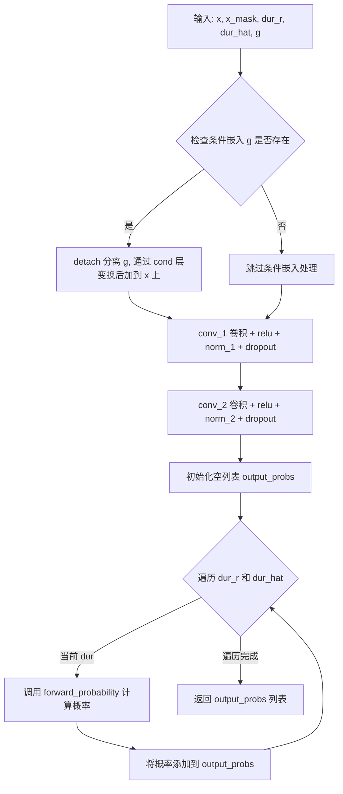
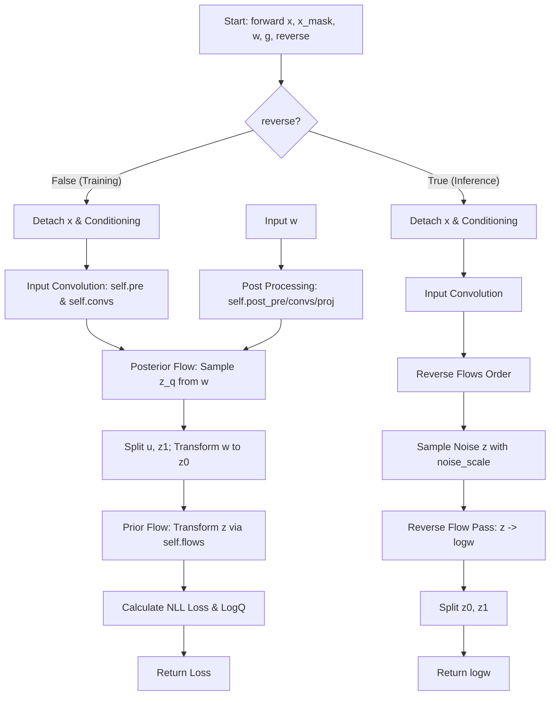
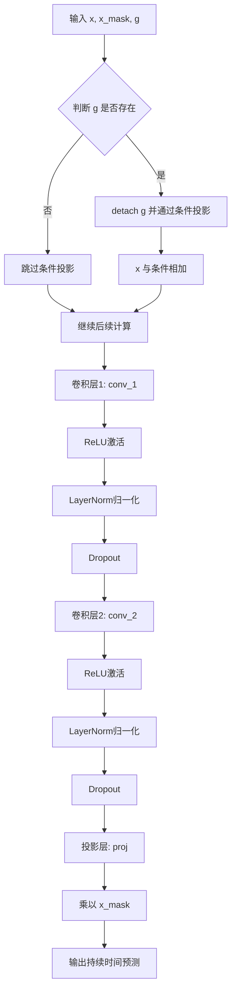
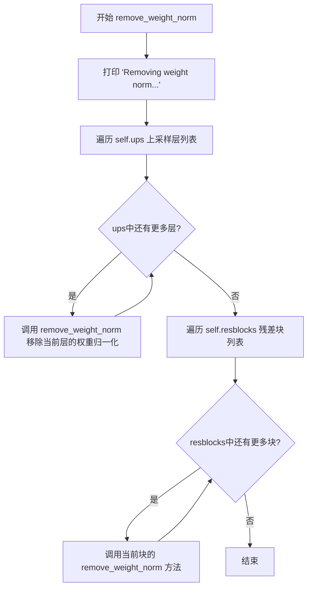
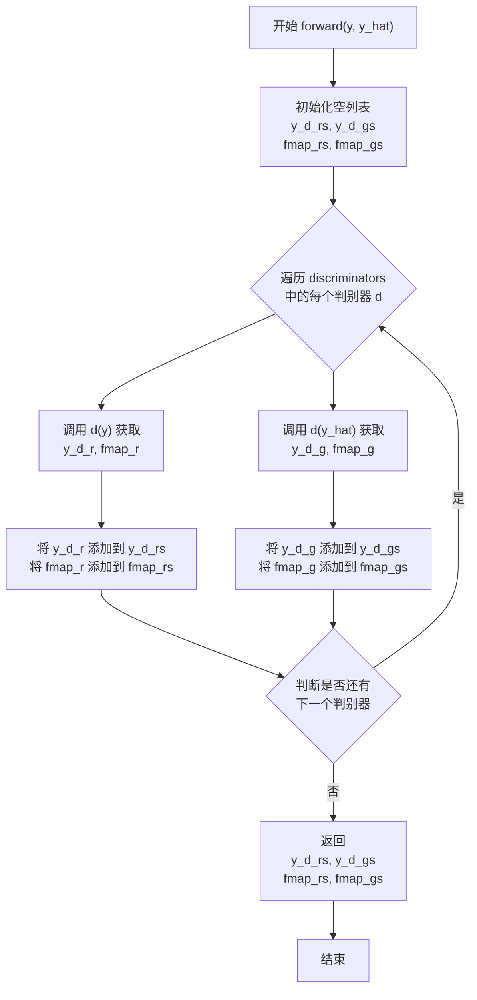
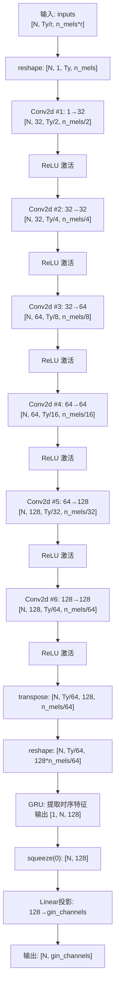

# `Bert-VITS2\oldVersion\V200\models.py` 详细设计文档

该代码实现了一个基于变分推断和对齐的端到端文本到语音（TTS）模型（VITS/VITS2），集成了文本编码、时长预测、归一化流变换（Flow）和基于生成对抗网络（GAN）的声码器，用于从文本和说话人ID生成高保真音频。核心类 SynthesizerTrn 封装了前向传播（训练）和推理逻辑。

## 整体流程

```mermaid
graph TD
    subgraph Training Flow
        Input[文本x, 音频y, SpeakerID] --> TextEnc[TextEncoder]
        Input --> PostEnc[PosteriorEncoder]
        TextEnc --> DurPred[Duration Predictor + SDP]
        PostEnc --> Flow[TransformerCouplingBlock / ResidualCouplingBlock]
        DurPred --> Align[Monotonic Alignment]
        Flow --> Expand[Expand latent via Attention]
        Expand --> Decoder[Generator (Vocoder)]
        Decoder --> Output[Audio Reconstruction]
        Output --> Disc[MultiPeriodDiscriminator]
    end
    subgraph Inference Flow
        InferInput[文本x, SpeakerID] --> TextEncInf[TextEncoder]
        TextEncInf --> DurPredInf[Duration Prediction]
        DurPredInf --> AlignInf[Generate Alignment Path]
        AlignInf --> Sampling[Sample from Prior N(z_p)]
        Sampling --> FlowInf[Flow Reverse (z_p -> z)]
        FlowInf --> DecoderInf[Generator]
        DecoderInf --> InferOutput[Audio Waveform]
    end
```

## 类结构

```
torch.nn.Module (基类)
├── DurationDiscriminator (VITS2时长判别器)
├── TransformerCouplingBlock (Transformer流模块)
│   └── modules.TransformerCouplingLayer
├── StochasticDurationPredictor (随机时长预测器)
│   └── modules.ConvFlow, modules.ElementwiseAffine
├── DurationPredictor (确定性时长预测器)
├── TextEncoder (文本编码器)
│   └── attentions.Encoder
├── ResidualCouplingBlock (残差流模块)
│   └── modules.ResidualCouplingLayer
├── PosteriorEncoder (后验编码器)
│   └── modules.WN
├── Generator (声码器生成器)
│   ├── ConvTranspose1d (上采样)
│   └── ResBlock1 / ResBlock2 (残差块)
├── DiscriminatorP (周期判别器)
├── DiscriminatorS (规模判别器)
├── MultiPeriodDiscriminator (多周期判别器组合)
├── ReferenceEncoder (参考编码器，用于零样本)
└── SynthesizerTrn (主模型封装类)
```

## 全局变量及字段


### `symbols`
    
文本符号列表，用于文本编码的字符集

类型：`list`
    


### `num_tones`
    
音调数量，用于文本编码中的音调嵌入

类型：`int`
    


### `num_languages`
    
语言数量，用于文本编码中的语言嵌入

类型：`int`
    


### `DurationDiscriminator.in_channels`
    
输入特征通道数

类型：`int`
    


### `DurationDiscriminator.filter_channels`
    
卷积滤波器通道数

类型：`int`
    


### `DurationDiscriminator.kernel_size`
    
卷积核大小

类型：`int`
    


### `DurationDiscriminator.p_dropout`
    
Dropout 概率

类型：`float`
    


### `DurationDiscriminator.gin_channels`
    
全局输入通道数（用于说话人条件）

类型：`int`
    


### `DurationDiscriminator.drop`
    
Dropout 层

类型：`nn.Dropout`
    


### `DurationDiscriminator.conv_1`
    
第一卷积层

类型：`nn.Conv1d`
    


### `DurationDiscriminator.norm_1`
    
第一层归一化

类型：`modules.LayerNorm`
    


### `DurationDiscriminator.conv_2`
    
第二卷积层

类型：`nn.Conv1d`
    


### `DurationDiscriminator.norm_2`
    
第二层归一化

类型：`modules.LayerNorm`
    


### `DurationDiscriminator.dur_proj`
    
持续时间投影层

类型：`nn.Conv1d`
    


### `DurationDiscriminator.pre_out_conv_1`
    
预输出卷积层1

类型：`nn.Conv1d`
    


### `DurationDiscriminator.pre_out_norm_1`
    
预输出归一化层1

类型：`modules.LayerNorm`
    


### `DurationDiscriminator.pre_out_conv_2`
    
预输出卷积层2

类型：`nn.Conv1d`
    


### `DurationDiscriminator.pre_out_norm_2`
    
预输出归一化层2

类型：`modules.LayerNorm`
    


### `DurationDiscriminator.cond`
    
条件卷积层（可选，用于说话人条件）

类型：`nn.Conv1d`
    


### `DurationDiscriminator.output_layer`
    
输出层，包含线性层和Sigmoid激活

类型：`nn.Sequential`
    


### `TransformerCouplingBlock.channels`
    
输入通道数

类型：`int`
    


### `TransformerCouplingBlock.hidden_channels`
    
隐藏层通道数

类型：`int`
    


### `TransformerCouplingBlock.kernel_size`
    
卷积核大小

类型：`int`
    


### `TransformerCouplingBlock.n_layers`
    
Transformer 层数

类型：`int`
    


### `TransformerCouplingBlock.n_flows`
    
流操作数量

类型：`int`
    


### `TransformerCouplingBlock.gin_channels`
    
全局输入通道数

类型：`int`
    


### `TransformerCouplingBlock.flows`
    
流模块列表

类型：`nn.ModuleList`
    


### `TransformerCouplingBlock.wn`
    
共享的权重归一化 FFT 模块（可选）

类型：`attentions.FFT`
    


### `StochasticDurationPredictor.in_channels`
    
输入特征通道数

类型：`int`
    


### `StochasticDurationPredictor.filter_channels`
    
卷积滤波器通道数

类型：`int`
    


### `StochasticDurationPredictor.kernel_size`
    
卷积核大小

类型：`int`
    


### `StochasticDurationPredictor.p_dropout`
    
Dropout 概率

类型：`float`
    


### `StochasticDurationPredictor.n_flows`
    
流操作数量

类型：`int`
    


### `StochasticDurationPredictor.gin_channels`
    
全局输入通道数

类型：`int`
    


### `StochasticDurationPredictor.log_flow`
    
对数流模块

类型：`modules.Log`
    


### `StochasticDurationPredictor.flows`
    
流模块列表

类型：`nn.ModuleList`
    


### `StochasticDurationPredictor.post_pre`
    
后处理预处理卷积层

类型：`nn.Conv1d`
    


### `StochasticDurationPredictor.post_proj`
    
后处理投影卷积层

类型：`nn.Conv1d`
    


### `StochasticDurationPredictor.post_convs`
    
后处理 DDS 卷积模块

类型：`modules.DDSConv`
    


### `StochasticDurationPredictor.post_flows`
    
后处理流模块列表

类型：`nn.ModuleList`
    


### `StochasticDurationPredictor.pre`
    
预处理卷积层

类型：`nn.Conv1d`
    


### `StochasticDurationPredictor.proj`
    
投影卷积层

类型：`nn.Conv1d`
    


### `StochasticDurationPredictor.convs`
    
DDS 卷积模块

类型：`modules.DDSConv`
    


### `StochasticDurationPredictor.cond`
    
条件卷积层（可选）

类型：`nn.Conv1d`
    


### `DurationPredictor.in_channels`
    
输入特征通道数

类型：`int`
    


### `DurationPredictor.filter_channels`
    
卷积滤波器通道数

类型：`int`
    


### `DurationPredictor.kernel_size`
    
卷积核大小

类型：`int`
    


### `DurationPredictor.p_dropout`
    
Dropout 概率

类型：`float`
    


### `DurationPredictor.gin_channels`
    
全局输入通道数

类型：`int`
    


### `DurationPredictor.drop`
    
Dropout 层

类型：`nn.Dropout`
    


### `DurationPredictor.conv_1`
    
第一卷积层

类型：`nn.Conv1d`
    


### `DurationPredictor.norm_1`
    
第一层归一化

类型：`modules.LayerNorm`
    


### `DurationPredictor.conv_2`
    
第二卷积层

类型：`nn.Conv1d`
    


### `DurationPredictor.norm_2`
    
第二层归一化

类型：`modules.LayerNorm`
    


### `DurationPredictor.proj`
    
输出投影卷积层

类型：`nn.Conv1d`
    


### `DurationPredictor.cond`
    
条件卷积层（可选，用于说话人条件）

类型：`nn.Conv1d`
    


### `TextEncoder.n_vocab`
    
词汇表大小

类型：`int`
    


### `TextEncoder.out_channels`
    
输出通道数

类型：`int`
    


### `TextEncoder.hidden_channels`
    
隐藏层通道数

类型：`int`
    


### `TextEncoder.filter_channels`
    
卷积滤波器通道数

类型：`int`
    


### `TextEncoder.n_heads`
    
注意力头数

类型：`int`
    


### `TextEncoder.n_layers`
    
Transformer 层数

类型：`int`
    


### `TextEncoder.kernel_size`
    
卷积核大小

类型：`int`
    


### `TextEncoder.p_dropout`
    
Dropout 概率

类型：`float`
    


### `TextEncoder.gin_channels`
    
全局输入通道数

类型：`int`
    


### `TextEncoder.emb`
    
文本嵌入层

类型：`nn.Embedding`
    


### `TextEncoder.tone_emb`
    
音调嵌入层

类型：`nn.Embedding`
    


### `TextEncoder.language_emb`
    
语言嵌入层

类型：`nn.Embedding`
    


### `TextEncoder.bert_proj`
    
BERT 特征投影层

类型：`nn.Conv1d`
    


### `TextEncoder.ja_bert_proj`
    
日语 BERT 特征投影层

类型：`nn.Conv1d`
    


### `TextEncoder.en_bert_proj`
    
英语 BERT 特征投影层

类型：`nn.Conv1d`
    


### `TextEncoder.encoder`
    
文本编码器 Transformer

类型：`attentions.Encoder`
    


### `TextEncoder.proj`
    
输出投影层（生成均值和方差）

类型：`nn.Conv1d`
    


### `ResidualCouplingBlock.channels`
    
输入/输出通道数

类型：`int`
    


### `ResidualCouplingBlock.hidden_channels`
    
隐藏层通道数

类型：`int`
    


### `ResidualCouplingBlock.kernel_size`
    
卷积核大小

类型：`int`
    


### `ResidualCouplingBlock.dilation_rate`
    
卷积膨胀率

类型：`int`
    


### `ResidualCouplingBlock.n_layers`
    
卷积层数

类型：`int`
    


### `ResidualCouplingBlock.n_flows`
    
流操作数量

类型：`int`
    


### `ResidualCouplingBlock.gin_channels`
    
全局输入通道数

类型：`int`
    


### `ResidualCouplingBlock.flows`
    
残差耦合流模块列表

类型：`nn.ModuleList`
    


### `PosteriorEncoder.in_channels`
    
输入特征通道数

类型：`int`
    


### `PosteriorEncoder.out_channels`
    
输出特征通道数

类型：`int`
    


### `PosteriorEncoder.hidden_channels`
    
隐藏层通道数

类型：`int`
    


### `PosteriorEncoder.kernel_size`
    
卷积核大小

类型：`int`
    


### `PosteriorEncoder.dilation_rate`
    
卷积膨胀率

类型：`int`
    


### `PosteriorEncoder.n_layers`
    
卷积层数

类型：`int`
    


### `PosteriorEncoder.gin_channels`
    
全局输入通道数

类型：`int`
    


### `PosteriorEncoder.pre`
    
预处理卷积层

类型：`nn.Conv1d`
    


### `PosteriorEncoder.enc`
    
WaveNet 编码器

类型：`modules.WN`
    


### `PosteriorEncoder.proj`
    
输出投影层（生成均值和方差）

类型：`nn.Conv1d`
    


### `Generator.num_kernels`
    
残差块卷积核数量

类型：`int`
    


### `Generator.num_upsamples`
    
上采样层数量

类型：`int`
    


### `Generator.conv_pre`
    
预处理卷积层

类型：`Conv1d`
    


### `Generator.ups`
    
上采样转置卷积层列表

类型：`nn.ModuleList`
    


### `Generator.resblocks`
    
残差块列表

类型：`nn.ModuleList`
    


### `Generator.conv_post`
    
后处理卷积层

类型：`Conv1d`
    


### `Generator.cond`
    
条件卷积层（可选，用于说话人条件）

类型：`nn.Conv1d`
    


### `DiscriminatorP.period`
    
判别器周期

类型：`int`
    


### `DiscriminatorP.use_spectral_norm`
    
是否使用频谱归一化

类型：`bool`
    


### `DiscriminatorP.convs`
    
2D 卷积层列表

类型：`nn.ModuleList`
    


### `DiscriminatorP.conv_post`
    
后处理 2D 卷积层

类型：`nn.Conv2d`
    


### `DiscriminatorS.use_spectral_norm`
    
是否使用频谱归一化

类型：`bool`
    


### `DiscriminatorS.convs`
    
1D 卷积层列表

类型：`nn.ModuleList`
    


### `DiscriminatorS.conv_post`
    
后处理 1D 卷积层

类型：`nn.Conv1d`
    


### `MultiPeriodDiscriminator.discriminators`
    
多周期判别器列表

类型：`nn.ModuleList`
    


### `ReferenceEncoder.spec_channels`
    
频谱通道数

类型：`int`
    


### `ReferenceEncoder.convs`
    
2D 卷积层列表

类型：`nn.ModuleList`
    


### `ReferenceEncoder.gru`
    
GRU 循环层

类型：`nn.GRU`
    


### `ReferenceEncoder.proj`
    
输出投影层

类型：`nn.Linear`
    


### `SynthesizerTrn.n_vocab`
    
词汇表大小

类型：`int`
    


### `SynthesizerTrn.spec_channels`
    
频谱通道数

类型：`int`
    


### `SynthesizerTrn.inter_channels`
    
中间特征通道数

类型：`int`
    


### `SynthesizerTrn.hidden_channels`
    
隐藏层通道数

类型：`int`
    


### `SynthesizerTrn.filter_channels`
    
滤波器通道数

类型：`int`
    


### `SynthesizerTrn.n_heads`
    
注意力头数

类型：`int`
    


### `SynthesizerTrn.n_layers`
    
Transformer 层数

类型：`int`
    


### `SynthesizerTrn.kernel_size`
    
卷积核大小

类型：`int`
    


### `SynthesizerTrn.p_dropout`
    
Dropout 概率

类型：`float`
    


### `SynthesizerTrn.resblock`
    
残差块类型（'1' 或 '2'）

类型：`str`
    


### `SynthesizerTrn.resblock_kernel_sizes`
    
残差块卷积核大小列表

类型：`list`
    


### `SynthesizerTrn.resblock_dilation_sizes`
    
残差块膨胀大小列表

类型：`list`
    


### `SynthesizerTrn.upsample_rates`
    
上采样率列表

类型：`list`
    


### `SynthesizerTrn.upsample_initial_channel`
    
上采样初始通道数

类型：`int`
    


### `SynthesizerTrn.upsample_kernel_sizes`
    
上采样卷积核大小列表

类型：`list`
    


### `SynthesizerTrn.segment_size`
    
训练片段大小

类型：`int`
    


### `SynthesizerTrn.n_speakers`
    
说话人数量

类型：`int`
    


### `SynthesizerTrn.gin_channels`
    
全局输入通道数

类型：`int`
    


### `SynthesizerTrn.enc_gin_channels`
    
文本编码器全局输入通道数

类型：`int`
    


### `SynthesizerTrn.enc_p`
    
文本编码器

类型：`TextEncoder`
    


### `SynthesizerTrn.dec`
    
声学波形生成器

类型：`Generator`
    


### `SynthesizerTrn.enc_q`
    
后验编码器

类型：`PosteriorEncoder`
    


### `SynthesizerTrn.flow`
    
归一化流模块

类型：`TransformerCouplingBlock/ResidualCouplingBlock`
    


### `SynthesizerTrn.sdp`
    
随机持续时间预测器

类型：`StochasticDurationPredictor`
    


### `SynthesizerTrn.dp`
    
确定性持续时间预测器

类型：`DurationPredictor`
    


### `SynthesizerTrn.emb_g`
    
说话人嵌入层

类型：`nn.Embedding`
    


### `SynthesizerTrn.ref_enc`
    
参考编码器（当 n_speakers < 1 时使用）

类型：`ReferenceEncoder`
    


### `SynthesizerTrn.use_spk_conditioned_encoder`
    
是否使用说话人条件文本编码器

类型：`bool`
    


### `SynthesizerTrn.use_sdp`
    
是否使用随机持续时间预测器

类型：`bool`
    


### `SynthesizerTrn.use_noise_scaled_mas`
    
是否使用噪声缩放 MAS

类型：`bool`
    


### `SynthesizerTrn.mas_noise_scale_initial`
    
MAS 噪声初始缩放值

类型：`float`
    


### `SynthesizerTrn.noise_scale_delta`
    
噪声缩放增量

类型：`float`
    


### `SynthesizerTrn.current_mas_noise_scale`
    
当前 MAS 噪声缩放值

类型：`float`
    
    

## 全局函数及方法


### `DurationDiscriminator.forward_probability`

该方法是 VITS2 模型中 `DurationDiscriminator` 类的核心成员，用于计算给定音频特征和持续时间信息的概率输出。它接收编码后的音频特征、特征掩码、持续时间信息以及可选的全局条件，通过一系列卷积、激活、归一化和dropout操作，最终输出一个概率值，用于判别持续时间的真实性。

参数：

- `x`：`torch.Tensor`，编码后的音频特征张量，维度为 [batch, channels, time]
- `x_mask`：`torch.Tensor`，用于掩码的张量，标记有效时间步，维度为 [batch, 1, time]
- `dur`：`torch.Tensor`，持续时间信息，维度为 [batch, 1, time]
- `g`：`torch.Tensor` 或 `None`，可选的全局条件（如说话人嵌入），维度为 [batch, gin_channels, time]

返回值：`torch.Tensor`，概率输出，维度为 [batch, time, 1]

#### 流程图

```mermaid
flowchart TD
    A[开始: forward_probability] --> B[将dur通过dur_proj投影]
    B --> C[在通道维度拼接x和dur]
    C --> D[x与x_mask相乘进行掩码]
    D --> E[通过pre_out_conv_1卷积]
    E --> F[ReLU激活]
    F --> G[LayerNorm归一化]
    G --> H[Dropout随机丢弃]
    H --> I[通过pre_out_conv_2卷积]
    I --> J[ReLU激活]
    J --> K[LayerNorm归一化]
    K --> L[Dropout随机丢弃]
    L --> M[再次应用x_mask掩码]
    M --> N[转置维度: (batch, channels, time) -> (batch, time, channels)]
    N --> O[通过output_layer输出概率]
    O --> P[返回output_prob]
```

#### 带注释源码

```python
def forward_probability(self, x, x_mask, dur, g=None):
    """
    计算给定特征和持续时间的概率输出
    
    参数:
        x: 编码后的音频特征 [batch, channels, time]
        x_mask: 特征掩码 [batch, 1, time]
        dur: 持续时间信息 [batch, 1, time]
        g: 可选的全局条件 [batch, gin_channels, time]
    
    返回:
        output_prob: 概率输出 [batch, time, 1]
    """
    # 将持续时间信息通过线性投影层变换到特征空间
    # dur_proj: 1 -> filter_channels
    dur = self.dur_proj(dur)
    
    # 在通道维度(dim=1)拼接音频特征和持续时间特征
    # x: [b, c, t], dur: [b, 1, t] -> concat: [b, c+1, t]
    x = torch.cat([x, dur], dim=1)
    
    # 应用特征掩码，将无效时间步置零
    x = x * x_mask
    
    # 第一个卷积块
    # 通道数: 2*filter_channels -> filter_channels
    x = self.pre_out_conv_1(x)
    x = torch.relu(x)  # ReLU激活函数
    x = self.pre_out_norm_1(x)  # LayerNorm归一化
    x = self.drop(x)  # Dropout正则化
    
    # 第二个卷积块
    # 通道数: filter_channels -> filter_channels
    x = self.pre_out_conv_2(x * x_mask)  # 再次应用掩码
    x = torch.relu(x)
    x = self.pre_out_norm_2(x)
    x = self.drop(x)
    
    # 最终掩码处理
    x = x * x_mask
    
    # 维度转换: [batch, channels, time] -> [batch, time, channels]
    # 为全连接层做准备
    x = x.transpose(1, 2)
    
    # 输出层: filter_channels -> 1, 并通过Sigmoid激活
    # 将输出转换为概率值 [0, 1]
    output_prob = self.output_layer(x)
    
    return output_prob
```


### `DurationDiscriminator.forward`

该方法实现了 VITS2 模型中DurationDiscriminator 的前向传播，用于判别真实持续时间与预测持续时间之间的差异，通过两个分支分别处理真实持续时间（dur_r）和预测持续时间（dur_hat），输出对应的判别概率。

参数：

- `self`：`DurationDiscriminator`，DurationDiscriminator 类实例本身
- `x`：`torch.Tensor`，输入特征张量，形状为 [batch, channels, time]，通常是文本编码器输出的特征
- `x_mask`：`torch.Tensor`，输入时间掩码，用于标识有效时间步，形状为 [batch, 1, time]，值为 0 或 1
- `dur_r`：`torch.Tensor`，真实持续时间张量，形状为 [batch, 1, time]，用于与预测值进行比较
- `dur_hat`：`torch.Tensor`，预测持续时间张量，形状为 [batch, 1, time]，来自 DurationPredictor 的输出
- `g`：`torch.Tensor`，可选的说话人/语言条件嵌入，形状为 [batch, gin_channels, 1]，用于条件信息注入

返回值：`List[torch.Tensor]`，包含两个概率张量的列表，第一个元素对应真实持续时间的判别概率，第二个元素对应预测持续时间的判别概率，每个概率张量形状为 [batch, time, 1]

#### 流程图



#### 带注释源码

```python
def forward(self, x, x_mask, dur_r, dur_hat, g=None):
    """
    DurationDiscriminator 的前向传播方法
    
    参数:
        x: 输入特征张量 [batch, in_channels, time]
        x_mask: 输入掩码 [batch, 1, time]
        dur_r: 真实持续时间 [batch, 1, time]
        dur_hat: 预测持续时间 [batch, 1, time]
        g: 可选的条件嵌入 [batch, gin_channels, 1]
    
    返回:
        包含两个概率张量的列表 [output_prob_r, output_prob_hat]
    """
    
    # 分离输入特征，阻断梯度回传
    x = torch.detach(x)
    
    # 处理条件嵌入（如果有）
    if g is not None:
        g = torch.detach(g)  # 分离条件嵌入的梯度
        x = x + self.cond(g)  # 将条件信息添加到特征中
    
    # 第一次卷积块：卷积 -> 激活 -> 归一化 -> Dropout
    x = self.conv_1(x * x_mask)  # 卷积并应用掩码
    x = torch.relu(x)             # ReLU 激活函数
    x = self.norm_1(x)            # LayerNorm 归一化
    x = self.drop(x)              # Dropout 正则化
    
    # 第二次卷积块：卷积 -> 激活 -> 归一化 -> Dropout
    x = self.conv_2(x * x_mask)   # 卷积并应用掩码
    x = torch.relu(x)             # ReLU 激活函数
    x = self.norm_2(x)            # LayerNorm 归一化
    x = self.drop(x)              # Dropout 正则化
    
    # 分别对真实持续时间和预测持续时间计算判别概率
    output_probs = []
    for dur in [dur_r, dur_hat]:
        # 调用内部方法 forward_probability 计算每个持续时间的概率
        output_prob = self.forward_probability(x, x_mask, dur, g)
        output_probs.append(output_prob)
    
    # 返回概率列表：[真实持续时间概率, 预测持续时间概率]
    return output_probs
```


### `TransformerCouplingBlock.forward`

该方法是 VITS2 语音合成模型中 Transformer 耦合块的前向传播函数，负责在 normalizing flow 过程中对潜在表示进行可逆变换，支持正向流变换和逆向生成两种模式。

参数：

-  `x`：`torch.Tensor`，输入的潜在表示张量，形状为 [batch, channels, time]，即需要被变换的音频特征
-  `x_mask`：`torch.Tensor`，时间步掩码，用于标识有效时间步，形状为 [batch, 1, time]，防止填充区域参与计算
-  `g`：`torch.Tensor` 或 `None`，说话人条件嵌入向量，形状为 [batch, gin_channels, 1]，用于条件化流变换过程，可选参数
-  `reverse`：`bool`，流向标志，False 表示正向变换（训练时计算似然），True 表示逆向生成（推理时从噪声生成音频），默认为 False

返回值：`torch.Tensor`，变换后的潜在表示张量，形状与输入 x 相同 [batch, channels, time]

#### 流程图

```mermaid
flowchart TD
    A[开始 forward] --> B{reverse?}
    B -->|False| C[按正序遍历 self.flows]
    B -->|True| D[按逆序遍历 self.flows]
    
    C --> E[调用 flow(x, x_mask, g=g, reverse=False)]
    D --> F[调用 flow(x, x_mask, g=g, reverse=True)]
    
    E --> G[x, _ = flow返回]
    F --> H[x = flow返回]
    
    G --> I[返回变换后的x]
    H --> I
    
    style A fill:#f9f,color:#333
    style I fill:#9f9,color:#333
```

#### 带注释源码

```python
def forward(self, x, x_mask, g=None, reverse=False):
    """
    Transformer耦合块的前向传播方法
    
    参数:
        x: 输入张量 [batch, channels, time]，待变换的潜在表示
        x_mask: 掩码张量 [batch, 1, time]，标记有效时间步
        g: 条件嵌入 [batch, gin_channels, 1]，说话人条件信息
        reverse: 布尔值，False为正向流（训练），True为逆向生成（推理）
    
    返回:
        x: 变换后的张量 [batch, channels, time]
    """
    # 正向流动：训练时使用，计算 log determinant 和变换后的表示
    if not reverse:
        # 按顺序遍历所有流操作（TransformerCouplingLayer -> Flip -> ...）
        for flow in self.flows:
            # 每个flow执行一次可逆变换，返回变换后的x和logdet
            x, _ = flow(x, x_mask, g=g, reverse=reverse)
    else:
        # 逆向流动：推理时使用，从先验分布采样生成音频特征
        # 需要反向遍历以实现可逆操作的逆变换
        for flow in reversed(self.flows):
            x = flow(x, x_mask, g=g, reverse=reverse)
    return x
```


### `StochasticDurationPredictor.forward`

该方法是 **StochasticDurationPredictor** 的核心逻辑，实现了基于标准化流（Normalizing Flows）的时长预测功能。它支持两种运行模式：训练模式（`reverse=False`）用于计算负对数似然损失（NLL），推理模式（`reverse=True`）用于从潜在空间中采样并生成预测的时长对数（log-durations）。

参数：

-   `self`：类实例本身。
-   `x`：`torch.Tensor`，输入特征张量，通常来自文本编码器的输出，形状为 `[batch, channels, time]`。
-   `x_mask`：`torch.Tensor`，用于标识有效时间步的掩码张量，防止填充位置干扰计算，形状为 `[batch, 1, time]`。
-   `w`：`torch.Tensor` (可选)，训练时的真实时长对数（log-durations）或 logits，形状为 `[batch, 1, time]`。推理时此参数被忽略。
-   `g`：`torch.Tensor` (可选)，全局条件信息（如说话人嵌入），形状为 `[batch, gin_channels, 1]`。
-   `reverse`：`bool`，流程控制标志。`False` 表示训练模式（计算损失），`True` 表示推理/生成模式（预测时长）。
-   `noise_scale`：`float`，推理时用于控制采样噪声的标准差，默认为 `1.0`。

返回值：

-   当 `reverse=False` (训练模式)：`torch.Tensor`，返回一个标量张量，表示预测分布相对于真实时长分布的负对数似然损失（NLL + LogQ）。
-   当 `reverse=True` (推理模式)：`torch.Tensor`，返回预测的时长对数（log-durations），形状为 `[batch, 1, time]`。

#### 流程图



#### 带注释源码

```python
def forward(self, x, x_mask, w=None, g=None, reverse=False, noise_scale=1.0):
    # 1. 基础预处理：分离梯度以避免反向传播破坏编码器特征，并应用条件嵌入
    x = torch.detach(x)  # 停止梯度传播
    x = self.pre(x)      # 初始维度变换 [b, in_ch, t] -> [b, filt_ch, t]
    
    # 2. 全局条件融合 (如果提供了说话人或语言向量 g)
    if g is not None:
        g = torch.detach(g)
        x = x + self.cond(g)  # [b, filt_ch, t] + [b, filt_ch, 1] -> [b, filt_ch, t]

    # 3. 主干特征提取：使用DDS卷积提取局部时序特征
    x = self.convs(x, x_mask)   # [b, filt_ch, t]
    x = self.proj(x) * x_mask   # 投影并应用mask

    # --- 分支：训练模式 (计算损失) ---
    if not reverse:
        flows = self.flows      # 获取前向流操作列表
        assert w is not None    # 训练时必须提供真实时长 w

        logdet_tot_q = 0        # 初始化后验流的对数行列式
        
        # 处理真实时长 w：准备后验流的上下文特征 h_w
        h_w = self.post_pre(w)
        h_w = self.post_convs(h_w, x_mask)
        h_w = self.post_proj(h_w) * x_mask
        
        # 从高斯噪声采样，构造后验流的输入 z_q
        # e_q ~ N(0, 1) * x_mask
        e_q = (
            torch.randn(w.size(0), 2, w.size(2)).to(device=x.device, dtype=x.dtype)
            * x_mask
        )
        z_q = e_q
        # 通过后验流 (post_flows) 变换噪声，提取潜变量结构
        for flow in self.post_flows:
            z_q, logdet_q = flow(z_q, x_mask, g=(x + h_w))
            logdet_tot_q += logdet_q
            
        # 分割潜变量得到 u (未约束的时长) 和 z1
        z_u, z1 = torch.split(z_q, [1, 1], 1)
        # u 通过 Sigmoid 约束到 (0,1) 区间，表示概率意义上的时长
        u = torch.sigmoid(z_u) * x_mask
        # 计算 z0 (约束后的目标时长)
        z0 = (w - u) * x_mask
        
        # 计算后验分布 q(z|w) 的对数似然 (LogQ)
        logdet_tot_q += torch.sum(
            (F.logsigmoid(z_u) + F.logsigmoid(-z_u)) * x_mask, [1, 2]
        )
        logq = (
            torch.sum(-0.5 * (math.log(2 * math.pi) + (e_q**2)) * x_mask, [1, 2])
            - logdet_tot_q
        )

        # 核心：先验流 (Main Flows) 处理
        logdet_tot = 0
        # LogFlow 变换 (使 z0 服从 Logistics 分布)
        z0, logdet = self.log_flow(z0, x_mask)
        logdet_tot += logdet
        
        # 拼接 z0 和 z1 形成完整的 2 通道潜变量
        z = torch.cat([z0, z1], 1)
        
        # 通过主流程 (flows) 变换 z，条件为 x
        for flow in flows:
            z, logdet = flow(z, x_mask, g=x, reverse=reverse)
            logdet_tot = logdet_tot + logdet
            
        # 计算负对数似然 (NLL)
        nll = (
            torch.sum(0.5 * (math.log(2 * math.pi) + (z**2)) * x_mask, [1, 2])
            - logdet_tot
        )
        # 返回总损失：NLL + 后验 LogQ
        return nll + logq  # [b]

    # --- 分支：推理模式 (生成时长) ---
    else:
        flows = list(reversed(self.flows))
        # 移除一个无用的流 (VITS2 源码中的特定优化)
        flows = flows[:-2] + [flows[-1]]
        
        # 采样随机噪声作为流的起点
        z = (
            torch.randn(x.size(0), 2, x.size(2)).to(device=x.device, dtype=x.dtype)
            * noise_scale
        )
        
        # 逆向通过流网络，生成 logw
        for flow in flows:
            z = flow(z, x_mask, g=x, reverse=reverse)
            
        # 分割结果，取 z0 部分作为 logw
        z0, z1 = torch.split(z, [1, 1], 1)
        logw = z0
        return logw
```


### DurationPredictor.forward

该方法是一个用于预测音素时长的神经网络模块，接收文本编码器输出、掩码和说话人embedding，通过卷积层和激活函数处理后输出每个token的持续时间预测值。

参数：

- `x`：`torch.Tensor`，输入张量，形状为 [batch, in_channels, time_steps]，即文本编码器的输出特征
- `x_mask`：`torch.Tensor`，时间步掩码，形状为 [batch, 1, time_steps]，用于标识有效时间步
- `g`：`torch.Tensor` 或 `None`，说话人embedding，形状为 [batch, gin_channels, 1]，用于条件化预测（可选）

返回值：`torch.Tensor`，持续时间预测值，形状为 [batch, 1, time_steps]

#### 流程图



#### 带注释源码

```python
def forward(self, x, x_mask, g=None):
    """
    DurationPredictor 的前向传播函数
    
    参数:
        x: 输入张量 [batch, in_channels, time_steps]
        x_mask: 时间步掩码 [batch, 1, time_steps]
        g: 说话人embedding条件 [batch, gin_channels, 1]，可选
    
    返回:
        持续时间预测值 [batch, 1, time_steps]
    """
    
    # 分离输入梯度，防止梯度回传到encoder
    x = torch.detach(x)
    
    # 如果提供了说话人条件，则添加条件信息
    if g is not None:
        # 分离条件张量梯度
        g = torch.detach(g)
        # 通过条件投影层并将条件加到输入上
        x = x + self.cond(g)
    
    # 第一个卷积块
    x = self.conv_1(x * x_mask)  # 卷积: in_channels -> filter_channels
    x = torch.relu(x)             # ReLU激活
    x = self.norm_1(x)            # LayerNorm归一化
    x = self.drop(x)              # Dropout正则化
    
    # 第二个卷积块
    x = self.conv_2(x * x_mask)  # 卷积: filter_channels -> filter_channels
    x = torch.relu(x)             # ReLU激活
    x = self.norm_2(x)            # LayerNorm归一化
    x = self.drop(x)              # Dropout正则化
    
    # 输出投影层，将特征映射到持续时间标量
    x = self.proj(x * x_mask)     # 卷积: filter_channels -> 1
    
    # 乘以掩码，确保无效时间步的预测为0
    return x * x_mask
```


### `TextEncoder.forward`

该方法是TextEncoder类的前向传播函数，负责将文本序列（音素、语调、语言、bert特征等）编码为隐藏表示，并输出均值和日志方差用于后续的流式生成。

参数：

- `self`：TextEncoder实例本身
- `x`：`torch.Tensor`，形状为`[batch_size, seq_len]`，输入的文本token IDs
- `x_lengths`：`torch.Tensor`，形状为`[batch_size]`，输入序列的实际长度
- `tone`：`torch.Tensor`，形状为`[batch_size, seq_len]`，输入的语调（tone）信息
- `language`：`torch.Tensor`，形状为`[batch_size, seq_len]`，输入的语言信息
- `bert`：`torch.Tensor`，形状为`[batch_size, seq_len, 1024]`或`[batch_size, 1024, seq_len]`，BERT嵌入特征
- `ja_bert`：`torch.Tensor`，形状为`[batch_size, seq_len, 1024]`或`[batch_size, 1024, seq_len]`，日语BERT嵌入特征
- `en_bert`：`torch.Tensor`，形状为`[batch_size, seq_len, 1024]`或`[batch_size, 1024, seq_len]`，英语BERT嵌入特征
- `sid`：`torch.Tensor`，形状为`[batch_size]`，speaker ID（说话人ID）
- `g`：`torch.Tensor`（可选），形状为`[batch_size, gin_channels, 1]`，说话人嵌入向量，默认为None

返回值：

- `x`：`torch.Tensor`，形状为`[batch_size, hidden_channels, seq_len]`，编码器输出隐藏状态
- `m`：`torch.Tensor`，形状为`[batch_size, out_channels, seq_len]`，均值（mean）用于流式模型
- `logs`：`torch.Tensor`，形状为`[batch_size, out_channels, seq_len]`，对数方差（log variance）用于流式模型
- `x_mask`：`torch.Tensor`，形状为`[batch_size, 1, seq_len]`，序列掩码，用于标识有效位置

#### 流程图

```mermaid
flowchart TD
    A[输入: x, x_lengths, tone, language, bert, ja_bert, en_bert, sid, g] --> B[BERT特征投影]
    B --> C[ja_bert特征投影]
    C --> D[en_bert特征投影]
    D --> E[文本嵌入 + 语调嵌入 + 语言嵌入 + 三种BERT嵌入]
    E --> F[乘以sqrt hidden_channels进行缩放]
    F --> G[转置: [batch, seq, hidden] -> [batch, hidden, seq]]
    G --> H[生成序列掩码 x_mask]
    H --> I[编码器处理: encoder with attention]
    I --> J[投影到双倍通道: proj]
    J --> K[应用掩码]
    K --> L[分割为均值m和方差logs]
    L --> M[输出: x, m, logs, x_mask]
```

#### 带注释源码

```python
def forward(
    self, x, x_lengths, tone, language, bert, ja_bert, en_bert, sid, g=None
):
    """
    TextEncoder的前向传播函数
    
    参数:
        x: 输入的文本token IDs [batch_size, seq_len]
        x_lengths: 输入序列的实际长度 [batch_size]
        tone: 语调信息 [batch_size, seq_len]
        language: 语言信息 [batch_size, seq_len]
        bert: BERT嵌入特征 [batch_size, seq_len, 1024] 或 [batch_size, 1024, seq_len]
        ja_bert: 日语BERT嵌入特征 [batch_size, seq_len, 1024] 或 [batch_size, 1024, seq_len]
        en_bert: 英语BERT嵌入特征 [batch_size, seq_len, 1024] 或 [batch_size, 1024, seq_len]
        sid: 说话人ID [batch_size]
        g: 说话人嵌入向量 [batch_size, gin_channels, 1]，可选
    
    返回:
        x: 编码器输出 [batch_size, hidden_channels, seq_len]
        m: 均值 [batch_size, out_channels, seq_len]
        logs: 对数方差 [batch_size, out_channels, seq_len]
        x_mask: 序列掩码 [batch_size, 1, seq_len]
    """
    
    # 将BERT特征投影到隐藏维度并转置
    # bert: [batch, seq, 1024] -> bert_proj: [batch, hidden, seq] -> transpose -> [batch, seq, hidden]
    bert_emb = self.bert_proj(bert).transpose(1, 2)
    
    # 同上，处理日语BERT特征
    ja_bert_emb = self.ja_bert_proj(ja_bert).transpose(1, 2)
    
    # 同上，处理英语BERT特征
    en_bert_emb = self.en_bert_proj(en_bert).transpose(1, 2)
    
    # 融合所有嵌入：文本嵌入 + 语调嵌入 + 语言嵌入 + 三种BERT嵌入
    # self.emb(x): [batch, seq, hidden]
    # self.tone_emb(tone): [batch, seq, hidden]
    # self.language_emb(language): [batch, seq, hidden]
    # bert_emb, ja_bert_emb, en_bert_emb: [batch, seq, hidden]
    x = (
        self.emb(x)
        + self.tone_emb(tone)
        + self.language_emb(language)
        + bert_emb
        + ja_bert_emb
        + en_bert_emb
    ) * math.sqrt(
        self.hidden_channels
    )  # [b, t, h]  # 乘以sqrt(hidden_channels)进行缩放以保持方差
    
    # 转置以适应卷积层输入格式: [batch, seq, hidden] -> [batch, hidden, seq]
    x = torch.transpose(x, 1, -1)  # [b, h, t]
    
    # 生成序列掩码
    # commons.sequence_mask根据x_lengths生成掩码，然后unsqueeze添加通道维度
    # 最终形状: [batch_size, 1, seq_len]
    x_mask = torch.unsqueeze(commons.sequence_mask(x_lengths, x.size(2)), 1).to(
        x.dtype
    )

    # 通过编码器（含注意力机制）处理
    # 输入: [batch, hidden, seq] * [batch, 1, seq] -> 输出: [batch, hidden, seq]
    x = self.encoder(x * x_mask, x_mask, g=g)
    
    # 投影到输出通道并应用掩码
    # self.proj: [batch, hidden, seq] -> [batch, out_channels*2, seq]
    # 乘以x_mask确保填充位置为0
    stats = self.proj(x) * x_mask

    # 将stats分割为均值(m)和日志方差(logs)
    # 各占out_channels个通道
    m, logs = torch.split(stats, self.out_channels, dim=1)
    
    # 返回编码器输出、均值、方差和掩码
    return x, m, logs, x_mask
```


### `ResidualCouplingBlock.forward`

该方法实现了残差耦合块的前向传播，用于在VITS语音合成模型的 normalizing flow 过程中对潜在表示进行变换，支持前向（正向流）和反向（逆向流）两种模式。

参数：

- `x`：`torch.Tensor`，输入张量，形状为 [batch, channels, time]，表示需要被变换的潜在表示
- `x_mask`：`torch.Tensor`，时间维度掩码，形状为 [batch, 1, time]，用于遮盖填充区域
- `g`：`torch.Tensor` 或 `None`，可选的说话人/条件嵌入，形状为 [batch, gin_channels, 1]，用于条件化变换过程
- `reverse`：`bool`，布尔标志，False 表示前向流（训练时），True 表示逆向流（推理时）

返回值：`torch.Tensor`，变换后的张量，形状为 [batch, channels, time]

#### 流程图

```mermaid
flowchart TD
    A[开始 forward] --> B{reverse == False?}
    B -->|是| C[顺序遍历 self.flows]
    B -->|否| D[逆序遍历 self.flows]
    C --> E[对每个 flow 调用 forward]
    D --> E
    E --> F[更新 x = flow(x, x_mask, g=g, reverse=reverse)]
    F --> G[返回最终 x]
```

#### 带注释源码

```python
def forward(self, x, x_mask, g=None, reverse=False):
    """
    前向传播方法，实现残差耦合块的流变换
    
    参数:
        x: 输入张量 [batch, channels, time]
        x_mask: 时间掩码 [batch, 1, time]
        g: 可选的条件嵌入 [batch, gin_channels, 1]
        reverse: 是否反向执行流变换
    
    返回:
        x: 变换后的张量 [batch, channels, time]
    """
    # 如果不是反向模式（训练阶段），按顺序遍历所有流模块
    if not reverse:
        for flow in self.flows:
            # 对每个流层执行变换，丢弃第二个返回值（通常是logdet）
            x, _ = flow(x, x_mask, g=g, reverse=reverse)
    else:
        # 如果是反向模式（推理阶段），逆序遍历流模块
        for flow in reversed(self.flows):
            x = flow(x, x_mask, g=g, reverse=reverse)
    return x
```


### `PosteriorEncoder.forward`

该方法是 VITS（Variational Inference with adversarial learning for end-to-end Text-to-Speech）模型中后验编码器的核心前向传播函数，负责将音频频谱图编码为潜在变量 z，同时输出均值 m 和对数标准差 logs，用于变分推断。

参数：

- `self`：PosteriorEncoder 实例本身
- `x`：`torch.Tensor`，输入的频谱图，形状为 [batch, in_channels, time_steps]
- `x_lengths`：`torch.Tensor`，输入序列的实际长度，用于生成掩码
- `g`：`torch.Tensor` 或 `None`，可选的条件输入（如说话人嵌入），用于基于说话人的条件生成

返回值：

- `z`：`torch.Tensor`，重参数化采样后的潜在变量，形状为 [batch, out_channels, time_steps]
- `m`：`torch.Tensor`，均值，形状为 [batch, out_channels, time_steps]
- `logs`：`torch.Tensor`，对数标准差，形状为 [batch, out_channels, time_steps]
- `x_mask`：`torch.Tensor`，时间步掩码，形状为 [batch, 1, time_steps]

#### 流程图

```mermaid
flowchart TD
    A[输入 x, x_lengths, g] --> B[生成序列掩码 x_mask]
    B --> C[self.pre conv1d 投影]
    C --> D[应用掩码: x = x * x_mask]
    D --> E[self.enc WN 编码器]
    E --> F[self.proj 投影到统计量]
    F --> G[应用掩码: stats = stats * x_mask]
    G --> H[分割统计量为 m 和 logs]
    H --> I[重参数化采样: z = m + randn_like * exp(logs)]
    I --> J[应用掩码: z = z * x_mask]
    J --> K[输出 z, m, logs, x_mask]
```

#### 带注释源码

```python
def forward(self, x, x_lengths, g=None):
    """
    Posterior Encoder 的前向传播
    
    参数:
        x: 输入频谱图 [batch, in_channels, time_steps]
        x_lengths: 输入序列实际长度 [batch]
        g: 可选的条件输入（说话人嵌入等）[batch, gin_channels, 1]
    
    返回:
        z: 重参数化后的潜在变量 [batch, out_channels, time_steps]
        m: 均值 [batch, out_channels, time_steps]
        logs: 对数标准差 [batch, out_channels, time_steps]
        x_mask: 时间步掩码 [batch, 1, time_steps]
    """
    # 1. 创建序列掩码，用于标记有效时间步
    # commons.sequence_mask 根据 x_lengths 生成掩码，torch.unsqueeze 添加通道维度
    x_mask = torch.unsqueeze(commons.sequence_mask(x_lengths, x.size(2)), 1).to(
        x.dtype
    )
    
    # 2. 预处理投影：将输入通道映射到隐藏通道
    # [batch, in_channels, time] -> [batch, hidden_channels, time]
    x = self.pre(x) * x_mask
    
    # 3. WN（WaveNet）编码器：堆叠膨胀卷积进行特征提取
    # 包含残差连接和跳跃连接
    x = self.enc(x, x_mask, g=g)
    
    # 4. 投影到输出统计量：生成均值和对数方差的拼接
    # [batch, hidden_channels, time] -> [batch, out_channels*2, time]
    stats = self.proj(x) * x_mask
    
    # 5. 分割统计量为均值 m 和对数标准差 logs
    # 在通道维度上分割为两部分
    m, logs = torch.split(stats, self.out_channels, dim=1)
    
    # 6. 重参数化技巧（Reparameterization Trick）
    # 从标准正态分布采样，乘以标准差（exp(logs)），再加上均值
    # 这使得反向传播可以通过随机采样节点
    z = (m + torch.randn_like(m) * torch.exp(logs)) * x_mask
    
    # 7. 返回潜在变量、均值、对数标准差和掩码
    return z, m, logs, x_mask
```


### Generator.forward

该方法是 VITS（Variational Inference with adversarial learning for end-to-end Text-to-Speech）声码器模型的核心前向传播函数，负责将中间表示（latent representation）上采样转换为最终的音频波形。

参数：

- `x`：`torch.Tensor`，输入的中间表示张量，形状为 [batch, channels, time]
- `g`：`torch.Tensor` 或 `None`，说话人嵌入条件，形状为 [batch, gin_channels, 1]，用于说话人相关的音频生成

返回值：`torch.Tensor`，生成的音频波形，形状为 [batch, 1, time']

#### 流程图

```mermaid
flowchart TD
    A[输入 x: [B, C, T]] --> B[conv_pre 初始卷积]
    B --> C{条件 g 是否存在?}
    C -->|是| D[cond(g) 条件嵌入]
    C -->|否| E[跳过条件]
    D --> F[x + cond(g) 特征融合]
    E --> F
    F --> G[循环 i: num_upsamples 次]
    G --> H[LeakyReLU 激活]
    H --> I[ups[i] 上采样转置卷积]
    I --> J[循环 j: num_kernels 次]
    J --> K[resblocks[i*num_kernels+j] 残差块处理]
    K --> L[残差累加]
    J --> M[求平均 xs/num_kernels]
    M --> G
    G --> N[LeakyReLU 激活]
    N --> O[conv_post 最终卷积]
    O --> P[tanh 激活]
    P --> Q[输出: 音频波形]
```

#### 带注释源码

```python
def forward(self, x, g=None):
    """
    生成器的前向传播，将中间表示上采样为音频波形
    
    参数:
        x: 输入张量 [batch, initial_channel, time]
        g: 可选的条件嵌入 [batch, gin_channels, 1]
    
    返回:
        生成的音频波形 [batch, 1, time']
    """
    # 初始卷积：将初始通道数转换为上采样初始通道数
    x = self.conv_pre(x)  # [B, upsample_initial_channel, T]
    
    # 如果提供了说话人条件，则将其添加到特征中
    if g is not None:
        x = x + self.cond(g)  # 条件融合
    
    # 遍历每个上采样阶段
    for i in range(self.num_upsamples):
        # LeakyReLU 激活，使用模块定义的斜率
        x = F.leaky_relu(x, modules.LRELU_SLOPE)
        
        # 上采样：使用转置卷积增加时间维度
        x = self.ups[i](x)
        
        # 初始化残差输出
        xs = None
        # 遍历每个残差核（多核残差块）
        for j in range(self.num_kernels):
            if xs is None:
                xs = self.resblocks[i * self.num_kernels + j](x)
            else:
                xs += self.resblocks[i * self.num_kernels + j](x)
        
        # 对多个残差块的输出求平均
        x = xs / self.num_kernels
    
    # 最终激活和卷积
    x = F.leaky_relu(x)
    x = self.conv_post(x)  # 输出单通道
    x = torch.tanh(x)  # 将输出限制在 [-1, 1]
    
    return x
```


### Generator.remove_weight_norm

该方法用于移除Generator模型中所有卷积层和残差块的权重归一化（Weight Normalization），通常在模型推理阶段调用，以减少推理时的计算开销并获取最终的模型权重。

参数：无需参数

返回值：无返回值（None）

#### 流程图



#### 带注释源码

```python
def remove_weight_norm(self):
    """
    移除Generator模型中所有卷积层和残差块的权重归一化
    此方法通常在模型推理阶段调用，以减少推理时的计算开销
    """
    # 打印日志信息，表明正在执行权重归一化移除操作
    print("Removing weight norm...")
    
    # 遍历所有上采样层（upsample layers），这些层在__init__中通过weight_norm包装
    for layer in self.ups:
        # 使用PyTorch的remove_weight_norm函数移除层的权重归一化
        remove_weight_norm(layer)
    
    # 遍历所有残差块（residual blocks）
    for layer in self.resblocks:
        # 调用每个残差块自身的remove_weight_norm方法
        layer.remove_weight_norm()
```


### `DiscriminatorP.forward`

这是 VITS（Variational Inference with adversarial learning for text-to-speech）模型中多周期判别器（Multi-Period Discriminator）的核心前向传播方法，负责将音频波形转换为周期性的二维特征表示并提取多尺度特征，用于判别生成音频与真实音频的差异。

参数：

- `x`：`torch.Tensor`，输入的音频波形张量，形状为 (batch, channels, time)，其中 batch 是批量大小，channels 是通道数，time 是时间步数

返回值：

- `x`：`torch.Tensor`，展平后的判别输出，形状为 (batch, -1)，包含最终的特征向量
- `fmap`：`List[torch.Tensor]`，各卷积层的输出特征图列表，用于计算特征匹配损失

#### 流程图

```mermaid
flowchart TD
    A[输入音频 x: (batch, channels, time)] --> B{时间步是否周期整除?}
    B -- 否 --> C[计算填充长度 n_pad = period - time % period]
    C --> D[使用 reflect 模式填充音频 F.pad]
    B -- 是 --> E[跳过填充]
    D --> F[reshape 为4D张量: (batch, channels, time//period, period)]
    E --> F
    F --> G[遍历卷积层列表 convs]
    G --> H[应用卷积: layer(x)]
    H --> I[应用Leaky ReLU激活]
    I --> J[保存特征图到fmap列表]
    J --> G
    G --> K[应用输出卷积 conv_post]
    K --> L[保存最终特征图]
    L --> M[flatten 展平输出]
    M --> N[返回 x 和 fmap]
```

#### 带注释源码

```python
def forward(self, x):
    """
    DiscriminatorP 的前向传播
    将1D音频转换为周期性的2D表示，并通过卷积提取特征
    """
    fmap = []  # 用于存储每层的特征图，用于特征匹配损失

    # 1. 获取输入维度信息
    # b: batch size, c: channels, t: time steps
    b, c, t = x.shape
    
    # 2. 周期填充处理
    # 如果时间步不能被period整除，需要填充以满足周期要求
    if t % self.period != 0:  # pad first
        n_pad = self.period - (t % self.period)
        # 使用反射填充，保持边界特征的连续性
        x = F.pad(x, (0, n_pad), "reflect")
        t = t + n_pad  # 更新填充后的时间步数
    
    # 3. 形状变换：1D 到 2D
    # 将音频reshape为 (batch, channels, periods, time_per_period)
    # 例如: (batch, 1, 1000) with period=5 -> (batch, 1, 200, 5)
    x = x.view(b, c, t // self.period, self.period)

    # 4. 依次通过5个卷积层进行特征提取
    for layer in self.convs:
        x = layer(x)  # 应用二维卷积
        x = F.leaky_relu(x, modules.LRELU_SLOPE)  # Leaky ReLU 激活
        fmap.append(x)  # 保存中间特征图
    
    # 5. 输出卷积层
    x = self.conv_post(x)
    fmap.append(x)  # 保存最终特征图
    
    # 6. 展平输出
    # 将多维输出展平为一维向量，用于最终判别
    x = torch.flatten(x, 1, -1)

    return x, fmap
```


### `DiscriminatorS.forward`

该方法是VITS（Variational Inference with adversarial learning for end-to-end Text-to-Speech）音频判别器的核心前向传播函数，负责对输入音频波形进行逐层卷积特征提取，最终输出判别分数和中间层特征图，用于与生成音频进行判别器对抗训练。

参数：

- `x`：`torch.Tensor`，输入的音频波形张量，形状为 (batch_size, 1, time_steps)，其中1表示单通道梅尔频谱或原始音频

返回值：`Tuple[torch.Tensor, List[torch.Tensor]]`，第一个元素是展平后的判别器输出分数（用于与生成音频的输出计算对抗损失），第二个元素是各卷积层的中间特征图列表（用于特征匹配损失）

#### 流程图

```mermaid
flowchart TD
    A[输入音频张量 x] --> B{遍历卷积层列表 self.convs}
    B -->|第i层卷积| C[执行卷积操作: x = self.convs[i](x)]
    C --> D[LeakyReLU激活: x = F.leaky_relu(x, LRELU_SLOPE)]
    D --> E[保存特征图: fmap.append(x)]
    E --> B
    B -->|所有卷积层处理完成| F[最终卷积: x = self.conv_post(x)]
    F --> G[保存最后一层特征图: fmap.append(x)]
    G --> H[展平输出: x = torch.flatten(x, 1, -1)]
    H --> I[返回 Tuple[x, fmap]]
```

#### 带注释源码

```python
def forward(self, x):
    """
    DiscriminatorS的前向传播函数
    对输入音频进行多层卷积特征提取，返回判别分数和特征图
    
    参数:
        x: 输入音频张量，形状为 (batch_size, 1, time_steps)
           1表示单通道（通常为梅尔频谱）
    
    返回:
        tuple: (output, feature_maps)
            - output: 展平后的判别分数，形状为 (batch_size, -1)
            - feature_maps: 各层特征图列表，用于特征匹配损失
    """
    fmap = []  # 存储每层的特征图，用于后续特征匹配损失计算

    # 遍历6个判别器卷积层进行特征提取
    for layer in self.convs:
        x = layer(x)  # 一维卷积：x -> (batch, 16/64/256/1024/1024/1024, time')
        x = F.leaky_relu(x, modules.LRELU_SLOPE)  # LeakyReLU激活，防止判别器梯度消失
        fmap.append(x)  # 保存中间特征图

    # 最终输出层，将1024通道映射到1通道判别分数
    x = self.conv_post(x)  # (batch, 1, time'')
    fmap.append(x)  # 保存最后一层特征图

    # 展平张量：(batch, 1, time'') -> (batch, time'')
    x = torch.flatten(x, 1, -1)

    return x, fmap
```


### `MultiPeriodDiscriminator.forward`

该方法是VITS（Variational Inference with adversarial learning for end-to-end Text-to-Speech）模型中多周期判别器的核心前向传播函数，通过使用多个不同周期的判别器（1个序列判别器和5个周期判别器）对真实音频和生成音频进行判别，以计算对抗损失和特征匹配损失。

参数：

- `y`：`torch.Tensor`，真实（ground truth）音频波形，形状为 [batch, channels, time]
- `y_hat`：`torch.Tensor`，生成器生成的音频波形，形状为 [batch, channels, time]

返回值：`Tuple[List[torch.Tensor], List[torch.Tensor], List[List[torch.Tensor]], List[List[torch.Tensor]]]`，包含四个列表——真实音频判别输出列表、生成音频判别输出列表、真实音频特征图列表、生成音频特征图列表

#### 流程图



#### 带注释源码

```
def forward(self, y, y_hat):
    """
    Multi-Period/Multi-Scale Discriminator 前向传播
    
    参数:
        y: 真实音频tensor [batch, channels, time]
        y_hat: 生成音频tensor [batch, channels, time]
    
    返回:
        y_d_rs: 真实音频在各判别器上的输出
        y_d_gs: 生成音频在各判别器上的输出
        fmap_rs: 真实音频的特征图列表
        fmap_gs: 生成音频的特征图列表
    """
    # 初始化存储真实音频判别结果的列表
    y_d_rs = []
    # 初始化存储生成音频判别结果的列表
    y_d_gs = []
    # 初始化存储真实音频特征图的列表
    fmap_rs = []
    # 初始化存储生成音频特征图的列表
    fmap_gs = []
    
    # 遍历所有判别器（包括1个序列判别器DiscriminatorS
    # 和5个周期判别器DiscriminatorP，周期分别为2,3,5,7,11）
    for i, d in enumerate(self.discriminators):
        # 对真实音频进行判别，获取输出和特征图
        y_d_r, fmap_r = d(y)
        # 对生成音频进行判别，获取输出和特征图
        y_d_g, fmap_g = d(y_hat)
        
        # 收集真实音频的判别结果
        y_d_rs.append(y_d_r)
        # 收集生成音频的判别结果
        y_d_gs.append(y_d_g)
        # 收集真实音频的特征图
        fmap_rs.append(fmap_r)
        # 收集生成音频的特征图
        fmap_gs.append(fmap_g)
    
    # 返回所有判别器的结果，用于计算判别器损失和生成器损失
    return y_d_rs, y_d_gs, fmap_rs, fmap_gs
```


### `ReferenceEncoder.forward`

该方法实现参考编码器的前向传播，将梅尔频谱图（Mel-spectrogram）转换为固定维度的说话人参考嵌入向量。通过一系列二维卷积层提取空间特征，经GRU序列建模后投影到目标说话人嵌入空间。

参数：

- `inputs`：`torch.Tensor`，形状为 `[N, Ty/r, n_mels*r]`，输入的梅尔频谱图，其中 N 为批量大小，Ty/r 为时间步长，n_mels*r 为梅尔通道数
- `mask`：`torch.Tensor` 或 `None`，可选的mask矩阵，用于遮蔽无效位置，默认为 None

返回值：`torch.Tensor`，形状为 `[N, gin_channels]`，生成的说话人参考嵌入向量

#### 流程图



#### 带注释源码

```python
def forward(self, inputs, mask=None):
    """
    Reference编码器前向传播
    
    参数:
        inputs: 输入梅尔频谱图 [N, Ty/r, n_mels*r]
        mask: 可选的mask矩阵
    
    返回:
        说话人参考嵌入 [N, gin_channels]
    """
    # 获取批量大小
    N = inputs.size(0)
    
    # 将输入reshape为4D张量 [N, 1, Ty, n_freqs]
    # 将2D梅尔频谱图视为单通道图像
    out = inputs.view(N, 1, -1, self.spec_channels)
    
    # 依次通过6个二维卷积层进行特征提取
    # 每层stride=2进行2倍下采样
    for conv in self.convs:
        out = conv(out)
        # out = wn(out)  # 可选的weight normalization（代码中已注释）
        out = F.relu(out)  # 激活函数
    
    # 此时 out 形状为 [N, 128, Ty//2^K, n_mels//2^K]
    # K=6, 所以是 [N, 128, Ty//64, n_mels//64]
    
    # 转置: [N, Ty//2^K, 128, n_mels//2^K]
    out = out.transpose(1, 2)
    
    # 获取时间维度
    T = out.size(1)
    N = out.size(0)
    
    # 展平空间维度，合并为特征向量
    # 形状: [N, Ty//2^K, 128*n_mels//2^K]
    out = out.contiguous().view(N, T, -1)
    
    # 初始化GRU的hidden state（默认为零向量）
    self.gru.flatten_parameters()  # 优化: 合并GRU参数以提高效率
    
    # GRU前向传播
    # 输入: [N, T, feature_dim]
    # 输出memory: [1, N, 128]（最后hidden state）
    # 输出out: [N, T, 128]（所有时间步的hidden states）
    memory, out = self.gru(out)
    
    # GRU输出形状为 [1, N, 128]，squeeze(0)后变为 [N, 128]
    # 通过线性投影层映射到目标说话人嵌入空间
    return self.proj(out.squeeze(0))
```


### `ReferenceEncoder.calculate_channels`

该方法用于计算经过多次卷积操作后的输出通道数（维度），通过迭代应用卷积公式计算最终输出长度。

参数：

- `self`：ReferenceEncoder，类的实例本身
- `L`：`int`，输入的初始长度或维度（通常是频谱图的宽度或高度）
- `kernel_size`：`int`，卷积核的大小
- `stride`：`int`，卷积的步长
- `pad`：`int`，卷积的填充大小
- `n_convs`：`int`，卷积层的数量

返回值：`int`，经过多次卷积后计算得到的输出维度

#### 流程图

```mermaid
flowchart TD
    A[开始 calculate_channels] --> B[初始化 L]
    B --> C{i < n_convs?}
    C -->|是| D[L = (L - kernel_size + 2 * pad) // stride + 1]
    D --> E[i = i + 1]
    E --> C
    C -->|否| F[返回 L]
```

#### 带注释源码

```python
def calculate_channels(self, L, kernel_size, stride, pad, n_convs):
    """
    计算经过多次卷积后的输出维度
    
    参数:
        L: int - 输入的初始长度/维度
        kernel_size: int - 卷积核大小
        stride: int - 卷积步长
        pad: int - 填充大小
        n_convs: int - 卷积层数量
    返回:
        int - 计算后的输出维度
    """
    # 遍历每一个卷积层
    for i in range(n_convs):
        # 应用卷积输出维度计算公式: (W - K + 2P) / S + 1
        L = (L - kernel_size + 2 * pad) // stride + 1
    return L
```


### `SynthesizerTrn.forward`

该方法是 VITS（Variational Inference with adversarial learning for end-to-end Text-to-Speech）训练模型的核心前向传播函数，负责将文本序列和音频频谱图通过编码器、持续时间预测器、流模型和生成器，输出重建的音频、损失值及中间变量，用于端到端的语音合成训练。

参数：

- `x`：`torch.Tensor`，输入的文本 token ID 序列，形状为 `[batch_size, text_length]`
- `x_lengths`：`torch.Tensor`，输入文本的实际长度，形状为 `[batch_size]`
- `y`：`torch.Tensor`，目标音频的频谱图（mel-spectrogram），形状为 `[batch_size, channels, time_steps]`
- `y_lengths`：`torch.Tensor`，目标音频的实际长度，形状为 `[batch_size]`
- `sid`：`torch.Tensor`，说话人 ID，用于说话人条件嵌入，形状为 `[batch_size]`
- `tone`：`torch.Tensor`，音调特征，用于文本编码器，形状为 `[batch_size, text_length]`
- `language`：`torch.Tensor`，语言特征，用于文本编码器，形状为 `[batch_size, text_length]`
- `bert`：`torch.Tensor`，BERT 语言模型提取的文本嵌入，形状为 `[batch_size, text_length, bert_dim]`
- `ja_bert`：`torch.Tensor`，日语 BERT 嵌入，形状为 `[batch_size, text_length, bert_dim]`
- `en_bert`：`torch.Tensor`，英语 BERT 嵌入，形状为 `[batch_size, text_length, bert_dim]`
- `emo`：`torch.Tensor`（可选），情感嵌入，用于情感合成，形状为 `[batch_size, emo_dim]`

返回值：`tuple`，包含以下元素：
- `o`：`torch.Tensor`，生成器重建的音频波形，形状为 `[batch_size, 1, segment_samples]`
- `l_length`：`torch.Tensor`，持续时间预测的总损失（SDP + DP），用于训练时长模型
- `attn`：`torch.Tensor`，文本与音频之间的对齐注意力矩阵，形状为 `[batch_size, 1, text_length, audio_length]`
- `ids_slice`：`torch.Tensor`，随机切片在原始音频中的起始位置索引，用于分段训练
- `x_mask`：`torch.Tensor`，输入文本的掩码矩阵，用于标识有效文本位置
- `y_mask`：`torch.Tensor`，目标音频的掩码矩阵，用于标识有效音频位置
- `latent_tuple`：`tuple`，包含流模型的潜在变量 `(z, z_p, m_p, logs_p, m_q, logs_q)`，分别表示后验编码器输出、流动后输出、先验均值与对数方差、后验均值与对数方差
- `dur_tuple`：`tuple`，包含持续时间相关变量 `(x, logw, logw_)`，分别表示文本编码输出、预测对数时长、目标对数时长

#### 流程图

```mermaid
flowchart TD
    A[输入: x, x_lengths, y, y_lengths, sid, tone, language, bert, ja_bert, en_bert] --> B{说话人数量 > 0?}
    B -->|Yes| C[使用说话人嵌入 emb_g]
    B -->|No| D[使用 ReferenceEncoder 提取嵌入]
    C --> E[g = emb_g(sid).unsqueeze(-1)]
    D --> E
    
    E --> F[TextEncoder: enc_p]
    F --> G[编码文本: x, m_p, logs_p, x_mask]
    
    G --> H[PosteriorEncoder: enc_q]
    H --> I[编码音频: z, m_q, logs_q, y_mask]
    
    I --> J[TransformerCouplingBlock / ResidualCouplingBlock: flow]
    J --> K[流动变换: z_p = flow(z)]
    
    K --> L[计算负中心度 neg_cent]
    L --> M[MONOTONIC ALIGNMENT: attn]
    M --> N[计算时长: w = attn.sum(2)]
    
    N --> O[StochasticDurationPredictor: sdp]
    O --> P[l_length_sdp: SDP损失]
    
    N --> Q[DurationPredictor: dp]
    Q --> R[l_length_dp: DP损失]
    
    P --> S[l_length = l_length_dp + l_length_sdp]
    R --> S
    
    S --> T[展开先验分布: m_p, logs_p]
    T --> U[rand_slice_segments: 随机切片]
    U --> V[z_slice, ids_slice]
    
    V --> W[Generator: dec]
    W --> X[输出音频: o]
    
    Y[返回值: o, l_length, attn, ids_slice, x_mask, y_mask, (z, z_p, m_p, logs_p, m_q, logs_q), (x, logw, logw_)]
    X --> Y
```

#### 带注释源码

```python
def forward(
    self,
    x,
    x_lengths,
    y,
    y_lengths,
    sid,
    tone,
    language,
    bert,
    ja_bert,
    en_bert,
    emo=None,
):
    """
    前向传播函数，用于训练阶段的 VITS 模型
    
    参数:
        x: 输入文本的 token ID 序列 [batch_size, text_len]
        x_lengths: 输入文本的实际长度 [batch_size]
        y: 目标音频的 mel 频谱图 [batch_size, n_mels, time_steps]
        y_lengths: 目标音频的实际长度 [batch_size]
        sid: 说话人 ID，用于选择说话人嵌入 [batch_size]
        tone: 音调特征 [batch_size, text_len]
        language: 语言特征 [batch_size, text_len]
        bert: BERT 嵌入 [batch_size, text_len, bert_dim]
        ja_bert: 日语 BERT 嵌入 [batch_size, text_len, bert_dim]
        en_bert: 英语 BERT 嵌入 [batch_size, text_len, bert_dim]
        emo: 情感嵌入（可选）[batch_size, emo_dim]
    
    返回:
        包含生成音频、损失值和对齐信息的元组
    """
    
    # ========== 1. 说话人条件嵌入获取 ==========
    if self.n_speakers > 0:
        # 使用可学习的说话人嵌入表
        g = self.emb_g(sid).unsqueeze(-1)  # [b, h, 1]
    else:
        # 使用参考编码器从音频中提取说话人特征
        g = self.ref_enc(y.transpose(1, 2)).unsqueeze(-1)
    
    # ========== 2. 文本编码器 (Text Encoder) ==========
    # 编码输入文本为隐表示，同时预测先验分布参数
    x, m_p, logs_p, x_mask = self.enc_p(
        x, x_lengths, tone, language, bert, ja_bert, en_bert, sid, g=g
    )
    # x: 文本隐表示 [b, h, t]
    # m_p, logs_p: 先验均值和对数方差 [b, h, t]
    # x_mask: 文本掩码 [b, 1, t]
    
    # ========== 3. 后验编码器 (Posterior Encoder) ==========
    # 编码目标音频为后验分布参数
    z, m_q, logs_q, y_mask = self.enc_q(y, y_lengths, g=g)
    # z: 音频隐变量 [b, h, t']
    # m_q, logs_q: 后验均值和对数方差 [b, h, t']
    # y_mask: 音频掩码 [b, 1, t']
    
    # ========== 4. 归一化流 (Normalizing Flow) ==========
    # 将后验分布变换为先验分布
    z_p = self.flow(z, y_mask, g=g)
    # z_p: 流动后的隐变量 [b, h, t']
    
    # ========== 5. 文本-音频对齐 (Monotonic Alignment) ==========
    with torch.no_grad():  # 不计算梯度，加速训练
        # 计算负交叉熵（用于对齐搜索）
        s_p_sq_r = torch.exp(-2 * logs_p)  # 精度矩阵 [b, d, t]
        neg_cent1 = torch.sum(
            -0.5 * math.log(2 * math.pi) - logs_p, [1], keepdim=True
        )  # [b, 1, t_s]
        neg_cent2 = torch.matmul(
            -0.5 * (z_p**2).transpose(1, 2), s_p_sq_r
        )  # [b, t_t, d] x [b, d, t_s] = [b, t_t, t_s]
        neg_cent3 = torch.matmul(
            z_p.transpose(1, 2), (m_p * s_p_sq_r)
        )  # [b, t_t, d] x [b, d, t_s] = [b, t_t, t_s]
        neg_cent4 = torch.sum(
            -0.5 * (m_p**2) * s_p_sq_r, [1], keepdim=True
        )  # [b, 1, t_s]
        neg_cent = neg_cent1 + neg_cent2 + neg_cent3 + neg_cent4
        
        # 可选：噪声缩放的 MAS（Monotonic Alignment Search）
        if self.use_noise_scaled_mas:
            epsilon = (
                torch.std(neg_cent)
                * torch.randn_like(neg_cent)
                * self.current_mas_noise_scale
            )
            neg_cent = neg_cent + epsilon

        # 构建注意力掩码
        attn_mask = torch.unsqueeze(x_mask, 2) * torch.unsqueeze(y_mask, -1)
        # 执行单调路径对齐算法
        attn = (
            monotonic_align.maximum_path(neg_cent, attn_mask.squeeze(1))
            .unsqueeze(1)
            .detach()
        )
        # attn: 对齐矩阵 [b, 1, t_s, t_t]
    
    # ========== 6. 持续时间预测 ==========
    # 从对齐矩阵计算每个音素的持续时间
    w = attn.sum(2)  # [b, t_s]
    
    # 随机持续时间预测器 (Stochastic Duration Predictor) 损失
    l_length_sdp = self.sdp(x, x_mask, w, g=g)
    l_length_sdp = l_length_sdp / torch.sum(x_mask)
    
    # 确定性和持续时间预测器 (Duration Predictor) 损失
    logw_ = torch.log(w + 1e-6) * x_mask  # 目标对数时长
    logw = self.dp(x, x_mask, g=g)       # 预测对数时长
    l_length_dp = torch.sum((logw - logw_) ** 2, [1, 2]) / torch.sum(
        x_mask
    )  # MSE 损失
    
    # 总持续时间损失
    l_length = l_length_dp + l_length_sdp
    
    # ========== 7. 先验分布展开 ==========
    # 将音素级别的分布扩展到帧级别
    m_p = torch.matmul(attn.squeeze(1), m_p.transpose(1, 2)).transpose(1, 2)
    logs_p = torch.matmul(attn.squeeze(1), logs_p.transpose(1, 2)).transpose(1, 2)
    # m_p, logs_p: [b, h, t']
    
    # ========== 8. 随机切片 (Random Segment Sampling) ==========
    # 从完整音频中随机采样段进行训练
    z_slice, ids_slice = commons.rand_slice_segments(
        z, y_lengths, self.segment_size
    )
    # z_slice: 切片后的隐变量 [b, h, segment_size]
    # ids_slice: 切片起始位置索引
    
    # ========== 9. 声学生成器 (Acoustic Generator) ==========
    # 将隐表示转换为音频波形
    o = self.dec(z_slice, g=g)
    # o: 生成音频波形 [b, 1, segment_samples]
    
    # ========== 10. 返回结果 ==========
    return (
        o,                          # 生成音频
        l_length,                   # 持续时间损失
        attn,                       # 对齐矩阵
        ids_slice,                 # 切片索引
        x_mask,                     # 文本掩码
        y_mask,                     # 音频掩码
        (z, z_p, m_p, logs_p, m_q, logs_q),  # 流相关变量
        (x, logw, logw_),           # 文本编码和时长相关变量
    )
```


### `SynthesizerTrn.infer`

该方法是 VITS（Variational Inference with adversarial Learning for end-to-end Text-to-Speech）声学模型的推理核心，接收文本特征和说话人/参考信息，预测音素时长、生成梅尔频谱图潜码并通过流模型和声码器转换为最终音频波形。

参数：

- `x`：`torch.Tensor`，输入的文本/音素序列，形状为 [batch, seq_len]
- `x_lengths`：`torch.Tensor`，输入序列的实际长度，形状为 [batch]
- `sid`：`torch.Tensor`，说话人 ID，用于说话人嵌入查找，形状为 [batch]
- `tone`：`torch.Tensor`，音调特征，形状为 [batch, seq_len]
- `language`：`torch.Tensor`，语言特征，形状为 [batch, seq_len]
- `bert`：`torch.Tensor`，BERT 文本嵌入特征，形状为 [batch, seq_len, bert_dim]
- `ja_bert`：`torch.Tensor`，日语 BERT 嵌入特征，形状为 [batch, seq_len, bert_dim]
- `en_bert`：`torch.Tensor`，英语 BERT 嵌入特征，形状为 [batch, seq_len, bert_dim]
- `noise_scale`：`float`，采样噪声缩放因子，控制生成多样性，默认值 0.667
- `length_scale`：`float`，时长缩放因子，控制语速，默认值 1.0
- `noise_scale_w`：`float`，时长预测噪声缩放因子，默认值 0.8
- `max_len`：`int` 或 `None`，生成音频的最大长度限制
- `sdp_ratio`：`float`，随机时长预测器与确定性预测器的混合比率，0 表示全用 DP，1 表示全用 SDP，默认值 0
- `y`：`torch.Tensor` 或 `None`，参考音频，用于说话人嵌入（当 n_speakers <= 0 时使用），形状为 [batch, 1, time_steps]

返回值：`tuple`，包含以下四个元素：

- `o`：`torch.Tensor`，生成的音频波形，形状为 [batch, 1, samples]
- `attn`：`torch.Tensor`，文本-音频对齐矩阵，形状为 [batch, 1, seq_len, output_len]
- `y_mask`：`torch.Tensor`，输出音频掩码，形状为 [batch, 1, output_len]
- `(z, z_p, m_p, logs_p)`：`tuple`，潜在表示元组：
  - `z`：`torch.Tensor`，流模型逆变换后的潜码
  - `z_p`：`torch.Tensor`，先验分布采样潜码
  - `m_p`：`torch.Tensor`，先验分布均值
  - `logs_p`：`torch.Tensor`，先验分布对数标准差

#### 流程图

```mermaid
flowchart TD
    A[输入: x, x_lengths, sid, tone, language, bert等] --> B{是否有说话人嵌入?}
    B -->|是| C[通过emb_g获取说话人嵌入]
    B -->|否| D[通过ref_enc从参考音频y提取说话人特征]
    C --> E[拼接说话人条件g]
    D --> E
    E --> F[enc_p: 文本编码器]
    F --> G[m_p, logs_p, x_mask: 先验分布参数]
    G --> H[sdp + dp: 预测音素时长]
    H --> I[计算logw并结合sdp_ratio]
    I --> J[w = exp(logw) * length_scale: 时长]
    J --> K[w_ceil: 向上取整时长]
    K --> L[生成对齐矩阵attn]
    L --> M[attn与m_p/logs_p相乘扩展先验]
    M --> N[z_p = m_p + noise * exp(logs_p): 采样]
    N --> O[flow: 逆变换流模型]
    O --> O1[z = flow.inverse<br/>z_p -> z]
    O1 --> P[dec: 解码器生成波形]
    P --> Q[输出: o, attn, y_mask, 潜在表示]
    
    style A fill:#f9f,stroke:#333
    style Q fill:#9f9,stroke:#333
```

#### 带注释源码

```python
def infer(
    self,
    x,               # 输入文本序列 [batch, text_seq_len]
    x_lengths,       # 输入序列长度 [batch]
    sid,             # 说话人ID [batch]
    tone,            # 音调特征 [batch, text_seq_len]
    language,        # 语言特征 [batch, text_seq_len]
    bert,            # BERT特征 [batch, text_seq_len, bert_dim]
    ja_bert,         # 日语BERT特征 [batch, text_seq_len, bert_dim]
    en_bert,         # 英语BERT特征 [batch, text_seq_len, bert_dim]
    noise_scale=0.667,      # 采样噪声系数，控制生成多样性
    length_scale=1,         # 时长缩放，控制语速
    noise_scale_w=0.8,     # 时长预测噪声
    max_len=None,          # 输出最大长度限制
    sdp_ratio=0,           # SDP/DP混合比例
    y=None,                # 参考音频 [batch, 1, time_steps]
):
    # 1. 条件向量生成：根据说话人数量决定使用嵌入或参考编码
    if self.n_speakers > 0:
        # 使用说话人嵌入表查找 [batch] -> [batch, gin_channels, 1]
        g = self.emb_g(sid).unsqueeze(-1)
    else:
        # 使用参考编码器从音频提取说话人特征
        g = self.ref_enc(y.transpose(1, 2)).unsqueeze(-1)
    
    # 2. 文本编码：获取先验分布参数 (均值m_p, 对数标准差logs_p)
    x, m_p, logs_p, x_mask = self.enc_p(
        x, x_lengths, tone, language, bert, ja_bert, en_bert, sid, g=g
    )
    
    # 3. 时长预测：结合随机时长预测器(SDP)和确定性时长预测器(DP)
    # sdp_ratio控制混合：0全用DP，1全用SDP
    logw = self.sdp(x, x_mask, g=g, reverse=True, noise_scale=noise_scale_w) * (
        sdp_ratio
    ) + self.dp(x, x_mask, g=g) * (1 - sdp_ratio)
    
    # 4. 时长计算：指数化、掩码、长度缩放
    w = torch.exp(logw) * x_mask * length_scale
    
    # 5. 向上取整得到离散时长
    w_ceil = torch.ceil(w)
    
    # 6. 计算输出长度：按行求和并确保至少为1
    y_lengths = torch.clamp_min(torch.sum(w_ceil, [1, 2]), 1).long()
    
    # 7. 生成输出掩码
    y_mask = torch.unsqueeze(commons.sequence_mask(y_lengths, None), 1).to(
        x_mask.dtype
    )
    
    # 8. 注意力掩码：文本长度 x 输出长度
    attn_mask = torch.unsqueeze(x_mask, 2) * torch.unsqueeze(y_mask, -1)
    
    # 9. 路径生成：利用单调对齐算法生成对齐矩阵
    attn = commons.generate_path(w_ceil, attn_mask)
    
    # 10. 先验扩展：通过对齐矩阵扩展先验分布参数到输出长度
    # [b, t', t], [b, t, d] -> [b, d, t']
    m_p = torch.matmul(attn.squeeze(1), m_p.transpose(1, 2)).transpose(1, 2)
    logs_p = torch.matmul(attn.squeeze(1), logs_p.transpose(1, 2)).transpose(1, 2)
    
    # 11. 采样：从先验分布 N(m_p, exp(logs_p)^2) 采样潜码
    z_p = m_p + torch.randn_like(m_p) * torch.exp(logs_p) * noise_scale
    
    # 12. 流模型逆变换：z_p -> z（将先验分布映射到标准高斯）
    z = self.flow(z_p, y_mask, g=g, reverse=True)
    
    # 13. 解码：潜码 -> 音频波形
    # 截断到最大长度限制
    o = self.dec((z * y_mask)[:, :, :max_len], g=g)
    
    # 返回：音频、对齐矩阵、掩码、潜在表示
    return o, attn, y_mask, (z, z_p, m_p, logs_p)
```

## 关键组件


### DurationDiscriminator

用于判别真实持续时间和预测持续时间的判别器，基于VITS2架构，通过对抗训练提升持续时间预测的准确性。

### TransformerCouplingBlock

基于Transformer的耦合块流模型，用于在潜在空间中进行分布变换，支持参数共享和双向流变换。

### StochasticDurationPredictor

随机持续时间预测器，基于归一化流（Normalizing Flow）实现，能够建模复杂的持续时间分布，支持前向和反向推断。

### DurationPredictor

确定性持续时间预测器，卷积神经网络结构，用于预测音素的持续时间。

### TextEncoder

文本编码器，将输入的文本符号、声调、语言特征以及BERT等预训练语言模型表示进行融合编码，输出隐藏表示用于后续语音合成。

### ResidualCouplingBlock

残差耦合块，传统的基于WaveNet的流模型实现，用于后验编码器输出分布的变换。

### PosteriorEncoder

后验编码器，将频谱图编码为高斯潜在变量，包含基于WN（WaveNet）结构的编码器核心。

### Generator

声码器生成器，基于转置卷积的上采样网络，将潜在表示转换为波形信号，支持多说话人条件输入。

### DiscriminatorP

周期鉴别器，以不同周期对波形进行二维卷积处理，捕获音频的周期性和结构特征。

### DiscriminatorS

尺度鉴别器，一维卷积神经网络，捕获音频的多尺度时序特征。

### MultiPeriodDiscriminator

多周期鉴别器组合，将多个周期鉴别器和一个尺度鉴别器组合，用于对抗训练。

### ReferenceEncoder

参考编码器，从频谱图中提取说话人风格表示，用于无需预定义说话人向量的场景。

### SynthesizerTrn

主合成器模型，整合文本编码器、后验编码器、流模型、持续时间预测器和声码器，支持端到端的文本到语音合成。


## 问题及建议


### 已知问题

-   **代码重复**: `DurationDiscriminator`和`DurationPredictor`具有几乎相同的卷积层结构（conv_1, norm_1, conv_2, norm_2等），`TransformerCouplingBlock`和`ResidualCouplingBlock`的forward方法逻辑重复。
-   **硬编码超参数**: 多处硬编码值缺乏说明，如`StochasticDurationPredictor`中`filter_channels = in_channels`（注释标明"it needs to be removed from future version"），`PosteriorEncoder`中固定使用`kernel_size=5, dilation_rate=1, n_layers=16`。
-   **冗余计算**: `TextEncoder`中创建了三个BERT投影层(`bert_proj`, `ja_bert_proj`, `en_bert_proj`)但它们本质上是相同功能的重复实现，可以合并为一个共享投影层。
-   **冗余vflow**: `StochasticDurationPredictor`的reverse分支中存在被注释为"useless"的vflow移除逻辑（`flows = flows[:-2] + [flows[-1]]`），代码逻辑不够清晰。
-   **参数使用不一致**: `ReferenceEncoder.forward`接收`mask`参数但从未使用；`TextEncoder`中`g`参数传入encoder但实际未条件化到所有层。
-   **设计缺陷**: `use_spk_conditioned_encoder`条件编码器的实现不完整，`gin_channels`在`TextEncoder`内部未被正确应用。
-   **梯度分离过度**: 多处使用`torch.detach()`但未统一管理，可能导致梯度流不清晰。
-   **缺少输入验证**: 构造函数和forward方法缺少对输入参数的类型检查和有效性验证。

### 优化建议

-   **提取公共基类**: 将`DurationDiscriminator`和`DurationPredictor`的公共卷积结构提取为基类，减少代码重复。
-   **配置化超参数**: 将硬编码的超参数移到构造函数参数或配置文件中，提高模型灵活性。
-   **简化BERT投影**: 合并三个BERT投影层为一个，使用标签参数选择使用哪个BERT特征，减少代码冗余。
-   **清理冗余逻辑**: 移除`StochasticDurationPredictor`中reverse分支的vflow移除逻辑，或添加清晰注释说明其目的。
-   **统一参数使用**: 删除`ReferenceEncoder.forward`中未使用的`mask`参数，或实现其功能。
-   **完善条件编码器**: 修复`use_spk_conditioned_encoder`的实现，确保speaker embedding正确条件化到TextEncoder。
-   **添加输入验证**: 在关键方法中添加参数校验，如检查输入维度、验证mask有效性等。
-   **考虑性能优化**: 添加`torch.jit.script`支持或`torch.compile`集成，评估混合精度训练的可行性。

## 其它


### 设计目标与约束

本项目实现VITS2（Variational Inference with adversarial Learning for end-to-end Text-to-Speech）端到端文本到语音合成系统，核心设计目标包括：(1) 实现高质量的语音合成，支持多语言和多音调；(2) 采用端到端训练方式，减少人工干预；(3) 使用对抗训练提升生成质量；(4) 支持说话人嵌入和参考编码器实现多说话人合成；(5) 集成流模型实现时长预测和变分推理。设计约束包括：推理速度需满足实时性要求；模型参数量需控制在合理范围内；训练过程需稳定收敛。

### 错误处理与异常设计

代码中主要通过以下方式进行错误处理和异常管理：(1) 使用`torch.no_grad()`包裹推理代码，避免计算梯度；(2) 使用`.detach()`分离张量，防止梯度流错误传播；(3) 使用`torch.clamp_min`限制最小值防止数值溢出；(4) 使用`1e-6`等小常数防止除零错误；(5) 在`StochasticDurationPredictor`中使用`assert w is not None`进行参数验证。潜在改进：可添加输入形状验证、类型检查、异常日志记录等。

### 数据流与状态机

数据流主要分为训练流程和推理流程两个阶段。训练流程：输入文本→TextEncoder编码→PosteriorEncoder编码mel频谱→流模型变换→DurationPredictor/StochasticDurationPredictor预测时长→生成器合成音频→判别器评估。推理流程：输入文本→TextEncoder编码→时长预测→对齐生成→流模型逆变换→生成器声码。状态转换通过`forward`和`infer`方法区分，训练时`reverse=False`，推理时`reverse=True`。

### 外部依赖与接口契约

代码依赖以下外部模块：(1) `commons`：提供`init_weights`、`get_padding`、`sequence_mask`、`rand_slice_segments`、`generate_path`等工具函数；(2) `modules`：提供`LayerNorm`、`FFT`、`TransformerCouplingLayer`、`Flip`、`Log`、`ElementwiseAffine`、`ConvFlow`、`DDSConv`、`WN`、`ResBlock1`、`ResBlock2`、`LRELU_SLOPE`等模块；(3) `attentions`：提供`Encoder`和`FFT`模块；(4) `monotonic_align`：提供`maximum_path`函数；(5) `text`：提供`symbols`、`num_tones`、`num_languages`常量。接口契约要求：输入张量需为正确的形状和类型；x_lengths和y_lengths需与实际数据匹配；gin_channels需与说话人数量配置一致。

### 性能考虑与优化空间

代码中已包含部分性能优化：(1) 使用`torch.no_grad()`加速推理；(2) 使用`detach()`避免不必要的梯度计算；(3) GRU使用`flatten_parameters()`优化CPU-GPU数据传输。潜在优化空间：(1) `StochasticDurationPredictor`的逆向推理中每次都创建新流，可缓存；(2) `MultiPeriodDiscriminator`中判别器可并行运行；(3) 可使用`torch.compile`加速；(4) 可添加混合精度训练支持；(5) 可实现批处理推理优化。

### 训练策略与超参数

训练采用多任务学习方式，同时优化重构损失、时长预测损失和对抗损失。对抗训练使用`MultiPeriodDiscriminator`组合多个判别器。关键超参数包括：`n_flow_layer=4`（流层数）、`n_layers_trans_flow=4`（Transformer流层数）、`segment_size`（训练片段长度）、`upsample_rates`（上采样率）、`p_dropout=0.1`（Dropout概率）。训练技巧包括：使用`noise_scaled_mas`增加时长对齐的鲁棒性，使用`flow_share_parameter`减少参数量。

### 部署注意事项

部署时需注意以下事项：(1) 使用`remove_weight_norm()`去除权重归一化以便推理；(2) 声码器生成需考虑内存占用，可分块生成；(3) 推理时需设置`max_len`限制最大长度防止内存溢出；(4) 说话人嵌入需预先计算或使用参考编码器；(5) 批量推理时需注意不同batch长度的padding处理；(6) 建议使用ONNX或TensorRT优化推理速度；(7) 声码器部分可独立部署以提高效率。

### 模型变体与扩展性

代码支持多种模型配置：(1) 通过`use_transformer_flow`选择Transformer流或残差流；(2) 通过`flow_share_parameter`选择是否共享流参数；(3) 通过`use_sdp`选择是否使用随机时长预测器；(4) 通过`n_speakers`控制是否使用说话人嵌入；(5) 支持多语言（通过`language_emb`）和多音调（通过`tone_emb`）嵌入。扩展方向：可添加情感控制、更换声码器架构、集成说话人验证等。

### 数值稳定性保障

代码中多处体现数值稳定性设计：(1) 使用`torch.log(w + 1e-6)`防止log(0)；(2) 使用`torch.clamp_min`限制最小值；(3) 使用`sigmoid`和`logsigmoid`避免数值溢出；(4) 随机数使用`to(device=x.device, dtype=x.dtype)`确保类型一致；(5) 使用`x_mask`屏蔽无效位置计算。训练中可能出现的不稳定情况：流模型可能产生极端值、时长预测可能溢出、梯度可能爆炸，建议添加梯度裁剪。


    