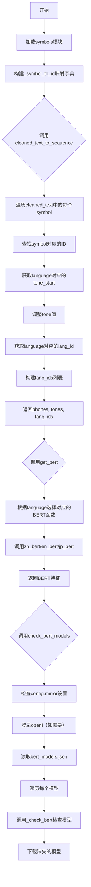
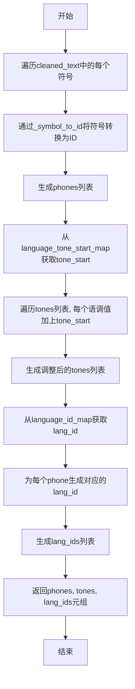
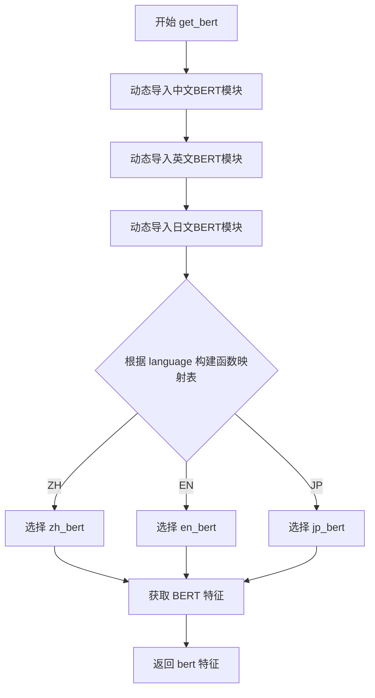

# `Bert-VITS2\oldVersion\V200\text\__init__.py` 详细设计文档

该模块负责将清洗后的文本转换为符号ID序列，并提供多语言（中文、英文、日文）的BERT特征提取功能，同时包含BERT模型的检查和下载功能。

## 整体流程



## 类结构

```
无显式类层次结构（纯函数模块）
├── 模块级别函数
│   ├── cleaned_text_to_sequence
│   ├── get_bert
│   └── check_bert_models
└── 模块级别变量
    ├── _symbol_to_id
```

## 全局变量及字段


### `_symbol_to_id`
    
符号到ID的映射字典

类型：`dict`
    


### `symbols`
    
符号列表（从symbols模块导入）

类型：`list`
    


### `language_tone_start_map`
    
语言到音调起始值的映射（从symbols模块导入）

类型：`dict`
    


### `language_id_map`
    
语言到语言ID的映射（从symbols模块导入）

类型：`dict`
    


    

## 全局函数及方法


### `cleaned_text_to_sequence`

该函数将清洗后的文本字符串转换为符号ID序列，同时根据语言类型调整语调值并生成对应的语言ID序列，返回音素序列、调整后的语调序列和语言ID序列，用于文本转语音模型的后续处理。

参数：

- `cleaned_text`：`List[str]` 或 `str`，清洗后的文本符号列表，每个元素代表一个文本符号（如音素或字符）
- `tones`：`List[int]`，原始语调值列表，每个元素表示对应符号的语调级别
- `language`：`str`，语言标识符，用于确定语调起始值和语言ID（如 "ZH"、"EN"、"JP"）

返回值：`Tuple[List[int], List[int], List[int]]`，包含三个列表——符号ID序列（phones）、调整后的语调序列（tones）和语言ID序列（lang_ids），三个列表长度相同

#### 流程图



#### 带注释源码

```python
# 从symbols模块导入符号表（symbols为所有可能的文本符号列表）
from .symbols import *

# 创建符号到ID的映射字典，键为符号，值为索引序号
_symbol_to_id = {s: i for i, s in enumerate(symbols)}


def cleaned_text_to_sequence(cleaned_text, tones, language):
    """Converts a string of text to a sequence of IDs corresponding to the symbols in the text.
    Args:
      text: string to convert to a sequence
    Returns:
      List of integers corresponding to the symbols in the text
    """
    # 步骤1: 将清洗后的文本符号列表转换为对应的ID列表
    # 使用列表推导式遍历每个符号，通过_symbol_to_id字典查找其对应的整数值ID
    phones = [_symbol_to_id[symbol] for symbol in cleaned_text]
    
    # 步骤2: 获取当前语言对应的语调起始值
    # language_tone_start_map是一个字典，存储每种语言的语调起始偏移量
    # 不同语言的语调系统可能从不同的基准值开始
    tone_start = language_tone_start_map[language]
    
    # 步骤3: 调整语调值
    # 将原始语调值加上该语言的tone_start，得到实际可用的语调ID
    # 这样可以避免不同语言的语调ID冲突
    tones = [i + tone_start for i in tones]
    
    # 步骤4: 获取当前语言的语言ID
    # language_id_map将语言标识符映射为整数值，用于标识输入文本的语言种类
    lang_id = language_id_map[language]
    
    # 步骤5: 为每个音素生成对应的语言ID
    # 创建一个与phones列表等长的语言ID列表，用于后续模型区分不同语言的音素
    lang_ids = [lang_id for i in phones]
    
    # 返回三个等长列表：音素ID序列、调整后的语调序列、语言ID序列
    return phones, tones, lang_ids
```


### `get_bert`

根据输入的语言参数，动态加载对应语言的BERT特征提取模块，并调用该模块获取文本的BERT特征表示。

参数：

- `norm_text`：`str`，规范化后的文本内容
- `word2ph`：`list` 或 `numpy.ndarray`，字到音素的映射关系，用于BERT特征对齐
- `language`：`str`，语言代码，支持 "ZH"（中文）、"EN"（英文）、"JP"（日文）
- `device`：`str` 或 `torch.device`，计算设备（如 "cpu"、"cuda"）

返回值：`any`，对应语言的BERT特征向量（具体类型取决于各语言实现，通常为张量）

#### 流程图



#### 带注释源码

```python
def get_bert(norm_text, word2ph, language, device):
    """根据语言获取对应的BERT特征
    
    Args:
      norm_text: 规范化后的文本字符串
      word2ph: 字到音素的映射数组，用于特征对齐
      language: 语言代码，支持 "ZH", "EN", "JP"
      device: 计算设备标识
    
    Returns:
      bert: 对应语言的BERT特征向量
    """
    # 动态导入各语言的BERT特征提取函数
    from .chinese_bert import get_bert_feature as zh_bert
    from .english_bert_mock import get_bert_feature as en_bert
    from .japanese_bert import get_bert_feature as jp_bert

    # 构建语言到BERT函数的映射字典
    lang_bert_func_map = {"ZH": zh_bert, "EN": en_bert, "JP": jp_bert}
    
    # 根据language参数选择对应的BERT特征提取函数并调用
    bert = lang_bert_func_map[language](norm_text, word2ph, device)
    
    # 返回提取的BERT特征
    return bert
```


### `check_bert_models`

该函数用于检查本地是否存在必要的BERT模型，若不存在则从远程仓库下载对应模型，确保后续文本处理流程能够正常使用BERT特征提取功能。

参数：此函数无参数。

返回值：`None`，该函数直接操作文件系统或远程仓库，不返回任何值。

#### 流程图

```mermaid
flowchart TD
    A[开始 check_bert_models] --> B{config.mirror == 'openi'?}
    B -->|是| C[导入 openi 模块]
    C --> D{config.openi_token 存在?}
    D -->|是| E[使用 token 登录 openi]
    D -->|否| F[不带 token 登录 openi]
    B -->|否| G[打开 ./bert/bert_models.json]
    E --> G
    F --> G
    G --> H[读取模型配置字典]
    H --> I[遍历 models 中的每个模型项]
    I --> J{遍历完成?}
    J -->|否| K[构建本地模型路径 ./bert/{k}]
    K --> L[调用 _check_bert 检查并下载模型]
    L --> I
    J -->|是| M[结束]
```

#### 带注释源码

```python
def check_bert_models():
    """检查并下载BERT模型，确保本地存在所需的模型文件"""
    import json
    from pathlib import Path

    from config import config
    from .bert_utils import _check_bert

    # 如果配置使用openi镜像，则先登录openi账号
    if config.mirror.lower() == "openi":
        import openi

        # 根据是否有token决定登录方式
        kwargs = {"token": config.openi_token} if config.openi_token else {}
        openi.login(**kwargs)

    # 读取BERT模型配置文件
    with open("./bert/bert_models.json", "r") as fp:
        models = json.load(fp)
        # 遍历每个模型的配置信息
        for k, v in models.items():
            # 拼接本地模型存储路径
            local_path = Path("./bert").joinpath(k)
            # 调用_check_bert检查模型是否存在，不存在则下载
            _check_bert(v["repo_id"], v["files"], local_path)
```

---

## 完整设计文档

### 一、代码核心功能概述

该代码模块主要负责文本到语音（Text-to-Speech, TTS）系统中的文本预处理和BERT特征提取功能，通过符号映射将输入文本转换为声学特征序列，并支持多语言（中文、英文、日文）的BERT模型管理和下载。

### 二、文件整体运行流程

```
1. 模块初始化
   ├── 加载symbols符号表并构建_symbol_to_id映射
   ├── 提供 cleaned_text_to_sequence 函数
   ├── 提供 get_bert 函数
   └── 提供 check_bert_models 函数

2. 运行时流程
   ├── 调用 check_bert_models 检查/下载BERT模型
   ├── 用户输入文本
   ├── 调用 cleaned_text_to_sequence 转换为符号序列
   ├── 调用 get_bert 获取BERT特征
   └── 返回 phones, tones, lang_ids, bert特征
```

### 三、全局变量与全局函数详细信息

#### 3.1 全局变量

| 变量名 | 类型 | 描述 |
|--------|------|------|
| `_symbol_to_id` | `Dict[str, int]` | 符号到ID的映射字典，用于将文本符号转换为数值ID |
| `symbols` | `List[str]` | 从`.symbols`导入的符号列表，包含TTS系统支持的所有音素符号 |

#### 3.2 全局函数

| 函数名 | 功能描述 |
|--------|----------|
| `cleaned_text_to_sequence` | 将清洗后的文本转换为符号ID序列，同时处理音调和语言ID |
| `get_bert` | 根据语言选择对应的BERT模型，提取文本的BERT特征向量 |
| `check_bert_models` | 检查本地BERT模型是否存在，不存在则从远程仓库下载 |

##### `cleaned_text_to_sequence`

参数：
- `cleaned_text`：`List[str]`，清洗后的符号列表
- `tones`：`List[int]`，每个符号的音调信息
- `language`：`str`，语言标识符（如"ZH", "EN", "JP"）

返回值：`Tuple[List[int], List[int], List[int]]`，返回(音素ID列表, 音调ID列表, 语言ID列表)

##### `get_bert`

参数：
- `norm_text`：`str`，归一化后的文本
- `word2ph`：`List[int]`，每个字对应的音素数量
- `language`：`str`，语言标识符
- `device`：`str`，计算设备（"cpu"或"cuda"）

返回值：返回对应语言的BERT特征向量（具体类型取决于各语言BERT实现）

### 四、关键组件信息

| 组件名称 | 描述 |
|----------|------|
| `chinese_bert` | 中文BERT特征提取模块，提供`get_bert_feature`函数 |
| `english_bert_mock` | 英文BERT特征提取模块（Mock实现），提供`get_bert_feature`函数 |
| `japanese_bert` | 日文BERT特征提取模块，提供`get_bert_feature`函数 |
| `bert_utils._check_bert` | BERT模型检查与下载工具函数 |
| `config` | 全局配置对象，包含mirror设置和openi_token等配置 |

### 五、潜在技术债务与优化空间

1. **硬编码路径问题**：模型路径`./bert`和配置文件路径`./bert/bert_models.json`硬编码在函数内部，缺乏灵活配置
2. **缺少错误处理**：文件读取、JSON解析、模型下载等操作均无异常捕获机制
3. **单语言映射限制**：`get_bert`函数仅支持ZH/EN/JP三种语言，扩展性差
4. **config依赖隐式**：函数直接依赖全局`config`对象，增加了单元测试难度
5. **mirror比较逻辑**：`config.mirror.lower() == "openi"`使用字符串比较，建议使用枚举或常量

### 六、其它项目

#### 设计目标与约束
- **目标**：支持多语言TTS系统的文本预处理和BERT特征提取
- **约束**：必须确保BERT模型可用后才能进行特征提取

#### 错误处理与异常设计
- 当前实现缺少try-except包裹，文件不存在、JSON格式错误、网络超时等情况会导致程序崩溃
- 建议添加：文件不存在警告、下载失败重试机制、网络超时处理

#### 数据流与状态机
```
文本输入 → 符号化 → 音素ID序列 → 语言检测 → BERT特征提取 → 特征向量输出
```

#### 外部依赖与接口契约
- 依赖`config`对象的`mirror`和`openi_token`属性
- 依赖`bert_models.json`配置文件，格式为`{模型名: {repo_id: str, files: List[str]}}`
- 依赖各语言BERT模块的`get_bert_feature(norm_text, word2ph, device)`接口

## 关键组件


### _symbol_to_id

符号到ID的映射字典，将所有音素符号映射到对应的整数索引，用于后续的序列转换过程。

### cleaned_text_to_sequence

将清洗后的文本转换为音素ID序列、语调序列和语言ID序列的核心函数，支持多语言的音素合成。

### get_bert

多语言BERT特征提取函数，根据语言类型动态调用对应的BERT模型（中文/英文/日文）生成文本的语义特征。

### check_bert_models

BERT模型检查与下载函数，从配置文件中读取模型信息，验证本地模型完整性并在需要时从远程仓库下载。

### language_tone_start_map

从symbols模块导入的语言语调起始值映射表，定义不同语言的语调基准偏移量。

### language_id_map

从symbols模块导入的语言ID映射表，为每个支持的语言分配唯一的整型标识符。

### lang_bert_func_map

语言到BERT函数的多态映射字典，实现根据语言类型动态选择对应的BERT特征提取实现。


## 问题及建议


### 已知问题

- **硬编码路径问题**：代码中 `./bert/bert_models.json` 和 `./bert` 路径硬编码，缺乏灵活性，无法适应不同部署环境
- **异常处理缺失**：文件读取（`open`）和 JSON 解析（`json.load`）未进行异常捕获，可能导致程序直接崩溃
- **参数校验不足**：`cleaned_text_to_sequence` 函数未对 `cleaned_text`、`tones`、`language` 参数进行有效性校验，若 `language` 不在映射表中会抛出 KeyError
- **运行时导入开销**：`get_bert` 函数内部每次调用都会动态导入 BERT 模块，在循环调用场景下性能较低，应在模块级别导入
- **文档与实现不一致**：函数 docstring 描述的参数名（`text`）与实际参数名（`cleaned_text`）不匹配
- **配置依赖隐式**：依赖 `config` 模块的 `mirror` 和 `openi_token`，但未提供默认值或缺失配置时的处理逻辑
- **循环导入风险**：`check_bert_models` 函数依赖 `from config import config`，若配置模块也导入当前模块，可能导致循环导入

### 优化建议

- 将硬编码路径改为可配置参数或使用相对路径解析，支持通过配置文件或环境变量指定
- 为所有文件操作添加 try-except 异常处理，对 JSON 解析异常进行捕获并提供友好的错误信息
- 在函数入口处增加参数类型检查和值域校验，如验证 `language` 是否在支持的语言列表中，验证 `tones` 与 `cleaned_text` 长度一致
- 将 BERT 模型相关的导入移至模块顶部或使用缓存机制，避免重复导入开销
- 修正 docstring 中的参数名与实际参数保持一致，完善返回值描述
- 为外部依赖（`config`、`bert_utils`、`symbols` 等）提供缺失时的降级方案或明确的错误提示
- 考虑将语言映射表（`language_tone_start_map`、`language_id_map`）以配置或常量形式定义在独立模块，提高可维护性


## 其它


### 设计目标与约束

该模块作为VITS文本转语音系统的核心预处理组件，主要目标是将原始文本转换为模型可处理的数值化序列（音素ID、音调、语言ID），并通过BERT模型提取文本语义特征以提升合成质量。设计约束包括：支持中文（ZH）、英文（EN）、日语（JP）三种语言；符号到ID的映射必须与模型训练时保持一致；BERT特征提取需考虑设备兼容性（CPU/GPU）；模型文件采用分布式存储需支持镜像源下载。

### 错误处理与异常设计

代码中未包含显式的异常处理机制，存在以下风险点：1）`_symbol_to_id`查询时若符号不在字典中会抛出KeyError；2）`language_tone_start_map`和`language_id_map`依赖外部导入的全局变量，若未定义会导致NameError；3）`get_bert`中根据language动态加载BERT模型，非法语言参数会触发KeyError；4）`check_bert_models`中文件读取和JSON解析可能抛出FileNotFoundError和JSONDecodeError；5）`openi.login()`调用在无网络或token无效时可能异常。建议添加：符号映射失败时的默认值或警告机制；语言参数校验；文件路径存在性检查；网络异常捕获与重试策略。

### 数据流与状态机

数据处理流程如下：输入原始文本→文本规范化→符号化（分词）→cleaned_text_to_sequence()→输出(phones, tones, lang_ids)→传递给后续声学模型。同时存在并行的BERT特征提取分支：norm_text+word2ph+language+device→get_bert()→bert特征向量→与序列信息一同输入VITS模型。状态转换包括：文本状态（规范前/规范后）→符号序列状态（离散ID）→模型输入状态（张量）。无复杂状态机设计，为单向数据流。

### 外部依赖与接口契约

核心依赖包括：1）`symbols`模块 - 符号列表定义，必须与模型词汇表一致；2）`language_tone_start_map`、`language_id_map` - 语言相关全局映射，需从配置或符号模块导入；3）`chinese_bert`、`english_bert_mock`、`japanese_bert` - 三个语言的BERT特征提取实现；4）`bert_utils._check_bert` - 模型检查与下载工具；5）`config`配置对象 - 需包含mirror和openi_token属性；6）`bert/bert_models.json` - BERT模型元数据文件，格式为{"模型名": {"repo_id": "仓库ID", "files": ["文件列表"]}}。接口契约：cleaned_text_to_sequence接受list类型的cleaned_text、list类型的tones、string类型的language，返回三个list；get_bert接受string_norm_text、list_word2ph、string_language、device返回tensor；check_bert_models无参数无返回值。

### 性能考虑与优化空间

当前实现的主要性能瓶颈：1）列表推导式逐个查询`_symbol_to_id`字典，效率O(n)；2）tones和lang_ids采用列表拼接而非预分配；3）每个音素都生成相同的lang_id，存在冗余计算；4）get_bert每次调用都动态导入BERT模块，重复开销；5）check_bert_models顺序检查模型，可并行化。优化建议：使用map()或numpy向量化操作替代列表推导；lang_id可改为标量而非列表；缓存已导入的BERT模块；模型检查支持异步并行下载；考虑使用__slots__优化内存。

### 安全性考虑

代码存在以下安全风险：1）`check_bert_models`直接执行`openi.login(**kwargs)`，若config.openi_token被恶意注入可能导致未授权访问；2）从文件系统读取bert_models.json未做路径遍历检查；3）动态导入模块未做白名单限制；4）device参数未做验证，可能导致资源耗尽。建议：token存储使用环境变量或密钥管理系统；路径参数进行规范化与校验；模块导入添加白名单机制；device参数增加有效性检查。

### 测试策略建议

单元测试应覆盖：1）cleaned_text_to_sequence的符号映射准确性、tone_start偏移计算、lang_id生成；2）get_bert对三种语言分支的覆盖；3）check_bert_models的模型文件检测逻辑。集成测试需验证：完整文本到序列的端到端流程；BERT特征维度与模型输入兼容性；多语言混合场景。Mock测试：模拟BERT模型返回、模拟文件不存在、模拟网络超时。

### 配置管理

当前配置依赖硬编码和外部config对象，建议改进：1）symbols列表应从配置文件加载而非代码耦合；2）语言映射表应支持YAML/JSON配置；3）bert_models.json路径应可配置；4）默认语言参数应支持环境变量覆盖；5）镜像源配置应支持多源切换与fallback机制。

### 版本兼容性

需关注：1）symbols模块的符号顺序变更会导致ID映射错位；2）BERT模型接口变化（get_bert_feature签名）会导致调用失败；3）config对象属性变更会影响check_bert_models执行；4）openi库API变化。建议在代码中增加版本断言检查，并使用try-except兼容旧版本接口。

    