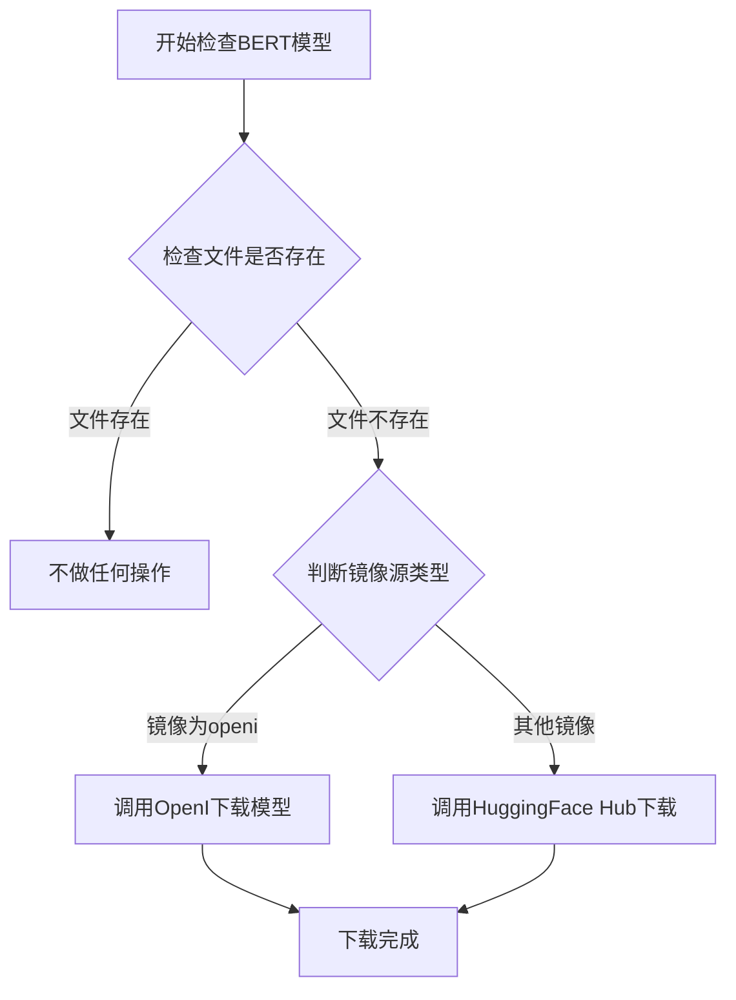
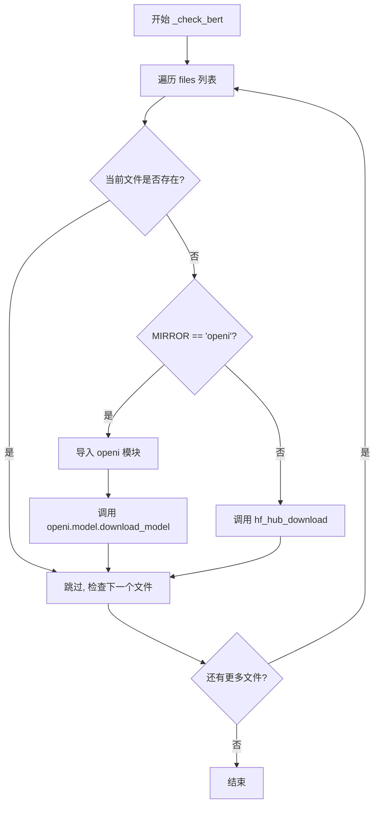

# `Bert-VITS2\oldVersion\V200\text\bert_utils.py` 详细设计文档

该代码模块用于检查并从HuggingFace Hub或OpenI镜像下载BERT模型文件，支持配置化的镜像源切换，确保模型文件的本地可用性。

## 整体流程



## 类结构

```
该文件为工具模块，无类定义
└── 全局函数: _check_bert
└── 全局变量: MIRROR
```

## 全局变量及字段


### `MIRROR`
    
全局变量，从config获取镜像源配置，用于决定模型下载时使用的镜像源

类型：`str`
    


    

## 全局函数及方法


### `_check_bert`

该函数用于检查本地是否存在BERT模型文件，如果文件缺失则根据配置的镜像源选择从OpenI或Hugging Face Hub下载相应的模型文件。

参数：

- `repo_id`：`str`，Hugging Face Hub上的模型仓库ID，格式为`username/repo_name`
- `files`：`list[str]`，需要检查的BERT模型文件名列表
- `local_path`：`str`，模型文件的本地存储路径

返回值：`None`，该函数仅执行检查和下载操作，无返回值

#### 流程图



#### 带注释源码

```python
from pathlib import Path

from huggingface_hub import hf_hub_download

from config import config

# 全局变量：从配置中读取镜像源设置
MIRROR: str = config.mirror


def _check_bert(repo_id, files, local_path):
    """
    检查并下载BERT模型文件
    
    参数:
        repo_id: Hugging Face仓库ID
        files: 需要检查的文件名列表
        local_path: 本地存储路径
    """
    # 遍历需要检查的每个文件
    for file in files:
        # 拼接完整路径并检查文件是否存在于本地
        if not Path(local_path).joinpath(file).exists():
            # 判断配置的镜像源类型
            if MIRROR.lower() == "openi":
                # 使用OpenI镜像下载模型
                import openi
                
                openi.model.download_model(
                    "Stardust_minus/Bert-VITS2",  # OpenI上的模型路径
                    repo_id.split("/")[-1],       # 从repo_id提取模型名称
                    "./bert"                      # 下载到本地目录
                )
            else:
                # 使用Hugging Face Hub下载模型
                # local_dir_use_symlinks=False 表示不使用符号链接，直接下载实体文件
                hf_hub_download(
                    repo_id, 
                    file, 
                    local_dir=local_path, 
                    local_dir_use_symlinks=False
                )
```

## 关键组件


### 全局变量 MIRROR

用于配置模型下载的镜像源，支持从 HuggingFace Hub 或 OpenI 镜像站点下载模型文件

### 函数 _check_bert

检查指定目录下 BERT 模型文件是否存在，如不存在则根据 MIRROR 配置从远程仓库下载模型，提供惰性加载机制以避免首次启动时下载完整模型


## 问题及建议


### 已知问题

-   **硬编码问题**：`"Stardust_minus/Bert-VITS2"` 和 `"./bert"` 路径被硬编码在函数内部，降低了函数的通用性和可配置性
-   **异常处理缺失**：没有 try-except 捕获下载失败、网络异常等错误，会导致程序直接崩溃
-   **日志缺失**：没有任何日志输出，无法追踪下载过程和调试问题
-   **导入位置不当**：`import openi` 放在函数内部的条件分支中，如果该分支不执行，后续代码可能无法使用该模块（静态检查工具可能报错）
-   **重复计算**：`MIROR.lower()` 在每次函数调用时都执行一次字符串转换，可以提前处理
-   **下载后无验证**：调用 `openi.model.download_model` 或 `hf_hub_download` 后没有验证文件是否真正下载成功
-   **类型提示缺失**：函数参数和返回值没有类型注解，影响代码可读性和 IDE 支持
-   **逻辑冗余**：循环检查文件是否存在，但只要有一个文件不存在就会尝试下载，应该检查所有文件是否都存在再决定是否下载

### 优化建议

-   将硬编码的模型名称和路径提取为函数参数或配置文件
-   添加 try-except 包装下载逻辑，捕获网络异常、文件权限问题等
-   使用标准日志模块（logging）记录下载进度和状态
-   将 `import openi` 移到文件顶部，或使用 `importlib` 动态导入
-   在函数签名添加类型提示：`def _check_bert(repo_id: str, files: list[str], local_path: str) -> None`
-   在下载后检查文件是否成功创建，可添加重试机制
-   考虑将 MIRROR 转换为小写一次并缓存，而不是每次调用都转换

## 其它


### 设计目标与约束

本模块旨在实现BERT模型文件的自动检查与下载功能，确保模型文件在本地可用。设计约束包括：仅在文件缺失时触发下载，支持HuggingFace Hub和OpenI镜像两种下载源，下载过程不使用符号链接。

### 错误处理与异常设计

异常类型包括：`FileNotFoundError`（本地路径无效）、`ImportError`（openi模块导入失败）、`HTTPError`（网络下载失败）、`OSError`（文件系统操作失败）。当MIRROR为"openi"时，若openi模块不存在应捕获ImportError并回退至HuggingFace下载；当网络请求超时或失败时应向上抛出异常供调用方处理。

### 数据流与状态机

数据流为：调用方传入repo_id、files列表、local_path → 遍历files检查文件是否存在 → 若文件缺失则根据MIRROR选择下载源 → 调用对应下载接口。无复杂状态机，为简单的条件分支流程。

### 外部依赖与接口契约

外部依赖包括：`pathlib.Path`（标准库）、`huggingface_hub.hf_hub_download`（HuggingFace Hub下载接口）、`config.config`（配置对象，需提供mirror属性）、`openi.model.download_model`（OpenI镜像下载接口）。接口契约：`_check_bert(repo_id: str, files: List[str], local_path: str)`，无返回值，调用方需确保local_path可写且repo_id格式为"owner/repo"。

### 性能考量

文件存在性检查使用同步阻塞方式，大文件下载可能阻塞主线程。建议优化方向：添加下载进度回调支持、考虑异步下载、添加下载超时配置。

### 安全考量

repo_id直接用于下载路径拼接，需验证repo_id格式防止路径遍历攻击；local_path未做路径规范化，可能存在符号链接攻击风险；动态导入openi模块存在安全隐患。

### 配置管理

MIRROR配置通过config.mirror获取，支持的值包括"openi"及其他HuggingFace Hub标识，配置变更需重启生效。

### 版本兼容性

依赖huggingface_hub版本需支持`local_dir`和`local_dir_use_symlinks`参数；openi模块接口依赖第三方库版本，需注明兼容版本范围。

    