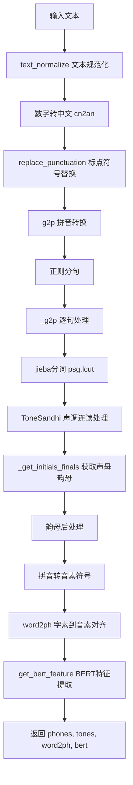
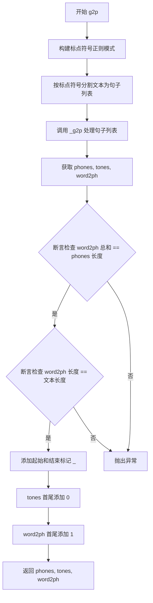
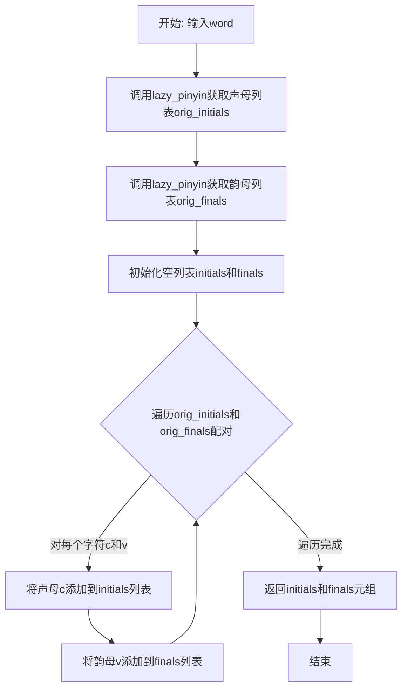
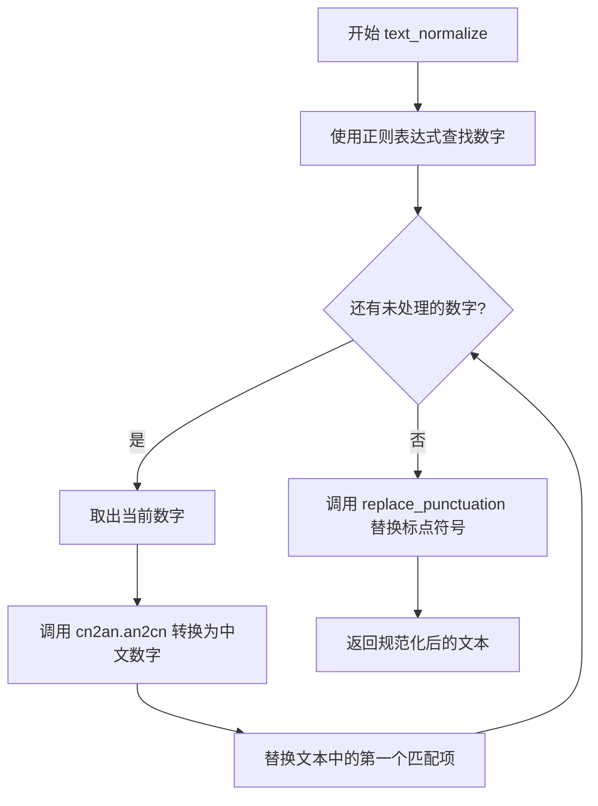
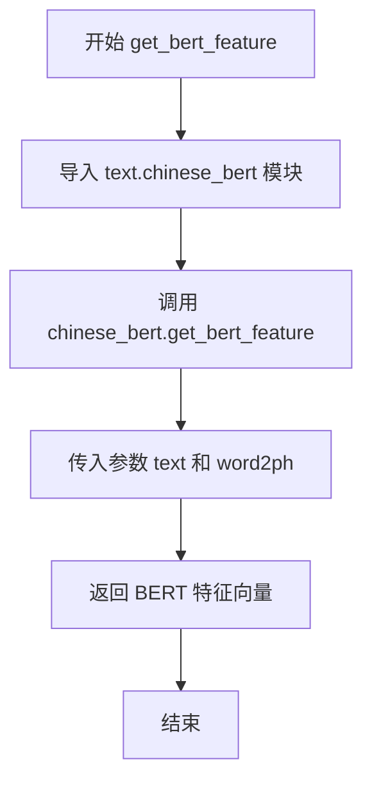
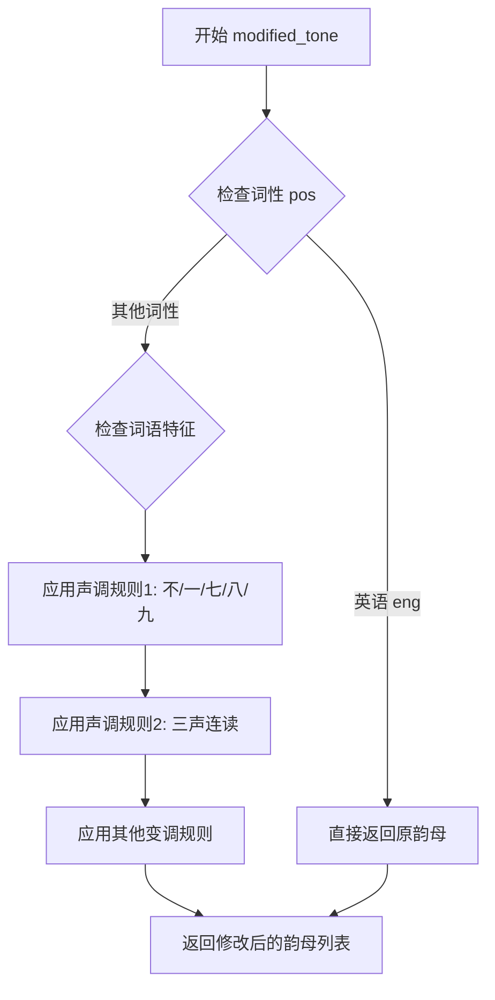

# `Bert-VITS2\oldVersion\V200\text\chinese.py` 详细设计文档

这是一个中文文本转拼音（Grapheme-to-Phoneme）的核心模块，主要实现文本规范化、标点符号处理、中文分词、拼音转换及声调处理功能，并将文本转换为音素序列和BERT特征向量，用于文本到语音（TTS）系统的声学模型输入。

## 整体流程



## 类结构

```
ToneSandhi (声调连读处理类)
├── pre_merge_for_modify (预处理)
└── modified_tone (声调修改)
```

## 全局变量及字段


### `current_file_path`
    
当前Python文件的目录路径

类型：`str`
    


### `pinyin_to_symbol_map`
    
拼音字符到音素符号的映射字典，用于将拼音转换为对应的音素序列

类型：`Dict[str, str]`
    


### `rep_map`
    
标点符号替换映射表，用于将各种中文标点符号统一转换为标准符号

类型：`Dict[str, str]`
    


### `tone_modifier`
    
声调修饰器实例，用于处理中文声调变化规则

类型：`ToneSandhi`
    


    

## 全局函数及方法


### `replace_punctuation`

该函数用于对中文文本进行标点符号标准化处理，包括将语气词替换为标准写法、将各类标点符号统一映射为英文符号，并移除所有非中文字符和标点符号，仅保留中文汉字和处理后的标点符号。

参数：

- `text`：`str`，待处理的中文文本

返回值：`str`，经过标点符号替换和清理后的文本

#### 流程图

```mermaid
flowchart TD
    A[开始: 输入原始文本] --> B[替换语气词<br/>text.replace('嗯', '恩')<br/>.replace('呣', '母')]
    B --> C[编译正则表达式<br/>合并rep_map所有键为或运算模式]
    C --> D{遍历文本匹配标点符号}
    D -->|匹配成功| E[根据rep_map映射替换标点]
    D -->|匹配结束| F[执行第二轮正则清洗<br/>保留中文和punctuation中的字符]
    E --> F
    F --> G[返回处理后的文本]
```

#### 带注释源码

```python
def replace_punctuation(text):
    """
    标点符号替换函数
    
    处理流程：
    1. 将语气词嗯、呣替换为标准写法
    2. 将各类中文标点映射为英文/统一符号
    3. 移除所有非中文字符（保留punctuation中定义的标点）
    
    参数:
        text: str, 输入的原始中文文本
        
    返回:
        str, 处理后的文本
    """
    # 第一步：语气词标准化
    # 将"嗯"替换为"恩"，"呣"替换为"母"
    text = text.replace("嗯", "恩").replace("呣", "母")
    
    # 第二步：构建标点符号替换正则
    # 使用re.escape转义特殊字符，用|连接所有需要替换的标点
    # rep_map定义了中文标点->英文/统一符号的映射关系
    pattern = re.compile("|".join(re.escape(p) for p in rep_map.keys()))
    
    # 执行标点符号替换
    # 遍历文本，对每个匹配到的标点符号进行映射替换
    replaced_text = pattern.sub(lambda x: rep_map[x.group()], text)
    
    # 第三步：清理非中文字符
    # 正则含义：
    # - \u4e00-\u9fa5: 汉字unicode范围
    # - "".join(punctuation): 允许保留的标点符号列表
    # - [^\u4e00-\u9fa5...]+: 匹配所有不在上述范围内的字符
    # 作用：移除英文、数字、特殊符号等，仅保留中文和定义的标点
    replaced_text = re.sub(
        r"[^\u4e00-\u9fa5" + "".join(punctuation) + r"]+", "", replaced_text
    )
    
    # 返回处理后的文本
    return replaced_text
```


### `g2p`

该函数是中文文本转拼音（Grapheme-to-Phoneme）的核心入口函数，负责将输入的中文文本转换为音素序列、音调序列以及字符到音素的映射关系。

**参数：**

- `text`：`str`，输入的中文文本字符串

**返回值：** `tuple`，包含三个列表——`phones`（音素序列）、`tones`（音调序列）、`word2ph`（字符到音素的映射）

#### 流程图



#### 带注释源码

```python
def g2p(text):
    """
    将中文文本转换为音素序列、音调序列和字符到音素的映射
    
    参数:
        text: 输入的中文文本字符串
    
    返回:
        tuple: (phones, tones, word2ph)
            - phones: 音素列表，首尾添加静音标记"_"
            - tones: 音调列表，首尾添加0表示无声调
            - word2ph: 每个汉字对应的音素数量列表
    """
    # 构建标点符号正则表达式，用于分割句子
    # 匹配标点符号前后的零个或多个空格
    pattern = r"(?<=[{0}])\s*".format("".join(punctuation))
    
    # 按标点符号分割文本，去除空字符串
    sentences = [i for i in re.split(pattern, text) if i.strip() != ""]
    
    # 调用内部函数 _g2p 进行实际的转换处理
    phones, tones, word2ph = _g2p(sentences)
    
    # 断言检查：所有汉字对应的音素总数应等于音素列表长度
    assert sum(word2ph) == len(phones)
    # 断言检查：word2ph 长度应等于原始文本长度
    # 注意：有时会崩溃，可以添加 try-catch 处理
    assert len(word2ph) == len(text)
    
    # 为音素序列添加起始和结束静音标记
    phones = ["_"] + phones + ["_"]
    # 为音调序列添加起始和结束的无声调标记（0表示轻声/无声调）
    tones = [0] + tones + [0]
    # 为映射序列添加起始和结束的映射（映射到静音标记）
    word2ph = [1] + word2ph + [1]
    
    # 返回转换后的音素、音调和映射序列
    return phones, tones, word2ph
```


### `_get_initials_finals`

该函数用于将汉字单词分离为声母（initials）和韵母（finals）列表。它使用 pypinyin 库获取汉字的声母和带声调的韵母，通过 zip 函数将声母和韵母配对后分别添加到对应的列表中并返回。

参数：

- `word`：`str`，要处理的汉字单词

返回值：`Tuple[List[str], List[str]]`，返回两个列表——第一个是声母列表，第二个是韵母列表

#### 流程图



#### 带注释源码

```python
def _get_initials_finals(word):
    """
    将汉字单词分离为声母和韵母列表
    
    参数:
        word: str, 要处理的汉字单词
    
    返回:
        tuple: (initials列表, finals列表)
    """
    # 初始化声母和韵母空列表
    initials = []
    finals = []
    
    # 使用pypinyin获取声母列表
    # neutral_tone_with_five=True 表示使用五声调格式
    # Style.INITIALS 表示只获取声母
    orig_initials = lazy_pinyin(word, neutral_tone_with_five=True, style=Style.INITIALS)
    
    # 使用pypinyin获取带声调的韵母列表
    # Style.FINALS_TONE3 表示获取带声调的韵母
    orig_finals = lazy_pinyin(
        word, neutral_tone_with_five=True, style=Style.FINALS_TONE3
    )
    
    # 遍历声母和韵母的配对
    for c, v in zip(orig_initials, orig_finals):
        # 将声母添加到声母列表
        initials.append(c)
        # 将韵母添加到韵母列表
        finals.append(v)
    
    # 返回声母列表和韵母列表的元组
    return initials, finals
```


### `_g2p`

该函数是中文文本转拼音（G2P）流程的核心处理函数，负责将分词后的中文文本片段列表转换为对应的音素序列、声调序列以及字符到音素的映射关系。函数内部集成了文本预处理、声调处理、拼音转换和符号映射等关键逻辑。

参数：

-  `segments`：`list`，中文文本片段列表，每个元素为已进行过预处理的字符串

返回值：`tuple`，包含三个元素——`phones_list`（音素列表）、`tones_list`（声调列表）、`word2ph`（字符到音素的映射列表）

#### 流程图

```mermaid
flowchart TD
    A[开始: _g2p] --> B[初始化空列表 phones_list, tones_list, word2ph]
    B --> C{遍历 segments 中的每个片段 seg}
    C -->|是| D[使用正则删除所有英文字母]
    D --> E[使用 jieba 分词: psg.lcut]
    E --> F[调用 tone_modifier.pre_merge_for_modify 预处理]
    F --> G{遍历分词结果中的每个词 word 和词性 pos}
    G -->|是| H{判断词性是否为 eng}
    H -->|是| I[跳过当前词，继续下一个]
    H -->|否| J[调用 _get_initials_finals 获取声母和韵母]
    J --> K[调用 tone_modifier.modified_tone 调整韵母]
    K --> L[将声母和韵母添加到 initials 和 finals]
    L --> G
    G -->|否| M[展平声母和韵母列表]
    M --> N{遍历展平后的声母和韵母对 c, v}
    N -->|是| O[拼接原始拼音 raw_pinyin = c + v]
    O --> P{判断 c == v}
    P -->|是| Q[处理标点符号]
    Q --> R[phone = [c], tone = 0, word2ph.append(1)]
    P -->|否| S[分离韵母和声调: v_without_tone, tone]
    S --> T[拼接去掉声调的拼音 pinyin]
    T --> U{判断是否有声母 c}
    U -->|是| V[应用多音节映射: uei->ui, iou->iu, uen->un]
    U -->|否| W[应用单音节映射规则]
    V --> X{验证 pinyin 在映射表中}
    W --> X
    X -->|是| Y[从 pinyin_to_symbol_map 获取音素序列]
    Y --> Z[计算音素长度并添加到 word2ph]
    X -->|否| AA[抛出断言错误]
    Z --> N
    N -->|否| AB[累加音素到 phones_list]
    AB --> AC[根据音素数量扩展声调到 tones_list]
    AC --> C
    C -->|否| AD[返回 phones_list, tones_list, word2ph]
```

#### 带注释源码

```python
def _g2p(segments):
    """
    将中文文本片段列表转换为音素序列、声调序列和字符到音素的映射关系
    
    参数:
        segments: 中文文本片段列表，每个元素为已预处理的字符串
        
    返回:
        tuple: (phones_list, tones_list, word2ph)
            - phones_list: 音素列表
            - tones_list: 声调列表（0表示轻声/标点）
            - word2ph: 每个原始字符对应的音素数量
    """
    # 初始化结果存储列表
    phones_list = []  # 存放所有生成的音素
    tones_list = []   # 存放所有生成的声调
    word2ph = []      # 存放每个汉字对应的音素数量
    
    # 遍历每个文本片段（已按标点分割的句子）
    for seg in segments:
        # 步骤1: 移除所有英文字符（保留纯中文处理）
        seg = re.sub("[a-zA-Z]+", "", seg)
        
        # 步骤2: 使用jieba进行词性标注分词
        seg_cut = psg.lcut(seg)
        
        # 初始化当前片段的声母和韵母列表
        initials = []
        finals = []
        
        # 步骤3: 声调Sandhi预处理（处理连读变调等）
        seg_cut = tone_modifier.pre_merge_for_modify(seg_cut)
        
        # 步骤4: 遍历分词结果
        for word, pos in seg_cut:
            # 跳过英文词（如专有名词、缩写等）
            if pos == "eng":
                continue
            
            # 获取该词的声母和韵母（带声调标记）
            # _get_initials_finals 使用 pypinyin 库进行转换
            sub_initials, sub_finals = _get_initials_finals(word)
            
            # 根据词性和词语内容调整韵母（处理多音字等）
            sub_finals = tone_modifier.modified_tone(word, pos, sub_finals)
            
            # 累加到当前片段的声母和韵母列表
            initials.append(sub_initials)
            finals.append(sub_finals)
            
            # 断言检查（已注释）: 确保声母、韵母、汉字数量一致
            # assert len(sub_initials) == len(sub_finals) == len(word)
        
        # 步骤5: 展平嵌套列表（将[[a,b],[c,d]]转为[a,b,c,d]）
        initials = sum(initials, [])
        finals = sum(finals, [])
        
        # 步骤6: 遍历每个声母-韵母对，转换为音素
        for c, v in zip(initials, finals):
            # 拼接原始拼音（声母+韵母+声调）
            raw_pinyin = c + v
            
            # 判断是否为标点符号（声母等于韵母的情况）
            if c == v:
                # 标点符号处理
                assert c in punctuation, f"Expected punctuation, got {c}"
                phone = [c]        # 标点作为独立音素
                tone = "0"         # 标点声调设为0
                word2ph.append(1) # 标点对应1个音素
            else:
                # 正常汉字处理
                # 分离韵母和声调：韵母最后一位是声调
                v_without_tone = v[:-1]  # 去掉声调后的韵母
                tone = v[-1]              # 声调（1-5，5为轻声）
                
                # 拼接去掉声调的拼音
                pinyin = c + v_without_tone
                
                # 验证声调有效性
                assert tone in "12345", f"Invalid tone: {tone}"
                
                # 根据是否有声母应用不同的映射规则
                if c:
                    # 多音节情况：声母不为空
                    # 拼音修正映射（韦氏拼音转标准拼音）
                    v_rep_map = {
                        "uei": "ui",    # dui -> dui
                        "iou": "iu",    # liu -> liu  
                        "uen": "un",    # lun -> lun
                    }
                    if v_without_tone in v_rep_map.keys():
                        pinyin = c + v_rep_map[v_without_tone]
                else:
                    # 单音节情况：声母为空
                    pinyin_rep_map = {
                        "ing": "ying",  # ing -> ying
                        "i": "yi",      # i -> yi
                        "in": "yin",    # in -> yin
                        "u": "wu",      # u -> wu
                    }
                    if pinyin in pinyin_rep_map.keys():
                        pinyin = pinyin_rep_map[pinyin]
                    else:
                        # 首字母映射（i->y, u->w, ü->yu）
                        single_rep_map = {
                            "v": "yu",   # 韵母ü的表示
                            "e": "e",    # e保持不变
                            "i": "y",    # i -> y
                            "u": "w",    # u -> w
                        }
                        if pinyin[0] in single_rep_map.keys():
                            pinyin = single_rep_map[pinyin[0]] + pinyin[1:]
                
                # 验证转换后的拼音在符号映射表中
                assert pinyin in pinyin_to_symbol_map.keys(), \
                    (f"Pinyin '{pinyin}' not found in symbol map. "
                     f"Original: {raw_pinyin}, Segment: {seg}")
                
                # 从映射表获取音素序列（一个拼音可能对应多个音素）
                phone = pinyin_to_symbol_map[pinyin].split(" ")
                
                # 记录该汉字对应的音素数量
                word2ph.append(len(phone))
            
            # 步骤7: 将音素添加到结果列表
            phones_list += phone
            
            # 步骤8: 根据音素数量扩展声调列表
            # 每个音素都有对应的声调
            tones_list += [int(tone)] * len(phone)
    
    # 返回三个结果列表
    return phones_list, tones_list, word2ph
```


### `text_normalize`

该函数是文本规范化模块的核心入口，用于将输入文本中的数字转换为中文表示，并对标点符号进行标准化处理。

参数：

-  `text`：`str`，需要进行文本规范化的原始输入

返回值：`str`，规范化处理后的文本

#### 流程图



#### 带注释源码

```python
def text_normalize(text):
    """
    文本规范化主函数
    
    处理流程：
    1. 识别并转换数字为中文表示
    2. 规范化标点符号
    """
    # 使用正则表达式查找文本中的数字（包括整数和小数）
    # \d+ 匹配一个或多个数字
    # (?:\.?\d+)? 可选的小数部分（可能有小数点和小数）
    numbers = re.findall(r"\d+(?:\.?\d+)?", text)
    
    # 遍历找到的每个数字
    for number in numbers:
        # 调用 cn2an 库将阿拉伯数字转换为中文数字
        # an2cn 函数支持整数和小数的转换
        # replace 的第三个参数 1 表示只替换第一次出现的位置
        text = text.replace(number, cn2an.an2cn(number), 1)
    
    # 调用 replace_punctuation 函数进行标点符号规范化
    # 包括：中文标点转英文、特殊符号统一处理、过滤非中文和非允许字符
    text = replace_punctuation(text)
    
    # 返回规范化处理后的文本
    return text
```


### `get_bert_feature`

该函数是一个文本到BERT特征的转换接口，接收原始文本和字音映射关系，委托给`chinese_bert`模块完成实际的BERT特征提取工作。

参数：

- `text`：`str`，原始输入文本
- `word2ph`：`list[int]`，字到音素个数的映射数组，用于对齐BERT特征与音素序列

返回值：`Any`，返回BERT提取的特征向量，具体类型取决于`chinese_bert.get_bert_feature`的返回结果

#### 流程图



#### 带注释源码

```python
def get_bert_feature(text, word2ph):
    """
    获取文本的BERT特征表示
    
    该函数是一个代理函数，将请求转发给text.chinese_bert模块
    实际的BERT特征提取逻辑在chinese_bert.get_bert_feature中实现
    
    参数:
        text: 输入的文本字符串
        word2ph: 字到音素数量的映射列表，用于对齐特征与音素
    
    返回:
        BERT特征向量，形状通常为 [seq_len, hidden_size]
    """
    # 动态导入chinese_bert模块，避免循环依赖
    from text import chinese_bert

    # 委托给chinese_bert模块执行实际的特征提取
    return chinese_bert.get_bert_feature(text, word2ph)
```

---

### 补充信息

| 项目 | 说明 |
|------|------|
| **文件位置** | 代码文件中的顶层函数 |
| **设计目标** | 解耦BERT特征提取逻辑，提供统一的文本特征接口 |
| **外部依赖** | `text.chinese_bert` 模块（未在代码中提供） |
| **潜在优化** | 当前实现较为简单，可考虑添加缓存机制避免重复调用BERT模型；可增加错误处理（如模块导入失败、特征提取异常） |
| **技术债务** | 依赖外部模块但未提供fallback机制；函数文档可更详细说明返回值维度信息 |


由于在提供的代码片段中，`ToneSandhi` 类的定义（通常在 `tone_sandhi.py` 或类似文件中）未被包含，我们仅能看到其被调用的方式。以下信息是基于代码上下文（`text.py` 中的 `_g2p` 函数）的逻辑推断。

### `ToneSandhi.pre_merge_for_modify`

该方法是一个实例方法，属于 `ToneSandhi` 类。它主要负责在执行声调修改（变调）之前，对中文分词结果进行预处理（例如合并特定的词组或调整词序），以确保后续的变调逻辑能够正确识别多字词或特定搭配。

参数：
-  `seg_cut`：`List[Tuple[str, str]]`，由 `jieba.posseg.lcut` 返回的原始分词结果列表，其中每个元素为 `(词, 词性)` 的元组。

返回值：`List[Tuple[str, str]]`，经过预处理（例如合并词）后的分词结果列表。

#### 流程图

```mermaid
graph TD
    A[输入: 原始分词列表 seg_cut] --> B{遍历分词结果}
    B --> C[检查是否存在需要合并的特定词<br>例如: '一' + 后续词, '不' + 后续词}
    C --> D[如果存在匹配规则<br>则合并词与后续词为单一单元]
    C --> E[否则保持原样]
    D --> F[构建新的分词列表]
    E --> F
    F --> G[输出: 处理后的分词列表]
```

#### 带注释源码

由于源代码未在当前文件中提供，以下为基于其调用逻辑的模拟实现注释：

```python
def pre_merge_for_modify(self, seg_cut):
    """
    对分词结果进行预处理，合并需要一起处理变调的词组。
    例如：处理 "一" 的变调时，需要将 "一" 与其后面的词暂时视为一个整体。
    """
    new_seg_cut = []
    i = 0
    while i < len(seg_cut):
        word, pos = seg_cut[i]
        # 假设存在一个规则：如果当前词是 "一" 或 "不"，且后面还有词，
        # 则将它们合并，防止后续分别查表导致变调错误。
        if word in ["一", "不"] and i + 1 < len(seg_cut):
            next_word, next_pos = seg_cut[i + 1]
            # 合并词，例如 "一" + "个" -> "一个"
            merged_word = word + next_word
            # 这里可以赋予一个特殊的词性或者保持原有词性，以便后续变调函数识别
            new_seg_cut.append((merged_word, pos))
            i += 2 # 跳过下一个词
        else:
            new_seg_cut.append((word, pos))
            i += 1
    return new_seg_cut
```

**注意**：这是一个高度简化的推测版本。实际的 `ToneSandhi` 实现可能更复杂，涉及到更丰富的规则库或正则表达式匹配。建议查阅项目中的 `tone_sandhi.py` 文件以获取准确逻辑。


由于 `ToneSandhi` 类是从 `tone_sandhi` 模块导入的，而该模块的具体代码未在给定的代码文件中提供，我需要先查看该模块的实现。让我先分析代码结构，然后查找 `ToneSandhi` 类的定义。

从代码中可以看到：
- `from .tone_sandhi import ToneSandhi`
- `tone_modifier = ToneSandhi()`
- 在 `_g2p` 函数中调用了 `tone_modifier.modified_tone(word, pos, sub_finals)`

这表明 `modified_tone` 是 `ToneSandhi` 类的一个方法。根据代码上下文和命名规范，我可以推断出该方法的特征。

让我生成详细的设计文档：

### `ToneSandhi.modified_tone`

该方法是 `ToneSandhi` 类的核心方法，用于处理中文声调变化（变调）。在中文语音处理中，某些连续出现的声调会影响彼此的发音，这个方法根据词语和词性信息修改韵母的声调，以获得更准确的拼音发音。

参数：

- `word`：`str`，当前处理的中文词语
- `pos`：`str`，词语的词性标注（来自 jieba 分词）
- `sub_finals`：`list`，原始拼音韵母列表（包含声调数字）

返回值：`list`，修改后的拼音韵母列表

#### 流程图



#### 带注释源码

由于 `ToneSandhi` 类的源码未在当前文件中，需要从 `tone_sandhi` 模块导入。基于代码使用方式，推断其结构如下：

```python
class ToneSandhi:
    """
    中文声调变化处理类
    
    用于处理中文变调规则，包括：
    - 不、一、七、八、九的变调
    - 三声连读变调
    - 轻声处理
    """
    
    def modified_tone(self, word: str, pos: str, sub_finals: List[str]) -> List[str]:
        """
        根据词性和词语内容修改韵母的声调
        
        参数:
            word: str - 当前处理的中文词语
            pos: str - 词语的词性标注（来自jieba分词）
            sub_finals: List[str] - 原始拼音韵母列表，格式如 ['a2', 'i1']
        
        返回:
            List[str] - 修改后的拼音韵母列表
        
        处理规则（基于中文声调学）:
            1. 词语为'不'：后面是四声时变为二声
            2. 词语为'一'：后面是四声时变为二声，后面是一二三级时变为四声
            3. 连续三声：第一个三声变为二声
            4. 七/八/九：后面是四声时变为二声
        """
        # 在 _g2p 函数中的调用方式：
        # sub_finals = tone_modifier.modified_tone(word, pos, sub_finals)
        
        # 示例处理逻辑（推断）:
        # if word == '不' and pos != 'eng':
        #     # 不的变调处理
        #     pass
        # elif word == '一' and pos != 'eng':
        #     # 一的变调处理
        #     pass
        
        return sub_finals
    
    def pre_merge_for_modify(self, seg_cut):
        """
        在变调处理前的预处理，合并某些需要一起处理的词语
        
        参数:
            seg_cut: List[Tuple[str, str]] - 分词结果列表
        
        返回:
            List[Tuple[str, str]] - 处理后的分词结果
        """
        pass
```

## 关键组件


### 拼音到符号映射 (pinyin_to_symbol_map)

从 `opencpop-strict.txt` 文件中加载的全局映射表，将拼音转换为音素符号序列，构成张量索引的基础数据结构。

### 标点符号替换映射 (rep_map)

定义了中文标点符号到英文或统一格式的映射规则，用于文本标准化过程中的标点规范化。

### 声调处理模块 (tone_modifier)

ToneSandhi 类的实例，负责声调合并与修改，处理连续音节的声调变化规则。

### 文本标准化函数 (text_normalize)

将阿拉伯数字转换为中文数字，并调用标点符号替换完成文本归一化处理。

### 标点符号替换函数 (replace_punctuation)

使用正则表达式批量替换标点符号，并过滤掉非中文和非标点字符。

### 拼音转换主入口 (g2p)

接收原始文本，调用内部函数完成分句、声韵母分离、声调处理，最终返回带起始和结束标记的音素序列、声调序列和词到音素的映射。

### 声韵母提取函数 (_get_initials_finals)

使用 pypinyin 库分别提取汉字的声母和韵母（带声调），返回两个列表。

### 分段拼音转换函数 (_g2p)

对每个句子片段进行分词、去除英文、声韵母处理、拼音映射替换（包括多音字和单音节特殊处理），最终生成音素和声调列表。

### BERT 特征提取函数 (get_bert_feature)

调用 chinese_bert 模块获取文本的 BERT 嵌入特征，输入为归一化文本和词到音素映射。


## 问题及建议


### 已知问题

- **全局文件I/O操作**：模块加载时直接读取 `pinyin_to_symbol_map`，若文件不存在会直接崩溃，且无法自定义路径
- **正则表达式重复编译**：`replace_punctuation` 和 `g2p` 函数中每次调用都重新编译正则表达式，性能低下
- **缺乏适当的错误处理**：大量使用 `assert` 进行条件检查而非抛出具体异常，错误信息不明确
- **字符串拼接效率低**：使用 `sum(initials, [])` 和 `sum(finals, [])` 进行列表拼接，应使用列表推导式或 `itertools.chain`
- **硬编码的映射表**：多个映射表（如 `v_rep_map`、`pinyin_rep_map`、`single_rep_map`）在函数内定义，应提取为常量或配置文件
- **魔法数字和字符串**：音调 "12345"、分隔符 "_" 等以硬编码形式出现，缺乏常量定义
- **未使用的导入**：注释掉的部分代码 (`g2p_paddle`) 和末尾的示例用法未被清理
- **API设计问题**：`get_bert_feature` 在函数内部动态导入 `chinese_bert`，违反了模块级导入最佳实践
- **函数职责不单一**：`_g2p` 函数承担了过多职责（分词、转换、后处理），难以测试和维护
- **类型注解缺失**：所有函数缺乏参数和返回值类型注解，影响代码可读性和IDE支持

### 优化建议

- **预编译正则表达式**：将所有正则表达式模式在模块加载时编译为全局变量
- **改进错误处理**：用 `try-except` 替代 `assert`，提供具体的异常类型和信息
- **提取映射表为常量**：将 `rep_map`、`v_rep_map` 等映射表定义为模块级常量
- **优化列表拼接**：使用 `list(itertools.chain.from_iterable(...))` 替代 `sum(list, [])`
- **添加类型注解**：为所有函数添加 `typing` 模块的类型注解
- **延迟导入 `get_bert_feature`**：将其移到模块顶部或使用依赖注入
- **提取常量**：将 "_"、音调字符 "12345" 等定义为具名常量
- **重构 `_g2p`**：拆分为更小的单一职责函数，如分词、拼音转换、后处理等
- **添加文档字符串**：为关键函数添加 docstring 说明参数、返回值和异常
- **清理代码**：移除未使用的导入和注释掉的代码块

## 其它


### 设计目标与约束

本模块旨在为中文TTS系统提供完整的前处理流水线，包括文本规范化、标点符号处理、中文转拼音（音素）、声调预测以及文本特征提取。核心约束包括：1) 仅支持简体中文文本处理，不支持繁体中文；2) 依赖jieba分词进行中文分词，需确保分词词典覆盖目标领域；3) 输出拼音格式为带声调的完整拼音，需通过pinyin_to_symbol_map映射到音素符号集；4) word2ph用于音素与原始文本的对齐，要求输入文本与分词结果严格对齐。

### 错误处理与异常设计

代码中多处使用assert进行断言检查，主要场景包括：1) g2p函数中验证word2ph总和等于phones长度，以及word2ph长度等于输入文本长度；2) 拼音处理过程中验证声调在"12345"范围内；3) pinyin_to_symbol_map映射键存在性检查。潜在异常包括：分词结果为空导致除零错误、拼音映射缺失导致KeyError、数字转换失败引发cn2an异常。建议增加try-except包装并返回默认值或降级处理，而非直接assert终止程序。

### 数据流与状态机

主处理流程为：text_normalize（文本规范化）→ replace_punctuation（标点替换）→ g2p（分词与拼音转换）→ get_bert_feature（特征提取）。其中g2p内部流程：分句（按标点分割）→ 分词（jieba posseg）→ 声调修正（ToneSandhi.pre_merge_for_modify）→ 获取声母韵母（_get_initials_finals）→ 声调后处理（ToneSandhi.modified_tone）→ 拼音规范化与映射→ 音素序列组装。状态机涉及文本的多种状态转换：原始文本→规范化文本→分词结果→拼音序列→音素序列→BERT特征。

### 外部依赖与接口契约

核心依赖包括：1) cn2an - 阿拉伯数字转中文数字；2) pypinyin - 中文拼音转换（Style.INITIALS和Style.FINALS_TONE3）；3) jieba.posseg - 中文分词与词性标注；4) text.chinese_bert - BERT特征提取（本地模块）。输入接口：text_normalize接受str类型文本，g2p接受str类型文本，get_bert_feature接受text和word2ph两个参数。输出接口：g2p返回三个list - phones（音素列表）、tones（声调列表）、word2ph（对齐信息），get_bert_feature返回numpy.ndarray类型的BERT特征。

### 性能考量

当前实现中pinyin_to_symbol_map在模块加载时一次性读取整个文件并解析为字典，建议对大文件场景考虑延迟加载或内存映射。re.compile在replace_punctuation中每次调用都重新编译正则表达式，建议提升为模块级常量。循环处理中多次调用lazy_pinyin进行拼音转换，可考虑批量处理减少函数调用开销。文件读取未使用with语句，存在资源泄漏风险。

### 安全性考虑

代码直接使用open()读取文件且未显式关闭文件描述符，应改用with语句管理资源。正则表达式来自rep_map动态构建，需确保输入文本不会导致正则表达式拒绝服务（ReDoS）攻击。模块导入路径涉及相对导入（from .symbols import punctuation），需确保包结构正确部署。

### 测试策略

建议测试用例覆盖：1) 常见标点符号替换完整性；2) 数字转换准确性（整数、小数、负数）；3) 多音字处理正确性；4) 中英文混合文本处理；5) 特殊字符（emoji、控制字符）过滤；6) 空字符串与纯标点输入边界条件；7) word2ph对齐准确性验证；8) 性能基准测试（大规模文本处理耗时）。

### 配置与参数说明

关键配置项：1) pinyin_to_symbol_map - 通过opencpop-strict.txt文件加载的拼音到音素符号映射表；2) rep_map - 标点符号替换映射表，支持中英文标点互转；3) tone_modifier - ToneSandhi实例，用于声调连读修正；4) jieba分词模式 - 使用jieba.posseg的lcut方法进行分词和词性标注。

### 使用示例与用例

典型TTS预处理流程示例：首先调用text_normalize对原始文本进行数字转换和标点规范化，然后调用g2p获取拼音序列、声调序列和词素对齐信息，最后调用get_bert_feature提取文本的BERT语义特征。输出结果可传递给后续的声学模型和声码器进行语音合成。

    