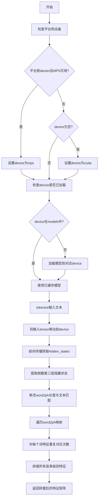

# `Bert-VITS2\oldVersion\V200\text\chinese_bert.py` 详细设计文档

该代码实现了一个基于中文RoBERTa-wwm-ext-large预训练模型的文本特征提取功能，能够将词级别的BERT隐藏状态转换为音素级别的特征表示，支持CPU、CUDA和MPS（Apple Silicon）设备加速。

## 整体流程



## 类结构

```
模块级
├── 全局变量
│   ├── LOCAL_PATH (模型路径)
│   ├── tokenizer (分词器实例)
│   └── models (模型缓存字典)
└── 全局函数
    └── get_bert_feature (主特征提取函数)
```

## 全局变量及字段


### `LOCAL_PATH`
    
指向本地BERT模型（chinese-roberta-wwm-ext-large）存放路径的字符串变量

类型：`str`
    


### `tokenizer`
    
用于对输入文本进行分词和编码的BERT分词器实例，加载自本地模型路径

类型：`transformers.AutoTokenizer`
    


### `models`
    
缓存不同设备上BERT模型的字典，以设备名（如'cpu'、'cuda'、'mps'）为键，模型实例为值，实现模型复用

类型：`dict`
    


    

## 全局函数及方法


### `get_bert_feature`

该函数使用预训练的中文RoBERTa-wwm-ext-large模型提取输入文本的词级别特征，并根据word2ph映射将词级别特征展开为音素（phone）级别的特征，最终返回音素级别的特征向量。

#### 参数

- `text`：`str`，需要提取特征的输入文本
- `word2ph`：`List[int]`，词到音素的映射列表，表示每个词对应多少个音素
- `device`：`str`，计算设备，默认为`config.bert_gen_config.device`（可选值：cpu/cuda/mps）

#### 返回值

- `torch.Tensor`，音素级别的特征向量，形状为`(特征维度, 音素总数)`

#### 流程图

```mermaid
flowchart TD
    A[开始 get_bert_feature] --> B{检查平台和设备}
    B --> C{platform == darwin<br/>且MPS可用<br/>且device == cpu?}
    C -->|是| D[设置device = mps]
    C -->|否| E{device为空?}
    D --> F
    E -->|是| G[设置device = cuda]
    E -->|否| F[继续]
    G --> F{device是否已加载模型?}
    F -->|否| H[加载模型到对应device]
    F -->|是| I[使用tokenizer编码文本]
    H --> I
    I --> J[将输入张量移动到device]
    J --> K[调用模型获取hidden_states]
    K --> L[取最后3层中的倒数第2层]
    L --> M[拼接并取第0个词向量<br/>移到CPU]
    M --> N{验证word2ph长度<br/>== text长度+2?}
    N -->|是| O[遍历word2ph]
    N -->|否| P[抛出断言错误]
    O --> Q[对每个词重复特征<br/>word2ph[i]次]
    Q --> R[将所有音素级别特征拼接]
    R --> S[转置返回]
    S --> T[结束]
```

#### 带注释源码

```python
def get_bert_feature(text, word2ph, device=config.bert_gen_config.device):
    """
    使用BERT模型提取文本特征，并将词级别特征展开为音素级别特征
    
    参数:
        text: 输入文本字符串
        word2ph: 词到音素的映射列表
        device: 计算设备，默认为配置中的设备
    
    返回:
        音素级别的特征张量，形状为 (特征维度, 音素总数)
    """
    
    # 如果在macOS平台上，且MPS可用，且指定了cpu设备，则使用MPS
    if (
        sys.platform == "darwin"
        and torch.backends.mps.is_available()
        and device == "cpu"
    ):
        device = "mps"
    
    # 如果未指定设备，默认使用cuda
    if not device:
        device = "cuda"
    
    # 根据设备加载或获取已缓存的模型
    # 每个设备维护一个独立的模型实例
    if device not in models.keys():
        models[device] = AutoModelForMaskedLM.from_pretrained(LOCAL_PATH).to(device)
    
    # 禁用梯度计算，使用推理模式
    with torch.no_grad():
        # 使用tokenizer对文本进行编码，返回PyTorch张量
        inputs = tokenizer(text, return_tensors="pt")
        
        # 将所有输入张量移动到指定设备
        for i in inputs:
            inputs[i] = inputs[i].to(device)
        
        # 调用模型，启用output_hidden_states获取所有隐藏层
        res = models[device](**inputs, output_hidden_states=True)
        
        # 取出最后3层中的倒数第2层（即倒数第3层）
        # 形状从 [batch, seq_len, hidden_dim] 变为 [seq_len, hidden_dim]
        # 然后取第0个（batch维度），并移到CPU
        res = torch.cat(res["hidden_states"][-3:-2], -1)[0].cpu()

    # 验证word2ph长度是否与文本长度匹配（+2是因为可能有起始和结束标记）
    assert len(word2ph) == len(text) + 2
    
    word2phone = word2ph
    phone_level_feature = []
    
    # 遍历每个词，将词级别特征重复相应的音素次数
    for i in range(len(word2phone)):
        # 对第i个词的特征重复word2phone[i]次
        repeat_feature = res[i].repeat(word2phone[i], 1)
        phone_level_feature.append(repeat_feature)

    # 沿音素维度（dim=0）拼接所有特征
    # 结果形状: (总音素数, hidden_dim)
    phone_level_feature = torch.cat(phone_level_feature, dim=0)

    # 转置返回，形状变为 (hidden_dim, 总音素数)
    return phone_level_feature.T
```

## 关键组件


### BERT 模型加载与惰性缓存

使用全局字典 `models` 缓存不同设备的BERT模型，实现按需加载（Lazy Loading），避免重复加载模型占用内存

### 多设备自动选择

自动检测并选择运行设备：优先使用 CUDA（GPU），若无可用则回退到 CPU，在 macOS (darwin) 系统上还会检测并使用 MPS (Apple Silicon GPU)

### 词级到音素级特征映射

通过 `word2ph` 映射数组，将 BERT 输出的词级特征按音素数量进行复制（repeat），生成对齐的音素级特征序列，实现变长特征扩展

### BERT 隐状态提取

从预训练的中文 RoBERTa-wwm-ext-large 模型中提取倒数第三层的隐状态作为输出特征，捕获深层语义信息

### 分词器管理

使用 HuggingFace Transformers 的 AutoTokenizer 加载预训练中文分词器，将输入文本转换为模型可处理的 token ID 序列

### 配置外部依赖

从 config 模块导入配置参数，模型文件存储在本地路径 "./bert/chinese-roberta-wwm-ext-large"


## 问题及建议


### 已知问题

-   **设备选择逻辑混乱**：设备选择顺序先判断MPS再判断cuda，且在`device`已赋值后仍进入`if not device`分支判断，逻辑冗余
-   **模型缓存无限制**：全局字典`models`会随设备变化持续累积模型实例，无缓存上限，存在内存泄漏风险
-   **类型注解缺失**：全代码无任何类型提示，影响可维护性和静态检查
-   **错误处理薄弱**：仅依赖`assert`进行参数校验，无异常捕获机制，模型加载失败时程序直接崩溃
-   **Tokenizer未优化配置**：未设置`padding`、`truncation`、`return_token_type_ids`等参数，可能导致隐藏边界问题
-   **变量命名歧义**：`word2ph`与`word2phone`混用，`res`变量命名过于简略
-   **硬编码路径与切片**：模型路径`LOCAL_PATH`和特征切片`[-3:-2]`写死在代码中，缺乏配置化和注释说明
-   **测试代码与业务逻辑耦合**：`if __name__ == "__main__"`块包含大量测试逻辑，应独立成测试文件

### 优化建议

-   **重构设备管理逻辑**：使用`torch.device`统一管理，添加设备类型枚举；引入模型缓存LRU策略或设置上限
-   **添加完整类型注解**：为函数参数、返回值、全局变量添加`typing`模块的类型标注
-   **增强错误处理**：使用`try-except`捕获`OSError`、`RuntimeError`，添加模型加载重试机制和回退策略
-   **配置化管理**：通过`config`模块或`dataclass`统一管理模型路径、特征层索引等超参数
-   **规范化Tokenizer调用**：根据下游任务需求显式设置`padding`、`truncation`、`max_length`等参数
-   **分离关注点**：将测试代码移至`tests/`目录，使用`pytest`框架组织单元测试
-   **添加日志记录**：引入`logging`模块记录模型加载、设备切换、推理耗时等关键操作

## 其它


### 设计目标与约束

本模块的设计目标是将预训练的中文RoBERTa-wwm-ext-large模型的词级别隐藏状态特征转换为音素级别的特征，支持CPU、CUDA和MPS设备。约束条件包括：输入文本长度需与word2ph数组长度匹配（text长度+2），模型文件需放置在指定路径./bert/chinese-roberta-wwm-ext-large，且设备必须为config.bert_gen_config.device指定的设备。

### 错误处理与异常设计

代码中包含两处断言检查：第一处assert len(word2ph) == len(text) + 2用于验证输入参数一致性，若不匹配则抛出AssertionError。设备选择逻辑中，当MPS可用且请求CPU时会自动切换到MPS设备。模型加载失败时会抛出OSError或异常。输入tokenization失败时transformers库会抛出ValueError。建议增加更详细的错误信息提示和异常处理机制。

### 数据流与状态机

数据流分为三个主要阶段：初始化阶段加载tokenizer和缓存模型；推理阶段将输入文本通过tokenizer转换为tensor，经模型前向传播提取指定层（倒数第三层）的隐藏状态；后处理阶段根据word2ph数组将词级别特征按重复次数扩展为音素级别特征。状态机包含：设备初始化→模型加载→推理执行→特征转换→结果返回。

### 外部依赖与接口契约

本模块依赖四个外部依赖：torch提供张量计算和设备管理；transformers库提供AutoModelForMaskedLM和AutoTokenizer；config模块提供设备配置；sys模块用于平台检测。接口契约方面：get_bert_feature函数接收text（字符串）、word2ph（整数列表）、device（字符串，可选）三个参数，返回torch.Tensor类型的音素级别特征张量，形状为(特征维度, 音素总数)。

### 性能考虑与优化空间

当前实现存在以下性能优化空间：1)模型缓存在全局字典models中但未实现缓存大小限制；2)每次调用都会进行设备检查和tensor迁移，可考虑缓存inputs；3)特征重复操作使用repeat可优化为index_select；4)未实现批处理支持，建议增加batch_texts和batch_word2ph参数；5)CPU推理可启用torch.jit优化；6)建议添加模型预热(warmup)机制。

### 资源管理与生命周期

模型资源管理采用懒加载模式，首次使用时加载到指定设备。全局变量models字典可能随设备数量增长而占用过多显存，建议实现LRU缓存或最大缓存数量限制。设备销毁时需手动清理，建议添加cleanup函数释放模型资源。

### 配置管理

LOCAL_PATH指定模型路径，当前为相对路径"./bert/chinese-roberta-wwm-ext-large"，建议改为可配置或支持环境变量覆盖。device参数从config.bert_gen_config.device读取，默认值由config模块定义。无模型路径有效性检查，建议添加路径存在性验证。

### 安全性考虑

代码未对输入进行恶意检测，长文本可能导致显存溢出。建议添加：1)输入长度限制；2)word2ph数组元素的有效性检查（正整数）；3)模型路径的路径遍历攻击防护；4)设备参数的白名单验证。

### 测试策略建议

建议补充以下测试用例：1)空字符串和单字符输入；2)word2ph长度不匹配场景；3)不同设备(CPU/CUDA/MPS)切换；4)模型缓存复用；5)边界条件（word2ph全为1或全为最大值的场景）；6)内存泄漏检测；7)多线程并发调用安全性。

### 部署注意事项

部署时需确保：1)模型文件完整下载并放置在指定目录；2)transformers版本兼容；3)CUDA版本匹配；4)MPS设备仅支持macOS且需检查可用性；5)建议添加环境变量BERT_MODEL_PATH支持外部配置；6)生产环境建议添加模型签名验证。

    