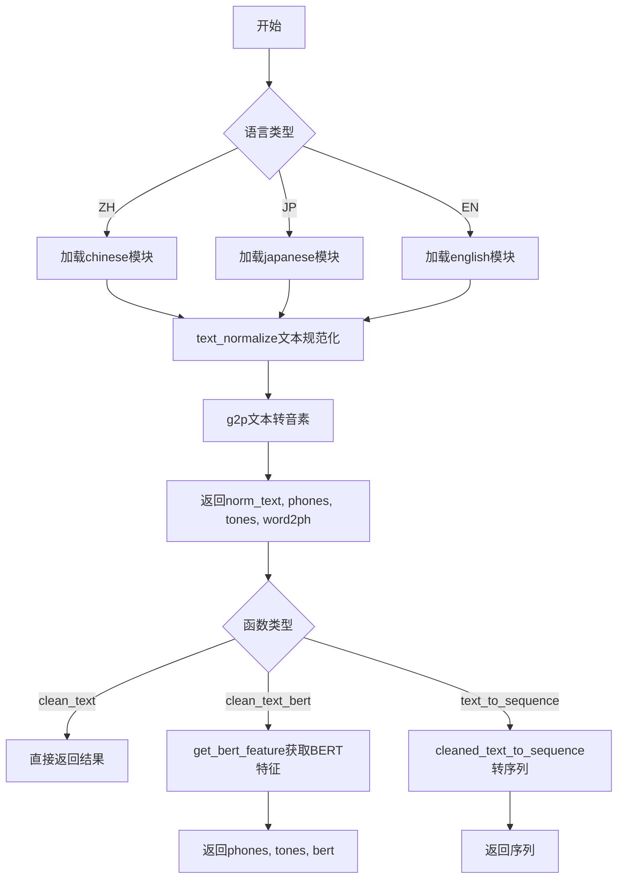
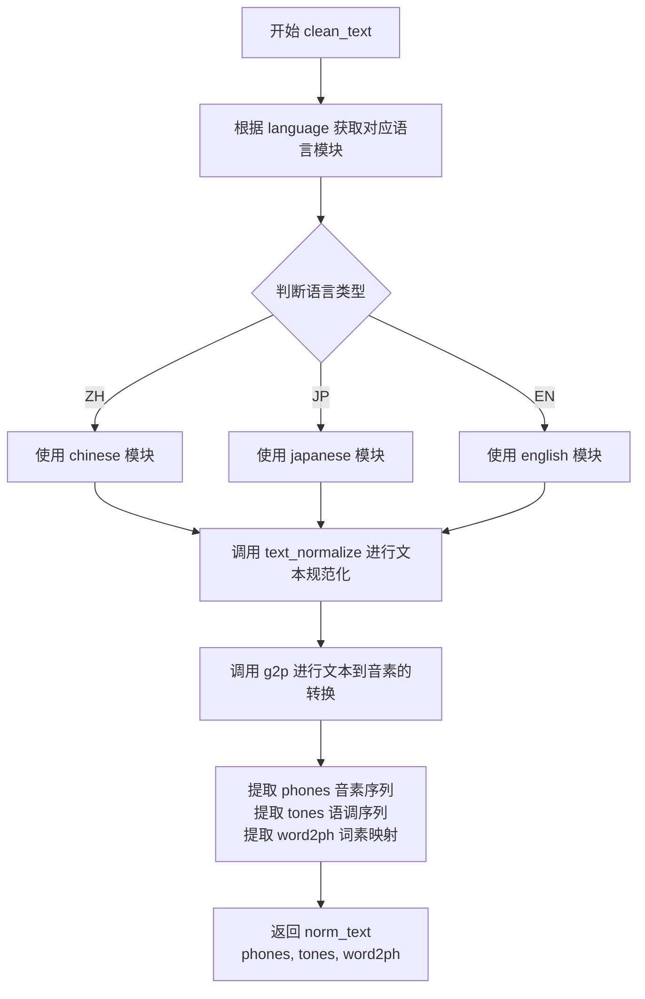
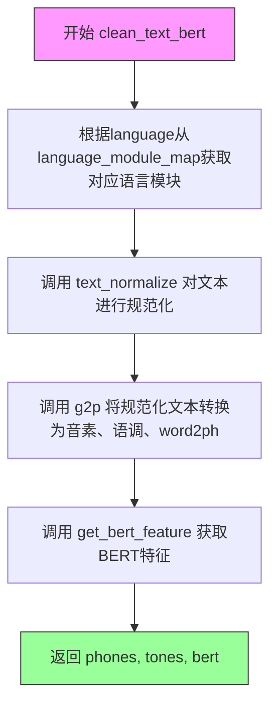
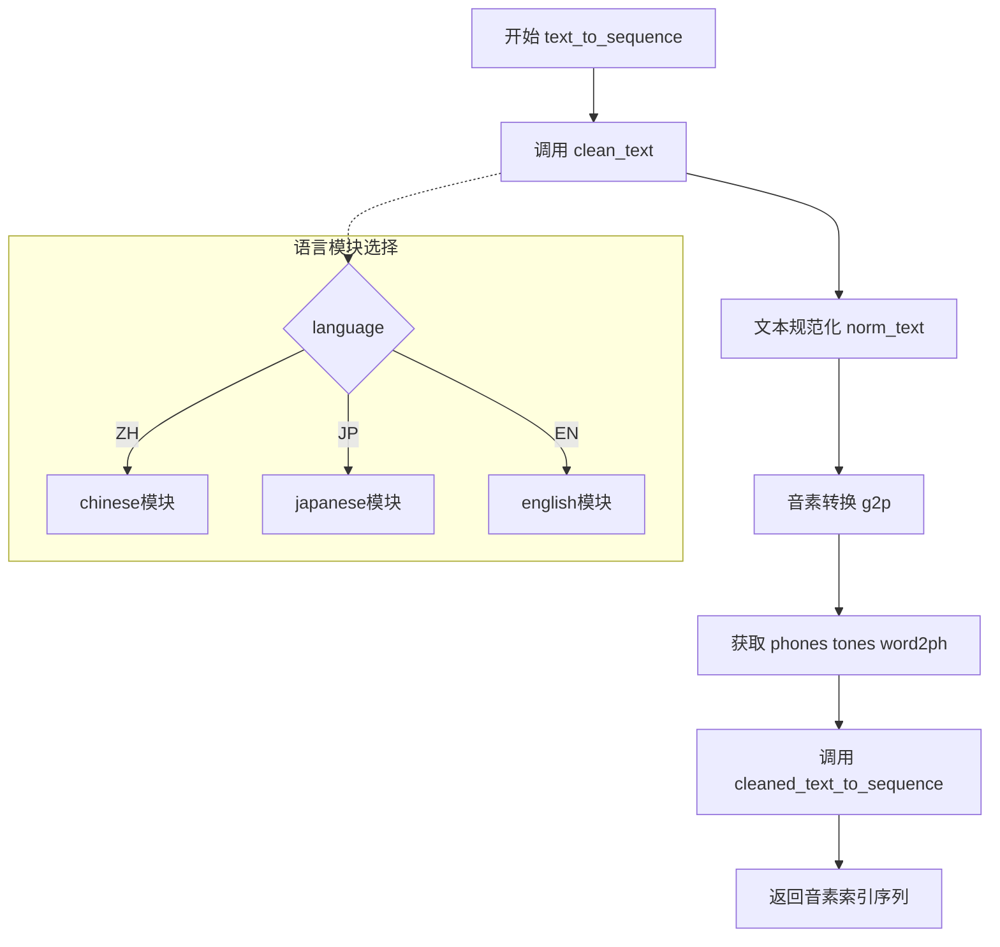

# `Bert-VITS2\oldVersion\V200\text\cleaner.py` 详细设计文档

一个多语言文本清洗与转换模块，通过动态加载语言处理模块（中文、日文、英文），实现文本规范化、文本转音素（g2p）、BERT特征提取等功能，最终输出规范化文本、音素序列、语调和词素-音素映射。

## 整体流程



## 类结构

```
text_cleaning.py (模块)
├── language_module_map (全局变量-字典)
├── clean_text (全局函数)
├── clean_text_bert (全局函数)
└── text_to_sequence (全局函数)
```

## 全局变量及字段


### `language_module_map`
    
语言代码到模块的映射字典，用于根据语言代码（如ZH、JP、EN）动态加载对应的语言处理模块

类型：`dict`
    


    

## 全局函数及方法


### `clean_text`

该函数是文本清洗的核心入口，根据输入的语言代码选择对应的语言处理模块，对原始文本进行规范化处理，然后通过语言模块的 G2P（Grapheme-to-Phoneme）功能将规范化文本转换为音素序列、语调序列和词素到音素的映射关系。

参数：

- `text`：`str`，待清洗的原始输入文本
- `language`：`str`，语言代码，支持 "ZH"（中文）、"JP"（日文）、"EN"（英文）

返回值：`tuple[str, list[int], list[int], list[int]]`，返回一个包含四个元素的元组：
- 规范化后的文本（`str`）
- 音素序列（`list[int]`）
- 语调序列（`list[int]`）
- 词素到音素的映射（`list[int]`）

#### 流程图



#### 带注释源码

```python
def clean_text(text, language):
    """
    文本清洗主函数，根据语言选择对应的语言处理模块
    
    Args:
        text: str，输入的原始文本
        language: str，语言代码，支持 "ZH", "JP", "EN"
    
    Returns:
        tuple: (norm_text, phones, tones, word2ph)
            - norm_text: 规范化后的文本
            - phones: 音素序列列表
            - tones: 语调序列列表
            - word2ph: 词素到音素的映射关系
    """
    # 根据语言代码从映射表中获取对应的语言处理模块
    # ZH -> chinese, JP -> japanese, EN -> english
    language_module = language_module_map[language]
    
    # 第一步：文本规范化
    # 调用语言模块的 text_normalize 方法对原始文本进行预处理
    # 包括但不限于：数字转汉字、全角转半角、标点处理等
    norm_text = language_module.text_normalize(text)
    
    # 第二步：G2P 转换（Grapheme to Phoneme）
    # 将规范化后的文本转换为音素序列
    # 返回三个关键信息：
    # - phones: 音素序列（声学模型的关键输入）
    # - tones: 语调序列（影响语音的音高变化）
    # - word2ph: 词素到音素的映射（用于对齐文本和音素）
    phones, tones, word2ph = language_module.g2p(norm_text)
    
    # 返回处理结果的四元组
    return norm_text, phones, tones, word2ph
```


### `clean_text_bert`

该函数是文本清洗与BERT特征提取的组合函数，接收原始文本和语言代码，通过语言特定的模块进行文本规范化、拼音音素转换、语调提取，最后获取文本的BERT嵌入特征，返回音素序列、语调序列和BERT特征向量，供后续语音合成模型使用。

参数：

- `text`：`str`，待处理的原始输入文本
- `language`：`str`，语言代码，支持"ZH"（中文）、"JP"（日文）、"EN"（英文）

返回值：`(phones, tones, bert)`，其中phones为音素序列列表，tones为语调序列列表，bert为BERT特征向量（numpy数组或张量）

#### 流程图



#### 带注释源码

```python
def clean_text_bert(text, language):
    """
    文本清洗 + BERT特征提取函数
    
    参数:
        text: str, 输入的原始文本
        language: str, 语言代码 ("ZH", "JP", "EN")
    
    返回:
        phones: list, 音素序列
        tones: list, 语调序列
        bert: np.ndarray, BERT特征向量
    """
    # 根据语言代码从映射表中获取对应的语言处理模块
    # ZH -> chinese, JP -> japanese, EN -> english
    language_module = language_module_map[language]
    
    # 步骤1: 文本规范化
    # 调用语言模块的text_normalize方法对原始文本进行预处理
    # 包括繁简转换、标点符号处理、数字转换等
    norm_text = language_module.text_normalize(text)
    
    # 步骤2: 文本转音素
    # 调用语言模块的g2p (grapheme-to-phoneme) 方法
    # 将规范化后的文本转换为音素序列、语调和词素到音素的映射
    phones, tones, word2ph = language_module.g2p(norm_text)
    
    # 步骤3: BERT特征提取
    # 调用语言模块的get_bert_feature方法
    # 输入规范化文本和word2ph映射，获取对应的BERT嵌入特征
    # word2ph用于对齐文本token与BERT输出的token
    bert = language_module.get_bert_feature(norm_text, word2ph)
    
    # 返回音素序列、语调序列和BERT特征
    return phones, tones, bert
```


### `text_to_sequence`

文本转序列函数，将输入文本转换为音素序列。该函数是VITS语音合成系统的核心入口点之一，负责将原始文本经过语言特定的处理流程（文本规范化、文本转音素）后，最终转换为模型可用的音素索引序列。

参数：

- `text`：`str`，待转换的原始文本输入
- `language`：`str`，语言代码，指定文本所属语言（"ZH"、"JP"、"EN"）

返回值：`list[int]` 或 `numpy.ndarray`，音素索引序列，供后续语音合成模型使用

#### 流程图



#### 带注释源码

```python
def text_to_sequence(text, language):
    """
    将输入文本转换为音素索引序列
    
    这是VITS语音合成pipeline中的关键函数，负责:
    1. 调用语言特定的文本规范化处理
    2. 调用语言特定的G2P (Grapheme-to-Phoneme) 转换
    3. 将处理结果转换为模型可用的索引序列
    
    Args:
        text: 输入的原始文本字符串
        language: 语言代码，支持 "ZH"(中文)、"JP"(日文)、"EN"(英文)
    
    Returns:
        音素索引序列，可直接用于VITS模型推理
    """
    # 第一步：调用clean_text进行文本规范化和G2P转换
    # clean_text内部会根据language选择对应的语言模块
    # 返回规范化后的文本(norm_text)、音素(phones)、声调(tones)、词音素映射(word2ph)
    norm_text, phones, tones, word2ph = clean_text(text, language)
    
    # 第二步：调用cleaned_text_to_sequence将音素转换为索引序列
    # cleaned_text_to_sequence负责:
    # - 根据language选择对应的音素到索引的映射表
    # - 将phones和tones转换为对应的整数索引
    # - 处理一些特殊标记(如句子边界、静音等)
    return cleaned_text_to_sequence(phones, tones, language)
```

## 关键组件


### 语言模块映射 (language_module_map)

一个字典变量，用于将语言代码映射到对应的语言处理模块。键为语言代码（"ZH"、"JP"、"EN"），值为对应的模块对象（chinese、japanese、english）。实现了解耦设计，便于扩展支持更多语言。

### 文本清理函数 (clean_text)

该函数接收文本和语言代码，调用对应语言模块的文本规范化（text_normalize）和音素转换（g2p）方法，返回规范化后的文本、音素序列、声调序列以及词到音素的映射关系。参数包括text（字符串，输入文本）和language（字符串，语言代码如"ZH"），返回值包含norm_text（字符串）、phones（列表）、tones（列表）、word2ph（列表）。

### BERT特征获取函数 (clean_text_bert)

该函数与clean_text类似，但额外调用语言模块的get_bert_feature方法获取BERT嵌入特征。参数包括text（字符串）和language（字符串），返回值包含phones（列表）、tones（列表）、bert（张量）。支持基于预训练语言模型的文本语义特征提取。

### 文本转序列函数 (text_to_sequence)

该函数是文本到音素序列的入口函数，先调用clean_text获取处理结果，然后调用cleaned_text_to_sequence将音素和声调转换为模型输入序列。参数包括text（字符串）和language（字符串），返回值是转换后的序列（列表或数组）。

### 语言模块接口规范

各语言模块需实现text_normalize、g2p和get_bert_feature三个方法。text_normalize负责文本规范化（如数字转中文、标点处理），g2p负责将规范化文本转换为音素序列，get_bert_feature负责生成BERT特征。这些模块体现了多态设计，不同语言可以有不同的实现逻辑。


## 问题及建议


### 已知问题

-   **硬编码的语言模块映射**：`language_module_map` 采用硬编码方式定义，新增语言需要修改源码，不符合开闭原则
-   **缺乏输入验证**：访问 `language_module_map[language]` 时未对 `language` 参数进行有效性检查，语言不支持时会直接抛出 `KeyError`，错误信息不友好
-   **代码重复**：`clean_text` 和 `clean_text_bert` 函数中存在重复的文本归一化和 G2P 转换逻辑
-   **缺少错误处理**：未对 `language_module` 的 `text_normalize`、`g2p`、`get_bert_feature` 方法的调用结果进行异常捕获
-   **模块导入依赖**：使用相对导入 `. import`，对目录结构有较强耦合，迁移或重构时容易出现问题
-   **缺乏类型注解**：所有函数均无类型提示，影响代码可读性和 IDE 智能提示支持
-   **函数文档缺失**：未提供任何 docstring，调用方难以理解函数用途、参数含义及返回值
-   **返回值语义不一致**：`clean_text` 返回 4 个值，`clean_text_bert` 返回 3 个值，且未使用 dataclass 或命名元组封装

### 优化建议

-   **引入配置驱动或插件机制**：将 `language_module_map` 改为动态注册或配置文件加载，支持运行时扩展语言
-   **添加参数校验与异常封装**：在入口函数处校验 `language` 参数合法性，捕获并抛出自定义异常，提供清晰的错误信息
-   **提取公共逻辑**：将 `clean_text` 和 `clean_text_bert` 中的公共逻辑抽取为内部函数 `_process_text`，避免重复代码
-   **增加类型注解**：为函数参数和返回值添加 `typing` 类型注解，提升代码可维护性
-   **完善文档字符串**：为每个模块级函数和类添加 Google 风格或 NumPy 风格的 docstring
-   **统一返回值结构**：使用 `dataclass` 或 `NamedTuple` 封装返回值，明确各字段含义
-   **添加日志记录**：在关键路径增加日志，便于问题排查和运行时监控
-   **考虑缓存机制**：对于相同输入，可引入缓存避免重复的文本归一化和 G2P 计算

## 其它


### 设计目标与约束

本模块旨在为多语言文本转语音（TTS）系统提供统一的文本预处理管道，核心目标是将原始文本转换为语音合成所需的音素序列和特征表示。设计约束包括：仅支持中文、日文、英文三种语言；所有语言模块必须实现text_normalize、g2p、get_bert_feature三个标准接口；输入文本必须是UTF-8编码的字符串；输出音素序列必须符合指定格式规范。

### 错误处理与异常设计

模块主要处理以下异常情况：1）不支持的语言代码抛出KeyError，调用方需捕获并提供友好的错误提示；2）语言模块内部处理失败时，异常应向上传播并附带原始错误信息；3）空文本输入应返回空列表或触发ValueError，建议调用方进行前置校验；4）word2ph为None时应进行空值处理，避免下游计算出错。建议在调用clean_text系列函数前进行参数校验，并在最外层捕获Exception以提供统一的错误响应。

### 数据流与状态机

文本处理流程为：原始文本 → 语言检测与映射 → 文本规范化 → 图形转音素（g2p） → BERT特征提取 → 音素序列转换。状态机包含三个主要状态：规范化状态（text_normalize）、音素转换状态（g2p）、特征提取状态（get_bert_feature/cleaned_text_to_sequence）。clean_text函数执行完整流程的前两个状态，clean_text_bert执行前三个状态并输出BERT特征，text_to_sequence执行完整流程。状态转换是单向的，不存在回退或循环。

### 外部依赖与接口契约

模块依赖三个语言子模块（chinese、japanese、english）和cleaned_text_to_sequence工具函数。每个语言模块必须提供：text_normalize(text: str) -> str，g2p(text: str) -> (phones, tones, word2ph)，get_bert_feature(text: str, word2ph) -> bert_features。调用方需保证：language参数为"ZH"/"JP"/"EN"之一，text参数非空且为有效字符串。返回值的phones和tones应为列表类型，word2ph应为列表或None，bert_features应为特定格式的张量或numpy数组。

### 性能考虑与优化空间

当前实现每次调用都会查找language_module_map，建议在模块初始化时缓存语言模块引用以减少字典查找开销。对于大量文本处理场景，可考虑添加批处理接口支持并行处理。BERT特征提取是计算密集型操作，在实时性要求高的场景下可考虑异步调用或结果缓存机制。文本规范化操作可考虑结果缓存以避免重复处理相同文本。

### 安全性考虑

模块本身不直接处理用户输入验证，但调用方应注意：text参数需进行长度限制防止内存溢出；language参数需严格校验防止注入攻击；处理敏感文本时需确保语言模块不包含敏感信息外发逻辑。BERT特征提取可能涉及外部模型调用，需确保模型来源可信。

### 测试策略建议

应覆盖以下测试场景：三种语言的标准文本处理流程、不支持语言的错误处理、空文本输入的边界情况、特殊字符和emoji的处理、word2ph为None时的兼容性、多次调用时的幂等性验证。建议使用pytest框架编写单元测试，并准备包含各种语言文本的测试数据集。

    