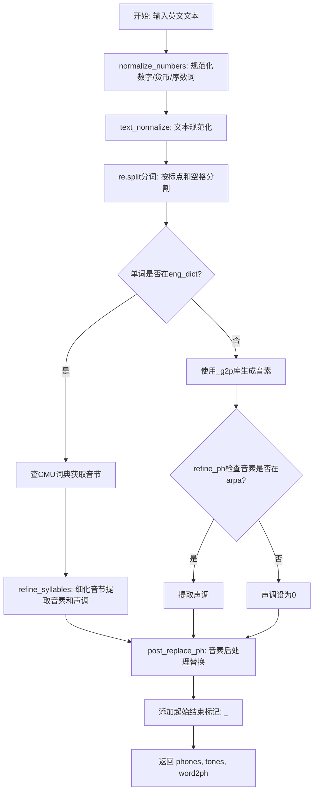
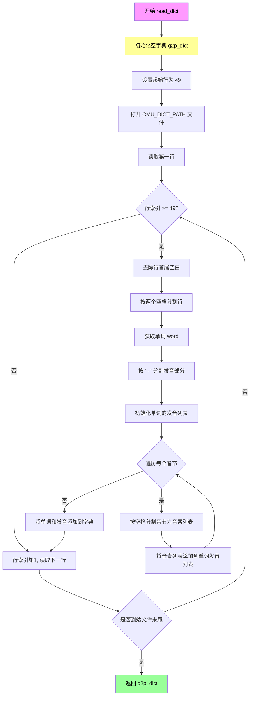
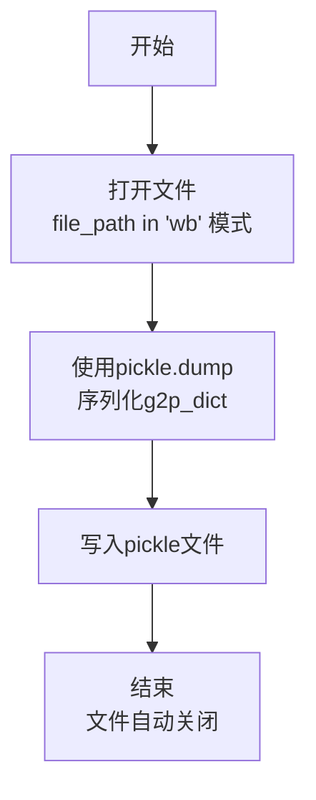
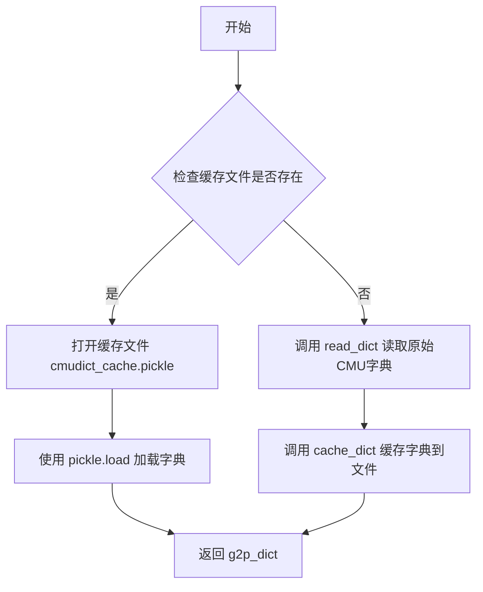
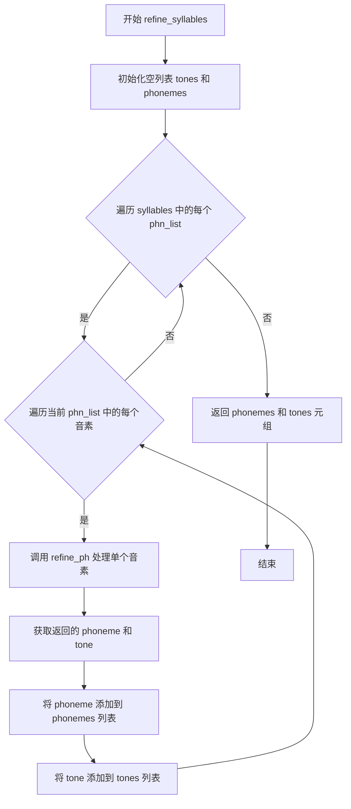
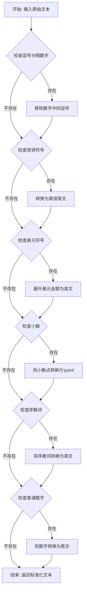
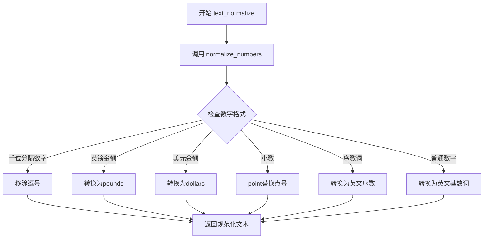
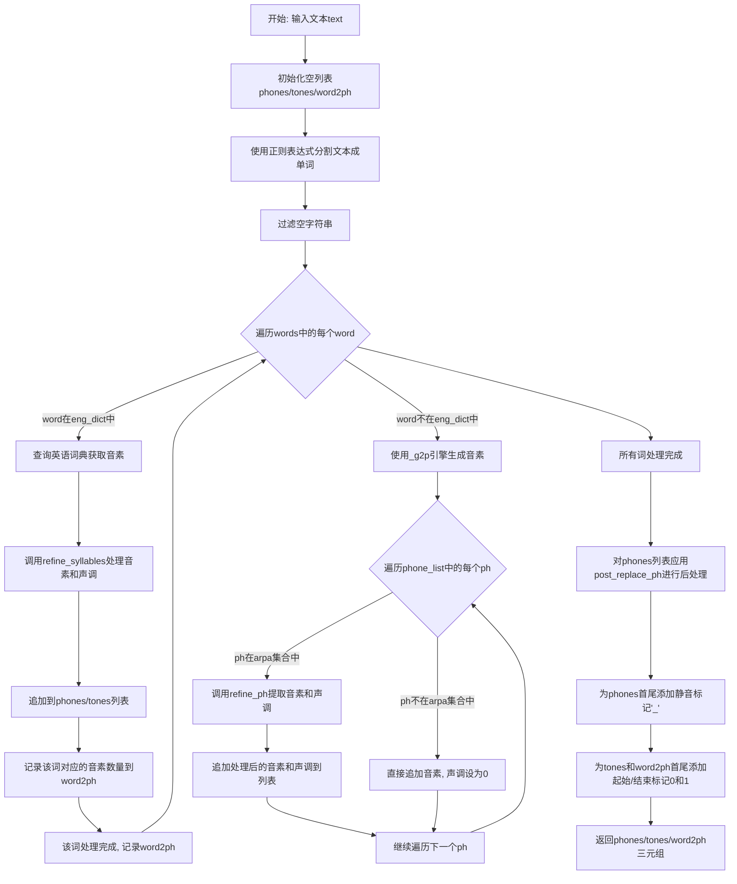
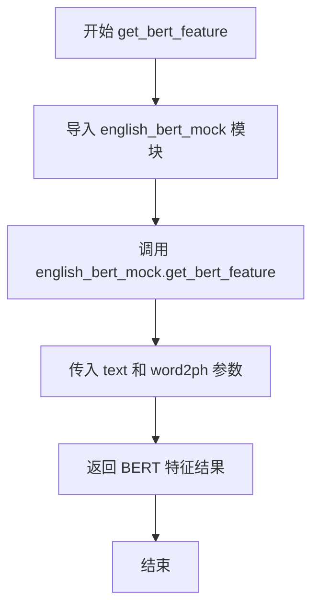

# `Bert-VITS2\oldVersion\V200\text\english.py` 详细设计文档

这是一个英文文本到音素(phoneme)的转换系统,支持数字/货币/缩写规范化、CMU词典查询、g2p库 fallback、音素细化及声调提取,并返回音素序列、声调序列和词到音素的映射关系,可用于TTS前端处理。

## 整体流程



## 类结构

```
english.py (模块文件,无类定义)
├── 全局变量
│   ├── arpa: ARPA音素集合
│   ├── eng_dict: CMU词典缓存
│   ├── _inflect: inflect引擎
│   ├── _g2p: G2p实例
│   └── 多个正则表达式(_comma_number_re等)
└── 函数
    ├── post_replace_ph
    ├── read_dict
    ├── cache_dict
    ├── get_dict
    ├── refine_ph
    ├── refine_syllables
    ├── _expand_dollars
    ├── _remove_commas
    ├── _expand_ordinal
    ├── _expand_number
    ├── _expand_decimal_point
    ├── normalize_numbers
    ├── text_normalize
    ├── g2p
    └── get_bert_feature
```

## 全局变量及字段


### `current_file_path`
    
当前Python文件的目录路径

类型：`str`
    


### `CMU_DICT_PATH`
    
CMU发音词典文件的完整路径

类型：`str`
    


### `CACHE_PATH`
    
CMU词典缓存pickle文件的完整路径

类型：`str`
    


### `_g2p`
    
g2p_en库的G2p实例，用于将英文单词转换为音素

类型：`G2p`
    


### `arpa`
    
包含所有ARPA音素的集合，用于验证音素有效性

类型：`set`
    


### `eng_dict`
    
从CMU词典加载的英文单词到音素列表的映射字典

类型：`dict`
    


### `_inflect`
    
inflect库的引擎实例，用于数字和序数词的文字转换

类型：`inflect.engine`
    


### `_comma_number_re`
    
匹配逗号分隔数字的正则表达式

类型：`re.Pattern`
    


### `_decimal_number_re`
    
匹配小数数字的正则表达式

类型：`re.Pattern`
    


### `_pounds_re`
    
匹配英镑金额的正则表达式

类型：`re.Pattern`
    


### `_dollars_re`
    
匹配美元金额的正则表达式

类型：`re.Pattern`
    


### `_ordinal_re`
    
匹配英文序数词的正则表达式

类型：`re.Pattern`
    


### `_number_re`
    
匹配普通数字的正则表达式

类型：`re.Pattern`
    


### `_abbreviations`
    
包含缩写词及其对应全称的元组列表，用于文本规范化

类型：`list`
    


### `_lazy_ipa`
    
包含IPA音标到懒惰IPA音标映射的正则表达式列表

类型：`list`
    


### `_lazy_ipa2`
    
包含IPA音标到懒惰IPA2音标映射的正则表达式列表

类型：`list`
    


### `_ipa_to_ipa2`
    
包含IPA音标到IPA2音标映射的正则表达式列表

类型：`list`
    


    

## 全局函数及方法


### `post_replace_ph`

该函数用于对音素（phoneme）进行后处理替换，将中文标点符号映射为英文符号，并验证音素是否在symbols集合中，若不在则返回UNK未知标记。

参数：

- `ph`：`str`，输入的音素字符串，可能是中文标点符号或英文字母

返回值：`str`，返回处理后的音素字符串

#### 流程图

```mermaid
flowchart TD
    A[开始 post_replace_ph] --> B{ph 是否在 rep_map 中}
    B -->|是| C[ph = rep_map[ph]]
    B -->|否| D{ph 是否在 symbols 中}
    C --> D
    D -->|是| E[返回 ph]
    D -->|否| F[ph = 'UNK']
    F --> E
```

#### 带注释源码

```python
def post_replace_ph(ph):
    """
    对音素进行后处理替换和验证
    
    该函数执行以下操作：
    1. 将中文标点符号映射为英文符号
    2. 验证音素是否在symbols集合中
    3. 不在symbols中的音素返回UNK
    
    参数:
        ph (str): 输入的音素字符串
        
    返回:
        str: 处理后的音素字符串
    """
    # 定义中文标点到英文符号的映射表
    rep_map = {
        "：": ",",   # 中文冒号 -> 英文逗号
        "；": ",",   # 中文分号 -> 英文逗号
        "，": ",",   # 中文逗号 -> 英文逗号
        "。": ".",   # 中文句号 -> 英文句号
        "！": "!",   # 中文感叹号 -> 英文感叹号
        "？": "?",   # 中文问号 -> 英文问号
        "\n": ".",   # 换行符 -> 英文句号
        "·": ",",    # 中文分隔号 -> 英文逗号
        "、": ",",   # 中文顿号 -> 英文逗号
        "...": "…",  # 三个点 -> 省略号
        "v": "V",    # 小写v -> 大写V
    }
    
    # 第一步：如果音素在映射表中，进行替换
    if ph in rep_map.keys():
        ph = rep_map[ph]
    
    # 第二步：检查音素是否在symbols集合中
    if ph in symbols:
        return ph
    
    # 第三步：不在symbols中，返回UNK表示未知音素
    if ph not in symbols:
        ph = "UNK"
    
    return ph
```


### `read_dict`

该函数用于读取CMU发音词典文件（cmudict.rep），从第49行开始解析文本格式的词典，将每个单词及其音素发音（音节和音素）提取出来，构建并返回一个Python字典对象。

参数： 无

返回值：`dict`，返回一个人工智能发音词典，键为单词（字符串），值为该单词的发音列表（嵌套列表结构，每个元素是一个音节列表，每个音节包含多个音素）

#### 流程图



#### 带注释源码

```python
def read_dict():
    """
    读取CMU发音词典文件并解析为字典格式
    
    该函数从CMU词典文件中提取单词及其发音信息
    CMU词典文件格式：每行包含单词和其发音，发音部分用" - "分隔音节，用空格分隔音素
    """
    # 初始化结果字典，键为单词，值为发音列表（嵌套列表）
    g2p_dict = {}
    
    # CMU词典文件前48行为头部信息，从第49行开始为实际数据
    start_line = 49
    
    # 打开CMU词典文件（路径在模块级别定义）
    with open(CMU_DICT_PATH) as f:
        # 读取第一行
        line = f.readline()
        # 初始化行索引（从1开始计数）
        line_index = 1
        
        # 遍历文件所有行
        while line:
            # 只处理第49行及以后的数据行（跳过头部）
            if line_index >= start_line:
                # 去除行首尾空白字符
                line = line.strip()
                
                # 按两个空格分割单词和发音部分
                # CMU词典格式：WORD  AH0 S
                word_split = line.split("  ")
                # 提取单词
                word = word_split[0]
                
                # 按" - "分割多个音节
                # 例如: "AH0 S - AH1" 表示两个音节
                syllable_split = word_split[1].split(" - ")
                
                # 初始化该单词的发音列表
                g2p_dict[word] = []
                
                # 遍历每个音节
                for syllable in syllable_split:
                    # 按空格分割音节为单个音素列表
                    # 例如: "AH0 S" 分割为 ["AH0", "S"]
                    phone_split = syllable.split(" ")
                    # 将音素列表添加到单词的发音列表中
                    g2p_dict[word].append(phone_split)
            
            # 行索引递增
            line_index = line_index + 1
            
            # 读取下一行
            line = f.readline()
    
    # 返回构建好的发音词典
    return g2p_dict
```


### `cache_dict`

该函数用于将字母到音素的映射字典（g2p_dict）序列化为pickle文件并存储到指定路径，实现词典数据的缓存功能。

参数：

- `g2p_dict`：`dict`，需要缓存的音素字典，键为单词，值为音素列表
- `file_path`：`str`，缓存文件的保存路径

返回值：`None`，无返回值，直接将数据写入指定文件

#### 流程图



#### 带注释源码

```python
def cache_dict(g2p_dict, file_path):
    """
    将音素字典序列化为pickle缓存文件
    
    参数:
        g2p_dict: 音素字典，包含单词到音素的映射关系
        file_path: 缓存文件的保存路径
    """
    # 以二进制写入模式打开文件，with语句确保文件正确关闭
    with open(file_path, "wb") as pickle_file:
        # 使用pickle将字典对象序列化并写入文件
        pickle.dump(g2p_dict, pickle_file)
```


### `get_dict`

获取CMU发音字典的函数，首先检查缓存文件是否存在，如果存在则直接从缓存加载，否则读取原始CMU字典文件并缓存，以便后续快速访问。

参数：

- 该函数无参数

返回值：

- `dict`，返回CMU发音字典，键为单词，值为发音音素列表

#### 流程图



#### 带注释源码

```python
def get_dict():
    """
    获取CMU发音字典
    
    尝试从缓存文件中加载发音字典，如果缓存文件不存在，
    则读取原始CMU字典文件并创建缓存，以提高后续访问速度。
    
    Returns:
        dict: CMU发音字典，键为单词（字符串），值为发音音素列表（嵌套列表）
    """
    # 检查缓存文件是否存在
    if os.path.exists(CACHE_PATH):
        # 缓存文件存在，从缓存加载
        with open(CACHE_PATH, "rb") as pickle_file:
            # 使用 pickle 反序列化加载字典
            g2p_dict = pickle.load(pickle_file)
    else:
        # 缓存文件不存在，读取原始CMU字典文件
        g2p_dict = read_dict()
        # 将读取的字典缓存到文件，供下次使用
        cache_dict(g2p_dict, CACHE_PATH)

    # 返回发音字典
    return g2p_dict
```


### `refine_ph`

该函数用于处理单个音素（phoneme），提取其中的音调（tone）信息，并将音素转换为小写形式。

参数：

-  `phn`：`str`，输入的音素字符串，可能包含末尾的数字作为音调标记

返回值：`Tuple[str, int]`，返回一个元组，包含处理后的音素（小写形式）和提取的音调值（0表示无声调）

#### 流程图

```mermaid
flowchart TD
    A[开始: 输入 phn] --> B{phn 是否以数字结尾?}
    B -->|是| C[提取最后一位数字作为音调]
    B -->|否| D[设置 tone = 0]
    C --> E[移除 phn 末尾的数字]
    D --> F[将 phn 转换为小写]
    E --> F
    F --> G[返回 (phn.lower, tone)]
```

#### 带注释源码

```python
def refine_ph(phn):
    """
    处理单个音素，提取音调信息并转换为小写
    
    参数:
        phn: str, 输入的音素，可能包含末尾的数字表示音调
             例如: 'AH0', 'EH1', 'IY2' 等
    
    返回:
        tuple: (处理后的音素字符串, 音调值)
               音素转换为小写，音调值为0-3（0表示无声调）
    """
    # 初始化音调为0（无声调）
    tone = 0
    
    # 使用正则表达式检查音素是否以数字结尾
    # CMU发音字典中的音素使用数字表示音调：0=非重音, 1=主要重音, 2=次要重音
    if re.search(r"\d$", phn):
        # 提取末尾数字并转换为音调值（0->1, 1->2, 2->3）
        tone = int(phn[-1]) + 1
        # 移除末尾的数字部分
        phn = phn[:-1]
    
    # 将音素转换为小写形式返回
    return phn.lower(), tone
```


### `refine_syllables`

该函数用于将包含多个音节的音素列表进行细化处理，提取每个音素及其对应的声调。它遍历输入的音素列表，对每个音素调用 `refine_ph` 函数进行处理，最终返回两个列表：处理后的音素列表和对应的声调列表。

参数：

- `syllables`：`List[List[str]]`，二维列表，表示多个音节的音素列表。每个子列表包含一个音节的所有音素（如 `[["AH0", "S"], ["AE2", "B"]]`）

返回值：

- `phonemes`：`List[str]`，处理后的音素列表（小写形式）
- `tones`：`List[int]`，对应每个音素的声调列表（0 表示无声调，1-3 表示有声调）

#### 流程图



#### 带注释源码

```python
def refine_syllables(syllables):
    """
    细化音节列表，提取音素和声调
    
    参数:
        syllables: 包含多个音节的二维列表，每个元素是一个音节的音素列表
                   例如: [["AH0", "S"], ["AE2", "B"]]
    
    返回:
        tuple: (phonemes, tones) - 处理后的音素列表和对应的声调列表
    """
    # 初始化声调列表，用于存储所有音素的声调信息
    tones = []
    # 初始化音素列表，用于存储处理后的音素（小写形式）
    phonemes = []
    
    # 遍历外层列表，每个元素代表一个音节的所有音素
    for phn_list in syllables:
        # 遍历当前音节中的每个音素
        for i in range(len(phn_list)):
            # 获取当前音素
            phn = phn_list[i]
            
            # 调用 refine_ph 函数处理单个音素
            # 该函数会提取音素中的声调（如果有）并返回小写形式的音素
            phn, tone = refine_ph(phn)
            
            # 将处理后的音素添加到音素列表中
            phonemes.append(phn)
            
            # 将对应的声调添加到声调列表中
            tones.append(tone)
    
    # 返回处理后的音素列表和声调列表
    return phonemes, tones
```

#### 相关函数 `refine_ph`

```python
def refine_ph(phn):
    """
    处理单个音素，提取声调并转换为小写
    
    参数:
        phn: str，原始音素（如 "AH0", "S", "AE2"）
    
    返回:
        tuple: (处理后的音素小写形式, 声调值)
              - 声调值：0 表示无声调，1-3 表示有声调
    """
    # 初始化默认声调为 0（无声调）
    tone = 0
    
    # 检查音素是否以数字结尾（CMU 字典中数字表示声调）
    # 例如: AH0, AH1, AH2 分别表示不同声调
    if re.search(r"\d$", phn):
        # 提取数字并转换为声调（数字 0,1,2 转为 1,2,3）
        tone = int(phn[-1]) + 1
        # 移除音素末尾的数字
        phn = phn[:-1]
    
    # 返回小写形式的音素和声调值
    return phn.lower(), tone
```

#### 使用示例

```python
# 输入示例
syllables = [["AH0", "S"], ["AE2", "B"]]
# 调用函数
phonemes, tones = refine_syllables(syllables)
# 输出结果
# phonemes = ['ah', 's', 'ae', 'b']
# tones = [1, 0, 3, 0]
```


### `_expand_dollars`

该函数是文本规范化模块中的货币金额转换函数，用于将正则匹配到的美元金额（如 "$10.50"）转换为自然语言文字描述（如 "10 dollars, 50 cents"）。它处理美元和美分的单复数形式，以及零金额的特殊情况。

参数：

-  `m`：`re.Match`，正则表达式匹配对象，包含从文本中匹配到的美元金额字符串（如 "10.50"）

返回值：`str`，金额的数字文字描述（如 "10 dollars, 50 cents"）

#### 流程图

```mermaid
flowchart TD
    A[开始: 接收匹配对象 m] --> B[提取匹配内容: match = m.group(1)]
    B --> C[按句点分割: parts = match.split('.')]
    C --> D{parts 长度 > 2?}
    D -->|是| E[返回原始匹配 + 'dollars']
    D -->|否| F[解析美元部分: dollars = int(parts[0]) if parts[0] else 0]
    F --> G[解析美分部分: cents = int(parts[1]) if len > 1 and parts[1] else 0]
    G --> H{dollars > 0 且 cents > 0?}
    H -->|是| I[确定美元单位: dollar/dollars]
    I --> J[确定美分单位: cent/cents]
    J --> K[返回 'd dollars, c cents']
    H -->|否| L{dollars > 0?}
    L -->|是| M[确定美元单位]
    M --> N[返回 'd dollars']
    L -->|否| O{cents > 0?}
    O -->|是| P[确定美分单位]
    P --> Q[返回 'c cents']
    O -->|否| R[返回 'zero dollars']
```

#### 带注释源码

```python
def _expand_dollars(m):
    """
    将匹配到的美元金额字符串转换为自然语言描述。
    
    参数:
        m: re.Match对象，从_dollars_re正则表达式匹配得到的结果，
           包含美元金额字符串（如"10.50"）
    
    返回:
        str: 美元金额的文字描述
             - "10 dollars, 50 cents" (有美元和美分)
             - "1 dollar" (仅有美元且为1)
             - "10 dollars" (仅有美元)
             - "1 cent" (仅有美分且为1)
             - "50 cents" (仅有美分)
             - "zero dollars" (金额为0)
             - "10.50 dollars" (格式异常，超过两个部分)
    """
    # 从匹配对象中提取美元金额字符串（如从"$10.50"中提取"10.50"）
    match = m.group(1)
    
    # 按小数点分割为美元和美分两部分
    parts = match.split(".")
    
    # 格式验证：超过两个部分视为异常格式
    if len(parts) > 2:
        return match + " dollars"  # Unexpected format
    
    # 解析美元部分（整数部分），空字符串视为0
    dollars = int(parts[0]) if parts[0] else 0
    
    # 解析美分部分，如果存在且非空则转换，否则为0
    cents = int(parts[1]) if len(parts) > 1 and parts[1] else 0
    
    # 根据金额不同情况返回相应的文字描述
    if dollars and cents:
        # 同时有美元和美分
        dollar_unit = "dollar" if dollars == 1 else "dollars"
        cent_unit = "cent" if cents == 1 else "cents"
        return "%s %s, %s %s" % (dollars, dollar_unit, cents, cent_unit)
    elif dollars:
        # 仅有美元
        dollar_unit = "dollar" if dollars == 1 else "dollars"
        return "%s %s" % (dollars, dollar_unit)
    elif cents:
        # 仅有美分
        cent_unit = "cent" if cents == 1 else "cents"
        return "%s %s" % (cents, cent_unit)
    else:
        # 金额为零
        return "zero dollars"
```


### `_remove_commas`

该函数是一个正则表达式替换的辅助函数，用于在数字规范化过程中移除数字字符串中的逗号分隔符（例如将 "1,234" 转换为 "1234"）。

参数：

- `m`：`re.Match`，正则表达式匹配对象，包含要处理的数字字符串（捕获组1）

返回值：`str`，移除逗号后的数字字符串

#### 流程图

```mermaid
flowchart TD
    A[开始] --> B[接收正则匹配对象 m]
    B --> C[获取匹配组1的字符串: m.group(1)]
    C --> D[调用 replace 方法移除所有逗号]
    D --> E[返回处理后的字符串]
```

#### 带注释源码

```python
def _remove_commas(m):
    """
    正则表达式替换辅助函数：移除数字字符串中的逗号
    
    该函数通常与 re.sub() 配合使用，用于规范化数字格式。
    它接收一个正则表达式匹配对象，提取第一个捕获组的内容，
    并移除其中的所有逗号字符。
    
    参数:
        m: re.Match 对象，正则表达式匹配结果
        
    返回:
        str: 移除逗号后的字符串
    """
    # 从匹配对象中获取第一个捕获组（即数字部分）
    # m.group(1) 提取被正则表达式捕获的数字字符串
    # .replace(",", "") 移除所有逗号字符
    return m.group(1).replace(",", "")
```


### `_expand_ordinal`

这是一个私有模块级函数，用于将正则表达式匹配到的序数词（如 "1st", "2nd", "3rd" 等）转换为对应的英文单词形式（如 "first", "second", "third" 等）。该函数通常作为正则表达式替换函数使用，配合 `_ordinal_re` 正则编译对象对文本中的序数词进行规范化处理。

参数：

- `m`：`re.Match`，正则表达式匹配对象，包含被匹配到的序数词字符串

返回值：`str`，序数词对应的英文单词表示

#### 流程图

```mermaid
flowchart TD
    A[开始: 接收Match对象m] --> B[提取匹配文本: m.group(0)]
    B --> C[调用_inflect.number_to_words转换]
    C --> D[返回英文单词字符串]
    
    subgraph 示例
    E["输入: '1st'"] --> F["输出: 'first'"]
    G["输入: '22nd'"] --> H["输出: 'twenty-second'"]
    I["输入: '103rd'"] --> J["输出: 'one hundred and third'"]
    end
```

#### 带注释源码

```python
def _expand_ordinal(m):
    """
    将序数词（如1st, 2nd, 3rd等）转换为英文单词形式（如first, second, third等）
    
    参数:
        m: re.Match对象，正则表达式匹配到的序数词
        
    返回值:
        str: 序数词对应的英文单词表示
    """
    # 使用inflect库的number_to_words方法将数字序数转换为英文单词
    # 例如: '1st' -> 'first', '22nd' -> 'twenty-second'
    return _inflect.number_to_words(m.group(0))
```


### `_expand_number`

这是一个私有的辅助函数，作为正则表达式替换的回调函数使用。它的主要功能是将阿拉伯数字（整数）转换为对应的英文单词表述。该函数特别针对 1000 到 3000 之间的数字进行了优化处理，以适应英语中关于“千”和“百”的常见读法（如年份或整百数），并利用 `inflect` 库处理其余数字的转换。

参数：

-  `m`：`re.Match`，正则表达式匹配对象，包含了从文本中提取出的待转换数字字符串。

返回值：`str`，返回数字对应的英文单词或短语（例如 "two thousand", "one hundred five"）。

#### 流程图

```mermaid
flowchart TD
    A[输入: 正则匹配对象 m] --> B[提取数字: num = int(m.group(0))]
    B --> C{判断: 1000 < num < 3000?}
    C -->|是| D{判断: num == 2000?}
    D -->|是| E[返回: 'two thousand']
    D -->|否| F{判断: 2000 < num < 2010?}
    F -->|是| G[返回: 'two thousand ' + 数字转单词(num % 100)]
    F -->|否| H{判断: num % 100 == 0?}
    H -->|是| I[返回: 数字转单词(num // 100) + ' hundred']
    H -->|否| J[返回: number_to_words(num, andword='', zero='oh', group=2) 替换逗号为空格]
    C -->|否| K[返回: number_to_words(num, andword='')]
    E --> L[结束]
    G --> L
    I --> L
    J --> L
    K --> L
```

#### 带注释源码

```python
def _expand_number(m):
    """
    将匹配到的数字转换为英文单词。
    特殊处理 1000-3000 范围内的年份和整百数。
    """
    # 从正则匹配对象中获取字符串，并转换为整数
    num = int(m.group(0))
    
    # 专门处理 1000 到 3000 之间的数字（常见于年份或特殊读法）
    if num > 1000 and num < 3000:
        # 特殊情况：2000年 (Two thousand)
        if num == 2000:
            return "two thousand"
        # 特殊情况：2001-2009年 (Two thousand one, Two thousand two...)
        elif num > 2000 and num < 2010:
            return "two thousand " + _inflect.number_to_words(num % 100)
        # 特殊情况：整百数 (One thousand, Eleven hundred)
        # 注意：代码逻辑 if num % 100 == 0 会包含 1000, 1100, 1200 等
        elif num % 100 == 0:
            # 例如 1000 -> one thousand, 1100 -> eleven hundred
            return _inflect.number_to_words(num // 100) + " hundred"
        # 其他三位数或四位数 (通常也是年份如 2021 或 普通数字如 1234)
        else:
            # group=2 用于千位和百位分组，zero='oh' 处理类似 202 的读法 'two oh two'
            # replace(", ", " ") 移除数字间的逗号，如 'one thousand, two hundred' -> 'one thousand two hundred'
            return _inflect.number_to_words(
                num, andword="", zero="oh", group=2
            ).replace(", ", " ")
    else:
        # 处理其他所有数字
        return _inflect.number_to_words(num, andword="")
```


### `_expand_decimal_point`

该函数是一个私有辅助函数，用于将正则匹配到的小数中的小数点（`.`）替换为英文单词 `" point "`，以支持数字的文字形式转换。

参数：

-  `m`：`re.Match`，正则表达式匹配对象，包含需要处理的数字字符串

返回值：`str`，将小数点替换为 " point " 后的字符串

#### 流程图

```mermaid
flowchart TD
    A[开始] --> B[接收正则匹配对象 m]
    B --> C[获取匹配组1的内容 m.group(1)]
    C --> D[将小数点替换为空格+point+空格]
    D --> E[返回替换后的字符串]
```

#### 带注释源码

```python
def _expand_decimal_point(m):
    """
    将正则匹配到的小数中的小数点替换为英文单词 'point'。
    
    参数:
        m: re.Match对象，正则表达式_match返回的匹配结果
        
    返回:
        str: 将小数点替换为' point '后的字符串
              例如: '3.14' -> '3 point 14'
    """
    return m.group(1).replace(".", " point ")
```

---

#### 相关上下文信息

**调用关系**：
- 该函数被 `normalize_numbers()` 函数中的 `re.sub(_decimal_number_re, _expand_decimal_point, text)` 调用
- `_decimal_number_re` 正则表达式为 `r"([0-9]+\.[0-9]+)"`，用于匹配小数

**潜在优化空间**：

1. **缺乏输入验证**：函数未检查匹配对象是否为 None 或匹配组是否有效
2. **硬编码替换字符串**：" point " 可以考虑作为模块级常量，提高可维护性
3. **异常处理缺失**：未处理可能的属性错误或类型错误

**使用场景**：
- 在文本规范化过程中，将数字的小数点形式转换为语音合成所需的文字形式（如 "3.14" 转换为 "3 point 14"）


### `normalize_numbers`

该函数是文本标准化模块的核心组件，专门用于将文本中的数字、货币金额、序数词等数值表达形式转换为对应的英文单词表示，以满足语音合成系统对文本输入的标准化需求。

参数：

- `text`：`str`，需要进行数字标准化的原始输入文本

返回值：`str`，返回完成数字标准化处理后的文本字符串

#### 流程图



#### 带注释源码

```python
def normalize_numbers(text):
    """
    对输入文本中的数字、货币、序数等进行标准化转换
    
    该函数依次应用多个正则表达式替换规则:
    1. 移除数字中的千分位逗号 (如 1,000 -> 1000)
    2. 将英镑金额转换为英文 (如 £100 -> 100 pounds)
    3. 将美元金额转换为英文 (如 $10.50 -> 10 dollars, 50 cents)
    4. 将小数转换为英文 (如 3.14 -> 3 point 14)
    5. 将序数词转换为英文 (如 1st -> 1, 2nd -> 2)
    6. 将普通数字转换为英文 (如 100 -> one hundred)
    
    参数:
        text (str): 需要标准化的原始文本
        
    返回:
        str: 完成数字标准化后的文本
    """
    
    # 步骤1: 移除数字中的千分位逗号
    # 例如: "1,000" -> "1000"
    text = re.sub(_comma_number_re, _remove_commas, text)
    
    # 步骤2: 将英镑符号后的数字转换为英文并添加"pounds"
    # 例如: "£100" -> "100 pounds"
    text = re.sub(_pounds_re, r"\1 pounds", text)
    
    # 步骤3: 将美元金额展开为英文表述
    # 例如: "$10.50" -> "10 dollars, 50 cents"
    #      "$1" -> "1 dollar"
    #      "$0.50" -> "50 cents"
    text = re.sub(_dollars_re, _expand_dollars, text)
    
    # 步骤4: 将小数点替换为英文"point"
    # 例如: "3.14" -> "3 point 14"
    text = re.sub(_decimal_number_re, _expand_decimal_point, text)
    
    # 步骤5: 将序数词转换为基数词英文表示
    # 例如: "1st" -> "first" / "1"
    #      "22nd" -> "twenty-second"
    text = re.sub(_ordinal_re, _expand_ordinal, text)
    
    # 步骤6: 将剩余的数字转换为英文单词
    # 例如: "100" -> "one hundred"
    #      "2000" -> "two thousand"
    #      "2023" -> "twenty twenty-three"
    text = re.sub(_number_re, _expand_number, text)
    
    # 返回完成所有标准化处理的文本
    return text
```


### `text_normalize`

该函数是文本规范化的入口函数，负责将输入文本中的数字转换为对应的英文单词表示，是文本转语音（Text-to-Speech）预处理流程中的关键环节。

参数：

- `text`：`str`，需要规范化的原始文本

返回值：`str`，规范化处理后的文本

#### 流程图



#### 带注释源码

```python
def text_normalize(text):
    """
    文本规范化主函数
    
    该函数是文本规范化的入口点，将输入文本中的数字转换为英文单词形式。
    例如：将 "123" 转换为 "one hundred twenty three"，将 "$5.50" 转换为
    "five dollars, fifty cents"。
    
    参数:
        text (str): 需要规范化的原始文本，包含数字、货币符号等
        
    返回:
        str: 规范化处理后的文本，所有数字已转换为对应的英文单词表示
    """
    # 调用normalize_numbers函数处理文本中的数字
    # normalize_numbers函数内部使用正则表达式匹配不同类型的数字格式
    # 并调用相应的处理函数进行转换
    text = normalize_numbers(text)
    
    # 返回规范化后的文本
    return text
```


### `g2p`

该函数是文本到语音合成系统中的核心图音转换（Grapheme-to-Phoneme）模块，负责将输入的文本字符串转换为音素序列、音调序列以及词到音素的映射关系，支持基于词典的精确匹配和基于G2P引擎的动态推断两种方式。

参数：

- `text`：`str`，待转换的文本输入

返回值：`(list[str], list[int], list[int])`，返回三个列表——`phones`为音素序列（首尾添加静音标记"_"），`tones`为对应的音调值序列（0表示轻声或非音节音素），`word2ph`为每个词对应的音素数量（用于语音合成时的对齐）

#### 流程图



#### 带注释源码

```python
def g2p(text):
    """
    将输入文本转换为音素序列、音调序列及词到音素的映射
    
    参数:
        text: str - 输入的英文文本字符串
        
    返回:
        tuple: (phones, tones, word2ph) 三个列表的元组
               phones: 音素序列, 首尾包含静音标记'_'
               tones:  对应音素序列的声调值, 0表示轻声/非音节
               word2ph: 每个原始词对应的音素数量, 用于语音对齐
    """
    # 初始化输出列表
    phones = []      # 存储所有音素
    tones = []       # 存储对应音素的声调
    word2ph = []     # 存储每个词对应多少个音素
    
    # 使用正则表达式按标点和空白符分割文本, 保留分隔符
    # 分割结果包含单词和标点符号
    words = re.split(r"([,;.\-\?\!\s+])", text)
    
    # 过滤掉空字符串, 保留实际内容
    words = [word for word in words if word.strip() != ""]
    
    # 遍历处理每个词/标点
    for word in words:
        # 优先查询内置英语词典(eng_dict)
        # eng_dict在模块加载时通过get_dict()初始化, 包含CMU发音词典数据
        if word.upper() in eng_dict:
            # 从词典获取该词的音素列表(已分 syllable)
            # 返回格式: [[phoneme1, phoneme2], [phoneme3, ...]]
            phns, tns = refine_syllables(eng_dict[word.upper()])
            
            # 将音素和声调展开追加到结果列表
            phones += phns
            tones += tns
            
            # 记录该词对应的音素数量
            word2ph.append(len(phns))
        else:
            # 词典未收录, 使用G2P引擎动态推断发音
            # _g2p是g2p_en.G2p()实例, 基于神经网络模型
            phone_list = list(filter(lambda p: p != " ", _g2p(word)))
            
            # 逐个处理推断出的音素
            for ph in phone_list:
                if ph in arpa:
                    # ARPA音素集中定义, 需要提取声调
                    # refine_ph会从音素末尾提取数字作为声调(0-2)
                    # 例如: AH0 -> (ah, 1), AH1 -> (ah, 2)
                    ph, tn = refine_ph(ph)
                    phones.append(ph)
                    tones.append(tn)
                else:
                    # 非ARPA音素(如静音等), 设为0声调
                    phones.append(ph)
                    tones.append(0)
            
            # 记录该词对应的音素数量
            word2ph.append(len(phone_list))
    
    # 后处理: 将标点符号映射为统一符号
    # 调用post_replace_ph将各类标点统一为特定符号
    phones = [post_replace_ph(i) for i in phones]
    
    # 添加句子边界标记(静音标记和零声调)
    # 起始和结束位置添加静音标记'_'和零声调
    phones = ["_"] + phones + ["_"]
    tones = [0] + tones + [0]
    # word2ph同样添加起始/结束标记(设为1表示一个虚拟音素)
    word2ph = [1] + word2ph + [1]
    
    return phones, tones, word2ph
```


### `get_bert_feature`

该函数是一个封装函数，用于将文本和词音素对齐信息传递给内部模块 `english_bert_mock` 以提取 BERT 特征。

参数：

- `text`：`str`，需要提取 BERT 特征的输入文本
- `word2ph`：`List[int]`，表示每个单词对应的音素数量列表，用于对齐

返回值：取决于 `english_bert_mock.get_bert_feature` 的返回结果（通常为 BERT 特征向量）

#### 流程图



#### 带注释源码

```python
def get_bert_feature(text, word2ph):
    """
    提取输入文本的 BERT 特征表示
    
    这是一个封装函数，将文本处理任务委托给 english_bert_mock 模块
    """
    # 动态导入 english_bert_mock 模块，避免循环依赖
    from text import english_bert_mock

    # 调用 mock 模块的实际 BERT 特征提取函数
    # 参数:
    #   - text: 原始输入文本
    #   - word2ph: 词到音素的对齐信息，用于将 BERT 特征与音素对齐
    # 返回:
    #   - BERT 特征向量，通常为形状 [seq_len, hidden_dim] 的张量
    return english_bert_mock.get_bert_feature(text, word2ph)
```

## 关键组件


### CMU 词典加载与缓存系统

加载 CMU 发音词典 (cmudict.rep) 并使用 pickle 将其缓存为 cmudict_cache.pickle，以提高后续加载速度。

### G2P (Grapheme-to-Phoneme) 转换引擎

使用 g2p_en 库将未知单词（不在 CMU 词典中）转换为音素序列，支持英文文本到音素的自动转换。

### 音素后处理与规范化

post_replace_ph 函数对音素进行后处理，将特殊符号、中文标点转换为标准音素符号，处理未收录音素为 UNK。

### 数字与文本规范化模块

通过 normalize_numbers 函数将数字、货币、序数词转换为英文单词形式，支持美元、英镑金额以及各种数字格式的规范化。

### 音调提取与音素精炼

refine_ph 函数从音素中提取声调信息（通过正则匹配末尾数字），refine_syllables 函数处理整个音节列表返回音素和声调序列。

### IPA (国际音标) 映射表

定义了三组 IPA 映射：_lazy_ipa、_lazy_ipa2 和 _ipa_to_ipa2，用于音标的不同变体形式转换。

### 主要 g2p 接口函数

g2p 函数是核心 API，接收文本输入，返回音素列表、声调列表和词到音素的映射关系 (word2ph)，自动处理词典查询和 G2P 转换。

### BERT 特征提取接口

get_bert_feature 函数调用 english_bert_mock 模块获取文本的 BERT 嵌入特征，用于后续的语音合成模型输入。

### ARPA 音素集合

arpa 集合定义了支持的 ARPA 格式音素，用于过滤和验证 G2P 转换产生的有效音素。

### 英文缩写扩展表

_abbreviations 列表定义了常见英文缩写（如 Mr、Dr、St 等）到完整形式的正则表达式替换规则。


## 问题及建议


### 已知问题

- **硬编码的文件路径和magic number**: `start_line = 49` 是硬编码的行号，依赖于CMU词典文件的特定格式，如果文件格式变化会导致解析失败
- **缺乏错误处理**: 文件读取操作（`open(CMU_DICT_PATH)`）没有try-except保护，文件不存在或格式异常时会导致程序崩溃；`read_dict()`中`word_split = line.split("  ")`假定了固定的分隔符，未检查数组长度
- **模块级副作用**: `eng_dict = get_dict()`在模块导入时执行，增加启动时间且可能导致意外行为；`_g2p`和`_inflect`作为全局变量初始化
- **未使用的代码**: `_lazy_ipa`、`_lazy_ipa2`、`_ipa_to_ipa2`正则列表定义后从未被调用；`text_normalize`函数只是简单封装了`normalize_numbers`
- **正则表达式编译位置**: `g2p`函数内部每次调用都会执行`re.split(r"([,;.\-\?\!\s+])", text)`，应预编译
- **不一致的命名规范**: 混合使用camelCase（如`post_replace_ph`、`read_dict`）和snake_case（如`word2ph`、`g2p_dict`）
- **潜在的数据一致性风险**: `refine_ph`函数中音调计算`tone = int(phn[-1]) + 1`假定了数字总是在最后一位，且与实际音调标注规则可能不符
- **函数参数缺少校验**: `g2p`、`get_bert_feature`等函数没有对输入参数进行有效性检查

### 优化建议

- 将magic number `49`改为可配置或通过文件头部注释说明其来源
- 为所有文件操作添加try-except异常处理，并提供有意义的错误信息
- 考虑使用延迟加载（lazy loading）策略，将`eng_dict`的加载延后到首次实际调用时
- 预编译`g2p`函数中使用的正则表达式，或统一管理所有正则表达式
- 删除未使用的`_lazy_ipa`、`_lazy_ipa2`、`_ipa_to_ipa2`相关代码，或明确其用途
- 统一代码风格，建议采用snake_case命名规范
- 为关键函数添加类型注解和输入参数校验
- 将`refine_ph`的音调计算逻辑独立出来并添加注释说明其业务规则
- 考虑将数字归一化逻辑拆分为独立模块，提高代码可维护性

## 其它


### 设计目标与约束

**设计目标**：
- 实现英文文本到音素序列的转换（G2P），支持单词和数字
- 利用CMU发音词典提供准确的词汇发音
- 通过缓存机制提升重复查询性能
- 支持声调和重音标记

**约束**：
- 依赖CMU发音词典文件（cmudict.rep）的存在和格式
- 仅支持英文文本处理
- 词典缓存文件（cmudict_cache.pickle）损坏时需要重新生成
- 对未收录词汇依赖g2p_en库进行推断

### 错误处理与异常设计

**文件读取异常**：
- 当CMU_DICT_PATH或CACHE_PATH不存在时，get_dict()会抛出FileNotFoundError
- 缓存文件损坏时pickle.load()会抛出pickle.UnpicklingError

**词典解析异常**：
- read_dict()中假设文件格式固定，当格式不符时可能抛出IndexError
- 假设每个词条包含单词和发音两部分，空行会导致word_split[1]访问越界

**未处理情况**：
- 符号symbols列表中不存在的字符返回"UNK"
- g2p_en库无法处理的字符会被直接保留

### 外部依赖与接口契约

**直接依赖**：
- `pickle`：用于词典序列化缓存
- `os`：用于路径操作
- `re`：用于正则表达式匹配
- `g2p_en.G2p`：第三方G2P转换库
- `inflect`：数字到英文词汇转换
- `symbols`：本地符号定义模块（需自行提供）
- `text.english_bert_mock`：BERT特征提取Mock模块（仅get_bert_feature使用）

**接口契约**：
- `g2p(text)`：输入任意英文文本字符串，返回(phones, tones, word2ph)三元组
- `get_dict()`：返回CMU词典的Python字典结构
- `text_normalize(text)`：返回标准化后的文本
- `get_bert_feature(text, word2ph)`：返回BERT特征（Mock实现）

### 数据流与状态机

**主数据流**：
```
原始文本输入
    ↓
text_normalize() → 数字标准化
    ↓
g2p() → 分词处理
    ↓
对每个单词判断：
    ├─ 在eng_dict中 → 直接查词典
    └─ 不在eng_dict中 → 使用_g2p推断
    ↓
refine_syllables() → 音素精修（提取声调）
    ↓
post_replace_ph() → 符号替换
    ↓
添加静音标记(_)
    ↓
返回(phones, tones, word2ph)
```

**缓存状态机**：
```
get_dict()调用
    ↓
检查CACHE_PATH是否存在？
    ├─ 是 → 加载pickle缓存
    └─ 否 → 调用read_dict()读取原始文件
            → 调用cache_dict()生成缓存
    ↓
返回g2p_dict
```

    