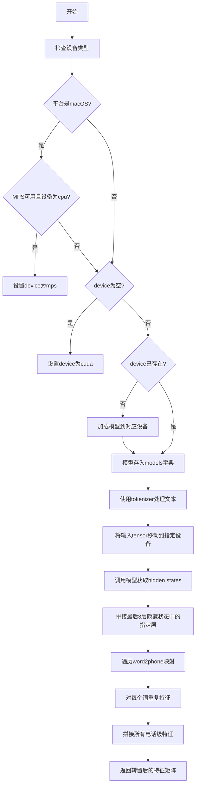
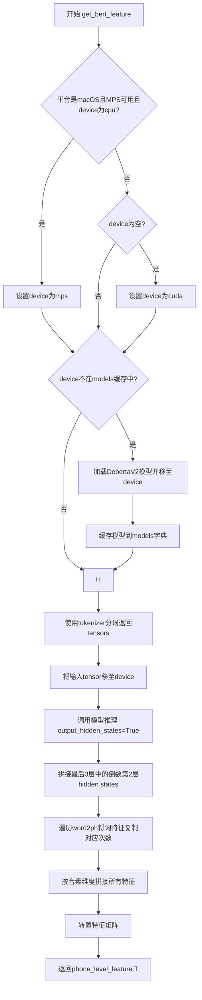
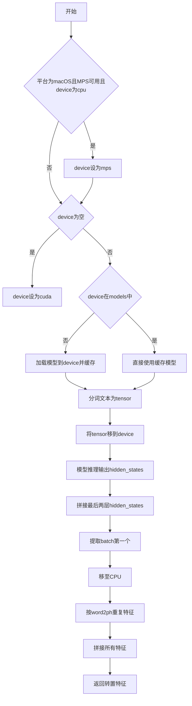

# `Bert-VITS2\oldVersion\V200\text\english_bert_mock.py` 详细设计文档

该代码实现了一个基于Deberta V2预训练模型的文本特征提取工具，通过tokenizer将文本转换为token ids，利用模型获取隐藏状态特征，并将词级别特征扩展为电话（音素）级别特征，用于语音合成等任务。

## 整体流程



## 类结构

```
模块: bert_gen (全局函数和变量)
├── 全局变量
│   ├── LOCAL_PATH: 模型路径
│   ├── tokenizer: DebertaV2分词器实例
│   └── models: 模型缓存字典
└── 全局函数
    └── get_bert_feature: 文本特征提取函数
```

## 全局变量及字段


### `LOCAL_PATH`
    
本地Deberta V2大模型的路径

类型：`str`
    


### `tokenizer`
    
Deberta V2分词器实例，用于对文本进行tokenize

类型：`DebertaV2Tokenizer`
    


### `models`
    
缓存不同设备上的Deberta V2模型实例的字典

类型：`dict`
    


    

## 全局函数及方法


### `get_bert_feature`

该函数使用 DebertaV2 预训练模型对输入文本进行特征提取，将词级别的隐藏状态映射为电话（音素）级别的特征向量，支持 CPU、CUDA 和 MPS 设备的自动选择与模型缓存。

参数：

- `text`：`str`，待提取特征的文本输入
- `word2ph`：`list[int]` 或类似结构，词到音素数量的映射数组，用于将词级别特征复制到音素级别
- `device`：`str`，计算设备，默认为 `config.bert_gen_config.device`

返回值：`torch.Tensor`，形状为 `(特征维度, 音素总数)` 的电话级别特征矩阵

#### 流程图



#### 带注释源码

```python
import sys

import torch
from transformers import DebertaV2Model, DebertaV2Tokenizer

from config import config

# 预训练模型本地路径
LOCAL_PATH = "./bert/deberta-v3-large"

# 全局分词器，单例初始化
tokenizer = DebertaV2Tokenizer.from_pretrained(LOCAL_PATH)

# 模型缓存字典，按设备缓存已加载的模型
models = dict()


def get_bert_feature(text, word2ph, device=config.bert_gen_config.device):
    """
    从DebertaV2模型提取文本的电话级别特征表示
    
    参数:
        text: 输入文本字符串
        word2ph: 词到音素数量的映射列表
        device: 计算设备，默认为配置中的设备
    
    返回:
        torch.Tensor: 电话级别的特征矩阵
    """
    # Apple Silicon (MPS) 设备适配：如果在macOS平台、MPS可用且用户指定了cpu，则自动切换到mps
    if (
        sys.platform == "darwin"
        and torch.backends.mps.is_available()
        and device == "cpu"
    ):
        device = "mps"
    
    # 设备降级策略：如果未指定设备则默认使用cuda
    if not device:
        device = "cuda"
    
    # 模型按设备缓存，避免重复加载
    if device not in models.keys():
        # 从本地路径加载预训练模型并移至指定设备
        models[device] = DebertaV2Model.from_pretrained(LOCAL_PATH).to(device)
    
    # 关闭梯度计算以节省显存和推理时间
    with torch.no_grad():
        # 分词：将文本转换为模型输入的tensor格式
        inputs = tokenizer(text, return_tensors="pt")
        
        # 将所有输入tensor移至目标计算设备
        for i in inputs:
            inputs[i] = inputs[i].to(device)
        
        # 模型推理：启用hidden_states输出以获取多层特征
        # output_hidden_states=True 返回所有层的hidden states
        res = models[device](**inputs, output_hidden_states=True)
        
        # 特征提取：取倒数第3层（即倒数第2个，-3:-2切片）
        # 使用torch.cat在最后一个维度拼接，形状从[seq_len, hidden_dim]变为[seq_len, hidden_dim]
        # [0]取batch维度（因为batch_size=1）
        res = torch.cat(res["hidden_states"][-3:-2], -1)[0].cpu()
    
    # word2phone保存词到音素的映射关系
    word2phone = word2ph
    
    # 初始化电话级别特征列表
    phone_level_feature = []
    
    # 遍历每个词，将词级别特征复制对应音素数量的次数
    for i in range(len(word2phone)):
        # 第i个词的hidden state复制word2phone[i]次
        repeat_feature = res[i].repeat(word2phone[i], 1)
        phone_level_feature.append(repeat_feature)
    
    # 沿音素维度（dim=0）拼接所有复制后的特征
    # 形状：[总音素数, 隐藏层维度]
    phone_level_feature = torch.cat(phone_level_feature, dim=0)
    
    # 转置返回：最终形状 [隐藏层维度, 总音素数]
    return phone_level_feature.T
```

## 关键组件


### DebertaV2Tokenizer

文本分词器，用于将输入文本转换为模型可处理的token序列，支持word到phoneme的映射准备。

### DebertaV2Model

预训练的语言模型（deberta-v3-large），用于提取文本的上下文语义特征，输出隐藏状态供后续phoneme级别特征提取使用。

### 模型缓存字典（models）

全局字典，按设备类型缓存已加载的模型实例，避免重复加载模型，提高多设备调用场景下的性能。

### 设备适配逻辑

自动检测并选择计算设备，支持MPS（Apple Silicon）、CUDA和CPU，并根据平台和配置动态切换最优设备。

### Phoneme级别特征扩展

将word级别的BERT特征按word2ph映射展开为phone级别的特征，通过repeat操作实现特征复制，处理变长phoneme序列。

### 隐藏状态提取器

从DebertaV2Model的输出中选取倒数第三层的隐藏状态作为主要特征输出，平衡语义信息与细节保留。

### 配置管理（config）

通过config.bert_gen_config.device获取默认设备配置，支撑运行时设备选择的灵活性。


## 问题及建议


### 已知问题

- **全局状态管理风险**：`models` 字典和 `tokenizer` 在模块级别初始化，可能导致序列化（pickle）失败，且在多进程环境下产生竞态条件
- **设备选择逻辑冗余**：先检查 `device == "cpu"` 再决定是否使用 mps，但后续又检查 `device not in models.keys()`，逻辑不清晰
- **变量命名不一致**：`word2phone` 与 `word2ph` 混用，易造成混淆
- **缺少输入验证**：未对 `text`、`word2ph` 的有效性进行检查，可能导致运行时错误
- **硬编码路径**：模型路径 `./bert/deberta-v3-large` 硬编码，不利于配置管理
- **资源未正确释放**：模型加载后常驻内存，无显式释放机制
- **循环效率低下**：使用 `list.append()` 后再 `torch.cat`，可优化为预分配或向量化操作
- **注释代码残留**：`assert` 语句被注释但未删除，表明对输入约束不确定

### 优化建议

- 将模型缓存改为类封装或使用单例模式，提供初始化/销毁接口
- 统一设备选择逻辑，使用 `torch.cuda.is_available()` 和 `torch.backends.mps.is_available()` 统一判断
- 从 `config` 读取模型路径，使用 `pathlib.Path` 处理路径
- 添加输入类型检查和维度验证，确保 `len(word2ph) == len(text) + 2` 成立
- 使用 `torch.inference_mode()` 替代 `torch.no_grad()`，提升推理性能
- 考虑使用 `torch.repeat_interleave()` 替代 `repeat()` + 循环，减少内存碎片
- 移除注释掉的 `assert` 代码，或添加文档说明输入约束

## 其它


### 一段话描述
使用预训练的DebertaV2模型对输入文本进行深度特征提取，并将词级别的特征根据词到音素的映射转换为音素级别的特征，用于语音合成任务。

### 文件的整体运行流程
文件初始化时加载DebertaV2分词器和预训练模型路径；调用get_bert_feature函数时，根据输入文本和词到音素映射，先进行文本分词和设备选择，然后从缓存中获取或加载模型，提取模型的隐藏状态并拼接指定层，接着将词级别特征按音素数量重复，最后拼接并返回音素级别的特征张量。

### 类的详细信息
本代码为模块级代码，未定义任何类，所有功能通过全局函数实现。

### 类字段和类方法
无类定义。

### 全局变量和全局函数
### LOCAL_PATH
- 类型：字符串
- 描述：预训练DebertaV2模型的本地路径。

### tokenizer
- 类型：DebertaV2Tokenizer
- 描述：DebertaV2模型的分词器实例，用于文本编码。

### models
- 类型：字典
- 描述：缓存不同设备上的模型实例，避免重复加载。

### get_bert_feature
- 参数：
  - text：字符串，输入文本。
  - word2ph：列表，整数列表，表示每个词对应的音素数量。
  - device：字符串，指定运行设备，默认为config.bert_gen_config.device。
- 返回值类型：torch.Tensor
- 返回值描述：返回音素级别的特征张量，形状为(特征维度, 音素序列长度)。
- 流程图：

- 源码：
```python
def get_bert_feature(text, word2ph, device=config.bert_gen_config.device):
    if (
        sys.platform == "darwin"
        and torch.backends.mps.is_available()
        and device == "cpu"
    ):
        device = "mps"
    if not device:
        device = "cuda"
    if device not in models.keys():
        models[device] = DebertaV2Model.from_pretrained(LOCAL_PATH).to(device)
    with torch.no_grad():
        inputs = tokenizer(text, return_tensors="pt")
        for i in inputs:
            inputs[i] = inputs[i].to(device)
        res = models[device](**inputs, output_hidden_states=True)
        res = torch.cat(res["hidden_states"][-3:-2], -1)[0].cpu()
    # assert len(word2ph) == len(text)+2
    word2phone = word2ph
    phone_level_feature = []
    for i in range(len(word2phone)):
        repeat_feature = res[i].repeat(word2phone[i], 1)
        phone_level_feature.append(repeat_feature)

    phone_level_feature = torch.cat(phone_level_feature, dim=0)

    return phone_level_feature.T
```

### 关键组件信息
- DebertaV2Model：transformers库提供的预训练模型，用于提取文本的深度表示。
- DebertaV2Tokenizer：用于将文本转换为模型输入的token IDs。
- config：项目配置文件，提供设备等配置信息。

### 潜在的技术债务或优化空间
- 模型缓存策略：每次调用都检查模型是否存在，可预加载或优化缓存逻辑。
- 设备管理：设备选择逻辑分散，可封装设备管理模块。
- 错误处理：缺少输入校验和异常捕获，如文本过长、模型加载失败等情况未处理。
- 性能优化：循环重复特征时效率较低，可尝试向量化操作。
- 硬编码路径：模型路径为硬编码，可通过配置管理。

### 其它项目
#### 设计目标与约束
- 设计目标：为语音合成任务提供文本的深度特征表示，特别是音素级别的特征。
- 约束：依赖预训练的DebertaV2模型，需要特定硬件支持（GPU或MPS），模型文件本地可用。

#### 错误处理与异常设计
- 异常情况：模型文件缺失、设备不支持、输入文本格式错误、word2ph长度不匹配等。
- 处理建议：在模型加载时捕获IOError，在推理时捕获RuntimeError，对输入进行校验，确保text和word2ph长度匹配。

#### 数据流与状态机
- 数据流：输入文本和词到音素映射 -> 分词 -> 设备分配 -> 模型推理 -> 特征处理 -> 特征映射 -> 输出特征张量。
- 状态机：无复杂状态转换，模型和分词器为全局状态，函数调用为无状态执行。

#### 外部依赖与接口契约
- 依赖：torch、transformers库、config模块。
- 接口：get_bert_feature(text, word2ph, device)函数，输入为字符串和列表，输出为torch.Tensor，需保证word2ph长度与文本词数一致。

    