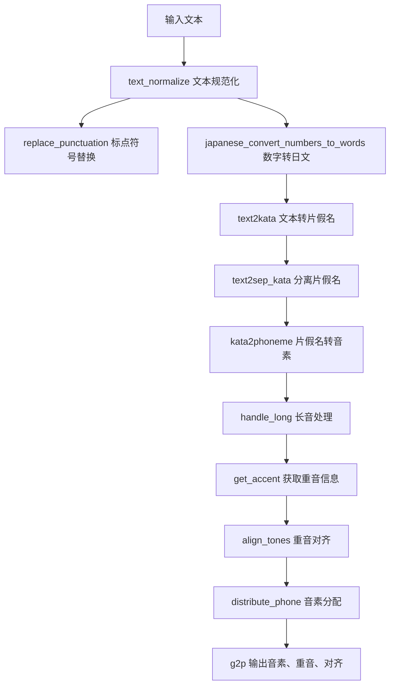
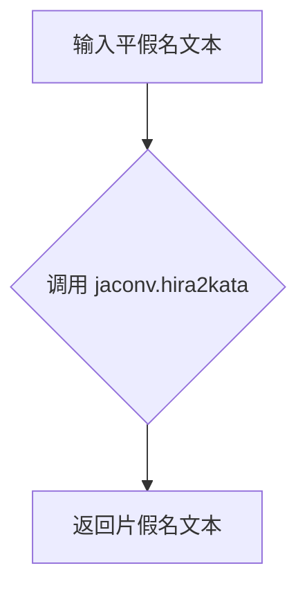
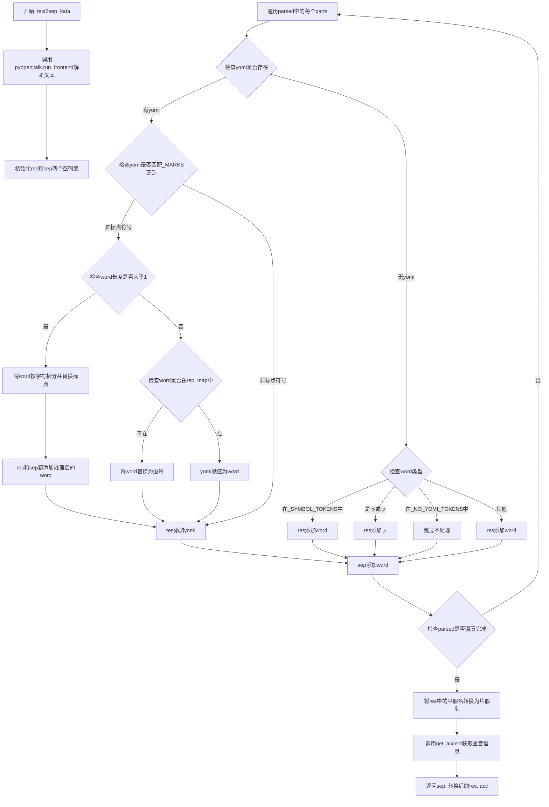
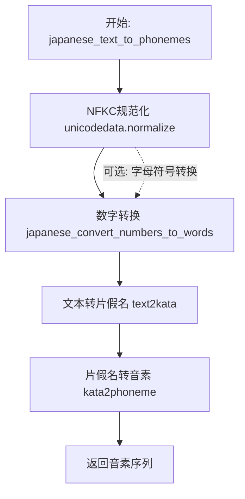
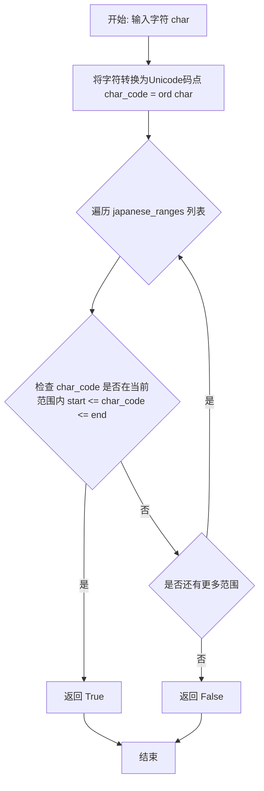
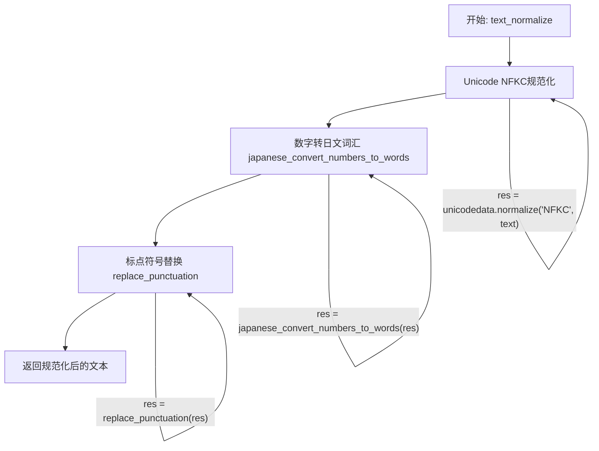
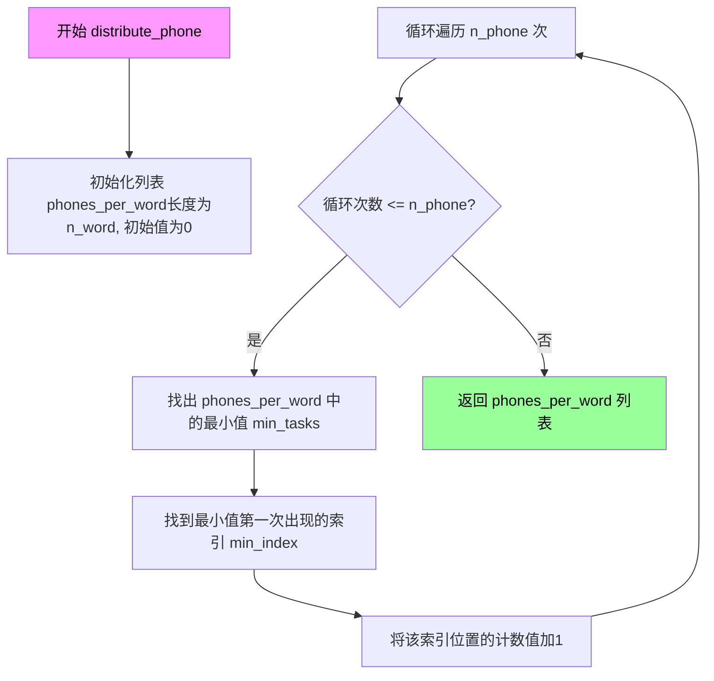
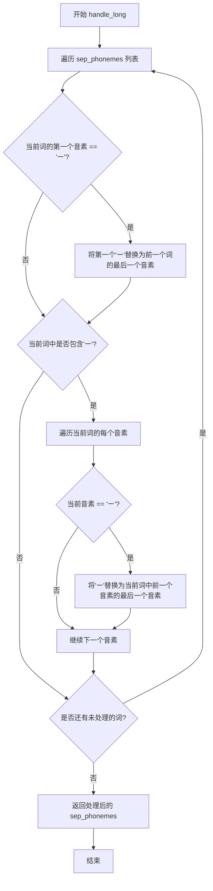
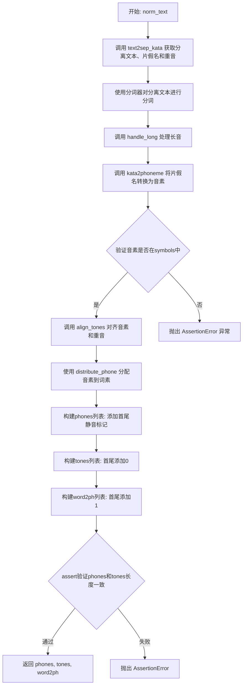

# `Bert-VITS2\oldVersion\V200\text\japanese.py` 详细设计文档

该代码是一个日语文本转音素（phoneme）的转换工具，兼容Julius语音识别框架。它将日语文本（包括平假名、片假名、汉字、阿拉伯数字、标点符号等）转换为音素序列，并生成对应的重音（tone）信息和词素-音素对齐（word2ph）信息，主要用于文本到语音（TTS）合成系统。

## 整体流程



## 类结构

```
全局函数
├── kata2phoneme (片假名转音素)
├── hira2kata (平假名转片假名)
├── text2kata (文本转片假名)
├── text2sep_kata (文本转分离片假名)
├── get_accent (获取重音)
├── japanese_convert_numbers_to_words (数字转日文)
├── japanese_convert_alpha_symbols_to_words (字母符号转日文)
├── japanese_text_to_phonemes (日文转音素主函数)
├── is_japanese_character (判断是否日文字符)
├── replace_punctuation (标点符号替换)
├── text_normalize (文本规范化)
├── distribute_phone (音素分配)
├── handle_long (长音处理)
├── align_tones (重音对齐)
└── g2p (字素转音素主函数)
```

## 全局变量及字段


### `rep_map`
    
标点符号映射表，将日文标点符号转换为英文标点或统一符号

类型：`dict[str, str]`
    


### `_ALPHASYMBOL_YOMI`
    
字母符号到日文读音的映射字典，用于将英文字母和希腊字母转换为日文读音

类型：`dict[str, str]`
    


### `_NUMBER_WITH_SEPARATOR_RX`
    
正则表达式，用于匹配带分隔符的数字（如1,000）

类型：`re.Pattern`
    


### `_CURRENCY_MAP`
    
货币符号到日文货币名称的映射字典

类型：`dict[str, str]`
    


### `_CURRENCY_RX`
    
正则表达式，用于匹配货币符号和数字的组合（如$100）

类型：`re.Pattern`
    


### `_NUMBER_RX`
    
正则表达式，用于匹配数字（包括整数和小数）

类型：`re.Pattern`
    


### `_SYMBOL_TOKENS`
    
符号令牌集合，包含日文常见符号如・、。？！等

类型：`set[str]`
    


### `_NO_YOMI_TOKENS`
    
无读音令牌集合，包含引号、括号等无实际读音的符号

类型：`set[str]`
    


### `_MARKS`
    
正则表达式，用于匹配非日文字符（假名、汉字、数字、字母等以外的字符）

类型：`re.Pattern`
    


### `tokenizer`
    
DeBERTa-v2-large-japanese模型的预训练分词器实例

类型：`transformers.tokenization_utils_base.PreTrainedTokenizerBase`
    


    

## 全局函数及方法


### `kata2phoneme`

将片假名文本转换为音素序列（phonemes），支持处理特殊符号和长音符号。

参数：

-  `text`：`str`，输入的片假名文本

返回值：`list[str]`，音素列表（注意：原代码类型注解为 `str`，但实际返回 `list`）

#### 流程图

```mermaid
flowchart TD
    A[开始: kata2phoneme] --> B{text是否为空或仅空格}
    B -->|是| C[strip后赋值给text]
    B -->|否| D{text == 'ー'}
    
    C --> D
    
    D -->|是| E[返回列表 ['ー']]
    D -->|否| F{text以'ー'开头}
    
    F -->|是| G[返回 ['ー'] + kata2phoneme(text[1:])]
    F -->|否| H[初始化res为空列表, prev=None]
    
    H --> I{while text循环}
    I --> J{re.match MARKS, text}
    J -->|是| K[res.append(text), text=text[1:], 继续]
    K --> I
    
    J -->|否| L{text.startswith 'ー'}
    L -->|是| M{prev存在}
    M -->|是| N[res.append prev[-1]]
    M -->|否| O[跳过]
    N --> P[text=text[1:], 继续]
    O --> P
    P --> I
    
    L -->|否| Q[res += pyopenjtalk.g2p.lower().replace.split]
    Q --> R[break退出循环]
    R --> S[返回res列表]
    
    I -->|text为空| S
```

#### 带注释源码

```python
def kata2phoneme(text: str) -> str:
    """Convert katakana text to phonemes.
    
    将片假名文本转换为音素序列
    
    参数:
        text: 输入的片假名文本字符串
        
    返回:
        音素列表（实际返回list[str]，类型注解有误）
    """
    # 去除首尾空白字符
    text = text.strip()
    
    # 特殊情况1: 文本仅为长音符号'ー'
    if text == "ー":
        return ["ー"]
    # 特殊情况2: 文本以长音符号'ー'开头
    # 递归处理，将'ー'转换为前一个音素
    elif text.startswith("ー"):
        return ["ー"] + kata2phoneme(text[1:])
    
    # 初始化结果列表和前一个音素变量
    res = []
    prev = None
    
    # 主循环: 处理文本中的每个字符
    while text:
        # 检查是否为标点符号或其他非日语字符
        # _MARKS正则: 匹配非字母、数字、日语字符、中文CJK、阿拉伯数字、全角数字、全角字母、片假名等
        if re.match(_MARKS, text):
            res.append(text)  # 保留符号
            text = text[1:]   # 移至下一个字符
            continue
        
        # 处理文本中的长音符号'ー'
        if text.startswith("ー"):
            if prev:
                # 如果存在前一个音素，使用其最后一个音素（延长音）
                res.append(prev[-1])
            text = text[1:]  # 跳过'ー'
            continue
        
        # 使用pyopenjtalk进行音素转换
        # g2p: grapheme to phoneme，将文字转换为音素
        # .lower(): 转为小写
        # .replace("cl", "q"): 将闭锁音cl替换为q
        # .split(" "): 按空格分割为音素列表
        res += pyopenjtalk.g2p(text).lower().replace("cl", "q").split(" ")
        break  # 转换完成后退出循环
    
    # 返回音素列表
    return res
```


### `hira2kata`

将输入的平假名文本转换为片假名文本的函数，是 `jaconv.hira2kata` 的简单包装函数。

参数：

- `text`：`str`，输入的平假名文本

返回值：`str`，转换后的片假名文本

#### 流程图



#### 带注释源码

```python
def hira2kata(text: str) -> str:
    """
    将平假名转换为片假名
    
    参数:
        text: 输入的平假名文本字符串
    
    返回值:
        转换后的片假名文本字符串
    """
    # 直接调用 jaconv 库的 hira2kata 函数进行转换
    # jaconv 是一个高效的日文转换库，支持平假名、片假名、罗马字等之间的转换
    return jaconv.hira2kata(text)
```


### `text2kata`

该函数是日语语音合成前端处理的核心模块，负责将日语文本转换为片假名表示。它通过 pyopenjtalk 进行文本解析，提取每个词语的假名注音（yomi），然后根据标点符号规则和特殊字符处理逻辑，将文本转换为片假名格式输出。

参数：

-  `text`：`str`，输入的日语文本字符串

返回值：`str`，转换后的片假名字符串

#### 流程图

```mermaid
flowchart TD
    A[开始: text2kata] --> B[调用 pyopenjtalk.run_frontend 解析文本]
    B --> C[初始化空结果列表 res]
    C --> D[遍历解析结果 parts]
    D --> E{判断 yomi 是否存在}
    E -->|有 yomi| F{检查 yomi 是否匹配 _MARKS 正则}
    F -->|匹配| G{判断 word 长度是否 > 1}
    G -->|是| H[对 word 每个字符替换标点]
    H --> I[res 累加 yomi, sep 累加 word]
    I --> D
    G -->|否| J{word 是否在 rep_map 中}
    J -->|不在| K[word 改为 ',']
    J -->|在| L[yomi 设为 word]
    K --> L
    L --> M[res 添加 yomi]
    M --> D
    F -->|不匹配| M
    E -->|无 yomi| N{判断 word 类型}
    N -->|在 _SYMBOL_TOKENS| O[res 添加 word]
    N -->|在 ('っ', 'ッ')| P[res 添加 'ッ']
    N -->|在 _NO_YOMI_TOKENS| Q[跳过不处理]
    N -->|其他| R[res 添加 word]
    O --> D
    P --> D
    Q --> D
    R --> D
    D --> S{是否遍历完所有 parts}
    S -->|否| D
    S -->|是| T[调用 hira2kata 转换并连接 res]
    T --> U[返回片假名字符串]
```

#### 带注释源码

```python
def text2kata(text: str) -> str:
    """
    将日语文本转换为片假名表示
    
    处理流程：
    1. 使用 pyopenjtalk 解析文本获取词语和假名注音
    2. 根据假名注音和词语类型进行规则处理
    3. 将平假名转换为片假名后返回
    
    Args:
        text: 输入的日语文本字符串
        
    Returns:
        转换后的片假名字符串
    """
    # 使用 pyopenjtalk 的前端处理器解析文本
    # 返回结构: [{"string": "词语", "pron": "假名注音"}, ...]
    parsed = pyopenjtalk.run_frontend(text)

    # 存储最终结果的列表
    res = []
    
    # 遍历解析后的每个词语单元
    for parts in parsed:
        # 提取词语字符串，并对其中的标点符号进行替换
        # 同时获取假名注音，并移除其中的单引号字符
        word, yomi = replace_punctuation(parts["string"]), parts["pron"].replace(
            "'", ""
        )
        
        # 判断是否存在假名注音
        if yomi:
            # 检查假名注音是否符合特殊标记规则
            # _MARKS 正则匹配非日语字符和数字字母等
            if re.match(_MARKS, yomi):
                # 当词语长度大于1时，处理多个字符
                if len(word) > 1:
                    # 对词语中的每个字符单独进行标点替换
                    word = [replace_punctuation(i) for i in list(word)]
                    yomi = word
                    # 累加到结果列表
                    # 注意：此处 sep 变量未定义，会导致 NameError
                    res += yomi
                    sep += word
                    continue
                # 当词语长度仅为1时
                elif word not in rep_map.keys() and word not in rep_map.values():
                    # 如果词语不在映射表中，将其替换为逗号
                    word = ","
                # 将 yomi 设置为处理后的 word
                yomi = word
            # 将处理后的假名注音添加到结果中
            res.append(yomi)
        else:
            # 不存在假名注音时的处理分支
            if word in _SYMBOL_TOKENS:
                # 符号标记直接添加
                res.append(word)
            elif word in ("っ", "ッ"):
                # 日语促音统一转换为 "ッ"
                res.append("ッ")
            elif word in _NO_YOMI_TOKENS:
                # 无需处理的标记符号，跳过
                pass
            else:
                # 其他词语直接添加到结果中
                res.append(word)
    
    # 将结果列表中的平假名转换为片假名，并连接成字符串返回
    return hira2kata("".join(res))
```


### `text2sep_kata`

该函数是日语文本处理流程中的核心组件，负责将输入的日语文本转换为分离的片假名注音表示，并同步提取每个词的重音信息。它通过调用 pyopenjtalk 进行形态素解析，然后对解析结果进行复杂的处理，包括标点符号替换、平假名转片假名、重音计算等，最终返回词素列表、片假名注音列表和重音标记列表三个部分。

参数：

- `text`：`str`，输入的日语文本字符串

返回值：`tuple[list, list, list]`，返回一个包含三个列表的元组：
  - 第一个元素：`list[str]`，分离后的词素（word）列表
  - 第二个元素：`list[str]`，对应的片假名注音列表
  - 第三个元素：`list[tuple[str, int]]`，音素与重音标记的配对列表，其中整数值表示重音类型（-1表示降调，1表示升调，0表示平调）

#### 流程图



#### 带注释源码

```python
def text2sep_kata(text: str) -> (list, list):
    """
    将日语文本转换为分离的片假名表示，同时提取重音信息。
    
    该函数是g2p函数的核心前置步骤，负责：
    1. 使用pyopenjtalk进行形态素解析
    2. 处理各种特殊字符和标点符号
    3. 将平假名转换为片假名
    4. 计算每个音节的重音模式
    
    参数:
        text: 输入的日语文本字符串
        
    返回:
        三元素元组: (词素列表, 片假名列表, 重音信息列表)
    """
    # 使用pyopenjtalk进行形态素解析，返回包含string和pron字段的列表
    parsed = pyopenjtalk.run_frontend(text)

    # res: 存储最终处理后的注音信息
    # sep: 存储分离后的原始词素
    res = []
    sep = []
    
    # 遍历每个形态素解析结果
    for parts in parsed:
        # 获取原始词形和发音，替换掉撇号字符
        word, yomi = replace_punctuation(parts["string"]), parts["pron"].replace(
            "’", ""
        )
        
        # 处理有发音的情况
        if yomi:
            # 检查发音是否匹配标点符号正则（不含假名、汉字、数字、拉丁字母）
            if re.match(_MARKS, yomi):
                # 词长度大于1的情况（多字符词组）
                if len(word) > 1:
                    # 对每个字符进行标点替换
                    word = [replace_punctuation(i) for i in list(word)]
                    yomi = word
                    res += yomi
                    sep += word
                    continue  # 跳过后续处理
                # 单词情况：检查是否在替换映射中
                elif word not in rep_map.keys() and word not in rep_map.values():
                    word = ","  # 未知字符替换为逗号
                yomi = word
            # 将处理后的发音添加到结果列表
            res.append(yomi)
        else:
            # 处理无发音的情况（可能是特殊符号或无假名的汉字）
            if word in _SYMBOL_TOKENS:
                # 符号直接添加
                res.append(word)
            elif word in ("っ", "ッ"):
                # 小写促音添加
                res.append("ッ")
            elif word in _NO_YOMI_TOKENS:
                # 无发音标记的字符跳过
                pass
            else:
                # 其他情况（可能是汉字或未知词）直接添加原词
                res.append(word)
        
        # 无论是否有发音，都将原词添加到sep列表
        sep.append(word)
    
    # 将平假名转换为片假名
    # 注意：这里假设res中存储的是平假名，需要转换为片假名
    # 但代码逻辑显示res中可能已经存储了处理后的字符串，可能存在逻辑缺陷
    kata_res = [hira2kata(i) for i in res]
    
    # 获取重音信息
    accent_info = get_accent(parsed)
    
    return sep, kata_res, accent_info
```

#### 关键组件信息

| 组件名称 | 一句话描述 |
|---------|-----------|
| `pyopenjtalk.run_frontend` | 日语形态素解析引擎，用于将文本分割为词素并获取发音 |
| `replace_punctuation` | 标点符号和特殊字符的替换函数，统一转换为英文符号 |
| `hira2kata` | 使用jaconv库将平假名转换为片假名的函数 |
| `get_accent` | 解析pyopenjtalk生成的标签，提取音素和重音信息的函数 |
| `_MARKS` | 正则表达式，用于匹配非日语基本字符（假名、汉字、数字、拉丁字母） |
| `_SYMBOL_TOKENS` | 常见标点符号集合（・、。？！） |
| `_NO_YOMI_TOKENS` | 无发音标记的符号集合（「」『』―（）［］[]） |

#### 潜在技术债务与优化空间

1. **代码重复问题**：`text2sep_kata`函数与`text2kata`函数存在大量重复的逻辑代码，约30行代码几乎完全一致，应抽取为私有辅助方法以提高代码可维护性。

2. **逻辑缺陷风险**：在`text2kata`中存在`sep += word`的变量`sep`未定义问题（代码错误），`text2sep_kata`中同样可能存在潜在逻辑问题，res列表中可能同时包含假名和汉字，直接调用`hira2kata`可能导致非假名字符被错误转换。

3. **重音计算边界条件**：在`get_accent`函数中访问`labels[n+1]`时未检查索引越界，虽然通常最后会有sil/pau标记，但存在潜在的IndexError风险。

4. **类型注解不精确**：函数返回类型标注为`(list, list)`不够精确，应使用`tuple[list[str], list[str], list[tuple[str, int]]]`以提高类型安全性。

5. **错误处理缺失**：函数未对异常输入（如空字符串、None值）进行防御性检查，可能导致运行时错误。

6. **正则表达式编译优化**：`_MARKS`在模块级别已编译，但其他正则表达式如`rep_map`的拼接在每次调用时重新构建，应考虑预编译或缓存。


### `get_accent`

该函数用于从解析后的文本中提取音素和重音信息，通过分析 pyopenjtalk 生成的标签来识别每个音素的重音类型（升调、降调或平调），最终返回音素与其对应重音的元组列表。

参数：

-  `parsed`：`list`，pyopenjtalk.run_frontend(text) 的返回值，包含文本的词素分析结果

返回值：`list[tuple[str, int]]`，返回音素与其重音标记的元组列表，其中重音值含义：-1 表示降调（Falling），0 表示平调，1 表示升调（Rising）

#### 流程图

```mermaid
flowchart TD
    A[开始: 接收 parsed 数据] --> B[使用 pyopenjtalk.make_label 生成标签]
    B --> C[初始化空列表: phonemes 和 accents]
    C --> D[遍历 labels 中的每个标签]
    D --> E{音素是否为 sil 或 pau}
    E -->|是| F[跳过当前标签, 继续下一个]
    E -->|否| G[提取音素并添加到大写]
    G --> H[提取重音信息 a1 和 a2]
    H --> I{下一个标签的音素是 sil 或 pau}
    I -->|是| J[a2_next = -1]
    I -->|否| K[a2_next = 下一个标签的 a2]
    J --> L{判断重音类型}
    K --> L
    L --> M{a1 == 0 且 a2_next == a2 + 1}
    M -->|是| N[accents.append(-1) 降调]
    M -->|否| O{a2 == 1 且 a2_next == 2}
    O -->|是| P[accents.append(1) 升调]
    O -->|否| Q[accents.append(0) 平调]
    N --> R[遍历完成?]
    P --> R
    Q --> R
    R -->|否| D
    R -->|是| S[返回 zip(phonemes, accents)]
    S --> T[结束]
```

#### 带注释源码

```python
def get_accent(parsed):
    """从解析后的文本中提取音素和重音信息。
    
    参数:
        parsed: pyopenjtalk.run_frontend(text) 的返回值，包含文本的词素分析结果
        
    返回:
        音素与其重音标记的元组列表
        - 音素: str, 处理后的音素符号
        - 重音: int, -1=降调, 0=平调, 1=升调
    """
    # 使用 pyopenjtalk 将解析结果转换为标签序列
    labels = pyopenjtalk.make_label(parsed)

    # 初始化音素和重音列表
    phonemes = []
    accents = []
    
    # 遍历每个标签
    for n, label in enumerate(labels):
        # 使用正则表达式提取音素（-xxx+ 格式）
        phoneme = re.search(r"\-([^\+]*)\+", label).group(1)
        
        # 跳过静音标记（sil）和停顿（pau）
        if phoneme not in ["sil", "pau"]:
            # 将 cl 替换为 q，并转换为小写
            phonemes.append(phoneme.replace("cl", "q").lower())
        else:
            continue
        
        # 提取当前标签的重音信息 a1（绝对重音位置）
        a1 = int(re.search(r"/A:(\-?[0-9]+)\+", label).group(1))
        # 提取当前标签的音素索引 a2
        a2 = int(re.search(r"\+(\d+)\+", label).group(1))
        
        # 检查下一个标签的音素类型
        if re.search(r"\-([^\+]*)\+", labels[n + 1]).group(1) in ["sil", "pau"]:
            # 如果下一个是静音或停顿，设置 a2_next 为 -1
            a2_next = -1
        else:
            # 否则提取下一个标签的音素索引
            a2_next = int(re.search(r"\+(\d+)\+", labels[n + 1]).group(1))
        
        # 判断重音模式：降调（Falling）
        # 条件：a1 == 0（无绝对重音）且下一个音素的索引等于当前索引+1
        if a1 == 0 and a2_next == a2 + 1:
            accents.append(-1)
        # 判断重音模式：升调（Rising）
        # 条件：当前音素索引为1且下一个音素索引为2
        elif a2 == 1 and a2_next == 2:
            accents.append(1)
        else:
            # 平调（Flat）
            accents.append(0)
    
    # 将音素和重音配对并返回
    return list(zip(phonemes, accents))
```


### `japanese_convert_numbers_to_words`

该函数将日语文本中的数字（包括带分隔符的数字、货币符号以及普通数字）转换为对应的日语文本（片假名）形式，以便后续的语音合成处理。

参数：

- `text`：`str`，需要进行数字转换的日语文本

返回值：`str`，转换后的文本，其中数字已被替换为日语文本表示

#### 流程图

```mermaid
flowchart TD
    A[输入文本 text] --> B[去除数字中的千位分隔符]
    B --> C[处理货币符号]
    C --> D[将剩余数字转换为日文]
    D --> E[返回转换后的文本]
    
    B --> B1[_NUMBER_WITH_SEPARATOR_RX 匹配 1,000 格式]
    B1 --> B2[lambda m: m[0].replace, , , )替换为空]
    
    C --> C1[_CURRENCY_RX 匹配 $100 ¥1000 等]
    C1 --> C2[lambda m: m[2] + _CURRENCY_MAP.getm1, m1)]
    
    D --> D1[_NUMBER_RX 匹配任意数字]
    D1 --> D2[lambda m: num2wordsm0, lang=ja)]
```

#### 带注释源码

```python
def japanese_convert_numbers_to_words(text: str) -> str:
    """
    将日语文本中的数字转换为日语文本（片假名）形式
    
    处理流程:
    1. 去除千位分隔符（逗号）
    2. 处理货币符号（$, ¥, £, €）
    3. 将剩余数字转换为日文
    
    参数:
        text: 输入的日语文本，可能包含数字
        
    返回:
        转换后的文本，数字已被替换为日文片假名
    """
    
    # 步骤1: 去除数字中的千位分隔符
    # 使用正则表达式匹配如 "1,000", "123,456" 格式的数字
    # 将逗号替换为空字符串
    res = _NUMBER_WITH_SEPARATOR_RX.sub(lambda m: m[0].replace(",", ""), text)
    
    # 步骤2: 处理货币符号
    # 匹配货币格式: $100, ¥1000, £50, €75 等
    # 将货币符号与数字分离，并转换为日文货币单位
    # 例如: "$100" -> "100ドル", "¥1000" -> "100円"
    res = _CURRENCY_RX.sub(lambda m: m[2] + _CURRENCY_MAP.get(m[1], m[1]), res)
    
    # 步骤3: 将所有剩余数字转换为日语文本
    # 使用 num2words 库将数字转换为日文
    # 支持整数和小数: "100" -> "百", "3.14" -> "三点一四"
    res = _NUMBER_RX.sub(lambda m: num2words(m[0], lang="ja"), res)
    
    # 返回转换后的文本
    return res
```

#### 相关全局变量

| 变量名 | 类型 | 描述 |
|--------|------|------|
| `_NUMBER_WITH_SEPARATOR_RX` | `re.Pattern` | 正则表达式，匹配带千位分隔符的数字（如 `1,234`） |
| `_CURRENCY_MAP` | `dict` | 货币符号到日文单位的映射字典（$:美元, ¥:日元, £:英镑, €:欧元） |
| `_CURRENCY_RX` | `re.Pattern` | 正则表达式，匹配货币符号后跟数字的格式 |
| `_NUMBER_RX` | `re.Pattern` | 正则表达式，匹配普通数字（整数或小数） |


### `japanese_convert_alpha_symbols_to_words`

将输入文本中的英文字母、希腊字母及特殊符号转换为对应的日文读音文字（平假名/片假名形式），实现跨语言的符号到语音的映射转换。

参数：

- `text`：`str`，需要转换的输入文本，包含英文字母、希腊字母或特殊符号

返回值：`str`，转换后的文本，原始字符被替换为对应的日文读音，未知字符保持不变

#### 流程图

```mermaid
flowchart TD
    A[开始: 输入文本 text] --> B[将文本转为小写 lower]
    B --> C[遍历每个字符 ch]
    C --> D{字符在_ALPHASYMBOL_YOMI中?}
    D -->|是| E[获取映射值 _ALPHASYMBOL_YOMI[ch]]
    D -->|否| F[保留原字符 ch]
    E --> G[添加到结果列表]
    F --> G
    G --> H{还有更多字符?}
    H -->|是| C
    H -->|否| I[合并所有字符为字符串]
    I --> J[返回结果字符串]
```

#### 带注释源码

```python
def japanese_convert_alpha_symbols_to_words(text: str) -> str:
    """
    将文本中的字母和符号转换为对应的日文读音。
    
    参数:
        text (str): 输入的文本字符串，包含需要转换的字母、符号或数字
        
    返回:
        str: 转换后的字符串，字符被替换为日文读音，未知字符保持原样
    """
    # 使用列表推导式遍历文本中的每个字符
    # 对每个字符调用 _ALPHASYMBOL_YOMI.get(ch, ch) 进行转换
    # 如果字符在映射表中存在，返回对应的日文读音；否则返回原字符
    # 最后使用 join 将转换后的字符列表合并为字符串
    return "".join([_ALPHASYMBOL_YOMI.get(ch, ch) for ch in text.lower()])
```

#### 相关全局变量

- `_ALPHASYMBOL_YOMI`：`dict`，字符到日文读音的映射字典，包含英文字母（a-z）、希腊字母（α-ω）及常见符号（#、% 等）到日文片假名的映射关系


### `japanese_text_to_phonemes`

将日语文本转换为音素序列（phonemes），以便与语音识别框架（如Julius）兼容。该函数是整个日语文本到语音（Text-to-Speech/TTS）处理流程的核心入口点，通过规范化、数字转换、片假名转换和音素映射等步骤，将原始日语文本转换为可供语音合成使用的音素表示。

参数：

- `text`：`str`，需要转换的日语文本字符串

返回值：`str`，转换后的日语音素序列字符串

#### 流程图



#### 带注释源码

```python
def japanese_text_to_phonemes(text: str) -> str:
    """将日语文本转换为音素序列
    
    这是日语文本转音素的核心入口函数，流程如下:
    1. NFKC规范化 - 统一Unicode编码形式
    2. 数字转文字 - 将阿拉伯数字转换为日文读法
    3. 文本转片假名 - 使用OpenJTalk将文本转换为片假名
    4. 片假名转音素 - 将片假名转换为音素序列
    
    Args:
        text: 输入的日语文本字符串
        
    Returns:
        转换后的日语音素序列字符串
        
    Example:
        >>> japanese_text_to_phonemes("こんにちは")
        ['k', 'o', 'n', 'n', 'i', 'c', 'h', 'i', 'w', 'a']
    """
    # Step 1: NFKC规范化 - 将Unicode字符标准化为NFKC形式
    # 这可以统一全角/半角字符、兼容字符等
    res = unicodedata.normalize("NFKC", text)
    
    # Step 2: 数字转文字 - 将阿拉伯数字(如"123")转换为日文读法(如"百二十三")
    # 调用japanese_convert_numbers_to_words函数处理
    res = japanese_convert_numbers_to_words(res)
    
    # Note: 字母符号转日文读法目前被注释掉
    # 如需要启用: res = japanese_convert_alpha_symbols_to_words(res)
    
    # Step 3: 文本转片假名 - 使用OpenJTalk的run_frontend获取词性分析和读音
    # 这一步将自然语言文本转换为带读音的片假名序列
    res = text2kata(res)
    
    # Step 4: 片假名转音素 - 将片假名转换为音素表示
    # 最终输出为与Julius语音识别框架兼容的音素序列
    # 将"cl"替换为"q"(闭塞音表示)，并按空格分割为列表
    res = kata2phoneme(res)
    
    return res
```


### `is_japanese_character`

判断给定字符是否为日语字符（包括平假名、片假名、汉字等）。

参数：

- `char`：`str`，待检查的单个字符

返回值：`bool`，如果是日语字符返回 `True`，否则返回 `False`

#### 流程图



#### 带注释源码

```python
def is_japanese_character(char):
    # 定义日语文字系统的 Unicode 范围
    japanese_ranges = [
        (0x3040, 0x309F),  # 平假名 (Hiragana)
        (0x30A0, 0x30FF),  # 片假名 (Katakana)
        (0x4E00, 0x9FFF),  # 汉字 (CJK Unified Ideographs)
        (0x3400, 0x4DBF),  # 汉字扩展 A (CJK Unified Ideographs Extension A)
        (0x20000, 0x2A6DF),  # 汉字扩展 B (CJK Unified Ideographs Extension B)
        # 可以根据需要添加其他汉字扩展范围
    ]

    # 将字符的 Unicode 编码转换为整数
    char_code = ord(char)

    # 检查字符是否在任何一个日语范围内
    for start, end in japanese_ranges:
        if start <= char_code <= end:
            return True

    return False
```


### `replace_punctuation`

该函数用于将日语文本中的标点符号替换为指定的映射值，并移除所有非日语字符（保留平假名、片假名、汉字等日语字符），实现文本标点标准化和清洗功能。

参数：

-  `text`：`str`，需要进行标点符号替换和字符清洗的输入文本

返回值：`str`，完成标点替换并移除非日语字符后的文本

#### 流程图

```mermaid
flowchart TD
    A[开始: replace_punctuation] --> B[构建正则表达式模式]
    B --> C[使用rep_map替换标点符号]
    C --> D[构建非日语字符正则表达式]
    D --> E[移除所有非日语字符]
    E --> F[返回处理后的文本]
    
    B --> B1[从rep_map.keys()构建]
    C --> C1[lambda x: rep_map[x.group()]]
    D --> D1[包含Unicode范围: 3040-309F 30A0-30FF 4E00-9FFF 3400-4DBF 3005]
```

#### 带注释源码

```python
def replace_punctuation(text):
    """
    将文本中的标点符号替换为映射值，并移除非日语字符。
    
    处理流程：
    1. 使用正则表达式将rep_map中定义的标点符号替换为对应值
    2. 删除所有非日语字符（保留平假名、片假名、汉字等）
    
    参数:
        text: 输入的文本字符串
    
    返回:
        处理后的文本字符串
    """
    # 第一步：构建正则表达式模式，匹配rep_map中所有的标点符号键
    # re.escape(p) 对特殊字符进行转义，避免正则表达式语法错误
    # 使用|连接所有模式，实现并行匹配
    pattern = re.compile("|".join(re.escape(p) for p in rep_map.keys()))

    # 使用sub方法进行替换，通过lambda函数获取映射后的值
    # rep_map定义了标点符号的映射关系，如"："->","，"。"->"."
    replaced_text = pattern.sub(lambda x: rep_map[x.group()], text)

    # 第二步：移除所有非日语字符
    # 构建正则表达式，匹配所有不在以下范围内的字符：
    # - \u3040-\u309F: 平假名 (Hiragana)
    # - \u30A0-\u30FF: 片假名 (Katakana)
    # - \u4E00-\u9FFF: CJK统一表意文字 (CJK Unified Ideographs)
    # - \u3400-\u4DBF: CJK统一表意文字扩展A (CJK Unified Ideographs Extension A)
    # - \u3005: 重复标记 (Iteration Mark)
    # - punctuation: 从punctuation模块导入的额外允许字符
    replaced_text = re.sub(
        r"[^\u3040-\u309F\u30A0-\u30FF\u4E00-\u9FFF\u3400-\u4DBF\u3005"
        + "".join(punctuation)
        + r"]+",
        "",
        replaced_text,
    )

    # 返回处理后的文本
    return replaced_text
```

#### 依赖信息

| 依赖项 | 类型 | 描述 |
|--------|------|------|
| `rep_map` | 全局字典 | 标点符号映射表，定义源标点符号到目标标点符号的转换规则 |
| `punctuation` | 全局变量 | 从`.punctuation`模块导入的字符集合，用于保留额外的允许字符 |
| `re` | 标准库模块 | 正则表达式处理 |


### `text_normalize`

该函数是日语文本规范化的核心入口，通过Unicode规范化、数字转日文词汇、标点符号替换三个步骤，将原始日语文本转换为适合后续语音合成的标准化格式。

参数：

- `text`：`str`，待规范化的原始日语文本

返回值：`str`，规范化处理后的日语文本

#### 流程图



#### 带注释源码

```python
def text_normalize(text):
    """
    日语文本规范化主函数
    
    处理流程:
    1. Unicode NFKC规范化 - 统一字符表示形式
    2. 数字转日文词汇 - 将阿拉伯数字转为日文读法
    3. 标点符号替换 - 将日文标点转为英文/统一符号
    """
    # 步骤1: Unicode NFKC规范化
    # 作用: 将全角字符转为半角, 统一相似字符的表示形式
    # 例如: ４５６ -> 456, ｋａｎａ -> kana
    res = unicodedata.normalize("NFKC", text)
    
    # 步骤2: 将数字转换为日文词汇读法
    # 例如: "123" -> "百二十三"
    # 使用num2words库进行转换, lang="ja"指定日文模式
    res = japanese_convert_numbers_to_words(res)
    
    # 注释掉的部分: 仅保留日文字符(平假名、片假名、汉字)
    # res = "".join([i for i in res if is_japanese_character(i)])
    
    # 步骤3: 标点符号规范化替换
    # 将日文标点符号统一替换为英文标点
    # 例如: '。' -> '.', '、' -> ',', '？' -> '?'
    res = replace_punctuation(res)
    
    # 返回规范化后的文本
    return res
```


### `distribute_phone`

该函数用于将指定数量的音素（phones）均匀分配到单词（words）中，采用贪心算法确保每个单词分配到的音素数量尽可能均衡，返回每个单词对应的音素分配列表。

参数：

- `n_phone`：`int`，需要分配的音素总数
- `n_word`：`int`，目标单词数量，用于决定音素如何分配

返回值：`list[int]`，返回一个整数列表，长度为n_word，列表中每个元素表示对应单词分配到的音素数量

#### 流程图



#### 带注释源码

```python
def distribute_phone(n_phone: int, n_word: int) -> list[int]:
    """
    将音素均匀分配到单词中
    
    该函数使用贪心策略，确保音素尽可能均匀地分配到每个单词中。
    每次迭代都将下一个音素分配给当前拥有最少音素的单词。
    
    参数:
        n_phone: int - 需要分配的音素总数
        n_word: int - 目标单词数量
    
    返回:
        list[int] - 每个单词分配到的音素数量列表
    """
    # 初始化一个长度为n_word的列表，所有值为0
    # 每个索引代表一个单词，值代表已分配给该单词的音素数
    phones_per_word = [0] * n_word
    
    # 遍历每个需要分配的音素
    for task in range(n_phone):
        # 找出当前分配列表中的最小值（拥有最少音素的单词）
        min_tasks = min(phones_per_word)
        
        # 找到最小值第一次出现的索引位置
        # 使用index()确保每次选择的是第一个具有最小值的单词
        min_index = phones_per_word.index(min_tasks)
        
        # 将该单词的音素计数加1
        phones_per_word[min_index] += 1
    
    # 返回最终的音素分配结果
    return phones_per_word
```


### `handle_long`

该函数用于处理片假名音素序列中的长音符号"ー"，将其替换为前一个音素的最后一个音素，以确保发音的连续性。

参数：

- `sep_phonemes`：`List[List[str]]`，二维列表，表示分词后的片假名音素序列。每个内部列表代表一个词的音素列表，其中可能包含长音符号"需要替换。

返回值：`List[List[str]]`，返回处理后的片假名音素序列，长音符号已被替换为正确的发音。

#### 流程图



#### 带注释源码

```python
def handle_long(sep_phonemes):
    """
    处理片假名音素序列中的长音符号'ー'。
    
    长音符号在日语中表示延长前一个音素的发音，此函数将其替换为
    前一个音素的最后一个音素，以确保正确的发音连续性。
    
    参数:
        sep_phonemes: 二维列表，每个内部列表代表一个词的片假名音素序列
        
    返回:
        处理后的二维列表，长音符号已被替换
    """
    # 遍历每个词的音素列表
    for i in range(len(sep_phonemes)):
        # 处理词首的长音符号（延伸前一个词的最后一个音素）
        if sep_phonemes[i][0] == "ー":
            # 将'ー'替换为前一个词最后一个音素
            sep_phonemes[i][0] = sep_phonemes[i - 1][-1]
        
        # 检查当前词中是否包含长音符号
        if "ー" in sep_phonemes[i]:
            # 遍历当前词中的每个音素
            for j in range(len(sep_phonemes[i])):
                # 找到长音符号并替换
                if sep_phonemes[i][j] == "ー":
                    # 将'ー'替换为当前词中前一个音素的最后一个字符
                    sep_phonemes[i][j] = sep_phonemes[i][j - 1][-1]
    
    return sep_phonemes
```


### `align_tones`

将音素序列与对应的语调信息进行对齐，为每个音素分配相应的语调值。该函数遍历音素列表，匹配语调序列中的音素并记录语调标记，同时处理语调值的累加和偏移调整，最终输出一维的语调值数组。

参数：

- `phones`：`List[List[str]]`，二维列表，外层列表的每个元素是一个词的音素列表，内层列表是具体的音素（如 ["a", "i", "u"]）
- `tones`：`List[Tuple[str, int]]`，元组列表，每个元组包含(音素字符串, 语调标记)，语调标记通常为 -1（降调）、0（平调）、1（升调）

返回值：`List[int]`，返回展平后的一维语调值列表，值为 0 或 1（0 表示非重音，1 表示重音）

#### 流程图

```mermaid
flowchart TD
    A[开始 align_tones] --> B[初始化空结果列表 res]
    B --> C[遍历 phones 中的每个词 pho]
    C --> D[创建临时列表 temp, 长度与 pho 相同, 初始值为 0]
    D --> E[遍历 pho 中的每个音素和索引 idx, p]
    E --> F{tones 列表是否为空}
    F -->|是| G[break 跳出循环]
    F -->|否| H{p 是否等于 tones[0][0]}
    H -->|否| E
    H -->|是| I[将 temp[idx] 设为 tones[0][1]]
    I --> J{idx > 0}
    J -->|是| K[temp[idx] 累加 temp[idx-1]]
    J -->|否| L[从 tones 中弹出第一个元素 tones.pop(0)]
    K --> L
    L --> E
    G --> M[在 temp 开头加 0, 末尾去掉最后一个元素]
    M --> N{-1 是否在 temp 中}
    N -->|是| O[将 temp 中每个元素加 1]
    N -->|否| P[将 temp 加入 res]
    O --> P
    P --> C
    Q{phones 遍历完成} -->|否| C
    Q -->|是| R[将 res 展平成一维列表]
    R --> S[断言检查: 所有值 >= 0 且 <= 1]
    S --> T[返回结果列表]
```

#### 带注释源码

```python
def align_tones(phones, tones):
    """
    将音素序列与语调信息进行对齐
    
    参数:
        phones: 二维列表，每个子列表代表一个词的音素序列
        tones: 元组列表，每个元组为 (音素, 语调标记)
    
    返回:
        一维列表，每个元素对应一个音素的语调值
    """
    res = []  # 存储最终结果
    
    # 遍历每个词（每个词对应一个音素列表）
    for pho in phones:
        temp = [0] * len(pho)  # 初始化临时数组，长度为当前词的音素数量
        
        # 遍历当前词中的每个音素
        for idx, p in enumerate(pho):
            if len(tones) == 0:  # 如果语调序列已用完，跳出循环
                break
            # 匹配当前音素与语调序列的第一个元素
            if p == tones[0][0]:
                temp[idx] = tones[0][1]  # 记录语调标记
                if idx > 0:
                    # 累加前一个音素的语调值（处理语调连续性）
                    temp[idx] += temp[idx - 1]
                tones.pop(0)  # 移除已匹配的语调
        
        # 在开头添加 0，末尾移除最后一个元素（调整偏移）
        temp = [0] + temp
        temp = temp[:-1]
        
        # 如果存在 -1（降调标记），将所有值加 1 转换为正值
        if -1 in temp:
            temp = [i + 1 for i in temp]
        
        res.append(temp)  # 将处理后的语调数组加入结果
    
    # 将二维结果展平为一维列表
    res = [i for j in res for i in j]
    
    # 断言：确保所有值都在 [0, 1] 范围内
    assert not any([i < 0 for i in res]) and not any([i > 1 for i in res])
    
    return res
```


### `g2p`

将规范化后的日语文本转换为音素序列，同时生成对应的语调信息和词素-音素对齐关系。

参数：

- `norm_text`：`str`，已规范化的日语文本输入

返回值：`tuple[list[str], list[int], list[int]]`，返回三个元素的元组：
  - `phones`：音素列表，首尾添加静音标记"\_"
  - `tones`：语调标记列表（-1表示降调，0表示平调，1表示升调），首尾添加0
  - `word2ph`：词素到音素的对齐映射列表，表示每个词素对应的音素数量

#### 流程图



#### 带注释源码

```python
def g2p(norm_text):
    """
    将规范化日语文本转换为音素序列及相关信息
    
    处理流程:
    1. 文本分词和假名转换
    2. 假名到音素转换
    3. 音素与声调对齐
    4. 词素-音素对齐映射
    
    参数:
        norm_text: 已经过text_normalize处理的日语文本
    
    返回:
        tuple: (phones, tones, word2ph)
            - phones: 音素列表，首尾包含静音标记"_"
            - tones: 声调标记列表，用于TTS韵律控制
            - word2ph: 词素到音素的对齐映射
    """
    # 步骤1: 将文本分离为文本片段、片假名和重音信息
    # text2sep_kata返回三个值: 分离的文本、分离的片假名、重音数据
    sep_text, sep_kata, acc = text2sep_kata(norm_text)
    
    # 步骤2: 使用BERT分词器对每个文本片段进行分词
    # 返回二维列表，每个子列表对应一个文本片段的token序列
    sep_tokenized = [tokenizer.tokenize(i) for i in sep_text]
    
    # 步骤3: 处理片假名中的长音符号，并转换为音素
    # handle_long: 处理"ー"等长音符号，将其替换为前一音素
    # kata2phoneme: 将片假名转换为音素序列（使用OpenJTalk）
    sep_phonemes = handle_long([kata2phoneme(i) for i in sep_kata])
    
    # 步骤4: 验证所有生成的音素都在允许的符号集中
    # 异常处理: 如果遇到MeCab不认识的稀有词，会在此处抛出断言错误
    # 这是最后的异常防线，确保音素库完整性
    for i in sep_phonemes:
        for j in i:
            assert j in symbols, (sep_text, sep_kata, sep_phonemes)
    
    # 步骤5: 将重音信息与音素序列对齐
    # align_tones根据重音标记生成每个音素的语调信息
    tones = align_tones(sep_phonemes, acc)

    # 步骤6: 计算词素到音素的对齐映射
    # 遍历每个分词后的token和对应的音素
    # 使用distribute_phone将音素均匀分配到各token
    word2ph = []
    for token, phoneme in zip(sep_tokenized, sep_phonemes):
        phone_len = len(phoneme)  # 音素数量
        word_len = len(token)      # token数量
        
        # 均匀分配算法: 将n个音素分配到m个token
        aaa = distribute_phone(phone_len, word_len)
        word2ph += aaa  # 累积添加到结果列表
    
    # 步骤7: 构建最终输出格式
    # phones: 添加首尾静音标记"_"，表示句子边界
    phones = ["_"] + [j for i in sep_phonemes for j in i] + ["_"]
    # tones: 首尾添加0（无声调），与phones长度对应
    tones = [0] + tones + [0]
    # word2ph: 首尾添加1（边界token），与phones长度对应
    word2ph = [1] + word2ph + [1]
    
    # 步骤8: 最终验证
    # 确保phones和tones长度一致，否则抛出错误
    assert len(phones) == len(tones)
    
    # 返回结果元组
    return phones, tones, word2ph
```

## 关键组件


### 日语文字处理与音素转换核心组件

该代码库实现了一个完整的日语文本转音素（Grapheme-to-Phoneme, G2P）管道，支持数字转换、标点符号标准化、平假名/片假名转换、音调标注等功能，主要用于语音合成系统与Julius语音识别工具的兼容。

### text2sep_kata

将输入的日语文本转换为分离的片假名表示，同时提取每个词的原始形式、对应读音和音调信息。通过pyopenjtalk进行形态素解析，处理有读音和无读音的词条，返回分离的原始文本、片假名读音和音调数组。

### get_accent

从pyopenjtalk生成的标签中提取每个音素的音调（accent）信息。分析相邻音素的位置关系判断升降调模式，返回音素与其对应音调值（-1表示降调，1表示升调，0表示平调）的元组列表。

### kata2phoneme

将片假名文本转换为音素序列。处理特殊符号（如长音符号"ー"）和标记字符，使用pyopenjtalk的g2p功能进行语音合成，返回音素列表并统一将"cl"替换为"q"。

### japanese_convert_numbers_to_words

将文本中的数字和货币符号转换为日文读音。支持带千位分隔符的数字、货币符号（$、¥、£、€）以及小数，调用num2words库进行转换。

### replace_punctuation

将各类标点符号统一映射为标准符号。处理日文和中文标点的繁简转换，包括句号、逗号、引号、书名号等，返回标准化后的文本。

### text_normalize

对日语文本进行完整预处理流水线。包括Unicode正规化（NFKC）、数字转文字、标点符号替换，返回标准化后的文本用于后续音素转换。

### distribute_phone

将音素均匀分配到每个词单元。采用轮转分配算法确保音素数量能公平分配到目标词数，返回每个词对应的音素数量列表。

### handle_long

处理片假名中的长音符号"ー"。将长音符号替换为前一个音素的最后一个音素，确保语音合成的正确性。

### align_tones

将音调信息与音素序列对齐。为每个音素分配对应的音调值，处理音调消失和边界情况，返回与音素序列等长的音调数组。

### g2p

核心文本转音素函数，整合完整转换流程。调用text2sep_kata获取词边界和音调，使用tokenizer进行分词，处理长音符号，对齐音调，计算词到音素的映射，返回音素序列、音调序列和词-音素对应关系。

### tokenizer (全局变量)

预训练的日语DeBERTa-v2-large分词器，用于将文本分词为子词单元，以支持后续的词-音素对齐计算。

### rep_map (全局变量)

标点符号映射字典，将日文、中文、特殊标点统一转换为英文/罗马字符表示，是文本标准化的关键数据。

### _ALPHASYMBOL_YOMI (全局变量)

字母和希腊字母转日文读音的映射字典，用于将英文字母和希腊字母转换为对应的日文片假名读音。

### jaconv

外部依赖库，提供平假名到片假名的转换功能，是hira2kata函数的核心依赖。

### pyopenjtalk

外部依赖库，提供日语文本的前端处理（形态素解析）、G2P转换、标签生成等功能，是整个管道最重要的外部依赖。

### num2words

外部依赖库，支持将数字转换为日文（lang="ja"）的文字表示。

### transformers.AutoTokenizer

Hugging Face Transformers库，用于加载预训练的日语分词器，支持子词级别的文本切分。

### symbols

从本地模块导入的音素符号集合，用于验证生成的音素是否合法。

### punctuation

从本地模块导入的标点符号集合，用于文本标准化时的字符过滤。


## 问题及建议


### 已知问题

1. **未初始化变量错误**：`text2kata` 函数中使用了 `sep += word`，但 `sep` 变量未在作用域中初始化，会导致 `NameError`。
2. **类型声明与实际返回值不符**：`text2sep_kata` 函数签名声明返回 `(list, list)` 但实际返回三个值 `(sep, res, acc)`；`kata2phoneme` 声明返回 `str` 实际返回 `list`。
3. **重复代码**：`text2kata` 和 `text2sep_kata` 函数存在大量重复的逻辑代码，未进行抽象复用。
4. **不恰当的异常处理**：在 `g2p` 函数中使用 `assert` 语句处理业务逻辑异常（如生僻词问题），这是对 assert 的误用，应抛出自定义异常。
5. **全局变量重复加载**：`tokenizer` 在模块级别加载后，在 `__main__` 块中又被重复加载，造成资源浪费。
6. **未使用的代码**：`japanese_convert_alpha_symbols_to_words` 和 `is_japanese_character` 函数被定义但从未调用（后者有一行被注释掉）。
7. **魔法数字和硬编码**：`align_tones` 函数中 `temp = [0] + temp + temp[:-1]` 等操作缺乏注释，`_MARKS` 正则表达式复杂且难以维护。
8. **变量命名不规范**：使用 `aaa` 等无意义变量名，降低代码可读性；`rep_map` 应改为更描述性的名称如 `PUNCTUATION_REPLACEMENT_MAP`。
9. **边界条件处理不足**：`get_accent` 函数访问 `labels[n + 1]` 时未检查索引越界；`kata2phoneme` 对空字符串输入处理可能有问题。
10. **模块导入假设**：`punctuation` 和 `symbols` 从 `.` 导入但未在该代码文件中定义，假设它们存在于其他模块。

### 优化建议

1. 修复 `text2kata` 函数中 `sep` 变量未初始化的问题，或移除未使用的 `sep` 相关逻辑。
2. 修正所有函数的类型注解，确保与实际返回值一致。
3. 将 `text2kata` 和 `text2sep_kata` 的公共逻辑提取为内部辅助函数，减少代码重复。
4. 将 `assert` 替换为适当的异常处理（`raise ValueError` 或自定义异常类），并添加详细的错误信息。
5. 将 `tokenizer` 的加载延迟到函数内部或使用单例模式，避免重复加载。
6. 移除未使用的函数，或将其标记为待实现/已弃用。
7. 将正则表达式模式和映射表提取为模块级常量，并添加详细的文档字符串说明其用途。
8. 重命名 `aaa` 等变量为有意义的名称，如 `phones_per_word`（实际上已有类似变量，可直接复用）。
9. 在 `get_accent` 和 `kata2phoneme` 函数中添加边界检查和输入验证。
10. 补充模块级文档字符串，说明对 `punctuation` 和 `symbols` 模块的依赖关系。
11. 考虑将配置类（如 Unicode 范围、货币映射等）抽取为独立的配置文件，提高可维护性。


## 其它


### 设计目标与约束

本模块的设计目标是实现一个高效的日语文本到音素的转换系统，用于语音合成（Text-to-Speech, TTS）流水线。核心约束包括：1）输出音素需与Julius语音识别工具包兼容；2）支持数字、标点符号、日语汉字、平假名、片假名的综合处理；3）保持与BERT特征对齐的能力以支持端到端合成；4）处理流程需保持幂等性，即相同输入产生相同输出。

### 错误处理与异常设计

1. **MeCab/pyopenjtalk未登录词处理**：在`g2p`函数中使用断言检查生成的音素是否在预定义的`symbols`集合中，若不在则抛出AssertionError并附带上下文信息（sep_text, sep_kata, sep_phonemes）。代码注释表明稀有的生僻词可能导致此问题。
2. **正则表达式匹配失败**：使用`re.search`提取音素和重音信息时，若匹配失败会导致`group()`方法抛出`AttributeError`，但当前代码未做防御性处理。
3. **空输入处理**：`kata2phoneme`函数对空字符串返回空列表`[]`，需在上层调用时注意空列表处理。
4. **AutoTokenizer加载失败**：若预训练模型路径"./bert/deberta-v2-large-japanese"不存在，会抛出`OSError`，程序直接崩溃。

### 数据流与状态机

**主数据流**：
```
原始文本输入 
→ text_normalize() 标准化处理 
→ g2p() 主处理函数 
→ text2sep_kata() 获取分词和片假名 
→ kata2phoneme() 转换为音素序列 
→ handle_long() 处理长音符号 
→ align_tones() 对齐重音信息 
→ distribute_phone() 分配音素到词级别 
→ 输出 (phones, tones, word2ph)
```

**状态转换**：
- 输入文本经过`unicodedata.normalize("NFKC")`进行Unicode标准化
- 数字转换状态：原始数字 → num2words处理 → 日语数字字符串
- 标点替换状态：原始标点 → replace_punctuation → 统一标点符号
- 音素生成状态：片假名 → pyopenjtalk.g2p → 音素序列

### 外部依赖与接口契约

1. **pyopenjtalk**：Japanese TTS前端工具，提供`run_frontend()`（分词）、`g2p()`（字素到音素转换）、`make_label()`（生成重音标签）功能。依赖HTS引擎和MeCab词典。
2. **jaconv**：日文字符转换库，提供`hira2kata()`将平假名转换为片假名。
3. **transformers (AutoTokenizer)**：Hugging Face transformers库，用于加载日语DeBERTa-v2-large分词器进行词级别对齐。
4. **num2words**：数字到日语单词转换，支持`lang="ja"`参数。
5. **unicodedata**：Python标准库，用于Unicode规范化。
6. **re**：Python标准库，用于正则表达式匹配。

### 性能考虑

1. **正则表达式编译**：`_MARKS`、`_NUMBER_WITH_SEPARATOR_RX`、`_CURRENCY_RX`、`_NUMBER_RX`在模块级别预编译，避免重复编译开销。
2. **AutoTokenizer加载**：在模块顶层加载，若程序作为库导入会立即执行，建议改为延迟加载（lazy loading）或提供配置接口。
3. **字符串操作**：大量使用列表推导式和字符串拼接，可能产生中间对象，建议在关键路径使用生成器。
4. **重复计算**：`replace_punctuation`中的正则替换在每次调用时重新构建pattern对象，可缓存。

### 安全性考虑

1. **路径遍历风险**：`AutoTokenizer.from_pretrained("./bert/deberta-v2-large-japanese")`使用相对路径，存在路径注入风险，建议使用`os.path.abspath`或配置绝对路径。
2. **输入验证**：未对输入文本长度做限制，可能导致内存耗尽；未对特殊Unicode字符做过滤处理。
3. **代码执行风险**：`replace_punctuation`中使用`re.escape`和lambda函数，理论上安全，但需防止恶意构造的正则表达式。

### 配置与可扩展性

1. **模型路径硬编码**：tokenizer路径固定为"./bert/deberta-v2-large-japanese"，建议提取为配置参数或环境变量。
2. **symbol集合外部化**：`symbols`从`text import symbols`导入，但代码中直接使用断言检查，未见导入语句，需确认`symbols`模块存在。
3. **重音处理逻辑**：当前重音算法为内置实现，若需支持不同重音规则（如不同方言），需重构为可插拔架构。
4. **数字转换规则**：`_ALPHASYMBOL_YOMI`字典硬编码，可考虑支持多语言或配置文件扩展。

### 测试考虑

1. **单元测试**：建议为每个独立函数编写单元测试，特别是`kata2phoneme`、`text2kata`、`replace_punctuation`等纯函数。
2. **集成测试**：测试完整`g2p`流程，验证输出音素序列的正确性和长度一致性。
3. **边界测试**：空字符串、单字符、超长文本、混合语言（英日混合）、特殊Unicode字符（生僻汉字、Emoji）。
4. **回归测试**：保存已知正确输入输出对，防止修改后行为变化。

### 关键组件信息

1. **kata2phoneme()**：将片假名字符串转换为音素列表，处理长音符号"ー"的递归逻辑为核心。
2. **text2sep_kata()**：调用pyopenjtalk前端进行分词，返回分词结果、片假名列表和重音信息的三元组。
3. **get_accent()**：解析pyopenjtalk生成的HTS标签，提取每个音素的重音类型（上升、下降、平调）。
4. **align_tones()**：将词级别重音信息与音素级别对齐，是连接文本和语音特征的关键桥梁。
5. **distribute_phone()**：将N个音素均匀分配到M个词（token）中，用于支持BERT特征对齐。
6. **g2p()**：顶层入口函数，协调各模块完成端到端的文本到音素+重音+对齐的转换。

### 潜在的技术债务与优化空间

1. **代码重复**：`text2kata`和`text2sep_kata`函数存在大量重复代码（约80%相同），应重构为共享内部函数。
2. **未使用变量**：`text2sep_kata`中`sep += word`在某些分支执行，但返回值中未包含该变量，可能是遗留代码。
3. **硬编码魔法数字**：如`temp = [0] + temp + [temp[:-1]]`中的边界处理缺乏注释，意图不明确。
4. **断言滥用**：在生产代码中使用`assert`进行业务逻辑验证（如音素有效性检查），应改为正式异常处理。
5. **注释代码**：多处被注释的代码（如`_COLON_RX`、`japanese_convert_alpha_symbols_to_words`调用）应清理或保留说明。
6. **类型注解不完整**：部分函数缺少返回类型注解，如`text2sep_kata`声明返回`(list, list)`但实际返回三元组。
7. **错误信息本地化**：异常信息为英文，与日语处理模块定位不符，建议统一或国际化。

### 其它项目

1. **版本兼容性**：代码依赖`pyopenjtalk`、`jaconv`、`transformers`等第三方库，需明确Python版本要求（建议3.8+）和依赖版本范围。
2. **环境配置**：需安装MeCab、Open JTalk、HTSvoice等系统级依赖，文档中未说明安装流程。
3. **日志记录**：无任何日志输出，调试困难，建议添加logging模块。
4. **文档注释**：部分函数（如`get_accent`、`align_tones`）缺少文档字符串，不利于维护。

    