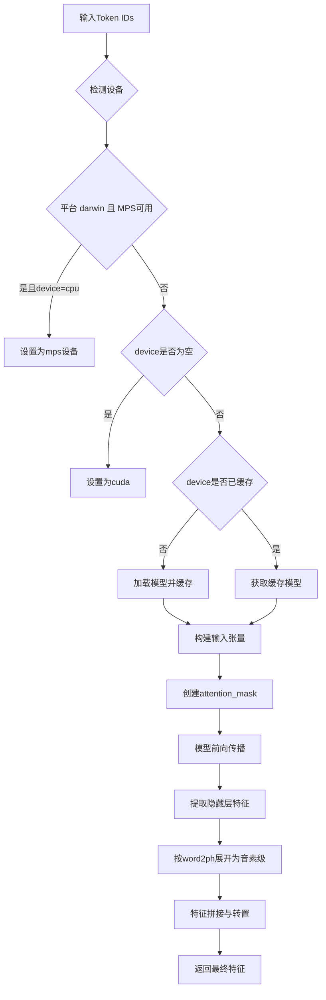
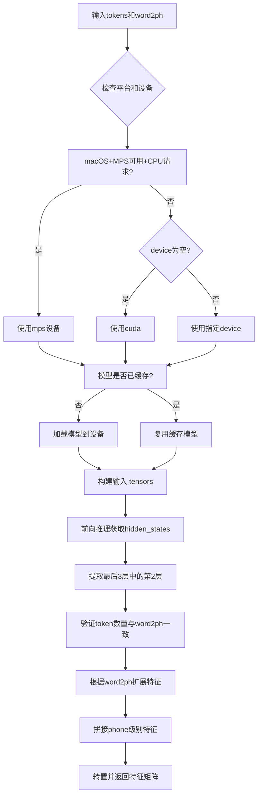

# `Bert-VITS2\oldVersion\V200\text\japanese_bert.py` 详细设计文档

该代码实现了一个日文BERT特征提取模块，用于语音合成任务。它加载本地预训练的DeBERTa-v2-large-japanese模型，将输入文本转换为token级别的隐藏状态特征，并进一步扩展为phone（音素）级别的特征向量，为后端的语音合成模型提供声学特征表示。

## 整体流程

```mermaid
graph TD
    A[开始] --> B[调用text2sep_kata处理文本]
    B --> C[使用tokenizer分词]
C --> D[将token转换为IDs]
    D --> E[添加特殊标记[CLS]和[SEP]]
    E --> F[调用get_bert_feature_with_token]
    F --> G{检查设备平台}
    G -->|darwin MPS| H[使用mps设备]
    G -->|其他| I{device参数}
    I -->|None| J[设置为cuda]
    I -->|有值| K[使用指定设备]
    J --> K
    K --> L{模型是否已缓存?]
    L -->|否| M[加载模型并缓存]
    L -->|是| N[获取缓存模型]
    M --> N
    N --> O[执行模型推理]
    O --> P[提取最后第3层隐藏状态]
    P --> Q[逐token扩展为phone级别]
    Q --> R[拼接特征并转置]
    R --> S[返回phone_level_feature]
```

## 类结构

```
模块文件 (bert_gen.py)
├── 全局变量
│   ├── LOCAL_PATH
│   ├── tokenizer
│   └── models
└── 全局函数
    ├── get_bert_feature
    └── get_bert_feature_with_token
```

## 全局变量及字段


### `LOCAL_PATH`
    
模型本地路径

类型：`str`
    


### `tokenizer`
    
分词器实例

类型：`AutoTokenizer`
    


### `models`
    
模型缓存字典，键为设备名，值为模型实例

类型：`dict`
    


    

## 全局函数及方法


### `get_bert_feature`

该函数是文本转BERT特征的入口函数，负责将输入文本分离、日语分词、添加特殊标记，并调用底层函数获取BERT隐藏层特征，最终返回音素级别的特征向量。

参数：

- `text`：`str`，待处理的输入文本
- `word2ph`：`list[int]` 或类似序列，表示每个字符对应的音素数量，用于将字符级特征映射到音素级特征
- `device`：`str`，计算设备，默认为 `config.bert_gen_config.device`

返回值：`torch.Tensor`，形状为 `(隐藏层维度, 音素总数)` 的特征矩阵，表示音素级别的BERT特征

#### 流程图

```mermaid
flowchart TD
    A[开始: get_bert_feature] --> B[调用text2sep_kata分离文本]
    B --> C[使用tokenizer对每段文本分词]
    C --> D[将tokens转换为token_ids]
    D --> E[添加[CLS]和[SEP]标记: 2和3]
    E --> F[调用get_bert_feature_with_token]
    
    F --> F1[检查设备: darwin+mps+cpu?]
    F1 -->|是| F2[设置device='mps']
    F1 -->|否| F3{device为空?}
    F3 -->|是| F4[设置device='cuda']
    F3 -->|否| F5[查找或加载模型到对应device]
    
    F4 --> F5
    F2 --> F5
    
    F5 --> F6[构建输入tensor: input_ids, token_type_ids, attention_mask]
    F5 --> F7[调用模型forward: output_hidden_states=True]
    F7 --> F8[拼接最后3层隐藏态的-3:-2层]
    F8 --> F9[移除batch维度并移到CPU]
    
    F9 --> F10{验证input_ids长度 == word2ph长度}
    F10 -->|失败| F11[抛出AssertionError]
    F10 -->|成功| F12[遍历每个字符的音素数量重复特征]
    
    F12 --> F13[拼接所有音素级特征]
    F13 --> F14[返回转置后的特征矩阵]
```

#### 带注释源码

```python
def get_bert_feature(text, word2ph, device=config.bert_gen_config.device):
    """
    文本转BERT特征的入口函数
    
    参数:
        text: 输入文本字符串
        word2ph: 每个字符对应的音素数量列表，用于特征映射
        device: 计算设备，默认为配置中的设备
    
    返回:
        音素级别的BERT特征张量
    """
    # Step 1: 调用japanese模块的text2sep_kata将文本分离为段落
    # 返回格式: (分离后的文本列表, 标点列表, 其它)
    sep_text, _, _ = text2sep_kata(text)
    
    # Step 2: 使用全局tokenizer对每段文本进行分词
    # 返回列表的列表: [['今', '天'], ['天', '气', '好']]
    sep_tokens = [tokenizer.tokenize(t) for t in sep_text]
    
    # Step 3: 将token转换为对应的ID
    sep_ids = [tokenizer.convert_tokens_to_ids(t) for t in sep_tokens]
    
    # Step 4: 添加特殊标记 [CLS]=2 和 [SEP]=3
    # 使用列表推导式将嵌套列表展平
    sep_ids = [2] + [item for sublist in sep_ids for item in sublist] + [3]
    
    # Step 5: 调用底层函数获取BERT特征
    return get_bert_feature_with_token(sep_ids, word2ph, device)
```


### `get_bert_feature_with_token`

该函数是核心特征提取函数，负责将输入的token IDs通过预训练的DeBERTa-v2-large-japanese模型提取深度语义特征，并根据word2ph映射将token级别的特征展开为音素级别的特征，最终返回音素级别的特征矩阵用于后续语音合成任务。

参数：

- `tokens`：`List[int]`，输入的token ID列表，通常包含BERT的特殊标记（如[CLS]=2, [SEP]=3）
- `word2ph`：`List[int]`，词到音素的映射列表，表示每个token需要重复的次数（用于将token级别特征展开为音素级别）
- `device`：`str`，计算设备，默认为`config.bert_gen_config.device`（支持cuda/cpu/mps）

返回值：`torch.Tensor`，形状为(特征维度, 音素总数)的转置特征矩阵，其中特征维度为模型隐藏层大小（1024维），音素总数由word2ph列表求和得到

#### 流程图

```mermaid
flowchart TD
    A[接收tokens, word2ph, device] --> B{检查平台和设备}
    B --> C{MPS可用且device为cpu?}
    C -->|是| D[设置device为mps]
    C -->|否| E{device为空?}
    D --> F
    E -->|是| G[设置device为cuda]
    E -->|否| F[保持原device]
    G --> F
    F --> H{device在models中?}
    H -->|否| I[加载模型并移动到device]
    H -->|是| J[复用已有模型]
    I --> J
    J --> K[准备输入张量: input_ids, token_type_ids, attention_mask]
    K --> L[前向传播: output_hidden_states=True]
    L --> M[提取最后3层中的第2层hidden_states]
    M --> N[遍历word2ph展开token特征]
    N --> O[按word2ph重复token特征]
    O --> P[拼接所有phone_level_feature]
    P --> Q[转置返回: (特征维度, 音素数)]
```

#### 带注释源码

```python
def get_bert_feature_with_token(tokens, word2ph, device=config.bert_gen_config.device):
    """
    从预训练DeBERTa模型提取特征并展开为音素级别特征
    
    Args:
        tokens: 输入的token ID列表
        word2ph: 词到音素数量的映射，用于特征展开
        device: 计算设备
    
    Returns:
        音素级别的特征矩阵 (特征维度, 音素总数)
    """
    
    # 平台和设备适配：检测macOS MPS加速
    if (
        sys.platform == "darwin"
        and torch.backends.mps.is_available()
        and device == "cpu"
    ):
        device = "mps"
    
    # 默认设备选择：优先使用CUDA
    if not device:
        device = "cuda"
    
    # 模型缓存：按设备缓存模型实例，避免重复加载
    if device not in models.keys():
        models[device] = AutoModelForMaskedLM.from_pretrained(LOCAL_PATH).to(device)
    
    # 推理模式：禁用梯度计算以节省显存和计算资源
    with torch.no_grad():
        # 输入预处理：将token列表转换为张量并添加batch维度
        inputs = torch.tensor(tokens).to(device).unsqueeze(0)
        
        # 构造attention_mask和token_type_ids（全1和全0）
        token_type_ids = torch.zeros_like(inputs).to(device)
        attention_mask = torch.ones_like(inputs).to(device)
        
        # 封装模型输入字典
        inputs = {
            "input_ids": inputs,
            "token_type_ids": token_type_ids,
            "attention_mask": attention_mask,
        }
        
        # 模型前向传播，获取所有hidden states
        res = models[device](**inputs, output_hidden_states=True)
        
        # 特征提取：取最后3层中的第2层（即倒数第2层）作为输出特征
        # 形状从 (1, seq_len, hidden_size) 变为 (seq_len, hidden_size)
        res = torch.cat(res["hidden_states[-3:-2]"], -1)[0].cpu()
    
    # 断言校验：确保输入序列长度与word2ph长度一致
    assert inputs["input_ids"].shape[-1] == len(word2ph)
    
    # 特征展开：将token级别特征按word2ph展开为音素级别
    word2phone = word2ph
    phone_level_feature = []
    
    # 遍历每个token，将其特征重复word2phone[i]次
    for i in range(len(word2phone)):
        # repeat_feature形状: (word2phone[i], hidden_size)
        repeat_feature = res[i].repeat(word2phone[i], 1)
        phone_level_feature.append(repeat_feature)
    
    # 特征拼接：按音素顺序拼接所有特征
    # 结果形状: (总音素数, hidden_size)
    phone_level_feature = torch.cat(phone_level_feature, dim=0)
    
    # 转置返回：转换为 (hidden_size, 总音素数) 以匹配后续处理逻辑
    return phone_level_feature.T
```

## 关键组件


### 代码概述

该代码是一个基于日语DeBERTa-v2-large模型的文本特征提取模块，主要功能是将输入文本转换为BERT隐藏层特征，并通过word2ph映射将词级别特征扩展到音素级别，支持CPU、CUDA和MPS多种设备加速。

### 文件整体运行流程

1. 初始化阶段：加载预训练分词器（tokenizer）和模型缓存字典
2. 文本输入：接收原始文本和词-音素映射表（word2ph）
3. 文本预处理：调用text2sep_kata进行日文分词处理
4. Token化：将文本转换为token IDs序列
5. 设备选择：根据系统平台和MPS可用性动态选择计算设备
6. 模型推理：加载或获取缓存的模型，执行前向传播获取隐藏层特征
7. 特征映射：将词级别特征按word2ph映射展开为音素级别特征
8. 输出：返回转置后的音素级别特征张量

### 全局变量

#### tokenizer
- **类型**: transformers.tokenization_utils_base.PreTrainedTokenizer
- **描述**: 预训练的日语DeBERTa分词器，用于文本到token的转换

#### models
- **类型**: dict
- **描述**: 模型缓存字典，按设备名称缓存已加载的BERT模型实例

#### LOCAL_PATH
- **类型**: str
- **描述**: 预训练模型文件本地路径（"./bert/deberta-v2-large-japanese"）

### 全局函数

#### get_bert_feature
- **参数**:
  - `text` (str): 输入的原始日语文本
  - `word2ph` (list[int]): 词到音素的映射数组，表示每个词对应的音素数量
  - `device` (str, optional): 计算设备，默认为config.bert_gen_config.device
- **返回值类型**: torch.Tensor
- **返回值描述**: 音素级别的BERT特征张量，形状为(特征维度, 音素总数)
- **mermaid流程图**: 
```mermaid
graph TD
    A[输入文本] --> B[text2sep_kata分词]
    B --> C[Token化]
    C --> D[转换为Token IDs]
    D --> E[添加特殊标记[SEP]]
    E --> F[调用get_bert_feature_with_token]
    F --> G[返回音素级特征]
```
- **源码**:
```python
def get_bert_feature(text, word2ph, device=config.bert_gen_config.device):
    sep_text, _, _ = text2sep_kata(text)
    sep_tokens = [tokenizer.tokenize(t) for t in sep_text]
    sep_ids = [tokenizer.convert_tokens_to_ids(t) for t in sep_tokens]
    sep_ids = [2] + [item for sublist in sep_ids for item in sublist] + [3]
    return get_bert_feature_with_token(sep_ids, word2ph, device)
```

#### get_bert_feature_with_token
- **参数**:
  - `tokens` (list[int]): 已转换好的token ID列表
  - `word2ph` (list[int]): 词到音素的映射数组
  - `device` (str, optional): 计算设备，默认为config.bert_gen_config.device
- **返回值类型**: torch.Tensor
- **返回值描述**: 音素级别的BERT特征张量，形状为(特征维度, 音素总数)
- **mermaid流程图**:

- **源码**:
```python
def get_bert_feature_with_token(tokens, word2ph, device=config.bert_gen_config.device):
    if (
        sys.platform == "darwin"
        and torch.backends.mps.is_available()
        and device == "cpu"
    ):
        device = "mps"
    if not device:
        device = "cuda"
    if device not in models.keys():
        models[device] = AutoModelForMaskedLM.from_pretrained(LOCAL_PATH).to(device)
    with torch.no_grad():
        inputs = torch.tensor(tokens).to(device).unsqueeze(0)
        token_type_ids = torch.zeros_like(inputs).to(device)
        attention_mask = torch.ones_like(input s).to(device)
        inputs = {
            "input_ids": inputs,
            "token_type_ids": token_type_ids,
            "attention_mask": attention_mask,
        }

        # for i in inputs:
        #     inputs[i] = inputs[i].to(device)
        res = models[device](**inputs, output_hidden_states=True)
        res = torch.cat(res["hidden_states"][-3:-2], -1)[0].cpu()
    assert inputs["input_ids"].shape[-1] == len(word2ph)
    word2phone = word2ph
    phone_level_feature = []
    for i in range(len(word2phone)):
        repeat_feature = res[i].repeat(word2phone[i], 1)
        phone_level_feature.append(repeat_feature)

    phone_level_feature = torch.cat(phone_level_feature, dim=0)

    return phone_level_feature.T
```

### 关键组件

#### 1. 张量索引与惰性加载
- 模型按需加载到不同设备，首次调用时实例化并缓存，避免内存浪费

#### 2. 反量化支持
- 使用`torch.no_grad()`上下文管理器禁用梯度计算，节省显存

#### 3. 量化策略
- 通过`output_hidden_states=True`获取隐藏层状态，减少不必要的输出

#### 4. 设备自适应
- 自动检测macOS平台和MPS加速，动态选择最优计算设备

#### 5. 词到音素特征映射
- 通过repeat操作将词级别特征展开为音素级别，保持对齐

### 潜在技术债务与优化空间

1. **模型缓存机制不完善**: 使用全局字典缓存模型，线程不安全，可能导致并发问题
2. **设备检测逻辑冗余**: 对MPS的检测仅在darwin平台执行，应统一设备管理模块
3. **硬编码路径**: LOCAL_PATH为硬编码路径，应移至配置文件中管理
4. **异常处理缺失**: 模型加载和推理过程缺乏try-except保护
5. **Token ID硬编码**: 使用数字2和3作为[SEP]标记，应使用tokenizer的bos_token_id和eos_token_id
6. **代码注释未清理**: 存在被注释掉的代码片段（# for i in inputs），应清理
7. **类型注解缺失**: 函数缺乏参数和返回值的类型注解，影响代码可维护性

### 其它项目

#### 设计目标与约束
- 目标：高效提取日语文本的BERT特征用于语音合成
- 约束：依赖transformers库和PyTorch，需支持多种计算设备

#### 错误处理与异常设计
- 使用assert验证token数量与word2ph长度匹配
- 模型加载失败时会导致整个程序崩溃，缺乏降级策略
- 设备不可用时未抛出明确异常

#### 数据流与状态机
- 数据流：文本 → 分词 → Token IDs → BERT编码 → 隐藏层提取 → 特征展开 → 输出
- 状态：模型缓存字典作为隐式状态，跨函数调用保持

#### 外部依赖与接口契约
- 依赖：transformers库、PyTorch、config模块、.japanese子模块
- 输入契约：text必须为字符串，word2ph必须为整数列表
- 输出契约：返回形状为(隐藏层维度, 音素总数)的torch.Tensor


## 问题及建议


### 已知问题

- 全局变量 `tokenizer` 在模块导入时即加载，缺乏懒加载和错误处理，若模型路径不存在会导致程序启动失败
- `models` 字典无上限管理，多设备场景下可能加载多个模型实例导致显存/内存溢出
- 设备选择逻辑存在隐式行为：当 `device="cpu"` 且系统为 macOS 且 MPS 可用时，会自动切换为 "mps"，可能与调用方预期不符
- `word2phone` 变量名与参数 `word2ph` 不一致，代码阅读时易产生困惑
- 存在未清理的注释代码 `# for i in inputs:...`，影响代码整洁度
- 缺乏对 `tokens` 长度与 `word2ph` 长度匹配的事前校验，仅在最后通过 assert 被动发现
- 模型加载无超时控制，无重试机制，网络问题或磁盘 IO 问题可能导致长时间阻塞
- 未使用类型注解（Type Hints），无法静态检查参数类型

### 优化建议

- 将 `tokenizer` 改为懒加载模式，或至少添加 try-except 捕获 `OSError` 并提供友好提示
- 在 `models` 字典中实现 LRU 缓存或最大数量限制，超出时卸载旧模型；或提供显式的模型缓存管理接口
- 明确设备选择逻辑：若需自动切换应在文档中说明，或提供配置项控制该行为
- 统一变量命名，建议统一使用 `word2ph`
- 删除废弃的注释代码
- 在函数入口处增加参数预校验，提前抛出明确的 ValueError
- 为模型加载添加超时参数和重试逻辑，提升健壮性
- 引入类型注解，使用 `typing` 模块标注参数和返回值类型
- 考虑将设备管理抽象为独立的 DeviceManager 类，统一处理设备发现、选择和模型分发逻辑

## 其它


### 一段话描述

该代码是一个日语BERT特征提取模块，基于DeBERTa-v2-large-japanese模型，将输入文本转换为phone级别的隐藏层特征，用于语音合成任务。

### 文件的整体运行流程

1. 模块初始化时加载tokenizer
2. 调用`get_bert_feature(text, word2ph, device)`函数
3. 通过`text2sep_kata`将文本转换为片假名分隔形式
4. 对每个分隔的文本进行tokenize和ID转换
5. 调用`get_bert_feature_with_token`处理token IDs
6. 根据平台选择设备（CPU/MPS/CUDA）
7. 加载或复用模型到对应设备
8. 执行前向推理获取hidden states
9. 根据word2ph映射将word级别特征扩展为phone级别特征
10. 返回转置后的phone级别特征矩阵

### 全局变量

### LOCAL_PATH

- 类型：str
- 描述：DeBERTa-v2-large-japanese预训练模型的本地路径

### tokenizer

- 类型：AutoTokenizer
- 描述：用于文本分词和ID转换的tokenizer实例

### models

- 类型：dict
- 描述：缓存不同设备上的模型实例，避免重复加载

### 全局函数

### get_bert_feature

- 参数：
  - text (str): 输入的日语文本
  - word2ph (list[int]): 每个word对应的phone数量列表
  - device (str, optional): 计算设备，默认为配置中的设备
- 返回值类型：torch.Tensor
- 返回值描述：phone级别的BERT特征矩阵，形状为(特征维度, phone总数)
- 流程图：mermaid
```mermaid
graph TD
    A[输入text和word2ph] --> B[调用text2sep_kata分隔文本]
    C[对每个分隔文本tokenize] --> D[转换为token IDs]
    D --> E[添加特殊标记[CLS]和[SEP]]
    E --> F[调用get_bert_feature_with_token]
    F --> G[返回phone级别特征]
```
- 源码：
```python
def get_bert_feature(text, word2ph, device=config.bert_gen_config.device):
    sep_text, _, _ = text2sep_kata(text)
    sep_tokens = [tokenizer.tokenize(t) for t in sep_text]
    sep_ids = [tokenizer.convert_tokens_to_ids(t) for t in sep_tokens]
    sep_ids = [2] + [item for sublist in sep_ids for item in sublist] + [3]
    return get_bert_feature_with_token(sep_ids, word2ph, device)
```

### get_bert_feature_with_token

- 参数：
  - tokens (list[int]): token IDs列表
  - word2ph (list[int]): 每个word对应的phone数量列表
  - device (str, optional): 计算设备，默认为配置中的设备
- 返回值类型：torch.Tensor
- 返回值描述：phone级别的BERT特征矩阵
- 流程图：mermaid

- 源码：
```python
def get_bert_feature_with_token(tokens, word2ph, device=config.bert_gen_config.device):
    if (
        sys.platform == "darwin"
        and torch.backends.mps.is_available()
        and device == "cpu"
    ):
        device = "mps"
    if not device:
        device = "cuda"
    if device not in models.keys():
        models[device] = AutoModelForMaskedLM.from_pretrained(LOCAL_PATH).to(device)
    with torch.no_grad():
        inputs = torch.tensor(tokens).to(device).unsqueeze(0)
        token_type_ids = torch.zeros_like(inputs).to(device)
        attention_mask = torch.ones_like(inputs).to(device)
        inputs = {
            "input_ids": inputs,
            "token_type_ids": token_type_ids,
            "attention_mask": attention_mask,
        }

        # for i in inputs:
        #     inputs[i] = inputs[i].to(device)
        res = models[device](**inputs, output_hidden_states=True)
        res = torch.cat(res["hidden_states"][-3:-2], -1)[0].cpu()
    assert inputs["input_ids"].shape[-1] == len(word2ph)
    word2phone = word2ph
    phone_level_feature = []
    for i in range(len(word2phone)):
        repeat_feature = res[i].repeat(word2phone[i], 1)
        phone_level_feature.append(repeat_feature)

    phone_level_feature = torch.cat(phone_level_feature, dim=0)

    return phone_level_feature.T
```

### 关键组件信息

### DeBERTa-v2-large-japanese模型

- 描述：大型日语预训练语言模型，用于生成高质量的文本表示特征

### text2sep_kata函数

- 描述：将日语文本转换为片假名并按词分隔的辅助函数

### 模型缓存机制

- 描述：基于设备的模型实例缓存，避免重复加载模型

### 设计目标与约束

- **主要目标**：为语音合成系统提供准确的text-to-phoneme特征映射
- **约束条件**：
  - 模型文件必须存在于LOCAL_PATH指定路径
  - 设备必须支持PyTorch计算
  - 输入的word2ph长度必须与tokenized后的序列长度匹配
  - 仅支持日语文本处理

### 错误处理与异常设计

- **断言检查**：验证输入token数量与word2ph长度一致，否则抛出AssertionError
- **设备兼容性**：自动检测并选择可用设备（MPS/CUDA/CPU），但当指定设备不可用时可能失败
- **模型加载失败**：如果LOCAL_PATH路径不正确或模型文件损坏，AutoModelForMaskedLM.from_pretrained将抛出异常
- **潜在问题**：
  - 缺少对tokenizer加载失败的异常处理
  - 缺少对MPS/CUDA不可用时的明确错误提示
  - 缺少对空输入或无效输入的校验

### 数据流与状态机

- **输入数据流**：
  - 原始文本(text) → text2sep_kata处理 → 分隔的片假名文本
  - word2ph映射表 → 用于特征扩展
- **处理状态**：
  - 状态1：模型加载/缓存检查
  - 状态2：Tokenization处理
  - 状态3：模型推理
  - 状态4：特征扩展与拼接
- **输出数据流**：
  - phone级别特征矩阵 → 传递至后续语音合成模块

### 外部依赖与接口契约

- **必需依赖**：
  - torch >= 1.0
  - transformers >= 4.0
  - config模块（项目内部）
  - .japanese模块（项目内部）
- **接口契约**：
  - get_bert_feature(text: str, word2ph: List[int], device: Optional[str]) -> torch.Tensor
  - get_bert_feature_with_token(tokens: List[int], word2ph: List[int], device: Optional[str]) -> torch.Tensor
- **兼容性要求**：
  - transformers库的AutoModelForMaskedLM和AutoTokenizer接口
  - PyTorch张量操作兼容

### 性能考虑

- **模型缓存**：避免重复加载模型，提高多次调用性能
- **推理优化**：使用torch.no_grad()禁用梯度计算，减少内存占用
- **设备选择**：优先使用GPU/MPS加速推理
- **批量处理**：当前仅支持单样本处理，可考虑增加批量处理能力
- **内存管理**：特征矩阵可能在内存中累积，需要关注大规模调用时的内存使用

### 资源配置

- **GPU内存**：DeBERTa-v2-large模型约800MB，推理时需考虑额外显存
- **磁盘空间**：模型文件约2-3GB
- **设备管理**：多设备场景下需要合理管理模型实例缓存

### 安全性考虑

- **模型路径安全**：LOCAL_PATH为硬编码路径，存在路径注入风险
- **设备安全**：自动设备选择可能带来预期外的资源竞争
- **建议**：添加路径验证和设备可用性检查

### 测试考虑

- **单元测试**：需测试tokenizer加载、tokenize流程、特征输出维度
- **集成测试**：需测试完整的text到feature流程
- **边界测试**：
  - 空文本输入
  - 极长文本输入
  - word2ph长度不匹配情况
  - 设备不可用情况

### 部署考虑

- **模型部署**：模型文件需随项目部署
- **依赖管理**：确保transformers版本兼容性
- **环境配置**：需配置正确的PYTHONPATH以导入config和japanese模块

### 监控和日志

- **当前状态**：无日志记录
- **建议添加**：
  - 模型加载日志
  - 设备选择日志
  - 推理时间监控
  - 内存使用监控

### 潜在的技术债务或优化空间

1. **硬编码路径**：LOCAL_PATH硬编码，建议改为配置项
2. **设备自动选择逻辑**：当前逻辑仅在device=="cpu"时考虑MPS，应更灵活
3. **缺少缓存清理机制**：models字典会持续增长，缺乏清理机制
4. **重复token处理**：代码中sep_ids的处理方式可能导致某些边界情况下的重复token
5. **注释代码**：存在被注释的设备转移代码，需清理
6. **缺乏输入验证**：没有对text和word2ph的有效性进行充分验证
7. **错误处理不足**：缺乏对常见异常情况的try-except包装
8. **特征层选择固定**：hidden_states[-3:-2]层选择硬编码，应考虑参数化
9. **性能监控缺失**：无推理性能监控
10. **类型注解缺失**：函数缺乏完整的类型注解，影响代码可维护性

### 其它项目

- **版本兼容性**：需确认transformers版本与模型兼容性
- **多语言支持**：当前仅支持日语，扩展性有限
- **配置管理**：依赖外部config模块，耦合度较高
- **错误恢复**：缺乏重试机制和降级策略


    